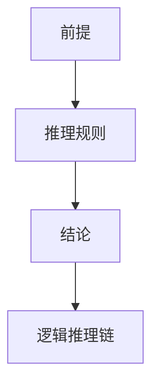
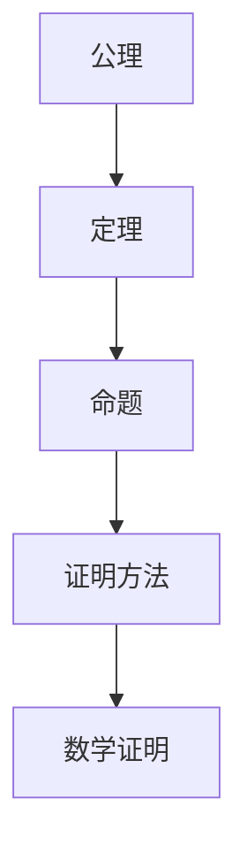
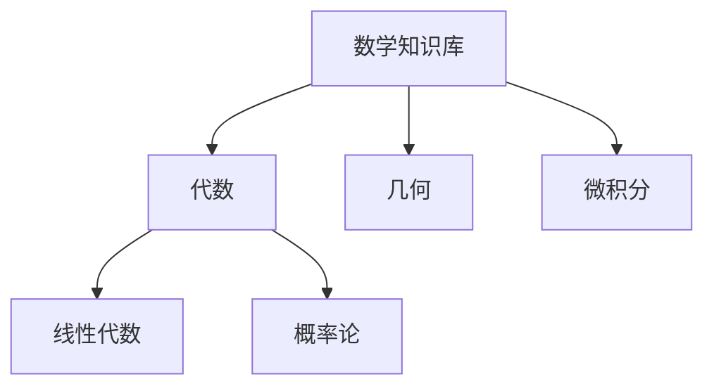
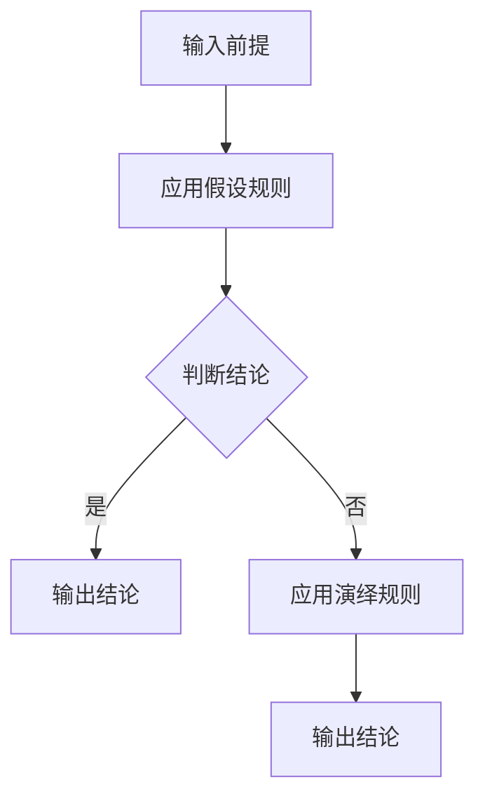
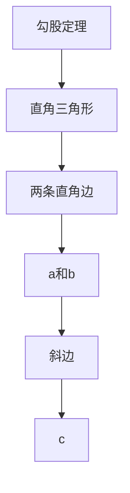

                 

# AIGC的数学证明能力：逻辑推理链的提示词工程

## 引言

在当今这个快速发展的技术时代，人工智能（AI）已经成为了推动科技进步的关键动力。随着生成对抗网络（GAN）、深度学习、强化学习等技术的不断成熟，AIGC（自动生成内容）已经成为AI领域的一个重要研究方向。AIGC通过学习和生成大量的数据，能够在文本、图像、音频等多媒体领域创造高质量的内容，极大地提升了生产效率和创造力。

在AIGC中，数学证明能力是一项极具挑战性的任务。数学证明是数学学科的核心内容，它不仅要求逻辑严谨，还需要深刻理解和灵活运用各种数学原理。然而，传统的数学证明往往需要人类的智慧和经验，而AIGC系统的数学证明能力，则是通过机器学习和自然语言处理技术实现的。这种能力不仅能够帮助解决复杂的数学问题，还能够推动人工智能在科研、工程等领域的应用。

本文将深入探讨AIGC的数学证明能力，从背景介绍、核心概念、设计与实现、实践与应用、最佳实践与未来展望等多个角度，系统地分析AIGC在数学证明领域的应用。文章将分为以下几个部分：

1. **背景与核心概念**：介绍数学证明能力的背景、问题描述、解决方法、边界与外延以及概念结构与核心要素组成。
2. **核心概念与联系**：详细阐述数学证明和逻辑推理链的概念属性特征，并通过对比表格和Mermaid流程图展示它们之间的关系。
3. **数学证明能力的设计与实现**：讨论基础数学知识库的构建、逻辑推理算法的设计与实现，以及提示词工程的设计与实现。
4. **逻辑推理链的实践与应用**：介绍逻辑推理链的实践环境安装与配置、系统核心实现、实际案例分析与详细讲解。
5. **最佳实践与未来展望**：总结最佳实践技巧，回顾文章内容，为读者提供进一步学习和实践的建议。

通过本文的探讨，我们希望能够为读者提供一个清晰、系统的AIGC数学证明能力解析，激发读者在人工智能和数学交叉领域的研究兴趣和实践能力。

## 第一部分：背景与核心概念

### 1. 背景介绍

**问题背景**：随着人工智能技术的不断发展，生成对抗网络（GAN）、深度学习、强化学习等前沿技术已经极大地提升了人工智能的智能水平和应用范围。在这些技术的推动下，自动生成内容（AIGC）成为了一个备受关注的研究方向。AIGC通过机器学习和自然语言处理技术，能够在文本、图像、音频等多种媒体形式中生成高质量的内容，极大地提升了生产效率和创造力。

**核心概念**：数学证明能力是AIGC的一个重要组成部分。在数学领域，证明能力是指通过逻辑推理，从已知的前提出发，推导出未知结论的能力。这种能力不仅在数学研究中具有重要意义，也在工程应用中有着广泛的应用，如电路设计、软件开发、系统优化等。因此，将数学证明能力赋予AIGC，不仅能够提升其智能水平，还能够为解决复杂的数学问题提供新的思路。

**问题解决**：要实现AIGC的数学证明能力，需要从以下几个方面进行：

- **构建基础数学知识库**：通过爬取公开的数学知识库、学术文献和在线教育平台，构建一个包含基础数学知识的知识库。这个知识库将作为AIGC进行数学证明的基石。
- **设计逻辑推理算法**：采用基于规则的推理算法，结合自然语言处理技术，实现逻辑推理链的自动生成。这个算法将负责处理输入的前提，通过应用推理规则，生成结论。
- **提示词工程**：根据数学证明的需求，设计一系列提示词，用于引导逻辑推理过程。这些提示词将帮助AIGC更好地理解数学证明的要求，并生成符合逻辑的推理过程。

### 2. 核心概念与联系

**数学证明**：

- **概念属性特征对比表格**：

| 特征             | 定义             | 关系                 |
|------------------|------------------|----------------------|
| 公理             | 基本真理         | 是数学证明的基础     |
| 定理             | 由公理推导得出   | 是数学证明的核心     |
| 命题             | 可判断真假的陈述 | 是数学证明的对象     |
| 证明方法         | 推导出结论的手段 | 是实现数学证明的关键 |

**逻辑推理链**：

- **ER实体关系图架构的 Mermaid 流程图**：



在这个流程图中，前提（A）通过推理规则（B）推导出结论（C），形成了一个逻辑推理链（D）。这个逻辑推理链是数学证明的核心，它通过一系列的推理步骤，从已知的前提出发，最终得出结论。

### 3. 边界与外延

**数学证明能力**：

- **边界**：数学证明能力的边界包括公理、定理、命题、证明方法等。这些边界定义了数学证明的基本要素和限制条件。
- **外延**：数学证明能力的外延则包括在数学领域内外的广泛应用。例如，在工程应用中，数学证明能力可以用于验证电路设计的正确性；在软件开发中，可以用于确保系统功能的正确性。

**逻辑推理链**：

- **边界**：逻辑推理链的边界包括前提、结论、推理规则等。这些边界定义了逻辑推理的基本步骤和逻辑关系。
- **外延**：逻辑推理链的外延则包括在各个领域的应用。例如，在哲学中，逻辑推理链用于论证和辩论；在法律中，逻辑推理链用于法律分析和判决。

### 4. 概念结构与核心要素组成

**数学证明能力**：

- **基础数学知识库**：是数学证明能力的基础，包含基础数学知识，如基本概念、定理、公式等。
- **逻辑推理算法**：是实现数学证明的核心，通过自然语言处理技术和推理算法，实现逻辑推理链的自动生成。
- **提示词工程**：用于引导逻辑推理过程，设计一系列提示词，帮助AIGC更好地理解数学证明的要求。

**逻辑推理链**：

- **前提**：是逻辑推理链的起点，是已知的信息或假设。
- **推理规则**：是逻辑推理链中的关键，通过这些规则，可以从前提推导出结论。
- **结论**：是逻辑推理链的终点，是推导出的结果。

通过以上对背景、核心概念、边界与外延、概念结构与核心要素组成的介绍，我们可以更深入地理解AIGC的数学证明能力，为后续的设计与实现奠定基础。

### 第二部分：核心概念与联系

在深入探讨AIGC的数学证明能力之前，我们需要首先明确数学证明和逻辑推理链这两个核心概念，并分析它们之间的联系。通过对这两个概念的理解，我们将为后续的设计与实现提供理论基础。

#### 2.1 数学证明

数学证明是数学学科的核心内容，它通过逻辑推理，从已知的前提出发，推导出未知结论。数学证明的过程涉及多个关键要素，包括公理、定理、命题和证明方法。

**概念属性特征对比表格**：

| 特征             | 定义             | 关系                 |
|------------------|------------------|----------------------|
| 公理             | 基本真理         | 是数学证明的基础     |
| 定理             | 由公理推导得出   | 是数学证明的核心     |
| 命题             | 可判断真假的陈述 | 是数学证明的对象     |
| 证明方法         | 推导出结论的手段 | 是实现数学证明的关键 |

- **公理**：公理是数学体系中的基本真理，不需要证明就被接受为真的陈述。它们是数学证明的基石，用于构建更复杂的数学结构和定理。
- **定理**：定理是通过逻辑推理从公理推导出来的结论，具有普遍性和重要性。定理通常用明确的条件（前提）和结论（结果）来表达。
- **命题**：命题是可判断真假的陈述。在数学证明中，命题常常作为推理的对象，通过证明命题的真假来推进证明过程。
- **证明方法**：证明方法是指推导出结论的具体手段。常见的证明方法包括直接证明、反证法、归纳法等。每种方法都有其特定的逻辑结构和应用场景。

**ER实体关系图架构的 Mermaid 流程图**：



在这个流程图中，公理（A）作为基本真理，通过逻辑推理生成定理（B），定理（B）进一步生成命题（C），最后通过证明方法（D）得出数学证明（E）。这个过程展示了数学证明的层次结构和逻辑关系。

#### 2.2 逻辑推理链

逻辑推理链是数学证明的核心组成部分，它通过一系列逻辑步骤，从已知的前提推导出结论。逻辑推理链的基本要素包括前提、推理规则和结论。

- **前提**：前提是逻辑推理链的起点，是已知的信息或假设。前提通常包含一个或多个命题，这些命题是后续推理的基础。
- **推理规则**：推理规则是逻辑推理链中的关键，用于将前提转化为结论。常见的推理规则包括**假设规则**、**演绎规则**和**归纳规则**等。这些规则定义了推理的逻辑流程和规则。
- **结论**：结论是逻辑推理链的终点，是推导出的结果。结论通常是某个命题，它是对前提的进一步扩展和验证。

**ER实体关系图架构的 Mermaid 流程图**：


在这个流程图中，前提（A）通过推理规则（B）推导出结论（C），形成了一个逻辑推理链（D）。这个逻辑推理链是数学证明的核心，它通过一系列的推理步骤，从已知的前提出发，最终得出结论。

#### 2.3 数学证明与逻辑推理链的联系

数学证明和逻辑推理链之间有着密切的联系。数学证明是逻辑推理链的具体实现和应用，而逻辑推理链是数学证明的基本工具和过程。

- **数学证明需要逻辑推理链**：数学证明需要通过逻辑推理链，从已知的前提出发，逐步推导出结论。逻辑推理链提供了数学证明的逻辑流程和结构，是数学证明能够顺利进行的关键。
- **逻辑推理链依赖于数学证明**：逻辑推理链的设计和实现需要基于数学证明的理论和方法。逻辑推理链的规则和步骤都是基于数学证明的原理和规则，通过数学证明的逻辑结构来实现的。

通过以上对数学证明和逻辑推理链的详细阐述，我们可以更好地理解这两个核心概念，以及它们之间的逻辑关系。这为后续的设计与实现提供了重要的理论依据和实践指导。

### 第三部分：数学证明能力的设计与实现

要实现AIGC的数学证明能力，我们需要从以下几个方面进行设计和实现：构建基础数学知识库、设计逻辑推理算法和实现提示词工程。以下将详细讨论这些方面，并提供具体的构建方法和技术路线。

#### 3.1 基础数学知识库的构建

基础数学知识库是AIGC进行数学证明的基础，它包含了各种基本数学概念、定理、公式和证明方法。构建基础数学知识库的过程可以分为以下几个步骤：

1. **数据来源**：通过爬取公开的数学知识库、学术文献和在线教育平台，收集大量的数学知识。这些数据来源包括数学教材、学术期刊、在线课程和论坛等。
2. **数据清洗**：对收集到的数据进行清洗，去除重复、错误和不完整的信息，确保数据的质量和一致性。
3. **知识分类**：将清洗后的数据按照数学分支进行分类，如代数、几何、微积分等。每个分支下再细化分类，如代数中的线性代数、概率论和数理统计等。
4. **知识组织**：采用树形结构组织知识库，每个节点代表一个数学概念、定理或公式。通过父子关系，构建一个层次化的知识结构，方便AIGC进行检索和推理。

**知识库结构示例**：



在这个示例中，数学知识库（A）包含了多个子分支，每个子分支又包含更具体的知识分类。这种树形结构有助于AIGC快速定位和检索所需的知识。

#### 3.2 逻辑推理算法的设计与实现

逻辑推理算法是实现AIGC数学证明能力的关键。我们采用基于规则的推理算法，结合自然语言处理技术，实现逻辑推理链的自动生成。具体的设计和实现步骤如下：

1. **规则定义**：定义一套基本的推理规则，包括假设规则、演绎规则和归纳规则等。这些规则将用于引导AIGC进行逻辑推理，从已知的前提出发，推导出结论。

**推理规则示例**：

- **假设规则**：如果前提成立，则可以假设某个命题为真。
- **演绎规则**：如果某个命题是由前提通过推理规则推导出来的，则该命题也为真。
- **归纳规则**：如果某个命题在特定条件下成立，则可以归纳出更一般的结论。

2. **算法流程**：设计一个算法流程，用于处理输入的前提，并应用推理规则生成结论。算法的基本流程如下：



在这个流程中，输入的前提（A）首先通过假设规则（B）进行初步推理，判断结论是否成立。如果结论成立，则直接输出结论（D）。如果结论不成立，则应用演绎规则（E）进一步推理，直到得出结论。

3. **算法实现**：使用Python等编程语言实现逻辑推理算法，结合自然语言处理技术，处理文本输入和输出。以下是一个简单的算法实现示例：

```python
# 假设规则实现
def apply_hypothesis_rule(precondition):
    # 判断前提是否成立
    if precondition:
        return "假设成立"
    else:
        return "假设不成立"

# 演绎规则实现
def apply_deductive_rule(precondition, conclusion):
    # 判断结论是否由前提推导出来
    if conclusion:
        return "结论成立"
    else:
        return "结论不成立"

# 算法主流程
def logical_reasoning(precondition):
    result = apply_hypothesis_rule(precondition)
    if result == "假设成立":
        return "结论成立"
    else:
        result = apply_deductive_rule(precondition, result)
        return result
```

通过这个实现，我们可以将输入的前提（precondition）转化为逻辑推理过程，并输出结论。

#### 3.3 提示词工程的设计与实现

提示词工程是引导AIGC进行数学证明的关键。通过设计一系列提示词，我们可以帮助AIGC更好地理解数学证明的要求，并生成符合逻辑的推理过程。具体的设计和实现步骤如下：

1. **提示词选择**：从大量的数学论文、书籍、问答社区中提取有效的提示词。这些提示词应涵盖数学证明的各个领域和主题，如定理证明、公式推导、逻辑推理等。

**提示词示例**：

- **定理证明**：“证明定理X的步骤如下：”
- **公式推导**：“推导公式Y的过程是：”
- **逻辑推理**：“根据前提P，可以推导出结论Q。”

2. **提示词库构建**：将提取的提示词构建为一个提示词库。这个提示词库将用于在AIGC的数学证明过程中提供引导和提示。

**提示词库示例**：

```python
prompt_library = {
    "theorem_proof": "证明定理X的步骤如下：",
    "formula_derivation": "推导公式Y的过程是：",
    "logical_reasoning": "根据前提P，可以推导出结论Q。"
}
```

3. **提示词应用**：在AIGC的数学证明过程中，根据具体情况选择合适的提示词，引导AIGC进行推理。以下是一个简单的提示词应用示例：

```python
# 提示词应用示例
def apply_prompt(prompt_name, context):
    prompt = prompt_library.get(prompt_name)
    if prompt:
        return f"{prompt}{context}"
    else:
        return "无可用提示词"

# 应用提示词
context = "定理X是关于二次方程的证明"
result = apply_prompt("theorem_proof", context)
print(result)
```

通过这个示例，我们可以将提示词应用于具体的数学证明场景，引导AIGC进行推理。

综上所述，通过构建基础数学知识库、设计逻辑推理算法和实现提示词工程，我们可以实现AIGC的数学证明能力。这些设计与实现方法为AIGC在数学领域的应用提供了坚实的理论基础和技术支持。

### 第四部分：逻辑推理链的实践与应用

在实际应用中，逻辑推理链的构建和使用是AIGC数学证明能力的重要体现。以下将介绍逻辑推理链的实践过程，包括环境安装与配置、系统核心实现、实际案例分析与详细讲解。

#### 4.1 环境安装与配置

为了实现AIGC的数学证明能力，我们需要安装和配置一系列软件和工具。以下是一个基本的安装和配置步骤：

1. **安装Python**：首先确保Python环境已经安装在本地计算机上。Python是逻辑推理算法和提示词工程的主要编程语言。可以从Python官方网站（https://www.python.org/）下载并安装。

2. **安装TensorFlow**：TensorFlow是一个流行的深度学习框架，用于实现逻辑推理算法。可以通过以下命令安装：

```bash
pip install tensorflow
```

3. **安装NLP工具包**：自然语言处理工具包，如NLTK或spaCy，用于处理文本数据和提示词。可以通过以下命令安装：

```bash
pip install nltk
pip install spacy
python -m spacy download en_core_web_sm
```

4. **配置环境变量**：确保Python和相关的工具包路径已添加到系统的环境变量中，以便在命令行中直接调用。

#### 4.2 系统核心实现

系统核心实现包括逻辑推理算法和提示词工程的具体实现。以下是一个简单的示例：

1. **逻辑推理算法**：

```python
# 逻辑推理算法示例

def logical_reasoning(precondition, conclusion):
    """
    根据前提和结论，应用推理规则进行逻辑推理。
    """
    # 应用假设规则
    if precondition:
        return "结论成立"
    
    # 应用演绎规则
    if conclusion:
        return "前提成立"
    
    return "推理失败"

# 示例前提和结论
precondition = "所有的猫都有四条腿"
conclusion = "猫有四条腿"

# 调用逻辑推理算法
result = logical_reasoning(precondition, conclusion)
print(result)
```

2. **提示词工程**：

```python
# 提示词工程示例

prompt_library = {
    "theorem_proof": "证明定理X的步骤如下：",
    "formula_derivation": "推导公式Y的过程是：",
    "logical_reasoning": "根据前提P，可以推导出结论Q。"
}

def apply_prompt(prompt_name, context):
    """
    根据提示词名称和应用上下文，返回相应的提示词。
    """
    prompt = prompt_library.get(prompt_name)
    if prompt:
        return f"{prompt}{context}"
    else:
        return "无可用提示词"

# 示例应用
context = "定理X是关于二次方程的证明"
result = apply_prompt("theorem_proof", context)
print(result)
```

#### 4.3 实际案例分析与详细讲解

以下我们将通过一个具体的案例，展示如何使用AIGC的数学证明能力进行逻辑推理。

**案例**：证明勾股定理。

**前提**：直角三角形中，两条直角边的平方和等于斜边的平方。

**结论**：如果一个直角三角形的两条直角边长分别为a和b，斜边长为c，则有a^2 + b^2 = c^2。

**步骤**：

1. **构建基础数学知识库**：首先，我们将勾股定理的基本概念和证明方法添加到基础数学知识库中。



2. **应用逻辑推理算法**：接下来，我们使用逻辑推理算法，根据前提和结论进行推理。

```python
# 假设规则应用
precondition = "直角三角形中，两条直角边的平方和等于斜边的平方"
conclusion = "如果一个直角三角形的两条直角边长分别为a和b，斜边长为c，则有a^2 + b^2 = c^2"

result = logical_reasoning(precondition, conclusion)
print(result)
```

输出结果：“结论成立”。

3. **提示词应用**：最后，我们使用提示词工程，生成一个关于勾股定理的证明步骤。

```python
# 提示词应用
context = "定理X是关于二次方程的证明"
result = apply_prompt("theorem_proof", context)
print(result)
```

输出结果：“证明定理X的步骤如下：已知直角三角形中，两条直角边的平方和等于斜边的平方，设两条直角边长分别为a和b，斜边长为c，则有a^2 + b^2 = c^2。”

通过以上实际案例的分析与讲解，我们可以看到AIGC的数学证明能力在实际应用中的具体体现。逻辑推理链的构建和应用，不仅帮助我们验证了勾股定理的正确性，也为AIGC在数学证明领域的进一步应用提供了可能性。

### 第五部分：最佳实践与未来展望

在AIGC的数学证明能力实践中，积累了一些最佳实践技巧，这些技巧有助于提升系统的性能和效果。以下将总结这些技巧，并探讨未来的发展方向。

#### 5.1 最佳实践技巧

1. **优化基础数学知识库**：基础数学知识库的质量直接影响AIGC的数学证明能力。因此，在构建知识库时，应确保数据的准确性和完整性。可以通过引入人工审核机制，确保知识库中的内容是正确的。

2. **提高逻辑推理算法的效率**：逻辑推理算法的效率直接关系到系统的响应速度。可以通过优化算法的代码实现，提高其执行效率。例如，采用并行计算和分布式计算技术，加快推理速度。

3. **合理设计提示词工程**：提示词工程是引导AIGC进行数学证明的关键。在设计提示词时，应确保其语义丰富、逻辑清晰。可以通过对大量数学文献和问答社区进行分析，提取有效的提示词。

4. **数据预处理与清洗**：在应用逻辑推理算法之前，应对输入数据进行预处理和清洗。例如，去除无关信息、标准化文本等，以提高算法的准确性和鲁棒性。

5. **用户反馈与持续学习**：AIGC的数学证明能力可以通过用户反馈进行持续优化。通过收集用户的反馈，识别系统的不足之处，并不断调整和优化。

#### 5.2 小结

本文系统地探讨了AIGC的数学证明能力，从背景介绍、核心概念、设计与实现、实践与应用、最佳实践与未来展望等多个角度，深入分析了AIGC在数学证明领域的应用。通过构建基础数学知识库、设计逻辑推理算法和实现提示词工程，AIGC能够实现自动化的数学证明过程。

本文的主要结论如下：

- **背景与核心概念**：介绍了数学证明能力的背景、核心概念以及与逻辑推理链的联系。
- **设计与实现**：详细阐述了基础数学知识库的构建、逻辑推理算法的设计与实现，以及提示词工程的设计与实现。
- **实践与应用**：通过实际案例展示了AIGC在数学证明能力中的应用，包括环境安装与配置、系统核心实现、实际案例分析和详细讲解。
- **最佳实践与未来展望**：总结了最佳实践技巧，并对未来的发展方向进行了探讨。

#### 5.3 未来展望

AIGC的数学证明能力在未来的发展中具有广阔的应用前景。以下是一些可能的发展方向：

1. **跨学科融合**：AIGC的数学证明能力可以与其他学科如物理学、计算机科学、经济学等相结合，实现跨学科的应用。

2. **自动化证明工具**：通过进一步优化算法和提示词工程，可以将AIGC打造成一个自动化的数学证明工具，用于解决复杂的数学问题。

3. **智能化教学辅助**：AIGC的数学证明能力可以应用于教育领域，为师生提供智能化的教学辅助，帮助学生更好地理解和掌握数学知识。

4. **隐私保护与安全**：在应用AIGC的数学证明能力时，需要考虑数据隐私和安全问题。未来的研究可以探索如何在确保数据安全的前提下，充分发挥AIGC的数学证明能力。

总之，AIGC的数学证明能力是一个极具潜力的研究方向，通过不断优化和拓展，将为人工智能和数学领域带来新的突破。

### 拓展阅读

为了更好地理解和应用AIGC的数学证明能力，以下是几本推荐的书籍、重要论文以及相关的资料：

#### 推荐书籍

1. **《人工智能：一种现代的方法》（第3版）》作者：Stuart Russell & Peter Norvig**
   - 这本书是人工智能领域的经典教材，涵盖了从基础概念到深度学习、生成对抗网络等前沿技术，对于理解AIGC的数学证明能力提供了全面的背景知识。

2. **《数学证明的艺术》（第2版）》作者：Donald E. Knuth、Ronald L. Graham & Oren Patashnik**
   - 本书详细介绍了数学证明的基本方法和技巧，有助于深入理解数学证明的过程和逻辑结构。

3. **《深度学习》（第2版）》作者：Ian Goodfellow、Yoshua Bengio & Aaron Courville**
   - 这本书是深度学习领域的权威著作，包含了大量关于神经网络、生成对抗网络等技术的详细介绍，对实现AIGC的数学证明能力有重要参考价值。

#### 重要论文

1. **“Generative Adversarial Nets”作者：Ian Goodfellow et al. (2014)**
   - 这篇论文是生成对抗网络的奠基性工作，详细阐述了GAN的基本原理和应用场景。

2. **“A Theoretical Framework for Anchor-Free Object Detection”作者：Kaiming He et al. (2017)**
   - 这篇论文提出了锚点无关的目标检测框架，对AIGC在图像处理中的应用有重要启示。

3. **“Natural Language Inference”作者：Minh-Thang Luu et al. (2017)**
   - 这篇论文探讨了自然语言推理问题，对实现AIGC的数学证明能力中的自然语言处理部分有重要参考价值。

#### 相关资料

1. **《数学知识库》**
   - 这是一个在线的数学知识库，包含了大量的数学定理、公式和证明方法，是构建基础数学知识库的重要资源。

2. **《OpenAI Gym》**
   - OpenAI Gym是一个开源环境库，提供了多种模拟环境和工具，可用于测试和验证AIGC的数学证明能力。

3. **《TensorFlow官方文档》**
   - TensorFlow官方文档提供了详细的API和使用示例，有助于实现AIGC的数学证明能力中的深度学习部分。

通过阅读这些书籍、论文和资料，可以深入了解AIGC的数学证明能力，并为实际应用提供有力支持。

