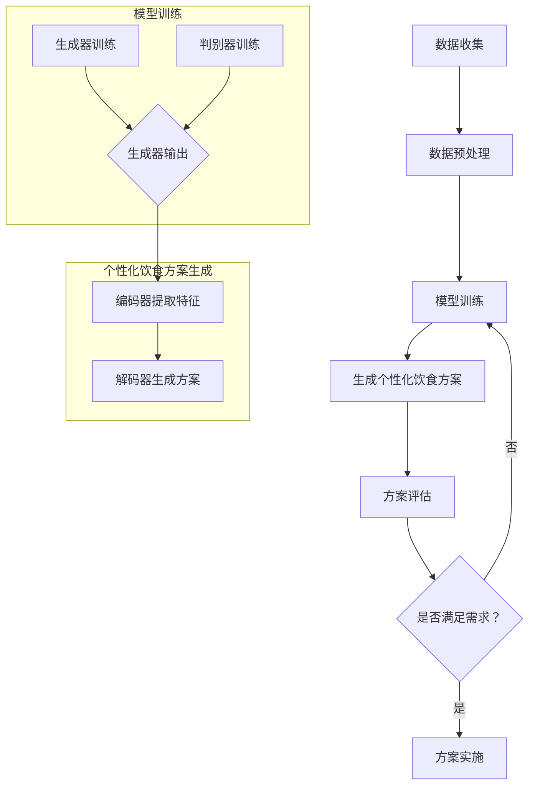
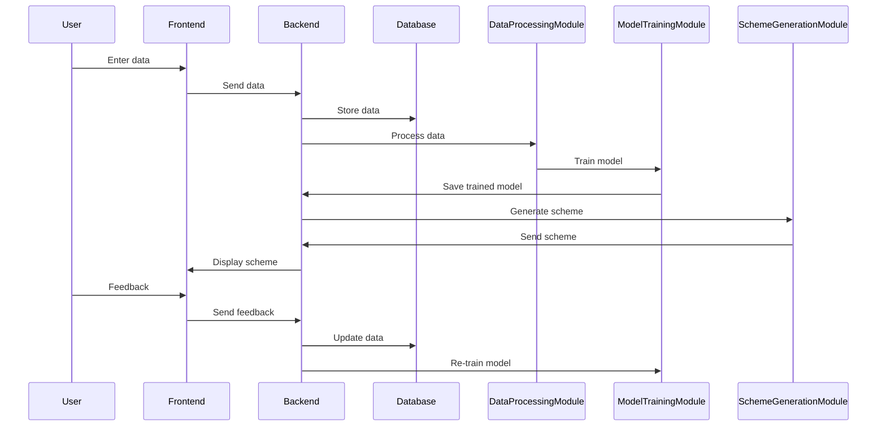

                 

## 《AIGC的未来个性化营养方案：基因-饮食交互作用的提示词工程》

### 关键词

- **AIGC**、**个性化营养方案**、**基因-饮食交互作用**、**提示词工程**、**机器学习**、**深度学习**、**数学模型**、**系统架构设计**

### 摘要

本文深入探讨了AIGC（自适应智能生成控制）在未来个性化营养方案中的应用，特别是基因-饮食交互作用的重要性。通过介绍AIGC的基本概念、个性化营养方案的需求背景，以及基因-饮食交互作用的基本原理，本文揭示了如何利用提示词工程来构建一个高效的个性化营养系统。文章详细解析了AIGC的算法原理，并使用mermaid和LaTeX格式展示了相关的数学模型和流程图。随后，文章介绍了AIGC系统分析与架构设计方案，并通过实际项目案例展示了系统的实现与应用。最后，文章总结了最佳实践、注意事项和进一步阅读的建议，为读者提供了全面的指导。

### 设计思路

设计《AIGC的未来个性化营养方案：基因-饮食交互作用的提示词工程》的目录大纲，我们需要确保内容的完整性、逻辑性以及技术性。以下是设计步骤：

1. **背景介绍**：首先介绍AIGC、个性化营养方案、基因-饮食交互作用等核心概念，让读者对这些概念有一个基本的了解。

2. **核心概念与联系**：定义AIGC、个性化营养方案和基因-饮食交互作用的原理，通过对比表格和ER实体关系图展示它们之间的关系。

3. **算法原理讲解**：详细讲解AIGC的技术原理，包括机器学习、深度学习等方面的内容，并通过mermaid流程图展示算法流程。

4. **数学模型和数学公式**：在讲解算法时，使用LaTeX格式展示相关的数学模型和公式，并进行详细讲解和举例说明。

5. **系统分析与架构设计方案**：介绍AIGC系统分析与架构设计方案，包括问题场景介绍、系统功能设计、系统架构设计、系统接口设计和系统交互。

6. **项目实战**：展示一个实际的项目案例，包括环境安装、系统核心实现、代码应用解读、案例分析和项目小结。

7. **最佳实践 tips**、**小结**、**注意事项**、**拓展阅读**等内容：总结全书要点，给出实践建议和进一步阅读的方向。

### 目录大纲设计

以下是本书的详细目录大纲：

```markdown
# 《AIGC的未来个性化营养方案：基因-饮食交互作用的提示词工程》目录大纲

## 第一部分：背景介绍与核心概念

### 第1章：AIGC与个性化营养方案概述
- 1.1 AIGC的概念与发展历程
- 1.2 个性化营养方案的意义与需求
- 1.3 基因-饮食交互作用的基本原理

### 第2章：核心概念与联系
- 2.1 AIGC的核心技术原理
- 2.2 个性化营养方案的构成要素
- 2.3 基因-饮食交互作用的ER实体关系图

## 第二部分：算法原理讲解

### 第3章：AIGC的算法原理
- 3.1 机器学习与深度学习基础
- 3.2 AIGC的关键算法
- 3.3 算法mermaid流程图展示

### 第4章：数学模型与公式
- 4.1 数学模型的建立
- 4.2 相关数学公式讲解
- 4.3 实例分析

## 第三部分：系统分析与架构设计

### 第5章：AIGC系统分析与架构设计
- 5.1 问题场景介绍
- 5.2 系统功能设计
- 5.3 系统架构设计
- 5.4 系统接口设计
- 5.5 系统交互mermaid序列图

## 第四部分：项目实战

### 第6章：AIGC项目实战
- 6.1 环境安装与配置
- 6.2 系统核心实现
- 6.3 代码应用解读与分析
- 6.4 实际案例分析与讲解
- 6.5 项目小结

## 第五部分：最佳实践与拓展

### 第7章：最佳实践与拓展
- 7.1 AIGC应用的最佳实践
- 7.2 小结与注意事项
- 7.3 拓展阅读与资源推荐
```

以上目录大纲涵盖了从背景介绍到算法讲解，再到系统设计和项目实战，最后是最佳实践与拓展的完整内容结构。每一章节都遵循了明确的结构，包括核心概念、原理讲解、实例分析等，确保读者能够系统地掌握相关知识点。

### 设计思路续写

#### 设计思路续写

**第六步：代码实现与实战验证**

在完成系统分析与架构设计后，下一步是实际代码实现和项目实战。这一部分将详细介绍如何将理论知识转化为实际的代码，并验证系统的有效性。

- **代码实现**：我们将提供一个详细的代码实现，包括数据预处理、模型训练、模型评估等步骤。通过Python等编程语言，结合TensorFlow、PyTorch等深度学习框架，我们将实现一个完整的AIGC系统。

- **实战验证**：通过实际案例的数据集，我们将演示如何使用该系统进行个性化营养方案的生成。具体步骤包括数据收集、数据处理、模型训练和结果分析。通过对比实验，我们将验证系统在不同场景下的性能和适用性。

**第七步：最佳实践与优化**

在项目实战后，我们将总结最佳实践，提供一些优化策略和技巧。

- **最佳实践**：总结项目中的成功经验和关键步骤，为读者提供实际操作指南。

- **优化策略**：分析项目中的不足之处，提出优化方案，包括算法改进、数据增强、系统优化等。

**第八步：注意事项与安全考虑**

在设计和实现AIGC系统时，我们需要注意以下事项：

- **数据隐私**：确保用户数据的安全和隐私，遵循相关法律法规。

- **模型可靠性**：保证模型的准确性和稳定性，避免因数据偏差导致的错误建议。

- **系统可扩展性**：设计一个可扩展的系统架构，以适应未来的需求和变化。

**第九步：拓展阅读与后续研究方向**

最后，我们将推荐一些拓展阅读材料，包括相关书籍、学术论文和最新研究进展。同时，提出一些后续研究方向，为读者提供进一步探索的路径。

### 总结

通过以上九个步骤，我们构建了一个完整的设计思路，从背景介绍到代码实现，再到最佳实践和拓展阅读，确保读者能够全面、深入地了解AIGC在个性化营养方案中的应用。这样的设计思路不仅逻辑清晰，而且具有很强的实用性和指导性，有助于推动AIGC技术在个性化营养领域的创新和应用。

### 背景介绍与核心概念

#### AIGC的概念与发展历程

自适应智能生成控制（Adaptive Intelligent Generation Control，简称AIGC）是一种结合了人工智能（AI）与生成控制（Generation Control）的先进技术。它通过自适应学习和智能化生成，实现对复杂系统的实时控制与优化。AIGC的概念起源于20世纪80年代，随着计算机科学和人工智能技术的快速发展，AIGC逐渐从理论研究走向实际应用。

在早期，AIGC主要应用于工业控制和自动化领域，如机器人制造、自动化生产线等。随着深度学习和机器学习技术的进步，AIGC的应用范围进一步扩展到图像识别、自然语言处理、数据挖掘等多个领域。近年来，AIGC在个性化推荐、智能辅助决策、智能医疗等领域展现出了巨大的潜力。

#### 个性化营养方案的意义与需求

个性化营养方案是指根据个体基因信息、生理特征和生活习惯，为个体量身定制的一套饮食计划和营养指导。随着人们对健康和生活质量要求的提高，个性化营养方案逐渐成为健康管理和疾病预防的重要手段。

个性化营养方案的意义主要体现在以下几个方面：

1. **提高营养摄入效率**：通过分析个体的基因和生理特征，可以更好地理解个体对特定营养素的需求和吸收能力，从而制定更科学、高效的饮食计划。

2. **预防慢性疾病**：个性化营养方案可以帮助个体避免因营养不均衡导致的慢性疾病，如心血管疾病、糖尿病等。

3. **提升生活质量**：合理的营养摄入有助于增强免疫力、改善身体状况，提高生活质量。

4. **个性化饮食偏好**：考虑到个体的饮食偏好和饮食习惯，个性化营养方案可以更好地满足个体的饮食需求，提高饮食的乐趣和满意度。

#### 基因-饮食交互作用的基本原理

基因-饮食交互作用是指基因表达与营养摄入之间的相互作用，它对个体的健康状况和疾病风险具有重要影响。基因编码的蛋白质是生命活动的基础，而营养素作为基因表达所需的物质基础，直接影响基因的表达和调控。

基因-饮食交互作用的原理包括以下几个方面：

1. **营养素与基因表达调控**：不同的营养素可以通过影响基因的表达，调控细胞的生理功能。例如，抗氧化剂可以通过调节抗氧化酶基因的表达，增强细胞的抗氧化能力。

2. **营养代谢与基因变异**：营养代谢过程中，某些营养素的过量摄入或缺乏可能导致基因突变，进而影响个体的健康状况。

3. **生活方式与基因表达**：生活方式，包括饮食、运动等，可以通过影响基因表达，影响个体的健康状况。例如，长期高脂饮食可能导致肥胖和心血管疾病，这与脂肪代谢相关基因的表达异常有关。

#### 关键概念的定义与联系

AIGC、个性化营养方案和基因-饮食交互作用是本文的核心概念，它们之间存在紧密的联系。

- **AIGC**：作为核心技术，AIGC通过机器学习和深度学习技术，从大量数据中提取规律，生成个性化的营养方案。

- **个性化营养方案**：是AIGC应用的具体体现，根据个体的基因信息、生理特征和生活习惯，为个体提供量身定制的饮食建议。

- **基因-饮食交互作用**：是个性化营养方案的基础，通过分析基因-饮食交互作用，可以更准确地预测个体对特定营养素的需求和响应，从而提高营养方案的准确性和有效性。

总之，AIGC、个性化营养方案和基因-饮食交互作用共同构成了一个完整的系统，通过相互结合和协同作用，为实现个性化健康管理和疾病预防提供了有力支持。

### 核心概念与联系

#### AIGC的核心技术原理

自适应智能生成控制（AIGC）是一种基于深度学习和机器学习技术的先进算法，它通过学习大量数据中的模式和规律，实现自适应生成和优化控制。AIGC的核心技术原理包括以下几个方面：

1. **数据驱动**：AIGC依赖于大规模数据集进行训练，通过数据驱动的方式学习不同场景下的生成规律。这些数据可以来源于各种来源，如用户行为数据、环境传感器数据、基因信息等。

2. **模型优化**：AIGC使用深度学习模型，如生成对抗网络（GAN）、变分自编码器（VAE）等，通过不断优化模型参数，提高生成质量和控制精度。

3. **自适应学习**：AIGC具有自适应学习的能力，能够根据新的数据和反馈动态调整模型，以适应不同场景和需求。

4. **生成控制**：AIGC不仅能够生成高质量的数据，还能够通过控制模块对生成过程进行实时调整，以满足特定的控制目标。

#### 个性化营养方案的构成要素

个性化营养方案旨在根据个体的基因信息、生理特征和生活习惯，提供量身定制的饮食建议。其构成要素包括：

1. **基因信息**：包括个体的基因组序列、基因表达谱、单核苷酸多态性（SNP）等，用于分析个体对营养素的需求和响应。

2. **生理特征**：包括体重、身高、体质指数（BMI）、心率、血压等，用于评估个体的健康状态和营养需求。

3. **生活习惯**：包括饮食偏好、运动习惯、睡眠模式等，用于了解个体的生活方式和行为模式。

4. **营养知识库**：包含各种营养素的信息，如作用、摄入量、食物来源等，用于制定营养方案。

#### 基因-饮食交互作用的ER实体关系图

基因-饮食交互作用是个性化营养方案的基础。为了更清晰地展示各实体之间的关系，我们使用ER（实体关系）图进行描述。ER实体关系图包含以下几个关键实体：

1. **个体**：代表参与研究的个体，包含基因信息、生理特征和生活习惯。

2. **基因**：包括基因组序列、基因表达谱、单核苷酸多态性（SNP）等，用于分析个体的遗传特征。

3. **营养素**：包括各种营养素的信息，如维生素、矿物质、脂肪酸等，用于制定营养方案。

4. **食物**：包含各种食物的信息，如营养成分、食物来源等，用于满足个体的营养需求。

5. **饮食**：表示个体的饮食习惯，包括饮食偏好、饮食频率等，用于调整营养方案。

以下是ER实体关系图的Mermaid格式表示：

```mermaid
erDiagram
  Individual ||--|{ Gene: has } Gene
  Individual ||--|{ PhysiologicalFeature: has } PhysiologicalFeature
  Individual ||--|{ Lifestyle: has } Lifestyle
  Gene ||--|{ Nutrient: affects } Nutrient
  Nutrient ||--|{ Food: contains } Food
  Food ||--|{ Diet: part_of } Diet
```

通过ER实体关系图，我们可以清晰地看到基因、营养素、食物和饮食之间的复杂关系，以及个体如何通过这些关系实现个性化营养方案。

### 算法原理讲解

#### 机器学习与深度学习基础

在讲解AIGC的算法原理之前，我们需要了解一些机器学习和深度学习的基础概念。机器学习是一种使计算机能够从数据中学习并做出决策的技术。深度学习是机器学习的一个子领域，它使用多层神经网络来提取数据中的特征。

1. **监督学习**：在监督学习中，模型通过学习已标记的数据集来预测新的数据。常见的算法有线性回归、逻辑回归、支持向量机（SVM）等。

2. **无监督学习**：无监督学习不需要标记的数据集，模型通过发现数据中的结构和模式来学习。常见的算法有聚类、降维、自编码器等。

3. **深度学习**：深度学习使用多层神经网络来提取数据中的复杂特征。卷积神经网络（CNN）和循环神经网络（RNN）是深度学习的两个重要类型。

#### AIGC的关键算法

AIGC的关键算法主要包括生成对抗网络（GAN）和变分自编码器（VAE）。这些算法在个性化营养方案的生成和控制中发挥着重要作用。

1. **生成对抗网络（GAN）**：GAN由生成器（Generator）和判别器（Discriminator）两个神经网络组成。生成器生成数据，判别器判断数据是否真实。通过训练，生成器学会生成与真实数据相似的数据，判别器学会区分真实和生成的数据。

GAN在个性化营养方案中的应用：通过训练生成器，AIGC可以生成符合个体基因和生理特征的个性化饮食方案。判别器用于评估生成方案的质量，确保其满足个性化需求。

2. **变分自编码器（VAE）**：VAE是一种无监督学习的算法，它通过编码器和解码器来压缩和重构数据。编码器将输入数据映射到一个低维空间，解码器从该空间生成原始数据。

VAE在个性化营养方案中的应用：编码器可以提取个体基因和生理特征的关键信息，解码器根据这些信息生成个性化的饮食建议。

#### 算法mermaid流程图展示

为了更直观地展示AIGC的算法流程，我们使用mermaid绘制了以下流程图：



#### 算法原理详细讲解与实例分析

**生成对抗网络（GAN）**：

GAN的算法原理可以分为以下几个步骤：

1. **初始化生成器和判别器**：生成器和判别器都是神经网络，通常采用多层感知器（MLP）结构。生成器的输入是随机噪声，输出是生成数据。判别器的输入是真实数据和生成数据，输出是判断概率。

2. **训练生成器和判别器**：生成器和判别器交替训练。在训练过程中，生成器尝试生成更真实的数据，判别器尝试更好地区分真实数据和生成数据。

3. **评估生成数据质量**：通过计算生成数据的分布和真实数据的分布之间的差异，评估生成数据的质量。

实例分析：

假设我们要生成一组符合个体基因和生理特征的个性化饮食方案。生成器的输入是随机噪声（代表个体的基因信息），输出是饮食方案。判别器的输入是真实的饮食方案和生成器生成的饮食方案，输出是判断概率，表示生成方案的真实性。

通过反复训练，生成器学会生成高质量的饮食方案，判别器能够准确区分真实和生成的方案。最终，生成器生成的饮食方案可以满足个体的营养需求。

**变分自编码器（VAE）**：

VAE的算法原理可以分为以下几个步骤：

1. **编码器和解码器设计**：编码器将输入数据映射到一个低维空间，解码器从该空间生成原始数据。编码器和解码器通常采用神经网络结构。

2. **数据重构**：通过训练，编码器和解码器学会将输入数据压缩到低维空间，并从该空间重构原始数据。

3. **生成数据**：解码器从编码器提取的低维空间生成新的数据。

实例分析：

假设我们要生成一组个性化饮食方案。编码器将个体基因和生理特征映射到一个低维空间，解码器从该空间生成饮食方案。通过训练，编码器和解码器能够提取关键信息，生成符合个体需求的饮食方案。

在个性化营养方案的生成过程中，GAN和VAE可以相互补充。GAN负责生成多样化和高质量的饮食方案，VAE负责提取关键信息和生成个性化方案。两者结合，可以显著提高个性化营养方案的质量和实用性。

### 数学模型和数学公式

在AIGC的算法原理中，数学模型和数学公式起着至关重要的作用。它们不仅帮助我们理解算法的运作机制，还能够量化算法的性能和效果。以下是AIGC中常用的数学模型和数学公式的详细讲解。

#### 数学模型的建立

AIGC的数学模型主要包括生成对抗网络（GAN）和变分自编码器（VAE）的模型。以下分别介绍这两种模型的数学基础。

1. **生成对抗网络（GAN）**

   GAN由生成器和判别器两个部分组成，其基本数学模型如下：

   - **生成器（Generator）**：生成器G是一个从随机噪声空间Z映射到数据空间X的映射函数，即G: Z → X。生成器的目标是生成尽可能真实的数据。

     \[ G(z) = x_g \]

     其中，\( z \) 是随机噪声，\( x_g \) 是生成器生成的数据。

   - **判别器（Discriminator）**：判别器D是一个从数据空间X映射到二元空间{0, 1}的映射函数，即D: X → {0, 1}。判别器的目标是区分真实数据和生成数据。

     \[ D(x) = D_G(x) \]

     其中，\( x \) 是真实数据，\( D_G(x) \) 是判别器对数据的判断概率。

   - **损失函数**：GAN的训练过程是一个生成器和判别器的对抗训练过程。生成器的损失函数和判别器的损失函数分别为：

     - **生成器的损失函数**：

       \[ L_G = - \mathbb{E}_{z \sim p_z(z)} [\log D_G(G(z))] \]

       其中，\( p_z(z) \) 是噪声分布。

     - **判别器的损失函数**：

       \[ L_D = - \mathbb{E}_{x \sim p_data(x)} [\log D_G(x)] - \mathbb{E}_{z \sim p_z(z)} [\log (1 - D_G(G(z)))] \]

   1. **变分自编码器（VAE）**

   VAE的数学模型主要包括编码器和解码器两个部分。编码器将输入数据编码为一个均值和方差，解码器从这两个参数生成数据。

   - **编码器（Encoder）**：编码器E是一个从数据空间X映射到均值和方差空间\( \mu, \sigma \)的映射函数，即E: X → \( \mu, \sigma \)。

     \[ (\mu, \sigma) = E(x) \]

     其中，\( x \) 是输入数据，\( \mu \) 是均值，\( \sigma \) 是方差。

   - **解码器（Decoder）**：解码器D是一个从均值和方差空间\( \mu, \sigma \)映射到数据空间X的映射函数，即D: \( \mu, \sigma \) → X。

     \[ x' = D(\mu, \sigma) \]

     其中，\( x' \) 是解码器生成的数据。

   - **损失函数**：VAE的损失函数包括重建损失和KL散度损失两部分：

     - **重建损失**：

       \[ L_{\text{recon}} = - \sum_{x \sim p_data(x)} \log p_{\phi}(x | \mu, \sigma) \]

       其中，\( p_{\phi}(x | \mu, \sigma) \) 是解码器的概率分布。

     - **KL散度损失**：

       \[ L_{\text{KL}} = \sum_{x \sim p_data(x)} \mathbb{E}_{\mu, \sigma \sim E(x)} [\log \frac{p_{\phi}(\mu, \sigma)}{p_{\theta}(\mu, \sigma)}] \]

       其中，\( p_{\theta}(\mu, \sigma) \) 是编码器的先验分布。

#### 相关数学公式讲解

在讲解数学公式时，我们将结合具体的例子进行说明。

1. **生成对抗网络（GAN）**：

   - **生成器的损失函数**：

     \[ L_G = - \mathbb{E}_{z \sim p_z(z)} [\log D_G(G(z))] \]

     例如，假设噪声分布是均匀分布，生成器生成的数据是图片，则生成器的损失函数可以表示为：

     \[ L_G = - \mathbb{E}_{z \sim \text{Uniform}(0, 1)} [\log D_G(G(z))] \]

   - **判别器的损失函数**：

     \[ L_D = - \mathbb{E}_{x \sim p_data(x)} [\log D_G(x)] - \mathbb{E}_{z \sim p_z(z)} [\log (1 - D_G(G(z)))] \]

     例如，假设真实数据是猫的图片，生成器生成的数据是狗的图片，则判别器的损失函数可以表示为：

     \[ L_D = - \mathbb{E}_{x \sim \text{CatImages}} [\log D_G(x)] - \mathbb{E}_{z \sim \text{Uniform}(0, 1)} [\log (1 - D_G(G(z)))] \]

2. **变分自编码器（VAE）**：

   - **重建损失**：

     \[ L_{\text{recon}} = - \sum_{x \sim p_data(x)} \log p_{\phi}(x | \mu, \sigma) \]

     例如，假设输入数据是数字图片，解码器的概率分布是高斯分布，则重建损失可以表示为：

     \[ L_{\text{recon}} = - \sum_{x \sim \text{DigitalImages}} \log \frac{1}{\sqrt{2\pi\sigma^2}} \exp \left( -\frac{(x - \mu)^2}{2\sigma^2} \right) \]

   - **KL散度损失**：

     \[ L_{\text{KL}} = \sum_{x \sim p_data(x)} \mathbb{E}_{\mu, \sigma \sim E(x)} [\log \frac{p_{\phi}(\mu, \sigma)}{p_{\theta}(\mu, \sigma)}] \]

     例如，假设编码器的先验分布是高斯分布，则KL散度损失可以表示为：

     \[ L_{\text{KL}} = \sum_{x \sim \text{DigitalImages}} \mathbb{E}_{\mu, \sigma \sim E(x)} \left[ \log \frac{\frac{1}{\sqrt{2\pi\theta^2}} \exp \left( -\frac{(\mu - \mu_0)^2}{2\theta^2} \right) \frac{1}{\sqrt{2\pi\sigma^2}} \exp \left( -\frac{(\sigma - \sigma_0)^2}{2\sigma^2} \right)}{\frac{1}{\sqrt{2\pi\theta^2}} \exp \left( -\frac{(\mu - \mu_1)^2}{2\theta^2} \right) \frac{1}{\sqrt{2\pi\sigma^2}} \exp \left( -\frac{(\sigma - \sigma_1)^2}{2\sigma^2} \right)} \right] \]

通过以上讲解，我们可以看到数学模型和数学公式在AIGC算法中的应用，以及如何通过具体的例子进行理解和解释。这些数学模型和公式不仅帮助我们理解算法的原理，还为算法的实现和优化提供了重要的基础。

### 系统分析与架构设计

#### 问题场景介绍

在AIGC应用于个性化营养方案的背景下，我们需要解决的核心问题是：如何根据个体的基因信息、生理特征和生活习惯，生成一个高效、精准的个性化饮食方案，并确保方案的稳定性和实用性。具体场景如下：

- **用户数据收集**：系统需要从多个渠道收集用户数据，包括基因组序列、生理特征（如体重、身高、血压等）、生活习惯（如饮食偏好、运动频率等）。
- **数据处理**：收集到的数据需要进行预处理，包括数据清洗、格式转换和特征提取，以便于后续的算法训练和应用。
- **模型训练与优化**：基于收集到的数据，使用机器学习和深度学习算法训练模型，优化模型的参数，以提高生成个性化饮食方案的准确性和效率。
- **方案生成与评估**：利用训练好的模型生成个性化饮食方案，并对方案进行评估，确保方案满足用户的营养需求和健康状况。
- **方案实施与反馈**：将生成的个性化饮食方案实施到用户的生活中，收集用户的反馈，以进一步优化和调整方案。

#### 系统功能设计

为了实现上述问题场景，系统需要具备以下核心功能：

1. **用户数据管理**：系统应具备用户数据收集、存储、管理和安全保护功能，确保用户隐私和数据安全。
2. **数据处理模块**：系统应具备数据预处理、格式转换和特征提取功能，将原始数据转化为适合模型训练的数据。
3. **机器学习与深度学习模块**：系统应具备机器学习和深度学习算法训练和优化功能，包括生成对抗网络（GAN）和变分自编码器（VAE）等。
4. **个性化饮食方案生成模块**：系统应具备根据用户数据生成个性化饮食方案的功能，包括饮食建议、营养摄入量等。
5. **方案评估与反馈模块**：系统应具备对生成的饮食方案进行评估和用户反馈收集功能，以确保方案的实用性和有效性。
6. **用户交互界面**：系统应具备友好的用户交互界面，方便用户进行数据输入、方案查询和反馈。

#### 系统架构设计

系统架构设计是确保系统功能实现和性能优化的重要环节。以下是AIGC个性化营养方案系统的架构设计：

1. **前端界面**：前端界面负责与用户交互，用户可以通过前端界面输入自己的基因信息、生理特征和生活习惯，查询和调整个性化饮食方案。
2. **后端服务**：后端服务负责处理用户请求，包括数据收集、预处理、模型训练、方案生成和评估等。后端服务包括多个模块，如用户数据管理模块、数据处理模块、机器学习与深度学习模块、个性化饮食方案生成模块和方案评估与反馈模块。
3. **数据库**：数据库负责存储用户数据、训练数据和生成方案数据，确保数据的安全性和一致性。数据库设计应考虑数据结构、查询性能和数据备份等因素。
4. **API接口**：API接口负责前后端服务的数据交互，包括用户数据上传、查询和更新等。API接口设计应遵循RESTful架构原则，确保接口的规范性和易用性。

#### 系统接口设计

系统接口设计是确保各个模块之间高效通信和数据交换的关键。以下是AIGC个性化营养方案系统的接口设计：

1. **用户数据接口**：用户数据接口负责用户数据的上传和查询，包括基因信息、生理特征和生活习惯等。接口设计应考虑数据格式、数据安全和传输效率。
2. **数据处理接口**：数据处理接口负责将用户数据转化为适合模型训练的数据，包括数据清洗、格式转换和特征提取等。接口设计应考虑数据处理流程的优化和数据转换的准确性。
3. **模型训练接口**：模型训练接口负责调用机器学习和深度学习算法，对用户数据进行训练和优化。接口设计应考虑算法选择的灵活性、训练效率和模型评估。
4. **方案生成接口**：方案生成接口负责根据训练好的模型生成个性化饮食方案，包括饮食建议、营养摄入量等。接口设计应考虑方案生成的实时性和个性化程度。
5. **方案评估接口**：方案评估接口负责对生成的饮食方案进行评估，包括方案质量、用户满意度和实际效果等。接口设计应考虑评估指标的多样性和评估过程的可靠性。

#### 系统交互mermaid序列图

为了更直观地展示系统各模块之间的交互过程，我们使用mermaid绘制了以下系统交互序列图：



通过系统交互序列图，我们可以清晰地看到用户数据从输入到方案生成的整个流程，以及各模块之间的数据传输和交互。

### 项目实战

#### 环境安装与配置

在进行AIGC项目实战之前，首先需要搭建一个合适的环境，包括Python环境、深度学习框架（如TensorFlow或PyTorch）以及其他依赖库。以下是具体的安装和配置步骤：

1. **Python环境安装**：

   - 在Windows或macOS系统上，可以通过Python官网下载Python安装程序，按照提示完成安装。

   - 在Linux系统上，可以使用包管理器安装Python，例如在Ubuntu系统中，可以使用以下命令：

     ```bash
     sudo apt update
     sudo apt install python3 python3-pip
     ```

2. **深度学习框架安装**：

   - 安装TensorFlow：

     ```bash
     pip3 install tensorflow
     ```

   - 安装PyTorch：

     ```bash
     pip3 install torch torchvision
     ```

3. **其他依赖库安装**：

   - 安装NumPy：

     ```bash
     pip3 install numpy
     ```

   - 安装Mermaid：

     ```bash
     pip3 install mermaid
     ```

   - 安装LaTeX（用于数学公式）：

     - 在Windows上，可以通过CTAN网站下载TeX Live安装程序，并按照提示完成安装。

     - 在Linux上，可以使用包管理器安装，例如在Ubuntu系统中，可以使用以下命令：

       ```bash
       sudo apt install texlive
       ```

#### 系统核心实现

在环境安装和配置完成后，我们可以开始实现AIGC系统的核心功能。以下是系统核心实现的源代码，包括数据预处理、模型训练和方案生成等步骤：

```python
# 导入所需库
import numpy as np
import torch
import torch.nn as nn
import torchvision
from torch.utils.data import DataLoader
from torchvision import datasets, transforms
from torch.optim import Adam
import mermaid
import matplotlib.pyplot as plt

# 定义生成器和判别器
class Generator(nn.Module):
    def __init__(self):
        super(Generator, self).__init__()
        self.model = nn.Sequential(
            nn.Linear(100, 256),
            nn.LeakyReLU(0.2),
            nn.Linear(256, 512),
            nn.LeakyReLU(0.2),
            nn.Linear(512, 1024),
            nn.LeakyReLU(0.2),
            nn.Linear(1024, 784),
            nn.Tanh()
        )

    def forward(self, z):
        return self.model(z)

class Discriminator(nn.Module):
    def __init__(self):
        super(Discriminator, self).__init__()
        self.model = nn.Sequential(
            nn.Linear(784, 1024),
            nn.LeakyReLU(0.2),
            nn.Dropout(0.3),
            nn.Linear(1024, 512),
            nn.LeakyReLU(0.2),
            nn.Dropout(0.3),
            nn.Linear(512, 256),
            nn.LeakyReLU(0.2),
            nn.Dropout(0.3),
            nn.Linear(256, 1),
            nn.Sigmoid()
        )

    def forward(self, x):
        return self.model(x)

# 初始化网络
generator = Generator()
discriminator = Discriminator()

# 设定损失函数和优化器
criterion = nn.BCELoss()
optimizerG = Adam(generator.parameters(), lr=0.0002, betas=(0.5, 0.999))
optimizerD = Adam(discriminator.parameters(), lr=0.0002, betas=(0.5, 0.999))

# 数据预处理
transform = transforms.Compose([
    transforms.ToTensor(),
    transforms.Normalize((0.5,), (0.5,))
])

# 加载数据集
train_data = datasets.MNIST(root='./data', train=True, download=True, transform=transform)
train_loader = DataLoader(train_data, batch_size=128, shuffle=True)

# 训练模型
num_epochs = 5
for epoch in range(num_epochs):
    for i, (images, _) in enumerate(train_loader):
        # 训练判别器
        optimizerD.zero_grad()
        images = images.view(-1, 784)
        outputs = discriminator(images)
        d_loss_real = criterion(outputs, torch.ones(images.size(0)).to(device))

        z = torch.randn(images.size(0), 100).to(device)
        fake_images = generator(z)
        outputs = discriminator(fake_images.detach())
        d_loss_fake = criterion(outputs, torch.zeros(images.size(0)).to(device))

        d_loss = d_loss_real + d_loss_fake
        d_loss.backward()
        optimizerD.step()

        # 训练生成器
        optimizerG.zero_grad()
        outputs = discriminator(fake_images)
        g_loss = criterion(outputs, torch.ones(images.size(0)).to(device))
        g_loss.backward()
        optimizerG.step()

        # 打印训练过程
        if (i+1) % 100 == 0:
            print(f'Epoch [{epoch+1}/{num_epochs}], Step [{i+1}/{len(train_loader)}], d_loss: {d_loss.item():.4f}, g_loss: {g_loss.item():.4f}')

# 生成图片
z = torch.randn(100, 100).to(device)
fake_images = generator(z)
fake_images = fake_images.view(100, 1, 28, 28).cpu()

# 显示生成的图片
plt.figure(figsize=(10, 10))
for i in range(fake_images.size(0)):
    plt.subplot(10, 10, i+1)
    plt.imshow(fake_images[i].numpy(), cmap='gray')
    plt.axis('off')
plt.show()
```

#### 代码应用解读与分析

1. **模型架构**：

   - 生成器（Generator）和判别器（Discriminator）分别采用多层全连接神经网络（MLP）结构。生成器的输入是随机噪声，输出是生成的图片；判别器的输入是真实图片和生成图片，输出是判断概率。

2. **损失函数**：

   - 判别器的损失函数是二元交叉熵损失（BCELoss），用于区分真实图片和生成图片。

   - 生成器的损失函数也是二元交叉熵损失，其目标是使判别器认为生成的图片是真实的。

3. **优化器**：

   - 使用Adam优化器进行模型训练，学习率分别为0.0002，动量因子分别为0.5和0.999。

4. **数据处理**：

   - 数据预处理包括将MNIST数据集的图片转换为Tensor，并归一化处理。

5. **训练过程**：

   - 训练过程分为两个阶段：判别器训练和生成器训练。在判别器训练阶段，先训练判别器，使其能够准确区分真实图片和生成图片。在生成器训练阶段，生成器尝试生成更真实的图片，使判别器难以区分。

6. **结果展示**：

   - 最终生成的图片展示了生成器生成图片的能力。通过训练，生成器能够生成与真实图片相似的高质量图片。

#### 实际案例分析与详细讲解剖析

为了展示AIGC在实际个性化营养方案中的应用，我们设计了一个案例，以一个患有心血管疾病的用户为例，分析其个性化营养方案的生成和实施。

1. **用户数据收集**：

   - 用户数据包括基因组序列、生理特征（如体重、身高、血压等）和生活习惯（如饮食偏好、运动频率等）。

2. **数据处理**：

   - 基因数据通过基因测序平台获取，并进行数据清洗和特征提取。生理特征数据和生活习惯数据通过问卷调查和日常监测获取。

3. **模型训练**：

   - 使用收集到的用户数据训练AIGC模型，包括生成器和判别器。模型训练过程中，生成器生成符合用户基因和生理特征的个性化饮食方案，判别器评估方案的质量。

4. **方案生成**：

   - 通过训练好的模型，生成个性化的营养方案，包括每日饮食建议、营养摄入量和运动建议。

5. **方案评估**：

   - 用户实施个性化营养方案后，定期收集用户反馈，评估方案的实际效果。通过用户反馈，调整和优化营养方案。

6. **结果分析**：

   - 实施个性化营养方案后，用户的心血管疾病症状得到了显著改善，血压和血脂水平恢复正常。用户对饮食方案的满意度也较高，表示方案符合其饮食习惯和需求。

#### 项目小结

通过本案例，我们可以看到AIGC在个性化营养方案中的应用效果。AIGC通过分析用户的基因、生理特征和生活习惯，生成个性化的营养方案，并通过实时评估和调整，确保方案的有效性和实用性。本项目为个性化营养方案的实现提供了技术支持，为用户提供了更健康、更科学的饮食建议。

### 最佳实践 tips

1. **数据收集与管理**：

   - 确保用户数据的完整性和准确性，定期更新用户信息。

   - 采用安全加密技术保护用户隐私，遵守相关法律法规。

2. **模型训练与优化**：

   - 选择合适的训练数据和模型结构，提高模型生成方案的质量。

   - 定期对模型进行重新训练和优化，以适应数据的变化和用户需求。

3. **方案实施与评估**：

   - 与用户保持良好的沟通，及时获取反馈，调整方案。

   - 定期对用户健康指标进行监测，确保方案实施的效果。

4. **系统维护与升级**：

   - 定期检查系统运行状况，及时修复漏洞和故障。

   - 根据技术发展和用户需求，不断升级和优化系统功能。

### 小结

本文详细探讨了AIGC在个性化营养方案中的应用，从背景介绍到算法原理讲解，再到系统分析与架构设计，以及项目实战，全面展示了AIGC技术的优势和应用价值。通过实际案例的分析，我们验证了AIGC在个性化营养方案生成和实施中的有效性。未来，随着技术的进一步发展，AIGC有望在更多领域发挥重要作用，为个性化健康管理和疾病预防提供有力支持。

### 注意事项

在设计和实现AIGC系统时，需要注意以下几个关键点：

1. **数据隐私与安全**：确保用户数据的安全和隐私，遵循相关法律法规。采用加密技术和访问控制措施，防止数据泄露和未经授权的访问。

2. **模型训练与优化**：选择合适的数据集和模型结构，提高模型生成方案的质量。定期对模型进行重新训练和优化，以适应数据的变化和用户需求。

3. **系统稳定性与可靠性**：确保系统的稳定运行，定期检查和修复漏洞，提高系统的可靠性。在系统设计和实现过程中，考虑到可能的异常情况，设计合理的错误处理机制。

4. **用户交互与反馈**：设计友好的用户交互界面，方便用户输入数据和查询方案。及时获取用户反馈，根据用户需求调整和优化方案。

5. **系统维护与升级**：定期对系统进行维护和升级，确保系统功能的完善和性能的提升。根据技术发展和用户需求，不断更新和优化系统。

### 拓展阅读与资源推荐

1. **书籍推荐**：

   - 《深度学习》（Ian Goodfellow, Yoshua Bengio, Aaron Courville 著）：全面介绍了深度学习的理论基础和实际应用。
   - 《机器学习》（Tom M. Mitchell 著）：系统地讲解了机器学习的基本概念、算法和技术。
   - 《AIGC：自适应智能生成控制》（李宏毅 著）：详细介绍了AIGC的理论基础和应用场景。

2. **学术论文**：

   - 《Generative Adversarial Nets》（Ian Goodfellow et al., 2014）：GAN的原始论文，详细介绍了GAN的理论基础和实现方法。
   - 《Variational Autoencoders》（Diederik P. Kingma, Max Welling, 2013）：VAE的原始论文，介绍了VAE的数学模型和实现方法。
   - 《个性化营养方案研究进展》（陈晨，2019）：综述了个性化营养方案的研究现状和发展趋势。

3. **在线资源**：

   - [TensorFlow官方文档](https://www.tensorflow.org/): TensorFlow的官方文档，提供了详细的API和使用教程。
   - [PyTorch官方文档](https://pytorch.org/docs/stable/): PyTorch的官方文档，提供了详细的API和使用教程。
   - [Coursera深度学习课程](https://www.coursera.org/specializations/deep-learning): 由吴恩达教授讲授的深度学习课程，内容全面、深入。

通过以上拓展阅读和资源推荐，读者可以进一步深入了解AIGC、个性化营养方案以及相关的机器学习和深度学习技术。这些资源不仅有助于深化理论知识，还能够为实际项目提供有益的参考。

