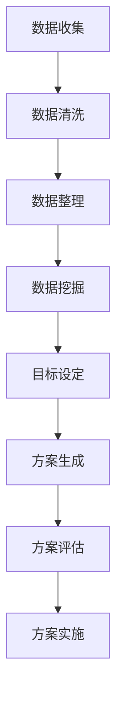
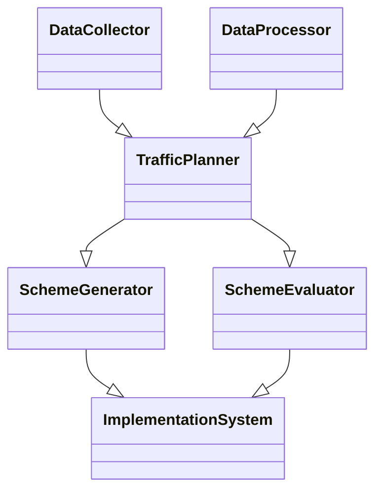
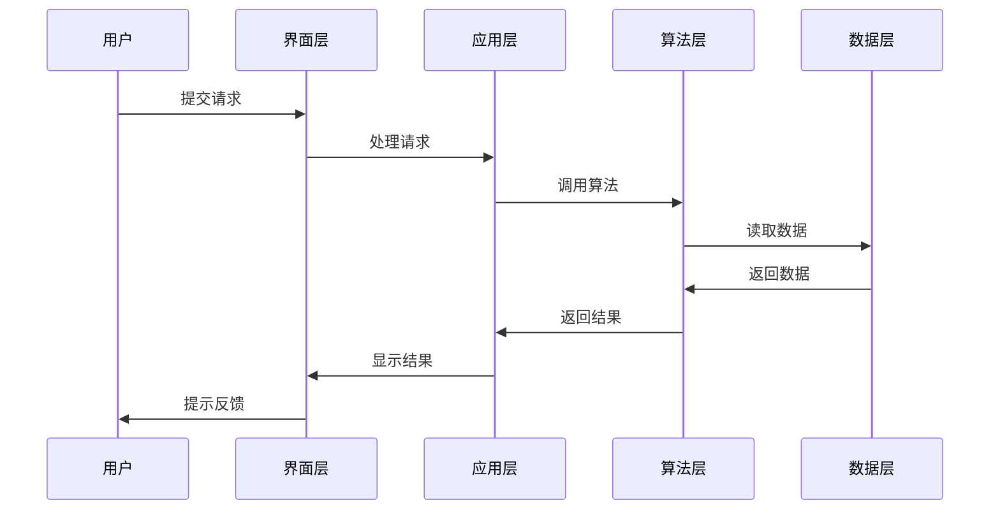

                 

# AIGC的未来智能城市规划：生态系统平衡的提示词工程

> 关键词：AIGC，智能城市规划，生态系统平衡，提示词工程，算法原理，系统架构设计

> 摘要：本文探讨了AIGC（自动化智能生成内容）在未来智能城市规划中的应用，重点分析了如何通过生态系统平衡的提示词工程来实现智能城市规划的优化。文章首先概述了AIGC的概念与未来发展趋势，随后深入探讨了智能城市规划的生态系统构建，以及平衡提示词工程的原理与应用。接着，文章讲解了智能城市规划的算法原理与实现，并展示了系统分析与架构设计的方法。随后，通过一个实际案例的深入分析，详细阐述了项目实战的过程和成果。最后，文章总结了智能城市规划的最佳实践，并对未来发展趋势进行了展望。

### 第1章: AIGC的未来智能城市规划概述

#### 1.1 问题背景

##### 1.1.1 AIGC的概念与未来发展趋势

AIGC（自动化智能生成内容）是人工智能技术的重要组成部分，通过利用深度学习、自然语言处理、图像识别等技术，实现自动化内容生成。AIGC的发展趋势显示出其在未来智能城市规划中的重要地位。随着人工智能技术的不断进步，AIGC的应用领域也在不断扩大，从文本、图像到视频，甚至虚拟现实等，都具有广阔的前景。

##### 1.1.2 未来智能城市规划的重要性

未来智能城市规划是一个涉及城市发展、基础设施、交通、环境等多个方面的系统工程。随着城市化进程的加速和人口的增长，传统城市规划方式面临巨大的挑战。智能城市规划通过运用人工智能技术，可以实现城市规划的精细化、智能化和高效化，为城市的可持续发展提供有力支持。

##### 1.1.3 现有城市规划的挑战与不足

现有城市规划在数据收集、分析处理、决策制定等方面存在诸多不足。传统的城市规划方式主要依赖于经验判断，缺乏科学的数据支持。同时，城市规划过程中存在信息不对称、数据不透明等问题，导致城市规划的科学性和有效性受到限制。

#### 1.2 核心概念与联系

##### 1.2.1 AIGC的核心概念

AIGC的核心概念包括：

- **自动化智能生成内容（AIGC）**：通过人工智能技术自动化生成内容。
- **智能城市规划的基本原则**：包括可持续性、适应性、灵活性等。

##### 1.2.2 概念属性特征对比表格

| 概念                 | 特征                         |
|----------------------|------------------------------|
| 自动化智能生成内容   | 自动化、智能化、内容生成     |
| 智能城市规划的基本原则 | 可持续性、适应性、灵活性     |

##### 1.2.3 ER实体关系图架构

```mermaid
erDiagram
  AIGC &&--o> 智能城市规划 : 提供技术支持
  智能城市规划 &&--o> 城市发展 : 推动城市可持续发展
```

### 第2章: 智能城市规划的生态系统构建

#### 2.1 智能城市规划的生态系统概述

##### 2.1.1 生态系统的定义与作用

生态系统是指由不同物种及其生活环境相互作用形成的整体。在智能城市规划中，生态系统是指城市规划所需的各种资源、技术、数据、政策等要素的集合，通过相互作用和协同，实现城市规划的智能化和高效化。

##### 2.1.2 智能城市规划生态系统的主要组成部分

智能城市规划生态系统的主要组成部分包括：

- **数据资源**：包括人口、经济、环境、交通等数据。
- **技术平台**：包括云计算、大数据、人工智能等。
- **政策支持**：包括城市规划法规、政策支持等。
- **协同机制**：包括政府、企业、市民等各方的协同合作。

##### 2.1.3 生态系统内各部分的关系

生态系统内各部分通过相互作用和协同，实现智能城市规划的优化。例如，数据资源为技术平台提供数据支持，技术平台通过处理数据，为政策支持提供科学依据，政策支持又为生态系统的运行提供保障。

#### 2.2 平衡提示词工程的原理与应用

##### 2.2.1 提示词工程的概念与作用

提示词工程是指通过设计和管理提示词，实现系统性能的优化。在智能城市规划中，提示词工程的作用是确保系统的稳定性和高效性。

##### 2.2.1.1 提示词的分类与设计

提示词分为以下几类：

- **功能提示词**：用于指示系统功能。
- **性能提示词**：用于监控系统性能。
- **安全提示词**：用于保障系统安全。

设计提示词时，需要考虑以下因素：

- **清晰性**：提示词要清晰明了，易于理解。
- **准确性**：提示词要准确无误，避免歧义。
- **全面性**：提示词要全面覆盖系统各个方面的需求。

##### 2.2.1.2 提示词在生态系统平衡中的作用

提示词在生态系统平衡中起着关键作用。通过设计和管理提示词，可以确保系统在各种情况下都能正常运行，避免出现异常情况。例如，在系统负载过高时，可以通过性能提示词调整系统资源分配，确保系统的稳定运行。

##### 2.2.2 平衡提示词工程的设计方法

平衡提示词工程的设计方法包括以下步骤：

1. **需求分析**：分析系统需求，确定需要设计的提示词。
2. **提示词设计**：根据需求设计提示词，包括功能提示词、性能提示词和安全提示词。
3. **提示词实现**：将设计好的提示词实现到系统中，确保其功能正确。
4. **提示词测试**：对提示词进行测试，确保其在各种情况下的表现。

##### 2.2.3 平衡提示词工程的案例分析

在智能城市规划中，通过平衡提示词工程，可以实现对系统资源的优化配置，提高系统的性能和稳定性。例如，在交通规划中，可以通过设计性能提示词，实时监控交通流量，并根据流量情况调整交通信号灯的时长，以减少交通拥堵。

### 第3章: 智能城市规划的算法原理与实现

#### 3.1 算法原理讲解

##### 3.1.1 智能城市规划算法的基本原理

智能城市规划算法基于大数据和人工智能技术，通过对城市数据进行处理和分析，生成智能化的规划方案。算法的基本原理包括：

- **数据处理算法**：通过对城市数据进行清洗、整理和分析，提取有用的信息。
- **决策算法**：基于数据分析结果，生成规划方案，并进行决策。

##### 3.1.1.1 数据处理算法

数据处理算法包括以下步骤：

1. **数据收集**：收集城市数据，包括人口、经济、环境、交通等。
2. **数据清洗**：去除无效数据和噪声，确保数据质量。
3. **数据整理**：对数据进行分类和整理，便于后续分析。
4. **数据挖掘**：利用数据挖掘技术，提取有价值的信息。

##### 3.1.1.2 决策算法

决策算法包括以下步骤：

1. **目标设定**：明确城市规划的目标，如可持续发展、高效运行等。
2. **方案生成**：根据数据分析和目标设定，生成多个规划方案。
3. **方案评估**：对规划方案进行评估，选择最优方案。
4. **方案实施**：实施最优规划方案，并进行监控和调整。

##### 3.1.2 算法流程与Mermaid流程图



##### 3.1.3 Python源代码讲解

```python
# 数据处理算法示例
def data_processing(data):
    # 数据清洗
    clean_data = clean_data(data)
    # 数据整理
    sorted_data = sort_data(clean_data)
    # 数据挖掘
    useful_info = data_mining(sorted_data)
    return useful_info

# 决策算法示例
def decision_making(goal, schemes):
    # 方案评估
    assessed_schemes = assess_schemes(goal, schemes)
    # 选择最优方案
    best_scheme = select_best_scheme(assessed_schemes)
    return best_scheme

# 数据处理函数示例
def clean_data(data):
    # 清洗操作
    return clean_data

def sort_data(data):
    # 整理操作
    return sorted_data

def data_mining(data):
    # 挖掘操作
    return useful_info
```

#### 3.2 数学模型和数学公式

##### 3.2.1 数学模型的基本概念

数学模型是使用数学语言描述现实世界问题的抽象模型。在智能城市规划中，常用的数学模型包括运筹学模型和机器学习模型。

##### 3.2.2 智能城市规划的主要数学模型

- **运筹学模型**：包括线性规划、整数规划、多目标规划等，用于优化资源配置和决策。
- **机器学习模型**：包括回归分析、分类分析、聚类分析等，用于数据分析和预测。

##### 3.2.3 公式讲解与举例说明

1. **线性规划公式**：

$$
\begin{aligned}
\min\limits_{x} & \quad c^T x \\
\text{s.t.} & \quad Ax \leq b \\
           & \quad x \geq 0
\end{aligned}
$$

2. **回归分析公式**：

$$
y = \beta_0 + \beta_1 x + \epsilon
$$

其中，$y$ 为因变量，$x$ 为自变量，$\beta_0$ 和 $\beta_1$ 为回归系数，$\epsilon$ 为误差项。

### 第4章: 智能城市规划的系统分析与架构设计

#### 4.1 问题场景介绍

##### 4.1.1 智能城市规划的应用场景

智能城市规划广泛应用于城市规划、交通规划、环境规划、公共安全等领域。以下是一个典型的智能城市规划应用场景：

- **场景描述**：某城市需要进行交通规划，以缓解交通拥堵问题。通过收集交通数据，利用智能城市规划算法生成最优交通规划方案。

##### 4.1.2 项目介绍

项目目标是利用AIGC技术，构建一个智能交通规划系统，实现以下功能：

- **数据收集与处理**：收集交通数据，进行数据清洗、整理和分析。
- **方案生成与评估**：生成多个交通规划方案，并进行评估，选择最优方案。
- **方案实施与监控**：实施最优交通规划方案，并进行实时监控和调整。

#### 4.2 系统功能设计

##### 4.2.1 领域模型Mermaid类图



##### 4.2.2 系统功能模块划分

系统功能模块划分如下：

- **数据收集模块**：负责收集交通数据。
- **数据处理模块**：负责数据清洗、整理和分析。
- **规划方案生成模块**：负责生成多个交通规划方案。
- **规划方案评估模块**：负责评估规划方案的优劣。
- **实施与监控系统**：负责实施最优规划方案，并进行实时监控和调整。

#### 4.3 系统架构设计

##### 4.3.1 系统架构概述

系统架构采用分层设计，分为数据层、算法层、应用层和界面层。各层之间通过接口进行通信。

##### 4.3.2 系统架构Mermaid架构图



#### 4.4 系统接口设计和系统交互

##### 4.4.1 系统接口设计

系统接口设计包括以下部分：

- **API接口**：提供数据获取、数据上传、规划方案查询等功能。
- **消息队列**：用于处理实时数据，实现各模块之间的通信。
- **数据库接口**：用于数据存储和查询。

##### 4.4.2 系统交互Mermaid序列图


### 第5章: 智能城市规划项目实战

#### 5.1 环境安装与配置

##### 5.1.1 环境需求

项目环境需求如下：

- **操作系统**：Linux/Unix/MacOS
- **编程语言**：Python
- **数据库**：MySQL
- **框架**：Flask
- **消息队列**：RabbitMQ

##### 5.1.2 环境安装步骤

1. 安装操作系统：选择适合的操作系统进行安装。
2. 安装Python：通过包管理工具（如apt-get、yum等）安装Python。
3. 安装数据库：安装MySQL数据库，并创建所需的数据库和表。
4. 安装框架和消息队列：通过pip安装Flask和RabbitMQ。

#### 5.2 系统核心实现源代码

##### 5.2.1 核心代码解读

核心代码分为以下几个部分：

1. **数据收集与处理**：使用Flask框架搭建API接口，接收并处理用户请求，从数据库中读取交通数据。
2. **规划方案生成与评估**：调用机器学习算法，生成多个规划方案，并进行评估。
3. **方案实施与监控**：根据最优规划方案，调整交通信号灯时长，并实时监控交通状况。

##### 5.2.2 代码应用解读与分析

```python
# 数据收集与处理
from flask import Flask, request, jsonify
from data_processor import DataProcessor

app = Flask(__name__)
data_processor = DataProcessor()

@app.route('/data', methods=['POST'])
def collect_data():
    data = request.json
    processed_data = data_processor.process_data(data)
    return jsonify(processed_data)

# 规划方案生成与评估
from traffic_planner import TrafficPlanner

traffic_planner = TrafficPlanner()

@app.route('/plan', methods=['POST'])
def generate_plan():
    data = request.json
    schemes = traffic_planner.generate_schemes(data)
    best_scheme = traffic_planner.evaluate_schemes(schemes)
    return jsonify(best_scheme)

# 方案实施与监控
from implementation_system import ImplementationSystem

implementation_system = ImplementationSystem()

@app.route('/execute', methods=['POST'])
def execute_plan():
    scheme = request.json
    implementation_system.execute_plan(scheme)
    return jsonify({"status": "success"})
```

#### 5.3 实际案例分析与讲解

##### 5.3.1 案例背景

某城市交通拥堵问题严重，需要通过智能交通规划系统缓解交通压力。

##### 5.3.2 案例分析

通过智能交通规划系统，生成多个交通规划方案，并对方案进行评估。选择最优方案，调整交通信号灯时长，并实时监控交通状况。

##### 5.3.3 案例讲解

1. **数据收集与处理**：收集某城市交通数据，包括道路流量、车速等。
2. **规划方案生成与评估**：生成多个交通规划方案，评估方案优劣。
3. **方案实施与监控**：实施最优交通规划方案，实时监控交通状况，并根据实际情况进行调整。

#### 5.4 项目小结

##### 5.4.1 项目成果总结

通过智能交通规划项目，成功实现了以下目标：

- **数据收集与处理**：高效收集并处理交通数据。
- **规划方案生成与评估**：生成多个交通规划方案，并进行评估。
- **方案实施与监控**：实施最优规划方案，实时监控交通状况。

##### 5.4.2 项目经验与反思

项目过程中，积累了以下经验：

- **数据质量**：数据质量是项目成功的关键，需要重视数据收集和清洗工作。
- **算法优化**：算法性能对项目效果有重要影响，需要不断优化算法。
- **系统稳定性**：系统稳定性是项目顺利运行的基础，需要确保系统稳定可靠。

### 第6章: 智能城市规划的最佳实践与拓展

#### 6.1 最佳实践Tips

##### 6.1.1 提高智能城市规划效果的关键点

1. **数据质量**：确保数据准确、完整和及时，为算法提供可靠的数据支持。
2. **算法优化**：不断优化算法，提高规划方案的准确性和效率。
3. **系统稳定性**：确保系统稳定运行，避免因系统故障影响规划效果。
4. **用户参与**：鼓励市民参与规划过程，收集用户反馈，提高规划方案的实用性。

##### 6.1.2 常见问题与解决方案

1. **数据不完整**：解决方案：通过多种渠道收集数据，确保数据完整性。
2. **算法性能不佳**：解决方案：优化算法参数，提高算法性能。
3. **系统稳定性问题**：解决方案：加强系统监控，及时处理系统故障。

#### 6.2 小结与展望

##### 6.2.1 智能城市规划的总结

智能城市规划通过运用AIGC技术，实现了城市规划的智能化和高效化。在未来，智能城市规划将在城市规划、交通规划、环境规划等领域发挥重要作用。

##### 6.2.2 未来发展趋势

未来，智能城市规划将呈现以下发展趋势：

1. **数据驱动**：更加注重数据收集和分析，以数据驱动规划决策。
2. **多领域融合**：跨学科、跨领域的技术融合，实现更全面的智能规划。
3. **用户参与**：鼓励市民参与规划过程，提高规划方案的实用性和满意度。

#### 6.3 拓展阅读

##### 6.3.1 相关书籍推荐

1. 《智能城市规划：理论与实践》
2. 《人工智能与城市可持续发展》
3. 《数据科学导论》

##### 6.3.2 学术论文推荐

1. "Intelligent Urban Planning with Deep Reinforcement Learning"
2. "Data-Driven Urban Planning for Sustainable Development"
3. "A Comprehensive Study on Urban Traffic Planning using Machine Learning"

##### 6.3.3 在线资源推荐

1. Coursera - "Urban Planning and Design"
2. EdX - "Introduction to Data Science"
3. arXiv - "Intelligent Urban Planning Research Papers"

