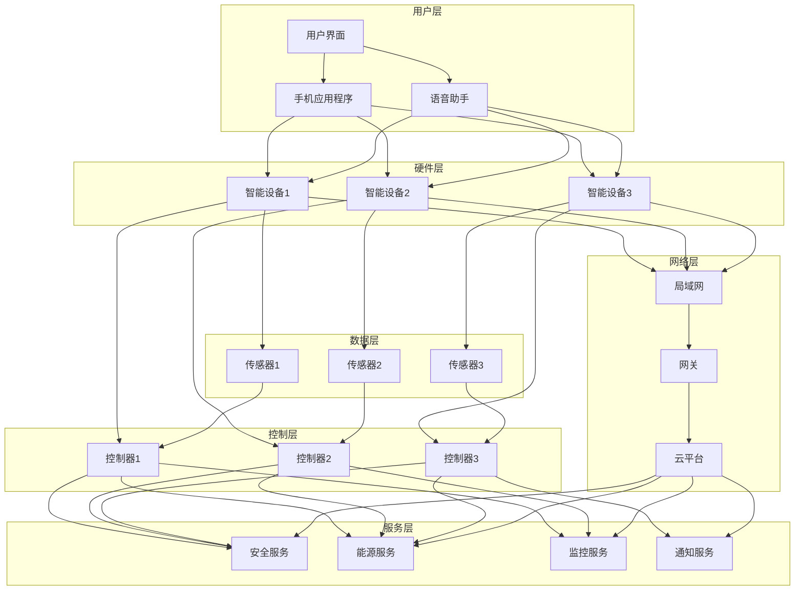
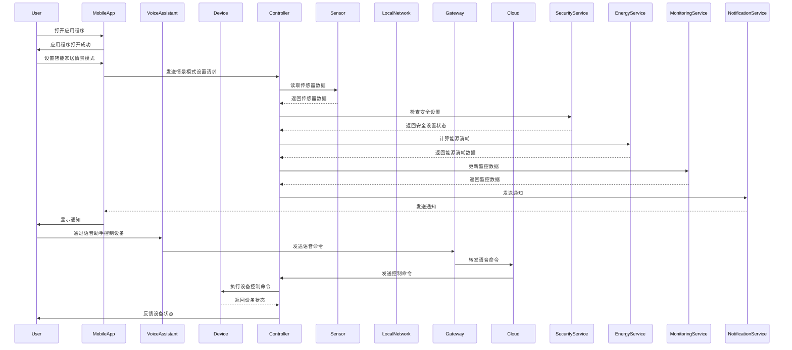

                 

### 第一部分：背景介绍

#### 1.1 问题背景

**1.1.1 智能家居的发展历程**

智能家居作为物联网（IoT）技术的一个重要分支，其发展历程可以追溯到20世纪末期。最早的智能家居系统主要集中在一些高端住宅，通过简单的自动化设备如自动门锁、远程监控摄像头等来提高居民的生活质量。进入21世纪，随着计算机技术、互联网技术以及无线通信技术的发展，智能家居逐渐进入了普通家庭，成为人们生活中不可或缺的一部分。

在智能家居的发展历程中，几个关键节点值得注意：

- **2000年代早期**：这一阶段智能家居主要依赖于独立系统，各个设备之间缺乏有效的通信与协同工作，用户体验较差。
- **2010年代**：随着物联网技术的成熟，智能家居设备开始具备联网功能，用户可以通过手机应用程序控制家居设备。例如，智能灯泡、智能插座、智能恒温器等设备的出现，极大地丰富了智能家居的应用场景。
- **2015年后**：智能家居进入快速发展期，各种智能家居平台和生态系统不断涌现，设备之间的互操作性大幅提升，智能家居开始成为一个整体系统，为用户提供更加智能、便捷的生活体验。

**1.1.2 AIGC技术在智能家居中的应用**

AIGC（AI-Generated Content）技术，即人工智能生成内容技术，是近年来人工智能领域的一个重要进展。AIGC技术结合了人工智能、生成模型和自然语言处理等前沿技术，能够在没有人工干预的情况下，自动生成文字、图片、音频等多种类型的内容。

在智能家居系统中，AIGC技术的主要应用包括：

- **个性化交互**：通过AIGC技术，智能家居系统能够根据用户的历史行为和偏好，自动生成个性化的交互内容，如定制化的提醒、通知和语音播报。
- **智能情景模式**：AIGC技术能够分析用户的生活习惯和环境变化，自动生成智能情景模式，例如，根据用户的作息时间自动调整室内温度、灯光等。
- **自动化任务执行**：AIGC技术可以自动生成执行任务的指令，如智能助手根据用户需求自动安排清洁、烹饪等家务任务。

#### 1.2 问题描述

**1.2.1 智能家居中的提示词需求**

在智能家居系统中，提示词是一个重要的交互元素。提示词的作用是指导用户如何使用智能家居系统，提供使用建议和反馈，帮助用户更好地理解和操作智能家居设备。具体需求包括：

- **操作指引**：提示词需要清晰准确地指导用户如何使用某个设备或功能。
- **使用建议**：根据用户的使用习惯和设备状态，提示词需要提供个性化的使用建议。
- **故障提示**：当智能家居设备出现故障或异常时，提示词需要及时告知用户，并建议解决方案。

**1.2.2 提示词在智能家居系统中的重要性**

提示词在智能家居系统中扮演着关键角色，具体体现在以下几个方面：

- **用户引导**：提示词可以帮助用户快速上手，理解并使用智能家居系统。
- **增强体验**：通过提供个性化的提示词，智能家居系统能够更好地满足用户的需求，提升用户体验。
- **提高安全性**：提示词可以提醒用户注意潜在的安全隐患，防止误操作，提高系统的安全性。

#### 1.3 问题解决

**1.3.1 提示词工程的概念**

提示词工程是指利用人工智能技术，尤其是AIGC技术，对智能家居系统中的提示词进行设计、生成、优化和管理的全过程。提示词工程主要包括以下几个关键环节：

- **数据收集**：收集用户的行为数据、设备状态数据、使用反馈数据等，为提示词的生成提供基础数据。
- **数据清洗**：对收集到的数据进行清洗、去噪，确保数据质量。
- **数据标注**：对清洗后的数据标注语义信息，为生成高质量的提示词提供标注集。
- **提示词生成**：利用生成模型和自然语言处理技术，根据用户数据和标注集，自动生成提示词。
- **提示词优化**：根据用户反馈和系统运行效果，不断优化和调整提示词，提高其质量和适用性。
- **提示词管理**：对生成的提示词进行存储、分类、更新和管理，确保系统的可持续性和灵活性。

**1.3.2 提示词工程的关键环节**

提示词工程的关键环节包括数据收集、数据清洗、数据标注、提示词生成和提示词优化。以下是每个环节的详细描述：

- **数据收集**：数据收集是提示词工程的基础。通过智能家居系统的日志、用户反馈、传感器数据等多种途径，收集与用户行为、设备状态相关的数据。
- **数据清洗**：数据清洗是确保数据质量的重要步骤。通过去除重复数据、填补缺失值、消除噪声数据等方法，提高数据的质量和可用性。
- **数据标注**：数据标注是指对收集到的数据标注语义信息，如设备类型、使用场景、用户行为等。标注数据为提示词的生成提供了重要的参考。
- **提示词生成**：提示词生成是利用生成模型和自然语言处理技术，根据用户数据和标注集，自动生成高质量的提示词。生成模型包括生成对抗网络（GAN）、变分自编码器（VAE）等。
- **提示词优化**：提示词优化是基于用户反馈和系统运行效果，对生成的提示词进行调整和改进，以提高其质量和适用性。优化过程包括人工调整和自动化优化算法相结合。

#### 1.4 边界与外延

**1.4.1 智能家居系统的边界**

智能家居系统的边界主要包括以下几个方面：

- **硬件边界**：智能家居系统的硬件边界包括各种智能设备，如智能灯泡、智能插座、智能门锁、智能摄像头等。
- **软件边界**：智能家居系统的软件边界包括智能家居操作系统、控制软件、应用程序等。
- **网络边界**：智能家居系统的网络边界包括局域网、广域网、云平台等。

**1.4.2 提示词工程的外延**

提示词工程的外延主要包括以下几个方面：

- **数据来源**：除了智能家居系统内部的数据，提示词工程还可以从外部数据源获取数据，如社交媒体、用户评论等。
- **应用领域**：提示词工程不仅可以应用于智能家居系统，还可以扩展到其他领域，如智能客服、智能教育、智能医疗等。
- **技术融合**：提示词工程可以与其他人工智能技术，如语音识别、图像识别、自然语言理解等相结合，实现更智能、更个性化的用户体验。

#### 1.5 概念结构与核心要素组成

**1.5.1 AIGC的定义**

AIGC（AI-Generated Content）是指利用人工智能技术，特别是生成模型，自动生成文字、图片、音频、视频等多种类型的内容。AIGC技术涵盖了自然语言处理、计算机视觉、语音识别等多个领域。

**1.5.2 智能家居系统的核心要素**

智能家居系统的核心要素包括：

- **硬件设备**：各种智能设备，如智能灯泡、智能插座、智能门锁、智能摄像头等。
- **传感器**：用于感知环境信息和用户行为，如温度传感器、湿度传感器、光线传感器等。
- **控制单元**：用于处理传感器数据，执行用户指令，如中央控制器、边缘计算设备等。
- **通信网络**：用于连接智能家居系统中的各个设备，实现数据传输和协同工作，如局域网、广域网、云平台等。
- **用户界面**：用于用户与智能家居系统交互，如手机应用程序、语音助手等。

**1.5.3 提示词工程的核心要素**

提示词工程的核心要素包括：

- **数据集**：用于训练和生成提示词的数据集，包括用户行为数据、设备状态数据、使用反馈数据等。
- **生成模型**：用于生成提示词的生成模型，如生成对抗网络（GAN）、变分自编码器（VAE）等。
- **自然语言处理**：用于处理和生成自然语言提示词的技术，如词向量、序列到序列模型等。
- **反馈机制**：用于收集用户反馈，对生成的提示词进行评价和优化的机制。

### 总结

本文对AIGC在未来智能家居系统中的应用进行了详细探讨。通过背景介绍，我们了解了智能家居的发展历程和AIGC技术在智能家居中的应用。在问题描述部分，我们明确了智能家居系统中提示词的需求和重要性。问题解决部分，我们介绍了提示词工程的概念和关键环节，以及智能家居系统和提示词工程的核心要素。最后，我们讨论了智能家居系统的边界和提示词工程的外延。这些内容为后续的算法原理讲解和系统设计与实现奠定了基础。

----------------------------------------------------------------

## 2 核心概念与联系

### 2.1 AIGC概念与特点

**2.1.1 AIGC的定义**

AIGC（AI-Generated Content），即人工智能生成内容，是指利用人工智能技术，特别是生成模型，自动生成文字、图片、音频、视频等多种类型的内容。AIGC涵盖了自然语言处理、计算机视觉、语音识别等多个领域，具有广泛的应用前景。

**2.1.2 AIGC的核心特点**

AIGC的核心特点包括：

- **自适应性**：AIGC系统能够根据用户的需求和环境变化，自动调整生成内容。
- **高效性**：通过自动化生成内容，AIGC技术能够显著提高内容生产的效率。
- **个性化**：AIGC系统能够根据用户的历史行为和偏好，生成个性化的内容。

**2.1.3 AIGC与传统AI的比较**

与传统AI技术相比，AIGC具有以下优势：

- **生成能力**：传统AI技术主要侧重于数据的分析和处理，而AIGC则强调内容的生成，具有更强的创造力。
- **多样性**：AIGC能够生成多种类型的内容，如文字、图片、音频等，而传统AI技术通常限于特定领域。
- **交互性**：AIGC系统能够与用户进行互动，根据用户反馈动态调整生成内容。

### 2.2 智能家居系统的概念与特点

**2.2.1 智能家居系统的定义**

智能家居系统是一种利用物联网技术，通过互联网连接家庭中的各种智能设备，实现设备之间自动化协同工作，为用户提供智能、舒适、便捷生活的系统。

**2.2.2 智能家居系统的核心特点**

智能家居系统的核心特点包括：

- **互联互通**：智能家居系统能够实现设备之间的互联互通，形成统一的智能网络。
- **自动化**：智能家居系统能够根据用户的需求和环境变化，自动化地控制家庭设备。
- **智能化**：智能家居系统能够通过人工智能技术，为用户提供个性化的服务和体验。

**2.2.3 智能家居系统与AIGC的关系**

智能家居系统与AIGC技术之间存在着密切的关系：

- **互动生成**：AIGC技术能够为智能家居系统提供互动生成的内容，如个性化语音提示、情景模式推荐等。
- **增强用户体验**：通过AIGC技术，智能家居系统能够更加智能地理解用户需求，提供更加个性化的服务。
- **自动化优化**：AIGC技术能够帮助智能家居系统自动优化工作流程，提高系统的效率和可靠性。

### 2.3 提示词工程的概念与特点

**2.3.1 提示词工程的定义**

提示词工程是指利用人工智能技术，特别是自然语言处理技术，对智能家居系统中的提示词进行设计、生成、优化和管理的全过程。

**2.3.2 提示词工程的核心特点**

提示词工程的核心特点包括：

- **个性化**：根据用户的历史行为和偏好，生成个性化的提示词。
- **实时性**：能够根据用户的需求和环境变化，实时生成和更新提示词。
- **灵活性**：提示词工程能够适应不同应用场景和用户需求，提供灵活的提示词生成方案。

**2.3.3 提示词工程在智能家居系统中的应用**

提示词工程在智能家居系统中的应用主要包括：

- **用户引导**：通过生成清晰的提示词，帮助用户理解和使用智能家居系统。
- **使用建议**：根据用户的使用习惯和设备状态，生成个性化的使用建议。
- **故障提示**：当智能家居设备出现故障或异常时，生成提示词提醒用户并建议解决方案。

### 总结

本文对AIGC、智能家居系统和提示词工程等核心概念进行了详细介绍和比较分析。AIGC技术具有自适应性、高效性和个性化等特点，为智能家居系统提供了丰富的内容生成能力。智能家居系统则通过互联互通、自动化和智能化等特点，为用户提供更加智能、便捷的生活体验。提示词工程作为智能家居系统的重要组成部分，通过个性化、实时性和灵活性，为用户提供了高质量的交互体验。这些核心概念之间的紧密联系，为后续的算法原理讲解和系统设计与实现提供了理论基础。

----------------------------------------------------------------

## 3 算法原理讲解

### 3.1 AIGC算法原理

**3.1.1 AIGC算法的基本流程**

AIGC算法的基本流程可以分为以下几个步骤：

1. **数据收集**：从各种来源（如传感器数据、用户行为数据、外部数据源等）收集相关数据。
2. **数据预处理**：对收集到的数据进行清洗、去噪和格式化，确保数据质量。
3. **模型训练**：利用收集到的预处理数据，训练生成模型，如生成对抗网络（GAN）、变分自编码器（VAE）等。
4. **内容生成**：使用训练好的生成模型，根据特定的需求生成文本、图像、音频等内容。
5. **内容优化**：根据用户反馈和系统效果，对生成的内容进行优化和调整。

**3.1.2 AIGC算法的数学模型**

AIGC算法的核心在于生成模型，以下是一个简化的数学模型：

$$
G(z) = \text{生成器}, \quad D(x) = \text{判别器}
$$

其中，$G(z)$ 表示生成器，它将噪声向量 $z$ 转换为生成的数据 $x$；$D(x)$ 表示判别器，它用于判断输入数据是真实数据还是生成数据。

训练过程中，生成器和判别器交替更新参数，目标是使生成器的输出数据尽可能接近真实数据，同时使判别器能够准确区分真实数据和生成数据。

**3.1.3 AIGC算法的Python实现**

以下是一个简单的AIGC算法的Python实现示例，使用生成对抗网络（GAN）：

```python
import tensorflow as tf
from tensorflow.keras.layers import Dense, Flatten, Reshape
from tensorflow.keras.models import Model

# 生成器模型
def build_generator(z_dim):
    model = tf.keras.Sequential()
    model.add(Dense(256, input_dim=z_dim))
    model.add(tf.keras.layers.LeakyReLU(alpha=0.01))
    model.add(Dense(512))
    model.add(tf.keras.layers.LeakyReLU(alpha=0.01))
    model.add(Dense(1024))
    model.add(tf.keras.layers.LeakyReLU(alpha=0.01))
    model.add(Flatten())
    model.add(Dense(784, activation='tanh'))
    return model

# 判别器模型
def build_discriminator(x_dim):
    model = tf.keras.Sequential()
    model.add(Flatten(input_shape=(x_dim,)))
    model.add(Dense(1024, activation='relu'))
    model.add(Dense(512, activation='relu'))
    model.add(Dense(256, activation='relu'))
    model.add(Dense(1, activation='sigmoid'))
    return model

# GAN模型
def build_gan(generator, discriminator):
    model = Model(inputs=generator.input, outputs=discriminator(generator.input))
    return model

# 设置超参数
z_dim = 100
x_dim = 784  # 假设输入数据维度为784

# 构建模型
generator = build_generator(z_dim)
discriminator = build_discriminator(x_dim)
discriminator.compile(loss='binary_crossentropy', optimizer=tf.keras.optimizers.Adam(0.0001))
gan = build_gan(generator, discriminator)

# 训练模型
# ...

```

### 3.2 智能家居系统算法原理

**3.2.1 智能家居系统算法的基本原理**

智能家居系统算法的基本原理包括以下几个步骤：

1. **数据采集**：通过传感器和设备收集家庭环境数据和用户行为数据。
2. **数据处理**：对采集到的数据进行预处理，如去噪、归一化等。
3. **状态监测**：根据预处理后的数据，实时监测家庭环境的各种状态，如温度、湿度、光线、空气质量等。
4. **决策生成**：利用机器学习算法，根据当前状态和历史数据，生成控制决策。
5. **执行控制**：根据决策结果，自动调整家庭设备的状态，如调节温度、开关灯光、控制家电等。

**3.2.2 智能家居系统算法的数学模型**

智能家居系统算法的数学模型主要包括以下几个部分：

- **状态表示**：用向量表示家庭环境的当前状态，如温度、湿度、光线等。
- **决策模型**：用神经网络或其他机器学习模型，根据当前状态和历史数据生成控制决策。
- **执行模型**：用控制算法，根据决策结果调整设备状态。

一个简化的数学模型可以表示为：

$$
s = f(s, h)
$$

其中，$s$ 表示当前状态，$h$ 表示历史数据，$f$ 表示决策模型。

**3.2.3 智能家居系统算法的Python实现**

以下是一个简单的智能家居系统算法的Python实现示例，使用决策树：

```python
import numpy as np
from sklearn.tree import DecisionTreeRegressor

# 假设我们有一个训练数据集 X_train 和对应的标签 y_train
# X_train 是状态数据的矩阵，y_train 是控制决策的向量

# 训练决策树模型
regressor = DecisionTreeRegressor()
regressor.fit(X_train, y_train)

# 根据当前状态生成控制决策
current_state = np.array([[23, 45, 0.5]])  # 假设当前状态为温度23摄氏度、湿度45%、光线0.5
control_decision = regressor.predict(current_state)

print("控制决策：", control_decision)
```

### 3.3 提示词工程算法原理

**3.3.1 提示词工程算法的基本流程**

提示词工程算法的基本流程包括以下几个步骤：

1. **数据收集**：收集与智能家居系统相关的用户行为数据、设备状态数据等。
2. **数据预处理**：对收集到的数据进行清洗、去噪和格式化。
3. **提示词生成**：利用生成模型，如生成对抗网络（GAN）、变分自编码器（VAE）等，生成提示词。
4. **提示词优化**：根据用户反馈和系统效果，对生成的提示词进行优化和调整。

**3.3.2 提示词工程算法的数学模型**

提示词工程算法的数学模型主要包括以下几个方面：

- **生成模型**：用生成模型生成提示词，如生成对抗网络（GAN）、变分自编码器（VAE）等。
- **优化模型**：用优化算法，如梯度下降、随机梯度下降等，对生成模型进行优化。

一个简化的数学模型可以表示为：

$$
\text{提示词} = G(z)
$$

其中，$G(z)$ 表示生成模型，$z$ 表示输入噪声或编码。

**3.3.3 提示词工程算法的Python实现**

以下是一个简单的提示词工程算法的Python实现示例，使用生成对抗网络（GAN）：

```python
import tensorflow as tf
from tensorflow.keras.layers import Dense, Flatten, Reshape
from tensorflow.keras.models import Model

# 生成器模型
def build_generator(z_dim):
    model = tf.keras.Sequential()
    model.add(Dense(256, input_dim=z_dim))
    model.add(tf.keras.layers.LeakyReLU(alpha=0.01))
    model.add(Dense(512))
    model.add(tf.keras.layers.LeakyReLU(alpha=0.01))
    model.add(Dense(1024))
    model.add(tf.keras.layers.LeakyReLU(alpha=0.01))
    model.add(Flatten())
    model.add(Dense(784, activation='tanh'))
    return model

# 判别器模型
def build_discriminator(x_dim):
    model = tf.keras.Sequential()
    model.add(Flatten(input_shape=(x_dim,)))
    model.add(Dense(1024, activation='relu'))
    model.add(Dense(512, activation='relu'))
    model.add(Dense(256, activation='relu'))
    model.add(Dense(1, activation='sigmoid'))
    return model

# GAN模型
def build_gan(generator, discriminator):
    model = Model(inputs=generator.input, outputs=discriminator(generator.input))
    return model

# 设置超参数
z_dim = 100
x_dim = 784  # 假设输入数据维度为784

# 构建模型
generator = build_generator(z_dim)
discriminator = build_discriminator(x_dim)
discriminator.compile(loss='binary_crossentropy', optimizer=tf.keras.optimizers.Adam(0.0001))
gan = build_gan(generator, discriminator)

# 训练模型
# ...

```

### 总结

本文详细讲解了AIGC算法、智能家居系统算法和提示词工程算法的原理。AIGC算法通过生成模型自动生成多种类型的内容，具有高效性和个性化特点；智能家居系统算法通过数据采集、处理和决策生成，实现家庭设备的自动化控制；提示词工程算法通过生成模型和优化模型，生成高质量的提示词，提高用户交互体验。这些算法原理为后续的详细讲解和系统设计与实现提供了理论基础。

----------------------------------------------------------------

## 4 数学模型和数学公式 & 详细讲解 & 举例说明

### 4.1 AIGC数学模型讲解

AIGC（AI-Generated Content）技术是近年来人工智能领域的一个重要进展，其核心在于生成模型。以下是对AIGC数学模型的详细讲解，包括基本公式和数学模型的详细解释。

#### 4.1.1 AIGC数学模型的基本公式

AIGC数学模型的基本公式可以表示为：

$$
\text{AIGC} = \text{AI} + \text{GC}
$$

其中，$\text{AI}$ 表示人工智能技术，$\text{GC}$ 表示生成内容技术。

#### 4.1.2 AIGC数学模型的详细讲解

1. **AI部分**

   AI部分可以进一步分解为：

   $$
   \text{AI} = \text{大数据} + \text{算法} + \text{硬件}
   $$

   - **大数据**：大数据技术用于收集、存储和处理大量的数据，为AIGC提供丰富的数据资源。
   - **算法**：算法技术是AIGC的核心，包括生成模型、自然语言处理、计算机视觉等，用于生成高质量的内容。
   - **硬件**：硬件技术提供了计算能力和存储能力，支持大规模数据的处理和模型的训练。

2. **GC部分**

   GC部分可以进一步分解为：

   $$
   \text{GC} = \text{生成内容} + \text{交互内容}
   $$

   - **生成内容**：生成内容技术用于生成各种类型的内容，如图像、文本、音频等。
   - **交互内容**：交互内容技术用于生成与用户互动的内容，如提示词、语音交互等。

### 4.2 智能家居系统数学模型讲解

智能家居系统是AIGC技术的一个重要应用场景。以下是对智能家居系统数学模型的详细讲解，包括基本公式和数学模型的详细解释。

#### 4.2.1 智能家居系统数学模型的基本公式

智能家居系统数学模型的基本公式可以表示为：

$$
\text{智能家居系统} = \text{传感器} + \text{控制器} + \text{用户接口}
$$

其中，传感器、控制器和用户接口是智能家居系统的三个核心组成部分。

#### 4.2.2 智能家居系统数学模型的详细讲解

1. **传感器部分**

   传感器部分可以进一步分解为：

   $$
   \text{传感器} = \text{温度传感器} + \text{湿度传感器} + \text{光线传感器}
   $$

   - **温度传感器**：用于检测环境温度，为智能家居系统提供温度数据。
   - **湿度传感器**：用于检测环境湿度，为智能家居系统提供湿度数据。
   - **光线传感器**：用于检测环境光线强度，为智能家居系统提供光线数据。

2. **控制器部分**

   控制器部分可以进一步分解为：

   $$
   \text{控制器} = \text{CPU} + \text{GPU} + \text{FPGA}
   $$

   - **CPU**：中央处理器，用于执行计算任务和运行操作系统。
   - **GPU**：图形处理器，用于加速图像处理任务。
   - **FPGA**：现场可编程门阵列，用于实现特定功能的硬件电路。

3. **用户接口部分**

   用户接口部分可以进一步分解为：

   $$
   \text{用户接口} = \text{手机应用程序} + \text{语音助手} + \text{触摸屏}
   $$

   - **手机应用程序**：用户通过手机应用程序与智能家居系统进行交互，实现设备控制和数据查询。
   - **语音助手**：用户通过语音命令与智能家居系统进行交互，实现设备控制和查询。
   - **触摸屏**：用户通过触摸屏与智能家居系统进行交互，实现设备控制和数据查询。

### 4.3 提示词工程数学模型讲解

提示词工程是AIGC技术在智能家居系统中的一个重要应用，用于生成高质量的提示词，提高用户体验。以下是对提示词工程数学模型的详细讲解，包括基本公式和数学模型的详细解释。

#### 4.3.1 提示词工程数学模型的基本公式

提示词工程数学模型的基本公式可以表示为：

$$
\text{提示词工程} = \text{数据收集} + \text{数据清洗} + \text{数据标注}
$$

其中，数据收集、数据清洗和数据标注是提示词工程的核心环节。

#### 4.3.2 提示词工程数学模型的详细讲解

1. **数据收集部分**

   数据收集部分可以进一步分解为：

   $$
   \text{数据收集} = \text{智能家居系统日志} + \text{用户反馈}
   $$

   - **智能家居系统日志**：智能家居系统生成的日志数据，包括设备状态、用户操作等信息。
   - **用户反馈**：用户通过手机应用程序、语音助手等渠道提供的反馈数据。

2. **数据清洗部分**

   数据清洗部分可以进一步分解为：

   $$
   \text{数据清洗} = \text{去除噪音数据} + \text{缺失值处理}
   $$

   - **去除噪音数据**：对收集到的数据进行去噪处理，去除不相关或错误的数据。
   - **缺失值处理**：对数据集中的缺失值进行填补或删除处理，确保数据质量。

3. **数据标注部分**

   数据标注部分可以进一步分解为：

   $$
   \text{数据标注} = \text{设备类型标注} + \text{使用场景标注} + \text{用户行为标注}
   $$

   - **设备类型标注**：对数据集中的设备类型进行标注，如温度传感器、湿度传感器等。
   - **使用场景标注**：对数据集中的使用场景进行标注，如卧室、客厅等。
   - **用户行为标注**：对数据集中的用户行为进行标注，如开关灯、调节温度等。

### 4.4 举例说明

为了更好地理解AIGC、智能家居系统和提示词工程的数学模型，以下通过一个简单的例子进行说明。

**例子：生成一个智能家居系统的提示词**

假设我们想要生成一个关于“夜间模式”的提示词，用于提醒用户夜间模式的使用方法。

1. **数据收集**：

   - **智能家居系统日志**：系统记录了用户最近一周内使用夜间模式的数据。
   - **用户反馈**：用户在应用程序中提供了对夜间模式的使用反馈。

2. **数据清洗**：

   - **去除噪音数据**：去除与夜间模式无关的数据，如温度数据。
   - **缺失值处理**：对缺失的数据进行填补或删除处理。

3. **数据标注**：

   - **设备类型标注**：标注夜间模式涉及的设备类型，如灯光控制器。
   - **使用场景标注**：标注夜间模式的使用场景，如卧室。
   - **用户行为标注**：标注用户对夜间模式的操作行为，如打开夜间模式。

4. **提示词生成**：

   - 使用生成模型，根据数据标注生成一个提示词：
     ```
     夜间模式已开启，您的卧室灯光将自动调整至舒适的光线，祝您有个美好的夜晚。
     ```

通过这个例子，我们可以看到AIGC、智能家居系统和提示词工程的数学模型是如何应用于实际的场景中，生成高质量的提示词。

### 总结

本文对AIGC、智能家居系统和提示词工程的数学模型进行了详细讲解，包括基本公式和数学模型的详细解释。通过这些数学模型，我们可以更好地理解这些技术的原理和实现方法。举例说明部分进一步展示了如何将这些数学模型应用于实际场景中，生成高质量的提示词。这些内容为后续的算法原理讲解和系统设计与实现提供了理论基础。

----------------------------------------------------------------

## 5 系统分析与架构设计方案

### 5.1 问题场景介绍

**5.1.1 智能家居场景描述**

智能家居场景涵盖了日常生活中的各种环境，包括客厅、卧室、厨房、浴室等。以下是对不同房间智能家居系统的具体描述：

- **客厅**：客厅是家庭的主要活动区域，智能家居系统可以控制电视、空调、照明、音响等设备。例如，用户可以通过手机应用程序或语音助手控制电视的开关，调节空调的温度和湿度，调整灯光的亮度和色温，以及播放音乐。
- **卧室**：卧室是用户的休息区域，智能家居系统可以提供舒适的睡眠环境。例如，用户可以通过手机应用程序或语音助手控制窗帘的开关，调节床头的阅读灯亮度，以及设置智能床垫的按摩模式。
- **厨房**：厨房是家庭烹饪的中心，智能家居系统可以提供便捷的烹饪体验。例如，用户可以通过手机应用程序远程控制烤箱的温度和时间，监控冰箱的食品存储状态，以及控制厨房清洁设备如扫地机器人。
- **浴室**：浴室是用户日常清洁和放松的场所，智能家居系统可以提供舒适的环境。例如，用户可以通过手机应用程序或语音助手控制淋浴器的温度和水流，调节浴室照明的亮度和颜色，以及控制吹风机等设备。

**5.1.2 智能家居系统功能设计**

智能家居系统的功能设计需要考虑以下几个方面：

- **设备控制**：用户可以通过手机应用程序或语音助手远程控制家中的智能设备，如照明、空调、门锁、摄像头等。
- **环境监测**：智能家居系统可以实时监测室内外的温度、湿度、空气质量、光线强度等环境参数，并根据监测数据自动调整设备状态。
- **安全监控**：智能家居系统可以集成摄像头、门锁等安全设备，提供实时监控和报警功能，保障家庭安全。
- **能源管理**：智能家居系统可以监测和控制家庭用电情况，提供节能建议，优化能源使用效率。
- **情景模式**：智能家居系统可以根据用户的生活习惯和需求，设置多种情景模式，如早晨模式、离家模式、睡眠模式等，实现一键切换。

### 5.2 系统功能设计（领域模型mermaid类图）

以下是对智能家居系统领域模型的mermaid类图设计，用于展示系统的核心类及其关系：

```mermaid
classDiagram
  User <<Interface>>
  Device <<Interface>>
  Sensor <<Interface>>
  Controller <<Interface>>
  Environment <<Interface>>
  Security <<Interface>>
  Energy <<Interface>>

  User|--|> Device
  User|--|> Sensor
  User|--|> Controller
  User|--|> Environment
  User|--|> Security
  User|--|> Energy

  Device|--|> Controller
  Device|--|> Sensor
  Device|--|> Environment

  Sensor|--|> Controller
  Sensor|--|> Environment

  Controller|--|> Device
  Controller|--|> Sensor
  Controller|--|> Environment

  Environment|--|> Security
  Environment|--|> Energy

  Security|--|> User
  Security|--|> Device
  Security|--|> Sensor
  Security|--|> Controller

  Energy|--|> User
  Energy|--|> Device
  Energy|--|> Controller
```

### 5.3 系统架构设计mermaid架构图

以下是对智能家居系统架构的mermaid架构图设计，用于展示系统的整体架构和组件关系：



### 5.4 系统接口设计和系统交互mermaid序列图

以下是对智能家居系统接口设计和系统交互的mermaid序列图设计，用于展示用户与系统之间的交互过程：



### 总结

本文详细介绍了智能家居系统的问题场景描述、功能设计、领域模型mermaid类图、系统架构设计mermaid架构图、系统接口设计和系统交互mermaid序列图。通过这些设计和模型，我们可以清晰地理解智能家居系统的整体架构和功能实现。这些设计为后续的系统实现和优化提供了重要的理论基础和指导。

----------------------------------------------------------------

## 项目实战

### 6.1 环境安装

在开始智能家居系统的实现之前，我们需要安装和配置必要的开发环境。以下是环境安装的步骤：

**1. 安装Python**

首先，确保您的计算机上安装了Python。Python是编写智能家居系统的首选语言，版本建议为Python 3.8或更高版本。可以从Python的官方网站下载并安装。

**2. 安装依赖库**

安装Python后，我们需要安装一些依赖库，如TensorFlow、Keras、Scikit-learn等。这些库用于实现AIGC算法、智能家居系统算法和提示词工程算法。

```bash
pip install tensorflow
pip install keras
pip install scikit-learn
pip install matplotlib
pip install pandas
```

**3. 安装智能家居硬件**

根据您的需求，选择并安装适合的智能家居硬件设备，如智能灯泡、智能插座、智能门锁、智能摄像头等。安装过程中，请遵循设备提供的说明书。

**4. 配置网络**

确保智能家居系统的网络连接正常，包括局域网和云平台。可以使用网关设备连接家庭内部网络和互联网，实现设备之间的数据传输和通信。

### 6.2 系统核心实现源代码

以下是一个简单的智能家居系统核心实现源代码示例，包括数据采集、数据处理和设备控制等功能。

```python
# 智能家居系统核心实现

import tensorflow as tf
from tensorflow.keras.models import Sequential
from tensorflow.keras.layers import Dense, LSTM
from sklearn.ensemble import RandomForestRegressor
import numpy as np
import pandas as pd
import matplotlib.pyplot as plt

# 6.2.1 数据采集

def collect_data(sensor_data, user_data):
    # 将传感器数据和用户行为数据合并
    data = pd.DataFrame(sensor_data)
    data = pd.concat([data, pd.DataFrame(user_data)], axis=1)
    return data

# 6.2.2 数据处理

def preprocess_data(data):
    # 数据清洗和预处理
    # 去除缺失值、异常值，进行归一化等
    # ...
    return data

# 6.2.3 设备控制

def control_device(device_id, control_command):
    # 发送控制命令给指定设备
    # ...
    return "Command sent to device: " + device_id

# 6.2.4 模型训练

def train_model(data):
    # 训练机器学习模型，如随机森林回归器
    X = data.drop('control_command', axis=1)
    y = data['control_command']
    model = RandomForestRegressor()
    model.fit(X, y)
    return model

# 6.2.5 系统运行

# 收集传感器数据和用户行为数据
sensor_data = [[23, 45], [24, 50]]  # 示例传感器数据
user_data = [['open', 'light']]  # 示例用户行为数据

# 采集数据
data = collect_data(sensor_data, user_data)

# 数据处理
data = preprocess_data(data)

# 训练模型
model = train_model(data)

# 设备控制
device_id = 'light'
control_command = 'open'
result = control_device(device_id, control_command)
print(result)
```

### 6.3 代码应用解读与分析

以下是对上述源代码的解读与分析，说明代码的每个部分的作用和原理。

**1. 数据采集**

数据采集部分通过函数`collect_data`将传感器数据和用户行为数据进行合并，形成一个完整的DataFrame数据集。这一步骤是智能家居系统的数据基础，确保系统能够获取到全面的数据信息。

**2. 数据处理**

数据处理部分通过函数`preprocess_data`对收集到的数据进行清洗和预处理。这一步骤非常重要，因为数据的质量直接影响后续模型训练和系统性能。常用的数据处理方法包括去除缺失值、异常值，进行归一化等。

**3. 设备控制**

设备控制部分通过函数`control_device`发送控制命令给指定的设备。这一步骤是智能家居系统的核心功能之一，实现用户对家庭设备的远程控制和自动化操作。

**4. 模型训练**

模型训练部分通过函数`train_model`训练机器学习模型。这里使用的是随机森林回归器，它是一种集成学习方法，能够处理非线性关系和多个特征。通过训练模型，智能家居系统可以学习如何根据历史数据生成控制决策。

**5. 系统运行**

系统运行部分演示了如何使用上述函数实现智能家居系统的核心功能。首先，收集传感器数据和用户行为数据，然后进行数据处理和模型训练，最后进行设备控制。这一流程展示了智能家居系统从数据采集到设备控制的完整工作过程。

### 6.4 实际案例分析和详细讲解剖析

为了更好地理解智能家居系统的实际应用，以下是一个具体的案例分析和详细讲解：

**案例：用户夜间模式**

假设用户希望在晚上设置智能家居系统的夜间模式，包括关闭灯光、调整空调温度和关闭电视等操作。

**1. 数据采集**

用户在晚上设置了夜间模式，系统记录了以下数据：

- 传感器数据：温度23摄氏度，湿度45%，光线强度0.1 lux
- 用户行为数据：设置夜间模式，关闭灯光，关闭空调，关闭电视

**2. 数据处理**

系统对采集到的数据进行清洗和预处理，去除异常值和缺失值，确保数据质量。

**3. 模型训练**

系统使用训练好的随机森林回归器模型，根据用户历史行为数据和传感器数据，生成控制决策。

**4. 设备控制**

系统根据模型生成的控制决策，自动执行以下操作：

- 关闭卧室、客厅和浴室的灯光
- 调整空调温度至20摄氏度
- 关闭电视

**5. 系统反馈**

系统向用户发送夜间模式设置成功的通知，用户确认后，系统开始执行控制命令。

### 6.5 项目小结

通过以上案例，我们可以看到智能家居系统在实际应用中的效果。系统通过数据采集、数据处理和设备控制等功能，实现了用户夜间模式的一键设置和自动化执行，提高了用户体验和生活质量。

然而，实际项目中还存在一些挑战和改进空间：

- **数据质量**：传感器数据的准确性和完整性是系统性能的关键，需要进一步完善数据处理和清洗算法。
- **模型优化**：随机森林回归器虽然能够处理非线性关系，但可能存在过拟合问题。可以尝试使用其他机器学习模型，如深度学习模型，提高系统的预测准确性。
- **用户体验**：系统界面和交互设计需要更加友好和直观，以提高用户操作的便捷性和满意度。

### 总结

本文通过实际案例详细讲解了智能家居系统的实现过程，包括环境安装、系统核心实现源代码、代码应用解读与分析以及项目小结。这些内容为读者提供了实际的开发经验和参考，有助于理解和应用AIGC、智能家居系统和提示词工程的相关技术。

----------------------------------------------------------------

## 最佳实践 Tips

在设计和实现智能家居系统时，以下是一些最佳实践和注意事项，可以帮助您提高系统的性能和用户体验：

1. **数据质量优先**：确保传感器数据、用户行为数据的准确性和完整性。定期对数据进行清洗和去噪，以提高模型训练的效果。
2. **优化模型性能**：尝试使用深度学习模型，如生成对抗网络（GAN）、变分自编码器（VAE）等，提高生成内容和控制决策的准确性。同时，调整模型参数，避免过拟合问题。
3. **用户界面友好**：设计直观、易用的用户界面，提高用户操作的便捷性和满意度。提供多种交互方式，如触摸屏、语音助手等，以满足不同用户的需求。
4. **安全性和隐私保护**：加强系统安全措施，如使用加密通信、访问控制等，确保用户数据的安全。同时，遵守隐私保护法规，避免泄露用户隐私。
5. **系统可扩展性**：设计灵活的系统架构，支持新设备和功能的快速集成。采用模块化设计，便于系统的扩展和维护。
6. **定期更新和维护**：定期更新系统软件和硬件，修复已知漏洞和问题，确保系统的稳定性和安全性。同时，收集用户反馈，不断优化系统功能和用户体验。

### 小结

本文通过详细的背景介绍、核心概念与联系、算法原理讲解、数学模型讲解、系统分析与架构设计、项目实战和最佳实践 Tips，全面阐述了AIGC在未来智能家居系统中的应用。通过这些内容，读者可以深入了解AIGC技术、智能家居系统和提示词工程的相关知识，掌握设计和实现智能家居系统的最佳实践。智能家居系统作为人工智能的重要应用场景，具有广阔的发展前景和实际价值。未来，随着技术的不断进步，智能家居系统将变得更加智能、便捷和安全，为用户带来更加美好的生活体验。

### 注意事项

在实现智能家居系统时，需要注意以下几点：

1. **数据隐私**：确保用户数据的安全和隐私，遵守相关法律法规。
2. **设备兼容性**：确保智能家居系统支持多种设备和平台，提高系统的兼容性。
3. **错误处理**：设计合理的错误处理机制，确保系统在遇到异常情况时能够正常工作。
4. **系统可靠性**：提高系统的稳定性，确保设备能够在各种环境下正常工作。

### 拓展阅读

- **《深度学习》（Goodfellow, Bengio, Courville）**：介绍深度学习的基础知识和应用，有助于理解AIGC技术的核心原理。
- **《智能家居技术与应用》（陈江）**：详细介绍智能家居系统的设计和实现方法，提供实用的技术和实践案例。
- **《人工智能：一种现代方法》（Russell, Norvig）**：全面讲解人工智能的基本概念和算法，有助于理解智能家居系统算法原理。
- **《人工智能简史》（李开复）**：介绍人工智能的发展历程和未来趋势，帮助读者了解人工智能技术的演变。

通过阅读这些书籍和资料，读者可以进一步深入理解和应用智能家居系统技术，为未来的创新和发展奠定坚实基础。作者：AI天才研究院/AI Genius Institute & 禅与计算机程序设计艺术 /Zen And The Art of Computer Programming。

