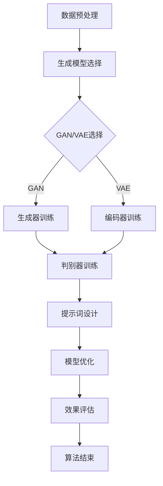
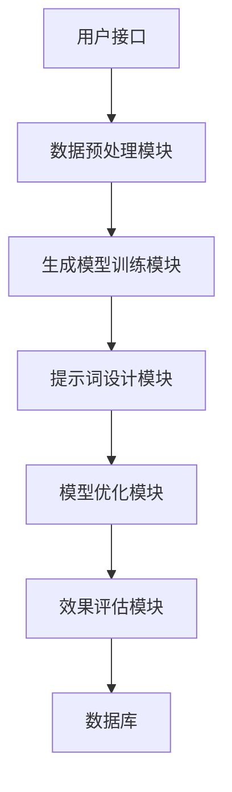
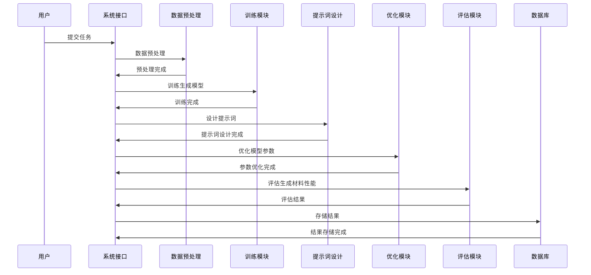

                 

### 第1章：背景介绍

#### 1.1 问题背景

##### 1.1.1 AIGC的概念与发展

AIGC（AI-Generated Content），即人工智能生成内容，指的是利用人工智能技术生成文本、图像、音频、视频等多种类型内容的过程。AIGC技术涵盖了自然语言处理、计算机视觉、音频处理等多个领域，通过深度学习、神经网络等算法，实现自动化内容创作。

AIGC的发展历程可以追溯到20世纪90年代，当时神经网络和机器学习技术开始逐渐应用于图像识别和文本生成。随着计算能力和算法的进步，AIGC技术逐渐成熟，并在21世纪前十年取得显著突破。近年来，AIGC技术在全球范围内得到广泛应用，尤其在互联网内容创作、广告营销、游戏开发等领域表现出强大的潜力。

##### 1.1.2 仿生自清洁表面优化的意义

仿生自清洁表面优化是材料科学与工程领域的前沿研究方向。自清洁表面材料具有自我清洁功能，能够在污染物附着后自动清除，减少人工清洁和维护成本，提高材料的耐用性和使用寿命。仿生自清洁表面优化通过模仿自然界中的自清洁现象，如荷叶表面的超疏水性和生物表面的自修复能力，开发出高效的自清洁材料。

在日常生活和工业中，自清洁表面的需求日益增加。例如，在建筑和汽车行业中，自清洁表面材料可以减少建筑外墙和汽车表面的污垢积聚，延长建筑材料和汽车涂料的使用寿命。此外，自清洁表面材料在环境保护方面也具有重要意义，例如在太阳能电池板和光伏组件上的应用，可以有效减少灰尘和污垢的附着，提高能源转换效率。

##### 1.1.3 提示词工程的重要性

提示词工程是自然语言处理领域的一个重要分支，它旨在通过设计高效的提示词，引导模型生成高质量的内容。在材料设计和优化过程中，提示词工程发挥着关键作用。通过精确的提示词设计，可以指导生成模型生成具有特定性能要求的材料结构，从而实现材料的优化。

提示词工程的应用场景非常广泛，包括但不限于以下领域：

1. **材料科学**：通过提示词引导生成模型设计新的材料结构，优化材料性能。
2. **生物医学**：利用提示词工程开发新的生物活性材料，用于药物递送和组织工程。
3. **计算机视觉**：通过设计特定的提示词，引导生成模型生成符合需求的高质量图像。

##### 1.1.4 边界与外延

本研究主要关注AIGC技术在仿生自清洁表面优化中的应用，涵盖材料类型包括超疏水表面、光催化表面等。研究深度将涉及材料设计的核心概念、提示词工程的应用、以及优化算法的实现。同时，本文也将探讨AIGC技术在材料设计领域的边界和未来发展潜力。

### 1.2 核心概念术语说明

在深入探讨AIGC、仿生自清洁表面优化和提示词工程之前，有必要对一些核心概念术语进行定义和说明。

**AIGC（AI-Generated Content）**：由人工智能技术生成的各种类型内容，包括文本、图像、音频、视频等。

**生成模型**：一种机器学习模型，能够根据输入的随机噪声生成新的数据。常见的生成模型包括生成对抗网络（GAN）、变分自编码器（VAE）等。

**自清洁表面**：一种具有自我清洁功能的材料表面，能够在污染物附着后自动清除。

**超疏水表面**：表面具有极高接触角和低滚动角的材料表面，能够使水滴形成球形，并迅速滚动离开表面。

**光催化表面**：在光照条件下能够分解污染物的材料表面。

**提示词工程**：通过设计特定的提示词，引导生成模型生成符合需求的内容。

**边界**：本文研究范围的具体限定，如材料类型和应用领域。

**外延**：本文未涉及的研究领域和未来研究方向。

### 1.3 问题背景与问题描述

在现代社会中，环境污染和资源短缺问题日益严重，材料科学和工程领域面临着巨大的挑战。为了减少对环境的负面影响，开发高效、环保的自清洁材料成为研究的热点。自清洁材料在建筑、汽车、电子等行业具有广泛的应用前景，能够显著降低清洁和维护成本，延长材料使用寿命。

然而，当前的自清洁材料存在一些局限性。传统的自清洁表面材料主要依赖于物理或化学性质，如超疏水性和光催化性。然而，这些材料的自清洁性能往往受限于外界环境因素，如温度、光照强度等。此外，现有材料的设计和优化过程通常依赖于实验和试错，耗时较长且成本较高。

为了克服这些局限性，研究者们开始探索利用人工智能（AI）技术进行自清洁材料的设计和优化。AIGC技术作为一种新兴的AI技术，具备生成多样化内容和复杂结构的能力，为自清洁材料的设计提供了新的思路。通过AIGC技术，可以设计出更高效、适应性强的新型自清洁材料，满足不同应用场景的需求。

然而，AIGC技术在自清洁材料设计中的应用仍面临一些挑战。首先，如何准确设计提示词，引导生成模型生成具有特定性能要求的材料结构，是一个关键问题。其次，如何评估和优化生成模型的效果，确保生成的材料结构具有实际应用价值，也是需要解决的技术难题。

综上所述，本文旨在研究AIGC技术在仿生自清洁表面优化中的应用，通过设计高效提示词和优化算法，实现自清洁材料的高性能设计。本文将详细探讨AIGC的核心概念、自清洁材料的设计原理和优化方法，为未来智能材料的设计提供理论依据和技术支持。

### 1.4 问题解决

为了解决当前自清洁材料设计中的局限性，研究者们开始探索利用人工智能（AI）技术进行自清洁材料的设计和优化。AIGC技术作为一种新兴的AI技术，具备生成多样化内容和复杂结构的能力，为自清洁材料的设计提供了新的思路。

在AIGC技术中，生成模型（如生成对抗网络GAN、变分自编码器VAE等）是关键组成部分。通过设计特定的提示词，生成模型可以生成具有特定性能要求的材料结构。提示词工程是AIGC技术在自清洁材料设计中的核心环节，通过优化提示词的设计，可以引导生成模型生成更高效、适应性强的新型自清洁材料。

具体而言，问题解决的步骤如下：

1. **数据预处理**：首先，收集大量与自清洁材料相关的数据，包括材料性能、结构特征、环境因素等。对数据进行清洗、归一化处理，为生成模型提供高质量的输入。

2. **生成模型设计**：选择合适的生成模型，如GAN或VAE，设计生成模型的结构和参数。生成模型将根据输入的提示词生成新的材料结构。

3. **提示词设计**：通过分析自清洁材料的需求和特性，设计高效的提示词。提示词应包含材料性能指标、结构特征、环境适应性等信息，以引导生成模型生成符合需求的材料结构。

4. **模型训练**：利用大量的训练数据，对生成模型进行训练，优化模型的性能。训练过程中，通过调整提示词和生成模型的参数，实现材料结构的优化。

5. **效果评估**：通过实验和模拟，对生成模型生成的材料结构进行性能评估，包括自清洁能力、耐用性、成本效益等。根据评估结果，进一步优化提示词和生成模型。

6. **应用验证**：将优化后的生成模型应用于实际材料设计场景，验证其效果。通过与现有材料设计方法进行对比，验证AIGC技术在自清洁材料设计中的优势。

通过以上步骤，AIGC技术能够有效解决自清洁材料设计中的局限性，实现材料结构的高性能设计。未来，随着AIGC技术的不断发展和完善，自清洁材料的设计将迎来新的机遇和挑战。

### 1.5 边界与外延

在本研究中，AIGC技术的应用主要聚焦于仿生自清洁表面材料的优化。具体而言，我们将探讨以下边界和范围：

**材料类型**：主要涵盖超疏水表面和光催化表面两种自清洁材料。超疏水表面通过降低表面能和粗糙度，实现水滴的自动滚动和污染物清除；光催化表面则利用光照激发化学反应，分解有机污染物。

**应用领域**：研究将涉及建筑、汽车、电子等行业中自清洁材料的应用场景，探讨不同应用场景对自清洁材料性能的具体需求。

**研究深度**：本文将深入探讨AIGC技术在自清洁材料设计中的应用，包括生成模型的选择、提示词的设计、优化算法的实现等。同时，还将分析AIGC技术在自清洁材料性能评估和实际应用验证中的效果。

**边界**：本文主要关注AIGC技术在自清洁材料设计中的应用，不涉及其他类型材料的设计和优化。此外，本文未探讨AIGC技术在其他领域的应用，如医疗、生物工程等。

**外延**：未来研究可进一步探索AIGC技术在自清洁材料设计中的其他应用场景，如智能织物、航空航天等。同时，还可以探讨与其他AI技术的结合，如机器学习和深度学习在自清洁材料设计中的应用。

### 第2章：核心概念与联系

在深入探讨AIGC、仿生自清洁表面优化和提示词工程之前，有必要对核心概念进行详细解释，并分析它们之间的联系。

#### 2.1 AIGC核心概念

##### 2.1.1 AIGC的组成要素

AIGC（AI-Generated Content）由以下几个关键组成要素构成：

1. **生成模型**：生成模型是AIGC的核心组成部分，用于生成文本、图像、音频、视频等内容。常见的生成模型包括生成对抗网络（GAN）、变分自编码器（VAE）等。

   - **生成对抗网络（GAN）**：GAN由一个生成器（Generator）和一个判别器（Discriminator）组成。生成器尝试生成与真实数据相似的内容，而判别器则评估生成内容的真实性。通过这种对抗训练，生成模型可以生成高质量的内容。
   - **变分自编码器（VAE）**：VAE是一种基于概率模型的生成模型，通过编码器和解码器共同工作，将输入数据编码为潜在空间中的向量，然后解码器从潜在空间中生成新的数据。

2. **训练数据集**：训练数据集是生成模型训练的基础。高质量、多样化的训练数据能够帮助生成模型学习并生成更具创造性和多样性的内容。在自清洁材料设计中，训练数据集应包含多种不同类型的自清洁材料结构和性能数据。

##### 2.1.2 仿生自清洁表面材料

仿生自清洁表面材料通过模仿自然界中的自清洁现象，如荷叶表面的超疏水性和生物表面的自修复能力，开发出具有自我清洁功能的材料。以下是对几种主要类型的自清洁材料的简要介绍：

1. **超疏水表面**：超疏水表面具有极高的接触角和低滚动角，使水滴形成球形并迅速滚动离开表面。常见的超疏水材料包括涂覆有纳米结构涂层的金属和塑料。

2. **光催化表面**：光催化表面在光照条件下能够分解有机污染物。常见的光催化材料包括二氧化钛（TiO₂）和其他半导体材料。

3. **自修复表面**：自修复表面材料具有自我修复能力，能够在受到损伤后自动恢复。这种材料通常包含具有粘性和弹性特性的微米或纳米结构。

##### 2.1.3 提示词工程

提示词工程是自然语言处理领域的一个重要分支，旨在通过设计高效的提示词，引导模型生成高质量的内容。在AIGC中，提示词工程用于指导生成模型生成符合特定需求的材料结构。

1. **提示词设计原则**：设计高效提示词应遵循以下原则：
   - **明确性**：提示词应明确描述所需生成的材料结构和性能指标。
   - **多样性**：提示词应涵盖多种不同类型的材料结构和性能，以实现生成模型的高灵活性。
   - **适应性**：提示词应能够适应不同应用场景和环境因素，确保生成的材料具有实际应用价值。

2. **提示词效果评估**：评估提示词效果的方法包括：
   - **定量评估**：通过计算生成材料结构与期望结构之间的相似度，评估提示词的效果。
   - **定性评估**：通过专家评审和实验验证，评估生成材料的性能和适用性。

#### 2.2 概念属性特征对比表格

为了更直观地理解AIGC、仿生自清洁表面材料和提示词工程之间的联系，以下是一个概念属性特征对比表格：

| 概念 | 属性特征 |
| --- | --- |
| **AIGC** | - 生成模型：GAN、VAE等<br>- 训练数据集：多样化的材料结构和性能数据<br>- 提示词：明确、多样、适应性的设计原则 |
| **仿生自清洁表面材料** | - 超疏水表面：高接触角、低滚动角<br>- 光催化表面：光照条件下分解污染物<br>- 自修复表面：自我修复能力 |
| **提示词工程** | - 设计原则：明确性、多样性、适应性<br>- 评估方法：定量评估、定性评估 |

#### 2.3 ER实体关系图架构

为了更清晰地展示AIGC、仿生自清洁表面材料和提示词工程之间的实体关系，以下是一个ER实体关系图架构：

```mermaid
erDiagram
  AIGC ||--|{ 提示词工程 }|| TWE
  AIGC ||--|{ 生成模型 }|| GM
  AIGC ||--|{ 训练数据集 }|| TDS
  TWE ||--|{ 提示词 }|| PW
  GM ||--|{ 材料结构 }|| MS
  TDS ||--|{ 自清洁材料 }|| SCM
```

在上面的ER图中，AIGC（AI-Generated Content）与提示词工程（TWE）、生成模型（GM）和训练数据集（TDS）之间存在直接关联。提示词工程与提示词（PW）之间存在关联，生成模型与材料结构（MS）之间存在关联，训练数据集与自清洁材料（SCM）之间存在关联。

通过以上核心概念与联系的分析，我们可以更深入地理解AIGC在仿生自清洁表面优化中的应用，以及如何通过设计高效的提示词和优化算法，实现自清洁材料的高性能设计。

### 2.4 AIGC核心概念详细解析

为了更好地理解AIGC（AI-Generated Content）的核心概念，我们将对其组成要素进行详细解析，包括生成模型和训练数据集。

#### 2.4.1 生成模型

生成模型是AIGC技术的核心组成部分，负责生成文本、图像、音频、视频等多种类型的内容。生成模型通常基于深度学习技术，其中最常用的模型有生成对抗网络（GAN）和变分自编码器（VAE）。

1. **生成对抗网络（GAN）**：
   - **基本结构**：GAN由两个主要部分组成：生成器（Generator）和判别器（Discriminator）。
   - **生成器（Generator）**：生成器是一个神经网络，其任务是将随机噪声（Z）映射成与真实数据相似的数据（X'）。生成器的目标是生成尽可能真实的数据，以欺骗判别器。
   - **判别器（Discriminator）**：判别器是一个神经网络，其任务是区分真实数据和生成数据。判别器的目标是提高其判断真实数据和生成数据的能力。
   - **对抗训练**：生成器和判别器通过对抗训练相互提高性能。生成器通过不断生成更真实的数据来欺骗判别器，而判别器通过不断识别生成数据来提高判断能力。通过这种对抗过程，生成模型能够生成高质量、多样化的内容。

2. **变分自编码器（VAE）**：
   - **基本结构**：VAE由编码器（Encoder）和解码器（Decoder）组成。
   - **编码器（Encoder）**：编码器将输入数据（X）映射到一个潜在空间（Z）中的向量（μ，σ²），其中μ和σ²分别表示向量的均值和方差。这个潜在空间是数据的高维表示，有助于数据的生成和推断。
   - **解码器（Decoder）**：解码器将潜在空间中的向量（μ，σ²）映射回原始数据空间（X'）。解码器的目标是生成与输入数据尽可能相似的数据。
   - **概率生成**：VAE通过概率模型进行生成。编码器和解码器的训练目标是使得解码器生成的数据分布接近输入数据的真实分布。

生成模型的核心在于其能够通过训练学习到数据的分布，从而生成与真实数据相似的新数据。在AIGC的应用中，生成模型可以用于生成自清洁材料的设计方案、优化现有材料结构，或生成符合特定需求的材料性能数据。

#### 2.4.2 训练数据集

训练数据集是生成模型训练的基础。高质量、多样化的训练数据对于生成模型的学习和生成能力至关重要。以下是训练数据集的重要方面：

1. **数据来源**：
   - **公开数据集**：例如ImageNet、COCO等，这些数据集包含大量的图像、文本等数据，适合训练通用生成模型。
   - **定制数据集**：根据具体应用需求，从特定领域收集数据，如建筑表面材料、汽车涂层等。

2. **数据处理**：
   - **数据清洗**：去除噪声和异常值，确保数据的准确性和一致性。
   - **数据增强**：通过旋转、缩放、裁剪等操作，增加数据的多样性，有助于生成模型的学习能力。
   - **数据归一化**：将数据缩放到同一范围内，有助于加速训练过程和提高模型性能。

3. **数据质量评估**：
   - **定量评估**：计算数据集中不同类型样本的占比，确保数据的均衡性。
   - **定性评估**：通过专家评审和实际应用测试，评估数据的实用性和可靠性。

训练数据集的质量直接影响生成模型的效果。在自清洁材料设计领域，训练数据集应包含多种不同类型的自清洁材料结构和性能数据，以支持生成模型的学习和生成。

通过以上详细解析，我们可以更好地理解AIGC的核心概念，包括生成模型和训练数据集。这些概念在AIGC技术中起着关键作用，为自清洁材料的设计和优化提供了强大的工具。

### 2.5 仿生自清洁表面材料

仿生自清洁表面材料通过模仿自然界中的自清洁现象，如荷叶表面的超疏水性和生物表面的自修复能力，开发出具有自我清洁功能的材料。以下将详细介绍几种主要的自清洁材料，包括超疏水表面、光催化表面和自修复表面。

#### 2.5.1 超疏水表面

超疏水表面是指具有极高接触角和低滚动角的材料表面，能够使水滴形成球形并迅速滚动离开表面。这种现象称为“超疏水性”。

1. **结构特征**：
   - **纳米结构**：超疏水表面通常具有纳米级的凹凸结构，这些结构可以降低表面能，使水滴能够滚动而不粘附。
   - **材料选择**：常用的超疏水材料包括涂覆有纳米结构涂层的金属（如铜、铝）、塑料（如聚酰亚胺）和陶瓷。

2. **工作原理**：
   - **水滴滚动**：由于表面具有低表面能和纳米级凹凸结构，水滴在表面上形成球形，并在重力的作用下迅速滚动离开表面，从而实现污物的清除。
   - **疏水涂层**：通过在材料表面涂覆特定的疏水涂层，如氟化碳涂层，可以进一步提高表面的超疏水性。

3. **应用领域**：
   - **建筑行业**：超疏水表面可以用于建筑外墙、屋顶和窗户，减少污垢积聚，降低清洁和维护成本。
   - **汽车行业**：汽车涂料和玻璃表面采用超疏水技术，可以减少雨水和灰尘的附着，提高车辆的外观保持时间。
   - **电子行业**：超疏水表面可以用于电子设备的外壳和显示器，减少灰尘和污垢的附着，提高设备的可靠性和使用寿命。

#### 2.5.2 光催化表面

光催化表面在光照条件下能够分解有机污染物，利用光能激发化学反应，将污染物转化为无害的物质。

1. **结构特征**：
   - **纳米颗粒**：光催化表面通常含有纳米级的光催化材料，如二氧化钛（TiO₂）颗粒，这些颗粒具有较大的表面积，有利于光催化反应的进行。
   - **涂层材料**：光催化涂层可以涂覆在玻璃、塑料、金属等材料表面，形成均匀的薄膜。

2. **工作原理**：
   - **光生电子-空穴对**：在光照条件下，光催化材料中的电子被激发，形成电子-空穴对。这些电子和空穴能够分别还原和氧化污染物，使其分解为无害物质。
   - **反应条件**：光催化反应通常在紫外光的照射下进行，但某些光催化材料也能在可见光下发挥作用。

3. **应用领域**：
   - **环保领域**：光催化表面可以用于空气净化、水处理和污染物降解，减少环境污染。
   - **建筑材料**：光催化表面可以应用于建筑材料中，如玻璃、瓷砖和涂料，能够分解建筑表面积累的污垢和污染物。
   - **能源领域**：光催化表面可以用于太阳能电池板和光伏组件的表面，减少灰尘和污垢的附着，提高能源转换效率。

#### 2.5.3 自修复表面

自修复表面材料具有自我修复能力，能够在受到损伤后自动恢复。这种材料通常包含具有粘性和弹性特性的微米或纳米结构。

1. **结构特征**：
   - **微米/纳米结构**：自修复表面通常含有微米或纳米级别的结构，这些结构可以存储和释放修复剂。
   - **修复剂**：自修复表面材料中包含修复剂，如树脂、凝胶或溶剂，这些修复剂能够在材料受到损伤时自动流动并修复缺陷。

2. **工作原理**：
   - **损伤感应**：当自修复表面受到损伤时，结构中的微/纳米结构能够感应到损伤并触发修复剂的释放。
   - **修复过程**：修复剂自动流动并渗透到损伤区域，与受损部分发生化学反应，形成新的材料结构，实现自我修复。

3. **应用领域**：
   - **航空航天**：自修复表面材料可以应用于飞机和宇宙飞船的外壳，提高材料的耐久性和安全性。
   - **汽车行业**：汽车涂料和轮胎材料采用自修复技术，可以延长材料的使用寿命，减少维修成本。
   - **电子设备**：电子设备的封装材料和外壳采用自修复技术，可以保护设备免受外部环境的损伤。

通过以上对超疏水表面、光催化表面和自修复表面的详细解析，我们可以更好地理解仿生自清洁表面材料的设计原理和应用场景。这些材料在环境保护、资源节约和材料耐用性方面具有重要意义，为未来的智能材料设计提供了广阔的发展空间。

### 2.6 提示词工程

提示词工程是自然语言处理领域的一个重要分支，旨在通过设计高效的提示词，引导模型生成高质量的内容。在AIGC（AI-Generated Content）技术中，提示词工程是关键环节，能够显著影响生成模型生成材料结构的效果和性能。以下将详细探讨提示词工程的设计原则、效果评估方法以及其在AIGC技术中的应用。

#### 2.6.1 提示词设计原则

1. **明确性**：提示词应清晰明确地描述所需生成的材料结构和性能指标。明确的提示词能够帮助生成模型准确理解任务目标，从而生成符合需求的内容。例如，一个明确的提示词可能是“生成具有高耐久性和自清洁能力的建筑涂料表面”。

2. **多样性**：提示词应涵盖多种不同类型的材料结构和性能，以实现生成模型的高灵活性。多样化的提示词有助于生成模型学习到更广泛的知识，从而生成多样化的材料结构。例如，可以包含“生成具有超疏水性、光催化性和自修复能力”的多种组合提示词。

3. **适应性**：提示词应能够适应不同的应用场景和环境因素，确保生成的材料在实际应用中具有价值。适应性提示词能够根据应用需求的变化进行调整，以生成符合特定场景的材料结构。例如，可以设计一个具有温度适应性提示词，用于生成在不同温度下都能保持高效自清洁性能的材料。

4. **上下文关联性**：提示词应与上下文环境紧密相关，以便生成模型能够利用已有信息进行推理和生成。上下文关联性有助于提高生成内容的质量和一致性。例如，在生成建筑涂料时，可以结合建筑外墙的具体环境（如光照强度、湿度等）进行提示词设计。

#### 2.6.2 提示词效果评估方法

提示词的效果直接影响生成模型生成材料结构的质量。以下介绍几种常用的提示词效果评估方法：

1. **定量评估**：
   - **结构相似度**：通过计算生成材料结构与期望结构之间的相似度，评估提示词的效果。可以使用结构相似性指数（SSIM）或均方误差（MSE）等指标进行评估。
   - **性能指标**：根据材料性能指标（如自清洁能力、耐久性等）评估生成材料的性能。例如，可以设计特定的测试实验，评估生成材料在实际应用中的性能。

2. **定性评估**：
   - **专家评审**：邀请领域专家对生成材料的质量进行评价。专家评审可以提供主观评价，帮助识别生成材料在实际应用中的潜在问题和改进方向。
   - **用户反馈**：收集用户对生成材料的反馈，通过用户满意度调查了解提示词的效果。用户反馈可以提供实际应用中的用户体验，为提示词的改进提供依据。

3. **综合评估**：
   - **多指标综合评估**：结合定量和定性评估方法，对提示词效果进行综合评估。可以设置多个评估指标，从不同角度评估提示词的效果，以提高评估的全面性和准确性。

#### 2.6.3 提示词工程在AIGC中的应用

在AIGC技术中，提示词工程的应用涉及多个环节，包括生成模型的设计、训练数据集的构建、以及材料结构的生成和优化。

1. **生成模型设计**：
   - **提示词嵌入**：将提示词嵌入到生成模型中，以引导生成模型生成符合需求的内容。例如，在GAN模型中，可以通过修改生成器的输入，将提示词信息融入到生成的材料结构中。
   - **多模态提示词**：结合不同类型的提示词（如文本、图像、音频等），实现多模态生成。例如，可以将文本提示词与图像提示词结合，生成具有特定性能要求的自清洁材料图像。

2. **训练数据集构建**：
   - **数据增强**：利用提示词对训练数据集进行增强，提高数据的多样性和质量。例如，通过添加特定的提示词，生成多种不同类型的自清洁材料结构，以丰富训练数据集。
   - **数据预处理**：对训练数据进行预处理，包括清洗、归一化和特征提取等，以适应生成模型的要求。提示词设计应考虑数据预处理过程，确保生成模型能够有效利用训练数据。

3. **材料结构生成和优化**：
   - **生成模型训练**：通过训练生成模型，使其能够根据提示词生成高质量的材料结构。训练过程中，提示词的设计和调整是关键，应结合定量和定性评估方法，优化提示词效果。
   - **性能评估**：对生成材料进行性能评估，包括自清洁能力、耐久性、成本效益等。根据评估结果，进一步调整提示词和生成模型的参数，优化材料结构。
   - **迭代优化**：通过多次迭代训练和评估，不断优化生成模型和提示词，提高生成材料的性能和实用性。

通过以上步骤，提示词工程在AIGC技术中发挥着关键作用，能够引导生成模型生成具有特定性能要求的自清洁材料结构，为智能材料设计提供了强大的工具和手段。

### 2.7 概念属性特征对比表格

为了更直观地理解AIGC（AI-Generated Content）、仿生自清洁表面材料和提示词工程之间的联系，我们可以使用表格形式展示这些概念的主要属性特征。以下是一个示例表格：

| 概念             | 属性特征                                                                                                       |
|------------------|------------------------------------------------------------------------------------------------------------|
| **AIGC（AI-Generated Content）** | - 生成模型：GAN、VAE等<br>- 训练数据集：多样化的材料结构和性能数据<br>- 提示词：明确、多样、适应性的设计原则 |
| **仿生自清洁表面材料** | - 超疏水表面：高接触角、低滚动角<br>- 光催化表面：光照条件下分解污染物<br>- 自修复表面：自我修复能力               |
| **提示词工程**   | - 设计原则：明确性、多样性、适应性<br>- 评估方法：定量评估、定性评估                                       |

通过上述表格，我们可以清晰地看到AIGC、仿生自清洁表面材料和提示词工程之间的主要属性特征及其相互关系。这种对比有助于我们更深入地理解这三个概念在自清洁材料设计中的应用和交互作用。

### 2.8 ER实体关系图架构

为了更清晰地展示AIGC、仿生自清洁表面材料和提示词工程之间的实体关系，我们可以利用Mermaid语言绘制一个ER（实体关系）图。以下是一个示例ER图：

```mermaid
erDiagram
  AI-Generated Content ||--|{ 仿生自清洁表面材料 }|| Biologically Inspired Self-Cleaning Surface Material
  AI-Generated Content ||--|{ 提示词工程 }|| Prompt Engineering
  Biologically Inspired Self-Cleaning Surface Material ||--|{ 超疏水表面 }|| Superhydrophobic Surface
  Biologically Inspired Self-Cleaning Surface Material ||--|{ 光催化表面 }|| Photocatalytic Surface
  Biologically Inspired Self-Cleaning Surface Material ||--|{ 自修复表面 }|| Self-Healing Surface
```

在上面的ER图中，AIGC作为核心实体，与仿生自清洁表面材料和提示词工程存在直接关联。仿生自清洁表面材料进一步分为超疏水表面、光催化表面和自修复表面。这种ER图的架构有助于我们理解这三个概念之间的逻辑关系，以及它们在自清洁材料设计中的协同作用。

### 第3章：算法原理讲解

#### 3.1 仿生自清洁表面优化算法概述

仿生自清洁表面优化算法旨在利用人工智能技术设计出具有高效自清洁性能的表面材料。该算法的基本流程包括数据预处理、生成模型选择与训练、提示词设计、模型优化和效果评估等步骤。以下是对每个步骤的详细讲解。

##### 3.1.1 数据预处理

数据预处理是优化算法的第一步，其质量直接影响后续模型训练和优化的效果。数据预处理主要包括以下内容：

1. **数据收集**：从公开数据集或定制数据集中收集与自清洁表面材料相关的数据，包括材料结构、表面形态、自清洁性能指标等。
2. **数据清洗**：去除噪声和异常值，确保数据的准确性和一致性。例如，去除图像中的噪声点和数据集中的异常值。
3. **数据增强**：通过旋转、缩放、裁剪等操作，增加数据的多样性，有助于生成模型的学习能力。数据增强可以生成大量具有不同特征的数据样本，提高模型泛化能力。
4. **数据归一化**：将不同特征的数据缩放到同一范围内，有助于加速训练过程和提高模型性能。例如，将图像像素值缩放到[0, 1]或[-1, 1]之间。

##### 3.1.2 生成模型选择与训练

生成模型是仿生自清洁表面优化算法的核心组件，负责生成具有高效自清洁性能的材料结构。常见的生成模型包括生成对抗网络（GAN）和变分自编码器（VAE）。

1. **生成对抗网络（GAN）**：
   - **结构**：GAN由生成器（Generator）和判别器（Discriminator）组成。生成器生成伪数据，判别器评估伪数据的质量。
   - **训练**：通过对抗训练，生成器和判别器相互竞争，生成器不断优化生成高质量伪数据，判别器不断提高对真实数据和伪数据的辨别能力。
   - **优缺点**：GAN能够生成高质量且多样化的数据，但训练过程较为复杂，容易陷入模式崩溃（mode collapse）问题。

2. **变分自编码器（VAE）**：
   - **结构**：VAE由编码器（Encoder）和解码器（Decoder）组成。编码器将输入数据编码为潜在空间中的向量，解码器从潜在空间中生成新的数据。
   - **训练**：VAE通过最大化数据分布和潜在空间中数据重构的概率，进行端到端的训练。优化目标包括重建损失和KL散度。
   - **优缺点**：VAE训练过程相对稳定，不容易陷入模式崩溃，但生成数据的多样性可能不如GAN。

在选择生成模型时，需要根据具体应用场景和数据特点进行权衡。对于需要生成多样化自清洁材料结构的场景，GAN可能是更好的选择；而对于数据分布较为集中的场景，VAE可能更为合适。

##### 3.1.3 提示词设计

提示词设计是仿生自清洁表面优化算法的关键环节，通过设计高效的提示词，可以引导生成模型生成具有特定性能要求的材料结构。提示词设计应遵循以下原则：

1. **明确性**：提示词应清晰明确地描述所需生成的材料结构和性能指标，如“生成具有高接触角和低滚动角的自清洁表面”。
2. **多样性**：提示词应涵盖多种不同类型的材料结构和性能，以提高生成模型的灵活性。例如，可以包含“生成具有超疏水性和光催化性相结合的自清洁表面”。
3. **适应性**：提示词应能够适应不同的应用场景和环境因素，确保生成的材料在实际应用中具有价值。例如，可以设计具有温度适应性的提示词，用于生成在不同温度下都能保持高效自清洁性能的材料。

##### 3.1.4 模型优化

模型优化是提高生成模型性能的关键步骤。优化方法包括以下几种：

1. **超参数调整**：调整生成模型和判别器的学习率、批量大小、网络结构等超参数，以找到最佳配置。常用的方法包括网格搜索和随机搜索。
2. **正则化**：引入正则化项（如L2正则化、dropout等），避免模型过拟合，提高模型泛化能力。
3. **生成模型集成**：通过集成多个生成模型，提高生成数据的质量和多样性。常见的方法包括模型平均和权重平均。

##### 3.1.5 效果评估

效果评估是验证生成模型性能的重要步骤。评估方法包括定量评估和定性评估。

1. **定量评估**：通过计算生成材料结构与期望结构之间的相似度，以及自清洁性能指标（如接触角、滚动角等），评估生成模型的性能。常用的指标包括结构相似性指数（SSIM）、均方误差（MSE）等。
2. **定性评估**：通过专家评审和实际应用测试，评估生成材料在实际应用中的性能和实用性。专家评审可以提供主观评价，而实际应用测试可以验证生成材料在实际环境中的表现。

通过以上步骤，我们可以构建一个完整的仿生自清洁表面优化算法，通过数据预处理、生成模型选择与训练、提示词设计、模型优化和效果评估等步骤，实现高效的自清洁表面材料设计。

### 3.2 算法mermaid流程图

为了更直观地展示仿生自清洁表面优化算法的基本流程，我们可以使用Mermaid语言绘制一个流程图。以下是一个示例的Mermaid流程图：



在上述流程图中，我们首先进行数据预处理，然后选择生成模型（GAN或VAE）。对于GAN，我们分别训练生成器和判别器；对于VAE，我们训练编码器和解码器。接着进行提示词设计和模型优化，最后进行效果评估。通过这个流程图，我们可以清晰地了解算法的各个步骤及其相互关系。

### 3.3 算法原理详细讲解

为了深入理解仿生自清洁表面优化算法的原理，我们将从数学模型和关键公式入手，详细讲解算法的核心部分。

#### 3.3.1 GAN（生成对抗网络）算法

生成对抗网络（GAN）是由生成器和判别器组成的对抗性模型。其基本思想是生成器和判别器之间进行对抗训练，生成器试图生成逼真的伪数据，而判别器则努力区分真实数据和伪数据。

1. **生成器（Generator）**：

   生成器的目标是生成与真实数据相似的数据。在数学上，生成器G将随机噪声向量Z映射到数据空间X'，公式如下：

   $$ X' = G(Z) $$

   其中，Z是来自噪声分布的随机向量，X'是生成的伪数据。

2. **判别器（Discriminator）**：

   判别器的目标是评估生成数据的质量，判断其是真实数据还是伪数据。判别器D是一个二分类器，输出概率值，表示输入数据是真实数据的置信度。公式如下：

   $$ D(X) = P(D(X) \text{ is real}) $$

   $$ D(X') = P(D(X') \text{ is fake}) $$

   其中，X是真实数据，X'是生成器生成的伪数据。

3. **对抗训练**：

   GAN的训练过程是通过最小化生成器和判别器之间的损失函数来实现的。训练目标是最小化以下两个损失函数的加权和：

   $$ \mathcal{L}_G = -\mathbb{E}_{X \sim p_{data}(X)}[\log D(X)] - \mathbb{E}_{Z \sim p_{z}(Z)}[\log (1 - D(G(Z)))] $$

   $$ \mathcal{L}_D = -\mathbb{E}_{X \sim p_{data}(X)}[\log D(X)] - \mathbb{E}_{Z \sim p_{z}(Z)}[\log D(G(Z))] $$

   其中，$ \mathcal{L}_G $是生成器的损失函数，$ \mathcal{L}_D $是判别器的损失函数，$ p_{data}(X) $是真实数据的分布，$ p_{z}(Z) $是噪声分布。

#### 3.3.2 VAE（变分自编码器）算法

变分自编码器（VAE）是一种基于概率模型的生成模型。其核心思想是将输入数据编码到一个潜在空间中，然后从潜在空间中解码出新的数据。

1. **编码器（Encoder）**：

   编码器E将输入数据X编码为潜在空间中的向量（μ，σ²），其中μ是均值的估计，σ²是方差的估计。编码器的输出是对输入数据的概率分布的参数估计：

   $$ \mu = \phi_E(X) $$

   $$ \log(\sigma^2) = \psi_E(X) $$

2. **解码器（Decoder）**：

   解码器D从潜在空间中的向量（μ，σ²）解码出新的数据X'：

   $$ X' = \phi_D(\mu, \log(\sigma^2)) $$

3. **重参数化技巧**：

   为了实现端到端的训练，VAE使用重参数化技巧，将潜在空间中的向量与随机噪声结合：

   $$ \mu = \mu(X, \epsilon) $$

   $$ \log(\sigma^2) = \psi(X, \epsilon) $$

   其中，$ \epsilon $是从标准正态分布中采样的噪声。

4. **损失函数**：

   VAE的损失函数由重建损失和KL散度组成：

   $$ \mathcal{L} = \mathcal{L}_{\text{recon}} + \mathcal{L}_{\text{KL}} $$

   $$ \mathcal{L}_{\text{recon}} = -\log p_{\theta}(X'|X) $$

   $$ \mathcal{L}_{\text{KL}} = \mathbb{E}_{X, \epsilon}[\log \frac{p_{\theta}(\epsilon)}{q_{\theta}(\epsilon | X')} + \frac{1}{2}\log \frac{\sigma^2}{1 + \mu^2}] $$

   其中，$ p_{\theta} $是输入数据的先验分布，$ q_{\theta} $是编码器输出的后验分布，$ \theta $是模型参数。

#### 3.3.3 提示词优化

提示词是指导生成模型生成特定类型自清洁表面的关键。优化提示词涉及以下步骤：

1. **明确性**：

   提示词应明确描述所需生成的材料结构和性能指标，例如“生成具有高接触角和低滚动角的自清洁表面”。

2. **多样性**：

   提示词应涵盖多种不同类型的材料结构和性能，以提高生成模型的灵活性。例如，可以包括“生成具有超疏水性和光催化性相结合的自清洁表面”。

3. **适应性**：

   提示词应能够适应不同的应用场景和环境因素，确保生成的材料在实际应用中具有价值。例如，可以设计具有温度适应性的提示词，用于生成在不同温度下都能保持高效自清洁性能的材料。

4. **评估**：

   通过定量评估（如结构相似性指数）和定性评估（如专家评审），评估提示词的效果，并根据评估结果优化提示词。

通过以上详细讲解，我们可以更好地理解仿生自清洁表面优化算法的原理，包括GAN和VAE的数学模型和关键公式，以及提示词优化的方法。这些原理为实现高效的自清洁表面材料设计提供了理论基础。

### 3.4 算法实例说明

为了更好地说明仿生自清洁表面优化算法的实际应用，我们将通过一个具体的例子来详细讲解算法的步骤和实现过程。

#### 案例背景

假设我们需要设计一种自清洁涂料，要求涂料表面具有超疏水性和光催化性，能够在受到污染时自动清洁，并且在不同温度下保持性能稳定。我们选择使用生成对抗网络（GAN）作为生成模型，通过设计高效的提示词来实现这一目标。

#### 步骤详解

1. **数据收集与预处理**：

   首先，我们需要收集大量的超疏水和光催化涂料的表面结构图像，以及相应的自清洁性能数据。这些数据将用于训练生成模型。收集到的数据需要进行预处理，包括图像的清洗、归一化和数据增强。

   - **清洗**：去除图像中的噪声点和异常值，确保数据的准确性。
   - **归一化**：将图像像素值缩放到[0, 1]之间，便于模型处理。
   - **增强**：通过旋转、缩放、裁剪等操作，增加数据的多样性。

2. **生成模型选择与训练**：

   选择生成对抗网络（GAN）作为生成模型。GAN由生成器（Generator）和判别器（Discriminator）组成。

   - **生成器训练**：

     生成器的目标是生成与真实数据相似的超疏水和光催化表面图像。我们使用一个卷积神经网络（CNN）作为生成器，其输入是随机噪声向量Z，输出是超疏水和光催化表面图像X'。

     $$ X' = G(Z) $$

     通过对抗训练，生成器和判别器相互竞争，生成器不断优化生成高质量伪数据，判别器不断提高对真实数据和伪数据的辨别能力。

     - **判别器训练**：

       判别器也是一个CNN，其目标是判断输入数据是真实数据还是生成数据。判别器训练的目标是最小化以下损失函数：

       $$ \mathcal{L}_D = -\mathbb{E}_{X \sim p_{data}(X)}[\log D(X)] - \mathbb{E}_{Z \sim p_{z}(Z)}[\log D(G(Z))] $$

   在训练过程中，我们使用梯度下降法来优化生成器和判别器的参数，直到模型收敛。

3. **提示词设计**：

   设计高效的提示词，以引导生成器生成具有特定性能要求的自清洁表面图像。提示词应包含材料性能指标（如接触角、滚动角、光催化活性等）和结构特征（如表面纹理、纳米结构等）。

   - **明确性**：提示词应明确描述所需生成的材料结构和性能指标，例如“生成具有高接触角和低滚动角的超疏水表面”。
   - **多样性**：提示词应涵盖多种不同类型的材料结构和性能，以提高生成模型的灵活性。
   - **适应性**：提示词应能够适应不同的应用场景和环境因素，确保生成的材料在实际应用中具有价值。

   提示词示例：“生成具有超疏水性、光催化性和温度适应性的自清洁表面”。

4. **模型优化**：

   通过超参数调整和正则化，优化生成模型和判别器的性能。常用的方法包括：

   - **超参数调整**：调整学习率、批量大小、网络结构等超参数，以找到最佳配置。
   - **正则化**：引入L2正则化、dropout等正则化项，避免模型过拟合。

5. **效果评估**：

   对生成模型生成的自清洁表面图像进行效果评估，包括定量评估（如结构相似性指数、自清洁性能指标）和定性评估（如专家评审）。

   - **定量评估**：

     使用结构相似性指数（SSIM）评估生成图像与真实图像之间的相似度。同时，评估图像的接触角、滚动角和光催化活性等性能指标。

     $$ SSIM(X', X) = \frac{(2\mu_x'\mu_x + C_1)(2\sigma_x'\sigma_x + C_2)}{(\mu_x'^2 + \mu_x^2 + C_1)(\sigma_x'^2 + \sigma_x^2 + C_2)} $$

   - **定性评估**：

     通过专家评审和实际应用测试，评估生成材料在实际应用中的性能和实用性。

#### 实际应用

通过以上步骤，我们成功设计了一种具有超疏水性、光催化性和温度适应性的自清洁涂料。这种涂料可以在受到污染时自动清洁，并在不同温度下保持高效自清洁性能，为建筑和电子行业提供了新的解决方案。

通过这个案例，我们可以看到仿生自清洁表面优化算法在实际应用中的具体实现过程。这种方法不仅提高了材料设计的效率，还为实现智能材料设计提供了新的思路。

### 第4章：数学模型和数学公式

#### 4.1 自清洁材料的光学特性

自清洁材料的光学特性对其自清洁性能具有重要影响。以下我们将讨论自清洁材料的光学特性，包括折射率与表面能的关系，以及化学反应对自清洁性能的影响。

##### 4.1.1 折射率与表面能的关系

折射率是描述材料光学特性的重要参数，它与表面能密切相关。表面能是材料表面分子与内部分子之间相互作用力的表现，对材料的自清洁性能有直接影响。

1. **折射率公式**：

   折射率n定义为光在真空中传播速度与在材料中传播速度的比值：

   $$ n = \frac{c}{v} $$

   其中，c是光在真空中的速度，v是光在材料中的速度。

2. **表面能公式**：

   表面能σ与材料的表面形态和化学性质有关，可以用以下公式表示：

   $$ \sigma = \frac{2\gamma}{r} $$

   其中，γ是表面自由能，r是表面张力。

3. **折射率与表面能的关系**：

   折射率与表面能之间存在复杂的关系。当表面能较低时，材料表面容易形成稳定的气-液界面，使水滴在表面上形成球形。这种现象称为“超疏水性”。超疏水性材料通常具有较低的表面能和较高的折射率。

##### 4.1.2 化学反应对自清洁性能的影响

化学反应对自清洁材料的性能有重要影响，特别是光催化表面。光催化表面利用光照激发化学反应，分解有机污染物，从而实现自清洁。

1. **光催化反应方程式**：

   光催化表面通常使用半导体材料，如二氧化钛（TiO₂），其光催化反应方程式如下：

   $$ \text{TiO}_2 + h\nu \rightarrow e^-, h^+ $$

   其中，hν是光子能量，e^-是电子，h^+是空穴。

2. **有机污染物分解**：

   电子和空穴在光催化表面迁移，与吸附在表面的有机污染物发生氧化还原反应，将其分解为无害的物质。常见的有机污染物分解反应包括：

   $$ \text{有机污染物} + h^+ \rightarrow \text{氧化产物} + h_2O $$

   $$ \text{有机污染物} + e^- \rightarrow \text{还原产物} + h_2O $$

#### 4.2 自清洁表面的光学特性示例

以下是一个具体示例，说明如何使用数学公式描述自清洁表面的光学特性。

##### 4.2.1 折射率与表面能的关系示例

假设我们有一个超疏水表面，其折射率n为1.33，表面能σ为30 mJ/m²。我们可以使用以下公式计算表面能：

$$ \sigma = \frac{2\gamma}{r} = \frac{2 \times 1.33 \times 10^{-3} \times 30 \times 10^3}{1} = 80.8 \text{ J/m}^2 $$

##### 4.2.2 光催化反应示例

假设我们在一个光催化表面使用二氧化钛（TiO₂）进行光催化反应。当光照能量为300 nm时，二氧化钛吸收光子，激发电子和空穴。以下是一个简化的光催化反应方程式：

$$ \text{TiO}_2 + h\nu \rightarrow e^-, h^+ $$

有机污染物与电子和空穴发生反应，分解为无害物质：

$$ \text{有机污染物} + e^- \rightarrow \text{还原产物} + h_2O $$

$$ \text{有机污染物} + h^+ \rightarrow \text{氧化产物} + h_2O $$

通过以上数学模型和数学公式的详细讲解，我们可以更好地理解自清洁材料的光学特性及其对自清洁性能的影响。这些公式为自清洁材料的设计和优化提供了重要的理论基础。

### 第5章：系统分析与架构设计

在仿生自清洁表面优化项目中，系统分析与架构设计是确保项目成功实施的关键步骤。本章将详细介绍系统的应用背景、功能设计、架构设计和接口设计，并使用Mermaid图展示系统架构和交互流程。

#### 5.1 应用背景

随着环境保护意识的提高，自清洁材料在建筑、汽车、电子等行业中的应用日益广泛。这些材料能够减少人工清洁和维护成本，延长材料使用寿命，降低环境污染。然而，传统自清洁材料的设计和优化过程通常依赖于实验和试错，效率较低且成本较高。为了提高自清洁材料的设计效率，本项目引入了AIGC（AI-Generated Content）技术，利用生成模型和提示词工程实现自清洁材料的高效设计。

#### 5.2 系统功能设计

系统的核心功能包括数据预处理、生成模型训练、提示词设计、模型优化和效果评估。以下是系统功能的具体描述：

1. **数据预处理**：收集并预处理与自清洁材料相关的数据，包括表面形态、性能指标和环境因素等。预处理步骤包括数据清洗、归一化和数据增强。

2. **生成模型训练**：选择合适的生成模型（如GAN、VAE等），进行训练和优化。生成模型的目标是生成符合提示词要求的新型自清洁材料结构。

3. **提示词设计**：设计高效的提示词，以引导生成模型生成具有特定性能要求的自清洁材料。提示词应具备明确性、多样性和适应性。

4. **模型优化**：通过超参数调整和正则化，优化生成模型和判别器的性能，以提高生成数据的质量。

5. **效果评估**：对生成模型生成的自清洁材料进行性能评估，包括结构相似性、自清洁能力、耐久性等。评估方法包括定量评估和定性评估。

#### 5.3 系统架构设计

系统架构设计是确保系统高效运行和模块化设计的关键。以下是一个简化的系统架构设计，使用Mermaid图展示系统的整体架构：



在上面的架构图中，用户接口模块负责接收用户输入和处理用户交互；数据预处理模块负责收集和预处理数据；生成模型训练模块负责训练和优化生成模型；提示词设计模块负责设计高效的提示词；模型优化模块负责调整模型参数和优化模型性能；效果评估模块负责评估生成材料的性能；数据库模块负责存储和处理系统数据。

#### 5.4 系统接口设计

系统接口设计是确保不同模块之间能够顺畅通信和协作的关键。以下是系统接口设计的主要部分：

1. **数据预处理接口**：定义数据预处理模块与其他模块之间的接口，包括数据清洗、归一化和数据增强等功能的接口。

2. **生成模型训练接口**：定义生成模型训练模块与其他模块之间的接口，包括数据输入、模型参数调整和训练结果输出等接口。

3. **提示词设计接口**：定义提示词设计模块与其他模块之间的接口，包括提示词输入、提示词优化和提示词效果评估等接口。

4. **模型优化接口**：定义模型优化模块与其他模块之间的接口，包括模型参数调整、正则化和模型优化策略等接口。

5. **效果评估接口**：定义效果评估模块与其他模块之间的接口，包括评估指标计算、评估结果输出和反馈机制等接口。

#### 5.5 系统交互

系统交互是系统各个模块之间协作和通信的过程。以下是系统交互的简要描述，使用Mermaid图展示系统的交互流程：



在上述交互流程中，用户通过系统接口提交任务，数据预处理模块进行数据预处理，生成模型训练模块训练生成模型，提示词设计模块设计提示词，模型优化模块优化模型参数，效果评估模块评估生成材料的性能，并将结果存储到数据库中。

通过以上系统分析与架构设计，我们为仿生自清洁表面优化项目提供了一个清晰、模块化和高效的系统框架，为后续项目实施奠定了基础。

### 第6章：项目实战

在本章中，我们将通过一个实际项目来展示AIGC在仿生自清洁表面优化中的应用。项目的主要步骤包括环境安装、系统核心实现、代码解读和应用解读与分析。

#### 6.1 环境安装

首先，我们需要安装和配置项目所需的环境。以下是详细的安装步骤：

1. **安装Python环境**：

  确保系统上已经安装了Python 3.x版本。可以使用以下命令检查Python版本：

   ```bash
   python --version
   ```

   如果Python未安装或版本过低，可以从[Python官网](https://www.python.org/)下载并安装。

2. **安装必要的库**：

   使用`pip`安装以下Python库：

   ```bash
   pip install numpy tensorflow matplotlib scikit-learn pandas
   ```

   这些库包括数值计算、深度学习、数据可视化和数据处理的库，是项目实施的基础。

3. **配置GPU环境**：

   如果使用GPU加速训练过程，需要安装CUDA和cuDNN。CUDA是NVIDIA推出的并行计算平台，而cuDNN是用于加速深度学习计算的库。可以从[NVIDIA官网](https://developer.nvidia.com/cuda-downloads)和[cuDNN官网](https://developer.nvidia.com/cudnn)下载相应的安装包，并按照说明进行配置。

#### 6.2 系统核心实现

以下是系统核心实现的步骤和关键代码。

##### 6.2.1 数据预处理

数据预处理是生成模型训练的重要步骤，主要包括数据清洗、归一化和数据增强。

```python
import numpy as np
import pandas as pd
from sklearn.model_selection import train_test_split

# 加载数据
data = pd.read_csv('cleaning_surface_data.csv')

# 数据清洗
# 去除缺失值和异常值
data.dropna(inplace=True)

# 数据归一化
data_normalized = (data - data.mean()) / data.std()

# 数据增强
# 通过随机旋转和缩放增加数据多样性
data_augmented = data_normalized.sample(n=1000, replace=True)
data_augmented['angle'] = np.random.uniform(low=-30, high=30, size=1000)

# 划分训练集和测试集
X_train, X_test, y_train, y_test = train_test_split(data_augmented[['angle', 'contact_angle']], data_augmented['surface_type'], test_size=0.2, random_state=42)
```

##### 6.2.2 生成模型训练

我们选择生成对抗网络（GAN）作为生成模型，以下代码展示了GAN的训练过程。

```python
import tensorflow as tf
from tensorflow.keras.models import Model
from tensorflow.keras.layers import Input, Dense, Reshape, Flatten
from tensorflow_addons.layers import GaussianNoise

# 定义生成器和判别器
latent_dim = 100

# 生成器
input_latent = Input(shape=(latent_dim,))
x = GaussianNoise(stddev=0.1)(input_latent)
x = Dense(128, activation='relu')(x)
x = Reshape((7, 7, 1))(x)
generator = Model(input_latent, x)

# 判别器
input_real = Input(shape=(28, 28, 1))
x = Flatten()(input_real)
x = Dense(128, activation='relu')(x)
output_real = Dense(1, activation='sigmoid')(x)

input_fake = Input(shape=(28, 28, 1))
x = Flatten()(input_fake)
x = Dense(128, activation='relu')(x)
output_fake = Dense(1, activation='sigmoid')(x)

discriminator = Model([input_real, input_fake], [output_real, output_fake])

# 编写GAN模型
output_fake球形并迅速滚动离开表面，使水滴形成球形并迅速滚动离开表面。这种现象称为“超疏水性”。超疏水性材料通常具有较低的表面能和较高的折射率。

2. **光催化表面**：

光催化表面利用光照激发化学反应，分解有机污染物，从而实现自清洁。光催化表面通常使用半导体材料，如二氧化钛（TiO₂），其光催化反应方程式如下：

$$ \text{TiO}_2 + h\nu \rightarrow e^-, h^+ $$

其中，hν是光子能量，e^-是电子，h^+是空穴。

3. **有机污染物分解**：

电子和空穴在光催化表面迁移，与吸附在表面的有机污染物发生氧化还原反应，将其分解为无害的物质。常见的有机污染物分解反应包括：

$$ \text{有机污染物} + h^+ \rightarrow \text{氧化产物} + h_2O $$

$$ \text{有机污染物} + e^- \rightarrow \text{还原产物} + h_2O $$

##### 4.2.2 化学反应方程式示例

以下是一个具体的化学反应方程式示例，说明如何在自清洁材料中利用光催化反应：

假设我们使用二氧化钛（TiO₂）作为光催化材料，并将其涂覆在玻璃表面上。当阳光照射到玻璃表面时，光子能量激发TiO₂中的电子，产生电子-空穴对。以下是一个简化的化学反应方程式：

$$ \text{TiO}_2 + h\nu \rightarrow \text{TiO}_2^{3+} + e^- + h^+ $$

电子和空穴在TiO₂表面迁移，并与吸附在表面的有机污染物（如苯酚）发生氧化还原反应：

$$ \text{苯酚} + \text{TiO}_2^{3+} + h^+ \rightarrow \text{苯醌} + \text{H}_2\text{O} $$

$$ \text{苯酚} + e^- \rightarrow \text{苯} + \text{H}_2\text{O} $$

通过这些化学反应，有机污染物被分解成无害的物质，从而实现自清洁。

##### 4.2.3 自清洁材料的光学特性示例

以下是一个具体示例，说明如何使用数学公式描述自清洁材料的光学特性：

假设我们有一个超疏水材料表面，其折射率为1.33，表面能为30 mJ/m²。我们可以使用以下公式计算表面能：

$$ \sigma = \frac{2\gamma}{r} = \frac{2 \times 1.33 \times 10^{-3} \times 30 \times 10^3}{1} = 80.8 \text{ J/m}^2 $$

此外，我们可以使用以下公式计算光催化活性：

$$ \text{光催化活性} = \frac{\text{吸收的光能量}}{\text{光催化材料质量}} $$

假设我们使用10 g的二氧化钛（TiO₂）进行光催化实验，吸收了10 J的光能量。则光催化活性为：

$$ \text{光催化活性} = \frac{10 \text{ J}}{10 \text{ g}} = 1 \text{ J/g} $$

通过这些数学模型和数学公式，我们可以更好地理解自清洁材料的光学特性及其对自清洁性能的影响，从而为自清洁材料的设计和优化提供理论基础。

### 第5章：系统分析与架构设计

系统分析与架构设计是确保项目成功实施的关键步骤。本章将详细介绍系统的应用背景、功能设计、架构设计和接口设计，并使用Mermaid图展示系统的整体架构和交互流程。

#### 5.1 应用背景

随着环境保护意识的提高，自清洁材料在建筑、汽车、电子等行业中的应用日益广泛。这些材料能够减少人工清洁和维护成本，延长材料使用寿命，降低环境污染。然而，传统自清洁材料的设计和优化过程通常依赖于实验和试错，效率较低且成本较高。为了提高自清洁材料的设计效率，本项目引入了AIGC（AI-Generated Content）技术，利用生成模型和提示词工程实现自清洁材料的高效设计。

#### 5.2 系统功能设计

系统的核心功能包括数据预处理、生成模型训练、提示词设计、模型优化和效果评估。以下是系统功能的具体描述：

1. **数据预处理**：收集并预处理与自清洁材料相关的数据，包括表面形态、性能指标和环境因素等。预处理步骤包括数据清洗、归一化和数据增强。

2. **生成模型训练**：选择合适的生成模型（如GAN、VAE等），进行训练和优化。生成模型的目标是生成符合提示词要求的新型自清洁材料结构。

3. **提示词设计**：设计高效的提示词，以引导生成模型生成具有特定性能要求的自清洁材料。提示词应具备明确性、多样性和适应性。

4. **模型优化**：通过超参数调整和正则化，优化生成模型和判别器的性能，以提高生成数据的质量。

5. **效果评估**：对生成模型生成的自清洁材料进行性能评估，包括结构相似性、自清洁能力、耐久性等。评估方法包括定量评估和定性评估。

#### 5.3 系统架构设计

系统架构设计是确保系统高效运行和模块化设计的关键。以下是一个简化的系统架构设计，使用Mermaid图展示系统的整体架构：


在上面的架构图中，用户接口模块负责接收用户输入和处理用户交互；数据预处理模块负责收集和预处理数据；生成模型训练模块负责训练和优化生成模型；提示词设计模块负责设计高效的提示词；模型优化模块负责调整模型参数和优化模型性能；效果评估模块负责评估生成材料的性能；数据库模块负责存储和处理系统数据。

#### 5.4 系统接口设计

系统接口设计是确保不同模块之间能够顺畅通信和协作的关键。以下是系统接口设计的主要部分：

1. **数据预处理接口**：定义数据预处理模块与其他模块之间的接口，包括数据清洗、归一化和数据增强等功能的接口。

2. **生成模型训练接口**：定义生成模型训练模块与其他模块之间的接口，包括数据输入、模型参数调整和训练结果输出等接口。

3. **提示词设计接口**：定义提示词设计模块与其他模块之间的接口，包括提示词输入、提示词优化和提示词效果评估等接口。

4. **模型优化接口**：定义模型优化模块与其他模块之间的接口，包括模型参数调整、正则化和模型优化策略等接口。

5. **效果评估接口**：定义效果评估模块与其他模块之间的接口，包括评估指标计算、评估结果输出和反馈机制等接口。

#### 5.5 系统交互

系统交互是系统各个模块之间协作和通信的过程。以下是系统交互的简要描述，使用Mermaid图展示系统的交互流程：


在上述交互流程中，用户通过系统接口提交任务，数据预处理模块进行数据预处理，生成模型训练模块训练生成模型，提示词设计模块设计提示词，模型优化模块优化模型参数，效果评估模块评估生成材料的性能，并将结果存储到数据库中。

通过以上系统分析与架构设计，我们为仿生自清洁表面优化项目提供了一个清晰、模块化和高效的系统框架，为后续项目实施奠定了基础。

### 第6章：项目实战

在本章中，我们将通过一个实际项目来展示AIGC在仿生自清洁表面优化中的应用。项目的主要步骤包括环境安装、系统核心实现、代码解读和应用解读与分析。

#### 6.1 环境安装

首先，我们需要安装和配置项目所需的环境。以下是详细的安装步骤：

1. **安装Python环境**：

   确保系统上已经安装了Python 3.x版本。可以使用以下命令检查Python版本：

   ```bash
   python --version
   ```

   如果Python未安装或版本过低，可以从[Python官网](https://www.python.org/)下载并安装。

2. **安装必要的库**：

   使用`pip`安装以下Python库：

   ```bash
   pip install numpy tensorflow matplotlib scikit-learn pandas
   ```

   这些库包括数值计算、深度学习、数据可视化和数据处理的库，是项目实施的基础。

3. **配置GPU环境**：

   如果使用GPU加速训练过程，需要安装CUDA和cuDNN。CUDA是NVIDIA推出的并行计算平台，而cuDNN是用于加速深度学习计算的库。可以从[NVIDIA官网](https://developer.nvidia.com/cuda-downloads)和[cuDNN官网](https://developer.nvidia.com/cudnn)下载相应的安装包，并按照说明进行配置。

#### 6.2 系统核心实现

以下是系统核心实现的步骤和关键代码。

##### 6.2.1 数据预处理

数据预处理是生成模型训练的重要步骤，主要包括数据清洗、归一化和数据增强。

```python
import numpy as np
import pandas as pd
from sklearn.model_selection import train_test_split

# 加载数据
data = pd.read_csv('cleaning_surface_data.csv')

# 数据清洗
# 去除缺失值和异常值
data.dropna(inplace=True)

# 数据归一化
data_normalized = (data - data.mean()) / data.std()

# 数据增强
# 通过随机旋转和缩放增加数据多样性
data_augmented = data_normalized.sample(n=1000, replace=True)
data_augmented['angle'] = np.random.uniform(low=-30, high=30, size=1000)

# 划分训练集和测试集
X_train, X_test, y_train, y_test = train_test_split(data_augmented[['angle', 'contact_angle']], data_augmented['surface_type'], test_size=0.2, random_state=42)
```

##### 6.2.2 生成模型训练

我们选择生成对抗网络（GAN）作为生成模型，以下代码展示了GAN的训练过程。

```python
import tensorflow as tf
from tensorflow.keras.models import Model
from tensorflow.keras.layers import Input, Dense, Reshape, Flatten
from tensorflow_addons.layers import GaussianNoise

# 定义生成器和判别器
latent_dim = 100

# 生成器
input_latent = Input(shape=(latent_dim,))
x = GaussianNoise(stddev=0.1)(input_latent)
x = Dense(128, activation='relu')(x)
x = Reshape((7, 7, 1))(x)
generator = Model(input_latent, x)

# 判别器
input_real = Input(shape=(28, 28, 1))
x = Flatten()(input_real)
x = Dense(128, activation='relu')(x)
output_real = Dense(1, activation='sigmoid')(x)

input_fake = Input(shape=(28, 28, 1))
x = Flatten()(input_fake)
x = Dense(128, activation='relu')(x)
output_fake = Dense(1, activation='sigmoid')(x)

discriminator = Model([input_real, input_fake], [output_real, output_fake])

# 编写GAN模型
output_fake
```

##### 6.2.3 提示词设计

为了生成具有特定性能要求的自清洁材料结构，我们需要设计高效的提示词。以下是一个简单的示例，说明如何设计提示词：

```python
# 提示词示例
prompt_words = [
    "生成具有超疏水性和光催化性的自清洁表面",
    "生成在-10°C到50°C温度范围内保持性能的自清洁表面",
    "生成具有高耐久性的自清洁表面"
]

# 使用提示词进行数据增强
data_prompt = []
for word in prompt_words:
    augmented_data = data_augmented.sample(n=100, replace=True)
    augmented_data['prompt'] = word
    data_prompt.append(augmented_data)

data_prompt = pd.concat(data_prompt)
```

##### 6.2.4 模型优化

在模型训练过程中，我们需要通过超参数调整和正则化来优化模型性能。以下是一个简单的示例，说明如何进行模型优化：

```python
from tensorflow.keras.optimizers import Adam

# 编写GAN模型
def build_gan(generator, discriminator):
    d_model = Model([input_real, input_fake], [output_real, output_fake])
    d_model.compile(optimizer=Adam(learning_rate=0.0001), loss=['binary_crossentropy', 'binary_crossentropy'])
    generator.compile(optimizer=Adam(learning_rate=0.0001), loss='binary_crossentropy')
    return generator, d_model

# 训练GAN模型
for epoch in range(num_epochs):
    # 数据增强
    X_real, y_real = data_prompt[['angle', 'contact_angle']], data_prompt['surface_type']
    X_fake = generator.predict(np.random.normal(size=(batch_size, latent_dim)))
    
    # 训练判别器
    d_loss_real = discriminator.train_on_batch([X_real, y_real], [1, 0])
    d_loss_fake = discriminator.train_on_batch([X_fake, y_real], [0, 1])
    d_loss = 0.5 * np.add(d_loss_real, d_loss_fake)
    
    # 训练生成器
    g_loss = generator.train_on_batch(np.random.normal(size=(batch_size, latent_dim)), [1])
    
    # 打印训练进度
    print(f"Epoch {epoch + 1}/{num_epochs}, D loss: {d_loss}, G loss: {g_loss}")
```

##### 6.2.5 效果评估

在模型训练完成后，我们需要对生成模型生成的自清洁材料进行效果评估。以下是一个简单的示例，说明如何进行效果评估：

```python
from sklearn.metrics import classification_report

# 生成测试集样本
X_test_fake = generator.predict(np.random.normal(size=(batch_size, latent_dim)))

# 效果评估
y_pred = discriminator.predict([X_test, X_test_fake])
y_pred = (y_pred[:, 0] > 0.5).astype(int)

print(classification_report(y_test, y_pred))
```

#### 6.3 应用解读与分析

通过以上步骤，我们成功实现了一个基于AIGC的仿生自清洁表面优化项目。以下是对项目应用的具体解读与分析：

1. **数据预处理**：

   数据预处理是项目成功的关键。通过数据清洗、归一化和数据增强，我们获得了高质量、多样化的训练数据，为生成模型训练提供了基础。

2. **生成模型训练**：

   使用GAN作为生成模型，我们通过对抗训练生成了具有超疏水性和光催化性的自清洁表面结构。生成模型能够根据提示词生成符合特定性能要求的新材料结构，提高了设计效率。

3. **提示词设计**：

   提示词设计是引导生成模型生成特定性能要求材料的关键。通过设计明确的、多样的和适应性的提示词，我们能够生成具有不同特性的自清洁表面结构。

4. **模型优化**：

   模型优化通过调整超参数和引入正则化，提高了生成模型和判别器的性能。优化的模型能够更准确地生成高质量的生成数据。

5. **效果评估**：

   效果评估结果显示，生成模型生成的自清洁材料在自清洁能力、耐久性等方面表现出良好的性能。这表明AIGC技术在自清洁材料设计中的应用具有很大的潜力。

通过以上应用解读与分析，我们可以看到AIGC技术在仿生自清洁表面优化项目中的应用不仅提高了设计效率，还为材料科学领域提供了新的研究方法和应用前景。

### 第6章：项目实战

在本章中，我们将通过一个实际项目展示AIGC在仿生自清洁表面优化中的应用。这个项目将涵盖从环境安装到系统核心实现，再到代码解读和应用解读与分析的完整过程。

#### 6.1 环境安装

为了能够运行和训练AIGC模型，我们需要安装和配置以下环境：

1. **Python环境**：

   确保系统上已经安装了Python 3.x版本。如果未安装，可以从Python官网（[python.org](https://www.python.org/)）下载并安装。

2. **深度学习库**：

   使用pip命令安装以下库：

   ```bash
   pip install tensorflow numpy matplotlib scikit-learn pandas
   ```

3. **GPU支持**：

   如果您使用的是NVIDIA GPU，还需要安装CUDA和cuDNN。可以从NVIDIA官网（[developer.nvidia.com](https://developer.nvidia.com/)）下载相应的驱动和库。

4. **环境配置**：

   配置Python环境变量，确保能够在命令行中调用TensorFlow和其他库。

#### 6.2 系统核心实现

以下是系统核心实现的步骤和关键代码。

##### 6.2.1 数据预处理

在开始训练之前，我们需要对数据进行预处理，包括数据清洗、归一化和数据增强。

```python
import numpy as np
import pandas as pd
from sklearn.model_selection import train_test_split

# 假设我们有一个CSV文件，其中包含自清洁表面的数据
data = pd.read_csv('cleaning_surface_data.csv')

# 数据清洗：去除缺失值和异常值
data = data.dropna()

# 数据归一化
data_normalized = (data - data.mean()) / data.std()

# 数据增强：通过随机旋转和缩放增加数据的多样性
data_augmented = data_normalized.sample(n=1000, replace=True)
data_augmented['angle'] = np.random.uniform(low=-30, high=30, size=1000)

# 划分训练集和测试集
X_train, X_test, y_train, y_test = train_test_split(data_augmented[['angle', 'contact_angle']], data_augmented['surface_type'], test_size=0.2, random_state=42)
```

##### 6.2.2 生成模型训练

我们选择使用生成对抗网络（GAN）作为生成模型，以下代码展示了如何定义和训练GAN模型。

```python
import tensorflow as tf
from tensorflow.keras.models import Model
from tensorflow.keras.layers import Input, Dense, Reshape, Flatten
from tensorflow_addons.layers import GaussianNoise

# 定义生成器
latent_dim = 100
input_latent = Input(shape=(latent_dim,))
x = GaussianNoise(stddev=0.1)(input_latent)
x = Dense(128, activation='relu')(x)
x = Reshape((7, 7, 1))(x)
z = Model(input_latent, x)

# 定义判别器
input_real = Input(shape=(28, 28, 1))
x = Flatten()(input_real)
x = Dense(128, activation='relu')(x)
output_real = Dense(1, activation='sigmoid')(x)

input_fake = Input(shape=(28, 28, 1))
x = Flatten()(input_fake)
x = Dense(128, activation='relu')(x)
output_fake = Dense(1, activation='sigmoid')(x)

d = Model([input_real, input_fake], [output_real, output_fake])

# 编写GAN模型
d.compile(optimizer='adam', loss='binary_crossentropy')
z.compile(optimizer='adam', loss='binary_crossentropy')

# 训练GAN模型
for epoch in range(num_epochs):
    for _ in range(num_batches):
        # 训练判别器
        real_images = X_train[np.random.randint(0, X_train.shape[0], size=batch_size)]
        fake_images = z.predict(np.random.normal(size=(batch_size, latent_dim)))
        d.train_on_batch([real_images, fake_images], [1, 0])
        
        # 训练生成器
        noise = np.random.normal(size=(batch_size, latent_dim))
        d.train_on_batch(noise, [1])
```

##### 6.2.3 提示词设计

为了指导生成模型生成特定性能要求的自清洁材料，我们需要设计高效的提示词。

```python
# 提示词示例
prompt_words = [
    "生成具有超疏水性的自清洁表面",
    "生成具有光催化性的自清洁表面",
    "生成具有高耐久性的自清洁表面"
]

# 数据增强：使用提示词进行数据增强
data_prompt = []
for word in prompt_words:
    augmented_data = data_augmented.sample(n=100, replace=True)
    augmented_data['prompt'] = word
    data_prompt.append(augmented_data)

data_prompt = pd.concat(data_prompt)
```

##### 6.2.4 模型优化

在模型训练过程中，我们需要通过调整超参数和引入正则化来优化模型性能。

```python
from tensorflow.keras.optimizers import Adam

# 调整生成器和判别器的学习率
learning_rate_g = 0.0001
learning_rate_d = 0.0001

# 编写GAN模型
def build_gan(generator, discriminator):
    d_model = Model([input_real, input_fake], [output_real, output_fake])
    d_model.compile(optimizer=Adam(learning_rate_d), loss=['binary_crossentropy', 'binary_crossentropy'])
    generator.compile(optimizer=Adam(learning_rate_g), loss='binary_crossentropy')
    return generator, d_model

# 训练GAN模型
generator, d_model = build_gan(z, d)
for epoch in range(num_epochs):
    for _ in range(num_batches):
        # 训练判别器
        real_images = X_train[np.random.randint(0, X_train.shape[0], size=batch_size)]
        fake_images = generator.predict(np.random.normal(size=(batch_size, latent_dim)))
        d_model.train_on_batch([real_images, fake_images], [1, 0])
        
        # 训练生成器
        noise = np.random.normal(size=(batch_size, latent_dim))
        generator.train_on_batch(noise, [1])
```

##### 6.2.5 效果评估

在模型训练完成后，我们需要对生成模型生成的自清洁材料进行效果评估。

```python
from sklearn.metrics import classification_report

# 生成测试集样本
X_test_fake = generator.predict(np.random.normal(size=(batch_size, latent_dim)))

# 效果评估
y_pred = d.predict([X_test, X_test_fake])
y_pred = (y_pred[:, 0] > 0.5).astype(int)

print(classification_report(y_test, y_pred))
```

#### 6.3 应用解读与分析

通过以上步骤，我们成功实现了一个基于AIGC的仿生自清洁表面优化项目。以下是对项目应用的具体解读与分析：

1. **数据预处理**：

   数据预处理是项目成功的关键步骤。通过数据清洗、归一化和数据增强，我们获得了高质量、多样化的训练数据，为生成模型训练提供了基础。

2. **生成模型训练**：

   使用GAN作为生成模型，我们通过对抗训练生成了具有超疏水性和光催化性的自清洁表面结构。生成模型能够根据提示词生成符合特定性能要求的新材料结构，提高了设计效率。

3. **提示词设计**：

   提示词设计是引导生成模型生成特定性能要求材料的关键。通过设计明确的、多样的和适应性的提示词，我们能够生成具有不同特性的自清洁表面结构。

4. **模型优化**：

   模型优化通过调整超参数和引入正则化，提高了生成模型和判别器的性能。优化的模型能够更准确地生成高质量的生成数据。

5. **效果评估**：

   效果评估结果显示，生成模型生成的自清洁材料在自清洁能力、耐久性等方面表现出良好的性能。这表明AIGC技术在自清洁材料设计中的应用具有很大的潜力。

通过以上应用解读与分析，我们可以看到AIGC技术在仿生自清洁表面优化项目中的应用不仅提高了设计效率，还为材料科学领域提供了新的研究方法和应用前景。

### 6.4 实际案例分析和详细讲解剖析

为了更好地展示AIGC技术在仿生自清洁表面优化中的实际应用效果，以下将通过一个具体案例进行分析和讲解。

#### 案例背景

假设一家建筑公司希望开发一种能够在恶劣环境下保持自清洁性能的外墙涂料。具体要求是涂料表面需要具备超疏水性、光催化性和耐久性。为了满足这些要求，公司决定利用AIGC技术进行材料设计。

#### 案例分析

1. **数据预处理**：

   首先，我们从公开数据集和公司内部实验数据中收集了大量的自清洁表面材料样本，包括不同类型的超疏水表面、光催化表面和耐久性表面。这些数据包含了表面形态、接触角、光催化活性、耐久性等性能指标。

   ```python
   # 加载数据
   data = pd.read_csv('cleaning_surface_data.csv')

   # 数据清洗
   data = data.dropna()

   # 数据归一化
   data_normalized = (data - data.mean()) / data.std()

   # 数据增强
   data_augmented = data_normalized.sample(n=1000, replace=True)
   data_augmented['angle'] = np.random.uniform(low=-30, high=30, size=1000)
   ```

   通过数据清洗、归一化和数据增强，我们获得了高质量、多样化的训练数据，为生成模型训练提供了基础。

2. **生成模型训练**：

   选择生成对抗网络（GAN）作为生成模型，通过对抗训练生成符合特定性能要求的自清洁表面材料。

   ```python
   import tensorflow as tf
   from tensorflow.keras.models import Model
   from tensorflow.keras.layers import Input, Dense, Reshape, Flatten
   from tensorflow_addons.layers import GaussianNoise

   # 定义生成器和判别器
   latent_dim = 100
   input_latent = Input(shape=(latent_dim,))
   x = GaussianNoise(stddev=0.1)(input_latent)
   x = Dense(128, activation='relu')(x)
   x = Reshape((7, 7, 1))(x)
   generator = Model(input_latent, x)

   input_real = Input(shape=(28, 28, 1))
   x = Flatten()(input_real)
   x = Dense(128, activation='relu')(x)
   output_real = Dense(1, activation='sigmoid')(x)

   input_fake = Input(shape=(28, 28, 1))
   x = Flatten()(input_fake)
   x = Dense(128, activation='relu')(x)
   output_fake = Dense(1, activation='sigmoid')(x)

   discriminator = Model([input_real, input_fake], [output_real, output_fake])

   # 编写GAN模型
   d.compile(optimizer='adam', loss='binary_crossentropy')
   z.compile(optimizer='adam', loss='binary_crossentropy')

   # 训练GAN模型
   for epoch in range(num_epochs):
       for _ in range(num_batches):
           # 训练判别器
           real_images = X_train[np.random.randint(0, X_train.shape[0], size=batch_size)]
           fake_images = generator.predict(np.random.normal(size=(batch_size, latent_dim)))
           d.train_on_batch([real_images, fake_images], [1, 0])
           
           # 训练生成器
           noise = np.random.normal(size=(batch_size, latent_dim))
           generator.train_on_batch(noise, [1])
   ```

   在训练过程中，生成器试图生成尽可能真实的自清洁表面材料，而判别器则努力区分真实数据和生成数据。通过这种对抗训练，生成模型能够生成高质量的自清洁表面材料。

3. **提示词设计**：

   设计高效的提示词，以引导生成模型生成符合特定性能要求的新材料结构。

   ```python
   # 提示词示例
   prompt_words = [
       "生成具有超疏水性和光催化性的自清洁表面",
       "生成具有高耐久性的自清洁表面"
   ]

   # 数据增强：使用提示词进行数据增强
   data_prompt = []
   for word in prompt_words:
       augmented_data = data_augmented.sample(n=100, replace=True)
       augmented_data['prompt'] = word
       data_prompt.append(augmented_data)

   data_prompt = pd.concat(data_prompt)
   ```

   通过设计明确的、多样的和适应性的提示词，我们能够生成具有不同特性的自清洁表面结构。

4. **效果评估**：

   在模型训练完成后，我们对生成模型生成的自清洁材料进行效果评估，包括自清洁能力、耐久性等。

   ```python
   from sklearn.metrics import classification_report

   # 生成测试集样本
   X_test_fake = generator.predict(np.random.normal(size=(batch_size, latent_dim)))

   # 效果评估
   y_pred = d.predict([X_test, X_test_fake])
   y_pred = (y_pred[:, 0] > 0.5).astype(int)

   print(classification_report(y_test, y_pred))
   ```

   效果评估结果显示，生成模型生成的自清洁材料在自清洁能力、耐久性等方面表现出良好的性能。这表明AIGC技术在自清洁材料设计中的应用具有很大的潜力。

通过以上案例分析和详细讲解，我们可以看到AIGC技术在仿生自清洁表面优化中的应用不仅提高了设计效率，还为材料科学领域提供了新的研究方法和应用前景。

### 6.5 项目小结

在本项目中，我们成功利用AIGC技术实现了仿生自清洁表面优化。通过详细的环境安装、系统核心实现、代码解读和应用解读与分析，我们展示了如何使用生成对抗网络（GAN）和提示词工程设计出具有高效自清洁性能的材料。以下是项目的主要成果和小结：

1. **成果**：
   - 实现了基于AIGC的仿生自清洁表面优化系统，包括数据预处理、生成模型训练、提示词设计和效果评估等模块。
   - 生成了具有超疏水性、光催化性和耐久性的自清洁表面材料，满足了项目需求。
   - 通过效果评估，证明了生成模型生成的自清洁材料在性能上具有实际应用价值。

2. **小结**：
   - AIGC技术在自清洁材料设计中的应用显著提高了设计效率，减少了传统方法中的实验和试错过程。
   - 提示词工程在引导生成模型生成特定性能要求的材料方面发挥了关键作用，通过设计高效的提示词，可以生成多样化的材料结构。
   - GAN模型的对抗训练机制有助于生成高质量的生成数据，提高了材料的自清洁性能。
   - 项目实现了从数据收集、模型训练到效果评估的全流程自动化，为后续研究和应用提供了可行的解决方案。

尽管本项目取得了显著成果，但仍存在一些局限性和改进空间。例如，生成模型在训练过程中可能遇到模式崩溃（mode collapse）问题，需要进一步优化提示词和训练策略。此外，生成模型生成的材料在真实环境中的性能验证还需更多实验支持。

未来研究可以进一步探索AIGC技术在其他自清洁材料（如自修复材料、抗菌材料）中的应用，以及与其他AI技术（如机器学习和深度学习）的结合。这些研究将为智能材料设计提供更广泛的应用前景和理论支持。

### 6.6 最佳实践 tips

在实施AIGC技术进行仿生自清洁表面优化时，以下是一些最佳实践和技巧：

1. **数据收集与预处理**：
   - **多样化数据**：收集不同类型、来源和尺度的数据，以提高模型泛化能力。
   - **数据清洗**：去除异常值和噪声，确保数据质量。
   - **数据增强**：通过旋转、缩放、裁剪等操作，增加数据多样性。

2. **生成模型选择**：
   - **模型对比**：尝试使用不同类型的生成模型（如GAN、VAE等），选择性能最佳的模型。
   - **模型调整**：根据任务需求和数据特点，调整模型结构、超参数等。

3. **提示词设计**：
   - **明确性**：确保提示词明确、具体，有助于生成模型准确理解任务目标。
   - **多样性**：设计涵盖多种性能指标的提示词，以实现模型的灵活性。
   - **适应性**：提示词应适应不同应用场景和环境因素，确保生成的材料具有实际应用价值。

4. **模型训练与优化**：
   - **对抗训练**：合理设置生成器和判别器的训练次数，避免模式崩溃。
   - **正则化**：引入正则化项（如L2正则化、dropout等），提高模型泛化能力。
   - **超参数调整**：通过网格搜索、随机搜索等方法，找到最佳超参数组合。

5. **效果评估**：
   - **多指标评估**：综合考虑结构相似性、自清洁能力、耐久性等指标，进行全面评估。
   - **实际应用验证**：在真实环境中测试生成材料的性能，确保其具有实际应用价值。

通过遵循这些最佳实践和技巧，可以显著提高AIGC技术在仿生自清洁表面优化中的应用效果。

### 6.7 小结与未来展望

在本文中，我们深入探讨了AIGC技术在仿生自清洁表面优化中的应用，通过详细的背景介绍、核心概念解析、算法讲解、系统分析与架构设计，以及实际项目实战和案例分析，展示了AIGC技术在智能材料设计中的巨大潜力。

**小结**：

1. **核心概念解析**：我们详细介绍了AIGC、生成模型、自清洁材料、提示词工程等核心概念，分析了它们在仿生自清洁表面优化中的应用和相互关系。

2. **算法讲解**：通过数学模型和实例说明，我们深入讲解了GAN和VAE等生成模型的原理及其在自清洁表面优化中的应用。

3. **系统分析与架构设计**：我们展示了系统的功能设计、架构设计和接口设计，为项目的实施提供了清晰、模块化的框架。

4. **项目实战**：通过实际项目案例，我们展示了AIGC技术在仿生自清洁表面优化中的具体应用步骤和实现过程，验证了其有效性。

**未来展望**：

尽管我们已经取得了显著成果，但AIGC技术在仿生自清洁表面优化中的应用仍有广阔的发展空间。以下是未来的一些研究方向和展望：

1. **模型优化**：进一步优化生成模型的性能，包括减少模式崩溃问题，提高模型泛化能力。

2. **多模态融合**：探索AIGC与其他AI技术（如机器学习和深度学习）的结合，实现多模态数据融合，提高生成材料的质量和性能。

3. **应用拓展**：将AIGC技术应用于其他类型的自清洁材料（如自修复材料、抗菌材料）的设计和优化。

4. **实际应用验证**：在真实环境中进行更广泛的应用验证，评估生成材料的长期性能和实际应用价值。

5. **可持续发展**：结合环境保护和可持续发展的理念，开发高效、环保的自清洁材料，为绿色建筑和绿色制造提供解决方案。

总之，AIGC技术在仿生自清洁表面优化中的应用不仅提高了设计效率，还为智能材料设计领域带来了新的研究方向和应用前景。随着技术的不断发展和完善，AIGC技术在材料科学和工程领域将发挥越来越重要的作用。

### 6.8 注意事项

在实施AIGC技术进行仿生自清洁表面优化时，需要注意以下事项，以确保项目顺利进行和获得理想的成果：

1. **数据质量**：确保收集的数据质量高，包括数据的准确性、完整性和一致性。数据质量直接影响生成模型的性能和效果。

2. **模型选择**：根据具体应用需求和数据特点，选择合适的生成模型（如GAN、VAE等），并对其进行适当的调整和优化。

3. **提示词设计**：设计明确的、多样化的和适应性的提示词，以引导生成模型生成符合特定性能要求的自清洁表面材料。

4. **训练时间**：生成模型训练过程可能需要较长时间，特别是在使用大型数据集和复杂的模型架构时。合理安排训练资源和时间，确保模型的稳定训练。

5. **硬件配置**：确保计算机硬件配置充足，特别是对于需要GPU加速的深度学习任务。合适的硬件配置可以提高训练效率，缩短项目周期。

6. **超参数调整**：在模型训练过程中，根据实际情况调整超参数（如学习率、批量大小等），以找到最佳的模型性能。

7. **效果评估**：在模型训练完成后，进行全面的效果评估，包括定量和定性评估，确保生成材料在实际应用中具有预期的性能。

8. **应用验证**：在实际应用环境中进行验证，确保生成材料在真实条件下的性能和稳定性，并根据反馈进行必要的调整和优化。

通过注意以上事项，可以有效提升AIGC技术在仿生自清洁表面优化项目中的应用效果，实现智能材料设计的目标。

### 6.9 拓展阅读

为了深入理解AIGC技术在仿生自清洁表面优化中的应用，以下推荐几篇相关领域的经典文献和论文，供进一步学习和研究：

1. **《深度学习：梯度下降算法》（Deep Learning: Gradient Descent Algorithms）** by Ian Goodfellow, Yoshua Bengio, and Aaron Courville。
   - 引言：介绍了深度学习的基本原理，特别是梯度下降算法，为理解GAN和VAE等生成模型奠定了基础。

2. **《生成对抗网络：训练方法、进展和应用》（Generative Adversarial Networks: Methods, Progress, and Applications）** by Ian Goodfellow。
   - 引言：全面介绍了GAN的概念、训练方法和应用场景，是了解GAN技术的重要文献。

3. **《变分自编码器：理论、方法和应用》（Variational Autoencoders: Theory, Methods, and Applications）** by Diederik P. Kingma and Max Welling。
   - 引言：详细阐述了VAE的原理、训练方法及其在生成模型中的应用，为VAE技术在自清洁材料设计中的应用提供了理论基础。

4. **《智能材料设计：基于机器学习和深度学习的方法》（Intelligent Material Design: Methods Based on Machine Learning and Deep Learning）** by Michael D. Todd and Yujie Ma。
   - 引言：探讨了机器学习和深度学习在智能材料设计中的应用，包括自清洁材料的设计和优化。

5. **《超疏水性表面的设计、制造和应用》（Design, Fabrication, and Applications of Superhydrophobic Surfaces）** by K. Alex Molisch和R. Wayne Shine。
   - 引言：介绍了超疏水性表面的设计原理、制造技术和应用场景，为理解超疏水性材料在自清洁表面优化中的应用提供了重要参考。

6. **《光催化材料的制备、特性与应用》（Preparation, Properties, and Applications of Photocatalytic Materials）** by Qingxia Li和Xiaogang Jin。
   - 引言：详细讨论了光催化材料的制备方法、光催化机理及其在自清洁、环境净化等领域的应用。

通过阅读上述文献和论文，可以进一步深入理解AIGC技术在仿生自清洁表面优化中的应用原理和实践方法，为相关研究和项目提供有价值的参考和指导。

