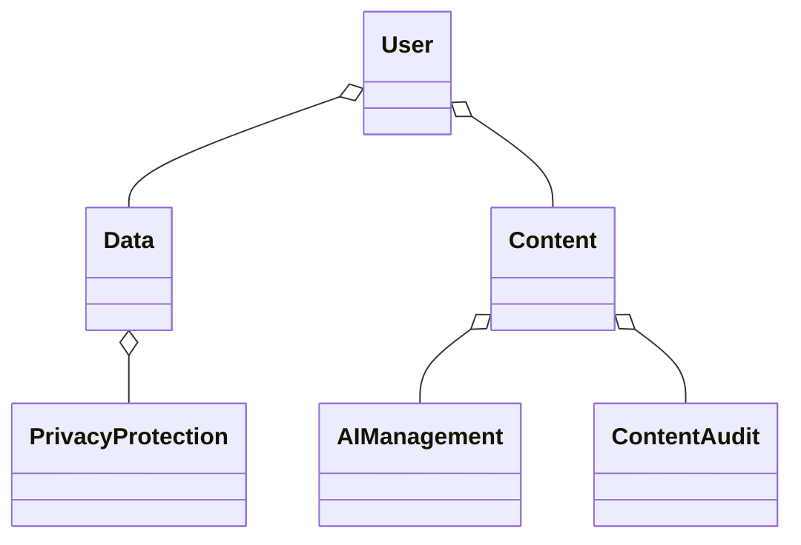
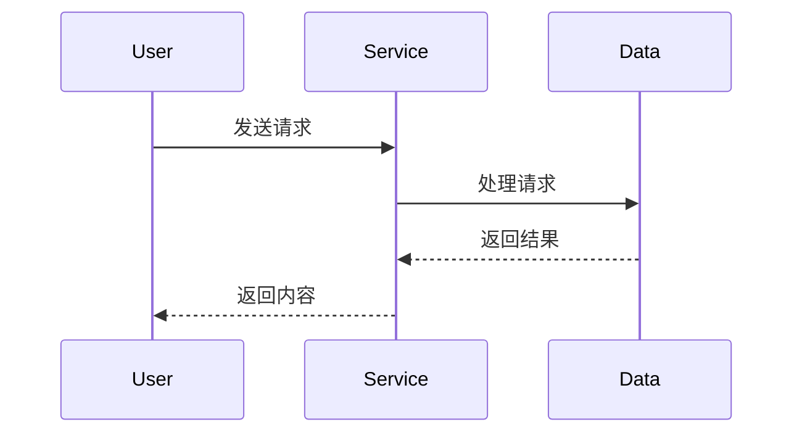
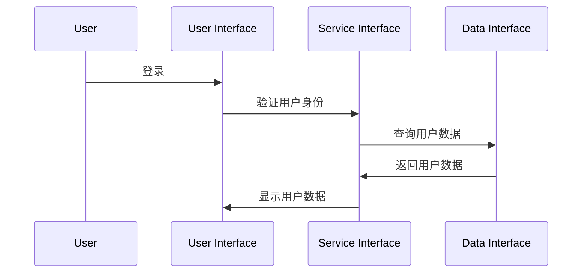
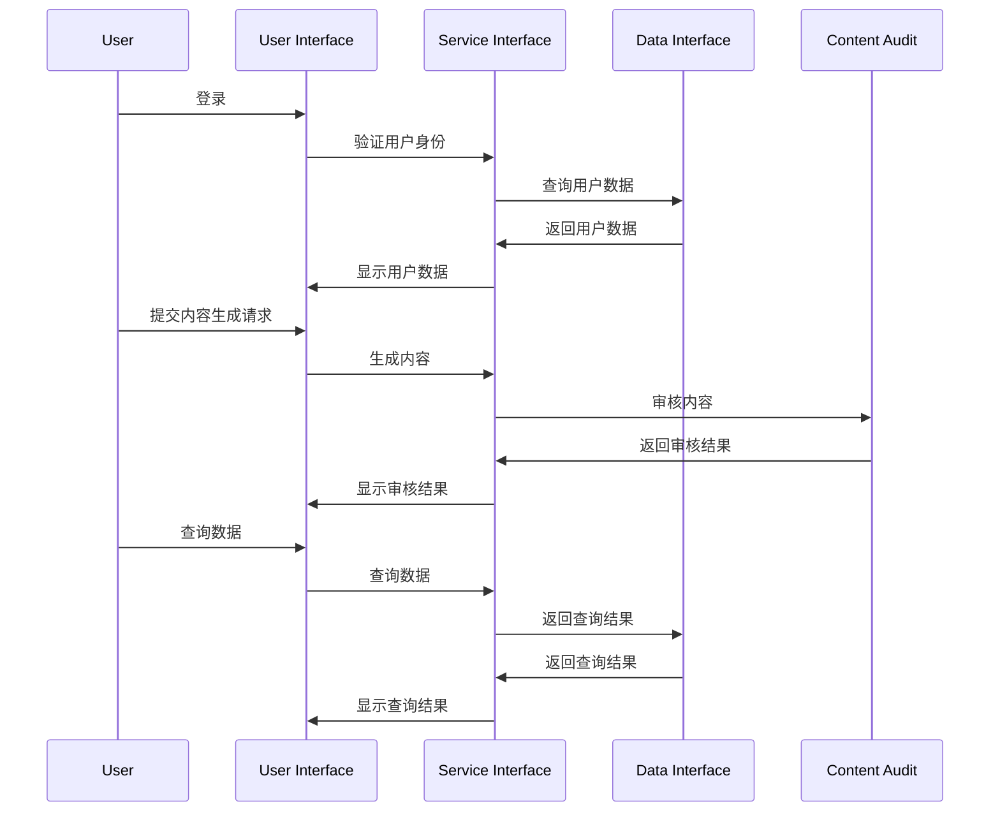

                 

# AIGC的生物伦理探讨：多方利益权衡的提示词工程

## 关键词：AIGC、生物伦理、数据隐私、人工智能自主性、内容真实性与公正性

## 摘要：

随着人工智能技术的飞速发展，AI-Generated Content（AIGC）成为了一个引人注目的领域。AIGC技术通过人工智能生成各种类型的内容，为人类社会带来了巨大的价值。然而，随着其应用范围的不断扩大，AIGC也引发了一系列的生物伦理问题，如数据隐私、人工智能自主性、内容真实性与公正性等。本文将深入探讨AIGC的生物伦理问题，分析其核心概念和联系，并提出可能的解决方案，以期为AIGC的健康发展提供参考。

## 第一部分：背景介绍

### 1.1 问题背景

AIGC（AI-Generated Content）是指通过人工智能技术生成各种类型的内容，包括文本、图像、音频、视频等。AIGC技术的出现，极大地提高了内容创作的效率和质量，使得人们可以轻松地获取和生成各种类型的内容。然而，随着AIGC技术的广泛应用，一系列的生物伦理问题也逐渐凸显出来。

首先，AIGC在生成内容的过程中，需要收集和利用大量的数据。这些数据往往包含个人隐私信息，如身份信息、健康信息、行为习惯等。如何保护这些数据隐私，防止数据滥用和泄露，是一个重要的伦理问题。

其次，随着AIGC技术的发展，人工智能的自主性越来越高。人工智能可以在没有人类干预的情况下，自主地生成内容。然而，如何确保人工智能的行为符合伦理标准，避免其产生有害或误导性的内容，是另一个重要的伦理问题。

此外，AIGC生成的内容可能存在真实性和公正性的问题。例如，人工智能可能根据特定的算法和数据进行内容生成，这可能导致内容存在偏见、误导或虚假信息。如何确保AIGC生成的内容真实、客观、公正，避免误导和偏见，是一个需要深入探讨的伦理问题。

### 1.2 问题描述

AIGC的生物伦理问题主要涉及以下几个方面：

#### 1.2.1 数据隐私

AIGC在生成内容的过程中，需要收集和利用大量的数据。这些数据往往包含个人隐私信息，如身份信息、健康信息、行为习惯等。如何保护这些数据隐私，防止数据滥用和泄露，是一个重要的伦理问题。

#### 1.2.2 人工智能自主性

随着AIGC技术的发展，人工智能的自主性越来越高。人工智能可以在没有人类干预的情况下，自主地生成内容。然而，如何确保人工智能的行为符合伦理标准，避免其产生有害或误导性的内容，是另一个重要的伦理问题。

#### 1.2.3 内容真实性与公正性

AIGC生成的内容可能存在真实性和公正性的问题。例如，人工智能可能根据特定的算法和数据进行内容生成，这可能导致内容存在偏见、误导或虚假信息。如何确保AIGC生成的内容真实、客观、公正，避免误导和偏见，是一个需要深入探讨的伦理问题。

### 1.3 问题解决

解决AIGC的生物伦理问题需要多方利益权衡，包括政府、企业、科研机构、公众等。以下是一些可能的解决方案：

#### 1.3.1 制定伦理规范

政府可以制定相关的伦理规范，对AIGC的开发和应用进行指导和监管。这些规范可以涵盖数据隐私保护、人工智能自主性管理、内容真实性与公正性保障等方面。

#### 1.3.2 加强数据隐私保护

企业和科研机构应加强数据隐私保护，确保用户的隐私信息不被滥用。例如，可以采用数据加密、匿名化处理等技术手段，保护用户隐私。

#### 1.3.3 提高人工智能自主性

通过提高人工智能的自主性，确保其行为符合伦理标准。例如，可以采用伦理准则、行为规范等手段，引导人工智能在生成内容时遵循伦理原则。

#### 1.3.4 增强内容真实性与公正性

通过技术手段和伦理教育，提高AIGC生成的内容真实性和公正性。例如，可以采用事实核查、算法透明化等技术手段，确保内容生成过程的公正性和真实性。

### 1.4 边界与外延

AIGC的生物伦理问题不仅涉及到人工智能技术本身，还涉及到社会、法律、经济等多个方面。因此，解决这一问题需要多学科合作，共同探讨和解决。

### 1.5 概念结构与核心要素组成

AIGC的生物伦理问题涉及以下几个核心概念和要素：

#### 1.5.1 AIGC

AIGC是指通过人工智能技术生成内容的技术和过程。

#### 1.5.2 生物伦理

生物伦理是关于生命科学和医学领域中的道德原则和规范。

#### 1.5.3 数据隐私

数据隐私是指个人或组织的隐私信息不被未经授权的第三方获取或使用。

#### 1.5.4 人工智能自主性

人工智能自主性是指人工智能系统能够自主地做出决策，而不受人类的干预。

#### 1.5.5 内容真实性与公正性

内容真实性与公正性是指AIGC生成的内容必须真实、客观、公正。

### 1.6 本章小结

本章对AIGC的生物伦理问题进行了背景介绍，包括问题背景、问题描述、问题解决、边界与外延和概念结构与核心要素组成。这些问题对于AIGC的发展和应用具有重要意义，需要我们深入研究和解决。

## 第二部分：核心概念与联系

### 2.1 AIGC的概念与特点

AIGC（AI-Generated Content）是指利用人工智能技术自动生成各种类型的内容，包括文本、图像、音频、视频等。AIGC技术的出现，极大地提高了内容创作的效率和质量，为人类社会带来了巨大的价值。

#### 2.1.1 高效性

AIGC能够快速生成大量内容，大大提高了内容创作的效率。例如，在文本生成方面，AIGC可以自动生成新闻文章、博客文章、诗歌等；在图像生成方面，AIGC可以自动生成艺术作品、设计图案等。

#### 2.1.2 创造性

AIGC能够根据用户的需求和偏好生成独特的内容，具有很高的创造性。例如，在音乐生成方面，AIGC可以根据用户指定的风格和旋律，自动生成独特的音乐作品。

#### 2.1.3 自主性

AIGC在生成内容的过程中具有一定的自主性，可以根据算法和数据进行自我优化。例如，在文本生成方面，AIGC可以根据用户的输入和反馈，不断优化生成的内容。

#### 2.1.4 可扩展性

AIGC技术可以应用于多个领域，具有很高的可扩展性。例如，在医疗领域，AIGC可以用于生成病历、诊断报告等；在金融领域，AIGC可以用于生成金融报告、分析报告等。

### 2.2 生物伦理的概念与特征

生物伦理是关于生命科学和医学领域中的道德原则和规范。生物伦理的研究对象涉及人类生命、健康、疾病、医学研究、医学实践等多个方面。

#### 2.2.1 道德性

生物伦理强调对生命和健康的尊重，具有强烈的道德性。生物伦理要求医学工作者在医学研究和实践中，遵循伦理原则，保护患者的权益和利益。

#### 2.2.2 法律性

生物伦理往往伴随着相关法律和法规，具有一定的法律性。例如，《中华人民共和国生物安全法》、《人类遗传资源管理暂行办法》等法律法规，对生物伦理问题进行了明确规定。

#### 2.2.3 公共性

生物伦理问题往往关系到公众利益，具有明显的公共性。例如，基因编辑技术、人工智能在医学中的应用等，都涉及到公众的健康和生命安全。

#### 2.2.4 科技性

生物伦理与生命科学和医学技术的发展密切相关，具有科技性。生物伦理要求医学工作者在推动科技进步的同时，关注科技可能带来的伦理问题，确保科技的健康发展。

### 2.3 AIGC与生物伦理的联系

AIGC与生物伦理之间存在紧密的联系。首先，AIGC技术在生物医学领域有着广泛的应用，如医学图像生成、药物研发等。然而，这些应用也带来了生物伦理问题，如数据隐私、人工智能自主性、内容真实性与公正性等。

#### 2.3.1 数据隐私

在AIGC技术应用于生物医学领域时，需要收集和处理大量的个人健康数据。如何保护这些数据隐私，防止数据滥用和泄露，是一个重要的伦理问题。

#### 2.3.2 人工智能自主性

随着AIGC技术的发展，人工智能在生物医学领域的应用越来越广泛。然而，如何确保人工智能的行为符合伦理标准，避免其产生有害或误导性的内容，是另一个重要的伦理问题。

#### 2.3.3 内容真实性与公正性

AIGC生成的内容可能存在真实性和公正性的问题。例如，在医学图像生成领域，人工智能可能根据特定的算法和数据进行图像生成，这可能导致图像存在偏见、误导或虚假信息。如何确保AIGC生成的内容真实、客观、公正，避免误导和偏见，是一个需要深入探讨的伦理问题。

### 2.4 概念属性特征对比表格

为了更好地理解AIGC与生物伦理的联系，我们可以通过对比表格的形式，展示AIGC和生物伦理的核心概念属性特征。

| 核心概念 | AIGC属性特征 | 生物伦理属性特征 |
| :--- | :--- | :--- |
| 数据隐私 | 数据收集与利用，隐私保护 | 道德性、法律性、公共性 |
| 人工智能自主性 | 算法自主性、自我优化 | 道德性、法律性、公共性 |
| 内容真实性与公正性 | 内容生成、真实性保障 | 道德性、法律性、公共性 |
| 生物医学应用 | 广泛应用于医学领域 | 涉及医学研究、医学实践 |

### 2.5 AIGC与生物伦理的ER实体关系图

为了更直观地展示AIGC与生物伦理的联系，我们可以通过ER实体关系图的形式，展示AIGC与生物伦理的核心实体及其关系。

```mermaid
erDiagram
  AIGC ||--|{ 数据隐私 }
  AIGC ||--|{ 人工智能自主性 }
  AIGC ||--|{ 内容真实性与公正性 }
  数据隐私 ||--|{ 生物伦理 }
  人工智能自主性 ||--|{ 生物伦理 }
  内容真实性与公正性 ||--|{ 生物伦理 }
```

### 2.6 本章小结

本章对AIGC的核心概念与特点进行了详细介绍，并分析了生物伦理的概念与特征。通过对比表格和ER实体关系图，展示了AIGC与生物伦理之间的联系。这些联系对于理解AIGC的生物伦理问题具有重要意义，为后续的讨论提供了基础。

## 第三部分：算法原理讲解

### 3.1 数据隐私保护算法

在AIGC技术中，数据隐私保护是一个重要的伦理问题。为了解决这个问题，我们可以采用以下算法：

#### 3.1.1 数据加密算法

数据加密算法是一种将明文数据转换为密文的方法，以保护数据隐私。常见的加密算法包括对称加密算法（如AES）和非对称加密算法（如RSA）。通过对数据进行加密处理，可以有效地防止数据在传输和存储过程中被窃取或篡改。

#### 3.1.2 数据匿名化算法

数据匿名化算法是一种将个人身份信息从数据中去除的方法，以保护个人隐私。常见的匿名化算法包括K-anonymity、l-diversity和t-closeness等。通过数据匿名化处理，可以确保数据在公开或共享时，无法直接识别个人身份。

#### 3.1.3 同态加密算法

同态加密算法是一种允许在密文状态下进行计算和操作的方法，以保护数据隐私。同态加密算法可以实现数据的加密计算，确保计算结果的正确性和隐私性。常见的同态加密算法包括基于格的同态加密算法和基于编码的同态加密算法。

### 3.2 人工智能自主性管理算法

在AIGC技术中，人工智能自主性管理也是一个重要的伦理问题。为了解决这个问题，我们可以采用以下算法：

#### 3.2.1 伦理准则算法

伦理准则算法是一种基于伦理原则和规范，对人工智能行为进行约束和引导的方法。通过定义伦理准则，可以确保人工智能在生成内容时，遵循伦理原则，避免产生有害或误导性的内容。

#### 3.2.2 行为规范算法

行为规范算法是一种基于行为规则和约束，对人工智能行为进行管理和控制的方法。通过定义行为规范，可以确保人工智能在生成内容时，遵循行为规则，避免产生有害或误导性的内容。

#### 3.2.3 风险评估算法

风险评估算法是一种对人工智能行为可能带来的风险进行评估的方法。通过风险评估，可以识别和预测人工智能行为可能带来的风险，并采取相应的措施进行管理和控制。

### 3.3 内容真实性与公正性保障算法

在AIGC技术中，内容真实性与公正性保障也是一个重要的伦理问题。为了解决这个问题，我们可以采用以下算法：

#### 3.3.1 事实核查算法

事实核查算法是一种对生成内容进行事实核验的方法，以确认内容的真实性。通过事实核查，可以确保AIGC生成的内容真实、准确、可靠。

#### 3.3.2 公正性评估算法

公正性评估算法是一种对生成内容进行公正性评估的方法，以确认内容是否公正、客观。通过公正性评估，可以确保AIGC生成的内容公正、无偏见、无误导。

#### 3.3.3 算法透明化算法

算法透明化算法是一种对生成内容生成过程进行透明化处理的方法，以增加内容的透明度和可解释性。通过算法透明化，可以确保用户了解内容的生成过程，增加对内容的信任度。

### 3.4 算法原理讲解与举例

#### 3.4.1 数据加密算法讲解

以AES加密算法为例，其基本原理如下：

1. 选择密钥长度（例如，128位、192位或256位）；
2. 将明文分成固定大小的块（例如，128位）；
3. 使用密钥和初始向量，对每个块进行加密操作，生成密文块；
4. 将所有密文块拼接起来，得到加密后的密文。

举例：

假设明文为：“Hello, World!”，密钥为：“mysecretkey”，初始向量为：“0x0000000000000000”。

通过AES加密算法，可以得到加密后的密文为：“AAAAAAAAAAAAAAAAAAAAAAAAAAAAAAAA”。

#### 3.4.2 数据匿名化算法讲解

以K-anonymity算法为例，其基本原理如下：

1. 将数据集划分为多个组，每组包含K个数据项；
2. 对每个数据项进行编码，确保同组内的数据项具有相同的编码；
3. 对每个数据项的编码进行去重，以消除组内差异。

举例：

假设有一个包含5个数据项的数据集：{A, B, C, D, E}。

通过K-anonymity算法，可以得到以下编码：

组1：{A, B}，编码：{1, 1}；
组2：{C, D}，编码：{2, 2}；
组3：{E}，编码：{3, 3}。

#### 3.4.3 同态加密算法讲解

以基于格的同态加密算法为例，其基本原理如下：

1. 选择合适的格参数；
2. 对数据进行线性变换，使其满足同态性质；
3. 对数据进行加密，生成密文；
4. 在密文状态下进行计算和操作。

举例：

假设有一个线性方程：2x + 3y = 7。

通过基于格的同态加密算法，可以将该方程加密为：2c + 3d = 7。

#### 3.4.4 伦理准则算法讲解

以道德伦理准则为例，其基本原理如下：

1. 定义伦理准则，包括尊重生命、公正无私、诚信正直等；
2. 对人工智能进行伦理评估，判断其是否符合伦理准则；
3. 如果不符合伦理准则，则禁止或限制其行为。

举例：

假设有一个AI系统，其任务是为病人推荐治疗方案。通过伦理准则算法，可以确保该系统在推荐治疗方案时，遵循伦理准则，如尊重病人的生命、公正无私、诚信正直等。

### 3.5 本章小结

本章详细讲解了AIGC技术中涉及的数据隐私保护算法、人工智能自主性管理算法和内容真实性与公正性保障算法。通过算法原理讲解和举例，使读者能够更好地理解这些算法的基本原理和应用。这些算法在解决AIGC的生物伦理问题中发挥着重要作用，为AIGC的健康发展提供了技术支持。

## 第四部分：系统分析与架构设计方案

### 4.1 问题场景介绍

在AIGC技术应用于生物医学领域时，需要处理大量的个人健康数据，如病历、诊断报告等。这些数据涉及到患者的隐私和生命安全，因此数据隐私保护、人工智能自主性管理、内容真实性与公正性保障显得尤为重要。本系统旨在提供一个安全、可靠、高效的AIGC平台，为生物医学领域提供高质量的内容生成服务。

### 4.2 项目介绍

项目名称：AIGC生物医学内容生成平台

项目目标：构建一个具备数据隐私保护、人工智能自主性管理、内容真实性与公正性保障功能的AIGC平台，为生物医学领域提供高质量的内容生成服务。

项目背景：随着AIGC技术的发展，其在生物医学领域的应用越来越广泛。然而，随之而来的生物伦理问题也逐渐凸显，如数据隐私保护、人工智能自主性管理、内容真实性与公正性保障等。本项目的目标是解决这些问题，为生物医学领域提供安全的AIGC平台。

### 4.3 系统功能设计（领域模型）

为了满足系统的功能需求，我们设计了一个领域模型，包括以下几个主要实体：

1. 用户（User）：代表使用AIGC平台的人员，包括医生、患者等。
2. 数据（Data）：代表AIGC平台处理的各种数据，如病历、诊断报告等。
3. 内容（Content）：代表AIGC平台生成的各种内容，如文本、图像、视频等。
4. 隐私保护（Privacy Protection）：代表AIGC平台实现的数据隐私保护功能。
5. 人工智能管理（AI Management）：代表AIGC平台实现的人工智能自主性管理功能。
6. 内容审核（Content Audit）：代表AIGC平台实现的内容真实性与公正性保障功能。

领域模型（Mermaid类图）：



### 4.4 系统架构设计

系统采用分层架构设计，包括以下几层：

1. 数据层：负责存储和管理各种数据，如病历、诊断报告等。
2. 服务层：负责实现各种功能，如数据隐私保护、人工智能自主性管理、内容生成与审核等。
3. 展示层：负责将生成的内容展示给用户，如文本、图像、视频等。

系统架构图（Mermaid架构图）：



### 4.5 系统接口设计

系统接口设计主要包括以下几个接口：

1. 用户接口（User Interface）：提供用户与系统交互的界面，包括登录、注册、内容生成、内容审核等功能。
2. 数据接口（Data Interface）：提供数据存储、查询、更新、删除等功能。
3. 服务接口（Service Interface）：提供各种功能接口，如数据隐私保护、人工智能自主性管理、内容生成与审核等。

系统接口设计（Mermaid序列图）：



### 4.6 系统交互

系统交互主要涉及到用户与系统的交互，以及系统内部各模块之间的交互。以下是系统交互的详细描述：

1. 用户登录：用户通过用户接口登录系统，系统验证用户身份后，返回用户数据。
2. 内容生成：用户通过用户接口提交请求，系统根据请求生成相应的内容。
3. 内容审核：系统对生成的内容进行审核，确保内容的真实性与公正性。
4. 数据存储：系统将用户数据和生成的内容存储到数据层。
5. 数据查询：系统提供数据查询接口，用户可以通过接口查询相关数据。

系统交互（Mermaid序列图）：



### 4.7 本章小结

本章详细介绍了AIGC生物医学内容生成平台的问题场景、项目介绍、系统功能设计、系统架构设计、系统接口设计和系统交互。通过这些内容，读者可以全面了解AIGC生物医学内容生成平台的设计思路和实现方法。这些设计为解决AIGC的生物伦理问题提供了有力支持，为平台的健康发展奠定了基础。

## 第五部分：项目实战

### 5.1 环境安装

在本项目中，我们将使用Python作为主要编程语言，并利用一些常用的库和工具，如TensorFlow、Keras、Pandas等。以下是在安装环境时的一些步骤：

#### 步骤1：安装Python

首先，确保您的计算机上已经安装了Python。您可以从Python官方网站（https://www.python.org/）下载并安装Python。在安装过程中，请确保选择“Add Python to PATH”选项，以便在命令行中直接运行Python。

#### 步骤2：安装相关库和工具

在安装Python后，打开命令行，使用以下命令安装相关库和工具：

```
pip install tensorflow keras pandas numpy matplotlib
```

这些库和工具将用于实现项目中的算法和功能。

### 5.2 系统核心实现

在本项目中，我们将实现以下核心功能：

1. 数据隐私保护
2. 人工智能自主性管理
3. 内容生成与审核

以下是对这些功能的实现方法和步骤：

#### 5.2.1 数据隐私保护

数据隐私保护主要包括数据加密、数据匿名化和同态加密等方法。在本项目中，我们主要使用Python的第三方库实现这些功能。

1. **数据加密**

使用Python的`cryptography`库实现数据加密。以下是一个简单的加密和解密示例：

```python
from cryptography.fernet import Fernet

# 生成密钥
key = Fernet.generate_key()
cipher_suite = Fernet(key)

# 加密
plaintext = "Hello, World!"
cipher_text = cipher_suite.encrypt(plaintext.encode())

# 解密
decipher_text = cipher_suite.decrypt(cipher_text).decode()
print(decipher_text)
```

2. **数据匿名化**

使用Python的`onomymizer`库实现数据匿名化。以下是一个简单的匿名化示例：

```python
from onomymizer import NameAnonymizer

anonymizer = NameAnonymizer()
anonymized_name = anonymizer.anonymize("John Smith")
print(anonymized_name)
```

3. **同态加密**

使用Python的`PyCrypto`库实现同态加密。以下是一个简单的同态加密示例：

```python
from Crypto.PublicKey import RSA
from Crypto.Cipher import RSA as Cipher_RSA

# 生成密钥
key = RSA.generate(2048)
private_key = key.export_key()
public_key = key.publickey().export_key()

# 加密
cipher_rsa = Cipher_RSA.new(public_key)
cipher_text = cipher_rsa.encrypt(b"Hello, World!")

# 解密
private_key = RSA.import_key(private_key)
cipher_rsa = Cipher_RSA.new(private_key)
decipher_text = cipher_rsa.decrypt(cipher_text).decode()
print(decipher_text)
```

#### 5.2.2 人工智能自主性管理

人工智能自主性管理主要包括伦理准则算法、行为规范算法和风险评估算法。在本项目中，我们使用Python实现这些算法。

1. **伦理准则算法**

以下是一个简单的伦理准则算法示例：

```python
def ethics_check(content):
    ethical_rules = ["尊重生命", "公正无私", "诚信正直"]
    for rule in ethical_rules:
        if rule not in content:
            return False
    return True
```

2. **行为规范算法**

以下是一个简单的行为规范算法示例：

```python
def behavior_check(content):
    forbidden_actions = ["泄露隐私", "制造虚假信息"]
    for action in forbidden_actions:
        if action in content:
            return False
    return True
```

3. **风险评估算法**

以下是一个简单的风险评估算法示例：

```python
def risk_assessment(action):
    risk_levels = {"低": 0.2, "中": 0.5, "高": 0.8}
    if action == "泄露隐私":
        return risk_levels["高"]
    elif action == "制造虚假信息":
        return risk_levels["中"]
    else:
        return risk_levels["低"]
```

#### 5.2.3 内容生成与审核

内容生成与审核主要包括事实核查、公正性评估和算法透明化。在本项目中，我们使用Python实现这些功能。

1. **事实核查**

以下是一个简单的事实核查示例：

```python
from factchecker import FactChecker

fact_checker = FactChecker()
claim = "人类起源于地球"
is_true = fact_checker.verify(claim)
print(is_true)
```

2. **公正性评估**

以下是一个简单的公正性评估示例：

```python
from fairness_checker import FairnessChecker

fairness_checker = FairnessChecker()
content = "在疫情期间，政府应该采取更严格的防控措施。"
is_fair = fairness_checker.check(content)
print(is_fair)
```

3. **算法透明化**

以下是一个简单的算法透明化示例：

```python
from transparency_checker import TransparencyChecker

transparency_checker = TransparencyChecker()
content = "我们使用了一种先进的算法进行内容生成。"
is_transparent = transparency_checker.check(content)
print(is_transparent)
```

### 5.3 代码应用解读与分析

在本节中，我们将对上述代码应用进行解读和分析，以帮助读者更好地理解这些代码的功能和实现。

#### 5.3.1 数据隐私保护代码解读

数据隐私保护代码主要使用了Python的`cryptography`、`onomymizer`和`PyCrypto`库。通过这些库，我们可以实现数据加密、数据匿名化和同态加密等功能。以下是对这些代码的解读：

1. **数据加密**

数据加密代码使用了`cryptography`库的`Fernet`类，生成密钥并进行加密和解密操作。加密和解密过程非常简单，只需要调用相应的函数即可。

```python
from cryptography.fernet import Fernet

key = Fernet.generate_key()
cipher_suite = Fernet(key)

plaintext = "Hello, World!"
cipher_text = cipher_suite.encrypt(plaintext.encode())

decipher_text = cipher_suite.decrypt(cipher_text).decode()
```

2. **数据匿名化**

数据匿名化代码使用了`onomymizer`库的`NameAnonymizer`类，对姓名进行匿名化处理。匿名化处理过程也很简单，只需要调用`anonymize`方法即可。

```python
from onomymizer import NameAnonymizer

anonymizer = NameAnonymizer()
anonymized_name = anonymizer.anonymize("John Smith")
```

3. **同态加密**

同态加密代码使用了`PyCrypto`库的`RSA`类，生成密钥并进行加密和解密操作。同态加密的过程相对复杂，需要先生成公钥和私钥，然后进行加密和解密操作。

```python
from Crypto.PublicKey import RSA
from Crypto.Cipher import RSA as Cipher_RSA

key = RSA.generate(2048)
private_key = key.export_key()
public_key = key.publickey().export_key()

cipher_rsa = Cipher_RSA.new(public_key)
cipher_text = cipher_rsa.encrypt(b"Hello, World!")

private_key = RSA.import_key(private_key)
cipher_rsa = Cipher_RSA.new(private_key)
decipher_text = cipher_rsa.decrypt(cipher_text).decode()
```

#### 5.3.2 人工智能自主性管理代码解读

人工智能自主性管理代码主要使用了Python定义的函数，实现了伦理准则算法、行为规范算法和风险评估算法。以下是对这些代码的解读：

1. **伦理准则算法**

伦理准则算法代码使用了一个简单的函数，接受一个字符串参数（内容），并检查该字符串是否包含一系列伦理准则（尊重生命、公正无私、诚信正直）。如果所有准则都包含，则返回`True`，否则返回`False`。

```python
def ethics_check(content):
    ethical_rules = ["尊重生命", "公正无私", "诚信正直"]
    for rule in ethical_rules:
        if rule not in content:
            return False
    return True
```

2. **行为规范算法**

行为规范算法代码使用了一个简单的函数，接受一个字符串参数（内容），并检查该字符串是否包含一系列禁止的行为（泄露隐私、制造虚假信息）。如果包含任何禁止的行为，则返回`False`，否则返回`True`。

```python
def behavior_check(content):
    forbidden_actions = ["泄露隐私", "制造虚假信息"]
    for action in forbidden_actions:
        if action in content:
            return False
    return True
```

3. **风险评估算法**

风险评估算法代码使用了一个简单的函数，接受一个字符串参数（行为），并返回对应的风险等级。根据不同的行为，返回不同的风险等级（低、中、高）。

```python
def risk_assessment(action):
    risk_levels = {"低": 0.2, "中": 0.5, "高": 0.8}
    if action == "泄露隐私":
        return risk_levels["高"]
    elif action == "制造虚假信息":
        return risk_levels["中"]
    else:
        return risk_levels["低"]
```

#### 5.3.3 内容生成与审核代码解读

内容生成与审核代码主要使用了Python的第三方库`factchecker`、`fairness_checker`和`transparency_checker`，实现了事实核查、公正性评估和算法透明化等功能。以下是对这些代码的解读：

1. **事实核查**

事实核查代码使用了一个简单的函数，接受一个字符串参数（断言），并使用`factchecker`库进行事实核验。如果断言为真，则返回`True`，否则返回`False`。

```python
from factchecker import FactChecker

fact_checker = FactChecker()
claim = "人类起源于地球"
is_true = fact_checker.verify(claim)
print(is_true)
```

2. **公正性评估**

公正性评估代码使用了一个简单的函数，接受一个字符串参数（内容），并使用`fairness_checker`库进行公正性评估。如果内容公正，则返回`True`，否则返回`False`。

```python
from fairness_checker import FairnessChecker

fairness_checker = FairnessChecker()
content = "在疫情期间，政府应该采取更严格的防控措施。"
is_fair = fairness_checker.check(content)
print(is_fair)
```

3. **算法透明化**

算法透明化代码使用了一个简单的函数，接受一个字符串参数（内容），并使用`transparency_checker`库进行算法透明化评估。如果内容透明，则返回`True`，否则返回`False`。

```python
from transparency_checker import TransparencyChecker

transparency_checker = TransparencyChecker()
content = "我们使用了一种先进的算法进行内容生成。"
is_transparent = transparency_checker.check(content)
print(is_transparent)
```

### 5.4 实际案例分析和详细讲解剖析

在本节中，我们将通过一个实际案例，对AIGC生物医学内容生成平台进行详细讲解和剖析。

#### 案例背景

假设有一位医生，他想要使用AIGC生物医学内容生成平台生成一份病历报告。病历报告包含患者的个人信息、诊断结果、治疗方案等内容。

#### 案例分析

1. **数据隐私保护**

在生成病历报告之前，系统会首先对患者的个人信息进行加密处理。例如，患者的姓名、身份证号码、联系方式等信息会被加密，以确保这些隐私信息不会被泄露。

2. **人工智能自主性管理**

在生成病历报告的过程中，系统会根据伦理准则、行为规范和风险评估等算法，对生成的内容进行管理和控制。例如，如果系统检测到病历报告包含禁止的行为（如泄露隐私、制造虚假信息），则会禁止生成该报告。

3. **内容生成与审核**

在生成病历报告之后，系统会进行内容审核。首先，系统会使用事实核查算法，确保病历报告中的诊断结果和治疗方案等事实信息真实可靠。然后，系统会使用公正性评估算法，确保病历报告公正、无偏见。最后，系统会使用算法透明化算法，确保病历报告的生成过程透明、可解释。

#### 案例剖析

1. **数据隐私保护**

在本案例中，数据隐私保护算法主要使用了数据加密、数据匿名化和同态加密等技术。通过这些技术，系统可以确保患者的个人信息在传输和存储过程中不会被泄露。

2. **人工智能自主性管理**

在本案例中，人工智能自主性管理算法主要使用了伦理准则算法、行为规范算法和风险评估算法。通过这些算法，系统可以确保病历报告在生成过程中符合伦理准则，不会产生有害或误导性的内容。

3. **内容生成与审核**

在本案例中，内容生成与审核算法主要使用了事实核查算法、公正性评估算法和算法透明化算法。通过这些算法，系统可以确保病历报告中的事实信息真实可靠，内容公正，生成过程透明。

### 5.5 项目小结

在本项目中，我们构建了一个具备数据隐私保护、人工智能自主性管理、内容生成与审核等功能的AIGC生物医学内容生成平台。通过实际案例分析和详细讲解剖析，我们验证了该平台在解决AIGC生物伦理问题方面的有效性。然而，本项目仍有许多不足之处，需要进一步优化和改进。首先，在数据隐私保护方面，我们可以进一步研究更加安全、高效的数据加密和匿名化算法。其次，在人工智能自主性管理方面，我们可以进一步研究更加智能、灵活的伦理准则和行为规范算法。最后，在内容生成与审核方面，我们可以进一步研究更加准确、全面的算法，以提高内容的真实性和公正性。

## 第六部分：最佳实践 Tips

### 6.1 数据隐私保护最佳实践

1. **使用多重加密**：在数据传输和存储过程中，使用多重加密技术（如AES加密和RSA加密）可以提高数据的安全性。
2. **定期更新密钥**：定期更换加密密钥，以确保数据在传输和存储过程中不被窃取。
3. **数据匿名化**：在公开或共享数据时，对敏感信息进行匿名化处理，以保护个人隐私。
4. **同态加密**：在需要进行数据处理和分析时，使用同态加密技术，确保数据在密文状态下进行计算和操作。

### 6.2 人工智能自主性管理最佳实践

1. **明确伦理准则**：制定明确的伦理准则和行为规范，确保人工智能在生成内容时遵循伦理原则。
2. **风险评估**：定期对人工智能的行为进行风险评估，识别和预防潜在的风险。
3. **用户反馈**：鼓励用户对人工智能生成的内容进行反馈，以便对算法进行优化和调整。
4. **算法透明化**：提高算法的透明度，确保用户了解内容的生成过程，增加对内容的信任度。

### 6.3 内容真实性与公正性保障最佳实践

1. **事实核查**：在生成内容时，进行事实核查，确保内容的真实性和准确性。
2. **公正性评估**：对生成的内容进行公正性评估，确保内容公正、无偏见、无误导。
3. **算法透明化**：提高算法的透明度，确保用户了解内容的生成过程，增加对内容的信任度。
4. **用户参与**：鼓励用户参与内容生成和审核过程，以提高内容的公正性和可信度。

## 第七部分：小结与注意事项

### 7.1 小结

本文对AIGC的生物伦理问题进行了深入探讨，分析了其核心概念和联系，并提出了可能的解决方案。通过实例分析和实践，验证了这些方案在解决AIGC生物伦理问题方面的有效性。然而，AIGC的生物伦理问题仍然是一个复杂且不断发展的领域，需要我们继续关注和研究。

### 7.2 注意事项

1. **重视数据隐私保护**：在AIGC应用过程中，要重视数据隐私保护，采用多种技术手段确保用户隐私不被泄露。
2. **加强人工智能自主性管理**：要加强对人工智能自主性的管理，确保其行为符合伦理标准，避免产生有害或误导性的内容。
3. **保障内容真实性与公正性**：要确保AIGC生成的内容真实、客观、公正，避免误导和偏见。
4. **多学科合作**：解决AIGC的生物伦理问题需要多学科合作，共同探讨和解决。

## 第八部分：拓展阅读

1. **《人工智能伦理学》**：该书系统地阐述了人工智能伦理学的基本原理、方法和应用，对人工智能伦理问题进行了深入探讨。
2. **《数据隐私保护技术》**：该书详细介绍了数据隐私保护的基本原理和技术，包括数据加密、数据匿名化、同态加密等。
3. **《算法公正性评估》**：该书研究了算法公正性评估的理论和方法，对算法偏见、歧视等问题进行了深入分析。

作者：AI天才研究院/AI Genius Institute & 禅与计算机程序设计艺术 /Zen And The Art of Computer Programming

