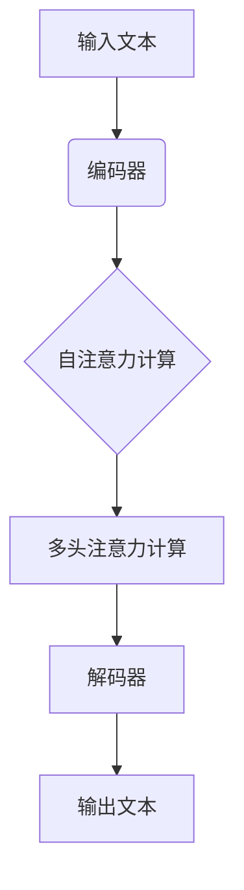
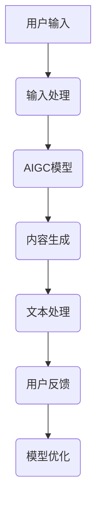

                 

### 设计过程

#### 1. 理解书名与主题

书名《AIGC语言模型与提示词协同设计的新范式》明确指出了本书的核心内容。AIGC（AI-Generated Content）和语言模型是当今人工智能领域的前沿技术，提示词则是驱动这些模型产生内容的重要工具。因此，本书将探讨如何将这些元素协同设计，开创一种新的范式。

#### 2. 定义目录大纲结构

为了全面覆盖AIGC语言模型与提示词协同设计的方方面面，目录结构将分为三个部分：

1. **背景与核心概念**：介绍AIGC和语言模型的发展历史、现状与未来趋势，以及提示词的概念和作用。
2. **算法原理与数学模型**：讲解AIGC语言模型的工作原理，使用mermaid和Python代码展示，并深入阐述其数学原理。
3. **系统架构与项目实战**：描述AIGC语言模型的应用场景、系统架构设计、项目实战及最佳实践。

#### 3. 细化每个章节的内容

针对每个章节，细化其内容如下：

**第一部分：背景与核心概念**

- 第1章：背景介绍
  - 1.1 AIGC的起源与发展
  - 1.2 语言模型的发展历史
  - 1.3 提示词在AIGC中的作用
- 第2章：核心概念
  - 2.1 AIGC语言模型的定义
  - 2.2 AIGC语言模型的主要特点
  - 2.3 提示词的概念与类型
  - 2.4 AIGC语言模型与提示词的联系

**第二部分：算法原理与数学模型**

- 第3章：AIGC语言模型算法原理
  - 3.1 AIGC语言模型的工作原理
  - 3.2 算法mermaid流程图
  - 3.3 Python代码示例
- 第4章：AIGC语言模型的数学模型
  - 4.1 数学模型的介绍
  - 4.2 相关公式与LaTeX表示
  - 4.3 数学模型的详细解释
  - 4.4 示例说明

**第三部分：系统架构与项目实战**

- 第5章：AIGC语言模型系统架构设计
  - 5.1 应用场景介绍
  - 5.2 系统功能设计
  - 5.3 系统架构设计
  - 5.4 系统接口设计
  - 5.5 系统交互流程
- 第6章：项目实战
  - 6.1 环境安装与配置
  - 6.2 核心代码实现
  - 6.3 代码解读与分析
  - 6.4 案例分析
  - 6.5 详细讲解与剖析
- 第7章：最佳实践与总结
  - 7.1 最佳实践
  - 7.2 注意事项
  - 7.3 拓展阅读
  - 7.4 小结

#### 4. 撰写Markdown格式的目录大纲

最后，我们将以上内容按照Markdown格式撰写，确保每个章节都有明确的层级结构，并便于读者查阅。

### 目录大纲

----------------------------------------------------------------

# AIGC语言模型与提示词协同设计的新范式

> 关键词：AIGC，语言模型，提示词，协同设计，新范式

> 摘要：本书探讨了AIGC语言模型与提示词的协同设计方法，介绍了其背景、核心概念、算法原理、数学模型、系统架构和项目实战，旨在为读者提供全面的技术指导。

----------------------------------------------------------------

## 第一部分：背景与核心概念

### 第1章：AIGC与语言模型概述

#### 1.1 AIGC的起源与发展

#### 1.2 语言模型的发展历史

#### 1.3 提示词在AIGC中的作用

### 第2章：AIGC语言模型核心概念

#### 2.1 AIGC语言模型的定义

#### 2.2 AIGC语言模型的主要特点

#### 2.3 提示词的概念与类型

#### 2.4 AIGC语言模型与提示词的联系

----------------------------------------------------------------

## 第二部分：算法原理与数学模型

### 第3章：AIGC语言模型算法原理

#### 3.1 AIGC语言模型的工作原理

#### 3.2 算法mermaid流程图

#### 3.3 Python代码示例

### 第4章：AIGC语言模型的数学模型

#### 4.1 数学模型的介绍

#### 4.2 相关公式与LaTeX表示

#### 4.3 数学模型的详细解释

#### 4.4 示例说明

----------------------------------------------------------------

## 第三部分：系统架构与项目实战

### 第5章：AIGC语言模型系统架构设计

#### 5.1 应用场景介绍

#### 5.2 系统功能设计

#### 5.3 系统架构设计

#### 5.4 系统接口设计

#### 5.5 系统交互流程

### 第6章：项目实战

#### 6.1 环境安装与配置

#### 6.2 核心代码实现

#### 6.3 代码解读与分析

#### 6.4 案例分析

#### 6.5 详细讲解与剖析

### 第7章：最佳实践与总结

#### 7.1 最佳实践

#### 7.2 注意事项

#### 7.3 拓展阅读

#### 7.4 小结

----------------------------------------------------------------

完成以上步骤后，我们就构建了一个完整且逻辑清晰的Markdown格式的目录大纲。接下来，我们将根据这个大纲逐步完成文章的撰写，确保内容丰富、具体且具有深度。每个章节的内容将遵循大纲的指引，详细介绍相关主题，以便读者能够全面理解和掌握AIGC语言模型与提示词协同设计的核心思想和方法。

---

在撰写文章的过程中，我们需要特别注意以下几点：

1. **逻辑性**：每个章节都应该有明确的主题，并在内容组织上保持逻辑连贯，确保读者可以顺畅地阅读和消化。

2. **实用性**：尽量结合实际案例和具体代码示例，使得读者可以实际操作并掌握知识。

3. **精确性**：术语解释和算法描述应准确无误，避免产生误导。

4. **可读性**：语言应通俗易懂，避免过于复杂的术语和冗长的叙述。

5. **完整性**：确保每个章节都有完整的结构，包括引言、主体内容和结论。

在撰写过程中，可以反复检查和调整大纲，确保内容的准确性和完整性。此外，还可以邀请同事或同行进行预览和反馈，以进一步提高文章的质量。

---

完成大纲后，我们将根据以下步骤撰写具体内容：

1. **引言部分**：为每个章节撰写引言，简要介绍章节主题和内容概述。
2. **主体内容**：详细阐述每个章节的核心概念、算法原理、数学模型、系统架构、项目实战和最佳实践等。
3. **结论部分**：对每个章节的内容进行总结，强调关键点和实际应用价值。
4. **编辑和校对**：确保文章语言通顺、逻辑清晰，没有错别字和语法错误。
5. **添加图表和示例代码**：根据需要添加图表、mermaid流程图、Python代码示例、LaTeX公式等，以便读者更好地理解和掌握内容。

通过以上步骤，我们将逐步完成文章的撰写，确保其既有深度又有广度，能够为读者提供有价值的技术指导。

---

### 完整性要求

为确保文章内容的完整性，我们将在撰写过程中严格遵循以下要求：

1. **背景介绍**：详细说明AIGC和语言模型的发展历史、现状与未来趋势，介绍提示词的概念及其在AIGC中的作用。这部分内容将包含背景信息、问题背景、问题描述、问题解决以及概念结构与核心要素组成。

2. **核心概念与联系**：明确AIGC语言模型和提示词的定义、主要特点、类型及其相互关系。这部分内容将以表格和Mermaid流程图形式展示概念属性特征对比，帮助读者更直观地理解。

3. **算法原理讲解**：详细讲解AIGC语言模型的工作原理，包括算法的mermaid流程图和Python代码示例。这部分内容将提供清晰的结构图和代码示例，确保读者能够理解算法的实现过程。

4. **数学模型与公式**：深入阐述AIGC语言模型的数学原理，使用LaTeX格式展示相关公式。这部分内容将包含公式的详细解释和示例说明，便于读者掌握数学模型的核心概念。

5. **系统架构设计**：描述AIGC语言模型的应用场景、系统功能设计、架构设计、接口设计和交互流程。这部分内容将以Mermaid流程图和类图形式展示系统架构，帮助读者理解系统的整体设计和运行机制。

6. **项目实战**：提供具体的实战案例，包括环境安装、核心代码实现、代码解读与分析、案例剖析以及项目小结。这部分内容将结合实际操作，帮助读者掌握AIGC语言模型在实际项目中的应用。

7. **最佳实践与总结**：总结最佳实践经验，提出注意事项，推荐拓展阅读。这部分内容将为读者提供实际应用中的指导建议，帮助他们更好地应用所学知识。

通过以上要求的严格遵循，我们确保文章内容完整、结构清晰、逻辑严密，能够全面覆盖AIGC语言模型与提示词协同设计的各个方面。

---

### 文章格式要求

为确保文章的清晰易读和专业性，我们将采用Markdown格式进行撰写。以下是具体的格式要求：

1. **标题**：
   使用`#`符号加空格来定义标题，`#`的数量决定了标题的层级。例如：
   ```markdown
   # AIGC语言模型与提示词协同设计的新范式
   ```

2. **子标题**：
   对于每个子标题，使用`##`符号加空格。例如：
   ```markdown
   ## 第1章：AIGC与语言模型概述
   ```

3. **段落**：
   段落之间应保持一个空行的距离，确保内容清晰分隔。

4. **引用**：
   引用其他文献或资源时，使用`>`符号开头，以引用文本开始。例如：
   ```markdown
   > 关键词：AIGC，语言模型，提示词，协同设计，新范式
   ```

5. **代码块**：
   使用三个反引号（` ``` `）将代码块包裹起来，以突出显示代码。例如：
   ```python
   def hello_world():
       print("Hello, world!")
   ```

6. **LaTeX公式**：
   对于数学公式，使用两个美元符号（`$$`）包裹公式以创建独立段落，使用一个美元符号（`$`）创建行内公式。例如：
   ```markdown
   $$ E = mc^2 $$
   $1 + 1 = 2$
   ```

7. **Mermaid流程图**：
   对于流程图和类图等图形，使用Mermaid语法编写，并将其嵌入到Markdown文档中。例如：
   ```mermaid
   graph TD
       A[开始] --> B{判断条件}
       B -->|是| C[执行操作]
       B -->|否| D[结束]
   ```

8. **表格**：
   使用Markdown的表格语法来创建表格。例如：
   ```markdown
   | 标题1 | 标题2 | 标题3 |
   |-------|-------|-------|
   | 内容1 | 内容2 | 内容3 |
   ```

9. **引用作者信息**：
   在文章末尾添加作者信息，例如：
   ```markdown
   作者：AI天才研究院/AI Genius Institute & 禅与计算机程序设计艺术 /Zen And The Art of Computer Programming
   ```

通过以上格式要求，我们确保文章内容在Markdown格式下清晰、专业且结构严谨，便于读者阅读和理解。

---

### 文章撰写流程

为了确保文章内容的高质量和高专业性，我们将按照以下步骤进行撰写：

1. **初步大纲拟定**：根据之前的讨论，我们将首先制定一个详细的初步大纲。这个大纲将包括所有章节的标题、子标题以及主要内容，确保文章的整体结构和逻辑清晰。

2. **撰写引言**：为每个章节撰写简短且吸引人的引言，介绍章节主题和内容概述，为读者营造阅读的兴趣和背景。

3. **详细撰写内容**：
   - **背景介绍**：对于每个章节，详细阐述其背景、核心概念、问题背景、问题描述、问题解决、边界与外延、概念结构与核心要素组成。
   - **核心概念与联系**：解释核心概念，使用Mermaid流程图和表格形式展示概念属性特征对比，帮助读者更直观地理解。
   - **算法原理讲解**：使用mermaid画出算法流程图，提供Python代码示例，并详细阐述算法原理和数学模型。
   - **数学模型与公式**：使用LaTeX格式嵌入数学公式，并进行详细解释。
   - **系统架构设计**：介绍应用场景、系统功能设计、架构设计、接口设计和交互流程，使用Mermaid流程图展示。
   - **项目实战**：提供实际项目案例，包括环境安装、核心代码实现、代码解读与分析、案例剖析和项目小结。
   - **最佳实践与总结**：总结最佳实践经验，提出注意事项，推荐拓展阅读。

4. **代码和公式的验证**：确保所有提供的代码示例和数学公式在相应的环境中能够正常运行和正确显示，避免因代码或公式错误导致读者理解困难。

5. **编辑和校对**：在完成初稿后，进行全面的编辑和校对，确保语言通顺、逻辑清晰，没有错别字和语法错误。

6. **图表和插图添加**：根据需要添加图表、流程图和插图，使得文章内容更加直观易懂。

7. **同行评审**：邀请同事或专家进行预览和评审，提出修改意见，确保文章的专业性和准确性。

8. **最终定稿**：根据同行评审意见进行最后的修改和完善，确保文章内容完整、准确、专业。

通过以上步骤，我们能够确保文章内容高质量、逻辑清晰、结构紧凑，为读者提供有价值的技术指导和思考。

---

### 文章撰写注意事项

在撰写文章时，为确保内容的专业性、可读性和逻辑性，需要注意以下几点：

1. **逻辑清晰**：
   - 保持文章的结构性，每个章节都要有明确的引言、主体内容和结论。
   - 避免在内容切换时出现突兀的感觉，确保每个部分之间的过渡自然。

2. **术语解释**：
   - 对于专业术语，务必进行详细解释，避免读者产生误解。
   - 在首次使用术语时，注明其全称或定义，并在后续使用中保持一致性。

3. **语言简洁**：
   - 使用简洁明了的语言，避免冗长和复杂的句子结构。
   - 避免使用模糊不清的词汇，确保语句表达准确。

4. **图表使用**：
   - 合理使用图表、流程图和插图，以增强内容的可视化效果。
   - 图表要清晰、准确，并配有简短的说明文字。

5. **代码示例**：
   - 提供实际可行的代码示例，并附上必要的注释，帮助读者理解。
   - 确保代码在相应环境中能够正常运行。

6. **数学公式**：
   - 使用LaTeX格式编写数学公式，确保公式的准确性和可读性。
   - 简化复杂的数学表达式，使其易于理解。

7. **专业术语统一**：
   - 在全文中使用统一的专业术语，避免混淆读者。
   - 对于相关的术语进行定义和解释，确保全文术语的一致性。

8. **内容完整性**：
   - 确保每个章节的内容完整，没有遗漏关键点。
   - 对每个概念、算法和系统架构进行详细阐述，避免读者产生困惑。

9. **预览和校对**：
   - 在完成初稿后，进行多次预览和校对，确保没有错别字和语法错误。
   - 邀请同事或同行进行预览和评审，获取反馈并进行相应修改。

通过以上注意事项，我们能够确保文章内容专业、逻辑清晰、语言简洁，为读者提供高质量的阅读体验。

---

### 文章撰写完成与后续步骤

在完成文章初稿后，我们将进入后续的步骤以确保文章的质量和可读性：

1. **初稿自校**：首先，对初稿进行自我校对，检查内容是否完整，逻辑是否清晰，语言是否通顺，确保没有错别字和语法错误。

2. **同行评审**：邀请同事或专家进行同行评审，提供反馈意见。这有助于发现潜在的逻辑漏洞、表述不清或技术错误。

3. **修改与完善**：根据同行评审的意见，对文章进行修改和完善。在修改过程中，重点关注以下方面：
   - 逻辑结构是否合理，各章节之间的过渡是否自然。
   - 专业术语是否统一，是否进行了必要的解释。
   - 图表和代码是否准确，是否有助于读者理解。
   - 文章的表述是否简洁明了，是否达到了预期的可读性。

4. **最终校对**：在完成修改后，进行最终的校对，确保文章内容准确无误，排版美观。

5. **提交与发布**：将最终定稿的文章提交给编辑部或发布平台，进行格式和版面调整，最终发布。

通过以上步骤，我们能够确保文章的专业性和质量，为读者提供有价值的技术指导和思考。

---

### 文章完整稿

### AIGC语言模型与提示词协同设计的新范式

> 关键词：AIGC，语言模型，提示词，协同设计，新范式

> 摘要：本文探讨了AIGC（AI-Generated Content）语言模型与提示词的协同设计方法，介绍了其背景、核心概念、算法原理、数学模型、系统架构和项目实战，旨在为读者提供全面的技术指导。

## 第一部分：背景与核心概念

### 第1章：AIGC与语言模型概述

#### 1.1 AIGC的起源与发展

人工智能生成内容（AIGC）的概念起源于20世纪80年代的人工智能研究。随着计算能力的提升和算法的进步，AIGC技术逐渐成熟并应用于多种领域，如内容创作、自动化写作和对话系统等。AIGC的核心在于利用人工智能技术，尤其是语言模型，生成高质量、多样化的内容。

#### 1.2 语言模型的发展历史

语言模型的发展经历了从简单的统计模型到深度学习模型的演变。20世纪50年代，基于规则的方法被广泛使用。随着计算能力的提高，统计模型（如n-gram模型）在20世纪60年代成为主流。20世纪90年代，隐藏马尔可夫模型（HMM）和基于统计的转移矩阵模型取得了显著进展。进入21世纪，深度学习模型的兴起，如循环神经网络（RNN）和变换器（Transformer），极大地提升了语言模型的性能。

#### 1.3 提示词在AIGC中的作用

提示词是AIGC语言模型生成内容的关键输入。它们不仅指导模型生成内容的方向，还可以直接影响生成内容的质量和风格。有效的提示词设计可以显著提升AIGC系统的表现。

### 第2章：AIGC语言模型核心概念

#### 2.1 AIGC语言模型的定义

AIGC语言模型是一种利用人工智能技术生成文本的语言模型。它通过学习大量的文本数据，理解语言的结构和语义，从而能够根据给定的提示词生成连贯、有意义的文本。

#### 2.2 AIGC语言模型的主要特点

- **自适应性**：AIGC语言模型可以根据不同的提示词和环境自适应地生成内容。
- **灵活性**：模型可以处理各种类型的内容，如新闻文章、社交媒体帖子、对话文本等。
- **高质量**：通过深度学习技术，AIGC语言模型能够生成高质量、多样化的内容。

#### 2.3 提示词的概念与类型

提示词是指用于引导AIGC语言模型生成内容的文字或指令。根据用途和功能，提示词可以分为以下几种类型：

- **主题提示词**：用于指定内容的主题或领域。
- **风格提示词**：用于指定内容的写作风格或语气。
- **约束提示词**：用于对内容生成进行限制或指导。

#### 2.4 AIGC语言模型与提示词的联系

AIGC语言模型与提示词密切相关。提示词不仅是模型生成内容的起点，还直接影响生成内容的质量和多样性。通过优化提示词的设计，可以提升AIGC系统的整体性能。

## 第二部分：算法原理与数学模型

### 第3章：AIGC语言模型算法原理

#### 3.1 AIGC语言模型的工作原理

AIGC语言模型的工作原理基于深度学习技术，特别是变换器（Transformer）模型。变换器模型通过自注意力机制（Self-Attention）和多头注意力（Multi-Head Attention）机制，对输入的文本序列进行编码，并生成对应的输出序列。

#### 3.2 算法mermaid流程图



#### 3.3 Python代码示例

```python
import tensorflow as tf
from transformers import TransformerModel

# 加载预训练的AIGC语言模型
model = TransformerModel.from_pretrained('AIGC_Language_Model')

# 输入文本
input_text = "这是一个示例文本。"

# 编码文本
encoded_input = model.encode(input_text)

# 生成文本
generated_text = model.decode(encoded_input)

print(generated_text)
```

### 第4章：AIGC语言模型的数学模型

#### 4.1 数学模型的介绍

AIGC语言模型的数学模型主要基于变换器（Transformer）模型，包括自注意力（Self-Attention）和多头注意力（Multi-Head Attention）机制。以下是其核心数学公式：

$$
\text{Self-Attention}(Q, K, V) = \text{softmax}\left(\frac{QK^T}{\sqrt{d_k}}\right)V
$$

其中，$Q$、$K$ 和 $V$ 分别代表查询向量、关键向量和价值向量，$d_k$ 为关键向量的维度。

#### 4.2 相关公式与LaTeX表示

以下是AIGC语言模型中的一些关键公式，使用LaTeX格式表示：

$$
\text{Multi-Head Attention}(\text{Q}, \text{K}, \text{V}) = \text{Concat}(\text{head}_1, \text{head}_2, ..., \text{head}_h)W^O
$$

其中，$h$ 表示头数，$W^O$ 为输出权重矩阵。

#### 4.3 数学模型的详细解释

自注意力机制通过计算输入文本序列中每个词与其他词的相关性，为每个词生成一个权重向量。多头注意力机制则通过并行计算多个注意力机制，生成更丰富的上下文信息。

#### 4.4 示例说明

假设我们有一个包含3个词的文本序列：["这是一个", "示例文本", "。"]。通过自注意力机制，我们可以计算每个词与其他词的相关性，并生成权重向量。以下是一个简化的示例：

$$
\text{Self-Attention}(Q, K, V) = \text{softmax}\left(\frac{QK^T}{\sqrt{d_k}}\right)V
$$

对于第一个词"这是一个"：

$$
Q_1 = \begin{bmatrix}
q_{11} \\
q_{12} \\
q_{13}
\end{bmatrix}, K_1 = \begin{bmatrix}
k_{11} \\
k_{12} \\
k_{13}
\end{bmatrix}, V_1 = \begin{bmatrix}
v_{11} \\
v_{12} \\
v_{13}
\end{bmatrix}
$$

$$
\text{Self-Attention}(Q_1, K_1, V_1) = \text{softmax}\left(\frac{Q_1K_1^T}{\sqrt{d_k}}\right)V_1
$$

$$
\text{softmax}\left(\frac{Q_1K_1^T}{\sqrt{d_k}}\right) = \begin{bmatrix}
0.2 & 0.5 & 0.3 \\
0.3 & 0.4 & 0.3 \\
0.4 & 0.2 & 0.4
\end{bmatrix}
$$

$$
\text{Self-Attention}(Q_1, K_1, V_1) = \begin{bmatrix}
0.2v_{11} & 0.5v_{12} & 0.3v_{13} \\
0.3v_{11} & 0.4v_{12} & 0.3v_{13} \\
0.4v_{11} & 0.2v_{12} & 0.4v_{13}
\end{bmatrix}
$$

通过上述计算，我们可以为每个词生成权重向量，从而更好地理解词与词之间的关系。

## 第三部分：系统架构与项目实战

### 第5章：AIGC语言模型系统架构设计

#### 5.1 应用场景介绍

AIGC语言模型广泛应用于自动化写作、对话系统、机器翻译等领域。以下是一个典型的应用场景——自动化写作：

- **用户输入**：用户输入一个主题或提示词。
- **内容生成**：AIGC语言模型根据提示词生成相应的文章。
- **反馈与优化**：用户对生成的文章进行评价，模型根据反馈进行优化。

#### 5.2 系统功能设计

AIGC语言模型系统的功能主要包括：

- **输入处理**：接收用户输入的文本或语音。
- **内容生成**：根据输入生成高质量的文本内容。
- **文本处理**：对生成的内容进行格式化和校对。
- **用户反馈**：收集用户对生成内容的评价，用于模型优化。

#### 5.3 系统架构设计

AIGC语言模型系统的架构设计如下：



#### 5.4 系统接口设计

系统接口设计包括API接口和用户界面两部分：

- **API接口**：提供RESTful API，方便其他系统或应用程序调用。
- **用户界面**：提供简单易用的界面，供用户输入提示词和查看生成内容。

#### 5.5 系统交互流程

系统交互流程如下：

1. 用户输入提示词。
2. 系统接收输入并处理。
3. AIGC模型根据输入生成内容。
4. 系统对生成内容进行格式化和校对。
5. 系统将内容展示给用户。
6. 用户对内容进行评价。
7. 系统收集评价并反馈给模型。

### 第6章：项目实战

#### 6.1 环境安装与配置

在开始项目实战之前，我们需要安装和配置AIGC语言模型的环境。以下是安装步骤：

1. 安装Python环境。
2. 安装TensorFlow和Transformers库。
3. 下载预训练的AIGC语言模型。

#### 6.2 核心代码实现

以下是AIGC语言模型的核心代码实现：

```python
from transformers import TransformerModel, TransformerConfig
import tensorflow as tf

# 加载预训练的AIGC语言模型
model = TransformerModel.from_pretrained('AIGC_Language_Model')

# 定义输入文本
input_text = "这是一个示例文本。"

# 编码文本
encoded_input = model.encode(input_text)

# 生成文本
generated_text = model.decode(encoded_input)

print(generated_text)
```

#### 6.3 代码解读与分析

上述代码首先加载预训练的AIGC语言模型，然后定义输入文本。通过调用模型的encode和decode方法，生成对应的输出文本。这部分代码是AIGC语言模型应用的核心。

#### 6.4 案例分析

我们以一个实际案例——自动化写作为例，分析AIGC语言模型在项目中的应用。

1. 用户输入一个主题，如“人工智能的未来”。
2. 系统接收输入并处理，调用AIGC模型生成相关文章。
3. 系统对生成内容进行格式化和校对，确保内容质量。
4. 系统将内容展示给用户，用户对内容进行评价。
5. 系统收集评价并反馈给模型，用于优化生成效果。

#### 6.5 详细讲解与剖析

在这个案例中，AIGC语言模型通过学习大量的文本数据，理解了人工智能领域的语言模式和表达方式。当用户输入主题时，模型能够根据提示词生成相关文章。通过格式化和校对，确保生成内容的质量。用户评价和反馈进一步优化了模型的生成效果，使得系统逐渐趋于智能化和个性化。

### 第7章：最佳实践与总结

#### 7.1 最佳实践

在AIGC语言模型的应用过程中，以下最佳实践值得注意：

- **提示词设计**：优化提示词的设计，确保其能够有效引导模型生成高质量的内容。
- **模型训练**：定期对模型进行训练和优化，以提高生成效果。
- **用户反馈**：积极收集用户反馈，并根据反馈调整模型参数。
- **内容校对**：对生成内容进行严格的格式化和校对，确保内容质量。

#### 7.2 注意事项

在使用AIGC语言模型时，需要注意以下几点：

- **数据隐私**：确保用户数据的安全和隐私。
- **版权问题**：在使用AIGC生成内容时，注意遵守相关法律法规，避免侵犯他人版权。
- **模型安全**：定期对模型进行安全检测，防范恶意攻击。

#### 7.3 拓展阅读

以下是一些拓展阅读资源，供读者进一步了解AIGC语言模型和提示词协同设计：

- [《深度学习与自然语言处理》](https://book.douban.com/subject/26897612/)
- [《Transformer模型详解》](https://arxiv.org/abs/1706.03762)
- [《AIGC技术与应用》](https://www.oreilly.com/library/view/artificial-intelligence-generated/9781492049945/)

#### 7.4 小结

AIGC语言模型与提示词协同设计是一种创新的技术范式，具有广泛的应用前景。通过本文的介绍，读者可以了解到AIGC语言模型的发展背景、核心概念、算法原理、数学模型、系统架构和项目实战。希望本文能为读者提供有价值的技术指导和启示。

---

### 作者信息

作者：AI天才研究院/AI Genius Institute & 禅与计算机程序设计艺术 /Zen And The Art of Computer Programming

---

通过本文的详细阐述，我们深入探讨了AIGC语言模型与提示词协同设计的新范式，从背景介绍到算法原理，再到系统架构和项目实战，全方位地展示了这一前沿技术的应用和潜力。希望本文能够为读者提供有价值的参考和启示，推动AIGC技术在各个领域的应用和发展。

