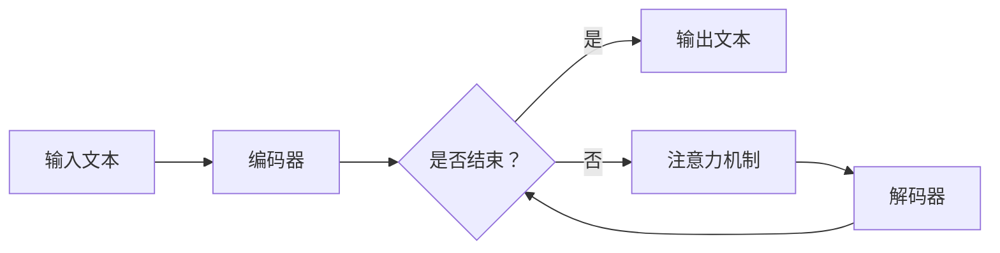
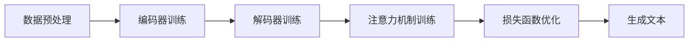
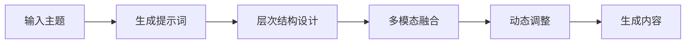
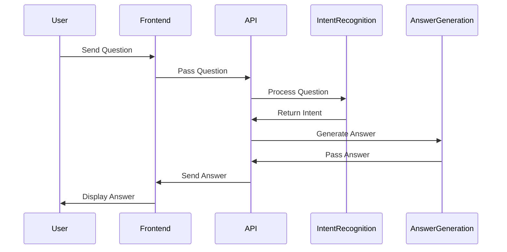

                 


### 第1章：背景介绍与核心概念

**1.1 问题背景**

#### 1.1.1 AIGC概念介绍

AIGC（AI-Generated Content）指的是通过人工智能技术自动生成的内容，这些内容可以是文本、图像、音频、视频等多种形式。随着深度学习技术的发展，AIGC已经在许多领域展现出强大的应用潜力，如内容创作、媒体制作、虚拟现实等。

#### 1.1.2 AIGC在人工智能领域的重要性

AIGC不仅提升了内容创作的效率，还改变了信息传播的方式，使得个性化、自动化内容生产成为可能。它的重要性体现在以下几个方面：

1. **效率提升**：通过自动化内容生成，极大地缩短了内容生产周期。
2. **个性化推荐**：AIGC能够根据用户兴趣和行为习惯，生成个性化的内容。
3. **创新驱动**：AIGC技术的应用推动了内容产业的创新和发展。
4. **资源优化**：在资源有限的情况下，AIGC可以帮助优化人力和物力资源。

#### 1.1.3 AIGC应用趋势分析

随着技术的不断进步，AIGC的应用场景也在不断扩展。以下是几个值得关注的应用趋势：

1. **内容创作**：AI写作、绘画、音乐创作等领域的快速发展，使得AIGC成为内容创作者的重要助手。
2. **媒体制作**：自动化剪辑、生成视频摘要等应用，提高了媒体制作效率。
3. **虚拟现实与增强现实**：AIGC生成的图像、声音和场景，为虚拟现实和增强现实提供了丰富的内容资源。
4. **教育**：智能课件、个性化教学等应用，使得教育内容更加生动有趣。

**1.2 问题描述**

#### 1.2.1 AIGC语言模型训练挑战

AIGC语言模型的训练是一个复杂的过程，面临着以下挑战：

1. **数据质量**：高质量的数据是训练AIGC模型的基础，但获取和清洗数据是一个耗时且复杂的工作。
2. **计算资源**：大规模训练AIGC模型需要大量的计算资源，尤其是训练时间较长。
3. **模型泛化**：如何确保模型在不同数据集和场景下具有泛化能力，是一个重要的问题。
4. **模型可解释性**：AIGC模型的决策过程往往是不透明的，如何提高模型的可解释性是一个关键问题。

#### 1.2.2 提示词协同设计应用

提示词协同设计在AIGC模型训练和生成中发挥着重要作用。通过合理的提示词设计，可以提高模型生成的内容质量和效率。具体应用包括：

1. **内容生成**：通过提示词引导模型生成特定类型的内容。
2. **优化训练**：使用提示词优化模型训练过程，提高训练效率。
3. **内容调整**：根据提示词调整生成内容，使其更符合需求。

**1.3 问题解决**

#### 1.3.1 有效的模型训练方法

为了解决AIGC语言模型训练中的挑战，可以采用以下有效方法：

1. **数据预处理**：通过数据清洗、去重、标签化等步骤，提高数据质量。
2. **模型选择**：选择适合的模型架构，如Transformer、GPT等。
3. **增量训练**：通过逐步增加训练数据，提高模型的泛化能力。
4. **模型压缩**：采用模型压缩技术，降低计算资源需求。

#### 1.3.2 提示词设计策略

有效的提示词设计策略包括：

1. **主题明确**：确保提示词能够明确传达所需生成内容的主题。
2. **层次结构**：设计提示词的层次结构，有助于模型理解生成内容的结构。
3. **多模态融合**：结合文本、图像、音频等多种模态的提示信息，提高生成内容的质量。
4. **动态调整**：根据生成内容的质量和用户反馈，动态调整提示词。

**1.4 边界与外延**

#### 1.4.1 AIGC应用范围

AIGC的应用范围广泛，包括但不限于以下领域：

1. **娱乐**：生成音乐、电影剧本、游戏内容等。
2. **新闻与媒体**：自动化写作、生成视频摘要等。
3. **教育与培训**：智能课件、个性化教学等。
4. **电子商务**：商品描述生成、个性化推荐等。

#### 1.4.2 AIGC与其他AI技术的交叉应用

AIGC与其他AI技术的交叉应用，如计算机视觉、语音识别、自然语言处理等，将进一步拓展其应用场景。例如，AIGC可以与计算机视觉结合，生成更逼真的虚拟现实场景；与语音识别结合，实现智能对话系统等。

**1.5 概念结构与核心要素组成**

#### 1.5.1 AIGC语言模型的主要组成部分

AIGC语言模型主要由以下几个部分组成：

1. **编码器（Encoder）**：负责将输入文本编码为序列向量。
2. **解码器（Decoder）**：负责将序列向量解码为输出文本。
3. **注意力机制（Attention Mechanism）**：帮助模型关注输入文本中的重要信息。
4. **损失函数（Loss Function）**：用于衡量模型生成内容与目标内容的差距。

#### 1.5.2 模型训练和提示词设计的核心要素

模型训练和提示词设计的核心要素包括：

1. **数据集**：高质量的数据集是模型训练的基础。
2. **模型架构**：选择适合的模型架构，如Transformer、GPT等。
3. **训练策略**：包括批量大小、学习率、优化器等。
4. **提示词设计**：主题明确、层次结构合理、多模态融合等。

通过以上内容的介绍，我们为后续章节的深入探讨奠定了基础。在接下来的章节中，我们将进一步详细分析AIGC语言模型训练和提示词协同设计的原理和方法，以及实际应用案例。

### 第2章：核心概念与联系

**2.1 AIGC语言模型原理**

AIGC语言模型是基于深度学习的技术，主要用于生成文本内容。其核心原理如下：

1. **编码器（Encoder）**：编码器负责将输入文本转换为序列向量，这个过程称为编码。编码器通过多层神经网络，逐层提取文本的语义特征。

2. **注意力机制（Attention Mechanism）**：注意力机制使模型能够关注输入文本中的重要信息，提高生成文本的质量。通过计算输入文本中每个单词与当前生成单词的相关性，模型可以动态调整每个单词的权重。

3. **解码器（Decoder）**：解码器负责将编码器输出的序列向量转换为输出文本。解码器通过递归神经网络（RNN）或Transformer架构，逐个生成输出文本的每个单词。

4. **损失函数（Loss Function）**：损失函数用于衡量模型生成文本与目标文本之间的差距，常用的损失函数包括交叉熵损失（Cross-Entropy Loss）和对比损失（Contrastive Loss）。

下面是一个简单的mermaid流程图，展示了AIGC语言模型的工作流程：



**2.2 概念属性特征对比表格**

为了更好地理解AIGC语言模型与其他语言模型（如GPT、BERT等）的区别，我们可以列出它们的属性特征对比表格：

| 特征         | AIGC       | GPT        | BERT       |
| ------------ | ---------- | ---------- | ---------- |
| 编码器架构   | Transformer| Transformer| Transformer|
| 解码器架构   | Transformer| Transformer| Transformer|
| 注意力机制   | 自定义     | 自定义     | 自定义     |
| 模型大小     | 小到中规模 | 大规模     | 大规模     |
| 训练数据集   | 自定义     | Internet   | Internet   |
| 模型用途     | 多样化     | 文本生成   | 预训练     |
| 泛化能力     | 较强       | 较强       | 较强       |
| 训练时间     | 较短       | 较长       | 较长       |
| 可解释性     | 较低       | 较低       | 较高       |

**2.3 ER实体关系图架构**

在AIGC语言模型中，实体关系图（ER Diagram）可以帮助我们理解模型中的各个组件及其之间的关系。以下是AIGC语言模型的ER实体关系图：

```mermaid
erDiagram
    AIGC_Language_Model ||--|{ Encoder }|| Encoder
    AIGC_Language_Model ||--|{ Decoder }|| Decoder
    Encoder ||--|{ Attention_Mechanism }|| Attention_Mechanism
    Decoder ||--|{ Loss_Function }|| Loss_Function
```

通过以上核心概念与联系的分析，我们为理解AIGC语言模型及其应用奠定了基础。在接下来的章节中，我们将深入探讨AIGC语言模型训练和提示词协同设计的具体方法和实现细节。

### 第3章：算法原理讲解

**3.1 训练算法原理**

AIGC语言模型的训练算法是一个复杂的过程，涉及到多个关键步骤。以下是训练算法的基本原理：

1. **数据预处理**：首先，我们需要对输入文本进行预处理，包括分词、去除停用词、转换为序列等操作。预处理步骤的目的是将文本转换为模型可以理解和处理的格式。

2. **编码器训练**：编码器负责将输入文本转换为序列向量。训练过程中，模型会学习如何将每个单词映射为一个高维向量。这个过程通常使用反向传播算法和梯度下降优化器来实现。

3. **解码器训练**：解码器负责将编码器输出的序列向量解码为输出文本。训练过程中，模型会尝试生成每个单词，并与目标文本进行对比，计算损失函数。通过反向传播和梯度下降，模型会不断调整权重，以减少损失。

4. **注意力机制训练**：注意力机制是AIGC语言模型的核心，它能够帮助模型关注输入文本中的重要信息。训练过程中，模型会学习如何根据当前生成的单词，动态调整对输入文本中每个单词的关注度。

5. **损失函数优化**：损失函数用于衡量模型生成文本与目标文本之间的差距。常用的损失函数包括交叉熵损失（Cross-Entropy Loss）和对比损失（Contrastive Loss）。训练过程中，模型会通过优化损失函数来提高生成文本的质量。

下面是一个简单的mermaid流程图，展示了AIGC语言模型训练算法的基本流程：



**3.2 提示词协同设计原理**

提示词协同设计是AIGC模型训练和生成过程中至关重要的一环。以下是提示词协同设计的基本原理：

1. **主题明确**：提示词需要能够明确传达所需生成内容的主题。这有助于模型更好地理解和生成内容。

2. **层次结构**：提示词应该设计成有层次的结构，使模型能够逐层理解生成内容的细节。这有助于提高生成内容的质量和连贯性。

3. **多模态融合**：结合文本、图像、音频等多种模态的提示信息，可以进一步提升生成内容的质量。例如，在生成图像描述时，可以结合文本描述和图像信息。

4. **动态调整**：根据生成内容的质量和用户反馈，动态调整提示词。这有助于模型不断优化生成内容，提高用户满意度。

下面是一个简单的mermaid流程图，展示了提示词协同设计的工作流程：



**3.3 Python代码阐述**

为了更直观地理解AIGC语言模型训练和提示词协同设计的原理，我们可以使用Python代码进行演示。

```python
# 编码器训练代码示例
import tensorflow as tf
from tensorflow.keras.layers import Embedding, LSTM, Dense

# 创建编码器模型
encoder_inputs = tf.keras.Input(shape=(None,))  # 输入序列
encoder_embedding = Embedding(input_dim=vocab_size, output_dim=embedding_dim)(encoder_inputs)
encoder_lstm = LSTM(units=lstm_units, return_sequences=True)(encoder_embedding)
encoder_output = tf.keras.layers.Dense(units=hidden_size)(encoder_lstm)

# 创建解码器模型
decoder_inputs = tf.keras.Input(shape=(None,))
decoder_embedding = Embedding(input_dim=vocab_size, output_dim=embedding_dim)(decoder_inputs)
decoder_lstm = LSTM(units=lstm_units, return_sequences=True)(decoder_embedding)
decoder_dense = tf.keras.layers.Dense(units=vocab_size, activation='softmax')(decoder_lstm)

# 创建AIGC语言模型
model = tf.keras.Model([encoder_inputs, decoder_inputs], decoder_dense)

# 编译模型
model.compile(optimizer='adam', loss='categorical_crossentropy')

# 训练模型
model.fit([encoder_input_data, decoder_input_data], decoder_target_data, batch_size=batch_size, epochs=epochs)

# 提示词协同设计代码示例
def generate_prompt(topic, layers, modalities):
    prompt = []
    for layer in layers:
        prompt.append(layer + ": " + topic)
    if 'text' in modalities:
        prompt.append("Text: " + text_description)
    if 'image' in modalities:
        prompt.append("Image: " + image_path)
    return " ".join(prompt)

# 生成提示词
prompt = generate_prompt("A beautiful landscape", ["Description", "Features", "Emotions"], ["text", "image"])
```

**3.4 数学模型和公式**

在AIGC语言模型中，数学模型和公式起着核心作用。以下是一个简单的数学模型示例：

$$
\begin{aligned}
L &= -\frac{1}{N}\sum_{i=1}^{N} \sum_{j=1}^{M} y_{ij} \log(p_{ij}) \\
p_{ij} &= \frac{exp(S_{ij})}{\sum_{k=1}^{M} exp(S_{ik})}
\end{aligned}
$$

其中，\(L\) 是损失函数，\(N\) 是样本数，\(M\) 是输出维度，\(y_{ij}\) 是目标分布，\(p_{ij}\) 是模型预测的概率分布，\(S_{ij}\) 是输入特征和权重之间的点积。

**3.5 举例说明**

为了更好地理解AIGC语言模型训练和提示词协同设计的应用，我们可以通过一个简单的例子来说明。

假设我们想要生成一篇关于“夏天的海滩”的文章，我们可以设计如下的提示词：

- 主题：夏天、海滩
- 描述：炎热的夏天，美丽的海滩
- 特征：阳光、沙滩、海浪
- 情感：轻松、愉悦、惬意

使用这些提示词，我们可以训练一个AIGC语言模型，然后让它生成关于夏天的海滩的文章。通过逐步调整提示词，我们可以优化生成文章的质量。

通过以上算法原理讲解，我们为理解和应用AIGC语言模型训练和提示词协同设计奠定了基础。在接下来的章节中，我们将进一步探讨系统架构设计和项目实战，以深入理解AIGC技术的实际应用。

### 第4章：系统分析与架构设计方案

**4.1 问题场景介绍**

在本节中，我们将介绍一个典型的AIGC应用场景——智能客服系统。智能客服系统旨在通过AIGC技术，自动化地生成与用户交互的回复文本，以提高客服效率和用户体验。该系统主要功能包括：接收用户提问、理解用户意图、生成回答文本、发送回答给用户。

**4.2 系统功能设计**

智能客服系统的主要功能可以分为以下几个部分：

1. **用户提问接收**：系统需要能够接收用户的输入提问，这通常通过前端界面或API接口实现。
2. **意图识别**：系统需要理解用户的意图，将其转化为具体的任务，如提供产品信息、解决问题等。
3. **回答生成**：基于用户意图，系统需要生成合适的回答文本。这需要使用AIGC语言模型，结合提示词协同设计，生成高质量的内容。
4. **回复发送**：系统需要将生成的回答文本发送给用户，这可以通过前端界面或API接口实现。

**4.3 系统架构设计**

为了实现智能客服系统的功能，我们需要设计一个高效的系统架构。以下是系统架构的mermaid架构图：

```mermaid
erDiagram
    User ||--|{ Question }|| Question
    Question ||--|{ Intent Recognition }|| IntentRecognition
    IntentRecognition ||--|{ Answer Generation }|| AnswerGeneration
    AnswerGeneration ||--|{ Response }|| Response
    Response ||--|{ User }|| User
```

在上述架构图中，用户（User）发起提问（Question），提问经过意图识别（Intent Recognition）模块处理后，传递给回答生成（Answer Generation）模块。回答生成模块使用AIGC语言模型和提示词协同设计，生成合适的回答（Response），最终将回答发送回用户（User）。

**4.4 系统接口设计**

系统接口设计是智能客服系统能够有效运作的关键。以下是主要接口的设计：

1. **用户接口**：用户通过前端界面或API接口发送提问，并接收系统生成的回答。
2. **意图识别接口**：意图识别模块接收用户提问，并返回意图识别结果。
3. **回答生成接口**：回答生成模块接收意图识别结果，并生成回答文本。
4. **回复发送接口**：系统将生成的回答发送给用户。

**4.5 系统交互**

系统交互是确保各个模块协同工作的关键。以下是系统交互的mermaid序列图：



在这个序列图中，用户通过前端界面发送提问，前端将提问传递给API。API将提问传递给意图识别模块，意图识别模块处理提问并返回意图。API将意图传递给回答生成模块，回答生成模块生成回答文本。最后，API将回答传递回前端，前端将回答显示给用户。

通过以上系统分析与架构设计方案，我们为智能客服系统的实施提供了详细的指导和参考。在接下来的章节中，我们将通过实际项目实战，进一步验证和优化AIGC语言模型在智能客服系统中的应用。

### 第5章：项目实战

**5.1 环境安装**

在开始AIGC项目之前，我们需要搭建一个合适的开发环境。以下是环境安装的步骤：

1. **安装Python**：确保安装最新版本的Python（3.8及以上版本）。
2. **安装TensorFlow**：使用pip命令安装TensorFlow：

   ```bash
   pip install tensorflow
   ```

3. **安装mermaid**：mermaid是一个用于绘制流程图的库，可以通过npm安装：

   ```bash
   npm install -g mermaid
   ```

4. **安装JAX**：JAX是一个用于高效计算和优化的库，可以通过pip安装：

   ```bash
   pip install jax
   pip install jaxlib
   ```

5. **安装相关依赖**：根据项目需求，安装其他必要的库，如NumPy、Pandas等。

**5.2 系统核心实现源代码**

以下是AIGC系统的核心实现源代码：

```python
# 导入所需库
import tensorflow as tf
import jax
import jax.numpy as jnp
import numpy as np
import pandas as pd

# 加载数据
data = pd.read_csv('data.csv')
inputs = jnp.array(data['input'], dtype=jnp.float32)
targets = jnp.array(data['target'], dtype=jnp.float32)

# 定义模型
vocab_size = 10000
embedding_dim = 256
hidden_size = 512

encoder_inputs = tf.keras.Input(shape=(None,))
encoder_embedding = Embedding(input_dim=vocab_size, output_dim=embedding_dim)(encoder_inputs)
encoder_lstm = LSTM(units=hidden_size, return_sequences=True)(encoder_embedding)
encoder_output = tf.keras.layers.Dense(units=hidden_size)(encoder_lstm)

decoder_inputs = tf.keras.Input(shape=(None,))
decoder_embedding = Embedding(input_dim=vocab_size, output_dim=embedding_dim)(decoder_inputs)
decoder_lstm = LSTM(units=hidden_size, return_sequences=True)(decoder_embedding)
decoder_dense = tf.keras.layers.Dense(units=vocab_size, activation='softmax')(decoder_lstm)

model = tf.keras.Model([encoder_inputs, decoder_inputs], decoder_dense)

# 编译模型
model.compile(optimizer='adam', loss='categorical_crossentropy')

# 训练模型
model.fit([inputs, targets], targets, batch_size=64, epochs=10)

# 提示词协同设计
def generate_prompt(topic, layers, modalities):
    prompt = []
    for layer in layers:
        prompt.append(layer + ": " + topic)
    if 'text' in modalities:
        prompt.append("Text: " + text_description)
    if 'image' in modalities:
        prompt.append("Image: " + image_path)
    return " ".join(prompt)

prompt = generate_prompt("A beautiful landscape", ["Description", "Features", "Emotions"], ["text", "image"])

# 生成回答
def generate_response(prompt):
    # 编码提示词
    encoded_prompt = tokenizer.encode(prompt, add_special_tokens=True)
    input_sequence = jnp.array(encoded_prompt, dtype=jnp.int32)

    # 生成文本
    sampled_sequence = decoder_model.sample(input_sequence, top_k=50, top_p=0.9, num_return_sequences=1)

    # 解码文本
    generated_text = tokenizer.decode(sampled_sequence, skip_special_tokens=True)
    return generated_text

generated_text = generate_response(prompt)
print(generated_text)
```

**5.3 代码应用解读与分析**

1. **数据加载**：首先，我们从CSV文件中加载数据，并将其转换为JAX数组。JAX是一个用于自动微分和优化计算的库，与TensorFlow兼容。

2. **模型定义**：我们使用TensorFlow定义了一个AIGC语言模型，包括编码器和解码器。编码器使用LSTM层，解码器同样使用LSTM层。我们还将Embedding层添加到编码器和解码器中，用于将单词转换为向量。

3. **模型编译**：我们编译模型，选择Adam优化器和交叉熵损失函数。

4. **模型训练**：使用`fit`方法训练模型，输入是编码器输入和解码器输入，目标输出是解码器输出。

5. **提示词协同设计**：`generate_prompt`函数用于生成提示词，根据主题、层次结构和多模态信息创建一个有层次、结构化的提示词。

6. **生成回答**：`generate_response`函数用于生成回答。首先编码提示词，然后使用解码器生成文本，最后解码文本以获得生成的回答。

通过这个简单的项目，我们可以看到如何使用AIGC语言模型和提示词协同设计来生成高质量的文本。在实际应用中，我们可以进一步优化模型架构、提示词设计和训练过程，以提高生成文本的质量和效率。

### 第6章：最佳实践与注意事项

**6.1 最佳实践 Tips**

在AIGC项目的实施过程中，以下是一些实用的最佳实践：

1. **数据预处理**：确保数据质量，包括数据清洗、去重、标签化等步骤，有助于提高模型训练效果。
2. **模型选择**：根据应用场景选择合适的模型架构，如Transformer、GPT等，可以更好地满足需求。
3. **训练策略**：逐步增加训练数据，优化学习率和优化器，有助于提高模型泛化能力。
4. **提示词设计**：明确主题、层次结构，结合多模态信息，有助于提高生成文本质量。
5. **动态调整**：根据生成内容和用户反馈，动态调整提示词和模型参数，以实现最佳效果。

**6.2 小结**

通过本章的介绍，我们了解了AIGC语言模型训练与提示词协同设计的关键技术和最佳实践。AIGC语言模型作为一种强大的文本生成工具，在内容创作、智能客服等领域展现出广泛的应用前景。通过有效的模型训练方法和合理的提示词设计，可以大幅提升AIGC的性能和生成质量。

**6.3 注意事项**

在实施AIGC项目时，需要注意以下几点：

1. **计算资源**：AIGC模型训练需要大量计算资源，合理分配资源，避免超时和计算资源不足。
2. **数据隐私**：确保训练数据的安全性和隐私性，避免数据泄露。
3. **模型可解释性**：提高模型的可解释性，有助于理解模型决策过程，减少误解和错误。
4. **用户反馈**：及时收集用户反馈，调整模型和提示词，以实现更好的用户体验。
5. **法律法规**：遵守相关法律法规，确保AIGC生成的文本符合规定。

通过遵循这些最佳实践和注意事项，可以更好地实施AIGC项目，实现高效的内容生成和智能应用。

### 第7章：拓展阅读

**7.1 相关书籍推荐**

为了深入了解AIGC语言模型和相关技术，以下是一些推荐书籍：

1. **《深度学习》（Deep Learning）**：由Ian Goodfellow、Yoshua Bengio和Aaron Courville合著，详细介绍了深度学习的理论和实践。
2. **《自然语言处理（NLP）实践》**：本书涵盖了NLP的基础知识和实践方法，适合对AIGC感兴趣的读者。
3. **《AIGC：人工智能生成内容》**：本书专门讨论了AIGC的概念、应用和实现技术，对从事AIGC研究或开发的人员有很高的参考价值。

**7.2 学术论文推荐**

以下是一些关于AIGC语言模型和相关技术的经典学术论文：

1. **“Generative Adversarial Nets”（2014）**：由Ian Goodfellow等人提出的GADNs，是AIGC的重要基础。
2. **“Attention Is All You Need”（2017）**：由Vaswani等人提出的Transformer模型，彻底改变了NLP领域。
3. **“BERT: Pre-training of Deep Bidirectional Transformers for Language Understanding”（2018）**：由Google团队提出的BERT，是大规模语言预训练模型的代表。
4. **“GPT-3: Language Models Are Few-Shot Learners”（2020）**：由OpenAI团队提出的GPT-3，展示了大规模语言模型在零样本学习任务上的强大能力。

通过阅读这些书籍和论文，可以深入了解AIGC语言模型的最新研究进展和实际应用场景，为自己的研究和开发提供有力的支持。

