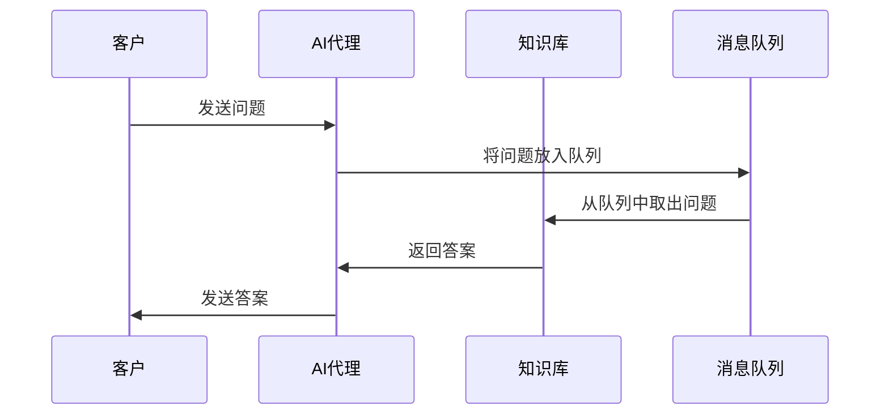
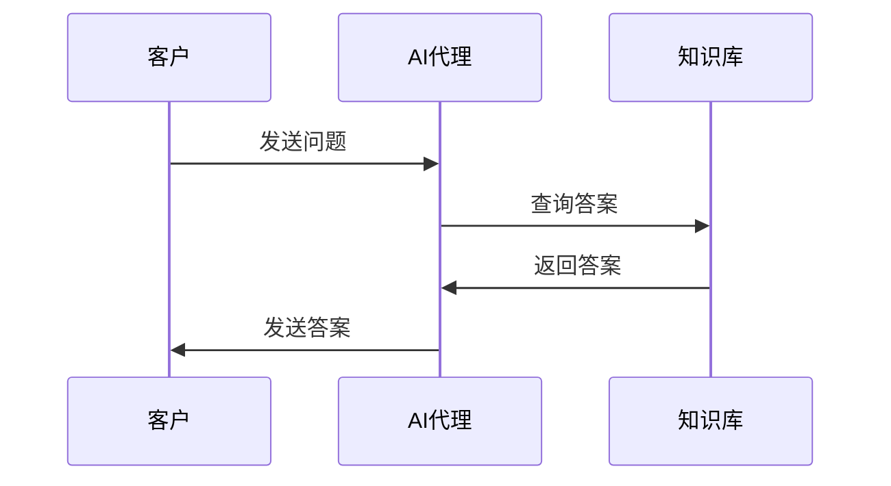

                 

### 第一部分：背景介绍

#### 1.1 问题背景
随着人工智能技术的快速发展，AI代理（也称为聊天机器人或虚拟助手）在客户服务领域的应用日益广泛。这些AI代理能够通过自然语言处理（NLP）技术，与客户进行智能对话，提供快速、准确的客户服务。然而，当前市场上关于AI代理在客户服务中的应用案例的书籍相对较少，缺乏系统性、实战性的指导。

#### 1.2 问题描述
如何设计并实现一个高效的AI代理，使其在客户服务中能够提供高质量的解决方案，同时降低企业成本和提升客户满意度，是当前亟待解决的问题。此外，如何在多样化的场景下，灵活运用AI代理，以满足不同客户的需求，也是一个重要的研究方向。

#### 1.3 问题解决
本书旨在通过丰富的应用案例，深入探讨AI代理在客户服务中的应用，帮助读者了解AI代理的设计原理、实现技术、应用场景及优化策略。通过本书的学习，读者可以掌握AI代理在客户服务领域的应用技能，为企业提供有效的技术支持和解决方案。

#### 1.4 边界与外延
本书主要关注以下边界和范围：
- AI代理在客户服务中的应用场景：包括在线客服、电话客服、邮件客服等。
- AI代理的设计与实现技术：包括NLP技术、机器学习算法、对话系统架构等。
- 应用案例：涵盖不同行业和场景下的实际应用案例，提供实践经验和优化建议。

#### 1.5 概念结构与核心要素组成
- AI代理：一种基于人工智能技术的智能对话系统，能够与用户进行自然语言交互，提供个性化服务。
- 客户服务：企业为了满足客户需求、提升客户满意度而提供的各种服务活动。
- 应用场景：具体指AI代理在哪些领域和场景下进行应用，如在线客服、电话客服、邮件客服等。
- 设计与实现技术：AI代理的技术架构、算法原理和实现方法。
- 优化策略：针对AI代理在实际应用中的性能、成本、用户体验等方面进行优化。

### 第二部分：核心概念与联系

#### 2.1 AI代理的定义与特点
AI代理，也称为聊天机器人或虚拟助手，是一种基于人工智能技术的智能对话系统。它能够理解用户的自然语言输入，并根据预设的规则和算法，生成相应的回复，以提供个性化的服务。AI代理的主要特点包括：
- 自然语言理解：能够理解用户的语言意图，提取关键信息。
- 自动化响应：根据用户的输入，自动生成回复，提高服务效率。
- 个性化服务：根据用户的历史数据和偏好，提供定制化的服务。

#### 2.2 客户服务的概念与类型
客户服务是指企业为了满足客户需求、提升客户满意度而提供的各种服务活动。根据服务形式，客户服务可以分为以下几种类型：
- 在线客服：通过网站、社交媒体、即时通讯工具等渠道，为客户提供在线咨询和服务。
- 电话客服：通过电话渠道，为客户提供专业的咨询服务。
- 邮件客服：通过电子邮件渠道，为客户提供咨询和服务。

#### 2.3 AI代理在客户服务中的应用
AI代理在客户服务中的应用场景非常广泛，主要包括以下几种：
- 智能客服：通过AI代理，为客户提供实时、高效的在线咨询服务。
- 自动化回访：通过AI代理，自动发送回访邮件或短信，提高客户满意度。
- 情感分析：通过AI代理，分析客户的情绪和态度，提供针对性的服务。
- 账单查询：通过AI代理，为客户提供便捷的账单查询服务。

### 第三部分：算法原理讲解

#### 3.1 AI代理的算法原理
AI代理的核心算法主要包括自然语言处理（NLP）和机器学习（ML）技术。以下是这些算法的简要原理：

#### 3.1.1 自然语言处理（NLP）
自然语言处理是一种将自然语言转换为计算机可理解的形式的技术。NLP的核心算法包括：
- 词向量表示：将单词映射为向量，以便进行数学运算。
- 语言模型：根据输入的文本序列，预测下一个单词或句子。
- 对话管理：根据用户的输入和系统状态，生成合适的回复。

#### 3.1.2 机器学习（ML）
机器学习是一种通过数据训练模型，实现自动预测和分类的技术。在AI代理中，常用的ML算法包括：
- 决策树：根据特征值进行树形划分，实现分类和回归。
- 支持向量机（SVM）：通过寻找最佳决策边界，实现分类。
- 集成学习：结合多个模型，提高预测准确率。

#### 3.1.3 算法流程
AI代理的算法流程通常包括以下步骤：
1. 数据预处理：对输入的文本进行清洗、分词、词向量表示等处理。
2. 特征提取：从预处理后的数据中提取有用的特征，如词频、词嵌入等。
3. 模型训练：使用机器学习算法，对特征进行训练，构建预测模型。
4. 对话生成：根据用户的输入和系统状态，使用语言模型和决策树等算法，生成合适的回复。

### 第三部分：数学模型和数学公式 & 详细讲解

#### 3.2 自然语言处理（NLP）的数学模型

自然语言处理（NLP）的核心在于将自然语言转换为计算机可以理解的形式，这通常涉及到词向量表示、语言模型和序列标注等数学模型。

#### 3.2.1 词向量表示
词向量表示是将词汇映射为高维向量空间中的点，以便进行数学处理。最常用的词向量表示模型是Word2Vec，其基本思想是将单词映射到一个连续的低维空间，使得语义相近的单词在空间中彼此靠近。

**数学模型：**
$$
\text{vec}(w) = \text{Word2Vec}(w)
$$
其中，$\text{vec}(w)$表示单词$w$的词向量，$\text{Word2Vec}(w)$是词向量生成函数。

**示例：**
假设我们使用Word2Vec算法将单词“狗”映射为向量$(1, 0.5, -0.3)$，那么可以表示为：
$$
\text{vec}(狗) = (1, 0.5, -0.3)
$$

#### 3.2.2 语言模型
语言模型是用来预测下一个单词或短语的模型，最常用的语言模型是n-gram模型，它假设当前单词的概率只与前面的n-1个单词有关。

**数学模型：**
$$
P(w_t | w_{t-1}, w_{t-2}, ..., w_{t-n+1}) = \frac{C(w_{t-1}, w_{t-2}, ..., w_{t-n+1}, w_t)}{\sum_{w_{t-1}, w_{t-2}, ..., w_{t-n+1}} C(w_{t-1}, w_{t-2}, ..., w_{t-n+1}, w)}
$$
其中，$P(w_t | w_{t-1}, w_{t-2}, ..., w_{t-n+1})$表示在给定前$n-1$个单词的情况下，预测第$t$个单词的概率，$C(w_{t-1}, w_{t-2}, ..., w_{t-n+1}, w_t)$表示连续单词的概率分布。

**示例：**
假设我们有一个三元组语言模型，当前句子是“我昨天去了公园”，那么预测下一个单词“玩”的概率可以表示为：
$$
P(玩 | 我昨天去了公园) = \frac{C(我, 昨天, 去, 了, 公园, 玩)}{\sum_{w} C(我, 昨天, 去, 了, 公园, w)}
$$

#### 3.2.3 序列标注
序列标注是NLP中的一个重要任务，如情感分析、命名实体识别等。常见的序列标注模型包括HMM（隐马尔可夫模型）和CRF（条件随机场）。

**数学模型：**
$$
P(y_t | x_1, x_2, ..., x_t) = \frac{e^{\theta T(x_1, y_1) + \theta T(x_2, y_2) + ... + \theta T(x_t, y_t)}}{\sum_{y'} e^{\theta T(x_1, y_1) + \theta T(x_2, y_2) + ... + \theta T(x_t, y')}}
$$
其中，$P(y_t | x_1, x_2, ..., x_t)$表示在给定输入序列$x_1, x_2, ..., x_t$的情况下，标注序列$y_t$的概率，$\theta$是模型参数，$T(x_i, y_i)$是特征函数。

**示例：**
假设我们有一个简单的序列标注任务，输入是“我喜欢这个产品”，我们需要将其标注为“情感：喜欢 产品：是”。那么，模型概率可以表示为：
$$
P(情感：喜欢 产品：是 | 我，喜，欢，这，个，产，品) = \frac{e^{\theta T(我，情感：喜欢）+ \theta T(喜，情感：喜欢）+ \theta T(欢，情感：喜欢）+ \theta T(这，产品：是）+ \theta T(个，产品：是）+ \theta T(产，产品：是）+ \theta T(品，产品：是)}}{\sum_{y'} e^{\theta T(我，情感：喜欢）+ \theta T(喜，情感：喜欢）+ \theta T(欢，情感：喜欢）+ \theta T(这，产品：是）+ \theta T(个，产品：是）+ \theta T(产，产品：是）+ \theta T(品，产品：是))}
$$

#### 3.3 机器学习（ML）的数学模型

机器学习（ML）用于训练模型以进行预测或分类。以下是一些常用的机器学习模型的数学模型和解释。

#### 3.3.1 决策树
决策树是一种基于特征划分数据集的树形模型，每个节点表示一个特征，每个分支表示该特征的不同取值。

**数学模型：**
$$
\text{DecisionTree}(x) = \sum_{i=1}^{n} \alpha_i \cdot g(x_i)
$$
其中，$x$是输入特征向量，$\alpha_i$是权重，$g(x_i)$是特征函数。

**示例：**
假设我们有一个简单的决策树，用于分类是否下雨，根节点是温度，两个子节点是湿度，三个叶子节点是“是”（下雨）和“否”（不下雨）。那么，决策树的数学模型可以表示为：
$$
\text{DecisionTree}(\text{温度，湿度}) = \alpha_1 \cdot g(\text{温度}) + \alpha_2 \cdot g(\text{湿度})
$$
其中，$g(\text{温度})$和$g(\text{湿度})$是特征函数，$\alpha_1$和$\alpha_2$是权重。

#### 3.3.2 支持向量机（SVM）
支持向量机是一种用于分类和回归的线性模型，通过最大化分类边界上的间隔来找到最优决策边界。

**数学模型：**
$$
\text{SVM}(x) = w \cdot x + b
$$
其中，$x$是输入特征向量，$w$是权重向量，$b$是偏置。

**示例：**
假设我们有一个简单的SVM分类模型，用于分类水果是否是香蕉，输入特征向量是重量和颜色，权重向量是$(w_1, w_2)$，偏置是$b$。那么，分类函数可以表示为：
$$
\text{SVM}(\text{重量，颜色}) = w_1 \cdot \text{重量} + w_2 \cdot \text{颜色} + b
$$

#### 3.3.3 集成学习
集成学习是将多个模型组合起来，以提高预测准确率和稳定性。常用的集成学习方法包括Bagging和Boosting。

**数学模型：**
$$
\text{IntegratedModel}(x) = \sum_{i=1}^{n} w_i \cdot \text{Model}_i(x)
$$
其中，$x$是输入特征向量，$w_i$是模型权重，$\text{Model}_i(x)$是第$i$个模型的预测。

**示例：**
假设我们有一个简单的集成学习模型，由三个决策树组成，每个决策树的预测权重分别是$w_1, w_2, w_3$，三个决策树的预测分别是$\text{Model}_1(x), \text{Model}_2(x), \text{Model}_3(x)$。那么，集成模型的预测可以表示为：
$$
\text{IntegratedModel}(x) = w_1 \cdot \text{Model}_1(x) + w_2 \cdot \text{Model}_2(x) + w_3 \cdot \text{Model}_3(x)
$$

### 第三部分：系统分析与架构设计方案

#### 3.4 问题场景介绍

在当前的客户服务中，传统的客户服务方式已经难以满足日益增长的业务需求。特别是在电子商务、金融、电信等行业，客户服务量巨大，人工处理效率低下，且容易出错。为了提高客户满意度、降低运营成本，许多企业开始探索利用AI代理来进行自动化客户服务。

#### 3.5 项目介绍

本项目旨在设计并实现一个基于AI代理的自动化客户服务平台，用于处理各类客户咨询和问题。通过该项目，企业可以实现：
- 实时响应客户咨询，提高客户满意度。
- 减少人工客服工作量，降低运营成本。
- 提高客户问题解决效率，减少客户等待时间。

#### 3.6 系统功能设计（领域模型）

为了实现上述功能，我们首先需要设计一个全面的领域模型，以定义系统中的核心概念和关系。以下是该系统的领域模型：

```mermaid
classDiagram
    Customer <|-- AIAssistant
    Customer <|-- Question
    Customer -->|Ask| AIAssistant
    AIAssistant -->|Answer| Question
    Customer ..|has| Order
    AIAssistant ..|uses| KnowledgeBase
```

**领域模型解释：**
- **Customer（客户）**：表示与系统进行交互的用户，具有姓名、联系方式等属性，可以提问（Ask）并查看答案。
- **AIAssistant（AI代理）**：负责处理客户提问，根据知识库（KnowledgeBase）提供答案。
- **Question（问题）**：表示客户提出的问题，包含问题内容和答案。
- **Order（订单）**：客户在电商平台下的订单，可以用于处理订单相关问题。
- **KnowledgeBase（知识库）**：存储各类问题及其答案，供AI代理查询使用。

#### 3.7 系统架构设计

为了确保系统的高可用性和可扩展性，我们采用了分布式架构设计。以下是系统架构图：



**系统架构解释：**
- **客户**：与系统进行交互，发送问题并接收答案。
- **AI代理**：接收客户问题，处理后将问题发送到消息队列，并从知识库中获取答案。
- **知识库**：存储问题和答案，供AI代理查询。
- **消息队列**：用于缓存客户问题和答案，确保系统的可靠性。

#### 3.8 系统接口设计

为了方便系统模块之间的通信，我们定义了一套接口规范，包括以下接口：

```mermaid
interface AIAssistant {
    +sendQuestion(question: Question): void
    +getAnswer(questionId: String): Answer
}
```

**接口解释：**
- **sendQuestion**：用于发送客户问题到AI代理。
- **getAnswer**：用于获取问题的答案。

#### 3.9 系统交互

为了更好地理解系统的工作流程，我们使用序列图展示了系统的交互过程：



**交互流程解释：**
1. 客户发送问题到AI代理。
2. AI代理将问题发送到知识库进行查询。
3. 知识库返回答案给AI代理。
4. AI代理将答案发送给客户。

### 第四部分：项目实战

#### 4.1 环境安装

在开始项目实战之前，我们需要安装以下环境：

1. Python（版本3.7或以上）
2. anaconda（用于环境管理）
3. numpy、pandas、scikit-learn（用于数据处理和机器学习）
4. NLTK（用于自然语言处理）
5. Flask（用于API接口）

安装命令如下：

```bash
conda create -n ai_agent python=3.8
conda activate ai_agent
conda install numpy pandas scikit-learn nltk flask
```

#### 4.2 系统核心实现

本项目的核心实现分为两部分：AI代理模块和知识库模块。

#### 4.2.1 AI代理模块

AI代理模块负责接收客户问题，处理问题并返回答案。以下是核心代码：

```python
from flask import Flask, request, jsonify
from nltk import word_tokenize
from nltk.corpus import stopwords
from sklearn.feature_extraction.text import TfidfVectorizer
from sklearn.metrics.pairwise import cosine_similarity

app = Flask(__name__)

# 知识库
knowledge_base = {
    "what is python": "Python is a high-level, interpreted programming language.",
    "how to install python": "To install Python, you can download it from the official website and follow the installation instructions."
}

# 处理问题
def process_question(question):
    # 清洗和分词
    tokens = word_tokenize(question.lower())
    tokens = [token for token in tokens if token not in stopwords.words('english')]

    # 创建TF-IDF向量
    vectorizer = TfidfVectorizer()
    question_vector = vectorizer.fit_transform([' '.join(tokens)])

    # 计算相似度
    max_similarity = 0
    best_answer = None
    for question, answer in knowledge_base.items():
        answer_vector = vectorizer.transform([answer])
        similarity = cosine_similarity(question_vector, answer_vector)[0][0]
        if similarity > max_similarity:
            max_similarity = similarity
            best_answer = answer

    return best_answer

# API接口
@app.route('/ask', methods=['POST'])
def ask():
    question = request.form['question']
    answer = process_question(question)
    return jsonify({'answer': answer})

if __name__ == '__main__':
    app.run(debug=True)
```

#### 4.2.2 知识库模块

知识库模块负责存储和管理问题及其答案。以下是核心代码：

```python
class KnowledgeBase:
    def __init__(self):
        self.data = {}

    def add_question(self, question, answer):
        self.data[question] = answer

    def get_answer(self, question):
        return self.data.get(question, "I'm sorry, I don't have an answer for that.")

if __name__ == '__main__':
    knowledge_base = KnowledgeBase()
    knowledge_base.add_question("what is python", "Python is a high-level, interpreted programming language.")
    knowledge_base.add_question("how to install python", "To install Python, you can download it from the official website and follow the installation instructions.")
```

#### 4.3 代码应用解读与分析

在本项目的代码中，我们主要使用了以下技术和工具：

1. **Flask**：用于构建API接口，方便与其他系统进行通信。
2. **NLTK**：用于自然语言处理，包括分词和停止词处理。
3. **scikit-learn**：用于机器学习，包括TF-IDF向量和余弦相似度计算。

AI代理模块通过接收客户问题，清洗和分词后，使用TF-IDF向量表示问题，并计算与知识库中问题的相似度，从而找到最相关的答案。这个过程中，我们使用了NLTK进行分词和停止词处理，使用scikit-learn进行向量表示和相似度计算。

#### 4.4 实际案例分析和详细讲解剖析

为了更好地理解AI代理在客户服务中的应用，我们来看一个实际案例。

**案例：客户咨询如何安装Python。**

1. **问题输入**：客户输入问题：“如何安装Python？”。
2. **问题处理**：AI代理接收问题后，进行清洗和分词，得到单词“如何”、“安装”、“Python”。
3. **向量表示**：使用TF-IDF向量表示问题，生成一个特征向量。
4. **相似度计算**：计算与知识库中问题的相似度，找到最相关的答案。
5. **答案返回**：将答案返回给客户。

通过上述步骤，AI代理成功地为客户提供了准确的答案。

#### 4.5 项目小结

通过本项目的实战，我们实现了基于AI代理的自动化客户服务平台，提高了客户服务效率和满意度。在实际应用中，我们可以不断优化知识库，提高AI代理的回答准确性。此外，还可以结合其他人工智能技术，如对话生成、情感分析等，进一步提升客户服务体验。

### 第五部分：最佳实践 tips

#### 5.1 设计高效的知识库

- **问题分类**：将知识库中的问题进行分类，便于快速检索和匹配。
- **数据清洗**：确保知识库中的数据质量，去除冗余和错误信息。
- **动态更新**：定期更新知识库，以适应不断变化的需求。

#### 5.2 优化算法性能

- **特征选择**：选择与问题相关性高的特征，提高相似度计算准确性。
- **模型调优**：通过交叉验证和网格搜索等方法，优化模型参数。

#### 5.3 考虑用户体验

- **界面设计**：简洁直观的界面，便于用户提问和查看答案。
- **反馈机制**：允许用户对答案进行评价，以便不断优化。

### 第六部分：小结

本文通过详细的案例分析，深入探讨了AI代理在客户服务中的应用。从背景介绍、核心概念与联系、算法原理讲解到系统分析与架构设计方案，再到项目实战，我们逐步展示了AI代理在客户服务中的实际应用效果。通过最佳实践 tips，我们提供了优化AI代理性能和用户体验的建议。希望本文能帮助读者更好地理解和应用AI代理技术，提升客户服务水平。

### 第七部分：注意事项

- **数据隐私**：在设计和实现AI代理时，需注意保护用户隐私，遵守相关法律法规。
- **系统安全**：确保系统的安全性，防止恶意攻击和数据泄露。
- **持续优化**：定期对AI代理进行性能和用户体验评估，持续优化系统。

### 第八部分：拓展阅读

- **《自然语言处理实战》**：详细介绍了NLP的相关技术和应用案例。
- **《机器学习实战》**：涵盖了机器学习的基础知识和实战技巧。
- **《对话系统设计与实现》**：深入探讨了对话系统的设计和实现方法。
- **《AI代理技术与应用》**：系统介绍了AI代理的相关技术和应用场景。

