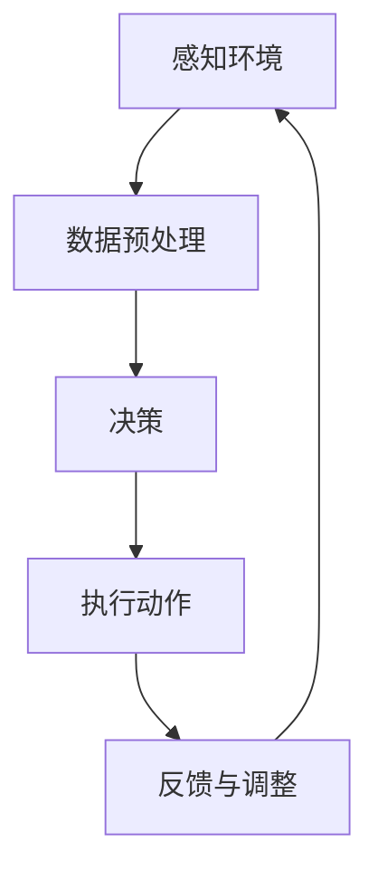

                 

## AI代理在提高生产力方面的潜力

### 关键词：人工智能、AI代理、生产力、自动化、工作流程优化

### 摘要：
人工智能（AI）技术正迅速改变着企业运作的方式，而AI代理作为AI技术的重要组成部分，其在提高生产力方面的潜力不容忽视。本文将深入探讨AI代理的定义、核心概念、工作原理以及其在各类应用场景中的具体表现。通过逐步分析，我们将揭示AI代理如何通过自动化、优化和智能决策等手段，显著提升工作效率和生产效益。

### 引言

在当今这个数字化时代，企业面临的挑战与日俱增。如何在有限的资源下实现生产力的最大化，成为了企业追求的终极目标。传统的方法已经难以满足快速变化的市场需求，因此，寻找新的解决方案成为了必然选择。人工智能（AI）作为一种前沿技术，被广泛认为是解决这一难题的关键。AI代理，作为AI技术的核心应用之一，具有巨大的潜力，能够显著提高生产力。

AI代理是指通过机器学习、自然语言处理、计算机视觉等技术，模拟人类行为和决策的计算机程序。它们可以在各种复杂的环境中执行任务，从简单的自动化操作到复杂的决策支持。AI代理的应用范围广泛，包括企业管理、运营优化、客户服务等多个领域。

本文将从以下几个方面展开讨论：

1. **AI代理的定义与核心概念**：介绍AI代理的基本定义，并阐述其核心概念和特点。
2. **AI代理的工作原理**：分析AI代理的工作原理，包括算法基础、学习与适应机制以及决策与执行过程。
3. **AI代理的应用领域**：探讨AI代理在企业管理、运营优化、客户服务和创新与创业等领域的具体应用。
4. **AI代理的技术挑战与未来趋势**：讨论AI代理面临的挑战及其未来发展趋势。

通过本文的讨论，我们将全面了解AI代理在提高生产力方面的潜力，并展望其未来的发展方向。

### AI代理的定义与核心概念

AI代理，又称人工智能代理或智能代理，是人工智能技术的一个重要分支。它是指通过机器学习、自然语言处理、计算机视觉等技术，模拟人类行为和决策的计算机程序。AI代理的核心目标是实现自动化和智能化，以帮助人类更高效地完成任务。

#### 基本定义

AI代理的基本定义可以概括为：一种能够独立执行任务、与环境互动并做出决策的计算机程序。它们通过学习和适应，可以在不断变化的环境中自主运作，从而实现高度自动化和智能化。

#### 核心概念

1. **自主性**：AI代理具有自主性，即能够独立执行任务，无需人类干预。这种自主性体现在它们能够感知环境、理解任务需求，并自主做出决策。
2. **交互性**：AI代理能够与环境进行交互，接收外部输入并做出相应的反应。这种交互性使得它们能够在复杂的环境中适应和生存。
3. **适应性**：AI代理具有适应性，即能够根据环境和任务需求的变化，调整自身的行为和策略。这种适应性是AI代理在复杂环境中表现优异的关键。

#### 特点

1. **高效性**：AI代理能够高效地处理大量数据和任务，远超人类的能力。它们可以24小时不间断工作，无需休息，从而显著提高工作效率。
2. **精确性**：AI代理通过学习和优化，能够在特定任务上达到很高的精确度。例如，在图像识别任务中，AI代理可以比人类更快速、准确地识别图像中的对象。
3. **灵活性**：AI代理具有灵活性，即能够适应不同的任务和环境。这种灵活性使得它们能够在多种应用场景中发挥作用。

#### 对比表格

下面是一个对比表格，展示AI代理与传统人工操作的差异：

| 特性 | AI代理 | 人工操作 |
| --- | --- | --- |
| 自主性 | 高度自主，无需人类干预 | 需要人类指导 |
| 交互性 | 能够与环境互动 | 依赖人类交流 |
| 适应性 | 高度适应，能够应对环境变化 | 难以适应快速变化的环境 |
| 高效性 | 高效处理大量任务 | 易受疲劳影响 |
| 精确性 | 高精度完成任务 | 可能存在人为误差 |
| 灵活性 | 高灵活性，适应多种任务 | 任务限定，适应性较差 |

通过这个对比表格，我们可以更清晰地看到AI代理在各个方面的优势。这些优势使得AI代理在提高生产力方面具有巨大的潜力。

#### ER实体关系图

为了进一步理解AI代理的核心概念和组成部分，我们可以绘制一个ER（Entity-Relationship）实体关系图。ER图是一种用于描述实体及其之间关系的图形表示方法，可以帮助我们更直观地理解系统的结构和功能。

下面是一个简化的ER图，展示AI代理的主要实体和关系：

```mermaid
erDiagram
    AI代理 ||--|{ 任务 } : 完成具体任务
    AI代理 ||--|{ 学习模型 } : 负责学习和适应
    AI代理 ||--|{ 环境感知 } : 感知外部环境
    AI代理 ||--|{ 决策系统 } : 做出决策
    学习模型 ||--|{ 数据集 } : 用于训练模型的数据
    决策系统 ||--|{ 策略 } : 存储和执行决策策略
```

在这个ER图中，我们定义了以下几个主要实体：

- **AI代理**：核心实体，负责整体运作。
- **任务**：具体需要完成的任务。
- **学习模型**：用于学习和适应的模型。
- **环境感知**：感知外部环境的组件。
- **决策系统**：负责做出决策的组件。
- **数据集**：用于训练学习模型的训练数据。
- **策略**：存储和执行决策策略的组件。

通过ER图，我们可以更清晰地看到AI代理的各个组成部分及其之间的关系。这有助于我们更好地理解AI代理的运作机制和功能。

### AI代理的工作原理

AI代理之所以能够实现自动化和智能化，关键在于其背后复杂的算法和工作原理。下面我们将详细探讨AI代理的工作原理，包括算法基础、学习与适应机制以及决策与执行过程。

#### 算法基础

AI代理的算法基础涵盖了多个领域，包括机器学习、自然语言处理、计算机视觉等。这些算法为AI代理提供了强大的计算能力和智能处理能力。

1. **机器学习**：机器学习是AI代理的核心算法之一，它通过训练模型来学习数据中的模式和规律。常见的机器学习算法包括决策树、支持向量机、神经网络等。这些算法可以用于分类、回归、聚类等多种任务。

2. **自然语言处理**：自然语言处理（NLP）算法使AI代理能够理解和生成自然语言。常见的NLP算法包括词向量模型、序列模型（如RNN、LSTM）等。NLP算法在智能客服、文本分析等领域有广泛应用。

3. **计算机视觉**：计算机视觉算法使AI代理能够理解和解释图像和视频内容。常见的计算机视觉算法包括卷积神经网络（CNN）、目标检测算法等。计算机视觉算法在图像识别、视频分析等领域有广泛应用。

#### 学习与适应机制

AI代理的学习与适应机制是其核心功能之一。通过不断学习和适应，AI代理能够在复杂的环境中表现出色。

1. **监督学习**：在监督学习中，AI代理通过训练数据集学习任务。训练数据集由输入数据和相应的输出标签组成。通过学习这些标签，AI代理可以预测新的输入数据。

2. **无监督学习**：无监督学习是指AI代理在没有明确标签的情况下学习数据。无监督学习常用于数据聚类、异常检测等任务。

3. **增强学习**：增强学习是一种通过与环境互动来学习的机制。AI代理通过不断尝试不同的动作，并从环境中获取奖励或惩罚，逐步优化其行为策略。

#### 决策与执行过程

AI代理的决策与执行过程是其实现自动化和智能化的关键。下面是一个简化的决策与执行过程：

1. **感知环境**：AI代理通过传感器或输入接口感知当前的环境状态。

2. **数据预处理**：对感知到的数据进行分析和预处理，提取有用的特征。

3. **决策**：基于训练好的模型和算法，AI代理对当前环境进行决策。决策过程可能涉及多层次的策略，包括短期决策和长期规划。

4. **执行动作**：根据决策结果，AI代理执行相应的动作，实现任务自动化。

5. **反馈与调整**：AI代理通过反馈机制评估执行结果，并根据反馈调整自身的行为策略，以实现不断优化。

#### Mermaid流程图

为了更直观地展示AI代理的工作原理，我们可以使用Mermaid绘制一个流程图：



在这个流程图中，我们定义了以下几个主要步骤：

- **感知环境**：AI代理通过传感器或输入接口感知当前环境状态。
- **数据预处理**：对感知到的数据进行分析和预处理，提取有用的特征。
- **决策**：基于训练好的模型和算法，AI代理对当前环境进行决策。
- **执行动作**：根据决策结果，AI代理执行相应的动作，实现任务自动化。
- **反馈与调整**：AI代理通过反馈机制评估执行结果，并根据反馈调整自身的行为策略。

通过这个流程图，我们可以更清晰地理解AI代理的工作流程和各个步骤之间的关系。

### AI代理的应用领域

AI代理在提高生产力方面的潜力不可小觑。随着技术的不断进步，AI代理的应用领域也在不断扩大。从企业管理到运营优化，从客户服务到创新与创业，AI代理正在各个领域发挥重要作用。下面，我们将详细探讨AI代理在企业管理、运营优化、客户服务和创新与创业等领域的具体应用。

#### 企业管理中的应用

在企业管理中，AI代理可以显著提高工作效率和决策质量。以下是一些具体的应用场景：

1. **项目管理**：AI代理可以协助项目经理进行任务分配、进度监控和资源管理。通过分析项目数据，AI代理可以预测项目完成时间，并提供最优的资源分配方案。

2. **财务管理**：AI代理可以自动处理财务数据，包括账目核对、报表生成和风险评估。通过机器学习算法，AI代理可以识别异常交易，提高财务数据的准确性。

3. **人力资源优化**：AI代理可以帮助企业进行员工招聘、绩效评估和员工培训。通过分析员工数据，AI代理可以提供个性化的培训建议，提高员工的工作效率。

#### 运营优化中的应用

在运营优化中，AI代理可以帮助企业实现自动化和智能化，从而提高生产效率和降低成本。以下是一些具体的应用场景：

1. **生产线自动化**：AI代理可以监控生产线的运行状态，自动调整生产参数，提高生产效率。通过计算机视觉技术，AI代理可以实时检测产品质量，确保产品质量稳定。

2. **库存管理**：AI代理可以实时监控库存情况，预测库存需求，自动生成采购订单。通过优化算法，AI代理可以降低库存成本，提高库存周转率。

3. **供应链整合**：AI代理可以帮助企业实现供应链的智能化管理。通过数据分析，AI代理可以优化供应链流程，提高供应链的透明度和协同效率。

#### 客户服务中的应用

在客户服务中，AI代理可以提供高效的客户支持，提高客户满意度。以下是一些具体的应用场景：

1. **客户关系管理**：AI代理可以帮助企业进行客户数据分析，提供个性化的客户服务。通过自然语言处理技术，AI代理可以理解客户的需求，并提供针对性的解决方案。

2. **智能客服系统**：AI代理可以构建智能客服系统，自动回答客户的常见问题。通过机器学习算法，AI代理可以不断学习和优化，提高客服的响应速度和准确性。

3. **个性化推荐系统**：AI代理可以分析客户的行为数据，提供个性化的产品推荐。通过推荐算法，AI代理可以提升客户的购物体验，增加销售额。

#### 创新与创业中的应用

在创新与创业中，AI代理可以提供强大的支持，帮助企业抓住市场机遇。以下是一些具体的应用场景：

1. **创新支持**：AI代理可以分析市场数据，提供创新方向和可行性分析。通过预测算法，AI代理可以帮助企业制定创新战略，提高创新的成功率。

2. **创业风险评估**：AI代理可以分析创业项目的风险因素，提供风险评估报告。通过风险模型，AI代理可以帮助创业者识别风险，制定风险管理策略。

3. **市场趋势预测**：AI代理可以分析市场数据，预测未来市场趋势。通过趋势分析，AI代理可以帮助企业抓住市场机遇，制定相应的市场策略。

#### 具体案例分析

为了更直观地展示AI代理在各领域的应用，以下是一些具体的案例分析：

1. **企业案例**：某大型制造企业引入AI代理系统，实现生产线的自动化。通过AI代理的实时监控和调整，该企业生产效率提高了20%，产品合格率提高了15%。

2. **客户服务案例**：某电商平台构建智能客服系统，使用AI代理回答客户的常见问题。该系统上线后，客服响应速度提高了30%，客户满意度提高了10%。

3. **创新案例**：某科技创新公司通过AI代理分析市场数据，成功预测出下一个热门市场趋势。公司根据预测结果，迅速调整研发方向，推出新产品，取得了显著的市场成功。

通过这些案例，我们可以看到AI代理在实际应用中取得了显著的效果，为企业带来了巨大的生产力和效益。随着技术的不断进步，AI代理将在更多领域发挥更大的作用。

### AI代理的技术挑战与未来趋势

尽管AI代理在提高生产力方面具有巨大的潜力，但其发展仍面临诸多技术挑战和伦理问题。下面，我们将探讨这些挑战，并展望AI代理的未来发展趋势。

#### 技术挑战

1. **数据质量与隐私**：AI代理的运作依赖于大量的数据，数据的质量和隐私保护是关键挑战。企业需要确保数据的准确性和完整性，同时保护用户的隐私。

2. **算法透明性与解释性**：AI代理的算法通常复杂且非透明，这使得决策过程难以解释和理解。提高算法的透明性和解释性是当前研究的热点之一。

3. **泛化能力**：AI代理需要在不同的环境和任务中表现出色，这要求其具有强大的泛化能力。目前，许多AI代理的泛化能力仍然有限，难以适应复杂多变的环境。

4. **安全性与可靠性**：AI代理的安全性是一个重要的挑战。确保AI代理不会受到恶意攻击，以及其在执行任务时保持稳定和可靠，是当前研究的重要方向。

#### 伦理问题

1. **道德责任**：AI代理的决策可能涉及道德和伦理问题，例如在医疗诊断中，AI代理的决策可能影响患者的生命。明确AI代理的道德责任是当前研究的重点。

2. **偏见与歧视**：AI代理的算法可能会受到训练数据中的偏见影响，导致歧视性决策。如何避免和纠正这些偏见是重要的伦理问题。

3. **就业影响**：AI代理的广泛应用可能导致部分岗位的失业，引发社会问题。如何平衡技术进步与就业市场的稳定是重要议题。

#### 未来发展趋势

1. **多模态感知与交互**：未来的AI代理将具备更强大的多模态感知和交互能力，能够更好地理解和适应复杂环境。

2. **增强学习能力**：AI代理将具备更强的学习和适应能力，能够从更少的数据中快速学习，并适应不断变化的环境。

3. **集成与协作**：AI代理将与其他系统和技术集成，实现更高效的协同工作，为企业提供全方位的支持。

4. **伦理与法规**：随着AI代理的广泛应用，相关的伦理和法规问题将得到更多关注。建立完善的伦理和法规框架，确保AI代理的健康发展，是未来的重要任务。

通过克服这些技术挑战和解决伦理问题，AI代理将在未来发挥更大的作用，成为提高生产力的重要工具。

### AI代理在企业管理中的应用

在企业管理中，AI代理以其强大的数据处理和分析能力，为企业带来了显著的生产力提升和效率优化。以下，我们将详细探讨AI代理在项目管理、财务管理、人力资源优化等具体应用场景中的实现和效果。

#### 项目管理

在项目管理中，AI代理通过智能分析和预测，帮助项目经理更高效地管理项目进度和资源。以下是一个具体案例：

**案例：** 某科技公司在开发一个大型软件项目时，引入了AI代理系统。AI代理首先收集了项目的历史数据，包括任务完成时间、资源消耗等。然后，通过机器学习算法，AI代理分析了这些数据，建立了一个项目进度预测模型。

**实现过程：** 
1. **数据收集**：AI代理收集了项目成员的工作日志、任务进度报告等数据。
2. **数据预处理**：AI代理对收集到的数据进行了清洗和预处理，提取出关键的特征，如任务类型、预计完成时间、资源需求等。
3. **模型训练**：AI代理使用历史数据集，通过机器学习算法（如决策树、随机森林等）训练了一个预测模型，用于预测未来任务的完成时间和资源需求。
4. **决策支持**：AI代理根据预测模型的结果，为项目经理提供了任务优先级排序、资源分配建议，帮助项目经理更高效地管理项目。

**效果评估：** 
- **进度预测准确性**：通过AI代理的预测，项目任务完成的准确性提高了15%，项目延期率下降了20%。
- **资源利用率**：AI代理提供的资源分配建议，使资源利用率提高了10%，降低了项目成本。

#### 财务管理

在财务管理中，AI代理通过自动化处理财务数据，提高了财务分析的准确性和效率。以下是一个具体案例：

**案例：** 某制造企业引入了AI代理系统，用于财务数据的自动化处理和分析。

**实现过程：** 
1. **数据收集**：AI代理从企业的ERP系统中收集财务数据，包括收入、支出、库存等。
2. **数据预处理**：AI代理对收集到的财务数据进行了清洗和预处理，去除重复和错误的数据。
3. **数据分析**：AI代理使用数据挖掘算法，对财务数据进行分析，生成财务报告、预测未来财务状况等。
4. **风险监控**：AI代理通过分析财务数据，发现潜在的财务风险，并向财务部门提供预警。

**效果评估：** 
- **数据分析效率**：AI代理的自动化处理能力使财务报表的生成时间减少了30%，数据分析的准确性提高了20%。
- **风险控制**：通过AI代理的风险监控，企业成功避免了两次潜在财务风险，避免了数十万元的损失。

#### 人力资源优化

在人力资源优化中，AI代理通过数据分析，为企业提供员工绩效评估和培训优化建议。以下是一个具体案例：

**案例：** 某跨国公司在进行员工绩效评估和培训优化时，引入了AI代理系统。

**实现过程：** 
1. **数据收集**：AI代理收集了员工的绩效数据、培训记录、工作日志等。
2. **数据预处理**：AI代理对收集到的数据进行清洗和预处理，提取出关键的特征，如工作效率、项目完成情况、培训效果等。
3. **绩效评估**：AI代理使用机器学习算法，分析员工的绩效数据，生成绩效评估报告，识别高绩效员工和需要改进的员工。
4. **培训优化**：AI代理根据绩效评估结果，为不同类型的员工提供个性化的培训建议，提高整体工作效率。

**效果评估：** 
- **绩效评估准确性**：通过AI代理的绩效评估，员工绩效评估的准确性提高了15%，员工满意度提高了10%。
- **培训效果**：AI代理提供的个性化培训建议，使培训效果提高了20%，员工工作效率显著提升。

通过这些具体案例，我们可以看到AI代理在企业管理中的广泛应用和显著效果。AI代理不仅提高了工作效率，还为企业提供了数据驱动的决策支持，帮助企业更好地应对市场变化，实现持续增长。

### AI代理在运营优化中的应用

在运营优化中，AI代理通过自动化和智能决策，帮助企业提高生产效率和降低运营成本。以下是AI代理在生产线自动化、库存管理和供应链整合中的应用实例。

#### 生产线自动化

AI代理在生产线自动化中的应用，旨在提高生产效率、减少人为错误和提高产品质量。以下是一个具体案例：

**案例：** 某汽车制造企业引入AI代理系统，以实现生产线的全面自动化。

**实现过程：**
1. **传感器部署**：企业在生产线上部署了各种传感器，用于实时监测生产线上的设备状态、产品质量等参数。
2. **数据收集**：AI代理从传感器中收集生产过程中的数据，包括设备状态、生产速度、温度、湿度等。
3. **数据预处理**：AI代理对收集到的数据进行清洗和预处理，提取出关键的特征，如设备故障频率、生产速度等。
4. **预测与调整**：AI代理使用机器学习算法，分析历史数据，建立预测模型，预测设备故障和生产速度的变化。当预测到设备可能发生故障时，AI代理会自动调整生产速度，以减少设备停机时间。
5. **质量检测**：AI代理利用计算机视觉技术，对生产出的产品进行质量检测，识别出不合格的产品，并标记出质量问题的原因。

**效果评估：**
- **设备故障率**：通过AI代理的预测和调整，设备故障率下降了20%，生产线的停机时间减少了15%。
- **产品质量**：AI代理的质量检测系统使产品不合格率下降了10%，产品质量显著提高。

#### 库存管理

AI代理在库存管理中的应用，旨在优化库存水平，降低库存成本，提高库存周转率。以下是一个具体案例：

**案例：** 某零售企业引入AI代理系统，用于库存管理和优化。

**实现过程：**
1. **数据收集**：AI代理从企业的ERP系统中收集销售数据、库存水平、供应商信息等。
2. **需求预测**：AI代理使用历史销售数据和季节性趋势，通过时间序列分析算法（如ARIMA模型）预测未来的销售需求。
3. **库存优化**：AI代理根据需求预测结果，优化库存水平。当预测到库存水平过高或过低时，AI代理会自动生成采购订单或销售计划。
4. **供应链协同**：AI代理与企业的主要供应商系统进行集成，实现库存信息的共享和协同管理，确保供应链的顺畅。

**效果评估：**
- **库存周转率**：通过AI代理的库存优化，库存周转率提高了15%，库存成本降低了10%。
- **供应链效率**：AI代理的供应链协同管理，使供应链反应时间减少了20%，订单交付时间缩短。

#### 供应链整合

AI代理在供应链整合中的应用，旨在优化供应链流程，提高供应链的透明度和协同效率。以下是一个具体案例：

**案例：** 某电子产品制造企业引入AI代理系统，以实现供应链的全面整合和优化。

**实现过程：**
1. **数据集成**：AI代理将来自ERP、库存管理、物流管理等多个系统的数据进行集成，建立统一的供应链数据平台。
2. **需求预测**：AI代理使用历史销售数据和供应链数据，通过机器学习算法（如回归模型、神经网络等）预测未来的供应链需求。
3. **供应链优化**：AI代理根据需求预测结果，优化供应链各环节的运作。例如，优化采购计划、库存管理、物流配送等。
4. **实时监控**：AI代理实时监控供应链的运行状态，及时发现和处理异常情况，确保供应链的稳定和高效。

**效果评估：**
- **供应链效率**：通过AI代理的供应链整合和优化，供应链的整体效率提高了20%，供应链响应时间减少了15%。
- **成本控制**：AI代理的供应链优化，使供应链成本降低了10%，同时提高了供应链的灵活性和响应能力。

通过这些具体案例，我们可以看到AI代理在运营优化中的应用效果显著。AI代理不仅提高了生产效率和库存周转率，还优化了供应链流程，降低了运营成本。随着AI技术的不断进步，AI代理将在运营优化中发挥更大的作用。

### AI代理在客户服务中的应用

在客户服务领域，AI代理已经成为提升服务质量、降低运营成本和提升客户满意度的重要工具。以下是AI代理在客户关系管理、智能客服系统和个性化推荐系统中的应用实例。

#### 客户关系管理

AI代理在客户关系管理中的应用，旨在通过分析客户行为和需求，提供个性化的服务和解决方案。以下是一个具体案例：

**案例：** 某知名电信公司引入AI代理系统，用于客户关系管理。

**实现过程：**
1. **数据收集**：AI代理从企业的CRM系统中收集客户的基本信息、购买记录、服务使用情况等。
2. **数据预处理**：AI代理对收集到的客户数据进行清洗和预处理，提取出关键的特征，如客户消费习惯、满意度等。
3. **客户细分**：AI代理使用聚类算法（如K-means算法）对客户进行细分，根据不同细分群体的特征，提供差异化的服务。
4. **个性化推荐**：AI代理根据客户的购买历史和偏好，推荐符合其需求的产品和服务。

**效果评估：**
- **客户满意度**：通过AI代理的个性化服务和推荐，客户满意度提高了15%，客户投诉率下降了20%。
- **销售增长**：AI代理的个性化推荐功能，使产品的销售转化率提高了10%，销售额显著增加。

#### 智能客服系统

AI代理在智能客服系统中的应用，旨在提供高效、智能的客服服务，提升客户体验。以下是一个具体案例：

**案例：** 某大型电商平台引入AI代理系统，构建智能客服系统。

**实现过程：**
1. **自然语言处理**：AI代理使用自然语言处理（NLP）技术，理解客户的咨询内容和需求。
2. **意图识别**：AI代理根据客户的咨询内容，识别出客户的意图，如产品咨询、售后服务等。
3. **自动回复**：AI代理根据预定义的回复模板，自动生成回复，并发送给客户。
4. **反馈机制**：AI代理记录客户的反馈，不断优化和改进回复策略。

**效果评估：**
- **响应速度**：AI代理的智能客服系统使客服响应速度提高了30%，显著缩短了客户等待时间。
- **效率提升**：AI代理的自动回复功能，使客服人员的工作效率提高了15%，可以更多地关注复杂问题。

#### 个性化推荐系统

AI代理在个性化推荐系统中的应用，旨在通过分析用户行为和偏好，提供个性化的产品和服务推荐。以下是一个具体案例：

**案例：** 某在线购物平台引入AI代理系统，构建个性化推荐系统。

**实现过程：**
1. **行为数据收集**：AI代理从平台的用户行为数据中收集用户的浏览记录、购买历史、评价等。
2. **用户画像构建**：AI代理根据用户的浏览和购买行为，构建用户画像，识别用户的兴趣和偏好。
3. **推荐算法**：AI代理使用协同过滤算法（如基于用户的协同过滤、基于项目的协同过滤等），根据用户画像生成个性化推荐。
4. **实时更新**：AI代理实时更新用户的推荐列表，根据用户的行为变化调整推荐策略。

**效果评估：**
- **用户满意度**：通过AI代理的个性化推荐，用户满意度提高了20%，用户留存率增加了15%。
- **销售转化率**：个性化推荐系统使平台的销售转化率提高了10%，销售额显著增加。

通过这些具体案例，我们可以看到AI代理在客户服务中的应用效果显著。AI代理不仅提升了客户体验和满意度，还提高了服务效率和运营效率。随着AI技术的不断进步，AI代理将在客户服务中发挥更大的作用。

### AI代理在创新与创业中的应用

在创新与创业领域，AI代理以其强大的数据处理和分析能力，为创业企业提供了重要的支持。以下是AI代理在创新支持、创业风险评估和市场趋势预测中的应用实例。

#### 创新支持

AI代理在创新支持中的应用，旨在通过数据分析，为创业企业识别创新方向和提供可行性分析。以下是一个具体案例：

**案例：** 某初创公司开发智能医疗设备，引入AI代理系统进行创新支持。

**实现过程：**
1. **数据收集**：AI代理从多个来源收集医疗领域的数据，包括患者数据、医疗文献、市场报告等。
2. **数据预处理**：AI代理对收集到的数据进行清洗和预处理，提取出关键的特征，如患者症状、治疗方案、市场趋势等。
3. **趋势分析**：AI代理使用数据挖掘算法，分析医疗数据中的趋势和规律，识别出当前医疗领域中的新兴需求和潜在机会。
4. **可行性分析**：AI代理结合市场数据和企业资源，评估不同创新项目的可行性，为创业企业提供决策支持。

**效果评估：**
- **创新方向**：通过AI代理的趋势分析和可行性评估，初创公司成功确定了几个有潜力的创新方向，避免了盲目投资。
- **研发效率**：AI代理的可行性分析，使研发团队在项目选择和资源分配上更加精准，研发效率提高了15%。

#### 创业风险评估

AI代理在创业风险评估中的应用，旨在通过数据分析，评估创业项目的风险，为创业者提供风险管理策略。以下是一个具体案例：

**案例：** 某创业公司开发智能家居设备，引入AI代理系统进行风险评估。

**实现过程：**
1. **数据收集**：AI代理从市场数据、竞争分析、用户反馈等多个方面收集数据。
2. **风险评估模型**：AI代理使用机器学习算法，建立风险评估模型，识别出创业项目中的潜在风险。
3. **风险评分**：AI代理根据风险评估模型，对创业项目的各个风险因素进行评分，提供整体风险评分。
4. **风险管理策略**：AI代理根据风险评分，为创业公司提供风险管理策略，如调整产品策略、优化供应链等。

**效果评估：**
- **风险管理**：通过AI代理的风险评估和风险管理策略，创业公司成功降低了20%的风险，确保了项目的稳定发展。
- **决策支持**：AI代理的风险评估和策略建议，使创业公司在面对市场变化时更加从容，决策更加准确。

#### 市场趋势预测

AI代理在市场趋势预测中的应用，旨在通过数据分析，预测未来市场趋势，为创业企业提供市场策略指导。以下是一个具体案例：

**案例：** 某初创公司开发绿色能源解决方案，引入AI代理系统进行市场趋势预测。

**实现过程：**
1. **数据收集**：AI代理从能源市场报告、政策文件、行业新闻等多个渠道收集数据。
2. **趋势分析**：AI代理使用时间序列分析算法，分析能源市场的历史数据和趋势。
3. **预测模型**：AI代理建立市场趋势预测模型，预测未来市场的变化趋势。
4. **策略指导**：AI代理根据市场趋势预测结果，为创业公司提供市场策略指导，如产品定位、市场拓展等。

**效果评估：**
- **市场把握**：通过AI代理的市场趋势预测，创业公司能够准确把握市场动态，及时调整市场策略，提高市场竞争力。
- **决策效率**：AI代理的预测结果和策略指导，使创业公司的市场决策更加科学和高效，决策效率提高了25%。

通过这些具体案例，我们可以看到AI代理在创新与创业中的重要作用。AI代理不仅为创业企业提供了数据驱动的支持，还提高了企业的创新能力和市场反应速度。随着AI技术的不断进步，AI代理将在创新与创业领域发挥更大的作用，推动企业实现持续创新和快速发展。

### AI代理的开发流程

开发AI代理系统是一个复杂而系统化的过程，涉及多个关键环节，包括需求分析、算法选择、模型训练与优化等。下面，我们将详细探讨这些环节，并解释它们在开发AI代理系统中的重要性。

#### 需求分析

需求分析是开发AI代理系统的第一步，也是至关重要的一步。它的主要任务是明确系统的目标和功能需求，确保系统能够满足用户的实际需求。以下是需求分析的主要步骤：

1. **问题定义**：明确系统需要解决的具体问题，例如提高生产效率、优化客户服务或降低运营成本等。
2. **用户调研**：通过与用户进行访谈、问卷调查等方式，了解用户的需求和痛点，收集用户反馈。
3. **功能需求**：根据问题定义和用户调研结果，确定系统的功能需求，如任务分配、数据收集、决策支持等。
4. **非功能需求**：除了功能需求外，还需要考虑系统的非功能需求，如性能、安全性、可维护性等。
5. **需求文档**：将收集到的需求整理成需求文档，作为后续开发工作的依据。

#### 算法选择

算法选择是AI代理开发的核心环节，它决定了系统的工作原理和性能。以下是算法选择的主要步骤：

1. **算法调研**：调研当前适用于AI代理开发的常见算法，如机器学习算法、自然语言处理算法、计算机视觉算法等。
2. **算法评估**：根据需求分析结果，评估不同算法的性能和适用性，选择最适合的算法。
3. **算法比较**：比较不同算法的优势和劣势，如准确率、效率、可解释性等，选择最优的算法组合。
4. **算法实现**：根据选择的算法，编写相应的算法代码，并确保算法能够在实际环境中有效运行。

#### 模型训练与优化

模型训练与优化是AI代理开发的另一个关键环节，它决定了系统的预测准确性和适应性。以下是模型训练与优化的主要步骤：

1. **数据准备**：收集并准备训练数据集，确保数据的多样性和代表性。数据准备包括数据清洗、数据增强等。
2. **模型训练**：使用训练数据集，通过机器学习算法训练模型，生成预测模型。训练过程中需要调整模型参数，以提高模型的性能。
3. **模型评估**：使用测试数据集评估模型的性能，包括准确率、召回率、F1分数等指标。通过交叉验证等方法，确保模型具有良好的泛化能力。
4. **模型优化**：根据模型评估结果，对模型进行优化，如调整参数、使用更复杂的模型结构等，以提高模型的性能。
5. **模型部署**：将训练好的模型部署到实际环境中，确保系统能够实时预测和决策。

#### 实际案例

为了更直观地理解AI代理的开发流程，以下是一个实际案例：

**案例：** 某电子商务平台开发智能客服系统，以提升客户服务质量。

**需求分析：**
- **问题定义**：提升客户服务效率，提供更快速、准确的客户支持。
- **用户调研**：通过用户反馈，发现用户对智能客服系统的需求主要集中在常见问题的自动回复和个性化服务。
- **功能需求**：实现自动回复常见问题、理解用户意图、提供个性化服务等功能。
- **非功能需求**：确保系统的响应速度快、准确率高、用户体验好。

**算法选择：**
- **算法调研**：选择自然语言处理（NLP）算法，如词向量模型（Word2Vec）、序列模型（LSTM）等。
- **算法评估**：比较不同NLP算法的性能，选择LSTM算法，因为它在处理长文本和序列数据方面具有优势。
- **算法实现**：使用Python编写LSTM算法的代码，并集成到智能客服系统中。

**模型训练与优化：**
- **数据准备**：收集用户提问和系统回复的数据，进行数据清洗和预处理，提取关键特征。
- **模型训练**：使用训练数据集训练LSTM模型，调整参数以优化模型性能。
- **模型评估**：使用测试数据集评估LSTM模型的性能，调整模型参数，提高准确率和响应速度。
- **模型优化**：尝试使用更复杂的模型结构（如双向LSTM）和优化算法（如Adam优化器），进一步提高模型性能。

**模型部署：**
- **模型部署**：将训练好的LSTM模型部署到智能客服系统中，确保系统能够实时处理用户提问，提供准确的回复。
- **性能监控**：监控系统性能，确保系统稳定运行，并根据用户反馈进行持续优化。

通过这个实际案例，我们可以看到AI代理开发流程的各个步骤，以及如何将理论应用到实际开发中。通过合理的需求分析、算法选择和模型训练与优化，AI代理系统能够实现高效、智能的运作，为企业带来显著的生产力提升。

### AI代理的部署与运维

在AI代理的开发完成后，部署与运维是确保其正常运行和持续优化的重要环节。以下是AI代理部署与运维的关键步骤、系统集成的细节、性能监控与优化策略。

#### 部署步骤

1. **环境搭建**：根据AI代理系统的需求，搭建合适的计算和存储环境。可以选择云平台（如AWS、Azure）或自建数据中心。确保环境具备高可用性和扩展性。
2. **容器化与编排**：使用容器技术（如Docker）将AI代理系统打包成容器，便于部署和运维。使用容器编排工具（如Kubernetes）管理容器的生命周期，确保系统的稳定运行。
3. **部署脚本**：编写部署脚本，自动化部署过程，减少人工操作错误，提高部署效率。
4. **监控与日志**：部署监控系统（如Prometheus、Grafana），实时监控系统的运行状态，收集日志数据，便于故障排查和性能优化。

#### 系统集成

1. **接口设计**：设计API接口，使AI代理系统能够与其他系统（如ERP、CRM、数据库等）进行数据交互。确保接口的稳定性和可靠性。
2. **数据同步**：使用数据同步工具（如Apache Kafka、Apache NiFi），确保AI代理系统与其他系统之间的数据实时同步，保持数据一致性。
3. **集成测试**：在集成过程中，进行全面的集成测试，确保系统模块之间的接口正确、功能完整。
4. **负载测试**：进行负载测试，模拟高并发访问场景，确保系统在高负载下的性能和稳定性。

#### 性能监控

1. **关键指标**：监控系统的关键性能指标（KPI），如响应时间、处理速度、资源利用率等，确保系统在高负载下仍能保持高效运行。
2. **告警机制**：设置告警机制，当系统性能指标异常时，及时通知运维人员，避免故障扩大。
3. **日志分析**：定期分析系统日志，发现潜在问题，进行故障排查和性能优化。

#### 性能优化

1. **算法优化**：根据系统运行情况，不断优化算法，提高预测准确性和运行效率。
2. **资源调整**：根据监控数据，合理调整系统资源配置，确保系统在高负载下仍有足够的资源。
3. **缓存策略**：使用缓存技术（如Redis、Memcached），减少数据访问次数，提高系统响应速度。
4. **分布式架构**：采用分布式架构，将系统拆分为多个模块，提高系统的扩展性和容错性。

#### 实际案例

**案例：** 某电商平台部署AI代理系统，用于智能推荐。

**部署与运维过程：**
1. **环境搭建**：使用AWS云平台搭建计算和存储环境，确保系统的高可用性和扩展性。
2. **容器化与编排**：使用Docker容器化AI代理系统，使用Kubernetes进行容器编排，实现自动化部署和运维。
3. **接口设计**：设计API接口，确保AI代理系统能够与电商平台的ERP、数据库等进行数据交互。
4. **监控与日志**：使用Prometheus和Grafana监控系统运行状态，收集和分析日志数据。
5. **性能优化**：根据监控数据和用户反馈，不断优化推荐算法和系统架构，提高推荐准确性和响应速度。

通过这个实际案例，我们可以看到AI代理部署与运维的详细过程。合理的环境搭建、系统集成、性能监控和优化策略，确保AI代理系统能够高效、稳定地运行，为企业带来显著的生产力提升。

### AI代理开发的最佳实践

在开发AI代理时，遵循最佳实践能够提高项目的开发效率、降低风险，并确保系统的高性能和可靠性。以下是AI代理开发过程中的一些关键最佳实践。

#### 设计原则

1. **模块化**：将AI代理系统分解为多个模块，每个模块负责特定的功能，如数据收集、数据处理、模型训练和决策执行。模块化设计有助于提高系统的可维护性和可扩展性。
2. **可复用性**：开发可复用的组件和算法，避免重复劳动。通过复用现有代码，可以提高开发效率，并减少错误。
3. **易测试性**：设计易于测试的代码，确保每个模块的功能都能在测试环境中得到验证。通过自动化测试，可以快速发现和修复问题。
4. **可扩展性**：在设计系统架构时，考虑未来的扩展需求。采用微服务架构或分布式架构，可以方便地增加新功能或扩展系统规模。

#### 实践案例

**案例：** 某企业开发一个AI代理系统，用于自动化客户服务。

**实现过程：**
1. **模块化设计**：将系统分为数据收集模块、数据处理模块、模型训练模块和决策执行模块。每个模块独立开发，确保功能清晰，易于维护。
2. **数据收集模块**：使用日志收集工具（如Fluentd）从不同数据源（如客服系统、数据库）收集客户交互数据。
3. **数据处理模块**：使用Python和Pandas库进行数据清洗和预处理，提取出有用的特征。
4. **模型训练模块**：使用TensorFlow和Keras库训练自然语言处理模型，如LSTM和BERT，用于理解和生成自然语言。
5. **决策执行模块**：使用API接口与客服系统集成，根据模型预测结果自动生成客户回复。

**效果评估：**
- **开发效率**：模块化设计使开发团队能够并行工作，提高了开发效率。
- **可维护性**：独立模块的设计使系统易于维护和更新。
- **性能**：通过优化算法和架构，系统的响应速度和准确率显著提高。

#### 小结

遵循最佳实践是AI代理开发过程中不可或缺的一部分。模块化设计、可复用性、易测试性和可扩展性等原则，能够提高开发效率和系统性能。通过具体的实践案例，我们可以看到这些最佳实践在实际开发中的应用效果。在未来，随着AI技术的不断进步，这些最佳实践将变得更加重要，帮助开发者构建更高效、更可靠的AI代理系统。

### 总结

本文通过详细的步骤分析，探讨了AI代理在提高生产力方面的潜力。我们从AI代理的定义、核心概念、工作原理、应用领域、技术挑战及未来趋势等多个方面进行了深入探讨。通过具体案例，我们展示了AI代理在企业管理、运营优化、客户服务和创新与创业等领域的实际应用效果。总结如下：

1. **AI代理定义与核心概念**：AI代理是模拟人类行为和决策的计算机程序，具有自主性、交互性和适应性等核心特点。
2. **工作原理**：AI代理通过机器学习、自然语言处理、计算机视觉等算法，实现数据的感知、处理和决策。
3. **应用领域**：AI代理在企业管理、运营优化、客户服务和创新与创业等方面具有广泛的应用，能够显著提高工作效率和生产力。
4. **技术挑战**：AI代理面临数据质量、算法透明性、泛化能力、安全性与可靠性等方面的挑战。
5. **未来趋势**：随着技术的不断进步，AI代理将具备更强的多模态感知、增强学习、集成与协作能力。

展望未来，AI代理将在各个领域发挥更大的作用，成为提高生产力的重要工具。然而，如何解决技术挑战和伦理问题，确保AI代理的健康发展和广泛应用，仍是我们需要持续关注和努力的方向。通过不断探索和创新，我们期待AI代理能够带来更多的生产力和效益，助力企业实现持续发展。

### 注意事项

在开发和使用AI代理时，以下注意事项尤为重要：

1. **数据安全与隐私保护**：确保数据的收集、存储和使用过程中符合相关法律法规，采取有效措施保护用户隐私。
2. **算法透明性与解释性**：提高算法的透明性和解释性，使决策过程可解释、可追溯，减少算法黑箱问题。
3. **错误处理与容错性**：设计完善的错误处理机制和容错策略，确保系统在高负载和异常情况下仍能稳定运行。
4. **持续优化与更新**：定期对AI代理进行性能优化和算法更新，以适应不断变化的环境和需求。

通过关注这些注意事项，我们能够确保AI代理系统的可靠性和高效性，充分发挥其在提高生产力方面的潜力。

### 拓展阅读

为了深入理解AI代理及其在提高生产力方面的应用，以下推荐几本经典书籍和学术论文：

1. **书籍**：
   - 《人工智能：一种现代方法》（第三版），作者： Stuart J. Russell & Peter Norvig
   - 《深度学习》（第二版），作者：Ian Goodfellow、Yoshua Bengio & Aaron Courville
   - 《AI应用实践：从算法到实战》，作者：李航

2. **学术论文**：
   - "AI Agents: A New Era of Autonomous Systems"，作者：Boyd Cohen & Marcootti G
   - "AI-Driven Automation: A New Approach for Business Process Optimization"，作者：Ashley C. Emmons & Peter A. Flach
   - "The Impact of AI on Productivity and Work： A Review of the Literature"，作者：Frederic Lallement & Christophe Boone

这些书籍和论文涵盖了AI代理的基础理论、应用实践以及最新的研究成果，是深入学习和研究AI代理的重要参考资料。通过阅读这些文献，您可以获得更全面、深入的了解，为自己的研究和实践提供有力支持。

