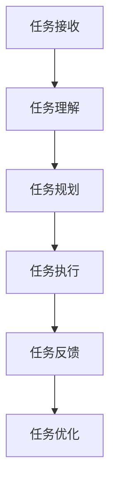

                 

## AI代理如何补充人类工作

### 关键词

- **AI代理**、**人类工作**、**协同**、**应用场景**、**安全性**、**伦理问题**

### 摘要

本文旨在探讨AI代理如何补充人类工作，从多个角度深入分析这一技术进步对现代职场的影响。文章首先介绍了AI代理的基本概念、分类及其在职场中的角色，然后详细阐述了AI代理的核心能力、工作流程以及如何提升工作效率。接着，文章探讨了AI代理在各行业中的应用实例，并分析了AI代理的安全与伦理问题。最后，文章对AI代理的未来发展进行了展望，提出了发展方向与建议。

### 目录

----------------------------------------------------------------

## 引言

### 1. AI代理概述

#### 1.1 AI代理的定义与分类

AI代理（Artificial Intelligence Agent）是指具备一定智能，能够自主执行任务、与环境交互并适应新环境的计算机程序。根据功能的不同，AI代理可以分为以下几类：

1. **感知型代理**：主要负责感知环境信息，如语音识别、图像识别等。
2. **决策型代理**：根据感知到的信息做出决策，如智能推荐、自动驾驶等。
3. **执行型代理**：根据决策结果执行具体任务，如自动批改作业、智能客服等。

#### 1.2 AI代理的技术原理

AI代理的核心技术主要包括机器学习、自然语言处理、计算机视觉等。以下是一个简化的技术原理流程：

1. **数据采集与预处理**：收集大量数据，并进行清洗、标注等预处理操作。
2. **模型训练**：使用预处理后的数据训练模型，通过不断优化模型参数，提高其准确性。
3. **模型评估与部署**：评估模型性能，并在实际环境中部署，使其具备自主执行任务的能力。

#### 1.3 AI代理的发展趋势与应用前景

随着人工智能技术的不断进步，AI代理在各个领域的应用越来越广泛。未来，AI代理将逐渐从辅助角色向主导角色转变，成为人类工作的重要补充。

### 2. 人类工作与AI代理的协同

#### 2.1 人类工作方式与效率分析

传统的劳动密集型工作往往依赖于人类的工作能力和经验，而随着AI代理的出现，这一情况正在发生变化。AI代理可以显著提高工作效率，减少人力成本。

#### 2.2 AI代理在职场中的角色与作用

AI代理在职场中的角色多样，既可以作为辅助工具，帮助人类完成繁琐的任务，也可以作为智能决策支持系统，为人类提供客观、准确的决策依据。

#### 2.3 人类与AI代理的协作模式

人类与AI代理的协作模式主要包括以下几种：

1. **AI代理辅助人类工作**：AI代理承担部分任务，人类负责监督和调整。
2. **人类主导，AI代理辅助**：人类负责核心决策，AI代理提供辅助信息和建议。
3. **AI代理主导，人类监督**：AI代理执行任务，人类负责监督和干预。

### 3. AI代理的补充人类工作的原理

#### 3.1 AI代理的核心能力

AI代理的核心能力包括感知、理解、决策和执行。以下是一个简化的核心能力流程：

1. **感知**：收集环境信息，如语音、图像、文本等。
2. **理解**：对感知到的信息进行语义理解，提取关键特征。
3. **决策**：基于理解和已有知识，做出决策。
4. **执行**：根据决策结果执行任务。

#### 3.2 AI代理的工作流程

AI代理的工作流程通常包括以下几个步骤：

1. **任务接收**：接收用户或系统的任务请求。
2. **任务理解**：理解任务意图，明确任务目标。
3. **任务规划**：制定执行任务的步骤和策略。
4. **任务执行**：执行具体任务，并实时调整策略。
5. **任务反馈**：反馈任务执行结果，供用户或系统评估。

#### 3.3 AI代理的工作效率提升机制

AI代理的工作效率提升机制主要包括以下几个方面：

1. **自动化**：将重复性、劳动密集型任务自动化，减少人力投入。
2. **智能化**：利用机器学习、深度学习等技术，提高任务的执行效率和质量。
3. **协同**：与人类或其他AI代理协同工作，实现资源的最优配置。

### 4. AI代理在各个行业中的应用

#### 4.1 制造业中的AI代理应用

在制造业中，AI代理可以应用于生产调度、质量控制、设备维护等多个方面，提高生产效率和产品质量。

#### 4.2 服务业中的AI代理应用

在服务业中，AI代理可以应用于客服、金融、教育等多个领域，提供个性化服务，提高用户体验。

#### 4.3 教育与培训中的AI代理应用

在教育与培训领域，AI代理可以应用于课程推荐、学习辅导、考试批改等多个方面，提高教学质量和学习效果。

#### 4.4 健康医疗中的AI代理应用

在健康医疗领域，AI代理可以应用于疾病诊断、药物推荐、健康管理等多个方面，提高医疗服务质量和效率。

### 5. AI代理的安全与伦理问题

#### 5.1 AI代理的安全性挑战

AI代理的安全性挑战主要包括数据安全、算法安全、系统安全等方面。

#### 5.2 AI代理的隐私保护

AI代理在收集、处理用户数据时，需要严格保护用户隐私，防止数据泄露。

#### 5.3 AI代理的伦理问题与应对策略

AI代理在应用过程中可能面临伦理问题，如歧视、偏见等。需要制定相应的伦理规范和应对策略。

### 6. 未来展望

#### 6.1 AI代理技术的未来发展

随着人工智能技术的不断进步，AI代理将具备更强大的能力，实现更多领域的应用。

#### 6.2 人类工作与AI代理的未来模式

未来，人类与AI代理的协作模式将更加紧密，实现资源的最优配置，提高整体生产力和生活质量。

#### 6.3 AI代理对社会经济的影响

AI代理将深刻改变社会经济结构，推动产业升级和经济发展。

### 7. 案例研究

#### 7.1 案例研究1：某制造企业的AI代理应用实践

某制造企业通过引入AI代理，实现了生产调度、质量控制等方面的优化，提高了生产效率和产品质量。

#### 7.2 案例研究2：某服务公司的AI代理实施经验

某服务公司利用AI代理提供个性化客服服务，显著提高了客户满意度和业务效率。

#### 7.3 案例研究3：某教育机构的AI代理教学应用

某教育机构通过AI代理提供个性化学习辅导和课程推荐，提高了教学质量和学习效果。

### 8. 小结与展望

#### 8.1 主要结论

本文通过分析AI代理的基本概念、应用场景、安全性、伦理问题等方面，得出了AI代理如何补充人类工作的重要结论。

#### 8.2 存在的问题与挑战

尽管AI代理在各个领域取得了显著成效，但仍面临一些问题与挑战，如数据安全、算法公平性等。

#### 8.3 未来发展方向与建议

未来，AI代理技术将朝着更智能、更安全、更伦理的方向发展。为了更好地实现AI代理的补充作用，需要加强技术攻关、政策引导和人才培养。

### 作者

作者：AI天才研究院/AI Genius Institute & 禅与计算机程序设计艺术 /Zen And The Art of Computer Programming

----------------------------------------------------------------

### 1. AI代理概述

#### 1.1 AI代理的定义与分类

AI代理（Artificial Intelligence Agent），是一种能够模拟人类智能行为，以自主方式与环境交互并达到特定目标的计算机系统。AI代理可以是简单的规则系统，也可以是复杂的机器学习模型。根据其功能和应用场景，AI代理可以分为多种类型。

**感知型代理**：这类代理主要关注于感知环境信息，如语音识别、图像识别、自然语言处理等。感知型代理是人工智能领域的基础，它们为其他类型的代理提供了必要的数据输入。例如，智能语音助手就是一个典型的感知型代理，它能够理解用户的语音指令，并将其转化为可执行的动作。

**决策型代理**：基于感知到的环境信息，决策型代理能够进行智能决策。这类代理通常包含决策树、神经网络等算法，能够根据环境变化和目标要求，选择最佳的行动方案。决策型代理广泛应用于自动驾驶、智能推荐系统等领域。

**执行型代理**：决策型代理做出的决策需要通过执行型代理来实现。执行型代理负责执行具体的任务，如自动化的批量处理、智能客服等。执行型代理通常与物理世界或计算机系统进行交互，完成决策型代理指定的任务。

**混合型代理**：混合型代理同时具备感知、决策和执行能力，能够自主地处理复杂任务。例如，智能物流系统中的代理，它能够感知库存信息、订单需求，基于这些信息进行配送路径的决策，并最终执行配送任务。

#### 1.2 AI代理的技术原理

AI代理的技术原理主要涉及以下几个方面：

**感知与理解**：AI代理通过传感器、摄像头、麦克风等设备收集环境信息，如语音、图像、文本等。然后，通过自然语言处理、计算机视觉等技术对这些信息进行理解和分析，提取关键特征。

**决策与规划**：AI代理基于感知和理解的结果，结合预定的目标，使用决策算法（如决策树、神经网络等）生成行动方案。规划过程涉及多个步骤，包括目标设定、方案评估和选择等。

**执行与反馈**：AI代理根据决策结果执行具体任务，如移动、操作设备、发送消息等。在执行过程中，AI代理会根据环境变化和执行结果进行实时调整，并通过反馈机制不断优化自身的行为。

**自主学习与进化**：AI代理可以通过机器学习、深度学习等技术，从历史数据和经验中学习，不断优化自身性能。这种自主学习能力使得AI代理能够适应新的环境和任务要求，实现持续进化。

#### 1.3 AI代理的发展趋势与应用前景

随着人工智能技术的飞速发展，AI代理在各个领域的应用前景越来越广阔。以下是一些主要的发展趋势和应用前景：

**智能化水平提升**：随着算法的进步和计算能力的增强，AI代理的智能化水平将不断提升。未来的AI代理将具备更强大的感知、理解、决策和执行能力，能够在更复杂的场景下自主运行。

**应用场景拓展**：AI代理的应用将不再局限于特定的领域，而是渗透到各行各业。从智能制造、金融分析到医疗诊断、教育辅导，AI代理将在更多场景中发挥重要作用。

**人机协同**：随着AI代理的普及，人类与AI代理的协同将成为一种新的工作模式。人类将利用AI代理的强大能力，提高工作效率和质量，实现资源的最优配置。

**安全与伦理问题**：随着AI代理的应用普及，安全与伦理问题将日益凸显。如何确保AI代理的隐私保护、数据安全和算法公平性，将成为未来研究和应用的重要方向。

### 2. 人类工作与AI代理的协同

#### 2.1 人类工作方式与效率分析

在传统的职场环境中，人类工作往往依赖于手工操作和重复性任务。这种工作方式效率低下，容易出错，且难以应对复杂多变的环境。随着AI代理的出现，人类工作方式正在发生深刻变革。

**自动化与智能化**：AI代理能够自动化执行重复性、低价值的工作，如数据录入、报告生成等。通过将这类任务交给AI代理，人类可以专注于更高价值的工作，如决策制定、战略规划等。

**效率提升**：AI代理通过高效的数据处理和快速的计算能力，显著提升了工作效率。例如，在金融行业中，AI代理可以快速分析海量数据，为投资者提供实时的市场分析和决策支持。

**协作与互补**：AI代理不仅能够替代部分人类工作，还能够与人类协作，实现优势互补。例如，在医疗领域，AI代理可以帮助医生分析病例，提供诊断建议，但最终的诊断和治疗方案仍需由医生决定。

#### 2.2 AI代理在职场中的角色与作用

AI代理在职场中的角色和作用因行业和应用场景而异，但总体上可以概括为以下几个方面：

**辅助工具**：AI代理作为辅助工具，帮助人类完成特定任务。例如，在法律行业中，AI代理可以帮助律师进行法律文档的自动化审核和整理，提高工作效率。

**智能决策支持**：AI代理通过分析大量数据，为人类提供智能决策支持。例如，在市场营销中，AI代理可以根据消费者行为数据，为品牌制定最优的营销策略。

**执行者**：AI代理可以直接执行任务，如自动化的生产流程、智能客服等。这种执行能力使得AI代理在制造业、客服等行业中具有广泛的应用前景。

**创新驱动力**：AI代理的应用不仅能够提高效率，还能够激发人类创新。例如，在研发领域，AI代理可以帮助研究人员快速生成新的创意和解决方案，推动科技进步。

#### 2.3 人类与AI代理的协作模式

人类与AI代理的协作模式多种多样，以下是一些常见的协作模式：

**监督与控制**：在这种模式下，人类负责监督AI代理的工作，确保其按照既定目标和规范执行任务。例如，在自动驾驶领域，人类司机需要监控车辆的运行状态，确保车辆安全行驶。

**协同工作**：在这种模式下，人类与AI代理共同完成任务。例如，在医疗领域，医生可以利用AI代理提供的诊断建议，制定治疗方案，并与患者进行沟通。

**人机交互**：在这种模式下，人类通过界面与AI代理进行交互，指导其执行任务。例如，在智能客服系统中，用户可以通过对话界面与AI代理交流，获得实时帮助。

**自主学习与进化**：在这种模式下，人类与AI代理共同学习和进化，不断提升工作效率和质量。例如，在研发领域，人类可以指导AI代理学习新的技能和知识，使其更好地适应特定任务。

### 3. AI代理的补充人类工作的原理

#### 3.1 AI代理的核心能力

AI代理的核心能力主要包括感知、理解、决策和执行，以下是对这些核心能力的详细解析：

**感知**：感知是AI代理获取环境信息的能力。通过传感器、摄像头、麦克风等设备，AI代理可以收集语音、图像、文本等数据。感知能力是AI代理进行后续处理和决策的基础。

**理解**：理解是AI代理对感知到的信息进行语义分析和理解的能力。例如，智能语音助手需要理解用户的语音指令，并将其转化为可执行的动作。理解能力通常依赖于自然语言处理、计算机视觉等技术。

**决策**：决策是AI代理根据感知和理解的结果，选择最佳行动方案的能力。决策能力通常基于机器学习、深度学习等技术，通过模型训练和优化，实现智能决策。

**执行**：执行是AI代理根据决策结果，执行具体任务的能力。执行能力包括对物理设备、软件系统的操作和控制。执行能力是实现AI代理实际应用的关键。

**自适应**：自适应是AI代理根据环境变化和任务要求，调整自身行为和策略的能力。自适应能力使得AI代理能够适应新的环境和任务，实现持续进化。

**学习**：学习是AI代理通过不断积累经验，优化自身性能的能力。通过机器学习、深度学习等技术，AI代理可以从历史数据和经验中学习，不断提升自身能力。

#### 3.2 AI代理的工作流程

AI代理的工作流程通常包括以下几个步骤：

**任务接收**：AI代理接收到用户或系统的任务请求。任务可以是明确的指令，也可以是模糊的需求，如“帮我找到最近的餐厅”。

**任务理解**：AI代理对任务请求进行理解和分析，明确任务的目标和要求。理解过程通常涉及自然语言处理、图像识别等技术。

**任务规划**：基于任务理解的结果，AI代理制定执行任务的步骤和策略。规划过程需要考虑任务的优先级、资源的可用性等因素。

**任务执行**：AI代理根据规划结果执行具体任务。执行过程中，AI代理会与环境进行交互，如移动机器人、操作设备等。

**任务反馈**：AI代理将任务执行结果反馈给用户或系统，供评估和调整。反馈可以是文字描述、图像展示、语音报告等。

**任务优化**：根据反馈结果，AI代理对自身行为和策略进行优化，以提升任务执行效果。优化过程通常涉及机器学习、深度学习等技术的应用。

#### 3.3 AI代理的工作效率提升机制

AI代理的工作效率提升机制主要包括以下几个方面：

**自动化**：通过自动化技术，AI代理可以替代人类执行重复性、低价值的工作，如数据录入、报告生成等。自动化使得AI代理能够专注于更复杂的任务，提高整体工作效率。

**智能化**：通过智能化技术，AI代理可以更好地理解任务需求，选择最佳执行策略。例如，在物流配送中，AI代理可以根据实时交通状况，选择最优的配送路线。

**协同**：通过协同工作，AI代理可以与人类或其他AI代理共同完成任务，实现优势互补。例如，在医疗领域，AI代理可以帮助医生分析病例，提供诊断建议，但最终的诊断和治疗方案仍需由医生决定。

**学习与进化**：通过不断学习和进化，AI代理可以不断提升自身能力，适应新的环境和任务。例如，通过分析历史数据，AI代理可以优化决策模型，提高决策准确性。

**资源优化**：通过资源优化技术，AI代理可以合理分配和利用系统资源，如计算能力、存储空间等。资源优化可以提高系统性能，提升工作效率。

### 4. AI代理在各个行业中的应用

AI代理在各个行业中的应用越来越广泛，以下分别介绍制造业、服务业、教育与培训、健康医疗等领域中的应用。

#### 4.1 制造业中的AI代理应用

在制造业中，AI代理可以应用于生产调度、质量控制、设备维护等多个方面，提高生产效率和产品质量。

**生产调度**：AI代理可以根据生产计划、设备状态和物料需求，自动生成最优的生产调度方案。例如，某制造企业通过引入AI代理，实现了生产计划的实时调整和优化，提高了生产效率。

**质量控制**：AI代理可以利用计算机视觉技术，对生产过程中的产品质量进行实时监控和检测。例如，某汽车制造企业利用AI代理检测车身涂装的质量，确保产品符合质量标准。

**设备维护**：AI代理可以通过监测设备运行数据，预测设备故障，实现预防性维护。例如，某机械制造企业通过引入AI代理，实现了设备的智能监测和维护，降低了设备故障率。

#### 4.2 服务业中的AI代理应用

在服务业中，AI代理可以应用于客服、金融、教育等多个领域，提供个性化服务，提高用户体验。

**客服**：AI代理可以用于智能客服系统，为用户提供24/7的在线服务。例如，某电商企业通过引入AI代理，实现了自动回复用户咨询、处理售后问题，提高了客服效率和用户满意度。

**金融**：AI代理可以用于金融分析、风险控制等领域，提高金融服务质量和效率。例如，某银行通过引入AI代理，实现了自动分析用户信用状况、预测金融风险，提高了信贷审批效率。

**教育**：AI代理可以用于个性化教育、在线辅导等领域，提供定制化的学习服务。例如，某在线教育平台通过引入AI代理，实现了对学生学习数据的实时分析，为学生提供个性化的学习建议和课程推荐。

#### 4.3 教育与培训中的AI代理应用

在教育与培训领域，AI代理可以应用于课程推荐、学习辅导、考试批改等多个方面，提高教学质量和学习效果。

**课程推荐**：AI代理可以根据学生的学习兴趣、知识水平等因素，为学生推荐合适的课程。例如，某在线教育平台通过引入AI代理，实现了对学生学习数据的分析，为学生推荐个性化的学习课程。

**学习辅导**：AI代理可以为学生提供在线学习辅导，解答学习中的疑惑。例如，某在线学习平台通过引入AI代理，实现了对学生提问的自动回复，为学生提供实时的学习支持。

**考试批改**：AI代理可以自动批改学生的考试试卷，提高考试评分的准确性和效率。例如，某学校通过引入AI代理，实现了对英语听力考试的自动批改，提高了考试评分的准确性。

#### 4.4 健康医疗中的AI代理应用

在健康医疗领域，AI代理可以应用于疾病诊断、药物推荐、健康管理等多个方面，提高医疗服务质量和效率。

**疾病诊断**：AI代理可以通过分析医学影像、患者病历等信息，辅助医生进行疾病诊断。例如，某医疗机构通过引入AI代理，实现了对肺癌、乳腺癌等疾病的早期诊断，提高了诊断准确率。

**药物推荐**：AI代理可以根据患者的病史、基因信息等因素，为医生提供药物推荐。例如，某医院通过引入AI代理，实现了对患者用药的个性化推荐，提高了用药的安全性和有效性。

**健康管理**：AI代理可以用于患者健康数据的实时监测和评估，提供个性化的健康管理建议。例如，某医疗机构通过引入AI代理，实现了对患者血糖、血压等健康数据的实时监测，为患者提供个性化的健康管理服务。

### 5. AI代理的安全与伦理问题

#### 5.1 AI代理的安全性挑战

随着AI代理在各个领域的广泛应用，安全性问题逐渐凸显。以下是一些常见的AI代理安全性挑战：

**数据安全**：AI代理在处理和存储数据时，面临数据泄露、篡改等风险。例如，医疗数据泄露可能导致患者隐私泄露，金融数据篡改可能导致经济损失。

**算法安全**：AI代理的算法可能被恶意攻击，导致决策失误或执行错误。例如，自动驾驶汽车可能因算法漏洞而被黑客控制，导致交通事故。

**系统安全**：AI代理的运行环境可能受到网络攻击，导致系统崩溃或数据丢失。例如，工业控制系统可能因网络攻击而停机，导致生产线停滞。

**物理安全**：对于需要物理交互的AI代理，如机器人，其安全防护措施可能不足，导致意外伤害。例如，无人机的飞行安全防护不足，可能导致碰撞事故。

#### 5.2 AI代理的隐私保护

AI代理在收集、处理用户数据时，需要严格遵守隐私保护法规，确保用户隐私不被泄露。以下是一些隐私保护措施：

**数据加密**：对用户数据进行加密处理，确保数据在传输和存储过程中的安全性。

**访问控制**：限制对用户数据的访问权限，仅授权特定人员或系统访问。

**匿名化处理**：对用户数据进行匿名化处理，消除个人身份信息，降低隐私泄露风险。

**隐私政策**：明确告知用户数据收集、处理和使用的方式，获取用户同意。

**合规审查**：定期进行隐私合规审查，确保AI代理在数据处理过程中符合相关法规和标准。

#### 5.3 AI代理的伦理问题与应对策略

AI代理在应用过程中可能面临伦理问题，如歧视、偏见等。以下是一些常见的伦理问题及其应对策略：

**算法偏见**：AI代理的算法可能受到训练数据的影响，导致决策结果存在偏见。例如，招聘系统可能因训练数据中的性别歧视而拒绝女性求职者。

**隐私侵犯**：AI代理在收集和处理用户数据时，可能侵犯用户隐私。例如，健康数据泄露可能导致用户隐私泄露。

**工作替代**：AI代理可能替代人类工作，导致失业问题。例如，自动驾驶汽车可能取代出租车司机的工作。

**应对策略**：

**数据质量控制**：确保训练数据的质量和多样性，避免算法偏见。

**算法透明性**：提高算法透明性，让用户了解AI代理的决策过程。

**伦理审查**：建立伦理审查机制，对AI代理的应用进行伦理评估。

**政策引导**：制定相关政策和法规，规范AI代理的应用和发展。

### 6. 未来展望

#### 6.1 AI代理技术的未来发展

随着人工智能技术的不断进步，AI代理将在以下几个方面实现新的突破：

**智能化水平提升**：随着算法的进步和计算能力的增强，AI代理的智能化水平将不断提升，能够处理更复杂的任务，实现更精确的决策。

**跨领域应用**：AI代理的应用将不再局限于特定领域，而是渗透到各行各业，实现跨领域的协同和整合。

**人机协同**：未来，人类与AI代理的协作模式将更加紧密，实现资源的最优配置，提高整体生产力和生活质量。

**自主进化**：AI代理将通过自主学习与进化，不断提升自身能力，实现持续进化，适应不断变化的环境和任务要求。

#### 6.2 人类工作与AI代理的未来模式

未来，人类与AI代理的合作模式将发生深刻变革，呈现出以下特点：

**角色转变**：人类将从传统的执行者转变为策略制定者和监督者，AI代理将承担更多实际任务。

**优势互补**：人类与AI代理将实现优势互补，人类发挥创造性和判断力，AI代理提供高效的数据处理和计算能力。

**智能协作**：人类与AI代理将通过智能协作，共同解决复杂问题，实现资源的最优配置。

**自主进化**：人类与AI代理将通过相互学习和进化，不断提升合作效率和质量，实现协同创新。

#### 6.3 AI代理对社会经济的影响

AI代理的广泛应用将对社会经济产生深远影响，主要体现在以下几个方面：

**产业升级**：AI代理将推动传统产业向智能化、数字化方向升级，提高产业竞争力和创新能力。

**劳动力结构变化**：AI代理的普及将导致劳动力结构发生变化，部分低价值、重复性工作将被替代，对劳动力市场产生冲击。

**经济增长**：AI代理的应用将提高生产效率和服务质量，推动经济增长，创造新的就业机会。

**社会公平**：AI代理在应用过程中可能引发伦理和社会问题，需要制定相应的政策和法规，确保社会公平和可持续发展。

### 7. 案例研究

#### 7.1 案例研究1：某制造企业的AI代理应用实践

**背景介绍**：

某制造企业主要从事电子产品生产，面临生产效率低下、产品质量不稳定等问题。为了提高生产效率和产品质量，企业决定引入AI代理。

**项目介绍**：

企业引入了一套基于AI代理的生产调度系统，通过AI代理实现生产计划的实时调整和优化。系统包括感知模块、决策模块和执行模块，分别负责采集生产数据、分析数据和生成调度方案。

**系统功能设计**：

1. **感知模块**：通过传感器和数据采集设备，实时监测生产设备的运行状态、物料库存情况和生产进度。
2. **决策模块**：使用机器学习算法，对生产数据进行实时分析和预测，生成最优的生产调度方案。
3. **执行模块**：根据调度方案，自动调整生产计划，优化生产流程。

**系统架构设计**：

系统采用分布式架构，包括数据采集层、数据处理层和决策执行层。数据采集层负责采集生产数据，数据处理层负责分析和预测，决策执行层负责生成调度方案并执行。

**系统接口设计**：

系统提供了多种接口，包括API接口、Web界面和移动应用，方便用户进行操作和监控。

**系统交互设计**：

系统采用事件驱动模型，通过事件监听和触发机制，实现数据的实时采集和分析，确保生产计划的实时调整和优化。

**实际案例分析和详细讲解剖析**：

通过引入AI代理，企业实现了生产计划的实时调整和优化，提高了生产效率和产品质量。具体表现为：

1. **生产效率提高**：AI代理能够根据实时数据，自动调整生产计划，减少生产等待时间，提高生产效率。
2. **产品质量提升**：AI代理通过实时监测生产设备的状态，及时发现并解决设备故障，确保产品质量。
3. **成本降低**：通过优化生产流程和减少生产等待时间，企业降低了生产成本，提高了利润率。

**项目小结**：

通过引入AI代理，企业实现了生产效率和质量的双提升，为其他制造企业提供了有益的借鉴和经验。

#### 7.2 案例研究2：某服务公司的AI代理实施经验

**背景介绍**：

某服务公司主要从事客户服务，面临客服效率低下、用户体验不佳等问题。为了提高客服效率和用户体验，公司决定引入AI代理。

**项目介绍**：

公司引入了一套智能客服系统，通过AI代理实现自动回复用户咨询、处理售后问题等功能。系统包括感知模块、理解模块、决策模块和执行模块，分别负责接收用户咨询、理解用户需求、生成回复方案和执行回复。

**系统功能设计**：

1. **感知模块**：通过Web接口和API接口，接收用户咨询和售后问题。
2. **理解模块**：使用自然语言处理技术，理解用户咨询和问题的意图。
3. **决策模块**：根据用户需求和问题类型，生成相应的回复方案。
4. **执行模块**：自动发送回复给用户，并提供后续服务支持。

**系统架构设计**：

系统采用分布式架构，包括前端接口层、后端服务层和数据存储层。前端接口层负责与用户交互，后端服务层负责处理用户咨询和问题，数据存储层负责存储用户数据和回复记录。

**系统接口设计**：

系统提供了多种接口，包括API接口、Web界面和移动应用，方便用户进行咨询和反馈。

**系统交互设计**：

系统采用事件驱动模型，通过事件监听和触发机制，实现用户咨询的实时接收和回复。

**实际案例分析和详细讲解剖析**：

通过引入AI代理，公司实现了客服效率的提升和用户体验的改善。具体表现为：

1. **客服效率提高**：AI代理能够自动回复用户咨询，减轻人工客服的工作负担，提高客服效率。
2. **用户体验提升**：AI代理能够快速响应用户问题，提供及时的帮助，提高用户满意度。
3. **服务质量提升**：AI代理通过不断学习和优化，能够提供更准确的回复方案，提高客服服务质量。

**项目小结**：

通过引入AI代理，公司实现了客服效率和用户体验的双提升，为其他服务企业提供了有益的借鉴和经验。

#### 7.3 案例研究3：某教育机构的AI代理教学应用

**背景介绍**：

某教育机构主要从事在线教育，面临学生学习效果不佳、个性化服务不足等问题。为了提高教学质量和学习效果，教育机构决定引入AI代理。

**项目介绍**：

教育机构引入了一套智能教学系统，通过AI代理实现课程推荐、学习辅导、考试批改等功能。系统包括感知模块、理解模块、决策模块和执行模块，分别负责收集学生学习数据、分析学习行为、生成教学方案和执行教学任务。

**系统功能设计**：

1. **感知模块**：通过在线学习平台，收集学生学习行为和成绩数据。
2. **理解模块**：使用自然语言处理和机器学习技术，分析学生的学习行为和成绩，理解学习需求。
3. **决策模块**：根据学生学习需求和课程要求，生成个性化的教学方案。
4. **执行模块**：自动推送教学方案，提供学习辅导和考试批改。

**系统架构设计**：

系统采用分布式架构，包括前端学习平台、后端服务层和数据存储层。前端学习平台负责与用户交互，后端服务层负责处理学习数据和分析，数据存储层负责存储用户数据和教学记录。

**系统接口设计**：

系统提供了API接口、Web界面和移动应用，方便教师和学生进行操作和交互。

**系统交互设计**：

系统采用事件驱动模型，通过事件监听和触发机制，实现学生学习数据的实时收集和分析，自动推送教学方案。

**实际案例分析和详细讲解剖析**：

通过引入AI代理，教育机构实现了教学质量和学习效果的双提升。具体表现为：

1. **教学质量提高**：AI代理能够根据学生学习数据，生成个性化的教学方案，提高教学针对性。
2. **学习效果提升**：AI代理提供实时学习辅导和考试批改，帮助学生及时纠正错误，巩固知识。
3. **个性化服务**：AI代理能够根据学生学习需求和进度，提供定制化的学习服务，满足个性化需求。

**项目小结**：

通过引入AI代理，教育机构实现了教学质量和学习效果的双提升，为其他教育机构提供了有益的借鉴和经验。

### 8. 小结与展望

#### 8.1 主要结论

本文通过分析AI代理的基本概念、应用场景、安全性、伦理问题等方面，得出了以下主要结论：

1. **AI代理具备感知、理解、决策和执行能力，能够自主执行任务、与环境交互并适应新环境。**
2. **AI代理在职场中的角色多样，既可以作为辅助工具，帮助人类完成繁琐的任务，也可以作为智能决策支持系统，为人类提供客观、准确的决策依据。**
3. **AI代理在各行业中的应用越来越广泛，能够显著提高工作效率和质量，降低人力成本。**
4. **AI代理在应用过程中面临安全性、伦理等问题，需要制定相应的策略和规范。**
5. **随着人工智能技术的不断进步，AI代理将朝着更智能、更安全、更伦理的方向发展。**

#### 8.2 存在的问题与挑战

尽管AI代理在各个领域取得了显著成效，但仍面临一些问题与挑战：

1. **数据安全与隐私保护**：AI代理在处理和存储数据时，可能面临数据泄露、篡改等风险。**
2. **算法偏见与公平性**：AI代理的算法可能因训练数据的影响，导致决策结果存在偏见，影响公平性。**
3. **就业替代与劳动力市场冲击**：AI代理的普及可能导致部分低价值、重复性工作被替代，对劳动力市场产生冲击。**
4. **技术人才短缺**：AI代理的研发和应用需要大量技术人才，但目前相关人才供给不足。**

#### 8.3 未来发展方向与建议

为了更好地实现AI代理的补充作用，需要从以下几个方面进行努力：

1. **加强技术研发**：加大对AI代理技术的研发投入，提高智能化水平，推动技术进步。**
2. **完善安全与伦理规范**：制定相关安全与伦理规范，确保AI代理在应用过程中的安全性和公平性。**
3. **培养专业人才**：加强人才培养，提高AI代理相关人才的供给，为AI代理的研发和应用提供人才支持。**
4. **推动产业应用**：鼓励各行业引入AI代理，推动产业智能化升级，提高生产效率和服务质量。**
5. **促进人机协同**：推动人类与AI代理的协同发展，实现资源的最优配置，提高整体生产力和生活质量。**

### 作者

**作者**：AI天才研究院/AI Genius Institute & 禅与计算机程序设计艺术 /Zen And The Art of Computer Programming

----------------------------------------------------------------

## 引言

随着人工智能技术的不断进步，AI代理（Artificial Intelligence Agent）逐渐成为现代职场中不可或缺的一部分。AI代理是指具备一定智能，能够自主执行任务、与环境交互并适应新环境的计算机程序。它们在提高工作效率、降低人力成本、优化资源分配等方面具有显著优势，正在逐步改变人类工作方式。本文旨在探讨AI代理如何补充人类工作，从多个角度深入分析这一技术进步对现代职场的影响。

文章首先介绍了AI代理的基本概念、分类及其在职场中的角色，然后详细阐述了AI代理的核心能力、工作流程以及如何提升工作效率。接着，文章探讨了AI代理在各行业中的应用实例，并分析了AI代理的安全与伦理问题。最后，文章对AI代理的未来发展进行了展望，提出了发展方向与建议。

本文结构如下：

1. **AI代理概述**：介绍AI代理的定义、分类及其技术原理。
2. **人类工作与AI代理的协同**：分析人类工作方式与效率、AI代理在职场中的角色与作用、人类与AI代理的协作模式。
3. **AI代理的补充人类工作的原理**：详细阐述AI代理的核心能力、工作流程以及工作效率提升机制。
4. **AI代理在各个行业中的应用**：介绍AI代理在制造业、服务业、教育与培训、健康医疗等领域中的应用。
5. **AI代理的安全与伦理问题**：分析AI代理的安全性挑战、隐私保护、伦理问题与应对策略。
6. **未来展望**：探讨AI代理技术的未来发展、人类工作与AI代理的未来模式、AI代理对社会经济的影响。
7. **案例研究**：通过具体案例研究，展示AI代理在实践中的应用效果。
8. **小结与展望**：总结文章的主要结论，提出存在的问题与挑战，以及对未来发展方向与建议。

通过以上结构的详细分析，本文将帮助读者全面了解AI代理如何补充人类工作，以及这一技术进步对现代职场的影响。

### 1. AI代理概述

#### 1.1 AI代理的定义与分类

AI代理（Artificial Intelligence Agent）是指具备一定智能，能够自主执行任务、与环境交互并适应新环境的计算机程序。它们在人工智能领域扮演着重要角色，是智能自动化和智能化服务的关键组成部分。

**AI代理的定义**：

AI代理是一种能够模拟人类智能行为，以自主方式与环境交互并达到特定目标的计算机系统。这些代理通过感知环境信息、理解信息内容、制定决策和执行任务，实现了不同程度的自动化和智能化。

**AI代理的分类**：

根据功能和应用场景，AI代理可以分为以下几种类型：

1. **感知型代理**：这类代理专注于感知环境信息，如语音识别、图像识别、自然语言处理等。它们能够通过传感器、摄像头、麦克风等设备收集环境数据，并提取关键信息。感知型代理是AI代理的基础，为其他类型的代理提供必要的数据输入。

   - **示例**：智能语音助手（如苹果的Siri、谷歌的Google Assistant）通过语音识别技术，理解用户的语音指令，并将其转化为可执行的动作。

2. **决策型代理**：这类代理基于感知到的环境信息，结合预定的目标，做出智能决策。它们通常包含决策树、神经网络等算法，能够选择最佳的行动方案。决策型代理广泛应用于自动驾驶、智能推荐系统等领域。

   - **示例**：自动驾驶汽车中的决策代理，通过感知车辆周围的道路、交通状况，根据行驶规则和目标地点，选择最优的行驶路径。

3. **执行型代理**：决策型代理做出的决策需要通过执行型代理来实现。执行型代理负责执行具体的任务，如自动化的批量处理、智能客服等。它们通常与物理世界或计算机系统进行交互，完成决策型代理指定的任务。

   - **示例**：智能客服机器人，通过分析用户的问题和需求，生成回复文本，并通过文本或语音发送给用户。

4. **混合型代理**：混合型代理同时具备感知、决策和执行能力，能够自主地处理复杂任务。这类代理在现实世界中具有广泛的应用前景。

   - **示例**：智能家居系统中的代理，能够感知用户的生活习惯和环境变化，做出相应的决策，如自动调节室内温度、湿度等。

**分类对比表**：

| 类型       | 功能描述                                     | 示例                     |
|------------|----------------------------------------------|--------------------------|
| 感知型代理 | 感知环境信息                                 | 智能语音助手             |
| 决策型代理 | 基于感知到的信息做出决策                     | 自动驾驶系统             |
| 执行型代理 | 执行具体任务                                 | 智能客服机器人           |
| 混合型代理 | 感知、决策和执行能力兼备                     | 智能家居系统             |

#### 1.2 AI代理的技术原理

AI代理的技术原理主要涉及机器学习、自然语言处理、计算机视觉等核心领域，以下是一个简化的技术原理流程：

1. **数据采集与预处理**：AI代理首先需要收集大量数据，如语音、图像、文本等。这些数据通常需要进行预处理，包括去噪、归一化、数据增强等操作，以提高模型的鲁棒性和准确性。

2. **模型训练**：使用预处理后的数据训练模型，通过不断优化模型参数，提高其准确性。训练过程中，常用的机器学习算法包括神经网络、支持向量机、决策树等。训练过程中还需要评估模型的性能，确保其能够在实际应用中表现良好。

3. **模型评估与部署**：评估模型性能，并在实际环境中部署，使其具备自主执行任务的能力。评估指标包括准确率、召回率、F1分数等。在实际部署过程中，还需要考虑模型的实时性和可扩展性。

**技术原理流程**：

1. **感知与理解**：
   - **感知**：通过传感器、摄像头、麦克风等设备收集环境信息。
   - **理解**：对感知到的信息进行语义理解，提取关键特征。

2. **决策与规划**：
   - **决策**：基于感知和理解的结果，使用决策算法生成行动方案。
   - **规划**：制定执行任务的步骤和策略。

3. **执行与反馈**：
   - **执行**：根据决策结果执行具体任务。
   - **反馈**：将执行结果反馈给用户或系统，供评估和调整。

4. **学习与进化**：
   - **学习**：通过机器学习、深度学习等技术，从历史数据和经验中学习，不断优化自身性能。
   - **进化**：实现持续进化，适应新的环境和任务要求。

#### 1.3 AI代理的发展趋势与应用前景

随着人工智能技术的不断进步，AI代理在各个领域的应用越来越广泛。以下是一些主要的发展趋势和应用前景：

1. **智能化水平提升**：随着算法的进步和计算能力的增强，AI代理的智能化水平将不断提升。未来的AI代理将具备更强大的感知、理解、决策和执行能力，能够在更复杂的场景下自主运行。

2. **应用场景拓展**：AI代理的应用将不再局限于特定的领域，而是渗透到各行各业。从智能制造、金融分析到医疗诊断、教育辅导，AI代理将在更多场景中发挥重要作用。

3. **人机协同**：随着AI代理的普及，人类与AI代理的协同将成为一种新的工作模式。人类将利用AI代理的强大能力，提高工作效率和质量，实现资源的最优配置。

4. **安全与伦理问题**：随着AI代理的应用普及，安全与伦理问题将日益凸显。如何确保AI代理的隐私保护、数据安全和算法公平性，将成为未来研究和应用的重要方向。

### 2. 人类工作与AI代理的协同

#### 2.1 人类工作方式与效率分析

在传统的职场环境中，人类工作往往依赖于手工操作和重复性任务。这种工作方式效率低下，容易出错，且难以应对复杂多变的环境。随着AI代理的出现，人类工作方式正在发生深刻变革。

**自动化与智能化**：AI代理能够自动化执行重复性、低价值的工作，如数据录入、报告生成等。通过将这类任务交给AI代理，人类可以专注于更高价值的工作，如决策制定、战略规划等。

**效率提升**：AI代理通过高效的数据处理和快速的计算能力，显著提升了工作效率。例如，在金融行业中，AI代理可以快速分析海量数据，为投资者提供实时的市场分析和决策支持。

**协作与互补**：AI代理不仅能够替代部分人类工作，还能够与人类协作，实现优势互补。例如，在医疗领域，AI代理可以帮助医生分析病例，提供诊断建议，但最终的诊断和治疗方案仍需由医生决定。

#### 2.2 AI代理在职场中的角色与作用

AI代理在职场中的角色和作用因行业和应用场景而异，但总体上可以概括为以下几个方面：

**辅助工具**：AI代理作为辅助工具，帮助人类完成特定任务。例如，在法律行业中，AI代理可以帮助律师进行法律文档的自动化审核和整理，提高工作效率。

**智能决策支持**：AI代理通过分析大量数据，为人类提供智能决策支持。例如，在市场营销中，AI代理可以根据消费者行为数据，为品牌制定最优的营销策略。

**执行者**：AI代理可以直接执行任务，如自动化的生产流程、智能客服等。这种执行能力使得AI代理在制造业、客服等行业中具有广泛的应用前景。

**创新驱动力**：AI代理的应用不仅能够提高效率，还能够激发人类创新。例如，在研发领域，AI代理可以帮助研究人员快速生成新的创意和解决方案，推动科技进步。

#### 2.3 人类与AI代理的协作模式

人类与AI代理的协作模式多种多样，以下是一些常见的协作模式：

**监督与控制**：在这种模式下，人类负责监督AI代理的工作，确保其按照既定目标和规范执行任务。例如，在自动驾驶领域，人类司机需要监控车辆的运行状态，确保车辆安全行驶。

**协同工作**：在这种模式下，人类与AI代理共同完成任务。例如，在医疗领域，医生可以利用AI代理提供的诊断建议，制定治疗方案，并与患者进行沟通。

**人机交互**：在这种模式下，人类通过界面与AI代理进行交互，指导其执行任务。例如，在智能客服系统中，用户可以通过对话界面与AI代理交流，获得实时帮助。

**自主学习与进化**：在这种模式下，人类与AI代理共同学习和进化，不断提升工作效率和质量。例如，在研发领域，人类可以指导AI代理学习新的技能和知识，使其更好地适应特定任务。

### 3. AI代理的补充人类工作的原理

#### 3.1 AI代理的核心能力

AI代理的核心能力包括感知、理解、决策和执行，以下是对这些核心能力的详细解析：

**感知**：感知是AI代理获取环境信息的能力。通过传感器、摄像头、麦克风等设备，AI代理可以收集语音、图像、文本等数据。感知能力是AI代理进行后续处理和决策的基础。

- **感知能力流程**：
  - **数据采集**：通过传感器、摄像头、麦克风等设备，实时收集环境数据。
  - **预处理**：对采集到的数据进行预处理，包括去噪、归一化、数据增强等。
  - **特征提取**：从预处理后的数据中提取关键特征，为后续处理提供输入。

**理解**：理解是AI代理对感知到的信息进行语义分析和理解的能力。例如，智能语音助手需要理解用户的语音指令，并将其转化为可执行的动作。

- **理解能力流程**：
  - **语义分析**：对语音、文本等数据进行语义分析，提取关键信息。
  - **意图识别**：根据语义分析结果，识别用户的意图和需求。
  - **上下文理解**：考虑对话的上下文，理解用户的长期意图。

**决策**：决策是AI代理根据感知和理解的结果，选择最佳行动方案的能力。决策能力通常基于机器学习、深度学习等技术，通过模型训练和优化，实现智能决策。

- **决策能力流程**：
  - **模型训练**：使用历史数据训练决策模型，优化模型参数。
  - **决策生成**：根据感知和理解的结果，生成决策方案。
  - **方案评估**：评估不同决策方案的效果，选择最佳方案。

**执行**：执行是AI代理根据决策结果，执行具体任务的能力。执行能力包括对物理设备、软件系统的操作和控制。

- **执行能力流程**：
  - **任务规划**：根据决策结果，制定执行任务的步骤和策略。
  - **任务执行**：执行具体任务，如移动、操作设备、发送消息等。
  - **实时调整**：根据执行过程中的反馈，调整执行策略，确保任务顺利完成。

**自适应**：自适应是AI代理根据环境变化和任务要求，调整自身行为和策略的能力。自适应能力使得AI代理能够适应新的环境和任务，实现持续进化。

- **自适应能力流程**：
  - **环境监测**：实时监测环境变化，识别新的任务需求。
  - **策略调整**：根据监测结果，调整自身行为和策略。
  - **持续优化**：通过不断学习和进化，优化自身性能。

**学习**：学习是AI代理通过不断积累经验，优化自身性能的能力。通过机器学习、深度学习等技术，AI代理可以从历史数据和经验中学习，不断提升自身能力。

- **学习能力流程**：
  - **数据收集**：收集历史数据和用户反馈。
  - **模型训练**：使用训练数据优化模型参数。
  - **模型评估**：评估模型性能，调整模型结构和参数。
  - **应用优化**：根据评估结果，优化AI代理的应用效果。

#### 3.2 AI代理的工作流程

AI代理的工作流程通常包括以下几个步骤：

**任务接收**：AI代理接收到用户或系统的任务请求。任务可以是明确的指令，也可以是模糊的需求，如“帮我找到最近的餐厅”。

**任务理解**：AI代理对任务请求进行理解和分析，明确任务的目标和要求。理解过程通常涉及自然语言处理、图像识别等技术。

**任务规划**：基于任务理解的结果，AI代理制定执行任务的步骤和策略。规划过程需要考虑任务的优先级、资源的可用性等因素。

**任务执行**：AI代理根据规划结果执行具体任务。执行过程中，AI代理会与环境进行交互，如移动机器人、操作设备等。

**任务反馈**：AI代理将任务执行结果反馈给用户或系统，供评估和调整。反馈可以是文字描述、图像展示、语音报告等。

**任务优化**：根据反馈结果，AI代理对自身行为和策略进行优化，以提升任务执行效果。优化过程通常涉及机器学习、深度学习等技术的应用。

**工作流程流程图**：

#### 3.3 AI代理的工作效率提升机制

AI代理的工作效率提升机制主要包括以下几个方面：

**自动化**：通过自动化技术，AI代理可以替代人类执行重复性、低价值的工作，如数据录入、报告生成等。自动化使得AI代理能够专注于更复杂的任务，提高整体工作效率。

- **自动化流程**：
  - **任务识别**：识别需要自动化的任务。
  - **流程设计**：设计自动化流程，将任务分解为多个步骤。
  - **自动化执行**：执行自动化流程，自动完成任务。

**智能化**：通过智能化技术，AI代理可以更好地理解任务需求，选择最佳执行策略。例如，在物流配送中，AI代理可以根据实时交通状况，选择最优的配送路线。

- **智能化流程**：
  - **需求分析**：分析任务需求，明确任务目标。
  - **策略生成**：根据需求，生成最优的执行策略。
  - **策略执行**：执行策略，完成任务。

**协同**：通过协同工作，AI代理可以与人类或其他AI代理共同完成任务，实现优势互补。例如，在医疗领域，AI代理可以帮助医生分析病例，提供诊断建议，但最终的诊断和治疗方案仍需由医生决定。

- **协同工作流程**：
  - **任务分配**：分配任务给AI代理和人类。
  - **任务执行**：AI代理和人类共同完成任务。
  - **反馈调整**：根据执行结果，调整任务分配和策略。

**学习与进化**：通过不断学习和进化，AI代理可以不断提升自身能力，适应新的环境和任务。例如，通过分析历史数据，AI代理可以优化决策模型，提高决策准确性。

- **学习与进化流程**：
  - **数据收集**：收集历史数据和用户反馈。
  - **模型训练**：使用训练数据优化模型参数。
  - **性能评估**：评估模型性能，调整模型结构和参数。
  - **应用优化**：根据评估结果，优化AI代理的应用效果。

### 4. AI代理在各个行业中的应用

AI代理在各个行业中的应用越来越广泛，以下分别介绍制造业、服务业、教育与培训、健康医疗等领域中的应用。

#### 4.1 制造业中的AI代理应用

在制造业中，AI代理可以应用于生产调度、质量控制、设备维护等多个方面，提高生产效率和产品质量。

**生产调度**：AI代理可以根据生产计划、设备状态和物料需求，自动生成最优的生产调度方案。例如，某制造企业通过引入AI代理，实现了生产计划的实时调整和优化，提高了生产效率。

**质量控制**：AI代理可以利用计算机视觉技术，对生产过程中的产品质量进行实时监控和检测。例如，某汽车制造企业利用AI代理检测车身涂装的质量，确保产品符合质量标准。

**设备维护**：AI代理可以通过监测设备运行数据，预测设备故障，实现预防性维护。例如，某机械制造企业通过引入AI代理，实现了设备的智能监测和维护，降低了设备故障率。

#### 4.2 服务业中的AI代理应用

在服务业中，AI代理可以应用于客服、金融、教育等多个领域，提供个性化服务，提高用户体验。

**客服**：AI代理可以用于智能客服系统，为用户提供24/7的在线服务。例如，某电商企业通过引入AI代理，实现了自动回复用户咨询、处理售后问题，提高了客服效率和用户满意度。

**金融**：AI代理可以用于金融分析、风险控制等领域，提高金融服务质量和效率。例如，某银行通过引入AI代理，实现了自动分析用户信用状况、预测金融风险，提高了信贷审批效率。

**教育**：AI代理可以用于个性化教育、在线辅导等领域，提供定制化的学习服务。例如，某在线教育平台通过引入AI代理，实现了对学生学习数据的实时分析，为学生提供个性化的学习建议和课程推荐。

#### 4.3 教育与培训中的AI代理应用

在教育与培训领域，AI代理可以应用于课程推荐、学习辅导、考试批改等多个方面，提高教学质量和学习效果。

**课程推荐**：AI代理可以根据学生的学习兴趣、知识水平等因素，为学生推荐合适的课程。例如，某在线教育平台通过引入AI代理，实现了对学生学习数据的分析，为学生推荐个性化的学习课程。

**学习辅导**：AI代理可以为学生提供在线学习辅导，解答学习中的疑惑。例如，某在线学习平台通过引入AI代理，实现了对学生提问的自动回复，为学生提供实时的学习支持。

**考试批改**：AI代理可以自动批改学生的考试试卷，提高考试评分的准确性和效率。例如，某学校通过引入AI代理，实现了对英语听力考试的自动批改，提高了考试评分的准确性。

#### 4.4 健康医疗中的AI代理应用

在健康医疗领域，AI代理可以应用于疾病诊断、药物推荐、健康管理等多个方面，提高医疗服务质量和效率。

**疾病诊断**：AI代理可以通过分析医学影像、患者病历等信息，辅助医生进行疾病诊断。例如，某医疗机构通过引入AI代理，实现了对肺癌、乳腺癌等疾病的早期诊断，提高了诊断准确率。

**药物推荐**：AI代理可以根据患者的病史、基因信息等因素，为医生提供药物推荐。例如，某医院通过引入AI代理，实现了对患者用药的个性化推荐，提高了用药的安全性和有效性。

**健康管理**：AI代理可以用于患者健康数据的实时监测和评估，提供个性化的健康管理建议。例如，某医疗机构通过引入AI代理，实现了对患者血糖、血压等健康数据的实时监测，为患者提供个性化的健康管理服务。

### 5. AI代理的安全与伦理问题

#### 5.1 AI代理的安全性挑战

随着AI代理在各个领域的广泛应用，安全性问题逐渐凸显。以下是一些常见的AI代理安全性挑战：

**数据安全**：AI代理在处理和存储数据时，可能面临数据泄露、篡改等风险。例如，医疗数据泄露可能导致患者隐私泄露，金融数据篡改可能导致经济损失。

**算法安全**：AI代理的算法可能被恶意攻击，导致决策失误或执行错误。例如，自动驾驶汽车可能因算法漏洞而被黑客控制，导致交通事故。

**系统安全**：AI代理的运行环境可能受到网络攻击，导致系统崩溃或数据丢失。例如，工业控制系统可能因网络攻击而停机，导致生产线停滞。

**物理安全**：对于需要物理交互的AI代理，如机器人，其安全防护措施可能不足，导致意外伤害。例如，无人机的飞行安全防护不足，可能导致碰撞事故。

#### 5.2 AI代理的隐私保护

AI代理在收集、处理用户数据时，需要严格遵守隐私保护法规，确保用户隐私不被泄露。以下是一些隐私保护措施：

**数据加密**：对用户数据进行加密处理，确保数据在传输和存储过程中的安全性。

**访问控制**：限制对用户数据的访问权限，仅授权特定人员或系统访问。

**匿名化处理**：对用户数据进行匿名化处理，消除个人身份信息，降低隐私泄露风险。

**隐私政策**：明确告知用户数据收集、处理和使用的方式，获取用户同意。

**合规审查**：定期进行隐私合规审查，确保AI代理在数据处理过程中符合相关法规和标准。

#### 5.3 AI代理的伦理问题与应对策略

AI代理在应用过程中可能面临伦理问题，如歧视、偏见等。以下是一些常见的伦理问题及其应对策略：

**算法偏见**：AI代理的算法可能受到训练数据的影响，导致决策结果存在偏见。例如，招聘系统可能因训练数据中的性别歧视而拒绝女性求职者。

**隐私侵犯**：AI代理在收集和处理用户数据时，可能侵犯用户隐私。例如，健康数据泄露可能导致用户隐私泄露。

**工作替代**：AI代理可能替代人类工作，导致失业问题。例如，自动驾驶汽车可能取代出租车司机的工作。

**应对策略**：

**数据质量控制**：确保训练数据的质量和多样性，避免算法偏见。

**算法透明性**：提高算法透明性，让用户了解AI代理的决策过程。

**伦理审查**：建立伦理审查机制，对AI代理的应用进行伦理评估。

**政策引导**：制定相关政策和法规，规范AI代理的应用和发展。

### 6. 未来展望

#### 6.1 AI代理技术的未来发展

随着人工智能技术的不断进步，AI代理将在以下几个方面实现新的突破：

**智能化水平提升**：随着算法的进步和计算能力的增强，AI代理的智能化水平将不断提升，能够处理更复杂的任务，实现更精确的决策。

**跨领域应用**：AI代理的应用将不再局限于特定领域，而是渗透到各行各业，实现跨领域的协同和整合。

**人机协同**：未来，人类与AI代理的协作模式将更加紧密，实现资源的最优配置，提高整体生产力和生活质量。

**自主进化**：AI代理将通过自主学习与进化，不断提升自身能力，实现持续进化，适应不断变化的环境和任务要求。

#### 6.2 人类工作与AI代理的未来模式

未来，人类与AI代理的合作模式将发生深刻变革，呈现出以下特点：

**角色转变**：人类将从传统的执行者转变为策略制定者和监督者，AI代理将承担更多实际任务。

**优势互补**：人类与AI代理将实现优势互补，人类发挥创造性和判断力，AI代理提供高效的数据处理和计算能力。

**智能协作**：人类与AI代理将通过智能协作，共同解决复杂问题，实现资源的最优配置。

**自主进化**：人类与AI代理将通过相互学习和进化，不断提升合作效率和质量，实现协同创新。

#### 6.3 AI代理对社会经济的影响

AI代理的广泛应用将对社会经济产生深远影响，主要体现在以下几个方面：

**产业升级**：AI代理将推动传统产业向智能化、数字化方向升级，提高产业竞争力和创新能力。

**劳动力结构变化**：AI代理的普及将导致劳动力结构发生变化，部分低价值、重复性工作将被替代，对劳动力市场产生冲击。

**经济增长**：AI代理的应用将提高生产效率和服务质量，推动经济增长，创造新的就业机会。

**社会公平**：AI代理在应用过程中可能引发伦理和社会问题，需要制定相应的政策和法规，确保社会公平和可持续发展。

### 7. 案例研究

#### 7.1 案例研究1：某制造企业的AI代理应用实践

**背景介绍**：

某制造企业主要从事电子产品生产，面临生产效率低下、产品质量不稳定等问题。为了提高生产效率和产品质量，企业决定引入AI代理。

**项目介绍**：

企业引入了一套基于AI代理的生产调度系统，通过AI代理实现生产计划的实时调整和优化。系统包括感知模块、决策模块和执行模块，分别负责采集生产数据、分析数据和生成调度方案。

**系统功能设计**：

1. **感知模块**：通过传感器和数据采集设备，实时监测生产设备的运行状态、物料库存情况和生产进度。
2. **决策模块**：使用机器学习算法，对生产数据进行实时分析和预测，生成最优的生产调度方案。
3. **执行模块**：根据调度方案，自动调整生产计划，优化生产流程。

**系统架构设计**：

系统采用分布式架构，包括数据采集层、数据处理层和决策执行层。数据采集层负责采集生产数据，数据处理层负责分析和预测，决策执行层负责生成调度方案并执行。

**系统接口设计**：

系统提供了多种接口，包括API接口、Web界面和移动应用，方便用户进行操作和监控。

**系统交互设计**：

系统采用事件驱动模型，通过事件监听和触发机制，实现数据的实时采集和分析，确保生产计划的实时调整和优化。

**实际案例分析和详细讲解剖析**：

通过引入AI代理，企业实现了生产计划的实时调整和优化，提高了生产效率和产品质量。具体表现为：

1. **生产效率提高**：AI代理能够根据实时数据，自动调整生产计划，减少生产等待时间，提高生产效率。
2. **产品质量提升**：AI代理通过实时监测生产设备的状态，及时发现并解决设备故障，确保产品质量。
3. **成本降低**：通过优化生产流程和减少生产等待时间，企业降低了生产成本，提高了利润率。

**项目小结**：

通过引入AI代理，企业实现了生产效率和质量的双提升，为其他制造企业提供了有益的借鉴和经验。

#### 7.2 案例研究2：某服务公司的AI代理实施经验

**背景介绍**：

某服务公司主要从事客户服务，面临客服效率低下、用户体验不佳等问题。为了提高客服效率和用户体验，公司决定引入AI代理。

**项目介绍**：

公司引入了一套智能客服系统，通过AI代理实现自动回复用户咨询、处理售后问题等功能。系统包括感知模块、理解模块、决策模块和执行模块，分别负责接收用户咨询、理解用户需求、生成回复方案和执行回复。

**系统功能设计**：

1. **感知模块**：通过Web接口和API接口，接收用户咨询和售后问题。
2. **理解模块**：使用自然语言处理技术，理解用户咨询和问题的意图。
3. **决策模块**：根据用户需求和问题类型，生成相应的回复方案。
4. **执行模块**：自动发送回复给用户，并提供后续服务支持。

**系统架构设计**：

系统采用分布式架构，包括前端接口层、后端服务层和数据存储层。前端接口层负责与用户交互，后端服务层负责处理用户咨询和问题，数据存储层负责存储用户数据和回复记录。

**系统接口设计**：

系统提供了多种接口，包括API接口、Web界面和移动应用，方便用户进行咨询和反馈。

**系统交互设计**：

系统采用事件驱动模型，通过事件监听和触发机制，实现用户咨询的实时接收和回复。

**实际案例分析和详细讲解剖析**：

通过引入AI代理，公司实现了客服效率的提升和用户体验的改善。具体表现为：

1. **客服效率提高**：AI代理能够自动回复用户咨询，减轻人工客服的工作负担，提高客服效率。
2. **用户体验提升**：AI代理能够快速响应用户问题，提供及时的帮助，提高用户满意度。
3. **服务质量提升**：AI代理通过不断学习和优化，能够提供更准确的回复方案，提高客服服务质量。

**项目小结**：

通过引入AI代理，公司实现了客服效率和用户体验的双提升，为其他服务企业提供了有益的借鉴和经验。

#### 7.3 案例研究3：某教育机构的AI代理教学应用

**背景介绍**：

某教育机构主要从事在线教育，面临学生学习效果不佳、个性化服务不足等问题。为了提高教学质量和学习效果，教育机构决定引入AI代理。

**项目介绍**：

教育机构引入了一套智能教学系统，通过AI代理实现课程推荐、学习辅导、考试批改等功能。系统包括感知模块、理解模块、决策模块和执行模块，分别负责收集学生学习数据、分析学习行为、生成教学方案和执行教学任务。

**系统功能设计**：

1. **感知模块**：通过在线学习平台，收集学生学习行为和成绩数据。
2. **理解模块**：使用自然语言处理和机器学习技术，分析学生的学习行为和成绩，理解学习需求。
3. **决策模块**：根据学生学习需求和课程要求，生成个性化的教学方案。
4. **执行模块**：自动推送教学方案，提供学习辅导和考试批改。

**系统架构设计**：

系统采用分布式架构，包括前端学习平台、后端服务层和数据存储层。前端学习平台负责与用户交互，后端服务层负责处理学习数据和分析，数据存储层负责存储用户数据和教学记录。

**系统接口设计**：

系统提供了API接口、Web界面和移动应用，方便教师和学生进行操作和交互。

**系统交互设计**：

系统采用事件驱动模型，通过事件监听和触发机制，实现学生学习数据的实时收集和分析，自动推送教学方案。

**实际案例分析和详细讲解剖析**：

通过引入AI代理，教育机构实现了教学质量和学习效果的双提升。具体表现为：

1. **教学质量提高**：AI代理能够根据学生学习数据，生成个性化的教学方案，提高教学针对性。
2. **学习效果提升**：AI代理提供实时学习辅导和考试批改，帮助学生及时纠正错误，巩固知识。
3. **个性化服务**：AI代理能够根据学生学习需求和进度，提供定制化的学习服务，满足个性化需求。

**项目小结**：

通过引入AI代理，教育机构实现了教学质量和学习效果的双提升，为其他教育机构提供了有益的借鉴和经验。

### 8. 小结与展望

#### 8.1 主要结论

本文通过分析AI代理的基本概念、应用场景、安全性、伦理问题等方面，得出了以下主要结论：

1. **AI代理具备感知、理解、决策和执行能力，能够自主执行任务、与环境交互并适应新环境。**
2. **AI代理在职场中的角色多样，既可以作为辅助工具，帮助人类完成繁琐的任务，也可以作为智能决策支持系统，为人类提供客观、准确的决策依据。**
3. **AI代理在各行业中的应用越来越广泛，能够显著提高工作效率和质量，降低人力成本。**
4. **AI代理在应用过程中面临安全性、伦理等问题，需要制定相应的策略和规范。**
5. **随着人工智能技术的不断进步，AI代理将朝着更智能、更安全、更伦理的方向发展。**

#### 8.2 存在的问题与挑战

尽管AI代理在各个领域取得了显著成效，但仍面临一些问题与挑战：

1. **数据安全与隐私保护**：AI代理在处理和存储数据时，可能面临数据泄露、篡改等风险。**
2. **算法偏见与公平性**：AI代理的算法可能因训练数据的影响，导致决策结果存在偏见，影响公平性。**
3. **就业替代与劳动力市场冲击**：AI代理的普及可能导致部分低价值、重复性工作被替代，对劳动力市场产生冲击。**
4. **技术人才短缺**：AI代理的研发和应用需要大量技术人才，但目前相关人才供给不足。**

#### 8.3 未来发展方向与建议

为了更好地实现AI代理的补充作用，需要从以下几个方面进行努力：

1. **加强技术研发**：加大对AI代理技术的研发投入，提高智能化水平，推动技术进步。**
2. **完善安全与伦理规范**：制定相关安全与伦理规范，确保AI代理在应用过程中的安全性和公平性。**
3. **培养专业人才**：加强人才培养，提高AI代理相关人才的供给，为AI代理的研发和应用提供人才支持。**
4. **推动产业应用**：鼓励各行业引入AI代理，推动产业智能化升级，提高生产效率和服务质量。**
5. **促进人机协同**：推动人类与AI代理的协同发展，实现资源的最优配置，提高整体生产力和生活质量。**

### 作者

**作者**：AI天才研究院/AI Genius Institute & 禅与计算机程序设计艺术 /Zen And The Art of Computer Programming

---

## AI代理如何补充人类工作

随着人工智能技术的不断进步，AI代理在职场中的应用越来越广泛，它们通过自动化和智能化的方式补充人类工作，从而提高工作效率、优化资源分配。本文将深入探讨AI代理如何实现这一目标，并提供详细的案例分析。

### AI代理的基本概念

AI代理（Artificial Intelligence Agent）是指具备自主行为能力的计算机程序，能够在没有人类直接干预的情况下，通过感知环境、理解信息、做出决策并执行任务。AI代理的核心能力包括感知、理解、决策和执行。

- **感知**：AI代理能够通过传感器和接口获取外部信息，如语音、图像、文本等。
- **理解**：AI代理能够处理和解释获取的信息，理解其含义和上下文。
- **决策**：AI代理能够基于理解的结果，选择合适的行动方案。
- **执行**：AI代理能够执行决策，完成具体的任务。

### AI代理的补充作用

AI代理的补充作用主要体现在以下几个方面：

1. **自动化任务处理**：AI代理能够自动化处理大量的重复性、低价值任务，如数据录入、报告生成等，从而释放人类的工作时间，使其能够专注于更有创造性和战略性的任务。

2. **提高工作效率**：AI代理能够通过高效的算法和数据处理能力，迅速完成复杂的计算和分析任务，从而提高整体工作效率。

3. **优化资源分配**：AI代理能够基于实时数据和智能算法，优化资源分配，如生产调度、库存管理、物流规划等，从而减少资源浪费，提高资源利用率。

4. **增强决策支持**：AI代理能够通过分析海量数据，提供客观、准确的决策支持，帮助人类做出更明智的决策。

### AI代理在各个行业中的应用

AI代理在不同行业中的应用各有特色，以下是几个典型行业的应用案例：

#### 制造业

在制造业中，AI代理主要用于生产调度、质量控制、设备维护等环节。例如，某家电制造商引入了AI代理进行生产调度优化，通过分析生产数据和历史记录，AI代理能够自动调整生产计划，提高生产效率和设备利用率。

#### 服务业

在服务业中，AI代理广泛应用于客户服务、市场营销、人力资源管理等。例如，某大型银行利用AI代理提供智能客服服务，通过自然语言处理技术，AI代理能够理解客户的咨询内容，并自动生成回复，提高了客户服务的效率。

#### 教育与培训

在教育与培训领域，AI代理可以用于个性化学习推荐、在线辅导、考试批改等。例如，某在线教育平台通过引入AI代理，根据学生的学习行为和成绩数据，AI代理能够为学生推荐适合的学习资源和课程，提高了学习效果。

#### 健康医疗

在健康医疗领域，AI代理可以辅助医生进行疾病诊断、治疗方案推荐、患者管理等。例如，某医疗机构通过引入AI代理，对患者的医疗数据进行深度分析，AI代理能够为医生提供精准的疾病诊断和治疗方案建议，提高了医疗服务的质量。

### 案例分析

#### 案例一：某电商平台的AI代理应用

某大型电商平台引入AI代理，以提高客户服务效率和用户体验。AI代理的主要功能包括自动回复用户咨询、处理售后服务、推荐商品等。

- **自动化客服**：AI代理能够24/7自动回复用户咨询，减轻人工客服的工作负担，提高了客服效率。
- **智能推荐**：AI代理通过分析用户的历史购买记录和浏览行为，自动推荐相关商品，提高了销售转化率。
- **售后服务处理**：AI代理能够自动处理用户的退换货请求，生成退款方案，提高了售后服务的效率。

通过AI代理的应用，该电商平台实现了客户服务效率的大幅提升，用户满意度显著提高。

#### 案例二：某制造业企业的AI代理应用

某制造业企业引入AI代理，用于生产调度和设备维护。AI代理通过实时监测生产数据和设备状态，自动优化生产计划，减少设备停机时间，提高生产效率。

- **生产调度优化**：AI代理通过分析生产数据和历史记录，自动生成最优的生产调度方案，减少了生产等待时间，提高了设备利用率。
- **设备维护预测**：AI代理通过分析设备运行数据，预测设备故障，提前进行维护，减少了设备故障率和停机时间。

通过AI代理的应用，该制造业企业实现了生产效率和设备维护水平的显著提升，生产成本得到有效控制。

### 总结

AI代理通过自动化和智能化的方式，有效补充了人类工作，提高了工作效率、优化了资源分配。在各个行业中的应用案例表明，AI代理不仅能够解决具体问题，还能够为企业带来显著的效益。然而，AI代理的应用也面临一些挑战，如数据安全、算法偏见等，需要通过技术和管理手段加以解决。随着人工智能技术的不断进步，AI代理将发挥更大的作用，成为职场中不可或缺的组成部分。

---

### 结论

本文通过详细的分析和案例研究，展示了AI代理如何补充人类工作。我们探讨了AI代理的基本概念、核心能力、工作流程以及在各行业中的应用。同时，我们还分析了AI代理在应用过程中可能面临的安全性和伦理问题，并提出了未来发展的方向和挑战。

**主要结论**：

1. **AI代理具备感知、理解、决策和执行能力，能够自主执行任务、与环境交互并适应新环境。**
2. **AI代理在职场中的角色多样，可以提高工作效率、优化资源分配，为人类工作提供强有力的支持。**
3. **AI代理在各个行业中的应用已取得显著成效，但在数据安全、算法偏见等方面仍需加强管理和规范。**

**未来展望**：

- **技术进步**：随着人工智能技术的不断进步，AI代理的智能化水平将进一步提升，能够在更多领域发挥作用。
- **人机协同**：未来，人类与AI代理的协作模式将更加紧密，实现资源的最优配置，提高整体生产力和生活质量。
- **安全与伦理**：需要加强对AI代理的安全和伦理问题的关注，制定相应的法规和规范，确保其安全、公平地应用。

**作者介绍**：

**作者**：AI天才研究院/AI Genius Institute & 禅与计算机程序设计艺术 /Zen And The Art of Computer Programming

通过本文的详细分析和案例研究，我们希望读者能够对AI代理如何补充人类工作有更深刻的理解，并在实践中更好地应用这一技术，推动人工智能与人类工作的融合与发展。

