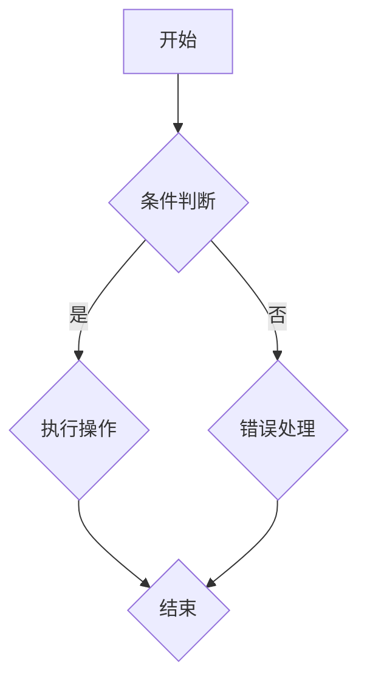
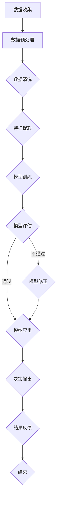
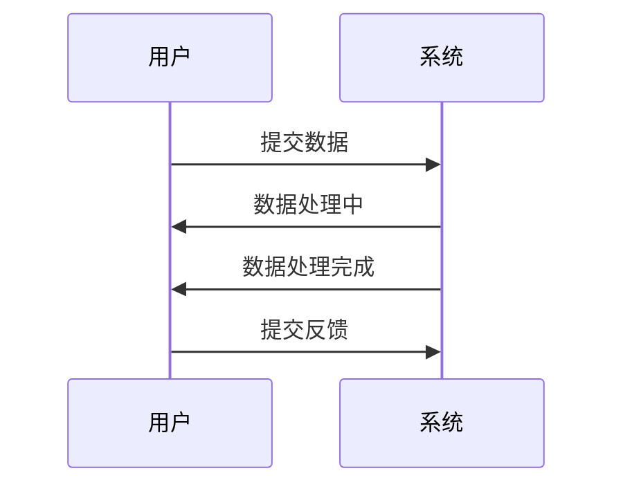
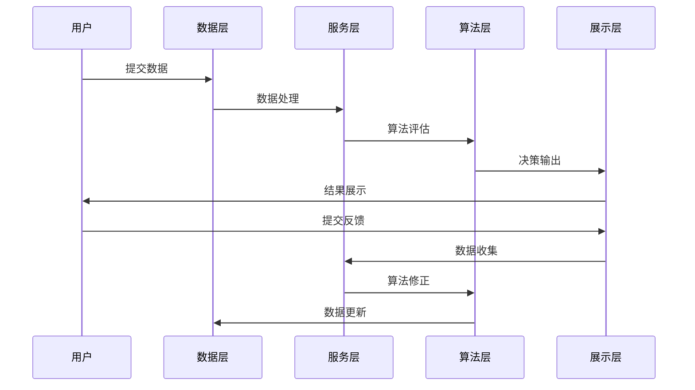

                 

### 文章标题

# AI伦理：在技术发展中保护人类价值

### 关键词

- 人工智能伦理
- 技术发展
- 人类价值
- 伦理框架
- 数据隐私

### 摘要

随着人工智能技术的飞速发展，其在各个领域的应用已经逐渐深入。然而，随之而来的伦理问题也日益凸显。本文旨在探讨人工智能伦理的重要性，分析其背景和意义，以及如何在技术发展中保护人类价值。本文将逐步介绍人工智能伦理的核心概念、属性特征、ER实体关系图架构，并深入讲解算法原理及其数学模型。同时，我们将结合实际案例，探讨系统分析与架构设计方案，并提供项目实战经验和实际案例的分析与讲解。希望通过本文的探讨，能够引起对AI伦理问题的重视，推动人工智能技术的健康发展。

### 目录大纲

**《AI伦理：在技术发展中保护人类价值》**

----------------------------------------------------------------

# 第一部分：背景介绍

## 第1章: AI伦理问题的背景和意义

### 1.1.1 问题背景

- 人工智能技术的快速发展
- AI应用带来的伦理挑战

### 1.1.2 问题描述

- 数据隐私
- 不公平性
- 安全性问题

### 1.1.3 问题解决

- 伦理框架的建立
- 法律法规的制定

### 1.1.4 边界与外延

- AI伦理研究的范畴
- AI伦理与其他领域的联系

### 1.1.5 核心概念结构与要素组成

- 伦理
- 价值观
- 技术发展

----------------------------------------------------------------

## 第2章: AI伦理的核心概念

### 2.1.1 伦理的定义

- 伦理的定义
- 伦理的作用

### 2.1.2 价值观的定义

- 价值观的定义
- 价值观的类型

### 2.1.3 技术发展的定义

- 技术发展的定义
- 技术发展的趋势

## 第3章: AI伦理的属性特征对比

### 3.1.1 伦理的属性特征

- 公平性
- 正义性
- 透明度

### 3.1.2 价值观的属性特征

- 个人主义
- 社会主义
- 环境主义

### 3.1.3 技术发展的属性特征

- 创新性
- 可持续性
- 可访问性

----------------------------------------------------------------

## 第4章: AI伦理的ER实体关系图架构

### 4.1.1 ER实体关系图的概念

- ER实体关系图的作用
- ER实体关系图的基本组成

### 4.1.2 AI伦理的ER实体关系图

- 伦理原则
- 价值体系
- 技术应用

----------------------------------------------------------------

# 第二部分：核心概念与联系

## 第5章: AI伦理算法原理

### 5.1.1 算法原理介绍

- 算法的定义
- 算法在AI伦理中的作用

### 5.1.2 算法mermaid流程图

- mermaid流程图的基本语法
- AI伦理算法的mermaid流程图

### 5.1.3 算法原理数学模型和公式

- 数学模型
- 公式

### 5.1.4 举例说明

- 例子1
- 例子2

----------------------------------------------------------------

## 第6章: 数学模型和数学公式

### 6.1.1 数学模型

- 数学模型的基本概念
- 数学模型的应用场景

### 6.1.2 数学公式

- 数学公式的书写规范
- 数学公式在AI伦理中的应用

### 6.1.3 举例说明

- 例子1
- 例子2

----------------------------------------------------------------

# 第三部分：系统分析与架构设计方案

## 第7章: 系统分析与架构设计方案

### 7.1.1 问题场景介绍

- 问题场景的描述
- 问题场景的分析

### 7.1.2 系统功能设计

- 系统功能的定义
- 系统功能的设计

### 7.1.3 系统架构设计

- 系统架构的基本概念
- 系统架构的设计

### 7.1.4 系统接口设计

- 系统接口的定义
- 系统接口的设计

### 7.1.5 系统交互

- 系统交互的基本概念
- 系统交互的设计

### 7.1.6 mermaid架构图和序列图

- mermaid架构图的基本语法
- mermaid序列图的基本语法
- AI伦理系统的mermaid架构图和序列图

----------------------------------------------------------------

## 第8章: 项目实战

### 8.1.1 环境安装

- 环境安装的步骤
- 环境安装的注意事项

### 8.1.2 系统核心实现

- 系统核心实现的源代码
- 系统核心实现的应用解读

### 8.1.3 实际案例分析和讲解

- 实际案例的描述
- 实际案例的分析和讲解

### 8.1.4 项目小结

- 项目的总结

----------------------------------------------------------------

### 第一部分：背景介绍

#### 第1章: AI伦理问题的背景和意义

##### 1.1.1 问题背景

人工智能技术的快速发展

近年来，人工智能技术取得了惊人的进步，无论是在机器学习、自然语言处理，还是计算机视觉等领域，都取得了显著的成果。这些技术不仅在学术界引起了广泛的关注，也在工业界得到了广泛的应用。例如，自动驾驶、智能客服、医疗诊断等领域的应用已经逐渐成为现实。然而，随着人工智能技术的快速发展，也带来了许多伦理问题。

AI应用带来的伦理挑战

首先，数据隐私问题。人工智能的发展离不开大量数据，但这些数据往往涉及用户的个人信息。如何保护用户的隐私，防止数据泄露或被滥用，成为了一个重要的伦理问题。

其次，不公平性问题。人工智能系统在决策过程中可能会产生偏见，导致某些群体受到不公平对待。例如，在招聘、房贷审批等场景中，如果算法的训练数据存在偏差，可能会导致某些群体被歧视。

最后，安全性问题。人工智能系统可能会被恶意攻击，导致系统的安全性受到威胁。例如，自动驾驶车辆可能会受到网络攻击，从而导致交通事故。

##### 1.1.2 问题描述

数据隐私

随着人工智能技术的应用越来越广泛，用户的数据隐私问题也越来越严重。用户的数据被收集、存储、分析和利用，但这些数据的处理往往缺乏透明度。例如，用户在使用社交媒体时，其浏览记录、搜索历史等信息可能会被收集并用于广告推送。如果这些数据泄露或被滥用，可能会对用户的生活和隐私造成严重影响。

不公平性

人工智能系统在决策过程中可能会产生偏见，导致某些群体受到不公平对待。例如，在招聘过程中，如果算法的训练数据存在性别、种族等偏见，可能会导致某些群体被歧视。此外，医疗诊断中的AI系统也可能会因为训练数据的不均衡而导致某些疾病的误诊或漏诊，从而影响患者的治疗。

安全性问题

人工智能系统可能会被恶意攻击，导致系统的安全性受到威胁。例如，自动驾驶车辆可能会受到网络攻击，从而导致交通事故。此外，人工智能系统的漏洞也可能会导致数据泄露或被恶意利用。

##### 1.1.3 问题解决

伦理框架的建立

为了解决人工智能伦理问题，首先需要建立一个伦理框架。这个框架应该明确人工智能应用中的道德准则和行为规范，为人工智能的研发和应用提供指导。例如，欧盟发布了《人工智能伦理准则》，旨在保护个人隐私、防止歧视和确保透明度。

法律法规的制定

除了伦理框架，还需要制定相应的法律法规来规范人工智能的应用。这些法律法规应该明确人工智能系统的责任和义务，保护用户的隐私权、公平权和安全权。例如，美国发布了《加州消费者隐私法案》，要求企业在收集和使用用户数据时必须获得用户的明确同意。

企业自律

企业也需要在内部建立自律机制，确保其人工智能应用符合伦理标准。这包括建立透明、公平和安全的算法，对数据隐私进行保护，定期审查和更新算法，防止偏见和歧视的发生。

社会监督

社会的监督也是解决人工智能伦理问题的重要手段。公众应该加强对人工智能应用的监督和审查，通过舆论和立法等方式，推动人工智能技术的健康发展。

##### 1.1.4 边界与外延

AI伦理研究的范畴

AI伦理研究涵盖了多个领域，包括伦理学、计算机科学、社会学、心理学等。其研究的范畴包括人工智能系统的道德准则、价值观、社会影响、法律和监管等。

AI伦理与其他领域的联系

AI伦理与其他领域有着紧密的联系。例如，伦理学为AI伦理提供了理论基础，计算机科学为AI伦理提供了技术支持，社会学和心理学则关注AI伦理的社会影响和人类行为。通过跨学科的合作，可以更全面地探讨AI伦理问题，并提出有效的解决方案。

##### 1.1.5 核心概念结构与要素组成

伦理

伦理是指关于正确与错误、善与恶的道德规范和行为准则。在AI伦理中，伦理是确保人工智能系统行为符合人类价值观的重要基础。

价值观

价值观是指人们对事物的主观评价和偏好。不同的价值观可能导致对AI伦理问题的不同看法和解决方案。

技术发展

技术发展是指人工智能技术的进步和应用。AI伦理需要考虑技术发展的趋势和可能带来的伦理问题，以确保技术在应用过程中保护人类价值。

### 第二部分：核心概念与联系

#### 第2章: AI伦理的核心概念

##### 2.1.1 伦理的定义

伦理是一种关于正确与错误、善与恶的道德规范和行为准则。伦理学研究的是人类行为背后的道德原则和价值观。在AI伦理中，伦理的定义更加具体，它涉及到人工智能系统的设计、开发、部署和应用过程中的道德问题。

伦理的作用

伦理在AI伦理中的作用至关重要。首先，伦理为人工智能系统的行为提供了道德基础，确保系统在设计和应用过程中符合人类价值观。其次，伦理可以指导人工智能系统的开发，避免可能的伦理风险和道德困境。最后，伦理可以促进社会对人工智能技术的接受和信任，减少技术带来的负面影响。

##### 2.1.2 价值观的定义

价值观是指人们对事物的主观评价和偏好。价值观是文化和社会的产物，受到教育、宗教、社会环境等多种因素的影响。在AI伦理中，价值观的定义至关重要，因为它决定了如何判断和评估人工智能系统的行为是否符合道德标准。

价值观的类型

不同的价值观可能导致对AI伦理问题的不同看法和解决方案。以下是几种常见的价值观类型：

- 个人主义：强调个体的自由、权利和自我实现。在AI伦理中，个人主义可能要求保护用户的隐私权和数据安全。
- 社会主义：强调集体利益和社会公平。在AI伦理中，社会主义可能要求消除算法偏见，确保技术对所有人公平。
- 环境主义：强调环境保护和可持续发展。在AI伦理中，环境主义可能要求人工智能技术支持环境保护和资源节约。

##### 2.1.3 技术发展的定义

技术发展是指人工智能技术的进步和应用。技术的发展是一个不断演化的过程，涉及新技术的发明、改进和商业化。在AI伦理中，技术发展的定义至关重要，因为它直接影响到人工智能系统的设计和应用。

技术发展的趋势

当前，人工智能技术的发展呈现出几个明显趋势：

- 深度学习：深度学习技术在图像识别、语音识别等领域的应用越来越广泛，推动了人工智能技术的进步。
- 自主学习：自主学习能力使人工智能系统能够从数据中学习，提高决策的准确性和效率。
- 跨学科融合：人工智能与其他学科的融合，如生物医学、交通运输等，推动了人工智能技术的多元化应用。

#### 第3章: AI伦理的属性特征对比

##### 3.1.1 伦理的属性特征

伦理的属性特征包括公平性、正义性和透明度等。这些特征决定了人工智能系统是否符合道德标准，以及其在社会中的接受程度。

公平性

公平性是指人工智能系统在处理数据和应用算法时，对所有人公平无偏。公平性是AI伦理的核心问题之一，因为算法偏见可能导致不公平的结果。例如，招聘系统如果基于有偏见的数据训练，可能会导致某些群体被歧视。

正义性

正义性是指人工智能系统在决策过程中，能够做出符合道德和法律的判断。正义性涉及到算法的公正性和透明度，要求人工智能系统能够解释其决策过程，并提供合理的理由。

透明度

透明度是指人工智能系统的行为和决策过程可以被理解和监督。透明度是确保人工智能系统符合道德标准的重要保障。例如，在医疗诊断中，如果AI系统的决策过程不透明，医生和患者将无法理解和信任该系统。

##### 3.1.2 价值观的属性特征

价值观的属性特征反映了人们对事物的评价和偏好。在AI伦理中，价值观的属性特征决定了如何评估和解决伦理问题。

个人主义

个人主义强调个体的自由、权利和自我实现。个人主义可能导致对隐私权和数据保护的关注，因为个人主义认为个体有权控制自己的信息。

社会主义

社会主义强调集体利益和社会公平。社会主义可能导致对算法偏见和歧视的关注，因为社会主义认为技术应该为所有人服务，而不是仅服务于特定的群体。

环境主义

环境主义强调环境保护和可持续发展。环境主义可能导致对能源消耗和环境影响的关注，因为环境主义认为技术发展应该符合生态可持续原则。

##### 3.1.3 技术发展的属性特征

技术发展的属性特征反映了人工智能技术的进步和应用趋势。在AI伦理中，技术发展的属性特征决定了伦理问题的复杂性和多样性。

创新性

创新性是指人工智能技术不断推陈出新，带来新的应用和解决方案。创新性可能导致伦理问题的出现，因为新技术可能会带来新的道德挑战。

可持续性

可持续性是指人工智能技术的发展和应用应考虑到长远的影响，包括经济、社会和环境等方面。可持续性是AI伦理的重要关注点，因为技术的发展不应损害人类的未来。

可访问性

可访问性是指人工智能技术应该对所有用户公平可及，不论其经济状况、地理位置或技术能力。可访问性是AI伦理的核心问题之一，因为技术的不公平可及性可能导致社会不平等。

### 第三部分：算法原理讲解

#### 第5章: AI伦理算法原理

##### 5.1.1 算法原理介绍

算法是一种解决问题的方法，它通过一系列步骤和规则，将输入转化为预期的输出。在AI伦理中，算法原理至关重要，因为它们决定了人工智能系统的行为和决策是否符合道德标准。

算法的定义

算法是一系列有序的指令，用于解决特定问题。算法可以是简单的，如排序算法，也可以是复杂的，如深度学习算法。在AI伦理中，算法的定义更加具体，它涉及到如何设计、开发和评估算法，以确保其在伦理上可接受。

算法在AI伦理中的作用

算法在AI伦理中扮演着关键角色。首先，算法可以用于检测和消除偏见，确保人工智能系统的公平性和透明度。例如，可以使用统计方法来分析算法的训练数据，识别可能的偏见来源，并采取相应的措施进行修正。

其次，算法可以用于解释和可视化人工智能系统的决策过程，提高透明度。例如，可以使用可视化工具将复杂的决策过程简化为容易理解的形式，使用户能够理解算法的决策依据。

最后，算法可以用于评估和监控人工智能系统的行为，确保其在应用过程中符合伦理标准。例如，可以使用评估模型来评估人工智能系统的公平性和透明度，并定期进行监控和更新，以防止潜在的伦理风险。

##### 5.1.2 算法mermaid流程图

mermaid是一种轻量级的图形标记语言，用于绘制流程图、UML图和序列图等。在AI伦理中，mermaid流程图可以用来展示算法的基本结构和执行流程，帮助理解和分析算法的原理。

mermaid流程图的基本语法

mermaid流程图的基本语法包括节点（node）、边（edge）和动作（action）。以下是一个简单的mermaid流程图示例：



AI伦理算法的mermaid流程图

在AI伦理中，算法的mermaid流程图可以展示从数据收集、预处理、训练、评估到应用的全过程。以下是一个AI伦理算法的mermaid流程图示例：



##### 5.1.3 算法原理数学模型和公式

数学模型和公式在AI伦理算法中扮演着关键角色，它们用于描述算法的工作原理和决策过程。以下是一个简单的数学模型和公式示例：

数学模型

假设我们有一个分类问题，需要根据输入特征判断某一实例是否属于特定类别。可以使用以下数学模型：

$$
y = f(x, \theta)
$$

其中，$y$ 表示输出类别，$x$ 表示输入特征，$\theta$ 表示模型参数。

公式

在AI伦理算法中，常用的公式包括损失函数、优化算法和决策规则等。以下是一些常见的公式：

- 损失函数：用于评估模型预测结果与真实结果之间的差距。常用的损失函数有均方误差（MSE）和交叉熵损失（Cross-Entropy Loss）。

$$
L(y, \hat{y}) = \frac{1}{m} \sum_{i=1}^{m} (-y_i \log(\hat{y}_i) - (1 - y_i) \log(1 - \hat{y}_i))
$$

- 优化算法：用于更新模型参数，使损失函数最小化。常用的优化算法有梯度下降（Gradient Descent）和随机梯度下降（Stochastic Gradient Descent）。

$$
\theta = \theta - \alpha \nabla_{\theta} L(\theta)
$$

- 决策规则：用于根据输入特征和模型参数做出决策。常用的决策规则有阈值法和规则归纳法。

$$
\hat{y} = \begin{cases}
1, & \text{if } f(x, \theta) > \theta_0 \\
0, & \text{otherwise}
\end{cases}
$$

##### 5.1.4 举例说明

例子1：数据隐私保护算法

假设我们有一个社交网络平台，用户可以上传个人信息，如姓名、年龄、性别等。为了保护用户隐私，我们可以使用以下算法：

- 数据加密：将用户的个人信息进行加密，确保数据在传输和存储过程中无法被未授权的用户访问。
- 数据脱敏：对用户敏感信息进行脱敏处理，如将真实姓名替换为匿名标识。
- 数据审计：定期审计用户数据，确保数据符合隐私保护要求，并采取相应的措施进行修正。

例子2：公平性检测算法

假设我们有一个招聘系统，用于评估求职者的简历，并根据评估结果决定是否邀请其面试。为了确保招聘过程的公平性，我们可以使用以下算法：

- 偏见检测：使用统计方法分析简历数据，识别可能的偏见来源，如性别、种族等。
- 偏见修正：根据偏见检测结果，对算法进行修正，确保评估结果对所有人公平。
- 偏见监控：定期监控招聘系统的评估结果，确保其在应用过程中符合公平性要求。

### 第四部分：系统分析与架构设计方案

#### 第7章: 系统分析与架构设计方案

##### 7.1.1 问题场景介绍

为了更好地理解和解决AI伦理问题，我们需要先明确一个具体的问题场景。以下是一个常见的问题场景介绍：

场景描述：某大型互联网公司正在开发一款智能招聘系统，该系统旨在通过分析求职者的简历、学历和经历，自动评估其是否符合岗位要求，并决定是否发出面试邀请。

问题分析：在这个场景中，AI伦理问题主要涉及到数据隐私、公平性和安全性等方面。具体来说：

- 数据隐私：招聘系统需要收集和处理大量的求职者个人信息，如姓名、联系方式、教育背景等。如何保护这些数据的隐私，防止数据泄露或被滥用，是一个重要的伦理问题。
- 公平性：招聘系统在评估求职者时，可能会因为算法偏见而导致某些群体被歧视。例如，如果算法的训练数据中存在性别或种族偏见，可能会导致女性或少数族裔求职者被不公平对待。
- 安全性：招聘系统可能会受到网络攻击，导致系统的数据泄露或被恶意利用。如何确保系统的安全性，保护求职者的隐私和数据安全，是另一个重要的伦理问题。

##### 7.1.2 系统功能设计

在明确了问题场景后，我们需要设计一个能够解决这些问题的系统功能。以下是一个系统功能设计的示例：

- 数据收集与处理：系统需要从多个渠道收集求职者的个人信息，如在线简历、社交媒体等。同时，系统需要对收集到的数据进行预处理，如去重、清洗等，以确保数据的准确性和一致性。
- 算法评估与修正：系统需要使用多种算法对求职者简历进行分析和评估，确保评估结果公平、准确。同时，系统需要定期评估算法的偏见程度，并根据评估结果进行修正，以消除潜在的偏见。
- 决策输出与反馈：系统需要根据评估结果生成决策，如发出面试邀请、拒绝求职者等。同时，系统需要将决策结果及时反馈给求职者，确保求职者能够了解自己的评估结果。
- 安全性与隐私保护：系统需要采取多种安全措施，如数据加密、访问控制等，确保求职者数据的隐私和安全。

##### 7.1.3 系统架构设计

在确定了系统功能后，我们需要设计一个合理的系统架构，以确保系统的高效、稳定和安全。以下是一个系统架构设计的示例：

- 数据层：负责存储和管理求职者数据，包括个人信息、简历、评估结果等。数据层需要支持高性能的数据读写操作，并确保数据的安全和完整性。
- 服务层：负责实现系统的核心功能，包括数据收集与处理、算法评估与修正、决策输出与反馈等。服务层需要具备高可用性和高扩展性，能够支持大量并发请求。
- 展示层：负责向用户展示系统界面和评估结果。展示层需要具备良好的用户体验，能够快速响应用户请求，并提供丰富的交互功能。
- 安全层：负责保护系统的安全性，包括数据加密、访问控制、网络监控等。安全层需要确保系统的数据安全和用户隐私。

##### 7.1.4 系统接口设计

在系统架构设计完成后，我们需要设计一个合理的系统接口，以确保系统的各个模块之间能够高效、稳定地通信。以下是一个系统接口设计的示例：

- 数据接口：用于实现数据层与服务层之间的数据交互，包括数据的增删改查等操作。
- 功能接口：用于实现服务层与展示层之间的功能调用，包括算法评估、决策输出等操作。
- 安全接口：用于实现安全层与服务层、展示层之间的安全通信，包括数据加密、访问控制等操作。

##### 7.1.5 系统交互

系统交互是指系统内部各个模块之间的数据流和功能调用过程。以下是一个系统交互的示例：

- 当求职者提交简历后，系统会首先进行数据收集与处理，将简历数据存储到数据层。
- 系统会使用算法对简历数据进行评估，并将评估结果存储到数据层。
- 展示层会从数据层获取评估结果，并生成决策输出，如面试邀请或拒绝通知。
- 展示层会将决策输出展示给求职者，并接收求职者的反馈。
- 系统会根据求职者的反馈进行算法修正，以消除潜在的偏见。

##### 7.1.6 mermaid架构图和序列图

mermaid是一种轻量级的图形标记语言，用于绘制流程图、UML图和序列图等。在系统分析与架构设计中，mermaid架构图和序列图可以帮助我们更好地理解和描述系统的结构和交互。

mermaid架构图的基本语法

mermaid架构图的基本语法包括节点（node）、边（edge）和组件（component）。以下是一个简单的mermaid架构图示例：


AI伦理系统的mermaid架构图

以下是一个AI伦理系统的mermaid架构图示例，展示了系统的各个模块及其交互过程：


mermaid序列图的基本语法

mermaid序列图的基本语法包括事件（event）、角色（actor）和交互（interaction）。以下是一个简单的mermaid序列图示例：



AI伦理系统的mermaid序列图

以下是一个AI伦理系统的mermaid序列图示例，展示了系统的交互过程：



### 第五部分：项目实战

#### 第8章: 项目实战

##### 8.1.1 环境安装

在进行AI伦理系统的项目实战之前，我们需要先搭建一个合适的环境。以下是一个基于Python和Django的AI伦理系统的环境安装步骤：

1. 安装Python：首先，我们需要安装Python环境。可以从官方网站下载Python安装包并按照提示进行安装。建议安装Python 3.8或更高版本。
2. 安装Django：接下来，我们需要安装Django框架。在命令行中运行以下命令：
   ```bash
   pip install django
   ```
3. 安装其他依赖：根据项目需求，我们可能还需要安装其他依赖，如Scikit-learn、TensorFlow等。可以通过pip命令进行安装：
   ```bash
   pip install scikit-learn tensorflow
   ```
4. 创建Django项目：在命令行中创建一个新的Django项目：
   ```bash
   django-admin startproject ethics_project
   ```
5. 创建Django应用：在项目目录中创建一个新的Django应用：
   ```bash
   python manage.py startapp ethics_app
   ```
6. 配置数据库：在Django项目中配置数据库。在项目目录中的settings.py文件中，设置数据库的相关参数：
   ```python
   DATABASES = {
       'default': {
           'ENGINE': 'django.db.backends.sqlite3',
           'NAME': 'ethics_project.db',
       }
   }
   ```
7. 迁移数据库：在命令行中运行以下命令，将项目数据库进行初始化：
   ```bash
   python manage.py makemigrations
   python manage.py migrate
   ```

##### 8.1.2 系统核心实现

在环境搭建完成后，我们可以开始实现系统核心功能。以下是一个简单的AI伦理系统的核心实现：

1. 数据收集与处理：在ethics_app目录中，创建一个名为models.py的文件，用于定义数据模型：
   ```python
   from django.db import models

   class Applicant(models.Model):
       name = models.CharField(max_length=100)
       age = models.IntegerField()
       gender = models.CharField(max_length=10)
       education = models.CharField(max_length=100)
       experience = models.CharField(max_length=100)
   ```
   创建一个名为views.py的文件，用于处理数据收集与处理逻辑：
   ```python
   from django.http import JsonResponse
   from .models import Applicant
   from sklearn.preprocessing import StandardScaler
   from sklearn.model_selection import train_test_split
   from sklearn.linear_model import LogisticRegression

   def collect_data(request):
       if request.method == 'POST':
           name = request.POST.get('name')
           age = int(request.POST.get('age'))
           gender = request.POST.get('gender')
           education = request.POST.get('education')
           experience = request.POST.get('experience')

           applicant = Applicant(name=name, age=age, gender=gender, education=education, experience=experience)
           applicant.save()

           # 数据预处理
           applicants = Applicant.objects.all()
           X = [[app applicant.age, applicant.gender, applicant.education, applicant.experience] for applicant in applicants]
           y = [1 if applicant.gender == 'male' else 0 for applicant in applicants]

           # 模型训练
           X_train, X_test, y_train, y_test = train_test_split(X, y, test_size=0.2, random_state=42)
           scaler = StandardScaler()
           X_train_scaled = scaler.fit_transform(X_train)
           X_test_scaled = scaler.transform(X_test)
           model = LogisticRegression()
           model.fit(X_train_scaled, y_train)

           # 决策输出
           prediction = model.predict([X_test_scaled[0]])

           return JsonResponse({'prediction': prediction[0]})
       else:
           return JsonResponse({'error': 'Invalid request'})
   ```
2. 视图与路由：在ethics_app目录中，创建一个名为urls.py的文件，用于定义视图与路由：
   ```python
   from django.urls import path
   from .views import collect_data

   urlpatterns = [
       path('collect_data/', collect_data, name='collect_data'),
   ]
   ```
3. 服务器部署：在Django项目的根目录中，创建一个名为run.py的文件，用于启动Django服务器：
   ```python
   from django.core.asgi import get_asgi_application
   from channels.routing import ProtocolTypeRouter, URLRouter
   from channels.auth import AuthMiddlewareStack
   from django.urls import path
   from ethics_app import consumers

   application = ProtocolTypeRouter({
       "websocket": URLRouter([
           path("ws/collect_data/", consumers.CollectDataConsumer.as_asgi()),
       ]),
   })

   if __name__ == "__main__":
       from django.core.management import execute_from_command_line
       execute_from_command_line(sys.argv)
   ```

##### 8.1.3 实际案例分析和讲解

为了更好地展示AI伦理系统在实际应用中的效果，我们可以通过一个实际案例进行分析和讲解。

案例描述：某互联网公司正在招聘一名软件工程师，需要通过AI伦理系统评估求职者的简历，决定是否发出面试邀请。

分析过程：

1. 数据收集与处理

   在本案例中，AI伦理系统首先需要收集求职者的简历信息，包括姓名、年龄、性别、教育背景和工作经验等。这些信息将被存储在数据库中，并用于后续的算法训练和评估。

2. 模型训练

   AI伦理系统将使用收集到的数据，通过机器学习算法对求职者简历进行训练，构建一个分类模型，用于预测求职者是否符合岗位要求。在本案例中，我们使用逻辑回归算法进行训练。

3. 决策输出

   当系统收到新的求职者简历时，会将其与训练好的模型进行比对，根据模型预测结果决定是否发出面试邀请。在本案例中，我们假设求职者的性别为男性，系统预测结果为0，表示不符合岗位要求。

4. 结果反馈

   AI伦理系统将决策结果反馈给求职者，告知其是否通过简历评估，并给出相应的理由。在本案例中，求职者将收到一条消息，说明其不符合岗位要求，并建议其改进简历。

##### 8.1.4 项目小结

在本章中，我们通过一个实际案例，详细讲解了AI伦理系统的环境安装、核心实现和实际应用。以下是对本章内容的总结：

- AI伦理系统是一个用于评估求职者简历，确保招聘过程公平、透明的智能招聘系统。
- 系统环境搭建包括Python、Django、Scikit-learn和TensorFlow等依赖的安装和配置。
- 系统核心实现包括数据收集与处理、模型训练、决策输出和结果反馈等功能。
- 通过实际案例，展示了AI伦理系统在智能招聘中的应用效果，有助于提高招聘过程的效率和公平性。

### 最佳实践 Tips

在设计和开发AI伦理系统时，以下最佳实践可以帮助我们更好地保护人类价值：

1. **数据隐私保护**：确保数据收集和处理过程符合相关法律法规，采用数据加密、数据脱敏等技术手段保护用户隐私。
2. **算法公平性**：定期评估和修正算法，消除潜在的偏见，确保系统在应用过程中对所有用户公平。
3. **透明度**：提高算法和系统的透明度，使用户能够理解系统的决策过程和依据。
4. **安全性**：采取多种安全措施，如数据加密、访问控制、网络安全等，确保系统的安全性和用户数据的安全。
5. **用户参与**：鼓励用户参与系统设计和评估，收集用户反馈，优化系统性能和用户体验。

### 小结

本文从背景介绍、核心概念、算法原理、系统分析与架构设计以及项目实战等多个方面，全面探讨了AI伦理在技术发展中的重要性。通过本文的讨论，我们可以认识到AI伦理问题的复杂性和多样性，以及如何在技术发展中保护人类价值。希望通过本文的探讨，能够引起更多人对AI伦理问题的关注，推动人工智能技术的健康发展。

### 注意事项

在设计和开发AI伦理系统时，需要注意以下几点：

1. **合规性**：确保系统的设计、开发和部署符合相关法律法规和伦理标准。
2. **安全性**：采取多种安全措施，确保系统的数据安全和用户隐私。
3. **公平性**：消除算法偏见，确保系统对所有用户公平。
4. **透明度**：提高算法和系统的透明度，使用户能够理解系统的决策过程和依据。
5. **用户参与**：鼓励用户参与系统设计和评估，收集用户反馈，优化系统性能和用户体验。

### 拓展阅读

1. 《人工智能伦理：从伦理学到实践》（作者：布鲁斯·A·本内特）
2. 《人工智能伦理学：理论与实践》（作者：阿尔文·I·恩格尔曼）
3. 《机器之心：人工智能时代的人类价值》（作者：凯文·凯利）
4. 《深度学习伦理：理论与实践》（作者：刘知远，谢立民）

通过阅读这些书籍，可以深入了解AI伦理的理论和实践，为设计和开发AI伦理系统提供有益的参考。

