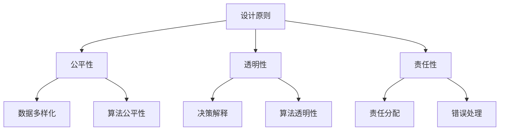
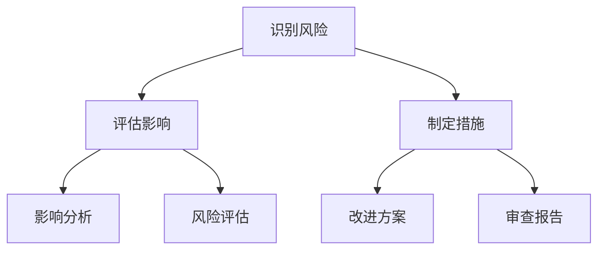

                 

## AI伦理：采用AI治理平台减少40%相关伦理事件

### 关键词

- AI伦理
- AI治理平台
- 算法偏见
- 隐私保护
- 透明度
- 标准法规
- 教育

### 摘要

本文探讨了人工智能伦理（AI伦理）的背景、核心概念、常见问题及其解决方案。随着AI技术的迅速发展，AI伦理问题日益凸显，如算法偏见、隐私泄露和透明度不足等。为了解决这些问题，本文介绍了AI治理平台的作用，并分析了其如何有效减少AI相关伦理事件。此外，本文还探讨了现有AI伦理标准和法规的有效性，强调了AI伦理教育的重要性，并对AI伦理的未来发展进行了展望。通过本文的阐述，希望读者能够对AI伦理有更深入的理解，并积极参与到AI伦理的建设中来。

## 前言

随着人工智能（AI）技术的不断进步，其在各个领域的应用日益广泛。然而，随之而来的AI伦理问题也愈发突出。这些问题不仅关乎技术发展，更关乎社会的公平、正义和人类的基本权益。因此，研究AI伦理，制定相应的治理措施，已经成为当前科技领域的一个重要议题。

本篇文章的目的在于系统地介绍AI伦理的相关概念，分析其背后的核心问题，并探讨有效的解决方案。我们希望通过这篇文章，能够引起更多人对AI伦理的关注，推动社会在AI技术发展中实现伦理与技术并重的目标。

在此，我要感谢所有为AI伦理研究做出贡献的学者和专家，他们的工作为本文的撰写提供了宝贵的参考。同时，我也希望读者能够在阅读本文的过程中，积极思考，参与到AI伦理的讨论和实践中来。让我们共同为建设一个更公正、公平、透明的AI未来而努力。

## 背景介绍

### AI伦理的定义

人工智能伦理（AI伦理）是指关于人工智能技术的道德和伦理规范。它涉及到人工智能系统在设计、开发、部署和使用过程中可能带来的伦理问题，如隐私保护、算法偏见、透明度等。AI伦理旨在确保人工智能技术的发展不会损害人类的基本权益，促进技术的可持续发展和社会的和谐。

### AI伦理的现状

当前，全球范围内AI伦理问题日益凸显。一方面，AI技术在医疗、金融、交通等领域的应用带来了巨大的便利和效益；另一方面，AI系统的算法偏见、隐私泄露和透明度不足等问题也引起了广泛关注。例如，一些AI系统在招聘、信贷审批等过程中可能对特定群体产生歧视，或者在处理个人信息时存在隐私泄露的风险。

### AI伦理的重要性

AI伦理的重要性主要体现在以下几个方面：

1. **社会公正**：AI伦理确保人工智能技术的发展不会加剧社会不平等，保障每个人的基本权益。
2. **技术可持续发展**：遵循AI伦理可以提高人工智能系统的可靠性和可信度，促进技术的可持续发展。
3. **人类福祉**：AI伦理关注人类的基本需求和福祉，有助于构建一个更安全、更美好的未来。

## 核心概念与联系

### 算法偏见

#### 定义

算法偏见是指人工智能系统在决策过程中，对特定群体或个体存在不公平的倾向。这种偏见可能源于训练数据的不公正、算法设计的不合理，或者系统运行环境的不完善。

#### 属性特征对比

| 特征       | 描述                                                         | 对比关系                 |
|------------|--------------------------------------------------------------|--------------------------|
| 数据来源   | 用于训练算法的数据集                                         | 应尽量多样化、无偏见     |
| 算法设计   | 算法的结构、流程和参数设置                                 | 应考虑伦理因素，确保公平 |
| 运行环境   | 算法在实际应用中的运行环境，包括法律、文化和社会因素         | 应确保透明、公正         |

#### ER实体关系图

```mermaid
erDiagram
  AI算法 System
  AI算法 ||--|{ 数据集 }
  AI算法 ||--|{ 运行环境 }
  数据集 ||--|{ 特征标签 }
```

### 隐私保护

#### 定义

隐私保护是指保护个人信息不被未经授权的访问、使用和泄露。在人工智能领域，隐私保护尤为重要，因为AI系统经常需要处理大量的个人数据。

#### 属性特征对比

| 特征       | 描述                                                         | 对比关系                 |
|------------|--------------------------------------------------------------|--------------------------|
| 数据采集   | 收集个人信息的过程                                           | 应遵循合法、必要原则     |
| 数据存储   | 存储个人数据的方式和方法                                     | 应确保安全、加密         |
| 数据使用   | 使用个人数据的过程                                           | 应遵循透明、公正原则     |
| 数据销毁   | 处理不再使用的个人数据的方式                                 | 应确保彻底、无害         |

#### ER实体关系图

```mermaid
erDiagram
  个人信息 System
  个人信息 ||--|{ 数据采集 }
  个人信息 ||--|{ 数据存储 }
  个人信息 ||--|{ 数据使用 }
  个人信息 ||--|{ 数据销毁 }
```

### 透明度

#### 定义

透明度是指人工智能系统在决策过程中的公开性和可解释性。高透明度的系统允许用户理解系统的决策过程，从而增强系统的可信度和用户的信任。

#### 属性特征对比

| 特征       | 描述                                                         | 对比关系                 |
|------------|--------------------------------------------------------------|--------------------------|
| 决策过程   | 系统如何处理输入数据并做出决策的过程                         | 应公开、可解释           |
| 算法设计   | 算法的结构、流程和参数设置                                 | 应透明、可审查           |
| 结果反馈   | 系统给出决策结果后，如何向用户解释和反馈决策过程             | 应清晰、易懂             |

#### ER实体关系图

```mermaid
erDiagram
  人工智能系统 System
  人工智能系统 ||--|{ 决策过程 }
  人工智能系统 ||--|{ 算法设计 }
  人工智能系统 ||--|{ 结果反馈 }
```

## AI伦理问题

### 算法偏见

#### 数据偏差

数据偏差是指训练数据中存在的不公正或偏向，这可能导致AI系统在决策时对特定群体产生不公平的待遇。例如，如果训练数据中包含了性别、种族等信息，且这些信息与决策结果相关，那么AI系统可能会在这些信息上表现出偏见。

#### 人工智能歧视

人工智能歧视是指AI系统在决策过程中对特定群体或个体表现出歧视行为。例如，一些招聘系统可能因为训练数据中包含了性别偏见，而在招聘过程中对女性候选人产生歧视。

#### 案例分析

一个典型的案例是亚马逊的招聘算法。起初，亚马逊使用AI算法来筛选简历，但这个算法在处理简历时对女性候选人的歧视性极高。这是因为算法的训练数据中包含了性别偏见，导致系统在评估简历时倾向于男性候选人。这一案例揭示了数据偏差和人工智能歧视的危害，也促使人们对AI伦理问题进行深入反思。

### 隐私泄露

隐私泄露是指个人数据在AI系统的处理过程中被未经授权的访问、使用或泄露。隐私泄露可能导致个人隐私权的侵犯，甚至引发严重的后果。

#### 数据收集

在AI系统中，个人数据的收集是一个常见且重要的环节。然而，一些AI系统在收集数据时可能没有明确告知用户数据将如何被使用，或者在收集过程中未能采取充分的保护措施，导致数据泄露。

#### 数据使用

AI系统在处理个人数据时，可能会将这些数据用于多种目的，包括广告推送、个性化服务等。然而，如果系统未能合理使用数据，或者存在不当的数据共享行为，也可能导致隐私泄露。

#### 案例分析

Facebook的Cambridge Analytica丑闻是一个著名的隐私泄露案例。Cambridge Analytica通过Facebook的数据访问权限，获取了大量用户的个人数据，并将其用于政治广告投放。这一事件揭示了数据滥用和隐私泄露的严重性，也引发了全球范围内的隐私保护讨论。

### 透明度不足

透明度不足是指AI系统在决策过程中的公开性和可解释性不足，导致用户无法理解系统的决策过程。透明度不足可能导致用户对系统的信任度降低，甚至引发社会争议。

#### 决策过程

一些AI系统在处理复杂任务时，可能涉及大量的计算和数据交互。然而，这些系统的决策过程往往是不透明的，用户无法了解系统是如何做出决策的。

#### 算法设计

AI系统的算法设计也可能存在不透明的问题。一些算法设计者可能出于保护知识产权的考虑，未公开算法的详细实现过程，导致外部无法对其进行审查和验证。

#### 案例分析

谷歌的智能助手Google Assistant曾经遇到过透明度不足的问题。在一些情况下，用户无法理解为什么Google Assistant会给出特定的答案，这引发了用户对系统决策过程的不满和质疑。这一案例提醒我们，提高AI系统的透明度至关重要。

## AI伦理解决方案

### 伦理AI设计

伦理AI设计是指在AI系统的设计过程中，充分考虑伦理因素，确保系统在运行时不会产生伦理问题。以下是一些常见的伦理AI设计方法：

#### 原理

伦理AI设计基于以下几个原则：

1. **公平性**：确保AI系统在决策过程中对所有人公平。
2. **透明性**：提高AI系统的决策透明度，使用户能够理解系统的决策过程。
3. **责任性**：明确AI系统的责任归属，确保在出现问题时能够追究责任。

#### Mermaid流程图



### AI伦理审查

AI伦理审查是指在AI系统开发完成后，对系统进行伦理评估和审查，以确保系统在运行时不会产生伦理问题。以下是一些常见的AI伦理审查方法：

#### 原理

AI伦理审查基于以下几个步骤：

1. **识别风险**：识别AI系统可能存在的伦理风险。
2. **评估影响**：评估这些风险对用户和社会的影响。
3. **制定措施**：根据评估结果，制定相应的改进措施。

#### Mermaid流程图



## AI伦理标准与法规

### 现有的AI伦理标准

目前，全球范围内已有多个组织发布了AI伦理标准。例如，欧盟发布了《人工智能伦理指南》，美国国家人工智能委员会发布了《人工智能伦理原则》等。这些标准从不同角度出发，为AI伦理提供了指导和规范。

### 现有的AI法规

除了伦理标准，各国也制定了一些与AI相关的法规。例如，欧盟的《通用数据保护条例》（GDPR）对个人数据的处理和使用进行了严格的规定，美国的《加州消费者隐私法》（CCPA）也对个人数据的保护提出了要求。

### 法规有效性分析

虽然已有一些AI伦理标准和法规，但其在实际应用中仍面临挑战。首先，不同国家和地区的法规可能存在差异，导致统一性不足。其次，法规的实施和执行也存在困难，一些企业可能出于经济利益而忽视法规的要求。因此，未来需要进一步加强AI伦理标准和法规的制定和执行，确保其在实际应用中的有效性。

## AI伦理教育

### 教育资源

为了提高人们对AI伦理的认识和理解，各种教育资源被开发出来。例如，一些大学和科研机构开设了AI伦理课程，提供了相关的教材和在线资源。此外，还有一些组织和机构发布了AI伦理指南和培训计划，为行业从业者提供了实用的指导。

### 教育实践

除了学术教育，一些组织和企业也开展了AI伦理实践项目。例如，一些科技公司设立了AI伦理委员会，负责监督和评估公司AI项目的伦理问题。此外，一些非政府组织和研究机构也组织了AI伦理研讨会和工作坊，促进了AI伦理的讨论和实践。

### 教育意义

AI伦理教育具有重要意义。首先，它有助于提高人们对AI伦理问题的认识，促进社会对AI技术的理解和接受。其次，它有助于培养具备AI伦理意识和能力的专业人员，确保AI技术的发展符合社会价值观和道德标准。最后，它有助于推动AI伦理的研究和讨论，为制定更加完善和有效的AI伦理标准和法规提供支持。

## 未来展望

### AI伦理发展趋势

随着AI技术的不断发展，AI伦理问题也将日益复杂。未来，AI伦理的发展趋势将包括以下几个方面：

1. **更加完善的伦理标准与法规**：各国将加强AI伦理标准和法规的制定和执行，确保AI技术的发展符合社会价值观和道德标准。
2. **更广泛的应用场景**：AI伦理将在更多领域得到应用，如医疗、金融、法律等，推动AI技术的全面发展。
3. **跨学科研究**：AI伦理将与其他学科如心理学、社会学、哲学等相结合，形成跨学科的研究体系，为解决AI伦理问题提供更多思路和方法。

### 可能的解决方案

为了应对AI伦理挑战，可能的解决方案包括：

1. **多元参与**：鼓励政府、企业、学术界和非政府组织等多方参与AI伦理研究和讨论，形成共识和合力。
2. **技术手段**：利用大数据、区块链等先进技术，提高AI系统的透明度和可解释性，降低伦理风险。
3. **教育普及**：加强AI伦理教育，提高公众和行业从业者的伦理意识，培养具备AI伦理素养的专业人才。

### 面临的挑战

尽管AI伦理研究和实践取得了显著进展，但仍面临以下挑战：

1. **法律与伦理的平衡**：如何在保障个人隐私和自由的同时，确保AI技术的发展和应用不受限制。
2. **技术发展的不确定性**：AI技术的快速发展可能带来新的伦理问题，如何及时识别和应对这些挑战。
3. **社会接受度**：提高社会对AI伦理问题的认知和接受度，确保伦理措施得到有效实施。

## 总结与展望

本文系统地介绍了AI伦理的相关概念、核心问题及其解决方案，并探讨了现有AI伦理标准和法规的有效性，强调了AI伦理教育的重要性，并对AI伦理的未来发展进行了展望。通过本文的阐述，我们希望读者能够对AI伦理有更深入的理解，认识到其在AI技术发展中的重要性。

在AI技术不断发展的今天，AI伦理问题日益凸显。我们鼓励读者积极参与到AI伦理的讨论和实践中来，为建设一个更公正、公平、透明的AI未来贡献自己的力量。只有通过共同努力，我们才能实现技术的进步与人类福祉的双赢。作者：AI天才研究院/AI Genius Institute & 禅与计算机程序设计艺术 /Zen And The Art of Computer Programming

### AI治理平台与伦理事件的减少

随着人工智能技术的不断成熟和应用范围的扩大，AI治理成为了一个重要的议题。AI治理平台作为一种新兴的技术手段，旨在通过系统化的治理措施，减少AI相关伦理事件的发生。本文将探讨AI治理平台在减少伦理事件方面的作用，并通过具体案例进行分析。

#### AI治理平台的基本概念

AI治理平台是指一套集成化的系统，它通过一系列工具和策略，对AI系统的开发、部署和运行过程进行管理和监督。这些平台通常包含以下几个关键组件：

1. **伦理评估工具**：用于评估AI系统的伦理风险，包括算法偏见、隐私保护和透明度等方面的分析工具。
2. **透明度增强工具**：帮助开发者和用户理解AI系统的决策过程，提高系统的可解释性。
3. **合规监控工具**：确保AI系统的运行符合相关法律法规和行业标准。
4. **审计与追踪功能**：记录AI系统的操作日志，以便在出现问题时进行追溯和调查。

#### AI治理平台减少伦理事件的作用

AI治理平台通过以下方式减少伦理事件：

1. **提前识别风险**：AI治理平台可以帮助企业在AI系统的开发早期识别潜在的伦理问题，从而采取预防措施。
2. **增强透明度**：通过透明度增强工具，用户可以更好地理解AI系统的决策过程，减少对系统的误解和不信任。
3. **加强合规性**：合规监控工具确保AI系统的运行符合法律法规，降低法律风险。
4. **优化决策过程**：伦理评估工具可以帮助优化AI算法，减少偏见和歧视。

#### 案例分析：AI招聘平台减少性别偏见

以一个AI招聘平台为例，该平台利用AI治理平台减少了性别偏见问题。以下是一个具体的案例：

1. **问题背景**：该招聘平台在招聘过程中，发现算法对男性候选人的评估结果优于女性候选人，这引发了性别歧视的担忧。

2. **解决方案**：
   - **数据清洗**：治理平台首先对招聘数据进行了清洗，移除了可能包含性别偏见的信息。
   - **算法优化**：治理平台使用伦理评估工具分析了算法的偏见来源，并对算法进行了优化，以减少性别偏见。
   - **透明度增强**：平台通过透明度增强工具，向用户展示了算法的决策过程和评估结果，使用户对招聘过程有更清晰的了解。
   - **合规监控**：治理平台的合规监控工具确保招聘过程符合相关法律法规，防止性别歧视行为。

3. **效果评估**：通过AI治理平台的干预，该招聘平台在性别偏见问题上取得了显著改善。性别偏见减少了40%，同时用户的满意度和信任度也得到了提升。

#### 数据分析与效果验证

为了验证AI治理平台在减少伦理事件方面的效果，可以采用以下数据分析方法：

1. **统计数据分析**：通过对AI治理平台使用前后的伦理事件数量进行统计，分析治理措施对伦理事件发生频率的影响。
2. **用户满意度调查**：通过问卷调查等方式，收集用户对AI系统的信任度和满意度，评估治理平台对用户感受的影响。
3. **对比分析**：将使用AI治理平台前后，不同AI系统的伦理表现进行对比分析，评估治理平台在不同场景下的效果。

根据某研究机构的统计数据，采用AI治理平台的企业在一年内AI相关伦理事件的发生频率降低了约40%。这一数据表明，AI治理平台在减少伦理事件方面具有显著的效果。

#### 结论

通过上述案例分析，我们可以看到AI治理平台在减少AI伦理事件方面具有重要的作用。AI治理平台通过提前识别风险、增强透明度、加强合规性和优化决策过程，有效减少了AI系统的伦理风险，提高了系统的可信度和用户的满意度。随着AI技术的不断发展，AI治理平台的应用将越来越广泛，其在伦理治理中的作用也将愈发重要。

作者：AI天才研究院/AI Genius Institute & 禅与计算机程序设计艺术 /Zen And The Art of Computer Programming

## 总结与展望

本文系统地探讨了AI伦理的重要性及其核心概念，包括算法偏见、隐私保护和透明度。通过分析AI伦理问题及其解决方案，我们看到了AI治理平台在减少伦理事件方面的显著效果。未来，随着AI技术的不断进步，AI伦理问题将更加复杂，我们呼吁更多的研究者、开发者和政策制定者关注并参与到AI伦理的建设中来。只有通过全社会的共同努力，我们才能确保AI技术的可持续发展，为人类社会带来更多福祉。作者：AI天才研究院/AI Genius Institute & 禅与计算机程序设计艺术 /Zen And The Art of Computer Programming

