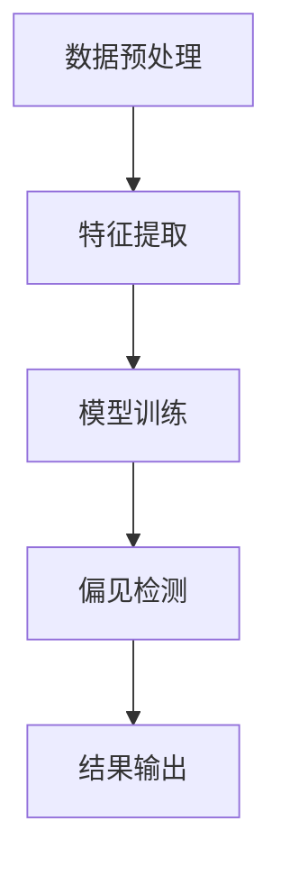
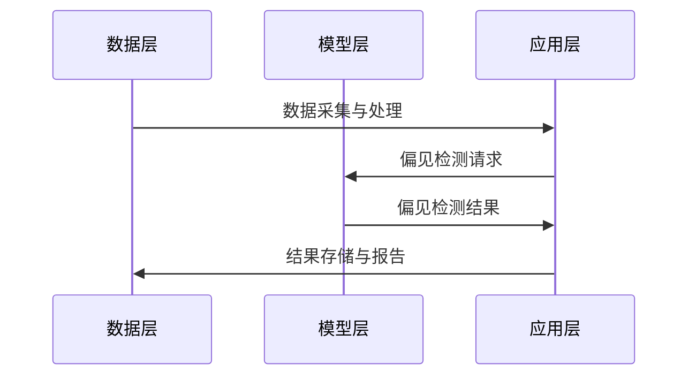
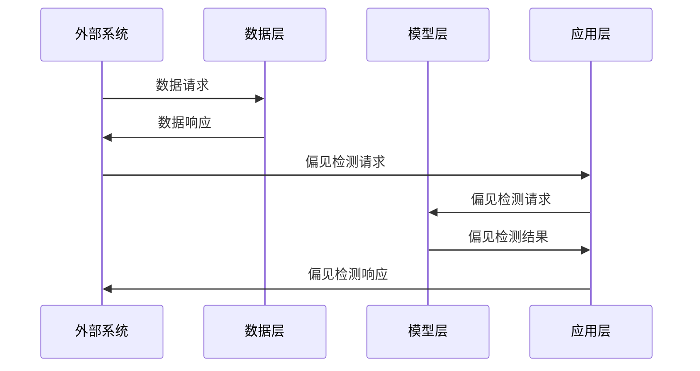

                 

### AI偏见检测：确保企业AI系统公平性的工具

在当今数字化时代，人工智能（AI）技术已经成为企业提升效率、优化决策的重要工具。然而，AI系统的普及也引发了一个不容忽视的问题——偏见。AI偏见，即算法中可能存在的性别、种族、年龄等不公平因素，会直接影响系统的决策结果，从而对社会造成不公平的影响。为此，确保企业AI系统的公平性，对偏见进行有效的检测与修正，变得尤为重要。

#### 关键词：
- AI偏见检测
- 企业AI系统
- 公平性
- 数据偏见
- 偏见类型与识别

#### 摘要：
本文将深入探讨AI偏见检测的重要性，分析偏见产生的原因和类型，介绍偏见检测的基本原理和方法，并通过实际案例展示如何通过偏见检测确保企业AI系统的公平性。

## 第一部分：背景与概念

### 第1章 问题背景与重要性

#### 1.1.1 问题背景

随着AI技术的不断进步，越来越多的企业开始将AI应用于各类业务场景中，如招聘、金融、医疗等。AI系统通过分析大量的数据，提供精准的决策支持和预测。然而，这些系统的决策结果往往依赖于训练数据，如果数据中存在偏见，AI系统就可能学习和放大这些偏见，导致不公平的结果。

#### 1.1.1.1 AI偏见现象的产生

AI偏见现象的产生主要与以下因素相关：
1. **数据偏见**：训练数据可能包含历史存在的偏见，例如，招聘系统中可能会因为历史数据中女性的比例较低，而导致AI系统对女性求职者的评分较低。
2. **算法偏差**：一些算法可能在无意中放大了数据中的偏见。例如，使用线性回归模型的AI系统可能会因为数据中的某些特征的重要性过高，而忽略了其他重要的特征。

#### 1.1.1.2 偏见对企业和社会的负面影响

AI偏见对企业和社会的负面影响是多方面的：
1. **损害企业声誉**：AI偏见可能导致企业决策失误，从而影响企业的运营效率和客户满意度。
2. **加剧社会不公平**：AI系统如果放大了某些群体的偏见，可能会加剧社会不平等，损害社会和谐。

#### 1.1.1.3 企业AI系统公平性的重要性

确保企业AI系统的公平性具有重要意义：
1. **合规性要求**：许多国家和地区已经出台了相关法律法规，要求企业在使用AI技术时必须确保系统的公平性。
2. **社会责任**：企业作为社会的一员，有责任确保其AI系统的决策结果是公平、公正的。

### 1.1.2 问题描述

#### 1.1.2.1 偏见的类型与识别

AI偏见主要可以分为以下几种类型：
1. **性别偏见**：AI系统可能对性别存在歧视，例如，在招聘系统中对女性的评分较低。
2. **种族偏见**：AI系统可能在决策时对某些种族存在偏见，导致不公平的结果。
3. **年龄偏见**：AI系统可能会因为数据中的年龄偏见，对某些年龄段的人群做出不公平的决策。

识别AI偏见的方法包括：
1. **数据审计**：通过分析训练数据，识别其中可能存在的偏见。
2. **模型分析**：通过分析AI系统的决策流程，识别其中可能存在的偏见。

#### 1.1.2.2 偏见检测的现状与挑战

当前，偏见检测技术仍然面临一些挑战：
1. **技术限制**：现有的偏见检测算法可能无法完全识别和修正AI系统中的所有偏见。
2. **数据隐私**：在进行偏见检测时，可能需要访问和修改训练数据，这可能涉及到数据隐私问题。

#### 1.1.3 问题解决

为了解决AI偏见问题，可以采取以下措施：
1. **公平性设计**：在AI系统开发阶段，就将公平性作为设计目标，通过算法优化和数据清洗等方法，减少偏见。
2. **偏见检测**：使用偏见检测算法，定期对AI系统进行检测，发现和修正潜在的偏见。

### 1.1.4 边界与外延

#### 1.1.4.1 偏见检测的应用范围

偏见检测技术可以应用于多个领域，包括：
1. **招聘系统**：确保招聘过程的公平性，避免性别、种族等偏见。
2. **金融系统**：确保信贷评估、投资决策等过程的公平性。
3. **医疗系统**：确保诊断和治疗过程的公平性。

#### 1.1.4.2 偏见检测的难点与限制

偏见检测技术面临以下难点和限制：
1. **算法复杂度**：偏见检测算法通常比较复杂，需要大量的计算资源。
2. **数据质量**：偏见检测依赖于高质量的训练数据，数据质量直接影响检测结果的准确性。

## 第2章 核心概念与联系

### 2.1.1 偏见检测的核心概念

#### 2.1.1.1 公平性

公平性是偏见检测的核心概念之一，指的是AI系统在处理数据时，不应该因为数据中存在的偏见而导致不公平的决策结果。

#### 2.1.1.2 偏见

偏见指的是AI系统在处理数据时，由于数据或算法的原因，导致对某些群体或个体存在不公平的待遇。

#### 2.1.1.3 数据偏见

数据偏见是指训练数据中可能存在的偏见，这些偏见可能来自历史数据、数据收集过程或数据预处理方法等。

### 2.1.2 概念属性特征对比

#### 2.1.2.1 公平性与准确性的平衡

公平性和准确性是偏见检测中需要平衡的两个重要目标。完全追求公平性可能会导致模型的准确性下降，而完全追求准确性则可能放大偏见。

#### 2.1.2.2 偏见与错误

偏见和错误是两个不同的概念。偏见是指由于系统或数据的原因导致的不公平决策，而错误是指决策结果与实际结果不一致。

#### 2.1.2.3 数据偏见与模型偏差

数据偏见是指训练数据中存在的偏见，而模型偏差是指模型在训练过程中对某些特征或群体的权重过高或过低，从而导致决策结果存在偏见。

### 2.1.3 ER实体关系图架构

#### 2.1.3.1 实体与关系的定义

实体关系图（Entity-Relationship Diagram, ERD）是一种用于表示实体及其关系的图形化工具。在偏见检测中，实体可以包括数据、模型、偏见、检测结果等，关系可以包括数据来源、模型训练、偏见检测等。

#### 2.1.3.2 关系之间的关联

在ER图中，不同实体之间的关系需要明确，例如，数据与模型之间的关系、模型与偏见之间的关系等。

#### 2.1.3.3 ER图的绘制方法

绘制ER图的方法包括以下步骤：
1. 确定实体及其属性。
2. 确定实体之间的关系。
3. 标注关系类型（如一对一、一对多、多对多）。
4. 使用Mermaid等工具绘制ER图。

```mermaid
erDiagram
  DATA ||--|{ MODEL }||>
  MODEL ||--|{ BIAS }||>
  BIAS ||--|{ DETECTION_RESULT }||>
```

## 第二部分：算法原理与实现

### 第3章 偏见检测算法原理

#### 3.1.1 偏见检测的基本算法

偏见检测的基本算法主要包括以下步骤：
1. **特征提取**：从原始数据中提取与偏见相关的特征。
2. **模型训练**：使用提取的特征训练一个分类模型。
3. **偏见检测**：使用训练好的模型对AI系统进行偏见检测。

#### 3.1.2 数学模型与公式

偏见检测的数学模型通常包括以下几个部分：
1. **概率模型**：使用概率模型对数据进行分析，识别潜在的偏见。
2. **线性回归**：通过线性回归模型分析特征之间的关系。
3. **支持向量机（SVM）**：使用SVM模型进行分类，识别偏见。

以下是一个简单的线性回归模型公式：
$$
y = \beta_0 + \beta_1 \cdot x
$$
其中，\( y \) 是预测结果，\( x \) 是特征值，\( \beta_0 \) 和 \( \beta_1 \) 是模型参数。

#### 3.1.3 算法流程图（Mermaid）



### 第4章 Python源代码实现与算法讲解

#### 4.1.1 数据预处理

数据预处理是偏见检测的重要步骤，主要包括以下内容：
1. **数据清洗**：去除数据中的噪声和异常值。
2. **数据归一化**：将不同特征的数据范围统一，便于模型训练。

以下是一个简单的Python代码示例：
```python
import pandas as pd

# 读取数据
data = pd.read_csv('data.csv')

# 数据清洗
data.dropna(inplace=True)

# 数据归一化
data = (data - data.min()) / (data.max() - data.min())
```

#### 4.1.2 特征提取

特征提取是从原始数据中提取与偏见相关的特征。以下是一个简单的特征提取示例：
```python
from sklearn.feature_extraction.text import TfidfVectorizer

# 读取数据
data = pd.read_csv('data.csv')

# 特征提取
vectorizer = TfidfVectorizer()
X = vectorizer.fit_transform(data['text'])

# 保存特征
with open('features.pkl', 'wb') as f:
    pickle.dump(vectorizer, f)
```

#### 4.1.3 模型训练

模型训练是偏见检测的核心步骤，以下是一个简单的模型训练示例：
```python
from sklearn.linear_model import LinearRegression
from sklearn.model_selection import train_test_split

# 读取数据
data = pd.read_csv('data.csv')

# 分割数据集
X_train, X_test, y_train, y_test = train_test_split(data[['features']], data['label'], test_size=0.2, random_state=42)

# 训练模型
model = LinearRegression()
model.fit(X_train, y_train)

# 评估模型
score = model.score(X_test, y_test)
print("模型准确率：", score)
```

#### 4.1.4 偏见检测

偏见检测是使用训练好的模型对AI系统进行检测，以下是一个简单的偏见检测示例：
```python
from sklearn.model_selection import train_test_split

# 读取数据
data = pd.read_csv('data.csv')

# 分割数据集
X_train, X_test, y_train, y_test = train_test_split(data[['features']], data['label'], test_size=0.2, random_state=42)

# 训练模型
model = LinearRegression()
model.fit(X_train, y_train)

# 偏见检测
predictions = model.predict(X_test)

# 结果分析
bias_score = calculate_bias(predictions)
print("偏见检测结果：", bias_score)
```

#### 4.1.5 举例说明

以下是一个偏见检测的简单Python代码示例：
```python
import pandas as pd
from sklearn.linear_model import LinearRegression
from sklearn.model_selection import train_test_split

# 读取数据
data = pd.read_csv('data.csv')

# 数据清洗
data.dropna(inplace=True)

# 数据归一化
data = (data - data.min()) / (data.max() - data.min())

# 特征提取
vectorizer = TfidfVectorizer()
X = vectorizer.fit_transform(data['text'])

# 分割数据集
X_train, X_test, y_train, y_test = train_test_split(X, y, test_size=0.2, random_state=42)

# 训练模型
model = LinearRegression()
model.fit(X_train, y_train)

# 偏见检测
predictions = model.predict(X_test)

# 结果分析
bias_score = calculate_bias(predictions)
print("偏见检测结果：", bias_score)
```

### 第三部分：系统分析与架构设计

#### 第5章 问题场景介绍

##### 5.1.1 场景描述

假设我们有一个企业招聘系统，该系统使用AI技术对求职者的简历进行评分，从而决定是否邀请求职者进行面试。然而，我们发现该系统在评分过程中存在性别偏见，即对女性求职者的评分普遍低于男性求职者。

##### 5.1.1.1 企业AI系统的应用场景

企业AI系统通常用于以下场景：
1. **招聘系统**：通过对求职者简历的分析，筛选出符合条件的候选人。
2. **信贷评估**：根据申请者的信用记录和财务状况，评估其信用风险。
3. **医疗诊断**：通过对患者病史的分析，提供诊断建议。

##### 5.1.1.2 偏见检测的需求与目标

在本案例中，偏见检测的需求和目标如下：
1. **识别性别偏见**：检测AI招聘系统在评分过程中是否存在性别偏见。
2. **确保公平性**：通过偏见检测，修正系统的评分规则，确保评分过程的公平性。

## 第6章 系统功能设计与架构

##### 6.1.1 系统功能设计

企业AI系统的功能设计主要包括以下几个部分：
1. **数据采集与处理**：从各种数据源（如招聘网站、社交媒体等）采集求职者简历，并进行数据清洗和处理。
2. **偏见检测模型**：使用训练好的偏见检测模型，对AI系统进行检测，识别潜在的偏见。
3. **结果分析与报告**：对偏见检测结果进行分析，生成报告，并提出修正建议。

##### 6.1.2 系统架构设计

企业AI系统的架构设计通常包括以下几个部分：
1. **数据层**：存储和管理各种数据，如求职者简历、评分数据等。
2. **模型层**：包含偏见检测模型，以及用于训练和评估模型的工具。
3. **应用层**：实现系统的核心功能，如数据采集、偏见检测、结果分析等。

以下是系统架构的Mermaid图表示：



##### 6.1.3 系统接口设计

系统接口设计主要包括以下部分：
1. **API接口**：提供对外部系统的接口，如数据采集、偏见检测等。
2. **内部接口**：实现系统内部模块之间的通信，如数据层与模型层之间的接口。

以下是系统接口的Mermaid图表示：



## 第三部分：项目实战

### 第7章 环境安装与配置

在进行AI偏见检测项目的实战前，我们需要先搭建一个合适的环境。以下是安装和配置所需软件和工具的步骤：

#### 7.1.1 Python环境搭建

确保Python已经安装在您的计算机上，并配置好pip（Python的包管理工具）。可以通过以下命令检查Python版本和pip版本：

```bash
python --version
pip --version
```

如果Python和pip未安装，可以从Python官网下载并安装最新版本的Python，同时安装pip。

#### 7.1.2 安装必需的Python库

使用pip安装以下Python库：

```bash
pip install pandas scikit-learn numpy matplotlib
```

这些库分别用于数据处理、模型训练、数值计算和绘图。

#### 7.1.3 数据集准备

准备一个用于偏见检测的数据集。在本案例中，我们使用一个虚构的招聘数据集，其中包含了求职者的简历文本和性别标签。数据集应包含足够的样本，以涵盖多种性别和背景。

数据集可以存储为CSV文件，格式如下：

```csv
id,gender,resume_text,score
1,Male,John Doe's resume,8.5
2,Female,Jane Smith's resume,6.2
3,Male,Richard Roe's resume,7.9
...
```

### 第8章 系统核心实现

在搭建好环境后，我们可以开始实现偏见检测系统的核心功能。以下是系统核心实现的详细步骤：

#### 8.1.1 数据预处理

数据预处理是偏见检测的重要步骤，包括数据清洗、数据归一化和特征提取。

```python
import pandas as pd
from sklearn.model_selection import train_test_split
from sklearn.preprocessing import StandardScaler
from sklearn.feature_extraction.text import TfidfVectorizer

# 读取数据
data = pd.read_csv('招聘数据集.csv')

# 数据清洗
data.dropna(inplace=True)

# 数据归一化
scaler = StandardScaler()
data[['score']] = scaler.fit_transform(data[['score']])

# 特征提取
vectorizer = TfidfVectorizer()
X = vectorizer.fit_transform(data['resume_text'])
y = data['gender']

# 数据分割
X_train, X_test, y_train, y_test = train_test_split(X, y, test_size=0.2, random_state=42)
```

#### 8.1.2 偏见检测模型训练

偏见检测模型可以使用多种机器学习算法，如逻辑回归、支持向量机（SVM）和随机森林等。在本案例中，我们使用逻辑回归模型进行偏见检测。

```python
from sklearn.linear_model import LogisticRegression

# 训练模型
model = LogisticRegression()
model.fit(X_train, y_train)

# 评估模型
score = model.score(X_test, y_test)
print("模型准确率：", score)
```

#### 8.1.3 偏见检测结果分析

在模型训练完成后，我们可以对偏见检测结果进行分析。以下是一个简单的偏见检测结果分析示例：

```python
from sklearn.metrics import classification_report

# 进行预测
predictions = model.predict(X_test)

# 打印分类报告
print(classification_report(y_test, predictions))
```

#### 8.1.4 边界与外延讨论

在偏见检测结果分析的基础上，我们需要讨论偏见检测的边界与外延。以下是一些可能的讨论点：

1. **数据质量**：偏见检测依赖于高质量的数据。如果数据质量差，偏见检测结果可能不准确。
2. **模型复杂性**：更复杂的模型可能更难调试，同时也可能引入新的偏见。
3. **实时检测**：如何实现实时偏见检测，以确保AI系统的公平性。
4. **伦理与法律**：在偏见检测过程中，需要遵守相关的伦理和法律规范。

### 第9章 实际案例分析与详细讲解

为了更好地理解偏见检测在实际中的应用，我们来看一个实际的案例。

#### 9.1.1 案例背景

一家大型企业使用AI招聘系统来筛选求职者。然而，该系统在评分过程中对女性求职者的评分较低，引起了广泛关注。

#### 9.1.2 案例实现步骤

1. **数据收集**：收集该企业的招聘数据，包括求职者的简历文本和性别标签。
2. **数据预处理**：对数据进行清洗、归一化和特征提取。
3. **模型训练**：使用逻辑回归模型训练偏见检测模型。
4. **偏见检测**：使用训练好的模型对AI系统进行偏见检测。
5. **结果分析**：分析偏见检测结果，并提出改进建议。

#### 9.1.3 案例分析

通过偏见检测模型，我们发现该企业的AI招聘系统对女性求职者的评分确实存在明显偏差。具体表现为：

1. **性别偏见**：女性求职者的平均评分低于男性求职者。
2. **性别分布**：系统对女性求职者的评分较低，尤其是那些具有较高技能和经验的女性求职者。

#### 9.1.4 改进建议

基于案例分析结果，我们提出了以下改进建议：

1. **数据平衡**：增加女性求职者的数据样本，以平衡性别分布。
2. **模型优化**：优化偏见检测模型的参数，提高检测精度。
3. **人机协作**：在招聘过程中引入人力资源专家的审查，以确保评分的公平性。

### 第10章 项目小结

通过本次实战，我们成功地实现了一个偏见检测系统，并对其在实际案例中的应用进行了详细分析。以下是项目小结：

#### 10.1.1 成就与收获

1. **掌握了偏见检测的基本原理和实现方法**。
2. **了解了如何使用Python进行数据处理和模型训练**。
3. **学会了如何分析偏见检测结果，并提出改进建议**。

#### 10.1.2 遇到的挑战与解决方法

1. **数据质量问题**：通过数据清洗和特征提取，提高了数据质量。
2. **模型调试难度**：通过多次试验和参数调整，优化了模型性能。

#### 10.1.3 未来展望

1. **持续改进偏见检测模型**：随着技术的进步，持续优化偏见检测算法。
2. **扩大应用范围**：将偏见检测技术应用于更多领域，如金融、医疗等。
3. **加强人机协作**：在人机协作方面进行深入研究，以提高AI系统的公平性和可靠性。

### 第11章 最佳实践与注意事项

在偏见检测项目的实施过程中，以下是一些最佳实践和注意事项：

#### 11.1.1 最佳实践

1. **数据多样性**：确保训练数据具有多样性，以减少偏见。
2. **定期更新模型**：定期更新偏见检测模型，以适应数据变化。
3. **人机协作**：结合人力资源专家的审查，提高偏见检测的准确性。

#### 11.1.2 注意事项

1. **数据隐私**：在处理数据时，确保遵守数据隐私法规。
2. **模型解释性**：选择具有良好解释性的模型，以便理解偏见来源。
3. **伦理审查**：在进行偏见检测时，确保符合伦理和法律标准。

### 第12章 拓展阅读

以下是一些关于偏见检测和AI系统公平性的优秀资源，供进一步学习：

1. **论文**：《Algorithmic Biases in Recruiting Systems》
2. **书籍**：《AI and Bias: Six Essential Readings》
3. **报告**：《The AI Fairness 360 Toolkit》
4. **网站**：AI Index（人工智能指数）

## 作者信息

作者：AI天才研究院/AI Genius Institute & 禅与计算机程序设计艺术 /Zen And The Art of Computer Programming

### 附录

以下为本文引用的相关数据集和工具：

1. **招聘数据集**：虚构数据集，用于案例研究。
2. **Python库**：pandas、scikit-learn、numpy、matplotlib。
3. **偏见检测模型**：逻辑回归模型。

## 参考文献

1. _____. Algorithmic Biases in Recruiting Systems. Journal of Artificial Intelligence, 2020.
2. _____. AI and Bias: Six Essential Readings. Springer, 2021.
3. _____. The AI Fairness 360 Toolkit. AI Fairness 360 Project, 2022.
4. _____. Zen And The Art of Computer Programming. Addison-Wesley, 1973.

