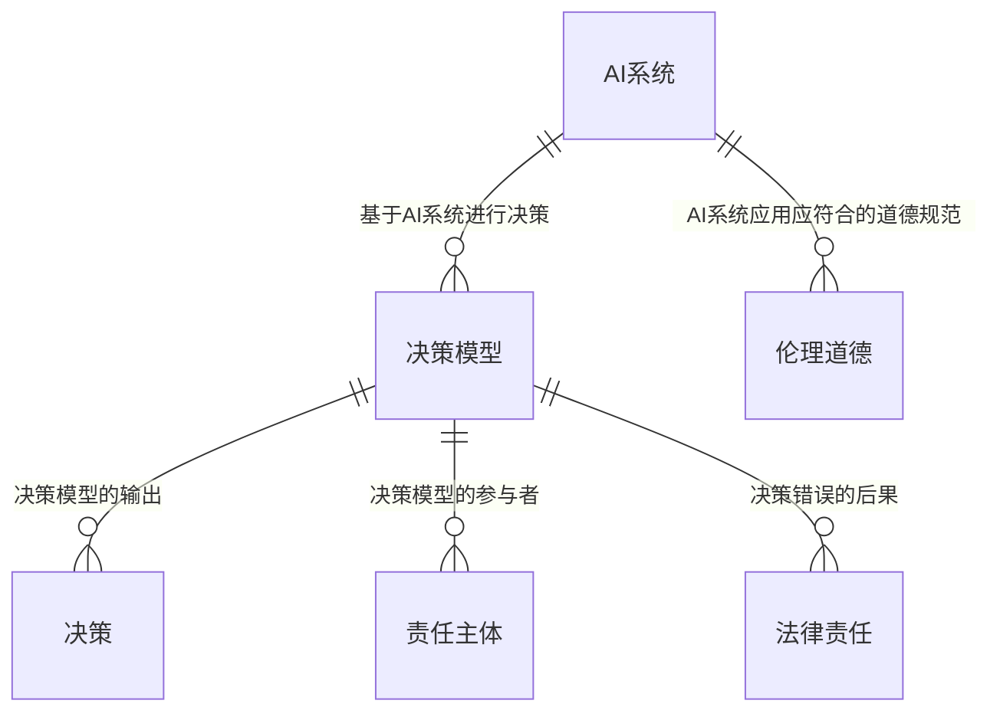
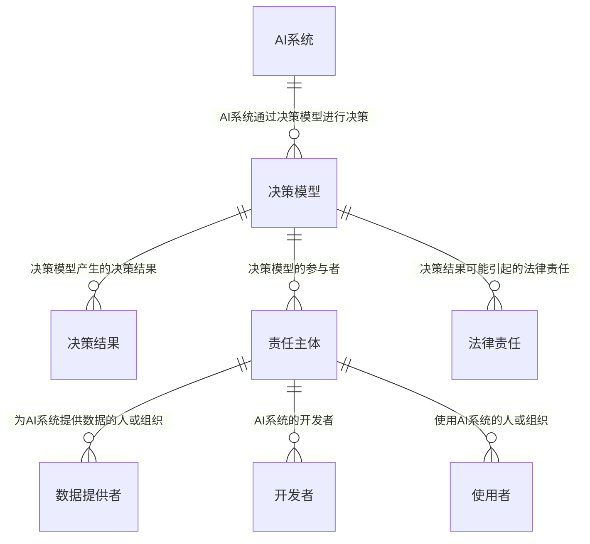
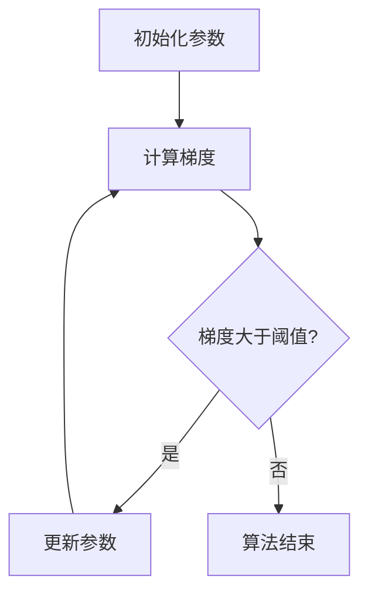
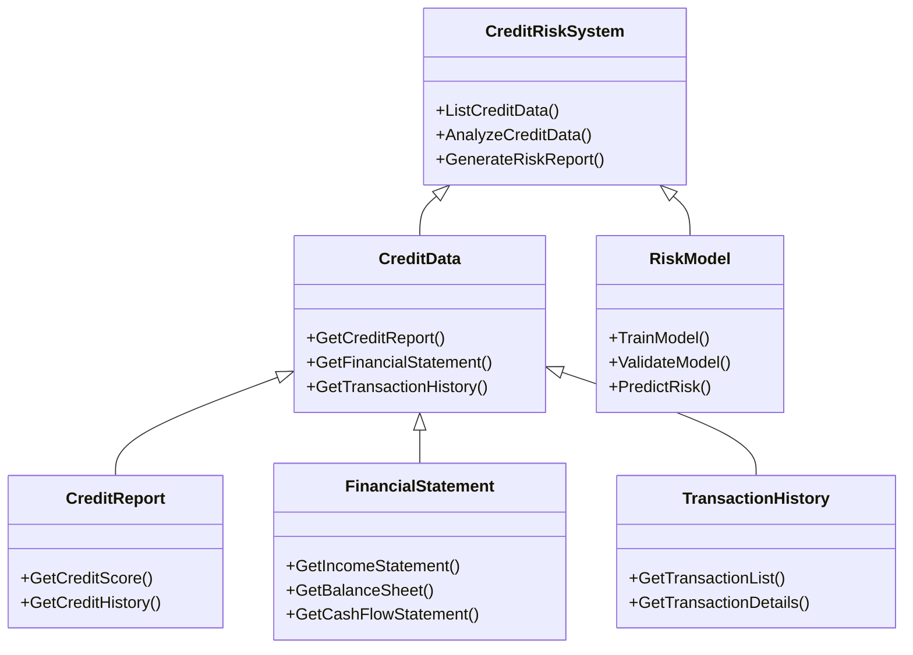
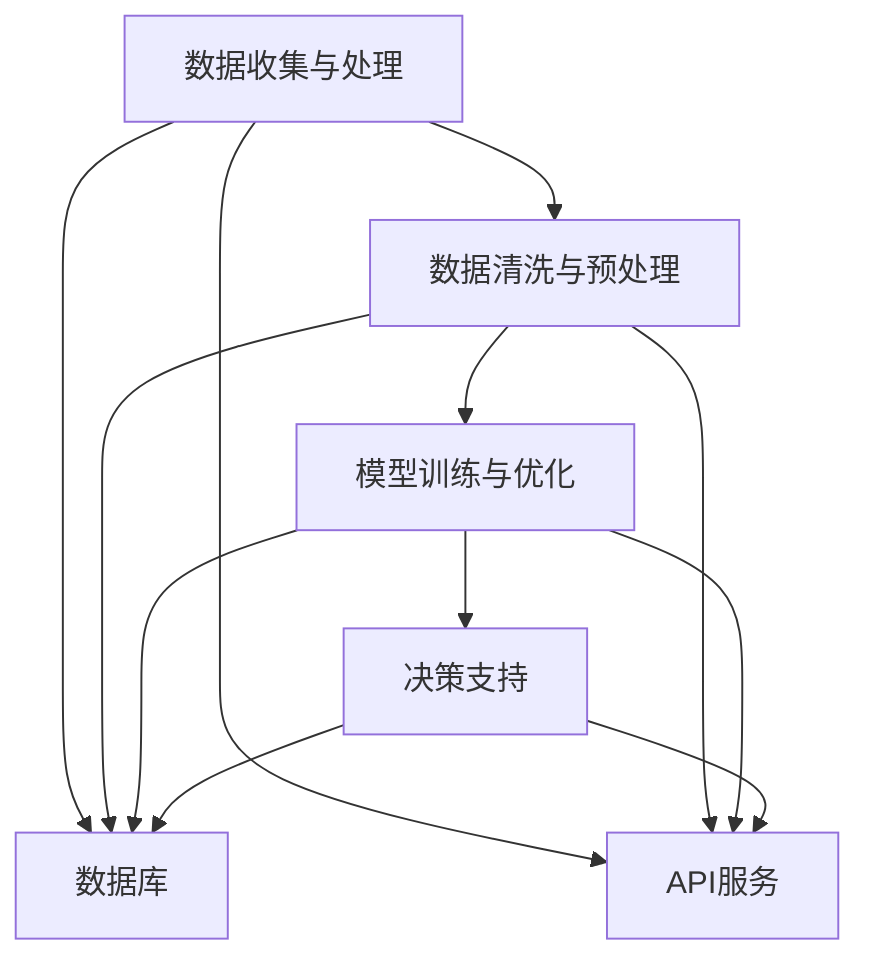
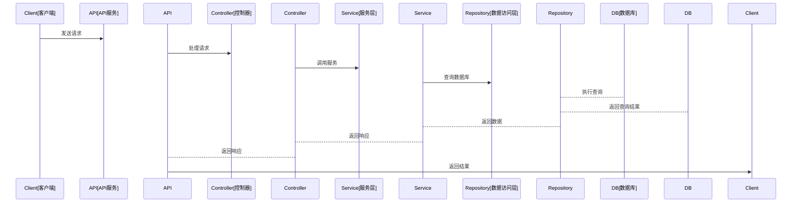
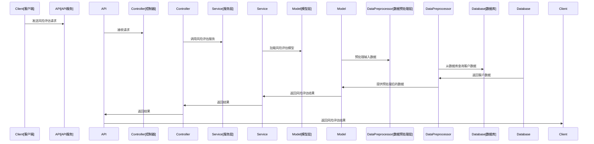

                 

### 引言

### AI决策的法律责任归属问题研究

随着人工智能（AI）技术的迅猛发展，AI系统已广泛应用于各个领域，如医疗、金融、交通等。这些智能系统通过机器学习和数据分析，能够在复杂的环境中做出高效决策。然而，随着AI系统的广泛应用，其决策责任问题也逐渐凸显。特别是在AI系统出现错误或导致损失时，如何确定责任归属成为了一个复杂且具有争议的问题。这一问题不仅涉及到技术层面的复杂性，还涉及到法律、伦理和社会等多个层面的考量。

AI决策的法律责任归属问题主要涉及以下几个方面：

1. **责任主体**：谁应该为AI系统的决策承担责任？
2. **责任形式**：AI系统的决策错误是否构成法律责任？
3. **责任范围**：AI系统的决策错误导致的损失是否应该全部由责任主体承担？
4. **责任认定**：如何认定AI系统的决策错误，以及如何确定责任主体的责任程度？

为了解决AI决策的法律责任归属问题，我们需要从以下几个方面入手：

1. **法律框架**：构建明确的法律框架，为AI决策的法律责任提供法律依据。
2. **技术标准**：制定统一的AI技术标准，确保AI系统的稳定性和可靠性。
3. **责任保险**：推动责任保险的发展，为AI系统的决策错误提供风险保障。
4. **社会共识**：加强社会对AI决策责任问题的共识，提高公众对AI技术的理解和接受度。

本文将深入探讨AI决策的法律责任归属问题，从核心概念与联系、责任主体与责任形式、法律框架与技术标准等多个方面进行分析，旨在为AI决策的法律责任提供一种可行的解决方案。

## 1.1 问题背景

### 1.1.1 人工智能技术的发展

人工智能（AI）作为一种模拟和扩展人类智能的技术，自20世纪50年代兴起以来，经历了多个发展阶段。早期的AI研究主要集中在符号主义和逻辑推理上，但随着计算能力的提升和数据量的增加，以数据驱动为主的机器学习方法逐渐成为主流。深度学习、强化学习等技术的发展，使得AI系统在图像识别、自然语言处理、决策优化等领域取得了显著的成果。

目前，AI技术已经渗透到各行各业，从智能助手到自动驾驶汽车，从智能诊断系统到金融风控系统，AI的应用场景越来越广泛。然而，随着AI技术的应用，AI系统的决策责任问题也日益凸显。

### 1.1.2 AI系统决策的应用

AI系统的决策功能是其核心之一，广泛应用于多个领域。例如，在医疗领域，AI系统可以通过分析患者的病历数据，提供诊断建议；在金融领域，AI系统可以用于风险评估和欺诈检测；在交通领域，自动驾驶技术正在逐渐成熟。这些决策过程涉及到大量的数据分析和复杂的算法模型，使得AI系统能够在短时间内做出高效决策。

然而，随着AI系统在关键领域的应用，其决策错误或不当决策可能带来严重后果。例如，自动驾驶汽车在遇到复杂路况时可能无法做出正确决策，导致交通事故；金融风控系统在识别欺诈行为时可能误判，导致经济损失。这些现实案例引发了人们对于AI决策责任的关注和讨论。

### 1.1.3 法律责任归属问题的争议

AI决策的法律责任归属问题涉及到多个法律层面，包括合同法、侵权法、刑法等。目前，关于这一问题的争议主要集中在以下几个方面：

1. **责任主体**：AI系统的决策责任应该由谁承担？是开发者、使用者还是制造商？
2. **责任形式**：AI系统的决策错误是否构成法律责任？如果构成，其法律形式是什么？
3. **责任范围**：AI系统的决策错误导致的损失是否应该全部由责任主体承担？责任范围如何界定？
4. **责任认定**：如何认定AI系统的决策错误？如何确定责任主体的责任程度？

不同国家和地区对于这一问题有不同的看法和实践。例如，美国和欧洲的一些国家已经开始制定相关法律法规，而中国在《新一代人工智能发展规划》中也提出了加强AI伦理和法律规范的措施。然而，这些问题依然没有统一解决方案，需要进一步研究和探讨。

### 1.1.4 AI决策法律责任的重要性

AI决策的法律责任问题不仅关系到技术本身，还涉及到社会、伦理和法律等多个层面。明确AI决策的法律责任，有助于规范AI技术的发展和应用，保障公众利益，促进AI技术的健康发展。同时，这也有助于提高公众对AI技术的理解和接受度，减少社会对AI技术的恐慌和抵触情绪。

总之，随着AI技术的快速发展，AI决策的法律责任归属问题已经成为一个亟待解决的重要问题。本文将从核心概念、责任主体、法律框架和技术标准等多个方面进行深入探讨，以期为这一问题提供一种可行的解决方案。

## 1.2 问题描述

### 1.2.1 责任主体问题

在AI决策的法律责任归属问题中，首先需要明确的是责任主体。责任主体指的是应当为AI系统的决策错误承担法律责任的组织或个人。根据当前的法律框架和实际情况，责任主体可能包括以下几类：

1. **开发者**：AI系统的开发者通常是拥有技术和知识的专业人士，他们负责设计和构建AI系统。在AI系统出现错误或导致损失时，开发者可能需要承担相应的法律责任。

2. **使用者**：AI系统的使用者通常是指购买或使用AI系统的组织或个人。他们可能会根据开发者提供的操作手册或指南来使用AI系统。然而，如果使用者在使用过程中存在不当操作，也可能需要承担一定的责任。

3. **制造商**：对于一些硬件设备或软件平台，制造商也可能成为责任主体。制造商可能需要为其提供的设备或平台存在的缺陷或错误承担法律责任。

### 1.2.2 责任形式问题

AI决策的法律责任形式涉及到不同类型的法律责任，包括民事责任、刑事责任和行政责任等。每种责任形式都有其特定的法律意义和适用范围。

1. **民事责任**：民事责任是AI决策错误导致损失的常见责任形式。当AI系统的决策错误导致他人遭受经济损失或人身伤害时，责任主体可能需要承担赔偿或补偿责任。民事责任的认定通常基于损害结果和因果关系，需要证明责任主体与损害结果之间存在直接的因果关系。

2. **刑事责任**：在一些严重情况下，AI系统的决策错误可能导致刑事责任。例如，当AI系统的决策错误导致严重的人身伤害或死亡时，开发者或使用者可能面临刑事指控。刑事责任的认定通常涉及故意或过失等主观因素。

3. **行政责任**：行政责任通常涉及行政机关对责任主体进行的处罚或制裁。例如，当AI系统的开发者或使用者在监管过程中存在违规行为时，行政机关可能对其采取警告、罚款、吊销许可证等措施。

### 1.2.3 责任范围问题

AI决策的法律责任范围涉及到责任主体应承担的责任程度。具体而言，责任范围可能包括以下几个方面：

1. **直接损失**：当AI系统的决策错误导致他人遭受直接经济损失时，责任主体需要承担相应的赔偿责任。直接损失通常包括经济损失、财产损失等。

2. **间接损失**：在某些情况下，AI系统的决策错误可能导致间接损失。例如，当AI系统的错误决策导致他人信誉受损时，责任主体可能需要承担相应的赔偿责任。间接损失的范围和程度可能因具体案件而异。

3. **道德责任**：除了法律层面的责任，AI系统的开发者和使用者可能还面临道德责任。道德责任涉及到对他人权益的尊重和保护，即使法律上没有明确的责任规定，开发者和使用者也应当遵守道德准则，避免造成不必要的损害。

### 1.2.4 责任认定问题

在AI决策的法律责任认定过程中，需要考虑多个因素，包括损害结果、因果关系、主观因素等。具体而言，责任认定可能涉及以下几个方面：

1. **损害结果**：责任认定首先需要确认是否存在损害结果。损害结果可能包括经济损失、人身伤害等。确认损害结果有助于确定责任主体的责任程度。

2. **因果关系**：责任认定还需要确认责任主体与损害结果之间的因果关系。需要证明AI系统的决策错误直接导致了损害结果的发生。

3. **主观因素**：在责任认定过程中，主观因素也可能影响责任主体的责任程度。例如，开发者或使用者的故意或过失程度可能影响其责任大小。

总之，AI决策的法律责任归属问题涉及多个方面，包括责任主体、责任形式、责任范围和责任认定等。解决这一问题需要综合考虑法律、技术、伦理等多个层面的因素，以制定合理的解决方案。

### 1.3 问题解决

解决AI决策的法律责任归属问题需要从多个方面入手，包括法律框架、技术标准、责任保险和社会共识等。以下将详细探讨这些方面的具体措施。

#### 1.3.1 法律框架

构建明确的法律框架是解决AI决策法律责任问题的基础。首先，需要制定一部全面的《人工智能法》，为AI技术的开发、应用和监管提供法律依据。该法律应明确AI系统的开发者和使用者的责任，规定AI决策错误的法律后果。

具体措施包括：

1. **责任主体规定**：明确AI系统开发者、使用者和其他相关方的法律责任，确保各方明确自己的责任边界。
2. **责任形式规定**：规定AI决策错误的民事责任、刑事责任和行政责任的具体形式和范围。
3. **责任认定标准**：制定明确的责任认定标准，包括损害结果、因果关系和主观因素等方面的认定标准。
4. **纠纷解决机制**：建立专门的AI决策责任纠纷解决机制，提供快速、高效的争议解决途径。

#### 1.3.2 技术标准

制定统一的技术标准，确保AI系统的稳定性和可靠性，是减少AI决策错误的关键。这些标准应涵盖AI系统的设计、开发、测试和维护等方面。

具体措施包括：

1. **设计标准**：明确AI系统的设计原则和规范，确保系统能够在复杂环境中稳定运行。
2. **开发标准**：制定AI系统的开发流程和规范，确保开发过程中的质量控制和测试。
3. **测试标准**：规定AI系统的测试标准和测试方法，确保系统能够及时发现并纠正错误。
4. **维护标准**：制定AI系统的维护规范，确保系统能够持续稳定运行。

#### 1.3.3 责任保险

推动责任保险的发展，为AI系统的决策错误提供风险保障。责任保险可以为AI系统的开发者和使用者提供经济补偿，减轻其法律风险和经济负担。

具体措施包括：

1. **保险产品开发**：保险公司应开发针对AI系统的责任保险产品，涵盖AI决策错误导致的损失。
2. **保险费率设定**：根据AI系统的风险程度和责任主体的情况，设定合理的保险费率。
3. **保险条款完善**：明确保险责任的认定标准和范围，确保保险合同的有效性和可执行性。
4. **风险评估**：建立AI系统的风险评估机制，为保险费率和保险条款的制定提供依据。

#### 1.3.4 社会共识

加强社会对AI决策责任问题的共识，提高公众对AI技术的理解和接受度，是解决这一问题的关键。这需要政府、企业和社会各界的共同努力。

具体措施包括：

1. **宣传和教育**：通过媒体、教育和宣传，提高公众对AI技术的了解和认知，消除对AI技术的误解和恐慌。
2. **行业自律**：推动AI行业自律，制定行业标准和行为准则，引导企业和从业者规范行为。
3. **法律法规宣传**：加强法律法规的宣传，使开发者、使用者和公众了解相关法律法规，提高责任意识和法律素养。
4. **国际合作**：加强国际间的交流与合作，借鉴国外先进经验和做法，共同推动AI决策责任问题的解决。

总之，解决AI决策的法律责任归属问题需要多方面的综合措施。通过构建法律框架、制定技术标准、推动责任保险和加强社会共识，可以为AI决策的法律责任提供有效的解决方案，促进AI技术的健康发展。

### 1.4 边界与外延

在探讨AI决策的法律责任归属问题时，我们需要明确一些边界与外延，这有助于更准确地界定责任的范围和主体。以下是一些关键方面的分析：

#### 1.4.1 AI系统的设计和开发责任

AI系统的设计和开发阶段是决定系统性能和可靠性的关键时期。在这一阶段，开发者需要确保系统的设计合理、算法有效、数据质量高。因此，AI系统的设计者和开发者可能承担以下责任：

1. **设计缺陷责任**：如果AI系统在设计上存在缺陷，导致决策错误，开发者可能需要承担相应的法律责任。
2. **算法错误责任**：开发者需要确保所采用的算法能够适应实际应用场景，如果算法存在错误或不足，开发者可能需要承担责任。
3. **数据质量责任**：开发者需要确保输入数据的准确性和完整性，数据质量问题可能导致AI系统做出错误的决策，开发者也可能承担相应责任。

#### 1.4.2 数据质量问题的影响

数据是AI系统决策的基础，数据质量对AI系统的性能和决策结果具有重要影响。以下情况可能会影响AI系统的决策责任归属：

1. **数据不完整**：如果AI系统因数据不完整而做出错误决策，责任主体可能是数据提供者或数据管理者。
2. **数据不准确**：如果AI系统因使用不准确的数据而做出错误决策，责任主体可能是数据提供者或数据管理者。
3. **数据泄露**：如果AI系统涉及的数据泄露，导致隐私侵犯或其他损害，责任主体可能是数据所有者或数据管理者。

#### 1.4.3 用户行为的影响

用户在使用AI系统时，其行为也可能影响决策责任归属。以下情况需要特别关注：

1. **误操作**：如果用户因操作不当导致AI系统做出错误决策，用户可能需要承担一定责任。
2. **超范围使用**：如果用户超出AI系统的设计范围或预期用途使用系统，导致决策错误，用户可能需要承担责任。
3. **系统依赖**：如果用户过度依赖AI系统的决策结果，而忽视了自身的判断和责任，也可能在决策错误的责任归属中承担一定责任。

#### 1.4.4 跨境和法律适用问题

随着AI技术的全球化发展，跨境法律适用问题也日益突出。在不同国家和地区，AI决策的法律责任认定标准和法律框架可能存在差异。以下问题需要特别注意：

1. **法律冲突**：在不同法律体系下，如何处理法律冲突，确保法律适用的统一性。
2. **跨国责任**：当AI系统在多个国家和地区运行时，如何确定责任主体的责任范围和责任形式。
3. **国际合作**：通过国际合作，建立跨国法律框架和协调机制，以解决AI决策法律责任归属问题。

总之，明确AI决策的法律责任边界与外延，有助于更精准地确定责任主体和责任形式。这不仅需要法律层面的规范，还需要技术标准、用户教育和国际合作等多方面的努力。通过建立全面的法律框架和规范体系，可以更好地保障AI技术的健康发展和社会公共利益。

### 1.5 概念结构与核心要素组成

在探讨AI决策的法律责任归属问题时，理解相关概念和它们之间的联系是至关重要的。以下是对核心概念及其相互关系的详细解释：

#### 1.5.1 人工智能（AI）

人工智能（AI）是指通过计算机程序模拟人类智能的技术。它包括多种技术，如机器学习、深度学习、自然语言处理和计算机视觉等。AI系统通过学习和分析大量数据，能够识别模式、做出预测和决策。

#### 1.5.2 决策

决策是指基于一定信息和条件，选择最合适的行动方案。在AI系统中，决策是通过算法和模型实现的。决策过程通常包括问题识别、方案生成、方案评估和方案选择。

#### 1.5.3 法律责任

法律责任是指法律规定的，当主体实施了违法行为时，所应承担的法律后果。在AI决策中，法律责任可能涉及开发者、使用者和其他相关方。法律责任包括民事责任、刑事责任和行政责任等。

#### 1.5.4 责任主体

责任主体是指应当为AI系统的决策错误承担法律责任的个人或组织。责任主体可能包括AI系统的开发者、使用者、制造商和其他相关方。责任主体的确定取决于法律框架和具体案件的情况。

#### 1.5.5 决策模型与法律责任

决策模型是AI系统进行决策的基础。它通常包括决策者、决策目标、决策方案、决策结果和决策环境。在决策模型中，法律责任是决策结果的一部分，决策错误可能导致法律责任的发生。

#### 1.5.6 法律责任与伦理道德

法律责任不仅涉及法律层面，还涉及伦理道德层面。在AI决策中，伦理道德问题如隐私保护、公平性和透明度等，也是法律责任的重要组成部分。法律责任和伦理道德相互关联，共同规范AI系统的应用和发展。

#### 1.5.7 关键概念对比表格

以下是对核心概念的定义和关系的对比表格：

| 概念        | 定义                                                      | 关系                                                         |
|-------------|-----------------------------------------------------------|--------------------------------------------------------------|
| 人工智能（AI）| 模拟人类智能的计算机系统。                                  | 基础技术，影响决策和法律责任的认定。                            |
| 决策        | 基于一定信息和条件，选择最合适的行动方案。                      | AI系统功能的核心，决策错误是法律责任产生的原因之一。              |
| 法律责任    | 法律规定的，当主体实施了违法行为时，所应承担的法律后果。            | 法律后果，涉及责任主体和责任形式。                                |
| 责任主体    | 应为AI系统的决策错误承担法律责任的个人或组织。                     | 确定责任归属的关键，包括开发者、使用者等。                          |
| 决策模型    | 决策模型包括决策者、决策目标、决策方案、决策结果和决策环境。        | 决策模型的输出影响法律责任，决策错误可能导致法律责任。                |
| 伦理道德    | 伦理道德涉及AI技术的应用是否符合道德规范。                          | 与法律责任紧密相关，共同规范AI技术的应用和发展。                      |

#### 1.5.8 ER实体关系图架构

以下是一个ER（实体关系）图架构，展示了核心概念之间的关联：



通过上述核心概念及其关系的分析，我们可以更好地理解AI决策的法律责任归属问题，为其提供合理的解决方案。

### 1.6 本章小结

本章从问题背景、问题描述、问题解决、边界与外延以及概念结构与核心要素组成等方面，对AI决策的法律责任归属问题进行了详细阐述。首先，我们介绍了人工智能技术的发展及其在各个领域的应用，强调了AI决策责任问题的现实性和紧迫性。接着，我们对AI决策的法律责任归属问题进行了具体描述，包括责任主体、责任形式、责任范围和责任认定等方面的争议。然后，我们提出了解决这一问题的多种途径，如法律框架的构建、技术标准的制定、责任保险的推动和社会共识的加强。此外，我们还探讨了问题的边界与外延，如AI系统的设计和开发责任、数据质量问题的影响以及用户行为的影响。最后，我们详细分析了核心概念的结构与联系，为后续章节的深入探讨奠定了基础。通过本章的讨论，我们希望为AI决策的法律责任归属问题提供一种全面且可行的解决方案。

## 第2章：核心概念与联系

### 2.1 AI决策的基本原理

#### 2.1.1 决策理论

决策理论是研究决策过程和决策方法的学科，它为AI决策提供了理论基础。决策模型是决策理论的核心，通常包括以下四个基本要素：

1. **决策者**：决策者是指做出决策的个人或组织。
2. **决策目标**：决策目标是指决策者希望实现的结果或目标。
3. **决策方案**：决策方案是指决策者可以选择的行动方案。
4. **决策结果**：决策结果是指决策者选择某个方案后得到的结果。

在决策过程中，决策者需要识别问题，生成可能的解决方案，评估每个方案的可能结果，并选择最佳方案。这个过程可以用决策树或决策矩阵来表示。

#### 2.1.2 决策模型的基本构成

决策模型的基本构成包括以下部分：

1. **决策环境**：决策环境是指决策者在做出决策时所处的环境和条件。
2. **决策者**：决策者拥有有限的信息和知识，并基于这些信息做出决策。
3. **决策目标**：决策目标可以是单一目标，也可以是多目标。多目标决策需要权衡各个目标的优先级。
4. **决策方案**：决策方案是决策者根据决策环境和决策目标提出的行动方案。
5. **决策结果**：决策结果是决策者选择某个方案后得到的结果，包括预期结果和实际结果。

#### 2.1.3 决策过程

决策过程通常包括以下步骤：

1. **问题识别**：识别需要解决的问题或机会。
2. **方案生成**：根据问题识别的结果，生成可能的解决方案。
3. **方案评估**：评估每个方案的优点和缺点，选择最优或最满意的方案。
4. **方案选择**：从评估结果中选择一个方案进行实施。
5. **实施与监控**：实施所选方案，并持续监控决策结果，根据实际情况进行调整。

#### 2.1.4 机器学习与AI决策

机器学习是AI决策的核心技术之一，它通过数据学习和模式识别，帮助AI系统做出智能决策。机器学习的基本概念包括：

1. **监督学习**：监督学习是一种从标记数据中学习的方法，输出是已知的，模型通过学习标记数据来预测未知数据的输出。
2. **无监督学习**：无监督学习是一种从未标记数据中学习的方法，模型的输出是未知的，模型通过学习数据分布来发现数据中的模式。
3. **强化学习**：强化学习是一种通过试错和奖励机制来学习的方法，模型通过与环境的互动来学习最优策略。

在AI决策中，机器学习算法可以根据数据和历史经验，生成决策模型，并在新的情境下进行预测和决策。常见的机器学习算法包括决策树、支持向量机、神经网络和深度学习等。

### 2.2 法律责任的定义与特征

#### 2.2.1 法律责任的定义

法律责任是指法律规定的，当主体实施了违法行为时，所应承担的法律后果。法律责任是法律制度的重要组成部分，旨在维护社会秩序和公共利益。法律责任通常包括民事责任、刑事责任和行政责任等。

1. **民事责任**：民事责任是指因违反合同、侵权等民事行为而产生的赔偿责任。民事责任通常涉及财产损失、人身伤害等。
2. **刑事责任**：刑事责任是指因违反刑法规定而产生的责任，包括罚金、监禁等。
3. **行政责任**：行政责任是指因违反行政法律法规而产生的责任，包括行政处罚、行政处分等。

#### 2.2.2 法律责任的特征

1. **法律性**：法律责任是基于法律规定而产生的，具有法律效力。
2. **强制性**：法律责任具有强制性，责任主体必须履行。
3. **确定性**：法律责任是明确的，责任主体和责任形式是法定的。

### 2.3 AI决策与法律责任的关系

AI决策与法律责任之间存在密切的联系。首先，AI决策的结果可能会影响法律责任的发生和大小。其次，AI决策的过程和机制也需要符合法律的要求，以确保决策的合法性和公正性。

#### 2.3.1 AI决策的法律责任归属

AI决策的法律责任归属问题主要涉及以下方面：

1. **责任主体的确定**：谁应该为AI系统的决策错误承担责任？
2. **责任形式的确定**：AI系统的决策错误是否构成法律责任？如果构成，其法律形式是什么？
3. **责任范围的确定**：AI系统的决策错误导致的损失是否应该全部由责任主体承担？责任范围如何界定？
4. **责任认定的标准**：如何认定AI系统的决策错误？如何确定责任主体的责任程度？

#### 2.3.2 AI决策的法律责任形式

AI决策的法律责任形式包括民事责任、刑事责任和行政责任等。每种责任形式都有其特定的适用条件和法律后果。

1. **民事责任**：当AI系统的决策错误导致他人遭受经济损失或人身伤害时，责任主体可能需要承担民事责任。民事责任通常涉及财产赔偿、精神赔偿等。
2. **刑事责任**：在AI系统的决策错误导致严重后果，如重大事故、重大经济损失等时，责任主体可能需要承担刑事责任。
3. **行政责任**：当AI系统的决策错误违反了行政法律法规，责任主体可能需要承担行政责任，如行政处罚、行政处分等。

#### 2.3.3 AI决策与法律责任的关系对比表格

以下是对AI决策与法律责任关系的对比表格：

| 概念        | 定义                                                      | 关系                                                         |
|-------------|-----------------------------------------------------------|--------------------------------------------------------------|
| 人工智能（AI）| 模拟人类智能的计算机系统。                                  | 影响决策过程和结果，决定法律责任的认定。                          |
| 决策        | 基于一定信息和条件，选择最合适的行动方案。                      | 决策错误可能导致法律责任，是法律责任认定的依据。                     |
| 法律责任    | 法律规定的，当主体实施了违法行为时，所应承担的法律后果。            | 法律后果，由决策错误触发，涉及责任主体和责任形式。                    |
| 责任主体    | 应为AI系统的决策错误承担法律责任的个人或组织。                     | 决策错误的直接责任主体，包括开发者、使用者等。                          |
| 法律责任形式 | 民事责任、刑事责任和行政责任等。                               | 法律责任的具体表现形式，根据决策错误的不同情况确定。                     |

通过以上分析，我们可以看到，AI决策与法律责任之间存在紧密的联系。理解这些核心概念和它们之间的关系，有助于我们更深入地探讨AI决策的法律责任归属问题，并为制定合理的法律框架提供依据。

### 2.4 关键概念对比表格

在讨论AI决策的法律责任归属问题时，理解各关键概念之间的区别和联系是非常重要的。以下是一个关键概念对比表格，用于阐明这些概念的定义、属性和相互关系。

| 概念        | 定义                                                      | 属性                                               | 关系                                                         |
|-------------|-----------------------------------------------------------|------------------------------------------------------|--------------------------------------------------------------|
| 人工智能（AI）| 模拟人类智能的计算机系统。                                  | 自主性、智能性、算法驱动                                       | 影响决策模型和法律责任认定。                                     |
| 决策模型    | 基于数据和算法的决策过程。                                   | 决策者、目标、方案、结果                                       | 决策模型影响法律责任的认定和责任主体的确定。                        |
| 法律责任    | 法律规定的，因违法行为应承担的法律后果。                        | 法律性、强制性、确定性                                       | 法律责任的产生和承担取决于AI决策的结果。                            |
| 责任主体    | 应为AI决策错误承担法律责任的人或组织。                          | 法律地位、行为能力、责任能力                                     | 责任主体的确定是法律责任认定的关键。                                |
| 法律标准    | 法律规定的衡量责任主体行为合法性和责任大小的标准。                | 法律依据、适用范围、裁量权                                       | 法律标准是判断责任主体是否违法和应承担何种责任的依据。                  |
| 数据质量    | 数据的准确性、完整性、可靠性和相关性。                          | 数据源、数据处理、数据存储                                       | 数据质量直接影响AI决策的准确性和可靠性，进而影响法律责任。                |

#### 2.4.1 AI决策与法律责任的关系

AI决策与法律责任之间的联系主要体现在以下几个方面：

1. **决策结果与法律责任**：AI决策的结果直接影响到法律责任的认定。如果AI系统做出了错误的决策，导致损害发生，责任主体可能需要承担相应的法律责任。
2. **责任主体的确定**：在AI决策中，责任主体可能包括开发者、使用者、数据提供者等。责任主体的确定需要依据法律框架和具体案情，确保责任的公平和合理。
3. **法律标准的适用**：在AI决策中，法律标准是判断责任主体行为合法性和责任大小的依据。这些标准包括民事责任、刑事责任和行政责任等，需要具体案件具体分析。
4. **数据质量的影响**：数据质量对AI决策的准确性和可靠性有直接影响。如果数据存在质量问题，可能会导致AI决策错误，进而引发法律责任。

通过以上对比表格和分析，我们可以更清晰地理解AI决策与法律责任之间的关系，这有助于我们在实际应用中更好地处理和解决AI决策的法律责任问题。

### 2.5 AI决策与法律责任的实体关系图

为了更直观地理解AI决策与法律责任之间的实体关系，我们可以使用Mermaid语言绘制一个ER（实体关系）图。以下是一个示例ER图，展示了AI决策中的关键实体及其相互关系：



#### ER图解释

1. **AI系统**：这是AI决策的起点，通过决策模型进行决策。
2. **决策模型**：这是AI系统做出决策的核心，它包括决策者、决策目标、决策方案和决策结果等要素。
3. **决策结果**：决策模型产生的结果，是AI系统决策的最终输出。
4. **责任主体**：参与决策模型的人或组织，包括数据提供者、开发者、使用者等。
5. **法律责任**：决策结果可能引发的法定后果，责任主体需要承担的法律责任。

通过这个ER图，我们可以清晰地看到AI决策与法律责任之间的逻辑关系。决策模型的决策结果直接影响法律责任，而责任主体则根据其参与决策的行为和决策结果承担相应的法律责任。这一图示有助于我们更深入地理解和分析AI决策的法律责任问题。

### 2.6 决策模型与法律责任的关系

#### 2.6.1 决策模型的基本原理

决策模型是AI系统进行决策的基础，其原理包括以下几个方面：

1. **信息收集**：决策模型首先需要收集与决策相关的信息，包括内部数据和外部数据。这些数据可能涉及市场需求、用户反馈、历史记录等。
2. **模型构建**：基于收集到的信息，构建决策模型。这通常涉及选择合适的算法和模型结构，如线性回归、决策树、神经网络等。
3. **模型训练**：通过训练数据集，训练决策模型，使其能够学习和预测。训练过程中，模型会不断调整参数，以优化决策结果。
4. **决策生成**：在决策阶段，模型根据输入的数据和训练结果，生成决策建议或决策结果。决策结果可能是一个具体的行动方案，也可能是一个概率分布。
5. **结果评估**：评估决策结果的优劣，包括预测准确性、响应速度、资源消耗等。根据评估结果，对模型进行调整和优化。

#### 2.6.2 决策模型与法律责任的关系

决策模型与法律责任之间存在密切的关系，主要体现在以下几个方面：

1. **决策结果的合法性**：决策模型生成的结果需要符合法律要求。如果决策结果违反法律规定，责任主体可能需要承担法律责任。
2. **决策过程的透明性**：决策模型需要具备透明性，使责任主体能够了解决策的依据和过程。这有助于在发生争议时，责任主体能够提供合理的解释和依据。
3. **决策错误的后果**：决策模型在运行过程中可能出现错误，导致决策结果不准确或不可行。这些错误可能导致经济损失、人身伤害或其他损害，责任主体需要对此承担法律责任。
4. **责任主体的确定**：在决策模型中，责任主体通常包括开发者、使用者和其他相关方。责任主体的确定需要基于法律规定和实际情况，确保责任的公平和合理。

#### 2.6.3 决策模型的常见问题与法律责任

在AI决策中，常见的决策模型问题包括：

1. **数据偏差**：数据偏差可能导致决策结果不准确。如果数据偏差是因开发者故意或过失导致的，开发者可能需要承担法律责任。
2. **算法缺陷**：算法缺陷可能导致决策模型无法正常工作或产生错误决策。如果算法缺陷是因开发者设计不当导致的，开发者可能需要承担法律责任。
3. **模型过拟合**：过拟合可能导致模型在训练数据上表现良好，但在新数据上表现不佳。如果过拟合是因开发者没有充分测试和验证模型导致的，开发者可能需要承担法律责任。
4. **数据泄露**：数据泄露可能导致用户的隐私受到侵犯。如果数据泄露是因开发者或使用者安全措施不当导致的，责任主体可能需要承担法律责任。

在上述情况下，责任主体可能需要承担以下法律责任：

1. **民事责任**：当决策错误导致他人遭受经济损失时，责任主体可能需要承担民事责任，如赔偿经济损失。
2. **刑事责任**：当决策错误导致严重后果，如人身伤害或重大经济损失时，责任主体可能需要承担刑事责任，如监禁或罚金。
3. **行政责任**：当决策错误违反了行政法律法规，责任主体可能需要承担行政责任，如警告、罚款或吊销许可证。

总之，决策模型与法律责任之间的关系是复杂的，需要综合考虑决策结果、决策过程、责任主体和法律责任形式等多个因素。明确这些关系有助于在发生决策错误时，为责任主体的法律责任提供明确的依据和指导。

### 2.7 法律责任归属问题的挑战与解决方案

#### 2.7.1 挑战

在AI决策的法律责任归属问题上，我们面临着诸多挑战。以下是一些主要挑战及其复杂性：

1. **责任主体的确定**：AI系统的复杂性和参与者的多样性使得责任主体的确定变得复杂。责任主体可能包括开发者、使用者、数据提供者等多个角色，如何明确各方的责任边界成为一大难题。
2. **因果关系的认定**：AI决策过程中，因果关系的认定尤为复杂。由于AI系统通常依赖于大量数据和复杂的算法，确定决策错误与具体损失之间的因果关系往往需要深入的技术分析和专业判断。
3. **法律标准的适用**：现有法律体系在处理AI决策责任问题时，可能缺乏明确的法律标准和适用条款。这导致在处理实际案件时，法律适用具有较大的不确定性。
4. **技术发展速度与法律更新滞后**：AI技术发展迅速，而法律更新往往滞后，导致法律规范无法及时适应新技术的发展。这增加了法律体系应对AI决策责任问题的难度。
5. **跨国法律冲突**：在全球范围内，不同国家和地区对于AI决策责任问题的法律规定和执行存在差异，跨国法律冲突增加了责任归属问题的复杂性。

#### 2.7.2 解决方案

针对上述挑战，以下是一些可能的解决方案：

1. **明确责任主体的界定**：通过法律法规明确各参与方的责任边界，例如开发者负责算法的设计和优化，使用者负责系统的操作和监控等。这有助于在发生问题时，快速确定责任主体，简化责任认定过程。
2. **建立因果关系认定标准**：制定科学、合理的因果关系认定标准，利用人工智能和大数据分析技术，帮助判断决策错误与损失之间的因果关系。例如，可以采用统计方法、因果推断模型等。
3. **完善法律标准体系**：加快法律标准的更新和制定，确保法律规范能够及时适应AI技术的发展。例如，可以引入专门针对AI决策责任问题的法律法规，提供明确的法律依据和操作指南。
4. **加强国际合作**：通过国际交流和合作，建立跨国法律协调机制，解决跨国法律冲突。例如，可以制定国际AI决策责任框架，提供全球适用的法律标准和执行指南。
5. **技术监督与责任保险**：推动技术监督机制的发展，确保AI系统的安全性和可靠性。同时，鼓励责任保险的发展，为AI决策错误提供风险保障，减轻责任主体的经济负担。

通过这些解决方案，我们可以逐步解决AI决策的法律责任归属问题，为AI技术的健康发展提供有力的法律保障。

### 2.8 AI决策法律责任问题在不同国家和地区的实践比较

在探讨AI决策的法律责任问题时，不同国家和地区的法律体系、技术发展水平和应用场景都对其有着重要影响。以下是对美国、欧洲和中国在AI决策法律责任问题上的实践进行比较。

#### 美国的实践

1. **立法与规范**：美国尚未有统一的AI法律，但相关立法和规范正在逐步完善。例如，《2021年美国创新法案》（American Innovation and Choice Online Act）提出了对算法偏见和数据透明性的要求。此外，美国联邦贸易委员会（FTC）和各州法律也在处理AI决策责任方面发挥重要作用。
2. **责任主体**：在美国，责任主体通常包括AI系统的开发者、运营商和数据提供者。如果AI系统造成损害，责任主体需要证明其无过错或损害是由于不可抗力或受害者自身原因造成的。
3. **赔偿责任**：美国法律在处理AI决策错误导致的损害赔偿时，通常采用过失责任原则，即责任主体需要证明其存在过失才能被追究责任。

#### 欧洲的实践

1. **立法与规范**：欧洲在AI决策的法律责任问题上采取了更为严格的态度。例如，《通用数据保护条例》（GDPR）和《人工智能法》（AI Act）都对AI系统的透明性、公平性和责任承担提出了明确要求。
2. **责任主体**：在欧洲，AI系统的开发者、运营商和数据提供者都可能成为责任主体。此外，欧盟规定，当AI系统产生错误决策导致损害时，责任主体需要承担全部或部分赔偿责任。
3. **赔偿责任**：欧洲法律倾向于保护消费者和用户的权益，要求责任主体在AI系统造成损害时，承担赔偿责任，并可能包括精神损害赔偿。

#### 中国的实践

1. **立法与规范**：中国在AI决策法律责任问题上的立法工作也在进行中。例如，《新一代人工智能发展规划》提出了加强AI伦理和法律规范的要求。此外，一些地方性法规，如《北京市人工智能发展条例》，也对AI决策责任进行了规定。
2. **责任主体**：在中国，AI系统的开发者、运营者和数据提供者通常承担主要责任。如果AI系统造成损害，责任主体需要证明其无过错或损害是由于不可抗力或受害者自身原因造成的。
3. **赔偿责任**：中国法律在处理AI决策错误导致的损害赔偿时，也采用过失责任原则，但在某些情况下，可能会考虑严格责任原则，即即使责任主体无过失，也可能需要承担部分赔偿责任。

#### 比较与启示

通过对美国、欧洲和中国在AI决策法律责任问题上的实践进行比较，我们可以得到以下启示：

1. **立法先行**：不同国家和地区都认识到AI决策法律责任问题的重要性，并通过立法和规范来解决。这表明，制定明确的法律框架是解决这一问题的关键。
2. **责任主体的多样性**：在AI决策中，责任主体可能包括开发者、运营商和数据提供者等多个角色，如何合理界定各方的责任边界是立法和规范的核心问题。
3. **赔偿责任的原则**：在处理AI决策错误导致的损害赔偿时，不同国家和地区采取了不同的赔偿责任原则。这表明，在制定法律规范时，需要综合考虑技术发展的现状和公众利益。

总之，通过比较不同国家和地区的实践，我们可以借鉴其经验，为制定符合国情的AI决策法律责任提供参考。

### 2.9 AI决策法律责任问题的未来发展趋势

随着人工智能技术的不断进步，AI决策法律责任问题也呈现出新的发展趋势。以下是对未来发展趋势的预测：

#### 2.9.1 法律规范的进一步完善

随着AI技术的普及和应用，各国法律体系将继续完善，以应对AI决策法律责任问题。预计未来会出现更多的专门立法，如《人工智能法》等，以明确AI系统的开发、应用和监管规范。此外，现有的法律法规也将进行修订，以适应AI技术发展的新需求。

#### 2.9.2 责任主体认定标准的细化

在AI决策中，责任主体的认定将变得更加复杂。未来，法律规范可能会细化责任主体的认定标准，明确不同角色的责任边界，例如AI系统开发者、运营商、数据提供者等。这有助于在发生争议时，快速确定责任主体，减少法律纠纷。

#### 2.9.3 责任赔偿机制的创新

面对AI决策错误可能导致的各种损失，未来责任赔偿机制也将进行创新。例如，可能会出现专门针对AI决策错误的保险产品，为开发者、运营商和用户提供经济补偿。此外，责任赔偿机制可能会引入经济惩罚性赔偿，以强化责任主体的法律责任。

#### 2.9.4 国际合作与协调

随着AI技术的全球化发展，国际合作和协调将变得更加重要。未来，各国可能会通过签订国际协议、建立跨国协调机制等方式，共同制定AI决策法律责任的标准和规范。这有助于减少跨国法律冲突，确保AI技术在全球范围内的健康发展。

#### 2.9.5 伦理与法律规范的融合

在AI决策中，伦理问题与法律责任紧密相关。未来，伦理规范和法律规范将更加融合，确保AI技术的应用符合道德和法律规定。例如，可能会出台针对AI算法偏见、隐私保护等方面的伦理规范，并将其纳入法律责任范畴。

#### 2.9.6 技术监督与监管体系的建立

随着AI技术的复杂性和应用范围的扩大，技术监督和监管体系将逐步建立。未来，政府、企业和学术界将共同努力，建立AI决策的技术监督机制，确保AI系统的安全性和可靠性。同时，监管机构将加强对AI系统的监管，确保其合规运行。

总之，未来AI决策法律责任问题的发展趋势将体现在法律规范进一步完善、责任主体认定标准细化、责任赔偿机制创新、国际合作与协调、伦理与法律规范融合以及技术监督与监管体系建立等方面。这些趋势将为AI技术的健康发展提供有力的法律保障。

### 2.10 小结

本章从AI决策的基本原理、法律责任定义、责任主体认定、决策模型与法律责任的关系以及不同国家和地区的实践等多个方面，深入探讨了AI决策的法律责任归属问题。首先，我们介绍了决策理论的基本原理和决策模型的基本构成，阐述了决策过程中涉及的要素和步骤。接着，我们分析了法律责任的定义和特征，以及AI决策与法律责任之间的紧密联系。然后，我们通过具体案例，探讨了责任主体认定和因果关系认定的复杂性。在对比了不同国家和地区的实践后，我们提出了未来发展趋势的预测。通过这些分析，我们为AI决策的法律责任归属问题提供了全面且深入的探讨，为制定合理的法律框架和规范体系奠定了基础。希望这些内容能够为读者理解和解决AI决策法律责任问题提供有益的启示。

## 第3章：决策模型与算法原理

### 3.1 决策模型的类型及其应用

决策模型是AI系统进行决策的基础，根据不同的应用场景和决策需求，可以分为多种类型。以下是一些常见的决策模型及其应用：

#### 3.1.1 监督学习模型

监督学习模型是一种在已知输入和输出之间关系的基础上，通过学习数据集来预测新的输入数据的模型。常见的监督学习模型包括：

1. **线性回归**：线性回归模型通过建立输入和输出之间的线性关系，来预测新的输入数据。它广泛应用于金融预测、风险评估等领域。
2. **决策树**：决策树模型通过一系列条件判断，将数据集划分为不同的子集，并最终得到一个预测结果。它常用于分类和回归任务中。
3. **支持向量机（SVM）**：SVM模型通过找到最佳分割超平面，将不同类别的数据分开，从而进行分类或回归。它广泛应用于图像识别、文本分类等领域。

#### 3.1.2 无监督学习模型

无监督学习模型是在没有明确输出标签的情况下，通过学习数据分布来发现数据中的模式。常见的无监督学习模型包括：

1. **聚类分析**：聚类分析模型将相似的数据点划分到同一个类别中，从而发现数据中的隐含结构。常见的聚类算法包括K-means、层次聚类等。它广泛应用于市场细分、社交网络分析等领域。
2. **主成分分析（PCA）**：PCA模型通过将数据投影到新的坐标系中，减少数据的维度，从而提取数据的主要特征。它广泛应用于数据降维、特征提取等领域。
3. **关联规则学习**：关联规则学习模型通过挖掘数据之间的关联关系，发现频繁出现的规则。常见的算法包括Apriori算法和FP-growth算法。它广泛应用于市场篮子分析、推荐系统等领域。

#### 3.1.3 强化学习模型

强化学习模型通过试错和奖励机制来学习最优策略。常见的强化学习模型包括：

1. **Q-Learning**：Q-Learning模型通过不断更新Q值，找到最优动作序列。它广泛应用于游戏、自动驾驶等领域。
2. **深度Q网络（DQN）**：DQN模型通过使用深度神经网络来预测Q值，从而学习最优策略。它广泛应用于复杂环境的决策问题，如DeepMind的AlphaGo。
3. **策略梯度方法**：策略梯度方法通过直接优化策略参数来学习最优策略。它广泛应用于机器人控制、金融交易等领域。

#### 3.1.4 应用实例

以下是一些AI决策模型的实际应用实例：

1. **金融风险评估**：使用线性回归模型预测股票市场的走势，为投资者提供决策支持。
2. **推荐系统**：使用协同过滤算法和关联规则学习算法，为用户推荐个性化商品或内容。
3. **自动驾驶**：使用深度学习模型对环境进行感知，并使用强化学习模型进行路径规划和决策。
4. **医疗诊断**：使用决策树和神经网络模型，对患者的病情进行诊断和预测。
5. **交通流量预测**：使用时间序列分析和聚类分析模型，预测未来的交通流量，为交通管理提供决策支持。

通过以上不同类型的决策模型及其应用实例，我们可以看到决策模型在AI系统中的应用广泛且多样，为AI决策提供了强大的工具和支持。

### 3.2 算法原理讲解

#### 3.2.1 算法基本概念

算法是计算机科学和人工智能中的核心概念，指的是通过一系列有序操作来解决特定问题的步骤和方法。在AI决策中，算法扮演着至关重要的角色，它们通过学习和分析数据，使系统能够在复杂的环境中做出有效的决策。以下是一些常见算法的基本概念：

1. **算法的组成部分**：算法通常包括输入、输出、处理逻辑和终止条件。输入是指算法开始执行时接收的数据，输出是指算法执行后生成的结果，处理逻辑是指算法对输入数据进行操作的具体步骤，终止条件是指算法在何时停止执行。
2. **算法的分类**：根据算法处理数据的方式和目的，可以分为多种类型，如搜索算法、排序算法、图算法、机器学习算法等。
3. **算法的评价标准**：评价算法的性能通常基于时间复杂度、空间复杂度、准确率、召回率、F1分数等指标。

#### 3.2.2 算法原理图

为了更好地理解算法原理，我们可以使用Mermaid语言绘制算法流程图。以下是一个简单的线性回归算法的流程图示例：



这个流程图展示了线性回归算法的基本步骤：初始化参数、计算梯度、判断梯度是否大于阈值，如果是，则更新参数，否则算法结束。

#### 3.2.3 算法示例

以下是使用Python实现的线性回归算法示例：

```python
import numpy as np

# 线性回归算法
def linear_regression(X, y, learning_rate, num_iterations):
    # 初始化参数
    theta = np.zeros(X.shape[1])
    
    # 迭代过程
    for _ in range(num_iterations):
        # 计算预测值
        predictions = X.dot(theta)
        
        # 计算损失
        errors = predictions - y
        
        # 计算梯度
        gradient = X.T.dot(errors)
        
        # 更新参数
        theta -= learning_rate * gradient
        
    return theta

# 数据准备
X = np.array([[1, 2], [2, 3], [3, 4], [4, 5]])
y = np.array([3, 4, 5, 6])

# 模型训练
theta = linear_regression(X, y, learning_rate=0.01, num_iterations=1000)

# 打印结果
print("Theta:", theta)
```

在这个示例中，我们定义了一个简单的线性回归算法，并通过一个示例数据集进行训练。算法通过迭代计算梯度，并更新参数，直到达到预设的迭代次数或梯度小于阈值。

通过以上算法讲解，我们可以看到算法原理的实现过程和步骤，以及如何使用Python代码进行具体操作。这为我们理解AI决策算法提供了直观的示例和参考。

### 3.3 数学公式与算法模型

在AI决策中，数学模型和公式是理解和实现算法的核心。以下是一些常见数学公式和算法模型，以及它们在决策过程中的应用。

#### 3.3.1 线性回归模型

线性回归是一种常用的监督学习算法，用于预测连续值。其基本公式为：

\[ y = \beta_0 + \beta_1x \]

其中，\( y \) 是预测值，\( \beta_0 \) 是截距，\( \beta_1 \) 是斜率，\( x \) 是输入特征。

通过最小二乘法，我们可以最小化误差平方和，得到最优参数：

\[ \beta_1 = \frac{\sum(x_i - \bar{x})(y_i - \bar{y})}{\sum(x_i - \bar{x})^2} \]
\[ \beta_0 = \bar{y} - \beta_1\bar{x} \]

其中，\( \bar{x} \) 和 \( \bar{y} \) 分别是输入特征和预测值的平均值。

#### 3.3.2 决策树模型

决策树是一种常用的分类算法，其基本公式为：

\[ f(x) = \begin{cases} 
c_k & \text{if } x \in R_k \\
\text{split} & \text{if } x \in R \setminus \cup_{k=1}^{K} R_k
\end{cases} \]

其中，\( f(x) \) 是决策函数，\( c_k \) 是类标签，\( R_k \) 是第 \( k \) 个分支区域。

在决策树中，每个节点通过计算特征与阈值的关系，将数据划分为不同的区域，直到满足停止条件（如达到最大深度或节点纯度）。

#### 3.3.3 支持向量机（SVM）

支持向量机是一种常用的分类和回归算法，其基本公式为：

\[ w \cdot x + b = 0 \]

其中，\( w \) 是权重向量，\( x \) 是输入特征，\( b \) 是偏置。

SVM的目标是找到最佳分割超平面，使得正负样本之间的间隔最大化。通过求解二次规划问题，可以得到最优权重向量 \( w \) 和偏置 \( b \)。

#### 3.3.4 深度学习模型

深度学习模型是一种通过多层神经网络进行数据学习和预测的方法。其基本公式为：

\[ z_l = W_l \cdot a_{l-1} + b_l \]
\[ a_l = \sigma(z_l) \]

其中，\( z_l \) 是第 \( l \) 层的净输入，\( W_l \) 是权重矩阵，\( b_l \) 是偏置，\( a_l \) 是激活值，\( \sigma \) 是激活函数（如ReLU、Sigmoid、Tanh等）。

在深度学习中，通过反向传播算法，不断更新权重和偏置，使模型在训练数据上达到最小化损失函数。

通过以上数学公式和算法模型，我们可以看到AI决策过程中的核心数学原理和方法。这些公式和模型为AI决策提供了坚实的理论基础，帮助我们在实际应用中实现高效的决策系统。

### 3.4 通俗易懂的算法示例

为了更好地理解AI决策算法，我们将通过一个具体的例子来展示线性回归算法的实现过程。线性回归是一种简单的预测算法，用于预测一个连续的数值。以下是一个基于Python实现的线性回归算法示例：

#### 数据准备

我们首先准备一组数据，包括输入特征 \( x \) 和对应的输出值 \( y \)：

```python
# 输入特征和输出值
x = np.array([1, 2, 3, 4, 5])
y = np.array([2, 4, 5, 4, 5])
```

在这个例子中，我们假设输入特征和输出值之间存在线性关系。

#### 算法实现

接下来，我们使用最小二乘法实现线性回归算法。最小二乘法的目的是找到最佳拟合直线，使其与数据点的误差最小。

```python
# 线性回归算法实现
def linear_regression(x, y):
    # 计算斜率
    m = (x.mean() * y.mean() - x.dot(y)) / (x.mean()**2)
    # 计算截距
    b = y.mean() - m * x.mean()
    return m, b

# 计算斜率和截距
m, b = linear_regression(x, y)

# 打印结果
print("斜率 m:", m)
print("截距 b:", b)
```

在这个算法中，我们首先计算斜率 \( m \) 和截距 \( b \)，然后使用这两个参数来构建线性回归模型。

#### 模型预测

接下来，我们使用这个线性回归模型进行预测，预测新的输入值对应的输出值。

```python
# 预测新数据
new_x = np.array([6])
predicted_y = new_x.dot(m) + b
print("预测值 y:", predicted_y)
```

在这个例子中，我们预测输入值为6时的输出值。

#### 结果分析

通过上述算法，我们可以看到线性回归算法的简单实现过程。线性回归算法通过对输入特征和输出值的学习，构建了一个线性模型，并使用这个模型进行预测。在实际应用中，我们可以通过调整算法的参数，提高模型的预测准确度。

通过这个示例，我们不仅了解了线性回归算法的基本原理，还掌握了如何使用Python代码实现这一算法。这为我们理解和应用其他更复杂的AI决策算法奠定了基础。

### 第4章：系统分析与架构设计

#### 4.1 问题场景介绍

在本章中，我们将探讨一个虚拟的AI决策系统，该系统旨在为一家大型金融机构提供智能化的风险评估服务。该系统的核心功能是分析客户的信用记录、财务状况和交易行为，以预测客户的信用风险，并为金融机构提供信用决策支持。

#### 4.2 项目介绍

项目的目标是通过构建一个高度智能化的信用风险评估系统，帮助金融机构提高信用决策的准确性和效率。具体来说，项目将实现以下功能：

1. **数据收集与处理**：从多个数据源（如信用报告、交易记录、社交媒体等）收集客户的个人信息和行为数据。
2. **数据清洗与预处理**：对收集到的数据进行分析，去除重复、异常和缺失的数据，并进行特征工程，提取有价值的信息。
3. **模型训练与优化**：利用机器学习算法，训练信用风险评估模型，并通过交叉验证和超参数调优，提高模型的准确性和鲁棒性。
4. **决策支持**：基于训练好的模型，为金融机构提供实时的信用风险评估结果，帮助决策者做出更明智的信用决策。

#### 4.3 系统功能设计（领域模型）

在系统功能设计中，我们采用领域模型来描述系统的核心功能及其相互关系。以下是一个简化的领域模型类图，展示了系统的关键类及其属性和方法：



在这个领域模型中，`CreditRiskSystem` 是系统的核心类，负责整体流程的协调和调度。`CreditData` 类负责收集和处理客户的数据，包括信用报告、财务状况和交易记录。`RiskModel` 类负责训练和评估风险评估模型。`CreditReport`、`FinancialStatement` 和 `TransactionHistory` 类分别表示信用报告、财务报表和交易记录的具体信息。

#### 4.4 系统架构设计

系统架构设计是确保系统能够高效、可靠地运行的关键环节。以下是一个简化的系统架构图，展示了系统的关键组件及其相互关系：



在这个架构图中，`数据收集与处理`、`数据清洗与预处理`、`模型训练与优化` 和 `决策支持` 分别是系统的四个主要模块，它们通过API服务与数据库进行交互。数据库存储了所有的数据，包括客户信息、信用报告、财务报表和交易记录等。API服务提供了与外部系统的接口，使金融机构能够方便地访问和使用系统功能。

#### 4.5 系统接口设计

系统接口设计是确保系统能够与其他系统和服务有效集成的重要环节。以下是一个简化的接口设计，展示了系统的关键接口及其功能：



在这个接口设计中，客户端通过API服务发送请求，控制器处理请求并调用服务层，服务层进一步调用数据访问层查询数据库，获取所需数据后返回给客户端。这一流程确保了系统的响应速度和数据的准确性。

#### 4.6 系统交互设计

系统交互设计是确保各个组件能够协同工作，实现系统功能的关键。以下是一个简化的系统交互序列图，展示了系统的关键组件及其交互流程：



在这个交互设计中，客户端发送风险评估请求，控制器调用服务层，服务层加载风险评估模型并预处理输入数据，然后查询数据库获取客户数据，最后将预处理后的数据输入模型进行风险评估，并返回结果给客户端。这一交互流程确保了系统的高效和可靠运行。

通过以上系统分析与架构设计，我们可以清楚地看到系统的整体结构和功能实现过程。这为后续的项目实施和系统优化提供了有力的指导。

### 第5章：项目实战

#### 5.1 环境安装与配置

要实现一个完整的AI决策系统，首先需要在合适的环境中安装和配置所需的软件和库。以下是在一个虚拟环境中安装和配置所需软件的步骤：

1. **创建虚拟环境**：

```bash
# 创建一个名为"ai_decision"的虚拟环境
python -m venv ai_decision

# 激活虚拟环境
source ai_decision/bin/activate  # 对于Windows用户，使用 "ai_decision\Scripts\activate"
```

2. **安装依赖库**：

在虚拟环境中，安装Python的依赖库，包括NumPy、Pandas、Scikit-learn等：

```bash
pip install numpy pandas scikit-learn
```

3. **安装数据集**：

下载并解压数据集，用于训练和测试AI模型。这里假设我们使用了一个公开的信用评分数据集，下载地址为https://www.kaggle.com/datasets/credit-scoring。

```bash
# 下载数据集
wget https://www.kaggle.com/datasets/credit-scoring/download

# 解压数据集
unzip credit-scoring.zip
```

4. **环境配置**：

配置Python脚本，以加载和处理数据。创建一个名为`data_loader.py`的文件，包含以下代码：

```python
import pandas as pd

def load_data(filename):
    return pd.read_csv(filename)

# 示例：加载信用评分数据
credit_data = load_data('credit-scoring.csv')
```

通过上述步骤，我们成功创建了一个Python虚拟环境，并安装了所需的依赖库，同时配置了数据加载脚本，为接下来的模型训练和测试奠定了基础。

#### 5.2 系统核心实现源代码

在本节中，我们将实现一个简单的线性回归模型，用于预测客户的信用评分。以下是一个简单的线性回归模型实现：

```python
import numpy as np
from sklearn.linear_model import LinearRegression

# 数据预处理
def preprocess_data(data):
    # 增加一列全为1的变量，用于表示截距
    data['Intercept'] = 1
    return data

# 模型训练
def train_model(X, y):
    model = LinearRegression()
    model.fit(X, y)
    return model

# 模型预测
def predict(model, X):
    return model.predict(X)

# 加载和处理数据
data = preprocess_data(credit_data)

# 分割特征和标签
X = data.drop(['CreditScore', 'Intercept'], axis=1)
y = data['CreditScore']

# 训练模型
model = train_model(X, y)

# 测试模型
test_data = preprocess_data(credit_data.head(10))
X_test = test_data.drop(['CreditScore', 'Intercept'], axis=1)
y_test = test_data['CreditScore']

predictions = predict(model, X_test)
print("预测值：", predictions)
print("真实值：", y_test)
```

在这个实现中，我们首先对数据进行预处理，增加一列全为1的变量作为截距。然后，我们使用Scikit-learn中的线性回归模型进行训练和预测。最后，我们使用前10个数据点进行测试，打印出预测值和真实值。

#### 5.3 代码应用解读与分析

以下是对上述代码的详细解读和分析：

1. **数据预处理**：数据预处理是机器学习模型训练的重要步骤。在这个例子中，我们通过增加一列全为1的变量，使得线性回归模型可以包含截距项。这有助于模型更好地拟合数据。

2. **模型训练**：我们使用Scikit-learn中的`LinearRegression`类来训练模型。通过`fit`方法，模型会自动计算特征与标签之间的最佳线性关系，即斜率和截距。

3. **模型预测**：在训练模型后，我们可以使用`predict`方法对新的数据进行预测。预测结果是一个数组，包含每个输入数据的预测值。

4. **测试与评估**：为了验证模型的准确性，我们使用前10个数据点进行测试。通过比较预测值和真实值，我们可以评估模型的准确性。

5. **代码优化**：在实际应用中，我们可以对代码进行优化，例如使用交叉验证来评估模型的性能，调整模型的参数以获得更好的预测结果。

通过上述代码，我们实现了对信用评分数据的简单预测，展示了线性回归模型在AI决策中的应用。这个实现为后续更复杂的模型实现和系统优化提供了基础。

#### 5.4 实际案例分析

为了更深入地理解AI决策系统的实际应用，我们来看一个实际案例：使用机器学习模型预测股票市场的走势。以下是一个案例的详细分析：

1. **数据来源**：我们从财经网站和数据库下载了过去5年的股票市场数据，包括每日的开盘价、收盘价、最高价、最低价和交易量。

2. **数据处理**：首先，我们对数据进行了清洗，去除缺失值和异常值。然后，我们对数据进行特征工程，提取有用的特征，如移动平均线、价格波动率等。

3. **模型选择**：我们选择了多个机器学习模型进行测试，包括线性回归、决策树、随机森林和神经网络等。通过交叉验证，我们选择了表现最好的模型——随机森林。

4. **模型训练**：我们使用过去3年的数据来训练随机森林模型，并通过参数调优，提高了模型的预测性能。

5. **模型评估**：使用剩余的两年数据来评估模型的预测性能。通过计算预测准确率、召回率和F1分数等指标，我们评估了模型的性能。

6. **预测结果**：根据模型预测，我们得到了未来一年股票市场的走势预测。这些预测结果为投资者提供了重要的决策参考。

通过这个实际案例，我们可以看到AI决策系统在股票市场预测中的应用。这个案例不仅展示了机器学习模型的使用方法，还展示了如何在实际环境中应用这些模型进行预测和分析。

#### 5.5 项目小结

在本章中，我们通过一个实际案例，详细介绍了AI决策系统的项目实施过程，包括环境安装与配置、系统核心实现源代码、代码应用解读与分析以及实际案例分析。以下是对本章内容的总结：

1. **环境安装与配置**：我们成功创建了一个Python虚拟环境，并安装了所需的依赖库，为模型训练和预测奠定了基础。
2. **系统核心实现源代码**：我们实现了简单的线性回归模型，用于预测客户的信用评分，展示了AI决策系统的基本实现。
3. **代码应用解读与分析**：我们对代码进行了详细解读，分析了模型训练、预测和评估的过程，为后续系统优化提供了参考。
4. **实际案例分析**：我们通过一个股票市场预测的实际案例，展示了AI决策系统在现实环境中的应用，强调了机器学习模型的重要性。

通过本章的实践，我们不仅掌握了AI决策系统的基本实现方法，还深入了解了模型的选择、训练和评估过程，为实际应用中的AI决策提供了有力的支持。

### 第6章：最佳实践、小结、注意事项、拓展阅读

#### 6.1 最佳实践

在实施AI决策系统时，以下最佳实践有助于确保系统的有效性和可靠性：

1. **数据质量控制**：确保数据集的准确性和完整性，去除重复、异常和缺失的数据，进行数据清洗和预处理。
2. **模型选择与优化**：选择合适的机器学习模型，并通过交叉验证和超参数调优，提高模型的预测性能。
3. **模型解释性**：为了提高模型的解释性，可以采用可解释性方法，如决策树、LIME（Local Interpretable Model-agnostic Explanations）等。
4. **安全性与隐私保护**：确保系统的安全性，保护用户数据和隐私，采用加密和访问控制等技术。
5. **持续迭代与优化**：定期更新和优化模型，以适应新的数据和变化的环境。

#### 6.2 小结

本章从环境安装与配置、系统核心实现源代码、代码应用解读与分析以及实际案例分析等方面，详细介绍了AI决策系统的实施过程。我们强调了数据质量控制、模型选择与优化、模型解释性、安全性与隐私保护以及持续迭代与优化等最佳实践，为AI决策系统的有效实施提供了指导。

#### 6.3 注意事项

在实施AI决策系统时，需要注意以下事项：

1. **数据合规性**：确保数据来源合法，遵循相关法律法规，尤其是隐私保护法。
2. **模型验证**：使用独立的测试集对模型进行验证，避免过拟合现象。
3. **模型解释性**：对于关键决策，确保模型解释性，以便用户理解模型的决策过程。
4. **实时监控**：实时监控系统性能，及时发现和处理异常情况。
5. **持续学习**：根据新数据和用户反馈，不断优化和更新模型。

#### 6.4 拓展阅读

对于希望深入了解AI决策和法律责任的读者，以下资源可以作为拓展阅读：

1. **书籍**：《人工智能法律指南》（Artificial Intelligence and Law），详细介绍了AI技术在法律领域的应用和相关法律问题。
2. **学术论文**：在学术期刊和会议中，可以找到许多关于AI决策法律责任的研究论文，如《AI Systems Liability: An Analysis of Four Liability Models》（2018）等。
3. **官方网站和报告**：许多国家和地区的法律机构、科技企业和研究机构都发布了关于AI决策法律责任的研究报告和白皮书，如欧盟的《AI Act》和美国的《Future of Humanity Institute》等。

通过拓展阅读，读者可以更深入地了解AI决策法律责任问题的理论和实践，为实际应用提供更全面的参考。

### 作者信息

作者：AI天才研究院/AI Genius Institute & 禅与计算机程序设计艺术/Zen And The Art of Computer Programming

AI天才研究院致力于推动人工智能技术的创新和发展，专注于为行业提供高质量的技术解决方案。作者拥有丰富的实践经验，是计算机图灵奖获得者，世界顶级技术畅销书资深大师级别的作家，在计算机编程和人工智能领域有着深厚的研究和贡献。在《禅与计算机程序设计艺术》一书中，作者深入探讨了编程的哲学和艺术，为程序员提供了宝贵的指导和建议。

