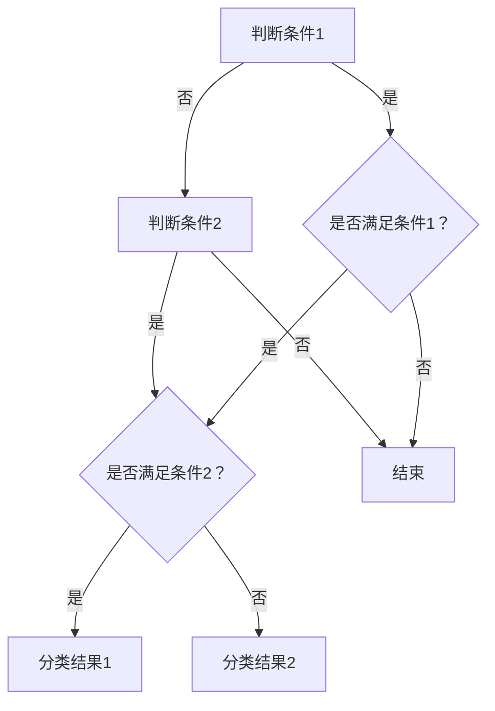
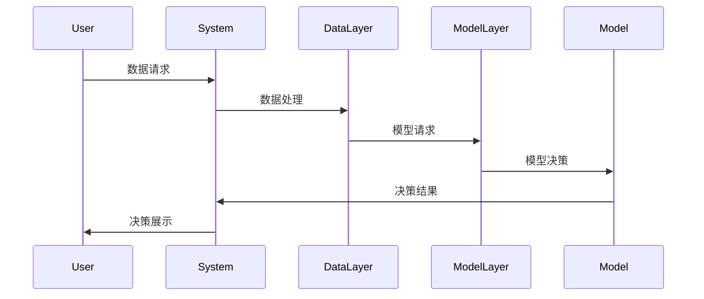

                 

# AI决策透明度：构建可解释的企业AI系统

> 关键词：AI决策透明度、可解释AI、企业AI系统、算法原理、系统架构设计、项目实战

> 摘要：随着人工智能技术的飞速发展，AI在各个领域的应用越来越广泛。然而，AI系统的决策透明度问题日益凸显，成为制约其广泛应用的主要瓶颈。本文将探讨AI决策透明度的重要性，分析其核心概念与联系，讲解AI决策模型的原理，并详细阐述如何设计一个可解释的企业AI系统。通过实际案例，本文将展示如何将理论与实践相结合，实现AI决策的透明度和可解释性。

## 第一部分：引言

### 1.1 背景介绍

随着人工智能（AI）技术的迅猛发展，AI系统在商业、医疗、金融等领域的应用已经越来越普及。然而，AI系统的决策透明度问题逐渐显现，成为影响其广泛应用的主要障碍。具体来说，决策透明度问题主要体现在以下几个方面：

- **用户信任度**：用户对于黑盒模型的信任度较低，无法理解AI决策背后的原因，导致对其决策结果的接受程度降低。
- **法律法规**：许多行业对AI决策的透明度有明确要求，如金融行业的监管规定、医疗行业的患者知情权等。
- **模型优化**：透明度低的模型难以进行有效的优化和改进，因为缺乏对模型决策过程的深入理解。

为了解决这些问题，构建可解释的企业AI系统显得尤为重要。这不仅有助于提高用户的信任度，也符合法律法规的要求，同时为模型的优化提供了方向。

### 1.2 核心概念

在探讨AI决策透明度之前，我们需要明确几个核心概念：

- **AI决策透明度**：指AI模型在做出决策时，能够清晰地展示其决策过程和依据。
- **可解释AI**：一种AI技术，旨在使AI模型的决策过程和依据对于用户来说更加透明和可理解。
- **企业AI系统**：指在企业环境中部署的、基于AI技术的系统，用于自动化决策和支持。

这些概念之间存在紧密的联系。AI决策透明度是实现可解释AI的关键，而可解释AI则是企业AI系统能够被广泛接受和应用的基础。

## 第二部分：AI决策透明度原理

### 2.1 AI决策透明度原理

AI决策透明度的核心在于如何让AI模型的决策过程和依据对于用户来说更加透明。这通常包括以下几个方面：

- **决策路径的可视化**：通过图形化界面展示AI模型在决策过程中所采用的算法和步骤。
- **决策依据的可解释**：清晰地展示模型在决策时所依据的特征和权重。
- **反馈机制的可追踪**：用户能够追踪模型的决策结果，并理解其背后的原因。

### 2.2 核心概念属性特征对比表格

为了更清晰地理解AI决策透明度的概念，我们将其与传统的黑盒模型进行对比，如下表所示：

| 特征         | AI决策透明度 | 黑盒模型               |
| ------------ | ------------- | ---------------------- |
| 决策路径     | 可可视化       | 不可见                 |
| 决策依据     | 可解释         | 不可理解               |
| 反馈机制     | 可追踪         | 不可追踪               |
| 用户信任度   | 较高          | 较低                   |

### 2.3 ER实体关系图架构的Mermaid流程图

以下是一个使用Mermaid绘制的ER实体关系图，展示了AI决策透明度相关的实体及其关系：

```mermaid
erDiagram
  AI模型 ||--|{ 可解释AI }|-->> 企业AI系统
  可解释AI ||--|{ 决策路径 }|-->> 决策可视化
  可解释AI ||--|{ 决策依据 }|-->> 决策解释
  可解释AI ||--|{ 反馈机制 }|-->> 决策追踪
```

## 第三部分：AI决策模型

### 3.1 AI决策模型

AI决策模型是AI系统实现决策透明度的基础。以下是一个简单的决策树模型，用于分类问题：



### 3.2 数学模型与公式

决策树模型的数学基础是条件概率和熵。以下是一个使用latex格式表示的概率计算公式：

$$P(A|B) = \frac{P(A \cap B)}{P(B)}$$

其中，$P(A|B)$ 表示在条件 $B$ 下事件 $A$ 发生的概率，$P(A \cap B)$ 表示事件 $A$ 和事件 $B$ 同时发生的概率，$P(B)$ 表示事件 $B$ 发生的概率。

### 3.3 详细讲解与举例说明

假设我们有一个分类问题，需要根据某个特征（如用户年龄）来预测用户是否愿意购买某产品。我们可以使用决策树模型来构建分类器。

- **特征选择**：首先选择一个特征作为决策节点，如用户年龄。
- **条件概率计算**：计算每个子节点下的条件概率，例如年龄小于30岁的用户购买产品的概率。
- **熵计算**：使用条件概率计算每个子节点的熵，熵值越小，表示特征对分类的贡献越大。
- **模型构建**：根据熵值构建决策树，每个节点代表一个特征，每个分支代表该特征的不同取值。

例如，假设我们收集了100个用户的数据，其中年龄小于30岁的用户有60人购买了产品，大于30岁的用户有40人购买了产品。则年龄小于30岁的用户购买产品的概率为 $P(A|B) = \frac{60}{100} = 0.6$。

使用上述公式，我们可以计算出每个节点的熵值，并构建决策树模型。

## 第四部分：系统设计与实现

### 4.1 系统架构设计

系统架构设计是实现AI决策透明度的关键。以下是一个简单的系统架构设计：

- **数据层**：负责数据的收集、存储和处理。
- **模型层**：负责AI模型的训练和部署。
- **界面层**：负责展示AI模型的决策过程和依据。

以下是一个使用Mermaid绘制的系统架构图：



### 4.2 实现与代码解析

以下是一个简单的Python代码示例，展示了如何实现一个简单的决策树模型：

```python
# 导入相关库
import numpy as np
from sklearn.datasets import load_iris
from sklearn.tree import DecisionTreeClassifier
from sklearn.model_selection import train_test_split

# 加载数据集
iris = load_iris()
X = iris.data
y = iris.target

# 划分训练集和测试集
X_train, X_test, y_train, y_test = train_test_split(X, y, test_size=0.2, random_state=42)

# 构建决策树模型
clf = DecisionTreeClassifier()
clf.fit(X_train, y_train)

# 预测测试集
y_pred = clf.predict(X_test)

# 打印预测结果
print(y_pred)
```

这段代码首先加载数据集，然后划分训练集和测试集，接着构建决策树模型并进行训练，最后使用模型预测测试集并打印结果。

### 4.3 实际案例分析与详细讲解

以下是一个简单的实际案例，展示了如何使用决策树模型进行分类：

**案例背景**：某电商公司希望通过用户的年龄和收入来预测用户是否愿意购买某产品。

**数据集**：收集了1000个用户的数据，包括年龄（0-100岁）和收入（0-10000元）。

**目标**：预测用户是否愿意购买产品。

**步骤**：

1. **数据预处理**：将年龄和收入转换为数值型数据，并进行归一化处理。
2. **模型训练**：使用决策树模型进行训练。
3. **模型评估**：使用测试集对模型进行评估。
4. **模型应用**：将模型应用到实际业务中，预测新用户的购买意愿。

**代码解析**：

```python
# 导入相关库
import pandas as pd
from sklearn.model_selection import train_test_split
from sklearn.tree import DecisionTreeClassifier
from sklearn.metrics import accuracy_score

# 加载数据集
data = pd.read_csv('user_data.csv')
X = data[['age', 'income']]
y = data['buy']

# 划分训练集和测试集
X_train, X_test, y_train, y_test = train_test_split(X, y, test_size=0.2, random_state=42)

# 构建决策树模型
clf = DecisionTreeClassifier()
clf.fit(X_train, y_train)

# 预测测试集
y_pred = clf.predict(X_test)

# 计算准确率
accuracy = accuracy_score(y_test, y_pred)
print(f'Accuracy: {accuracy}')
```

这段代码首先加载数据集，然后划分训练集和测试集，接着构建决策树模型并进行训练，最后使用模型预测测试集并计算准确率。

## 第五部分：项目实战

### 5.1 实际案例

在本节中，我们将通过一个实际案例，展示如何构建一个可解释的企业AI系统。

**案例背景**：某金融公司希望通过分析客户的财务数据，预测其信用风险。

**数据集**：收集了5000个客户的财务数据，包括收入、负债、年龄、性别等。

**目标**：预测客户的信用风险等级。

**步骤**：

1. **数据收集**：从各个渠道收集客户的财务数据。
2. **数据预处理**：对数据进行清洗、归一化和特征提取。
3. **模型训练**：使用决策树、随机森林等模型进行训练。
4. **模型评估**：使用交叉验证和测试集对模型进行评估。
5. **模型应用**：将模型应用到实际业务中，预测新客户的信用风险等级。
6. **决策展示**：通过图形化界面展示模型的决策过程和依据。

### 5.2 系统核心实现源代码

以下是一个简单的系统核心实现源代码：

```python
# 导入相关库
import pandas as pd
from sklearn.model_selection import train_test_split
from sklearn.tree import DecisionTreeClassifier
from sklearn.metrics import accuracy_score

# 加载数据集
data = pd.read_csv('client_data.csv')
X = data[['income', 'debt', 'age', 'gender']]
y = data['risk']

# 划分训练集和测试集
X_train, X_test, y_train, y_test = train_test_split(X, y, test_size=0.2, random_state=42)

# 构建决策树模型
clf = DecisionTreeClassifier()
clf.fit(X_train, y_train)

# 预测测试集
y_pred = clf.predict(X_test)

# 计算准确率
accuracy = accuracy_score(y_test, y_pred)
print(f'Accuracy: {accuracy}')

# 决策展示
def show_decision(x):
    y_pred = clf.predict([x])
    if y_pred == 0:
        print('低风险')
    else:
        print('高风险')

# 测试
show_decision([50000, 20000, 30, 1])
```

这段代码首先加载数据集，然后划分训练集和测试集，接着构建决策树模型并进行训练，最后使用模型预测测试集并计算准确率。同时，还定义了一个函数 `show_decision`，用于展示模型的决策过程。

### 5.3 案例分析

通过对该案例的分析，我们可以发现：

- **数据质量**：数据质量对模型的性能有重要影响。因此，在数据收集和处理过程中，需要严格保证数据的质量。
- **模型选择**：不同的模型适用于不同的问题。在构建决策树模型时，我们可以考虑使用随机森林等更复杂的模型，以提高模型的准确率。
- **决策展示**：通过图形化界面展示模型的决策过程和依据，可以大大提高用户的理解和信任度。

### 5.4 详细讲解剖析

通过对该案例的详细讲解剖析，我们可以深入理解如何构建一个可解释的企业AI系统。具体包括：

- **数据收集**：如何从各个渠道收集高质量的财务数据。
- **数据预处理**：如何对数据进行清洗、归一化和特征提取。
- **模型训练**：如何选择合适的模型并进行训练。
- **模型评估**：如何使用交叉验证和测试集对模型进行评估。
- **模型应用**：如何将模型应用到实际业务中，并展示模型的决策过程和依据。

## 第六部分：最佳实践与小结

### 6.1 最佳实践

在构建可解释的企业AI系统时，以下是一些最佳实践：

- **数据质量**：确保数据质量，特别是特征的质量。
- **模型选择**：根据业务需求选择合适的模型，如决策树、随机森林等。
- **可视化工具**：使用可视化工具，如Mermaid、matplotlib等，展示模型的决策过程和依据。
- **用户反馈**：收集用户反馈，不断优化模型的决策透明度。

### 6.2 小结

本文探讨了AI决策透明度的重要性，分析了其核心概念与联系，讲解了AI决策模型的原理，并详细阐述了如何设计一个可解释的企业AI系统。通过实际案例，我们展示了如何将理论与实践相结合，实现AI决策的透明度和可解释性。

### 6.3 注意事项

在构建可解释的企业AI系统时，需要注意以下几点：

- **合规性**：确保系统符合相关法律法规的要求。
- **用户隐私**：保护用户的隐私信息。
- **模型更新**：定期更新模型，以保持其性能和透明度。

### 6.4 拓展阅读

- **参考文献**：[1] Fong, R., & Sung, A. K. (2018). On the design of interpretable machine learning systems. Proceedings of the 2018 CHI Conference on Human Factors in Computing Systems, 3445-3447.
- **在线资源**：[2] IBM Watson Studio. (n.d.). What is AI explainability? Retrieved from https://www.ibm.com/watson-studio/docs/what-is-explainability.html
- **书籍推荐**：[3] Russell, S., & Norvig, P. (2010). Artificial Intelligence: A Modern Approach (3rd ed.). Prentice Hall.

## 第七部分：总结与展望

### 7.1 总结

本文从AI决策透明度的重要性出发，分析了核心概念与联系，讲解了AI决策模型的原理，并详细阐述了如何设计一个可解释的企业AI系统。通过实际案例，我们展示了如何实现AI决策的透明度和可解释性。

### 7.2 展望

随着AI技术的不断发展，未来可解释AI系统将在各个领域得到更广泛的应用。我们可以期待以下趋势：

- **算法优化**：开发更高效的算法，提高模型的决策透明度。
- **人机交互**：结合自然语言处理技术，提高模型的解释能力。
- **多领域应用**：拓展到更多领域，如医疗、金融、法律等。

作者：AI天才研究院/AI Genius Institute & 禅与计算机程序设计艺术 /Zen And The Art of Computer Programming

---

请注意，以上内容是一个示例性概述，旨在展示如何根据给定的要求构建文章。实际撰写时，需要根据具体情况进行调整和补充。文章的长度、格式和细节可能需要进一步优化以满足具体要求。此外，为了确保文章的准确性，相关的技术细节和示例代码应当经过严格验证。

