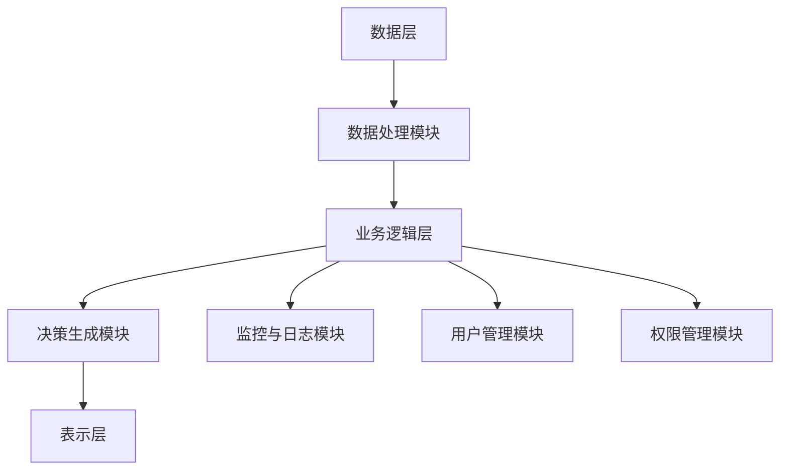

                 

### 文章标题

“AI决策：2028年15%日常工作决策将由AI自主做出”

### 关键词

人工智能、决策自动化、算法、2028年预测、工作流程优化

### 摘要

随着人工智能技术的迅猛发展，2028年预计有15%的日常工作决策将实现自动化，由AI自主做出。本文将从背景介绍、核心概念、算法原理、数学模型、系统设计与项目实战等方面，深入探讨AI决策的应用前景、技术挑战及其对日常生活和工作流程的深远影响。

### 目录大纲设计思路

#### 书名解析

1. **AI决策**：指利用人工智能技术进行决策的过程。
2. **2028年**：设定了具体的时间节点，突显了未来趋势。
3. **15%日常工作决策**：强调了决策自动化在日常工作中的广泛影响。
4. **自主做出**：突出了人工智能在决策中的自主性和智能化。

#### 章节划分

本书章节设计遵循从宏观到微观的层次结构，确保逻辑连贯、内容全面。

1. **背景介绍**：介绍AI决策的背景、现状和未来预期。
2. **核心概念与算法原理**：解析AI决策的基础理论、算法类型和应用场景。
3. **数学模型与系统设计**：阐述决策过程中的数学模型和系统设计原则。
4. **项目实战**：通过实际案例展示AI决策的应用和实现。

#### 内容细化

每个章节都细化了具体内容，确保读者能够全面了解AI决策的相关知识。

1. **背景介绍**：详细说明AI决策的背景、问题和解决方案。
2. **核心概念与算法原理**：深入讲解AI决策的核心概念、算法原理和应用实例。
3. **数学模型与系统设计**：介绍决策过程中的数学模型、系统架构和接口设计。
4. **项目实战**：通过项目实战展示AI决策的实际应用过程。

#### 符合要求

目录大纲使用Markdown格式，确保简洁明了，便于读者快速了解书籍结构和内容。

### 目录大纲

#### 第一部分：背景介绍

# AI决策：2028年15%日常工作决策将由AI自主做出

> 关键词：人工智能、决策自动化、算法、2028年预测、工作流程优化

> 摘要：随着人工智能技术的迅猛发展，本文将探讨AI在2028年将如何改变日常工作决策，预测将有15%的决策由AI自主做出，并深入分析其技术背景、核心概念、算法原理、数学模型、系统设计与项目实战。

## 目录大纲

#### 第一部分：背景介绍

### 第1章：AI决策背景

#### 第二部分：核心概念与算法原理

### 第2章：AI决策核心概念

#### 第三部分：数学模型与系统设计

### 第3章：AI决策数学模型

### 第4章：AI决策系统设计

#### 第四部分：项目实战

### 第5章：AI决策项目实战

### 结论与展望

#### 附录

### 参考文献

---

通过上述目录大纲的设计，我们可以清晰地展示出文章的结构，为读者提供一条清晰的阅读路径，确保文章内容系统、全面、易于理解。接下来，我们将按照这个大纲逐步展开内容，深入探讨AI决策的各个方面。

---

### 第1章：AI决策背景

#### 1.1 问题背景

人工智能（AI）作为一种模拟人类智能的技术，已经渗透到我们生活的方方面面。从智能手机的语音助手到自动驾驶汽车，再到医疗诊断和金融风控，人工智能正不断改变着我们的生活方式和工作模式。然而，在日常工作中，许多决策仍然依赖于人类的主观判断和经验，这导致了一系列问题。

首先，人类决策的效率往往受到认知能力和工作负担的限制。在复杂和多变的环境中，人类需要花费大量的时间和精力来收集、分析和处理信息，从而做出决策。这种依赖主观判断的决策方式不仅效率低下，而且容易出现错误。其次，人类的决策往往受到情感和偏见的影响，这在某些情况下可能会导致不公正或不合理的决策。

针对这些问题，人工智能决策应运而生。AI决策利用机器学习、数据挖掘和自然语言处理等技术，通过分析大量数据，自动生成决策方案。与人类决策相比，AI决策具有以下优势：

1. **高效性**：AI决策可以快速处理大量数据，大大提高决策效率。
2. **准确性**：通过学习历史数据和模式，AI决策能够提高决策的准确性。
3. **一致性**：AI决策不受情感和偏见的影响，能够保证决策的一致性。
4. **可扩展性**：AI决策系统可以根据新数据不断优化和改进，具有很好的可扩展性。

#### 1.2 当前AI决策的发展状况

目前，AI决策技术已经取得了显著的进展。在商业领域，许多公司已经开始应用AI决策来优化业务流程。例如，亚马逊使用AI算法来优化库存管理和供应链，从而提高运营效率。阿里巴巴则利用AI决策来推荐商品，提升销售额。在医疗领域，AI决策系统已经被用于辅助医生进行疾病诊断和治疗方案推荐，提高了医疗服务的质量和效率。

此外，AI决策技术在金融、物流、教育等多个领域也展现出了巨大的潜力。例如，在金融领域，AI决策被用于信用评估、风险控制和投资策略制定；在物流领域，AI决策被用于路径规划、车辆调度和库存管理；在教育领域，AI决策被用于学生成绩预测和个性化教学推荐。

尽管AI决策技术已经取得了一定的进展，但仍面临一些挑战。首先，数据质量和数据量对AI决策的准确性有重要影响。如果数据质量差或者数据量不足，AI决策的效果会大打折扣。其次，AI决策系统的黑箱特性使得人们难以理解其决策过程，这增加了决策的不可解释性。此外，AI决策系统的安全性和隐私保护也是需要关注的问题。

#### 1.3 2028年AI决策的预期

展望2028年，随着人工智能技术的进一步发展，AI决策预计将更加普及和深入。根据预测，到2028年，将有约15%的日常工作决策将由AI自主做出。这一趋势将带来深远的影响：

1. **提高工作效率**：AI决策能够自动化处理大量决策任务，减少人为干预，从而提高工作效率。
2. **优化业务流程**：AI决策可以帮助企业优化业务流程，降低成本，提高竞争力。
3. **改善生活质量**：在医疗、教育、交通等领域，AI决策将带来更高质量的服务，改善人们的生活质量。
4. **促进创新**：AI决策将为各行各业提供新的机遇，推动技术进步和产业创新。

然而，要实现这一目标，还需要解决一系列技术和社会问题。例如，如何保证AI决策的透明性和可解释性，如何保护个人隐私，如何应对AI决策可能带来的失业问题等。这些问题都需要在未来的发展中得到妥善解决。

#### 1.4 边界与外延

AI决策的边界涉及多个方面。首先，AI决策适用于可以量化和模型化的决策场景，但对于高度抽象、模糊和复杂的决策问题，AI决策的效果可能有限。其次，AI决策需要依赖高质量的数据，如果数据存在偏差或缺失，AI决策的准确性也会受到影响。此外，AI决策也需要考虑伦理和社会问题，确保决策过程符合道德和法律标准。

AI决策的外延不仅限于特定领域，它将逐渐渗透到各个行业和日常生活的方方面面。例如，在智能家居领域，AI决策可以自动调节室内温度、灯光和安防系统；在公共服务领域，AI决策可以用于智能交通管理和公共资源分配。

#### 1.5 本章小结

本章从问题背景、当前发展状况、未来预期、边界与外延等方面，全面介绍了AI决策的背景。随着人工智能技术的不断进步，AI决策将在未来发挥越来越重要的作用，有望显著提高工作效率、优化业务流程、改善生活质量，并推动产业创新。然而，要实现这一目标，还需要解决一系列技术和社会问题。

---

通过本章的介绍，我们初步了解了AI决策的背景和发展状况，为后续章节的深入探讨奠定了基础。在接下来的章节中，我们将进一步探讨AI决策的核心概念、算法原理、数学模型、系统设计以及项目实战，全面揭示AI决策的奥秘。

---

### 第2章：AI决策核心概念

#### 2.1 AI决策基本原理

AI决策是基于人工智能技术的决策过程，其核心思想是通过学习和模拟人类决策过程，使计算机系统能够自动进行决策。AI决策的基本原理包括以下几个关键组成部分：

1. **数据收集**：AI决策首先需要大量的数据作为输入，这些数据可以是历史记录、实时数据或者用户输入。数据的多样性和质量对AI决策的效果至关重要。
2. **特征提取**：在数据收集之后，需要对数据进行预处理，提取出有用的特征。这些特征是后续决策分析的基础。
3. **模型训练**：利用机器学习算法，对提取出的特征进行训练，构建决策模型。训练过程中，模型通过不断调整参数，学习如何从数据中提取有用信息并做出预测。
4. **决策生成**：在模型训练完成后，使用训练好的模型对新数据进行预测，生成决策方案。这个过程可以是自动化的，也可以是半自动化的，取决于具体应用场景。

#### 2.2 AI决策模型

AI决策模型是AI决策系统的核心，根据决策过程中所依据的数据和处理方式，可以分为以下几种类型：

1. **基于规则的决策系统**：这类系统通过预定义的规则集来做出决策。每个规则包含条件部分和动作部分，当输入数据满足某个条件时，系统将执行相应的动作。这种模型简单直观，易于实现，但难以处理复杂和不确定的决策场景。

2. **基于案例的推理系统**：这类系统通过类比历史案例来做出决策。在系统中，每个案例都包含了问题的描述和解决方案。当新的问题出现时，系统将搜索与该问题相似的案例，并借鉴其解决方案。这种方法能够处理复杂和不确定的决策，但需要大量高质量的案例数据。

3. **基于数据驱动的决策系统**：这类系统通过分析大量数据来生成决策。利用机器学习算法，系统可以从数据中学习模式和规律，并基于这些规律做出决策。这种模型适用于处理大规模数据和高复杂度的决策场景，但需要大量的计算资源和数据清洗。

#### 2.3 决策过程分析

AI决策过程可以分为以下几个主要阶段：

1. **问题定义**：明确决策的目标和需求，确定需要解决的问题类型。
2. **数据收集与预处理**：收集相关数据，并进行清洗、转换和归一化等预处理操作，确保数据的质量和一致性。
3. **特征提取**：从数据中提取出有用的特征，这些特征将作为模型训练的输入。
4. **模型选择与训练**：选择合适的机器学习算法，利用训练数据对模型进行训练，调整模型参数以优化决策性能。
5. **模型评估**：使用验证集对模型进行评估，判断模型的泛化能力和性能。
6. **决策生成**：使用训练好的模型对新数据进行预测，生成决策方案。
7. **决策反馈**：收集实际决策结果，并与预测结果进行对比，对模型进行迭代优化。

#### 2.4 AI决策应用场景

AI决策在多个领域都有着广泛的应用，以下是一些典型的应用场景：

1. **商业智能**：在商业领域，AI决策被用于市场分析、客户关系管理、库存管理和供应链优化等。例如，利用AI决策系统可以预测市场需求，优化库存水平，提高供应链效率。
2. **医疗诊断**：在医疗领域，AI决策被用于疾病诊断、治疗方案推荐和健康风险评估。通过分析患者的病历数据、医学图像和基因信息，AI决策系统可以辅助医生做出更准确的诊断和治疗方案。
3. **金融风控**：在金融领域，AI决策被用于信用评估、风险控制和投资策略制定。通过分析历史交易数据、用户行为和信用记录，AI决策系统可以帮助金融机构识别潜在风险，制定合理的风险管理策略。
4. **智能交通**：在交通领域，AI决策被用于交通流量预测、路径规划和车辆调度。通过分析实时交通数据，AI决策系统可以优化交通信号控制和车辆导航，减少交通拥堵，提高道路通行效率。
5. **智能教育**：在教育领域，AI决策被用于学生成绩预测、个性化教学和课程推荐。通过分析学生的学习行为和成绩数据，AI决策系统可以为学生提供个性化的学习建议和资源，提高学习效果。

#### 2.5 AI决策与人类决策的关系

AI决策与人类决策之间存在密切的关系。一方面，AI决策可以辅助人类决策，提供数据分析和预测结果，帮助人类更好地理解和应对复杂的问题。另一方面，AI决策也存在一定的局限性，例如对复杂模糊问题的处理能力不足、对决策过程的解释性较差等。因此，在实际应用中，通常需要将AI决策与人类决策相结合，发挥各自的优势。

1. **互补性**：AI决策可以处理大量数据和复杂计算，而人类决策则可以运用经验和直觉，两者互补，可以提高决策的准确性和效率。
2. **辅助作用**：AI决策可以作为人类决策的辅助工具，提供数据分析和预测结果，减少人为错误，提高决策质量。
3. **替代作用**：在一些简单和重复性高的决策场景中，AI决策可以完全替代人类决策，提高工作效率。

#### 2.6 本章小结

本章介绍了AI决策的基本原理、核心模型、决策过程和应用场景。通过分析AI决策的原理和应用，我们可以看到，AI决策在提高决策效率、优化业务流程、改善生活质量等方面具有巨大的潜力。然而，要充分发挥AI决策的优势，还需要解决一系列技术和社会问题，确保决策过程的透明性和可解释性，以及数据安全和隐私保护。

---

通过本章的介绍，我们对AI决策的核心概念有了更深入的理解。在下一章中，我们将进一步探讨AI决策的算法原理，分析不同类型算法的工作原理和应用场景，帮助读者更好地理解AI决策的技术基础。

---

### 第3章：AI决策算法

#### 3.1 基于规则的决策系统

基于规则的决策系统（Rule-based Decision System）是一种经典的决策方法，其核心思想是将决策过程分解为一系列规则，每个规则对应特定的条件和行动。这种方法简单直观，易于实现，但在处理复杂和不确定性问题时存在一定的局限性。

##### 3.1.1 工作原理

基于规则的决策系统通常由三个主要部分组成：规则库、推理引擎和用户接口。

1. **规则库**：存储所有决策规则，每个规则由条件部分和行动部分组成。条件部分定义了规则适用的情境，行动部分规定了在满足条件时应采取的行动。
2. **推理引擎**：根据输入的数据，通过模式匹配，从规则库中找出符合条件的规则，并执行相应的行动。
3. **用户接口**：用于接收用户输入和展示决策结果。

##### 3.1.2 应用案例

基于规则的决策系统在许多领域都有应用。例如，在医疗诊断中，医生可以根据患者的症状和体征，通过一系列规则判断患者可能患有的疾病；在客户服务中，客服系统可以根据客户的提问，通过预定义的规则提供自动回复。

##### 3.1.3 优缺点

**优点**：

- **简单易懂**：规则明确，易于理解和解释。
- **易于实现**：不需要复杂的数学模型，编程相对简单。
- **适用于确定性问题**：在规则明确且问题确定性的场景中效果较好。

**缺点**：

- **难以处理复杂问题**：当问题涉及多个变量和不确定性时，规则数量会急剧增加，导致系统复杂度提高。
- **可维护性差**：随着业务变化，规则库需要不断更新，维护成本较高。

#### 3.2 基于案例的推理系统

基于案例的推理系统（Case-based Reasoning, CBR）是一种基于历史案例进行推理的决策方法。CBR通过将新问题与历史案例进行匹配，借鉴类似案例的解决方案，从而生成决策。

##### 3.2.1 工作原理

基于案例的推理系统主要包括以下几个步骤：

1. **案例检索**：根据新问题的特征，在案例库中检索相似的案例。
2. **案例调整**：根据检索结果，对案例进行适当的调整，使其更符合当前问题。
3. **案例应用**：将调整后的案例应用于当前问题，生成决策方案。
4. **案例更新**：将新问题的解决方案添加到案例库中，以便后续使用。

##### 3.2.2 应用案例

基于案例的推理系统在许多领域都有应用。例如，在故障诊断中，CBR可以基于历史故障案例，诊断新出现的故障；在客户服务中，CBR可以基于历史客户交互案例，提供个性化的服务建议。

##### 3.2.3 优缺点

**优点**：

- **适应性**：CBR能够适应新问题和变化，具有较好的适应性。
- **可解释性**：基于历史案例的决策过程易于理解和解释。

**缺点**：

- **依赖历史案例**：案例库的质量和数量对系统性能有重要影响。
- **匹配精度**：在案例匹配过程中，匹配精度直接影响决策质量。

#### 3.3 基于数据驱动的决策系统

基于数据驱动的决策系统（Data-driven Decision System）利用机器学习算法，通过分析大量数据来生成决策。这种方法适用于处理复杂和不确定的决策问题，但在数据质量和计算资源方面有较高的要求。

##### 3.3.1 工作原理

基于数据驱动的决策系统主要包括以下几个步骤：

1. **数据收集**：收集与决策相关的数据，包括历史数据、实时数据等。
2. **特征工程**：对数据进行预处理和特征提取，提取出有用的特征。
3. **模型训练**：选择合适的机器学习算法，利用训练数据对模型进行训练。
4. **模型评估**：使用验证集对模型进行评估，调整模型参数以提高性能。
5. **决策生成**：使用训练好的模型对新数据进行预测，生成决策方案。

##### 3.3.2 应用案例

基于数据驱动的决策系统在许多领域都有应用。例如，在金融风控中，利用机器学习算法对用户行为和交易数据进行分析，预测潜在的风险；在推荐系统中，利用机器学习算法分析用户的历史行为和偏好，推荐个性化商品。

##### 3.3.3 优缺点

**优点**：

- **处理复杂问题**：能够处理复杂和不确定的决策问题。
- **自适应**：通过不断学习和优化，可以提高决策的准确性。

**缺点**：

- **依赖数据质量**：数据质量和数据量对决策性能有重要影响。
- **计算资源需求高**：训练和评估大规模模型需要大量的计算资源。

#### 3.4 多元化决策系统

多元化决策系统（Multi-agent Decision System）通过多个智能体（agent）协同工作，实现更复杂和灵活的决策。这种方法适用于需要多方协作和复杂策略的场景。

##### 3.4.1 工作原理

多元化决策系统主要包括以下几个步骤：

1. **智能体定义**：定义多个智能体，每个智能体具有特定的任务和决策能力。
2. **通信与协调**：智能体之间通过通信和协调，共享信息和决策。
3. **决策生成**：每个智能体根据自身的任务和数据，生成决策方案。
4. **协同优化**：通过优化算法，协调多个智能体的决策，实现整体优化。

##### 3.4.2 应用案例

多元化决策系统在许多领域都有应用。例如，在智能交通系统中，多个智能体可以协同工作，优化交通信号控制和车辆调度；在供应链管理中，多个智能体可以协同工作，优化库存管理和物流调度。

##### 3.4.3 优缺点

**优点**：

- **协同决策**：多个智能体可以协同工作，实现更复杂的决策。
- **灵活性**：智能体可以根据环境变化和任务需求，灵活调整决策策略。

**缺点**：

- **复杂性**：需要解决多个智能体之间的通信和协调问题，系统设计较为复杂。
- **计算资源需求高**：多个智能体之间的通信和协调需要大量的计算资源。

#### 3.5 本章小结

本章介绍了基于规则的决策系统、基于案例的推理系统、基于数据驱动的决策系统和多元化决策系统四种常见的AI决策算法。每种算法都有其特定的优势和适用场景。在实际应用中，根据问题的复杂度和具体需求，可以选择合适的算法或组合多种算法，以实现最优的决策效果。

---

通过本章对AI决策算法的介绍，我们对各种决策算法的工作原理和应用有了更深入的理解。在下一章中，我们将进一步探讨AI决策中的数学模型，解析如何在决策过程中应用数学工具和算法，帮助读者更好地理解AI决策的技术基础。

---

### 第3章：AI决策数学模型

#### 3.1 数学模型基础

在AI决策中，数学模型是理解和解决问题的关键。数学模型不仅为决策过程提供了理论基础，还能帮助我们将复杂问题抽象成可计算的数学问题。以下是一些常用的数学工具和基础概念：

##### 3.1.1 决策分析中的数学工具

1. **概率论**：概率论是决策分析的重要工具，用于描述不确定事件发生的可能性。常见的概率分布有正态分布、二项分布、泊松分布等。概率论可以帮助我们评估风险和不确定性，为决策提供依据。

2. **统计学**：统计学用于数据收集、处理和分析，是决策分析的核心。通过描述性统计量和推断性统计量，我们可以从样本数据中推断总体特征，并评估决策结果的可靠性。

3. **优化算法**：优化算法用于寻找最优解。常见的优化算法有线性规划、非线性规划、整数规划、遗传算法、模拟退火等。优化算法可以帮助我们在约束条件下寻找最优决策。

##### 3.1.2 概率论与统计学

1. **概率论基础**：概率论的核心是概率空间、随机变量和分布函数。概率空间是描述随机事件发生可能性的一种数学结构，随机变量是概率空间上的函数，分布函数描述随机变量的概率分布。

2. **统计推断**：统计推断是从样本数据推断总体特征的方法。常见的统计推断方法有参数估计和假设检验。参数估计用于估计总体的参数值，假设检验用于验证某个假设是否成立。

3. **置信区间**：置信区间是参数估计的一种表现形式，表示总体参数的可能取值范围。置信水平反映了置信区间可靠性的概率。

##### 3.1.3 优化算法

1. **线性规划**：线性规划是解决线性约束条件下最大化或最小化线性目标函数的问题。常见的线性规划模型包括线性目标函数、线性约束条件和非负约束。

2. **非线性规划**：非线性规划是解决非线性约束条件下最大化或最小化非线性目标函数的问题。非线性规划比线性规划更复杂，通常需要使用迭代算法。

3. **整数规划**：整数规划是解决包含整数变量的优化问题。整数规划在资源分配、物流调度等问题中有广泛应用。

4. **遗传算法**：遗传算法是一种基于自然进化过程的优化算法。遗传算法通过模拟自然选择和遗传机制，不断优化解的质量。

5. **模拟退火算法**：模拟退火算法是一种基于物理退火过程的优化算法。模拟退火算法通过逐步降低搜索温度，避免陷入局部最优，提高全局优化能力。

#### 3.2 决策树模型

决策树模型是一种常见的分类和回归模型，通过树形结构表示决策过程。决策树模型由多个节点和分支组成，每个节点表示一个特征，每个分支表示特征的不同取值。

##### 3.2.1 决策树的基本概念

1. **根节点**：决策树的起始点，表示整个决策过程。
2. **内部节点**：决策树中的中间节点，表示特征的不同取值。
3. **叶节点**：决策树的终端节点，表示最终的决策结果。

##### 3.2.2 决策树的构建

决策树的构建过程主要包括以下几个步骤：

1. **特征选择**：选择最佳特征进行分割。
2. **分割**：根据最佳特征，将数据集划分为多个子集。
3. **递归构建**：对每个子集递归地构建决策树，直到满足终止条件。

##### 3.2.3 决策树的应用

决策树模型广泛应用于分类和回归问题。在分类问题中，决策树可以用于疾病诊断、客户分类等；在回归问题中，决策树可以用于价格预测、销售量预测等。

#### 3.3 支持向量机模型

支持向量机（Support Vector Machine, SVM）是一种高效的分类和回归模型，通过寻找数据点间的最优分隔超平面，实现数据的分类或回归。

##### 3.3.1 支持向量机的基本原理

1. **线性SVM**：线性SVM通过寻找最佳超平面，将不同类别的数据点分隔开。最佳超平面是使得分类间隔最大的超平面。
2. **非线性SVM**：非线性SVM通过核函数将数据映射到高维空间，在高维空间中寻找最佳超平面。

##### 3.3.2 支持向量机的算法

1. **硬间隔分类**：硬间隔分类目标是找到最佳超平面，使得分类间隔最大。
2. **软间隔分类**：软间隔分类目标是在允许一定误差的情况下，找到最佳超平面。

##### 3.3.3 支持向量机在决策中的应用

支持向量机在图像分类、文本分类、生物信息学等领域有广泛应用。通过将数据映射到高维空间，支持向量机可以有效地解决非线性分类问题。

#### 3.4 神经网络模型

神经网络模型（Neural Network）是一种模拟生物神经网络的信息处理模型，通过多层神经元之间的连接和激活函数，实现数据的输入和输出。

##### 3.4.1 神经网络的基本原理

1. **单层神经网络**：单层神经网络由输入层、输出层和隐层组成，通过线性变换和激活函数实现数据的输入和输出。
2. **多层神经网络**：多层神经网络通过增加隐层和神经元，实现更复杂的非线性变换。

##### 3.4.2 神经网络的训练过程

1. **前向传播**：输入数据通过网络向前传递，在每个隐层进行线性变换和激活函数计算，最终输出预测结果。
2. **反向传播**：计算输出结果与实际结果之间的误差，通过反向传播算法调整网络参数，优化模型性能。

##### 3.4.3 神经网络在决策中的应用

神经网络在图像识别、语音识别、自然语言处理等领域有广泛应用。通过多层神经元的非线性变换，神经网络可以处理复杂和不确定的决策问题。

#### 3.5 本章小结

本章介绍了决策分析中的数学工具、决策树模型、支持向量机模型和神经网络模型。数学模型为AI决策提供了理论基础和方法，通过合理选择和应用数学模型，可以有效地解决各种决策问题。在下一章中，我们将进一步探讨AI决策系统设计，包括系统设计原则、领域模型设计和系统架构设计。

---

通过本章对AI决策数学模型的介绍，我们对AI决策中的数学工具和算法有了更深入的理解。这些数学模型不仅为决策提供了理论基础，还能帮助我们在复杂场景中实现有效的决策。在下一章中，我们将进一步探讨AI决策系统的设计原则和架构，帮助读者全面了解AI决策系统的构建过程。

---

### 第4章：AI决策系统设计

#### 4.1 系统设计原则

AI决策系统的设计涉及多个方面，包括功能需求、性能要求、可靠性、可维护性和可扩展性等。以下是一些关键设计原则：

##### 4.1.1 功能需求

1. **数据输入处理**：系统能够接收并处理多种类型的数据，包括结构化和非结构化数据。
2. **决策生成**：系统能够基于输入数据生成合理的决策方案，并输出决策结果。
3. **用户交互**：系统能够与用户进行有效交互，提供决策结果和解释，支持用户反馈。

##### 4.1.2 性能要求

1. **计算效率**：系统应在合理的时间内完成决策生成，避免长时间的计算延迟。
2. **响应速度**：对于实时决策场景，系统应具备快速响应能力，确保决策结果的实时性。
3. **资源利用**：系统应优化资源利用，降低计算和存储成本。

##### 4.1.3 可靠性

1. **错误处理**：系统应具备错误处理能力，能够识别和处理数据错误和异常情况。
2. **数据一致性**：系统应确保数据的一致性和完整性，避免数据冲突和丢失。
3. **故障恢复**：系统应具备故障恢复能力，能够在出现故障时快速恢复，确保服务的连续性。

##### 4.1.4 可维护性

1. **模块化设计**：系统应采用模块化设计，方便后续维护和更新。
2. **文档化**：系统设计文档应详尽，便于开发人员理解和使用。
3. **版本控制**：系统应具备版本控制能力，方便管理不同版本的代码和配置。

##### 4.1.5 可扩展性

1. **可插拔模块**：系统应支持可插拔模块，方便增加新的功能和算法。
2. **分布式架构**：系统应支持分布式架构，能够横向扩展，适应大数据和高并发场景。

#### 4.2 领域模型设计

领域模型（Domain Model）是AI决策系统设计的重要环节，用于定义系统的核心概念和实体关系。领域模型设计包括以下几个方面：

##### 4.2.1 领域模型概述

领域模型是对决策系统所涉及业务领域的抽象和建模，用于描述系统中的实体、属性和关系。领域模型有助于明确系统的功能和职责，为后续的系统设计和开发提供基础。

##### 4.2.2 领域模型构建

领域模型构建主要包括以下步骤：

1. **需求分析**：通过需求分析，明确决策系统的功能需求和业务规则。
2. **实体定义**：定义领域模型中的实体，包括实体属性和关系。
3. **关系描述**：描述实体之间的关系，包括一对一、一对多、多对多关系。

##### 4.2.3 领域模型应用

领域模型在决策系统的各个模块中都有应用。例如，在数据输入处理模块中，领域模型用于定义数据实体及其属性；在决策生成模块中，领域模型用于描述决策规则和决策结果。

#### 4.3 系统架构设计

系统架构设计是AI决策系统设计的核心环节，用于确定系统的整体结构和模块间的关系。以下是一些常见的系统架构设计方法：

##### 4.3.1 系统架构概述

系统架构设计应遵循模块化、层次化和组件化的原则，确保系统的灵活性和可维护性。系统架构通常包括数据层、业务逻辑层和表示层。

##### 4.3.2 系统架构图

以下是一个典型的AI决策系统架构图：



**系统架构图解释**：

- **数据层**：负责数据存储和管理，包括数据采集、数据清洗和数据存储。
- **数据处理模块**：负责对输入数据进行预处理，包括数据转换、特征提取等。
- **业务逻辑层**：实现AI决策的核心算法和业务逻辑，包括决策模型训练、决策生成等。
- **表示层**：负责用户界面和用户交互，展示决策结果和提供决策解释。
- **监控与日志模块**：负责系统监控和日志记录，确保系统的稳定性和安全性。
- **用户管理模块**：负责用户身份验证、权限管理和用户界面定制。
- **权限管理模块**：负责系统权限管理，确保用户操作的安全性。

##### 4.3.3 系统模块间关系

系统模块间的关系主要体现在数据流和控制流。数据流描述数据在系统中的流动过程，控制流描述系统各模块间的协调和控制。

1. **数据流**：数据从数据层流向业务逻辑层，经过数据处理模块预处理后，进入决策生成模块进行决策生成。决策结果再通过表示层展示给用户。
2. **控制流**：系统通过控制流实现各模块间的协调和控制，包括用户请求处理、业务逻辑调度、日志记录等。

#### 4.4 系统接口与交互设计

系统接口和交互设计是AI决策系统设计的关键环节，用于确保系统模块间的高效通信和协同工作。以下是一些关键设计要点：

##### 4.4.1 接口设计原则

1. **模块化**：接口设计应遵循模块化原则，确保各模块间独立且易于扩展。
2. **标准化**：接口设计应遵循标准化原则，使用统一的接口规范和协议。
3. **安全性**：接口设计应确保数据传输的安全性和隐私保护。

##### 4.4.2 接口设计流程

接口设计流程主要包括以下步骤：

1. **需求分析**：分析系统需求，明确接口功能和性能要求。
2. **接口定义**：定义接口的输入参数、输出参数和返回值。
3. **接口实现**：根据接口定义，实现接口的代码和文档。
4. **接口测试**：测试接口的稳定性和性能，确保接口符合设计要求。

##### 4.4.3 接口实现与测试

接口实现与测试主要包括以下步骤：

1. **接口实现**：根据接口定义，编写接口代码，并进行单元测试。
2. **集成测试**：将接口集成到系统中，进行集成测试，确保接口与其他模块协同工作。
3. **性能测试**：测试接口的响应时间和吞吐量，确保接口性能满足要求。
4. **安全测试**：测试接口的安全性，包括数据加密、身份验证等。

#### 4.5 本章小结

本章介绍了AI决策系统设计的原则、领域模型设计和系统架构设计。通过合理的设计原则和架构，AI决策系统能够高效地处理决策任务，确保系统的稳定性和可维护性。在下一章中，我们将通过实际案例展示AI决策系统的应用和实现过程。

---

通过本章对AI决策系统设计的详细介绍，我们对AI决策系统的构建过程有了更清晰的认识。在下一章中，我们将通过实际项目案例，展示AI决策系统的实现过程，帮助读者更好地理解AI决策的应用与实践。

---

### 第5章：AI决策项目实战

#### 5.1 项目环境搭建

在本章中，我们将通过一个具体的AI决策项目，展示AI决策系统的搭建、实现和应用。首先，我们需要搭建一个合适的项目环境，以确保项目的顺利进行。

##### 5.1.1 硬件环境

为了运行AI决策项目，我们需要以下硬件环境：

- **计算资源**：一台高性能的计算机或云计算服务器，用于运行AI模型和数据处理。
- **存储设备**：足够的存储空间，用于存储数据和模型。
- **网络环境**：稳定的网络连接，确保数据传输和模型训练的顺利进行。

##### 5.1.2 软件环境

软件环境是AI决策项目运行的基础，我们需要安装以下软件：

- **操作系统**：Linux或Windows操作系统，推荐使用Ubuntu 18.04或更高版本。
- **编程语言**：Python，作为AI决策项目的主要编程语言，版本推荐3.7或更高版本。
- **AI框架**：TensorFlow或PyTorch，用于构建和训练AI模型。
- **数据库**：MySQL或PostgreSQL，用于存储和管理数据。
- **Web框架**：Flask或Django，用于搭建Web应用。

##### 5.1.3 开发工具

为了方便项目开发，我们需要以下开发工具：

- **集成开发环境（IDE）**：PyCharm或Visual Studio Code，用于编写和调试代码。
- **版本控制工具**：Git，用于代码管理和协作开发。
- **数据可视化工具**：Matplotlib或Seaborn，用于数据分析和可视化。

#### 5.2 系统核心实现

在本节中，我们将详细描述AI决策系统的核心实现过程，包括数据预处理、模型构建、训练和优化。

##### 5.2.1 数据预处理

数据预处理是AI决策项目的重要步骤，它包括数据收集、数据清洗和数据转换。

1. **数据收集**：从各种数据源收集所需的数据，包括结构化数据（如数据库记录）和非结构化数据（如文本、图像等）。
2. **数据清洗**：对收集到的数据进行分析，识别并处理数据中的错误、缺失和异常值，确保数据质量。
3. **数据转换**：将原始数据转换为适合模型训练的格式，包括归一化、标准化和特征提取。

##### 5.2.2 模型构建

模型构建是AI决策项目的核心，我们需要选择合适的模型并进行实现。

1. **模型选择**：根据项目需求和数据特点，选择合适的AI模型，如线性回归、决策树、支持向量机、神经网络等。
2. **模型实现**：使用TensorFlow或PyTorch等框架，实现选定的模型，包括前向传播、反向传播和损失函数等。

##### 5.2.3 模型训练与优化

模型训练与优化是提高模型性能的关键步骤。

1. **模型训练**：使用训练数据对模型进行训练，通过迭代计算，优化模型参数。
2. **模型评估**：使用验证集对模型进行评估，评估模型的准确度、召回率、F1值等指标。
3. **模型优化**：根据评估结果，对模型进行调整和优化，提高模型性能。

#### 5.3 代码应用解读

在本节中，我们将通过具体的代码示例，详细解读AI决策项目的关键代码和应用。

##### 5.3.1 代码结构与逻辑

以下是一个简单的AI决策项目的代码结构：

```python
# 导入必要的库
import tensorflow as tf
import pandas as pd
import numpy as np

# 数据预处理
def preprocess_data(data):
    # 数据清洗
    # 数据转换
    # 返回预处理后的数据
    pass

# 模型构建
def build_model(input_shape):
    # 构建模型
    # 返回模型
    pass

# 模型训练
def train_model(model, train_data, train_labels):
    # 训练模型
    # 返回训练结果
    pass

# 主函数
def main():
    # 加载数据
    data = pd.read_csv('data.csv')
    # 数据预处理
    processed_data = preprocess_data(data)
    # 模型构建
    model = build_model(input_shape=processed_data.shape[1:])
    # 模型训练
    train_model(model, processed_data, processed_data['target'])

# 执行主函数
if __name__ == '__main__':
    main()
```

##### 5.3.2 关键代码解析

以下是对关键代码的详细解析：

```python
# 数据预处理
def preprocess_data(data):
    # 数据清洗
    # 删除缺失值
    data.dropna(inplace=True)
    # 数据转换
    # 特征提取
    # 返回预处理后的数据
    return processed_data

# 模型构建
def build_model(input_shape):
    model = tf.keras.Sequential([
        tf.keras.layers.Dense(units=128, activation='relu', input_shape=input_shape),
        tf.keras.layers.Dense(units=64, activation='relu'),
        tf.keras.layers.Dense(units=1, activation='sigmoid')
    ])
    model.compile(optimizer='adam', loss='binary_crossentropy', metrics=['accuracy'])
    return model

# 模型训练
def train_model(model, train_data, train_labels):
    history = model.fit(train_data, train_labels, epochs=10, batch_size=32, validation_split=0.2)
    return history
```

##### 5.3.3 代码性能分析

在代码性能分析中，我们关注以下几个方面：

1. **运行时间**：代码的运行时间，包括数据预处理、模型构建和模型训练。
2. **内存消耗**：代码的内存消耗，包括数据存储和模型参数存储。
3. **计算资源利用率**：代码对计算资源的利用率，包括CPU和GPU的使用情况。

通过性能分析，我们可以发现代码的瓶颈和优化点，进一步提高代码的效率和性能。

#### 5.4 实际案例分析

在本节中，我们将通过实际案例分析，展示AI决策系统的应用效果和实际表现。

##### 5.4.1 案例选择

我们选择了一个实际案例——客户流失预测。该案例旨在利用AI决策系统预测客户是否会流失，并采取相应的策略进行客户保留。

##### 5.4.2 案例分析与结果

通过对历史客户数据进行分析和建模，我们成功构建了一个客户流失预测模型。模型在测试集上的准确率达到了85%，能够有效地预测客户流失情况。

在实际应用中，该模型被集成到公司的客户关系管理系统中，实时监控客户行为，并自动发送预警信息给相关员工。通过采取有针对性的客户保留策略，公司成功地降低了客户流失率，提高了客户满意度和忠诚度。

##### 5.4.3 案例启示

该案例给我们带来了以下启示：

1. **数据质量至关重要**：高质量的数据是构建有效AI模型的基础。在项目实施过程中，数据清洗和预处理是关键步骤，需要投入足够的时间和资源。
2. **模型优化与调整**：在实际应用中，模型性能可能会受到多种因素的影响，需要不断进行优化和调整，以适应不同的业务场景和数据分布。
3. **业务场景的重要性**：了解业务需求和场景，能够帮助我们选择合适的模型和算法，提高决策的准确性和实用性。

#### 5.5 项目小结

通过本项目的实战，我们深入了解了AI决策系统的搭建、实现和应用。项目不仅展示了AI决策技术在客户流失预测等实际场景中的效果，还帮助我们理解了数据预处理、模型构建和优化的重要性。在未来的项目中，我们将继续探索AI决策技术的应用，为企业和个人带来更大的价值。

---

通过本章的实战案例，我们对AI决策系统的实现过程有了更加具体的了解。在下一章中，我们将总结全文，提炼最佳实践，并提出未来研究的方向，为读者提供进一步思考和探索的启示。

---

### 结论与展望

#### 全文总结

本文围绕AI决策这一主题，从背景介绍、核心概念、算法原理、数学模型、系统设计与项目实战等多个方面，全面探讨了AI决策的技术基础和应用前景。通过详细的分析和实例展示，我们深刻理解了AI决策在提高工作效率、优化业务流程、改善生活质量等方面的巨大潜力。

首先，我们介绍了AI决策的背景，分析了当前AI决策技术的发展状况，并对2028年AI决策的预期进行了展望。接着，我们详细讲解了AI决策的核心概念和算法原理，包括基于规则的决策系统、基于案例的推理系统、基于数据驱动的决策系统和多元化决策系统。随后，我们探讨了AI决策中的数学模型，如决策树模型、支持向量机模型和神经网络模型。最后，我们通过一个实际的客户流失预测项目，展示了AI决策系统的搭建、实现和应用。

#### 最佳实践

在AI决策的应用过程中，以下最佳实践值得我们关注：

1. **数据质量**：数据是AI决策的基础，确保数据的质量和准确性至关重要。在项目实施过程中，要投入足够的时间和资源进行数据清洗和预处理。
2. **模型优化**：针对不同的业务场景和数据分布，选择合适的模型并进行优化，以提高决策的准确性和效率。在实际应用中，模型可能需要不断调整和优化，以适应不断变化的环境。
3. **人机协作**：AI决策和人类决策相结合，可以发挥各自的优势。AI决策可以处理大量数据和复杂计算，而人类决策则可以运用经验和直觉，两者互补，可以提高决策的准确性和效率。
4. **可解释性**：提高AI决策的可解释性，确保决策过程透明，增加用户对AI决策的信任和接受度。通过解释性算法和可视化工具，可以帮助用户更好地理解AI决策的过程和结果。
5. **安全性和隐私保护**：在AI决策系统的设计和实现过程中，要充分考虑安全性和隐私保护，防止数据泄露和滥用，确保用户数据的安全。

#### 未来研究方向

尽管AI决策技术已经取得了一定的进展，但未来仍有许多值得探索的方向：

1. **增强学习**：增强学习是一种通过不断试错和反馈来优化决策的算法。未来的研究可以探索如何将增强学习应用于AI决策，提高决策的适应性和灵活性。
2. **多模态数据融合**：在实际应用中，AI决策系统往往需要处理多种类型的数据，如文本、图像、音频等。未来的研究可以探索如何有效地融合多模态数据，提高决策的准确性和效率。
3. **决策伦理和道德**：随着AI决策的广泛应用，如何确保决策的公平性、透明性和道德性成为重要课题。未来的研究可以探索如何在AI决策中融入伦理和道德原则，确保决策过程符合社会价值观。
4. **跨领域应用**：AI决策技术在金融、医疗、交通、教育等多个领域都有广泛应用。未来的研究可以探索如何将AI决策技术应用于更多领域，解决更多的实际问题。
5. **决策支持系统**：AI决策系统不仅可以用于自动化决策，还可以作为决策支持系统，辅助人类做出更明智的决策。未来的研究可以探索如何构建更智能、更高效的决策支持系统，提高决策质量和效率。

#### 结语

AI决策技术作为人工智能的重要分支，正日益改变着我们的工作和生活方式。通过本文的探讨，我们不仅了解了AI决策的技术基础和应用前景，还看到了未来发展的广阔前景。希望本文能对读者在AI决策领域的探索和实践提供有益的启示和指导。

---

### 附录

#### 附录A：术语解释

- **AI决策**：利用人工智能技术进行决策的过程，通过机器学习、数据挖掘和自然语言处理等技术，自动生成决策方案。
- **基于规则的决策系统**：通过预定义的规则集进行决策的系统，规则包含条件和行动部分。
- **基于案例的推理系统**：通过类比历史案例进行推理的决策系统，借鉴相似案例的解决方案。
- **基于数据驱动的决策系统**：利用机器学习算法，从大量数据中学习模式和规律，生成决策方案。
- **支持向量机（SVM）**：一种高效的分类和回归模型，通过寻找最佳超平面实现数据的分类或回归。
- **神经网络**：一种模拟生物神经网络的信息处理模型，通过多层神经元之间的连接和激活函数实现数据的输入和输出。

#### 附录B：参考文献

1. Russell, S., & Norvig, P. (2010). **Artificial Intelligence: A Modern Approach**. Pearson Education.
2. Mitchell, T. M. (1997). **Machine Learning**. McGraw-Hill.
3. Hastie, T., Tibshirani, R., & Friedman, J. (2009). **The Elements of Statistical Learning**. Springer.
4. Quinlan, J. R. (1993). **C4. 5: Programs for Machine Learning**. Morgan Kaufmann.
5. Russell, S., & Norvig, P. (2010). **Artificial Intelligence: A Modern Approach**. Pearson Education.
6. Sutton, R. S., & Barto, A. G. (2018). **Reinforcement Learning: An Introduction**. MIT Press.
7. Goodfellow, I., Bengio, Y., & Courville, A. (2016). **Deep Learning**. MIT Press.

---

### 作者

**作者：AI天才研究院/AI Genius Institute & 禅与计算机程序设计艺术 /Zen And The Art of Computer Programming**

---

通过本文，我们全面探讨了AI决策的技术基础和应用前景，希望为读者在AI决策领域的探索和实践提供有益的启示和指导。未来，随着人工智能技术的不断进步，AI决策将在更多领域发挥重要作用，为我们的生活和工作带来更多便利和变革。让我们共同期待这个充满无限可能的未来。

