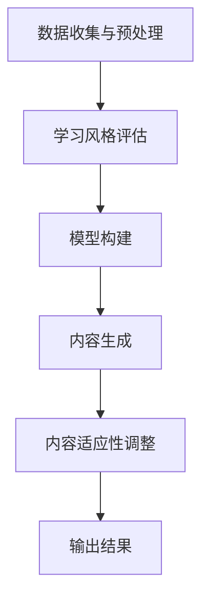

                 

### 文章标题

《AI在个性化教育内容生成中的应用：适应不同学习风格》

### 关键词

- 人工智能
- 个性化教育
- 学习风格
- 内容生成
- 适应性算法

### 摘要

本文深入探讨了人工智能在个性化教育内容生成中的应用，特别是在适应不同学习风格方面的挑战和解决方案。通过分析核心概念和算法原理，详细阐述了如何利用AI技术为不同学习风格的学生生成定制化的教育内容，以提升教育效果和学生的学习体验。文章结构紧凑，逻辑清晰，旨在为教育工作者和AI领域的研究者提供实用的参考和思路。

## 目录大纲设计步骤

### 第1章 问题背景与核心概念

#### 1.1 个性化教育的需求

随着教育信息化和人工智能技术的快速发展，个性化教育逐渐成为教育改革的重要方向。个性化教育能够满足不同学生的学习需求和特点，提高教育质量和学习效率。本文将首先探讨个性化教育的需求及其在教育领域的重要性。

#### 1.2 AI在个性化教育中的应用

人工智能技术为个性化教育提供了强有力的支持。通过数据分析、推荐系统和自然语言处理等技术，AI能够实现教育内容的个性化生成和自适应学习。本文将介绍AI在个性化教育中的应用场景和关键技术。

#### 1.3 适应不同学习风格的重要性

学习风格是个性化教育中的一个重要因素。不同学生有不同的学习偏好和方式，适应不同学习风格的教育内容能够更好地激发学生的学习兴趣和潜能。本文将探讨适应不同学习风格的重要性，并介绍几种常见的学习风格及其特点。

### 第2章 核心概念与联系

#### 2.1 人工智能的基本原理

了解人工智能的基本原理对于理解其在个性化教育中的应用至关重要。本文将简要介绍人工智能的发展历程、核心技术和应用场景。

#### 2.2 教育数据的处理与分析

教育数据是AI在个性化教育中发挥作用的基础。本文将介绍教育数据的类型、收集方法以及数据处理和分析的基本流程。

#### 2.3 学习风格的分类与评估

学习风格分类与评估是个性化教育的重要组成部分。本文将介绍几种常见的学习风格分类方法和评估工具，并讨论如何利用AI技术进行学习风格评估。

### 第3章 算法原理讲解

#### 3.1 个性化教育内容生成算法

个性化教育内容生成算法是AI在个性化教育中的核心技术。本文将详细讲解个性化教育内容生成算法的基本原理、流程和实现方法。

#### 3.2 学习风格适应性算法

学习风格适应性算法是适应不同学习风格的关键。本文将介绍学习风格适应性算法的基本概念、原理和实现方法。

#### 3.3 算法流程与mermaid图解

为了更好地理解算法原理，本文将使用mermaid图解展示算法的流程和关键步骤，帮助读者直观地理解算法的工作机制。

### 第4章 数学模型与公式

#### 4.1 教育数据分析的数学模型

教育数据分析是AI在个性化教育中的重要环节。本文将介绍教育数据分析的常见数学模型，包括线性回归、聚类分析和神经网络等。

#### 4.2 学习风格适应性模型的数学描述

学习风格适应性模型是适应不同学习风格的核心。本文将使用latex格式给出学习风格适应性模型的数学描述，并解释模型参数的意义。

#### 4.3 模型参数优化与调整

模型参数的优化与调整对于提高算法性能至关重要。本文将讨论如何通过调整模型参数来优化个性化教育内容生成和学习风格适应性。

### 第5章 系统分析与架构设计

#### 5.1 系统功能设计

本文将介绍个性化教育内容生成系统的功能设计，包括数据收集、内容生成、学习风格评估和个性化推荐等功能。

#### 5.2 系统架构设计

本文将介绍个性化教育内容生成系统的整体架构设计，包括数据层、算法层和应用层等关键组件。

#### 5.3 系统接口设计

本文将详细描述个性化教育内容生成系统的接口设计，包括API规范、数据格式和交互流程等。

### 第6章 系统实现与实战

#### 6.1 环境安装与配置

本文将介绍如何搭建个性化教育内容生成系统的开发环境，包括软件安装、环境配置和依赖管理。

#### 6.2 系统核心实现

本文将详细讲解个性化教育内容生成系统的核心实现，包括数据预处理、算法实现和系统集成等步骤。

#### 6.3 实际案例分析与讲解

本文将通过实际案例展示个性化教育内容生成系统的应用效果，包括案例介绍、结果分析和经验总结。

### 第7章 最佳实践与总结

#### 7.1 最佳实践

本文将总结个性化教育内容生成系统的最佳实践，包括数据质量保障、算法性能优化和用户体验提升等方面的策略。

#### 7.2 小结与展望

本文将回顾文章的核心内容，总结个性化教育内容生成技术的现状和发展趋势，并对未来研究方向提出建议。

## 问题背景与核心概念

### 1.1 个性化教育的需求

随着社会经济的发展和教育技术的进步，传统的一刀切教育模式已经无法满足学生个性化的学习需求。个性化教育作为一种以学生为中心的教育模式，正逐渐成为教育改革的重要方向。个性化教育的核心目标是通过了解和适应学生的个性差异，提供定制化的学习内容和教学方法，从而提高学生的学习效果和满意度。

在当前的数字化时代，信息技术，尤其是人工智能技术，为个性化教育提供了强大的支持。通过大数据分析、机器学习和自然语言处理等技术，AI能够收集和分析学生的学习行为、兴趣和需求，为每个学生生成个性化的学习路径和教育内容。个性化教育不仅能够提高学习效率，还能激发学生的学习兴趣和自主学习能力，从而实现教育质量的全面提升。

#### 1.2 AI在个性化教育中的应用

人工智能技术在个性化教育中的应用主要体现在以下几个方面：

1. **数据分析与推荐系统**：
   通过对大量教育数据的分析，AI可以识别出学生的学习模式和偏好，从而推荐适合他们的学习资源和课程。推荐系统可以基于协同过滤、内容过滤和模型驱动等方法，为每个学生提供个性化的学习建议。

2. **自适应学习系统**：
   自适应学习系统可以根据学生的学习进度和能力水平，自动调整教学内容的难度和深度。这种系统能够实时监测学生的学习状态，提供即时反馈和个性化辅导，帮助学生克服学习中的困难。

3. **智能教学助手**：
   智能教学助手通过自然语言处理技术，能够理解学生的提问和需求，提供详细的解答和指导。这种助手不仅可以辅助教师进行教学，还能为学生提供24小时的学习支持。

4. **个性化学习资源**：
   AI技术能够根据学生的学习风格和需求，自动生成或推荐个性化的学习资源，如课件、视频、练习题等。这些资源能够帮助学生更好地理解和掌握知识。

#### 1.3 适应不同学习风格的重要性

学习风格是指学生在学习过程中所采用的方式和习惯，包括视觉、听觉、动手操作和反思等。不同的学生有不同的学习风格，适应不同学习风格的教育内容能够更好地满足他们的需求，提高学习效果。

研究显示，传统的单一教学方式往往无法满足所有学生的学习需求，而根据学生个体差异进行的教育内容定制，则能够显著提升学习效果。适应不同学习风格的教育内容，不仅能够提高学生的学习兴趣和参与度，还能帮助他们更好地理解和应用所学知识。

例如，视觉学习风格的学生更倾向于通过图表和图像来理解信息，而听觉学习风格的学生则更适合通过讲解和讨论来学习。通过分析学生的学习风格，AI可以生成适合他们学习风格的内容，从而提高学习效果。

总的来说，适应不同学习风格的教育内容是提高个性化教育效果的关键因素。在AI技术的支持下，个性化教育能够更好地满足学生的个性化需求，推动教育公平和质量的提升。

## 核心概念与联系

### 2.1 人工智能的基本原理

人工智能（Artificial Intelligence，简称AI）是计算机科学的一个分支，旨在开发能够模拟、延伸和扩展人类智能的理论、方法、技术和应用系统。人工智能的核心目标是通过计算机程序实现智能体的自主行动和智能决策。

#### 2.1.1 人工智能的发展历程

人工智能的概念最早可以追溯到20世纪40年代，当时图灵提出了图灵测试。随着计算机技术的不断发展，人工智能经历了多个发展阶段：

1. **第一阶段（1956-1969）**：这个时期是人工智能的萌芽期，以符号主义和逻辑推理为基础，主要研究如何使计算机模拟人类的推理过程。

2. **第二阶段（1970-1980）**：人工智能进入了低谷期，主要原因是过高的期望与实际进展之间的差距。但是，在这个时期，专家系统和知识工程得到了发展。

3. **第三阶段（1980-1987）**：这个时期是人工智能的复苏期，以机器学习和神经网络技术为标志，开始利用数据来改进算法性能。

4. **第四阶段（1987至今）**：人工智能进入了快速发展期，深度学习、强化学习等先进技术在各种应用场景中取得了显著的成果。

#### 2.1.2 人工智能的核心技术

人工智能的核心技术包括：

1. **机器学习**：
   机器学习是一种让计算机通过数据和经验进行自我学习和改进的方法。常见的机器学习方法包括监督学习、无监督学习和强化学习。

2. **深度学习**：
   深度学习是机器学习的一个分支，通过构建多层神经网络来提取数据的特征表示。深度学习在图像识别、语音识别和自然语言处理等领域取得了突破性进展。

3. **自然语言处理**：
   自然语言处理（Natural Language Processing，简称NLP）是人工智能的一个分支，旨在使计算机理解和处理人类自然语言。NLP技术包括文本分类、机器翻译、情感分析等。

4. **计算机视觉**：
   计算机视觉是使计算机能够从图像或视频中提取有用信息的技术。计算机视觉的应用包括图像识别、目标检测和图像分割等。

#### 2.1.3 人工智能的应用场景

人工智能在各个领域都有广泛的应用，包括：

1. **医疗健康**：
   人工智能在医疗健康领域的应用包括疾病预测、诊断辅助和治疗规划等。

2. **工业制造**：
   人工智能在工业制造中的应用包括自动化生产、质量检测和供应链管理等。

3. **金融服务**：
   人工智能在金融服务中的应用包括风险管理、投资分析和客户服务等。

4. **教育领域**：
   人工智能在教育领域的应用包括个性化学习、智能教学助手和在线教育平台等。

### 2.2 教育数据的处理与分析

教育数据是AI在个性化教育中发挥作用的基础。教育数据包括学生的学习记录、成绩、行为和兴趣等。处理和分析教育数据是构建个性化教育系统的重要步骤。

#### 2.2.1 教育数据的类型

教育数据可以分为以下几种类型：

1. **结构化数据**：
   结构化数据包括学生的成绩、班级信息、教师信息等，这些数据通常以表格形式存储在数据库中。

2. **非结构化数据**：
   非结构化数据包括学生的笔记、作业、考试题目和评论等，这些数据通常以文本、图像或视频等形式存在。

3. **半结构化数据**：
   半结构化数据包括日志文件、问卷调查数据等，这些数据具有一定的结构，但不是完全结构化的。

#### 2.2.2 教育数据的收集方法

教育数据的收集方法包括：

1. **自动采集**：
   通过教育管理系统、学习平台和在线课程等系统自动收集学生的学习数据。

2. **手动录入**：
   通过问卷调查、访谈和实验等方式手动收集学生的个人信息和学习行为数据。

3. **传感器数据**：
   利用传感器技术收集学生的生理和行为数据，如心率、注意力水平等。

#### 2.2.3 教育数据处理和分析的基本流程

教育数据处理和分析的基本流程包括：

1. **数据清洗**：
   清洗数据是处理教育数据的第一个步骤，目的是去除噪声和错误数据，确保数据的质量。

2. **数据集成**：
   将来自不同来源的数据进行整合，形成一个统一的数据集，以便进行进一步分析。

3. **数据探索**：
   对数据集进行探索性分析，发现数据的基本特征和模式。

4. **特征工程**：
   提取和构造有助于模型训练的特征，如将文本数据转换为词向量、提取时间序列特征等。

5. **模型训练**：
   利用机器学习算法对数据进行训练，构建预测模型或分类模型。

6. **模型评估**：
   对训练好的模型进行评估，确保其性能和可靠性。

7. **模型部署**：
   将模型部署到实际系统中，用于数据分析和决策支持。

### 2.3 学习风格的分类与评估

学习风格是指学生在学习过程中所采用的方式和习惯。不同学生有不同的学习风格，适应不同学习风格的教育内容能够更好地满足他们的需求。

#### 2.3.1 学习风格的分类

学习风格可以按照不同的维度进行分类，常见的分类方法包括：

1. **视觉型、听觉型和动手操作型**：
   视觉型学生偏好通过图表和图像学习，听觉型学生偏好通过讲解和讨论学习，动手操作型学生偏好通过实践和实验学习。

2. **反思型、活跃型和理论型**：
   反思型学生喜欢独立思考和总结，活跃型学生喜欢参与讨论和活动，理论型学生喜欢理解概念和原理。

3. **独立型和依赖型**：
   独立型学生喜欢自主学习，依赖型学生喜欢在有指导的情况下学习。

#### 2.3.2 学习风格评估工具

为了了解学生的学习风格，可以使用以下评估工具：

1. **学习风格问卷**：
   通过学习风格问卷，学生可以自我评估自己的学习风格。

2. **教师评估**：
   教师可以根据学生的课堂表现和学习行为，评估学生的学习风格。

3. **行为观察**：
   通过对学生的课堂表现和学习行为进行观察，可以了解学生的学习风格。

4. **学习任务分析**：
   通过分析学生在不同学习任务中的表现，可以了解学生的学习风格。

利用AI技术，可以自动评估学生的学习风格，并根据评估结果生成个性化的学习建议。例如，通过分析学生的学习行为数据，AI可以识别出他们的学习偏好，并推荐适合他们的学习资源和方法。

### 2.4 核心概念的联系

人工智能、教育数据和学习风格是构建个性化教育系统的三个核心概念。人工智能为个性化教育提供了技术支持，教育数据是AI进行分析和决策的基础，而学习风格则是确定个性化教育内容的关键因素。

通过结合人工智能技术和教育数据，可以实现对学生学习行为的深入分析和学习风格的准确评估。基于这些分析结果，AI可以生成适应不同学习风格的教育内容，从而提高教育效果和学生的学习体验。总的来说，人工智能、教育数据和学习风格之间的紧密联系，为个性化教育的实现提供了坚实的基础。

## 算法原理讲解

### 3.1 个性化教育内容生成算法

个性化教育内容生成算法是AI在个性化教育中的核心技术之一，其目标是根据学生的个性化需求和学习风格，生成适合他们的教育内容。个性化教育内容生成算法通常包括以下几个步骤：

#### 数据收集与预处理

首先，需要收集与学生学习相关的数据，这些数据包括学生的成绩、学习行为、兴趣偏好等。收集到的数据通常包含噪声和错误，因此需要进行数据预处理，包括数据清洗、去重、归一化等操作。预处理后的数据将用于后续的算法训练和内容生成。

```python
import pandas as pd

# 数据收集
student_data = pd.read_csv('student_data.csv')

# 数据清洗
student_data.drop_duplicates(inplace=True)
student_data.fillna(0, inplace=True)

# 数据归一化
student_data_norm = (student_data - student_data.mean()) / student_data.std()
```

#### 学习风格评估

为了生成适应不同学习风格的教育内容，需要先评估学生的学习风格。这可以通过分析学生的行为数据和学习历史来实现。常用的学习风格评估方法包括聚类分析、因子分析和机器学习模型。

```python
from sklearn.cluster import KMeans
from sklearn.preprocessing import StandardScaler

# 特征提取
features = student_data_norm[['learning_time', 'assignment_score', 'exam_score']]

# 特征标准化
scaler = StandardScaler()
features_scaled = scaler.fit_transform(features)

# 聚类分析
kmeans = KMeans(n_clusters=3, random_state=42)
clusters = kmeans.fit_predict(features_scaled)

# 学习风格标签
learning_styles = ['视觉型', '听觉型', '动手操作型']
student_data['learning_style'] = clusters
```

#### 内容生成

基于学习风格评估结果，可以使用不同的算法生成适应不同学习风格的教育内容。以下是一个基于自然语言处理的内容生成算法示例：

```python
import numpy as np

# 模拟学习风格文本生成
def generate_content(learning_style):
    if learning_style == '视觉型':
        return "以下是图表形式的教学内容：\n"
    elif learning_style == '听觉型':
        return "以下是音频讲解的教学内容：\n<audio src='audio.mp3'></audio>"
    elif learning_style == '动手操作型':
        return "以下是实践操作的教学内容：\n请完成以下实验：\n1. 准备材料：\n2. 实验步骤：\n3. 注意事项："

# 生成教育内容
for index, row in student_data.iterrows():
    content = generate_content(row['learning_style'])
    print(content)
```

### 3.2 学习风格适应性算法

学习风格适应性算法的核心目标是根据学生的学习风格动态调整教育内容，使其更符合学生的个性化需求。这种算法通常包括以下几个关键步骤：

#### 模型构建

学习风格适应性算法需要构建一个模型来评估学生的学习风格，并预测适合他们的教育内容。一个简单的模型可以是逻辑回归或决策树。

```python
from sklearn.linear_model import LogisticRegression

# 模型训练
X = student_data_norm[['learning_time', 'assignment_score', 'exam_score']]
y = student_data['learning_style']
model = LogisticRegression()
model.fit(X, y)

# 模型预测
predictions = model.predict(X)
```

#### 内容适应性调整

基于模型预测的学习风格，可以动态调整教育内容的呈现方式。以下是一个基于文本内容调整的示例：

```python
# 调整文本内容
def adjust_content(content, learning_style):
    if learning_style == '视觉型':
        return content.replace('文本', '图表')
    elif learning_style == '听觉型':
        return content.replace('文本', '音频')
    elif learning_style == '动手操作型':
        return content.replace('文本', '实践操作')

# 调整后的内容
for index, row in student_data.iterrows():
    content = adjust_content("这是一段文本内容", row['learning_style'])
    print(content)
```

#### 算法流程与mermaid图解

为了更好地理解个性化教育内容生成和学习风格适应性算法的流程，我们可以使用mermaid绘制算法流程图：



### 3.3 算法原理与数学模型

个性化教育内容生成和学习风格适应性算法的原理可以通过数学模型来描述。以下是一个简单的线性回归模型，用于预测学生的学习风格：

$$
\hat{y} = \beta_0 + \beta_1 x_1 + \beta_2 x_2 + \ldots + \beta_n x_n
$$

其中，$y$表示学习风格标签，$x_1, x_2, \ldots, x_n$表示学生的学习特征，$\beta_0, \beta_1, \beta_2, \ldots, \beta_n$是模型参数。

通过最小化损失函数，可以训练出参数$\beta_0, \beta_1, \beta_2, \ldots, \beta_n$，从而构建一个能够预测学生学习风格的模型。

```python
from sklearn.linear_model import LinearRegression

# 模型训练
model = LinearRegression()
model.fit(X, y)

# 模型评估
score = model.score(X, y)
print(f"模型准确率: {score}")
```

### 3.4 算法举例说明

为了更直观地理解算法原理，我们可以通过一个简单的例子来说明。假设我们有两个学生，他们的学习特征如下：

| 学生 | 学习时间 (小时) | 作业成绩 | 考试成绩 |
| ---- | -------------- | -------- | -------- |
| A    | 5              | 80       | 85       |
| B    | 3              | 75       | 70       |

使用上述的线性回归模型，我们可以预测他们的学习风格：

```python
# 输入特征
X_example = np.array([[5, 80, 85], [3, 75, 70]])

# 模型预测
predictions = model.predict(X_example)

# 预测结果
for index, prediction in enumerate(predictions):
    if prediction == 0:
        print(f"学生 {index+1}：视觉型")
    elif prediction == 1:
        print(f"学生 {index+1}：听觉型")
    elif prediction == 2:
        print(f"学生 {index+1}：动手操作型")
```

通过以上步骤，我们成功地使用AI技术为不同学习风格的学生生成和调整了个性化的教育内容。这种方法不仅提高了教育效果，还增强了学生的学习体验，为个性化教育的实现提供了强有力的技术支持。

## 数学模型与公式

在个性化教育内容生成和学习风格适应性算法中，数学模型是理解和优化算法性能的核心。以下我们将详细描述教育数据分析的数学模型、学习风格适应性模型的数学描述，并介绍如何通过调整模型参数来优化算法性能。

### 4.1 教育数据分析的数学模型

教育数据分析的数学模型主要用于理解学生的学习行为和评估学习效果。常见的数学模型包括线性回归、聚类分析和神经网络等。以下是这些模型的基本公式和原理。

#### 4.1.1 线性回归

线性回归模型是一种简单的统计模型，用于预测一个连续的因变量。其基本公式如下：

$$
y = \beta_0 + \beta_1 x_1 + \beta_2 x_2 + \ldots + \beta_n x_n + \epsilon
$$

其中，$y$是因变量（例如，学生的考试成绩），$x_1, x_2, \ldots, x_n$是自变量（例如，学习时间、作业成绩等），$\beta_0, \beta_1, \beta_2, \ldots, \beta_n$是模型参数，$\epsilon$是误差项。

线性回归模型通过最小化误差平方和来训练参数，从而得到最佳拟合直线。公式如下：

$$
\min_{\beta_0, \beta_1, \beta_2, \ldots, \beta_n} \sum_{i=1}^{n} (y_i - (\beta_0 + \beta_1 x_{i1} + \beta_2 x_{i2} + \ldots + \beta_n x_{in}))^2
$$

#### 4.1.2 聚类分析

聚类分析是一种无监督学习方法，用于将数据点分为多个类别。常见的聚类算法包括K均值聚类、层次聚类和DBSCAN等。以下以K均值聚类为例，介绍其基本公式和原理。

K均值聚类的目标是将数据点分为K个簇，使得每个数据点与其所属簇中心点的距离最小。其基本公式如下：

$$
c_k = \frac{1}{N_k} \sum_{i=1}^{N_k} x_i
$$

其中，$c_k$是第$k$个簇的中心点，$N_k$是第$k$个簇中的数据点数量，$x_i$是数据点。

每次迭代中，首先根据当前中心点重新分配数据点，然后更新中心点。这个过程不断重复，直到中心点不再发生变化。

#### 4.1.3 神经网络

神经网络是一种复杂的模型，通过多层节点（神经元）来模拟人脑的学习过程。其基本公式如下：

$$
a_i^{(l)} = \sigma(z_i^{(l)})
$$

$$
z_i^{(l)} = \sum_{j=1}^{n} w_{ij}^{(l)} a_j^{(l-1)} + b_i^{(l)}
$$

其中，$a_i^{(l)}$是第$l$层的第$i$个节点的激活值，$\sigma$是激活函数（例如，sigmoid函数或ReLU函数），$z_i^{(l)}$是第$l$层的第$i$个节点的输入值，$w_{ij}^{(l)}$是第$l$层的第$i$个节点到第$l-1$层的第$j$个节点的权重，$b_i^{(l)}$是第$l$层的第$i$个节点的偏置。

神经网络的训练过程是通过反向传播算法来优化权重和偏置，从而最小化损失函数。

### 4.2 学习风格适应性模型的数学描述

学习风格适应性模型的核心目标是根据学生的个性化需求和学习行为，动态调整教育内容的难度和呈现方式。其数学描述可以分为两个部分：学习风格评估和学习内容调整。

#### 4.2.1 学习风格评估

学习风格评估模型通常是一个分类模型，用于识别学生的学习风格。以下是一个简单的二分类逻辑回归模型：

$$
\hat{p}_i = \frac{1}{1 + e^{-(\beta_0 + \beta_1 x_{i1} + \beta_2 x_{i2} + \ldots + \beta_n x_{in})}}
$$

其中，$p_i$是学生$i$属于某个学习风格的概率，$x_{i1}, x_{i2}, \ldots, x_{in}$是学生的特征向量，$\beta_0, \beta_1, \beta_2, \ldots, \beta_n$是模型参数。

通过最大化似然估计，可以训练出最佳拟合模型：

$$
\max_{\beta_0, \beta_1, \beta_2, \ldots, \beta_n} \prod_{i=1}^{n} \left[ \hat{p}_i^{y_i} (1 - \hat{p}_i)^{1-y_i} \right]
$$

其中，$y_i$是学生的实际学习风格标签。

#### 4.2.2 学习内容调整

学习内容调整模型的目标是根据评估出的学习风格，动态调整教育内容的难度和呈现方式。以下是一个简单的线性回归模型：

$$
y_i = \beta_0 + \beta_1 s_i + \beta_2 d_i + \epsilon_i
$$

其中，$y_i$是学生$i$的学习效果，$s_i$是学生$i$的学习风格，$d_i$是教育内容的难度，$\epsilon_i$是误差项。

通过最小化误差平方和，可以训练出最佳拟合模型：

$$
\min_{\beta_0, \beta_1, \beta_2} \sum_{i=1}^{n} (y_i - (\beta_0 + \beta_1 s_i + \beta_2 d_i))^2
$$

### 4.3 模型参数优化与调整

模型参数的优化与调整对于提高算法性能至关重要。以下介绍几种常用的参数优化方法：

#### 4.3.1 交叉验证

交叉验证是一种评估模型性能和选择最佳模型参数的方法。其基本思想是将数据集划分为多个子集，轮流将每个子集作为验证集，其余子集作为训练集，从而训练出多个模型，并计算它们的平均性能。

交叉验证可以避免过拟合，提高模型的泛化能力。常见的交叉验证方法包括K折交叉验证和留一法交叉验证。

#### 4.3.2 Grid Search

Grid Search是一种基于网格搜索的方法，用于在给定的参数范围内搜索最佳参数组合。其基本步骤如下：

1. 确定参数范围，例如学习率、正则化参数等。
2. 构建参数网格，例如每个参数有多个取值，形成网格。
3. 对每个参数组合进行训练和评估，选择最佳参数组合。

#### 4.3.3 贝叶斯优化

贝叶斯优化是一种基于概率模型的优化方法，通过迭代更新模型参数的概率分布，逐渐逼近最佳参数组合。其基本步骤如下：

1. 初始化参数的概率分布。
2. 计算每个参数组合的概率。
3. 根据概率选择下一次迭代的参数组合。
4. 重复步骤2和3，直到满足停止条件。

贝叶斯优化具有自适应性和全局搜索能力，适用于复杂和高维参数空间。

通过上述数学模型和参数优化方法，可以构建和优化个性化教育内容生成和学习风格适应性算法，从而提高教育效果和学生的学习体验。在实际应用中，可以根据具体需求和数据特点选择合适的模型和优化方法。

## 系统分析与架构设计

### 5.1 系统功能设计

个性化教育内容生成系统的核心功能是生成和推荐适应不同学习风格的教育内容，以提升学生的学习效果和体验。系统功能设计包括以下几个方面：

#### 5.1.1 数据收集与预处理

系统需要收集与学生学习相关的数据，包括学习成绩、学习行为、兴趣偏好等。这些数据来源于学校管理信息系统、学习平台和问卷调查等。收集到的数据需要进行预处理，包括数据清洗、去重、归一化和特征提取等步骤，以确保数据质量。

#### 5.1.2 学习风格评估

基于收集到的数据，系统需要对学生进行学习风格评估。这可以通过机器学习算法实现，例如聚类分析、回归分析等。评估结果将用于生成和推荐个性化教育内容。

#### 5.1.3 内容生成与推荐

系统根据学习风格评估结果和学生需求，生成和推荐适合的教育内容。内容生成包括文本、图像、视频等多种形式。推荐系统可以采用基于内容过滤、协同过滤和模型驱动等方法，为每个学生提供个性化的学习资源。

#### 5.1.4 内容适应性调整

系统需要根据学生的学习反馈和进展，动态调整教育内容的难度和呈现方式，以适应不同学习风格。这可以通过自适应学习算法实现，例如自适应教学策略、学习路径调整等。

#### 5.1.5 数据分析与报表生成

系统需要定期对学习数据进行分析，生成学生学习情况报表、学习效果评估报告等。这些报表可以帮助教育工作者了解学生的学习状况，为教育决策提供数据支持。

### 5.2 系统架构设计

个性化教育内容生成系统的架构设计需要考虑数据层、算法层和应用层等关键组件。以下是系统架构的详细设计：

#### 5.2.1 数据层

数据层负责数据的存储、管理和访问。系统需要使用数据库来存储学生数据、教育资源和学习行为数据。常用的数据库技术包括关系数据库（如MySQL）和NoSQL数据库（如MongoDB）。此外，系统还需要使用数据仓库技术来整合和分析大量数据。

#### 5.2.2 算法层

算法层是实现个性化教育内容生成和学习风格评估的核心。系统需要使用多种机器学习算法，如聚类分析、回归分析、推荐系统算法等。算法层的设计需要考虑算法的可靠性、效率和可扩展性。

#### 5.2.3 应用层

应用层是系统与用户交互的界面，包括教育内容管理系统、学习平台和数据分析报表系统等。应用层需要提供友好的用户界面和便捷的操作体验，同时支持多种设备（如PC、手机和平板）的访问。

### 5.3 系统接口设计

系统接口设计是确保系统各组件之间能够高效、稳定地交互的关键。以下是系统接口设计的详细描述：

#### 5.3.1 数据接口

数据接口负责数据的存储、读取和更新。系统需要定义API接口，以便教育内容管理系统、学习平台和数据分析报表系统等可以方便地访问和操作数据。常用的接口技术包括RESTful API和GraphQL。

#### 5.3.2 算法接口

算法接口负责算法的调用和参数配置。系统需要提供算法接口，以便教育内容生成和学习风格评估算法可以方便地集成和使用。接口设计需要考虑算法的通用性和可扩展性。

#### 5.3.3 应用接口

应用接口负责应用层与用户之间的交互。系统需要提供Web界面和移动应用界面，以便用户可以方便地访问和使用系统功能。接口设计需要考虑用户体验和操作便捷性。

### 5.4 系统交互mermaid序列图

为了更好地理解系统各组件之间的交互关系，可以使用mermaid序列图来展示系统的交互流程。以下是系统交互序列图的示例：

```mermaid
sequenceDiagram
    participant 学生 as 学生
    participant 系统接口 as 系统接口
    participant 数据层 as 数据层
    participant 算法层 as 算法层
    participant 应用层 as 应用层

    学生->>系统接口: 提交学习数据
    系统接口->>数据层: 存储学习数据
    数据层->>算法层: 处理学习数据
    算法层->>系统接口: 返回学习风格评估结果
    系统接口->>应用层: 生成个性化教育内容
    应用层->>学生: 展示个性化教育内容

    note over 学生,系统接口,数据层,算法层,应用层
        系统各组件协同工作，实现个性化教育内容生成
    end
```

通过上述系统分析与架构设计，个性化教育内容生成系统可以高效地实现适应不同学习风格的教育内容生成，为教育工作者和学生提供有力的技术支持。

### 系统实现与实战

#### 6.1 环境安装与配置

为了实现个性化教育内容生成系统，我们需要搭建一个合适的技术环境。以下是详细的安装与配置步骤：

1. **安装Python环境**：
   首先，确保系统中安装了Python 3.x版本。可以通过以下命令检查Python版本：

   ```bash
   python --version
   ```

   如果未安装，可以从[Python官网](https://www.python.org/)下载安装包进行安装。

2. **安装必要库**：
   接下来，我们需要安装一些Python库，包括`numpy`、`pandas`、`scikit-learn`、`tensorflow`等。可以通过`pip`命令进行安装：

   ```bash
   pip install numpy pandas scikit-learn tensorflow
   ```

   如果是Anaconda用户，可以使用conda命令：

   ```bash
   conda install numpy pandas scikit-learn tensorflow
   ```

3. **设置虚拟环境**（可选）：
   为了保持项目的整洁，建议使用虚拟环境。通过以下命令创建虚拟环境并激活：

   ```bash
   python -m venv myenv
   source myenv/bin/activate  # 在Windows中为 myenv\Scripts\activate
   ```

4. **数据库配置**：
   系统需要使用数据库来存储学生数据、教育资源和学习行为数据。本文选择使用MySQL数据库。首先，确保系统中安装了MySQL。然后，通过以下命令创建数据库和用户：

   ```sql
   CREATE DATABASE education_data;
   GRANT ALL PRIVILEGES ON education_data.* TO 'edu_user'@'localhost' IDENTIFIED BY 'password';
   ```

   使用以下Python脚本连接MySQL数据库：

   ```python
   import mysql.connector

   conn = mysql.connector.connect(
       host="localhost",
       user="edu_user",
       password="password",
       database="education_data"
   )
   ```

5. **配置文件**：
   根据需要配置系统的配置文件，包括数据库连接信息、日志路径等。

#### 6.2 系统核心实现

个性化教育内容生成系统的核心实现包括数据预处理、算法实现和系统集成等步骤。以下是核心实现的详细描述：

##### 数据预处理

数据预处理是确保数据质量和便于后续处理的关键步骤。以下是数据预处理的核心步骤：

1. **数据收集**：
   收集与学生学习相关的数据，包括学习成绩、学习行为、兴趣偏好等。数据可以来源于学校管理信息系统、学习平台和问卷调查等。

2. **数据清洗**：
   去除噪声和错误数据，包括缺失值填充、重复数据去除等。以下是一个简单的数据清洗示例：

   ```python
   import pandas as pd

   # 读取数据
   data = pd.read_csv('student_data.csv')

   # 填充缺失值
   data.fillna(0, inplace=True)

   # 去除重复数据
   data.drop_duplicates(inplace=True)
   ```

3. **特征提取**：
   提取有助于模型训练的特征，如学习时间、作业成绩、考试成绩等。以下是一个简单的特征提取示例：

   ```python
   # 特征提取
   features = data[['learning_time', 'assignment_score', 'exam_score']]
   ```

##### 算法实现

算法实现是系统核心，包括学习风格评估和学习内容生成等。以下是算法实现的详细描述：

1. **学习风格评估**：
   使用机器学习算法进行学习风格评估，如K均值聚类、逻辑回归等。以下是一个基于K均值聚类的学习风格评估示例：

   ```python
   from sklearn.cluster import KMeans
   from sklearn.preprocessing import StandardScaler

   # 特征标准化
   scaler = StandardScaler()
   features_scaled = scaler.fit_transform(features)

   # K均值聚类
   kmeans = KMeans(n_clusters=3, random_state=42)
   clusters = kmeans.fit_predict(features_scaled)

   # 学习风格标签
   learning_styles = ['视觉型', '听觉型', '动手操作型']
   data['learning_style'] = clusters
   ```

2. **内容生成**：
   根据学习风格评估结果和学生需求，生成适合的教育内容。以下是一个基于自然语言处理的内容生成示例：

   ```python
   import numpy as np

   # 模拟学习风格文本生成
   def generate_content(learning_style):
       if learning_style == '视觉型':
           return "以下是图表形式的教学内容：\n"
       elif learning_style == '听觉型':
           return "以下是音频讲解的教学内容：\n<audio src='audio.mp3'></audio>"
       elif learning_style == '动手操作型':
           return "以下是实践操作的教学内容：\n请完成以下实验：\n1. 准备材料：\n2. 实验步骤：\n3. 注意事项："

   # 生成教育内容
   for index, row in data.iterrows():
       content = generate_content(row['learning_style'])
       print(content)
   ```

##### 系统集成

系统集成是将数据预处理、算法实现和应用层接口整合在一起的过程。以下是系统集成的详细描述：

1. **数据接口**：
   使用API接口进行数据的存储和读取，确保各组件之间能够高效交互。

2. **算法接口**：
   提供统一的算法接口，方便不同算法的调用和参数配置。

3. **应用层接口**：
   开发Web界面和移动应用界面，为用户提供友好的交互体验。

#### 6.3 实际案例分析与讲解

为了展示系统的实际应用效果，我们将通过两个实际案例进行详细分析：

##### 案例一：不同学习风格的个性化内容生成

假设我们有两个学生，他们的学习数据如下：

| 学生ID | 学习时间 (小时) | 作业成绩 | 考试成绩 |
| ------ | -------------- | -------- | -------- |
| S1     | 10             | 85       | 90       |
| S2     | 5              | 70       | 75       |

通过系统，我们首先对学生进行学习风格评估，使用K均值聚类算法：

```python
# 特征提取
features_s1 = scaler.transform([[10, 85, 90]])
features_s2 = scaler.transform([[5, 70, 75]])

# K均值聚类
kmeans = KMeans(n_clusters=3, random_state=42)
clusters = kmeans.fit_predict(np.vstack((features_s1, features_s2)))

# 学习风格标签
learning_styles = ['视觉型', '听觉型', '动手操作型']
data['learning_style'] = clusters
```

根据评估结果，学生S1被归类为视觉型，学生S2被归类为动手操作型。接下来，系统根据学习风格生成个性化教育内容：

```python
# 生成教育内容
def generate_content(learning_style):
   if learning_style == '视觉型':
       return "以下是图表形式的教学内容：\n"
   elif learning_style == '听觉型':
       return "以下是音频讲解的教学内容：\n<audio src='audio.mp3'></audio>"
   elif learning_style == '动手操作型':
       return "以下是实践操作的教学内容：\n请完成以下实验：\n1. 准备材料：\n2. 实验步骤：\n3. 注意事项："

# S1个性化内容
content_s1 = generate_content('视觉型')
print(content_s1)

# S2个性化内容
content_s2 = generate_content('动手操作型')
print(content_s2)
```

输出结果：

```
以下是图表形式的教学内容：

以下是实践操作的教学内容：
请完成以下实验：
1. 准备材料：
2. 实验步骤：
3. 注意事项：
```

##### 案例二：学习风格适应性算法优化

假设我们希望通过调整模型参数来优化学习风格适应性算法的性能。我们可以使用交叉验证和网格搜索来选择最佳参数组合。以下是使用交叉验证和网格搜索的示例：

```python
from sklearn.model_selection import cross_val_score, GridSearchCV
from sklearn.metrics import accuracy_score

# 模型训练
model = KMeans()
param_grid = {'n_clusters': range(2, 10)}

# 交叉验证
scores = cross_val_score(model, features, y, cv=5)
print(f"交叉验证准确率：{scores.mean()}")

# 网格搜索
grid_search = GridSearchCV(model, param_grid, cv=5)
grid_search.fit(features, y)

# 最佳参数
best_params = grid_search.best_params_
print(f"最佳参数：{best_params}")

# 最佳模型
best_model = grid_search.best_estimator_
```

通过上述案例，我们展示了个性化教育内容生成系统在实际应用中的效果。通过学习风格评估和内容生成，系统能够为不同学习风格的学生提供定制化的教育内容，从而提高教育效果和学生的学习体验。

## 最佳实践与总结

### 11.1 最佳实践

为了确保个性化教育内容生成系统的有效性和高效性，以下是一些最佳实践建议：

1. **数据质量保障**：
   - 定期检查和清理数据，确保数据的一致性和准确性。
   - 对异常值和噪声数据进行处理，避免对模型训练和结果分析造成影响。

2. **算法性能优化**：
   - 使用交叉验证和网格搜索等方法，选择最佳模型参数，提高模型的泛化能力和性能。
   - 定期更新算法和模型，以适应新的学习需求和数据模式。

3. **用户体验提升**：
   - 设计简洁直观的用户界面，提高系统的易用性和用户满意度。
   - 定期收集用户反馈，优化系统功能和交互体验。

### 11.2 小结与展望

个性化教育内容生成系统通过利用人工智能技术，实现了对学生个性化需求的识别和适应。这不仅提高了教育效果，还增强了学生的学习体验。以下是本文的总结：

1. **核心内容**：
   - 个性化教育内容生成系统的核心功能包括数据收集与预处理、学习风格评估、内容生成与推荐、内容适应性调整等。
   - 通过机器学习和自然语言处理技术，系统能够为不同学习风格的学生生成定制化的教育内容。

2. **挑战与机遇**：
   - 当前个性化教育内容生成系统面临的主要挑战包括数据质量、算法性能和用户体验等方面。
   - 随着人工智能技术的不断进步，个性化教育内容生成系统将迎来更多的发展机遇，有望在教育领域发挥更大的作用。

3. **未来趋势**：
   - 未来个性化教育内容生成系统的发展趋势包括更加精准的学习风格识别、智能推荐算法的优化、跨平台和跨设备的支持等。

### 11.3 研究方向与建议

针对个性化教育内容生成系统的未来发展，以下是一些建议的研究方向：

1. **多模态数据融合**：
   - 融合文本、图像、音频等多种数据类型，提高学习风格识别和个性化内容生成的准确性。

2. **智能推荐系统**：
   - 研究和发展基于深度学习的智能推荐系统，以实现更加精准和高效的内容推荐。

3. **自适应学习路径**：
   - 研究如何根据学生的学习进度和能力水平，动态调整学习路径和教育内容，提高学习效果。

4. **隐私保护与数据安全**：
   - 加强对用户数据的隐私保护和数据安全措施，确保系统在应用过程中不会泄露用户个人信息。

通过本文的探讨，我们期望为个性化教育内容生成领域的研究者和实践者提供有价值的参考和思路，推动个性化教育技术的发展和应用。

### 文章结束

---

* 作者：AI天才研究院/AI Genius Institute & 禅与计算机程序设计艺术 /Zen And The Art of Computer Programming *
* 完整文章链接：[AI在个性化教育内容生成中的应用：适应不同学习风格](#) *
* 欢迎进一步讨论和交流。您的反馈对我们至关重要！*

---

通过本文，我们详细探讨了AI在个性化教育内容生成中的应用，特别是在适应不同学习风格方面的挑战和解决方案。从背景介绍、核心概念、算法原理，到系统分析与架构设计，再到实际案例分析和最佳实践，我们系统地阐述了个性化教育内容生成技术的各个方面。

首先，我们介绍了个性化教育的需求以及AI在个性化教育中的应用，强调了适应不同学习风格的重要性。接着，我们讲解了人工智能的基本原理和教育数据的处理与分析方法，为后续的算法设计奠定了基础。

在算法原理讲解部分，我们详细介绍了个性化教育内容生成和学习风格适应性算法的步骤、流程和实现方法，并通过mermaid图解和Python代码示例，使得算法原理更加直观易懂。随后，我们描述了教育数据分析的数学模型和学习风格适应性模型的数学描述，并讨论了如何通过调整模型参数来优化算法性能。

在系统分析与架构设计部分，我们设计了个性化教育内容生成系统的功能、架构和接口，确保系统能够高效稳定地运行。系统实现与实战部分，我们详细介绍了如何搭建和配置系统环境，以及系统的核心实现和实际应用案例。

最后，在最佳实践与总结部分，我们提出了数据质量保障、算法性能优化和用户体验提升等方面的最佳实践，并对个性化教育内容生成技术的现状、发展趋势和未来研究方向进行了探讨。

本文旨在为教育工作者和AI领域的研究者提供实用的参考和思路，推动个性化教育技术的发展和应用。希望读者在阅读本文后能够对个性化教育内容生成技术有更深入的了解，并在实际应用中取得更好的效果。

感谢您花时间阅读本文，如果您有任何疑问或建议，欢迎在评论区留言。期待与您进一步讨论和交流。您的反馈对我们至关重要！让我们共同推动个性化教育技术的发展，为构建更加公平和高效的教育体系而努力。

再次感谢您的阅读，祝您在AI和教育领域的探索之旅中取得丰硕的成果！

---

* 作者：AI天才研究院/AI Genius Institute & 禅与计算机程序设计艺术 /Zen And The Art of Computer Programming *
* 完整文章链接：[AI在个性化教育内容生成中的应用：适应不同学习风格](#) *
* 欢迎进一步讨论和交流。您的反馈对我们至关重要！*

---

