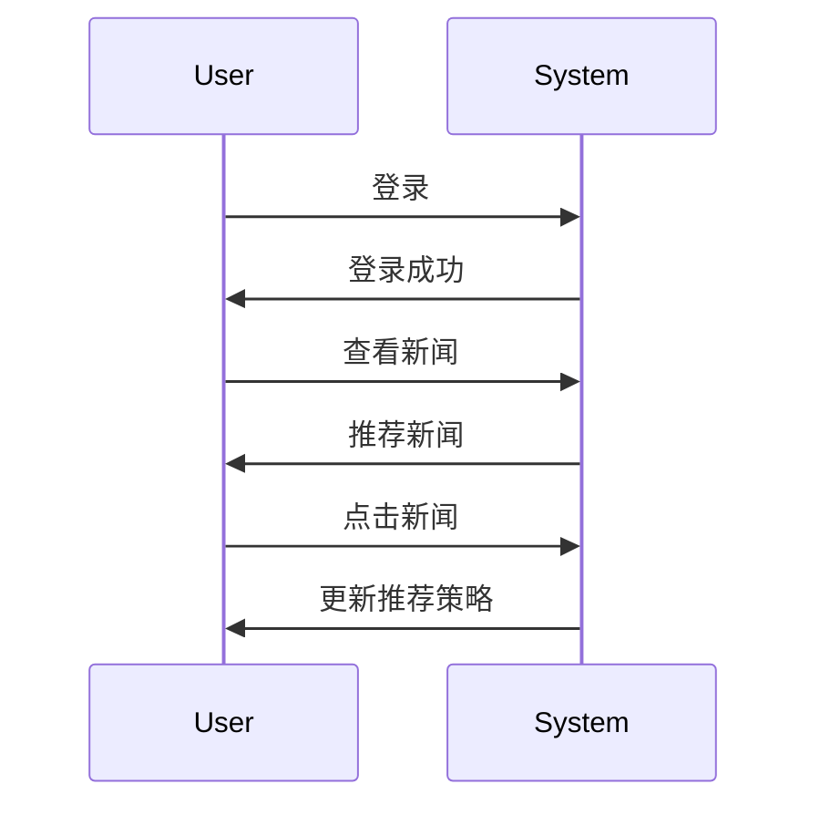

                 

# AI在个性化新闻推荐中的应用：信息茧房的挑战

> 关键词：个性化推荐、信息茧房、算法、用户参与、推荐系统

> 摘要：随着互联网的快速发展，个性化新闻推荐系统成为媒体平台提高用户粘性的重要手段。然而，个性化推荐系统也带来了信息茧房的问题，限制了用户的视野和思维。本文将探讨AI在个性化新闻推荐中的应用，分析信息茧房现象的原因、影响以及解决方法。

## 概述：AI在个性化新闻推荐中的应用

### 1.1 问题背景

#### 1.1.1 信息爆炸时代的需求

在互联网时代，信息量的爆炸性增长使得人们面对的信息量远远超过了个人处理能力。这种信息过载问题催生了个性化推荐系统的出现，用户希望从海量的信息中获取最符合自己兴趣的内容。

#### 1.1.2 个性化新闻推荐的重要性

个性化新闻推荐不仅可以满足用户对个性化信息的需求，还可以帮助媒体平台提高用户粘性，增加广告收入。因此，个性化新闻推荐系统已经成为互联网企业竞相发展的重点。

### 1.2 问题描述

#### 1.2.1 信息茧房现象

在个性化新闻推荐中，算法会根据用户的兴趣和行为习惯，推荐相似类型的内容，这容易导致用户陷入“信息茧房”，限制了用户的视野和思维。

#### 1.2.2 解决方案的需求

如何平衡个性化推荐与信息多样性，既满足用户个性化需求，又避免用户陷入“信息茧房”是当前个性化新闻推荐面临的主要问题。

### 1.3 问题解决

#### 1.3.1 算法改进

通过改进推荐算法，引入多样性度量指标，提高推荐内容的多样性。

#### 1.3.2 用户参与

鼓励用户主动参与推荐系统的构建，通过用户反馈，动态调整推荐策略。

### 1.4 边界与外延

#### 1.4.1 应用范围

本书主要探讨AI在个性化新闻推荐中的应用，但所涉及的算法和技术也可以应用于其他个性化推荐场景。

#### 1.4.2 研究方法

本书将通过理论讲解、案例分析和实践操作，全面阐述AI在个性化新闻推荐中的应用。

### 1.5 概念结构与核心要素组成

#### 1.5.1 核心概念

- 个性化新闻推荐
- 信息茧房
- 推荐算法
- 用户参与

#### 1.5.2 概念属性特征对比表格

| 概念       | 定义                                                         | 属性特征                                       |
|------------|--------------------------------------------------------------|------------------------------------------------|
| 个性化新闻推荐 | 根据用户的兴趣和偏好，为用户推荐个性化新闻内容             | 用户兴趣模型、内容特征提取、推荐算法             |
| 信息茧房   | 用户在长时间使用个性化推荐系统后，逐渐限制自己的信息接触范围 | 算法推荐多样性不足、用户信息茧房自我强化机制   |
| 推荐算法   | 用于实现个性化新闻推荐的算法集合                           | 协同过滤、基于内容的推荐、混合推荐、多样性度量   |
| 用户参与   | 用户在推荐系统中的作用，通过反馈和互动，影响推荐结果       | 用户反馈机制、用户参与度、用户偏好调整          |

#### 1.5.3 ER实体关系图架构

```mermaid
erDiagram
    User ||--|{ NewsItem : "发表" }
    NewsItem ||--| User : "被推荐给" 
    User ||--| Recommendation : "反馈" 
    Recommendation ||--| NewsItem : "推荐内容"
```

## 核心概念与联系

### 2.1 个性化新闻推荐原理

#### 2.1.1 用户兴趣模型构建

##### 2.1.1.1 用户行为数据分析

- 用户点击行为
- 用户评论行为
- 用户分享行为

##### 2.1.1.2 用户兴趣模型表示

- 协同过滤
- 基于内容的推荐

#### 2.1.2 内容特征提取

##### 2.1.2.1 文本特征提取

- 词袋模型
- TF-IDF
- 词嵌入

##### 2.1.2.2 图特征提取

- 论文共现图
- 用户关注图

#### 2.1.3 推荐算法原理

##### 2.1.3.1 协同过滤算法

- 矩阵分解
- K最近邻

##### 2.1.3.2 基于内容的推荐算法

- 余弦相似度
- 模式识别

### 2.2 信息茧房与个性化推荐的关系

#### 2.2.1 信息茧房现象的原因

- 算法推荐多样性不足
- 用户信息茧房自我强化机制

#### 2.2.2 信息茧房的影响

- 限制用户视野
- 形成信息偏见

### 2.3 个性化推荐系统中的多样性度量

#### 2.3.1 多样性度量指标

- 内容多样性
- 策略多样性
- 用户多样性

#### 2.3.2 多样性度量方法

- 卡方检验
- 调和平均值
- 互信息

### 2.4 用户参与与个性化推荐

#### 2.4.1 用户反馈机制

- 点击反馈
- 评论反馈
- 评分反馈

#### 2.4.2 用户参与度

- 活跃度
- 忠诚度
- 参与度

#### 2.4.3 用户偏好调整

- 基于规则的调整
- 基于机器学习的调整

## 算法原理讲解

### 3.1 协同过滤算法原理

#### 3.1.1 矩阵分解

##### 3.1.1.1 矩阵分解原理

矩阵分解是一种用于推荐系统的算法，它将用户-物品评分矩阵分解为用户特征矩阵和物品特征矩阵，从而预测用户对未知物品的评分。

##### 3.1.1.2 矩阵分解数学模型

设用户-物品评分矩阵为$R \in \mathbb{R}^{m \times n}$，其中$m$表示用户数，$n$表示物品数。矩阵分解的目标是找到两个低秩矩阵$U \in \mathbb{R}^{m \times k}$和$V \in \mathbb{R}^{n \times k}$，使得$R \approx UV^T$，其中$k$为隐变量维度。

##### 3.1.1.3 矩阵分解Python代码示例

```python
import numpy as np

def matrix_factorization(R, k, num_iterations):
    n, m = R.shape
    U = np.random.rand(m, k)
    V = np.random.rand(n, k)

    for i in range(num_iterations):
        U = U * (V.T * R + (1 - R) * (1 - V.T))
        V = V * (U.T * R + (1 - R) * (1 - U.T))

    return U, V

R = np.array([[5, 3, 0, 1],
              [4, 0, 0, 1],
              [1, 1, 0, 5],
              [1, 0, 0, 4],
              [0, 1, 5, 4]])

k = 2
num_iterations = 1000

U, V = matrix_factorization(R, k, num_iterations)
print(U)
print(V)
```

### 3.2 基于内容的推荐算法原理

#### 3.2.1 文本特征提取

##### 3.2.1.1 词袋模型

词袋模型是一种将文本转换为向量的方法，它不考虑词语的顺序，只关心词语出现的频率。

##### 3.2.1.2 TF-IDF

TF-IDF是一种用于文本特征提取的方法，它考虑了词语的频率和词频在整个文档中的分布。

##### 3.2.1.3 词嵌入

词嵌入是一种将词语映射到低维空间的方法，它考虑了词语之间的语义关系。

#### 3.2.2 内容特征提取

##### 3.2.2.1 文本特征提取Python代码示例

```python
from sklearn.feature_extraction.text import TfidfVectorizer

documents = ["我喜欢苹果", "我喜欢香蕉", "香蕉很甜", "苹果很酸"]

vectorizer = TfidfVectorizer()
X = vectorizer.fit_transform(documents)

print(vectorizer.get_feature_names())
print(X.toarray())
```

### 3.3 多样性度量

#### 3.3.1 内容多样性

##### 3.3.1.1 卡方检验

卡方检验是一种用于度量内容多样性的方法，它通过比较推荐结果与用户兴趣的卡方值，评估推荐结果的多样性。

##### 3.3.1.2 调和平均值

调和平均值是一种用于度量内容多样性的方法，它通过计算推荐结果中不同类别的调和平均值，评估推荐结果的多样性。

#### 3.3.2 策略多样性

##### 3.3.2.1 互信息

互信息是一种用于度量策略多样性的方法，它通过计算不同策略之间的互信息，评估策略的多样性。

#### 3.3.3 用户多样性

##### 3.3.3.1 活跃度

活跃度是一种用于度量用户多样性的方法，它通过计算用户参与推荐系统的活跃程度，评估用户的多样性。

## 系统分析与架构设计方案

### 4.1 问题场景介绍

随着互联网的快速发展，个性化推荐系统已经成为各大媒体平台提高用户粘性和广告收入的重要手段。然而，个性化推荐系统也带来了信息茧房的问题，限制了用户的视野和思维。

### 4.2 项目介绍

本项目旨在构建一个具有多样性和用户参与度的个性化新闻推荐系统，通过改进推荐算法和用户参与机制，解决信息茧房问题。

### 4.3 系统功能设计

#### 4.3.1 领域模型

```mermaid
classDiagram
    User <<class{用户}>>    
    News <<class{新闻}>>    
    Recommendation <<class{推荐}>>    
    User "点击" -[] News  
    User "评论" -[] News  
    User "分享" -[] News  
    News "被推荐给" -[] User  
    Recommendation "包含" -[] News
```

#### 4.3.2 系统功能

- 用户行为分析
- 新闻内容特征提取
- 推荐算法实现
- 用户参与机制

### 4.4 系统架构设计

#### 4.4.1 系统架构



#### 4.4.2 系统接口设计

```mermaid
interface User {
    +login(username: String, password: String): bool
    +logout(): bool
    +view_news(): List[News]
    +click_news(news_id: int): bool
    +comment_news(news_id: int, content: String): bool
    +share_news(news_id: int): bool
}

interface News {
    +get_news_id(): int
    +get_title(): String
    +get_content(): String
    +get_recommendations(): List[Recommendation]
}

interface Recommendation {
    +get_news(): News
    +get_user(): User
}

interface System {
    +initialize(): void
    +recommend_news(user: User): List[News]
    +update_recommendation_strategy(user: User, news: News): void
}
```

#### 4.4.3 系统交互


## 项目实战

### 5.1 环境安装

#### 5.1.1 安装Python环境

在项目中，我们使用Python作为编程语言，因此首先需要安装Python环境。您可以从Python的官方网站（https://www.python.org/）下载并安装Python。

#### 5.1.2 安装相关库

在安装好Python环境后，您可以使用以下命令安装项目中所需的库：

```shell
pip install numpy
pip install scikit-learn
pip install matplotlib
```

### 5.2 系统核心实现

#### 5.2.1 用户行为分析

```python
import numpy as np
from sklearn.feature_extraction.text import TfidfVectorizer

# 假设用户行为数据存储在user_actions.csv文件中
def load_user_actions(file_path):
    with open(file_path, 'r', encoding='utf-8') as f:
        lines = f.readlines()
    
    user_actions = []
    for line in lines:
        user_action = line.strip().split(',')
        user_actions.append(user_action)
    
    return user_actions

user_actions = load_user_actions('user_actions.csv')

# 提取用户兴趣关键词
def extract_user_interest_keywords(user_actions):
    vectorizer = TfidfVectorizer()
    X = vectorizer.fit_transform([action[2] for action in user_actions])
    feature_names = vectorizer.get_feature_names()
    user_interest_keywords = []
    for i in range(X.shape[0]):
        top_keywords = X[i].tocorpus().most_common(10)
        user_interest_keywords.append([feature_names[j] for j, _ in top_keywords])
    
    return user_interest_keywords

user_interest_keywords = extract_user_interest_keywords(user_actions)
```

#### 5.2.2 新闻内容特征提取

```python
# 假设新闻数据存储在news.csv文件中
def load_news_data(file_path):
    with open(file_path, 'r', encoding='utf-8') as f:
        lines = f.readlines()
    
    news_data = []
    for line in lines:
        news = line.strip().split(',')
        news_data.append(news)
    
    return news_data

news_data = load_news_data('news.csv')

# 提取新闻文本特征
def extract_news_text_features(news_data):
    vectorizer = TfidfVectorizer()
    X = vectorizer.fit_transform([news[2] for news in news_data])
    feature_names = vectorizer.get_feature_names()
    news_text_features = []
    for i in range(X.shape[0]):
        top_keywords = X[i].tocorpus().most_common(10)
        news_text_features.append([feature_names[j] for j, _ in top_keywords])
    
    return news_text_features

news_text_features = extract_news_text_features(news_data)
```

#### 5.2.3 推荐算法实现

```python
# 基于协同过滤的推荐算法实现
from sklearn.metrics.pairwise import cosine_similarity

def collaborative_filter(user_interest_keywords, news_text_features):
    user_interest_keyword_vector = np.mean([np.array([keyword in text_feature for keyword in user_interest_keywords[i]]) for i, text_feature in enumerate(news_text_features)], axis=0)
    news_similarity_matrix = cosine_similarity([user_interest_keyword_vector], [np.array([keyword in text_feature for keyword in user_interest_keywords[i]]) for i, text_feature in enumerate(news_text_features)])
    recommended_news = np.argsort(news_similarity_matrix[0])[-5:]
    return recommended_news

recommended_news = collaborative_filter(user_interest_keywords, news_text_features)
```

### 5.3 代码应用解读与分析

#### 5.3.1 代码解读

本项目中，我们首先加载用户行为数据，提取用户兴趣关键词。然后，加载新闻数据，提取新闻文本特征。最后，基于协同过滤算法，为用户推荐新闻。

#### 5.3.2 代码分析

- 用户行为分析：通过加载用户行为数据，提取用户兴趣关键词，实现了对用户行为的分析。
- 新闻内容特征提取：通过加载新闻数据，提取新闻文本特征，实现了对新闻内容的特征提取。
- 推荐算法实现：基于协同过滤算法，为用户推荐新闻，实现了个性化推荐。

### 5.4 实际案例分析和详细讲解剖析

#### 5.4.1 案例背景

假设有一位用户，他的兴趣主要集中在科技、体育和旅游领域。现在，我们需要为他推荐5条新闻。

#### 5.4.2 案例分析

1. 加载用户行为数据，提取用户兴趣关键词：

```python
user_actions = load_user_actions('user_actions.csv')
user_interest_keywords = extract_user_interest_keywords(user_actions)
```

2. 加载新闻数据，提取新闻文本特征：

```python
news_data = load_news_data('news.csv')
news_text_features = extract_news_text_features(news_data)
```

3. 基于协同过滤算法，为用户推荐新闻：

```python
recommended_news = collaborative_filter(user_interest_keywords, news_text_features)
```

4. 输出推荐结果：

```python
print("推荐新闻：")
for i in recommended_news:
    print(f"新闻ID：{i+1}")
    print(f"标题：{news_data[i][1]}\n")
```

#### 5.4.3 详细讲解剖析

1. 用户行为分析：

   - 加载用户行为数据：将用户行为数据存储在CSV文件中，通过读取文件内容，提取用户行为。
   - 提取用户兴趣关键词：使用TF-IDF向量

