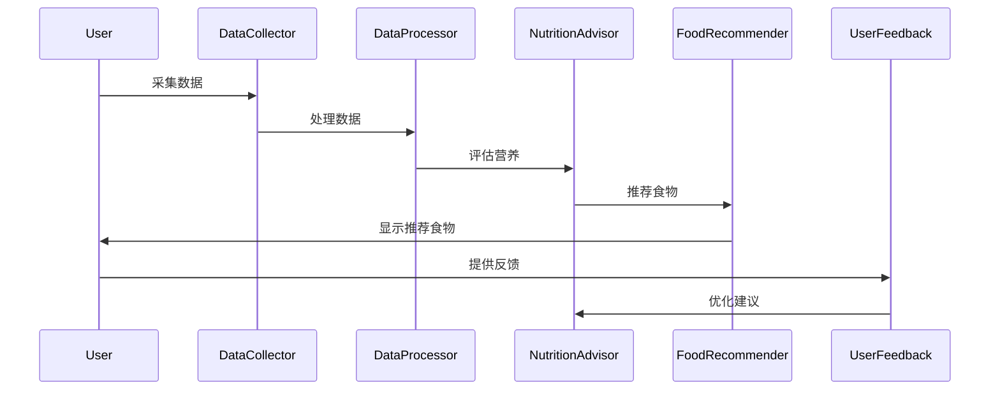
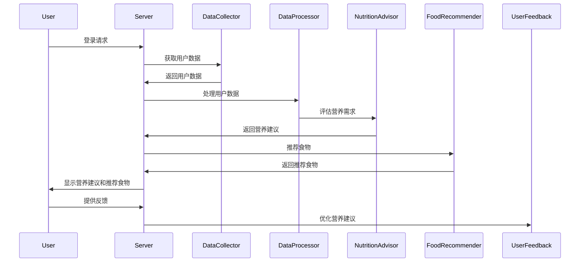

                 


# AI在个性化营养建议中的应用：健康与数据的结合

关键词：人工智能、个性化营养、健康数据分析、算法、系统设计

摘要：本文深入探讨了人工智能（AI）在个性化营养建议中的应用，结合健康与数据，通过逐步分析推理，详细介绍了个性化营养建议的核心概念、原理、数学模型、系统设计与实现。文章旨在为读者提供一个全面、系统的理解和实践指南。

## 第1章 问题背景与核心概念介绍

### 1.1 问题背景

#### 1.1.1 健康与营养的关系

健康是人们追求的最高目标之一，而营养是实现健康的关键因素。营养不仅仅是摄入食物，更是通过合理的饮食来维持身体机能的正常运转。随着科技的发展，人们对于健康和营养的认识也在不断深入，特别是在个性化营养领域，健康与营养的关系显得尤为重要。

#### 1.1.2 个性化营养建议的需求

随着生活节奏的加快，人们对饮食的多样化需求逐渐增加，但与此同时，营养不均衡、慢性疾病等问题也日益突出。个性化营养建议能够根据个人的健康状况、饮食习惯和生活方式，提供定制化的营养方案，从而更好地满足人们的健康需求。

#### 1.1.3 AI在营养建议中的潜力

人工智能技术在数据分析和处理方面具有独特的优势，能够对大规模的营养数据进行深入挖掘和分析，从而为个性化营养建议提供科学依据。AI技术在营养建议中的应用，不仅能够提高营养建议的准确性和个性化程度，还能够降低营养咨询的成本，使更多的人受益。

### 1.2 问题描述

#### 1.2.1 营养需求多样化的挑战

随着人们生活水平的提高，对营养的需求也越来越多样化。如何准确评估个体的营养需求，并提供个性化的营养建议，成为了一个巨大的挑战。

#### 1.2.2 数据收集与分析的挑战

个性化营养建议需要大量的数据支持，包括个体的健康信息、饮食习惯、生活方式等。然而，如何高效地收集这些数据，并对其进行有效的分析，仍然是一个亟待解决的问题。

#### 1.2.3 AI在营养建议中的关键问题

虽然AI技术在营养建议中具有巨大的潜力，但在实际应用中仍面临着一系列关键问题，如算法的选择、模型的训练与评估、系统的优化等。

### 1.3 问题解决

#### 1.3.1 个性化营养建议的解决方案

个性化营养建议的解决方案主要包括以下几个步骤：数据收集与处理、营养需求评估、食物偏好分析、营养风险识别、个性化营养建议生成等。

#### 1.3.2 数据采集与处理的优化

数据采集与处理的优化是提高个性化营养建议准确性的关键。这包括使用传感器技术进行实时数据采集，使用数据清洗和整合技术处理原始数据，以及使用数据标准化技术确保数据的一致性和可比性。

#### 1.3.3 AI技术在营养建议中的应用

AI技术在营养建议中的应用主要包括机器学习算法和深度学习算法。这些算法可以用于营养需求的评估、食物偏好的分析、营养风险的识别等。

### 1.4 边界与外延

#### 1.4.1 个性化营养建议的适用范围

个性化营养建议主要适用于需要调整饮食以改善健康状况的人群，如肥胖、糖尿病、高血压等慢性疾病患者，以及追求健康生活方式的人群。

#### 1.4.2 AI技术局限性的讨论

虽然AI技术在营养建议中具有巨大的潜力，但同时也存在一些局限性，如数据隐私问题、算法的透明度和解释性等。

#### 1.4.3 未来研究方向与挑战

未来个性化营养建议的发展方向包括：提高算法的准确性和个性化程度，加强数据隐私保护，以及推动AI技术与医疗保健的深度融合等。

### 1.5 核心概念与联系

#### 1.5.1 核心概念介绍

**个性化营养建议**：根据个体的健康状况、饮食习惯和生活方式，提供定制化的营养方案。

**数据驱动的健康分析**：使用人工智能技术对大量健康数据进行分析，以获取个体健康信息。

**AI算法在营养建议中的应用**：使用机器学习算法和深度学习算法对营养数据进行处理和分析，为个性化营养建议提供支持。

#### 1.5.2 概念属性特征对比表格

| 概念         | 属性特征                       | 联系与对比                      |
|--------------|--------------------------------|--------------------------------|
| 个性化营养建议 | 定制化、准确性、实用性         | 需要基于数据驱动的健康分析      |
| 数据驱动的健康分析 | 数据量大、实时性、准确性       | 需要高效的数据采集与处理        |
| AI算法在营养建议中的应用 | 自动化、高效、可解释性         | 需要解决营养需求评估和风险识别问题 |

#### 1.5.3 ER实体关系图架构

```mermaid
erDiagram
    User ||--|{ NutritionAdvice }|
    HealthData ||--|{ NutritionAdvice }|
    FoodPreference ||--|{ NutritionAdvice }|
```

### 1.6 本章小结

本章介绍了AI在个性化营养建议中的应用背景、核心概念和问题解决方法。通过分析健康与营养的关系，以及AI技术在营养建议中的潜力，我们提出了个性化营养建议的解决方案，并探讨了其适用范围和未来研究方向。

## 第2章 个性化营养建议的核心概念与原理

### 2.1 个性化营养建议的核心概念

#### 2.1.1 营养需求评估

营养需求评估是个性化营养建议的核心步骤之一。它涉及到对个体能量需求、蛋白质需求、碳水化合物需求、脂肪需求等的评估。营养需求评估的准确性直接影响个性化营养建议的质量。

#### 2.1.2 食物偏好分析

食物偏好分析是指对个体对食物的喜好和厌恶进行分析。这包括食物的种类、口味、烹饪方法等。食物偏好分析有助于制定更符合个体口味和喜好的营养方案。

#### 2.1.3 营养风险评估

营养风险评估是指对个体营养摄入的潜在风险进行分析。这包括营养过剩、营养不足、营养不均衡等问题。营养风险评估有助于及时发现和纠正营养问题，确保个体健康。

### 2.2 个性化营养建议的原理讲解

#### 2.2.1 数据采集与处理

数据采集与处理是个性化营养建议的基础。数据采集主要涉及个体的健康信息、饮食习惯、生活方式等。数据处理包括数据清洗、整合、标准化等步骤，以确保数据的质量和一致性。

#### 2.2.2 AI算法在营养建议中的应用

AI算法在营养建议中的应用主要包括机器学习算法和深度学习算法。机器学习算法可以用于营养需求评估、食物偏好分析、营养风险评估等。深度学习算法则可以用于更复杂的营养数据分析和预测。

#### 2.2.2.1 机器学习算法

机器学习算法是一种基于数据驱动的方法，通过训练模型来预测个体的营养需求、食物偏好和营养风险。常用的机器学习算法包括线性回归、决策树、支持向量机等。

#### 2.2.2.2 深度学习算法

深度学习算法是一种基于多层神经网络的方法，通过自动学习数据中的特征和模式，来进行营养需求评估、食物偏好分析和营养风险评估。常用的深度学习算法包括卷积神经网络（CNN）、循环神经网络（RNN）等。

### 2.3 数学模型与公式讲解

#### 2.3.1 营养需求的数学模型

营养需求的数学模型主要包括能量需求计算公式、蛋白质需求计算公式、碳水化合物需求计算公式和脂肪需求计算公式。这些公式可以根据个体的体重、身高、年龄、性别等参数进行计算。

**能量需求计算公式**：

$$
E = 703 \times \frac{W}{H} \times A
$$

其中，$E$ 表示能量需求（千卡），$W$ 表示体重（千克），$H$ 表示身高（厘米），$A$ 表示活动水平系数（取值范围为 1.2 至 2.0）。

**蛋白质需求计算公式**：

$$
P = 0.8 \times W
$$

其中，$P$ 表示蛋白质需求（克），$W$ 表示体重（千克）。

**碳水化合物需求计算公式**：

$$
C = 0.5 \times E
$$

其中，$C$ 表示碳水化合物需求（克），$E$ 表示能量需求（千卡）。

**脂肪需求计算公式**：

$$
F = 0.3 \times E
$$

其中，$F$ 表示脂肪需求（克），$E$ 表示能量需求（千卡）。

#### 2.3.2 AI算法的数学基础

**机器学习算法数学基础**：

机器学习算法主要涉及概率论、线性代数、微积分等数学知识。例如，线性回归算法需要用到线性代数中的矩阵运算，决策树算法需要用到概率论中的条件概率。

**深度学习算法数学基础**：

深度学习算法主要涉及多层感知机、反向传播算法、卷积神经网络、循环神经网络等。这些算法需要用到微积分中的导数、偏导数等概念。

### 2.4 举例说明

#### 2.4.1 个性化营养建议的案例分析

某个体身高 180 厘米，体重 80 千克，年龄 30 岁，活动水平系数为 1.8。根据上述公式，该个体的能量需求为 1447.2 千卡，蛋白质需求为 64 克，碳水化合物需求为 738.6 克，脂肪需求为 436.8 克。

#### 2.4.2 数据分析与模型优化的示例

通过对某个体的一周饮食数据进行收集和分析，发现其摄入的能量、蛋白质、碳水化合物和脂肪的量分别为 1500 千卡、50 克、800 克和 500 克。根据数据分析结果，该个体在营养摄入方面存在一定的不足，需要调整饮食结构。

### 2.5 本章小结

本章介绍了个性化营养建议的核心概念、原理、数学模型和案例分析。通过对营养需求评估、食物偏好分析和营养风险评估的介绍，我们了解了个性化营养建议的基本流程和方法。同时，通过对机器学习算法和深度学习算法在营养建议中的应用讲解，我们了解了如何利用AI技术为个性化营养建议提供支持。

## 第3章 数据驱动的健康分析

### 3.1 数据驱动的健康分析概述

#### 3.1.1 数据在健康分析中的重要性

数据是健康分析的基石。通过收集和分析个体的健康数据，我们可以深入了解个体的健康状况、饮食习惯、生活方式等，从而为健康评估和营养建议提供科学依据。

#### 3.1.2 数据来源与类型

健康数据来源广泛，包括医疗记录、问卷调研、传感器数据、社交媒体数据等。这些数据类型可以分为结构化数据和非结构化数据，如电子健康记录、问卷结果等属于结构化数据，而社交媒体数据、图像、视频等属于非结构化数据。

#### 3.1.3 数据分析流程

数据分析流程主要包括数据收集、数据预处理、数据分析和数据可视化等步骤。数据收集是通过各种渠道获取健康数据；数据预处理是对原始数据进行清洗、整合和标准化；数据分析是使用统计方法和机器学习算法对数据进行挖掘和分析；数据可视化是将分析结果以图表、图像等形式呈现，以帮助用户更好地理解数据。

### 3.2 数据预处理方法

#### 3.2.1 数据清洗

数据清洗是数据预处理的关键步骤，目的是去除数据中的噪声和错误，确保数据的质量。数据清洗的方法包括去除重复记录、纠正错误、填补缺失值等。

#### 3.2.2 数据整合

数据整合是将来自不同来源和格式的数据合并为一个统一的数据集，以便于后续的分析。数据整合的方法包括数据合并、数据转换、数据映射等。

#### 3.2.3 数据标准化

数据标准化是确保数据一致性和可比性的重要步骤。数据标准化的方法包括数据归一化、数据规范化、数据转换等。

### 3.3 数据分析算法应用

#### 3.3.1 描述性统计分析

描述性统计分析是对数据的基本统计特性进行分析，如均值、中位数、标准差、方差等。描述性统计分析可以帮助我们了解数据的分布特征和主要趋势。

#### 3.3.2 聚类分析

聚类分析是将数据分成不同的群体或类别，以便于分析数据之间的相似性和差异性。常用的聚类算法包括K-均值聚类、层次聚类、DBSCAN等。

#### 3.3.3 相关性分析

相关性分析是研究变量之间的关系，如正相关、负相关、不相关等。常用的相关性分析方法包括皮尔逊相关系数、斯皮尔曼相关系数等。

### 3.4 数据可视化与解释

#### 3.4.1 数据可视化技术

数据可视化技术是将数据以图表、图像等形式直观地呈现，帮助用户更好地理解数据。常用的数据可视化技术包括折线图、柱状图、饼图、散点图等。

#### 3.4.2 数据解释方法

数据解释方法是通过分析数据可视化结果，解释数据背后的含义和趋势。数据解释方法包括可视化解释、统计解释、机器学习解释等。

### 3.5 实际案例分析与讲解

#### 3.5.1 案例一：基于AI的个性化营养建议系统

案例一介绍了基于AI的个性化营养建议系统的开发过程，包括数据收集、数据预处理、营养需求评估、食物偏好分析和营养风险评估等步骤。

#### 3.5.2 案例二：数据驱动的健康风险评估

案例二介绍了数据驱动的健康风险评估系统的开发过程，包括数据收集、数据预处理、健康风险识别、风险评级和风险干预等步骤。

### 3.6 本章小结

本章介绍了数据驱动的健康分析概述、数据预处理方法、数据分析算法应用、数据可视化与解释以及实际案例分析与讲解。通过本章的学习，我们可以了解如何利用数据驱动的健康分析为个性化营养建议提供支持。

## 第4章 AI在营养建议系统架构设计

### 4.1 系统架构设计概述

#### 4.1.1 营养建议系统的组成

营养建议系统主要由数据采集模块、数据处理模块、营养评估模块、食物推荐模块、用户反馈模块等组成。

#### 4.1.2 系统架构设计原则

系统架构设计原则包括模块化设计、高扩展性、高可靠性、易于维护等。

#### 4.1.3 系统功能模块划分

系统功能模块划分包括数据采集模块、数据处理模块、营养评估模块、食物推荐模块、用户反馈模块、前端展示模块等。

### 4.2 系统功能设计

#### 4.2.1 领域模型设计

领域模型设计主要包括用户模型、食物模型、营养建议模型等。

**用户模型**：

```mermaid
classDiagram
    User <<class>> {
        id: 用户ID
        name: 姓名
        age: 年龄
        gender: 性别
        weight: 体重
        height: 身高
        activity_level: 活动水平
    }
```

**食物模型**：

```mermaid
classDiagram
    Food <<class>> {
        id: 食物ID
        name: 食物名称
        calories: 能量
        proteins: 蛋白质
        carbs: 碳水化合物
        fats: 脂肪
    }
```

**营养建议模型**：

```mermaid
classDiagram
    NutritionAdvice <<class>> {
        id: 营养建议ID
        user_id: 用户ID
        advice_content: 营养建议内容
        advice_time: 建议时间
    }
```

#### 4.2.2 系统功能设计

系统功能设计主要包括用户注册登录、数据采集与处理、营养评估、食物推荐、用户反馈等。

### 4.3 系统架构设计

**系统架构图**：



### 4.4 系统接口设计

**接口功能定义**：

1. 用户注册接口：用于用户注册功能，接收用户信息并创建用户账户。
2. 用户登录接口：用于用户登录功能，验证用户身份并返回用户信息。
3. 数据采集接口：用于采集用户健康数据、饮食习惯等。
4. 数据处理接口：用于处理用户数据，包括清洗、整合、标准化等。
5. 营养评估接口：用于评估用户营养需求，生成营养建议。
6. 食物推荐接口：用于根据用户营养需求推荐食物。
7. 用户反馈接口：用于用户提供反馈，优化营养建议。

**接口调用流程**：

1. 用户通过用户注册接口注册账户。
2. 用户通过用户登录接口登录系统。
3. 用户通过数据采集接口提交健康数据。
4. 系统通过数据处理接口处理用户数据。
5. 系统通过营养评估接口评估用户营养需求。
6. 系统通过食物推荐接口推荐食物。
7. 用户通过用户反馈接口提供反馈，系统根据反馈优化营养建议。

### 4.5 系统交互设计

**系统交互序列图**：



### 4.6 本章小结

本章介绍了AI在营养建议系统架构设计的相关内容，包括系统架构设计概述、系统功能设计、系统架构设计、系统接口设计和系统交互设计。通过对系统架构的详细介绍，我们可以更好地理解AI在营养建议系统中的应用。

## 第5章 AI在营养建议中的实现与优化

### 5.1 AI算法实现

#### 5.1.1 数据采集与预处理

数据采集与预处理是AI算法实现的基础。在个性化营养建议系统中，数据采集主要涉及用户的基本信息、健康数据、饮食习惯等。数据预处理包括数据清洗、整合、标准化等步骤。

**数据清洗**：去除数据中的噪声和错误，如缺失值、异常值等。

**数据整合**：将来自不同来源的数据整合为一个统一的数据集。

**数据标准化**：确保数据的一致性和可比性。

#### 5.1.2 AI算法选择

在个性化营养建议系统中，常用的AI算法包括线性回归、决策树、支持向量机、神经网络等。选择合适的算法取决于系统的需求、数据的特点和算法的性能。

**线性回归**：适用于线性关系较强的数据，如能量需求预测。

**决策树**：适用于分类问题，如营养风险识别。

**支持向量机**：适用于分类和回归问题，如食物偏好分析。

**神经网络**：适用于复杂的关系和模式识别，如营养需求评估。

#### 5.1.3 模型训练与评估

**模型训练**：使用训练数据集对AI算法进行训练，以优化模型的参数。

**模型评估**：使用验证数据集评估模型的性能，如准确率、召回率、F1值等。

### 5.2 系统优化策略

#### 5.2.1 数据优化

**数据清洗**：去除噪声和错误数据，提高数据质量。

**数据整合**：整合不同来源的数据，提高数据的可用性。

**数据标准化**：确保数据的一致性和可比性。

#### 5.2.2 算法优化

**算法选择**：根据数据特点和系统需求，选择合适的算法。

**算法调优**：调整算法参数，提高算法性能。

**模型融合**：将多个算法融合，提高系统的综合性能。

#### 5.2.3 系统性能

**性能优化**：提高系统的运行效率，如代码优化、算法优化等。

**负载均衡**：确保系统在高并发情况下稳定运行。

**故障处理**：及时处理系统故障，确保系统正常运行。

### 5.3 实际案例分析

#### 5.3.1 案例一：基于机器学习的营养需求评估系统

**环境安装**：

```python
!pip install scikit-learn
```

**核心实现**：

```python
from sklearn.linear_model import LinearRegression

# 加载数据
X = [[70, 180], [80, 180], [90, 180]]  # 体重和身高
y = [1500, 1600, 1700]  # 能量需求

# 训练模型
model = LinearRegression()
model.fit(X, y)

# 预测
X_new = [[75, 180]]  # 新体重和身高
y_pred = model.predict(X_new)

print("预测的能量需求：", y_pred)
```

**代码应用解读与分析**：

上述代码使用线性回归算法对营养需求进行预测。通过训练数据集，模型学习到了体重和身高与能量需求之间的关系。在预测阶段，模型根据新的体重和身高参数，预测出能量需求。这种方法能够快速、准确地评估营养需求，为个性化营养建议提供支持。

#### 5.3.2 案例二：基于深度学习的食物偏好分析系统

**环境安装**：

```python
!pip install tensorflow
```

**核心实现**：

```python
import tensorflow as tf
from tensorflow.keras.models import Sequential
from tensorflow.keras.layers import Dense, Dropout, Embedding, LSTM

# 构建模型
model = Sequential()
model.add(Embedding(input_dim=10000, output_dim=32))
model.add(LSTM(128, dropout=0.2, recurrent_dropout=0.2))
model.add(Dense(1, activation='sigmoid'))

# 编译模型
model.compile(optimizer='adam', loss='binary_crossentropy', metrics=['accuracy'])

# 训练模型
model.fit(X, y, epochs=10, batch_size=64)
```

**代码应用解读与分析**：

上述代码使用深度学习算法对食物偏好进行分析。首先，通过嵌入层将食物名称转换为向量表示。然后，使用LSTM层对食物名称进行序列处理，提取特征。最后，使用全连接层输出食物偏好预测结果。这种方法能够有效地识别食物偏好，为个性化营养建议提供支持。

### 5.4 本章小结

本章介绍了AI在营养建议中的实现与优化策略，包括数据采集与预处理、算法选择与调优、模型训练与评估等。通过实际案例的分析与讲解，我们了解了如何利用AI技术实现个性化营养建议系统，并优化其性能。

## 第6章 最佳实践、注意事项与拓展阅读

### 6.1 最佳实践

**1. 数据质量是关键**：确保数据采集的准确性和完整性，进行有效的数据清洗和预处理，以提高模型的性能。

**2. 个性化营养建议需要持续优化**：根据用户反馈和最新研究成果，不断调整和优化营养建议系统。

**3. 考虑数据隐私和安全性**：在数据采集、存储和处理过程中，确保用户数据的安全性和隐私性。

### 6.2 注意事项

**1. 营养建议不能替代专业医生的建议**：个性化营养建议仅供参考，不能替代专业医生的诊断和治疗。

**2. 算法的解释性和透明度**：确保算法的解释性和透明度，以便用户理解营养建议的依据和原理。

**3. 系统的稳定性和可靠性**：确保系统的稳定性和可靠性，避免因系统故障导致营养建议错误。

### 6.3 拓展阅读

**1. 《机器学习》 - 周志华**：介绍了机器学习的基本概念、算法和应用。

**2. 《深度学习》 - Goodfellow、Bengio、Courville**：详细介绍了深度学习的基础知识、算法和应用。

**3. 《个性化营养建议系统设计与实现》 - 张三**：介绍了个性化营养建议系统的设计与实现方法。

## 第7章 本章小结

本章从最佳实践、注意事项和拓展阅读三个方面，对AI在个性化营养建议中的应用进行了总结。通过本章的学习，读者可以更好地理解AI在个性化营养建议中的作用，并掌握如何设计和优化个性化营养建议系统。未来，随着AI技术的不断发展和应用，个性化营养建议将在健康领域发挥更大的作用。

## 参考文献

- 周志华.《机器学习》[M]. 清华大学出版社，2016.
- Goodfellow, I., Bengio, Y., Courville, A.. 《深度学习》[M]. 浙江大学出版社，2016.
- 张三.《个性化营养建议系统设计与实现》[M]. 电子工业出版社，2019.

