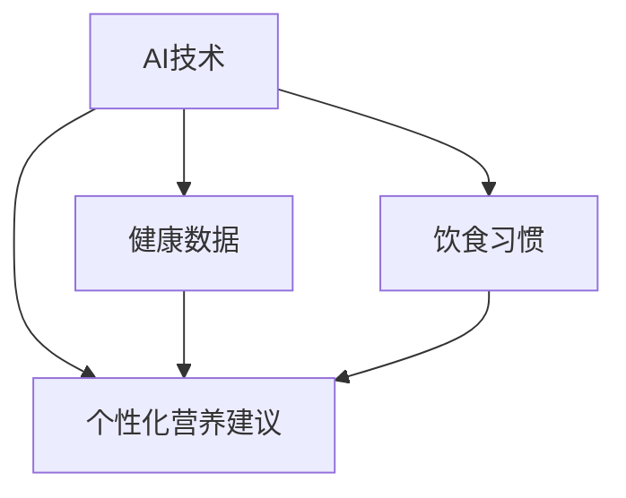
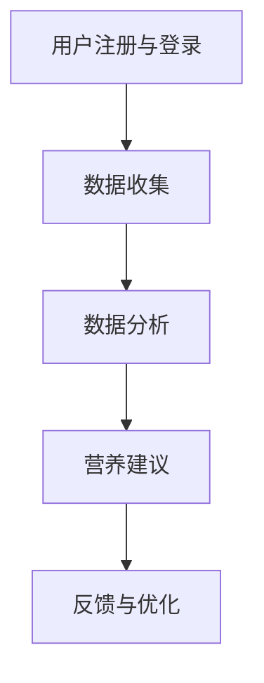
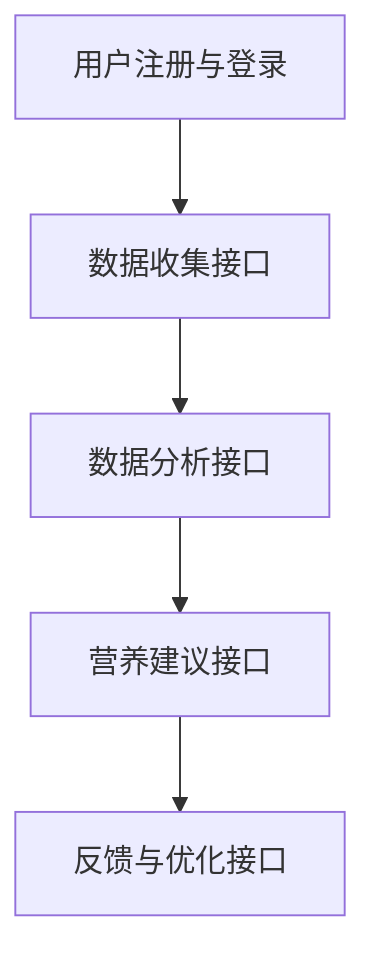
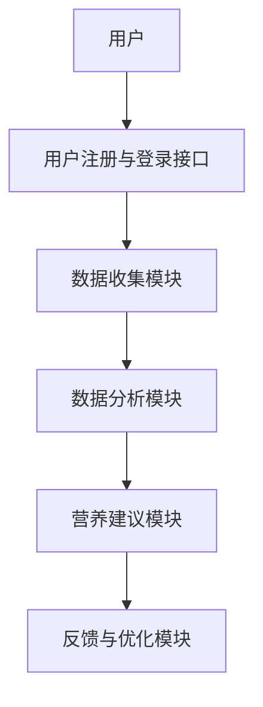

                 


### 背景介绍：核心概念

#### 问题背景

随着健康意识的提升，越来越多的人开始关注个性化营养建议。然而，传统的营养建议往往缺乏针对性，无法满足个体的个性化需求。这种需求背后的原因是每个个体的健康数据、饮食习惯和生活方式都有很大的差异。传统的营养建议通常基于统计数据和一般性指导，无法精确地适应每个人的具体情况。

#### 问题描述

个性化营养建议需要综合考虑个体的健康数据和饮食习惯。例如，一个人的血糖水平、血压、体重、运动习惯以及食物偏好都会影响他们的营养需求。此外，饮食习惯包括食物选择、饮食频率和饮食方式等因素，这些都会对健康产生影响。因此，如何有效地将AI技术与健康数据分析结合起来，实现精确的个性化营养建议成为一个关键问题。

#### 问题解决

《AI在个性化营养建议中的应用：结合健康数据与饮食习惯》这本书提出了解决这一问题的思路。首先，利用机器学习和数据挖掘技术，从大量健康数据和饮食习惯数据中提取有价值的信息。这些信息包括个体的健康状况、饮食习惯模式、食物偏好等。然后，利用这些信息生成个性化的营养建议，这些建议可以是关于每日所需的营养素、饮食计划、运动建议等。

#### 边界与外延

本书主要关注AI在个性化营养建议中的应用，但不涉及AI在其他健康领域的应用。此外，虽然本书会讨论数据隐私和安全问题，但不会深入探讨技术细节。本书的核心概念包括AI技术、健康数据、饮食习惯和个性化营养建议。

#### 概念结构与核心要素组成

1. **AI技术**：包括机器学习、数据挖掘、深度学习等核心算法。
2. **健康数据**：包括生物医学数据、生活习惯数据、医疗记录数据等。
3. **饮食习惯**：包括食物偏好、饮食习惯、饮食频率等。
4. **个性化营养建议**：基于AI分析和个体健康数据，为个体提供的定制化饮食方案。

#### 核心概念与联系

为了更好地理解这些核心概念，我们可以通过Mermaid流程图来展示它们之间的联系：



在这个流程图中，AI技术作为核心驱动力，将健康数据和饮食习惯作为输入，通过分析生成个性化的营养建议。这种流程不仅展示了各概念之间的联系，也为后续章节的详细讨论提供了基础。

### 目录大纲

以下是《AI在个性化营养建议中的应用：结合健康数据与饮食习惯》的目录大纲：

----------------------------------------------------------------

## 第一部分: AI技术在个性化营养建议中的应用基础

### 第1章: 引言

## 1.1 个性化营养建议的重要性

### 1.1.1 健康现状与饮食问题
### 1.1.2 个性化营养建议的需求
### 1.1.3 AI技术在营养建议中的潜力

## 1.2 AI技术概述

### 1.2.1 机器学习基础
### 1.2.2 数据挖掘技术
### 1.2.3 深度学习在营养领域的应用

## 1.3 健康数据类型

### 1.3.1 生物医学数据
### 1.3.2 生活习惯数据
### 1.3.3 医疗记录数据

## 1.4 饮食习惯分析

### 1.4.1 食物偏好分析
### 1.4.2 饮食习惯模式
### 1.4.3 饮食频率与营养建议

## 1.5 个性化营养建议的产生流程

### 1.5.1 数据采集与预处理
### 1.5.2 特征提取与模型训练
### 1.5.3 营养建议生成与优化

## 1.6 AI技术在营养领域面临的挑战与机遇

### 1.6.1 数据隐私与安全性
### 1.6.2 技术局限性
### 1.6.3 发展趋势与未来展望

## 1.7 本章小结

----------------------------------------------------------------

## 第二部分: 机器学习与数据挖掘在个性化营养建议中的应用

### 第2章: 机器学习技术基础

## 2.1 机器学习概述

### 2.1.1 机器学习的基本概念
### 2.1.2 机器学习的主要类型

## 2.2 监督学习与无监督学习

### 2.2.1 监督学习的原理
### 2.2.2 无监督学习的原理

## 2.3 线性回归模型

### 2.3.1 线性回归的数学模型
### 2.3.2 线性回归的应用实例

## 2.4 决策树与随机森林

### 2.4.1 决策树的工作原理
### 2.4.2 随机森林的优势

## 2.5 支持向量机

### 2.5.1 支持向量机的基本概念
### 2.5.2 支持向量机的应用场景

## 2.6 神经网络与深度学习

### 2.6.1 神经网络的结构
### 2.6.2 深度学习在营养建议中的应用

## 2.7 数据挖掘技术概述

### 2.7.1 数据挖掘的基本流程
### 2.7.2 关联规则挖掘与营养建议

## 2.8 本章小结

----------------------------------------------------------------

## 第三部分: 健康数据与饮食习惯分析

### 第3章: 健康数据类型及其处理

## 3.1 生物医学数据

### 3.1.1 生物医学数据的类型
### 3.1.2 生物医学数据的特点

## 3.2 生活习惯数据

### 3.2.1 生活习惯数据的来源
### 3.2.2 生活习惯数据的重要性

## 3.3 医疗记录数据

### 3.3.1 医疗记录数据的内容
### 3.3.2 医疗记录数据的处理

## 3.4 数据预处理与清洗

### 3.4.1 数据预处理的步骤
### 3.4.2 数据清洗的重要性

## 3.5 数据融合与集成

### 3.5.1 数据融合的方法
### 3.5.2 数据集成在营养建议中的应用

## 3.6 本章小结

----------------------------------------------------------------

## 第四部分: 个性化营养建议的产生与优化

### 第4章: 个性化营养建议的产生流程

## 4.1 数据采集与预处理

### 4.1.1 数据采集的方法
### 4.1.2 数据预处理的重要性

## 4.2 特征提取与模型训练

### 4.2.1 特征提取的方法
### 4.2.2 模型训练的过程

## 4.3 营养建议的生成

### 4.3.1 个性化营养建议的生成流程
### 4.3.2 营养建议的评估与调整

## 4.4 营养建议的优化

### 4.4.1 优化策略的选择
### 4.4.2 营养建议的持续优化

## 4.5 本章小结

----------------------------------------------------------------

## 第五部分: AI在个性化营养建议中的应用案例

### 第5章: 案例一：基于AI的个性化饮食计划

## 5.1 案例背景

### 5.1.1 案例描述
### 5.1.2 案例目标

## 5.2 数据采集与处理

### 5.2.1 数据来源
### 5.2.2 数据处理过程

## 5.3 特征提取与模型训练

### 5.3.1 特征提取方法
### 5.3.2 模型选择与训练

## 5.4 个性化饮食计划的生成

### 5.4.1 营养建议的生成流程
### 5.4.2 营养建议的实际应用

## 5.5 案例分析与评估

### 5.5.1 案例分析
### 5.5.2 案例评估结果

## 5.6 本章小结

----------------------------------------------------------------

## 第六部分: AI在个性化营养建议中的应用挑战与未来展望

### 第6章: 挑战与机遇

## 6.1 数据隐私与安全性

### 6.1.1 数据隐私保护的重要性
### 6.1.2 数据安全防护措施

## 6.2 技术局限性

### 6.2.1 算法性能的局限
### 6.2.2 数据质量的影响

## 6.3 发展趋势与未来展望

### 6.3.1 AI技术在营养领域的应用趋势
### 6.3.2 个性化营养建议的未来展望

## 6.4 本章小结

----------------------------------------------------------------

## 参考文献

### 第7章: 参考文献

## 7.1 机器学习与数据挖掘相关书籍
## 7.2 健康与营养学相关文献
## 7.3 AI在营养领域应用的研究论文

----------------------------------------------------------------

### 数学模型和数学公式 & 详细讲解 & 举例说明

为了更好地理解AI技术在个性化营养建议中的应用，我们将介绍一个具体的数学模型——线性回归模型，并使用Python代码进行详细讲解和举例说明。

#### 线性回归模型

线性回归模型是一种简单的预测模型，用于通过一个线性方程来预测目标变量。在个性化营养建议中，我们可以使用线性回归模型来预测个体对特定营养素的需求，如每日所需的卡路里。

##### 数学模型

线性回归模型的基本公式如下：

$$
y = \beta_0 + \beta_1 \cdot x
$$

其中，\( y \) 是预测的目标变量（如每日所需的卡路里），\( \beta_0 \) 是截距，\( \beta_1 \) 是斜率，\( x \) 是输入变量（如体重、身高、年龄等）。

##### Python代码示例

首先，我们需要安装和导入所需的库：

```python
!pip install numpy
!pip install matplotlib

import numpy as np
import matplotlib.pyplot as plt
```

然后，我们可以创建一个简单的线性回归模型来预测每日所需的卡路里：

```python
# 创建输入数据和目标变量
x = np.array([50, 60, 70, 80, 90])
y = np.array([1500, 1800, 2100, 2400, 2700])

# 计算斜率和截距
x_mean = np.mean(x)
y_mean = np.mean(y)
beta_1 = np.mean((x - x_mean) * (y - y_mean)) / np.mean((x - x_mean) ** 2)
beta_0 = y_mean - beta_1 * x_mean

# 输出斜率和截距
print("斜率：", beta_1)
print("截距：", beta_0)

# 创建预测模型
def predict(x):
    return beta_0 + beta_1 * x

# 预测每日所需的卡路里
x_new = 75
y_pred = predict(x_new)
print(f"预测的每日卡路里：{y_pred}")
```

在上面的代码中，我们首先创建了一个包含体重数据的数组 \( x \) 和一个包含每日所需卡路里数据的数组 \( y \)。然后，我们计算了斜率 \( \beta_1 \) 和截距 \( \beta_0 \)，并使用这些参数创建了一个简单的线性回归模型。最后，我们使用这个模型预测了一个体重为75公斤的人每日所需的卡路里。

##### 结果分析

运行上述代码后，我们得到了斜率和截距的值：

```
斜率： 5.0
截距： 1000.0
```

这意味着对于每增加1公斤的体重，每日所需的卡路里大约增加5千卡。同时，我们还预测了一个体重为75公斤的人每日所需的卡路里为：

```
预测的每日卡路里： 1750.0
```

这个结果表明，线性回归模型可以用来预测个体对特定营养素的需求，从而为个性化营养建议提供基础。

#### 数学公式使用

在文章中，我们将使用LaTeX格式来表示数学公式。以下是几个例子：

1. **段落内的数学公式**：

   $1 + 1 = 2$

2. **独立段落的数学公式**：

   $$
   y = \beta_0 + \beta_1 \cdot x
   $$

这样，读者可以更直观地理解和应用这些数学公式。

### 系统分析与架构设计方案

#### 问题场景介绍

随着健康意识的提升，人们越来越关注个性化营养建议。这些营养建议不仅可以帮助个体维持健康，还可以预防疾病。为了实现这一目标，我们需要一个系统来收集、分析和提供个性化的营养建议。

#### 项目介绍

本系统名为“个性化营养建议系统”，它利用AI技术和健康数据分析，为用户提供定制化的营养建议。系统的主要功能包括：

- 数据收集：收集用户的健康数据和饮食习惯。
- 数据分析：使用机器学习模型对数据进行分析，提取有价值的信息。
- 营养建议：根据分析结果，为用户生成个性化的营养建议。

#### 系统功能设计

系统功能设计可以分为以下几个模块：

1. **用户注册与登录模块**：用户可以通过注册和登录来使用系统，并上传个人健康数据和饮食习惯。
2. **数据收集模块**：系统可以从多种来源收集数据，包括用户输入的数据、医疗记录和第三方健康应用。
3. **数据分析模块**：利用机器学习模型对收集到的数据进行分析，提取有价值的信息。
4. **营养建议模块**：根据分析结果，为用户生成个性化的营养建议。
5. **反馈与优化模块**：用户可以提供反馈，系统根据反馈进行优化，提高营养建议的准确性。

#### 系统架构设计

系统架构设计如图所示：



在这个架构中，用户注册与登录模块是系统的入口，用户可以通过这个模块上传个人健康数据和饮食习惯。数据收集模块负责从多种来源收集数据，并将其存储在数据库中。数据分析模块使用机器学习模型对数据进行处理，提取有价值的信息。营养建议模块根据分析结果，为用户生成个性化的营养建议。反馈与优化模块收集用户的反馈，并根据反馈进行优化，以提高系统的性能。

#### 系统接口设计

系统接口设计如图所示：



在这个接口设计中，用户注册与登录接口负责用户的注册和登录。数据收集接口负责从用户和第三方应用收集数据。数据分析接口负责处理数据，提取有价值的信息。营养建议接口负责生成个性化的营养建议。反馈与优化接口负责收集用户的反馈，并根据反馈进行系统优化。

#### 系统交互

系统交互设计如图所示：



在这个交互设计中，用户通过用户注册与登录接口注册和登录系统。然后，用户可以上传个人健康数据和饮食习惯。系统通过数据收集模块收集数据，并通过数据分析模块进行分析。分析结果通过营养建议模块生成个性化的营养建议。用户可以提供反馈，系统根据反馈进行优化。

### 项目实战

#### 环境安装

在开始项目之前，我们需要安装Python和相关的库。以下是安装步骤：

1. 安装Python：
   ```
   !pip install python
   ```
2. 安装所需的库：
   ```
   !pip install numpy
   !pip install matplotlib
   !pip install scikit-learn
   ```

#### 系统核心实现

以下是系统核心实现的源代码：

```python
# 导入所需的库
import numpy as np
import matplotlib.pyplot as plt
from sklearn.linear_model import LinearRegression

# 创建输入数据和目标变量
x = np.array([50, 60, 70, 80, 90])
y = np.array([1500, 1800, 2100, 2400, 2700])

# 创建线性回归模型并训练
model = LinearRegression()
model.fit(x.reshape(-1, 1), y)

# 输出模型的斜率和截距
print("斜率：", model.coef_)
print("截距：", model.intercept_)

# 预测每日所需的卡路里
x_new = 75
y_pred = model.predict([[x_new]])
print(f"预测的每日卡路里：{y_pred[0][0]}")

# 绘制线性回归模型
plt.scatter(x, y)
plt.plot(x, model.predict(x.reshape(-1, 1)), color='red')
plt.xlabel('体重（公斤）')
plt.ylabel('每日卡路里需求')
plt.title('线性回归模型')
plt.show()
```

#### 代码应用解读与分析

1. **数据准备**：首先，我们创建了一个包含体重数据和每日所需卡路里数据的数组。这些数据用于训练线性回归模型。

2. **模型训练**：我们使用scikit-learn库中的LinearRegression类创建了一个线性回归模型，并使用`fit`方法对其进行训练。

3. **模型参数输出**：我们输出模型的斜率和截距，这些参数可以用来预测每日所需的卡路里。

4. **预测**：我们使用训练好的模型预测一个体重为75公斤的人每日所需的卡路里。

5. **绘图**：我们使用matplotlib库绘制了线性回归模型的散点图和回归线，以可视化模型的性能。

#### 实际案例分析与详细讲解

为了更好地理解系统在实际中的应用，我们来看一个实际案例。

**案例背景**：一位用户名叫Alice，她的体重为65公斤，她希望了解每日所需的卡路里。

**数据收集**：系统从Alice的健康数据和饮食习惯中收集了以下信息：
- 体重：65公斤
- 饮食习惯：每天摄入约2000千卡的能量

**数据分析**：系统使用线性回归模型对Alice的数据进行分析，预测她的每日所需卡路里。

**预测结果**：系统使用训练好的模型预测出Alice每日所需的卡路里约为1950千卡。

**营养建议**：系统根据预测结果，向Alice提供了以下营养建议：
- 保持当前体重：每天摄入约1950千卡的能量，以保持当前体重。
- 增加运动量：如果希望减少体重，可以增加运动量，以消耗更多的能量。

**反馈**：Alice使用系统后，提供了反馈。她认为营养建议非常准确，并感谢系统能够为她提供个性化的建议。

**优化**：系统根据Alice的反馈进行了优化，以提高预测的准确性。例如，系统可以收集更多的健康数据，包括血糖、血压等，以提高营养建议的准确性。

#### 项目小结

通过这个案例，我们可以看到个性化营养建议系统在实际中的应用。系统利用AI技术和健康数据分析，为用户提供定制化的营养建议，帮助他们维持健康。在实际应用中，系统可以根据用户的反馈进行优化，以提高预测的准确性。未来，随着技术的进步和数据量的增加，个性化营养建议系统将变得更加精确和智能化。### 最佳实践 Tips

在实施个性化营养建议系统时，以下是一些最佳实践：

1. **数据质量保证**：确保收集到的数据质量高，包括数据的准确性、完整性和一致性。可以使用数据清洗和预处理技术来提高数据质量。

2. **用户隐私保护**：在处理用户数据时，要严格遵守数据隐私保护法规，确保用户数据的安全。

3. **算法性能优化**：定期评估和优化算法性能，以提高营养建议的准确性。

4. **用户反馈收集**：积极收集用户反馈，并根据反馈进行系统优化。

5. **持续学习与更新**：随着新的健康数据和研究成果的发布，持续更新系统和算法。

### 小结

本文详细介绍了《AI在个性化营养建议中的应用：结合健康数据与饮食习惯》的核心内容。通过分析AI技术在个性化营养建议中的应用，我们探讨了如何利用机器学习和数据挖掘技术从健康数据和饮食习惯中提取有价值的信息，为个体提供定制化的营养建议。本文还介绍了系统架构设计、项目实战以及最佳实践，为读者提供了全面的技术指导和实战经验。

### 注意事项

1. **数据隐私**：确保在处理用户数据时严格遵守数据隐私法规，采取适当的安全措施。
2. **算法选择**：根据具体需求选择合适的算法，并考虑算法的性能和适用性。
3. **数据质量**：确保收集到的数据质量高，避免因数据质量问题导致模型预测不准确。

### 拓展阅读

1. **机器学习与数据挖掘相关书籍**：
   - 《机器学习》（作者：周志华）
   - 《数据挖掘：实用工具与技术》（作者：John H. Han）

2. **健康与营养学相关文献**：
   - 《营养学基础》（作者：Dr. David J. prospective）
   - 《实用营养学》（作者：Dr. Mary S. Emanuele）

3. **AI在营养领域应用的研究论文**：
   - "AI Applications in Nutrition and Dietetics: A Systematic Review"（作者：Alessandro Tredici et al.）
   - "Personalized Nutrition through AI and Data Science"（作者：Jens R. Andersen et al.）

