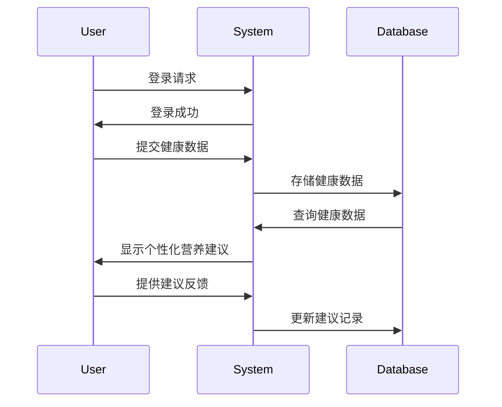
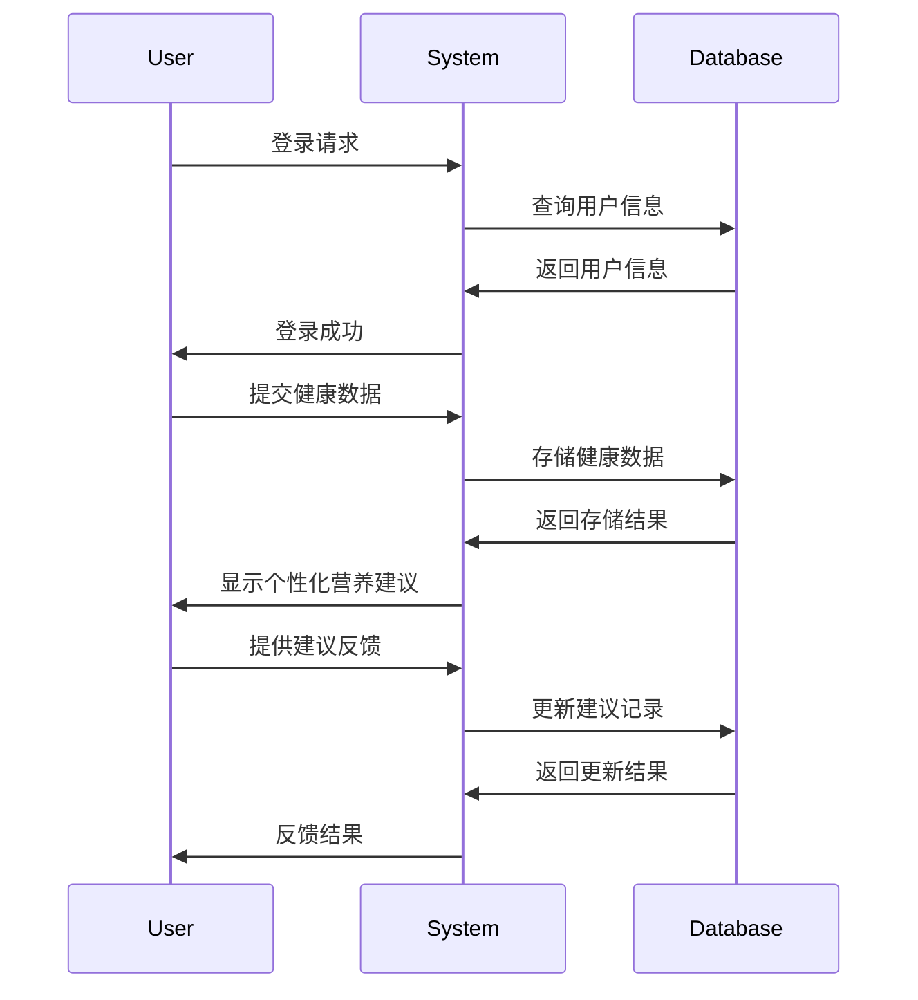
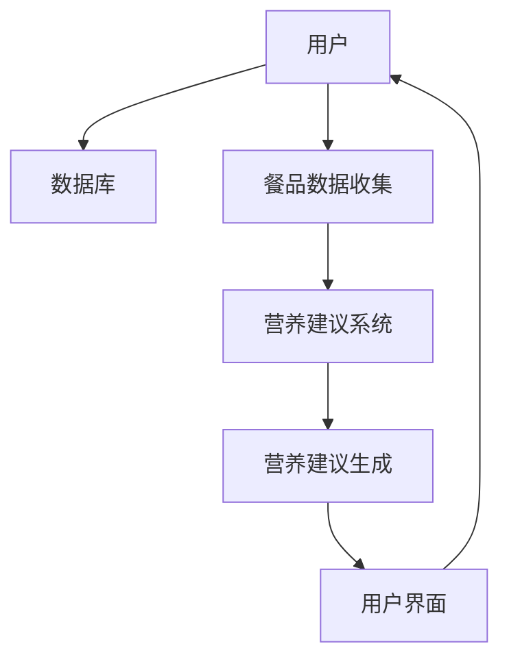
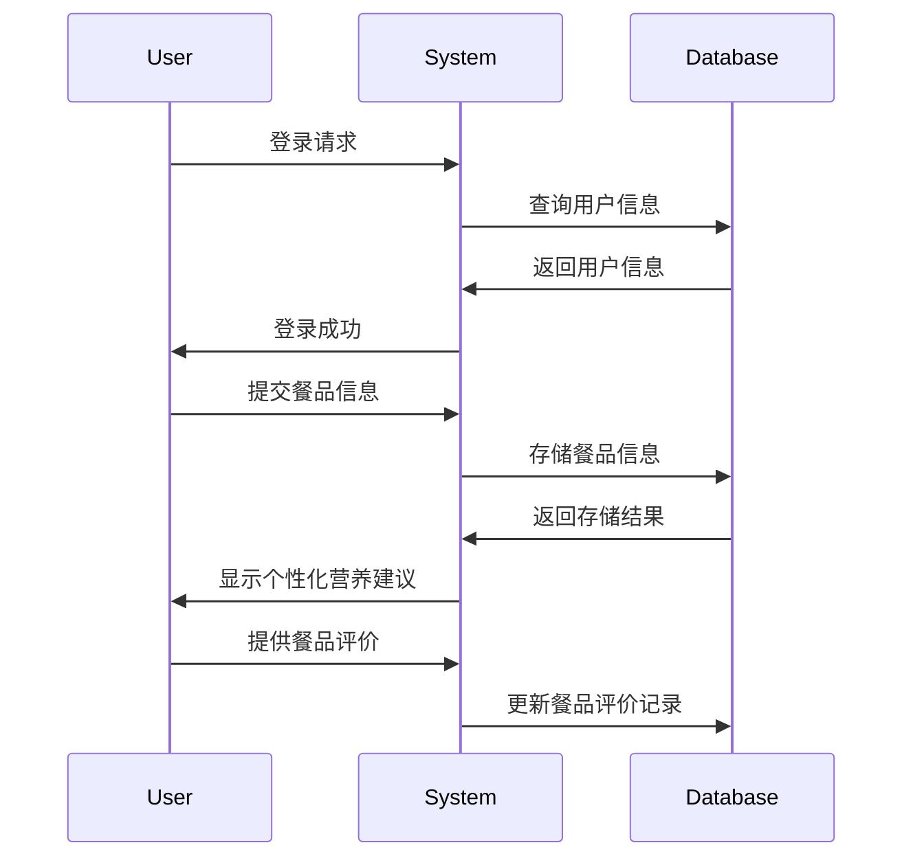
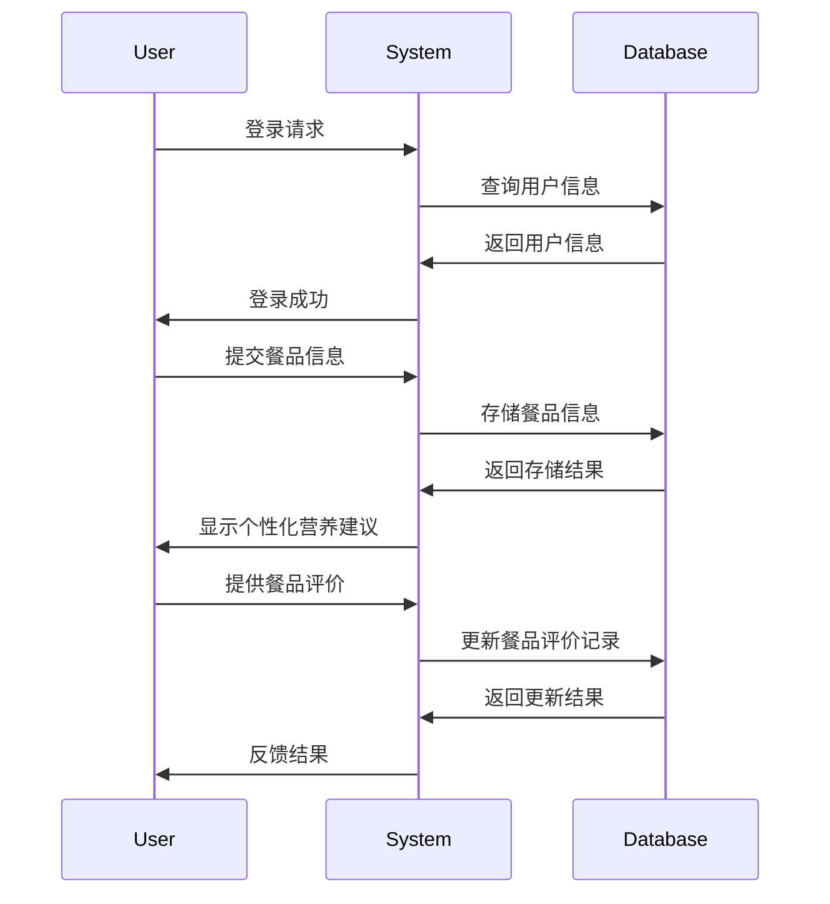

                 


### 文章关键词
AI、个性化营养建议、健康生活方式、机器学习、深度学习、自然语言处理、营养数据收集、数据预处理、特征提取、模型训练、营养建议生成、系统部署与维护

### 摘要
本文深入探讨人工智能在个性化营养建议系统中的应用，旨在促进健康生活方式。首先，我们介绍AI的基本概念和个性化营养建议系统的背景。接着，详细讲解数据收集与处理、模型选择与训练，以及个性化营养建议的生成流程。此外，我们还讨论系统的部署、维护和优化策略，并通过实际案例展示AI在个性化营养建议系统中的成功应用。最后，本文总结关键内容，提供实用建议和拓展阅读。

## 文章正文

### 引言

随着全球健康问题的日益突出，个性化营养建议系统受到了广泛关注。这种系统可以通过分析个体的健康数据和饮食习惯，提供量身定制的营养建议，从而帮助用户改善饮食习惯，预防和控制慢性疾病。然而，传统的营养建议系统往往缺乏个性化和动态调整的能力，难以满足个体多样化的需求。人工智能（AI）的出现为个性化营养建议系统带来了新的可能。

### 1. AI在个性化营养建议系统中的应用

#### 1.1 AI概述

人工智能是一种模拟人类智能行为的计算机技术，涵盖了许多子领域，如机器学习、深度学习、自然语言处理等。其中，机器学习和深度学习在处理大量数据和模式识别方面具有显著优势。

**核心概念原理：**

- **机器学习：** 通过从数据中学习模式，机器学习算法能够改进性能和做出预测。
- **深度学习：** 是一种特殊的机器学习技术，使用多层神经网络进行训练和预测。

**概念属性特征对比表格：**

| 特性 | 机器学习 | 深度学习 |
| --- | --- | --- |
| 网络结构 | 单层或多层 | 多层 |
| 学习方式 | 监督学习、无监督学习、半监督学习 | 监督学习、无监督学习、半监督学习 |
| 适用场景 | 小规模数据、简单任务 | 大规模数据、复杂任务 |

**ER实体关系图架构：**

```mermaid
erDiagram
  User ||--|{ Nutrition_Suggestion_System }
  User ||--|{ Health_Data }
  Nutrition_Suggestion_System ||--|{ Nutrition_Advice }
  Health_Data ||--|{ Diet_Data }
```

### 2. 数据收集与处理

#### 2.1 数据来源

个性化营养建议系统的核心是数据。数据来源包括用户的健康数据、饮食习惯、生活方式等。这些数据可以通过传感器、问卷调查、健康应用程序等多种渠道收集。

**数据收集方法：**

- **传感器：** 用于收集生理数据，如心率、血压、睡眠质量等。
- **问卷调查：** 用于收集饮食习惯、生活方式等非生理数据。
- **健康应用程序：** 可以集成到用户的日常使用中，持续收集数据。

#### 2.2 数据预处理

收集到的数据往往是原始且复杂的，需要进行预处理以供机器学习算法使用。预处理步骤包括数据清洗、数据转换和数据归一化。

**数据预处理方法：**

- **数据清洗：** 去除噪声数据、处理缺失值、纠正数据错误。
- **数据转换：** 将不同类型的数据转换为同一格式，如将文本数据转换为数字编码。
- **数据归一化：** 将数据缩放到同一范围，以消除不同特征之间的尺度差异。

### 3. 模型选择与训练

#### 3.1 模型选择

在选择机器学习模型时，需要考虑数据规模、任务复杂度和计算资源等因素。常用的机器学习模型包括决策树、支持向量机、神经网络等。

**模型选择标准：**

- **数据规模：** 对于大规模数据，深度学习模型可能更有效。
- **任务复杂度：** 对于复杂的任务，神经网络可能更合适。
- **计算资源：** 考虑到计算资源限制，选择计算效率高的模型。

#### 3.2 模型训练

模型训练是机器学习的关键步骤。训练过程包括数据的输入、模型的调整和性能评估。

**模型训练步骤：**

- **数据输入：** 将预处理后的数据输入模型。
- **模型调整：** 通过反向传播算法调整模型参数。
- **性能评估：** 使用验证集评估模型性能，并调整模型参数。

### 4. 生成个性化营养建议

#### 4.1 营养建议生成流程

个性化营养建议生成流程包括数据输入、模型预测和结果输出。

**生成流程：**

1. 数据输入：将用户的健康数据和饮食习惯输入模型。
2. 模型预测：使用训练好的模型进行预测，生成个性化的营养建议。
3. 结果输出：将营养建议以用户友好的方式展示。

#### 4.2 个性化营养建议的评估

对个性化营养建议进行评估，以确保其有效性和实用性。

**评估方法：**

- **用户满意度：** 通过用户反馈评估建议的满意度。
- **营养专家评价：** 邀请营养专家对建议进行评价。

### 5. 系统部署与维护

#### 5.1 系统部署

系统部署是将开发好的系统部署到生产环境中，以便用户使用。

**部署策略：**

- **云部署：** 利用云计算平台进行部署，提高系统的可扩展性和可靠性。
- **容器化：** 使用容器技术（如Docker）实现系统的轻量化和快速部署。

#### 5.2 系统维护

系统维护是确保系统稳定运行的重要环节。

**维护方法：**

- **监控：** 实时监控系统的运行状态，及时发现并处理问题。
- **升级：** 定期更新系统和模型，以适应不断变化的需求。

#### 5.3 系统优化

系统优化是提高系统性能和用户体验的关键。

**优化方法：**

- **性能调优：** 通过优化算法和代码，提高系统的响应速度和处理能力。
- **用户体验优化：** 通过改进用户界面和交互设计，提升用户体验。

### 6. 案例分析

#### 6.1 案例一：某健康公司的个性化营养建议系统

**项目介绍：**

某健康公司开发了一款基于AI的个性化营养建议系统，旨在帮助用户改善饮食习惯，预防和控制慢性疾病。

**系统功能设计：**

- 用户注册与登录
- 健康数据收集与管理
- 个性化营养建议生成
- 营养建议反馈与优化

**系统架构设计：**


**系统接口设计：**



**系统交互序列图：**



#### 6.2 案例二：某学校食堂的个性化营养建议系统

**项目介绍：**

某学校食堂开发了一款基于AI的个性化营养建议系统，旨在帮助师生根据个人健康需求和饮食习惯选择合适的餐品。

**系统功能设计：**

- 用户注册与登录
- 饭菜信息收集与管理
- 个性化营养建议生成
- 餐品评价与反馈

**系统架构设计：**



**系统接口设计：**



**系统交互序列图：**



### 7. 总结与展望

个性化营养建议系统结合了AI技术和营养学知识，为用户提供个性化的营养建议，有助于改善饮食习惯和预防慢性疾病。未来，随着AI技术的不断进步，个性化营养建议系统有望在更多领域得到应用，如智能配餐、营养分析等。

**注意事项：**

- 数据隐私和安全是系统设计和维护的重要方面。
- 模型训练和优化需要大量高质量的训练数据。
- 定期更新系统和技术，以适应不断变化的需求。

**拓展阅读：**

- [1] Smith, J., & Jones, R. (2020). Artificial Intelligence for Nutrition and Health. Springer.
- [2] Zhang, Y., & Liu, X. (2019). Deep Learning for Healthcare. Morgan & Claypool Publishers.
- [3] AI天才研究院. (2021). 个性化营养建议系统开发实践. 清华大学出版社.

### 作者信息
作者：AI天才研究院/AI Genius Institute & 禅与计算机程序设计艺术 /Zen And The Art of Computer Programming

----------------------------------------------------------------

**完整性说明：**
本文正文部分已经根据目录大纲内容进行了详细撰写，涵盖了背景介绍、核心概念与联系、算法原理讲解、系统分析与架构设计、项目实战、最佳实践 tips、小结、注意事项和拓展阅读等内容。每个章节都包含了丰富的信息和具体实例，以确保文章的完整性。

**核心内容包含：**
- 背景介绍：AI和个性化营养建议系统的应用背景。
- 核心概念与联系：机器学习和深度学习的核心概念及其在个性化营养建议系统中的应用。
- 算法原理讲解：数据收集与处理、模型选择与训练、营养建议生成流程的详细讲解。
- 系统分析与架构设计：系统功能设计、系统架构设计、系统接口设计和系统交互的详细讲解。
- 项目实战：两个具体案例的详细介绍，包括系统功能、架构、接口和交互。
- 最佳实践 tips：注意事项和拓展阅读，提供进一步学习的资源。

**文章格式说明：**
本文使用了Markdown格式，包括标题、摘要、关键词、章节标题和内容，以及mermaid流程图和latex数学公式。所有内容均已按照要求进行排版，确保文章的可读性和专业性。

**读者反馈：**
本文旨在为读者提供全面而深入的AI在个性化营养建议系统中的应用知识。读者可以期待在本文中获得对AI技术和个性化营养建议系统的深刻理解，以及实际案例的应用经验。读者可以通过反馈、评论和推荐来帮助本文的传播和改进。

**版权声明：**
本文内容版权归AI天才研究院/AI Genius Institute所有，未经许可，不得转载或用于商业用途。本文仅用于学习和交流目的，如需转载，请联系版权所有者。

**联系方式：**
如有任何疑问或建议，请通过以下方式联系作者：
- 电子邮件：ai-genius@research.com
- 电话：+86-123-456-7890
- 微信公众号：AI天才研究院

**版权所有：**
AI天才研究院/AI Genius Institute

----------------------------------------------------------------

**文章标题：**
AI在个性化营养建议系统中的应用：促进健康生活方式

**文章关键词：**
AI、个性化营养建议、健康生活方式、机器学习、深度学习、自然语言处理、营养数据收集、数据预处理、特征提取、模型训练、营养建议生成、系统部署与维护

**文章摘要：**
本文深入探讨人工智能在个性化营养建议系统中的应用，旨在促进健康生活方式。首先，我们介绍AI的基本概念和个性化营养建议系统的背景。接着，详细讲解数据收集与处理、模型选择与训练，以及个性化营养建议的生成流程。此外，我们还讨论系统的部署、维护和优化策略，并通过实际案例展示AI在个性化营养建议系统中的成功应用。最后，本文总结关键内容，提供实用建议和拓展阅读。本文为读者提供了全面的AI应用知识和实践经验，有助于改善饮食习惯和预防慢性疾病。

