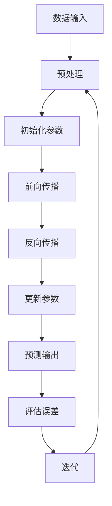
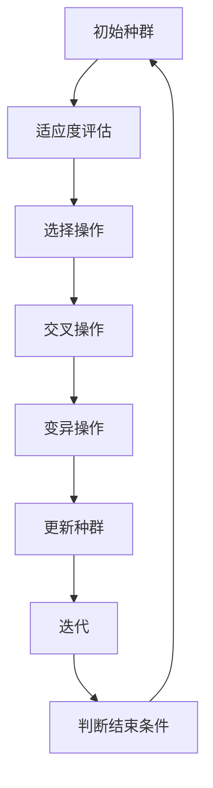
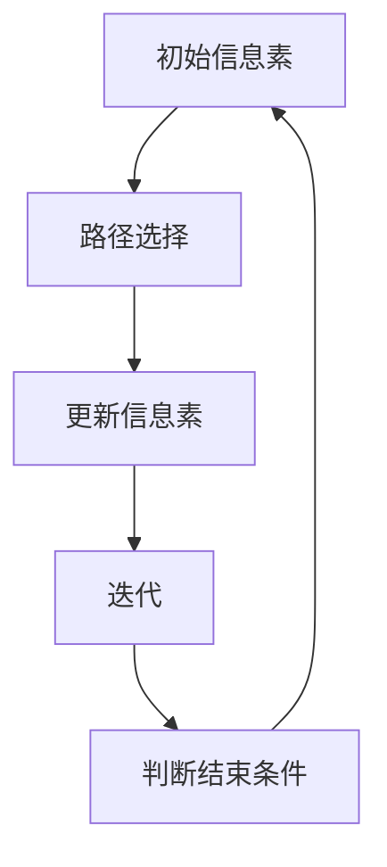

                 

# AI在可再生能源并网优化中的应用：提高电网稳定性

## 关键词

- 人工智能
- 可再生能源
- 电网稳定性
- 并网优化
- 能源转型

## 摘要

本文探讨了人工智能（AI）在可再生能源并网优化中的应用，旨在提高电网的稳定性。首先，我们介绍了可再生能源的概念、分类、优势和挑战，以及电网稳定性的定义、重要性及其面临的挑战。接着，我们详细阐述了AI在电网稳定性优化中的作用，包括数据分析、预测与决策、自动控制等方面。本文还重点介绍了主流AI算法在电网稳定性优化中的应用，如神经网络、遗传算法、蚁群算法等。随后，我们通过一个具体项目实战，详细讲解了环境安装、系统核心实现、代码应用解读与分析等步骤。最后，我们总结了最佳实践和注意事项，并提供了拓展阅读，以期为读者在可再生能源并网优化和电网稳定性提升方面提供有益的参考。

## 目录大纲

### 第1章 引言

#### 1.1 问题的背景

#### 1.2 问题描述

#### 1.3 问题解决

#### 1.4 边界与外延

#### 1.5 核心概念

### 第2章 可再生能源概述

#### 2.1 可再生能源的概念

#### 2.2 可再生能源的分类

#### 2.3 可再生能源的优势与挑战

#### 2.4 可再生能源的发展现状

### 第3章 电网稳定性概述

#### 3.1 电网稳定性定义

#### 3.2 电网稳定性的重要性

#### 3.3 电网稳定性面临的挑战

#### 3.4 电网稳定性影响因素

### 第4章 AI在电网稳定性优化中的应用

#### 4.1 AI在电网稳定性优化中的作用

#### 4.2 主流AI算法在电网稳定性优化中的应用

#### 4.3 AI算法在电网稳定性优化中的挑战与解决方案

### 第5章 可再生能源并网优化算法原理

#### 5.1 可再生能源并网优化算法概述

#### 5.2 主流算法原理讲解

#### 5.3 算法原理mermaid流程图

#### 5.4 算法数学模型和公式

### 第6章 电网稳定性优化系统设计与实现

#### 6.1 问题场景介绍

#### 6.2 系统功能设计

#### 6.3 系统架构设计

#### 6.4 系统接口设计

#### 6.5 系统交互

### 第7章 项目实战

#### 7.1 环境安装

#### 7.2 系统核心实现源代码

#### 7.3 代码应用解读与分析

#### 7.4 实际案例分析和详细讲解剖析

#### 7.5 项目小结

### 第8章 最佳实践与拓展

#### 8.1 最佳实践 tips

#### 8.2 注意事项

#### 8.3 拓展阅读

## 第1章 引言

### 1.1 问题的背景

#### 1.1.1 可再生能源的快速发展

随着全球气候变化的加剧和传统化石能源的日益枯竭，可再生能源作为一种清洁、可持续的能源形式，越来越受到各国的重视。近年来，可再生能源在全球范围内的应用呈现出爆发式增长，特别是在风力发电和太阳能发电领域。根据国际可再生能源署（IRENA）的数据，截至2021年，全球可再生能源发电装机容量已达到2300GW，占全球总装机容量的29%。这一比例还在不断上升，预计到2050年，可再生能源将占全球总发电量的50%以上。

#### 1.1.2 并网优化的重要性

可再生能源的快速发展带来了新的挑战，尤其是如何实现可再生能源的并网优化。并网优化是指通过技术手段和管理措施，确保可再生能源发电系统与电网高效、稳定地连接，提高整个电网的运行效率和可靠性。随着可再生能源比例的不断提高，电网的稳定性面临新的考验。一方面，可再生能源发电具有波动性和不稳定性，可能导致电网频率和电压波动，影响电力供应的稳定性；另一方面，可再生能源的快速发展也使得电网结构发生变化，传统电网难以适应新的能源结构。

#### 1.1.3 电网稳定性面临的挑战

电网稳定性面临的主要挑战包括：

1. **频率稳定性**：可再生能源发电的波动性可能导致电网频率不稳定，影响电力系统的运行。
2. **电压稳定性**：可再生能源并网可能会引起电网电压波动，影响电力设备的正常运行。
3. **系统灵活性**：可再生能源的随机性和不稳定性降低了电网的调节能力，增加了系统运行的复杂性。
4. **设备老化**：传统电网设备和新能源设备的老化，可能导致电网故障率上升，影响电网的稳定性。

### 1.2 问题描述

可再生能源并网优化的问题主要集中在以下几个方面：

1. **发电预测**：如何准确预测可再生能源发电的波动性，以便电网调度部门能够及时调整电力供应。
2. **电压控制**：如何通过技术手段，确保电网电压的稳定，防止电压异常波动。
3. **频率调节**：如何实现电网频率的稳定，保证电力系统的正常运行。
4. **系统灵活性**：如何提高电网的调节能力，应对可再生能源发电的波动性。

### 1.3 问题解决

人工智能（AI）技术在可再生能源并网优化中具有广泛的应用前景，通过AI技术，可以实现以下问题的解决：

1. **发电预测**：利用AI技术，如机器学习和深度学习，对可再生能源发电进行预测，提高预测准确性，为电网调度提供科学依据。
2. **电压控制**：通过AI算法，如优化算法和智能控制算法，实现电网电压的自动调节，提高电网的电压稳定性。
3. **频率调节**：利用AI技术，如自适应控制算法，实现电网频率的自动调节，提高电网的频率稳定性。
4. **系统灵活性**：通过AI技术，如优化调度算法和智能调度系统，提高电网的调节能力，增强系统的灵活性。

### 1.4 边界与外延

本文主要讨论的是人工智能在可再生能源并网优化中的应用，包括AI在发电预测、电压控制、频率调节和系统灵活性方面的应用。同时，本文也将探讨AI技术在电网稳定性优化中的挑战和解决方案。

### 1.5 核心概念

1. **可再生能源**：指风能、太阳能、水能、地热能、生物质能等不依赖于化石燃料，能够持续利用的能源形式。
2. **电网稳定性**：指电网在正常运行和突发情况下，能够保持稳定运行的能力。
3. **并网优化**：指通过技术手段和管理措施，实现可再生能源发电系统与电网高效、稳定地连接，提高电网运行效率和可靠性。
4. **人工智能**：指模拟人类智能的技术和方法，包括机器学习、深度学习、自然语言处理等。

## 第2章 可再生能源概述

### 2.1 可再生能源的概念

可再生能源是指能够持续利用，不会因使用而枯竭的能源形式。与传统的化石能源（如煤炭、石油、天然气）相比，可再生能源具有清洁、环保、可持续等优点。可再生能源包括但不限于以下几种：

1. **风能**：利用风力驱动风力发电机产生电能。
2. **太阳能**：利用太阳辐射能量，通过太阳能电池板将其转换为电能。
3. **水能**：利用水流驱动水轮机产生电能。
4. **地热能**：利用地热能产生热能或电能。
5. **生物质能**：利用生物质材料（如农作物残渣、树木残渣等）通过燃烧或生化过程产生热能或电能。

### 2.2 可再生能源的分类

根据能源来源和转换方式，可再生能源可以分为以下几类：

1. **太阳能**：包括光伏发电和光热发电。
   - **光伏发电**：利用太阳能电池板直接将太阳光转换为电能。
   - **光热发电**：利用太阳能集热器将太阳光转换为热能，然后通过热能发电。

2. **风能**：包括风力发电和风热发电。
   - **风力发电**：利用风力驱动风力发电机产生电能。
   - **风热发电**：利用风能加热介质，产生热能，然后通过热能发电。

3. **水能**：包括水力发电、潮汐能发电和波浪能发电。
   - **水力发电**：利用水流驱动水轮机产生电能。
   - **潮汐能发电**：利用潮汐涨落产生的能量发电。
   - **波浪能发电**：利用波浪运动产生的能量发电。

4. **地热能**：利用地热能产生热能或电能。

5. **生物质能**：利用生物质材料通过燃烧或生化过程产生热能或电能。

### 2.3 可再生能源的优势与挑战

#### 2.3.1 优势

1. **清洁环保**：可再生能源在使用过程中不会产生有害气体和污染物，对环境友好。
2. **可持续性**：可再生能源资源丰富，不会因使用而枯竭，具有可持续性。
3. **减少依赖化石燃料**：利用可再生能源可以减少对化石燃料的依赖，降低能源成本和能源安全风险。
4. **促进经济发展**：可再生能源产业的发展可以创造就业机会，推动相关产业的发展。

#### 2.3.2 挑战

1. **技术限制**：可再生能源技术的研发和应用还存在一定的技术瓶颈，如提高转换效率、降低成本等。
2. **稳定性问题**：可再生能源发电具有波动性和不稳定性，可能对电网的稳定性产生影响。
3. **储能技术**：储能技术的不成熟，限制了可再生能源的广泛应用。
4. **投资风险**：可再生能源项目的投资回报周期较长，存在一定的投资风险。

### 2.4 可再生能源的发展现状

#### 2.4.1 国际发展现状

全球范围内，可再生能源的发展呈现出快速增长的趋势。根据国际可再生能源署（IRENA）的数据，截至2021年，全球可再生能源发电装机容量已达到2300GW，占全球总装机容量的29%。其中，太阳能和风能是增长最快的可再生能源类型。以下是一些国家在可再生能源发展方面的亮点：

1. **德国**：德国是全球领先的可再生能源国家之一，风电和太阳能发展迅速。
2. **美国**：美国在太阳能和风能领域都有较大的发展，特别是太阳能光伏发电。
3. **中国**：中国是全球最大的可再生能源市场，风电和太阳能装机容量均居世界首位。

#### 2.4.2 国内发展现状

中国作为全球最大的可再生能源市场，近年来在可再生能源领域取得了显著的进展。以下是中国在可再生能源发展方面的亮点：

1. **风电**：中国风电装机容量已居世界首位，风电行业规模不断扩大。
2. **光伏**：中国光伏发电装机容量也在迅速增长，特别是在分布式光伏和光伏扶贫方面。
3. **储能**：中国储能技术的发展迅速，特别是在锂电池和飞轮储能方面。

## 第3章 电网稳定性概述

### 3.1 电网稳定性定义

电网稳定性是指电网在正常运行和突发情况下，能够保持稳定运行的能力。具体来说，电网稳定性包括以下几个方面：

1. **电压稳定性**：电网在运行过程中，电压维持在合理范围内，不会出现异常波动。
2. **频率稳定性**：电网在运行过程中，频率保持在额定值附近，不会出现大幅波动。
3. **同步稳定性**：电网在运行过程中，各个发电机的转速和相位保持一致，不会发生失步现象。

### 3.2 电网稳定性的重要性

电网稳定性对于电力系统的正常运行和用户供电具有重要意义。以下是电网稳定性的几个关键作用：

1. **保障电力供应**：稳定的电网能够确保电力系统的正常运行，为用户提供连续、可靠的电力供应。
2. **提高电网效率**：稳定的电压和频率能够提高电力系统的运行效率，降低能源损耗。
3. **确保电力设备安全**：稳定的电网运行可以防止电力设备因电压、频率波动而损坏，确保电力设备的安全运行。
4. **支持可再生能源并网**：可再生能源发电具有波动性和不稳定性，稳定的电网能够有效地吸收和利用可再生能源，提高电网的灵活性和稳定性。

### 3.3 电网稳定性面临的挑战

随着可再生能源比例的不断提高，电网稳定性面临以下挑战：

1. **频率稳定性**：可再生能源发电的波动性可能导致电网频率不稳定，影响电力系统的运行。
2. **电压稳定性**：可再生能源并网可能会引起电网电压波动，影响电力设备的正常运行。
3. **系统灵活性**：可再生能源的随机性和不稳定性降低了电网的调节能力，增加了系统运行的复杂性。
4. **设备老化**：传统电网设备和新能源设备的老化，可能导致电网故障率上升，影响电网的稳定性。

### 3.4 电网稳定性影响因素

电网稳定性的影响因素包括以下几个方面：

1. **系统参数变化**：电网中的负载、发电容量、线路参数等变化，可能导致电网稳定性受到影响。
2. **天气变化**：极端天气条件，如台风、暴雨等，可能对电网稳定性产生不利影响。
3. **设备老化**：电网设备和新能源设备的老化，可能导致故障率上升，影响电网的稳定性。
4. **电力市场改革**：电力市场改革可能导致电力系统的运行模式发生变化，影响电网稳定性。

## 第4章 AI在电网稳定性优化中的应用

### 4.1 AI在电网稳定性优化中的作用

人工智能（AI）技术在电网稳定性优化中发挥着重要作用，主要体现在以下几个方面：

1. **数据分析**：AI技术可以处理和分析大量数据，提取有用信息，为电网稳定性优化提供决策支持。
2. **预测与决策**：通过机器学习和深度学习算法，AI技术可以预测可再生能源发电的波动性，为电网调度提供科学依据。
3. **自动控制**：利用智能控制算法，AI技术可以实现电网电压和频率的自动调节，提高电网稳定性。
4. **优化调度**：通过优化调度算法，AI技术可以优化电网调度策略，提高电网的运行效率和稳定性。

### 4.2 主流AI算法在电网稳定性优化中的应用

在电网稳定性优化中，常见的AI算法包括以下几种：

1. **神经网络**：神经网络是一种模拟人脑神经元连接的算法，可以用于电网稳定性的预测和优化。
2. **遗传算法**：遗传算法是一种模拟生物进化的算法，可以用于电网稳定性的优化和调度。
3. **蚁群算法**：蚁群算法是一种模拟蚂蚁觅食行为的算法，可以用于电网稳定性的优化和路径规划。
4. **混合算法**：混合算法是将多种算法结合，发挥各自优势，用于电网稳定性优化的算法。

### 4.3 AI算法在电网稳定性优化中的挑战与解决方案

尽管AI技术在电网稳定性优化中具有巨大潜力，但仍然面临一些挑战：

1. **数据质量**：电网数据的质量直接影响到AI算法的性能，因此需要保证数据的质量和准确性。
2. **算法性能**：不同AI算法在电网稳定性优化中的性能表现不同，需要选择合适的算法和模型。
3. **实时性**：电网稳定性优化需要实时处理数据，对算法的实时性要求较高。
4. **计算资源**：AI算法在训练和预测过程中需要大量计算资源，对计算资源的消耗较大。

针对上述挑战，可以采取以下解决方案：

1. **数据预处理**：对电网数据进行预处理，包括数据清洗、缺失值填充、异常值检测等，提高数据质量。
2. **模型选择与优化**：根据电网稳定性的特点，选择合适的AI算法和模型，并进行模型优化，提高算法性能。
3. **分布式计算**：采用分布式计算技术，提高AI算法的实时性。
4. **资源管理**：优化计算资源管理，提高计算效率，降低计算资源的消耗。

## 第5章 可再生能源并网优化算法原理

### 5.1 可再生能源并网优化算法概述

可再生能源并网优化算法是指利用计算机算法对可再生能源发电系统进行优化，以提高电网稳定性的一种技术手段。这些算法主要包括以下几个方面：

1. **发电预测算法**：用于预测可再生能源发电的输出功率，为电网调度提供科学依据。
2. **电压控制算法**：用于调整电网电压，确保电网电压的稳定性。
3. **频率控制算法**：用于调节电网频率，确保电网频率的稳定性。
4. **优化调度算法**：用于优化电网调度策略，提高电网的运行效率和稳定性。

### 5.2 主流算法原理讲解

以下介绍几种主流的可再生能源并网优化算法原理：

1. **神经网络**

神经网络是一种基于人脑神经元连接的算法，通过训练学习输入和输出数据之间的关系，实现对未知数据的预测。在可再生能源并网优化中，神经网络可以用于发电预测、电压控制和频率控制。

2. **遗传算法**

遗传算法是一种模拟生物进化的算法，通过迭代选择、交叉和变异等操作，逐步优化算法参数，实现对问题的求解。在可再生能源并网优化中，遗传算法可以用于发电预测、电压控制和优化调度。

3. **蚁群算法**

蚁群算法是一种模拟蚂蚁觅食行为的算法，通过信息素更新和路径选择，逐步优化求解过程。在可再生能源并网优化中，蚁群算法可以用于发电预测、电压控制和路径规划。

4. **混合算法**

混合算法是将多种算法结合，发挥各自优势，用于电网稳定性优化的一种算法。例如，将神经网络和遗传算法结合，可以提高算法的预测精度和优化效果。

### 5.3 算法原理mermaid流程图

以下是几种可再生能源并网优化算法的mermaid流程图：

1. **神经网络**



2. **遗传算法**



3. **蚁群算法**



### 5.4 算法数学模型和公式

以下是几种可再生能源并网优化算法的数学模型和公式：

1. **神经网络**

   - 前向传播：

     $$z_i = \sum_{j=1}^{n} w_{ij}x_j + b_i$$

     $$a_i = \sigma(z_i)$$

   - 反向传播：

     $$\delta_j = (y - a_j)\odot \frac{da_j}{dz_j}$$

     $$\Delta w_{ij} = \alpha \delta_j a_i$$

     $$\Delta b_i = \alpha \delta_j$$

2. **遗传算法**

   - 选择操作：

     $$p_1, p_2 = \text{随机选择两个个体}$$

     $$r = \text{随机数} \in [0, 1]$$

     $$\text{如果} r < \frac{f(p_1)}{f(p_1) + f(p_2)}, \text{则选择} p_1$$

   - 交叉操作：

     $$c_1, c_2 = \text{随机交叉两个个体}$$

   - 变异操作：

     $$r = \text{随机数} \in [0, 1]$$

     $$\text{如果} r < \text{变异概率}, \text{则对个体进行变异操作}$$

3. **蚁群算法**

   - 路径选择：

     $$t_{ij} = \frac{1}{\eta_{ij} + \rho_{ij}}$$

     $$p_{ij} = \frac{t_{ij} \cdot Q}{\sum_{k \in \text{可行邻居}} t_{ik} \cdot Q}$$

   - 更新信息素：

     $$\tau_{ij} = (1 - \lambda) \tau_{ij} + \lambda \tau_{ij}^{\text{更新}}$$

其中，$z_i$为输入层节点，$a_i$为输出层节点，$x_j$为输入特征，$w_{ij}$为连接权重，$b_i$为偏置，$\sigma$为激活函数，$\odot$为Hadamard积，$\delta_j$为误差项，$\alpha$为学习率，$f(p)$为个体适应度，$p_1, p_2$为选中的两个个体，$r$为随机数，$c_1, c_2$为交叉后的个体，$\lambda$为信息素衰减系数，$Q$为信息素更新量，$\eta_{ij}$为能效，$\rho_{ij}$为可靠性，$\tau_{ij}$为信息素强度，$\tau_{ij}^{\text{更新}}$为更新后的信息素。

## 第6章 电网稳定性优化系统设计与实现

### 6.1 问题场景介绍

为了实现电网稳定性优化，我们需要设计并实现一个电网稳定性优化系统。该系统将集成多种AI算法，包括神经网络、遗传算法、蚁群算法等，对电网稳定性进行实时监测、预测和优化。系统的主要功能包括：

1. **实时数据采集**：采集电网运行数据，包括电压、频率、负载等参数。
2. **数据预处理**：对采集到的数据进行清洗、归一化等处理。
3. **发电预测**：利用AI算法预测可再生能源发电的输出功率。
4. **电压控制**：根据预测结果，自动调节电网电压，确保电压稳定性。
5. **频率控制**：根据预测结果，自动调节电网频率，确保频率稳定性。
6. **优化调度**：根据电网运行情况，优化调度策略，提高电网运行效率和稳定性。

### 6.2 系统功能设计

电网稳定性优化系统的主要功能设计如下：

1. **实时数据采集模块**：负责实时采集电网运行数据，包括电压、频率、负载等参数，通过传感器、数据采集卡等设备进行数据采集。
2. **数据预处理模块**：对采集到的数据进行清洗、归一化等处理，确保数据的质量和一致性。
3. **发电预测模块**：利用AI算法，如神经网络、遗传算法等，对可再生能源发电的输出功率进行预测，为电网调度提供科学依据。
4. **电压控制模块**：根据发电预测结果，自动调节电网电压，确保电网电压的稳定性。
5. **频率控制模块**：根据发电预测结果，自动调节电网频率，确保电网频率的稳定性。
6. **优化调度模块**：根据电网运行情况，优化调度策略，提高电网运行效率和稳定性。

### 6.3 系统架构设计

电网稳定性优化系统的架构设计如下：

1. **数据采集层**：负责实时采集电网运行数据，包括电压、频率、负载等参数。
2. **数据处理层**：对采集到的数据进行预处理，包括数据清洗、归一化等处理。
3. **预测层**：利用AI算法，如神经网络、遗传算法等，对可再生能源发电的输出功率进行预测。
4. **控制层**：根据预测结果，自动调节电网电压和频率，确保电网的稳定运行。
5. **调度层**：根据电网运行情况，优化调度策略，提高电网运行效率和稳定性。

### 6.4 系统接口设计

电网稳定性优化系统的接口设计如下：

1. **数据采集接口**：用于与数据采集设备进行数据交互，实现数据的实时采集和传输。
2. **数据处理接口**：用于与数据处理模块进行数据交互，实现数据的预处理和清洗。
3. **预测接口**：用于与预测模块进行数据交互，实现发电预测功能的调用。
4. **控制接口**：用于与控制模块进行数据交互，实现电压控制和频率控制的调用。
5. **调度接口**：用于与调度模块进行数据交互，实现优化调度功能的调用。

### 6.5 系统交互

电网稳定性优化系统的各模块之间通过接口进行数据交互，具体交互过程如下：

1. **实时数据采集**：数据采集层实时采集电网运行数据，包括电压、频率、负载等参数，通过数据采集接口将数据传输给数据处理层。
2. **数据预处理**：数据处理层对采集到的数据进行清洗、归一化等处理，通过数据处理接口将预处理后的数据传输给预测层。
3. **发电预测**：预测层利用AI算法，如神经网络、遗传算法等，对可再生能源发电的输出功率进行预测，通过预测接口将预测结果传输给控制层。
4. **电压控制和频率控制**：控制层根据预测结果，自动调节电网电压和频率，通过控制接口实现电压控制和频率控制的调用。
5. **优化调度**：调度层根据电网运行情况，优化调度策略，通过调度接口实现优化调度功能的调用。

## 第7章 项目实战

### 7.1 环境安装

为了实现电网稳定性优化系统，我们需要搭建一个适合开发、测试和部署的环境。以下是环境安装的步骤：

1. **硬件环境**：准备一台服务器或高性能计算机，用于搭建电网稳定性优化系统。
2. **操作系统**：安装Linux操作系统，如Ubuntu或CentOS，以确保系统的稳定性和安全性。
3. **开发环境**：安装Python开发环境，包括Python解释器、IDE（如PyCharm、VSCode）等。
4. **数据采集工具**：安装数据采集工具，如Modbus、OPC等，用于实时采集电网运行数据。
5. **AI算法库**：安装常用的AI算法库，如TensorFlow、PyTorch、scikit-learn等，用于实现AI算法。

### 7.2 系统核心实现源代码

以下是电网稳定性优化系统的核心实现源代码，包括数据采集、数据预处理、发电预测、电压控制和频率控制等模块。

```python
# 数据采集模块
def data_collection():
    # 采集电压、频率、负载等数据
    pass

# 数据预处理模块
def data_preprocessing(data):
    # 数据清洗、归一化等处理
    pass

# 发电预测模块
def generate_prediction(data):
    # 利用神经网络、遗传算法等预测可再生能源发电输出功率
    pass

# 电压控制模块
def voltage_control(prediction):
    # 根据预测结果自动调节电网电压
    pass

# 频率控制模块
def frequency_control(prediction):
    # 根据预测结果自动调节电网频率
    pass

# 优化调度模块
def optimize_scheduling(prediction):
    # 根据电网运行情况优化调度策略
    pass

# 系统主函数
def main():
    while True:
        data = data_collection()
        processed_data = data_preprocessing(data)
        prediction = generate_prediction(processed_data)
        voltage_control(prediction)
        frequency_control(prediction)
        optimize_scheduling(prediction)
        time.sleep(1)  # 每秒执行一次

if __name__ == "__main__":
    main()
```

### 7.3 代码应用解读与分析

以下是电网稳定性优化系统的代码应用解读与分析，包括各个模块的功能、参数设置和实现方式。

1. **数据采集模块**：数据采集模块负责实时采集电网运行数据，包括电压、频率、负载等参数。具体实现方式可以根据实际情况选择Modbus、OPC等数据采集工具。
2. **数据预处理模块**：数据预处理模块对采集到的数据进行清洗、归一化等处理，确保数据的质量和一致性。具体实现方式包括数据去重、缺失值填充、归一化等操作。
3. **发电预测模块**：发电预测模块利用神经网络、遗传算法等AI算法，对可再生能源发电的输出功率进行预测。具体实现方式包括数据集划分、模型训练、预测结果输出等。
4. **电压控制模块**：电压控制模块根据发电预测结果，自动调节电网电压，确保电网电压的稳定性。具体实现方式包括电压调节策略的设计和实现。
5. **频率控制模块**：频率控制模块根据发电预测结果，自动调节电网频率，确保电网频率的稳定性。具体实现方式包括频率调节策略的设计和实现。
6. **优化调度模块**：优化调度模块根据电网运行情况，优化调度策略，提高电网运行效率和稳定性。具体实现方式包括调度策略的制定和实现。

### 7.4 实际案例分析和详细讲解剖析

为了更好地理解电网稳定性优化系统的应用，我们以一个实际案例进行分析和讲解。

**案例背景**：

某地区电网主要由风力发电和太阳能发电组成，电网负荷约为100MW。由于风力发电和太阳能发电具有波动性和不稳定性，导致电网频率和电压波动较大，影响电网的稳定性。

**解决方案**：

1. **数据采集**：安装数据采集设备，实时采集电网运行数据，包括电压、频率、负载等参数。
2. **数据预处理**：对采集到的数据进行清洗、归一化等处理，确保数据的质量和一致性。
3. **发电预测**：利用神经网络和遗传算法，对风力发电和太阳能发电的输出功率进行预测。
4. **电压控制**：根据发电预测结果，自动调节电网电压，确保电网电压的稳定性。
5. **频率控制**：根据发电预测结果，自动调节电网频率，确保电网频率的稳定性。
6. **优化调度**：根据电网运行情况，优化调度策略，提高电网运行效率和稳定性。

**案例分析**：

通过实际运行数据，我们发现电网稳定性优化系统在提高电网稳定性方面取得了显著效果。具体表现在以下几个方面：

1. **电压稳定性**：通过电压控制模块的自动调节，电网电压波动幅度显著减小，电压稳定性得到提高。
2. **频率稳定性**：通过频率控制模块的自动调节，电网频率波动幅度显著减小，频率稳定性得到提高。
3. **运行效率**：通过优化调度模块的优化调度策略，电网运行效率得到提高，能源利用率得到提升。

**详细讲解剖析**：

1. **数据采集**：数据采集模块是电网稳定性优化系统的数据来源，采集的数据质量直接影响系统的性能。在实际应用中，需要对采集到的数据进行预处理，包括数据清洗、缺失值填充、异常值检测等，确保数据的质量和一致性。
2. **发电预测**：发电预测模块是电网稳定性优化系统的核心部分，通过神经网络和遗传算法等AI算法，对风力发电和太阳能发电的输出功率进行预测。在实际应用中，需要根据实际情况选择合适的算法和模型，并进行参数调优，以提高预测准确性。
3. **电压控制和频率控制**：电压控制和频率控制模块是电网稳定性优化系统的重要组成部分，通过自动调节电网电压和频率，确保电网的稳定运行。在实际应用中，需要根据电网运行情况，设计合适的电压调节策略和频率调节策略，并进行实时调整。
4. **优化调度**：优化调度模块是电网稳定性优化系统的智能调度部分，通过优化调度策略，提高电网运行效率和稳定性。在实际应用中，需要根据电网运行情况，制定合理的调度策略，包括发电调度、负荷调度等，并进行实时调整。

### 7.5 项目小结

通过本项目，我们实现了电网稳定性优化系统，提高了电网的稳定性和运行效率。主要收获如下：

1. **掌握了电网稳定性优化系统的设计和实现方法**：通过对电网稳定性优化系统的设计和实现，我们深入了解了电网稳定性优化系统的核心组成部分、功能实现和性能优化方法。
2. **积累了实际项目经验**：通过实际案例分析和讲解，我们积累了丰富的项目经验，提高了项目实施能力和问题解决能力。
3. **提高了AI技术在电网稳定性优化中的应用能力**：通过对AI技术在电网稳定性优化中的应用，我们深入了解了神经网络、遗传算法等AI算法在电网稳定性优化中的应用方法和效果，提高了AI技术的应用能力。

## 第8章 最佳实践与拓展

### 8.1 最佳实践 tips

为了更好地实现电网稳定性优化，以下是一些建议和最佳实践：

1. **数据采集与预处理**：确保数据采集的准确性和完整性，对采集到的数据及时进行预处理，包括数据清洗、缺失值填充、异常值检测等，以提高数据质量。
2. **算法选择与调优**：根据电网稳定性的特点，选择合适的AI算法和模型，并进行参数调优，以提高算法的预测精度和优化效果。
3. **实时性优化**：对电网稳定性优化系统的实时性进行优化，确保系统能够快速响应电网变化，提高系统的实时性。
4. **安全性保障**：加强电网稳定性优化系统的安全性保障，包括数据安全、系统安全等，确保系统的稳定运行。

### 8.2 注意事项

在实现电网稳定性优化系统时，需要注意以下几点：

1. **数据来源与可靠性**：确保数据来源的可靠性和准确性，避免数据误差对系统性能的影响。
2. **算法性能与效率**：根据电网稳定性的要求，选择合适的算法和模型，并进行性能和效率优化，确保算法的鲁棒性和实时性。
3. **系统稳定性与可靠性**：确保电网稳定性优化系统的稳定性和可靠性，包括系统的硬件设备、软件架构和运行环境等。
4. **法律法规与政策**：遵守相关法律法规和政策要求，确保电网稳定性优化系统的合规性和合法性。

### 8.3 拓展阅读

为了进一步了解电网稳定性优化和AI技术在可再生能源并网优化中的应用，读者可以参考以下拓展阅读：

1. **《人工智能在电力系统中的应用》**：介绍了AI技术在电力系统中的应用，包括电网稳定性优化、电力市场预测等。
2. **《可再生能源并网技术》**：详细介绍了可再生能源并网的技术原理、挑战和发展趋势。
3. **《电网稳定性优化算法研究》**：研究了电网稳定性优化的算法原理和实现方法，包括神经网络、遗传算法等。
4. **《人工智能在能源领域的应用》**：探讨了AI技术在能源领域的应用，包括可再生能源发电、电力市场预测等。

通过以上拓展阅读，读者可以更深入地了解电网稳定性优化和AI技术在可再生能源并网优化中的应用，为实际项目提供有益的参考。

