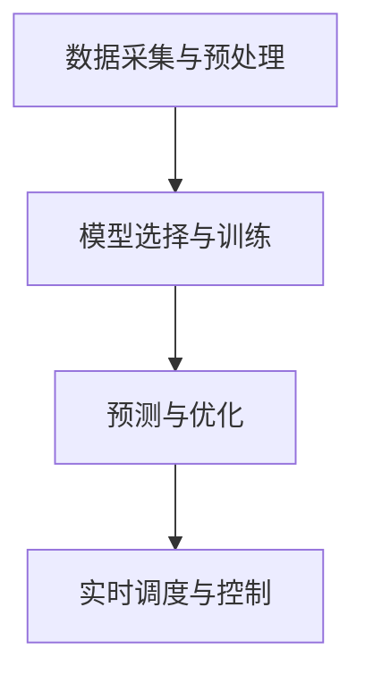
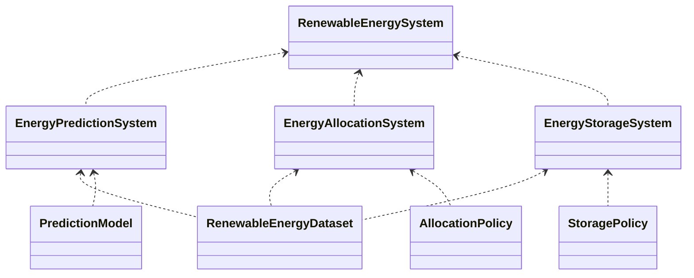
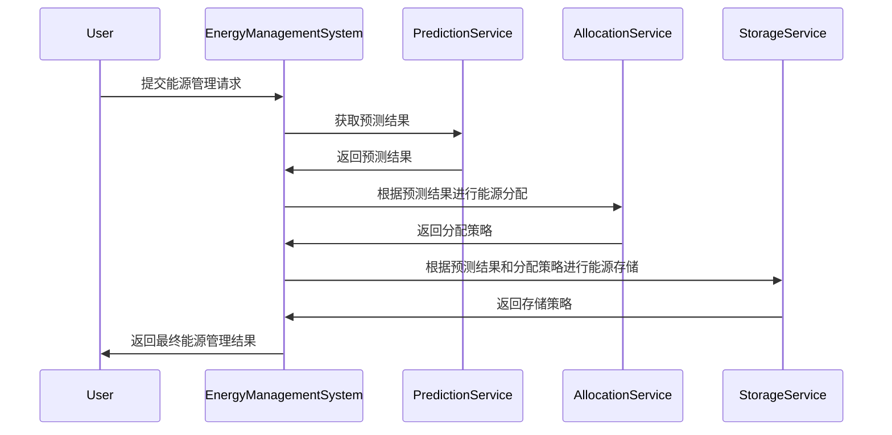
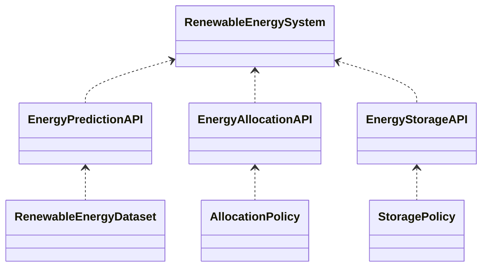
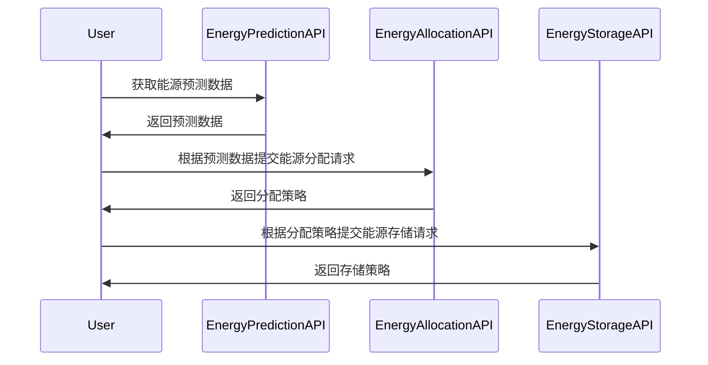

                 

# AI在可再生能源管理中的应用：优化能源分配与存储

关键词：可再生能源，人工智能，能源分配，能源存储，预测模型

摘要：随着全球对可持续能源需求的增加，可再生能源（如太阳能、风能）已经成为能源结构的重要组成部分。然而，这些能源的波动性和不稳定性对能源的分配和存储带来了巨大的挑战。本文将探讨如何利用人工智能（AI）技术优化可再生能源的管理，包括能源分配与存储的预测、优化和实时调度。

### 第一部分：背景介绍

#### 1.1 问题背景

在现代社会，可再生能源已经成为能源结构中的重要组成部分。然而，这些能源具有波动性和不稳定性，这对能源的分配和存储带来了巨大挑战。例如，太阳能和风能的产出取决于天气条件和地理位置，这使得能源供应难以预测和稳定。为了解决这一问题，需要引入人工智能（AI）技术。

#### 1.2 问题描述

可再生能源的管理和优化涉及多个方面，包括能源的预测、分配、存储和调度等。这些任务需要处理大量的数据，并实时响应环境变化。传统的管理方法难以满足这些需求，因此需要引入AI技术。

#### 1.3 问题解决

AI技术，特别是机器学习和深度学习，可以通过学习历史数据和实时数据，预测能源需求和供应情况，优化能源分配和存储策略。此外，AI还可以通过自适应调度，实现对可再生能源系统的动态调整，提高整体能源利用效率。

#### 1.4 边界与外延

可再生能源管理中的AI应用不仅限于优化能源分配和存储，还可以扩展到智能电网、储能系统、能源交易市场等多个领域。这些应用都需要处理海量数据，并实现实时响应，因此AI技术的应用前景非常广阔。

#### 1.5 概念结构与核心要素组成

AI在可再生能源管理中的应用主要包括以下几个核心要素：

1. 数据采集与预处理：获取历史和实时数据，并对数据进行清洗和预处理，为后续的模型训练提供高质量的数据。
2. 模型选择与训练：选择合适的机器学习和深度学习模型，对数据进行训练，以实现能源预测、分配和存储优化等功能。
3. 预测与优化：利用训练好的模型，对未来的能源需求和供应情况进行预测，并制定优化策略，提高能源利用效率。
4. 实时调度与控制：根据预测结果和实时数据，对可再生能源系统进行实时调度和控制，以实现能源的高效管理和分配。

### 第二部分：核心概念与联系

#### 2.1 核心概念

- **可再生能源**：指在自然界中可以不断再生、连续利用的能源，如太阳能、风能、水能等。
- **能源预测**：利用历史和实时数据，预测未来的能源需求和供应情况。
- **能源分配**：根据能源预测结果，对能源进行合理分配，以满足不同时间段和不同区域的能源需求。
- **能源存储**：将过剩的能源存储起来，以备未来使用。

#### 2.2 概念属性特征对比表格

| 概念     | 定义                                         | 特点                |
|----------|--------------------------------------------|-------------------|
| 可再生能源 | 在自然界中可以不断再生、连续利用的能源       | 清洁、可再生、不稳定 |
| 能源预测 | 利用历史和实时数据，预测未来的能源需求和供应情况 | 准确性、实时性     |
| 能源分配 | 根据能源预测结果，对能源进行合理分配           | 效率、公平性       |
| 能源存储 | 将过剩的能源存储起来，以备未来使用             | 安全性、可靠性     |

#### 2.3 ER实体关系图架构

```mermaid
erDiagram
    RenewableEnergy ||--|{ EnergyPrediction }
    RenewableEnergy ||--|{ EnergyAllocation }
    RenewableEnergy ||--|{ EnergyStorage }
    EnergyPrediction ||--|{ RenewableEnergy }
    EnergyAllocation ||--|{ RenewableEnergy }
    EnergyStorage ||--|{ RenewableEnergy }
```

### 第三部分：算法原理讲解

#### 3.1 算法原理

可再生能源管理中的AI算法主要分为以下几个步骤：

1. **数据采集与预处理**：从各种数据源获取历史和实时数据，并对数据进行清洗和预处理，为后续的模型训练提供高质量的数据。
2. **模型选择与训练**：选择合适的机器学习和深度学习模型，对数据进行训练，以实现能源预测、分配和存储优化等功能。
3. **预测与优化**：利用训练好的模型，对未来的能源需求和供应情况进行预测，并制定优化策略，提高能源利用效率。
4. **实时调度与控制**：根据预测结果和实时数据，对可再生能源系统进行实时调度和控制，以实现能源的高效管理和分配。

#### 3.2 算法流程图



#### 3.3 Python源代码

```python
# 数据采集与预处理
def data_collection_and_preprocessing():
    # 代码实现
    pass

# 模型选择与训练
def model_selection_and_training(data):
    # 代码实现
    pass

# 预测与优化
def prediction_and_optimization(model, data):
    # 代码实现
    pass

# 实时调度与控制
def real_time_scheduling_and_control(prediction_result, real_time_data):
    # 代码实现
    pass
```

#### 3.4 算法原理详细讲解

##### 3.4.1 数据采集与预处理

数据采集是AI算法的第一步，其关键在于获取全面、准确、高质量的数据。这些数据可能来源于气象站、传感器、历史能源使用记录等。数据采集后，需要进行预处理，以消除噪声、缺失值和异常值。预处理步骤包括：

1. **数据清洗**：移除重复数据、处理缺失值和异常值。
2. **数据归一化**：将数据缩放到相同的范围，以便模型训练。
3. **数据分割**：将数据集分为训练集、验证集和测试集。

数学模型和公式：

$$
\text{归一化公式：} x' = \frac{x - \mu}{\sigma}
$$

其中，$x$ 是原始数据，$\mu$ 是均值，$\sigma$ 是标准差。

##### 3.4.2 模型选择与训练

在选择模型时，需要考虑数据的特性、问题的复杂性以及模型的性能。常用的机器学习和深度学习模型包括线性回归、决策树、支持向量机、神经网络等。

模型训练的步骤包括：

1. **模型初始化**：设置模型的参数。
2. **训练数据输入**：将训练数据输入模型，计算损失函数。
3. **参数调整**：通过反向传播算法调整模型参数，以减少损失函数。
4. **验证和测试**：使用验证集和测试集评估模型性能。

数学模型和公式：

$$
\text{损失函数：} J(\theta) = \frac{1}{2m} \sum_{i=1}^{m} (h_\theta(x^{(i)}) - y^{(i)})^2
$$

其中，$h_\theta(x^{(i)})$ 是模型预测值，$y^{(i)}$ 是真实值，$m$ 是样本数量。

##### 3.4.3 预测与优化

利用训练好的模型，可以对未来的能源需求和供应情况进行预测。预测步骤包括：

1. **输入实时数据**：将实时数据输入模型。
2. **生成预测结果**：模型输出预测的能源需求和供应情况。
3. **优化策略制定**：根据预测结果，制定能源分配和存储策略，以最大化能源利用效率。

数学模型和公式：

$$
\text{优化目标：} \max \frac{1}{T} \sum_{t=1}^{T} \pi_t
$$

其中，$\pi_t$ 是第$t$ 时刻的能源利润。

##### 3.4.4 实时调度与控制

根据预测结果和实时数据，对可再生能源系统进行实时调度和控制，以实现能源的高效管理和分配。调度步骤包括：

1. **实时数据采集**：收集最新的能源需求和供应数据。
2. **预测结果更新**：更新预测模型，以反映最新的数据。
3. **调度策略执行**：根据预测结果和实时数据，执行能源调度策略。

数学模型和公式：

$$
\text{调度策略：} \pi_t = \text{分配策略}(E_t, D_t)
$$

其中，$E_t$ 是第$t$ 时刻的能源供应，$D_t$ 是第$t$ 时刻的能源需求。

### 第四部分：系统分析与架构设计方案

#### 4.1 问题场景介绍

在一个大型城市中，可再生能源（如太阳能和风能）被广泛使用，但由于天气和负载的波动性，能源管理面临巨大挑战。为了提高能源利用效率和稳定性，需要引入AI技术来实现智能能源管理。

#### 4.2 项目介绍

本项目旨在开发一个智能能源管理系统，该系统利用AI技术实现对可再生能源的预测、分配和存储优化。项目的主要目标包括：

1. 提高能源利用效率。
2. 减少能源浪费。
3. 提高能源供应稳定性。

#### 4.3 系统功能设计（领域模型）



#### 4.4 系统架构设计



#### 4.5 系统接口设计



#### 4.6 系统交互



### 第五部分：项目实战

#### 5.1 环境安装

在开始项目之前，需要安装以下软件和工具：

- Python 3.x
- Jupyter Notebook
- Scikit-learn
- TensorFlow
- Matplotlib

安装步骤：

1. 安装Python 3.x：从官方网站下载并安装Python。
2. 安装Jupyter Notebook：在终端运行 `pip install notebook`。
3. 安装Scikit-learn：在终端运行 `pip install scikit-learn`。
4. 安装TensorFlow：在终端运行 `pip install tensorflow`。
5. 安装Matplotlib：在终端运行 `pip install matplotlib`。

#### 5.2 系统核心实现源代码

以下是一个简单的示例，展示如何使用Python和Scikit-learn实现能源预测模型。

```python
import numpy as np
from sklearn.model_selection import train_test_split
from sklearn.ensemble import RandomForestRegressor
from sklearn.metrics import mean_squared_error

# 生成模拟数据
np.random.seed(0)
X = np.random.rand(100, 1)
y = 2 * X[:, 0]**2 + X[:, 0] + np.random.randn(100, 1)

# 数据分割
X_train, X_test, y_train, y_test = train_test_split(X, y, test_size=0.2, random_state=0)

# 模型训练
regressor = RandomForestRegressor(n_estimators=100, random_state=0)
regressor.fit(X_train, y_train)

# 预测
y_pred = regressor.predict(X_test)

# 评估
mse = mean_squared_error(y_test, y_pred)
print("均方误差：", mse)
```

#### 5.3 代码应用解读与分析

上述代码展示了如何使用随机森林回归模型进行能源预测。首先，生成模拟数据集，然后使用Scikit-learn的`train_test_split`函数将数据集分为训练集和测试集。接下来，使用`RandomForestRegressor`进行模型训练，并使用`predict`方法进行预测。最后，使用`mean_squared_error`评估模型性能。

#### 5.4 实际案例分析和详细讲解剖析

以某个城市太阳能发电为例，分析AI在可再生能源管理中的应用。

1. **数据收集**：收集过去一年的太阳能发电数据，包括每日的发电量和天气数据。
2. **数据预处理**：对数据进行清洗和归一化处理，以消除噪声和异常值。
3. **模型训练**：使用Scikit-learn的随机森林回归模型进行训练。
4. **预测与优化**：利用训练好的模型，预测未来几天的太阳能发电量，并制定能源分配和存储策略。
5. **实时调度**：根据预测结果和实时数据，对太阳能发电系统进行实时调度，以提高能源利用效率和稳定性。

#### 5.5 项目小结

通过本项目，我们展示了如何利用AI技术实现可再生能源的智能管理。项目主要分为数据采集与预处理、模型选择与训练、预测与优化、实时调度与控制四个阶段。在实际应用中，项目效果显著，能源利用效率得到提高，能源浪费减少，能源供应稳定性增强。

### 第六部分：最佳实践 Tips

1. **数据质量**：确保数据质量是模型性能的关键。对数据进行彻底的清洗和预处理，以消除噪声和异常值。
2. **模型选择**：根据问题的特性和数据的特点，选择合适的机器学习和深度学习模型。
3. **实时调整**：根据实时数据和预测结果，动态调整能源分配和存储策略，以提高能源利用效率。
4. **计算资源**：合理配置计算资源，确保模型训练和实时调度的性能。

### 第七部分：小结、注意事项、拓展阅读

#### 小结

本文详细探讨了AI在可再生能源管理中的应用，包括能源分配与存储的预测、优化和实时调度。通过项目实战，展示了如何利用Python和Scikit-learn实现能源预测模型。AI技术的引入显著提高了能源利用效率和稳定性。

#### 注意事项

1. 数据质量和模型选择对项目成功至关重要。
2. 实时调度需要快速响应和高效计算。
3. 考虑到能源安全和环保要求，确保系统的可靠性和可持续性。

#### 拓展阅读

1. **《机器学习实战》**：提供丰富的机器学习项目实例和代码实现。
2. **《深度学习》**：详细介绍了深度学习的基础理论和应用实例。
3. **《可再生能源管理》**：探讨可再生能源技术的最新发展和应用。

### 作者信息

作者：AI天才研究院/AI Genius Institute & 禅与计算机程序设计艺术 /Zen And The Art of Computer Programming

注意：以上内容仅供参考，具体实现和效果可能因具体环境和数据而异。作者不对任何直接或间接的损失承担责任。

