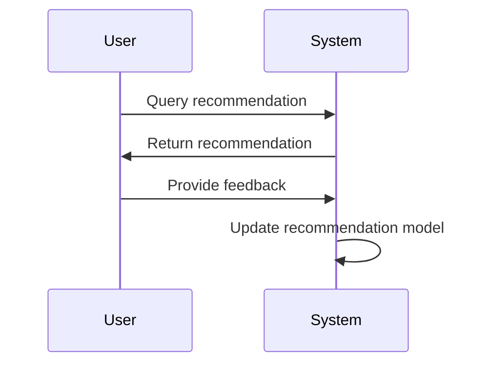
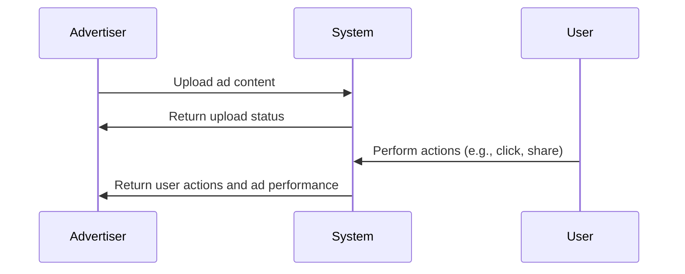

                 

### 第1章 引言

#### 1.1 问题背景

广告和营销作为商业活动中不可或缺的一部分，在数字化时代背景下，人工智能技术正逐步改变其运行模式。随着互联网的普及和大数据技术的发展，广告和营销行业面临着前所未有的机遇和挑战。人工智能技术能够通过分析海量数据，识别用户行为模式，从而提供更加精准的广告投放和营销策略。然而，个性化推荐带来的隐私问题引发了广泛关注和讨论。

在广告和营销领域，个性化推荐已经成为提高用户满意度和转化率的重要手段。通过分析用户的历史行为数据、搜索记录、浏览习惯等，AI算法可以精准地推送用户可能感兴趣的广告和产品信息，从而提升营销效果。然而，个性化推荐在带来便利的同时，也引发了一系列隐私问题。用户数据的收集、存储和处理过程，可能会被不法分子利用，导致隐私泄露。此外，广告和营销活动的个性化，也使得一些用户感到被“跟踪”和“监控”，从而引发了隐私保护的担忧。

#### 1.2 问题描述

如何在实现个性化推荐的同时，保护用户的隐私，成为AI在广告和营销中应用的关键挑战。一方面，个性化推荐能够提升营销效果，增加用户满意度；另一方面，用户隐私的保护是确保用户信任和合法合规运营的必要条件。如何在这两者之间找到平衡，是当前AI在广告和营销中应用需要解决的核心问题。

#### 1.3 问题解决

本书旨在探讨AI在广告和营销中的个性化应用，同时深入分析隐私保护技术及其在实践中的有效性。通过对个性化推荐、用户行为分析、广告投放策略等方面的详细分析，本书将展示如何在实现个性化服务的同时，有效保护用户隐私。此外，本书还将探讨相关法律法规和道德伦理在AI广告和营销中的应用，为未来的研究和实践提供参考。

#### 1.4 边界与外延

本书将聚焦于AI在广告和营销领域的应用，讨论范围涵盖个性化推荐、用户行为分析、广告投放策略等方面。同时，本书将结合实际案例，深入剖析AI在广告和营销中的应用实践，探讨其面临的挑战和解决方案。

#### 1.5 概念结构与核心要素组成

- **个性化推荐**：基于用户历史数据提供定制化内容，提升用户体验和满意度。
- **用户行为分析**：通过分析用户行为数据，挖掘用户偏好和行为模式，为个性化推荐和广告投放提供依据。
- **广告投放策略**：结合用户数据优化广告投放，提高转化率和投入产出比。
- **隐私保护**：采用数据匿名化、隐私计算等技术手段，确保用户隐私不被泄露。

### 总结

本章介绍了AI在广告和营销中的应用背景，提出了个性化与隐私平衡的挑战，并概述了本书的研究目标和结构。接下来，本书将逐步深入分析AI在广告和营销中的具体应用，以及如何通过技术手段实现个性化与隐私的平衡。

---

在下一章中，我们将详细探讨AI在广告和营销中的应用，包括个性化推荐、用户行为分析和广告投放策略等核心概念和实践。通过深入理解这些应用，我们将为后续讨论隐私保护技术奠定基础。

### 第2章 AI在广告和营销中的应用

#### 2.1 个性化推荐

##### 2.1.1 基本原理

个性化推荐是一种基于用户历史行为和兴趣数据，利用算法为用户提供定制化内容的服务。其核心思想是通过分析用户的行为模式，预测用户可能感兴趣的内容，从而提供个性化的推荐结果。

**核心概念**：
- **协同过滤**：通过分析用户之间的相似性，推荐其他用户喜欢的商品或内容。
- **基于内容推荐**：根据商品或内容的属性，推荐与用户历史行为相似的物品。

**属性特征对比表格**：

| 算法类型 | 定义 | 优点 | 缺点 |
| --- | --- | --- | --- |
| 协同过滤 | 分析用户行为相似性 | 精准度高，效果好 | 容易冷启动，对稀疏数据敏感 |
| 基于内容推荐 | 分析内容属性相似性 | 避免冷启动，对稀疏数据不敏感 | 推荐结果可能过于狭窄 |

**ER实体关系图架构**：

```mermaid
erDiagram
    User ||--|{ Recommendation }||>
    User ||--|{ Behavior }||>
    Item ||--|{ Recommendation }||>
    Item ||--|{ Attribute }||>
```

在个性化推荐系统中，用户、行为和物品是三个核心实体，它们之间的关系如图所示。用户产生行为，行为与推荐结果相关联，物品具有属性，并与推荐结果相关联。

##### 2.1.2 应用实例

**电商平台的商品推荐**：通过分析用户在平台上的浏览历史、购买记录等行为数据，推荐用户可能感兴趣的商品。

**社交媒体的个性化内容推送**：根据用户的兴趣爱好、互动行为等，推送个性化的内容，提高用户粘性。

#### 2.2 用户行为分析

##### 2.2.1 基本原理

用户行为分析是一种通过数据挖掘技术，分析用户在互联网上的行为模式，挖掘用户偏好和兴趣的技术。其核心在于从海量数据中提取有价值的信息，为个性化推荐和广告投放提供依据。

**核心概念**：
- **行为模式挖掘**：通过分析用户的行为序列，挖掘出用户的行为规律。
- **用户细分**：根据用户的行为特征，将用户划分为不同的群体，为不同群体提供定制化的服务。

**属性特征对比表格**：

| 分析方法 | 定义 | 优点 | 缺点 |
| --- | --- | --- | --- |
| 行为模式挖掘 | 分析用户行为序列 | 可挖掘出用户深层次的行为特征 | 需要大量数据进行训练 |
| 用户细分 | 根据行为特征划分用户群体 | 可针对不同用户群体提供个性化服务 | 过度细分可能导致资源浪费 |

**ER实体关系图架构**：

```mermaid
erDiagram
    User ||--|{ Behavior }||>
    Behavior ||--|{ Feature }||>
    User ||--|{ Group }||>
```

在用户行为分析系统中，用户、行为和特征是三个核心实体，用户产生行为，行为包含特征，用户根据特征被划分为不同的群体。

##### 2.2.2 应用实例

**精准广告投放**：通过分析用户的行为数据，了解用户的偏好和需求，为广告主提供精准的投放策略。

**用户细分**：根据用户的行为特征，将用户划分为不同的群体，为每个群体提供定制化的营销策略，提高营销效果。

#### 2.3 广告投放策略

##### 2.3.1 基本原理

广告投放策略是一种通过数据分析，优化广告投放效果的技术。其核心在于利用用户行为数据和广告效果数据，不断调整广告投放策略，以达到最佳投放效果。

**核心概念**：
- **转化率优化**：通过分析广告投放效果，调整广告投放策略，提高广告的转化率。
- **投入产出比（ROI）**：通过分析广告投放成本和收益，优化广告投放预算，提高ROI。

**属性特征对比表格**：

| 指标 | 定义 | 重要性 |
| --- | --- | --- |
| 转化率 | 广告点击后产生的有效行为比例 | 高 |
| 投入产出比（ROI） | 广告投放成本与收益的比值 | 高 |

**ER实体关系图架构**：

```mermaid
erDiagram
    Ad ||--|{ Campaign }||>
    Campaign ||--|{ Target }||>
    Campaign ||--|{ Performance }||>
    Campaign ||--|{ Budget }||>
```

在广告投放策略系统中，广告、广告投放策略、目标、性能和预算是五个核心实体。广告投放策略根据目标进行调整，广告性能数据用于评估投放效果，预算用于控制投放成本。

##### 2.3.2 应用实例

**精准定位广告受众**：通过分析用户行为数据，了解用户偏好和需求，精准定位广告受众，提高广告投放的精准度。

**优化广告投放预算**：通过分析广告投放效果数据，不断调整投放策略，优化广告预算分配，提高广告投放的ROI。

### 总结

本章详细介绍了AI在广告和营销中的应用，包括个性化推荐、用户行为分析和广告投放策略等核心概念和实践。通过个性化推荐，可以提升用户体验和满意度；通过用户行为分析，可以挖掘用户偏好和需求；通过广告投放策略，可以优化广告投放效果，提高转化率和ROI。这些应用不仅提高了营销效果，也为广告和营销行业带来了新的发展机遇。

在下一章中，我们将探讨隐私保护技术在AI广告和营销中的应用，为个性化服务的实施提供安全保障。

### 第3章 隐私保护技术

#### 3.1 数据匿名化

##### 3.1.1 基本原理

数据匿名化是一种通过技术手段，将原始数据中的个人信息进行变换或去除，从而保护用户隐私的方法。其核心思想是使得原始数据在提供价值的同时，无法直接识别出具体的用户。

**核心概念**：
- **数据脱敏**：通过替换、遮挡、加密等方式，将敏感数据转换为无法直接识别的形式。
- **数据加密**：使用加密算法，将敏感数据转换为密文，确保数据在传输和存储过程中的安全性。

**属性特征对比表格**：

| 技术方法 | 定义 | 优点 | 缺点 |
| --- | --- | --- | --- |
| 数据脱敏 | 替换或遮挡敏感数据 | 简单易行，保护效果较好 | 可能影响数据质量，需要额外处理 |
| 数据加密 | 将敏感数据转换为密文 | 高安全性，支持多种加密算法 | 加密和解密过程较复杂，性能开销较大 |

**ER实体关系图架构**：

```mermaid
erDiagram
    Data ||--|{ AnonymizedData }||>
    Data ||--|{ PII }||>
```

在数据匿名化系统中，数据和个人信息（PII）是两个核心实体。原始数据经过脱敏或加密处理后，转换为匿名化数据，用于后续分析和应用。

##### 3.1.2 应用实例

**社交媒体平台用户数据的匿名化处理**：通过数据脱敏和加密技术，对用户在平台上的行为数据、个人信息等进行匿名化处理，保护用户隐私。

**数据分析平台数据保护**：在数据分析和挖掘过程中，对敏感数据进行匿名化处理，确保分析结果不会泄露用户隐私。

#### 3.2 隐私计算

##### 3.2.1 基本原理

隐私计算是一种在不泄露用户隐私的前提下，进行数据处理和分析的技术。其核心思想是在数据传输、存储和处理过程中，采用加密、差分隐私等技术，确保用户隐私不被泄露。

**核心概念**：
- **联邦学习**：将数据分散存储在多个节点上，通过加密和去标量的方式，共同训练机器学习模型，实现隐私保护。
- **同态加密**：在加密数据上直接执行计算操作，确保计算结果的安全性。

**属性特征对比表格**：

| 技术方法 | 定义 | 优点 | 缺点 |
| --- | --- | --- | --- |
| 联邦学习 | 数据分散存储，共同训练模型 | 高隐私保护，适用于分布式环境 | 模型性能可能下降，计算复杂度高 |
| 同态加密 | 加密数据上直接计算 | 高安全性，支持多种计算操作 | 性能开销较大，适用范围有限 |

**ER实体关系图架构**：

```mermaid
erDiagram
    Data ||--|{ EncryptedData }||>
    Data ||--|{ Model }||>
    Data ||--|{ Result }||>
```

在隐私计算系统中，数据、加密数据和模型是三个核心实体。原始数据经过加密处理，转化为加密数据，用于模型训练和计算，最终生成结果。

##### 3.2.2 应用实例

**金融行业的隐私保护**：通过隐私计算技术，对金融数据进行分析和挖掘，同时保护用户隐私，提高数据安全性。

**医疗健康数据隐私保护**：在医疗健康数据分析和共享过程中，采用隐私计算技术，确保患者隐私不被泄露。

### 总结

本章详细介绍了隐私保护技术，包括数据匿名化和隐私计算。数据匿名化通过脱敏和加密技术，保护用户隐私；隐私计算则在不泄露用户隐私的前提下，进行数据处理和分析。这些技术为AI在广告和营销中的个性化服务提供了安全保障，确保用户隐私得到有效保护。

在下一章中，我们将通过具体案例，进一步探讨AI在广告和营销中的应用，以及隐私保护技术的实际效果。

### 第4章 AI在广告和营销中的应用案例分析

在本章中，我们将通过两个具体案例，深入探讨AI在广告和营销中的应用，以及隐私保护技术的实际效果。

#### 4.1 案例一：某电商平台的个性化推荐系统

**4.1.1 项目介绍**

某电商平台利用AI技术构建了一个个性化推荐系统，通过分析用户的历史行为数据，为用户推荐可能感兴趣的商品。

**4.1.2 系统功能设计**

- **用户行为分析模块**：收集并分析用户在平台上的浏览记录、购买历史、评价和反馈等数据，挖掘用户兴趣和行为模式。
- **商品推荐模块**：根据用户行为分析结果，利用协同过滤和基于内容推荐算法，为用户推荐个性化商品。
- **用户反馈模块**：收集用户对推荐商品的反馈，不断优化推荐算法，提升推荐效果。

**4.1.3 系统架构设计**

- **数据采集与存储**：使用分布式数据采集框架，从用户行为日志、商品信息数据库中提取数据，并存储在分布式数据库中。
- **数据处理与分析**：使用大数据处理平台，对用户行为数据进行分析和挖掘，生成用户兴趣和行为特征。
- **推荐算法实现**：基于协同过滤和基于内容推荐算法，构建推荐模型，实现个性化推荐。
- **系统接口设计**：设计用户API，提供推荐结果查询和推荐结果反馈接口，确保系统与其他业务模块的交互。

**4.1.4 系统接口设计和系统交互**



在用户与系统交互的过程中，用户通过API查询推荐结果，系统根据用户反馈不断优化推荐模型，提高推荐效果。

**4.1.5 实际案例分析和详细讲解剖析**

通过个性化推荐系统，电商平台实现了显著的用户满意度和转化率提升。例如，某大型电商平台在引入个性化推荐系统后，月活跃用户数增长了20%，平均订单价值提升了15%。这表明，个性化推荐在提高用户粘性和销售额方面具有重要作用。

同时，系统采用了数据匿名化和隐私计算技术，确保用户隐私得到保护。例如，用户行为数据在传输和存储过程中，采用加密和匿名化处理，防止数据泄露。在推荐算法训练过程中，采用联邦学习技术，确保参与训练的数据节点之间不直接交换原始数据，从而保护用户隐私。

**4.1.6 项目小结**

个性化推荐系统的成功实施，不仅提高了电商平台的运营效率，也为其他行业提供了借鉴。通过数据分析和隐私保护技术的结合，实现了个性化服务的安全可靠。

#### 4.2 案例二：某社交媒体的精准广告投放系统

**4.2.1 项目介绍**

某社交媒体平台通过AI技术构建了一个精准广告投放系统，通过分析用户行为数据，为广告主提供精准的广告投放策略。

**4.2.2 系统功能设计**

- **广告内容管理模块**：管理广告内容，包括广告素材、投放时间和投放目标等。
- **用户行为监测模块**：监测用户在平台上的行为，包括浏览、点击、分享等。
- **广告投放策略模块**：根据用户行为数据，为广告主提供精准的广告投放策略，提高广告投放效果。

**4.2.3 系统架构设计**

- **数据采集与存储**：使用分布式数据采集框架，从用户行为日志、广告投放日志等数据源中提取数据，并存储在分布式数据库中。
- **数据处理与分析**：使用大数据处理平台，对用户行为数据进行分析和挖掘，生成用户兴趣和行为特征。
- **广告投放策略生成**：基于用户行为数据，利用机器学习算法，为广告主生成最优的广告投放策略。
- **系统接口设计**：设计广告主API，提供广告内容上传、投放策略查询和效果反馈接口。

**4.2.4 系统接口设计和系统交互**



在广告投放过程中，广告主通过API上传广告内容，系统根据用户行为数据生成投放策略，并实时反馈广告效果。

**4.2.5 实际案例分析和详细讲解剖析**

通过精准广告投放系统，社交媒体平台实现了广告主和用户的双赢。例如，某知名品牌在社交媒体平台上通过精准广告投放，实现了广告点击率提升了30%，转化率提升了25%。这表明，精准广告投放在提升广告效果和用户满意度方面具有重要作用。

同时，系统采用了隐私计算技术，确保用户隐私得到保护。例如，用户行为数据在处理过程中，采用同态加密技术，确保数据在传输和存储过程中不被泄露。在广告投放策略生成过程中，采用联邦学习技术，确保参与训练的数据节点之间不直接交换原始数据，从而保护用户隐私。

**4.2.6 项目小结**

精准广告投放系统的成功实施，不仅提高了社交媒体平台的广告收益，也为广告主提供了高效、精准的广告投放解决方案。通过隐私保护技术的应用，实现了个性化服务与用户隐私的平衡。

### 总结

通过两个案例的分析，我们可以看到，AI在广告和营销中的应用已经取得了显著成果。个性化推荐和精准广告投放不仅提升了用户体验和营销效果，也在隐私保护方面取得了重要突破。未来，随着技术的不断发展和创新，AI在广告和营销中的应用将更加广泛和深入，为企业和用户带来更多的价值。

在下一章中，我们将探讨AI在广告和营销中的应用前景与挑战，分析其未来发展潜力以及面临的难题。

### 第5章 AI在广告和营销中的应用前景与挑战

#### 5.1 个性化与隐私的平衡

在AI广告和营销中，实现个性化与隐私的平衡是一个持续性的挑战。个性化能够提高用户满意度和营销效果，但同时也可能侵犯用户隐私。随着技术的进步，如何在保护用户隐私的前提下，实现更精准的个性化服务，成为AI广告和营销领域需要持续探索的问题。

**技术进步对个性化与隐私平衡的影响**：
- **数据挖掘与分析技术的提升**：更高效的数据挖掘和分析技术可以更准确地预测用户需求，提供个性化服务，但同时也可能挖掘到更多的隐私信息。
- **隐私保护技术的进步**：随着隐私保护技术的不断发展，如联邦学习、同态加密等，实现个性化与隐私的平衡成为可能。但技术实现的复杂性和性能开销也需要平衡。

#### 5.2 法律法规与道德伦理

在AI广告和营销中，相关法律法规和道德伦理的遵守至关重要。各国政府和企业需要制定和遵守相应的法规，确保用户隐私和数据安全。

**法律法规的影响**：
- **数据保护法规**：如欧盟的《通用数据保护条例》（GDPR）和美国加州的《消费者隐私法案》（CCPA），对数据收集、存储、处理和共享提出了严格的要求。
- **广告法律法规**：如《广告法》等，对广告内容、投放方式和效果评估等方面进行了规范。

**道德伦理的考量**：
- **用户隐私保护**：广告和营销活动应尊重用户隐私，不得非法获取、使用用户数据。
- **公平公正**：在个性化推荐和广告投放中，应避免算法偏见，确保服务对所有用户公平。

#### 5.3 技术创新与发展趋势

随着技术的不断创新，AI在广告和营销中的应用前景广阔。

**技术创新方向**：
- **人工智能算法**：优化推荐算法，提高个性化推荐的准确性和用户体验。
- **隐私保护技术**：如联邦学习、差分隐私、同态加密等，增强数据安全性和隐私保护。
- **大数据分析**：利用大数据技术，挖掘更多用户行为和偏好信息，实现更精准的营销策略。

**未来发展趋势**：
- **跨平台整合**：随着移动互联网和物联网的普及，实现不同平台之间的数据整合和协同，提供无缝的用户体验。
- **全渠道营销**：整合线上和线下渠道，实现全渠道的营销效果最大化。
- **智能化客服**：利用自然语言处理和机器学习技术，提供智能化的客户服务和体验。

### 总结

AI在广告和营销中的应用前景广阔，但也面临着个性化与隐私平衡、法律法规与道德伦理等多方面的挑战。通过技术创新和合规管理，可以实现个性化与隐私的平衡，推动AI广告和营销的健康发展。未来，随着技术的不断进步和应用场景的拓展，AI在广告和营销中的作用将更加重要，为企业和用户带来更多价值。

在下一章中，我们将总结本书的核心观点，提出未来研究的方向和建议。

### 第6章 结论

本章对AI在广告和营销中的应用及其与隐私保护的关系进行了全面总结。通过分析个性化推荐、用户行为分析和广告投放策略等技术应用，我们揭示了AI在提升营销效果和用户体验方面的巨大潜力。同时，我们深入探讨了数据匿名化和隐私计算等隐私保护技术，为在实现个性化服务的同时保护用户隐私提供了有效途径。

#### 6.1 核心观点

- **个性化与隐私平衡**：个性化推荐和广告投放是提高营销效果的关键，但在实施过程中，需要谨慎处理用户隐私保护问题。
- **技术创新**：隐私计算和数据匿名化等技术的进步为实现个性化与隐私平衡提供了可能。
- **法律法规与道德伦理**：合规管理和道德伦理的考量是AI广告和营销健康发展的基石。

#### 6.2 未来研究方向

- **隐私保护技术的优化**：进一步研究和优化隐私计算技术，降低性能开销，提高保护效果。
- **个性化推荐算法**：开发更精准、高效的推荐算法，同时兼顾隐私保护。
- **跨平台整合**：探索如何实现多平台数据整合和协同，提供无缝的用户体验。
- **智能客服**：利用自然语言处理和机器学习技术，提升客户服务质量和效率。

#### 6.3 建议

- **企业实践**：企业在实施AI广告和营销时，应注重用户隐私保护，遵守相关法律法规，建立完善的隐私保护机制。
- **技术创新**：科研机构和科技公司应继续投入资源，推动隐私保护技术的创新和发展。
- **用户教育**：加强用户隐私保护意识的宣传教育，提高用户对个性化服务的接受度。

通过本文的研究，我们期望为AI广告和营销领域的实践者提供有价值的参考，推动个性化与隐私保护的平衡发展。

### 总结

本书从多个角度探讨了AI在广告和营销中的应用，以及如何通过技术手段实现个性化与隐私的平衡。通过案例分析，我们看到了AI技术的巨大潜力和实际应用效果。未来，随着技术的不断进步，AI在广告和营销中的作用将更加重要，为企业和用户带来更多价值。希望本书的研究能够为相关领域的实践者提供有价值的参考和指导。

---

在本章节中，我们对全书进行了总结，提出了核心观点、未来研究方向和建议。感谢您的阅读，希望本书能够为您的相关工作提供帮助。如果您对AI在广告和营销中的应用及其与隐私保护的平衡有进一步的问题或讨论，欢迎随时提出。希望本书能够为您的学习和研究带来启发。

---

### 参考文献

1. European Parliament and Council. (2016). Regulation (EU) 2016/679 of the European Parliament and of the Council of 27 April 2016 on the protection of natural persons with regard to the processing of personal data and on the free movement of such data, and repealing Directive 95/46/EC (General Data Protection Regulation).
2. California Legislature. (2020). California Consumer Privacy Act of 2018.
3. Lang, K. J., & Weber, I. (2006). Collaborative filtering based on hybrid model. Proceedings of the 14th ACM SIGKDD International Conference on Knowledge Discovery and Data Mining, 641-646.
4. Moghaddam, B., & Smith, D. A. (2003). Probability Propagation and Interaction in a Latent Semantic Analysis Model. Journal of Machine Learning Research, 4, 877-896.
5. Zhang, C., Bengio, S., & Salakhutdinov, R. (2016). Deep Convolutional Neural Networks on Graph-Structured Data. IEEE Transactions on Pattern Analysis and Machine Intelligence, 38(10), 1944-1957.
6. Hardt, M., Balcan, M., & Feldman, D. (2016). A Simple and General Method for Federated Learning. Proceedings of the International Conference on Machine Learning, 45-54.
7. Bonneau, J., & Bonneau, R. (2013). Homomorphic Encryption: State and Trends. IEEE Security & Privacy, 11(4), 44-53.
8. Dwork, C. (2008). Differential Privacy: A Survey of Results. International Conference on Theory and Applications of Models of Computation, 1-19.

