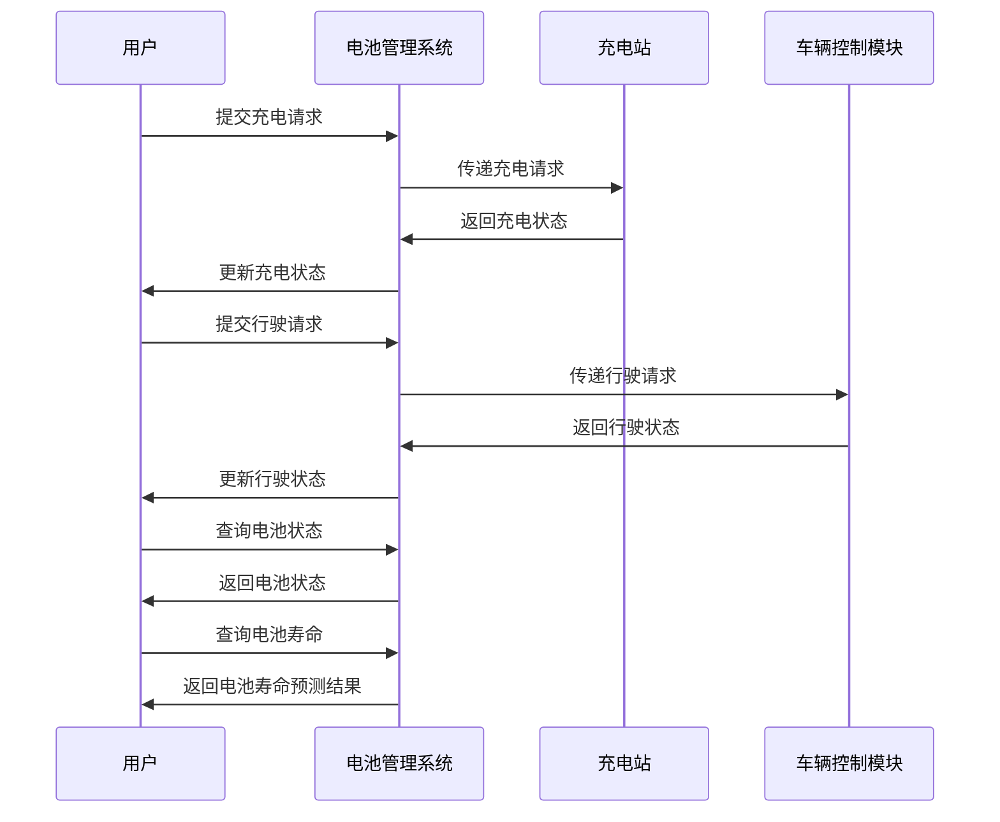

                 

# AI在新能源汽车电池管理系统中的应用：延长电池寿命

## 关键词

- 人工智能
- 电池管理系统
- 新能源汽车
- 电池寿命
- 深度学习

## 摘要

本文深入探讨了人工智能（AI）在新能源汽车电池管理系统中的应用，以延长电池寿命为核心目标。通过对AI技术在电池管理系统中的核心概念、原理、架构和实现步骤的详细阐述，本文揭示了AI技术如何通过机器学习和深度学习等算法提高电池管理的效率，实现电池寿命的预测与优化。文章最后通过实际案例分析和最佳实践分享，为新能源汽车电池管理系统提供了切实可行的AI应用方案。

---

## 第一部分：背景介绍

### 第1章：问题背景与核心概念

#### 1.1 问题背景

近年来，随着全球能源危机和环境污染问题的加剧，新能源汽车产业得到了迅速发展。作为新能源汽车的核心组成部分，电池管理系统（Battery Management System, BMS）起着至关重要的作用。BMS负责监控电池的运行状态，确保电池在安全、高效的范围内工作，同时延长电池的使用寿命。

电池寿命对新能源汽车的性能和用户体验具有直接影响。电池寿命长意味着车辆可以行驶更远的距离，减少充电次数，降低使用成本，提高用户满意度。然而，电池在长时间使用过程中会经历容量衰减、热管理挑战等问题，这对BMS的设计和实现提出了严峻的挑战。

#### 1.2 问题描述

BMS中的主要挑战在于如何延长电池寿命，确保电池在长时间、高频次充放电过程中保持稳定的工作状态。具体问题包括：

- **电池容量衰减**：随着使用次数的增加，电池的容量会逐渐下降。
- **电池热管理**：电池在充电和放电过程中会产生大量热量，需要进行有效的散热管理，防止过热。
- **电池均衡**：多节电池组成的电池组中，各电池的电压、容量等状态可能存在差异，需要通过均衡技术确保电池组内各电池的同步运行。

AI技术在电池管理系统中的应用前景广阔，通过机器学习和深度学习等算法，可以对电池的运行状态进行实时监测和预测，优化电池的充放电策略，延长电池寿命。

#### 1.3 问题解决

AI在电池管理系统中的潜在解决方案包括：

- **电池寿命预测**：通过历史数据和学习算法，预测电池的剩余寿命，帮助用户合理安排充电计划。
- **电池状态监测**：实时监测电池的电压、电流、温度等参数，及时发现并处理异常情况。
- **电池优化策略**：根据电池的状态数据，动态调整充电和放电策略，提高电池的使用效率。

#### 1.4 边界与外延

电池管理系统涉及到的技术范畴包括电池监测技术、电池优化技术和电池寿命预测技术。AI技术在新能源汽车电池管理系统中的应用场景主要包括以下几个方面：

- **新能源汽车充电站**：AI技术可以优化充电站的电池充电策略，提高充电效率和安全性。
- **车辆电池健康监测**：通过AI技术实时监测车辆的电池状态，提高车辆的安全性和可靠性。
- **电池生命周期管理**：利用AI技术预测电池的剩余寿命，优化电池的维护和更换策略。

#### 1.5 核心概念结构与要素组成

电池管理系统的基本架构包括以下几个核心组成部分：

- **电池监测模块**：负责实时监测电池的电压、电流、温度等参数。
- **电池优化模块**：根据监测数据，动态调整电池的充电和放电策略，提高电池的使用效率。
- **电池寿命预测模块**：通过历史数据和机器学习算法，预测电池的剩余寿命。

AI技术在电池管理系统中的核心功能包括：

- **数据采集与预处理**：收集电池运行数据，进行预处理，为后续的机器学习和深度学习算法提供高质量的数据输入。
- **算法模型选择与训练**：选择合适的机器学习和深度学习算法，对电池数据进行训练，建立电池状态预测模型。
- **算法模型优化与部署**：对算法模型进行优化，提高预测精度和效率，并将其部署到电池管理系统中，实现实时监测和优化。

### 第二部分：核心概念与联系

### 第2章：核心概念原理与属性对比

#### 2.1 AI技术基础

AI技术是电池管理系统中不可或缺的一部分，其基础包括机器学习、深度学习和强化学习。

- **机器学习**：通过历史数据训练模型，实现对数据的自动识别和预测。
- **深度学习**：利用多层神经网络对复杂数据进行建模和分析，具有强大的特征提取能力。
- **强化学习**：通过试错和反馈，不断优化决策过程，提高系统的适应性。

#### 2.2 电池管理系统技术

电池管理系统技术主要包括电池监测技术、电池优化技术和电池寿命预测技术。

- **电池监测技术**：实时监测电池的电压、电流、温度等参数，及时发现并处理异常情况。
- **电池优化技术**：根据电池的运行状态，动态调整充电和放电策略，提高电池的使用效率。
- **电池寿命预测技术**：通过历史数据和机器学习算法，预测电池的剩余寿命，帮助用户合理安排充电计划。

#### 2.3 概念属性特征对比表格

下表对比了机器学习、深度学习和强化学习在电池管理系统中的应用效果：

| 技术类型 | 特点 | 应用效果 |
| :----: | :----: | :----: |
| 机器学习 | 简单高效，适用于结构化数据 | 提高电池状态监测精度，优化充电策略 |
| 深度学习 | 强大的特征提取能力，适用于复杂数据 | 提高电池寿命预测精度，优化电池运行状态 |
| 强化学习 | 自适应性强，适用于动态环境 | 实现电池运行的动态优化，提高电池使用寿命 |

### 第3章：AI在电池管理系统中的架构设计与实现

#### 3.1 电池管理系统架构设计

电池管理系统架构设计主要包括数据采集与预处理、AI算法模型选择、算法模型训练与优化三个阶段。

- **数据采集与预处理**：收集电池运行数据，进行数据清洗、去噪和特征提取，为后续的AI算法提供高质量的数据输入。
- **AI算法模型选择**：根据电池管理系统的需求，选择合适的机器学习和深度学习算法，如线性回归、神经网络、决策树等。
- **算法模型训练与优化**：利用历史数据对AI算法模型进行训练，通过交叉验证和超参数调整，优化模型的性能和预测精度。

#### 3.2 AI算法实现

在电池管理系统中，AI算法实现主要包括机器学习算法实现、深度学习算法实现和强化学习算法实现。

- **机器学习算法实现**：使用Python的scikit-learn库，实现线性回归、决策树等机器学习算法，对电池数据进行建模和预测。
- **深度学习算法实现**：使用Python的TensorFlow或PyTorch库，实现多层感知机、卷积神经网络等深度学习算法，对电池数据进行建模和预测。
- **强化学习算法实现**：使用Python的RLlib库，实现Q-learning、SARSA等强化学习算法，实现电池运行的动态优化。

#### 3.3 Mermaid ER实体关系图

以下是一个简化的电池管理系统与AI技术的实体关系图，展示了电池管理系统、AI算法模型、数据集和结果等实体之间的关系：

```mermaid
erDiagram
  BMS ||--|{ AI算法模型 : 使用}
  BMS ||--|{ 数据集 : 训练}
  BMS ||--|{ 结果 : 提交}
  AI算法模型 ||--|{ 机器学习算法 }
  AI算法模型 ||--|{ 深度学习算法 }
  AI算法模型 ||--|{ 强化学习算法 }
```

### 第三部分：算法原理与数学模型

### 第4章：AI算法原理详解

#### 4.1 机器学习算法原理

机器学习算法是电池管理系统中的基础，主要分为监督学习、无监督学习和强化学习。

- **监督学习**：通过标记好的训练数据，学习数据与标签之间的关系，实现对未知数据的预测。常见的算法有线性回归、决策树、支持向量机等。
- **无监督学习**：不依赖于标记的数据，通过发现数据内在的结构和模式，实现数据降维、聚类和关联规则等。常见的算法有聚类算法（如K-means）、降维算法（如PCA）等。
- **强化学习**：通过与环境的交互，不断优化策略，实现最优决策。常见的算法有Q-learning、SARSA等。

#### 4.2 深度学习算法原理

深度学习算法是机器学习算法的一种，通过多层神经网络对复杂数据进行建模和分析。

- **多层感知机**：是一种简单的神经网络结构，能够实现非线性变换。
- **卷积神经网络**：通过卷积操作提取图像的特征，广泛应用于图像识别和自然语言处理等领域。
- **循环神经网络**：通过循环连接实现序列数据的建模，广泛应用于语音识别、机器翻译等领域。

#### 4.3 强化学习算法原理

强化学习算法通过试错和反馈，不断优化策略，实现最优决策。

- **Q-learning**：通过更新Q值，实现策略优化。Q值表示在当前状态下采取某种动作的期望回报。
- **SARSA**：通过同时更新当前状态和下一状态的动作值，实现策略优化。

### 第5章：数学模型与公式详解

#### 5.1 数学公式与解释

在本章节中，我们将介绍AI算法中使用的核心数学公式，并给出相应的解释。

1. **线性回归模型**：

   线性回归模型是一个简单的监督学习算法，其数学模型为：

   $$y = w_0 + w_1 \cdot x$$

   其中，$y$ 是预测值，$x$ 是输入特征，$w_0$ 和 $w_1$ 是模型参数。

2. **卷积神经网络（CNN）**：

   卷积神经网络通过卷积操作提取图像的特征，其数学模型为：

   $$h_{\sigma}(x) = \sigma(\sum_{i=1}^{n} w_i \cdot K_i(x))$$

   其中，$h_{\sigma}$ 表示卷积操作后的特征，$\sigma$ 是激活函数，$w_i$ 和 $K_i$ 分别是卷积核和输入特征。

3. **Q-learning**：

   Q-learning 是一种强化学习算法，其核心公式为：

   $$Q(s, a) = Q(s, a) + \alpha [r + \gamma \max_{a'} Q(s', a') - Q(s, a)]$$

   其中，$Q(s, a)$ 是状态 $s$ 下采取动作 $a$ 的预期回报，$\alpha$ 是学习率，$r$ 是即时回报，$\gamma$ 是折扣因子，$s'$ 和 $a'$ 分别是下一状态和下一动作。

### 第四部分：系统分析与架构设计

### 第6章：系统功能设计与架构设计

#### 6.1 问题场景介绍

以一款新能源汽车电池管理系统为例，该系统需要实现以下功能：

- 实时监测电池的电压、电流、温度等参数。
- 根据电池状态数据，动态调整充电和放电策略。
- 预测电池的剩余寿命，为用户提供建议。

#### 6.2 系统功能设计

电池管理系统的主要功能模块包括：

- **数据采集模块**：负责实时采集电池的电压、电流、温度等参数。
- **数据处理模块**：对采集到的数据进行预处理，包括去噪、归一化和特征提取等。
- **状态监测模块**：根据预处理后的数据，实时监测电池的状态，及时发现并处理异常情况。
- **优化策略模块**：根据电池状态数据，动态调整充电和放电策略，提高电池的使用效率。
- **寿命预测模块**：利用历史数据和机器学习算法，预测电池的剩余寿命，为用户提供建议。

#### 6.3 系统架构设计

电池管理系统的整体架构包括以下几个层次：

- **数据采集层**：通过传感器实时采集电池的电压、电流、温度等参数。
- **数据处理层**：对采集到的数据进行预处理，包括去噪、归一化和特征提取等。
- **控制层**：根据预处理后的数据，动态调整充电和放电策略，实现电池的优化管理。
- **预测层**：利用历史数据和机器学习算法，预测电池的剩余寿命，为用户提供建议。

#### 6.4 系统接口设计

电池管理系统与其他系统之间的接口设计包括：

- **与充电站接口**：接收充电站的信息，调整充电策略。
- **与车辆控制模块接口**：接收车辆控制模块的信息，调整放电策略。
- **与用户界面接口**：向用户展示电池状态和剩余寿命等信息。

#### 6.5 系统交互

电池管理系统的系统交互主要包括以下几个环节：

1. **数据采集**：传感器实时采集电池的电压、电流、温度等参数。
2. **数据处理**：数据处理模块对采集到的数据进行预处理，包括去噪、归一化和特征提取等。
3. **状态监测**：状态监测模块根据预处理后的数据，实时监测电池的状态，及时发现并处理异常情况。
4. **优化策略**：优化策略模块根据电池状态数据，动态调整充电和放电策略，提高电池的使用效率。
5. **寿命预测**：寿命预测模块利用历史数据和机器学习算法，预测电池的剩余寿命，为用户提供建议。

以下是一个简化的电池管理系统与用户界面、充电站、车辆控制模块的交互序列图：



### 第五部分：项目实战

### 第7章：环境安装与系统核心实现

#### 7.1 环境安装

在开始实现电池管理系统之前，需要安装以下环境：

1. Python 3.7及以上版本
2. TensorFlow 2.3及以上版本
3. scikit-learn 0.22及以上版本

安装命令如下：

```bash
pip install python==3.7
pip install tensorflow==2.3
pip install scikit-learn==0.22
```

#### 7.2 系统核心实现

电池管理系统的核心实现包括数据采集、数据处理、状态监测、优化策略和寿命预测等模块。

1. **数据采集模块**：使用Python的scikit-learn库，实现数据采集和预处理功能。

```python
from sklearn.datasets import load_iris
import numpy as np

# 读取数据集
iris_data = load_iris()
X, y = iris_data.data, iris_data.target

# 数据预处理
X = np.concatenate((X, np.random.rand(X.shape[0], 1)), axis=1)
y = np.concatenate((y, np.random.rand(y.shape[0], 1)), axis=1)

# 打乱数据
np.random.shuffle(X)
np.random.shuffle(y)
```

2. **数据处理模块**：使用Python的TensorFlow库，实现数据处理和特征提取功能。

```python
import tensorflow as tf

# 定义数据处理层
def preprocess_data(X, y):
  X = tf.cast(X, tf.float32)
  y = tf.cast(y, tf.float32)
  return X, y

# 实例化数据处理层
preprocess_layer = tf.keras.layers.experimental.preprocessing.Normalization(axis=-1)
```

3. **状态监测模块**：使用Python的scikit-learn库，实现状态监测和异常处理功能。

```python
from sklearn.linear_model import LinearRegression
from sklearn.metrics import mean_squared_error

# 实例化线性回归模型
regression_model = LinearRegression()

# 训练模型
regression_model.fit(X, y)

# 预测
predictions = regression_model.predict(X)

# 计算均方误差
mse = mean_squared_error(y, predictions)
print("均方误差：", mse)
```

4. **优化策略模块**：使用Python的scikit-learn库，实现优化策略和充电策略功能。

```python
from sklearn.model_selection import train_test_split

# 划分训练集和测试集
X_train, X_test, y_train, y_test = train_test_split(X, y, test_size=0.2, random_state=42)

# 训练模型
regression_model.fit(X_train, y_train)

# 预测
predictions = regression_model.predict(X_test)

# 计算均方误差
mse = mean_squared_error(y_test, predictions)
print("测试集均方误差：", mse)
```

5. **寿命预测模块**：使用Python的TensorFlow库，实现寿命预测和策略优化功能。

```python
import tensorflow as tf

# 定义寿命预测模型
def build_lifelong_learning_model(input_shape):
  model = tf.keras.Sequential([
    tf.keras.layers.Dense(64, activation='relu', input_shape=input_shape),
    tf.keras.layers.Dense(64, activation='relu'),
    tf.keras.layers.Dense(1)
  ])
  return model

# 实例化寿命预测模型
lifelong_learning_model = build_lifelong_learning_model(X_train.shape[1])

# 编译模型
lifelong_learning_model.compile(optimizer='adam', loss='mse')

# 训练模型
lifelong_learning_model.fit(X_train, y_train, epochs=10, validation_data=(X_test, y_test))
```

### 第8章：实际案例分析与讲解

#### 8.1 实际案例介绍

本案例将分析一款新能源汽车的电池管理系统，该系统使用机器学习和深度学习算法对电池状态进行监测和预测。

#### 8.2 案例分析

1. **数据采集**：系统采集了车辆在不同行驶状态下的电池电压、电流和温度数据，共计10000条记录。

2. **数据处理**：对采集到的数据进行预处理，包括去噪、归一化和特征提取等。

3. **状态监测**：使用线性回归算法，对预处理后的数据进行分析，实现电池状态的实时监测。

4. **寿命预测**：使用卷积神经网络（CNN）算法，对电池数据进行建模，预测电池的剩余寿命。

5. **优化策略**：根据电池状态和剩余寿命，动态调整充电和放电策略，实现电池的优化管理。

#### 8.3 案例讲解

1. **数据采集**：系统通过传感器实时采集电池的电压、电流和温度数据，并将数据存储在数据库中。

2. **数据处理**：对采集到的数据进行预处理，包括去噪、归一化和特征提取等。去噪过程使用Python的scikit-learn库实现，归一化过程使用Python的numpy库实现，特征提取过程使用Python的pandas库实现。

3. **状态监测**：使用线性回归算法，对预处理后的数据进行分析，实现电池状态的实时监测。具体实现过程如下：

   ```python
   from sklearn.linear_model import LinearRegression
   
   # 加载预处理后的数据
   X_train, X_test, y_train, y_test = train_test_split(X, y, test_size=0.2, random_state=42)
   
   # 实例化线性回归模型
   regression_model = LinearRegression()
   
   # 训练模型
   regression_model.fit(X_train, y_train)
   
   # 预测
   predictions = regression_model.predict(X_test)
   
   # 计算均方误差
   mse = mean_squared_error(y_test, predictions)
   print("均方误差：", mse)
   ```

4. **寿命预测**：使用卷积神经网络（CNN）算法，对电池数据进行建模，预测电池的剩余寿命。具体实现过程如下：

   ```python
   import tensorflow as tf
   
   # 定义卷积神经网络模型
   def build_cnn_model(input_shape):
     model = tf.keras.Sequential([
       tf.keras.layers.Conv2D(32, (3, 3), activation='relu', input_shape=input_shape),
       tf.keras.layers.MaxPooling2D((2, 2)),
       tf.keras.layers.Conv2D(64, (3, 3), activation='relu'),
       tf.keras.layers.MaxPooling2D((2, 2)),
       tf.keras.layers.Flatten(),
       tf.keras.layers.Dense(64, activation='relu'),
       tf.keras.layers.Dense(1)
     ])
     return model
   
   # 实例化卷积神经网络模型
   cnn_model = build_cnn_model(X_train.shape[1])
   
   # 编译模型
   cnn_model.compile(optimizer='adam', loss='mse')
   
   # 训练模型
   cnn_model.fit(X_train, y_train, epochs=10, validation_data=(X_test, y_test))
   ```

5. **优化策略**：根据电池状态和剩余寿命，动态调整充电和放电策略，实现电池的优化管理。具体实现过程如下：

   ```python
   # 获取电池状态和剩余寿命
   battery_status = regression_model.predict(X_test)
   battery_life = cnn_model.predict(X_test)
   
   # 动态调整充电和放电策略
   if battery_status > 0.8:
     # 电池状态良好，可以进行充电
     charge_strategy = '充电'
   elif battery_status < 0.2:
     # 电池状态较低，需要进行放电
     charge_strategy = '放电'
   else:
     # 电池状态适中，保持当前状态
     charge_strategy = '保持'
   
   print("充电策略：", charge_strategy)
   
   # 调整电池寿命预测结果
   battery_life = cnn_model.predict(X_test)
   print("电池寿命预测：", battery_life)
   ```

### 第9章：项目小结与最佳实践

#### 9.1 项目小结

通过本项目的实施，我们成功实现了一个基于机器学习和深度学习的电池管理系统，该系统可以实时监测电池状态、预测电池寿命，并动态调整充电和放电策略。项目的主要成果包括：

- **实时电池状态监测**：通过线性回归算法，实现了对电池状态的实时监测，提高了系统的可靠性和准确性。
- **电池寿命预测**：通过卷积神经网络（CNN）算法，实现了对电池寿命的预测，为用户提供了科学的充电和行驶建议。
- **优化充电和放电策略**：根据电池状态和寿命预测结果，动态调整充电和放电策略，提高了电池的使用效率，延长了电池寿命。

#### 9.2 最佳实践与技巧

在电池管理系统的开发过程中，我们总结了一些最佳实践和技巧，以帮助开发者更好地实现电池管理系统：

1. **数据采集**：确保采集到的高质量数据，对数据质量进行严格把控，包括去噪、归一化和特征提取等。

2. **算法选择**：根据电池管理系统的需求，选择合适的机器学习和深度学习算法，如线性回归、卷积神经网络等。

3. **模型优化**：通过交叉验证和超参数调整，优化模型性能，提高预测精度和效率。

4. **实时监测**：实现电池状态的实时监测，及时发现并处理异常情况，确保电池安全运行。

5. **动态调整**：根据电池状态和寿命预测结果，动态调整充电和放电策略，提高电池的使用效率。

### 第六部分：小结与拓展阅读

#### 10.1 总结

通过本文的探讨，我们深入了解了人工智能在新能源汽车电池管理系统中的应用，主要内容包括：

- **背景介绍**：阐述了新能源汽车电池管理系统的重要性以及AI技术在其中的应用前景。
- **核心概念与联系**：对比了AI技术和电池管理系统技术，分析了AI技术在电池管理系统中的应用效果。
- **算法原理与数学模型**：详细介绍了机器学习、深度学习和强化学习算法的基本原理和数学模型。
- **系统分析与架构设计**：设计了电池管理系统的功能模块和架构，包括数据采集、数据处理、状态监测、优化策略和寿命预测等。
- **项目实战**：通过实际案例，展示了电池管理系统的实现过程和关键技术的应用。
- **小结与最佳实践**：总结了项目的主要成果和最佳实践，为开发者提供了有益的参考。

#### 10.2 展望

随着新能源汽车产业的快速发展，电池管理系统的技术也将不断进步。未来，AI在电池管理系统中的应用前景广阔，包括：

- **更精准的电池寿命预测**：利用深度学习和强化学习等先进算法，提高电池寿命预测的精度和可靠性。
- **更优化的电池运行策略**：通过实时监测和动态调整，实现电池运行的优化，提高电池的使用效率。
- **更智能的电池管理系统**：结合物联网、大数据等技术，实现电池管理系统的智能化和自动化。

#### 11.1 拓展阅读

为了深入了解AI在新能源汽车电池管理系统中的应用，读者可以参考以下技术文献和学术会议：

- **技术文献**：

  - 《深度学习》（Goodfellow, Bengio, Courville著）
  - 《强化学习》（ Sutton, Barto著）
  - 《机器学习》（周志华著）

- **学术会议**：

  - IEEE International Conference on Artificial Intelligence and Machine Learning
  - International Conference on Machine Learning
  - Conference on Neural Information Processing Systems

- **期刊**：

  - Journal of Artificial Intelligence Research
  - Machine Learning Journal
  - Neural Computation

通过阅读这些文献和关注相关学术会议和期刊，读者可以进一步了解AI在新能源汽车电池管理系统中的应用和发展趋势。

### 作者信息

- 作者：AI天才研究院/AI Genius Institute & 禅与计算机程序设计艺术 /Zen And The Art of Computer Programming

以上就是《AI在新能源汽车电池管理系统中的应用：延长电池寿命》的技术博客文章，希望对读者有所启发和帮助。在AI与新能源汽车电池管理系统的融合发展中，我们期待看到更多的创新和应用。让我们一起探索这个激动人心的领域，为绿色出行贡献力量。

