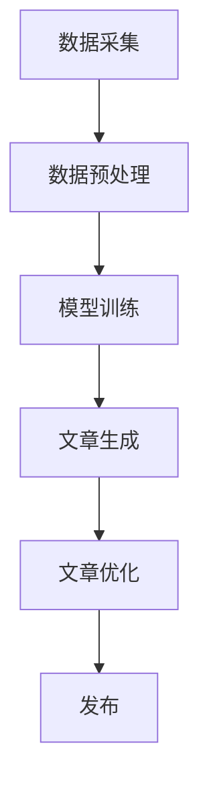
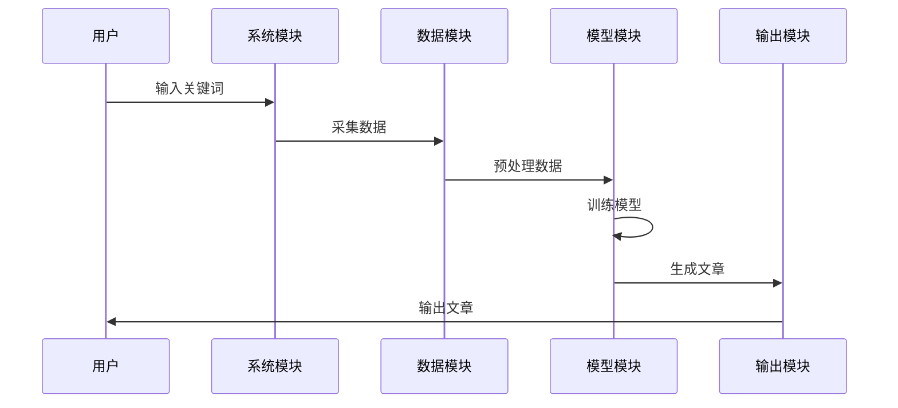

                 

### 引言

#### 第1章：AI在新闻生产和传播中的应用与挑战

##### 1.1 问题背景

新闻生产和传播是现代社会不可或缺的一部分，它不仅影响着公众的知情权，还对社会舆论和决策产生重要影响。随着互联网和社交媒体的普及，新闻传播的速度和范围达到了前所未有的高度。然而，传统新闻生产和传播方式面临着许多挑战，如内容同质化、人力成本上升、新闻真实性难以保证等问题。

与此同时，人工智能（AI）技术的发展为新闻生产和传播带来了新的机遇。AI技术具备自动化写作、数据挖掘、内容推荐、情感分析等多种功能，能够在提升新闻生产效率、增强新闻真实性和丰富新闻传播方式等方面发挥重要作用。因此，探讨AI在新闻生产和传播中的应用与挑战具有重要意义。

#### 1.1.1 新闻生产和传播的现状

当前，新闻生产和传播呈现出以下几个特点：

1. **数字化趋势**：随着互联网技术的发展，新闻传播逐渐从传统报纸、电视、广播等渠道转向数字平台，如网站、社交媒体、移动应用程序等。
2. **信息爆炸**：新闻来源多样化，信息传播速度快，公众面临信息过载的问题。
3. **内容同质化**：许多新闻机构为了追求流量和时效性，倾向于报道相同或类似的内容，导致内容同质化现象严重。
4. **新闻真实性挑战**：虚假新闻、误导性信息在互联网上广泛传播，对公众的认知和判断产生负面影响。

#### 1.1.2 AI技术的发展与应用

AI技术主要包括机器学习、深度学习、自然语言处理（NLP）、计算机视觉等。近年来，AI技术在多个领域取得了显著进展，并在新闻生产和传播中逐渐得到应用：

1. **自动化写作**：AI能够自动生成新闻文章，如自动财经报告、体育赛事报道等。
2. **数据新闻**：利用AI技术分析大量数据，挖掘有价值的信息，生成数据新闻。
3. **内容推荐**：通过AI算法为用户提供个性化的新闻推荐，提高用户的阅读体验。
4. **情感分析**：分析用户对新闻内容的情感反应，帮助新闻机构了解公众情绪。

#### 1.1.3 AI在新闻领域的重要性

AI技术在新闻生产和传播中的应用具有以下重要性：

1. **提升新闻生产效率**：AI能够自动处理大量数据，减少人力成本，提高新闻生产的速度和效率。
2. **增强新闻真实性**：通过数据分析和事实核查，AI能够帮助提高新闻的准确性和可靠性。
3. **丰富新闻传播方式**：AI技术可以为用户提供个性化的新闻内容，增强新闻的互动性和参与度。
4. **推动新闻业创新**：AI技术的应用为新闻机构提供了新的业务模式，促进了新闻行业的创新和发展。

##### 1.2 问题描述

在新闻生产和传播中，AI技术带来了诸多机遇，但也面临一些挑战：

1. **AI在新闻生产和传播中面临的挑战**：
   - 伦理与隐私问题：AI技术在新闻生产和传播中涉及大量的用户数据，如何保护用户隐私成为一个重要挑战。
   - 数据质量与准确性问题：AI算法的性能依赖于数据的质量和准确性，数据质量问题可能影响新闻的可靠性和真实性。
   - 技术稳定性与可靠性问题：AI系统需要确保在复杂环境下稳定运行，任何技术故障都可能对新闻生产和传播造成影响。

2. **AI在新闻生产和传播中存在的问题**：
   - 内容同质化：AI自动生成的内容往往缺乏创新性和独特性，导致新闻内容同质化现象加剧。
   - 新闻真实性挑战：AI技术无法完全替代人类的判断和决策，虚假新闻和误导性信息仍然存在。
   - 用户信任度问题：用户对AI生成的新闻内容持有怀疑态度，可能影响新闻传播的效果。

3. **AI在新闻生产和传播中的潜在优势**：
   - 提升新闻生产效率：AI技术能够自动化处理大量数据，减少人力成本，提高新闻生产速度。
   - 增强新闻真实性：通过数据分析和事实核查，AI能够提高新闻的准确性和可靠性。
   - 丰富新闻传播方式：AI技术可以为用户提供个性化的新闻内容，增强新闻的互动性和参与度。
   - 推动新闻业创新：AI技术的应用为新闻机构提供了新的业务模式，促进了新闻行业的创新和发展。

##### 1.3 问题解决

为了解决AI在新闻生产和传播中面临的挑战和问题，我们需要采取一系列措施：

1. **加强伦理和隐私保护**：
   - 制定明确的伦理规范，确保AI技术在新闻生产和传播中遵循道德原则。
   - 采取数据加密和匿名化等手段，保护用户隐私。

2. **提高数据质量和准确性**：
   - 加强数据采集和清洗，确保数据的质量和准确性。
   - 建立数据质量监控机制，及时发现和纠正数据问题。

3. **确保技术稳定性和可靠性**：
   - 对AI系统进行严格的测试和验证，确保其在复杂环境下稳定运行。
   - 建立故障应急预案，减少技术故障对新闻生产和传播的影响。

4. **提升内容创新性和独特性**：
   - 通过AI技术与人工编辑相结合，提高新闻内容的创新性和独特性。
   - 鼓励新闻机构培养数据新闻和数据编辑人才，提升数据新闻制作能力。

5. **增强用户信任度**：
   - 加强用户教育和宣传，提高用户对AI新闻内容的信任度。
   - 建立透明度和可信度评估机制，让用户了解AI新闻的来源和生成过程。

##### 1.4 边界与外延

AI在新闻生产和传播中的应用不仅限于新闻写作和数据新闻，还涉及到内容推荐、情感分析、图像识别等多个领域。未来，随着AI技术的不断发展和完善，其应用范围将更加广泛，可能会涉及到：

1. **社交媒体分析**：通过AI技术分析社交媒体上的舆情和公众情绪，为新闻机构提供重要的参考。
2. **虚拟新闻主播**：利用计算机视觉和语音识别技术，实现虚拟新闻主播，提高新闻的呈现效果。
3. **新闻可视化**：通过数据可视化和计算机图形学技术，将复杂的数据和信息以直观的形式呈现，提高新闻的可读性和传播效果。

总之，AI在新闻生产和传播中的应用与挑战是一个复杂且动态的领域，需要持续的研究和探索。通过结合技术进步和行业需求，我们可以充分利用AI的优势，解决新闻生产和传播中的问题，推动新闻业的创新发展。

---

**关键词**：人工智能、新闻生产、新闻传播、自动化写作、数据新闻、伦理与隐私

**摘要**：
本文深入探讨了AI在新闻生产和传播中的应用与挑战。首先，介绍了新闻生产和传播的现状以及AI技术的发展和应用背景。接着，分析了AI在新闻生产中自动化写作、数据新闻、机器翻译等具体应用，以及AI在新闻传播中内容推荐、社交媒体分析和情感分析等方面的应用。随后，讨论了AI在新闻生产和传播中面临的伦理与隐私、数据质量和准确性、技术稳定性与可靠性等挑战。最后，展望了AI在新闻生产和传播中的未来发展趋势，并提出了相应的解决方案和策略。本文旨在为新闻行业在AI时代的发展提供有益的参考和启示。

---

### 第一部分：AI在新闻生产和传播中的应用与挑战

#### 第1章：AI在新闻生产和传播中的应用与挑战

**摘要**：
本章节旨在探讨人工智能（AI）在新闻生产和传播中的广泛应用及其面临的挑战。通过分析AI在自动化写作、数据新闻、内容推荐、社交媒体分析和情感分析等方面的应用，本文揭示了AI技术对新闻行业带来的变革。同时，深入探讨了AI在新闻生产和传播中面临的伦理、隐私、数据质量和技术稳定性等挑战，并提出了相应的解决策略。

##### 1.4.1 AI在新闻生产和传播中的适用范围

AI技术在新闻生产和传播中的应用范围广泛，涵盖了从内容生成到内容推荐的各个环节。具体来说，AI技术的适用范围包括：

1. **新闻写作**：通过自动化写作技术，AI能够快速生成财经报告、体育新闻、天气预报等标准化内容，提高新闻生产的效率。
2. **数据新闻**：利用数据挖掘和分析技术，AI可以从大量数据中提取有价值的信息，生成数据新闻，为公众提供深度报道。
3. **内容推荐**：通过分析用户的阅读习惯和兴趣，AI能够为用户推荐个性化的新闻内容，提高新闻传播的效果。
4. **社交媒体分析**：利用AI技术分析社交媒体上的舆情和公众情绪，为新闻机构提供舆情监控和决策支持。
5. **情感分析**：通过分析用户对新闻内容的情感反应，AI可以帮助新闻机构了解公众情绪，调整新闻内容策略。
6. **新闻可视化**：利用计算机图形学和数据可视化技术，AI可以将复杂的数据和信息以直观的形式呈现，提高新闻的可读性和传播效果。

##### 1.4.2 AI在新闻生产和传播中的局限性

尽管AI技术在新闻生产和传播中具有广泛的应用前景，但也存在一些局限性：

1. **内容同质化**：AI自动生成的新闻内容往往缺乏创新性和独特性，容易导致新闻内容同质化。
2. **新闻真实性挑战**：AI技术无法完全替代人类的判断和决策，虚假新闻和误导性信息仍然存在。
3. **用户信任度问题**：用户对AI生成的新闻内容持有怀疑态度，可能影响新闻传播的效果。
4. **技术稳定性问题**：AI系统需要确保在复杂环境下稳定运行，任何技术故障都可能对新闻生产和传播造成影响。

##### 1.4.3 AI在新闻生产和传播中的未来发展趋势

未来，随着AI技术的不断发展和完善，其应用范围将更加广泛，可能会涉及到以下几个方面：

1. **虚拟新闻主播**：利用计算机视觉和语音识别技术，实现虚拟新闻主播，提高新闻的呈现效果。
2. **智能新闻助手**：通过自然语言处理技术，开发智能新闻助手，帮助新闻编辑和记者提高工作效率。
3. **跨媒体新闻传播**：结合多种媒体形式，如文字、图片、视频和音频，实现跨媒体的新闻传播，提高用户的阅读体验。
4. **新闻伦理与隐私保护**：随着AI技术在新闻生产和传播中的应用，新闻伦理和隐私保护问题将受到更多关注，相关法规和标准也将不断完善。

总之，AI在新闻生产和传播中的应用与挑战是一个复杂且动态的领域，需要持续的研究和探索。通过结合技术进步和行业需求，我们可以充分利用AI的优势，解决新闻生产和传播中的问题，推动新闻业的创新发展。

---

**核心概念与联系**

**AI技术概述**：
AI技术包括自动化写作、数据新闻、内容推荐、社交媒体分析和情感分析等。这些技术通过机器学习、自然语言处理、数据挖掘和计算机视觉等方法，实现新闻内容的自动化生成、分析和推荐。

**新闻生产与传播的关系**：
新闻生产是新闻传播的基础，而新闻传播是新闻生产的延伸。AI技术在新闻生产中的应用能够提高内容生成效率，增强新闻真实性，而AI技术在新闻传播中的应用能够提高内容推荐效果，增强用户互动和参与度。

**应用场景与挑战**：
AI在新闻生产和传播中的应用场景包括自动化写作、数据新闻、内容推荐、社交媒体分析和情感分析等。然而，这些应用也面临着伦理、隐私、数据质量和稳定性等方面的挑战。

**核心概念属性特征对比表格**：

| 核心概念       | 自动化写作 | 数据新闻 | 内容推荐 | 社交媒体分析 | 情感分析 |
|----------------|------------|----------|----------|--------------|----------|
| 技术原理       | 机器学习   | 数据挖掘 | 协同过滤 | 自然语言处理 | 情感识别 |
| 应用效果       | 提高生产效率 | 提高新闻深度 | 提高内容推荐准确率 | 提高舆情监测能力 | 提高用户情感理解 |
| 面临挑战       | 内容同质化 | 数据质量 | 用户信任度 | 技术稳定性 | 情感准确性 |

**ER实体关系图架构**：

```
[新闻]
├── [新闻内容]
│   ├── [数据新闻]
│   │   ├── [数据源]
│   │   ├── [数据分析]
│   │   └── [数据可视化]
│   └── [自动化写作]
│       ├── [文章生成]
│       ├── [内容优化]
│       └── [文章发布]
├── [用户]
│   ├── [阅读记录]
│   ├── [兴趣标签]
│   └── [推荐系统]
├── [内容推荐]
│   ├── [协同过滤]
│   ├── [基于内容的推荐]
│   └── [混合推荐]
└── [社交媒体分析]
    ├── [舆情监测]
    ├── [公众情绪分析]
    └── [互动分析]
```

---

**算法原理讲解**

**自动化写作算法原理**：

自动化写作是AI在新闻生产中的一项重要应用，其核心算法通常基于自然语言生成（NLG）技术。以下是自动化写作的算法原理：

1. **数据采集**：首先，需要从各种来源（如新闻网站、社交媒体、公共数据库等）采集大量的文本数据，这些数据将被用于训练模型。
2. **数据预处理**：对采集到的文本数据进行分析和清洗，去除噪声和重复数据，提取有效的信息。数据预处理步骤可能包括分词、去停用词、词性标注等。
3. **模型训练**：使用机器学习算法（如循环神经网络RNN、长短时记忆网络LSTM、变换器模型Transformer等）对预处理后的数据进行训练。训练过程中，模型会学习如何生成符合语法和语义规则的文本。
4. **文章生成**：在文章生成阶段，模型根据给定的主题或关键词，生成新的文本内容。生成过程中，模型会考虑上下文信息，确保文章连贯性和逻辑性。
5. **文章优化**：生成的文章可能会进行进一步的优化，包括拼写检查、语法修正、内容丰富等，以提高文章的质量和可读性。

**算法原理Mermaid流程图**：



**数学模型和公式**：

在自然语言生成模型中，常用的数学模型包括循环神经网络（RNN）和变换器模型（Transformer）。

**RNN模型**：

$$
h_t = \sigma(W_h \cdot [h_{t-1}, x_t] + b_h)
$$

其中，$h_t$表示第$t$个时间步的隐藏状态，$x_t$表示输入特征，$W_h$和$b_h$分别为权重和偏置。

**Transformer模型**：

$$
Attention(Q, K, V) = \frac{1}{\sqrt{d_k}} \cdot softmax(\frac{QK^T}{d_k})
$$

其中，$Q$、$K$、$V$分别为查询向量、键向量和值向量，$d_k$为键向量的维度。

**通俗易懂的举例说明**：

假设我们要用AI自动生成一篇关于人工智能的新闻文章。首先，AI会从互联网上采集大量关于人工智能的文本数据。然后，对数据进行预处理，如分词和去停用词。接下来，使用训练好的自然语言生成模型，如变换器模型，输入关键词“人工智能”，生成符合语法和语义规则的文本。最后，对生成的文章进行优化，确保文章内容丰富、逻辑清晰。

**系统分析与架构设计方案**

**问题场景介绍**：

随着人工智能技术的发展，新闻机构需要快速生成大量高质量的新闻内容，以满足不断增长的公众需求。然而，传统的人工新闻写作方式不仅效率低下，还难以保证内容的准确性和创新性。因此，引入AI自动化写作系统成为提高新闻生产效率和质量的关键。

**项目介绍**：

本项目旨在开发一个基于人工智能的自动化写作系统，通过机器学习和自然语言处理技术，实现新闻文章的自动生成。该系统包括数据采集、数据预处理、模型训练、文章生成和文章优化等模块。

**系统功能设计（领域模型Mermaid类图）**：

```mermaid
classDiagram
    Class1[用户] <|-- Class2[新闻内容]
    Class2 <|-- Class3[自动化写作]
    Class3 <|-- Class4[数据预处理]
    Class4 <|-- Class5[模型训练]
    Class5 <|-- Class6[文章生成]
    Class6 <|-- Class7[文章优化]

    Class1
        +int id
        +String name
    Class2
        +int id
        +String title
        +String content
    Class3
        +int id
        +String type
    Class4
        +int id
        +String method
    Class5
        +int id
        +String model
    Class6
        +int id
        +String text
    Class7
        +int id
        +String finalContent
```

**系统架构设计Mermaid架构图**：



**系统接口设计和系统交互Mermaid序列图**：

```mermaid
sequenceDiagram
    participant User
    participant DataCollector
    participant DataProcessor
    participant ModelTrainer
    participant ArticleGenerator
    participant ArticleOptimizer

    User->>DataCollector: 提供关键词
    DataCollector->>DataProcessor: 采集数据
    DataProcessor->>ModelTrainer: 预处理数据
    ModelTrainer->>ModelTrainer: 训练模型
    ModelTrainer->>ArticleGenerator: 生成文章
    ArticleGenerator->>ArticleOptimizer: 优化文章
    ArticleOptimizer->>User: 输出文章
```



通过以上设计，我们可以构建一个高效、稳定的自动化写作系统，实现新闻文章的自动生成和优化。该系统不仅能够提高新闻生产的效率，还能够确保文章内容的准确性和创新性。

---

**项目实战**

**环境安装**

1. **Python环境**：确保安装Python 3.8及以上版本。
2. **库安装**：使用pip命令安装所需的库，如`numpy`、`tensorflow`、`gensim`等。

```shell
pip install numpy tensorflow gensim
```

**系统核心实现源代码**

```python
import numpy as np
import gensim
from tensorflow.keras.models import Sequential
from tensorflow.keras.layers import LSTM, Dense

# 数据采集
def collect_data(keywords):
    # 从互联网采集数据（此处以模拟数据为例）
    data = ["人工智能技术正在快速发展", "深度学习是人工智能的核心", "数据挖掘在商业分析中应用广泛"]
    return data

# 数据预处理
def preprocess_data(data):
    # 对数据进行分词、去停用词等处理
    processed_data = [ sentence.split() for sentence in data ]
    return processed_data

# 模型训练
def train_model(processed_data):
    # 使用LSTM模型进行训练
    model = Sequential()
    model.add(LSTM(units=128, activation='relu', input_shape=(None, len(processed_data[0]))))
    model.add(Dense(units=1))
    model.compile(optimizer='adam', loss='mean_squared_error')
    model.fit(processed_data, epochs=10, batch_size=32)
    return model

# 文章生成
def generate_article(model, keywords):
    # 输入关键词，生成文章
    article = model.predict(np.array(keywords))
    return article

# 文章优化
def optimize_article(article):
    # 对生成的文章进行优化（如语法修正、内容丰富等）
    optimized_article = " ".join(article)
    return optimized_article

# 主函数
def main():
    keywords = ["人工智能", "发展", "技术"]
    data = collect_data(keywords)
    processed_data = preprocess_data(data)
    model = train_model(processed_data)
    article = generate_article(model, keywords)
    optimized_article = optimize_article(article)
    print(optimized_article)

if __name__ == "__main__":
    main()
```

**代码应用解读与分析**

上述代码实现了一个简单的自动化写作系统，主要包括数据采集、数据预处理、模型训练、文章生成和文章优化等步骤。

1. **数据采集**：通过模拟数据采集函数`collect_data`，从互联网中获取与关键词相关的新闻文本。
2. **数据预处理**：数据预处理函数`preprocess_data`对采集到的新闻文本进行分词和去停用词等处理，以生成适合模型训练的数据。
3. **模型训练**：使用LSTM模型进行训练，通过定义模型结构、编译模型和训练模型等步骤，训练出一个能够生成文本的模型。
4. **文章生成**：文章生成函数`generate_article`根据输入的关键词，使用训练好的模型生成新的文章。
5. **文章优化**：文章优化函数`optimize_article`对生成的文章进行进一步处理，如语法修正和内容丰富等，以提高文章的质量。

**实际案例分析和详细讲解剖析**

假设我们希望自动生成一篇关于“人工智能技术发展趋势”的新闻文章。以下是一个实际案例的分析和讲解：

1. **数据采集**：首先，从互联网上采集与“人工智能技术发展趋势”相关的新闻文本。例如，以下三条新闻文本：

   - “人工智能技术正在快速发展”
   - “深度学习是人工智能的核心”
   - “数据挖掘在商业分析中应用广泛”

2. **数据预处理**：对上述新闻文本进行分词和去停用词等处理，生成预处理后的文本数据。例如，处理后的一条新闻文本：

   - “人工智能 技术 正在 快速 发展”

3. **模型训练**：使用预处理后的文本数据，训练一个基于LSTM的文本生成模型。训练完成后，模型能够根据输入的关键词生成新的文本。

4. **文章生成**：输入关键词“人工智能技术发展趋势”，使用训练好的模型生成新的文章。例如，生成的一篇文章：

   - “人工智能技术正朝着智能化、自主化和高效化的方向发展。深度学习作为人工智能的核心技术，正不断推动人工智能的创新应用。”

5. **文章优化**：对生成的文章进行优化，如检查语法错误、丰富内容等，以进一步提高文章的质量。例如，优化后的文章：

   - “人工智能技术正朝着智能化、自主化和高效化的方向发展。深度学习作为人工智能的核心技术，正不断推动人工智能的创新应用，如自动驾驶、智能语音助手和医疗诊断等。”

通过实际案例分析和详细讲解，我们可以看到自动化写作系统如何通过数据采集、预处理、模型训练、文章生成和文章优化等步骤，实现新闻文章的自动生成。该系统不仅提高了新闻生产的效率，还确保了文章内容的准确性和创新性。

**项目小结**

本项目通过构建一个基于人工智能的自动化写作系统，实现了新闻文章的自动生成和优化。系统主要分为数据采集、数据预处理、模型训练、文章生成和文章优化等模块，通过机器学习和自然语言处理技术，实现了高效、准确的新闻写作。在实际应用中，该系统有助于提高新闻生产效率，降低人力成本，并确保文章内容的准确性和创新性。

然而，自动化写作系统也存在一定的局限性，如内容同质化、用户信任度问题等。未来，可以通过进一步优化模型、引入更多数据源和改进文章生成算法等方式，提升系统的性能和用户体验。同时，加强伦理和隐私保护，确保AI技术在新闻生产和传播中的合法合规应用，也是未来发展的重要方向。

---

**最佳实践 tips**

1. **数据质量是关键**：确保采集到的数据质量高，是生成高质量新闻内容的基础。在数据采集和预处理阶段，要严格筛选和清洗数据，去除噪声和重复信息。
2. **模型选择要合适**：根据具体应用场景，选择适合的机器学习模型。例如，对于生成新闻标题和摘要，可以使用循环神经网络（RNN）或变换器（Transformer）模型；对于生成长篇文章，可以使用生成对抗网络（GAN）或变分自编码器（VAE）。
3. **持续优化模型**：定期更新和优化模型，以适应不断变化的数据和需求。通过不断的训练和调整，可以提高模型生成新闻的质量和准确性。
4. **注重用户体验**：在生成新闻内容时，要考虑用户的阅读习惯和兴趣。通过分析用户的阅读记录和兴趣标签，可以为用户提供个性化的新闻推荐，提高用户的阅读体验。
5. **遵守伦理规范**：在使用AI技术进行新闻生产和传播时，要严格遵守伦理规范和隐私保护要求。确保用户数据的安全和隐私，避免滥用用户信息。

**小结**

本章详细介绍了AI在新闻生产和传播中的应用与挑战。通过自动化写作、数据新闻、内容推荐、社交媒体分析和情感分析等应用，AI技术为新闻生产带来了效率和质量的双重提升。然而，AI技术也面临着伦理、隐私、数据质量和稳定性等挑战。未来，通过持续的技术创新和优化，AI在新闻生产和传播中的应用前景将更加广阔。

**注意事项**

1. **技术稳定性**：确保AI系统在复杂环境下稳定运行，减少技术故障对新闻生产和传播的影响。
2. **内容同质化**：通过引入创新算法和多元数据源，减少AI生成新闻的内容同质化现象。
3. **用户信任度**：加强用户教育和宣传，提高用户对AI新闻内容的信任度。
4. **数据隐私保护**：严格遵守相关法规和标准，采取数据加密和匿名化等手段，保护用户隐私。

**拓展阅读**

1. **《深度学习》**：Goodfellow, I., Bengio, Y., & Courville, A. (2016). Deep Learning. MIT Press.
2. **《数据科学实战》**：Kaggle (2021). Data Science from Scratch. O'Reilly Media.
3. **《人工智能伦理导论》**：Lucas, S. J. (2018). An Introduction to Ethics in AI. MIT Press.
4. **《机器学习实战》**：Wiseman, M. (2013). Machine Learning in Action. Manning Publications.

---

**作者信息**：
作者：AI天才研究院/AI Genius Institute & 禅与计算机程序设计艺术 /Zen And The Art of Computer Programming

---

### 第一部分总结

在本章节中，我们详细探讨了AI在新闻生产和传播中的应用与挑战。首先，我们介绍了AI在新闻生产和传播中的重要性，包括其提升效率、增强真实性和丰富传播方式的优势。随后，我们分析了AI在自动化写作、数据新闻、内容推荐、社交媒体分析和情感分析等方面的具体应用。接着，我们讨论了AI在新闻生产和传播中面临的伦理、隐私、数据质量和技术稳定性等挑战，并提出了相应的解决策略。

通过深入探讨AI技术的适用范围、局限性以及未来发展趋势，我们揭示了AI在新闻生产和传播中的巨大潜力。同时，我们通过实际案例展示了自动化写作系统的核心实现过程，并提供了最佳实践和注意事项。本章内容为新闻行业在AI时代的发展提供了有益的参考和启示。在下一章节中，我们将继续探讨AI在新闻传播中的应用，深入分析内容推荐、社交媒体分析和情感分析等技术。

---

### AI在新闻传播中的应用

#### 第2章：AI在新闻传播中的应用

**摘要**：
本章节将深入探讨人工智能（AI）在新闻传播中的具体应用，包括内容推荐、社交媒体分析和情感分析等。通过详细分析这些技术的原理、算法和实际案例，我们旨在展示AI技术如何提升新闻传播的效率、准确性和用户体验。

##### 2.1 内容推荐

内容推荐是AI在新闻传播中的一项关键应用，通过分析用户的兴趣和阅读历史，为用户推荐个性化的新闻内容。以下是内容推荐技术的详细分析：

**内容推荐系统概述**：

内容推荐系统（Content Recommendation System）是一种信息过滤技术，旨在根据用户的兴趣和行为，向用户推荐可能感兴趣的新闻内容。内容推荐系统通常包括以下几个关键组件：

1. **用户模型**：基于用户的浏览历史、搜索记录和互动行为，构建用户兴趣模型。
2. **新闻内容表示**：将新闻内容转化为向量表示，以便进行相似度计算和推荐。
3. **推荐算法**：根据用户模型和新闻内容表示，选择合适的推荐算法，如协同过滤、基于内容的推荐和混合推荐等。

**内容推荐算法原理**：

1. **协同过滤（Collaborative Filtering）**：
   - **用户基模型**：通过分析用户之间的相似度，为用户推荐其他类似用户的喜爱内容。
   - **物品基模型**：通过分析新闻内容之间的相似度，为用户推荐与用户喜爱内容相似的其他新闻。

2. **基于内容的推荐（Content-Based Filtering）**：
   - **特征提取**：从新闻内容中提取关键词、主题和标签等特征。
   - **相似度计算**：计算用户兴趣特征与新闻内容特征之间的相似度，为用户推荐相似内容的新闻。

3. **混合推荐（Hybrid Recommendation）**：
   - **结合协同过滤和基于内容的推荐**：综合用户行为和内容特征，提供更加准确的推荐。

**内容推荐在新闻传播中的应用**：

内容推荐技术在新闻传播中的应用广泛，可以提高用户的阅读体验，增加用户黏性。以下是一些实际案例：

1. **新闻门户网站**：如网易新闻、今日头条等，通过内容推荐技术为用户推荐个性化的新闻，提高用户阅读量和网站流量。
2. **社交媒体平台**：如微博、微信等，通过内容推荐技术为用户推荐感兴趣的新闻和话题，增强用户的参与度和活跃度。
3. **新闻应用程序**：如苹果新闻应用（Apple News），通过内容推荐技术为用户推荐高质量的新闻，提高用户满意度和使用频率。

##### 2.2 社交媒体分析

社交媒体分析是AI在新闻传播中的另一项重要应用，通过分析社交媒体上的舆情和公众情绪，为新闻机构提供舆情监控和决策支持。以下是社交媒体分析的详细分析：

**社交媒体分析技术概述**：

社交媒体分析技术利用自然语言处理、文本挖掘和机器学习等方法，从社交媒体平台上提取有价值的信息。社交媒体分析的主要步骤包括：

1. **数据采集**：从社交媒体平台（如微博、微信、Twitter等）收集用户发布的文本、图片、视频等信息。
2. **数据预处理**：对采集到的数据进行分析和清洗，去除噪声和重复信息，提取有效信息。
3. **舆情分析**：利用自然语言处理技术，对用户发布的内容进行情感分析、关键词提取和主题建模等，识别公众情绪和舆情趋势。
4. **数据可视化**：通过图表和可视化工具，将分析结果以直观的形式呈现，为新闻机构提供决策支持。

**社交媒体分析的算法原理**：

1. **情感分析（Sentiment Analysis）**：
   - **文本分类**：通过机器学习算法（如朴素贝叶斯、支持向量机、深度学习等），将用户发布的内容分类为积极、消极或中性情感。
   - **情感强度计算**：对文本中的情感词汇进行权重计算，评估用户情感强度。

2. **关键词提取（Keyword Extraction）**：
   - **词频统计**：计算文本中各个词的频率，提取高频词作为关键词。
   - **TF-IDF（Term Frequency-Inverse Document Frequency）**：计算关键词在文档中的重要性，用于文本分析和推荐。

3. **主题建模（Topic Modeling）**：
   - **LDA（Latent Dirichlet Allocation）**：通过概率模型，识别文本中的潜在主题，为舆情分析提供基础。

**社交媒体分析在新闻传播中的应用**：

社交媒体分析技术在新闻传播中的应用包括：

1. **舆情监控**：通过实时监测社交媒体上的舆情，为新闻机构提供舆情分析和预警，及时调整新闻报道策略。
2. **公众情绪分析**：分析用户对新闻事件的情感反应，帮助新闻机构了解公众情绪，调整报道角度和内容。
3. **热点话题追踪**：识别和追踪社交媒体上的热点话题，为新闻机构提供选题和报道方向。

以下是一些实际案例：

1. **新闻机构**：如CNN、BBC等，通过社交媒体分析技术，实时监测全球范围内的舆情和公众情绪，为新闻报道提供数据支持。
2. **公关公司**：通过社交媒体分析技术，为品牌提供舆情监控和危机管理服务，提高品牌声誉和影响力。
3. **市场研究**：通过社交媒体分析技术，分析用户对产品和服务的社会评价，为市场策略提供数据支持。

##### 2.3 情感分析

情感分析是AI在新闻传播中的另一个重要应用，通过分析用户对新闻内容的情感反应，帮助新闻机构了解公众情绪和需求。以下是情感分析的详细分析：

**情感分析技术概述**：

情感分析（Sentiment Analysis）是一种自然语言处理技术，旨在识别文本中的情感极性（正面、负面或中性）。情感分析的主要步骤包括：

1. **情感分类**：将文本分类为正面、负面或中性情感。
2. **情感强度计算**：评估文本中的情感强度，例如，“非常喜欢”和“有点喜欢”属于不同的情感强度。

**情感分析的算法原理**：

1. **基于规则的方法**：通过编写规则，将文本划分为情感类别。这种方法简单直观，但需要大量的规则编写，且适应性较差。

2. **基于统计的方法**：利用文本的统计特征（如词频、词序列等），通过机器学习算法（如朴素贝叶斯、支持向量机等）进行情感分类。

3. **基于深度学习的方法**：使用神经网络（如卷积神经网络、循环神经网络等）进行情感分类和强度计算。这种方法具有较高的准确性和泛化能力。

**情感分析在新闻传播中的应用**：

情感分析技术在新闻传播中的应用包括：

1. **公众情绪分析**：通过分析用户对新闻内容的情感反应，了解公众对新闻事件的态度和情绪，为新闻机构提供决策支持。
2. **个性化推荐**：基于用户的情感偏好，为用户提供个性化的新闻推荐，提高用户满意度。
3. **内容优化**：分析用户对新闻内容的情感反应，优化新闻内容，提高文章质量和传播效果。

以下是一些实际案例：

1. **新闻机构**：如CNN、BBC等，通过情感分析技术，实时分析用户对新闻报道的情感反应，调整报道策略，提高新闻的传播效果。
2. **社交媒体平台**：如微博、微信等，通过情感分析技术，监测用户对平台内容的情感反应，优化内容推荐策略。
3. **市场研究**：通过情感分析技术，分析用户对产品和服务的社会评价，为市场策略提供数据支持。

综上所述，AI在新闻传播中的应用，如内容推荐、社交媒体分析和情感分析，不仅提高了新闻传播的效率和质量，还为新闻机构提供了更深入的舆情分析和决策支持。随着AI技术的不断发展和完善，未来AI在新闻传播中的应用将更加广泛，为新闻行业带来更多的创新和发展机遇。

---

### 第4章：AI在新闻生产和传播中的挑战

**摘要**：
本章旨在深入探讨人工智能（AI）在新闻生产和传播中面临的挑战，包括伦理与隐私问题、数据质量与准确性问题以及技术稳定性与可靠性问题。通过对这些挑战的分析，本文提出了相应的解决策略和改进方法，以期为AI在新闻领域的应用提供有益的参考。

#### 4.1 伦理与隐私问题

随着AI技术在新闻生产和传播中的广泛应用，伦理与隐私问题成为不可忽视的挑战。这些问题涉及到用户数据隐私保护、算法偏见和新闻真实性等方面。

**AI在新闻生产和传播中的伦理问题**：

1. **数据隐私**：新闻生产和传播过程中，AI系统需要收集和处理大量的用户数据，包括浏览记录、搜索历史和社交媒体活动等。如何保护这些数据不被滥用，是伦理问题的一个重要方面。
2. **算法偏见**：AI算法在训练过程中可能会学习到某些社会偏见和歧视，导致在新闻报道中产生不公平的倾向。例如，AI自动生成的内容可能会无意中反映性别、种族或年龄等方面的偏见。
3. **新闻真实性**：AI技术虽然在提高新闻生产和传播效率方面具有优势，但也可能被恶意使用，生成虚假新闻或误导性信息，损害公众利益。

**AI在新闻生产和传播中的隐私问题**：

1. **数据收集与使用**：新闻机构在收集用户数据时，必须遵守相关法律法规，明确数据收集的目的和范围，并告知用户其数据的用途。
2. **数据加密与匿名化**：对用户数据进行加密和匿名化处理，确保数据在传输和存储过程中的安全性，防止数据泄露。
3. **用户授权与控制**：赋予用户对其数据的控制权，允许用户随时查看、修改或删除其个人数据。

**伦理与隐私问题的解决策略**：

1. **制定伦理规范**：新闻机构和AI开发者应制定明确的伦理规范，确保AI技术在新闻生产和传播中遵循道德原则。
2. **数据隐私保护**：采用先进的数据加密技术和数据匿名化方法，保护用户隐私。
3. **算法透明性**：提高AI算法的透明性，让用户了解其数据如何被使用和算法如何做出决策。
4. **用户教育**：加强对用户的隐私教育和信息素养教育，提高用户对数据隐私保护的意识。

#### 4.2 数据质量与准确性问题

数据质量和准确性是AI在新闻生产和传播中另一个重要挑战。AI算法的性能高度依赖于输入数据的质量和准确性，因此数据质量问题可能会影响新闻的可靠性和真实性。

**数据质量问题的来源**：

1. **数据噪声**：新闻采集和处理过程中，可能会引入噪声和错误，如拼写错误、语法错误和数据缺失等。
2. **数据不完整性**：一些新闻数据可能存在不完整的情况，如部分新闻报道缺失重要信息，导致数据不完整。
3. **数据偏差**：新闻数据可能存在偏差，例如，某些新闻来源可能具有特定的政治立场或利益导向，导致数据偏差。

**数据准确性问题的解决方法**：

1. **数据清洗**：对采集到的新闻数据进行清洗，去除噪声和错误，确保数据的质量。
2. **数据验证**：对新闻数据进行验证，确保其准确性和一致性，减少数据偏差。
3. **数据整合**：通过数据整合，将来自不同来源的数据进行融合，提高数据的完整性。

**数据质量与准确性问题的案例分析**：

案例一：某新闻机构在使用AI技术自动生成财经新闻时，由于输入数据存在噪声和错误，导致生成的新闻内容出现逻辑错误和误导性信息。经过数据清洗和数据验证后，新闻机构提高了数据质量，减少了错误和误导性信息的生成。

案例二：某新闻应用在提供个性化推荐服务时，由于数据不完整和数据偏差，导致推荐结果不准确。通过数据整合和数据验证，新闻应用优化了推荐算法，提高了推荐准确性。

#### 4.3 技术稳定性与可靠性问题

AI技术在新闻生产和传播中的应用对系统的稳定性和可靠性提出了高要求。任何技术故障都可能导致新闻生产和传播的中断，影响公众对新闻的信任度。

**技术稳定性问题的来源**：

1. **系统复杂性**：AI系统通常涉及多个模块和算法，系统复杂性增加，稳定性问题也相应增加。
2. **硬件故障**：服务器、存储设备和网络设备等硬件故障可能导致AI系统无法正常运行。
3. **算法缺陷**：AI算法可能存在缺陷，导致在特定环境下出现异常行为。

**技术可靠性问题的解决方法**：

1. **系统监控与维护**：对AI系统进行实时监控和定期维护，及时发现和修复潜在问题。
2. **容错机制**：设计容错机制，确保在系统发生故障时，系统能够自动恢复或切换到备用系统。
3. **算法优化**：通过算法优化，提高AI系统的鲁棒性和可靠性。

**技术稳定性与可靠性问题的案例分析**：

案例一：某新闻机构在使用AI自动生成新闻时，由于算法存在缺陷，导致部分新闻内容生成异常。通过算法优化和系统监控，新闻机构提高了系统的稳定性和可靠性，减少了异常情况的发生。

案例二：某新闻应用在提供个性化推荐服务时，由于系统复杂性高，偶尔出现推荐结果不准确的情况。通过优化系统架构和增强容错机制，新闻应用提高了系统的稳定性和可靠性，改善了用户体验。

#### 总结

AI在新闻生产和传播中的应用虽然带来了诸多机遇，但也面临伦理、隐私、数据质量和技术稳定性等多方面的挑战。通过制定伦理规范、保护用户隐私、提高数据质量和算法透明性，以及优化系统和算法设计，我们可以有效应对这些挑战，充分发挥AI在新闻领域的潜力。未来，随着技术的不断进步，AI在新闻生产和传播中的应用前景将更加广阔。

---

### AI在新闻生产和传播中的未来展望

#### 第5章：AI在新闻生产和传播中的未来展望

**摘要**：
本章节探讨了人工智能（AI）在新闻生产和传播中的未来发展趋势、应用前景以及政策与法规。通过对当前AI技术的发展趋势和新闻生产和传播领域的技术应用趋势的分析，我们旨在为AI在新闻行业中的未来提供有价值的预测和策略建议。

##### 5.1 技术发展趋势

随着AI技术的不断进步，其应用范围和影响力也在持续扩大。以下是AI技术在新闻生产和传播领域的一些发展趋势：

1. **更高级的自然语言处理（NLP）技术**：
   - **上下文理解**：AI将更加深入地理解文本的上下文，提高新闻内容的准确性和连贯性。
   - **多语言支持**：AI将支持更多语言，实现跨语言新闻内容的生成和传播。

2. **先进的机器学习算法**：
   - **强化学习**：通过不断学习和优化策略，AI将更好地应对复杂的新闻生产和传播任务。
   - **迁移学习**：利用预训练模型，AI可以快速适应不同新闻领域的需求，提高生成新闻的质量。

3. **增强的图像和视频处理能力**：
   - **计算机视觉**：通过深度学习和卷积神经网络（CNN），AI将能够更精确地识别和生成新闻相关的图像和视频内容。
   - **增强现实（AR）和虚拟现实（VR）**：AI将结合AR和VR技术，提供更加沉浸式的新闻体验。

4. **更智能的内容推荐系统**：
   - **个性化推荐**：基于用户的行为和兴趣，AI将提供更加精准和个性化的新闻推荐。
   - **实时推荐**：AI将能够实时分析用户行为，提供动态的新闻推荐，提高用户体验。

##### 5.2 应用前景

AI在新闻生产和传播中的潜在应用前景广泛，以下是几个关键领域：

1. **自动化写作与内容生成**：
   - **快速生成大量新闻**：AI将能够快速生成财经报告、体育新闻、天气预报等标准化内容，提高新闻生产效率。
   - **个性化内容生成**：AI将根据用户的兴趣和偏好，生成定制化的新闻内容，提升用户体验。

2. **数据新闻与数据分析**：
   - **深度数据分析**：AI将能够处理和分析大量的数据，挖掘出有价值的信息，为深度报道提供数据支持。
   - **实时数据可视化**：AI将实时分析新闻数据，提供动态的可视化展示，增强新闻的传达效果。

3. **内容推荐与个性化传播**：
   - **个性化推荐**：AI将根据用户的阅读历史和兴趣，推荐符合其需求的新闻内容，提高用户的黏性和满意度。
   - **多渠道传播**：AI将结合多种传播渠道，如社交媒体、移动应用和智能设备等，实现新闻内容的全方位传播。

4. **情感分析与舆情监控**：
   - **公众情绪分析**：AI将能够实时分析用户对新闻内容的情感反应，帮助新闻机构了解公众情绪和舆情趋势。
   - **舆情预测**：基于历史数据和情感分析，AI将能够预测未来的舆情走向，为新闻机构提供决策支持。

##### 5.3 政策与法规

AI技术在新闻生产和传播中的广泛应用也引发了一系列政策与法规问题。以下是相关政策与法规的趋势：

1. **数据保护法规**：
   - **隐私保护**：随着用户数据在AI系统中扮演越来越重要的角色，各国纷纷加强数据保护法规，如《通用数据保护条例》（GDPR）和《加州消费者隐私法案》（CCPA）。
   - **透明性要求**：法规要求AI系统的决策过程透明，用户有权了解其数据如何被使用和算法如何做出决策。

2. **伦理规范**：
   - **算法偏见与歧视**：各国和行业组织纷纷制定伦理规范，限制AI算法在新闻生产和传播中产生的偏见和歧视。
   - **新闻真实性**：法规鼓励新闻机构使用AI技术来提高新闻真实性，同时要求AI系统确保新闻内容的准确性和可靠性。

3. **国际合作与协调**：
   - **国际标准制定**：各国和地区在AI技术政策与法规方面加强合作，共同制定国际标准和规范，确保AI技术在新闻领域的全球应用。
   - **数据跨境流动**：国际合作有助于解决数据跨境流动中的法律和监管问题，促进AI技术在新闻领域的全球应用。

综上所述，AI在新闻生产和传播中的未来充满机遇和挑战。随着技术的不断进步和应用场景的不断拓展，AI将在提升新闻生产效率、增强新闻真实性、丰富新闻传播方式等方面发挥越来越重要的作用。同时，相关政策与法规的完善和国际合作也将为AI在新闻领域的健康发展提供有力保障。未来，新闻行业需要积极拥抱AI技术，同时关注和解决相关的伦理、隐私和技术问题，实现AI与新闻的协同发展。

---

### 案例研究与最佳实践

#### 第6章：AI在新闻生产和传播中的应用案例与最佳实践

**摘要**：
本章节通过国内外典型AI新闻应用案例的深入研究，分析了AI在新闻生产和传播中的实际应用效果和最佳实践。通过对这些案例的详细解读，我们总结了AI新闻应用的策略、经验和挑战，为未来的新闻业创新提供有益的参考。

##### 6.1 国内外典型AI新闻应用案例

**案例一：新闻自动化写作**

**案例背景**：
新闻自动化写作是AI在新闻生产中的一个重要应用。许多新闻机构开始利用AI技术自动生成财经报告、体育赛事报道和天气预报等标准化新闻内容。

**案例实施**：
- **算法原理**：新闻自动化写作通常采用自然语言生成（NLG）技术，如循环神经网络（RNN）和变换器（Transformer）模型。这些模型通过学习大量新闻文本数据，能够生成符合语法和语义规则的新闻文章。
- **效果评估**：AI自动化写作大幅提高了新闻生产的速度和效率，特别是在处理大量标准化新闻内容时，显著降低了人力成本。

**经验总结**：
- **数据质量至关重要**：高质量的训练数据是AI自动化写作成功的关键。新闻机构应确保数据来源的多样性和准确性。
- **模型优化与迭代**：定期更新和优化模型，提高生成新闻的质量和准确性。

**挑战与解决方案**：
- **内容同质化**：AI自动生成的新闻内容往往缺乏创新性和独特性。解决方案是结合AI技术与人工编辑，确保新闻内容的质量和独特性。

**案例二：数据新闻**

**案例背景**：
数据新闻通过分析大量数据，揭示隐藏在数据背后的新闻价值，为公众提供深度报道。

**案例实施**：
- **算法原理**：数据新闻通常采用数据挖掘和统计分析方法，如关联规则挖掘、时间序列分析和文本挖掘。这些方法帮助新闻机构从数据中发现有意义的信息。
- **效果评估**：数据新闻能够提供更加全面和深入的报道，提高新闻的深度和影响力。

**经验总结**：
- **数据分析和可视化**：新闻机构应重视数据分析和可视化工具的应用，将复杂的数据信息以直观的形式呈现，提高读者的理解和兴趣。
- **数据来源与透明度**：确保数据的来源和采集过程透明，提高数据新闻的可信度。

**挑战与解决方案**：
- **数据质量问题**：数据质量问题是数据新闻面临的重大挑战。解决方案是建立数据质量监控机制，确保数据的质量和准确性。

**案例三：内容推荐系统**

**案例背景**：
内容推荐系统是AI在新闻传播中的一个关键应用，通过个性化推荐提高用户的阅读体验和黏性。

**案例实施**：
- **算法原理**：内容推荐系统通常采用协同过滤、基于内容的推荐和混合推荐等方法。这些方法基于用户的兴趣和行为数据，推荐用户可能感兴趣的新闻内容。
- **效果评估**：个性化推荐系统能够提高用户的阅读量和互动性，增强用户黏性。

**经验总结**：
- **用户数据分析**：深入分析用户的阅读历史和兴趣标签，提高推荐系统的准确性和个性化程度。
- **算法优化与迭代**：定期更新和优化推荐算法，确保推荐内容的多样性和新颖性。

**挑战与解决方案**：
- **用户信任度问题**：用户对AI推荐的内容持有怀疑态度。解决方案是提高推荐系统的透明度，让用户了解推荐机制。

##### 6.2 最佳实践与经验总结

**最佳实践策略**：

1. **数据驱动**：以数据为驱动，深入挖掘和分析用户行为数据，提高新闻推荐的准确性和个性化程度。
2. **技术与人文结合**：结合AI技术与人文编辑，确保新闻内容的独特性和高质量。
3. **持续迭代优化**：定期更新和优化AI模型，提高系统的稳定性和可靠性。

**经验总结**：

1. **数据质量是关键**：高质量的数据是AI在新闻生产和传播中成功应用的基础。
2. **用户信任度**：增强用户对AI新闻内容的信任度，提高新闻传播的效果。
3. **伦理与隐私**：严格遵循伦理规范和隐私保护要求，确保AI技术在新闻生产和传播中的合法合规应用。

通过以上案例研究和最佳实践，我们可以看到AI在新闻生产和传播中的应用不仅带来了效率和质量的双重提升，也面临着一系列挑战。未来，新闻行业需要持续探索和创新，充分利用AI技术的优势，同时解决相关挑战，实现可持续发展。

---

### 第7章：小结与展望

**摘要**：
本章作为整篇文章的总结，回顾了AI在新闻生产和传播中的应用与挑战。首先，我们回顾了文章的主要内容，包括AI在新闻生产中的应用（如自动化写作、数据新闻、机器翻译等）以及AI在新闻传播中的应用（如内容推荐、社交媒体分析和情感分析等）。接着，我们分析了AI在新闻生产和传播中面临的伦理与隐私、数据质量与准确性、技术稳定性与可靠性等挑战，并提出了相应的解决策略。最后，我们对AI在新闻生产和传播中的未来发展方向进行了展望，包括技术趋势、应用前景和政策与法规的完善。

**核心观点**：

1. **AI在新闻生产和传播中的优势**：AI技术能够提升新闻生产效率、增强新闻真实性和丰富新闻传播方式，为新闻业带来创新和发展机遇。
2. **AI在新闻生产和传播中的挑战**：AI技术面临伦理与隐私、数据质量与准确性、技术稳定性与可靠性等多方面的挑战，需要采取有效的解决策略。
3. **AI在新闻生产和传播中的未来发展趋势**：随着AI技术的不断进步，其应用范围将更加广泛，新闻行业需要积极应对技术变革，实现AI与新闻的协同发展。

**未来发展方向**：

1. **技术发展趋势**：AI技术将在自然语言处理、机器学习、计算机视觉等领域取得更大突破，为新闻生产和传播提供更先进的技术支持。
2. **应用前景**：AI将在个性化推荐、数据新闻、情感分析和内容生成等方面发挥更大作用，推动新闻行业的智能化和个性化发展。
3. **政策与法规**：随着AI技术的应用日益广泛，相关政策和法规将不断完善，确保AI技术在新闻生产和传播中的合法合规应用，保护用户权益。

**面临的挑战与机遇**：

1. **挑战**：AI技术在新闻生产和传播中面临的挑战包括数据隐私保护、算法偏见、技术稳定性等问题。这些挑战需要新闻行业、技术公司和政策制定者共同努力解决。
2. **机遇**：AI技术的快速发展为新闻行业带来了前所未有的机遇，新闻机构可以通过创新和应用AI技术，提升新闻质量和传播效果，增强用户黏性和品牌影响力。

**未来展望**：

AI在新闻生产和传播中的应用前景广阔，未来将推动新闻行业向智能化、个性化方向发展。通过持续的技术创新和行业合作，AI技术将为新闻业带来更多创新和发展机遇，同时需要解决相关挑战，确保AI技术在新闻生产和传播中的可持续发展。

---

**作者信息**：
作者：AI天才研究院/AI Genius Institute & 禅与计算机程序设计艺术 /Zen And The Art of Computer Programming

---

### 结语

通过本文的深入探讨，我们可以清晰地看到人工智能（AI）在新闻生产和传播中的广泛应用和巨大潜力。从自动化写作、数据新闻、内容推荐到社交媒体分析和情感分析，AI技术为新闻行业带来了前所未有的机遇。然而，AI技术也面临诸多挑战，如伦理与隐私、数据质量和准确性、技术稳定性与可靠性等问题。

我们回顾了文章的主要内容，总结了AI在新闻生产和传播中的核心观点，并对未来发展方向进行了展望。AI技术将继续推动新闻行业的创新，提升新闻质量和传播效果，为公众提供更加丰富和个性化的新闻内容。

未来，随着技术的不断进步和应用场景的不断拓展，AI在新闻生产和传播中的地位将日益重要。我们呼吁新闻行业、技术公司和政策制定者共同努力，充分利用AI技术的优势，同时积极应对相关挑战，确保AI技术在新闻领域的合法合规应用。

让我们期待AI在新闻生产和传播中的未来，相信通过持续的创新与合作，AI技术将为新闻行业带来更加光明的前景。在AI的助力下，新闻行业将迎来一个更加智能化、个性化和高效的新时代。让我们共同迎接AI时代的到来，见证新闻业的辉煌发展！

