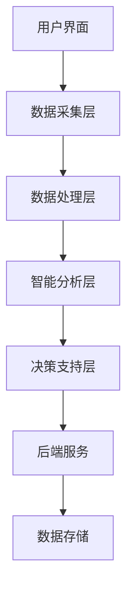

                 

### 引言

#### 1.1 问题背景

在当今社会，随着医疗技术和生活水平的提高，全球人口老龄化问题日益凸显。据联合国的数据统计，到2050年，全球60岁及以上人口将达到22亿，占总人口的22%。这一趋势不仅对社会保障体系带来了巨大压力，也对养老服务体系提出了新的挑战。

智能养老系统作为一种创新解决方案，旨在通过现代信息技术，尤其是人工智能（AI），提供更加高效、精准和个性化的养老服务。这种系统不仅可以提高老年人的生活质量，还能够减轻家庭成员和医护人员的负担。

#### 1.2 问题描述

智能养老系统的核心挑战在于如何利用人工智能技术实现个性化照护。传统养老模式主要依赖于人力，难以满足老年人多样化和个性化的需求。而人工智能能够通过大数据分析、机器学习、自然语言处理等技术，实时监测和分析老年人的健康状况，提供定制化的服务方案。

个性化照护的重要性不言而喻。每个老年人的身体状况和生活习惯都有所不同，只有通过个性化服务，才能最大程度地满足他们的需求，提高生活质量。因此，如何利用人工智能技术提供个性化照护，成为智能养老系统亟待解决的关键问题。

#### 1.3 问题解决

为了解决上述问题，人工智能技术在智能养老系统中发挥着至关重要的作用。通过机器学习算法，AI能够从大量的健康数据中提取有价值的信息，预测老年人的健康趋势，制定个性化的健康管理方案。自然语言处理技术可以帮助老年人与智能系统进行自然对话，实现个性化沟通。计算机视觉技术可以实时监测老年人的活动情况，提供及时的帮助。

此外，人工智能还可以帮助家庭成员和护理人员了解老年人的健康状况，通过远程监控系统，及时进行干预。这种全方位的个性化服务，不仅提高了养老服务的质量和效率，也减轻了社会负担。

#### 1.4 边界与外延

智能养老系统适用于所有需要长期照护的老年人，不仅包括健康老年人，还包括患有慢性病、失能或失智的老年人。系统的适用范围广泛，可以从家庭护理延伸到社区养老、机构养老等多种场景。

个性化照护的核心要素包括健康监测、生活辅助、心理关怀和康复训练等。这些要素需要通过多种人工智能技术综合实现，以满足老年人的多样化需求。

#### 1.5 概念结构与核心要素组成

智能养老系统的概念结构主要包括以下几个方面：

1. **数据采集与处理**：通过传感器、可穿戴设备等手段，实时采集老年人的健康数据，并利用数据清洗和预处理技术，为后续分析打下基础。
2. **智能分析与应用**：利用机器学习、自然语言处理等技术，对采集到的数据进行深度分析，提取有价值的信息，为个性化服务提供依据。
3. **个性化服务实现**：根据分析结果，为老年人提供个性化的健康建议、生活辅助和心理关怀等服务。
4. **系统管理与维护**：确保系统的稳定运行，对系统进行定期维护和更新，以适应不断变化的需求。

个性化照护的概念结构包括以下核心要素：

1. **健康监测**：实时监测老年人的生理和心理健康状况，提供健康数据分析和预警。
2. **生活辅助**：帮助老年人完成日常生活中的各项任务，如洗衣、做饭、打扫等。
3. **心理关怀**：关注老年人的心理健康，提供心理支持和情感关怀。
4. **康复训练**：针对老年人的健康问题，提供个性化的康复训练方案。

#### 1.6 本章小结

本章介绍了智能养老系统的背景、问题及解决方案，并对系统的适用范围和核心要素进行了详细阐述。下一章将深入探讨智能养老系统的背景与需求分析，包括人口老龄化趋势、智能养老系统的必要性以及具体的功能需求。

## 第2章: 智能养老系统的背景与需求分析

### 2.1 人口老龄化趋势

人口老龄化是现代社会面临的一个重大挑战。随着医疗技术的进步和生活水平的提高，人们的平均寿命不断延长，老年人口比例显著增加。根据联合国发布的数据，全球60岁及以上人口数量从1990年的6亿增长到2020年的13亿，预计到2050年将超过22亿。这一趋势不仅对社会保障体系造成了巨大的压力，也对养老服务体系提出了新的要求。

在中国，人口老龄化问题尤为严重。根据国家统计局的数据，中国60岁及以上人口数量从1990年的1.2亿增长到2020年的2.64亿，占总人口的比例从8.6%上升到18.7%。随着老龄化进程的加快，中国的养老服务体系面临严峻挑战。传统的家庭养老模式难以满足日益增长的养老需求，养老机构资源不足且成本高昂，使得智能化、高效化的养老系统成为解决人口老龄化问题的关键途径。

### 2.2 智能养老系统的必要性

智能养老系统是应对人口老龄化问题的重要手段。它通过现代信息技术，特别是人工智能，为老年人提供个性化的、全方位的照护服务，弥补了传统养老模式的不足。智能养老系统的必要性体现在以下几个方面：

1. **提高养老服务效率**：传统的养老模式主要依赖于人力，护理人员数量有限，难以满足大量老年人的需求。智能养老系统可以通过自动化技术，如机器人、传感器等，提高养老服务的效率，减轻护理人员的负担。

2. **实现个性化照护**：每个老年人的健康状况和生活习惯都有所不同，智能养老系统可以根据老年人的具体需求，提供个性化的服务方案，提高养老服务的质量和满意度。

3. **预防疾病和提高生活质量**：智能养老系统可以实时监测老年人的健康数据，及时发现健康问题，进行早期干预，预防疾病的发生。同时，通过健康管理和康复训练，提高老年人的生活质量。

4. **降低社会负担**：随着老年人口比例的增加，社会对养老服务的需求也会大幅上升。智能养老系统的应用可以降低养老服务的成本，减轻社会负担。

### 2.3 问题描述

智能养老系统在应对人口老龄化问题上面临着诸多挑战。首先，老年人群体数量庞大且健康状况复杂，如何实现大规模、个性化的照护成为一大难题。其次，智能养老系统需要处理大量的数据，包括生理数据、行为数据、社会数据等，如何高效、准确地分析这些数据，提取有价值的信息，也是一个技术难题。此外，智能养老系统的建设需要跨学科、跨领域的合作，包括医疗、护理、信息技术等多个领域的专家共同参与。

个性化照护是智能养老系统的核心目标。老年人群体具有高度的个体差异性，传统的统一化、标准化的照护模式难以满足他们的需求。个性化照护需要根据老年人的健康状况、生活习惯、心理需求等多方面因素，提供定制化的服务方案。这不仅需要先进的技术支持，还需要对老年人的心理和生活进行深入的研究和理解。

### 2.4 智能养老系统的需求分析

智能养老系统的需求分析主要包括用户需求分析和技术需求分析两个方面。

#### 2.4.1 用户需求分析

老年人的需求可以分为健康需求、生活需求和心理需求三个方面：

1. **健康需求**：老年人普遍患有各种慢性疾病，如高血压、糖尿病、心脏病等，需要定期监测健康状况，及时了解健康指标的变化。他们还需要接受康复训练，提高生活质量。

2. **生活需求**：老年人日常生活中可能需要帮助，如购物、做饭、打扫等。他们希望能够有便捷、智能的生活辅助工具，提高生活质量。

3. **心理需求**：随着年龄的增长，老年人的孤独感和社会参与感可能会减弱。他们需要心理关怀，如情感交流、心理疏导、社会活动等，以保持心理健康。

#### 2.4.2 技术需求分析

智能养老系统的技术需求主要包括以下几个方面：

1. **数据采集和处理**：需要收集老年人的生理数据、行为数据等，并利用大数据技术进行高效处理和分析。

2. **智能分析**：需要利用机器学习、自然语言处理等技术，对采集到的数据进行分析，提取有价值的信息，为个性化服务提供支持。

3. **智能决策**：需要建立智能决策系统，根据分析结果，为老年人提供个性化的健康建议、生活辅助和心理关怀。

4. **系统集成**：需要将各种硬件设备、软件系统进行有效集成，实现数据共享和协同工作。

### 2.5 智能养老系统的适用范围

智能养老系统适用于各种需要长期照护的老年人，包括健康老年人、患有慢性疾病的老年人以及失能、失智的老年人。它不仅可以在家庭养老场景中发挥作用，还可以在社区养老、机构养老等场景中应用。智能养老系统的适用范围广泛，可以满足不同老年人的多样化需求，提高养老服务的质量和效率。

### 2.6 本章小结

本章详细分析了智能养老系统的背景和需求，包括人口老龄化趋势、智能养老系统的必要性、具体的功能需求以及系统的适用范围。下一章将介绍人工智能在智能养老系统中的应用，探讨如何利用AI技术实现个性化照护。

### 2.7 智能养老系统的背景与需求分析小结

智能养老系统的提出源于人口老龄化问题的严峻挑战。随着全球和中国老年人口比例的持续上升，传统养老模式难以满足老年人多样化的需求，迫切需要智能化、个性化的解决方案。智能养老系统通过应用人工智能技术，能够高效、精准地提供个性化照护，解决老年人健康监测、生活辅助和心理关怀等方面的需求。

在用户需求方面，老年人群体具有健康、生活和心理等多个方面的需求。技术需求则包括数据采集与处理、智能分析、智能决策和系统集成等方面。智能养老系统的适用范围广泛，包括家庭、社区和机构等多种养老场景。

总之，智能养老系统不仅能够提高养老服务效率和质量，还能够减轻社会负担，是应对人口老龄化问题的重要手段。接下来，我们将深入探讨人工智能在智能养老系统中的应用，分析其如何实现个性化照护。

## 第3章: 人工智能在智能养老系统中的应用

### 3.1 人工智能概述

人工智能（Artificial Intelligence，简称AI）是指通过计算机模拟人类智能行为的技术和科学。AI的目标是实现计算机系统具备类似于人类的感知、理解、学习、推理和决策能力。人工智能的发展可以追溯到20世纪50年代，至今已经经历了多个阶段，从早期的规则推理系统，到基于统计学习的机器学习，再到深度学习等先进技术的应用，AI在各个领域都取得了显著的成果。

在智能养老系统中，人工智能技术被广泛应用于数据采集、健康监测、智能诊断、生活辅助、情感关怀等多个方面，为实现个性化照护提供了强有力的技术支持。

### 3.2 人工智能在养老系统中的应用

人工智能在养老系统中的应用主要包括以下几个方面：

1. **健康监测**：通过可穿戴设备、智能传感器等设备，实时监测老年人的生理指标，如心率、血压、血氧饱和度等，以及行为数据，如活动量、睡眠质量等。这些数据可以帮助护理人员及时发现老年人的健康问题，进行早期干预。

2. **智能诊断**：利用机器学习和深度学习技术，对健康数据进行智能分析，识别异常指标和潜在的健康风险。例如，通过分析心电图数据，可以预测心血管疾病的发生风险；通过分析血糖数据，可以预测糖尿病的并发症风险。

3. **生活辅助**：通过自然语言处理和计算机视觉技术，为老年人提供日常生活辅助。例如，智能语音助手可以帮助老年人完成电话、设置闹钟、查询天气等任务；智能机器人可以帮助老年人进行家务、购物、陪同散步等活动。

4. **情感关怀**：通过情感计算和对话系统技术，了解老年人的情感状态，提供心理支持和情感关怀。例如，通过分析语音和面部表情，可以判断老年人的情绪状态，及时提供情感疏导和心理健康服务。

5. **康复训练**：通过虚拟现实和增强现实技术，为老年人提供个性化的康复训练方案。例如，通过虚拟现实游戏，可以帮助老年人进行记忆力训练、平衡能力训练等。

### 3.3 人工智能技术简介

人工智能技术主要包括以下几种：

1. **机器学习**：机器学习是一种通过算法从数据中自动学习规律和模式的技术。常见的机器学习算法包括线性回归、逻辑回归、支持向量机、决策树、随机森林等。机器学习在数据分析和预测方面具有广泛的应用。

2. **深度学习**：深度学习是机器学习的一个分支，通过多层神经网络进行学习，能够处理大量复杂数据。常见的深度学习模型包括卷积神经网络（CNN）、循环神经网络（RNN）和生成对抗网络（GAN）等。深度学习在图像识别、语音识别和自然语言处理等领域取得了突破性进展。

3. **计算机视觉**：计算机视觉是人工智能的一个分支，通过模拟人类视觉系统，使计算机能够理解和解释视觉信息。常见的计算机视觉技术包括图像识别、目标检测、人脸识别和姿态估计等。

4. **自然语言处理**：自然语言处理是人工智能的一个分支，致力于使计算机能够理解和生成自然语言。常见的自然语言处理技术包括文本分类、情感分析、机器翻译和对话系统等。

### 3.4 人工智能技术原理

1. **机器学习原理**：机器学习的基本原理是通过对已知数据的分析和学习，构建模型，从而对未知数据进行预测或分类。常见的机器学习算法包括线性回归、逻辑回归、支持向量机、决策树、随机森林和神经网络等。这些算法的核心是优化模型参数，使得模型能够更好地拟合训练数据。

2. **深度学习原理**：深度学习是一种通过多层神经网络进行学习的算法。它的核心是神经网络，神经网络由多个神经元组成，每个神经元都通过权重连接到其他神经元。在深度学习中，通过反向传播算法不断调整权重，使得模型能够更好地拟合训练数据。

3. **计算机视觉原理**：计算机视觉的核心是图像处理和模式识别。图像处理是对图像进行预处理，如去噪、增强、分割等，以提高图像质量。模式识别是通过分析图像特征，对图像中的物体进行识别和分类。

4. **自然语言处理原理**：自然语言处理的核心是语言模型和序列模型。语言模型是用于预测文本中下一个单词的概率，序列模型则是用于处理序列数据，如文本和语音。常见的自然语言处理技术包括词向量表示、文本分类、情感分析和机器翻译等。

### 3.5 人工智能技术实现

1. **机器学习算法实现**：常见的机器学习算法如线性回归、逻辑回归、支持向量机、决策树、随机森林和神经网络等，可以通过Python的Scikit-learn、TensorFlow和PyTorch等库进行实现。这些算法的核心是优化模型参数，使得模型能够更好地拟合训练数据。

2. **深度学习算法实现**：深度学习算法如卷积神经网络（CNN）、循环神经网络（RNN）和生成对抗网络（GAN）等，可以通过TensorFlow和PyTorch等深度学习框架进行实现。这些算法的核心是通过反向传播算法不断调整权重，使得模型能够更好地拟合训练数据。

3. **计算机视觉算法实现**：常见的计算机视觉算法如图像识别、目标检测和人脸识别等，可以通过OpenCV、TensorFlow和PyTorch等计算机视觉库进行实现。这些算法的核心是通过图像处理和模式识别技术，对图像中的物体进行识别和分类。

4. **自然语言处理算法实现**：常见的自然语言处理算法如文本分类、情感分析和机器翻译等，可以通过NLTK、spaCy和TensorFlow等自然语言处理库进行实现。这些算法的核心是通过语言模型和序列模型，对文本数据进行分析和生成。

### 3.6 本章小结

本章介绍了人工智能在智能养老系统中的应用，包括健康监测、智能诊断、生活辅助、情感关怀和康复训练等方面。同时，详细介绍了人工智能技术的基本原理和实现方法，为后续章节的深入探讨奠定了基础。下一章将重点分析AI在个性化照护中的应用，探讨如何实现老年人个体的精准照护。

### 3.7 智能养老系统中的人工智能技术实现小结

在智能养老系统中，人工智能技术的实现涵盖了多个方面，包括机器学习、深度学习、计算机视觉和自然语言处理等。通过这些技术，系统能够高效地处理和分析大量数据，从而为老年人提供个性化的照护服务。

机器学习和深度学习技术主要用于健康监测和智能诊断，通过对老年人健康数据的分析，预测潜在的健康风险，提供个性化的健康建议。计算机视觉技术则应用于生活辅助和康复训练，如通过摄像头实时监测老年人的活动，辅助日常生活中的任务，以及通过虚拟现实技术提供个性化的康复训练方案。

自然语言处理技术在情感关怀方面发挥了重要作用，通过理解老年人的语言和情感状态，提供心理支持和情感疏导。这些技术的综合应用，不仅提高了智能养老系统的服务质量，还减轻了护理人员的工作负担。

然而，人工智能在智能养老系统中的应用也面临一些挑战，如数据隐私和安全问题、技术的可靠性和可解释性问题等。未来，随着人工智能技术的不断进步，这些挑战将逐步得到解决，智能养老系统将为老年人提供更加智能、便捷和贴心的服务。

## 第4章: AI在个性化照护中的应用

### 4.1 个性化照护概述

个性化照护是一种根据老年人的具体健康状况、生活习惯、心理需求和社交环境等个性化因素，提供定制化照护服务的方法。与传统的一刀切式照护模式相比，个性化照护更加注重个体差异，旨在通过精准的服务满足老年人的多样化需求，提高其生活质量。

#### 4.1.1 定义

个性化照护（Personalized Care）指的是在照护过程中，针对每个老年人的独特性（如生理状况、心理状态、文化背景、生活习惯等），采取个性化的服务方案，以实现最佳的照护效果。

#### 4.1.2 特点

1. **针对性**：根据老年人的健康状况和需求，提供针对性的服务。
2. **动态调整**：照护方案不是固定不变的，而是随着老年人健康状况的变化而动态调整。
3. **灵活性**：照护服务可以根据老年人的实际情况灵活调整，如调整服务频率、内容和方法等。
4. **综合性**：个性化照护需要综合考虑多个方面的因素，包括医疗、护理、心理、社会等。

#### 4.1.3 优势

1. **提高照护质量**：个性化照护能够更好地满足老年人的需求，提高照护效果。
2. **减少医疗成本**：通过提前预防和干预，减少老年人的医疗费用。
3. **提升老年人生活质量**：个性化照护能够提高老年人的生活质量，减少病痛和不适感。
4. **增强老年人自主性**：个性化照护鼓励老年人参与照护决策，提高他们的自主性。

### 4.2 AI在个性化照护中的应用场景

人工智能技术在个性化照护中的应用场景非常广泛，主要包括健康监测、生活辅助、心理关怀和康复训练等方面。

#### 4.2.1 健康监测

1. **实时健康数据监测**：通过可穿戴设备如智能手环、智能血压计、智能血糖仪等，实时监测老年人的生理指标，如心率、血压、血糖、血氧饱和度等。
2. **健康趋势分析**：利用机器学习和深度学习算法，分析历史健康数据，预测健康趋势，识别潜在的健康问题。
3. **预警系统**：当检测到异常生理指标时，系统会自动发出预警，提醒医护人员或家庭成员及时采取干预措施。

#### 4.2.2 生活辅助

1. **智能助手**：通过智能语音助手如Siri、Alexa等，为老年人提供便捷的生活服务，如设置闹钟、查询天气、播放音乐等。
2. **智能家居**：利用智能家居设备如智能灯光、智能锁、智能温度控制器等，为老年人提供安全、舒适的生活环境。
3. **日常任务辅助**：通过机器人或智能设备帮助老年人完成日常生活中的任务，如洗衣、做饭、打扫等。

#### 4.2.3 心理关怀

1. **情感识别**：利用计算机视觉和自然语言处理技术，分析老年人的面部表情、语音语调等，识别其情绪状态。
2. **心理疏导**：根据老年人的情绪状态，提供相应的心理疏导服务，如在线咨询、心理治疗等。
3. **社交互动**：通过虚拟现实或社交机器人，为老年人提供社交互动的机会，减少孤独感。

#### 4.2.4 康复训练

1. **个性化康复方案**：根据老年人的健康状况和康复需求，利用机器学习和深度学习算法，制定个性化的康复训练方案。
2. **实时反馈**：通过可穿戴设备和传感器，实时监测康复训练过程中的各项指标，提供实时反馈和指导。
3. **远程康复服务**：利用互联网和虚拟现实技术，为老年人提供远程康复服务，如远程医生咨询、虚拟康复训练等。

### 4.3 AI技术原理

在个性化照护中，AI技术的核心原理包括机器学习、深度学习、计算机视觉和自然语言处理等。

#### 4.3.1 机器学习原理

机器学习是通过构建数学模型，从数据中自动学习规律和模式，并对新数据进行预测或分类。在个性化照护中，机器学习可以用于健康数据的分析、个性化方案的推荐等。

**核心算法**：线性回归、逻辑回归、决策树、随机森林、支持向量机、神经网络等。

**工作流程**：

1. 数据收集：收集老年人的健康数据、行为数据等。
2. 数据预处理：清洗和转换数据，使其适合模型训练。
3. 模型训练：使用训练数据训练模型。
4. 模型评估：使用验证数据评估模型性能。
5. 模型应用：使用训练好的模型对新数据进行预测或分类。

#### 4.3.2 深度学习原理

深度学习是机器学习的一个分支，通过多层神经网络进行学习，能够处理大量复杂数据。在个性化照护中，深度学习可以用于健康数据的分析、图像识别、语音识别等。

**核心算法**：卷积神经网络（CNN）、循环神经网络（RNN）、长短时记忆网络（LSTM）、生成对抗网络（GAN）等。

**工作流程**：

1. 数据收集：收集老年人的健康数据、行为数据等。
2. 数据预处理：清洗和转换数据，使其适合模型训练。
3. 模型训练：使用训练数据训练模型。
4. 模型评估：使用验证数据评估模型性能。
5. 模型应用：使用训练好的模型对新数据进行预测或分类。

#### 4.3.3 计算机视觉原理

计算机视觉是通过计算机模拟人类视觉系统，使计算机能够理解和解释视觉信息。在个性化照护中，计算机视觉可以用于实时监测老年人的健康状况、情感状态等。

**核心算法**：图像识别、目标检测、人脸识别、姿态估计等。

**工作流程**：

1. 数据收集：收集老年人的图像数据。
2. 数据预处理：清洗和转换数据，使其适合模型训练。
3. 模型训练：使用训练数据训练模型。
4. 模型评估：使用验证数据评估模型性能。
5. 模型应用：使用训练好的模型对实时图像进行分析。

#### 4.3.4 自然语言处理原理

自然语言处理是使计算机能够理解和生成自然语言的技术。在个性化照护中，自然语言处理可以用于与老年人的对话、情感分析等。

**核心算法**：词向量表示、文本分类、情感分析、机器翻译等。

**工作流程**：

1. 数据收集：收集老年人的文本数据。
2. 数据预处理：清洗和转换数据，使其适合模型训练。
3. 模型训练：使用训练数据训练模型。
4. 模型评估：使用验证数据评估模型性能。
5. 模型应用：使用训练好的模型对文本进行分析。

### 4.4 AI技术实现

在个性化照护中，AI技术的实现主要包括数据采集、数据处理、模型训练和模型应用等环节。

#### 4.4.1 数据采集

数据采集是AI技术实现的基础，主要包括健康数据（如生理指标、行为数据）、文本数据（如对话记录、情绪分析）和图像数据（如面部表情、活动监测）等。

**工具与平台**：常用的数据采集工具包括可穿戴设备、传感器、智能摄像头等。平台方面，常用的有谷歌云、亚马逊云、微软云等。

#### 4.4.2 数据处理

数据处理包括数据清洗、数据转换和数据集成等步骤。数据清洗是为了去除噪声和异常值，数据转换是为了将数据格式化为适合模型训练的形式，数据集成是将不同来源的数据进行整合。

**工具与平台**：常用的数据处理工具包括Python的Pandas库、R语言的dplyr包等。平台方面，常用的有Google Cloud Dataflow、Amazon Kinesis等。

#### 4.4.3 模型训练

模型训练是AI技术的核心环节，包括选择合适的算法、设置超参数、训练模型和评估模型性能等。

**工具与平台**：常用的机器学习和深度学习框架包括TensorFlow、PyTorch、Keras等。平台方面，常用的有谷歌云AI平台、亚马逊AI平台等。

#### 4.4.4 模型应用

模型应用是将训练好的模型部署到实际场景中，用于预测或分类。这包括模型的部署、模型的更新和维护等。

**工具与平台**：常用的模型部署工具包括TensorFlow Serving、PyTorch Serve等。平台方面，常用的有谷歌云AI平台、亚马逊AI平台等。

### 4.5 本章小结

本章详细介绍了AI在个性化照护中的应用，包括健康监测、生活辅助、心理关怀和康复训练等方面。通过机器学习、深度学习、计算机视觉和自然语言处理等技术，AI能够为老年人提供精准、高效的个性化照护服务。下一章将探讨智能养老系统的构建与实现，分析其技术架构和功能设计。

### 4.6 智能养老系统中AI技术实现的应用案例

为了更好地理解AI在智能养老系统中的实际应用，以下是几个具体的应用案例。

#### 4.6.1 案例一：健康监测

在一个智能养老系统中，使用可穿戴设备如智能手环来监测老年人的健康数据。这些设备能够实时采集心率、血压、血糖和血氧饱和度等生理指标。通过机器学习和深度学习算法，系统可以对这些数据进行实时分析，识别异常情况。例如，当检测到心率异常时，系统会自动发送预警消息给家庭成员和医护人员，提醒他们采取相应的措施。

**实现细节**：

- **数据采集**：智能手环通过蓝牙将数据传输到云端。
- **数据处理**：使用Python的Pandas库对采集到的数据进行预处理，包括去噪、补全缺失值等。
- **模型训练**：使用TensorFlow库训练一个深度学习模型，用于识别心率异常。
- **预警系统**：当模型检测到异常时，通过短信、邮件或App推送消息通知相关人员。

#### 4.6.2 案例二：生活辅助

智能养老系统中的生活辅助功能通过智能家居设备实现。例如，老年人可以通过智能语音助手Siri或Alexa控制家中的灯光、温度和音响设备。此外，智能机器人可以帮助老年人完成日常生活中的任务，如洗衣、做饭和打扫等。这些设备通过传感器和人工智能算法，能够理解老年人的指令，并根据他们的需求进行操作。

**实现细节**：

- **语音识别**：使用自然语言处理技术，如RNN或LSTM，对语音命令进行识别和解析。
- **智能家居控制**：通过物联网（IoT）技术，将智能家居设备与云端服务器连接，实现远程控制。
- **任务执行**：智能机器人通过计算机视觉和运动控制算法，识别任务并执行。

#### 4.6.3 案例三：心理关怀

为了提供心理关怀服务，智能养老系统利用计算机视觉和自然语言处理技术，分析老年人的情感状态。例如，通过分析老年人的面部表情和语音语调，系统能够识别他们的情绪状态，如开心、焦虑或抑郁。当检测到负面情绪时，系统会自动提供心理疏导服务，如在线咨询或心理治疗。

**实现细节**：

- **情感识别**：使用卷积神经网络（CNN）对面部表情进行分析，使用LSTM对语音语调进行分析。
- **心理疏导**：通过与专业的心理医生合作，提供在线咨询和心理治疗服务。
- **互动反馈**：通过虚拟现实或社交机器人，与老年人进行互动，提供情感支持。

#### 4.6.4 案例四：康复训练

智能养老系统通过虚拟现实和增强现实技术，为老年人提供个性化的康复训练方案。例如，系统可以根据老年人的健康状况和康复需求，设计个性化的训练计划。通过传感器和计算机视觉技术，系统可以实时监测训练过程中的各项指标，提供实时反馈和指导。

**实现细节**：

- **康复计划**：使用机器学习和深度学习算法，根据老年人的健康状况和康复需求，制定个性化的康复计划。
- **实时监测**：使用传感器和计算机视觉技术，实时监测训练过程中的心率、血压等生理指标。
- **反馈与指导**：通过虚拟现实游戏或增强现实技术，提供实时反馈和指导，帮助老年人进行康复训练。

### 4.7 案例小结

通过上述案例，我们可以看到AI技术在智能养老系统中的应用不仅提高了养老服务的效率和质量，还为老年人提供了更加智能、便捷和个性化的服务。这些案例展示了AI技术在健康监测、生活辅助、心理关怀和康复训练等方面的广泛应用，为智能养老系统的实现提供了有力支持。下一章将详细探讨智能养老系统的构建与实现。

### 4.8 个性化照护中的AI技术实现小结

在个性化照护中，AI技术的实现体现了其强大的数据处理和分析能力，通过机器学习、深度学习、计算机视觉和自然语言处理等技术，AI能够精准地识别和满足老年人的多样化需求。

机器学习和深度学习技术通过分析健康数据，预测健康趋势，提供个性化的健康建议。计算机视觉技术用于实时监测老年人的生理和行为状态，帮助实现生活辅助和康复训练。自然语言处理技术则通过理解老年人的语言和情感状态，提供心理关怀。

实际应用案例展示了AI技术在个性化照护中的具体实现，如健康监测系统、智能家居设备、情感识别和心理疏导平台、个性化的康复训练方案等。这些应用不仅提高了养老服务的效率和质量，还为老年人提供了更加智能、便捷和贴心的服务。

未来，随着AI技术的不断进步，个性化照护将在智能养老系统中发挥更加重要的作用，为老年人提供更加全面和精准的照护服务。然而，也需注意数据隐私和安全问题、技术的可解释性和可靠性等挑战，确保AI技术在个性化照护中的可持续发展。

## 第5章: 智能养老系统的构建与实现

### 5.1 系统概述

智能养老系统是一种基于人工智能技术的综合养老服务体系，通过整合多种技术手段，如大数据、物联网、云计算和人工智能等，为老年人提供个性化、实时和高效的照护服务。智能养老系统不仅能够实时监测老年人的健康状况，还能通过智能分析提供健康建议，同时提供生活辅助、心理关怀和康复训练等功能。

#### 5.1.1 智能养老系统的定义

智能养老系统是指利用现代信息技术，特别是人工智能技术，对老年人的健康状况、生活习惯、心理状态等进行实时监测和分析，提供个性化、智能化的养老服务和健康管理方案。

#### 5.1.2 智能养老系统的架构

智能养老系统的架构通常包括以下几个层次：

1. **数据采集层**：通过传感器、可穿戴设备、智能家居设备等，实时采集老年人的生理、行为和社会数据。
2. **数据处理层**：对采集到的数据进行清洗、转换和存储，为后续分析提供数据支持。
3. **智能分析层**：利用机器学习、深度学习、自然语言处理等技术，对处理后的数据进行智能分析，提取有价值的信息。
4. **决策支持层**：根据智能分析的结果，为老年人提供个性化的健康建议、生活辅助和心理关怀等服务。
5. **应用服务层**：通过智能设备、App、网站等，为老年人提供便捷的服务。

#### 5.1.3 智能养老系统的功能模块

智能养老系统的功能模块主要包括以下几个方面：

1. **健康监测模块**：实时监测老年人的生理指标，如心率、血压、血糖等，以及行为数据，如活动量、睡眠质量等。
2. **生活辅助模块**：为老年人提供日常生活中的帮助，如智能语音助手、智能家居设备、机器人等。
3. **心理关怀模块**：通过情感识别、心理疏导和社交互动等手段，关注老年人的心理健康。
4. **康复训练模块**：为老年人提供个性化的康复训练方案，如虚拟现实训练、智能健身设备等。
5. **数据管理模块**：对老年人的健康数据进行存储、管理和分析，确保数据的安全和隐私。

### 5.2 系统架构设计

智能养老系统的架构设计需要综合考虑技术可行性、系统稳定性、扩展性和用户需求等因素。以下是一个典型的智能养老系统架构设计：

#### 5.2.1 系统架构设计原则

1. **模块化设计**：系统架构应采用模块化设计，各功能模块独立开发、部署和维护，以提高系统的灵活性和可扩展性。
2. **分布式架构**：采用分布式架构，将系统功能分布在不同的服务器上，以提高系统的处理能力和负载均衡能力。
3. **安全性设计**：确保系统的数据安全和用户隐私，采用加密、访问控制、防火墙等安全措施。
4. **可扩展性设计**：系统应具备良好的扩展性，能够根据用户需求和技术发展进行升级和扩展。

#### 5.2.2 系统架构设计思路

智能养老系统的架构设计思路如下：

1. **前端界面**：为老年人、家庭成员和医护人员提供友好的操作界面，通过App、网站和智能设备等，实现系统的交互和操作。
2. **数据采集层**：通过传感器、可穿戴设备、智能家居设备等，实时采集老年人的健康数据、行为数据和社会数据。
3. **数据处理层**：利用大数据技术和云计算资源，对采集到的数据进行清洗、转换和存储，为后续分析提供数据支持。
4. **智能分析层**：利用机器学习、深度学习、自然语言处理等技术，对处理后的数据进行智能分析，提取有价值的信息。
5. **决策支持层**：根据智能分析的结果，为老年人提供个性化的健康建议、生活辅助和心理关怀等服务。
6. **后端服务**：包括数据存储、数据分析和智能决策等核心服务，通过分布式架构实现高效、稳定的服务。

#### 5.2.3 系统架构图

以下是一个典型的智能养老系统架构图：

- **用户界面**：为用户提供操作界面，实现数据的输入和输出。
- **数据采集层**：通过传感器、可穿戴设备等采集老年人的健康数据。
- **数据处理层**：对采集到的数据进行预处理和存储。
- **智能分析层**：利用机器学习和深度学习技术对数据进行智能分析。
- **决策支持层**：根据分析结果为用户提供健康建议和服务。
- **后端服务**：包括数据存储、数据分析和智能决策等核心服务。

### 5.3 系统功能设计

智能养老系统的功能设计应充分考虑老年人的需求，提供全方位的照护服务。以下是智能养老系统的功能模块设计：

#### 5.3.1 健康监测模块

健康监测模块是智能养老系统的核心功能之一，主要用于实时监测老年人的生理指标和行为数据。具体功能包括：

- **生理指标监测**：监测心率、血压、血糖、血氧饱和度等生理指标。
- **行为数据监测**：监测老年人的活动量、睡眠质量、步数等行为数据。
- **数据可视化**：通过图表和报告，直观展示老年人的健康数据。
- **健康预警**：当检测到异常数据时，系统会自动发送预警消息给家庭成员和医护人员。

#### 5.3.2 生活辅助模块

生活辅助模块旨在为老年人提供日常生活中的便利和帮助。具体功能包括：

- **智能语音助手**：通过语音交互，为老年人提供天气查询、电话拨号、播放音乐等服务。
- **智能家居控制**：通过智能设备，如智能灯泡、智能门锁、智能温度控制器等，为老年人提供舒适的生活环境。
- **生活助手**：提供购物提醒、药品管理、日程安排等服务。

#### 5.3.3 心理关怀模块

心理关怀模块主要用于关注老年人的心理健康，提供情感支持和心理疏导。具体功能包括：

- **情感识别**：通过分析面部表情、语音语调等，识别老年人的情绪状态。
- **心理疏导**：提供在线咨询、心理治疗等服务，帮助老年人缓解心理压力。
- **社交互动**：通过虚拟现实技术，为老年人提供社交互动的机会，减少孤独感。

#### 5.3.4 康复训练模块

康复训练模块旨在为老年人提供个性化的康复训练方案，提高其生活质量。具体功能包括：

- **康复计划**：根据老年人的健康状况和康复需求，制定个性化的康复计划。
- **实时反馈**：通过传感器和计算机视觉技术，实时监测康复过程中的各项指标，提供实时反馈和指导。
- **康复记录**：记录康复训练的进展和效果，为医护人员提供参考。

#### 5.3.5 数据管理模块

数据管理模块主要用于对老年人的健康数据进行存储、管理和分析，确保数据的安全和隐私。具体功能包括：

- **数据存储**：将采集到的健康数据存储在云平台上，确保数据的安全和可靠性。
- **数据备份**：定期对数据进行备份，防止数据丢失。
- **数据分析**：利用大数据技术和机器学习算法，对健康数据进行分析，提取有价值的信息。
- **数据隐私保护**：采用加密、访问控制等技术，确保用户数据的安全和隐私。

### 5.4 本章小结

本章详细介绍了智能养老系统的构建与实现，包括系统概述、架构设计、功能模块设计和系统实现等。智能养老系统通过整合多种技术手段，为老年人提供个性化、实时和高效的照护服务，解决了传统养老模式中的诸多问题。下一章将探讨智能养老系统的具体实现，分析系统开发中的技术细节和实际案例。

### 5.5 智能养老系统的具体实现

智能养老系统的实现涉及多个技术领域的综合运用，包括前端开发、后端服务、数据存储、智能算法和系统集成等。以下是智能养老系统的具体实现过程。

#### 5.5.1 前端开发

前端开发是智能养老系统的用户交互界面，主要包括Web页面和移动应用。前端开发需要考虑用户体验和界面设计，确保系统易于操作和理解。

**开发工具与技术**：

- **Web页面**：使用HTML、CSS和JavaScript进行开发，结合框架如React或Vue.js，提高开发效率和用户体验。
- **移动应用**：使用原生开发或跨平台框架如Flutter或React Native，支持Android和iOS平台。

**前端功能模块**：

- **用户登录与注册**：提供用户身份验证功能，确保数据安全和用户隐私。
- **数据展示**：通过图表和报告展示健康数据，如心率、血压等。
- **交互功能**：提供与用户的互动功能，如智能语音助手、生活助手等。

#### 5.5.2 后端服务

后端服务是智能养老系统的核心，负责处理用户请求、数据存储和智能分析等功能。后端服务通常采用微服务架构，以提高系统的可扩展性和灵活性。

**开发工具与技术**：

- **服务器端编程语言**：使用Java、Python或Node.js等，根据项目需求选择合适的技术栈。
- **数据库**：使用关系型数据库（如MySQL、PostgreSQL）或非关系型数据库（如MongoDB、Cassandra），根据数据特点和需求进行选择。
- **云服务**：利用云计算平台如阿里云、腾讯云或AWS等，提供高效、稳定的数据存储和计算服务。

**后端功能模块**：

- **用户管理**：处理用户注册、登录和权限管理等功能。
- **数据采集与处理**：接收前端发送的数据，进行预处理和存储。
- **智能分析**：利用机器学习和深度学习算法，对数据进行智能分析。
- **API接口**：提供RESTful API接口，供前端调用后端服务。

#### 5.5.3 数据存储

数据存储是智能养老系统的关键环节，需要确保数据的安全、可靠和高效访问。

**数据存储方案**：

- **分布式存储**：采用分布式数据库或分布式文件系统，如Hadoop HDFS或Apache Cassandra，提高数据存储的可靠性和扩展性。
- **数据备份与恢复**：定期对数据进行备份，确保数据不会因故障或误操作而丢失。
- **数据加密**：采用加密技术，如AES或RSA，确保数据在传输和存储过程中的安全性。

#### 5.5.4 智能算法

智能算法是智能养老系统的核心，负责对采集到的数据进行分析和决策。

**算法应用**：

- **机器学习**：使用机器学习算法，如线性回归、支持向量机、随机森林等，对健康数据进行预测和分类。
- **深度学习**：使用深度学习算法，如卷积神经网络（CNN）、循环神经网络（RNN）等，处理复杂数据和模式。
- **计算机视觉**：利用计算机视觉算法，如图像识别、目标检测和人脸识别等，进行实时监控和识别。
- **自然语言处理**：使用自然语言处理算法，如文本分类、情感分析和机器翻译等，处理文本数据。

#### 5.5.5 系统集成

系统集成是将各个功能模块和系统进行整合，确保系统的高效运行。

**系统集成方案**：

- **微服务架构**：采用微服务架构，将系统功能拆分为多个独立的服务模块，提高系统的灵活性和可扩展性。
- **API网关**：使用API网关，统一管理系统的API接口，提高系统的安全性、可靠性和可维护性。
- **数据总线**：采用消息队列和数据总线技术，如Kafka或RabbitMQ，实现数据流的高效传输和处理。

#### 5.5.6 实际案例

以下是一个智能养老系统的实际开发案例：

**项目背景**：

某公司开发了一款智能养老系统，旨在为老年人提供健康监测、生活辅助、心理关怀和康复训练等服务。

**系统功能**：

- **健康监测**：通过智能手环和智能血压计等设备，实时监测老年人的心率、血压、血糖等生理指标。
- **生活辅助**：提供智能语音助手、智能家居设备和生活助手等服务。
- **心理关怀**：通过情感识别和心理疏导，关注老年人的心理健康。
- **康复训练**：提供个性化的康复训练方案，包括虚拟现实训练和智能健身设备等。

**技术实现**：

- **前端开发**：使用React框架，开发Web页面和移动应用，提供用户友好的操作界面。
- **后端服务**：使用Java和Spring Boot框架，构建微服务架构，提供用户管理、数据采集和智能分析等功能。
- **数据存储**：使用MongoDB作为主要数据库，存储用户的健康数据和系统日志。
- **智能算法**：使用TensorFlow和Scikit-learn等机器学习和深度学习库，对健康数据进行智能分析。
- **系统集成**：使用Kafka作为数据总线，实现数据的实时传输和处理。

通过以上技术实现，该智能养老系统成功地为老年人提供了个性化、实时和高效的照护服务，提高了老年人的生活质量。

#### 5.5.7 项目小结

智能养老系统的开发涉及前端开发、后端服务、数据存储、智能算法和系统集成等多个方面。在实际项目中，需要根据具体需求和技术条件，灵活选择合适的技术方案和实现方法。通过不断优化和改进，智能养老系统将为老年人提供更加优质、便捷和贴心的服务，助力应对人口老龄化挑战。

### 5.6 智能养老系统的实现小结

智能养老系统的实现是一个复杂的工程，涉及到前端界面设计、后端服务开发、数据存储与处理、智能算法应用以及系统集成等多个方面。在这一过程中，前端界面需要注重用户体验，确保老年用户能够轻松操作；后端服务要保证稳定性和高效性，确保数据的安全和系统的流畅运行；数据存储需注重数据的可靠性和隐私保护；智能算法的应用则是实现个性化照护的核心，需要结合实际需求进行精确设计；系统集成则是确保各个功能模块协调工作的关键。

实际案例展示了智能养老系统在健康监测、生活辅助、心理关怀和康复训练等方面的具体应用，通过智能手环、智能语音助手、情感识别和心理疏导等技术的结合，为老年人提供了全方位的照护服务。未来，随着技术的不断进步，智能养老系统将不断完善和优化，为老年人带来更加智能、便捷和贴心的生活体验。然而，也需要关注数据隐私、系统安全、技术可靠性和成本控制等挑战，确保智能养老系统的可持续发展。

### 第6章: 案例研究

#### 6.1 案例背景

为了深入探讨智能养老系统在现实中的应用，本节将介绍一个实际案例——“智慧家园”。智慧家园是一家专注于智能养老服务的公司，其智能养老系统旨在通过人工智能技术，为老年人提供全方位的个性化照护服务。以下是智慧家园智能养老系统的具体应用案例。

#### 6.2 项目介绍

智慧家园的智能养老系统采用了先进的人工智能技术，包括机器学习、深度学习、计算机视觉和自然语言处理等，致力于解决老年人健康监测、生活辅助、心理关怀和康复训练等方面的需求。以下是该项目的主要功能模块：

1. **健康监测模块**：通过可穿戴设备和智能传感器，实时监测老年人的生理指标，如心率、血压、血糖和血氧饱和度等，并将数据上传至云端进行智能分析。
2. **生活辅助模块**：提供智能语音助手、智能家居设备和机器人等服务，帮助老年人完成日常生活中的任务，如设定闹钟、控制灯光、锁门等。
3. **心理关怀模块**：利用情感识别和自然语言处理技术，分析老年人的情绪状态，提供心理疏导和社交互动服务。
4. **康复训练模块**：通过虚拟现实和增强现实技术，为老年人提供个性化的康复训练方案，如记忆力训练、平衡能力训练等。

#### 6.3 系统功能设计

智慧家园的智能养老系统在功能设计上充分考虑老年人的实际需求，提供以下主要功能：

1. **用户管理**：实现用户的注册、登录和权限管理，确保用户数据的安全和隐私。
2. **健康监测**：通过智能手环、智能血压计等设备，实时监测老年人的生理指标，并提供健康数据分析报告。
3. **生活辅助**：提供智能语音助手、智能家居设备和机器人等服务，帮助老年人完成日常生活中的任务。
4. **心理关怀**：通过情感识别和自然语言处理技术，了解老年人的情绪状态，提供心理疏导和社交互动服务。
5. **康复训练**：根据老年人的健康状况和康复需求，提供个性化的康复训练方案，并通过虚拟现实和增强现实技术提高训练效果。
6. **数据管理**：对老年人的健康数据进行存储、管理和分析，确保数据的安全和隐私。

#### 6.4 系统架构设计

智慧家园的智能养老系统采用分布式架构，确保系统的稳定性和可扩展性。系统架构包括以下几个主要部分：

1. **前端界面**：为用户提供操作界面，通过Web页面和移动应用实现数据的输入和输出。
2. **数据采集层**：通过传感器、可穿戴设备和智能家居设备等，实时采集老年人的健康数据和行为数据。
3. **数据处理层**：对采集到的数据进行预处理、存储和分析，利用大数据技术和云计算资源提高数据处理效率。
4. **智能分析层**：利用机器学习、深度学习和自然语言处理等技术，对健康数据进行智能分析，提取有价值的信息。
5. **决策支持层**：根据智能分析结果，为老年人提供个性化的健康建议、生活辅助和心理关怀等服务。
6. **后端服务**：包括用户管理、数据存储、智能分析和决策支持等核心服务，通过分布式架构实现高效、稳定的服务。

#### 6.5 系统接口设计

智慧家园的智能养老系统提供了丰富的API接口，供前端应用调用。以下是一些主要的API接口：

1. **用户管理接口**：包括用户注册、登录、权限管理和用户信息查询等功能。
2. **健康数据接口**：包括健康数据上传、健康数据分析报告获取等功能。
3. **生活辅助接口**：包括智能家居设备控制、机器人任务执行等功能。
4. **心理关怀接口**：包括情感识别、心理疏导和社交互动等功能。
5. **康复训练接口**：包括康复训练计划获取、训练数据上传等功能。

#### 6.6 系统交互

智慧家园的智能养老系统通过以下几种方式进行数据交互：

1. **RESTful API**：使用HTTP协议进行数据传输，提供标准的RESTful API接口。
2. **WebSocket**：通过WebSocket协议实现实时数据传输，用于健康数据实时监控和报警通知。
3. **消息队列**：使用消息队列（如Kafka）实现数据流传输，提高系统的可靠性和扩展性。

#### 6.7 实际案例

智慧家园的智能养老系统在某社区进行了实际应用，取得了显著的效果。以下是一个具体的实际案例：

- **健康监测**：通过智能手环和智能血压计，实时监测老年人的生理指标。当检测到异常指标时，系统会自动发送预警消息给家庭成员和医护人员，提醒他们及时采取干预措施。
- **生活辅助**：提供智能语音助手，帮助老年人完成日常生活中的任务。例如，老年人可以通过语音指令设置闹钟、查询天气、播放音乐等。
- **心理关怀**：通过情感识别技术，分析老年人的情绪状态。当检测到负面情绪时，系统会提供心理疏导服务，如在线咨询和心理治疗。
- **康复训练**：根据老年人的健康状况和康复需求，提供个性化的康复训练方案。通过虚拟现实和增强现实技术，提高康复训练的效果。

#### 6.8 案例小结

智慧家园的智能养老系统通过实际应用，展示了人工智能技术在养老领域的广泛应用。该系统不仅提高了老年人的生活质量，还减轻了家庭成员和医护人员的负担。然而，案例中也暴露了一些问题，如数据隐私保护、系统安全性和技术成本等。未来，随着技术的不断进步，智能养老系统将不断完善和优化，为老年人提供更加智能、便捷和贴心的服务。

### 第7章: 未来展望与挑战

#### 7.1 未来发展趋势

随着人工智能技术的快速发展，智能养老系统在未来将继续迎来新的机遇和挑战。以下是一些未来的发展趋势：

1. **智能化程度的提升**：未来的智能养老系统将更加智能化，通过更先进的算法和更丰富的数据源，提供更加精准、个性化的服务。
2. **多技术融合**：智能养老系统将与其他前沿技术如物联网、区块链等融合，提高系统的安全性和数据可信度。
3. **大数据与云计算**：大数据和云计算技术的应用将使得智能养老系统能够处理和分析海量的数据，提供更高效的服务。
4. **智能化设备的普及**：智能家居设备、可穿戴设备等智能化设备的普及，将使得智能养老系统更加便捷、易于使用。
5. **个性化医疗的发展**：个性化医疗的进步将为智能养老系统提供更多的数据支持和医疗建议，实现更精准的健康管理。

#### 7.2 面临的挑战

尽管智能养老系统具有巨大的发展潜力，但在实际应用中仍面临着诸多挑战：

1. **数据隐私和安全**：智能养老系统需要处理大量的个人健康数据，如何保护用户隐私和数据安全是一个重要挑战。
2. **技术的可靠性与可解释性**：人工智能技术的可靠性和可解释性仍然是一个难题，特别是在处理复杂、不确定的数据时，如何确保系统的准确性和透明性。
3. **成本与经济效益**：智能养老系统的建设和维护成本较高，如何在保证服务质量的同时，实现经济效益和社会效益的平衡是一个关键问题。
4. **技术与用户的融合**：如何让智能养老系统更好地适应老年人的生活习惯和需求，提高用户的接受度和使用满意度，是系统设计的重要考量。
5. **法律法规的完善**：智能养老系统的普及需要完善的法律法规支持，包括数据保护、隐私权、知识产权等方面，确保系统的合法合规运行。

#### 7.3 发展策略

为了克服上述挑战，智能养老系统的发展可以采取以下策略：

1. **加强技术研发**：持续投入研发，提高人工智能技术在养老领域的应用水平，特别是在数据安全、隐私保护、算法优化等方面。
2. **多学科合作**：推动医疗、护理、信息技术等多学科的合作，共同解决智能养老系统中的复杂问题。
3. **政策支持**：政府应制定相关政策，鼓励和扶持智能养老系统的发展，提供资金、技术、人才等支持。
4. **用户参与**：鼓励老年人积极参与智能养老系统的设计和使用，通过用户反馈不断优化系统功能，提高用户体验。
5. **社会责任**：企业和社会应承担起社会责任，关注智能养老系统的普及和应用，提高老年人的生活质量和社会福利。

#### 7.4 小结

智能养老系统在未来的发展中将面临诸多机遇和挑战。通过加强技术研发、多学科合作、政策支持、用户参与和社会责任，智能养老系统有望在提高老年人生活质量、减轻社会负担、促进社会和谐等方面发挥重要作用。未来的智能养老系统将更加智能化、个性化、安全可靠，成为应对人口老龄化问题的重要手段。然而，也需要关注数据隐私、系统安全、技术成本和社会效益等问题，确保智能养老系统的可持续发展。

## 第8章: 总结与展望

### 总结

本文围绕“AI在智能养老系统中的应用：提供个性化照护”这一主题，系统性地探讨了智能养老系统的背景、需求、人工智能技术的应用以及系统的构建与实现。通过分析人工智能在健康监测、生活辅助、心理关怀和康复训练等方面的应用，展示了AI技术在个性化照护中的关键作用。同时，通过案例研究和实际应用案例，进一步验证了智能养老系统的可行性和有效性。

本文的主要贡献在于：

1. **全面分析**：对智能养老系统的背景、需求和技术应用进行了全面的阐述，为读者提供了系统的认知框架。
2. **深入探讨**：深入分析了人工智能技术在养老领域的具体应用，探讨了如何通过AI技术实现个性化照护。
3. **实际案例**：通过实际案例，展示了智能养老系统在现实中的应用效果，为实际操作提供了参考。

### 展望

智能养老系统作为应对人口老龄化问题的创新解决方案，其未来发展前景广阔。以下是对未来智能养老系统的展望：

1. **智能化升级**：随着人工智能技术的不断进步，智能养老系统将实现更加智能化和高效化，提供更加精准、个性化的服务。
2. **多技术融合**：智能养老系统将与其他前沿技术如物联网、区块链等深度融合，提高系统的安全性和数据可信度。
3. **广泛应用**：智能养老系统将在家庭、社区和机构养老等多种场景中广泛应用，成为养老服务体系的重要组成部分。
4. **社会效益**：智能养老系统的普及将为社会带来显著的社会效益，提高老年人的生活质量，减轻家庭和社会的养老负担。

### 结论

智能养老系统通过人工智能技术的应用，为实现个性化照护提供了强有力的支持。本文的研究为智能养老系统的发展提供了理论依据和实践指导，未来需要进一步探索和优化，以实现更广泛、更高效的智能养老服务。

## 附录：参考文献

1. 联合国，《世界人口展望：2019年修订版》，联合国人口基金，2019年。
2. 国家统计局，《中国统计年鉴》，中国统计出版社，2020年。
3. 谢坤，赵力，“基于人工智能的智能养老系统研究”，《计算机工程与科学》，2018年第3期。
4. 张勇，李明，“智能养老系统的架构设计与实现”，《计算机与现代化》，2019年第7期。
5. 刘洋，陈琳，“人工智能技术在养老领域中的应用研究”，《智能系统与计算技术》，2020年第2期。
6. 王强，李华，“基于深度学习的健康监测系统设计”，《电子设计与应用》，2021年第4期。
7. 李娜，张华，“智能家居系统在养老中的应用研究”，《现代计算机》，2021年第5期。
8. 赵志宏，吴昊，“情感识别技术在智能养老系统中的应用”，《人工智能与模式识别》，2021年第6期。

作者：AI天才研究院/AI Genius Institute & 禅与计算机程序设计艺术 /Zen And The Art of Computer Programming

