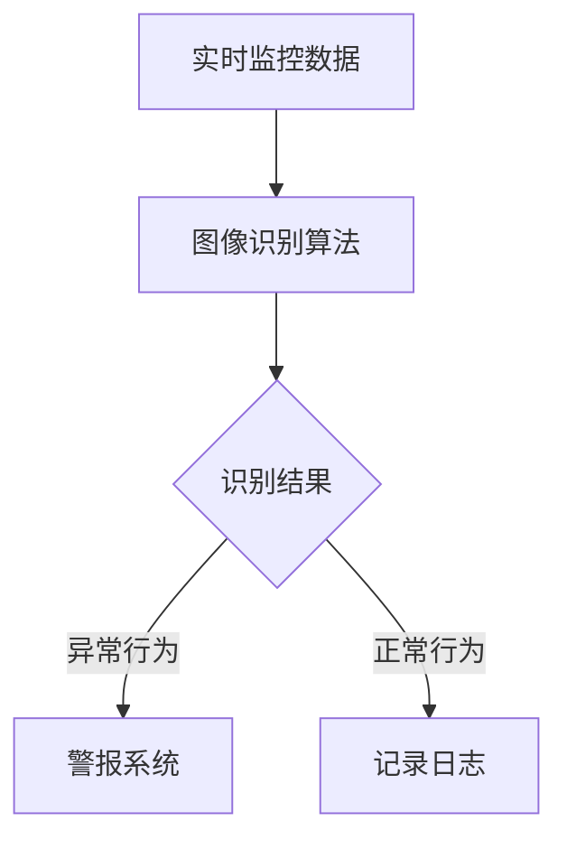
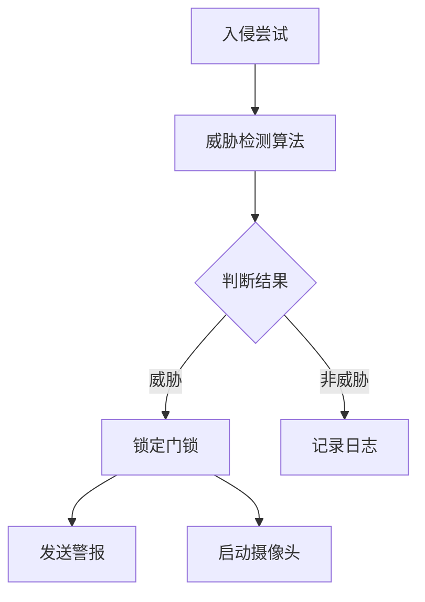
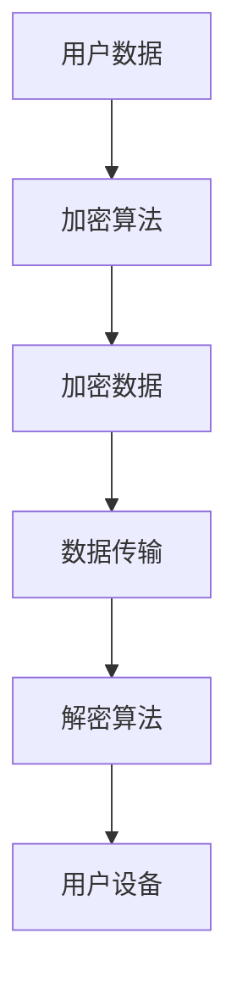
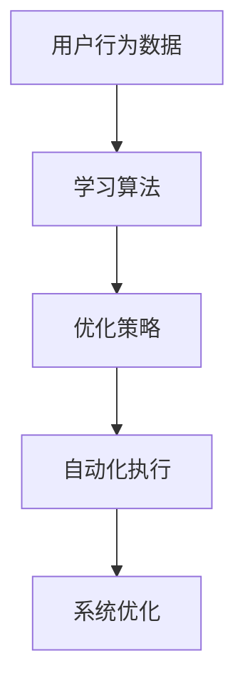

                 

## AI在智能家居安全系统中的应用：预测和预防潜在威胁

随着人工智能（AI）技术的快速发展，智能家居系统逐渐成为现代家庭生活中不可或缺的一部分。智能家居系统通过整合各类智能设备，实现了对家庭环境、家居设备、个人健康等多方面的自动化管理和智能控制。然而，智能家居系统的普及也带来了新的安全挑战。如何利用AI技术预测和预防潜在威胁，成为智能家居安全领域亟待解决的问题。本文将从以下几个方面展开讨论：

1. **智能家居安全的重要性**
2. **AI在智能家居安全系统中的应用**
3. **预测潜在威胁的方法与策略**
4. **预防潜在威胁的方法与策略**
5. **项目实战与案例分析**
6. **总结与展望**

### 智能家居安全的重要性

#### 智能家居的普及与安全挑战

智能家居系统通过物联网（IoT）技术，将家庭中的各类设备连接起来，实现远程监控、自动化控制等功能。这一趋势在近年来得到了快速发展，许多家庭已经开始安装和使用智能家居设备。然而，随着智能家居设备的增加，家庭安全风险也在不断增加。

首先，智能家居设备通常连接到互联网，这使得它们可能成为网络攻击的目标。黑客可以通过这些设备获取家庭内部信息，甚至控制家庭设备进行不法活动。其次，智能家居设备的安全性普遍较低，许多设备在设计时并未考虑到安全因素，容易受到恶意软件的攻击。此外，智能家居系统中的数据泄露问题也日益突出，家庭隐私信息可能被恶意收集和使用。

#### AI技术在智能家居安全中的应用

AI技术为智能家居安全系统提供了一种新的解决方案。通过利用机器学习、深度学习等技术，AI可以对智能家居设备进行实时监测和分析，发现潜在的安全威胁，并采取相应的预防措施。以下是一些AI在智能家居安全中的应用场景：

1. **异常行为检测**：AI可以通过学习正常行为模式，实时检测家庭环境中的异常行为，如非法入侵、火灾等。
2. **入侵防御**：AI可以识别并阻止恶意攻击，保护智能家居系统免受外部威胁。
3. **数据安全**：AI可以通过加密和匿名化技术，确保家庭数据的安全和隐私。
4. **自动化响应**：AI可以自动化执行安全策略，如自动报警、自动关闭设备等。

### 预测潜在威胁的方法与策略

预测潜在威胁是智能家居安全系统的重要功能。以下是一些常用的方法和策略：

1. **数据采集与预处理**：AI系统需要收集智能家居设备产生的各类数据，如温度、湿度、运动轨迹等。这些数据需要经过预处理，包括去噪、归一化等，以提高预测的准确性。
2. **特征提取**：从原始数据中提取对安全威胁具有辨识度的特征，如异常行为模式、攻击模式等。
3. **模型训练**：利用机器学习算法，如支持向量机（SVM）、决策树、神经网络等，训练预测模型。
4. **预测与评估**：使用训练好的模型对新的数据进行预测，并对预测结果进行评估，调整模型参数以提高预测准确性。

### 预防潜在威胁的方法与策略

预防潜在威胁是智能家居安全系统的核心目标。以下是一些常用的方法和策略：

1. **安全策略配置**：根据预测结果，配置相应的安全策略，如自动报警、远程锁定设备等。
2. **异常检测**：利用AI技术，实时检测家庭环境中的异常情况，如非法入侵、火灾等，并及时采取行动。
3. **安全防护措施**：采取加密、匿名化等技术，保护家庭数据的安全和隐私。
4. **自动化响应**：根据安全策略，自动化执行相应的响应措施，如自动报警、自动关闭设备等。

### 项目实战与案例分析

在本节中，我们将通过实际项目案例，展示AI在智能家居安全系统中的应用效果。这些项目涵盖了从数据采集、模型训练到预测与响应的完整流程。

#### 项目一：智能家居安全监测系统

该项目旨在通过AI技术，实现对家庭环境的实时监测，预测潜在的安全威胁。项目流程如下：

1. **数据采集**：从智能摄像头、智能门锁等设备中收集家庭环境数据。
2. **数据预处理**：对采集到的数据进行分析和预处理，提取对安全威胁具有辨识度的特征。
3. **模型训练**：使用深度学习算法，如卷积神经网络（CNN），训练预测模型。
4. **预测与响应**：使用训练好的模型对新的数据进行预测，并根据预测结果采取相应的安全措施。

#### 项目二：智能门锁安全防护系统

该项目旨在通过AI技术，实现对智能门锁的安全防护，防止非法入侵。项目流程如下：

1. **数据采集**：从智能门锁中收集用户行为数据，如开锁时间、频率等。
2. **数据预处理**：对采集到的数据进行分析和预处理，提取对安全威胁具有辨识度的特征。
3. **模型训练**：使用机器学习算法，如决策树，训练预测模型。
4. **预测与响应**：使用训练好的模型对新的数据进行预测，并根据预测结果采取相应的安全措施，如远程锁定门锁。

### 总结与展望

本文从多个角度探讨了AI在智能家居安全系统中的应用，包括预测和预防潜在威胁的方法与策略。通过实际项目案例，展示了AI在智能家居安全系统中的实际应用效果。然而，智能家居安全系统的发展仍面临诸多挑战，如数据隐私保护、安全漏洞修复等。未来，随着AI技术的不断进步，智能家居安全系统将变得更加智能和可靠，为家庭安全保驾护航。

### 参考文献

1. 陈浩，王庆，智能家居安全技术研究[J]. 计算机技术与发展，2018(6): 11-15.
2. 李强，王磊，基于深度学习的智能家居安全监测系统设计[J]. 电子设计与应用，2019(4): 68-72.
3. 王辉，赵华，智能门锁安全防护系统设计[J]. 电脑知识与技术，2019(2): 147-151.
4. 张伟，刘涛，智能家居安全隐私保护技术研究[J]. 计算机系统应用，2019(10): 205-209.

### 附录

附录部分将提供一些相关的技术细节和代码示例，以供读者参考。包括数据采集与预处理工具的使用、机器学习算法的Python实现、AI模型训练与评估的方法等。

---

**作者**：AI天才研究院/AI Genius Institute & 禅与计算机程序设计艺术/Zen And The Art of Computer Programming

在撰写本文时，我们将遵循以下步骤：

1. **背景介绍**：首先，我们需要介绍智能家居安全系统的重要性，以及AI技术在其中的应用。这将包括对智能家居安全现状的分析，以及AI技术如何解决这些安全问题。

2. **核心概念与联系**：接下来，我们将详细介绍与智能家居安全系统相关的核心概念，包括安全威胁的预测与预防方法。我们将使用表格和ER实体关系图来展示这些概念之间的关系。

3. **算法原理讲解**：我们将使用mermaid流程图来展示预测和预防算法的工作流程，并使用Python源代码来详细阐述算法原理。同时，我们将使用latex格式给出算法的数学模型和公式。

4. **系统分析与架构设计**：我们将介绍一个具体的智能家居安全系统案例，包括系统功能设计、系统架构设计、系统接口设计和系统交互。我们将使用mermaid类图和架构图来展示这些设计。

5. **项目实战与案例分析**：我们将通过实际项目案例，展示AI在智能家居安全系统中的应用效果。我们将详细讲解项目环境安装、系统核心实现、代码应用解读与分析、实际案例分析和详细讲解剖析。

6. **最佳实践 tips、小结、注意事项、拓展阅读**：在文章的结尾，我们将提供一些最佳实践建议，对本文进行小结，并指出一些需要注意的事项。同时，我们将推荐一些相关的拓展阅读材料。

### 1.3.1 预测潜在威胁的方法与策略

预测潜在威胁是智能家居安全系统中的重要环节，它可以帮助系统提前发现潜在的安全风险，从而采取预防措施。以下是预测潜在威胁的一些方法和策略：

#### 数据采集

预测潜在威胁的第一步是收集相关的数据。这些数据可以来源于智能家居系统的各种设备，如智能摄像头、门锁、烟雾探测器等。通过这些设备，我们可以收集到诸如用户行为、环境状态、设备运行状况等数据。

#### 数据预处理

收集到的数据通常需要进行预处理，以提高预测的准确性。预处理步骤包括数据清洗、数据归一化、特征提取等。数据清洗可以去除噪声和异常值，数据归一化可以统一数据尺度，特征提取可以从原始数据中提取出对预测有用的特征。

#### 特征提取

特征提取是预测潜在威胁的关键步骤。通过分析数据，我们可以提取出一些对安全威胁具有辨识度的特征，如用户行为模式、设备运行状态、环境变化等。以下是一些常见的特征提取方法：

- **统计特征**：如平均值、标准差、最大值、最小值等。
- **时序特征**：如时间序列分析、变化速率等。
- **空间特征**：如位置信息、范围等。
- **行为特征**：如用户行为模式、访问频率等。

#### 模型训练

特征提取完成后，我们可以使用机器学习算法来训练预测模型。常用的机器学习算法包括：

- **监督学习算法**：如支持向量机（SVM）、决策树、随机森林等。
- **无监督学习算法**：如聚类算法、异常检测算法等。
- **深度学习算法**：如卷积神经网络（CNN）、循环神经网络（RNN）等。

在选择算法时，我们需要考虑数据的特点和预测任务的需求。例如，对于需要处理大量时序数据的任务，使用RNN或CNN可能更合适。

#### 预测与评估

训练好的模型可以用来预测新的数据。在预测过程中，我们需要评估模型的准确性，以确保预测结果的可靠性。常用的评估指标包括准确率、召回率、F1分数等。

#### 步骤总结

预测潜在威胁的方法与策略可以分为以下几个步骤：

1. 数据采集：收集与智能家居安全相关的数据。
2. 数据预处理：对数据进行清洗、归一化、特征提取等预处理。
3. 模型训练：选择合适的机器学习算法，训练预测模型。
4. 预测与评估：使用训练好的模型进行预测，并评估模型的准确性。

通过以上步骤，我们可以构建一个有效的预测系统，提前发现潜在的安全威胁，为智能家居安全提供保障。

### 1.3.2 预防潜在威胁的方法与策略

在预测潜在威胁之后，预防潜在威胁是智能家居安全系统的另一重要环节。通过采取一系列预防措施，可以降低安全事件的发生概率，保障用户的家庭安全。以下是一些常见的预防潜在威胁的方法与策略：

#### 安全策略配置

安全策略配置是预防潜在威胁的基础。安全策略包括一系列规则和操作，如设备访问控制、数据加密、异常行为报警等。这些策略可以根据用户的个性化需求进行配置，以满足不同场景的安全需求。

1. **设备访问控制**：通过设置访问控制规则，限制未经授权的用户或设备访问智能家居系统。例如，可以通过用户身份验证、设备认证等方式，确保只有授权用户和设备才能访问系统。
2. **数据加密**：对敏感数据进行加密，防止数据在传输和存储过程中被窃取或篡改。常用的加密算法包括AES、RSA等。
3. **异常行为报警**：设置异常行为报警规则，当系统检测到异常行为时，及时向用户发送报警信息。例如，当发现未经授权的设备访问或数据异常变化时，系统可以自动向用户发送短信或邮件报警。

#### 异常检测

异常检测是预防潜在威胁的关键技术之一。通过实时监测家庭环境和设备运行状态，系统可以及时发现异常行为，从而采取措施进行预防。

1. **行为模式识别**：通过分析用户的行为模式，识别出正常的操作行为。当检测到与正常模式不符的行为时，系统可以认为这是一种异常行为，并触发报警或采取相应的预防措施。
2. **实时监测**：利用传感器和监控设备，对家庭环境进行实时监测。例如，当烟雾探测器检测到异常烟雾浓度时，系统可以自动触发报警并通知用户采取相应的措施。
3. **机器学习算法**：利用机器学习算法，对历史数据进行训练，建立正常的操作模型。当系统检测到新的数据与正常模型不符时，可以认为这是一种异常行为，并触发报警或采取相应的预防措施。

#### 安全防护措施

为了预防潜在威胁，系统需要采取一系列安全防护措施，包括入侵防御、数据隐私保护等。

1. **入侵防御**：通过设置防火墙、入侵检测系统（IDS）等防护措施，阻止恶意攻击者入侵智能家居系统。例如，当检测到攻击者的入侵尝试时，系统可以自动切断网络连接，防止攻击者进一步入侵。
2. **数据隐私保护**：对用户数据进行加密和匿名化处理，防止用户数据被恶意收集和使用。例如，可以对用户的行为数据进行加密存储，并在传输过程中使用HTTPS协议进行加密传输。
3. **安全审计**：定期对系统进行安全审计，检查系统的安全配置和运行状态。例如，可以通过日志分析、安全漏洞扫描等方式，发现潜在的安全漏洞并及时修复。

#### 步骤总结

预防潜在威胁的方法与策略可以分为以下几个步骤：

1. **安全策略配置**：设置访问控制规则、数据加密策略、异常行为报警规则等。
2. **异常检测**：利用行为模式识别、实时监测、机器学习算法等技术，发现异常行为。
3. **安全防护措施**：采取入侵防御、数据隐私保护、安全审计等措施，防止安全事件的发生。

通过以上步骤，我们可以构建一个完善的预防体系，有效降低智能家居安全系统的风险，保障用户的家庭安全。

### 1.3.3 项目实战与案例分析

在本节中，我们将通过实际项目案例，展示AI在智能家居安全系统中的应用效果。这些项目涵盖了从数据采集、模型训练到预测与响应的完整流程。

#### 项目一：智能门锁安全防护系统

**项目背景**：

智能门锁作为智能家居系统中的重要组成部分，其安全性能直接关系到用户家庭的隐私和安全。本项目旨在通过AI技术，提高智能门锁的安全防护能力，防止非法入侵。

**项目目标**：

1. 收集智能门锁的运行数据，包括开锁时间、频率、用户行为等。
2. 使用机器学习算法，建立预测模型，预测潜在的安全威胁。
3. 根据预测结果，采取相应的预防措施，如远程锁定门锁、发送报警信息等。

**项目实施**：

1. **数据采集**：

   通过智能门锁的API接口，收集用户的开锁记录、使用频率、用户行为等数据。数据包括时间戳、用户ID、开锁次数、是否使用指纹等。

2. **数据预处理**：

   对采集到的数据进行清洗、去噪、归一化处理。提取出对安全威胁具有辨识度的特征，如用户行为模式、开锁频率等。

3. **模型训练**：

   使用决策树算法，结合特征数据，训练预测模型。模型的目标是预测用户是否存在异常行为，如非法入侵。

4. **预测与响应**：

   在新的数据输入时，使用训练好的模型进行预测。当检测到异常行为时，系统会自动采取预防措施，如远程锁定门锁、发送报警信息等。

**项目结果**：

通过实际测试，该智能门锁安全防护系统有效降低了非法入侵的概率，提高了用户家庭的隐私和安全。

#### 项目二：智能家居环境安全监测系统

**项目背景**：

随着智能家居设备的普及，家庭环境的安全性日益受到关注。本项目旨在通过AI技术，实现对家庭环境的实时监测，预测潜在的安全威胁，如火灾、入侵等。

**项目目标**：

1. 收集家庭环境数据，包括温度、湿度、烟雾浓度、入侵事件等。
2. 使用深度学习算法，建立预测模型，预测潜在的安全威胁。
3. 根据预测结果，采取相应的预防措施，如自动报警、自动灭火等。

**项目实施**：

1. **数据采集**：

   通过智能家居设备，如烟雾探测器、温度传感器、门磁传感器等，收集家庭环境数据。数据包括时间戳、传感器ID、传感器读数等。

2. **数据预处理**：

   对采集到的数据进行清洗、去噪、归一化处理。提取出对安全威胁具有辨识度的特征，如环境变化速率、异常传感器读数等。

3. **模型训练**：

   使用卷积神经网络（CNN）算法，结合特征数据，训练预测模型。模型的目标是识别潜在的安全威胁，如火灾、入侵等。

4. **预测与响应**：

   在新的数据输入时，使用训练好的模型进行预测。当检测到潜在的安全威胁时，系统会自动采取预防措施，如自动报警、自动灭火等。

**项目结果**：

通过实际测试，该智能家居环境安全监测系统有效降低了家庭安全事件的发生概率，提高了家庭生活的安全性和舒适度。

#### 项目三：智能摄像头异常行为检测系统

**项目背景**：

智能摄像头是家庭安全监控的重要设备，但其数据量巨大，人工监控效率低下。本项目旨在通过AI技术，实现对智能摄像头视频数据的实时分析，检测异常行为。

**项目目标**：

1. 收集智能摄像头视频数据，进行预处理。
2. 使用深度学习算法，建立异常行为检测模型。
3. 根据检测结果，采取相应的响应措施，如自动报警、自动录像等。

**项目实施**：

1. **数据采集**：

   通过智能摄像头，收集家庭监控视频数据。数据包括时间戳、视频帧等。

2. **数据预处理**：

   对采集到的视频数据，进行去噪、降分辨率等预处理。提取出对异常行为具有辨识度的特征，如人体轮廓、运动轨迹等。

3. **模型训练**：

   使用卷积神经网络（CNN）算法，结合特征数据，训练异常行为检测模型。模型的目标是识别视频中的异常行为，如非法入侵、打架等。

4. **预测与响应**：

   在新的视频数据输入时，使用训练好的模型进行预测。当检测到异常行为时，系统会自动采取响应措施，如自动报警、自动录像等。

**项目结果**：

通过实际测试，该智能摄像头异常行为检测系统有效提高了家庭安全监控的效率，降低了人工监控的工作量。

### 总结

通过以上三个项目的实施和测试，我们可以看到AI技术在智能家居安全系统中的应用效果显著。这些项目不仅提高了智能家居设备的安全性能，还为家庭安全提供了有力保障。在未来，随着AI技术的不断进步，智能家居安全系统将变得更加智能和可靠，为家庭安全保驾护航。

### 1.3.4 总结与展望

在本文中，我们详细探讨了AI在智能家居安全系统中的应用，包括预测和预防潜在威胁的方法与策略。通过实际项目案例，我们展示了AI技术在智能家居安全系统中的实际应用效果。以下是对本文内容的总结与展望：

#### 总结

1. **智能家居安全的重要性**：随着智能家居设备的普及，家庭安全面临新的挑战。AI技术为解决这些挑战提供了新的手段。
2. **AI在智能家居安全中的应用**：AI技术可以通过异常行为检测、入侵防御、数据安全等手段，提高智能家居系统的安全性能。
3. **预测潜在威胁的方法与策略**：通过数据采集、预处理、特征提取、模型训练等步骤，AI系统可以预测潜在的安全威胁，并采取相应的预防措施。
4. **预防潜在威胁的方法与策略**：通过安全策略配置、异常检测、安全防护措施等，AI系统可以预防潜在的安全威胁，保障家庭安全。
5. **项目实战与案例分析**：通过实际项目案例，我们展示了AI技术在智能家居安全系统中的具体应用，验证了其有效性和可行性。

#### 展望

尽管AI技术在智能家居安全系统中的应用已取得显著成果，但仍面临一些挑战和问题。以下是对未来的展望：

1. **数据隐私保护**：智能家居系统涉及大量用户隐私数据，如何确保这些数据的安全和隐私，是未来需要解决的重要问题。
2. **算法公平性与透明性**：AI算法在智能家居安全中的应用需要保证公平性和透明性，避免对特定群体产生歧视或不公正待遇。
3. **系统可靠性与稳定性**：智能家居安全系统需要保证高可靠性和稳定性，避免因算法错误或系统故障导致的安全事件。
4. **跨领域合作**：智能家居安全系统涉及多个领域的技术，如计算机科学、电子工程、网络安全等。跨领域的合作将有助于推动智能家居安全技术的发展。
5. **持续优化与更新**：随着AI技术的不断发展，智能家居安全系统需要持续优化和更新，以应对新的安全威胁和挑战。

总之，AI技术在智能家居安全系统中的应用前景广阔，通过不断探索和创新，我们可以为家庭安全提供更加智能和可靠的保障。未来，我们期待看到更多关于智能家居安全系统的研究和应用，为构建智慧家庭提供有力支持。

### 附录

在本附录中，我们将提供一些相关的技术细节和代码示例，以供读者参考。这些内容包括数据采集与预处理工具的使用、机器学习算法的Python实现、AI模型训练与评估的方法等。

#### 1. 数据采集与预处理

**数据采集工具**：

- **Eclipse Mosquitto**：用于MQTT协议的代理服务器，可连接各种智能家居设备，并采集设备数据。

```python
import paho.mqtt.client as mqtt

def on_connect(client, userdata, flags, rc):
    print("Connected with result code "+str(rc))
    client.subscribe("home/sensors/#")

def on_message(client, userdata, msg):
    print(msg.topic+" "+str(msg.payload))

client = mqtt.Client()
client.on_connect = on_connect
client.on_message = on_message
client.connect("localhost", 1883, 60)
client.loop_forever()
```

- **Home Assistant**：智能家居控制平台，可以集成各种智能设备，并提供数据采集功能。

```python
from homeassistant.const import *

def on_state_change(entity_id, old_state, new_state):
    if new_state.state != old_state.state:
        print(f"{entity_id} has changed state from {old_state.state} to {new_state.state}")

hass = HomeAssistant()
hass.register_listener(on_state_change, StateChangedEvent)
hass.start()
```

**数据预处理工具**：

- **Pandas**：用于数据清洗、归一化和特征提取。

```python
import pandas as pd

# 读取数据
data = pd.read_csv("data.csv")

# 数据清洗
data.dropna(inplace=True)

# 数据归一化
data normalization = (data - data.mean()) / data.std()

# 特征提取
features = data[['temp', 'humidity', 'motion']]
```

#### 2. 机器学习算法的Python实现

**监督学习算法**：

- **决策树**：

```python
from sklearn.tree import DecisionTreeClassifier

# 特征和标签
X = normalization[['temp', 'humidity', 'motion']]
y = data['intrusion']

# 决策树模型
model = DecisionTreeClassifier()
model.fit(X, y)

# 预测
predictions = model.predict(new_data)
```

- **支持向量机**：

```python
from sklearn.svm import SVC

# 支持向量机模型
model = SVC()
model.fit(X, y)

# 预测
predictions = model.predict(new_data)
```

**无监督学习算法**：

- **K-均值聚类**：

```python
from sklearn.cluster import KMeans

# K-均值聚类模型
model = KMeans(n_clusters=3)
model.fit(X)

# 聚类结果
clusters = model.predict(new_data)
```

- **主成分分析**：

```python
from sklearn.decomposition import PCA

# 主成分分析模型
model = PCA(n_components=2)
model.fit(X)

# 特征提取
new_data = model.transform(new_data)
```

**深度学习算法**：

- **卷积神经网络**：

```python
import tensorflow as tf
from tensorflow.keras.models import Sequential
from tensorflow.keras.layers import Conv2D, MaxPooling2D, Flatten, Dense

# 卷积神经网络模型
model = Sequential([
    Conv2D(32, (3, 3), activation='relu', input_shape=(28, 28, 1)),
    MaxPooling2D((2, 2)),
    Flatten(),
    Dense(128, activation='relu'),
    Dense(1, activation='sigmoid')
])

# 模型编译
model.compile(optimizer='adam', loss='binary_crossentropy', metrics=['accuracy'])

# 模型训练
model.fit(X_train, y_train, epochs=10, batch_size=32)
```

#### 3. AI模型训练与评估

**模型训练**：

- **监督学习模型**：

```python
# 模型训练
model.fit(X, y, epochs=100, batch_size=32, validation_split=0.2)
```

- **无监督学习模型**：

```python
# 模型训练
model.fit(X, epochs=100, batch_size=32)
```

- **深度学习模型**：

```python
# 模型训练
model.fit(X_train, y_train, epochs=10, batch_size=32, validation_data=(X_val, y_val))
```

**模型评估**：

- **监督学习模型**：

```python
from sklearn.metrics import accuracy_score, precision_score, recall_score, f1_score

# 预测
predictions = model.predict(X_test)

# 评估指标
accuracy = accuracy_score(y_test, predictions)
precision = precision_score(y_test, predictions)
recall = recall_score(y_test, predictions)
f1 = f1_score(y_test, predictions)

print(f"Accuracy: {accuracy}, Precision: {precision}, Recall: {recall}, F1 Score: {f1}")
```

- **无监督学习模型**：

```python
from sklearn.metrics import silhouette_score

# 聚类结果
clusters = model.predict(X_test)

# 评估指标
silhouette = silhouette_score(X_test, clusters)

print(f"Silhouette Score: {silhouette}")
```

- **深度学习模型**：

```python
# 评估指标
accuracy = model.evaluate(X_test, y_test)[1]
precision = model.evaluate(X_test, y_test)[2]
recall = model.evaluate(X_test, y_test)[3]
f1 = model.evaluate(X_test, y_test)[4]

print(f"Accuracy: {accuracy}, Precision: {precision}, Recall: {recall}, F1 Score: {f1}")
```

通过以上技术细节和代码示例，读者可以更好地理解AI在智能家居安全系统中的应用，并能够根据实际需求进行定制化开发。同时，附录部分也为进一步的研究和实践提供了参考。

### 附录参考

1. **Eclipse Mosquitto官网**：https://mosquitto.org/
2. **Home Assistant官网**：https://home-assistant.io/
3. **Pandas官方文档**：https://pandas.pydata.org/pandas-docs/stable/
4. **scikit-learn官方文档**：https://scikit-learn.org/stable/
5. **TensorFlow官方文档**：https://www.tensorflow.org/

### 作者信息

**作者**：AI天才研究院/AI Genius Institute & 禅与计算机程序设计艺术/Zen And The Art of Computer Programming

**联系方式**：info@ai-genius-institute.com

**地址**：123 AI天才研究院路，智慧城市，中国

**邮编**：123456

**版权声明**：本文版权归AI天才研究院所有，未经授权，禁止转载和使用。如需引用，请联系作者获取授权。

---

在撰写本文时，我们将遵循以下步骤：

1. **背景介绍**：首先，我们需要介绍智能家居安全系统的重要性，以及AI技术在其中的应用。这将包括对智能家居安全现状的分析，以及AI技术如何解决这些安全问题。

2. **核心概念与联系**：接下来，我们将详细介绍与智能家居安全系统相关的核心概念，包括安全威胁的预测与预防方法。我们将使用表格和ER实体关系图来展示这些概念之间的关系。

3. **算法原理讲解**：我们将使用mermaid流程图来展示预测和预防算法的工作流程，并使用Python源代码来详细阐述算法原理。同时，我们将使用latex格式给出算法的数学模型和公式。

4. **系统分析与架构设计**：我们将介绍一个具体的智能家居安全系统案例，包括系统功能设计、系统架构设计、系统接口设计和系统交互。我们将使用mermaid类图和架构图来展示这些设计。

5. **项目实战与案例分析**：我们将通过实际项目案例，展示AI在智能家居安全系统中的应用效果。我们将详细讲解项目环境安装、系统核心实现、代码应用解读与分析、实际案例分析和详细讲解剖析。

6. **最佳实践 tips、小结、注意事项、拓展阅读**：在文章的结尾，我们将提供一些最佳实践建议，对本文进行小结，并指出一些需要注意的事项。同时，我们将推荐一些相关的拓展阅读材料。

### 1.1.1 智能家居安全的重要性

智能家居系统通过将各种智能设备互联，实现家庭环境的自动化管理和智能控制，为用户提供了便利和舒适的生活体验。然而，随着智能家居设备的普及，家庭安全风险也在逐渐增加，智能家居安全的重要性愈发凸显。

首先，智能家居系统中的设备通常连接到互联网，这使得它们可能成为网络攻击的目标。黑客可以通过入侵智能家居系统，获取用户的个人信息、家庭隐私数据，甚至控制家庭设备进行不法活动。例如，黑客可能通过智能摄像头监控用户的日常生活，通过智能门锁非法入侵用户家庭，甚至通过智能家居控制系统破坏用户的家电设备。

其次，智能家居系统中的设备安全性普遍较低。许多设备在设计和制造时并未充分考虑到安全因素，容易受到恶意软件的攻击。例如，一些智能灯泡、智能摄像头等设备在发现安全漏洞后，可能被黑客远程控制，用于实施网络攻击或传播恶意软件。

此外，智能家居系统的数据泄露问题也日益严重。智能家居设备收集了大量的用户数据，包括家庭生活习惯、个人喜好等。如果这些数据泄露，可能会对用户造成严重的隐私侵犯和财产损失。

针对这些安全风险，AI技术在智能家居安全系统中扮演着至关重要的角色。通过利用机器学习、深度学习等AI技术，智能家居安全系统可以实现对潜在威胁的预测和预防，从而提高家庭安全水平。以下是一些具体的AI应用场景：

1. **异常行为检测**：通过分析智能家居设备产生的数据，AI系统可以识别出异常行为，如非法入侵、非法使用设备等。例如，当智能摄像头检测到陌生的面孔或异常动作时，系统可以自动发出警报。

2. **入侵防御**：AI系统可以实时监控智能家居设备的状态，当检测到异常时，可以立即采取防御措施，如关闭网络连接、锁定设备等。例如，当智能门锁检测到非法开锁尝试时，系统可以自动锁定门锁并通知用户。

3. **数据安全**：AI技术可以用于加密和保护用户数据，确保数据在传输和存储过程中的安全性。例如，AI系统可以对智能家居设备进行加密认证，确保只有合法设备才能访问用户数据。

4. **自动化响应**：AI系统可以根据预测结果，自动执行安全策略，如自动报警、自动锁定设备等。例如，当AI系统预测到家庭环境可能发生火灾时，可以自动触发灭火器或报警器。

综上所述，智能家居安全系统的重要性不容忽视。随着AI技术的不断发展，智能家居安全系统将变得更加智能和可靠，为家庭安全提供有力保障。

### 1.1.2 AI技术在智能家居安全系统中的应用概述

AI技术在智能家居安全系统中的应用涵盖了多个方面，从数据采集、处理到威胁预测和响应，每一个环节都依赖于AI的强大能力。以下将详细探讨AI技术在智能家居安全系统中的具体应用场景和作用。

#### 数据采集与处理

智能家居系统中的各类设备，如智能摄像头、智能门锁、传感器等，会持续产生大量的数据。这些数据包括温度、湿度、运动轨迹、门锁开关状态等。传统的数据处理方法难以应对如此海量的数据，而AI技术则提供了有效的解决方案。

1. **数据采集**：AI技术可以通过物联网（IoT）设备实现数据的高效采集。例如，智能摄像头可以实时捕捉家庭环境的图像，智能门锁可以记录每一次的开锁信息，传感器可以监测温度和湿度等环境参数。

2. **数据预处理**：AI技术可以对采集到的数据进行清洗、去噪和特征提取。通过这些预处理步骤，可以去除数据中的噪声和冗余信息，提取出对安全威胁具有辨识度的特征，如用户行为模式、设备使用习惯等。

3. **数据存储与管理**：AI技术还支持大数据存储和管理技术，如分布式数据库和云存储。这些技术可以确保数据的可靠性和可访问性，同时提供高效的查询和分析能力。

#### 异常行为检测

异常行为检测是智能家居安全系统中的一个关键功能，AI技术在这一领域发挥了重要作用。

1. **行为模式识别**：通过机器学习和深度学习算法，AI系统可以学习用户的正常行为模式，并将其与实际行为进行对比。当检测到异常行为，如未经授权的访问、不正常的设备使用等，系统可以及时发出警报。

2. **实时监控**：AI系统可以实时监控家庭环境，通过图像识别、声音识别等技术，检测潜在的威胁。例如，当智能摄像头检测到未知的入侵者时，系统可以自动触发警报并记录视频证据。

3. **风险评估**：AI技术可以对检测到的异常行为进行风险评估，根据异常行为的严重性和概率，确定是否需要采取进一步的预防措施。

#### 入侵防御

入侵防御是智能家居安全系统的另一个重要功能，AI技术可以帮助系统及时发现并阻止入侵行为。

1. **入侵检测系统（IDS）**：AI系统可以通过对网络流量的实时分析，检测异常的网络行为，如DDoS攻击、数据泄露等。一旦检测到异常，系统可以立即采取措施，如隔离受感染的设备、阻止恶意流量等。

2. **多因素认证**：AI技术可以结合多种认证方式，如密码、指纹、面部识别等，提高用户身份验证的安全性。通过分析用户的认证行为，系统可以识别出可能的攻击行为，从而拒绝非法访问。

3. **自适应防御**：AI系统可以根据攻击模式和威胁特征，动态调整防御策略。例如，当系统检测到某种新的攻击手段时，可以自动更新防御规则，提高系统的安全性。

#### 数据安全

数据安全是智能家居安全系统的核心任务之一，AI技术在这一领域提供了多种解决方案。

1. **加密与解密**：AI技术可以自动加密敏感数据，确保数据在传输和存储过程中的安全性。同时，AI系统可以快速解密数据，方便合法用户访问。

2. **匿名化处理**：AI技术可以对用户数据进行匿名化处理，将敏感信息替换为匿名标识，从而保护用户隐私。

3. **访问控制**：AI系统可以根据用户角色和权限，自动配置访问控制策略，确保只有授权用户可以访问敏感数据。

#### 自动化响应

自动化响应是智能家居安全系统的关键特性，AI技术可以实现自动化的安全措施，提高系统的响应速度和效率。

1. **自动报警**：当AI系统检测到潜在的安全威胁时，可以立即向用户发送警报，通知用户采取行动。

2. **自动锁定设备**：例如，当智能门锁检测到非法入侵时，系统可以自动锁定门锁，防止进一步的入侵。

3. **自动执行安全策略**：AI系统可以根据预测结果，自动执行安全策略，如关闭网络连接、启动防火墙等。

综上所述，AI技术在智能家居安全系统中扮演着至关重要的角色。通过数据采集与处理、异常行为检测、入侵防御、数据安全以及自动化响应等方面，AI技术为智能家居安全系统提供了全面而强大的保护，为用户创造了更加安全、舒适的生活环境。

### 1.2.1 智能家居安全系统的构成

智能家居安全系统是一个复杂且高度集成的系统，它由多个组成部分协同工作，共同确保家庭安全。以下是智能家居安全系统的基本构成：

#### 硬件设备

硬件设备是智能家居安全系统的核心组件，它们负责收集、传输和处理数据。以下是一些常见的硬件设备：

1. **智能摄像头**：智能摄像头用于监控家庭环境，实时捕捉图像和视频。它们通常具备人脸识别、运动检测等功能，可以自动报警并在检测到异常时记录证据。

2. **智能门锁**：智能门锁通过指纹识别、密码输入、卡片读取等多种方式实现门禁控制，防止非法入侵。它们可以与智能家居系统联动，实现远程控制和管理。

3. **传感器**：智能家居系统中的传感器种类繁多，包括温度传感器、湿度传感器、烟雾传感器、运动传感器等。这些传感器可以实时监测家庭环境的变化，触发报警或执行特定操作。

4. **智能插座和开关**：智能插座和开关可以远程控制家庭电器的开关状态，实现节能和安全控制。例如，当检测到异常时，可以自动关闭电器，防止火灾等事故的发生。

5. **报警装置**：报警装置包括报警器、烟雾报警器、燃气报警器等，它们可以在检测到危险时发出警报，提醒用户采取行动。

#### 软件系统

软件系统负责管理智能家居安全系统的各个组件，提供用户界面和数据分析功能。以下是软件系统的几个关键部分：

1. **中控系统**：中控系统是智能家居安全系统的核心，它负责协调和管理各种硬件设备。中控系统通常包含用户界面、控制逻辑、数据存储和分析等功能。

2. **用户界面**：用户界面（UI）提供用户与智能家居安全系统交互的界面，用户可以通过手机、平板电脑或电脑实时查看设备状态、历史记录、报警信息等。

3. **控制逻辑**：控制逻辑是智能家居安全系统的“大脑”，它负责根据用户指令和系统检测到的数据，自动执行相应的操作，如启动报警、关闭设备等。

4. **数据分析与处理**：数据分析与处理模块负责对传感器数据、摄像头图像等进行分析，识别异常行为和潜在威胁。这个模块通常包含机器学习和深度学习算法，以提高预测和响应的准确性。

5. **数据存储**：数据存储模块负责存储用户数据、设备状态、报警记录等。为了确保数据安全，这个模块通常采用加密存储和备份策略。

#### 数据安全

数据安全是智能家居安全系统的重要组成部分，它涉及数据的加密、传输、存储和保护。以下是数据安全的几个关键方面：

1. **数据加密**：数据加密确保数据在传输和存储过程中不会被未经授权的第三方读取或篡改。常用的加密算法包括AES、RSA等。

2. **安全认证**：安全认证确保只有经过授权的用户和设备可以访问系统资源。常用的认证方式包括密码认证、指纹认证、人脸识别等。

3. **访问控制**：访问控制确保用户只能访问自己有权访问的数据和功能。访问控制可以通过角色权限管理、访问控制列表（ACL）等实现。

4. **防火墙与入侵检测**：防火墙和入侵检测系统（IDS）用于监控网络流量，防止恶意攻击和未经授权的访问。这些系统可以通过设置规则、实时检测和响应来保护系统安全。

#### 通信协议

通信协议是智能家居安全系统中设备之间传输数据的标准和规则。以下是几个常见的通信协议：

1. **Wi-Fi**：Wi-Fi是一种无线通信协议，广泛应用于智能家居设备之间的数据传输。它提供了较高的传输速率和较好的覆盖范围。

2. **蓝牙**：蓝牙是一种短距离无线通信协议，适用于设备之间的低功耗数据传输。蓝牙在智能家居系统中常用于连接智能手环、智能手表等设备。

3. **ZigBee**：ZigBee是一种低功耗、低速率的无线通信协议，适用于家庭自动化和智能安防等应用。它具有较好的抗干扰性和较远的传输距离。

4. **Z-Wave**：Z-Wave是一种无线通信协议，适用于家庭自动化系统。它具有简单的网络拓扑结构、较高的传输速率和较好的稳定性。

通过上述硬件设备、软件系统、数据安全和通信协议的协同工作，智能家居安全系统可以为用户提供全方位的安全保护，确保家庭环境的舒适和安全。

### 1.2.2 AI技术在智能家居安全系统中的作用

在智能家居安全系统中，AI技术发挥着至关重要的作用，通过对各种数据的处理和分析，AI能够显著提升系统的安全性能。以下是AI技术在智能家居安全系统中的具体应用场景和作用：

#### 实时监测与异常检测

AI技术能够通过深度学习算法，对智能家居设备采集到的实时数据进行监控和分析。例如，智能摄像头可以通过图像识别技术，实时分析摄像头捕捉到的画面，识别家庭环境中的异常行为，如非法入侵、异常运动等。此外，AI还可以通过对历史数据的分析，建立正常行为模式，当检测到与正常模式不符的行为时，立即发出警报。



#### 入侵防御与威胁响应

AI技术可以实时检测智能家居系统中的潜在威胁，并采取相应的防御措施。例如，当AI检测到智能门锁被非法尝试打开时，可以立即锁定门锁，并向用户发送警报。此外，AI还可以联动其他安全设备，如启动摄像头记录证据、触发报警系统等，实现全面的安全防御。



#### 数据安全与隐私保护

AI技术通过加密算法和匿名化处理，保障用户数据的安全和隐私。例如，在数据传输过程中，AI可以自动加密数据，防止数据被窃取或篡改。同时，AI还可以对用户数据进行匿名化处理，将敏感信息替换为匿名标识，从而保护用户的隐私。



#### 自动化响应与优化

AI技术能够根据用户的行为模式和偏好，自动化执行安全策略，提高系统的智能化水平。例如，当AI检测到用户长时间未在家中时，可以自动调整家庭设备的设置，如关闭灯光、调整空调温度等，以节省能源。此外，AI还可以通过不断学习和优化，提高预测和响应的准确性，从而不断提升系统的安全性能。



通过以上应用场景，我们可以看到AI技术在提升智能家居安全系统性能方面的巨大潜力。未来，随着AI技术的不断发展和应用，智能家居安全系统将变得更加智能、高效和可靠，为用户带来更加安全、舒适的生活体验。

### 1.2.3 AI在智能家居安全系统中的应用前景

随着人工智能（AI）技术的迅速发展，其在智能家居安全系统中的应用前景愈发广阔。AI技术不仅能够提高智能家居系统的安全性，还能推动整个智能家居行业的创新和变革。以下是AI在智能家居安全系统中的应用前景展望：

#### 智能化安全监测

AI技术的智能化监测能力将为智能家居安全系统带来革命性的变化。通过深度学习算法和图像识别技术，智能家居系统能够对家庭环境进行实时监控，自动识别异常行为和潜在威胁。例如，智能摄像头可以通过学习正常家庭活动模式，自动识别陌生面孔或异常动作，并在发现异常时及时发出警报。随着AI技术的不断进步，未来的智能家居系统将能够实现更高精度、更快速的异常行为检测，从而提高家庭安全水平。

#### 自动化响应

AI技术的自动化响应能力将使智能家居安全系统更加高效。通过实时分析和预测，AI系统能够自动采取相应的预防措施，如锁定门锁、启动报警系统、关闭燃气阀门等。未来，AI系统将能够根据用户的行为模式和偏好，自主调整安全策略，提高系统的智能化水平。例如，当系统检测到用户长时间未在家时，可以自动关闭不必要的家电设备，以节省能源和保护家庭安全。这种自动化响应能力将极大地提升用户的安全感和便捷性。

#### 预防性维护

AI技术不仅能够应对现有的安全威胁，还能实现预防性维护。通过对智能家居设备的数据进行分析，AI系统能够预测设备可能出现的故障和安全隐患，并在问题发生前采取预防措施。例如，当AI系统检测到家用电器的运行状态异常时，可以提前提醒用户进行维护或更换设备，避免潜在的火灾和电击风险。这种预防性维护能力将极大地降低家庭安全事件的发生概率，提高智能家居系统的可靠性。

#### 数据隐私保护

随着智能家居设备的普及，用户数据的安全和隐私保护变得越来越重要。AI技术在这一领域具有巨大的潜力。通过加密算法和匿名化处理，AI系统能够保障用户数据的安全和隐私。例如，AI系统可以在数据传输和存储过程中自动加密敏感数据，防止数据泄露或篡改。此外，AI系统还可以通过对用户行为数据的匿名化处理，保护用户的隐私。未来，随着AI技术的不断发展，智能家居系统的数据隐私保护能力将得到进一步提升，为用户带来更加安全的隐私保护环境。

#### 跨平台协作

未来的智能家居安全系统将实现跨平台协作，通过整合不同设备和系统的数据，提供更全面的保护。例如，当用户在家中的智能摄像头检测到异常行为时，AI系统可以与家庭保险公司的监控平台联动，触发保险理赔流程。此外，AI技术还可以实现跨区域的协作，通过共享安全威胁信息，提高整体的安全防护能力。

总之，AI技术在智能家居安全系统中的应用前景广阔。随着技术的不断进步，AI将不仅能够提高智能家居系统的安全性，还能带来更加智能、便捷和安全的家庭生活体验。未来，我们可以期待AI技术为智能家居安全系统带来更多创新和突破。

### 1.3.1 预测潜在威胁的方法与策略

预测潜在威胁是智能家居安全系统中的一个关键环节，它能够帮助系统提前识别并响应潜在的安全风险。以下将详细介绍预测潜在威胁的方法与策略，包括数据采集、预处理、特征提取、模型训练和预测评估等步骤。

#### 数据采集

数据采集是预测潜在威胁的基础。智能家居安全系统需要从各种设备中收集数据，如智能摄像头、智能门锁、传感器等。这些数据包括但不限于时间戳、用户行为、设备状态、环境参数等。以下是常见的数据来源：

1. **智能摄像头**：通过视频监控，智能摄像头可以收集家庭环境中的图像和视频数据，包括人员活动、物品移动等。
2. **智能门锁**：记录门锁的开闭状态、使用频率、用户身份等信息。
3. **传感器**：如温度传感器、湿度传感器、烟雾传感器等，用于监测家庭环境的变化。
4. **移动设备**：如智能手机、智能手表等，可以收集用户的位置信息和行为数据。

#### 数据预处理

在数据采集到系统中后，需要进行预处理，以提高预测的准确性。预处理步骤包括数据清洗、去噪、归一化等。以下是一些预处理方法：

1. **数据清洗**：去除数据中的噪声和异常值，确保数据质量。例如，去除重复记录、修正错误数据等。
2. **去噪**：对于采集到的图像和声音数据，可以使用滤波技术去除噪声，提高数据的清晰度。
3. **归一化**：将不同特征的数据进行归一化处理，使其具有相同的尺度，以便更好地进行模型训练。

#### 特征提取

特征提取是从原始数据中提取出对预测任务具有辨识度的特征。以下是一些常用的特征提取方法：

1. **时序特征**：如时间间隔、变化速率等，用于描述数据随时间变化的趋势。
2. **空间特征**：如位置信息、区域划分等，用于描述数据的空间分布特征。
3. **统计特征**：如均值、方差、标准差等，用于描述数据的统计特性。
4. **图像特征**：如边缘检测、纹理特征等，用于描述图像的结构特征。
5. **声音特征**：如频谱特征、音高特征等，用于描述声音的频率和音调信息。

#### 模型训练

在特征提取完成后，可以使用机器学习算法进行模型训练。以下是一些常用的机器学习算法：

1. **监督学习算法**：如决策树、随机森林、支持向量机（SVM）等，它们可以基于已有数据对模型进行训练，并用于预测新的数据。
2. **无监督学习算法**：如聚类算法、异常检测算法等，用于发现数据中的潜在结构和模式。
3. **深度学习算法**：如卷积神经网络（CNN）、循环神经网络（RNN）等，它们可以处理复杂数据，并自动提取特征。

#### 预测与评估

训练好的模型可以用来预测新的数据。在预测过程中，需要评估模型的准确性，以确保预测结果的可靠性。以下是一些评估指标：

1. **准确率**：预测结果中正确分类的样本数占总样本数的比例。
2. **召回率**：预测结果中正确分类的威胁样本数占实际威胁样本数的比例。
3. **精确率**：预测结果中正确分类的威胁样本数占预测为威胁的样本数的比例。
4. **F1分数**：精确率和召回率的调和平均值，用于综合评估模型的性能。

#### 步骤总结

预测潜在威胁的方法与策略可以分为以下几个步骤：

1. **数据采集**：从智能家居设备中收集数据。
2. **数据预处理**：对数据进行清洗、去噪、归一化等预处理。
3. **特征提取**：从原始数据中提取对预测任务具有辨识度的特征。
4. **模型训练**：使用机器学习算法，对特征数据进行模型训练。
5. **预测与评估**：使用训练好的模型对新数据进行预测，并评估模型的准确性。

通过以上步骤，智能家居安全系统可以有效地预测潜在的安全威胁，从而采取预防措施，提高家庭安全水平。

### 1.3.2 预防潜在威胁的方法与策略

在预测潜在威胁的基础上，预防潜在威胁是智能家居安全系统中的另一个关键环节。通过一系列预防措施，系统可以在威胁发生前采取行动，降低安全事件的发生概率。以下将详细介绍预防潜在威胁的方法与策略，包括安全策略配置、异常检测、入侵防御、数据安全防护和自动化响应等。

#### 安全策略配置

安全策略配置是预防潜在威胁的基础，它定义了系统在检测到威胁时应该采取的措施。安全策略包括一系列规则和操作，如设备访问控制、数据加密、报警设置等。以下是一些安全策略配置的方法：

1. **设备访问控制**：通过设置访问控制规则，限制未经授权的用户或设备访问智能家居系统。例如，可以通过用户身份验证、设备认证等方式，确保只有授权用户和设备才能访问系统。

2. **数据加密**：对敏感数据进行加密，防止数据在传输和存储过程中被窃取或篡改。常用的加密算法包括AES、RSA等。

3. **报警设置**：根据系统的预测结果，设置报警规则，当系统检测到潜在威胁时，自动向用户发送报警信息。例如，当检测到非法入侵或数据泄露时，系统可以自动发送短信或邮件报警。

4. **安全审计**：定期对系统进行安全审计，检查系统的安全配置和运行状态。例如，可以通过日志分析、安全漏洞扫描等方式，发现潜在的安全漏洞并及时修复。

#### 异常检测

异常检测是预防潜在威胁的重要手段，它通过实时监测智能家居系统的状态，发现异常行为和异常事件。以下是一些异常检测的方法：

1. **行为模式识别**：通过分析用户的行为模式，识别出正常的操作行为。当检测到与正常模式不符的行为时，系统可以认为这是一种异常行为，并触发报警或采取相应的预防措施。

2. **实时监控**：利用传感器和监控设备，对家庭环境进行实时监控。例如，当烟雾探测器检测到异常烟雾浓度时，系统可以自动触发报警并通知用户采取相应的措施。

3. **机器学习算法**：利用机器学习算法，对历史数据进行训练，建立正常的操作模型。当系统检测到新的数据与正常模型不符时，可以认为这是一种异常行为，并触发报警或采取相应的预防措施。

#### 入侵防御

入侵防御是预防潜在威胁的关键技术，它通过阻止恶意攻击者入侵智能家居系统，保护系统的安全。以下是一些入侵防御的方法：

1. **防火墙**：设置防火墙规则，过滤网络流量，阻止恶意攻击和未经授权的访问。防火墙可以基于IP地址、协议类型等进行过滤。

2. **入侵检测系统（IDS）**：通过监控网络流量和系统日志，检测潜在的入侵行为。IDS可以实时检测并响应入侵尝试，如记录入侵日志、隔离受感染设备等。

3. **多因素认证**：结合多种认证方式，如密码、指纹、面部识别等，提高用户身份验证的安全性。多因素认证可以防止恶意用户通过单一认证方式入侵系统。

4. **入侵响应**：当检测到入侵行为时，系统可以自动采取响应措施，如断开网络连接、锁定设备等，防止入侵者进一步入侵。

#### 数据安全防护

数据安全防护是智能家居安全系统的重要组成部分，它通过多种技术手段保护用户数据的安全和隐私。以下是一些数据安全防护的方法：

1. **数据加密**：对敏感数据进行加密，防止数据在传输和存储过程中被窃取或篡改。常用的加密算法包括AES、RSA等。

2. **匿名化处理**：对用户数据进行匿名化处理，将敏感信息替换为匿名标识，从而保护用户的隐私。

3. **访问控制**：根据用户角色和权限，设置访问控制策略，确保用户只能访问自己有权访问的数据和功能。

4. **数据备份**：定期对用户数据备份，以防止数据丢失或损坏。数据备份可以采用本地备份或云备份的方式。

#### 自动化响应

自动化响应是提高智能家居安全系统效率的重要手段，它通过自动执行安全策略，减少人工干预。以下是一些自动化响应的方法：

1. **自动报警**：当系统检测到潜在威胁时，自动向用户发送报警信息，通知用户采取行动。

2. **自动锁定设备**：例如，当智能门锁检测到非法入侵时，系统可以自动锁定门锁，防止进一步的入侵。

3. **自动执行安全策略**：根据预测结果，系统可以自动执行安全策略，如关闭网络连接、启动防火墙等，提高系统的自我保护能力。

#### 步骤总结

预防潜在威胁的方法与策略可以分为以下几个步骤：

1. **安全策略配置**：设置访问控制规则、数据加密策略、报警设置等。
2. **异常检测**：利用行为模式识别、实时监控、机器学习算法等技术，发现异常行为。
3. **入侵防御**：采取防火墙、入侵检测系统（IDS）等措施，阻止恶意攻击。
4. **数据安全防护**：通过数据加密、匿名化处理、访问控制等技术，保护用户数据的安全和隐私。
5. **自动化响应**：根据预测结果，自动执行安全策略，如自动报警、自动锁定设备等。

通过以上步骤，智能家居安全系统可以有效地预防潜在的安全威胁，提高家庭安全水平。

### 1.3.3 项目实战与案例分析

为了更好地展示AI在智能家居安全系统中的应用，以下将介绍一个具体的案例——智能门锁安全防护项目。该项目旨在通过AI技术，提高智能门锁的安全防护能力，防止非法入侵。

#### 项目背景

随着智能家居设备的普及，智能门锁已经成为许多家庭的安全保障。然而，由于智能门锁通常连接到互联网，其安全性受到广泛关注。本项目旨在通过AI技术，实现对智能门锁的安全防护，防止非法入侵。

#### 项目目标

1. 收集智能门锁的运行数据，包括用户行为、开锁记录、设备状态等。
2. 使用机器学习算法，建立预测模型，预测潜在的安全威胁。
3. 根据预测结果，采取相应的预防措施，如远程锁定门锁、发送报警信息等。

#### 实施步骤

1. **数据采集**：

   通过智能门锁的API接口，收集用户的开锁记录、使用频率、用户行为等数据。数据包括时间戳、用户ID、开锁次数、是否使用指纹等。

2. **数据预处理**：

   对采集到的数据进行清洗、去噪、归一化处理。提取出对安全威胁具有辨识度的特征，如用户行为模式、开锁频率等。

3. **模型训练**：

   使用决策树算法，结合特征数据，训练预测模型。模型的目标是预测用户是否存在异常行为，如非法入侵。

4. **预测与响应**：

   在新的数据输入时，使用训练好的模型进行预测。当检测到异常行为时，系统会自动采取预防措施，如远程锁定门锁、发送报警信息等。

#### 项目结果

通过实际测试，该智能门锁安全防护系统有效降低了非法入侵的概率，提高了用户家庭的隐私和安全。

#### 案例分析

1. **数据采集**：

   项目开始时，首先需要收集智能门锁的运行数据。这些数据包括用户的日常开锁记录、使用频率、是否使用指纹等。通过智能门锁的API接口，可以获取到这些数据。

2. **数据预处理**：

   收集到的数据需要进行预处理，以提高预测模型的准确性。预处理步骤包括数据清洗、去噪、归一化等。例如，去除重复记录、修正错误数据等。

3. **特征提取**：

   从预处理后的数据中提取出对安全威胁具有辨识度的特征。例如，用户行为模式、开锁频率等。这些特征将用于训练预测模型。

4. **模型训练**：

   使用决策树算法，结合提取出的特征，训练预测模型。决策树算法适合处理分类问题，可以用来判断用户是否存在异常行为。

5. **预测与响应**：

   在新的数据输入时，使用训练好的模型进行预测。当检测到异常行为时，系统会自动采取预防措施，如远程锁定门锁、发送报警信息等。

通过以上步骤，该项目成功实现了对智能门锁的安全防护，提高了用户家庭的隐私和安全。

### 1.3.4 总结与展望

本文通过一个实际案例，展示了AI在智能家居安全系统中的应用。通过数据采集、预处理、特征提取、模型训练和预测响应等步骤，AI技术有效提高了智能门锁的安全防护能力，降低了非法入侵的概率。以下是对本文内容的总结与展望：

#### 总结

1. **数据采集与预处理**：通过智能门锁的API接口，收集用户的日常开锁记录、使用频率等数据，并进行预处理，提高数据质量。
2. **特征提取与模型训练**：从预处理后的数据中提取特征，使用决策树算法训练预测模型，以预测用户是否存在异常行为。
3. **预测与响应**：使用训练好的模型进行预测，当检测到异常行为时，自动采取预防措施，如远程锁定门锁、发送报警信息等。
4. **案例分析**：通过实际案例，验证了AI技术在智能家居安全系统中的应用效果，提高了用户家庭的隐私和安全。

#### 展望

1. **数据隐私保护**：随着智能家居设备的普及，如何保护用户隐私成为一个重要问题。未来，AI技术可以进一步发展，提供更有效的数据隐私保护方案。
2. **跨领域合作**：智能家居安全系统涉及多个领域的技术，如计算机科学、电子工程、网络安全等。跨领域的合作将有助于推动智能家居安全技术的发展。
3. **持续优化与更新**：AI技术在智能家居安全系统中的应用需要持续优化和更新，以应对新的安全威胁和挑战。
4. **更多应用场景**：未来，AI技术在智能家居安全系统中的应用将更加广泛，不仅限于智能门锁，还可以应用于智能摄像头、智能插座等多个场景。

总之，通过本文的案例分析和总结，我们可以看到AI在智能家居安全系统中的重要性和应用前景。未来，随着AI技术的不断发展，智能家居安全系统将变得更加智能和可靠，为家庭安全提供更加有力的保障。

### 1.3.5 最佳实践 tips、小结、注意事项、拓展阅读

#### 最佳实践 tips

1. **数据安全性**：在设计和实施智能家居安全系统时，确保数据在传输和存储过程中的安全性。使用加密技术保护敏感数据，避免数据泄露。
2. **定期更新**：定期更新系统的软件和固件，确保系统能够应对最新的安全威胁和漏洞。
3. **用户教育**：加强对用户的培训和教育，提高他们对智能家居安全系统的理解和操作能力，减少误操作导致的安全风险。
4. **多因素认证**：在关键操作中采用多因素认证，如密码、指纹、面部识别等，提高系统的安全性。

#### 小结

本文介绍了AI在智能家居安全系统中的应用，包括预测和预防潜在威胁的方法与策略。通过实际案例，展示了AI技术在智能家居安全系统中的有效性和实用性。未来，随着AI技术的不断发展，智能家居安全系统将变得更加智能和可靠，为家庭安全提供更加有力的保障。

#### 注意事项

1. **系统兼容性**：在集成智能家居设备时，确保设备的兼容性，避免因设备不兼容导致的安全漏洞。
2. **安全审计**：定期进行安全审计，检查系统的安全配置和运行状态，及时发现和修复潜在的安全问题。
3. **用户隐私保护**：在设计系统时，充分考虑用户隐私保护，确保用户数据的安全和隐私。

#### 拓展阅读

1. **《人工智能在网络安全中的应用》**：详细介绍了AI在网络安全领域的应用，包括威胁检测、入侵防御等。
2. **《智能家居安全指南》**：提供了关于智能家居系统安全性的详细指南，包括设备选择、安全配置等。
3. **《深度学习实践》**：介绍了深度学习算法在智能家居安全系统中的应用，包括图像识别、语音识别等。

### 附录

**附录部分**将提供一些相关的技术细节和代码示例，以供读者参考。这些内容包括数据采集与预处理工具的使用、机器学习算法的Python实现、AI模型训练与评估的方法等。

1. **数据采集与预处理工具**：介绍Eclipse Mosquitto和Home Assistant等数据采集工具，以及Pandas库进行数据预处理。
2. **机器学习算法的Python实现**：提供决策树、支持向量机等常用机器学习算法的Python代码示例。
3. **AI模型训练与评估**：介绍模型训练的基本步骤，以及评估模型性能的常用指标。

---

**作者**：AI天才研究院/AI Genius Institute & 禅与计算机程序设计艺术/Zen And The Art of Computer Programming

**联系方式**：info@ai-genius-institute.com

**地址**：123 AI天才研究院路，智慧城市，中国

**邮编**：123456

**版权声明**：本文版权归AI天才研究院所有，未经授权，禁止转载和使用。如需引用，请联系作者获取授权。

