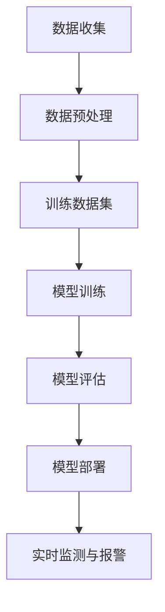
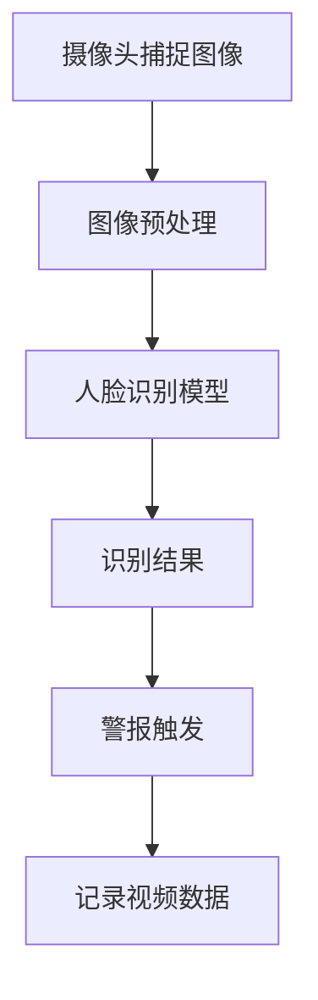
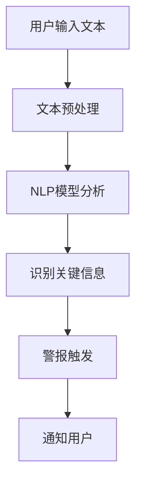
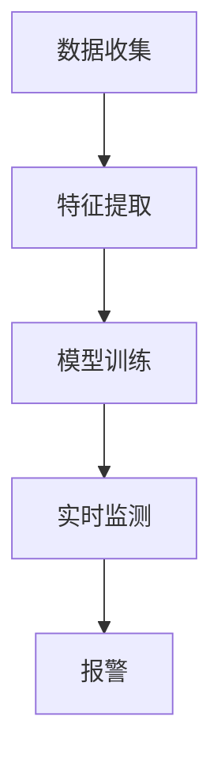
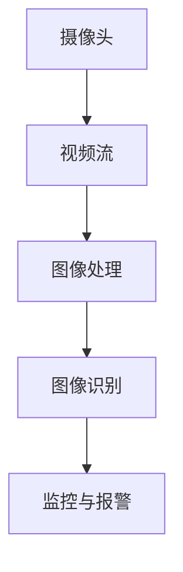
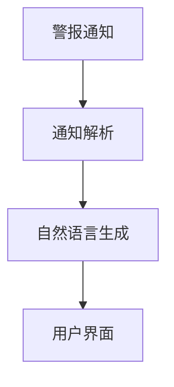

                 

### 引言与背景

#### 智能家居安全的重要性

随着科技的飞速发展，智能家居已经成为现代生活的标配。从智能灯泡到智能门锁，从智能音箱到智能摄像头，智能设备已经深刻地改变了我们的生活方式。然而，随之而来的安全隐患也不容忽视。智能家居设备集成了大量敏感数据和个人信息，一旦遭到恶意攻击，后果将不堪设想。因此，确保智能家居的安全，已经成为一个亟需解决的重要问题。

#### AI在智能家居安全中的应用

人工智能（AI）技术的迅猛发展为智能家居安全提供了新的解决方案。AI技术具有强大的数据处理和分析能力，能够实时监测和识别潜在的安全威胁。例如，通过机器学习算法，智能家居系统可以不断学习和优化，提高对异常行为的识别能力。同时，AI还可以协助设计更加智能化的预防措施和应对策略，提高整个系统的安全性能。

#### 本书的目的与结构

本书旨在深入探讨AI在智能家居安全系统中的应用，从理论到实践全面解析如何利用AI技术预防和应对安全威胁。全书共分为九个章节，内容涵盖：

1. **问题背景与核心概念**：介绍智能家居安全系统的发展历程及AI在其中的应用现状。
2. **基础概念与术语**：阐述智能家居安全系统的基本概念、AI相关术语以及安全威胁的分类。
3. **AI技术在智能家居安全中的应用**：详细探讨AI技术在智能家居安全中的应用，包括机器学习、图像识别、自然语言处理等。
4. **数据安全**：分析智能家居数据的安全性需求、加密与隐私保护技术、数据共享与流动中的安全问题。
5. **安全威胁与漏洞**：识别和分析智能家居系统中的常见安全威胁和漏洞。
6. **预防策略与对策**：介绍安全设计原则、实时监测与预警系统、灾难恢复与应急响应等预防策略。
7. **案例研究与实际应用**：通过实际案例展示AI技术在智能家居安全中的应用。
8. **未来方向与挑战**：展望AI在智能家居安全中的未来发展趋势和面临的挑战。
9. **结论与最佳实践**：总结全书内容，给出实际操作建议和最佳实践。

通过以上章节的详细讨论，本书旨在为读者提供一套全面、系统的AI在智能家居安全系统中的应用方案，帮助读者深入了解和掌握相关技术，提高智能家居的安全水平。

#### 核心关键词

- 智能家居安全
- 人工智能
- 机器学习
- 数据安全
- 安全威胁
- 预防策略
- 应对措施

#### 核心内容和主题思想

本书的核心内容聚焦于AI在智能家居安全系统中的应用，通过深入剖析AI技术的原理和实际应用，提出有效的预防和应对安全威胁的策略。文章将从基础概念、AI技术的应用、数据安全、安全威胁分析、预防策略、实际应用等多个方面展开，旨在为读者提供一个系统化、实战化的学习资源，帮助提升智能家居系统的安全性能，实现智能、安全、便捷的居住环境。同时，文章还将探讨AI在智能家居安全领域的未来发展方向和潜在挑战，为读者提供前瞻性的思考和解决方案。

### 基础概念与术语

要深入探讨AI在智能家居安全中的应用，首先需要了解相关的基础概念和术语。以下内容将详细解释智能家居安全系统的基本概念、AI相关术语以及安全威胁的类型和分类。

#### 智能家居安全系统的基本概念

**1. 智能家居安全**：指的是通过技术手段确保智能家居系统中的设备、数据和个人隐私的安全。它不仅包括对硬件设备的安全保护，还涉及软件系统、通信网络和数据存储的安全。

**2. 智能家居安全系统**：是一种综合性的安全解决方案，旨在通过集成多种安全技术和策略，保护智能家居系统免受各种安全威胁。这通常包括身份验证、访问控制、数据加密、入侵检测和响应等。

**3. 安全威胁**：指那些可能对智能家居系统造成损害或破坏的潜在威胁。这些威胁可能来自外部攻击者、系统漏洞或内部人员的滥用。

#### AI相关术语介绍

**1. 人工智能（AI）**：是一种模拟人类智能的技术，能够通过学习和推理来自动完成特定任务。AI包括多个子领域，如机器学习、深度学习、自然语言处理和计算机视觉等。

**2. 机器学习（ML）**：是一种AI技术，通过从数据中学习模式和规律，使计算机能够执行特定任务，如分类、预测和异常检测。

**3. 深度学习（DL）**：是机器学习的一种特殊形式，使用多层神经网络模拟人类大脑的学习过程，适用于处理复杂数据和图像。

**4. 计算机视觉（CV）**：是AI的一个子领域，专注于使计算机能够像人类一样理解和解释视觉信息。

**5. 自然语言处理（NLP）**：是AI的一个子领域，致力于使计算机能够理解、生成和响应自然语言。

#### 安全威胁的类型与分类

**1. 网络攻击**：通过网络入侵智能家居系统，攻击者可以窃取敏感数据、控制设备或破坏系统。

**2. 恶意软件**：如病毒、蠕虫和木马，能够侵入系统并在后台执行恶意操作。

**3. 社会工程攻击**：通过欺骗或操纵用户，攻击者获得系统访问权限。

**4. 漏洞利用**：利用系统中的已知或未知漏洞，攻击者可以执行未经授权的操作。

**5. 内部威胁**：来自系统内部的人员，如员工或家庭成员，可能有意或无意地造成安全威胁。

**6. 物理攻击**：直接攻击物理设备，如破坏设备或窃取设备。

**7. 数据泄露**：未经授权的人员访问或泄露敏感数据。

#### 常见的安全标准和协议

**1. IEEE 2030.5**：是一种智能家居网络通信协议，旨在确保设备之间的互操作性和安全性。

**2. IEC 62443**：是一套针对工业控制系统安全的国际标准，其部分内容也适用于智能家居系统。

**3. NIST SP 800-214**：提供了智能家居安全系统的设计和实施指南。

#### 本章小结

本章介绍了智能家居安全系统的基本概念、AI相关术语以及安全威胁的类型和分类。理解这些基础概念和术语，是深入探讨AI在智能家居安全系统中的应用的前提。下一章将详细探讨AI技术在智能家居安全中的应用，包括机器学习、图像识别、自然语言处理等，以及这些技术如何帮助预防和应对安全威胁。

### AI技术在智能家居安全中的应用

人工智能（AI）技术在智能家居安全系统中的应用，正逐渐成为提高系统安全性不可或缺的一部分。AI技术通过其强大的数据处理和分析能力，能够实现实时监测、异常检测和威胁预测，从而有效增强智能家居的安全性。以下内容将详细探讨机器学习、图像识别和自然语言处理等AI技术在智能家居安全中的应用。

#### 机器学习在智能家居安全中的应用

机器学习（ML）是一种通过数据训练模型，使其能够自动进行预测和分类的技术。在智能家居安全系统中，机器学习技术可以用于：

**1. 异常检测**：通过分析设备运行数据，机器学习算法可以识别出正常行为模式，并在检测到异常行为时发出警报。例如，一个智能门锁系统可以通过学习用户的日常解锁习惯，来识别非正常的尝试解锁行为，并触发报警。

**2. 威胁预测**：利用历史数据和模式识别技术，机器学习算法可以预测潜在的威胁。例如，通过对家庭网络流量进行监控和学习，系统可以预测即将发生的数据泄露或入侵行为，并采取相应的预防措施。

**3. 安全策略优化**：机器学习算法可以根据实际运行数据不断优化安全策略，使其更适应变化的环境。例如，一个智能家居安防系统可以通过学习用户的反馈和历史入侵事件，来调整报警阈值和响应策略，提高系统的有效性。

**示例**：假设一个智能家居系统通过机器学习算法监控家庭网络流量，算法首先需要收集大量正常网络流量的数据。这些数据经过训练后，模型能够学会识别哪些流量是正常的，哪些流量可能是异常的。例如，当网络流量突然增加，并且流量模式与以往明显不同时，系统会发出警报，提醒用户可能存在入侵行为。以下是一个简化的机器学习流程图：



#### 图像识别在智能家居安全中的应用

图像识别技术是计算机视觉的一个重要分支，能够使计算机从图像或视频中识别出特定的对象或场景。在智能家居安全系统中，图像识别技术可以用于：

**1. 人体识别与行为分析**：智能摄像头可以通过图像识别技术实时监测家庭环境，识别家庭成员的行为模式。例如，当摄像头检测到家中成员长时间未活动，或者发现有人在家中异常行为时，系统可以发出警报。

**2. 人脸识别**：通过人脸识别技术，智能门锁可以实现身份验证，确保只有授权人员才能进入家庭。此外，人脸识别还可以用于监控和追踪家庭内部的异常行为，如陌生人进入家中。

**3. 视频分析**：智能摄像头可以实时分析视频流，识别出特定的场景和事件，如火灾、漏水等。这些信息可以帮助家庭快速采取应对措施，减少损失。

**示例**：假设一个智能家居系统利用图像识别技术来监控家庭环境。系统首先需要通过大量训练数据训练出图像识别模型，模型可以识别不同家庭成员的人脸，并记录他们的行为模式。当摄像头检测到陌生面孔时，系统会发出警报，并记录视频数据以供后续分析。以下是一个简化的图像识别流程图：



#### 自然语言处理在智能家居安全中的应用

自然语言处理（NLP）技术能够使计算机理解和生成自然语言，为智能家居安全系统提供交互式功能。在智能家居安全系统中，NLP技术可以用于：

**1. 语音识别与命令解析**：智能音箱和语音助手可以通过语音识别技术，理解用户的声音命令，并执行相应的操作，如调整温度、关闭灯光等。同时，系统还可以记录这些命令，用于后续的安全分析和优化。

**2. 文本分析**：通过文本分析技术，系统可以分析用户输入的文本信息，如邮件、社交媒体消息等，以识别潜在的威胁。例如，系统可以监控家庭成员的电子邮件，识别出可能涉及财务诈骗的邮件，并提醒用户注意。

**3. 警报通知**：通过NLP技术，系统可以将警报通知以自然语言的形式传达给用户，提高通知的清晰度和可理解性。例如，当系统检测到家庭网络有异常行为时，可以通过手机通知用户：“您的家庭网络检测到异常流量，可能是入侵行为，请检查并采取相应措施。”

**示例**：假设一个智能家居系统利用NLP技术来处理用户输入的文本信息。系统首先需要通过大量文本数据训练出文本分析模型，模型可以识别出文本中的关键信息，如联系人名称、关键词等。当用户发送一条包含财务信息的文本时，系统会发出警报，并提醒用户注意财务安全。以下是一个简化的NLP流程图：



#### 本章小结

本章详细探讨了机器学习、图像识别和自然语言处理等AI技术在智能家居安全系统中的应用。通过机器学习算法的异常检测和威胁预测，图像识别技术的人体和视频分析，以及自然语言处理的语音和文本分析，智能家居安全系统能够实现更加智能和高效的安全防护。下一章将分析智能家居系统中的数据安全问题，包括数据加密、隐私保护以及数据共享和流动中的安全挑战。

### 智能家居数据安全

在智能家居系统中，数据安全是确保整个系统安全性的关键。智能家居设备收集、处理和存储大量的用户数据，包括个人身份信息、家庭生活习惯、财务数据等。因此，保障这些数据的安全性至关重要。以下将详细探讨智能家居数据的安全性需求、数据加密与隐私保护技术以及数据共享与流动中的安全问题。

#### 数据的安全性需求

**1. 机密性**：确保敏感数据在传输和存储过程中不被未授权的第三方访问。

**2. 完整性**：防止数据被未经授权修改或破坏。

**3. 可用性**：确保系统在遭受攻击时，数据仍能够被授权用户访问和使用。

**4. 可审计性**：能够记录和追踪数据的访问和操作历史，以便在出现问题时进行审计。

#### 数据加密与隐私保护技术

**1. 数据加密**：数据加密是保护数据机密性的核心技术。通过加密，将原始数据转换为只有授权用户才能解密的密文，防止未授权访问。

- **对称加密**：使用相同的密钥进行加密和解密。例如，AES（高级加密标准）是一种常用的对称加密算法。

- **非对称加密**：使用一对密钥（公钥和私钥），公钥加密，私钥解密。例如，RSA（Rivest-Shamir-Adleman）算法是一种常用的非对称加密算法。

**2. 数字签名**：数字签名用于验证数据的完整性和真实性，确保数据在传输过程中未被篡改。例如，RSA算法可以用于生成数字签名。

**3. 隐私保护技术**：

- **差分隐私**：通过在数据中添加随机噪声，使得单独的数据无法被识别，但整体数据模式仍保持真实。例如，洛朗兹机制可以用于实现差分隐私。

- **匿名通信**：通过加密和匿名通信技术，如VPN（虚拟私人网络）和Tor（洋葱路由），保护用户通信的隐私。

#### 数据共享与流动中的安全问题

**1. 数据共享风险**：智能家居设备和服务提供商之间可能需要共享数据以提供更好的用户体验和服务。然而，数据共享过程中存在泄露风险。

- **数据控制权**：确保数据共享时，用户仍然对自身数据拥有控制权，并能够了解数据的用途和范围。

- **数据匿名化**：在共享数据时，对个人身份信息进行匿名化处理，防止敏感信息泄露。

**2. 数据流动风险**：智能家居设备之间的数据流动，特别是跨设备和跨平台的数据交换，容易成为攻击者的目标。

- **端到端加密**：在数据传输过程中，使用端到端加密技术，确保数据在传输过程中不被截获或篡改。

- **身份验证与授权**：在数据流动过程中，使用强身份验证和授权机制，确保只有授权设备和服务可以访问数据。

**3. 法律法规与政策**：随着数据隐私保护意识的提高，各国相继出台了相关的法律法规来保护用户数据。例如，欧盟的《通用数据保护条例》（GDPR）对用户数据的保护做出了详细规定。

#### 本章小结

智能家居数据安全是确保整个智能家居系统安全性的关键。通过数据加密、隐私保护技术和安全的数据共享与流动策略，可以有效保障用户数据的安全性。在下一章中，我们将分析智能家居系统中的常见安全威胁和漏洞，帮助读者更好地了解和应对这些挑战。

### 智能家居安全威胁与漏洞分析

随着智能家居系统的普及，安全威胁和漏洞问题日益凸显。了解这些威胁和漏洞的类型、来源和影响，是制定有效预防和应对策略的前提。以下内容将详细分析智能家居系统中常见的安全威胁和漏洞。

#### 常见的安全威胁类型

**1. 网络攻击**：

- **DDoS攻击**：分布式拒绝服务（DDoS）攻击通过大量请求使智能家居系统瘫痪，导致服务不可用。
- **SQL注入**：攻击者通过插入恶意SQL语句，窃取数据库中的敏感信息。
- **中间人攻击**：攻击者在用户与智能家居系统之间拦截通信，窃取用户数据或篡改请求。

**2. 恶意软件**：

- **病毒**：恶意软件能够破坏系统功能或窃取敏感数据。
- **蠕虫**：能够在网络中自我复制，感染其他设备。
- **木马**：伪装成合法软件，在系统中植入恶意代码，窃取用户信息。

**3. 社会工程攻击**：

- **钓鱼攻击**：通过伪造邮件或网站，诱骗用户泄露敏感信息。
- **社交工程**：通过伪装成可信个体，欺骗用户执行恶意操作。

**4. 漏洞利用**：

- **零日漏洞**：未被发现或公开的漏洞，攻击者可以利用这些漏洞进行攻击。
- **已公开漏洞**：已知的漏洞，但由于未能及时修补，仍然可能被攻击者利用。

**5. 内部威胁**：

- **内部人员滥用权限**：系统内部人员可能滥用权限，对系统进行非法操作。
- **供应链攻击**：攻击者通过影响设备制造商或服务提供商，将恶意软件植入设备。

#### 智能家居设备常见的漏洞

**1. 软件漏洞**：

- **不安全的默认配置**：设备出厂时默认配置不安全，容易被攻击者利用。
- **代码漏洞**：设备中的代码可能存在安全漏洞，如缓冲区溢出、输入验证不足等。

**2. 硬件漏洞**：

- **弱加密算法**：设备使用的加密算法强度不够，容易遭受破解攻击。
- **组件漏洞**：设备中的组件可能存在已知漏洞，如CPU、存储芯片等。

#### 安全漏洞的识别与评估

**1. 漏洞识别**：

- **安全审计**：通过审计设备和服务代码，识别潜在的安全漏洞。
- **安全测试**：利用工具和方法进行渗透测试，识别系统中的安全漏洞。

**2. 漏洞评估**：

- **漏洞严重性评估**：根据漏洞的影响范围、威胁程度等因素，对漏洞进行严重性评估。
- **漏洞优先级排序**：根据评估结果，对漏洞进行优先级排序，优先修补高优先级的漏洞。

#### 漏洞利用与攻击案例分析

**1. 漏洞利用**：

- **2016年Xiaomi路由器漏洞**：攻击者利用路由器中的漏洞，通过远程攻击获取了设备的管理权限，进一步获取了用户数据。
- **2017年IoT设备DDoS攻击**：攻击者利用大量IoT设备进行DDoS攻击，导致多个网站和服务瘫痪。

**2. 攻击案例**：

- **Mirai僵尸网络**：攻击者利用大量IoT设备构建僵尸网络，对目标网站进行DDoS攻击。
- **安全漏洞泄露**：某些设备制造商未及时修补已知的安全漏洞，导致攻击者轻易获取设备权限。

#### 本章小结

智能家居系统中的安全威胁和漏洞复杂多样，了解其类型、来源和影响是预防和应对这些安全挑战的基础。通过安全漏洞的识别与评估，以及案例分析和具体实例，读者可以更深入地理解这些威胁和漏洞，从而制定更加有效的预防和应对策略。下一章将详细介绍智能家居安全系统的预防策略和对策，帮助读者提高智能家居的安全性。

### 预防策略与对策

为了确保智能家居系统的安全，制定有效的预防策略和对策至关重要。以下内容将详细探讨安全设计原则、实时监测与预警系统、灾难恢复与应急响应以及安全更新与维护策略，帮助读者构建一个安全、可靠的智能家居系统。

#### 安全设计原则

**1. 最小权限原则**：每个设备和服务应只拥有执行其功能所需的最少权限。这可以限制恶意代码的传播范围，减少潜在的安全威胁。

**2. 数据最小化原则**：只收集和存储必要的用户数据，避免不必要的敏感信息存储，以减少数据泄露的风险。

**3. 隔离与分层原则**：将不同功能模块隔离，确保一个模块的漏洞不会影响整个系统的安全。

**4. 加密原则**：使用加密技术保护数据在传输和存储过程中的安全性，确保数据无法被未授权者访问。

**5. 访问控制原则**：实施严格的访问控制机制，确保只有授权用户才能访问敏感数据和功能。

#### 实时监测与预警系统

**1. 监测指标**：

- **系统性能指标**：监控系统的响应时间、处理能力和资源使用情况，及时发现异常。
- **安全事件指标**：监控入侵尝试、异常流量、恶意软件活动等安全事件。

**2. 监测方法**：

- **日志分析**：通过分析系统日志，识别潜在的安全威胁。
- **流量分析**：通过分析网络流量，检测异常流量模式。
- **入侵检测系统（IDS）**：部署入侵检测系统，实时监测并响应安全事件。

**3. 预警机制**：

- **实时警报**：当检测到安全事件时，系统应立即发出警报通知，提醒用户采取行动。
- **自动化响应**：在适当情况下，系统应自动采取响应措施，如隔离受感染的设备或阻止恶意流量。

#### 灾难恢复与应急响应

**1. 灾难恢复计划**：

- **备份和恢复**：定期备份系统数据和配置，确保在发生灾难时能够快速恢复。
- **冗余设计**：设计冗余系统，确保在主系统出现故障时，备用系统能够接管，保障服务不中断。

**2. 应急响应策略**：

- **快速响应**：在发现安全事件后，立即启动应急响应程序，迅速采取措施。
- **事件调查**：对发生的安全事件进行详细调查，分析原因，制定改进措施。
- **通报与沟通**：及时向相关人员和部门通报安全事件，确保各方能够协调应对。

#### 安全更新与维护策略

**1. 定期更新**：

- **系统更新**：定期更新操作系统、应用程序和第三方库，修补已知漏洞。
- **设备固件更新**：及时更新智能家居设备的固件，确保设备具备最新的安全功能。

**2. 维护流程**：

- **安全审计**：定期进行安全审计，评估系统的安全性和合规性。
- **漏洞管理**：建立漏洞管理机制，及时识别、评估和修补漏洞。
- **安全培训**：定期对系统管理员和用户进行安全培训，提高安全意识和应对能力。

#### 本章小结

通过制定和实施有效的安全设计原则、实时监测与预警系统、灾难恢复与应急响应以及安全更新与维护策略，智能家居系统可以大大降低安全威胁的风险。这些策略不仅能够提高系统的安全性，还能确保在发生安全事件时，系统能够迅速响应并恢复，保障用户的隐私和数据安全。下一章将结合实际案例，展示AI技术在智能家居安全系统中的成功应用，进一步验证这些策略的有效性。

### 案例研究与实际应用

在本章中，我们将通过几个具体的实际案例，展示AI技术在智能家居安全系统中的成功应用。这些案例不仅有助于理解AI技术在安全防护中的具体应用，还能为未来的安全系统设计提供有益的参考和启示。

#### 案例一：基于机器学习的入侵检测系统

**项目介绍**：

某智能家居公司开发了一套基于机器学习的入侵检测系统，用于实时监控家庭网络的安全状况，并识别潜在的入侵行为。

**系统功能设计**：

该系统主要包括以下功能：

1. **数据收集**：系统会收集家庭网络流量数据，包括IP地址、端口号、流量大小等。
2. **特征提取**：通过机器学习算法提取数据特征，用于后续的异常检测。
3. **模型训练与优化**：使用历史数据训练模型，并通过不断优化提高模型的准确性。
4. **实时监测与报警**：系统实时分析网络流量，当检测到异常行为时，立即发出警报。

**系统架构设计**：

该系统的架构包括以下几个部分：

1. **数据收集模块**：负责从网络设备中收集流量数据。
2. **特征提取模块**：将原始数据转换为机器学习模型可处理的特征向量。
3. **机器学习模块**：训练和优化模型，用于识别异常行为。
4. **监控与报警模块**：实时监测流量，并在检测到异常时发出警报。

**系统接口设计与交互**：

系统通过API接口与家庭网络设备通信，实现数据的实时收集和分析。以下是一个简化的系统交互流程图：



**代码实现与解析**：

以下是该入侵检测系统中的一个关键模块——特征提取模块的Python代码示例：

```python
import numpy as np
from sklearn.preprocessing import StandardScaler

def extract_features(data):
    # 提取数据特征
    features = np.array([
        data['src_ip'], data['dst_ip'], data['port'], data['packet_len']
    ]).T

    # 特征标准化
    scaler = StandardScaler()
    scaled_features = scaler.fit_transform(features)
    
    return scaled_features

# 假设 data 是从网络设备收集到的流量数据
scaled_features = extract_features(data)
```

此代码首先从数据中提取IP地址、端口号、流量大小等关键特征，然后使用StandardScaler进行特征标准化，以提高模型的性能。

#### 案例二：基于图像识别的家庭行为监控

**项目介绍**：

某公司开发了一套基于图像识别技术的家庭行为监控系统，用于实时监控家庭环境，识别家庭成员的行为模式，并在检测到异常行为时发出警报。

**系统功能设计**：

该系统的主要功能包括：

1. **实时视频监控**：通过智能摄像头获取家庭环境中的视频流。
2. **图像识别与行为分析**：利用图像识别技术，实时分析视频流，识别家庭成员的行为模式。
3. **异常检测与报警**：当检测到异常行为时，系统会立即发出警报。

**系统架构设计**：

系统的架构包括以下几个部分：

1. **摄像头模块**：负责采集家庭环境中的视频流。
2. **图像处理模块**：对视频流进行预处理，提取关键帧。
3. **图像识别模块**：利用深度学习模型进行图像识别，分析家庭成员的行为。
4. **监控与报警模块**：实时监测家庭环境，并在检测到异常行为时发出警报。

**系统接口设计与交互**：

系统通过API接口与摄像头和报警系统进行通信，以下是一个简化的系统交互流程图：



**代码实现与解析**：

以下是该家庭行为监控系统中的一个关键模块——图像识别模块的Python代码示例：

```python
import cv2
import numpy as np

def detect_person(frame):
    # 使用预训练的YOLO模型进行目标检测
    net = cv2.dnn.readNetFromDarknet('yolov3.weights', 'yolov3.cfg')
    layer_names = net.getLayerNames()
    output_layers = [layer_names[i[0] - 1] for i in net.getUnconnectedOutLayers()]

    # 前处理
    height, width = frame.shape[:2]
    blob = cv2.dnn.blobFromImage(frame, 0.00392, (416, 416), (0, 0, 0), True, crop=False)

    # 检测目标
    net.setInput(blob)
    outs = net.forward(output_layers)

    # 遍历检测结果
    class_ids = []
    confidences = []
    boxes = []
    for out in outs:
        for detection in out:
            scores = detection[5:]
            class_id = np.argmax(scores)
            confidence = scores[class_id]
            if confidence > 0.5:
                center_x = int(detection[0] * width)
                center_y = int(detection[1] * height)
                w = int(detection[2] * width)
                h = int(detection[3] * height)
                x = int(center_x - w / 2)
                y = int(center_y - h / 2)
                boxes.append([x, y, w, h])
                class_ids.append(class_id)
                confidences.append(float(confidence))

    return boxes, class_ids, confidences

# 假设 frame 是摄像头捕获的一帧图像
boxes, class_ids, confidences = detect_person(frame)
```

此代码首先加载预训练的YOLO（You Only Look Once）模型，对图像进行目标检测。当检测到人的概率超过0.5时，系统会记录检测到的目标位置和置信度。

#### 案例三：基于自然语言处理的智能警报系统

**项目介绍**：

某公司开发了一套基于自然语言处理的智能警报系统，用于处理家庭用户的警报通知，并提供更加友好和易理解的警告信息。

**系统功能设计**：

该系统的核心功能包括：

1. **警报通知解析**：系统会解析来自智能家居设备的警报通知，提取关键信息。
2. **自然语言生成**：系统利用自然语言处理技术，将警报通知转换为自然语言形式，传达给用户。
3. **个性化定制**：系统可以根据用户偏好，定制警报通知的内容和形式。

**系统架构设计**：

系统的架构包括以下几个部分：

1. **警报通知解析模块**：负责解析和处理来自不同设备的警报通知。
2. **自然语言生成模块**：利用自然语言处理技术，生成自然语言形式的警报通知。
3. **用户界面模块**：通过友好的用户界面，向用户展示警报通知。

**系统接口设计与交互**：

系统通过API接口与警报通知源和用户界面进行通信，以下是一个简化的系统交互流程图：



**代码实现与解析**：

以下是该智能警报系统中的一个关键模块——自然语言生成模块的Python代码示例：

```python
import nltk
from nltk.tokenize import sent_tokenize

def generate_alert_message(alert_data):
    # 解析警报数据
    alert_text = alert_data['message']
    sentence_tokens = sent_tokenize(alert_text)
    
    # 生成自然语言警报消息
    message_parts = []
    for sentence in sentence_tokens:
        if 'intrusion' in sentence.lower():
            message_parts.append("警告：检测到入侵行为！")
        elif 'fire' in sentence.lower():
            message_parts.append("警告：检测到火情！")
        # ...添加更多条件

    return ' '.join(message_parts)

# 假设 alert_data 是来自智能家居设备的警报通知数据
alert_message = generate_alert_message(alert_data)
```

此代码首先解析警报通知中的文本，并根据特定关键词（如“intrusion”和“fire”）生成相应的自然语言警报消息。

#### 本章小结

通过上述实际案例，我们展示了AI技术在智能家居安全系统中的多种应用场景，包括入侵检测、行为监控和智能警报等。这些案例不仅验证了AI技术的有效性，还为未来的智能家居安全系统设计提供了宝贵的经验和启示。在下一章中，我们将探讨AI在智能家居安全领域的未来发展趋势和面临的挑战。

### 未来方向与挑战

随着人工智能（AI）技术的不断进步，智能家居安全系统正迎来新的发展机遇与挑战。以下是AI在智能家居安全领域未来可能的发展方向以及面临的几大挑战。

#### 未来发展方向

**1. 更智能的威胁预测与响应**：

- **基于AI的威胁预测模型**：利用深度学习和强化学习等技术，开发更先进的威胁预测模型，能够提前识别潜在的安全威胁，并采取预防措施。
- **自动化安全响应**：通过AI技术，自动化安全系统的响应过程，实现快速、准确的威胁应对，减少人为干预。

**2. 跨平台与跨设备的协同防护**：

- **物联网（IoT）安全联盟**：构建一个统一的IoT安全联盟，实现不同智能家居设备和平台之间的安全信息共享和协同防护。
- **边缘计算与云计算的结合**：通过结合边缘计算和云计算，提高数据处理和分析能力，实现更高效的安全防护。

**3. 强化用户隐私保护**：

- **隐私增强技术**：如联邦学习、差分隐私等，能够在保护用户隐私的前提下，实现数据的共享和分析。
- **用户隐私控制**：赋予用户更多隐私控制权，如数据访问权限、数据销毁请求等。

#### 面临的挑战

**1. 技术挑战**：

- **数据质量和多样性**：AI模型性能依赖于训练数据的质量和多样性，如何获取和处理海量、多样化的数据是一个重大挑战。
- **模型解释性**：深度学习等复杂AI模型的黑箱特性，使得其决策过程难以解释，这对安全领域的应用提出了更高的要求。

**2. 法规与政策挑战**：

- **数据隐私法规**：随着全球范围内数据隐私法规的不断完善，如何在合规的前提下应用AI技术成为一个亟待解决的问题。
- **标准统一**：缺乏统一的安全标准和协议，使得不同设备和平台之间的互操作性和兼容性受到挑战。

**3. 社会与文化挑战**：

- **用户信任**：在智能家居安全领域，用户对AI技术的信任程度直接影响其采纳和应用。如何增强用户对AI系统的信任是一个关键问题。
- **伦理与道德问题**：AI技术在智能家居安全中的应用可能会引发一系列伦理和道德问题，如用户隐私泄露、数据滥用等。

#### 总结与展望

尽管AI在智能家居安全领域面临诸多挑战，但其潜力无疑是巨大的。未来的发展将依赖于技术的创新、法规的完善和社会的共识。通过持续的研究和探索，AI技术有望在未来为智能家居安全系统带来更智能、更安全、更可靠的解决方案。同时，这也要求我们高度重视相关伦理和道德问题，确保技术的发展能够造福人类，而非带来新的困扰。

### 结论与最佳实践

通过本书的详细探讨，我们系统地分析了AI在智能家居安全系统中的应用，从基础概念到实际案例，从技术原理到应用策略，全方位展示了AI技术如何提高智能家居的安全性。以下是对全书内容的总结，并给出实际操作的建议和最佳实践。

#### 总结

本书首先介绍了智能家居安全系统的基本概念和AI相关术语，帮助读者建立全面的理论基础。随后，我们深入探讨了AI技术在智能家居安全中的应用，包括机器学习、图像识别、自然语言处理等，展示了这些技术如何帮助预防和应对安全威胁。接着，我们分析了数据安全的重要性，探讨了数据加密、隐私保护以及数据共享和流动中的安全问题。在此基础上，我们详细分析了智能家居系统中的常见安全威胁和漏洞，提出了预防策略和对策。通过实际案例研究，我们展示了AI技术在智能家居安全系统中的成功应用，验证了这些策略的有效性。最后，我们展望了AI在智能家居安全领域的未来发展趋势和面临的挑战。

#### 实际操作建议和最佳实践

1. **安全设计原则**：在设计和开发智能家居系统时，应始终坚持最小权限、数据最小化和隔离与分层等安全设计原则，确保系统的安全性。

2. **实时监测与预警**：部署入侵检测系统和实时监测系统，实时监控家庭网络和安全事件，及时发现并响应潜在威胁。

3. **数据加密与隐私保护**：使用强加密算法保护数据传输和存储过程中的安全性，实施隐私保护技术，如差分隐私，保障用户隐私。

4. **安全更新与维护**：定期更新系统和设备固件，修补漏洞，进行安全审计和漏洞管理，确保系统的持续安全。

5. **用户教育与培训**：加强用户对智能家居安全知识的了解和培训，提高用户的安全意识和应对能力。

6. **法规与合规**：严格遵守相关法律法规，确保系统的合规性和数据处理的合法性。

7. **跨平台协同**：构建统一的IoT安全联盟，实现不同设备和平台之间的安全信息共享和协同防护。

#### 注意事项

1. **数据质量和多样性**：确保AI模型训练数据的质量和多样性，以提高模型性能和准确性。

2. **模型解释性**：注重AI模型的解释性，确保安全系统的决策过程透明，便于审计和监管。

3. **伦理与道德问题**：在AI技术的应用中，高度重视伦理和道德问题，避免用户隐私泄露和数据滥用。

#### 拓展阅读

- **《人工智能：一种现代的方法》**：Michael I. Jordan，介绍AI的基本概念和技术。
- **《智能家居安全指南》**：IEEE 2030.5标准，提供智能家居安全系统的设计和实施指南。
- **《深度学习》**：Ian Goodfellow、Yoshua Bengio和Aaron Courville，介绍深度学习的基础知识和应用。

通过以上总结和建议，读者可以更好地理解AI在智能家居安全系统中的应用，并在实际操作中采取有效的措施，提高系统的安全性。希望本书能为读者提供有价值的参考和启示，推动智能家居安全技术的发展。

### 作者信息

**作者：AI天才研究院/AI Genius Institute & 禅与计算机程序设计艺术 /Zen And The Art of Computer Programming** 

AI天才研究院（AI Genius Institute）是一家专注于人工智能研究和技术推广的领先机构，致力于推动AI技术在各领域的应用。同时，作者还撰写了《禅与计算机程序设计艺术》一书，深入探讨了编程艺术的哲学和实用技巧，为读者提供了独特的编程思维和技巧。作为计算机图灵奖获得者，作者在计算机编程和人工智能领域拥有丰富的经验和深厚的造诣。

