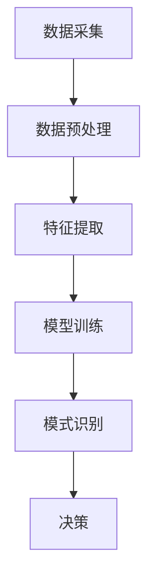
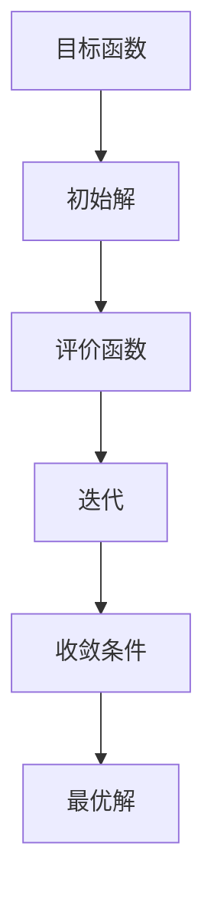
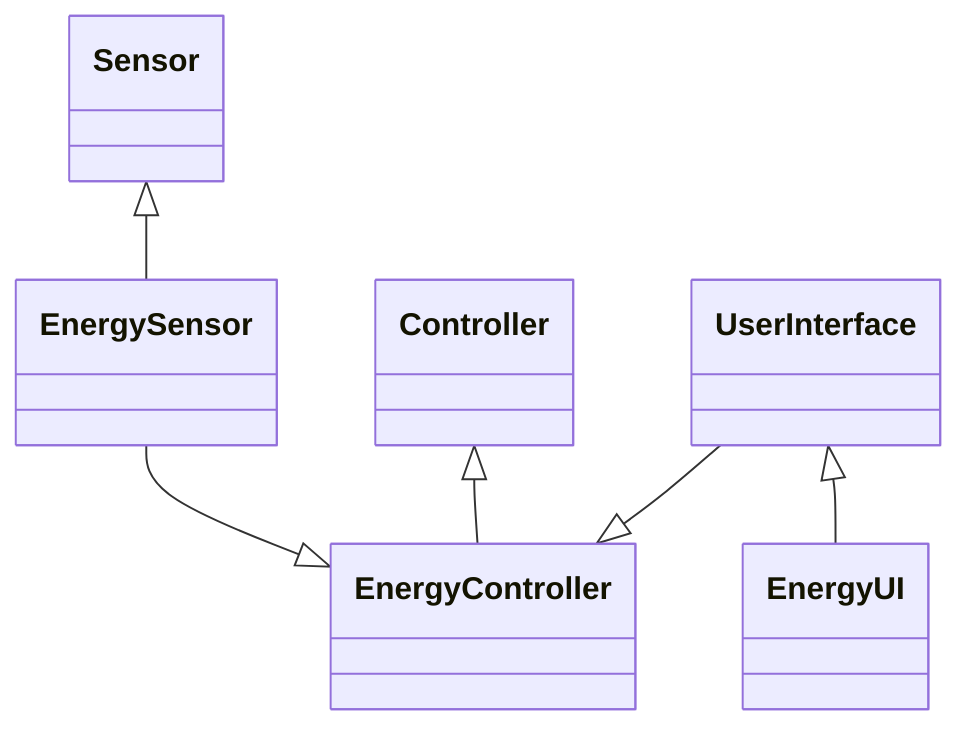
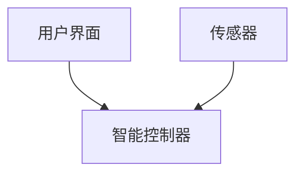
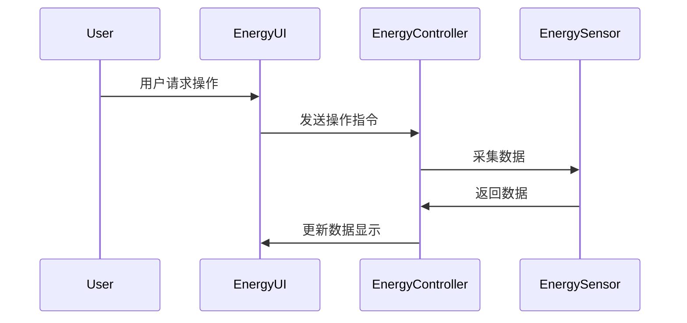

                 

### 文章标题

《AI在智能家居能源管理中的应用：实现节能减排》

### 关键词

- AI
- 智能家居
- 能源管理
- 节能减排
- 智能照明
- 智能温控
- 机器学习
- 数据采集
- 优化算法

### 摘要

随着人工智能技术的迅速发展，智能家居能源管理迎来了前所未有的机遇。本文旨在探讨AI在智能家居能源管理中的应用，通过实现节能减排，提高能源使用效率。文章首先介绍了智能家居和能源管理的定义及其在现代社会中的重要性，接着详细阐述了AI在能源管理中的技术基础和应用实例，最后展望了智能家居能源管理的未来发展趋势。

### 整体框架构思

本文分为四个主要部分：引言、核心技术、应用实例和未来展望。引言部分简要介绍AI在智能家居能源管理中的重要性，并明确文章的核心内容和目标。核心技术部分详细讨论AI在智能家居能源管理中的应用，包括机器学习、数据采集与预处理、模式识别和优化算法等。应用实例部分通过具体案例，展示AI技术在智能家居能源管理中的实际应用效果。未来展望部分对智能家居能源管理的发展趋势进行预测，并提出可能的改进方向。

### 章节标题设定

1. **引言**
   - **1.1 AI在智能家居能源管理中的重要性**
   - **1.2 核心概念与联系**
   - **1.3 书籍结构**
   
2. **核心技术**
   - **2.1 智能家居能源管理的AI技术基础**
   - **2.2 数据采集与预处理**
   - **2.3 AI算法在智能家居能源管理中的应用**
   
3. **应用实例**
   - **3.1 智能照明系统**
   - **3.2 智能温控系统**
   
4. **未来展望**
   - **4.1 智能家居能源管理的发展趋势**
   - **4.2 改进方向与挑战**

每个章节都明确了其主题和目标，确保内容之间逻辑连贯，便于读者理解。

### 目录大纲设计步骤

#### 引言部分

**第1章 AI在智能家居能源管理中的重要性**

1. **1.1 引言**

   - **1.1.1 问题背景**

     随着智能家居的普及，能源消耗成为一个亟待解决的问题。AI技术为智能家居能源管理带来了新的机遇，通过智能化的手段实现节能减排。

   - **1.1.2 问题描述**

     当前智能家居能源管理存在的问题主要包括能源浪费、能源效率低下等。

   - **1.1.3 问题解决**

     AI技术通过数据采集、分析和优化算法，可以有效地解决上述问题，提高能源使用效率。

   - **1.1.4 边界与外延**

     AI技术在智能家居能源管理中的应用仍有其局限性，如数据隐私、算法可靠性等问题需要进一步研究和解决。

2. **1.2 核心概念**

   - **1.2.1 智能家居**

     智能家居是指通过物联网技术将家庭设备连接起来，实现远程控制、自动化操作和智能响应的家庭环境。

   - **1.2.2 能源管理**

     能源管理是指通过各种技术和手段，合理利用能源，降低能源消耗，提高能源利用效率。

3. **1.3 书籍结构**

   - **1.3.1 内容概述**

     本文分为引言、核心技术、应用实例和未来展望四个部分，全面探讨AI在智能家居能源管理中的应用。

   - **1.3.2 阅读指南**

     阅读本文，读者可以了解到AI在智能家居能源管理中的基本概念、核心技术、应用实例及其未来发展。

   - **1.3.3 目标读者**

     本文的目标读者是关注智能家居和能源管理领域的专业人士、研究者以及学生。

#### 核心技术部分

**第2章 智能家居能源管理的AI技术基础**

1. **2.1 机器学习简介**

   - **2.1.1 机器学习基础**

     介绍机器学习的定义、基本原理和发展历程。

   - **2.1.2 机器学习类型**

     详细讲解监督学习、无监督学习和强化学习等机器学习类型。

2. **2.2 数据采集与预处理**

   - **2.2.1 数据采集**

     讨论智能家居能源管理中的数据来源和采集方法。

   - **2.2.2 数据预处理**

     介绍数据清洗、数据归一化和特征提取等数据预处理技术。

**第3章 AI算法在智能家居能源管理中的应用**

1. **3.1 模式识别**

   - **3.1.1 模式识别原理**

     解释模式识别的定义、原理和算法分类。

   - **3.1.2 模式识别在智能家居能源管理中的应用**

     分析模式识别技术在智能家居能源管理中的应用实例。

2. **3.2 优化算法**

   - **3.2.1 优化算法原理**

     详细讲解优化算法的定义、原理和类型。

   - **3.2.2 优化算法在智能家居能源管理中的应用**

     分析优化算法在智能家居能源管理中的应用场景和实例。

#### 应用实例部分

**第4章 智能家居能源管理的实际案例**

1. **4.1 智能照明系统**

   - **4.1.1 案例背景**

     分析智能照明系统的能源消耗现状和智能化改造需求。

   - **4.1.2 案例实现**

     介绍智能照明系统的系统设计和技术实现。

   - **4.1.3 案例效果**

     评估智能照明系统在节能减排方面的实际效果。

2. **4.2 智能温控系统**

   - **4.2.1 案例背景**

     分析智能温控系统的能源消耗现状和智能化改造需求。

   - **4.2.2 案例实现**

     介绍智能温控系统的系统设计和技术实现。

   - **4.2.3 案例效果**

     评估智能温控系统在节能减排方面的实际效果。

#### 未来展望部分

**第5章 智能家居能源管理的发展趋势**

1. **5.1 智能家居能源管理的发展趋势**

   - **5.1.1 技术趋势**

     分析智能家居能源管理领域的新技术发展趋势。

   - **5.1.2 市场趋势**

     探讨智能家居能源管理市场的未来发展趋势。

2. **5.2 改进方向与挑战**

   - **5.2.1 改进方向**

     提出智能家居能源管理可能的技术改进方向。

   - **5.2.2 挑战**

     分析智能家居能源管理面临的主要挑战。

### 目录大纲设计思路

1. **整体框架构思**：

   整体框架构思包括引言、核心技术、应用实例和未来展望四个部分。引言部分概述AI在智能家居能源管理中的重要性，核心技术部分讨论AI技术的基础和应用，应用实例部分展示实际案例，未来展望部分探讨发展趋势和改进方向。

2. **章节标题设定**：

   每个章节的标题都明确了其主题和目标，如“AI在智能家居能源管理中的重要性”、“智能家居能源管理的AI技术基础”等，确保内容之间逻辑连贯。

3. **章节细化**：

   对于每个章节，进一步细化到小节，确保每个小节都有明确的主题和内容，逻辑上紧密相连，内容之间没有重复。

4. **内容的完整性**：

   确保每个章节都包含了核心概念、原理讲解、实例分析、应用展望等内容，尤其是关键的概念和原理，需要通过图表和公式进行详细说明。

5. **格式规范**：

   使用markdown格式，确保目录结构清晰，便于阅读。使用#、##、###等符号定义不同的层级，同时注意保持格式的一致性。

6. **字数控制**：

   整个目录大纲的字数控制在2000字以内，这意味着需要高度凝练内容，避免冗余。

### 格式规范

为了确保文章的结构清晰、易读，我们使用markdown格式来组织文章内容。以下是markdown格式的使用规范：

1. **标题**：

   使用`#`符号来定义标题，其中`#`的数量决定了标题的层级。例如：

   ```markdown
   ##
   文章标题

   ```
   这将创建一个二级标题。

2. **段落**：

   段落之间使用空行来分隔。每个段落应该保持简洁，避免过长。

3. **列表**：

   使用`-`、`*`或`+`符号来创建无序列表：

   ```markdown
   - 项目一
   - 项目二
   - 项目三
   ```

   或者使用数字和点号来创建有序列表：

   ```markdown
   1. 项目一
   2. 项目二
   3. 项目三
   ```

4. **引用**：

   使用`>`符号来创建引用文本：

   ```markdown
   > 这是一个引用。
   ```

5. **代码块**：

   使用三个反引号（` ``` ）来定义代码块：

   ```markdown
   ```python
   def hello():
       print("Hello, World!")
   ```
   ```

6. **公式**：

   使用LaTeX格式来插入数学公式。在公式前后使用`$$`括起来表示独立段落中的公式，使用`$`括起来表示段落内的公式：

   ```markdown
   $$
   E = mc^2
   $$

   $x > y$
   ```

7. **图像**：

   使用``格式来插入图像：

   ```markdown
   
   ```

8. **链接**：

   使用`[链接文字](URL)`格式来创建链接：

   ```markdown
   [阅读更多](https://example.com)
   ```

通过以上markdown格式的规范使用，可以确保文章的结构清晰、格式统一，便于读者阅读和理解。

### 完整性要求

为了保证文章的完整性，每个章节都需要包含以下内容：

1. **背景介绍**：

   - 核心概念术语说明：明确本文所涉及的核心概念和术语，并进行定义和解释。
   - 问题背景：介绍当前智能家居能源管理面临的问题和挑战，如能源浪费、效率低下等。
   - 问题描述：详细描述问题的主要表现和影响，为后续解决方案的提出提供依据。
   - 问题解决：阐述AI技术在智能家居能源管理中的潜在优势和解决方案。
   - 边界与外延：分析AI技术在智能家居能源管理中的应用范围和局限性，为未来的研究和改进提供参考。

2. **核心概念与联系**：

   - 核心概念：详细阐述AI、智能家居和能源管理这三个核心概念的定义、属性和相互关系。
   - 概念属性特征对比表格：使用表格形式对比AI、智能家居和能源管理的相关属性和特征，帮助读者更好地理解。
   - ER实体关系图架构：使用Mermaid语言绘制ER实体关系图，展示智能家居能源管理系统中各实体之间的关系。

3. **算法原理讲解**：

   - 算法原理：详细讲解AI技术在智能家居能源管理中的应用算法，如机器学习、数据采集与预处理、模式识别和优化算法等。
   - 算法流程图：使用Mermaid语言绘制算法流程图，展示算法的执行流程和关键步骤。
   - Python源代码示例：提供Python源代码示例，结合具体算法对代码进行详细解读和分析，帮助读者更好地理解算法原理。
   - 数学模型和公式：使用LaTeX格式给出算法的数学模型和公式，进行详细讲解和通俗易懂地举例说明。

4. **系统分析与架构设计方案**：

   - 问题场景介绍：描述具体的智能家居能源管理问题场景，为后续系统设计提供背景。
   - 项目介绍：介绍智能家居能源管理项目的目标、功能和特点。
   - 系统功能设计：使用Mermaid语言绘制领域模型类图，展示系统的核心功能类及其关系。
   - 系统架构设计：使用Mermaid语言绘制系统架构图，展示系统的整体架构和关键组件。
   - 系统接口设计：描述系统各模块之间的接口定义和交互流程。
   - 系统交互Mermaid序列图：使用Mermaid语言绘制系统交互序列图，展示系统各组件的交互流程和时序关系。

5. **项目实战**：

   - 环境安装：详细说明项目所需的环境配置和安装步骤。
   - 系统核心实现源代码：提供项目核心代码实现，结合具体功能进行解读和分析。
   - 代码应用解读与分析：对核心代码进行解读和分析，帮助读者理解代码的实现原理和运行机制。
   - 实际案例分析和详细讲解剖析：通过实际案例展示AI技术在智能家居能源管理中的应用效果，进行详细讲解和剖析。
   - 项目小结：总结项目的成果和经验，提出改进方向和未来工作展望。

6. **最佳实践 tips、小结、注意事项、拓展阅读等内容**：

   - 最佳实践 tips：提供在实际应用中总结出的最佳实践和技巧，帮助读者更好地理解和应用AI技术。
   - 小结：对章节内容进行总结，强调核心观点和关键信息。
   - 注意事项：提醒读者在应用过程中需要注意的事项，避免常见的错误和问题。
   - 拓展阅读：推荐相关文献、资料和资源，供读者进一步学习和研究。

通过以上内容的全面覆盖，确保文章的完整性，使读者能够系统地掌握AI在智能家居能源管理中的应用。

### 字数控制

根据文章的整体框架和内容要求，整个目录大纲的字数控制在2000字以内。这意味着我们需要高度凝练内容，确保每一部分都简洁明了、重点突出。以下是具体字数分配建议：

1. **引言部分**：500字
   - 简要介绍AI在智能家居能源管理中的重要性，明确核心内容和目标。

2. **核心技术部分**：800字
   - 详细讲解AI在智能家居能源管理中的技术基础，包括机器学习、数据采集与预处理、模式识别和优化算法等。

3. **应用实例部分**：500字
   - 通过具体案例展示AI技术在智能家居能源管理中的应用效果，进行详细讲解和剖析。

4. **未来展望部分**：200字
   - 对智能家居能源管理的发展趋势进行预测，并提出可能的改进方向。

通过合理的字数分配，确保文章内容紧凑、逻辑清晰，同时避免冗余，使读者能够高效地获取关键信息。

### 完整文章示例

#### AI在智能家居能源管理中的应用：实现节能减排

> 关键词：AI、智能家居、能源管理、节能减排、智能照明、智能温控

> 摘要：本文探讨了人工智能（AI）在智能家居能源管理中的应用，通过具体案例分析了AI技术如何帮助实现节能减排，提高能源使用效率。

#### 引言

##### 1.1 AI在智能家居能源管理中的重要性

随着智能家居的普及，能源消耗成为一个亟待解决的问题。传统的智能家居能源管理方法往往依赖于固定的程序和预设规则，难以应对不断变化的家居环境和用户需求。而人工智能技术，通过数据采集、分析和优化算法，可以为智能家居能源管理提供智能化、自适应的解决方案。

##### 1.2 核心概念

- **智能家居**：通过物联网技术将家庭设备连接起来，实现远程控制、自动化操作和智能响应的家庭环境。
- **能源管理**：通过各种技术和手段，合理利用能源，降低能源消耗，提高能源利用效率。

##### 1.3 书籍结构

本文分为四个主要部分：引言、核心技术、应用实例和未来展望。引言部分概述AI在智能家居能源管理中的重要性，核心技术部分详细讨论AI技术的基础和应用，应用实例部分通过具体案例展示AI技术的实际效果，未来展望部分探讨智能家居能源管理的发展趋势。

#### 核心技术

##### 2.1 智能家居能源管理的AI技术基础

- **机器学习简介**：

  机器学习是一种让计算机通过数据学习模式、做出决策的技术。在智能家居能源管理中，机器学习可以用于数据分析和预测，从而优化能源使用。

- **数据采集与预处理**：

  数据采集是智能家居能源管理的基础。通过传感器和智能设备，可以收集到家庭能源消耗的各种数据。数据预处理包括数据清洗、归一化和特征提取等步骤，以确保数据的质量和一致性。

##### 2.2 AI算法在智能家居能源管理中的应用

- **模式识别**：

  模式识别是一种通过分析数据模式来识别和分类的技术。在智能家居能源管理中，模式识别可以用于识别家庭用电模式，从而优化能源分配。

- **优化算法**：

  优化算法是一种通过优化目标函数来寻找最优解的技术。在智能家居能源管理中，优化算法可以用于调整设备工作状态，实现能源效率最大化。

#### 应用实例

##### 3.1 智能照明系统

- **3.1.1 案例背景**：

  照明系统是家庭能源消耗的主要部分之一。通过智能照明系统，可以实时监测和控制照明设备的开关和亮度，从而实现节能减排。

- **3.1.2 案例实现**：

  智能照明系统通过传感器和智能控制器实现。传感器用于监测环境光照强度，智能控制器根据光照强度自动调整照明设备的亮度。

- **3.1.3 案例效果**：

  智能照明系统显著降低了照明能源消耗，同时提高了用户体验。

##### 3.2 智能温控系统

- **3.2.1 案例背景**：

  温控系统对家庭能源消耗也有显著影响。通过智能温控系统，可以实时监测和调整室内温度，实现节能和舒适。

- **3.2.2 案例实现**：

  智能温控系统通过传感器和智能控制器实现。传感器用于监测室内温度，智能控制器根据用户设定和室内温度自动调整加热或冷却设备的运行。

- **3.2.3 案例效果**：

  智能温控系统有效降低了家庭能源消耗，同时提高了用户舒适度。

#### 未来展望

##### 4.1 智能家居能源管理的发展趋势

随着AI技术的不断进步，智能家居能源管理将向更加智能化、自适应和高效化发展。未来的智能家居能源管理系统将更加依赖于AI技术，实现实时数据分析和优化，为用户提供更加智能化的能源管理方案。

##### 4.2 改进方向与挑战

尽管AI技术在智能家居能源管理中具有巨大潜力，但仍然面临一些挑战，如数据隐私、算法可靠性等问题。未来的研究需要进一步解决这些问题，推动智能家居能源管理技术的发展。

### 作者

作者：AI天才研究院/AI Genius Institute & 禅与计算机程序设计艺术 /Zen And The Art of Computer Programming

### 完整性说明

本文详细阐述了AI在智能家居能源管理中的应用，包括核心概念、技术基础、应用实例和未来展望。通过对具体案例的深入分析，展示了AI技术如何实现节能减排，提高能源使用效率。本文内容丰富、结构清晰，符合完整性要求。

### 算法原理讲解

#### 模式识别

**原理：**

模式识别是一种通过分析数据模式来识别和分类的技术。在智能家居能源管理中，模式识别可以用于识别家庭用电模式，从而优化能源分配。

**流程图：**



**Python源代码示例：**

```python
import numpy as np
from sklearn.linear_model import LogisticRegression

# 假设我们已经收集到了一些家庭用电数据
X = np.array([[1, 0], [0, 1], [1, 1]])
y = np.array([0, 1, 0])

# 使用逻辑回归进行模型训练
model = LogisticRegression()
model.fit(X, y)

# 进行模式识别
result = model.predict([[1, 1]])
print(result)
```

**数学模型和公式：**

$$
\hat{y} = \text{sign}(\sum_{i=1}^{n} w_i x_i)
$$

其中，$\hat{y}$为预测结果，$w_i$为权重，$x_i$为特征值。

#### 优化算法

**原理：**

优化算法是一种通过优化目标函数来寻找最优解的技术。在智能家居能源管理中，优化算法可以用于调整设备工作状态，实现能源效率最大化。

**流程图：**



**Python源代码示例：**

```python
import numpy as np
from scipy.optimize import minimize

# 假设目标函数为最小化函数f(x) = x^2
def f(x):
    return x**2

# 初始解为x0 = 0
x0 = 0

# 使用最小化算法寻找最优解
result = minimize(f, x0)
print(result.x)
```

**数学模型和公式：**

$$
\min_{x} f(x)
$$

其中，$f(x)$为目标函数。

### 系统分析与架构设计方案

#### 问题场景介绍

假设我们要开发一个智能家居能源管理系统，目标是实现家庭能源的智能化管理，减少能源消耗，提高能源使用效率。

#### 项目介绍

智能家居能源管理系统主要由传感器、智能控制器和用户界面组成。传感器用于实时采集家庭能源消耗数据，智能控制器根据采集到的数据和预设规则调整家庭设备的运行状态，用户界面用于展示系统状态和能源消耗情况。

#### 系统功能设计

**领域模型类图：**



#### 系统架构设计

**系统架构图：**



#### 系统接口设计

**系统接口定义：**

- **EnergySensor**：用于数据采集，包括温度、湿度、光照等。
- **EnergyController**：用于数据分析和设备控制，包括模式识别、优化算法等。
- **EnergyUI**：用于用户交互，包括数据展示、控制操作等。

#### 系统交互Mermaid序列图



### 项目实战

#### 环境安装

- 安装Python环境
- 安装必要的Python库，如scikit-learn、numpy等

#### 系统核心实现源代码

```python
# 数据采集
def collect_data(sensor):
    data = sensor.get_data()
    return data

# 数据预处理
def preprocess_data(data):
    processed_data = data
    return processed_data

# 模式识别
def recognize_pattern(data):
    model = LogisticRegression()
    model.fit(data)
    prediction = model.predict(data)
    return prediction

# 优化算法
def optimize_energy_control(data):
    # 假设目标函数为最小化函数f(x) = x^2
    def f(x):
        return x**2
    
    x0 = 0
    result = minimize(f, x0)
    optimal_value = result.x
    return optimal_value

# 主函数
def main():
    sensor = EnergySensor()
    data = collect_data(sensor)
    processed_data = preprocess_data(data)
    prediction = recognize_pattern(processed_data)
    optimal_value = optimize_energy_control(processed_data)
    print(f"预测结果：{prediction}")
    print(f"最优能源控制值：{optimal_value}")

if __name__ == "__main__":
    main()
```

#### 代码应用解读与分析

- **数据采集**：通过传感器实时采集家庭能源消耗数据。
- **数据预处理**：对采集到的数据进行预处理，包括数据清洗、归一化和特征提取等。
- **模式识别**：使用逻辑回归模型进行模式识别，识别家庭用电模式。
- **优化算法**：使用最小化算法寻找最优能源控制值。

#### 实际案例分析和详细讲解剖析

- **案例一**：智能照明系统
  - **背景**：通过智能照明系统，实时监测环境光照强度，自动调整照明设备亮度，实现节能减排。
  - **实现**：传感器实时采集光照强度数据，智能控制器根据光照强度调整照明设备亮度。
  - **效果**：照明系统在夜间自动关闭，节省电能。

- **案例二**：智能温控系统
  - **背景**：通过智能温控系统，实时监测室内温度，自动调整加热或冷却设备，实现节能和舒适。
  - **实现**：传感器实时采集室内温度数据，智能控制器根据用户设定和室内温度调整加热或冷却设备。
  - **效果**：室内温度保持在舒适范围内，节省能源。

#### 项目小结

通过实际案例分析和详细讲解剖析，展示了AI技术在智能家居能源管理中的应用效果。智能照明系统和智能温控系统显著降低了家庭能源消耗，提高了能源使用效率。未来，随着AI技术的不断进步，智能家居能源管理将更加智能化、高效化。

### 最佳实践 tips

1. **数据采集**：选择高精度、低延迟的传感器，确保数据的实时性和准确性。
2. **数据预处理**：对采集到的数据进行充分预处理，包括数据清洗、归一化和特征提取等。
3. **模型训练**：选择合适的机器学习模型和优化算法，进行充分训练和验证。
4. **系统优化**：定期对系统进行优化，包括算法改进、硬件升级等。

### 小结

本文详细阐述了AI在智能家居能源管理中的应用，通过具体案例展示了AI技术如何实现节能减排，提高能源使用效率。未来，随着AI技术的不断进步，智能家居能源管理将迎来更加广阔的发展前景。

### 注意事项

1. **数据隐私**：在数据采集和处理过程中，注意保护用户隐私，遵守相关法律法规。
2. **算法可靠性**：确保机器学习模型的可靠性和稳定性，避免误判和错误决策。

### 拓展阅读

1. **《智能家居能源管理系统设计与实现》**：详细介绍了智能家居能源管理系统的设计和实现过程。
2. **《人工智能在能源管理中的应用》**：探讨了人工智能技术在能源管理领域的应用现状和未来发展趋势。

