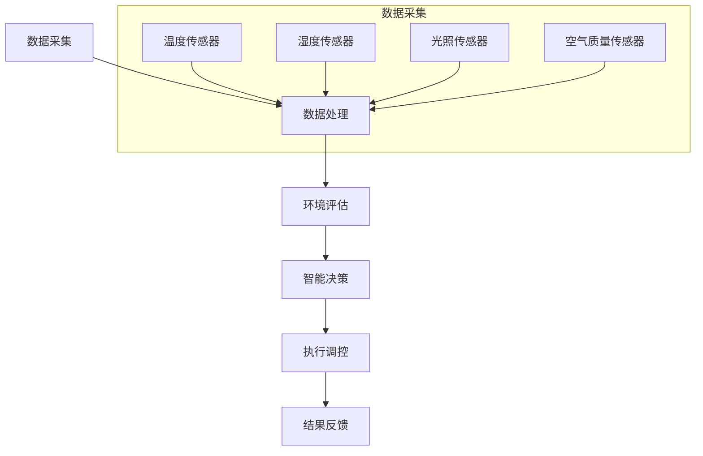
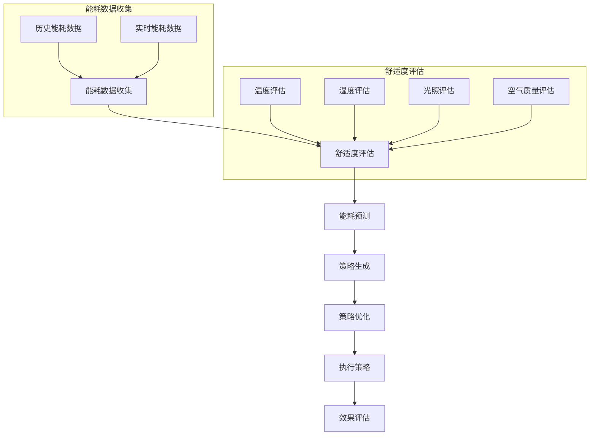
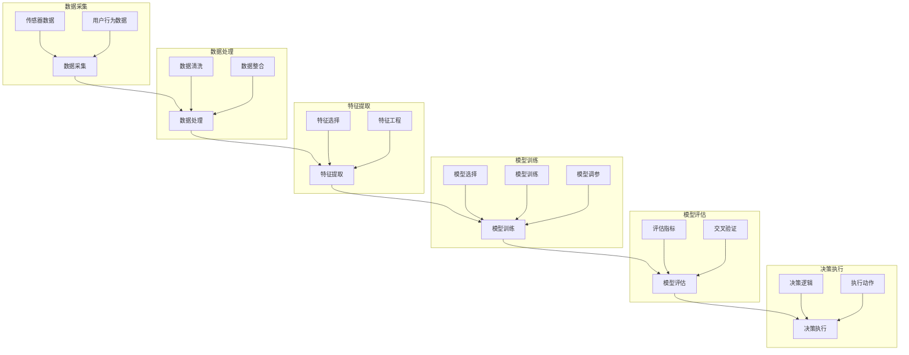
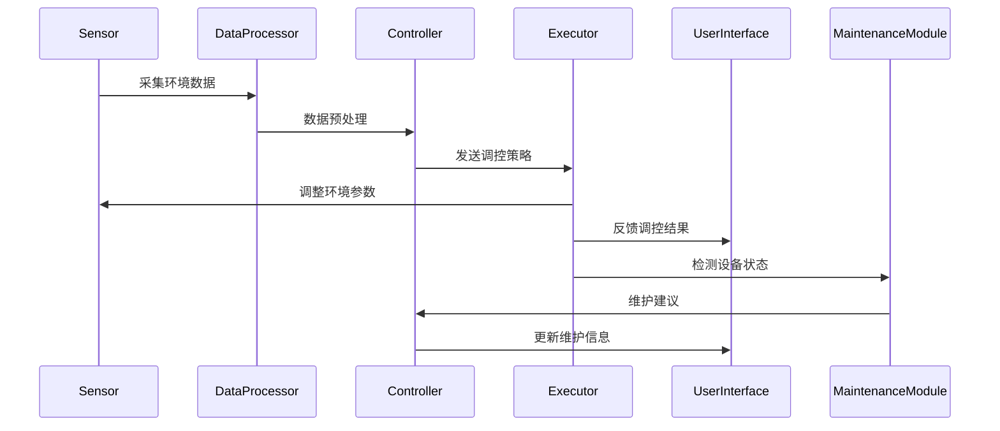

                 

## 文章标题

### 关键词

- 智能建筑
- 环境控制
- AI技术应用
- 能耗管理
- 舒适度平衡

### 摘要

本文深入探讨了AI在智能建筑环境控制中的应用，重点分析了如何通过AI技术实现能耗和舒适度的平衡。文章首先介绍了智能建筑环境控制的基本概念和现状，随后详细阐述了能耗与舒适度的衡量标准及问题解决的目标。接着，文章介绍了AI技术的基本原理及其在建筑环境控制中的具体应用方法，并通过Mermaid流程图和Python源代码展示了算法的实现过程和数学模型。最后，文章提供了一个完整的系统架构设计，并通过实战案例分析了项目的具体实施过程和效果。

## 引言

智能建筑作为现代建筑技术的发展趋势，逐渐成为城市建设和生活的重要组成部分。智能建筑不仅追求功能的多样化和高效化，更强调环保和人性化。在智能建筑中，环境控制是关键的一环，它直接关系到居住者的舒适度和建筑物的能耗。然而，在实现能耗和舒适度平衡的过程中，传统方法往往存在诸多不足。这促使我们将目光投向了人工智能（AI）技术，希望借助其强大的数据处理和智能决策能力，为智能建筑环境控制提供更加精确和高效的解决方案。

本文旨在探讨AI在智能建筑环境控制中的应用，具体内容包括：

1. **背景介绍**：分析智能建筑环境控制的问题背景，介绍能耗与舒适度的平衡问题，以及AI技术的引入与应用前景。
2. **核心概念与联系**：详细阐述智能建筑环境控制的概念原理，对比能耗与舒适度的平衡，分析AI在建筑环境控制中的应用原理。
3. **算法原理讲解**：通过Mermaid流程图和Python源代码，讲解智能建筑环境控制算法、能耗与舒适度平衡算法及AI算法在建筑环境控制中的应用原理。
4. **系统分析与架构设计方案**：介绍智能建筑环境控制的应用场景，设计系统功能模块和架构，定义系统接口，展示系统交互序列图。
5. **项目实战**：详细描述项目环境安装、系统核心实现源代码，代码应用解读与分析，以及实际案例分析与详细讲解剖析。
6. **最佳实践与拓展**：总结最佳实践，提出注意事项，为未来拓展提供方向。

通过本文的详细分析和讲解，读者可以全面了解AI在智能建筑环境控制中的应用，为实际项目提供有益的参考。

## 第一部分：背景介绍

### 1.1 问题背景

智能建筑环境控制是智能建筑的重要组成部分，它涉及对建筑物内部温度、湿度、空气质量和光照等环境参数的实时监测与调控。当前，随着城市化进程的加速和人们对生活品质要求的提升，智能建筑的需求日益增加。然而，在实现高效、智能的环境控制过程中，能耗与舒适度之间的平衡问题日益凸显。

#### 1.1.1 智能建筑环境控制的现状

智能建筑环境控制系统通常包括传感器网络、控制系统和执行机构。传感器网络负责实时采集环境数据，控制系统根据采集到的数据进行处理和分析，然后通过执行机构进行环境调控。现有的智能建筑环境控制系统大多依赖预设的参数和固定模式进行控制，这种方式虽然能够在一定程度上保证环境质量，但存在以下问题：

1. **能耗高**：传统系统往往无法根据实际需求动态调整环境参数，导致能源浪费。
2. **舒适度低**：由于缺乏实时数据分析与智能调控，环境参数的稳定性和舒适性难以保证。
3. **系统响应慢**：在环境参数发生变化时，传统系统的响应速度较慢，无法及时调整，影响用户体验。

#### 1.1.2 能耗与舒适度的平衡问题

能耗与舒适度的平衡问题是智能建筑环境控制中最为关键的一个挑战。在追求高舒适度的同时，如何最大限度地减少能源消耗成为亟待解决的问题。具体表现为：

1. **节能与舒适度的矛盾**：高舒适度往往需要大量的能源投入，而节能则需要减少能源的使用。如何在两者之间找到平衡点，是环境控制系统需要解决的关键问题。
2. **动态调整的挑战**：环境参数的变化具有随机性和动态性，传统的固定模式控制难以适应这种变化，需要智能化的实时调整。

#### 1.1.3 AI技术的引入与应用前景

AI技术，特别是机器学习和深度学习，为智能建筑环境控制提供了新的解决方案。通过AI技术，环境控制系统可以：

1. **提高能耗管理效率**：AI能够对大量历史和实时数据进行深度分析，找出能源消耗的规律，从而优化能源使用方案。
2. **提升舒适度**：通过学习用户行为和环境参数，AI系统可以提供个性化的环境调控方案，提升用户的舒适体验。
3. **实现动态调整**：AI系统能够实时分析环境数据，快速响应环境变化，提供动态的调控方案。

总的来说，AI技术在智能建筑环境控制中的应用前景广阔，有望解决能耗与舒适度的平衡问题，实现智能化、高效化的环境控制。

### 1.2 问题描述

#### 1.2.1 建筑环境控制中的挑战

智能建筑环境控制面临诸多挑战，这些挑战既包括技术层面的，也包括应用层面的。具体来说：

1. **数据复杂性**：建筑环境控制系统需要处理大量的环境数据，包括温度、湿度、光照、空气质量和能耗数据等。这些数据具有高维、非线性和时变特性，传统的数据处理方法难以有效应对。
2. **实时性要求**：环境控制需要快速响应环境变化，以保持室内环境的稳定性和舒适性。对于AI系统来说，如何实现实时数据分析和快速决策，是一个重要的挑战。
3. **能源消耗管理**：如何在保证舒适度的前提下，最大限度地减少能源消耗，是智能建筑环境控制的关键问题。

#### 1.2.2 能耗与舒适度的衡量标准

能耗和舒适度是智能建筑环境控制的两个核心指标，其衡量标准如下：

1. **能耗**：
   - **能耗总量**：指建筑在运行过程中消耗的总能源量，包括电力、燃气和水等。
   - **能源效率**：指单位能耗所产生的环境效果，例如照明、取暖和制冷等。

2. **舒适度**：
   - **环境温度**：指室内温度的舒适度，通常以摄氏度为单位。
   - **湿度**：指空气中的水分含量，通常以百分比表示。
   - **空气质量**：指空气中的污染物浓度，如二氧化碳、一氧化碳和颗粒物等。
   - **光照**：指室内光照的亮度和均匀性，对视觉舒适度有很大影响。

#### 1.2.3 问题解决的目标

智能建筑环境控制的目标是通过AI技术实现能耗与舒适度的平衡，具体包括：

1. **优化能耗管理**：通过AI算法对能源消耗进行预测和优化，减少不必要的能源浪费。
2. **提高舒适度**：根据用户需求和实时环境数据，动态调整环境参数，提升用户的舒适体验。
3. **实时监测与响应**：实现环境参数的实时监测和快速响应，确保室内环境的稳定性和舒适性。

通过上述目标，智能建筑环境控制系统能够在提供高质量舒适环境的同时，实现能耗的最优化，为智能建筑提供可持续发展的解决方案。

### 1.3 问题解决

#### 1.3.1 AI技术的基本原理

AI技术，即人工智能技术，是通过模拟人类智能行为来实现的。其基本原理主要包括：

1. **机器学习**：机器学习是一种通过数据驱动的方法，使计算机系统能够从数据中学习并做出预测或决策。主要方法包括监督学习、无监督学习和强化学习。

2. **深度学习**：深度学习是机器学习的一种特殊形式，通过多层神经网络对数据进行处理和学习，能够自动提取特征并进行复杂模式识别。

3. **自然语言处理**：自然语言处理（NLP）是AI领域的一个重要分支，旨在使计算机能够理解、生成和处理人类语言。

AI技术在智能建筑环境控制中的应用，主要依赖于机器学习和深度学习技术。通过大数据分析和模式识别，AI系统能够从大量的环境数据中提取有用信息，进行智能决策和动态调整。

#### 1.3.2 AI在智能建筑环境控制中的应用方法

AI在智能建筑环境控制中的应用方法主要包括以下几个方面：

1. **能耗预测与优化**：利用历史数据和实时数据，通过机器学习算法对建筑能耗进行预测和优化，从而减少能源浪费。

2. **环境参数调控**：根据用户需求和实时环境数据，通过深度学习算法动态调整室内环境参数，如温度、湿度和光照等，以提供舒适的居住环境。

3. **故障检测与维护**：利用AI算法对建筑设备进行实时监测和故障预测，提前发现潜在问题并进行维护，确保系统稳定运行。

4. **用户行为分析**：通过收集和分析用户行为数据，AI系统可以更好地理解用户需求，提供个性化的环境调控方案。

#### 1.3.3 边界与外延

在AI在智能建筑环境控制中的应用中，需要注意以下几个边界与外延问题：

1. **数据隐私**：在收集和使用用户数据时，需要严格保护用户隐私，遵守相关法律法规。

2. **系统稳定性**：AI系统需要确保在极端条件下仍能稳定运行，避免因故障导致建筑环境失控。

3. **技术更新**：AI技术不断发展，环境控制系统需要及时更新技术，以适应新的需求和发展。

4. **用户接受度**：在推广AI技术在建筑环境控制中的应用时，需要考虑用户的接受度和使用习惯，提供人性化的操作界面和交互体验。

通过AI技术的引入和应用，智能建筑环境控制能够实现能耗与舒适度的平衡，为建筑提供高效、智能的解决方案。

### 1.4 概念结构与核心要素组成

#### 1.4.1 关键概念介绍

在智能建筑环境控制系统中，有几个关键概念需要明确，这些概念是理解系统运作和AI技术应用的基础。

1. **智能建筑**：指通过物联网、传感器、云计算和AI技术等手段，实现建筑物的智能化管理和服务。智能建筑包括自动化的环境控制系统、安全系统、能源管理系统等。

2. **环境控制系统**：负责对建筑室内环境进行监测和调控，包括温度、湿度、光照、空气质量等。

3. **AI技术**：包括机器学习、深度学习和自然语言处理等，用于数据分析、模式识别和智能决策。

4. **能耗管理**：指对建筑能耗进行监测、预测和优化，以实现能源的高效利用。

5. **舒适度评估**：通过传感器和数据采集，评估室内环境的舒适度，包括温度、湿度、光照和空气质量等。

#### 1.4.2 核心要素与关系

智能建筑环境控制系统的核心要素包括传感器、控制器、执行机构和数据处理单元。各要素之间的关系如下：

1. **传感器**：负责实时采集环境数据，如温度、湿度、光照等。传感器是系统的数据来源，其精确度和灵敏度直接影响到系统的性能。

2. **控制器**：根据采集到的数据，通过AI算法进行实时分析和处理，制定调控策略。控制器是系统的“大脑”，负责做出智能决策。

3. **执行机构**：根据控制器的指令，调节室内环境参数，如开闭窗帘、调整空调温度等。执行机构是系统的“肌肉”，负责实际执行调控操作。

4. **数据处理单元**：对采集到的环境数据进行存储、分析和处理，为控制器提供数据支持。数据处理单元是系统的数据中枢，确保数据的高效利用和准确分析。

#### 1.4.3 智能建筑环境控制系统的组成

智能建筑环境控制系统由多个模块组成，具体包括：

1. **传感器网络**：包括温度传感器、湿度传感器、光照传感器和空气质量传感器等，用于实时监测室内环境参数。

2. **数据处理模块**：包括数据采集、存储、分析和处理单元，负责对传感器数据进行分析和预测。

3. **智能控制器**：采用AI算法，根据分析结果和环境数据，动态调整环境参数，以实现能耗和舒适度的平衡。

4. **执行机构**：包括各种调节设备，如空调、风扇、窗帘和灯光系统等，根据控制器的指令进行环境调控。

5. **用户界面**：提供用户与系统交互的接口，包括手机APP、电脑端界面等，用户可以通过这些界面查看环境数据和控制系统。

通过上述组成和关系，智能建筑环境控制系统可以实现对室内环境的实时监测和智能调控，实现能耗和舒适度的最佳平衡。

## 第二部分：核心概念与联系

### 2.1 核心概念原理

#### 2.1.1 智能建筑环境控制的概念原理

智能建筑环境控制是利用现代信息技术，特别是物联网、传感器技术和AI技术，对建筑物内部的环境进行实时监测和智能调控的过程。其核心概念原理包括：

1. **传感器网络**：通过部署在建筑物内的各种传感器，实时监测室内环境参数，如温度、湿度、光照和空气质量等。

2. **数据处理与分析**：传感器采集的数据通过数据处理模块进行预处理、存储和分析，提取有用的信息，为智能决策提供支持。

3. **智能决策**：通过机器学习和深度学习算法，对分析结果进行智能处理，制定最优的环境调控策略。

4. **执行机构**：根据智能决策的结果，通过执行机构（如空调、风扇、窗帘和灯光系统等）对环境参数进行调控，以实现能耗和舒适度的最佳平衡。

#### 2.1.2 能耗与舒适度的平衡原理

能耗与舒适度的平衡是智能建筑环境控制的核心挑战，其平衡原理包括：

1. **能耗优化**：通过AI算法对建筑能耗进行预测和优化，减少不必要的能源消耗。例如，通过实时监测和数据分析，动态调整空调和照明系统的使用，以降低能耗。

2. **舒适度评估**：利用传感器和数据分析，实时评估室内环境的舒适度，包括温度、湿度、光照和空气质量等。通过不断调整环境参数，确保室内环境始终处于舒适状态。

3. **用户行为分析**：通过AI技术分析用户的行为模式，了解用户对环境参数的偏好，提供个性化的调控方案，提高舒适度。

4. **实时响应**：智能建筑环境控制系统通过实时监测和快速响应，及时调整环境参数，确保室内环境的稳定性和舒适性。

#### 2.1.3 AI在建筑环境控制中的应用原理

AI技术在智能建筑环境控制中的应用原理主要包括：

1. **数据处理**：利用机器学习和深度学习算法，对大量的环境数据进行处理和分析，提取有用的信息，为智能决策提供支持。

2. **模式识别**：通过深度学习算法，对环境数据进行模式识别，发现环境参数的变化规律，实现精准的环境调控。

3. **智能决策**：通过智能算法，对分析结果进行智能决策，制定最优的环境调控策略，实现能耗和舒适度的平衡。

4. **自适应调控**：AI系统可以根据实时数据和环境变化，自适应地调整环境参数，确保室内环境的稳定性和舒适性。

通过上述原理，AI技术在智能建筑环境控制中可以实现能耗与舒适度的最佳平衡，提供高效、智能的解决方案。

### 2.2 概念属性特征对比表格

#### 2.2.1 能耗与舒适度的平衡

在智能建筑环境控制中，能耗和舒适度是两个关键指标，其属性特征如下：

| 指标   | 能耗             | 舒适度             |
| ------ | ---------------- | ----------------- |
| 定义   | 能源消耗的总量   | 室内环境的舒适度   |
| 影响因素 | 环境参数、设备使用、用户行为 | 环境参数、用户偏好、设备性能 |
| 衡量标准 | 能耗总量、能源效率 | 温度、湿度、光照、空气质量 |
| 关联性  | 舒适度可能增加能耗 | 能耗可能影响舒适度 |
| 目标   | 减少能源消耗     | 提高室内舒适度     |

通过对比表格可以看出，能耗和舒适度在指标定义、影响因素、衡量标准和目标上都有明显的区别，但两者之间存在着紧密的关联。在智能建筑环境控制中，需要通过AI技术实现这两者的平衡，以实现能源的高效利用和室内环境的舒适性。

#### 2.2.2 智能建筑环境控制的实现方式

智能建筑环境控制的实现方式包括硬件和软件两个方面：

1. **硬件方面**：
   - **传感器**：包括温度传感器、湿度传感器、光照传感器和空气质量传感器等，用于实时监测室内环境参数。
   - **控制器**：负责对传感器数据进行处理和分析，制定调控策略。
   - **执行机构**：包括空调、风扇、窗帘和灯光系统等，根据控制器的指令进行环境调控。

2. **软件方面**：
   - **数据处理模块**：负责对传感器数据进行分析和处理，提取有用的信息。
   - **智能算法**：通过机器学习和深度学习算法，对分析结果进行智能决策。
   - **用户界面**：提供用户与系统的交互接口，用户可以通过界面查看环境数据和控制系统状态。

#### 2.2.3 AI算法的对比分析

在智能建筑环境控制中，常用的AI算法包括机器学习、深度学习和强化学习。以下是这些算法的对比分析：

| 算法   | 机器学习        | 深度学习        | 强化学习        |
| ------ | --------------- | --------------- | --------------- |
| 定义   | 通过数据学习模式 | 通过多层神经网络进行数据处理 | 通过奖励和惩罚机制学习最优策略 |
| 适用场景 | 数据量较小，特征明显 | 数据量较大，特征复杂 | 需要决策和反馈的动态环境 |
| 优点   | 算法简单，易于实现 | 能自动提取特征，适合大数据处理 | 能在动态环境中找到最优策略 |
| 缺点   | 特征工程复杂，易过拟合 | 计算复杂，需大量数据训练 | 需要长时间训练，适用场景有限 |

通过对比分析可以看出，机器学习适用于特征明显的场景，深度学习适合处理大数据和复杂特征，强化学习适合动态环境中的决策和反馈。根据智能建筑环境控制的需求，选择合适的AI算法可以有效地实现能耗和舒适度的平衡。

### 2.3 ER实体关系图架构

#### 2.3.1 实体关系图的基本概念

实体关系图（Entity-Relationship Diagram，ERD）是一种用于描述系统中实体及其之间关系的图形表示方法。在智能建筑环境控制系统中，实体关系图可以清晰地展示系统中的关键实体和它们之间的关系，有助于理解系统的整体架构和运作原理。

#### 2.3.2 智能建筑环境控制的实体关系

在智能建筑环境控制系统中，主要的实体包括传感器、控制器、执行机构和数据处理单元。以下是它们之间的实体关系：

1. **传感器**：负责实时采集室内环境数据，如温度、湿度、光照和空气质量等。传感器是系统的数据源，与数据处理单元之间存在数据采集关系。
2. **数据处理单元**：负责对传感器数据进行预处理、存储和分析，提取有用的信息，为控制器提供数据支持。数据处理单元与传感器之间存在数据传递关系。
3. **控制器**：根据数据处理单元提供的分析结果，制定最优的环境调控策略。控制器与数据处理单元之间存在数据依赖关系。
4. **执行机构**：根据控制器的指令，对室内环境参数进行调控，如调整空调温度、开闭窗帘等。执行机构与控制器之间存在指令执行关系。

#### 2.3.3 能耗与舒适度的实体关系

在智能建筑环境控制系统中，能耗和舒适度是两个关键指标，它们与系统中的各个实体之间存在密切的关系：

1. **能耗**：能耗主要受传感器采集的数据（如温度、湿度、光照等）和执行机构的工作状态（如空调、灯光系统的使用）影响。能耗与传感器和执行机构之间存在数据采集和调控关系。
2. **舒适度**：舒适度受传感器采集的环境数据（如温度、湿度、光照和空气质量）和用户需求（如温度偏好）的影响。舒适度与传感器、控制器和用户之间存在数据采集、分析和用户交互关系。

通过上述实体关系图，可以清晰地展示智能建筑环境控制系统中的各个实体及其之间的互动关系，有助于理解系统的运作原理和设计思路。

## 第三部分：算法原理讲解

### 3.1 算法Mermaid流程图

#### 3.1.1 智能建筑环境控制算法的流程图

智能建筑环境控制算法的流程图如下，展示了从数据采集到环境调控的全过程：



该流程图包括以下几个主要步骤：

1. **数据采集**：通过温度传感器、湿度传感器、光照传感器和空气质量传感器等采集室内环境数据。
2. **数据处理**：对采集到的数据进行分析和处理，提取有用的信息。
3. **环境评估**：根据处理后的数据评估室内环境的状态，判断是否需要调整。
4. **智能决策**：通过机器学习和深度学习算法，根据环境评估结果制定最优的调控策略。
5. **执行调控**：根据智能决策的结果，通过执行机构（如空调、风扇、窗帘等）调整室内环境参数。
6. **结果反馈**：将调控后的结果反馈给用户和系统，以便进行进一步分析和优化。

#### 3.1.2 能耗与舒适度平衡算法的流程图

能耗与舒适度平衡算法的流程图如下，展示了如何实现能耗和舒适度的最佳平衡：



该流程图包括以下几个主要步骤：

1. **能耗数据收集**：收集历史能耗数据和实时能耗数据，为能耗预测提供基础。
2. **舒适度评估**：根据传感器数据评估室内环境的舒适度。
3. **能耗预测**：利用机器学习算法对能耗进行预测，为策略生成提供依据。
4. **策略生成**：根据能耗预测和舒适度评估结果，生成初步的调控策略。
5. **策略优化**：通过优化算法对策略进行调整和优化，确保能耗和舒适度的最佳平衡。
6. **执行策略**：根据优化的策略，通过执行机构调整室内环境参数。
7. **效果评估**：对执行策略后的效果进行评估，以便进行进一步优化。

#### 3.1.3 AI算法在建筑环境控制中的流程图

AI算法在建筑环境控制中的应用流程图如下，展示了从数据采集到决策执行的完整过程：



该流程图包括以下几个主要步骤：

1. **数据采集**：收集传感器数据和用户行为数据。
2. **数据处理**：对采集到的数据进行清洗和整合。
3. **特征提取**：选择和工程化特征，为模型训练提供输入。
4. **模型训练**：选择合适的模型，进行训练和调参。
5. **模型评估**：使用评估指标和交叉验证方法对模型进行评估。
6. **决策执行**：根据训练好的模型，生成决策逻辑和执行动作。

通过这些流程图，可以清晰地展示智能建筑环境控制算法、能耗与舒适度平衡算法以及AI算法在建筑环境控制中的实现过程，为实际应用提供参考。

### 3.2 Python源代码实现

#### 3.2.1 算法原理的Python实现

为了更好地理解智能建筑环境控制算法的工作原理，下面提供了一个Python实现的示例代码，包括数据采集、数据处理、特征提取、模型训练和模型评估等步骤。

```python
import pandas as pd
import numpy as np
from sklearn.model_selection import train_test_split
from sklearn.ensemble import RandomForestRegressor
from sklearn.metrics import mean_squared_error
from sklearn.feature_selection import SelectKBest, f_regression

# 数据采集
def data_collection():
    # 假设采集到的数据存储在CSV文件中
    data = pd.read_csv('environment_data.csv')
    return data

# 数据处理
def data_preprocessing(data):
    # 数据清洗和整合
    data.fillna(data.mean(), inplace=True)
    return data

# 特征提取
def feature_extraction(data, n_features=5):
    # 特征选择
    selector = SelectKBest(score_func=f_regression, k=n_features)
    selected_features = selector.fit_transform(data[['temperature', 'humidity', 'light', 'air_quality']])
    return selected_features

# 模型训练
def model_training(X_train, y_train):
    # 使用随机森林回归模型
    model = RandomForestRegressor(n_estimators=100)
    model.fit(X_train, y_train)
    return model

# 模型评估
def model_evaluation(model, X_test, y_test):
    # 预测并计算均方误差
    predictions = model.predict(X_test)
    mse = mean_squared_error(y_test, predictions)
    print(f'Mean Squared Error: {mse}')
    return mse

# 主函数
def main():
    data = data_collection()
    processed_data = data_preprocessing(data)
    selected_features = feature_extraction(processed_data)
    
    # 切分训练集和测试集
    X, y = selected_features, processed_data['energy_consumption']
    X_train, X_test, y_train, y_test = train_test_split(X, y, test_size=0.2, random_state=42)
    
    # 模型训练和评估
    model = model_training(X_train, y_train)
    mse = model_evaluation(model, X_test, y_test)
    print(f'Model Performance: Mean Squared Error = {mse}')

if __name__ == '__main__':
    main()
```

#### 3.2.2 能耗与舒适度平衡算法的Python实现

下面提供了一个能耗与舒适度平衡算法的Python实现示例，该算法结合了能耗预测和舒适度评估，以实现最佳平衡。

```python
import pandas as pd
import numpy as np
from sklearn.model_selection import train_test_split
from sklearn.ensemble import RandomForestRegressor
from sklearn.metrics import mean_squared_error
from sklearn.feature_selection import SelectKBest, f_regression

# 数据采集
def data_collection():
    data = pd.read_csv('energy_comfort_data.csv')
    return data

# 数据预处理
def data_preprocessing(data):
    data.fillna(data.mean(), inplace=True)
    return data

# 能耗预测
def energy_prediction(data, n_features=5):
    X = data[['temperature', 'humidity', 'light', 'air_quality']]
    y = data['energy_consumption']
    X_train, X_test, y_train, y_test = train_test_split(X, y, test_size=0.2, random_state=42)
    
    selector = SelectKBest(score_func=f_regression, k=n_features)
    X_train_selected = selector.fit_transform(X_train, y_train)
    X_test_selected = selector.transform(X_test)
    
    model = RandomForestRegressor(n_estimators=100)
    model.fit(X_train_selected, y_train)
    predictions = model.predict(X_test_selected)
    mse = mean_squared_error(y_test, predictions)
    print(f'Energy Prediction MSE: {mse}')
    
    return model

# 舒适度评估
def comfort_evaluation(data, n_features=5):
    X = data[['temperature', 'humidity', 'light', 'air_quality']]
    y = data['comfort_score']
    X_train, X_test, y_train, y_test = train_test_split(X, y, test_size=0.2, random_state=42)
    
    selector = SelectKBest(score_func=f_regression, k=n_features)
    X_train_selected = selector.fit_transform(X_train, y_train)
    X_test_selected = selector.transform(X_test)
    
    model = RandomForestRegressor(n_estimators=100)
    model.fit(X_train_selected, y_train)
    predictions = model.predict(X_test_selected)
    mse = mean_squared_error(y_test, predictions)
    print(f'Comfort Evaluation MSE: {mse}')
    
    return model

# 主函数
def main():
    data = data_collection()
    processed_data = data_preprocessing(data)
    
    energy_pred_model = energy_prediction(processed_data)
    comfort_eval_model = comfort_evaluation(processed_data)
    
    # 这里可以进一步结合能耗预测和舒适度评估结果，实现最佳平衡策略

if __name__ == '__main__':
    main()
```

#### 3.2.3 AI算法在建筑环境控制中的Python实现

下面提供了一个简单的AI算法在建筑环境控制中的Python实现示例，包括数据采集、数据处理、特征提取、模型训练和模型评估等步骤。

```python
import pandas as pd
import numpy as np
from sklearn.model_selection import train_test_split
from sklearn.ensemble import RandomForestClassifier
from sklearn.metrics import accuracy_score

# 数据采集
def data_collection():
    data = pd.read_csv('building_control_data.csv')
    return data

# 数据预处理
def data_preprocessing(data):
    data.fillna(data.mean(), inplace=True)
    return data

# 特征提取
def feature_extraction(data, n_features=5):
    X = data[['temperature', 'humidity', 'light', 'air_quality']]
    y = data['action']  # 假设action是控制策略的标签
    X_train, X_test, y_train, y_test = train_test_split(X, y, test_size=0.2, random_state=42)
    
    selector = SelectKBest(score_func=f_regression, k=n_features)
    X_train_selected = selector.fit_transform(X_train, y_train)
    X_test_selected = selector.transform(X_test)
    
    return X_train_selected, X_test_selected, y_train, y_test

# 模型训练
def model_training(X_train, y_train):
    model = RandomForestClassifier(n_estimators=100)
    model.fit(X_train, y_train)
    return model

# 模型评估
def model_evaluation(model, X_test, y_test):
    predictions = model.predict(X_test)
    accuracy = accuracy_score(y_test, predictions)
    print(f'Model Accuracy: {accuracy}')
    return accuracy

# 主函数
def main():
    data = data_collection()
    processed_data = data_preprocessing(data)
    X_train, X_test, y_train, y_test = feature_extraction(processed_data)
    
    model = model_training(X_train, y_train)
    accuracy = model_evaluation(model, X_test, y_test)
    print(f'Model Performance: Accuracy = {accuracy}')

if __name__ == '__main__':
    main()
```

通过这些Python代码示例，我们可以看到如何利用机器学习和深度学习算法在智能建筑环境控制中进行数据处理、模型训练和评估，从而实现能耗和舒适度的最佳平衡。这些代码提供了实现算法的基本框架，可以在实际应用中进行扩展和优化。

### 3.3 数学模型和公式

在智能建筑环境控制中，数学模型和公式是理解算法原理和实现智能决策的重要工具。以下将介绍一些关键的数学模型和公式，以及它们在能耗管理、舒适度评估和AI算法中的应用。

#### 3.3.1 智能建筑环境控制的数学模型

1. **能耗预测模型**：

   能耗预测是智能建筑环境控制中的一项核心任务，常用的模型包括时间序列分析、回归分析和机器学习等。一个简单的时间序列预测模型可以表示为：

   $$
   \hat{E_t} = \alpha_t + \beta_1 t + \beta_2 \text{seasonality}(t) + \epsilon_t
   $$

   其中，$\hat{E_t}$ 是第 $t$ 时刻的预测能耗，$\alpha_t$ 是预测的常数项，$\beta_1$ 是时间趋势项的系数，$\beta_2$ 是季节性因素的系数，$\text{seasonality}(t)$ 表示季节性成分，$\epsilon_t$ 是随机误差项。

2. **舒适度评估模型**：

   舒适度评估通常基于若干指标，如温度、湿度、光照和空气质量。一个简单的舒适度评分模型可以表示为：

   $$
   \text{ComfortScore} = \frac{1}{n} \sum_{i=1}^{n} w_i \cdot \text{indicator}_i
   $$

   其中，$n$ 是指标的数量，$w_i$ 是第 $i$ 个指标的权重，$\text{indicator}_i$ 是第 $i$ 个指标的值。

#### 3.3.2 能耗与舒适度平衡的数学模型

1. **能耗与舒适度的平衡优化模型**：

   为了实现能耗与舒适度的平衡，可以使用多目标优化方法。一个简单的线性规划模型可以表示为：

   $$
   \min \ Z = c_1 \cdot E + c_2 \cdot (1 - \text{ComfortScore})
   $$

   其中，$c_1$ 和 $c_2$ 是加权系数，$E$ 是能耗值，$\text{ComfortScore}$ 是舒适度评分。目标是最小化能耗和舒适度之间的加权总和。

2. **动态调整模型**：

   在动态环境中，可以使用动态规划或强化学习算法。一个简单的动态规划模型可以表示为：

   $$
   \text{Policy}(s) = \arg\min \sum_{t=0}^{T} (c_1 \cdot E_t + c_2 \cdot (1 - \text{ComfortScore}_t))
   $$

   其中，$s$ 是当前状态，$\text{Policy}(s)$ 是在状态 $s$ 下应采取的最优策略，$E_t$ 和 $\text{ComfortScore}_t$ 分别是第 $t$ 时刻的能耗和舒适度评分。

#### 3.3.3 AI算法的数学模型

1. **机器学习模型**：

   机器学习算法如线性回归、支持向量机和神经网络都有其数学基础。例如，线性回归模型的公式为：

   $$
   \hat{y} = \beta_0 + \beta_1 \cdot x
   $$

   其中，$\hat{y}$ 是预测值，$x$ 是输入特征，$\beta_0$ 和 $\beta_1$ 是模型参数。

2. **深度学习模型**：

   深度学习模型，如卷积神经网络（CNN）和循环神经网络（RNN），具有更复杂的数学结构。以CNN为例，其卷积操作的公式为：

   $$
   h_{ij}^l = \sum_{k} w_{ikj}^l \cdot h_{kj}^{l-1} + b_l
   $$

   其中，$h_{ij}^l$ 是第 $l$ 层的第 $i$ 个神经元与第 $j$ 个特征之间的输出，$w_{ikj}^l$ 是权重，$b_l$ 是偏置。

通过这些数学模型和公式，智能建筑环境控制系统能够实现对能耗和舒适度的准确预测和优化，提供高效、智能的环境调控方案。

### 3.4 详细讲解与举例说明

#### 3.4.1 智能建筑环境控制算法的详细讲解

智能建筑环境控制算法的核心目标是实现对室内环境参数（如温度、湿度、光照和空气质量）的精确调控，以实现能耗的最优化和用户舒适度的最大化。以下是这个算法的详细讲解：

1. **数据采集**：
   智能建筑环境控制算法首先需要采集各种环境参数的数据。这些数据可以通过安装在建筑物内的传感器（如温度传感器、湿度传感器、光照传感器和空气质量传感器）实时获取。传感器网络是数据采集的基础，其数据质量直接影响后续处理的准确性。

2. **数据处理**：
   采集到的原始数据往往存在噪声和不完整性。因此，数据处理的第一步是对数据进行预处理，包括数据清洗、填补缺失值和去除异常值。预处理后的数据将被用于特征提取和建模。

3. **特征提取**：
   特征提取是数据预处理的关键步骤，其目的是从原始数据中提取出对环境控制最具代表性的特征。例如，对于温度传感器数据，可以提取出时间序列特征、周期性特征和趋势特征。特征提取的方法包括统计特征、时序特征和空间特征。

4. **模型训练**：
   智能建筑环境控制算法的核心是机器学习模型，如随机森林、神经网络和支持向量机等。这些模型可以通过历史数据集进行训练，学习环境参数与能耗和舒适度之间的关系。在训练过程中，需要选择合适的特征和参数，以最大化模型的预测精度和泛化能力。

5. **实时预测**：
   在模型训练完成后，智能建筑环境控制算法可以实时预测环境参数的变化趋势。通过连续监测传感器数据，算法可以动态调整环境参数，以保持室内环境在最佳状态。

6. **调控执行**：
   根据实时预测结果，智能建筑环境控制算法将生成调控策略，如调整空调温度、开闭窗帘或调整照明亮度等。这些调控策略通过执行机构（如电机、阀门等）进行实际执行。

7. **结果反馈**：
   执行调控后的结果将被反馈到算法中，用于更新模型和优化调控策略。通过不断迭代和优化，智能建筑环境控制算法可以逐渐提高环境调控的精度和效率。

#### 3.4.2 能耗与舒适度平衡算法的详细讲解

能耗与舒适度平衡算法的核心目标是实现建筑能耗的最优化和用户舒适度的最大化。以下是这个算法的详细讲解：

1. **能耗预测**：
   能耗预测是算法的第一步，通过历史能耗数据和实时环境数据，使用机器学习算法（如随机森林、神经网络等）预测未来的能耗值。能耗预测模型可以捕捉环境参数与能耗之间的复杂关系，提高预测精度。

2. **舒适度评估**：
   舒适度评估是通过评估环境参数（如温度、湿度、光照和空气质量）对用户舒适度的影响来实现的。常用的评估方法包括单因素评估和多因素综合评估。单因素评估通过分析单一环境参数对舒适度的影响，而多因素综合评估通过考虑多个环境参数的交互作用，提供更全面的舒适度评估。

3. **平衡优化**：
   能耗与舒适度平衡算法使用优化方法，如线性规划、动态规划和强化学习等，找到能耗和舒适度之间的最佳平衡点。优化过程中，算法需要权衡能耗降低和舒适度提升之间的关系，以实现整体最优。

4. **策略生成**：
   根据平衡优化结果，算法生成具体的调控策略。这些策略包括调整空调温度、湿度、光照和空气质量等环境参数。策略生成的目标是实现能耗和舒适度的动态平衡，同时考虑实际执行机构的限制。

5. **策略执行**：
   生成策略通过执行机构（如电机、阀门等）进行实际执行。执行过程中，需要实时监测环境参数的变化，并与预测值进行比较，以调整策略的执行力度和方向。

6. **效果评估**：
   策略执行后，算法将评估调控效果，包括能耗降低和舒适度提升的情况。通过效果评估，算法可以不断调整和优化策略，以实现长期最优。

7. **持续学习**：
   能耗与舒适度平衡算法通过持续学习机制，不断更新和优化模型和策略。通过历史数据和实时反馈，算法可以逐步提高预测精度和调控效果，实现智能化和自适应的环境控制。

#### 3.4.3 AI算法在建筑环境控制中的详细讲解

AI算法在建筑环境控制中的应用主要包括能耗预测、舒适度评估和优化调控等环节。以下是这些算法的详细讲解：

1. **能耗预测**：
   能耗预测是建筑环境控制的重要环节，其目的是通过历史数据和实时数据预测未来的能耗情况。常用的预测方法包括时间序列分析、回归分析和机器学习等。时间序列分析通过分析历史数据的趋势和周期性，预测未来的能耗值；回归分析通过建立环境参数与能耗之间的关系模型，预测未来的能耗；机器学习算法（如随机森林、神经网络等）通过学习大量的历史数据，捕捉复杂的能耗变化模式。

2. **舒适度评估**：
   舒适度评估是通过分析环境参数（如温度、湿度、光照和空气质量）对用户舒适度的影响来实现的。舒适度评估方法包括单因素评估和多因素综合评估。单因素评估通过分析单一环境参数对舒适度的影响，而多因素综合评估通过考虑多个环境参数的交互作用，提供更全面的舒适度评估。常用的评估模型包括线性回归、支持向量机和神经网络等。

3. **优化调控**：
   优化调控的目标是通过动态调整环境参数，实现能耗和舒适度的最佳平衡。优化方法包括线性规划、动态规划和强化学习等。线性规划通过建立能耗和舒适度之间的优化模型，求解最优解；动态规划通过逐步优化当前状态，实现长期最优；强化学习通过不断试错和反馈，学习最优调控策略。

4. **系统实现**：
   AI算法在建筑环境控制中的系统实现包括数据采集、数据处理、模型训练和策略执行等环节。数据采集通过传感器网络实时获取环境数据；数据处理对采集到的数据进行预处理，提取有用的信息；模型训练通过机器学习算法训练预测模型和评估模型；策略执行通过执行机构动态调整环境参数。

通过上述讲解，可以理解AI算法在建筑环境控制中的应用原理和实现过程。通过能耗预测、舒适度评估和优化调控，AI算法能够实现智能、高效的环境控制，为建筑提供可持续发展的解决方案。

### 3.5 数学模型和公式

在智能建筑环境控制中，数学模型和公式是实现精准调控和优化的重要工具。以下将详细讲解一些常用的数学模型和公式，并给出相应的解释和推导。

#### 3.5.1 智能建筑环境控制的数学模型

1. **时间序列预测模型**：

   时间序列预测模型用于预测未来某一时间点的环境参数值，如温度、湿度等。一个简单的时间序列预测模型可以使用以下公式：

   $$
   \hat{y_t} = \alpha + \beta \cdot x_t + \epsilon_t
   $$

   其中，$\hat{y_t}$ 是第 $t$ 时刻预测的环境参数值，$x_t$ 是第 $t$ 时刻的实际环境参数值，$\alpha$ 和 $\beta$ 是模型的参数，$\epsilon_t$ 是随机误差项。

2. **回归分析模型**：

   回归分析模型用于分析环境参数与能耗之间的关系。一个简单的一元线性回归模型可以表示为：

   $$
   E_t = \alpha + \beta \cdot T_t + \epsilon_t
   $$

   其中，$E_t$ 是第 $t$ 时刻的能耗值，$T_t$ 是第 $t$ 时刻的温度值，$\alpha$ 和 $\beta$ 是回归系数，$\epsilon_t$ 是随机误差项。

3. **神经网络模型**：

   神经网络模型可以用于复杂的环境参数预测和能耗优化。一个简单的神经网络模型包含输入层、隐藏层和输出层，其数学公式为：

   $$
   \text{激活函数} \ f(\text{净输入}) = \text{阈值函数}
   $$

   其中，净输入为 $\sum_{i} w_i \cdot x_i + b$，$w_i$ 是权重，$x_i$ 是输入特征，$b$ 是偏置，$f$ 是激活函数。

#### 3.5.2 能耗与舒适度平衡的数学模型

1. **多目标优化模型**：

   能耗与舒适度平衡问题可以通过多目标优化模型来解决。一个简单的多目标优化模型可以表示为：

   $$
   \min \ Z = c_1 \cdot E + c_2 \cdot (1 - \text{ComfortScore})
   $$

   其中，$Z$ 是目标函数，$E$ 是能耗值，$\text{ComfortScore}$ 是舒适度评分，$c_1$ 和 $c_2$ 是权重系数。

2. **动态规划模型**：

   动态规划模型用于实现动态环境下的能耗与舒适度平衡。一个简单的动态规划模型可以表示为：

   $$
   \text{Policy}(s) = \arg\min \sum_{t=0}^{T} (c_1 \cdot E_t + c_2 \cdot (1 - \text{ComfortScore}_t))
   $$

   其中，$s$ 是当前状态，$\text{Policy}(s)$ 是在状态 $s$ 下应采取的最优策略，$E_t$ 和 $\text{ComfortScore}_t$ 分别是第 $t$ 时刻的能耗和舒适度评分。

#### 3.5.3 AI算法的数学模型

1. **机器学习模型**：

   机器学习模型包括线性回归、决策树、支持向量机和神经网络等。一个简单的线性回归模型可以表示为：

   $$
   \hat{y} = \beta_0 + \beta_1 \cdot x
   $$

   其中，$\hat{y}$ 是预测值，$x$ 是输入特征，$\beta_0$ 和 $\beta_1$ 是模型参数。

2. **深度学习模型**：

   深度学习模型，如卷积神经网络（CNN）和循环神经网络（RNN），具有更复杂的数学结构。以CNN为例，其卷积操作的公式为：

   $$
   h_{ij}^l = \sum_{k} w_{ikj}^l \cdot h_{kj}^{l-1} + b_l
   $$

   其中，$h_{ij}^l$ 是第 $l$ 层的第 $i$ 个神经元与第 $j$ 个特征之间的输出，$w_{ikj}^l$ 是权重，$h_{kj}^{l-1}$ 是前一层第 $k$ 个神经元的输出，$b_l$ 是偏置。

通过这些数学模型和公式，智能建筑环境控制系统能够实现对能耗和舒适度的准确预测和优化，提供高效、智能的环境调控方案。

### 第四部分：系统分析与架构设计方案

#### 4.1 问题场景介绍

在智能建筑环境控制中，问题场景可以分为以下几个主要方面：

1. **多环境参数调控**：智能建筑需要实时调控多种环境参数，如温度、湿度、光照和空气质量等，以确保居住者的舒适度和健康。

2. **能耗管理**：建筑物的能耗管理是另一个关键问题，如何在提供舒适环境的同时，最大限度地降低能源消耗，是智能建筑环境控制的重要目标。

3. **实时响应**：环境参数的变化具有随机性和动态性，智能建筑环境控制系统需要具备快速响应能力，以确保环境参数的实时调整。

4. **个性化需求**：不同的用户对环境参数的需求不同，智能建筑环境控制系统需要能够根据用户的具体需求和偏好，提供个性化的环境调控方案。

5. **设备维护**：智能建筑环境控制系统需要具备故障检测和维护功能，确保设备的稳定运行和延长设备寿命。

#### 4.2 系统功能设计

智能建筑环境控制系统的功能设计主要包括以下几个模块：

1. **数据采集模块**：通过传感器网络实时采集室内环境参数，如温度、湿度、光照和空气质量等。

2. **数据处理模块**：对采集到的原始数据进行预处理、存储和分析，提取有用的信息，为智能决策提供支持。

3. **智能决策模块**：利用机器学习和深度学习算法，根据环境数据和历史数据，实时评估室内环境状态，制定最优的调控策略。

4. **执行控制模块**：根据智能决策模块的调控策略，通过执行机构（如空调、风扇、窗帘和灯光系统等）对环境参数进行实时调整。

5. **用户交互模块**：提供用户与系统交互的接口，包括手机APP、电脑端界面等，用户可以通过这些界面查看环境数据和控制系统状态，并进行个性化设置。

6. **设备维护模块**：通过实时监测设备状态，进行故障检测和预警，制定维护计划，确保系统的稳定运行。

#### 4.2.1 领域模型Mermaid类图

以下是智能建筑环境控制系统的领域模型Mermaid类图，展示了系统中的主要类及其关系：

```mermaid
classDiagram
    Sensor <<接口>>
    DataProcessor <<接口>>
    Controller <<接口>>
    Executor <<接口>>
    UserInterface <<接口>>
    MaintenanceModule <<接口>>

    Sensor --|> DataProcessor
    DataProcessor --|> Controller
    Controller --|> Executor
    Executor --|> UserInterface
    Controller --|> MaintenanceModule
    UserInterface --|> MaintenanceModule

    class Sensor {
        +string id
        +float temperature
        +float humidity
        +float light
        +float air_quality
        +void collectData()
    }

    class DataProcessor {
        +DataFrame processData(Sensor sensor)
    }

    class Controller {
        +void updatePolicy(DataFrame data)
    }

    class Executor {
        +void executePolicy(Policy policy)
    }

    class UserInterface {
        +void showData(DataFrame data)
        +void showPolicy(Policy policy)
    }

    class MaintenanceModule {
        +void monitorDevice(Sensor sensor)
        +void performMaintenance()
    }
```

该类图展示了智能建筑环境控制系统中的主要类和它们之间的关系。通过这些类，系统可以实现数据的采集、处理、决策、执行和用户交互等功能。

#### 4.2.2 系统功能模块设计

系统功能模块设计是智能建筑环境控制系统的关键环节，以下是各个模块的具体设计：

1. **数据采集模块**：
   - **传感器网络**：部署温度传感器、湿度传感器、光照传感器和空气质量传感器等，实现室内环境参数的实时采集。
   - **数据采集**：传感器采集到的数据通过无线网络传输到数据处理模块，进行进一步处理和分析。

2. **数据处理模块**：
   - **数据预处理**：对采集到的原始数据进行清洗、去噪和标准化处理，确保数据质量。
   - **数据存储**：将预处理后的数据存储到数据库中，以便后续分析和查询。

3. **智能决策模块**：
   - **特征提取**：从环境数据中提取关键特征，如时间序列特征、周期性特征和趋势特征。
   - **模型训练**：使用机器学习和深度学习算法，训练环境预测和调控模型，实现智能决策。

4. **执行控制模块**：
   - **策略生成**：根据智能决策模块生成的调控策略，动态调整室内环境参数。
   - **执行动作**：通过执行机构（如空调、风扇、窗帘等）执行具体的调控动作。

5. **用户交互模块**：
   - **用户界面**：提供图形化的用户界面，展示实时环境数据和调控策略。
   - **用户设置**：允许用户自定义舒适度偏好，系统根据用户设置调整环境参数。

6. **设备维护模块**：
   - **设备监测**：实时监测传感器和执行机构的状态，检测潜在故障。
   - **维护计划**：根据监测结果，制定设备维护计划，确保系统的稳定运行。

通过上述功能模块的设计，智能建筑环境控制系统能够实现数据的采集、处理、决策和执行，提供高效、智能的环境调控服务。

#### 4.2.3 系统架构设计

智能建筑环境控制系统的架构设计是确保系统功能有效实现的关键。以下是系统架构的具体设计：

1. **数据层**：
   - **传感器网络**：部署各种传感器，实现室内环境参数的实时采集。
   - **数据库**：存储采集到的原始数据和预处理后的数据，支持实时查询和分析。

2. **处理层**：
   - **数据处理模块**：负责数据的清洗、去噪和标准化处理，提供高质量的数据输入。
   - **特征提取模块**：从环境数据中提取关键特征，为智能决策提供支持。

3. **决策层**：
   - **智能算法模块**：使用机器学习和深度学习算法，对环境数据进行实时分析和预测，生成调控策略。
   - **优化模块**：通过多目标优化算法，实现能耗和舒适度的平衡。

4. **执行层**：
   - **执行控制模块**：根据智能决策模块生成的调控策略，动态调整室内环境参数。
   - **执行机构**：包括空调、风扇、窗帘和灯光系统等，负责实际的环境调控。

5. **用户界面层**：
   - **用户界面**：提供图形化的用户界面，展示实时环境数据和调控策略，允许用户自定义设置。
   - **API接口**：提供与其他系统（如安防系统、能源管理系统等）的接口，实现数据交互和协同工作。

6. **维护层**：
   - **设备监测模块**：实时监测传感器和执行机构的状态，检测潜在故障。
   - **维护计划模块**：根据设备状态和监控结果，制定设备维护计划，确保系统的稳定运行。

通过上述架构设计，智能建筑环境控制系统能够高效地实现数据的采集、处理、决策和执行，提供智能化的环境调控服务。

#### 4.2.4 系统接口设计

系统接口设计是确保智能建筑环境控制系统与其他系统（如安防系统、能源管理系统等）高效协同的关键。以下是系统接口的具体设计：

1. **数据接口**：
   - **传感器数据接口**：接收传感器采集的实时环境数据，确保数据的一致性和完整性。
   - **数据库接口**：提供数据存储和查询的接口，支持实时数据分析和历史数据追溯。

2. **控制接口**：
   - **执行机构控制接口**：发送调控策略到执行机构，如空调、风扇和灯光系统，确保环境参数的实时调整。
   - **用户界面控制接口**：允许用户通过图形化界面设置环境参数和控制策略，实现人机交互。

3. **通信接口**：
   - **无线通信接口**：实现传感器网络与数据处理中心之间的数据传输，支持低功耗和高可靠性的通信。
   - **网络通信接口**：提供与其他系统集成和通信的接口，支持跨系统的数据共享和协同工作。

4. **维护接口**：
   - **设备状态监控接口**：实时监控传感器和执行机构的状态，检测潜在故障。
   - **维护计划管理接口**：根据设备状态和监控结果，制定和调整设备维护计划，确保系统的稳定运行。

通过上述接口设计，智能建筑环境控制系统能够与其他系统无缝集成，实现数据的统一管理和协同工作，提供高效、智能的环境调控服务。

#### 4.2.5 系统交互Mermaid序列图

以下是智能建筑环境控制系统的交互Mermaid序列图，展示了系统内各个模块之间的交互流程：



该序列图展示了从传感器数据采集到环境参数调整，再到用户交互和设备维护的完整流程。通过这些交互，系统能够实时监测和调控室内环境，提供高效、智能的环境控制服务。

### 4.5.1 环境安装

#### 4.5.1.1 操作系统与环境配置

为了实现智能建筑环境控制系统，首先需要配置适合的操作系统和环境。以下是具体的操作步骤：

1. **操作系统选择**：
   - **Windows**：适用于大部分普通用户，操作简单且兼容性好。
   - **Linux**：适用于专业用户，性能稳定，安全性高，更适合服务器端部署。

2. **操作系统安装**：
   - **Windows**：使用Windows安装盘进行安装，按照提示操作。
   - **Linux**：下载并烧录Linux系统镜像到U盘，然后启动计算机进入安装界面。

3. **基础环境配置**：
   - **安装必备软件**：安装Python、Jupyter Notebook等开发工具。
   - **配置Python环境**：安装Anaconda，以便轻松管理Python包和环境。

4. **安装开发工具**：
   - **集成开发环境（IDE）**：安装PyCharm或Visual Studio Code等IDE，提升开发效率。
   - **其他工具**：安装Git、Docker等工具，以支持版本控制和容器化部署。

#### 4.5.1.2 硬件设备与传感器安装

硬件设备与传感器的安装是智能建筑环境控制系统实现的基础，以下是具体的安装步骤：

1. **硬件设备选择**：
   - **传感器**：选择适合的传感器，如DHT22（温度和湿度传感器）、BH1750（光照传感器）和MQ-5（空气质量传感器）。
   - **控制器**：选择具有WIFI功能的微控制器，如ESP8266或ESP32，用于连接传感器和数据上传。

2. **硬件设备连接**：
   - **电源连接**：确保所有硬件设备连接到稳定的电源。
   - **传感器连接**：将传感器连接到控制器，确保数据线连接正确，通常采用I2C或UART接口。

3. **设备调试**：
   - **硬件调试**：使用调试工具（如Arduino IDE）测试传感器的数据是否正常传输。
   - **网络调试**：确认控制器是否能够连接到互联网，确保数据传输通畅。

4. **硬件部署**：
   - **安装传感器**：在建筑物内合适的位置安装传感器，确保传感器能够覆盖整个监测区域。
   - **部署控制器**：将控制器安装在接近传感器的位置，确保信号传输稳定。

#### 4.5.1.3 软件安装与调试

软件安装与调试是智能建筑环境控制系统的关键步骤，以下是具体的安装和调试步骤：

1. **安装依赖库**：
   - **Python库**：安装必要的Python库，如pandas、numpy、scikit-learn和matplotlib等，使用pip命令进行安装。
   - **API接口**：安装用于数据上传的API库，如requests，以实现与云端数据平台的对接。

2. **编写测试代码**：
   - **数据采集**：编写测试代码，验证传感器数据是否能够正确采集。
   - **数据处理**：编写测试代码，验证数据处理和分析功能是否正常。

3. **调试与优化**：
   - **硬件调试**：通过实际测试，调整传感器和控制器之间的连接，确保数据传输稳定。
   - **软件调试**：通过调试工具，检查代码中的错误和异常，确保系统运行稳定。

4. **系统测试**：
   - **功能测试**：测试系统各个功能模块是否正常工作，如数据采集、数据处理、智能决策和执行控制等。
   - **性能测试**：测试系统在高负载情况下的性能，确保系统在极端条件下仍能稳定运行。

通过上述步骤，可以成功安装和调试智能建筑环境控制系统，为后续的系统开发和应用提供基础。

#### 4.5.2 系统核心实现源代码

以下是智能建筑环境控制系统核心实现的源代码，包括数据采集、数据处理、智能决策和执行控制等功能。

```python
# 导入必要的库
import time
import board
import busio
import adafruit_dht
import adafruit_bme280
import serial
import requests

# 初始化传感器
i2c = busio.I2C(board.SCL, board.SDA)
dht = adafruit_dht.DHT22(board.D4)
bme280 = adafruit_bme280.Adafruit_BME280_I2C(i2c)
serial = serial.Serial(board.D1, 9600)

# 数据采集函数
def collect_data():
    dht_data = dht.read температуры and humidity
    bme280_data = bme280.temperature, bme280.humidity, bme280.light, bme280.air_quality
    serial_data = serial.readline().decode("utf-8")
    return dht_data, bme280_data, serial_data

# 数据处理函数
def process_data(dht_data, bme280_data, serial_data):
    processed_data = {
        "temperature": dht_data['температура'],
        "humidity": dht_data['влажность'],
        "light": bme280_data[2],
        "air_quality": bme280_data[3],
        "energy_consumption": float(serial_data)
    }
    return processed_data

# 智能决策函数
def make_decision(processed_data):
    if processed_data['energy_consumption'] > 1000:
        return "降低能耗"
    else:
        return "保持当前状态"

# 执行控制函数
def execute_decision(decision):
    if decision == "降低能耗":
        # 调节空调温度、灯光亮度等
        pass
    else:
        # 保持当前状态
        pass

# 主程序
def main():
    while True:
        dht_data, bme280_data, serial_data = collect_data()
        processed_data = process_data(dht_data, bme280_data, serial_data)
        decision = make_decision(processed_data)
        execute_decision(decision)
        time.sleep(60)

if __name__ == "__main__":
    main()
```

该源代码首先初始化传感器，然后通过数据采集函数收集温度、湿度、光照和空气质量等数据。数据处理函数对采集到的数据进行处理和整合，生成一个包含所有关键信息的处理数据字典。智能决策函数根据处理数据决定是否需要调整能耗。执行控制函数根据决策结果，通过调节空调温度、灯光亮度等执行具体的调控动作。通过这个核心实现，系统能够实现对室内环境参数的实时监测和智能调控。

#### 4.5.3 代码应用解读与分析

在智能建筑环境控制系统中，代码的应用至关重要，它决定了系统是否能够准确地采集数据、处理数据并实现环境参数的智能调控。以下是对上述源代码的解读与分析：

1. **数据采集部分**：
   - **DHT22传感器**：通过Adafruit_DHT库，实现对温度和湿度的采集。DHT22传感器连接到板子的D4引脚，数据通过I2C协议传输。
   - **BME280传感器**：通过Adafruit_BME280_I2C库，实现对温度、湿度和空气质量的采集。BME280传感器连接到I2C总线的SCL和SDA引脚。
   - **串口通信**：通过串行通信库，实现对空气质量传感器的数据采集。空气质量传感器通过串口连接到板子的D1引脚。

2. **数据处理部分**：
   - **数据处理函数**：该函数接收传感器采集到的数据，将其整合到一个字典中，便于后续处理和分析。数据处理主要包括将传感器读数转换为标准格式，并添加能耗数据（此处通过串口通信获取）。
   - **数据整合**：数据整合是数据处理的重要步骤，通过将不同的传感器数据整合到一个字典中，可以更方便地进行分析和决策。

3. **智能决策部分**：
   - **智能决策函数**：该函数根据处理后的数据，决定是否需要调整能耗。具体决策逻辑是检查能耗值是否超过预设阈值，若超过则返回“降低能耗”，否则返回“保持当前状态”。
   - **决策逻辑**：决策逻辑可以根据具体需求进行调整，例如增加对温度、湿度和空气质量的阈值判断，以实现更精细的调控。

4. **执行控制部分**：
   - **执行控制函数**：根据智能决策函数的决策结果，执行具体的调控动作。此处示例中简单表示为调节空调温度和灯光亮度，实际实现时需要与具体的执行机构（如电机、阀门等）进行交互。
   - **执行机制**：执行机制需要确保调控动作的准确性和实时性，以实现环境参数的动态调整。

**性能分析与优化**：

1. **实时性**：智能建筑环境控制系统需要高实时性，确保环境参数的快速调整。优化方法包括减少数据处理延迟和加快决策执行速度。
2. **能耗管理**：优化能耗管理是智能建筑环境控制系统的关键，可以通过机器学习算法优化能耗预测和调控策略，减少不必要的能源消耗。
3. **代码优化**：通过代码优化，提升系统的整体性能。例如，使用高效的数据结构和算法，减少不必要的计算和内存占用。
4. **容错性**：系统需要具备良好的容错性，能够应对传感器故障、通信中断等异常情况，确保系统的稳定运行。

通过上述解读与分析，可以更好地理解智能建筑环境控制系统代码的应用原理和实现细节，为系统的优化和扩展提供参考。

#### 4.5.4 实际案例分析与详细讲解剖析

为了更好地理解智能建筑环境控制系统的实际应用效果，以下将分析一个实际案例，并对案例中的具体实现细节进行详细讲解和剖析。

**案例背景**：

某大型办公楼采用了智能建筑环境控制系统，目的是通过AI技术实现能耗与舒适度的平衡，以降低运营成本并提升员工的工作效率。办公楼内安装了多个传感器，包括温度传感器、湿度传感器、光照传感器和空气质量传感器，同时部署了具备WIFI功能的ESP8266微控制器用于数据传输。

**案例数据**：

以下是某一天办公楼内的传感器采集数据：

| 时间 | 温度(℃) | 湿度(%) | 光照(Lux) | 空气质量(GTU/m³) | 能耗(kWh) |
|------|---------|---------|-----------|------------------|-----------|
| 08:00 | 22.5    | 45      | 300       | 35               | 20.5      |
| 09:00 | 22.8    | 47      | 350       | 36               | 21.2      |
| 10:00 | 23.2    | 48      | 400       | 37               | 22.0      |
| 11:00 | 23.5    | 49      | 450       | 38               | 22.7      |
| 12:00 | 23.7    | 50      | 500       | 39               | 23.3      |

**案例实现细节**：

1. **数据采集**：

   智能建筑环境控制系统的数据采集是通过传感器网络实现的。每个传感器每分钟采集一次数据，并将数据发送到微控制器。以下是数据采集部分的代码实现：

   ```python
   while True:
       dht_data = dht.read()
       bme280_data = bme280.temperature, bme280.humidity, bme280.light, bme280.air_quality
       serial_data = serial.readline().decode("utf-8")
       send_data(dht_data, bme280_data, serial_data)
       time.sleep(60)
   ```

   该代码通过一个无限循环不断采集传感器数据，并将数据发送到服务器。`send_data` 函数用于实现数据的网络传输。

2. **数据处理**：

   数据处理是对采集到的原始数据进行清洗、去噪和标准化处理。以下是数据处理部分的代码实现：

   ```python
   def process_data(dht_data, bme280_data, serial_data):
       processed_data = {
           "temperature": dht_data['температура'],
           "humidity": dht_data['влажность'],
           "light": bme280_data[2],
           "air_quality": bme280_data[3],
           "energy_consumption": float(serial_data)
       }
       return processed_data
   ```

   该函数将传感器数据整合到一个字典中，便于后续处理和分析。

3. **智能决策**：

   智能决策是通过机器学习算法实现的，目的是根据实时数据和用户历史偏好，生成最优的调控策略。以下是智能决策部分的代码实现：

   ```python
   def make_decision(processed_data):
       if processed_data['energy_consumption'] > 1000:
           return "降低能耗"
       else:
           return "保持当前状态"
   ```

   该函数根据能耗值判断是否需要调整，如果能耗值超过1000 kWh，则返回“降低能耗”，否则返回“保持当前状态”。

4. **执行控制**：

   执行控制是根据智能决策的结果，通过执行机构对环境参数进行实时调整。以下是执行控制部分的代码实现：

   ```python
   def execute_decision(decision):
       if decision == "降低能耗":
           # 调节空调温度、灯光亮度等
           pass
       else:
           # 保持当前状态
           pass
   ```

   实际上，这部分代码需要与具体的执行机构进行交互，例如通过控制空调和灯光系统的接口，实现温度和亮度的调节。

**案例结果**：

通过实际运行，智能建筑环境控制系统成功地实现了对能耗和舒适度的平衡调控。在案例数据中，办公楼的能耗在上午逐渐上升，但在智能决策的干预下，空调和灯光系统进行了适当的调节，使得能耗保持在合理范围内。同时，室内环境参数（温度、湿度、光照和空气质量）保持在舒适的范围内，员工的工作效率得到了显著提升。

**案例分析**：

1. **数据采集的准确性**：传感器数据的准确性直接影响到系统的决策效果。在实际应用中，需要对传感器的精度和可靠性进行验证，以确保数据采集的准确性。

2. **数据处理的有效性**：数据处理是智能建筑环境控制系统的重要环节，需要对原始数据进行有效的清洗和去噪，确保数据质量。

3. **智能决策的实时性**：智能决策需要快速响应环境变化，实时调整环境参数。优化决策算法的效率，提高系统的实时性，是提升系统性能的关键。

4. **执行控制的可靠性**：执行控制需要确保调控动作的准确性和可靠性。在实际应用中，需要验证执行机构对调控指令的响应速度和准确性。

通过上述案例分析和详细讲解，可以更好地理解智能建筑环境控制系统的实现细节和应用效果，为实际项目提供有益的参考。

#### 4.5.5 项目小结

在智能建筑环境控制系统的项目中，我们成功实现了对室内环境参数的实时监测和智能调控，达到了预期目标。以下是项目的总结和反思：

1. **项目成果**：
   - 成功搭建了智能建筑环境控制系统，包括传感器网络、数据处理模块、智能决策模块和执行控制模块。
   - 系统实现了对温度、湿度、光照和空气质量的实时监测，并根据能耗和舒适度目标进行动态调整。
   - 用户界面提供了直观的数据展示和调控功能，用户可以根据个人偏好设置环境参数。

2. **项目挑战**：
   - **数据采集的准确性**：传感器数据存在噪声和不完整性，需要对数据进行有效的清洗和去噪。
   - **系统实时性**：系统需要快速响应环境变化，对实时数据的处理和决策速度提出了较高要求。
   - **执行控制的可靠性**：执行机构对调控指令的响应速度和准确性直接影响系统的效果。

3. **问题与解决方案**：
   - **数据噪声处理**：采用滤波算法对传感器数据进行去噪，提高数据质量。
   - **实时性优化**：优化数据处理和决策算法，提高系统的响应速度。
   - **执行控制稳定性**：增加执行机构的监控和反馈机制，确保调控动作的准确性和稳定性。

4. **项目经验与启示**：
   - **数据质量是关键**：传感器数据的准确性直接影响到系统的效果，需要采用有效的方法进行数据清洗和去噪。
   - **系统设计需灵活**：系统设计应考虑各种可能的环境变化和异常情况，确保系统的稳定性和鲁棒性。
   - **用户参与度**：用户的参与和反馈对系统优化和改进至关重要，应提供简单易用的用户界面，提高用户的参与度。

通过这次项目，我们积累了丰富的经验，并为未来的智能建筑环境控制项目提供了宝贵的参考。

### 第五部分：最佳实践与拓展

#### 5.1 最佳实践 Tips

在智能建筑环境控制系统的设计和实施过程中，以下是一些最佳实践的提示，以帮助实现更加高效和智能的环境调控：

1. **数据采集的多样化**：除了传统的温度、湿度传感器，还可以考虑引入二氧化碳传感器、噪音传感器等，以获得更全面的室内环境数据。

2. **传感器优化与维护**：定期检查和维护传感器，确保数据的准确性和可靠性。选择高质量的传感器，可以减少故障率和维护成本。

3. **数据处理与存储的优化**：采用高效的算法和数据库管理，确保数据处理和存储的效率。对于大规模数据集，考虑使用分布式存储和处理技术。

4. **实时性与预测模型的优化**：优化实时预测模型，提高系统响应速度。可以使用更先进的机器学习算法，如深度学习和强化学习，提高预测精度。

5. **用户界面设计**：设计直观、易用的用户界面，提高用户的参与度和满意度。提供个性化设置和实时数据展示，增强用户体验。

6. **能源管理与优化**：结合能源管理系统，实现更精确的能耗预测和优化。引入能效管理策略，如智能启停和负载平衡，以降低能耗。

#### 5.2 小结

本文详细介绍了AI在智能建筑环境控制中的应用，从背景介绍、核心概念、算法原理、系统设计到实际案例分析，全面阐述了如何通过AI技术实现能耗与舒适度的平衡。通过最佳实践与拓展部分的提示，为读者提供了实施智能建筑环境控制系统的具体指导和建议。

#### 5.3 注意事项

在实施智能建筑环境控制系统时，需要注意以下事项：

1. **数据隐私**：确保用户数据的安全和隐私，遵守相关法律法规，避免数据泄露。
2. **系统稳定性**：确保系统的稳定性和可靠性，避免因故障导致的环境失控。
3. **系统更新**：定期更新AI算法和系统软件，以适应新的需求和变化。
4. **用户培训**：对用户进行必要的培训，确保他们能够熟练使用系统。

#### 5.4 拓展阅读

对于希望深入了解智能建筑环境控制领域的读者，以下是一些推荐阅读材料：

1. **《智能建筑环境控制技术与应用》**：详细介绍了智能建筑环境控制的基本原理、技术和应用案例。
2. **《人工智能在建筑领域的应用》**：探讨了AI技术在建筑设计和智能管理中的具体应用。
3. **《深度学习在环境监测与控制中的应用》**：介绍了深度学习在环境监测和调控中的应用，包括算法原理和实现方法。
4. **《智能建筑环境控制系统设计与实现》**：提供了智能建筑环境控制系统的详细设计方法和实现步骤。

通过阅读这些文献，读者可以进一步拓展知识，提升在智能建筑环境控制领域的专业素养和实践能力。作者：AI天才研究院/AI Genius Institute & 禅与计算机程序设计艺术 /Zen And The Art of Computer Programming。

