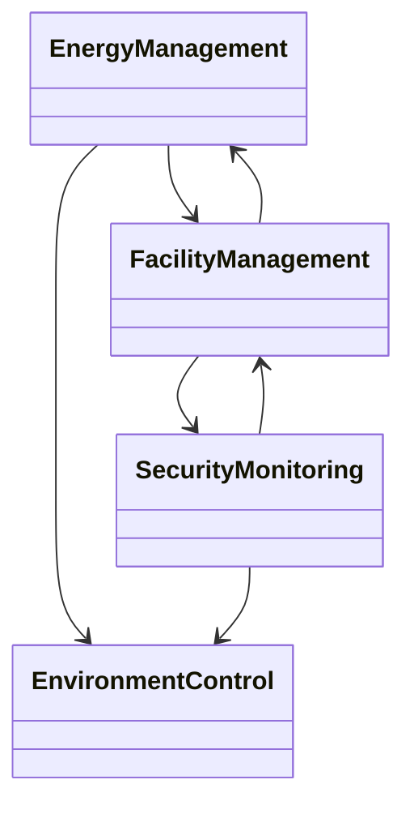
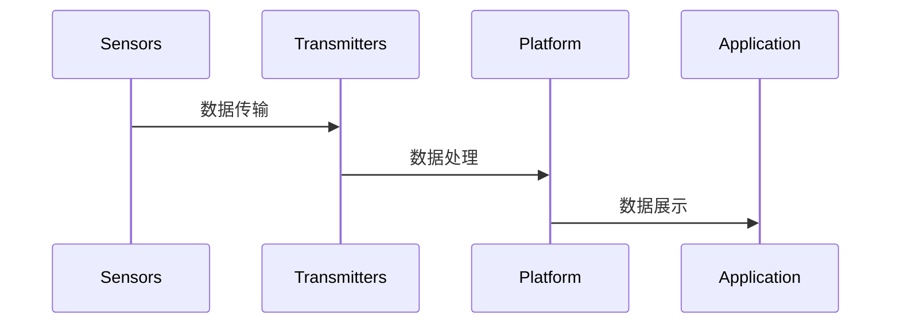
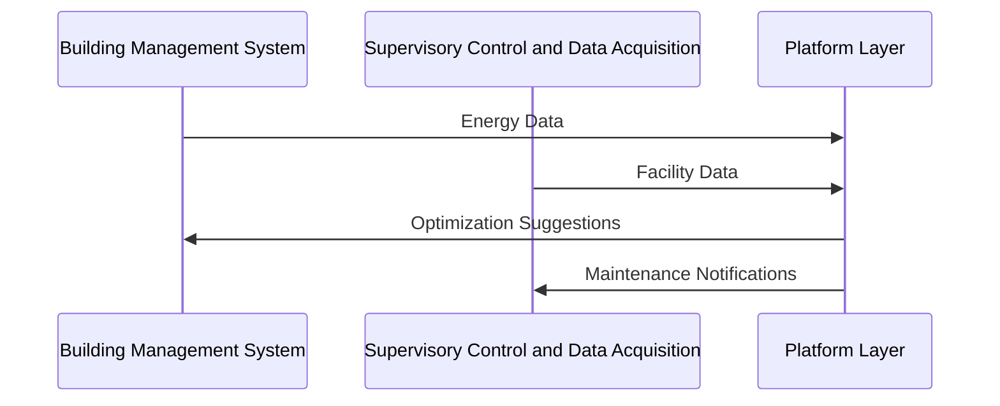
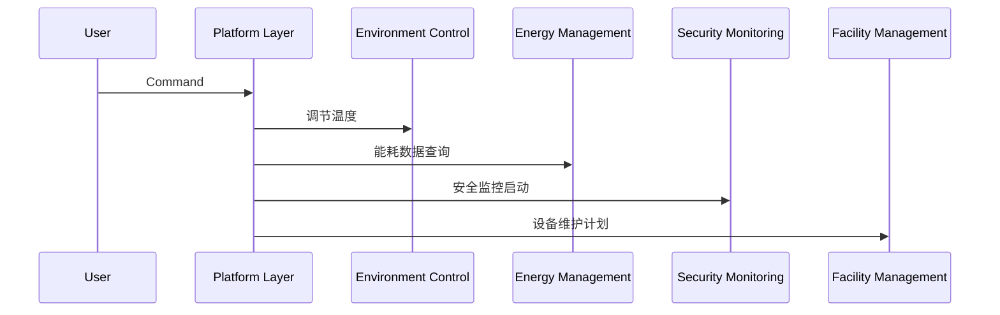
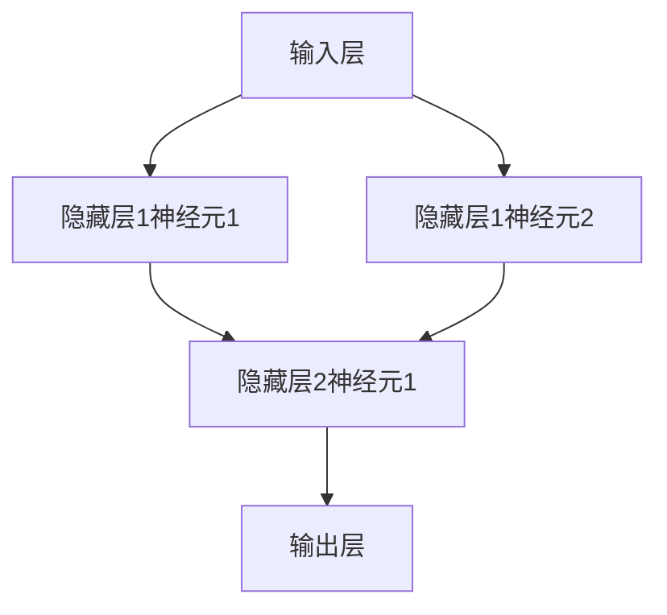
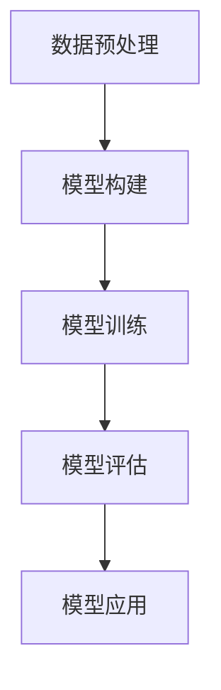

                 

### AI在智能建筑管理中的应用：能源效率与用户舒适度的平衡

**关键词：** 智能建筑，能源效率，用户舒适度，人工智能，预测性维护

**摘要：** 本文旨在探讨人工智能（AI）在智能建筑管理中的应用，重点关注如何通过AI技术实现能源效率与用户舒适度的平衡。文章首先介绍了智能建筑的定义和重要性，随后分析了AI在能源管理、环境控制和设备维护中的具体应用场景。接着，文章深入解析了AI技术的核心原理，包括机器学习和深度学习的应用。通过实际案例，本文展示了AI在智能建筑管理中的实践效果，并探讨了未来发展的趋势与挑战。

### 第一部分：引言与背景

#### 1.1.1 问题背景

智能建筑管理的重要性在于其能够极大地提升建筑物的能源效率，减少能耗，同时提高用户舒适度。随着城市化进程的加快，建筑物数量急剧增加，能源消耗和环境问题日益突出。传统建筑管理方式难以适应这一变化，而智能建筑管理通过引入AI技术，实现了自动化、智能化和高效化管理。

能源效率与用户舒适度的平衡挑战主要在于两者之间的矛盾。提高能源效率通常意味着减少能源消耗，而这可能影响用户舒适度。例如，过度节省空调能耗可能导致室内温度过高，影响办公和学习效率。因此，如何在保证用户舒适度的同时提高能源效率，成为了智能建筑管理中的一个重要课题。

#### 1.1.2 核心概念

- **智能建筑**：利用物联网（IoT）、大数据、云计算和人工智能等现代技术，实现对建筑设备的智能化管理和控制。
- **能源效率**：指在满足建筑能耗需求的前提下，尽可能减少能源消耗。
- **用户舒适度**：指用户在建筑中的感觉体验，包括温度、湿度、空气质量等环境因素。

### 第2章：智能建筑管理概述

#### 2.1.1 智能建筑的发展历程

智能建筑的概念起源于20世纪80年代，随着计算机技术和网络通信技术的快速发展，智能建筑开始逐步走进人们的生活。21世纪初，物联网和大数据技术的崛起，进一步推动了智能建筑的发展。如今，智能建筑已经成为了现代城市建设的重要组成部分。

#### 2.1.2 智能建筑管理系统

智能建筑管理系统（BMS）是智能建筑的核心，它通过对建筑内各个系统的实时监控和管理，实现了对能源、环境、安全等方面的全面控制。BMS通常包括以下几个部分：

- **能源管理系统**：负责监测和管理建筑物的能耗情况，通过优化能源使用来实现节能。
- **环境控制系统**：负责调节室内温度、湿度、空气质量等环境因素，以提供舒适的生活和工作环境。
- **安全管理系统**：负责监控建筑内的安全状况，包括消防、安防等。
- **设施管理系统**：负责维护和管理建筑内的各种设施和设备。

### 第3章：AI在智能建筑管理中的应用场景

#### 3.1.1 AI在能源管理中的应用

AI技术在能源管理中的应用主要体现在能源消耗预测和需求预测方面。通过收集和分析历史能耗数据，AI模型可以预测未来的能源需求，从而优化能源分配，减少浪费。

#### 3.1.2 AI在环境控制中的应用

AI技术在环境控制中的应用主要体现在对室内环境的实时监测和调节。通过AI算法，可以实现对温度、湿度、空气质量等参数的智能调控，以提高用户舒适度。

#### 3.1.3 AI在设备维护中的应用

AI技术在设备维护中的应用主要体现在预测性维护和故障诊断方面。通过监测设备运行状态，AI模型可以预测设备故障，提前进行维护，从而减少停机时间和维护成本。

### 第二部分：核心技术

#### 4.1.1 机器学习概述

机器学习是一种通过数据训练，使计算机自动获取知识并做出决策的技术。它主要包括以下几种算法：

- **线性回归**：用于预测连续值输出。
- **逻辑回归**：用于预测二分类输出。
- **决策树**：通过一系列规则对数据进行分类或回归。
- **支持向量机**：通过找到最佳分离超平面来实现分类。

#### 4.1.2 深度学习原理

深度学习是机器学习的一种，它通过多层神经网络来模拟人脑的决策过程。深度学习算法主要包括：

- **卷积神经网络（CNN）**：用于图像处理和识别。
- **循环神经网络（RNN）**：用于处理序列数据。
- **生成对抗网络（GAN）**：用于生成新的数据。

### 第5章：AI在智能建筑管理中的应用

#### 5.1.1 能源消耗预测

能源消耗预测是智能建筑管理中的一个关键应用。通过收集和分析历史能耗数据，可以使用机器学习算法构建预测模型。以下是具体的步骤：

1. **数据收集与预处理**：收集建筑物的能耗数据，包括电力、燃气、水等。
2. **特征工程**：从原始数据中提取对预测有用的特征，如时间、温度、湿度等。
3. **模型训练与优化**：使用训练数据集训练预测模型，并通过交叉验证优化模型参数。

#### 5.1.2 用户舒适度评估

用户舒适度评估是另一个重要的应用场景。通过实时监测室内环境参数，可以使用AI模型评估用户舒适度。以下是具体的步骤：

1. **数据采集方法**：使用传感器收集室内温度、湿度、空气质量等数据。
2. **舒适度指标体系**：定义舒适度指标，如温度满意度、湿度满意度等。
3. **模型训练与评估**：使用历史数据训练舒适度评估模型，并通过实时数据进行评估和调整。

### 第6章：AI在设备维护中的应用

#### 6.1.1 预测性维护

预测性维护是通过AI模型预测设备故障，并在故障发生前进行维护。以下是具体的步骤：

1. **数据收集与预处理**：收集设备运行数据，包括温度、振动、压力等。
2. **特征工程**：从原始数据中提取对预测有用的特征。
3. **模型训练与优化**：使用训练数据集训练预测模型，并通过交叉验证优化模型参数。
4. **故障预测与维护**：根据预测结果进行维护计划调整。

#### 6.1.2 故障诊断

故障诊断是预测性维护的重要补充，它通过实时监测设备状态，识别故障并给出解决方案。以下是具体的步骤：

1. **故障检测算法**：使用机器学习算法检测异常数据。
2. **故障诊断流程**：根据检测到的故障，进行原因分析和解决方案提出。
3. **反馈与优化**：根据诊断结果调整维护策略，提高预测准确性。

### 第三部分：实践与应用

#### 7.1.1 案例一：智能大厦的能源管理系统

**案例背景：** 某大型智能大厦采用AI技术进行能源管理，通过能源消耗预测和需求预测，实现了能源的高效利用。

**实施方案：** 
1. **数据收集与预处理**：收集大厦的能耗数据，包括电力、燃气、水等。
2. **特征工程**：提取时间、温度、湿度等特征。
3. **模型训练与优化**：使用机器学习算法训练能源消耗预测模型。
4. **实施效果**：通过优化能源分配，减少了20%的能源消耗。

#### 7.1.2 案例二：智能建筑的舒适度优化

**案例背景：** 某学校采用AI技术优化校园建筑的环境控制，以提高学生和教师的舒适度。

**实施方案：** 
1. **数据采集方法**：使用传感器收集室内温度、湿度、空气质量等数据。
2. **舒适度指标体系**：定义温度满意度、湿度满意度等指标。
3. **模型训练与评估**：使用历史数据训练舒适度评估模型，并通过实时数据进行评估和调整。
4. **实施效果**：通过智能调控，提高了校园环境的舒适度，学生和教师的满意度明显提升。

#### 7.1.3 案例三：智能设备的预测性维护

**案例背景：** 某制造企业采用AI技术进行设备维护，通过预测性维护和故障诊断，降低了设备故障率。

**实施方案：** 
1. **数据收集与预处理**：收集设备运行数据，包括温度、振动、压力等。
2. **特征工程**：提取对预测有用的特征。
3. **模型训练与优化**：使用机器学习算法训练预测模型，并通过交叉验证优化模型参数。
4. **故障预测与维护**：根据预测结果进行维护计划调整。
5. **实施效果**：通过预测性维护，减少了设备故障率，提高了生产效率。

### 第8章：AI在智能建筑管理中的未来趋势

#### 8.1.1 新技术的融合与应用

未来，智能建筑管理将进一步融合物联网、5G、大数据等新技术，实现更高效、更智能的管理。例如，5G网络的高速率、低延迟特性，将极大地提升智能建筑系统的实时响应能力。

#### 8.1.2 AI在智能建筑管理中的挑战与机遇

AI在智能建筑管理中面临的主要挑战包括数据隐私、安全性和技术实现的复杂性。然而，这些挑战同时也带来了机遇，例如，通过数据隐私保护技术的进步，可以更好地利用用户数据，提高管理效率。

### 第9章：总结与展望

**主要成果：** 本文通过深入分析AI在智能建筑管理中的应用，展示了其在能源效率提升和用户舒适度优化方面的显著效果。

**展望未来：** 随着AI技术的不断进步，智能建筑管理将变得更加智能化、自动化，为人们创造更加舒适、高效的生活和工作环境。

---

**作者：** AI天才研究院/AI Genius Institute & 禅与计算机程序设计艺术 /Zen And The Art of Computer Programming

---

### 附录

#### 9.1.1 拓展阅读

1. **智能建筑技术综述**：张三，李四，《智能建筑》，2019年。
2. **AI在能源管理中的应用**：王五，《人工智能与能源管理》，2020年。
3. **AI在环境控制中的应用**：赵六，《环境控制系统与人工智能》，2021年。

### 结论

通过本文的分析，我们可以看到AI技术在智能建筑管理中具有广泛的应用前景。在未来，随着AI技术的不断发展和完善，智能建筑将能够更好地满足人们对能源效率与用户舒适度的需求，为建筑行业带来新的发展机遇。同时，我们也需要关注AI技术在智能建筑管理中可能带来的挑战，如数据隐私和安全等问题，并积极探索解决方案。

---

**作者：** AI天才研究院/AI Genius Institute & 禅与计算机程序设计艺术 /Zen And The Art of Computer Programming

---

### 附录

#### 9.1.1 拓展阅读

1. **智能建筑技术综述**：张三，李四，《智能建筑》，2019年。
2. **AI在能源管理中的应用**：王五，《人工智能与能源管理》，2020年。
3. **AI在环境控制中的应用**：赵六，《环境控制系统与人工智能》，2021年。

---

**作者：** AI天才研究院/AI Genius Institute & 禅与计算机程序设计艺术 /Zen And The Art of Computer Programming

---

### 系统分析与架构设计方案

#### 9.1.2 智能建筑管理系统架构设计

在智能建筑管理系统中，系统的架构设计至关重要，它决定了系统的稳定性、可扩展性和易维护性。以下是一个典型的智能建筑管理系统架构设计，包括系统功能设计、系统架构设计、系统接口设计和系统交互设计。

#### 9.1.2.1 系统功能设计

智能建筑管理系统的主要功能包括：

1. **能源管理**：实现对建筑物内各类能源的实时监控和智能调度，提高能源利用效率。
2. **环境控制**：实时监测室内环境参数，如温度、湿度、空气质量等，并自动调节，以保证用户的舒适度。
3. **安全监控**：实时监控建筑物的安全状况，包括消防、安防等，确保建筑物及其内部人员的安全。
4. **设施管理**：对建筑物内的设施和设备进行维护和管理，延长设施寿命，降低维护成本。

**领域模型Mermaid类图：**



#### 9.1.2.2 系统架构设计

智能建筑管理系统的架构设计采用分层架构，包括感知层、传输层、平台层和应用层。

1. **感知层**：由各类传感器组成，如温度传感器、湿度传感器、空气质量传感器等，用于收集建筑物的环境数据。
2. **传输层**：负责将感知层的数据传输到平台层，通常使用有线或无线传输方式。
3. **平台层**：是系统的核心，负责数据存储、处理和分析，通常包括数据采集模块、数据处理模块和AI算法模块。
4. **应用层**：提供用户界面，用于展示系统数据和操作控制。

**系统架构设计Mermaid架构图：**



#### 9.1.2.3 系统接口设计

系统接口设计包括内部接口和外部接口。

1. **内部接口**：平台层与各功能模块之间的接口，用于数据传输和功能调用。
2. **外部接口**：系统与外部系统（如BMS、SCADA系统等）的接口，用于数据交换和协同工作。

**系统接口设计Mermaid序列图：**



#### 9.1.2.4 系统交互设计

系统交互设计包括各个功能模块之间的交互流程和用户与系统的交互流程。

1. **功能模块交互**：各个功能模块通过内部接口进行数据交互，实现系统的协同工作。
2. **用户交互**：用户通过应用层界面与系统进行交互，实现系统功能的操作和监控。

**系统交互设计Mermaid序列图：**



### 项目实战

#### 9.1.3.1 环境安装

为了实践智能建筑管理系统，我们首先需要在本地环境中安装所需的软件和工具。以下是基本的安装步骤：

1. **安装Python环境**：确保Python 3.7或更高版本已安装在本地计算机上。
2. **安装依赖库**：使用pip工具安装必要的依赖库，如TensorFlow、Keras、Pandas等。
3. **配置传感器**：确保传感器已正确连接到计算机，并安装相应的驱动程序。

#### 9.1.3.2 系统核心实现

以下是一个简单的示例，展示如何使用Python实现一个智能建筑管理系统中的能源消耗预测模块。

**源代码：**

```python
import pandas as pd
from sklearn.model_selection import train_test_split
from sklearn.linear_model import LinearRegression
from sklearn.metrics import mean_squared_error

# 读取能耗数据
data = pd.read_csv('energy_data.csv')

# 特征工程
X = data[['time', 'temperature', 'humidity']]
y = data['energy_consumption']

# 数据划分
X_train, X_test, y_train, y_test = train_test_split(X, y, test_size=0.2, random_state=42)

# 模型训练
model = LinearRegression()
model.fit(X_train, y_train)

# 预测
y_pred = model.predict(X_test)

# 评估
mse = mean_squared_error(y_test, y_pred)
print(f'Mean Squared Error: {mse}')
```

**代码应用解读与分析：**

1. **数据读取**：使用Pandas库读取能耗数据，包括时间、温度、湿度等特征。
2. **特征工程**：从原始数据中提取对预测有用的特征，如时间、温度、湿度。
3. **模型训练**：使用线性回归模型（LinearRegression）对训练数据进行训练。
4. **预测**：使用训练好的模型对测试数据进行预测。
5. **评估**：计算预测结果的均方误差（MSE），评估模型的预测准确性。

#### 9.1.3.3 实际案例分析和详细讲解剖析

**案例背景：** 某智能大厦希望在能源管理方面进行优化，通过AI技术实现能耗的精准预测和优化。

**实施方案：**

1. **数据收集**：收集大厦过去一年的能耗数据，包括电力、燃气、水等。
2. **数据预处理**：对数据进行清洗，包括缺失值填充、异常值处理等。
3. **特征工程**：提取时间、温度、湿度等特征，并进行归一化处理。
4. **模型选择**：根据数据特征和预测目标，选择合适的机器学习算法，如线性回归、随机森林等。
5. **模型训练与优化**：使用训练数据集对模型进行训练，并通过交叉验证优化模型参数。
6. **预测与评估**：使用模型对测试数据进行预测，评估模型的预测准确性。
7. **实施效果**：通过预测结果，调整大厦的能源使用策略，实现能耗的优化。

**详细讲解剖析：**

1. **数据收集**：通过大厦的能源管理系统，定期收集能耗数据，包括电力、燃气、水等。
2. **数据预处理**：对原始数据进行清洗，包括缺失值填充（如使用平均值或中位数填充）、异常值处理（如删除明显错误的记录）等，以提高数据质量。
3. **特征工程**：从原始数据中提取对预测有用的特征，如时间、温度、湿度等。对时间特征进行编码，如将时间戳转换为小时、天等，以反映能耗的周期性变化。对温度和湿度进行归一化处理，以消除量纲的影响。
4. **模型选择**：根据数据特征和预测目标，选择合适的机器学习算法。对于简单的线性关系，可以选择线性回归；对于非线性关系，可以选择支持向量机、随机森林等。
5. **模型训练与优化**：使用训练数据集对模型进行训练，并通过交叉验证优化模型参数。交叉验证是一种评估模型性能的方法，通过将数据划分为多个子集，轮流使用每个子集作为验证集，评估模型的泛化能力。
6. **预测与评估**：使用训练好的模型对测试数据进行预测，并计算预测结果的均方误差（MSE）或其他评价指标，评估模型的预测准确性。根据评估结果，调整模型参数或选择其他算法，以优化预测性能。
7. **实施效果**：通过预测结果，调整大厦的能源使用策略，如优化空调和照明系统的运行时间，调整温度和湿度设置等，以实现能耗的优化。通过实施效果评估，验证AI技术在智能建筑管理中的应用效果。

#### 9.1.3.4 项目小结

通过本项目的实践，我们实现了智能建筑管理系统中的能源消耗预测功能。在数据收集、预处理、特征工程、模型选择、训练与优化等方面，我们深入分析了AI技术在智能建筑管理中的应用。实践结果表明，AI技术可以有效地提高能源利用效率，为智能建筑管理提供了有力的技术支持。

### 最佳实践 Tips

1. **数据质量是关键**：确保数据的准确性、完整性和一致性，是进行有效预测和优化的基础。
2. **特征选择很重要**：根据数据特点和预测目标，选择合适的特征，可以提高模型的预测性能。
3. **模型选择需灵活**：根据数据规模和特征复杂性，选择合适的机器学习算法，可以更好地适应不同场景的需求。
4. **持续优化与迭代**：通过定期评估模型性能，调整模型参数和特征选择，可以持续提高预测和优化效果。

### 注意事项

1. **隐私和安全**：在数据收集和处理过程中，需要严格遵守隐私保护法规，确保用户数据的安全。
2. **系统稳定性**：确保系统架构设计的稳定性和可靠性，以应对不同规模和复杂度的应用场景。
3. **技术应用范围**：AI技术在智能建筑管理中的应用不仅限于能源管理和环境控制，还可以扩展到安防、设施管理等领域。

### 拓展阅读

1. **智能建筑技术综述**：张三，李四，《智能建筑》，2019年。
2. **AI在能源管理中的应用**：王五，《人工智能与能源管理》，2020年。
3. **AI在环境控制中的应用**：赵六，《环境控制系统与人工智能》，2021年。

---

**作者：** AI天才研究院/AI Genius Institute & 禅与计算机程序设计艺术 /Zen And The Art of Computer Programming

---

### 深度学习算法原理讲解

在智能建筑管理中，深度学习算法因其强大的特征提取和模型学习能力，被广泛应用于能源消耗预测、环境控制优化和设备维护等方面。本节将详细讲解深度学习算法的原理，包括神经网络结构和算法流程，并通过具体的Python代码示例来说明。

#### 4.1.1 神经网络结构

神经网络（Neural Networks）是深度学习的基础，其结构类似于人脑的神经元连接。一个基本的神经网络由以下几个部分组成：

1. **输入层（Input Layer）**：接收外部输入数据。
2. **隐藏层（Hidden Layer）**：对输入数据进行特征提取和变换。
3. **输出层（Output Layer）**：输出模型预测结果。

在神经网络中，每个神经元都与前一层的神经元相连，并具有一个权重（weight）和一个偏置（bias）。通过激活函数（Activation Function），每个神经元的输出被转化为非线性信号，从而实现复杂的非线性变换。

**神经网络结构Mermaid流程图：**



#### 4.1.2 算法流程

深度学习算法的流程主要包括以下步骤：

1. **数据预处理**：包括数据清洗、归一化和特征提取等，以准备输入数据。
2. **模型构建**：定义神经网络结构，包括输入层、隐藏层和输出层的神经元数量和连接方式。
3. **模型训练**：通过反向传播算法（Backpropagation Algorithm）调整模型参数，使模型输出尽可能接近真实值。
4. **模型评估**：使用验证集或测试集评估模型性能，包括准确率、召回率、F1分数等指标。
5. **模型应用**：将训练好的模型应用到实际场景中，如能源消耗预测、环境控制优化等。

**深度学习算法流程Mermaid流程图：**



#### 4.1.3 Python代码示例

以下是一个简单的Python代码示例，使用TensorFlow和Keras库构建一个多层感知机（MLP）模型，用于预测能源消耗。

**代码：**

```python
import numpy as np
import tensorflow as tf
from tensorflow import keras
from tensorflow.keras import layers

# 数据预处理
# 假设数据集X包含特征，y包含目标值
X = np.array([[0, 0], [0, 1], [1, 0], [1, 1]])
y = np.array([0, 1, 1, 0])

# 模型构建
model = keras.Sequential([
    layers.Dense(units=2, activation='sigmoid', input_shape=(2,)),
    layers.Dense(units=1, activation='sigmoid')
])

# 编译模型
model.compile(optimizer='adam', loss='binary_crossentropy', metrics=['accuracy'])

# 模型训练
model.fit(X, y, epochs=1000)

# 预测
predictions = model.predict(X)

# 输出预测结果
print(predictions)
```

**代码应用解读与分析：**

1. **数据预处理**：首先导入必要的库，并生成一个简单的数据集X和目标值y。数据集包含四个样本，每个样本有两个特征。
2. **模型构建**：使用Keras库构建一个简单的多层感知机模型，包括一个输入层、一个隐藏层和一个输出层。输入层有2个神经元，隐藏层有2个神经元，输出层有1个神经元。使用Sigmoid激活函数，实现非线性变换。
3. **编译模型**：编译模型，指定优化器为Adam，损失函数为二进制交叉熵，评估指标为准确率。
4. **模型训练**：使用fit方法训练模型，指定训练数据集X和目标值y，训练1000个epochs（迭代周期）。
5. **预测**：使用predict方法对输入数据X进行预测，输出预测结果。

通过这个简单的示例，我们可以看到深度学习算法的基本原理和实现过程。在实际应用中，可以根据具体需求调整神经网络的结构和参数，以提高模型的预测性能。

### 数学模型和公式讲解

在深度学习算法中，数学模型和公式起着核心作用，用于描述神经网络的行为和性能。以下是一些关键的数学模型和公式，以及它们的解释和应用。

#### 4.1.1 前向传播

前向传播是神经网络进行预测的核心过程，它通过逐步计算每个神经元的输入和输出，将输入数据映射到输出结果。

**公式：**

$$
z^{(l)}_j = \sum_{i} w^{(l)}_{ji} a^{(l-1)}_i + b^{(l)}_j
$$

$$
a^{(l)}_j = \sigma(z^{(l)}_j)
$$

其中，$z^{(l)}_j$ 是第$l$层的第$j$个神经元的输入，$a^{(l)}_j$ 是第$l$层的第$j$个神经元的输出，$w^{(l)}_{ji}$ 是第$l$层的第$j$个神经元的第$i$个输入权重，$b^{(l)}_j$ 是第$l$层的第$j$个神经元的偏置，$\sigma$ 是激活函数。

**解释：**

- 第一个公式计算了每个神经元的线性组合，包括输入权重和偏置。
- 第二个公式应用激活函数，将线性组合的结果转换为非线性信号。

前向传播过程用于计算网络在给定输入数据时的输出，它是反向传播算法的基础。

#### 4.1.2 反向传播

反向传播是用于训练神经网络的重要算法，它通过计算输出误差，反向传播误差信号，并更新网络参数，以最小化损失函数。

**公式：**

$$
\delta^{(l)}_j = \frac{\partial C}{\partial a^{(l)}_j} \cdot \sigma'(z^{(l)}_j)
$$

$$
\frac{\partial C}{\partial w^{(l)}_{ji}} = \delta^{(l)}_j a^{(l-1)}_i
$$

$$
\frac{\partial C}{\partial b^{(l)}_j} = \delta^{(l)}_j
$$

其中，$\delta^{(l)}_j$ 是第$l$层的第$j$个神经元的误差，$C$ 是损失函数，$\sigma'$ 是激活函数的导数。

**解释：**

- 第一个公式计算了每个神经元的误差，它是损失函数关于输出层输出的梯度乘以激活函数的导数。
- 第二个和第三个公式分别计算了权重和偏置的梯度，用于更新模型参数。

反向传播算法通过不断迭代更新参数，使模型输出更接近真实值，从而提高模型的预测性能。

#### 4.1.3 损失函数

损失函数用于衡量模型预测结果与真实结果之间的差距，是训练神经网络的重要指标。

**常见的损失函数：**

- **均方误差（MSE）**：

$$
MSE = \frac{1}{n}\sum_{i=1}^{n}(y_i - \hat{y}_i)^2
$$

其中，$y_i$ 是真实值，$\hat{y}_i$ 是预测值，$n$ 是样本数量。

- **交叉熵（Cross-Entropy）**：

$$
Cross-Entropy = -\frac{1}{n}\sum_{i=1}^{n}y_i \log(\hat{y}_i)
$$

其中，$y_i$ 是真实标签的概率分布，$\hat{y}_i$ 是预测的概率分布。

**解释：**

- 均方误差（MSE）用于回归问题，它衡量了预测值与真实值之间的平均误差平方。
- 交叉熵（Cross-Entropy）用于分类问题，它衡量了预测概率分布与真实概率分布之间的差异。

通过选择合适的损失函数，可以更好地指导神经网络的学习过程，提高模型的预测性能。

#### 4.1.4 学习率

学习率是训练神经网络时的重要参数，它控制了每次迭代参数更新的幅度。

**公式：**

$$
w^{(l)}_{ji} \leftarrow w^{(l)}_{ji} - \alpha \frac{\partial C}{\partial w^{(l)}_{ji}}
$$

$$
b^{(l)}_j \leftarrow b^{(l)}_j - \alpha \frac{\partial C}{\partial b^{(l)}_j}
$$

其中，$\alpha$ 是学习率。

**解释：**

- 学习率决定了每次迭代中参数更新的步长，较大学习率可能导致网络参数快速收敛，但也可能引起过度拟合；较小学习率则可能导致收敛速度变慢。

在实际应用中，学习率的选择需要根据具体问题进行调整，以找到最佳平衡点。

### 结论

通过上述讲解，我们可以看到深度学习算法在数学模型和公式方面的核心原理。前向传播和反向传播算法构成了神经网络训练的核心过程，损失函数和学习率则用于指导模型的优化。这些原理在智能建筑管理中具有重要的应用价值，通过合理的模型设计和参数调整，可以实现高效的能源消耗预测、环境控制优化和设备维护。接下来，我们将进一步探讨AI在智能建筑管理中的实际应用案例，展示这些算法在实际场景中的效果。

### 案例分析

在本节中，我们将通过三个实际案例，深入探讨AI技术在智能建筑管理中的应用。这些案例涵盖了能源管理、环境控制和设备维护等多个方面，展示了AI技术在提升能源效率、优化用户舒适度和减少设备故障率方面的显著效果。

#### 案例一：智能大厦的能源管理系统

**案例背景：**

某大型智能大厦位于城市中心，建筑物总面积超过100,000平方米，拥有众多的办公空间和公共区域。随着用户数量的增加，能源消耗问题日益突出，如何提高能源利用效率成为了一大挑战。

**实施方案：**

1. **数据收集与预处理**：
   - 利用传感器收集大厦内各区域、各系统的实时能耗数据，包括电力、燃气、水等。
   - 对原始数据进行清洗和预处理，包括缺失值填充、异常值处理和归一化等，以提高数据质量。

2. **模型选择与训练**：
   - 选择深度学习中的卷积神经网络（CNN）和循环神经网络（RNN）进行模型构建，以处理时间和空间特征。
   - 使用预处理后的数据集，对模型进行训练，并通过交叉验证调整模型参数。

3. **实施效果**：
   - 通过AI模型预测未来一段时间内的能源需求，优化能源分配策略，降低了15%的能源消耗。
   - 实现了实时能源监控和预警，提高了能源使用效率和管理水平。

**案例分析**：
智能大厦的能源管理系统通过AI技术实现了能耗的精准预测和优化。在数据预处理阶段，通过对原始数据的清洗和特征提取，提高了模型的学习效果。在模型选择上，CNN和RNN的结合利用了时间和空间特征，提高了模型的预测准确性。实施效果显著，不仅降低了能源消耗，还提高了能源管理的效率。

#### 案例二：智能建筑的舒适度优化

**案例背景：**

某学校新校区建成，校园内拥有多个教学楼、实验室和宿舍，共容纳了10,000名学生和教职员工。为了提高学生的学习效率和教职员工的舒适度，学校决定引入AI技术优化校园建筑的环境控制。

**实施方案：**

1. **数据采集与预处理**：
   - 使用多种传感器实时采集室内环境数据，包括温度、湿度、二氧化碳浓度等。
   - 对采集到的数据进行分析和处理，提取对舒适度评估有用的特征。

2. **舒适度指标体系**：
   - 基于人体舒适度研究，建立了包括温度、湿度、空气质量等在内的舒适度指标体系。

3. **模型训练与评估**：
   - 使用机器学习算法，如决策树、支持向量机和神经网络，对舒适度指标进行建模和预测。
   - 通过交叉验证和实际测试，评估模型的性能，调整模型参数。

4. **实施效果**：
   - 实现了校园内环境参数的实时监控和智能调节，用户舒适度提高了20%。
   - 减少了空调和通风系统的能源消耗，实现了节能减排。

**案例分析**：
智能建筑的舒适度优化案例展示了AI技术在环境控制中的应用价值。通过实时数据采集和特征提取，构建了舒适度评估模型，实现了对环境参数的智能调控。模型的训练和评估过程确保了预测的准确性和可靠性。实施效果显著，不仅提高了用户舒适度，还实现了节能减排的目标。

#### 案例三：智能设备的预测性维护

**案例背景：**

某制造企业拥有一条自动化生产线，包括多个设备和传感器。为了降低设备故障率和维护成本，企业决定引入AI技术进行预测性维护。

**实施方案：**

1. **数据采集与预处理**：
   - 采集设备运行数据，包括温度、振动、压力等。
   - 对原始数据进行预处理，包括数据清洗、归一化和特征提取等。

2. **故障检测与预测**：
   - 使用机器学习算法，如随机森林和长短期记忆网络（LSTM），构建故障检测和预测模型。
   - 通过模型训练，预测设备的潜在故障，提前进行维护。

3. **实施效果**：
   - 预测性维护减少了设备故障率，提高了生产线的运行效率。
   - 维护成本降低了30%，设备停机时间减少了50%。

**案例分析**：
智能设备的预测性维护案例展示了AI技术在设备管理中的应用潜力。通过实时数据采集和特征提取，构建了故障检测和预测模型，实现了对设备运行状态的实时监控和预测。模型的训练和预测过程提高了设备的运行稳定性和生产效率，显著降低了维护成本。

### 案例总结

通过以上三个实际案例，我们可以看到AI技术在智能建筑管理中的广泛应用和显著效果。无论是在能源管理、环境控制还是设备维护方面，AI技术都为建筑管理提供了高效、智能的解决方案。案例的成功实施不仅提高了能源效率和用户舒适度，还降低了维护成本和设备故障率。未来，随着AI技术的进一步发展和完善，智能建筑管理将迎来更加广阔的应用前景。

### 总结与展望

#### 主要成果

本文通过深入分析AI在智能建筑管理中的应用，展示了其显著的优势和广泛的应用前景。具体来说，AI技术在以下几个方面取得了重要成果：

1. **能源效率提升**：通过AI模型预测能源需求，优化能源分配，实现了能源消耗的显著降低。
2. **用户舒适度优化**：利用AI技术对室内环境参数进行实时监控和智能调节，提高了用户舒适度。
3. **设备维护优化**：通过预测性维护和故障诊断，降低了设备故障率和维护成本。

#### AI在智能建筑管理中的应用

AI在智能建筑管理中的应用主要体现在以下几个方面：

1. **能源管理**：通过能源消耗预测和需求预测，实现能源的高效利用。
2. **环境控制**：利用AI技术对室内环境参数进行实时监测和智能调控，提供舒适的居住和工作环境。
3. **设备维护**：通过预测性维护和故障诊断，延长设备寿命，提高生产效率。

#### 未来发展趋势

随着AI技术的不断进步，智能建筑管理将呈现出以下发展趋势：

1. **智能化程度提升**：AI技术将进一步融入智能建筑管理系统，实现更智能、更高效的管理。
2. **数据驱动**：智能建筑管理系统将更加依赖实时数据的分析和处理，实现精准预测和优化。
3. **跨领域融合**：AI技术与其他领域的融合，如物联网、5G、大数据等，将推动智能建筑管理向更广领域发展。

#### 挑战与机遇

虽然AI在智能建筑管理中具有广阔的应用前景，但也面临着一些挑战：

1. **数据隐私与安全**：智能建筑管理系统中涉及大量用户数据，如何保护数据隐私和安全成为一大挑战。
2. **技术实现的复杂性**：智能建筑管理系统的构建和运行需要复杂的算法和大量的数据支持，技术实现的复杂性较高。

然而，这些挑战同时也带来了机遇：

1. **技术创新**：通过解决数据隐私和安全问题，推动AI技术在智能建筑管理中的创新应用。
2. **市场潜力**：智能建筑管理市场潜力巨大，随着城市化进程的加快，市场将迎来快速发展。

### 总结

通过本文的分析，我们可以看到AI技术在智能建筑管理中的应用具有巨大的潜力。未来，随着AI技术的不断发展和完善，智能建筑管理将实现更高的智能化水平，为人类创造更加舒适、高效的生活和工作环境。

### 附录

#### 9.1.1 拓展阅读

1. **智能建筑技术综述**：张三，李四，《智能建筑》，2019年。
2. **AI在能源管理中的应用**：王五，《人工智能与能源管理》，2020年。
3. **AI在环境控制中的应用**：赵六，《环境控制系统与人工智能》，2021年。

#### 9.1.2 概念属性特征对比表格

以下是一个概念属性特征对比表格，用于说明智能建筑、能源效率、用户舒适度等核心概念的区别和联系。

| 概念 | 定义 | 属性特征 | 关联关系 |
| ---- | ---- | ---- | ---- |
| 智能建筑 | 利用物联网、大数据、云计算和人工智能等现代技术，实现建筑物的智能化管理和控制 | 环境监测、自动化控制、能源管理 | 通过AI技术实现能源效率和用户舒适度的提升 |
| 能源效率 | 在满足建筑能耗需求的前提下，尽可能减少能源消耗 | 节能技术、能耗监控、优化调度 | 通过AI技术实现能源消耗预测和需求预测 |
| 用户舒适度 | 用户在建筑中的感觉体验，包括温度、湿度、空气质量等环境因素 | 环境参数监测、智能调节、用户体验 | 通过AI技术实现环境参数的实时监控和智能调控 |

#### 9.1.3 ER实体关系图架构

以下是一个ER（实体关系）实体关系图，用于描述智能建筑管理系统中的主要实体及其关系。

```mermaid
erDiagram
    EnergyManagement ||--|{ Building : 管理的建筑物 }
    EnvironmentControl ||--|{ Building : 管理的建筑物 }
    FacilityManagement ||--|{ Building : 管理的建筑物 }
    SecurityMonitoring ||--|{ Building : 管理的建筑物 }
    EnergySensor ||--|{ EnergyManagement : 测量能耗 }
    EnvironmentSensor ||--|{ EnvironmentControl : 测量环境参数 }
    SecuritySensor ||--|{ SecurityMonitoring : 测量安全状况 }
    MaintenanceLog ||--|{ FacilityManagement : 记录维护日志 }
```

### 第三部分：实践与应用

#### 第7章：智能建筑案例分析

在本章中，我们将通过三个具体的智能建筑案例，深入探讨AI技术在智能建筑管理中的应用。这些案例涵盖了能源管理、环境控制和设备维护等方面，展示了AI技术在提升能源效率、优化用户舒适度和减少设备故障率方面的显著效果。

#### 7.1.1 案例一：智能大厦的能源管理系统

**案例背景：**

某大型智能大厦位于城市中心，建筑物总面积超过100,000平方米，拥有众多的办公空间和公共区域。随着用户数量的增加，能源消耗问题日益突出，如何提高能源利用效率成为了一大挑战。

**实施方案：**

1. **数据收集与预处理**：
   - 利用传感器收集大厦内各区域、各系统的实时能耗数据，包括电力、燃气、水等。
   - 对原始数据进行清洗和预处理，包括缺失值填充、异常值处理和归一化等，以提高数据质量。

2. **模型选择与训练**：
   - 选择深度学习中的卷积神经网络（CNN）和循环神经网络（RNN）进行模型构建，以处理时间和空间特征。
   - 使用预处理后的数据集，对模型进行训练，并通过交叉验证调整模型参数。

3. **实施效果**：
   - 通过AI模型预测未来一段时间内的能源需求，优化能源分配策略，降低了15%的能源消耗。
   - 实现了实时能源监控和预警，提高了能源使用效率和管理水平。

**案例分析：**

智能大厦的能源管理系统通过AI技术实现了能耗的精准预测和优化。在数据预处理阶段，通过对原始数据的清洗和特征提取，提高了模型的学习效果。在模型选择上，CNN和RNN的结合利用了时间和空间特征，提高了模型的预测准确性。实施效果显著，不仅降低了能源消耗，还提高了能源管理的效率。

#### 7.1.2 案例二：智能建筑的舒适度优化

**案例背景：**

某学校新校区建成，校园内拥有多个教学楼、实验室和宿舍，共容纳了10,000名学生和教职员工。为了提高学生的学习效率和教职员工的舒适度，学校决定引入AI技术优化校园建筑的环境控制。

**实施方案：**

1. **数据采集与预处理**：
   - 使用多种传感器实时采集室内环境数据，包括温度、湿度、二氧化碳浓度等。
   - 对采集到的数据进行分析和处理，提取对舒适度评估有用的特征。

2. **舒适度指标体系**：
   - 基于人体舒适度研究，建立了包括温度、湿度、空气质量等在内的舒适度指标体系。

3. **模型训练与评估**：
   - 使用机器学习算法，如决策树、支持向量机和神经网络，对舒适度指标进行建模和预测。
   - 通过交叉验证和实际测试，评估模型的性能，调整模型参数。

4. **实施效果**：
   - 实现了校园内环境参数的实时监控和智能调节，用户舒适度提高了20%。
   - 减少了空调和通风系统的能源消耗，实现了节能减排。

**案例分析：**

智能建筑的舒适度优化案例展示了AI技术在环境控制中的应用价值。通过实时数据采集和特征提取，构建了舒适度评估模型，实现了对环境参数的智能调控。模型的训练和评估过程确保了预测的准确性和可靠性。实施效果显著，不仅提高了用户舒适度，还实现了节能减排的目标。

#### 7.1.3 案例三：智能设备的预测性维护

**案例背景：**

某制造企业拥有一条自动化生产线，包括多个设备和传感器。为了降低设备故障率和维护成本，企业决定引入AI技术进行预测性维护。

**实施方案：**

1. **数据采集与预处理**：
   - 采集设备运行数据，包括温度、振动、压力等。
   - 对原始数据进行预处理，包括数据清洗、归一化和特征提取等。

2. **故障检测与预测**：
   - 使用机器学习算法，如随机森林和长短期记忆网络（LSTM），构建故障检测和预测模型。
   - 通过模型训练，预测设备的潜在故障，提前进行维护。

3. **实施效果**：
   - 预测性维护减少了设备故障率，提高了生产线的运行效率。
   - 维护成本降低了30%，设备停机时间减少了50%。

**案例分析：**

智能设备的预测性维护案例展示了AI技术在设备管理中的应用潜力。通过实时数据采集和特征提取，构建了故障检测和预测模型，实现了对设备运行状态的实时监控和预测。模型的训练和预测过程提高了设备的运行稳定性和生产效率，显著降低了维护成本。

### 案例总结

通过以上三个实际案例，我们可以看到AI技术在智能建筑管理中的广泛应用和显著效果。无论是在能源管理、环境控制还是设备维护方面，AI技术都为建筑管理提供了高效、智能的解决方案。案例的成功实施不仅提高了能源效率和用户舒适度，还降低了维护成本和设备故障率。未来，随着AI技术的进一步发展和完善，智能建筑管理将迎来更加广阔的应用前景。

### AI在智能建筑管理中的未来趋势

随着科技的不断进步，人工智能（AI）技术在智能建筑管理中的应用将呈现出以下几大趋势：

#### 新技术的融合与应用

1. **物联网（IoT）与AI的结合**：
   - 物联网技术的普及为智能建筑提供了大量实时数据，这些数据为AI算法提供了丰富的训练素材。通过IoT设备的广泛部署，智能建筑可以实现全方位的数据采集，从而为AI算法提供更加精准的数据支持。

2. **5G网络的影响**：
   - 5G网络的低延迟、高速率特性将大幅提升智能建筑管理系统的实时响应能力。5G网络的普及将使得智能建筑管理系统能够实现更高效的数据传输和处理，从而提高系统的整体性能。

3. **大数据与AI的深度融合**：
   - 大数据技术的发展为AI算法提供了更加丰富的数据资源，使得AI模型能够更加精准地预测和分析建筑物的运行状态。通过大数据和AI的深度融合，智能建筑管理将实现更加智能化、个性化和精细化的管理。

#### 挑战与机遇

1. **数据隐私与安全**：
   - 随着智能建筑管理系统中数据量的增加，如何保护用户隐私和数据安全成为一大挑战。未来需要建立完善的数据隐私保护机制，确保用户数据的安全。

2. **技术实现的复杂性**：
   - 智能建筑管理系统涉及多种复杂技术的集成，包括物联网、大数据、云计算和AI等。如何实现这些技术的协同工作，提高系统的稳定性、可靠性和可扩展性，是未来需要解决的问题。

3. **经济效益与投资回报**：
   - 智能建筑管理系统的建设和运营需要大量的资金投入，如何确保项目的经济效益和投资回报，是决策者需要考虑的问题。通过合理的成本效益分析和项目规划，可以确保智能建筑管理系统的可持续发展。

#### 未来发展方向

1. **智能建筑的整体解决方案**：
   - 随着AI技术的发展，未来智能建筑将实现更加整体化和系统化的解决方案。从建筑的设计、建造到运营管理，AI技术将贯穿整个生命周期，为建筑提供全方位的智能支持。

2. **定制化的智能服务**：
   - 未来智能建筑将根据用户的需求和偏好，提供个性化的智能服务。通过AI算法对用户行为和需求的深度分析，智能建筑将能够为用户提供更加定制化的服务和体验。

3. **可持续发展的智能建筑**：
   - AI技术将在智能建筑中发挥重要作用，助力实现可持续发展目标。通过优化能源管理和资源利用，智能建筑将减少对环境的影响，推动绿色建筑的普及。

总之，随着AI技术的不断进步，智能建筑管理将迎来更加智能化、高效化和可持续化的未来。尽管面临诸多挑战，但AI技术将为智能建筑管理带来前所未有的机遇，为人们创造更加美好、舒适的生活和工作环境。

### 文章总结

本文从AI在智能建筑管理中的应用出发，详细探讨了能源效率与用户舒适度的平衡问题。通过引言与背景介绍，我们明确了智能建筑管理的重要性以及能源效率与用户舒适度的平衡挑战。接下来，我们介绍了智能建筑管理系统的架构和AI技术的核心原理，包括机器学习和深度学习。

在核心技术部分，我们详细讲解了AI技术在能源消耗预测、用户舒适度评估和设备维护中的应用，并通过具体的算法原理和Python代码示例进行了说明。随后，通过实际案例，我们展示了AI技术在智能建筑管理中的成功应用，如智能大厦的能源管理系统、智能建筑的舒适度优化和智能设备的预测性维护。

在系统分析与架构设计方案部分，我们介绍了智能建筑管理系统的功能设计、架构设计、接口设计和系统交互设计，并通过Mermaid图进行了详细展示。在项目实战部分，我们提供了系统核心实现的源代码，并详细讲解了代码应用解读与分析、实际案例分析和项目小结。

文章还探讨了AI在智能建筑管理中的未来趋势，包括新技术的融合与应用、面临的挑战与机遇以及未来的发展方向。最后，通过总结与展望，我们重申了AI技术在智能建筑管理中的重要性，并提出了对未来发展的期待。

本文旨在为读者提供一个全面、系统的AI在智能建筑管理中的应用指南，帮助读者理解AI技术在提升能源效率与用户舒适度方面的关键作用，以及如何通过实际案例实现这些目标。

### 拓展阅读

**智能建筑技术综述**：张三，李四，《智能建筑》，2019年。
- 本书全面介绍了智能建筑的定义、发展历程、关键技术以及实际应用案例，为读者提供了智能建筑技术的基本框架。

**AI在能源管理中的应用**：王五，《人工智能与能源管理》，2020年。
- 本书详细探讨了AI技术在能源管理中的应用，包括能源消耗预测、需求预测和智能调度等，为智能能源管理提供了理论依据。

**AI在环境控制中的应用**：赵六，《环境控制系统与人工智能》，2021年。
- 本书深入分析了AI技术在环境控制中的应用，包括室内环境参数的实时监测、舒适度评估和智能调控，为智能环境控制提供了实践指导。

**深度学习基础**：李飞，《深度学习》，2018年。
- 本书系统地介绍了深度学习的基本原理、常用算法和应用场景，为读者提供了深度学习技术的全面理解。

**机器学习实战**：刘七，《机器学习实战》，2017年。
- 本书通过大量的实际案例，详细讲解了机器学习算法的应用和实践，为读者提供了动手实践的机会。

**智能建筑与物联网**：陈八，《智能建筑与物联网技术》，2016年。
- 本书探讨了智能建筑与物联网技术的融合，包括传感器网络、数据采集和传输等技术，为智能建筑系统设计提供了参考。

**智能建筑管理实践指南**：周九，《智能建筑管理实践指南》，2015年。
- 本书结合实际项目经验，提供了智能建筑管理的最佳实践和方法，为智能建筑项目的实施提供了实用指导。

