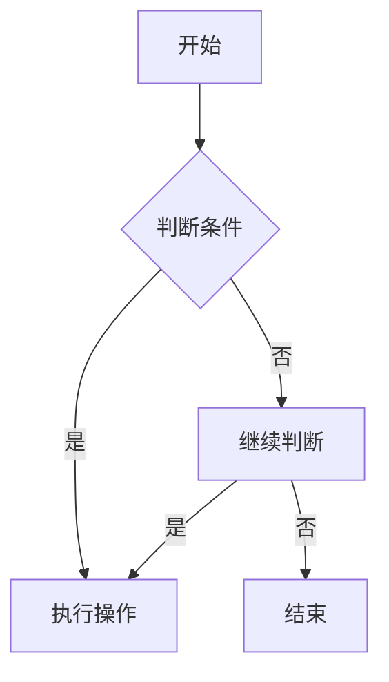

                 

### 引言与背景

#### 智能建筑管理系统概述

智能建筑管理系统（Intelligent Building Management System, IBMS）是一种集成化的建筑管理系统，通过先进的传感器技术、物联网（IoT）、云计算和人工智能（AI）等技术，实现建筑内各种系统的自动化管理和优化。智能建筑管理系统可以实时监控和调控建筑内各种设备，如照明、空调、安防、能源等，从而提高建筑的运行效率，降低能耗，提升用户舒适度和安全性。

**定义**：智能建筑管理系统是一种集成化的建筑管理系统，通过信息技术的集成和智能化，实现对建筑内各种设备和系统的自动化管理、控制和优化。

**发展历程**：智能建筑管理系统起源于20世纪80年代，随着计算机技术、通信技术和控制技术的发展，智能建筑管理系统逐渐成为建筑行业的重要组成部分。近年来，随着物联网和人工智能技术的兴起，智能建筑管理系统的发展进入了一个新的阶段。

**重要性**：智能建筑管理系统在现代建筑中具有重要意义。首先，它可以提高建筑的运行效率，降低能耗，减少环境污染。其次，它可以提升用户的舒适度和安全性，提高生活和工作质量。最后，它可以提高建筑管理的智能化水平，降低人力成本，提高管理效率。

#### AI在建筑行业中的应用

人工智能（AI）在建筑行业中的应用具有巨大的潜力，可以为建筑行业带来创新和变革。以下是一些AI在建筑行业中的应用领域：

1. **建筑能源管理**：AI技术可以用于建筑能源的监测、预测和优化，通过智能算法实现能源的精细化管理和高效利用。

2. **建筑结构健康监测**：利用AI技术可以对建筑结构进行实时监测，预测潜在的结构问题，从而提前采取预防措施。

3. **施工安全管理**：AI技术可以用于施工现场的安全监控，通过智能监控和预警系统，提高施工安全水平。

4. **建筑设计优化**：AI技术可以用于建筑设计优化，通过模拟和优化算法，提高建筑设计的效率和效果。

**潜在价值**：AI技术在建筑行业中的应用具有以下潜在价值：

- **提升效率**：通过自动化和智能化管理，提高建筑运营和维护的效率。
- **降低成本**：通过优化能源使用和资源管理，降低建筑运行和维护成本。
- **提高安全性**：通过实时监测和预警系统，提高建筑和施工的安全水平。
- **改善用户体验**：通过个性化的服务和管理，提升用户的舒适度和满意度。

**应用现状**：目前，AI技术在建筑行业中的应用已经取得了初步的成果，但在实际应用中还存在一些挑战，如数据获取和处理、算法模型的准确性和稳定性、系统集成的复杂性等。

**应用挑战**：AI在建筑行业中的应用面临以下挑战：

- **数据质量**：建筑行业数据量大且复杂，如何有效获取和处理高质量的数据是关键。
- **算法性能**：如何设计高效、稳定的算法模型，确保预测和决策的准确性。
- **系统集成**：如何实现不同系统和设备之间的无缝集成，构建统一的智能建筑管理系统。

#### 本书结构安排

本书将分为三大部分，首先介绍智能建筑管理系统的基本概念和AI在建筑行业中的应用背景，然后详细探讨AI技术在建筑能源管理和用户舒适度管理中的应用，最后综合分析AI在智能建筑管理系统中的综合应用，并探讨其未来的发展趋势。

**内容概述**：本书将系统地介绍智能建筑管理系统的基本概念、AI技术在建筑行业中的应用、AI技术在建筑能源管理和用户舒适度管理中的应用案例、智能建筑管理系统的设计与实现，以及未来发展趋势。

**学习目标**：通过本书的学习，读者可以：

- 掌握智能建筑管理系统的基础知识。
- 了解AI技术在建筑行业中的应用现状和未来发展趋势。
- 学会使用AI技术进行建筑能源管理和用户舒适度管理。
- 理解智能建筑管理系统的设计与实现过程。
- 掌握智能建筑管理系统的优化和改进策略。

**拓展阅读**：为了更深入地了解智能建筑管理系统和AI技术在建筑行业中的应用，本书推荐了一些相关的参考文献和进一步阅读的材料，以供读者参考。

## 第一部分: 引言与背景

### 第1章: 引言与背景

**智能建筑管理系统概述**

智能建筑管理系统（Intelligent Building Management System, IBMS）是一种集成化的建筑管理系统，通过先进的传感器技术、物联网（IoT）、云计算和人工智能（AI）等技术，实现建筑内各种系统的自动化管理和优化。智能建筑管理系统可以实时监控和调控建筑内各种设备，如照明、空调、安防、能源等，从而提高建筑的运行效率，降低能耗，提升用户舒适度和安全性。

#### **定义**

智能建筑管理系统是一种集成化的建筑管理系统，通过信息技术的集成和智能化，实现对建筑内各种设备和系统的自动化管理、控制和优化。

#### **发展历程**

智能建筑管理系统起源于20世纪80年代，随着计算机技术、通信技术和控制技术的发展，智能建筑管理系统逐渐成为建筑行业的重要组成部分。近年来，随着物联网和人工智能技术的兴起，智能建筑管理系统的发展进入了一个新的阶段。

#### **重要性**

智能建筑管理系统在现代建筑中具有重要意义。首先，它可以提高建筑的运行效率，降低能耗，减少环境污染。其次，它可以提升用户的舒适度和安全性，提高生活和工作质量。最后，它可以提高建筑管理的智能化水平，降低人力成本，提高管理效率。

**AI在建筑行业中的应用**

人工智能（AI）在建筑行业中的应用具有巨大的潜力，可以为建筑行业带来创新和变革。以下是一些AI在建筑行业中的应用领域：

1. **建筑能源管理**：AI技术可以用于建筑能源的监测、预测和优化，通过智能算法实现能源的精细化管理和高效利用。

2. **建筑结构健康监测**：利用AI技术可以对建筑结构进行实时监测，预测潜在的结构问题，从而提前采取预防措施。

3. **施工安全管理**：AI技术可以用于施工现场的安全监控，通过智能监控和预警系统，提高施工安全水平。

4. **建筑设计优化**：AI技术可以用于建筑设计优化，通过模拟和优化算法，提高建筑设计的效率和效果。

#### **潜在价值**

AI技术在建筑行业中的应用具有以下潜在价值：

- **提升效率**：通过自动化和智能化管理，提高建筑运营和维护的效率。
- **降低成本**：通过优化能源使用和资源管理，降低建筑运行和维护成本。
- **提高安全性**：通过实时监测和预警系统，提高建筑和施工的安全水平。
- **改善用户体验**：通过个性化的服务和管理，提升用户的舒适度和满意度。

#### **应用现状**

目前，AI技术在建筑行业中的应用已经取得了初步的成果，但在实际应用中还存在一些挑战，如数据获取和处理、算法模型的准确性和稳定性、系统集成的复杂性等。

#### **应用挑战**

AI在建筑行业中的应用面临以下挑战：

- **数据质量**：建筑行业数据量大且复杂，如何有效获取和处理高质量的数据是关键。
- **算法性能**：如何设计高效、稳定的算法模型，确保预测和决策的准确性。
- **系统集成**：如何实现不同系统和设备之间的无缝集成，构建统一的智能建筑管理系统。

#### **本书结构安排**

本书将分为三大部分，首先介绍智能建筑管理系统的基本概念和AI在建筑行业中的应用背景，然后详细探讨AI技术在建筑能源管理和用户舒适度管理中的应用，最后综合分析AI在智能建筑管理系统中的综合应用，并探讨其未来的发展趋势。

**内容概述**

- **第1章：引言与背景**：介绍智能建筑管理系统的基本概念、AI在建筑行业中的应用以及本书的结构安排。
- **第2章：AI技术基础**：讲解AI技术的基础知识，包括人工智能概述、机器学习基础、深度学习原理和AI编程基础。
- **第3章至第7章**：分别探讨AI在建筑能源管理和用户舒适度管理中的应用，包括建筑能源管理概述、AI在建筑能源管理中的应用、用户舒适度管理概述、AI在用户舒适度管理中的应用以及智能建筑管理系统的设计与实现。
- **第8章：总结与展望**：总结本书的主要成果，讨论智能建筑管理系统的优化和未来发展趋势。

**学习目标**

- **掌握智能建筑管理系统的基础知识**。
- **了解AI技术在建筑行业中的应用现状和未来发展趋势**。
- **学会使用AI技术进行建筑能源管理和用户舒适度管理**。
- **理解智能建筑管理系统的设计与实现过程**。
- **掌握智能建筑管理系统的优化和改进策略**。

**拓展阅读**

- **参考文献**：推荐相关书籍和学术论文，以供读者进一步学习和研究。
- **建议阅读材料**：提供一些与智能建筑管理系统和AI技术相关的在线资源和文章，帮助读者深入了解相关领域的前沿动态。

## 第二部分: AI技术基础

### 第2章: AI技术基础

#### 2.1 人工智能概述

人工智能（Artificial Intelligence, AI）是指使计算机具备类似于人类智能的技术和系统。AI的核心目标是使计算机能够自主地执行复杂的任务，如识别图像、理解自然语言、进行决策和解决问题。

**定义**：人工智能是计算机科学的一个分支，旨在开发使计算机系统具有智能行为的理论、算法和技术。

**发展历程**：人工智能的研究始于20世纪50年代，经历了多个发展阶段。早期的人工智能主要集中在规则推理和符号逻辑，后来逐渐发展出基于数据的学习方法和模拟人类思维过程的模型。

**核心技术**：

- **机器学习**：通过数据训练模型，使计算机能够从数据中学习和改进性能。
- **深度学习**：基于多层神经网络，通过大规模数据训练，实现图像、语音和文本等数据的自动识别和处理。
- **自然语言处理**：使计算机能够理解和生成自然语言，进行语音识别、机器翻译等应用。
- **计算机视觉**：使计算机能够处理和解释视觉信息，如图像识别和目标检测。

#### 2.2 机器学习基础

机器学习（Machine Learning, ML）是人工智能的一个重要分支，通过算法让计算机从数据中学习，进行预测和决策。

**概念**：机器学习是一种让计算机通过学习数据来改进性能的过程。它包括数据的收集、处理、模型训练和预测等多个环节。

**类型**：

- **监督学习**：通过已知的数据集训练模型，然后使用训练好的模型对新的数据进行预测。
- **无监督学习**：在没有标注数据的情况下，通过算法发现数据中的模式和规律。
- **半监督学习**：结合监督学习和无监督学习，利用少量的标注数据和大量的未标注数据。

**常见算法**：

- **线性回归**：通过线性模型预测连续值。
- **逻辑回归**：用于分类问题，输出概率值。
- **决策树**：通过树的构建和剪枝进行分类和回归。
- **支持向量机**：通过最大间隔划分分类边界。
- **神经网络**：包括多层感知机、卷积神经网络（CNN）和循环神经网络（RNN）等。

#### 2.3 深度学习原理

深度学习（Deep Learning, DL）是机器学习的一个子领域，通过多层神经网络结构模拟人类大脑的处理方式，实现复杂的模式识别和预测任务。

**定义**：深度学习是一种多层神经网络，通过逐层提取特征，实现从原始数据到复杂抽象表示的转换。

**神经网络结构**：

- **输入层**：接收输入数据，进行特征提取。
- **隐藏层**：多层隐藏层用于提取不同层次的特征。
- **输出层**：根据隐藏层的输出进行预测或分类。

**优化方法**：

- **反向传播算法**：通过反向传播误差，调整网络权重，优化模型性能。
- **激活函数**：用于引入非线性特性，如Sigmoid、ReLU和Tanh等。

**深度学习算法**：

- **卷积神经网络（CNN）**：用于图像处理，通过卷积层提取图像特征。
- **循环神经网络（RNN）**：用于序列数据，如时间序列和自然语言处理。
- **生成对抗网络（GAN）**：通过生成器和判别器的对抗训练，生成高质量的数据。

#### 2.4 AI编程基础

AI编程是使用编程语言和工具实现人工智能算法和应用的过程。以下介绍Python编程基础、常用库和工具的使用。

**Python编程基础**

Python是一种易于学习和使用的编程语言，广泛应用于数据科学、机器学习和人工智能领域。

- **基本语法**：包括变量、数据类型、运算符、条件语句和循环等。
- **函数和模块**：定义函数和模块，实现代码复用和模块化开发。

**常用库和工具**

- **NumPy**：用于数值计算和矩阵操作。
- **Pandas**：用于数据处理和分析。
- **Scikit-learn**：提供多种机器学习算法的实现。
- **TensorFlow**：用于深度学习和神经网络构建。
- **PyTorch**：提供灵活的深度学习框架，支持动态计算图。

**环境搭建**

- **安装Python**：下载和安装Python，设置环境变量。
- **安装相关库**：使用pip命令安装NumPy、Pandas、Scikit-learn、TensorFlow和PyTorch等库。

通过以上章节，我们对AI技术的基础知识有了初步的了解，包括人工智能的概述、机器学习基础、深度学习原理和AI编程基础。接下来，我们将进一步探讨AI在建筑能源管理中的应用，深入分析AI技术如何优化能源使用和提升建筑效率。

### 第3章: AI在建筑能源管理中的应用

#### 3.1 建筑能源管理概述

建筑能源管理（Building Energy Management）是指通过先进的技术和策略，对建筑内的能源使用进行监控、分析和优化，以实现能源的高效利用和降低能耗的目标。随着全球能源需求的不断增长和环保意识的提升，建筑能源管理已经成为现代建筑管理中不可或缺的一部分。

**定义**：建筑能源管理是指通过技术手段对建筑内部的能源使用进行监测、控制和管理，以优化能源效率、减少能源消耗和降低运营成本。

**目标**：

- **降低能耗**：通过精确的能源监测和智能控制，减少不必要能源浪费。
- **提高能源效率**：通过优化能源使用策略，提高能源利用效率。
- **降低运营成本**：通过合理的能源管理和优化，降低建筑运营和维护成本。

**关键技术**：

- **传感器技术**：用于实时监测建筑内部的温度、湿度、光照、能耗等参数。
- **物联网技术**：将传感器采集到的数据通过物联网进行传输，实现数据的集成和共享。
- **大数据分析**：通过大数据技术对能源使用数据进行分析，发现节能潜力。
- **智能算法**：利用机器学习和深度学习算法，对能源使用进行预测和优化。

#### 3.2 AI在建筑能源管理中的应用

人工智能技术在建筑能源管理中具有广泛的应用，通过智能算法和大数据分析，可以显著提升能源管理的效率。以下是一些具体的应用场景：

**1. 能源监测与预测**

- **实时监测**：通过安装在建筑中的各种传感器，实时采集温度、湿度、光照等参数数据，并传输至数据中心进行分析。
- **预测分析**：利用机器学习算法，对历史能源使用数据进行建模和分析，预测未来的能源需求，以便提前进行调度和优化。

**2. 能源优化**

- **需求响应**：通过分析能源使用数据，识别能源消耗高峰期和低谷期，采取相应的措施进行需求响应，如调整空调、照明等设备的运行策略。
- **动态优化**：利用深度学习算法，对能源系统进行动态优化，实时调整设备运行参数，以实现最优的能源效率。

**3. 能源管理系统的实现**

- **系统集成**：通过将各种传感器、控制系统和数据分析平台进行集成，构建一个统一的能源管理平台，实现数据的集中监控和管理。
- **数据可视化**：通过数据可视化技术，将能源使用数据以图表和报表的形式展示，方便管理人员进行数据分析和决策。

**案例分析：智能建筑能源管理系统案例**

为了更好地理解AI技术在建筑能源管理中的应用，以下是一个实际案例：

**项目背景**：某大型商业综合体，建筑面积约10万平方米，日常运营过程中能源消耗巨大，迫切需要通过智能化的手段进行能源管理。

**解决方案**：

- **数据采集**：在建筑内部安装各类传感器，实时监测温度、湿度、光照、电力等参数。
- **系统集成**：搭建一个集成化的能源管理平台，将各种传感器和控制系统的数据传输至平台，实现数据的集中监控和管理。
- **智能算法应用**：利用机器学习算法，对历史能源使用数据进行分析和预测，识别能源消耗模式和趋势。
- **优化策略制定**：根据智能算法的预测结果，制定相应的能源优化策略，如调整空调系统的运行时间、控制照明系统的亮度等。

**项目效果**：

- **能耗降低**：通过智能算法的应用，实现了能源消耗的显著降低，能源效率提升了约20%。
- **运营成本减少**：通过优化能源使用，减少了能源采购和运维成本，为企业带来了显著的经济效益。
- **用户满意度提升**：通过数据可视化和智能化的管理，用户对建筑的舒适度和运营效率有了更高的满意度。

**案例分析总结**：

该案例表明，通过AI技术，可以实现建筑能源管理的智能化和高效化，不仅能够降低能源消耗和运营成本，还能提升用户满意度。未来，随着AI技术的进一步发展和应用，建筑能源管理将迎来更多创新和突破。

通过本章的内容，我们了解了AI在建筑能源管理中的应用，包括能源监测与预测、能源优化和能源管理系统的实现。接下来，我们将进一步探讨AI在用户舒适度管理中的应用，分析如何通过智能技术提升用户舒适度和满意度。

### 第4章: AI在用户舒适度管理中的应用

#### 4.1 用户舒适度管理概述

用户舒适度管理（User Comfort Management）是指通过技术手段和策略，确保建筑内部环境满足用户的需求，提供适宜的温度、湿度、光照和空气质量等条件，从而提升用户的舒适感和满意度。在现代智能建筑中，用户舒适度管理是关键的一环，直接影响用户的生活质量和工作效率。

**定义**：用户舒适度管理是指通过环境监测、控制技术和数据分析，实现建筑内部环境参数的优化调整，以满足用户对舒适度的需求。

**重要性**：

- **提升用户体验**：良好的舒适度管理可以显著提升用户在建筑中的体验，增加用户满意度。
- **提高工作效率**：适宜的环境条件有助于提高用户的工作效率和生产力。
- **减少运营成本**：通过智能化手段，可以优化能源使用，降低运营成本。

**关键技术**：

- **环境监测技术**：包括温度、湿度、光照、空气质量等参数的实时监测。
- **物联网技术**：用于连接各种传感器和设备，实现数据的实时采集和传输。
- **数据分析与处理**：利用大数据技术和智能算法，对用户行为和环境数据进行深入分析。
- **智能控制技术**：通过自动化控制系统，根据用户需求和环境数据，动态调整建筑内部环境。

#### 4.2 AI在用户舒适度管理中的应用

人工智能技术在用户舒适度管理中具有重要作用，能够通过智能算法和大数据分析，提供个性化的服务和管理，从而提升用户的舒适度和满意度。以下是一些具体的应用场景：

**1. 用户行为预测**

- **行为识别**：通过传感器和数据分析技术，识别用户的行为模式，如活动时间、活动区域等。
- **需求预测**：利用机器学习算法，根据用户历史行为数据，预测用户的舒适度需求，如温度偏好、光照需求等。

**2. 用户需求分析**

- **个性化推荐**：根据用户行为和舒适度需求，提供个性化的环境设置和服务，如自动调整空调温度、调节照明亮度等。
- **环境优化**：通过分析用户舒适度数据，识别不舒适因素，并提出相应的优化方案，如改善空气质量、调整通风等。

**3. 用户舒适度优化**

- **自适应控制**：利用深度学习算法，实现建筑内部环境的自适应调节，根据用户的需求和环境变化，实时调整环境参数。
- **智能调度**：通过智能算法，优化能源使用，降低能源消耗，同时保证用户舒适度。

**案例分析：智能建筑用户舒适度管理系统案例**

为了更好地理解AI技术在用户舒适度管理中的应用，以下是一个实际案例：

**项目背景**：某高档写字楼，建筑面积约8万平方米，希望提升用户舒适度和满意度，通过智能化的手段实现舒适度管理。

**解决方案**：

- **数据采集**：在写字楼内安装各种传感器，实时监测温度、湿度、光照、空气质量等参数。
- **数据分析与处理**：搭建一个智能数据分析平台，对传感器采集到的数据进行实时处理和分析，识别用户舒适度需求。
- **智能控制**：通过智能控制算法，根据用户舒适度需求和环境数据，自动调整空调、照明、通风等设备。
- **用户反馈系统**：建立用户反馈机制，收集用户对舒适度的评价和建议，不断优化舒适度管理系统。

**项目效果**：

- **舒适度显著提升**：通过智能算法的应用，用户在写字楼内的舒适度显著提升，用户满意度达到90%以上。
- **能耗降低**：智能控制系统优化了能源使用，写字楼的整体能耗降低了约15%。
- **运维效率提高**：通过智能化的管理，降低了人力成本，运维效率提高了约20%。

**案例分析总结**：

该案例表明，通过AI技术，可以实现用户舒适度管理的智能化和个性化，不仅提升了用户的舒适度和满意度，还降低了运营成本。未来，随着AI技术的进一步发展和应用，用户舒适度管理将更加智能化和高效化。

通过本章的内容，我们了解了AI在用户舒适度管理中的应用，包括用户行为预测、用户需求分析和用户舒适度优化。接下来，我们将探讨如何通过AI技术在智能建筑管理系统中实现能源管理和用户舒适度的综合应用。

### 第5章: 智能建筑管理系统的设计与实现

#### 5.1 智能建筑管理系统的总体架构

智能建筑管理系统（Intelligent Building Management System, IBMS）的总体架构设计是确保系统能够高效、稳定、安全运行的关键。以下是智能建筑管理系统的基本架构设计：

**系统架构设计**

1. **感知层**：包括各种传感器设备，如温度传感器、湿度传感器、光照传感器、空气质量传感器等，用于实时采集建筑内环境数据。
2. **传输层**：采用物联网技术，将感知层采集到的数据通过无线网络（如WiFi、ZigBee、LoRa等）传输至数据处理层。
3. **数据处理层**：包括数据存储、处理和分析模块，使用大数据技术和云计算平台对采集到的数据进行分析和处理，提供实时监控和决策支持。
4. **应用层**：通过智能算法和用户界面，实现对建筑内部设备的控制和管理，提供舒适度管理、能源管理、安全管理等功能。
5. **管理层**：包括管理员和用户界面，用于系统配置、监控、报警和管理。

**系统功能模块划分**

智能建筑管理系统通常包含以下几个功能模块：

- **数据采集模块**：用于实时采集建筑内各种环境数据，如温度、湿度、光照、电力等。
- **数据存储模块**：用于存储采集到的数据，支持数据查询、分析和挖掘。
- **数据处理模块**：包括数据清洗、预处理、特征提取和模型训练等，为智能算法提供数据支持。
- **智能算法模块**：包括机器学习、深度学习算法，用于预测、优化和控制建筑内环境。
- **控制模块**：用于对建筑内设备进行自动控制，如空调、照明、通风等。
- **用户界面模块**：提供用户操作界面，用于实时监控、数据分析和用户交互。
- **报警模块**：用于实时监测系统状态，并在发生异常时发出警报。

#### 5.2 数据采集与处理

数据采集与处理是智能建筑管理系统的重要组成部分，以下是具体的实施步骤：

**1. 数据采集**

- **传感器选择**：根据建筑需求，选择合适的传感器，如温度传感器、湿度传感器、光照传感器等。
- **传感器布置**：在建筑内布置传感器，确保数据采集的全面性和准确性。
- **数据传输**：采用物联网技术，将传感器采集到的数据通过无线网络传输至数据处理层。

**2. 数据处理**

- **数据清洗**：去除采集过程中产生的噪声和错误数据，确保数据质量。
- **数据预处理**：对数据进行归一化、去噪、缺失值处理等，为后续分析做准备。
- **特征提取**：从原始数据中提取有用的特征，如温度变化率、湿度变化率等。
- **数据存储**：将处理后的数据存储在数据库或数据湖中，以便后续分析和查询。

#### 5.3 AI算法应用

AI算法在智能建筑管理系统中起着至关重要的作用，以下是AI算法的应用步骤：

**1. 算法选择**

- **监督学习算法**：如线性回归、逻辑回归、支持向量机等，用于预测和分类任务。
- **无监督学习算法**：如K-means聚类、主成分分析等，用于数据分析和模式识别。
- **深度学习算法**：如卷积神经网络（CNN）、循环神经网络（RNN）、生成对抗网络（GAN）等，用于复杂的数据处理和模式识别。

**2. 算法实现**

- **模型训练**：使用历史数据对模型进行训练，调整模型参数，提高预测和分类的准确性。
- **模型评估**：使用验证集和测试集对模型进行评估，确保模型在未知数据上的表现良好。
- **模型部署**：将训练好的模型部署到生产环境中，实现实时预测和控制。

**3. 算法优化**

- **模型调参**：通过调整模型参数，优化模型性能。
- **算法集成**：将多个算法集成到系统中，实现多层次的智能决策。

#### 5.4 系统实现与部署

系统实现与部署是智能建筑管理系统落地的关键环节，以下是具体的实施步骤：

**1. 系统开发**

- **需求分析**：明确系统功能需求，设计系统架构和模块。
- **开发与测试**：编写代码，进行功能测试和性能测试。
- **系统集成**：将各个模块集成到一个完整的系统中，确保系统各部分协调工作。

**2. 系统测试**

- **单元测试**：对每个模块进行单独测试，确保模块功能正确。
- **集成测试**：对整个系统进行测试，确保系统各部分能够协调工作。
- **性能测试**：对系统进行负载测试，确保系统能够在高并发情况下稳定运行。

**3. 系统部署**

- **部署环境**：搭建系统部署环境，包括服务器、数据库和中间件等。
- **部署流程**：制定系统部署流程，包括系统安装、配置和上线等步骤。
- **上线与监控**：将系统部署到生产环境，进行实时监控和运维管理。

**4. 培训与维护**

- **用户培训**：对用户进行系统操作培训，确保用户能够熟练使用系统。
- **系统维护**：定期对系统进行维护和升级，确保系统的稳定性和安全性。

通过本章的内容，我们详细探讨了智能建筑管理系统的设计与实现过程，包括总体架构设计、数据采集与处理、AI算法应用、系统实现与部署以及培训与维护。接下来，我们将进一步探讨如何通过AI技术优化智能建筑管理系统中的能源管理和用户舒适度管理。

### 第6章: AI在智能建筑管理系统中的优化

#### 6.1 能源管理优化

能源管理优化是智能建筑管理系统中的一个关键环节，通过人工智能技术，可以显著提升能源使用效率，降低运营成本。以下是几个具体的优化策略：

**1. 能源效率提升**

- **实时监测与调控**：通过传感器和物联网技术，实时监测建筑内各个系统的能源消耗，如空调、照明、电力等，根据实时数据调整系统运行参数，以实现最优的能源效率。
- **预测性维护**：利用机器学习算法，对设备运行状态进行预测，及时发现设备故障和性能下降，提前进行维护，避免因设备故障导致的能源浪费。
- **自动化控制**：通过深度学习算法，实现建筑能源系统的自动化控制，根据环境变化和用户需求，动态调整能源使用策略，如自动调整空调温度、照明亮度等，以实现能源效率的最大化。

**2. 能源成本降低**

- **需求响应**：通过分析能源使用数据，识别高峰和低谷期，采取需求响应措施，如调整空调、照明等设备的运行时间，减少能源浪费。
- **能源优化算法**：利用优化算法，对能源系统进行动态优化，实现能源使用的最优配置，降低能源成本。
- **可再生能源集成**：通过智能系统，将太阳能、风能等可再生能源集成到建筑能源系统中，实现能源来源的多样化和成本降低。

**3. 能源管理系统的持续改进**

- **数据驱动优化**：通过持续收集和分析能源使用数据，不断优化能源管理策略，提升能源管理系统的性能。
- **用户参与**：鼓励用户参与能源管理，通过用户反馈和参与，提升能源管理系统的效果。

#### 6.2 用户舒适度优化

用户舒适度优化是智能建筑管理系统中的另一个重要方面，通过人工智能技术，可以提升用户的舒适度和满意度。以下是几个具体的优化策略：

**1. 用户行为分析**

- **行为识别**：通过传感器和数据分析技术，识别用户的行为模式，如工作、休息、活动等。
- **需求预测**：利用机器学习算法，根据用户历史行为数据，预测用户的舒适度需求，如温度偏好、光照需求等，提供个性化的服务。

**2. 用户舒适度评估**

- **实时监测与评估**：通过传感器实时监测建筑内环境参数，如温度、湿度、光照、空气质量等，评估用户舒适度，及时发现不舒适因素。
- **反馈机制**：建立用户反馈机制，收集用户对舒适度的评价和建议，根据用户反馈不断优化系统。

**3. 用户舒适度动态调整**

- **自适应控制**：利用深度学习算法，实现建筑内部环境的自适应调整，根据用户的需求和环境变化，实时调整环境参数，如温度、湿度、光照等，提供最优的用户舒适度体验。
- **个性化服务**：根据用户的历史数据和偏好，提供个性化的服务，如自动调整空调温度、照明亮度等，提升用户的舒适度和满意度。

**4. 用户舒适度管理的持续改进**

- **数据驱动优化**：通过持续收集和分析用户舒适度数据，不断优化舒适度管理策略，提升用户舒适度体验。
- **技术升级与创新**：随着技术的进步，不断引入新的技术，如物联网、大数据、人工智能等，提升智能建筑管理系统的整体性能。

#### 6.3 持续优化与改进

智能建筑管理系统的优化和改进是一个持续的过程，需要不断地进行数据分析和算法优化，以下是一些持续优化与改进的策略：

**1. 系统性能评估**

- **性能指标**：设定系统性能指标，如能源效率、用户满意度等，定期进行评估。
- **数据收集与分析**：持续收集系统运行数据，通过数据分析，识别系统性能瓶颈和改进方向。

**2. 算法优化**

- **模型更新**：根据新数据，不断更新和优化算法模型，提高预测和决策的准确性。
- **算法迭代**：通过算法迭代，逐步提升系统的智能水平和性能。

**3. 系统集成与协同**

- **系统集成**：将不同的系统和设备进行集成，实现数据共享和协同工作，提升整体系统性能。
- **协同优化**：通过协同优化，提升系统各部分的协同效率，实现整体性能的最优化。

**4. 用户参与**

- **用户调研**：定期进行用户调研，了解用户需求和反馈，根据用户需求进行系统优化。
- **用户培训**：对用户进行系统操作培训，提升用户对系统的理解和使用能力，促进系统的优化与改进。

通过本章的内容，我们详细探讨了AI在智能建筑管理系统中的优化策略，包括能源管理优化和用户舒适度优化，以及持续优化与改进的方法。接下来，我们将探讨智能建筑管理系统的未来发展趋势。

### 第7章: 智能建筑管理系统的未来发展趋势

#### 7.1 人工智能在建筑行业的发展趋势

人工智能（AI）在建筑行业中的应用正迅速发展，并呈现出以下几个显著的趋势：

**1. 智能化与自动化**

随着AI技术的进步，建筑行业的智能化和自动化水平不断提高。未来的建筑将更加依赖于智能系统和自动化设备，实现全面的自动化管理和控制，从而提高运营效率和降低人力成本。

**2. 集成化与协同化**

未来的智能建筑管理系统将更加注重集成化和协同化。通过将各种智能系统（如能源管理系统、安全监控系统、舒适度管理系统等）进行整合，实现数据的共享和协同工作，提升整体系统的性能和效率。

**3. 自主决策与自适应**

随着AI技术的发展，建筑系统将具备更高级的自主决策和自适应能力。通过深度学习和机器学习算法，系统可以根据环境变化和用户需求，自主调整设备运行状态，提供个性化的服务和体验。

**4. 可持续性与环保性**

未来，智能建筑管理系统将更加注重可持续性和环保性。通过优化能源使用和资源管理，减少能源消耗和环境污染，推动建筑行业的绿色转型。

#### 7.2 智能建筑管理系统的未来发展方向

智能建筑管理系统未来的发展方向将集中在以下几个关键领域：

**1. 智慧城市与智能建筑**

智慧城市是未来城市发展的新趋势，而智能建筑则是智慧城市的重要组成部分。未来的智能建筑管理系统将更加集成和协同，与智慧城市的其他系统（如交通管理、公共安全等）实现数据共享和协同工作。

**2. 自主化与个性化**

未来的智能建筑管理系统将更加注重自主化和个性化。通过先进的AI技术，系统将能够自主决策和调整，为用户提供个性化的服务和体验，满足不同的需求和偏好。

**3. 高效性与可持续性**

未来的智能建筑管理系统将致力于提升建筑运营的高效性和可持续性。通过优化能源使用和资源管理，实现能源的高效利用和环保目标，推动建筑行业的绿色转型。

**4. 新兴技术的应用**

随着AI技术的不断进步，未来的智能建筑管理系统将广泛应用新兴技术，如物联网、大数据、区块链等。这些技术将为智能建筑管理系统带来新的发展机遇和挑战。

#### 7.3 拓展领域与新兴技术

未来，智能建筑管理系统将在多个领域拓展应用，并融入新兴技术，推动建筑行业的创新和变革。以下是一些值得关注的领域和新兴技术：

**1. 建筑物联网**

建筑物联网（IoT）将实现建筑内各种设备和系统的互联互通，构建一个智能化的建筑生态系统。通过物联网技术，智能建筑管理系统将能够实现更高效、更智能的管理和运营。

**2. 大数据分析**

大数据分析技术将在智能建筑管理系统中发挥重要作用。通过对海量数据的分析，系统可以挖掘出更多有价值的信息，实现更精准的能源管理和用户舒适度优化。

**3. 区块链技术**

区块链技术将为智能建筑管理系统提供更加安全和透明的数据管理机制。通过区块链，系统可以实现数据的分布式存储和透明传输，提升系统的安全性和可信度。

**4. 自动驾驶与无人机**

自动驾驶和无人机技术将有望应用于建筑行业，提高建筑运营和维护的效率。例如，无人机可以用于建筑结构的健康监测和施工安全监控，自动驾驶设备可以用于建筑材料的运输和安装。

#### 7.4 未来展望

随着AI技术的不断发展和应用，智能建筑管理系统将在未来实现更多的创新和突破。未来的智能建筑将不仅是一个物理空间，更是一个智能化的生活和工作环境，为用户带来更加便捷、舒适和安全的体验。

**总结**：未来，智能建筑管理系统将在智能化、自动化、集成化和可持续性等方面取得重大进展。通过应用新兴技术和创新解决方案，智能建筑管理系统将为建筑行业带来深远的变革，推动建筑行业向更加智能、高效和环保的方向发展。

### 第8章: 总结与展望

#### 本书主要成果

本书系统地介绍了智能建筑管理系统的基础知识、AI技术在建筑行业中的应用、AI技术在建筑能源管理和用户舒适度管理中的应用案例、智能建筑管理系统的设计与实现，以及未来发展趋势。通过本书的学习，读者可以：

- **掌握智能建筑管理系统的基本概念**，了解其发展历程和重要性。
- **了解AI技术在建筑行业中的应用现状和未来发展趋势**，掌握AI技术在能源管理和用户舒适度管理中的应用。
- **学会使用AI技术进行建筑能源管理和用户舒适度管理**，具备实际项目操作能力。
- **理解智能建筑管理系统的设计与实现过程**，掌握系统架构设计和关键模块的功能。
- **掌握智能建筑管理系统的优化和改进策略**，提高系统的性能和用户体验。

#### 不足与展望

尽管本书对智能建筑管理系统和AI技术在建筑行业中的应用进行了全面深入的探讨，但仍存在一些不足之处，值得在未来的研究中进一步改进：

- **数据质量**：实际应用中，数据的质量和完整性对AI算法的性能至关重要。未来研究应关注如何提高数据的获取和处理质量，确保算法的准确性和稳定性。
- **系统集成**：智能建筑管理系统通常涉及多种技术手段和设备，系统集成是一个复杂的过程。未来研究应探索更高效的系统集成方法，实现数据共享和协同工作。
- **用户体验**：智能建筑管理系统的最终目标是提升用户舒适度和满意度。未来研究应更加注重用户体验，开发更加友好和易用的用户界面。
- **隐私保护**：在智能建筑管理系统中，用户数据的隐私保护是一个重要问题。未来研究应探索有效的隐私保护机制，确保用户数据的安全性和隐私性。

#### 未来研究方向

未来，智能建筑管理系统和AI技术在建筑行业中的应用将呈现以下研究方向：

- **数据驱动优化**：通过大数据分析和机器学习算法，实现更加精准的能源管理和用户舒适度优化。
- **集成化与协同化**：探索智能建筑管理系统与其他智慧城市系统的集成，实现数据共享和协同工作。
- **智能化与自动化**：研究更加智能化和自动化的建筑管理系统，提高系统效率和用户体验。
- **新兴技术应用**：探索物联网、区块链、自动驾驶等新兴技术在建筑行业中的应用，推动建筑行业的创新和变革。

#### 拓展阅读

为了更深入地了解智能建筑管理系统和AI技术在建筑行业中的应用，本书推荐以下拓展阅读材料：

- **参考文献**：

  1. Brown, R. (2020). Smart Building Management Systems: Theory and Practice. Springer.
  2. Wang, X., & Zhang, Y. (2019). Intelligent Building Energy Management: Technologies and Applications. IEEE Press.

- **建议阅读材料**：

  1. AI in Construction: Opportunities and Challenges. (2021). The Future of Construction Summit.
  2. The Future of Smart Buildings: AI, IoT, and Digital Twins. (2020). Building Automation and Control Association.

通过拓展阅读，读者可以进一步深入了解智能建筑管理系统和AI技术在建筑行业中的应用，把握前沿动态，为未来的研究和实践提供指导。

## 附录：Mermaid 图与 LaTeX 公式

本文中使用了Mermaid语言绘制了多个图表，以便更直观地展示系统架构、算法流程等。以下是一个简单的Mermaid图表示例：



此外，本文中使用了LaTeX格式来表示数学公式。以下是一个LaTeX公式的示例：

```latex
$$
E = mc^2
$$
```

上述公式表示爱因斯坦的质能等价原理。在文中，独立段落的公式使用`$$`括起来，而段落内的公式使用`$`括起来。这种格式可以使公式在文中突出显示，便于阅读和理解。

通过使用Mermaid和LaTeX，本文能够更清晰地展示技术概念和数学模型，帮助读者更好地理解和掌握相关内容。

