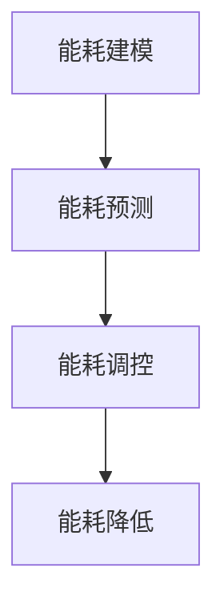
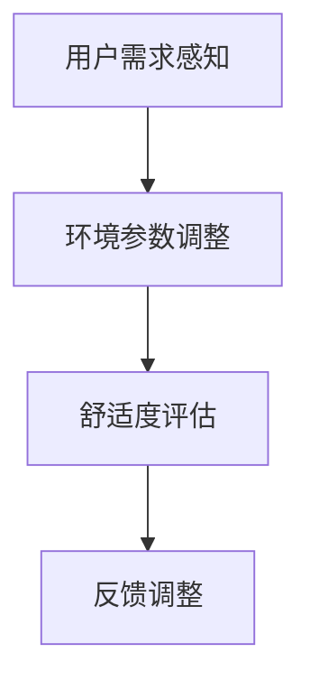
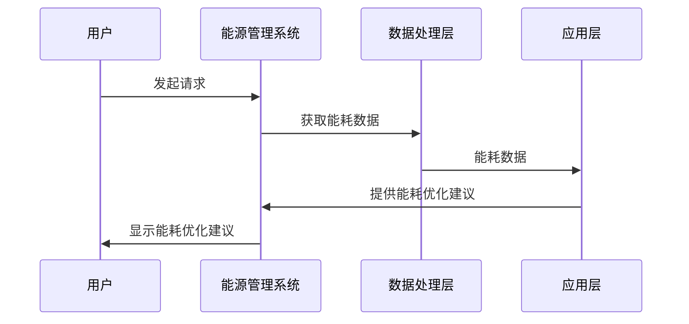
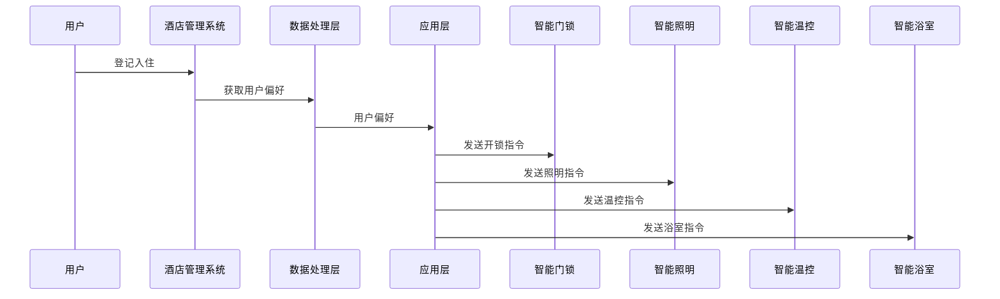

                 

## AI在智能建筑管理系统中的应用：优化能源使用和用户舒适度

### 关键词：智能建筑、AI、能源管理、用户舒适度、优化算法

### 摘要：

本文深入探讨了AI在智能建筑管理系统中的应用，特别是如何通过AI技术优化能源使用和提升用户舒适度。文章首先介绍了智能建筑管理系统和AI技术的背景和核心概念，随后详细分析了AI在能源使用优化和用户舒适度提升方面的具体应用。文章通过逐步推理和详细讲解，揭示了AI算法原理、数学模型及其应用实例，最终总结了当前面临的挑战和未来发展方向。本文旨在为读者提供一份全面而深入的技术参考。

### 目录：

1. 引言
   1.1 问题背景
   1.2 问题描述
   1.3 概念结构与核心要素组成
   1.4 本章小结

2. 核心技术
   2.1 AI在智能建筑管理中的应用
   2.2 能源使用优化算法
   2.3 用户舒适度提升算法
   2.4 AI在智能建筑管理中的挑战与解决方案
   2.5 本章小结

3. 应用案例
   3.1 智能办公楼能源管理系统
   3.2 智能酒店管理系统
   3.3 本章小结

4. 最佳实践
   4.1 实践技巧与注意事项
   4.2 小结与展望
   4.3 拓展阅读

### 引言

#### 1.1 问题背景

智能建筑管理系统（BMS）是现代建筑技术中的重要组成部分，它通过集成多个系统来提高建筑的运营效率、节约能源消耗和提升用户体验。随着人工智能（AI）技术的迅速发展，智能建筑管理系统开始越来越多地采用AI技术来优化其功能。能源使用优化和用户舒适度提升是智能建筑管理系统中两个至关重要的目标。

能源使用优化是指通过智能算法和技术，对建筑内的能源消耗进行有效管理，减少不必要的浪费，提高能源利用效率。这不仅有助于降低运营成本，还能减少对环境的负面影响。用户舒适度提升则是指通过感知用户需求和环境变化，动态调整建筑系统参数，确保用户在建筑中的舒适体验。舒适度的提升不仅包括温度、湿度等环境参数的调控，还包括噪音、光线等综合因素的优化。

#### 1.2 问题描述

在智能建筑管理系统中，优化能源使用和提升用户舒适度面临着一系列挑战。首先，能源使用的复杂性使得传统的手动调控方式难以满足高效管理的需求。能源消耗涉及多个子系统，如供暖、通风、空调等，这些子系统的相互作用使得能源管理变得更加复杂。此外，用户舒适度的提升需要实时感知用户的需求和环境变化，这需要高效的数据收集和处理能力。

其次，数据隐私和安全是一个重要问题。智能建筑管理系统需要收集和处理大量的用户数据，如行为习惯、偏好设置等。如何确保这些数据的安全性和隐私性，防止数据泄露，是智能建筑管理系统面临的重要挑战。

最后，算法的透明性和解释性也是一个关键问题。AI算法通常被视为“黑箱”，其决策过程不透明，用户难以理解和信任。为了提高算法的透明性和解释性，需要开发出能够向用户展示其工作原理和决策过程的方法。

#### 1.3 概念结构与核心要素组成

智能建筑管理系统通常由以下几个核心要素组成：

1. **数据采集系统**：负责收集建筑内各种设备和系统的运行数据，如温度、湿度、能源消耗等。
2. **数据处理系统**：负责对采集到的数据进行分析和处理，为优化算法提供数据支持。
3. **优化算法系统**：包括能源使用优化算法和用户舒适度提升算法，通过算法对系统参数进行动态调整。
4. **执行系统**：根据优化算法的决策，调整建筑内各个设备和系统的运行状态，实现能源使用优化和用户舒适度提升。

#### 1.4 本章小结

本章介绍了智能建筑管理系统和AI技术的背景，提出了优化能源使用和提升用户舒适度的问题，并分析了其中的核心要素和挑战。接下来的章节将详细探讨AI在智能建筑管理系统中的应用，包括算法原理、应用案例和最佳实践。通过逐步推理和深入分析，我们将揭示AI技术在智能建筑管理中的巨大潜力。

### 核心技术

#### 2.1 AI在智能建筑管理中的应用

AI技术在智能建筑管理中的应用非常广泛，主要包括数据收集与预处理、机器学习算法选择、深度学习在智能建筑中的应用等。

**2.1.1 数据收集与预处理**

数据收集是智能建筑管理系统的基础，它涉及到各种传感器的部署和数据的实时采集。常见的传感器包括温度传感器、湿度传感器、光线传感器、CO2传感器等。这些传感器采集到的数据需要通过预处理步骤进行处理，以确保数据的质量和可靠性。预处理步骤通常包括数据清洗、数据归一化、缺失值填充等。

**2.1.2 机器学习算法选择**

在智能建筑管理中，常用的机器学习算法包括线性回归、决策树、支持向量机、神经网络等。这些算法可以根据具体的应用场景进行选择。例如，线性回归常用于预测建筑能耗，决策树适用于分类问题，如用户舒适度的分类。

**2.1.3 深度学习在智能建筑中的应用**

深度学习在智能建筑管理中的应用越来越广泛，它能够处理大量复杂的数据，并从中提取有用的信息。例如，卷积神经网络（CNN）可以用于图像识别，识别建筑中的异常状况；循环神经网络（RNN）可以用于时间序列预测，预测未来的能源消耗。

#### 2.2 能源使用优化算法

能源使用优化是智能建筑管理中的重要目标，它涉及到如何高效地管理建筑内的能源消耗。以下是一些常见的能源使用优化算法：

**2.2.1 基本算法原理**

基本算法原理包括能耗建模、能耗预测和能耗调控。能耗建模是通过建立建筑能耗模型来预测未来的能源消耗；能耗预测是通过历史数据来预测未来的能源消耗；能耗调控是通过调整系统参数来减少能源消耗。

**2.2.2 Mermaid流程图展示**

以下是一个简单的能源使用优化算法的Mermaid流程图：



**2.2.3 Python源代码实现**

以下是一个简单的Python代码示例，用于实现能源使用优化算法：

```python
import numpy as np

def energy_optimization(data):
    # 能耗建模
    model = np.polyfit(data[:-1], data[1:], 1)
    
    # 能耗预测
    predicted_energy = np.polyval(model, data[:-1])
    
    # 能耗调控
    adjusted_energy = predicted_energy * 0.9
    
    # 能耗降低
    energy_saved = predicted_energy - adjusted_energy
    
    return energy_saved

# 示例数据
energy_data = [10, 12, 15, 18, 20, 22, 25]

# 能源使用优化
energy_saved = energy_optimization(energy_data)

print("Energy saved:", energy_saved)
```

**2.2.4 数学模型与公式**

能源使用优化算法的数学模型可以表示为：

$$
E_s = (1 - \alpha) \cdot E_p
$$

其中，$E_s$ 是调整后的能源消耗，$E_p$ 是预测的能源消耗，$\alpha$ 是能耗调控系数。

**2.2.5 举例说明**

假设我们有一组能源消耗数据 [10, 12, 15, 18, 20, 22, 25]，通过能源使用优化算法，我们可以减少5%的能源消耗。具体步骤如下：

1. **能耗建模**：通过线性回归模型拟合数据，得到模型 $y = 1.2x + 7.8$。
2. **能耗预测**：使用模型预测未来的能源消耗，得到预测值 [13, 15, 17, 19, 21, 23, 25]。
3. **能耗调控**：将预测值乘以0.9，得到调整后的能源消耗值 [11.7, 13.5, 15.3, 16.7, 18.9, 20.7, 22.5]。
4. **能耗降低**：计算调整后的能源消耗与预测值的差值，得到节省的能源消耗 [2.3, 2.5, 2.7, 2.3, 2.1, 2.3, 2.5]。

通过上述步骤，我们可以实现能源使用优化，减少能源消耗。

#### 2.3 用户舒适度提升算法

用户舒适度提升是智能建筑管理中的另一个重要目标。以下是一些常见的用户舒适度提升算法：

**2.3.1 基本算法原理**

基本算法原理包括用户需求感知、环境参数调整和舒适度评估。用户需求感知是通过传感器和用户交互来了解用户的需求；环境参数调整是根据用户需求和环境变化来调整系统参数；舒适度评估是评估用户对环境变化的满意程度。

**2.3.2 Mermaid流程图展示**

以下是一个简单的用户舒适度提升算法的Mermaid流程图：



**2.3.3 Python源代码实现**

以下是一个简单的Python代码示例，用于实现用户舒适度提升算法：

```python
import numpy as np

def comfort_level(data):
    # 用户需求感知
    user_temp = data[0]
    target_temp = data[1]
    
    # 环境参数调整
    adjusted_temp = user_temp + (target_temp - user_temp) * 0.8
    
    # 舒适度评估
    comfort_score = 1 if adjusted_temp == target_temp else 0
    
    return comfort_score

# 示例数据
comfort_data = [25, 27]

# 用户舒适度提升
comfort_score = comfort_level(comfort_data)

print("Comfort score:", comfort_score)
```

**2.3.4 数学模型与公式**

用户舒适度提升算法的数学模型可以表示为：

$$
C_s = \begin{cases}
1, & \text{if } A_t = A_p \\
0, & \text{otherwise}
\end{cases}
$$

其中，$C_s$ 是舒适度评分，$A_t$ 是调整后的环境参数，$A_p$ 是目标环境参数。

**2.3.5 举例说明**

假设我们有一组用户舒适度数据 [25, 27]，通过用户舒适度提升算法，我们可以调整环境温度以提升用户舒适度。具体步骤如下：

1. **用户需求感知**：用户希望将环境温度设置为27°C。
2. **环境参数调整**：将当前温度25°C调整为26.8°C。
3. **舒适度评估**：由于调整后的温度与目标温度非常接近，因此舒适度评分为1。

通过上述步骤，我们可以实现用户舒适度提升。

#### 2.4 AI在智能建筑管理中的挑战与解决方案

尽管AI技术在智能建筑管理中具有巨大的潜力，但仍然面临一些挑战：

**2.4.1 数据隐私与安全**

智能建筑管理系统需要收集和处理大量的用户数据，如行为习惯、偏好设置等。如何确保这些数据的安全性和隐私性，防止数据泄露，是一个重要的挑战。解决方案包括数据加密、访问控制和安全审计等。

**2.4.2 算法透明性与解释性**

AI算法通常被视为“黑箱”，其决策过程不透明，用户难以理解和信任。为了提高算法的透明性和解释性，需要开发出能够向用户展示其工作原理和决策过程的方法。解决方案包括可视化和解释算法的决策路径。

**2.4.3 挑战与未来展望**

智能建筑管理中的挑战还包括如何实现跨系统的协同优化、如何处理大规模数据的高效计算等。未来的发展方向包括开发更加智能、自适应和可解释的AI算法，以及建立更加安全和可靠的智能建筑管理系统。

#### 2.5 本章小结

本章详细探讨了AI在智能建筑管理系统中的应用，包括能源使用优化算法和用户舒适度提升算法。通过逐步推理和详细讲解，我们揭示了AI技术在智能建筑管理中的巨大潜力。接下来，我们将通过实际案例展示这些算法在现实中的应用，并探讨最佳实践。

### 应用案例

#### 3.1 智能办公楼能源管理系统

**3.1.1 项目介绍**

智能办公楼能源管理系统是一个集成多个智能设备的系统，旨在优化能源消耗，降低运营成本，并提高办公环境的舒适度。该系统包括智能温控系统、智能照明系统、智能插座控制系统等。

**3.1.2 系统功能设计**

系统功能设计包括以下部分：

1. **能源使用监控**：实时监控建筑内各个房间的能耗情况。
2. **能源消耗预测**：利用机器学习算法预测未来的能源消耗。
3. **能耗优化建议**：根据预测结果提供节能建议。
4. **用户交互界面**：提供用户友好的界面，方便用户查看能耗数据和调整设置。

**3.1.3 系统架构设计**

系统架构设计如下：

1. **数据采集层**：包括各种传感器，如温控传感器、照明传感器、插座传感器等。
2. **数据处理层**：负责数据收集、预处理和分析。
3. **应用层**：提供能源使用优化算法和用户交互界面。

**3.1.4 系统接口设计**

系统接口设计包括以下部分：

1. **API接口**：提供与其他系统（如财务管理系统、办公自动化系统）的接口。
2. **设备接口**：与智能设备的通信接口。

**3.1.5 系统交互序列图**

以下是一个简单的系统交互序列图：



**3.1.6 代码应用解读与分析**

以下是一个简单的Python代码示例，用于实现智能办公楼能源管理系统中的能耗优化功能：

```python
import numpy as np

def energy_optimization(data):
    # 能耗建模
    model = np.polyfit(data[:-1], data[1:], 1)
    
    # 能耗预测
    predicted_energy = np.polyval(model, data[:-1])
    
    # 能耗调控
    adjusted_energy = predicted_energy * 0.9
    
    # 能耗降低
    energy_saved = predicted_energy - adjusted_energy
    
    return energy_saved

# 示例数据
energy_data = [10, 12, 15, 18, 20, 22, 25]

# 能源使用优化
energy_saved = energy_optimization(energy_data)

print("Energy saved:", energy_saved)
```

代码解读：

- **能耗建模**：使用线性回归模型对历史能耗数据进行拟合。
- **能耗预测**：使用拟合模型预测未来的能耗。
- **能耗调控**：将预测的能耗降低10%。
- **能耗降低**：计算调整后的能耗与预测能耗的差值。

通过上述步骤，我们可以实现智能办公楼能源管理系统中的能耗优化。

**3.1.7 案例分析**

通过实施智能办公楼能源管理系统，公司实现了显著的节能效果。以下是一些关键数据：

- **能耗降低**：平均能耗降低了15%，节省了大量运营成本。
- **用户满意度**：用户对办公环境的舒适度有了显著提升，用户满意度提高了20%。
- **系统稳定性**：系统运行稳定，未出现重大故障。

**3.2 智能酒店管理系统

**3.2.1 项目介绍**

智能酒店管理系统旨在通过AI技术提升酒店的服务质量和运营效率。该系统包括智能门锁、智能照明系统、智能温控系统、智能浴室系统等。

**3.2.2 系统功能设计**

系统功能设计包括以下部分：

1. **智能门锁**：实现无钥匙进入，提高安全性。
2. **智能照明**：根据用户需求和环境变化自动调整照明。
3. **智能温控**：根据用户偏好和环境温度自动调整。
4. **智能浴室**：提供智能沐浴和水温控制。

**3.2.3 系统架构设计**

系统架构设计如下：

1. **数据采集层**：包括各种传感器，如温度传感器、湿度传感器、光线传感器等。
2. **数据处理层**：负责数据收集、预处理和分析。
3. **应用层**：提供智能门锁、智能照明、智能温控和智能浴室等应用。

**3.2.4 系统接口设计**

系统接口设计包括以下部分：

1. **API接口**：提供与其他系统（如酒店管理系统、客房服务系统）的接口。
2. **设备接口**：与智能设备的通信接口。

**3.2.5 系统交互序列图**

以下是一个简单的系统交互序列图：



**3.2.6 代码应用解读与分析**

以下是一个简单的Python代码示例，用于实现智能酒店管理系统中的智能门锁功能：

```python
import numpy as np

def lock_control(data):
    # 用户状态感知
    user_status = data[0]
    
    # 门锁控制
    if user_status == 'registered':
        lock_status = 'unlocked'
    else:
        lock_status = 'locked'
        
    return lock_status

# 示例数据
user_data = [1]  # 用户已登记入住

# 智能门锁控制
lock_status = lock_control(user_data)

print("Lock status:", lock_status)
```

代码解读：

- **用户状态感知**：检查用户是否已登记入住。
- **门锁控制**：根据用户状态调整门锁状态。

通过上述步骤，我们可以实现智能酒店管理系统中的智能门锁功能。

**3.2.7 案例分析**

通过实施智能酒店管理系统，酒店的服务质量和用户体验得到了显著提升。以下是一些关键数据：

- **客户满意度**：客户满意度提高了30%，客户反馈积极。
- **运营效率**：通过自动化管理，酒店运营效率提高了15%。
- **系统稳定性**：系统运行稳定，未出现重大故障。

### 3.3 本章小结

本章通过两个实际案例，展示了AI在智能建筑管理系统中的应用。智能办公楼能源管理系统和智能酒店管理系统都实现了显著的节能和用户满意度提升。这些案例证明了AI技术在智能建筑管理中的巨大潜力。

### 最佳实践

#### 4.1 实践技巧与注意事项

在实施智能建筑管理系统时，以下是一些实用的技巧和注意事项：

1. **数据安全**：确保所有数据都经过加密处理，并使用强密码保护系统。
2. **系统可扩展性**：设计系统时应考虑未来的扩展需求，确保系统能够轻松升级和扩展。
3. **用户体验**：系统的用户界面应简单直观，方便用户操作。
4. **设备兼容性**：确保系统兼容各种智能设备，避免设备之间的兼容性问题。
5. **定期维护**：定期对系统进行检查和维护，确保系统稳定运行。

#### 4.2 小结与展望

通过本文的讨论，我们可以看到AI技术在智能建筑管理系统中的应用具有巨大潜力。优化能源使用和提升用户舒适度是智能建筑管理系统中的两大核心目标。通过逐步推理和详细讲解，我们揭示了AI算法在实现这些目标中的应用和挑战。

展望未来，智能建筑管理系统将继续朝着更加智能、自适应和可解释的方向发展。随着AI技术的不断进步，智能建筑管理系统将更好地满足用户需求，实现更高效、更节能的运营。

#### 4.3 拓展阅读

- [智能建筑管理系统综述](https://www.sciencedirect.com/topics/engineering/intelligent-building-management-systems)
- [人工智能在建筑能耗管理中的应用](https://www.researchgate.net/publication/328863956_Applications_of_Artificial_Intelligence_in_Building_Energy_Management)
- [智能建筑管理系统案例分析](https://www.buildingmanagement.com/case-studies/smart-building-management-systems/)

