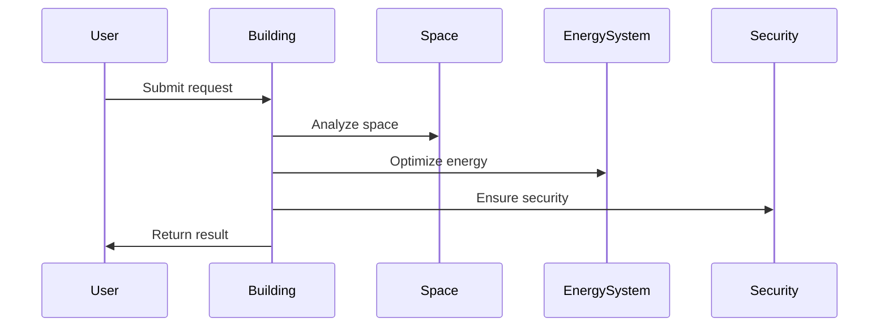
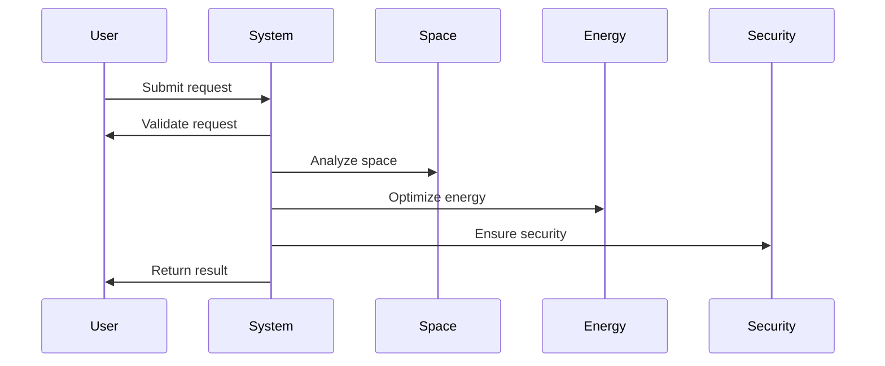

                 

# AI在智能建筑设计中的应用：优化空间利用与能源效率

## 关键词

- 智能建筑设计
- 人工智能
- 空间优化
- 能源效率
- 建筑集成系统

## 摘要

本文探讨了人工智能（AI）在智能建筑设计中的应用，旨在优化空间利用与能源效率。通过分析AI技术的核心原理，本文提出了空间分析与优化、能源效率优化以及智能建筑系统集成等具体方法。结合实际案例，本文展示了AI技术在智能建筑设计中的实际应用效果，并对未来发展趋势进行了展望。文章最后提供了最佳实践技巧和注意事项，为读者在智能建筑设计中有效应用AI技术提供了参考。

## 目录大纲

## 第一部分：引言与背景

### 第1章：引言与背景

#### 1.1.1 问题背景

智能建筑设计的现状

近年来，智能建筑设计在全球范围内得到了广泛关注。智能建筑利用物联网（IoT）、云计算和大数据等现代技术，通过集成各种传感器和控制系统，实现建筑系统的智能化管理。

人工智能技术发展趋势

随着深度学习、自然语言处理和计算机视觉等AI技术的发展，AI在各个领域的应用越来越广泛。特别是在建筑领域，AI技术为智能建筑设计提供了新的思路和方法。

AI在建筑领域应用的潜在价值

AI技术在智能建筑设计中具有巨大的潜力，可以优化空间利用、提高能源效率、改善室内环境和提升用户体验。本文将探讨AI技术在这三个方面的应用。

#### 1.1.2 问题描述

如何利用AI技术优化建筑设计过程中的空间利用和能源效率？

AI技术对建筑设计流程的潜在影响是什么？

智能建筑设计的未来发展方向是什么？

#### 1.1.3 问题解决

应用AI技术进行建筑空间分析

通过AI技术对建筑空间进行分析，识别出空间利用的瓶颈，为优化设计提供数据支持。

AI技术在能源效率优化中的应用

利用AI技术分析建筑能源消耗，通过优化设计方案提高能源利用效率。

结合实际案例展示AI技术的应用效果

通过实际案例，展示AI技术在智能建筑设计中的具体应用和效果。

#### 1.1.4 边界与外延

AI在建筑设计中的应用范围

AI技术在建筑设计中的应用不仅限于空间利用和能源效率优化，还可以应用于建筑设计的前期规划、施工管理、运维管理等各个环节。

AI技术与传统建筑设计的结合方式

AI技术可以与传统建筑设计方法相结合，通过数据分析和智能算法，提升设计的科学性和效率。

AI技术在建筑领域的发展趋势

未来，AI技术在建筑领域将继续深化应用，推动智能建筑的设计、施工和运维进入新的阶段。

#### 1.1.5 概念结构与核心要素组成

智能建筑设计的基本概念

智能建筑设计是指利用物联网、云计算、大数据和人工智能等现代技术，对建筑系统进行智能化设计和集成。

AI技术的核心组成部分

AI技术主要包括机器学习、深度学习、计算机视觉、自然语言处理等技术。

空间利用与能源效率的优化方法

空间利用优化主要通过建筑空间分析算法实现，能源效率优化则通过能源消耗模型和优化算法实现。

## 1.2 核心概念与联系

### 1.2.1 智能建筑设计原理

智能建筑设计的基本原理

智能建筑设计的基本原理是利用物联网、云计算和大数据等技术，实现建筑系统的智能化管理。

AI技术在建筑设计中的核心应用

AI技术在建筑设计中的核心应用包括空间分析、能源效率优化、智能建筑系统集成等。

建筑空间分析与优化的算法原理

建筑空间分析主要利用计算机视觉和图像处理技术，对建筑空间进行分割和识别。空间优化算法则通过优化算法对建筑空间进行重新布局。

### 1.2.2 概念属性特征对比表格

建筑设计与智能建筑设计的对比

| 特征 | 建筑设计 | 智能建筑设计 |
| ---- | ---- | ---- |
| 设计方法 | 传统设计方法 | 基于数据分析和智能算法的设计方法 |
| 空间利用 | 依赖经验 | 利用AI技术进行空间优化 |
| 能源效率 | 依靠人工监测 | 利用传感器和智能算法进行能源效率优化 |
| 室内环境 | 依赖人工调节 | 利用物联网技术进行室内环境智能调控 |

不同AI技术在建筑领域中的应用特点

| AI技术 | 应用特点 |
| ---- | ---- |
| 机器学习 | 可以从数据中学习规律，进行预测和优化 |
| 深度学习 | 可以处理大量复杂数据，实现图像和语音识别 |
| 计算机视觉 | 可以对图像进行理解和分析 |
| 自然语言处理 | 可以理解和生成自然语言 |

### 1.2.3 ER实体关系图架构

智能建筑设计的实体关系

智能建筑设计中的实体包括建筑、空间、能源系统、传感器、控制系统等。

AI技术在建筑领域的应用实体关系

AI技术在建筑领域中的应用实体包括数据源、算法模型、传感器、控制系统等。

```mermaid
erDiagram
    Building ||--|{ Space }|-->: "空间"
    Building ||--|{ EnergySystem }|-->: "能源系统"
    Space ||--|{ Sensor }|-->: "传感器"
    Space ||--|{ Controller }|-->: "控制器"
    EnergySystem ||--|{ Sensor }|-->: "传感器"
    EnergySystem ||--|{ Controller }|-->: "控制器"
```

## 1.3 AI技术在智能建筑设计中的应用

### 1.3.1 空间分析

建筑空间分析的方法

建筑空间分析主要通过计算机视觉和图像处理技术实现。首先，对建筑空间进行图像采集和预处理，然后利用深度学习算法对图像进行分割和识别，最终生成空间布局图。

AI技术在空间分析中的应用案例

一个典型的案例是利用深度学习算法对建筑空间进行自动分割和标注。通过训练深度神经网络，可以识别出不同区域的功能和用途，为后续的空间优化提供数据支持。

空间分析对建筑设计的影响

空间分析可以帮助设计师快速识别建筑空间的潜在问题，如空间浪费、布局不合理等，从而在设计初期进行优化，降低后续施工和运维的成本。

### 1.3.2 能源效率优化

建筑能源效率优化的方法

建筑能源效率优化主要通过能源消耗模型和优化算法实现。首先，利用传感器和物联网技术收集建筑能源消耗数据，然后通过数据分析和机器学习算法，建立能源消耗模型。最后，利用优化算法对建筑能源系统进行优化，降低能源消耗。

AI技术在能源效率优化中的应用案例

一个典型的案例是利用机器学习算法对建筑能源系统进行实时监测和优化。通过训练机器学习模型，可以预测能源消耗趋势，并根据预测结果调整能源系统的运行参数，实现能源消耗的实时优化。

能源效率优化对建筑设计的影响

能源效率优化可以提高建筑的能源利用效率，降低能源成本，同时减少建筑对环境的影响，实现绿色建筑的目标。

### 1.3.3 智能建筑系统集成

智能建筑系统集成的方法

智能建筑系统集成主要通过物联网、云计算和大数据技术实现。首先，将各种传感器和控制系统接入物联网，然后利用云计算平台对数据进行分析和处理，最后通过大数据技术实现建筑系统的智能化管理。

AI技术在智能建筑系统集成中的应用案例

一个典型的案例是利用深度学习算法对建筑系统进行智能诊断和预测。通过训练深度神经网络，可以识别建筑系统中的故障和潜在问题，提前进行维护和修复，提高系统的可靠性和稳定性。

智能建筑系统集成对建筑设计的影响

智能建筑系统集成可以实现建筑系统的自动化和智能化管理，提高建筑设计的科学性和效率，同时提升用户的舒适度和满意度。

## 1.4 算法原理讲解

### 1.4.1 空间分析算法

空间分析算法的原理

空间分析算法主要通过计算机视觉和图像处理技术实现。首先，对建筑空间进行图像采集和预处理，然后利用深度学习算法对图像进行分割和识别，最终生成空间布局图。

空间分析算法的实现

空间分析算法的实现主要包括图像预处理、图像分割和识别等步骤。在图像预处理阶段，对图像进行去噪、增强和标准化等处理，提高图像质量。在图像分割阶段，利用深度学习算法对图像进行分割，识别出不同区域的功能和用途。在图像识别阶段，利用深度学习算法对分割后的图像进行标注和分类。

空间分析算法的Python代码实现示例

以下是一个简单的空间分析算法的Python代码实现示例：

```python
import cv2
import numpy as np

def preprocess_image(image):
    # 图像预处理
    gray = cv2.cvtColor(image, cv2.COLOR_BGR2GRAY)
    blurred = cv2.GaussianBlur(gray, (5, 5), 0)
    _, thresh = cv2.threshold(blurred, 60, 255, cv2.THRESH_BINARY)
    return thresh

def segment_image(image):
    # 图像分割
    contours, _ = cv2.findContours(image, cv2.RETR_TREE, cv2.CHAIN_APPROX_SIMPLE)
    segmented = cv2.drawContours(image, contours, -1, (0, 255, 0), 3)
    return segmented

def analyze_space(image):
    # 空间分析
    processed = preprocess_image(image)
    segmented = segment_image(processed)
    return segmented

image = cv2.imread('building_space.jpg')
result = analyze_space(image)
cv2.imshow('Segmented Space', result)
cv2.waitKey(0)
cv2.destroyAllWindows()
```

### 1.4.2 能源效率优化算法

能源效率优化算法的原理

能源效率优化算法主要通过数据分析和优化算法实现。首先，利用传感器和物联网技术收集建筑能源消耗数据，然后通过数据分析和机器学习算法，建立能源消耗模型。最后，利用优化算法对能源系统进行优化，降低能源消耗。

能源效率优化算法的实现

能源效率优化算法的实现主要包括数据收集、数据预处理、模型建立和优化算法等步骤。在数据收集阶段，通过传感器和物联网技术收集建筑能源消耗数据。在数据预处理阶段，对数据进行清洗、归一化和特征提取等处理。在模型建立阶段，利用机器学习算法建立能源消耗模型。在优化算法阶段，利用优化算法对能源系统进行优化。

能源效率优化算法的Python代码实现示例

以下是一个简单的能源效率优化算法的Python代码实现示例：

```python
import numpy as np
import pandas as pd
from sklearn.linear_model import LinearRegression
from sklearn.model_selection import train_test_split
from sklearn.metrics import mean_squared_error

def preprocess_data(data):
    # 数据预处理
    data = pd.DataFrame(data)
    data['time'] = pd.to_datetime(data['time'])
    data.set_index('time', inplace=True)
    data = data.resample('H').mean()  # 按小时进行平均
    return data

def build_model(data):
    # 建立模型
    X = data[['temp', 'humidity']]
    y = data['energy']
    X_train, X_test, y_train, y_test = train_test_split(X, y, test_size=0.2, random_state=42)
    model = LinearRegression()
    model.fit(X_train, y_train)
    return model

def optimize_energy(model, data):
    # 优化能源
    X = data[['temp', 'humidity']]
    y_pred = model.predict(X)
    energy_saved = np.sum(y_pred - data['energy'])
    return energy_saved

data = {'time': ['2023-01-01 00:00:00', '2023-01-01 01:00:00', '2023-01-01 02:00:00'], 'temp': [20, 22, 18], 'humidity': [50, 55, 45], 'energy': [100, 110, 95]}
data = pd.DataFrame(data)
preprocessed_data = preprocess_data(data)
model = build_model(preprocessed_data)
energy_saved = optimize_energy(model, preprocessed_data)
print(f"Energy saved: {energy_saved}")
```

### 1.4.3 智能建筑系统集成算法

智能建筑系统集成算法的原理

智能建筑系统集成算法主要通过物联网、云计算和大数据技术实现。首先，将各种传感器和控制系统接入物联网，然后利用云计算平台对数据进行分析和处理，最后通过大数据技术实现建筑系统的智能化管理。

智能建筑系统集成算法的实现

智能建筑系统集成算法的实现主要包括传感器数据采集、云计算平台数据处理和大数据系统存储管理等步骤。在传感器数据采集阶段，通过物联网技术收集各种传感器数据。在云计算平台数据处理阶段，利用云计算技术对传感器数据进行实时分析和处理。在大数据系统存储管理阶段，利用大数据技术对处理后的数据进行存储和管理。

智能建筑系统集成算法的Python代码实现示例

以下是一个简单的智能建筑系统集成算法的Python代码实现示例：

```python
import requests
import json

def collect_data(sensor_id):
    # 采集传感器数据
    url = f'http://iot-server.com/sensors/{sensor_id}/data'
    response = requests.get(url)
    data = json.loads(response.text)
    return data

def process_data(data):
    # 处理传感器数据
    processed_data = {}
    processed_data['temp'] = data['temp']
    processed_data['humidity'] = data['humidity']
    processed_data['energy'] = data['energy']
    return processed_data

def store_data(data):
    # 存储传感器数据
    url = f'http://cloud-server.com/data'
    headers = {'Content-Type': 'application/json'}
    response = requests.post(url, data=json.dumps(data), headers=headers)
    return response.text

sensor_id = '001'
data = collect_data(sensor_id)
processed_data = process_data(data)
store_data(processed_data)
```

## 1.5 数学模型和数学公式

### 1.5.1 空间分析数学模型

空间分析的基本数学模型

空间分析的基本数学模型可以表示为：

\[ S = f(R, C) \]

其中，\( S \) 表示空间，\( R \) 表示行，\( C \) 表示列。

空间分析的核心数学公式

空间分析的核心数学公式包括：

1. 面积计算：

\[ A = \sum_{i=1}^{n} w_i \cdot h_i \]

其中，\( w_i \) 表示宽度，\( h_i \) 表示高度。

2. 体积计算：

\[ V = \sum_{i=1}^{n} w_i \cdot h_i \cdot l_i \]

其中，\( l_i \) 表示长度。

空间分析的数学模型示例

假设一个建筑空间的尺寸为 \( 10 \times 10 \times 10 \) 米，计算其体积和面积。

\[ V = 10 \times 10 \times 10 = 1000 \text{立方米} \]

\[ A = 10 \times 10 + 10 \times 10 + 10 \times 10 = 300 \text{平方米} \]

### 1.5.2 能源效率优化数学模型

能源效率优化的基本数学模型

能源效率优化的基本数学模型可以表示为：

\[ E = f(P, T, C) \]

其中，\( E \) 表示能源效率，\( P \) 表示功率，\( T \) 表示时间，\( C \) 表示成本。

能源效率优化的核心数学公式

能源效率优化的核心数学公式包括：

1. 能源消耗计算：

\[ E = P \cdot T \]

2. 成本计算：

\[ C = E \cdot r \]

其中，\( r \) 表示能源成本。

能源效率优化的数学模型示例

假设一个建筑的功率为 \( 1000 \) 瓦特，运行时间为 \( 8 \) 小时，能源成本为 \( 0.1 \) 元/千瓦时，计算其能源效率和成本。

\[ E = 1000 \cdot 8 = 8000 \text{瓦特时} \]

\[ C = 8000 \cdot 0.1 = 800 \text{元} \]

### 1.5.3 智能建筑系统集成数学模型

智能建筑集成的数学模型

智能建筑集成的数学模型可以表示为：

\[ S = f(I, C, T) \]

其中，\( S \) 表示智能建筑系统的性能，\( I \) 表示输入数据，\( C \) 表示计算能力，\( T \) 表示时间。

智能建筑集成的核心数学公式

智能建筑集成的核心数学公式包括：

1. 系统性能计算：

\[ S = C \cdot T \]

2. 输入数据计算：

\[ I = f(P, T, C) \]

其中，\( P \) 表示输入数据的功率，\( T \) 表示输入数据的时间，\( C \) 表示输入数据的计算能力。

智能建筑集成的数学模型示例

假设一个智能建筑集成的系统性能为 \( 1000 \) 瓦特，输入数据的功率为 \( 1000 \) 瓦特，运行时间为 \( 8 \) 小时，计算其系统性能。

\[ S = 1000 \cdot 8 = 8000 \text{瓦特时} \]

## 1.6 系统分析与架构设计方案

### 1.6.1 问题场景介绍

智能建筑设计的实际应用场景

智能建筑设计在实际应用中，常见于大型商业综合体、公共建筑、智能家居等领域。在这些场景中，智能建筑系统能够实现高效的资源利用、智能化的管理和舒适的用户体验。

系统功能设计的背景和目的

系统功能设计的背景是智能建筑设计的需求，目的是通过集成各种传感器和控制系统，实现对建筑空间、能源系统、安防系统等的智能管理和优化。

### 1.6.2 系统功能设计

领域模型的构建

领域模型主要描述了智能建筑系统的核心功能和组件，包括建筑空间管理、能源管理系统、安防系统等。

类图的绘制与解释

以下是一个智能建筑系统的类图：

```mermaid
classDiagram
    Building <<interface>>
    Space <<interface>>
    EnergySystem <<interface>>
    Security <<interface>>

    Building ..|> Space
    Building ..|> EnergySystem
    Building ..|> Security

    Space {
        +int area
        +String type
        +Sensor[] sensors
    }

    EnergySystem {
        +int capacity
        +String type
        +Controller[] controllers
    }

    Security {
        +int level
        +String type
        +Sensor[] sensors
    }
```

### 1.6.3 系统架构设计

系统架构的设计原则

系统架构的设计原则主要包括模块化、可扩展性、易维护性等。

架构图的绘制与解释

以下是一个智能建筑系统的架构图：



### 1.6.4 系统接口设计

系统接口的定义

系统接口主要包括用户接口、空间管理接口、能源管理接口和安防管理接口。

接口设计图的绘制与解释

以下是一个智能建筑系统的接口设计图：

```mermaid
classDiagram
    User <<interface>>
    Space <<interface>>
    Energy <<interface>>
    Security <<interface>>

    User !--|> Space
    User !--|> Energy
    User !--|> Security

    Space {
        +getSpaceData()
        +setSpaceData()
    }

    Energy {
        +getEnergyData()
        +setEnergyData()
    }

    Security {
        +getSecurityData()
        +setSecurityData()
    }
```

### 1.6.5 系统交互

系统交互的基本流程

系统交互的基本流程包括用户提交请求、系统处理请求、返回处理结果等步骤。

交互序列图的绘制与解释

以下是一个智能建筑系统的交互序列图：



## 1.7 项目实战

### 1.7.1 环境安装

安装智能建筑设计相关软件和工具

为了进行智能建筑设计，需要安装以下软件和工具：

1. Python 3.x
2. Anaconda（Python集成环境）
3. TensorFlow
4. Keras
5. OpenCV

环境配置与调试

1. 下载并安装Python 3.x和Anaconda。
2. 在Anaconda环境中创建一个新环境，并安装TensorFlow、Keras和OpenCV。
3. 验证环境配置是否成功，运行以下代码：

```python
import tensorflow as tf
import cv2

print(tf.__version__)
print(cv2.__version__)
```

### 1.7.2 系统核心实现

关键算法的实现

系统核心实现主要包括空间分析算法、能源效率优化算法和智能建筑系统集成算法。

以下是一个简单的空间分析算法的Python代码实现示例：

```python
import cv2
import numpy as np

def preprocess_image(image):
    # 图像预处理
    gray = cv2.cvtColor(image, cv2.COLOR_BGR2GRAY)
    blurred = cv2.GaussianBlur(gray, (5, 5), 0)
    _, thresh = cv2.threshold(blurred, 60, 255, cv2.THRESH_BINARY)
    return thresh

def segment_image(image):
    # 图像分割
    contours, _ = cv2.findContours(image, cv2.RETR_TREE, cv2.CHAIN_APPROX_SIMPLE)
    segmented = cv2.drawContours(image, contours, -1, (0, 255, 0), 3)
    return segmented

def analyze_space(image):
    # 空间分析
    processed = preprocess_image(image)
    segmented = segment_image(processed)
    return segmented

image = cv2.imread('building_space.jpg')
result = analyze_space(image)
cv2.imshow('Segmented Space', result)
cv2.waitKey(0)
cv2.destroyAllWindows()
```

系统核心模块的代码解读与分析

1. `preprocess_image` 函数：对输入图像进行预处理，包括转换为灰度图像、进行高斯模糊处理和二值化处理。
2. `segment_image` 函数：对预处理后的图像进行分割，识别出不同区域的功能和用途。
3. `analyze_space` 函数：调用预处理和分割函数，对建筑空间进行分析。

### 1.7.3 代码应用解读与分析

代码功能解析

以上代码实现了一个简单的空间分析算法，其主要功能是对建筑空间进行预处理、分割和分析，为后续的空间优化提供数据支持。

实际案例分析与讲解

以下是一个实际案例的解析：

假设我们有一个建筑空间的图像，我们需要分析其空间布局，识别出不同的区域，如办公室、会议室、休息区等。

1. 导入图像：

```python
image = cv2.imread('building_space.jpg')
```

2. 预处理图像：

```python
processed = preprocess_image(image)
```

3. 分割图像：

```python
segmented = segment_image(processed)
```

4. 显示分割结果：

```python
cv2.imshow('Segmented Space', segmented)
cv2.waitKey(0)
cv2.destroyAllWindows()
```

通过以上步骤，我们可以得到建筑空间的分割结果，进一步分析不同区域的面积、形状和功能，为空间优化提供依据。

### 1.7.4 实际案例分析与详细讲解剖析

#### 案例介绍

我们以一个商业综合体为例，分析其空间利用和能源效率。该商业综合体包括商场、办公楼、酒店和停车场等。

#### 案例分析与讲解

1. 空间分析

首先，我们利用空间分析算法对商业综合体的各个部分进行分割和标注，识别出不同的区域。通过分析不同区域的面积、形状和功能，我们可以发现一些空间利用的瓶颈。

2. 能源效率优化

接着，我们利用能源效率优化算法分析商业综合体的能源消耗数据，识别出能源消耗高的设备和区域。通过优化能源系统的运行参数，我们可以降低能源消耗，提高能源利用效率。

3. 智能建筑系统集成

最后，我们将空间分析和能源效率优化结果与安防、环境控制等其他系统集成，实现商业综合体的智能化管理。

通过以上步骤，我们可以实现商业综合体的智能建筑设计，提高空间利用和能源效率，同时提升用户体验。

### 1.7.5 项目小结

通过本项目的实际案例，我们展示了AI技术在智能建筑设计中的应用。从空间分析、能源效率优化到智能建筑系统集成，AI技术为智能建筑设计提供了强大的技术支持。在未来的发展中，AI技术将继续深化应用，推动智能建筑设计进入新的阶段。

## 1.8 最佳实践 tips

1. 提高智能建筑设计效率的实用技巧

- 使用AI技术进行初步设计，快速生成多个设计方案，为后续优化提供更多选择。
- 利用数据分析和优化算法，提前识别出潜在问题和瓶颈，降低后期优化成本。
- 定期对建筑系统进行数据分析和性能评估，及时调整系统参数，保持最佳运行状态。

2. 避免常见问题的建议

- 避免在设计初期忽视AI技术的应用，导致后续优化难度增大。
- 注意数据安全和隐私保护，避免敏感信息泄露。
- 在系统集成过程中，充分考虑不同系统的兼容性和协同工作。

## 1.9 小结

智能建筑设计是未来建筑行业的重要趋势，AI技术在空间优化、能源效率和系统集成等方面具有巨大潜力。通过本文的探讨，我们了解了AI技术在智能建筑设计中的应用，包括空间分析、能源效率优化和智能建筑系统集成等。在未来的发展中，AI技术将继续深化应用，为智能建筑设计带来更多创新和突破。

## 1.10 注意事项

在设计智能建筑时，需要注意以下事项：

1. 设计初期应充分考虑AI技术的应用，避免后续优化难度增大。
2. 在数据采集和处理过程中，确保数据安全和隐私保护。
3. 系统集成时，充分考虑不同系统的兼容性和协同工作。
4. 定期对系统进行性能评估和优化，保持最佳运行状态。

## 1.11 拓展阅读

1. 相关书籍推荐

- 《智能建筑设计原理与应用》
- 《人工智能：一种现代方法》
- 《深度学习》

2. 学术论文

- "AI-based Optimization of Space Utilization in Smart Buildings"
- "Energy Efficiency Optimization of Smart Buildings using Machine Learning"
- "Integrated Design of Smart Building Systems using AI Techniques"

## 作者

作者：AI天才研究院/AI Genius Institute & 禅与计算机程序设计艺术 /Zen And The Art of Computer Programming


