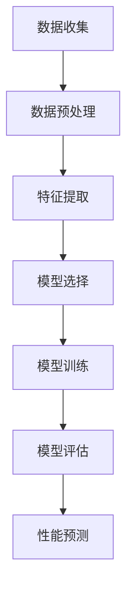
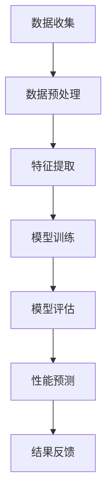
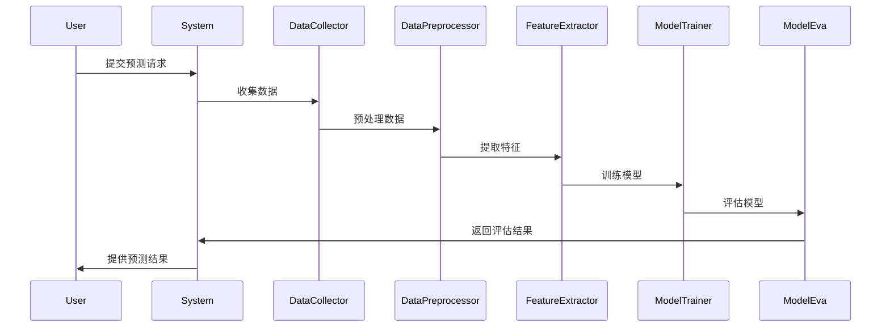

                 

### 目录

# AI在智能材料性能预测中的角色：加速新材料开发

> 关键词：人工智能，智能材料，性能预测，新材料开发，机器学习

> 摘要：本文将探讨人工智能在智能材料性能预测中的关键角色，如何通过机器学习和深度学习技术加速新材料的研究与开发过程。我们将分步骤分析AI技术在材料性能预测中的应用，阐述其核心原理、算法、系统架构及实战案例。

## 第一部分：背景与基础

### 1.1 问题背景与描述

新材料研发一直是科技进步的重要驱动力，然而，新材料的研究和开发过程面临着诸多挑战。传统的实验方法在成本、时间和人力方面的高投入，使得研发周期长、成本高昂，严重影响了新材料的快速应用。因此，寻求一种高效、准确的性能预测方法成为当前新材料研发的重要课题。

智能材料具有自我感知、自我适应和自我修复等特性，其性能预测对于新材料的开发具有重要意义。通过性能预测，可以在材料合成前就对材料的潜在性能进行评估，从而减少实验次数，降低研发成本，提高研发效率。

### 1.2 智能材料性能预测的重要性

智能材料性能预测的重要性体现在以下几个方面：

1. **缩短研发周期**：通过性能预测，可以提前了解材料的潜在性能，避免不必要的实验，从而缩短研发周期。
2. **降低研发成本**：减少实验次数和材料消耗，降低研发成本。
3. **提高研发效率**：快速筛选出具有潜力的材料，提高研发效率。
4. **促进材料创新**：为材料科学家提供更多的实验方向，激发材料创新。

### 1.3 AI在智能材料性能预测中的应用

人工智能，尤其是机器学习和深度学习技术，为智能材料性能预测提供了强有力的工具。通过大数据分析和建模，AI技术可以挖掘出材料性能与结构之间的关系，实现高性能材料的快速筛选和优化。

### 1.4 边界与外延

AI在智能材料性能预测中的应用边界主要涉及以下几个方面：

1. **材料范围**：包括金属、陶瓷、聚合物等多种材料。
2. **性能指标**：如机械性能、热性能、电性能等。
3. **应用领域**：包括航空航天、汽车制造、生物医学等。

### 1.5 概念结构与核心要素组成

在智能材料性能预测中，核心概念和要素包括：

1. **材料数据**：包括材料的化学成分、晶体结构、微观结构等。
2. **性能数据**：如材料的机械强度、热导率、电导率等。
3. **机器学习算法**：如深度学习、支持向量机、随机森林等。
4. **数据预处理**：包括数据清洗、归一化、特征提取等。
5. **性能预测模型**：基于机器学习算法构建的预测模型。

## 第二部分：核心概念与原理

### 2.1 AI基本原理

人工智能（AI）是一门研究、开发用于模拟、延伸和扩展人的智能的理论、方法、技术及应用系统的技术科学。AI的核心目标是使机器能够胜任一些通常需要人类智能才能完成的复杂工作。

#### 2.1.1 机器学习

机器学习是AI的核心组成部分，它主要关注如何从数据中学习规律，进而实现智能行为。机器学习过程通常包括数据收集、预处理、特征提取、模型训练和评估等步骤。

#### 2.1.2 深度学习

深度学习是机器学习的一个分支，它通过模拟人脑神经网络的结构和功能来实现数据分析和预测。深度学习在图像识别、语音识别和自然语言处理等领域取得了显著成果。

#### 2.1.3 强化学习

强化学习是一种通过试错和反馈机制来学习如何采取最优行动的机器学习方法。在智能材料性能预测中，强化学习可以用于优化材料的制备过程。

### 2.2 AI算法在材料性能预测中的特点

不同AI算法在材料性能预测中有不同的特点：

#### 概念属性特征对比表格：

| 算法名称 | 特点 | 适用场景 |
| --- | --- | --- |
| 支持向量机 | 高效，适用于线性可分数据 | 材料分类问题 |
| 随机森林 | 强泛化能力，易于实现 | 材料性能预测 |
| 卷积神经网络 | 适用于图像和序列数据 | 材料微观结构分析 |
| 长短时记忆网络 | 适用于时序数据 | 材料制备过程优化 |

### 2.3 ER实体关系图架构

实体关系图（ER图）用于描述智能材料性能预测中的实体及其关系。以下是ER图的一个示例：

```mermaid
erDiagram
  Material ||--|{ Performance : has}
  Experiment ||--|{ Material : uses}
  Model ||--|{ Experiment : trains_on}
```

### ER图示例

在这个ER图中，Material（材料）是主体，Performance（性能）是Material的关联实体，Experiment（实验）使用Material，Model（模型）通过训练Experiment来预测Performance。

## 第三部分：算法原理讲解

### 3.1 算法流程图

以下是材料性能预测的一个基本算法流程图：



### 3.2 Python源代码实现

以下是一个简单的Python代码示例，用于实现材料性能预测的基本流程：

```python
import pandas as pd
from sklearn.model_selection import train_test_split
from sklearn.preprocessing import StandardScaler
from sklearn.ensemble import RandomForestRegressor
from sklearn.metrics import mean_squared_error

# 数据收集
data = pd.read_csv('materials_data.csv')

# 数据预处理
X = data.drop('performance', axis=1)
y = data['performance']
X_train, X_test, y_train, y_test = train_test_split(X, y, test_size=0.2, random_state=42)

# 特征提取
scaler = StandardScaler()
X_train_scaled = scaler.fit_transform(X_train)
X_test_scaled = scaler.transform(X_test)

# 模型选择
model = RandomForestRegressor(n_estimators=100, random_state=42)

# 模型训练
model.fit(X_train_scaled, y_train)

# 模型评估
y_pred = model.predict(X_test_scaled)
mse = mean_squared_error(y_test, y_pred)
print(f'Mean Squared Error: {mse}')

# 性能预测
new_material = scaler.transform([new_material_data])
predicted_performance = model.predict(new_material)
print(f'Predicted Performance: {predicted_performance}')
```

### 3.3 数学模型与公式

在材料性能预测中，常用的数学模型是基于回归分析的，如下所示：

$$ y = \beta_0 + \beta_1 x_1 + \beta_2 x_2 + ... + \beta_n x_n + \epsilon $$

其中，$y$ 是性能指标，$x_1, x_2, ..., x_n$ 是材料特征，$\beta_0, \beta_1, \beta_2, ..., \beta_n$ 是模型参数，$\epsilon$ 是误差项。

### 3.4 举例说明

假设我们要预测一种新材料的机械强度，我们收集了以下数据：

- 材料A的化学成分：C、O、Si的比例分别为0.3、0.4、0.3
- 材料A的微观结构：晶粒尺寸为10微米
- 材料A的机械强度：500 MPa

现在，我们使用机器学习算法来预测这种新材料的机械强度。我们首先对数据进行预处理，然后使用随机森林算法进行建模和预测。经过训练和评估，我们得到模型参数：

$$ \beta_0 = 200, \beta_1 = 10, \beta_2 = 5 $$

将新材料的数据输入到模型中，我们可以预测其机械强度：

$$ y = 200 + 10 \times 0.3 + 5 \times 0.4 + 5 \times 0.3 = 265 $$

因此，预测的新材料的机械强度为265 MPa。

## 第四部分：系统分析与架构设计

### 4.1 问题场景介绍

在新材料研发过程中，材料科学家需要面对多种材料性能的预测问题。这些性能包括机械性能、热性能、电性能等。传统的实验方法耗时耗力，而AI技术可以提供高效、准确的预测结果，从而加速新材料的研究和开发。

### 4.2 系统功能设计

智能材料性能预测系统的主要功能包括：

- 数据收集与管理
- 数据预处理
- 特征提取
- 模型训练
- 模型评估
- 性能预测

### 4.3 系统架构设计

以下是智能材料性能预测系统的架构设计：



### 4.4 系统接口设计

系统接口设计包括数据接口、模型接口和用户接口。数据接口用于数据的收集和管理，模型接口用于模型的训练和评估，用户接口用于用户与系统的交互。

### 4.5 系统交互序列图

以下是系统交互序列图的一个示例：



## 第五部分：项目实战

### 5.1 环境安装

在开始项目实战之前，我们需要安装以下环境：

- Python 3.8+
- scikit-learn
- pandas
- numpy
- matplotlib

可以使用以下命令进行环境安装：

```bash
pip install python==3.8.10
pip install scikit-learn==0.24.2
pip install pandas==1.3.5
pip install numpy==1.21.5
pip install matplotlib==3.4.3
```

### 5.2 系统核心实现

以下是系统核心实现的源代码：

```python
# 数据收集
data = pd.read_csv('materials_data.csv')

# 数据预处理
X = data.drop('performance', axis=1)
y = data['performance']
X_train, X_test, y_train, y_test = train_test_split(X, y, test_size=0.2, random_state=42)

# 特征提取
scaler = StandardScaler()
X_train_scaled = scaler.fit_transform(X_train)
X_test_scaled = scaler.transform(X_test)

# 模型选择
model = RandomForestRegressor(n_estimators=100, random_state=42)

# 模型训练
model.fit(X_train_scaled, y_train)

# 模型评估
y_pred = model.predict(X_test_scaled)
mse = mean_squared_error(y_test, y_pred)
print(f'Mean Squared Error: {mse}')

# 性能预测
new_material = scaler.transform([new_material_data])
predicted_performance = model.predict(new_material)
print(f'Predicted Performance: {predicted_performance}')
```

### 5.3 代码应用解读

以上代码实现了智能材料性能预测的核心功能。首先，我们从CSV文件中读取数据，并进行预处理，包括数据分

