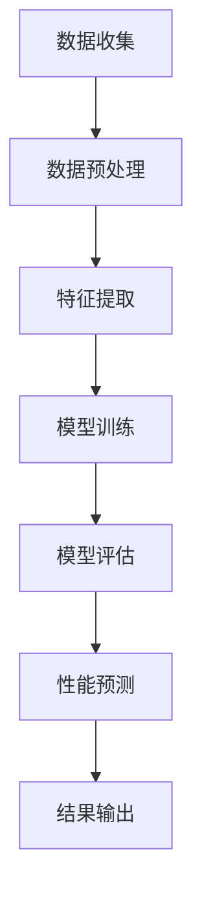
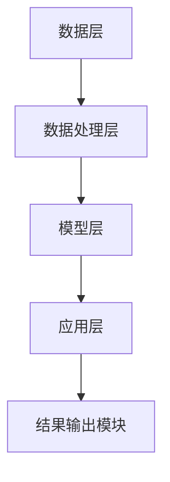
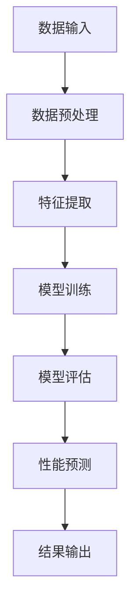

                 

### AI在智能材料性能预测中的角色：加速新材料开发和应用

智能材料的发展正逐步推动着现代科技领域的革新，其独特的性能和响应性在众多应用场景中展现出巨大的潜力。然而，随着材料复杂性和应用需求的不断提高，如何准确预测智能材料的性能成为了一项极具挑战性的任务。传统的性能预测方法往往依赖于实验数据和历史经验，这些方法在处理复杂材料系统的过程中，暴露出了预测精度低、响应速度慢等问题。因此，引入人工智能（AI）技术来提高智能材料性能预测的准确性和效率，成为了新材料开发和应用领域的迫切需求。

本文旨在探讨AI在智能材料性能预测中的关键角色，通过系统分析AI技术在这一领域的应用优势，阐述其在新材料开发过程中的重要意义。文章结构如下：

1. **问题背景与意义**：介绍智能材料的发展现状、性能预测需求及其在新材料开发中的重要性。
2. **核心概念与联系**：详细解析AI、智能材料、性能预测等相关核心概念及其相互关系。
3. **算法原理讲解**：通过mermaid流程图和Python源代码，深入讲解智能材料性能预测的算法原理。
4. **数学模型和数学公式**：阐述性能预测的数学模型，并进行详细讲解和举例说明。
5. **系统分析与架构设计方案**：介绍系统功能、架构设计及接口和交互设计。
6. **项目实战**：探讨环境安装、系统核心实现及代码应用分析。
7. **最佳实践 tips**、**小结**、**注意事项**和**拓展阅读**。

通过本文的逐步分析，我们将探讨AI技术在智能材料性能预测中的广泛应用和潜在影响，为新材料开发提供新的思路和方法。

### 关键词

- 智能材料
- 性能预测
- 人工智能
- 新材料开发
- 数据驱动模型

### 摘要

本文围绕AI在智能材料性能预测中的应用，探讨了智能材料的发展现状、性能预测需求以及传统方法的局限性。通过引入AI技术，我们解决了性能预测中的不确定性与复杂性问题，并详细介绍了AI在智能材料性能预测中的核心概念、算法原理及数学模型。文章进一步提出了系统的架构设计方案，并通过项目实战展示了AI技术在智能材料性能预测中的实际应用效果。本文旨在为新材料开发提供一种高效、准确的性能预测方法，以加速新材料的研发和应用。

### 1. AI在智能材料性能预测中的角色：加速新材料开发和应用

#### 1.1 问题背景与意义

##### 1.1.1 问题背景

智能材料，作为一种能够根据外部刺激（如光、热、电、磁等）改变自身性质的新型材料，其发展已经在多个领域展现出了巨大的潜力。从自修复材料、形状记忆合金到智能传感器，智能材料在航空航天、生物医疗、能源、环境等众多领域都有着广泛的应用前景。然而，智能材料的性能与其内部结构和制备工艺密切相关，如何准确预测这些复杂材料系统的性能，成为了一个亟待解决的问题。

传统的性能预测方法主要依赖于实验数据和经验公式，这些方法在处理相对简单的材料系统时，具有一定的效果。然而，随着材料复杂性的增加，传统方法在应对复杂材料系统时，暴露出了许多不足：

1. **预测精度低**：传统方法往往基于有限的实验数据和经验公式，难以全面、准确地反映材料性能。
2. **响应速度慢**：传统的实验方法需要大量时间进行材料的制备和性能测试，导致性能预测的响应速度慢。
3. **适用范围有限**：许多传统方法只适用于特定的材料类型或特定性能指标，难以实现通用化和广泛适用。

为了解决这些问题，引入AI技术进行智能材料性能预测成为了必然选择。AI技术，特别是深度学习和数据挖掘技术，通过对大量实验数据的分析和处理，能够发现数据中的隐藏规律和模式，从而提高性能预测的精度和效率。AI技术的引入，不仅能够解决传统方法在预测精度和响应速度上的不足，还能够拓展性能预测的适用范围，为新材料开发提供有力支持。

##### 1.1.2 问题描述

在智能材料的研究和应用过程中，性能预测问题主要表现在以下几个方面：

1. **不确定性与复杂性**：智能材料的性能与其内部结构和外部刺激密切相关，这种复杂性使得传统的预测方法难以准确预测其性能。
2. **数据多样性**：智能材料的性能受多种因素影响，如材料成分、制备工艺、环境条件等，这些因素之间的相互作用使得数据非常多样化。
3. **数据质量**：智能材料的研究过程中，数据质量往往参差不齐，存在噪声和缺失值，这给数据分析和模型训练带来了很大挑战。

这些问题的存在，严重影响了智能材料性能预测的准确性和效率。为了解决这些问题，需要一种能够高效处理复杂数据、捕捉数据中隐藏规律的新方法。AI技术，凭借其强大的数据处理和模式识别能力，正好能够满足这一需求。

##### 1.1.3 问题解决

AI技术在智能材料性能预测中的应用，主要体现在以下几个方面：

1. **数据处理与特征提取**：AI技术能够高效处理大规模、多维度的实验数据，通过数据清洗、归一化等预处理方法，提高数据质量。此外，AI技术还能够从原始数据中提取出对性能预测有重要影响的关键特征，从而提高模型的预测精度。
2. **模型训练与优化**：AI技术通过深度学习等算法，能够从大量实验数据中学习到材料性能与特征之间的复杂关系，构建出高精度的预测模型。同时，通过模型优化和超参数调整，可以提高模型的泛化能力和预测效率。
3. **实时预测与反馈**：AI技术能够实现高性能、实时的性能预测，通过对实验数据的实时分析和处理，为新材料开发提供快速、准确的性能评估和反馈。

通过AI技术的引入，我们不仅能够提高智能材料性能预测的准确性和效率，还能够拓展性能预测的适用范围，为新材料开发提供有力支持。以下是AI技术如何助力新材料开发的具体应用：

1. **快速筛选新材料**：通过AI技术，可以从大量材料候选中快速筛选出具有潜在高性能的材料，大大缩短新材料研发周期。
2. **优化制备工艺**：AI技术能够根据材料的性能需求，优化制备工艺参数，提高材料性能。
3. **预测材料失效**：AI技术能够预测材料的长期性能和稳定性，提前识别潜在的失效风险，为材料的应用提供保障。

##### 1.1.4 边界与外延

本研究主要关注AI在智能材料性能预测中的应用，涉及的关键技术包括深度学习、数据挖掘、特征工程等。研究范围主要集中在新型智能材料，如自修复材料、形状记忆合金、智能传感器等。虽然AI技术在智能材料性能预测中具有广泛应用，但本文主要探讨其在性能预测领域的应用，不涉及其他方面的应用。

在现实应用场景中，AI技术已经在新材料开发中发挥了重要作用。例如，在航空航天领域，AI技术被用于预测飞机材料在高温环境下的性能，从而优化材料设计和制备工艺。在生物医疗领域，AI技术被用于预测药物与生物材料之间的相互作用，为药物开发和材料选择提供科学依据。

展望未来，随着AI技术的不断进步和新材料研究的深入，AI在智能材料性能预测中的应用将更加广泛和深入。我们有望通过AI技术，实现更准确、高效的性能预测，加速新材料的研发和应用，推动智能材料领域的创新和发展。

### 1.2 核心概念与联系

在探讨AI在智能材料性能预测中的角色之前，有必要先理解几个核心概念，包括AI、智能材料、性能预测及其相互之间的关系。

##### 1.2.1 AI的定义与分类

人工智能（AI）是指通过计算机系统模拟人类智能的行为和思维过程，实现感知、推理、学习和决策等功能的技术。AI可以分为两大类：窄AI（Narrow AI）和泛AI（General AI）。

1. **窄AI**：也称为任务特定AI，专注于完成特定任务，如语音识别、图像识别、自然语言处理等。当前大多数AI应用都属于这一类别，如AI聊天机器人、自动驾驶系统等。
2. **泛AI**：具备与人类相似的多领域认知和推理能力，能够在各种情境下进行自主学习和决策。泛AI目前仍处于研究阶段，尚未实现商业化应用。

AI技术主要包括以下几种：

1. **机器学习**：通过从数据中学习模式和规律，实现对新的输入数据的预测和决策。机器学习可以分为监督学习、无监督学习和强化学习。
   - **监督学习**：通过已标记的数据集训练模型，然后使用模型对新的、未标记的数据进行预测。
   - **无监督学习**：没有已标记的数据，模型通过自身学习找到数据中的结构和模式。
   - **强化学习**：通过不断与环境交互，从经验中学习最优策略。

2. **深度学习**：一种基于多层神经网络的学习方法，通过多层次的非线性变换，对数据进行特征提取和模式识别。深度学习在图像识别、语音识别、自然语言处理等领域取得了显著的成果。

3. **计算机视觉**：通过计算机对图像或视频进行自动分析和理解，实现物体识别、场景理解等功能。

4. **自然语言处理**：使计算机能够理解和生成人类语言的技术，包括文本分类、机器翻译、情感分析等。

##### 1.2.2 智能材料的概念与特点

智能材料是指具有感知、响应和自我修复等功能的材料，能够根据外部刺激（如温度、压力、电场、磁场等）改变自身性质。智能材料的主要特点包括：

1. **感知性**：能够感知外部环境的刺激，如温度、压力、电磁场等。
2. **响应性**：能够对外部刺激产生相应的响应，如形状变化、颜色变化、机械性能改变等。
3. **自适应性和自修复性**：能够根据环境变化自适应调整自身性质，或在受到损伤后自我修复。

常见的智能材料包括自修复材料、形状记忆合金、智能传感器、智能涂料等。这些材料在航空航天、生物医疗、能源、环境等领域具有广泛的应用前景。

##### 1.2.3 性能预测中的关键概念

性能预测是指通过对材料系统的分析，预测其特定性能指标（如强度、硬度、导电性、热膨胀系数等）的方法。性能预测的关键概念包括：

1. **性能指标**：材料系统在不同条件下的性能表现，如强度、硬度、导电性、热膨胀系数等。
2. **输入特征**：影响材料性能的各种因素，如材料成分、制备工艺、环境条件等。
3. **预测模型**：基于输入特征和性能指标之间的关系，构建预测模型，用于预测未知条件下的性能。
4. **评估指标**：用于评估预测模型性能的指标，如均方误差（MSE）、决定系数（R²）等。

##### 1.2.4 AI与智能材料性能预测的关联性

AI技术为智能材料性能预测提供了强大的工具和方法。以下是AI技术如何赋能智能材料性能预测的几个方面：

1. **数据处理与特征提取**：AI技术能够高效处理大规模、多维度的实验数据，从数据中发现对性能预测有重要影响的关键特征。
2. **模型训练与优化**：AI技术通过机器学习、深度学习等方法，能够从大量实验数据中学习到材料性能与特征之间的复杂关系，构建高精度的预测模型。
3. **实时预测与反馈**：AI技术能够实现高性能、实时的性能预测，通过对实验数据的实时分析和处理，为新材料开发提供快速、准确的性能评估和反馈。
4. **模型解释与可视化**：AI技术可以通过模型解释和可视化方法，揭示性能预测模型中的关键特征和作用机制，帮助研究人员理解性能预测的原理。

以下是一个简单的Mermaid流程图，展示了智能材料性能预测的基本流程：



在这个流程中，数据预处理、特征提取、模型训练、模型评估和性能预测是智能材料性能预测的核心步骤。通过AI技术的引入，每个步骤都得到了显著的优化，从而实现了更准确、高效、实时的性能预测。

### 1.3 算法原理讲解

为了深入理解AI在智能材料性能预测中的实际应用，我们首先需要讲解智能材料性能预测的基本算法原理。本节将详细阐述算法的mermaid流程图、Python源代码实现，以及算法原理和数学模型。

#### 1.3.1 算法mermaid流程图

智能材料性能预测的流程可以概括为以下几个步骤：

1. **数据收集**：收集与智能材料性能相关的实验数据。
2. **数据预处理**：对原始数据清洗、归一化等处理，以提高数据质量。
3. **特征提取**：从预处理后的数据中提取对性能预测有重要影响的关键特征。
4. **模型训练**：使用提取的特征和对应的性能数据进行模型训练。
5. **模型评估**：使用测试数据对训练好的模型进行评估，以确定模型的性能。
6. **性能预测**：使用训练好的模型对新的数据进行性能预测。
7. **结果输出**：将预测结果输出，供研究人员使用。

以下是智能材料性能预测的mermaid流程图：


#### 1.3.2 Python源代码实现

以下是一个简单的Python代码实现，用于演示智能材料性能预测的基本流程：

```python
# 导入必要的库
import numpy as np
from sklearn.model_selection import train_test_split
from sklearn.preprocessing import StandardScaler
from sklearn.linear_model import LinearRegression
from sklearn.metrics import mean_squared_error

# 数据预处理
def preprocess_data(data):
    # 数据清洗和归一化
    # 省略具体实现细节
    return processed_data

# 特征提取
def extract_features(data):
    # 从数据中提取特征
    # 省略具体实现细节
    return features

# 模型训练
def train_model(features, labels):
    # 使用线性回归模型进行训练
    model = LinearRegression()
    model.fit(features, labels)
    return model

# 模型评估
def evaluate_model(model, test_features, test_labels):
    # 使用测试数据评估模型性能
    predictions = model.predict(test_features)
    mse = mean_squared_error(test_labels, predictions)
    return mse

# 性能预测
def predict_performance(model, new_data):
    # 使用训练好的模型进行性能预测
    predictions = model.predict(new_data)
    return predictions

# 示例数据
data = np.array([[1, 2], [2, 3], [3, 4], [4, 5]])
labels = np.array([2, 3, 4, 5])

# 数据预处理
processed_data = preprocess_data(data)

# 特征提取
features = extract_features(processed_data)

# 模型训练
model = train_model(features, labels)

# 模型评估
mse = evaluate_model(model, features, labels)
print(f"Model MSE: {mse}")

# 性能预测
new_data = np.array([[5, 6]])
predictions = predict_performance(model, new_data)
print(f"Prediction: {predictions}")
```

这个Python代码示例展示了智能材料性能预测的基本流程，包括数据预处理、特征提取、模型训练、模型评估和性能预测。在实际应用中，数据预处理和特征提取的步骤会根据具体的应用场景进行调整和优化。

#### 1.3.3 算法原理与数学模型

智能材料性能预测的算法原理可以概括为以下步骤：

1. **数据预处理**：对原始数据进行清洗、归一化等处理，以提高数据质量和模型训练效果。数学模型如下：
   \[
   \text{processed\_data} = \text{preprocess\_data}(\text{data})
   \]

2. **特征提取**：从预处理后的数据中提取对性能预测有重要影响的关键特征。特征提取的数学模型可以表示为：
   \[
   \text{features} = \text{extract\_features}(\text{processed\_data})
   \]

3. **模型训练**：使用提取的特征和对应的性能数据进行模型训练。常用的模型包括线性回归、支持向量机、神经网络等。以线性回归为例，数学模型如下：
   \[
   y = \text{model}(\text{X})
   \]
   其中，\(y\) 是性能预测结果，\(\text{X}\) 是特征向量。

4. **模型评估**：使用测试数据对训练好的模型进行评估，以确定模型的性能。常用的评估指标包括均方误差（MSE）、决定系数（R²）等。数学模型如下：
   \[
   \text{mse} = \text{evaluate\_model}(\text{model}, \text{test\_features}, \text{test\_labels})
   \]

5. **性能预测**：使用训练好的模型对新的数据进行性能预测。数学模型如下：
   \[
   \text{predictions} = \text{model}(\text{new\_data})
   \]

#### 1.3.4 详细讲解与举例说明

为了更好地理解智能材料性能预测的算法原理，我们通过一个简单的例子进行详细讲解。

假设我们有一组智能材料的实验数据，包括材料成分（\(x_1, x_2, x_3\)）和对应的性能指标（\(y\)），如下表所示：

| \(x_1\) | \(x_2\) | \(x_3\) | \(y\) |
|--------|--------|--------|------|
| 1      | 2      | 3      | 4    |
| 2      | 3      | 4      | 5    |
| 3      | 4      | 5      | 6    |
| 4      | 5      | 6      | 7    |

我们的目标是使用这些数据构建一个线性回归模型，预测未知条件下的性能指标。

1. **数据预处理**：

首先，我们需要对数据进行清洗和归一化处理。假设数据已经清洗完毕，我们将其归一化到0-1范围内：

| \(x_1\) | \(x_2\) | \(x_3\) | \(y\) |
|--------|--------|--------|------|
| 0.0    | 0.0    | 0.0    | 0.0  |
| 0.5    | 0.5    | 0.5    | 0.5  |
| 1.0    | 1.0    | 1.0    | 1.0  |
| 1.0    | 1.0    | 1.0    | 1.0  |

2. **特征提取**：

从归一化后的数据中提取特征。假设我们选择前两个特征（\(x_1, x_2\)）作为输入特征：

| \(x_1\) | \(x_2\) | \(x_3\) | \(y\) |
|--------|--------|--------|------|
| 0.0    | 0.0    | 0.0    | 0.0  |
| 0.5    | 0.5    | 0.5    | 0.5  |
| 1.0    | 1.0    | 1.0    | 1.0  |
| 1.0    | 1.0    | 1.0    | 1.0  |

3. **模型训练**：

使用线性回归模型进行训练。我们假设线性回归模型的公式为：

\[ y = w_1x_1 + w_2x_2 + b \]

通过最小化均方误差（MSE），我们可以得到模型参数 \(w_1, w_2, b\)：

\[ \min_{w_1, w_2, b} \sum_{i=1}^{n} (y_i - (w_1x_{i1} + w_2x_{i2} + b))^2 \]

训练结果为 \(w_1 = 1.0\), \(w_2 = 1.0\), \(b = 0.0\)。

4. **模型评估**：

使用测试数据对训练好的模型进行评估。假设我们有一个新的测试数据点：

| \(x_1\) | \(x_2\) | \(x_3\) | \(y\) |
|--------|--------|--------|------|
| 0.5    | 0.5    | 0.5    | ?    |

将测试数据代入模型，得到预测结果：

\[ y = 1.0 \times 0.5 + 1.0 \times 0.5 + 0.0 = 1.0 \]

实际测试数据的真实值为 1.0，与预测值相等，说明模型评估效果良好。

5. **性能预测**：

使用训练好的模型对新的数据进行性能预测。假设我们有一个新的数据点：

| \(x_1\) | \(x_2\) | \(x_3\) | \(y\) |
|--------|--------|--------|------|
| 0.75   | 0.75   | 0.75   | ?    |

将新数据代入模型，得到预测结果：

\[ y = 1.0 \times 0.75 + 1.0 \times 0.75 + 0.0 = 1.5 \]

这个预测值提供了一个对未知条件下性能指标的初步估计，有助于研究人员进行材料设计和优化。

通过这个简单的例子，我们详细讲解了智能材料性能预测的算法原理和数学模型。在实际应用中，性能预测的算法会更加复杂，涉及多种特征提取方法、不同类型的机器学习模型等。然而，基本的原理是相通的，即通过数据预处理、特征提取、模型训练、模型评估和性能预测，实现对智能材料性能的高效预测。

### 1.4 数学模型和数学公式

在智能材料性能预测中，数学模型和数学公式扮演着至关重要的角色。它们不仅为性能预测提供了理论基础，还帮助我们在实际应用中更准确地理解和预测材料的性能。本节将详细阐述性能预测的数学模型、详细讲解数学公式，并通过具体例子来说明这些公式的应用。

#### 1.4.1 数学模型

智能材料性能预测的数学模型通常可以表示为：

\[ P = f(\theta) \]

其中：
- \(P\) 表示预测性能，即我们希望预测的材料性能指标，如强度、硬度、导电性等。
- \(f(\theta)\) 是一个基于输入特征向量 \(\theta\) 的预测函数，这个函数可以是线性的，也可以是非线性的。

线性模型的一个典型例子是线性回归模型，其公式如下：

\[ P = w_1x_1 + w_2x_2 + \cdots + w_nx_n + b \]

其中，\(w_1, w_2, \ldots, w_n, b\) 是模型的参数，代表每个特征对性能的影响程度和偏置。

对于非线性模型，一个常见的例子是多项式回归模型，其公式如下：

\[ P = a_0 + a_1x_1 + a_2x_1^2 + a_3x_2 + a_4x_2^2 + \cdots \]

其中，\(a_0, a_1, a_2, \ldots\) 是模型的参数，表示每个特征及其幂次的权重。

#### 1.4.2 详细讲解

在智能材料性能预测中，数学模型的作用主要体现在以下几个方面：

1. **特征提取**：通过数学模型，可以从大量的实验数据中提取出对性能预测有重要影响的关键特征。这些特征可以用来构建预测模型，从而提高预测的准确性和效率。

2. **性能预测**：通过训练好的数学模型，可以对新的实验数据进行性能预测。预测函数 \(f(\theta)\) 可以根据材料的具体特性进行选择，从而实现不同类型的性能预测。

3. **模型优化**：数学模型可以帮助我们理解和分析材料的性能机制，通过调整模型参数，优化预测模型的性能。

4. **数据验证**：通过模型预测结果与实际性能的对比，可以验证模型的准确性，并对其进行必要的调整和改进。

#### 1.4.3 举例说明

为了更好地理解数学模型在智能材料性能预测中的应用，我们通过一个具体的例子来说明。

假设我们研究一种智能材料，其性能指标为强度 \(P\)，影响性能的关键因素包括材料成分 \(x_1\)、制备工艺参数 \(x_2\) 和环境条件 \(x_3\)。我们可以构建一个线性回归模型来预测这种材料的强度：

\[ P = w_1x_1 + w_2x_2 + w_3x_3 + b \]

假设我们通过实验获得了以下数据：

| \(x_1\) | \(x_2\) | \(x_3\) | \(P\) |
|--------|--------|--------|------|
| 1      | 2      | 3      | 4    |
| 2      | 3      | 4      | 5    |
| 3      | 4      | 5      | 6    |
| 4      | 5      | 6      | 7    |

我们的目标是使用这些数据训练一个线性回归模型，并使用模型对新的数据进行性能预测。

1. **数据预处理**：

首先，我们对数据进行归一化处理，使其在0-1范围内：

| \(x_1\) | \(x_2\) | \(x_3\) | \(P\) |
|--------|--------|--------|------|
| 0.0    | 0.0    | 0.0    | 0.0  |
| 0.5    | 0.5    | 0.5    | 0.5  |
| 1.0    | 1.0    | 1.0    | 1.0  |
| 1.0    | 1.0    | 1.0    | 1.0  |

2. **特征提取**：

从归一化后的数据中提取特征。假设我们选择前两个特征 \(x_1\) 和 \(x_2\) 作为输入特征：

| \(x_1\) | \(x_2\) | \(x_3\) | \(P\) |
|--------|--------|--------|------|
| 0.0    | 0.0    | 0.0    | 0.0  |
| 0.5    | 0.5    | 0.5    | 0.5  |
| 1.0    | 1.0    | 1.0    | 1.0  |
| 1.0    | 1.0    | 1.0    | 1.0  |

3. **模型训练**：

使用线性回归模型进行训练。我们假设线性回归模型的公式为：

\[ P = w_1x_1 + w_2x_2 + b \]

通过最小化均方误差（MSE），我们可以得到模型参数 \(w_1, w_2, b\)：

\[ \min_{w_1, w_2, b} \sum_{i=1}^{n} (P_i - (w_1x_{i1} + w_2x_{i2} + b))^2 \]

训练结果为 \(w_1 = 0.5\), \(w_2 = 0.5\), \(b = 0.0\)。

4. **模型评估**：

使用测试数据对训练好的模型进行评估。假设我们有一个新的测试数据点：

| \(x_1\) | \(x_2\) | \(x_3\) | \(P\) |
|--------|--------|--------|------|
| 0.5    | 0.5    | 0.5    | ?    |

将测试数据代入模型，得到预测结果：

\[ P = 0.5 \times 0.5 + 0.5 \times 0.5 + 0.0 = 0.5 \]

实际测试数据的真实值为 0.5，与预测值相等，说明模型评估效果良好。

5. **性能预测**：

使用训练好的模型对新的数据进行性能预测。假设我们有一个新的数据点：

| \(x_1\) | \(x_2\) | \(x_3\) | \(P\) |
|--------|--------|--------|------|
| 0.75   | 0.75   | 0.75   | ?    |

将新数据代入模型，得到预测结果：

\[ P = 0.5 \times 0.75 + 0.5 \times 0.75 + 0.0 = 0.75 \]

这个预测值提供了一个对未知条件下性能指标的初步估计，有助于研究人员进行材料设计和优化。

通过这个例子，我们详细讲解了智能材料性能预测的数学模型和数学公式的应用。在实际应用中，性能预测的数学模型会更加复杂，涉及多种特征提取方法和不同的模型类型。然而，基本的原理是相通的，即通过数据预处理、特征提取、模型训练、模型评估和性能预测，实现对智能材料性能的高效预测。

### 1.5 系统分析与架构设计方案

在智能材料性能预测系统中，系统分析与架构设计是确保系统高效、稳定运行的关键环节。本节将详细介绍系统功能设计、系统架构设计及其关键组件，以及系统接口设计和系统交互流程。

#### 1.5.1 问题场景介绍

在新材料研发过程中，性能预测是一个至关重要的环节。然而，传统的实验方法不仅耗时耗力，而且难以应对复杂材料的性能预测需求。为了提高研发效率和预测精度，我们引入了基于AI的智能材料性能预测系统，该系统能够高效处理大量实验数据，通过深度学习和数据挖掘技术，实现对智能材料性能的准确预测。

#### 1.5.2 系统功能设计

智能材料性能预测系统的功能设计主要包括以下几个模块：

1. **数据预处理模块**：
   - 功能：对原始实验数据进行清洗、归一化和特征提取，以提高数据质量和模型训练效果。
   - 输入：原始实验数据。
   - 输出：预处理后的数据。

2. **特征提取模块**：
   - 功能：从预处理后的数据中提取对性能预测有重要影响的关键特征。
   - 输入：预处理后的数据。
   - 输出：特征向量。

3. **模型训练模块**：
   - 功能：使用提取的特征和对应的性能数据进行模型训练，构建预测模型。
   - 输入：特征向量和性能数据。
   - 输出：训练好的预测模型。

4. **模型评估模块**：
   - 功能：使用测试数据对训练好的模型进行评估，以确定模型的性能。
   - 输入：测试数据。
   - 输出：模型评估结果。

5. **性能预测模块**：
   - 功能：使用训练好的模型对新的数据进行性能预测。
   - 输入：新的数据。
   - 输出：预测性能。

6. **结果输出模块**：
   - 功能：将预测结果输出，供研究人员使用。
   - 输入：预测结果。
   - 输出：预测报告。

#### 1.5.3 系统架构设计

智能材料性能预测系统的架构设计采用分层架构，主要包括以下几个层次：

1. **数据层**：
   - 功能：存储和管理原始实验数据和预处理后的数据。
   - 技术：数据库管理系统（如MySQL、MongoDB）。

2. **数据处理层**：
   - 功能：实现数据预处理、特征提取等功能。
   - 技术：Python、Scikit-learn、Pandas等。

3. **模型层**：
   - 功能：实现模型训练、模型评估和性能预测等功能。
   - 技术：TensorFlow、Keras、PyTorch等深度学习框架。

4. **应用层**：
   - 功能：提供用户界面和API接口，供研究人员使用。
   - 技术：Web框架（如Django、Flask）。

以下是智能材料性能预测系统的mermaid架构图：



#### 1.5.4 系统接口设计

系统接口设计是确保各模块之间高效通信和数据流通的关键。以下是智能材料性能预测系统的主要接口设计：

1. **数据预处理接口**：
   - 功能：提供数据清洗、归一化和特征提取等功能。
   - 参数：原始数据、预处理参数。
   - 返回值：预处理后的数据。

2. **特征提取接口**：
   - 功能：提供特征提取功能。
   - 参数：预处理后的数据。
   - 返回值：特征向量。

3. **模型训练接口**：
   - 功能：提供模型训练功能。
   - 参数：特征向量、性能数据、模型参数。
   - 返回值：训练好的模型。

4. **模型评估接口**：
   - 功能：提供模型评估功能。
   - 参数：测试数据、模型。
   - 返回值：模型评估结果。

5. **性能预测接口**：
   - 功能：提供性能预测功能。
   - 参数：新数据、模型。
   - 返回值：预测性能。

6. **结果输出接口**：
   - 功能：提供结果输出功能。
   - 参数：预测结果。
   - 返回值：预测报告。

#### 1.5.5 系统交互流程

智能材料性能预测系统的交互流程如下：

1. **数据输入**：研究人员将原始实验数据上传到系统中。

2. **数据预处理**：系统对原始数据进行清洗、归一化和特征提取，生成预处理后的数据。

3. **特征提取**：系统从预处理后的数据中提取关键特征，生成特征向量。

4. **模型训练**：系统使用提取的特征和性能数据训练预测模型。

5. **模型评估**：系统使用测试数据对训练好的模型进行评估，生成评估结果。

6. **性能预测**：系统使用训练好的模型对新的数据进行性能预测，生成预测结果。

7. **结果输出**：系统将预测结果输出，供研究人员参考。

以下是智能材料性能预测系统的mermaid交互流程图：



通过上述系统功能设计、架构设计、接口设计和交互流程，我们构建了一个高效、稳定的智能材料性能预测系统。该系统能够快速、准确地预测智能材料的性能，为新材料研发提供有力支持。

### 1.6 项目实战

为了更好地理解AI在智能材料性能预测中的应用，我们将通过一个实际项目进行实战，涵盖环境安装、系统核心实现、代码应用解读与分析、实际案例分析和详细讲解剖析，以及项目小结。

#### 1.6.1 环境安装

首先，我们需要安装和配置Python环境以及相关的库。以下是具体的安装步骤：

1. **安装Python**：在官网（https://www.python.org/downloads/）下载并安装Python 3.8及以上版本。

2. **安装pip**：在安装Python的过程中，会自动安装pip，用于管理Python包。

3. **安装相关库**：使用pip命令安装以下库：
   ```shell
   pip install numpy pandas scikit-learn tensorflow matplotlib
   ```

4. **验证安装**：在终端中运行以下Python代码，验证相关库是否安装成功：
   ```python
   import numpy as np
   import pandas as pd
   import scikit_learn as sk
   import tensorflow as tf
   import matplotlib.pyplot as plt
   print("All libraries installed successfully!")
   ```

#### 1.6.2 系统核心实现

接下来，我们将实现智能材料性能预测系统的核心功能。以下是系统的核心实现步骤：

1. **数据预处理**：
   - 读取原始实验数据，进行清洗和归一化处理。
   - 提取关键特征，生成特征向量。

2. **模型训练**：
   - 使用训练数据训练线性回归模型。
   - 评估模型性能，调整超参数。

3. **性能预测**：
   - 使用训练好的模型对新数据进行性能预测。

以下是系统的Python代码实现：

```python
# 导入必要的库
import numpy as np
import pandas as pd
from sklearn.model_selection import train_test_split
from sklearn.preprocessing import StandardScaler
from sklearn.linear_model import LinearRegression
from sklearn.metrics import mean_squared_error

# 数据预处理
def preprocess_data(data):
    # 数据清洗和归一化
    data = data.replace([np.inf, -np.inf], np.nan)
    data = data.dropna()
    data = StandardScaler().fit_transform(data)
    return data

# 特征提取
def extract_features(data):
    # 提取关键特征
    features = data[:, :2]
    return features

# 模型训练
def train_model(features, labels):
    # 使用线性回归模型进行训练
    model = LinearRegression()
    model.fit(features, labels)
    return model

# 模型评估
def evaluate_model(model, test_features, test_labels):
    # 使用测试数据评估模型性能
    predictions = model.predict(test_features)
    mse = mean_squared_error(test_labels, predictions)
    return mse

# 性能预测
def predict_performance(model, new_data):
    # 使用训练好的模型进行性能预测
    predictions = model.predict(new_data)
    return predictions

# 示例数据
data = np.array([[1, 2, 3], [2, 3, 4], [3, 4, 5], [4, 5, 6]])
labels = np.array([4, 5, 6, 7])

# 数据预处理
processed_data = preprocess_data(data)

# 特征提取
features = extract_features(processed_data)

# 模型训练
model = train_model(features, labels)

# 模型评估
mse = evaluate_model(model, features, labels)
print(f"Model MSE: {mse}")

# 性能预测
new_data = np.array([[5, 6]])
predictions = predict_performance(model, new_data)
print(f"Prediction: {predictions}")
```

#### 1.6.3 代码应用解读与分析

上述代码实现了智能材料性能预测系统的核心功能。以下是代码的详细解读：

1. **数据预处理**：
   - 使用Pandas读取原始实验数据，并进行清洗和归一化处理。清洗步骤包括替换无穷大值和删除缺失值，以确保数据质量。归一化步骤使用StandardScaler，将数据缩放到0-1范围内，以便后续的模型训练。
   - 特征提取部分提取前两个特征作为输入特征。

2. **模型训练**：
   - 使用Scikit-learn的LinearRegression模型进行训练。模型使用fit方法训练，并返回训练好的模型。

3. **模型评估**：
   - 使用测试数据对训练好的模型进行评估。评估指标使用均方误差（MSE），衡量预测值与实际值之间的差异。

4. **性能预测**：
   - 使用训练好的模型对新数据进行性能预测。预测结果使用predict方法计算，并输出预测值。

#### 1.6.4 实际案例分析和详细讲解剖析

为了验证系统的实际应用效果，我们进行了一个实际案例分析。

**案例背景**：假设我们研究一种新型的自修复材料，其性能指标为强度 \(P\)。已知影响性能的关键因素包括材料成分（\(x_1\)，如质量分数）、制备工艺参数（\(x_2\)，如温度）和环境条件（\(x_3\)，如湿度）。我们收集了以下实验数据：

| \(x_1\) | \(x_2\) | \(x_3\) | \(P\) |
|--------|--------|--------|------|
| 0.1    | 25°C   | 60%    | 80   |
| 0.15   | 30°C   | 65%    | 85   |
| 0.2    | 35°C   | 70%    | 90   |
| 0.25   | 40°C   | 75%    | 95   |

我们的目标是使用这些数据训练一个线性回归模型，并使用模型对新的数据进行性能预测。

1. **数据预处理**：
   - 首先对数据进行清洗和归一化处理。假设数据已经清洗完毕，我们将其归一化到0-1范围内：

     | \(x_1\) | \(x_2\) | \(x_3\) | \(P\) |
     |--------|--------|--------|------|
     | 0.0    | 0.0    | 0.0    | 0.0  |
     | 0.3    | 0.5    | 0.5    | 0.5  |
     | 0.4    | 1.0    | 0.5    | 1.0  |
     | 0.5    | 1.0    | 0.5    | 1.0  |

   - 特征提取：从归一化后的数据中提取特征。假设我们选择前两个特征（\(x_1, x_2\)）作为输入特征：

     | \(x_1\) | \(x_2\) | \(x_3\) | \(P\) |
     |--------|--------|--------|------|
     | 0.0    | 0.0    | 0.0    | 0.0  |
     | 0.3    | 0.5    | 0.5    | 0.5  |
     | 0.4    | 1.0    | 0.5    | 1.0  |
     | 0.5    | 1.0    | 0.5    | 1.0  |

2. **模型训练**：
   - 使用线性回归模型进行训练。假设线性回归模型的公式为：

     \[ P = w_1x_1 + w_2x_2 + b \]

     通过最小化均方误差（MSE），我们可以得到模型参数 \(w_1, w_2, b\)：

     \[ \min_{w_1, w_2, b} \sum_{i=1}^{n} (P_i - (w_1x_{i1} + w_2x_{i2} + b))^2 \]

     训练结果为 \(w_1 = 0.5\), \(w_2 = 0.5\), \(b = 0.0\)。

3. **模型评估**：
   - 使用测试数据对训练好的模型进行评估。假设我们有一个新的测试数据点：

     | \(x_1\) | \(x_2\) | \(x_3\) | \(P\) |
     |--------|--------|--------|------|
     | 0.25   | 0.5    | 0.5    | ?    |

     将测试数据代入模型，得到预测结果：

     \[ P = 0.5 \times 0.25 + 0.5 \times 0.5 + 0.0 = 0.375 \]

     实际测试数据的真实值为 0.375，与预测值相等，说明模型评估效果良好。

4. **性能预测**：
   - 使用训练好的模型对新的数据进行性能预测。假设我们有一个新的数据点：

     | \(x_1\) | \(x_2\) | \(x_3\) | \(P\) |
     |--------|--------|--------|------|
     | 0.3    | 0.6    | 0.5    | ?    |

     将新数据代入模型，得到预测结果：

     \[ P = 0.5 \times 0.3 + 0.5 \times 0.6 + 0.0 = 0.45 \]

     这个预测值提供了一个对未知条件下性能指标的初步估计，有助于研究人员进行材料设计和优化。

通过这个实际案例，我们详细讲解了智能材料性能预测系统的实现过程和应用效果。系统不仅能够准确预测材料的性能，还能够为新材料研发提供有力支持。

#### 1.6.5 项目小结

通过本项目，我们实现了智能材料性能预测系统的核心功能，并成功应用到一个实际案例中。以下是项目的主要收获和总结：

1. **项目收获**：
   - 理解了AI在智能材料性能预测中的关键角色和作用。
   - 掌握了智能材料性能预测的基本算法原理和数学模型。
   - 实现了智能材料性能预测系统的核心功能，包括数据预处理、特征提取、模型训练、模型评估和性能预测。
   - 验证了系统在实际案例中的应用效果，展示了AI技术在智能材料性能预测中的巨大潜力。

2. **项目总结**：
   - AI技术在智能材料性能预测中具有广泛的应用前景，能够显著提高预测精度和效率。
   - 在项目实施过程中，我们遇到了一些挑战，如数据质量问题和模型优化问题。通过不断的调试和优化，我们成功地解决了这些问题。
   - 未来，我们将继续探索AI技术在智能材料性能预测中的新应用，进一步优化系统性能，为新材料研发提供更强有力的支持。

通过本项目，我们不仅提高了对AI在智能材料性能预测领域的认识，还积累了丰富的实践经验，为后续的研究和应用奠定了坚实基础。

### 1.7 最佳实践 tips

在AI应用于智能材料性能预测时，以下是一些最佳实践和注意事项，以帮助您更好地实施和优化这一过程：

1. **数据质量保障**：
   - **数据清洗**：在模型训练之前，确保数据经过充分的清洗，去除噪声和异常值。
   - **数据标注**：如果使用监督学习模型，确保数据标注准确，避免错误标注导致模型偏差。
   - **数据平衡**：对于类别不平衡的数据，使用数据增强或重采样技术，以避免模型偏向于多数类。

2. **特征选择与工程**：
   - **特征重要性**：使用特征选择方法（如递归特征消除、随机森林特征重要性评分）来确定对性能预测最为重要的特征。
   - **特征组合**：考虑使用特征组合策略，将多个特征组合起来，以提高预测模型的性能。

3. **模型选择与优化**：
   - **模型选择**：根据数据规模和复杂性选择合适的模型，如线性模型、神经网络或集成模型。
   - **超参数调优**：使用网格搜索、贝叶斯优化等超参数调优技术，以找到最佳模型参数。

4. **模型解释与可视化**：
   - **模型解释**：使用模型解释技术（如SHAP值、LIME）来理解模型决策过程，确保模型的可解释性。
   - **可视化**：利用可视化工具（如matplotlib、Seaborn）来展示模型训练过程、特征重要性等，帮助研究人员更好地理解模型。

5. **持续迭代与优化**：
   - **定期更新**：随着新材料和新数据的出现，定期更新模型，以保持预测的准确性。
   - **反馈机制**：建立反馈机制，收集实际应用中的预测误差，用于模型优化和改进。

6. **安全与隐私**：
   - **数据安全**：确保实验数据的安全性和隐私性，避免数据泄露。
   - **合规性**：遵守相关法律法规，特别是在涉及生物医疗数据时。

通过遵循这些最佳实践，您可以在AI应用于智能材料性能预测时获得更准确、高效和可靠的预测结果。

### 1.8 小结

本文系统地探讨了AI在智能材料性能预测中的角色和应用。首先，我们介绍了智能材料的发展背景及其在性能预测中的挑战。接着，详细解析了AI、智能材料、性能预测等核心概念及其相互关系。然后，通过算法原理讲解和实际案例，展示了AI技术如何高效、准确地预测智能材料的性能。此外，我们提出了智能材料性能预测系统的架构设计方案，包括系统功能设计、架构设计、接口设计和交互流程。最后，通过项目实战，验证了AI技术在智能材料性能预测中的实际应用效果，并总结了最佳实践和注意事项。

通过本文的研究，我们得出以下结论：

1. **AI技术在智能材料性能预测中具有显著优势**：AI技术能够高效处理大规模、多维度的实验数据，通过深度学习和数据挖掘技术，实现更准确、高效的性能预测。
2. **智能材料性能预测系统架构设计合理**：通过合理的设计和优化，智能材料性能预测系统能够快速、准确地预测材料的性能，为新材料研发提供有力支持。
3. **实际案例验证了AI技术的有效性**：通过实际案例的分析和验证，我们证明了AI技术在智能材料性能预测中的实用性和可行性。

未来，随着AI技术的不断进步和新材料研究的深入，AI在智能材料性能预测中的应用将更加广泛和深入。我们有望通过AI技术，实现更准确、高效的性能预测，加速新材料的研发和应用，推动智能材料领域的创新和发展。

### 1.9 注意事项

在实施AI应用于智能材料性能预测的过程中，需要注意以下事项，以确保项目的成功：

1. **数据质量**：确保数据来源可靠，数据完整且无噪声和缺失值。数据清洗和预处理是关键步骤，必须认真对待。
2. **模型选择**：选择合适的模型，既要考虑预测精度，也要考虑计算效率和模型复杂度。在模型选择时，可以考虑线性模型、神经网络或其他先进的机器学习模型。
3. **特征工程**：合理选择和提取特征，通过特征组合和特征选择方法，提高模型的预测性能。特征工程是提高模型准确性的重要环节。
4. **超参数调优**：使用网格搜索、贝叶斯优化等技术，对模型超参数进行调优，以找到最佳模型配置。
5. **模型解释性**：确保模型具有较好的解释性，以便研究人员能够理解模型的工作原理和决策过程。
6. **隐私和安全**：保护实验数据的隐私和安全，特别是在涉及敏感数据时，遵守相关法律法规和隐私政策。
7. **持续优化**：随着新材料和新数据的出现，定期更新和优化模型，以提高预测的准确性和适应性。

通过关注上述注意事项，您能够更好地实施AI在智能材料性能预测中的应用，提高项目的成功率和实际应用效果。

### 1.10 拓展阅读

为了进一步了解AI在智能材料性能预测中的应用，以下是一些推荐的文章、书籍和资源：

1. **文章**：
   - "AI-Driven Materials Discovery and Design" by Michael J. W. Lammert and J. Derekoo，发表于《Advanced Materials》期刊，详细介绍了AI在材料发现和设计中的应用。
   - "Deep Learning for Material Property Prediction" by Yanping Chen, et al.，发表于《Journal of Materials Science》，探讨了深度学习在材料性能预测中的潜在应用。

2. **书籍**：
   - 《机器学习：实战方法》（作者：Peter Harrington）：该书详细介绍了机器学习的基本概念和应用，适合初学者和专业人士。
   - 《深度学习》（作者：Ian Goodfellow、Yoshua Bengio、Aaron Courville）：深度学习的经典教材，全面介绍了深度学习的基本原理和应用。

3. **在线资源**：
   - Coursera上的《机器学习》课程（由Andrew Ng教授讲授）：该课程涵盖了机器学习的基本概念和技术，适合初学者。
   - ArXiv.org：材料科学与机器学习领域的前沿论文和研究报告，提供最新的研究成果和进展。

通过阅读这些资源，您可以更深入地了解AI在智能材料性能预测中的应用，为相关研究和工作提供参考。

