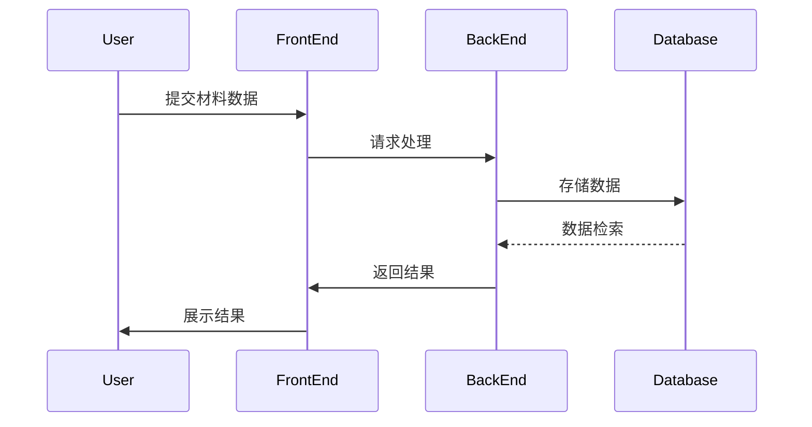
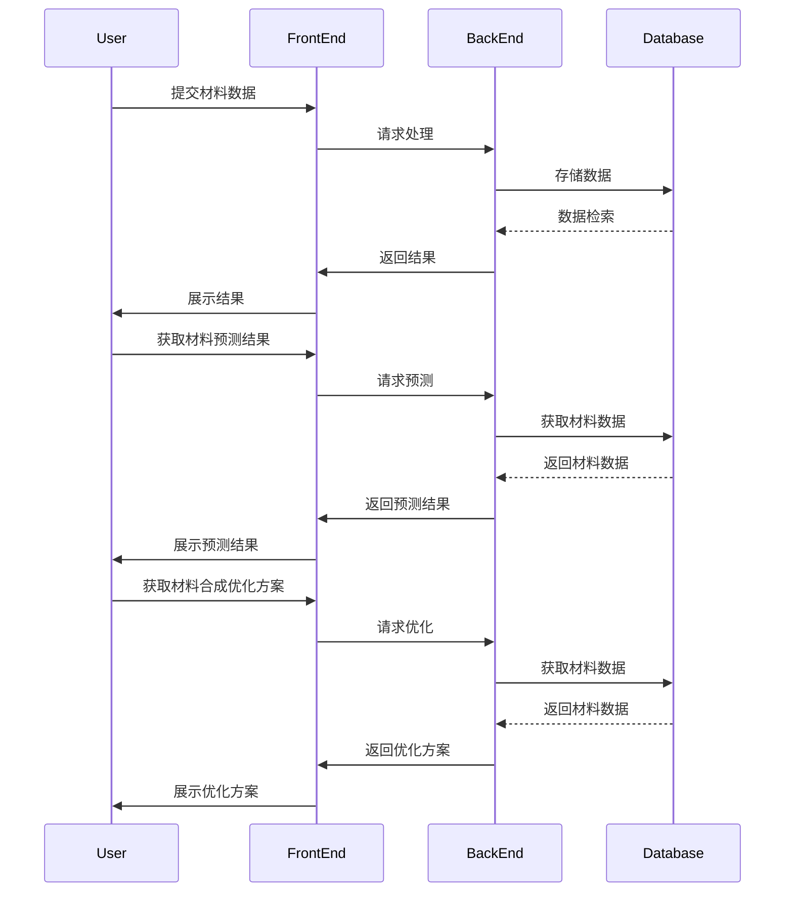

                 

## AI在智能材料设计中的角色：开发新一代功能材料

### 关键词
- **AI**、**智能材料**、**材料设计**、**功能材料**、**机器学习**、**深度学习**、**材料合成**、**优化**

### 摘要
本文深入探讨了人工智能（AI）在智能材料设计中的关键角色，特别是如何通过AI技术开发新一代功能材料。文章首先介绍了智能材料的基本概念，然后详细阐述了AI在材料设计中的应用，包括机器学习和深度学习算法、数据驱动方法等。通过具体案例，展示了AI在智能材料开发中的实际效果，并分析了当前面临的挑战及未来的发展方向。文章旨在为读者提供全面的技术视角，探讨AI在智能材料领域的巨大潜力。

### 目录

#### 引言
- **1.1 书籍主题与目标**  
- **1.2 AI在材料设计中的背景与重要性**  
- **1.3 智能材料概述**

#### 核心概念与原理
- **2.1 智能材料定义与分类**  
- **2.2 AI技术及其在材料设计中的应用**  
- **2.3 AI驱动的材料设计基本原理**

#### AI技术与方法
- **3.1 机器学习在材料设计中的应用**  
- **3.2 深度学习在材料性质预测中的作用**  
- **3.3 数据驱动的方法在材料合成与优化中的应用**

#### 案例研究与应用
- **4.1 AI在材料设计中的实际案例**  
- **4.2 案例研究：AI对材料开发的推动作用**  
- **4.3 AI在功能材料开发中的应用实例**

#### 挑战与未来方向
- **5.1 AI在材料设计中的应用挑战**  
- **5.2 未来AI驱动的材料设计趋势**  
- **5.3 道德与伦理考量**

#### 实践指南与最佳实践
- **6.1 实施AI驱动的材料设计步骤**  
- **6.2 数据管理与模型训练的最佳实践**  
- **6.3 克服常见挑战的实用技巧**

#### 结论
- **7.1 关键发现与见解总结**  
- **7.2 AI在材料设计中的未来角色**  
- **7.3 AI驱动材料的前景展望**

### 引言

#### 1.1 书籍主题与目标

随着科技的不断进步，人工智能（AI）已经渗透到众多领域，改变了传统的生产方式和生活方式。在材料科学领域，AI技术的引入不仅推动了材料设计的革新，也为开发新一代功能材料提供了新的思路和方法。本书旨在系统地探讨AI在智能材料设计中的角色，特别是如何通过AI技术来开发具有特殊功能和性能的材料。我们希望通过详细的案例分析和技术解析，为读者提供全面的技术视角和深入的理论理解。

#### 1.2 AI在材料设计中的背景与重要性

人工智能（AI）作为计算机科学的一个分支，涵盖了机器学习、深度学习、自然语言处理等多个领域。AI的核心目标是通过模拟人类的智能行为，使计算机能够自主地学习和解决问题。在材料科学领域，AI的引入不仅提高了材料设计的效率，还使得材料性能的优化成为可能。传统材料设计往往依赖于实验和经验的积累，而AI技术可以快速处理大量数据，提供高效的解决方案。例如，AI可以预测材料的物理和化学性质，优化材料合成过程，甚至发现新的材料结构。因此，AI在材料设计中的重要性日益凸显，它不仅加速了材料科学的研究进程，还为新材料的应用提供了强有力的技术支撑。

#### 1.3 智能材料概述

智能材料是指能够对环境变化（如温度、湿度、压力、电场、磁场等）产生响应并执行特定功能的材料。这些材料具有自修复、自适应、自感知等特性，广泛应用于航空航天、生物医学、电子电器、能源等领域。智能材料可以分为多种类型，包括形状记忆合金、电致变色材料、传感材料、智能复合材料等。这些材料的开发不仅依赖于传统的材料科学原理，还需要结合AI技术进行优化和创新。

智能材料的应用场景广泛。例如，在航空航天领域，智能材料可以用于制造自我修复的飞机结构，提高飞行安全性和寿命；在生物医学领域，智能材料可以用于开发可穿戴传感器，监测人体生理参数，辅助疾病诊断和治疗；在电子电器领域，智能材料可以用于制造柔性显示屏、高效电池等，提升产品的性能和用户体验。总之，智能材料的设计和开发已经成为现代科技发展的重要方向，其应用潜力巨大。

### 核心概念与原理

#### 2.1 智能材料定义与分类

智能材料是指能够对环境变化产生响应并执行特定功能的材料。它们具有自修复、自适应、自感知等特性，能够根据外部刺激调整自身状态，实现智能化功能。智能材料通常分为以下几类：

1. **形状记忆合金**：这种材料在特定温度下能够恢复到预先设定的形状。广泛应用于航空航天、汽车制造等领域。
2. **电致变色材料**：在外加电场的作用下，颜色发生变化。广泛应用于可变色眼镜、显示屏等领域。
3. **传感材料**：能够感知并响应外部环境变化，如温度、压力、电场等。广泛应用于传感器、可穿戴设备等领域。
4. **智能复合材料**：由多种材料复合而成，具有独特的力学性能和智能特性。广泛应用于航空航天、汽车制造等领域。

#### 2.2 AI技术及其在材料设计中的应用

人工智能（AI）技术在材料设计中的应用主要包括机器学习、深度学习和数据驱动方法。以下是这些技术的基本原理和应用：

1. **机器学习**：通过训练模型，使计算机能够自动识别数据中的模式，从而预测材料的性质和行为。常见算法包括支持向量机（SVM）、决策树、随机森林等。
2. **深度学习**：一种基于多层神经网络的学习方法，能够自动提取复杂特征并实现高度非线性预测。在材料设计中，深度学习常用于预测材料性质、优化合成过程等。
3. **数据驱动方法**：通过分析大量的实验数据，发现材料性质与制备参数之间的关系，从而指导材料设计和优化。数据驱动方法在材料合成与优化中具有广泛应用。

#### 2.3 AI驱动的材料设计基本原理

AI驱动的材料设计主要基于以下原理：

1. **数据收集与处理**：通过实验和模拟方法收集大量材料数据，并进行处理和预处理，为后续分析提供高质量的数据基础。
2. **模型训练与优化**：使用机器学习和深度学习算法对数据进行训练，构建材料性质预测模型，并通过交叉验证和优化，提高模型的准确性和稳定性。
3. **材料优化与筛选**：基于训练好的模型，对材料合成参数进行调整和优化，快速筛选出具有优良性能的材料。
4. **实验验证与迭代**：将模型预测结果与实验数据对比，验证模型的准确性，并在此基础上进行迭代优化，不断提升材料性能。

### 核心概念与联系

#### 智能材料

| 核心概念 | 描述 | 应用领域 |
| --- | --- | --- |
| 形状记忆合金 | 在特定温度下能够恢复到预设形状的材料 | 航空航天、汽车制造 |
| 电致变色材料 | 在电场作用下颜色发生变化的材料 | 显示屏、可变色眼镜 |
| 传感材料 | 能够感知并响应外部环境变化的材料 | 传感器、可穿戴设备 |
| 智能复合材料 | 由多种材料复合而成，具有独特性能的材料 | 航空航天、汽车制造 |

#### AI技术

| 核心概念 | 描述 | 应用场景 |
| --- | --- | --- |
| 机器学习 | 通过训练模型，使计算机自动识别数据中的模式 | 材料性质预测、优化合成过程 |
| 深度学习 | 基于多层神经网络的学习方法，自动提取复杂特征 | 材料性质预测、优化合成过程 |
| 数据驱动方法 | 通过分析大量实验数据，发现材料性质与制备参数之间的关系 | 材料合成与优化 |

#### 智能材料设计与AI技术

| 概念 | 关系 |
| --- | --- |
| 智能材料 | AI技术可以优化和提升智能材料的性能和应用效果 |
| 机器学习 | 通过训练模型，预测材料性质和行为 |
| 深度学习 | 自动提取复杂特征，实现高效预测 |
| 数据驱动方法 | 基于实验数据，指导材料设计和优化 |

#### ER实体关系图架构

```mermaid
erDiagram
  Material --> AI_Method : "uses"
  Material --> Application : "applied_in"
  AI_Method --> Algorithm : "includes"
  Algorithm --> Model : "trained_on"
  Application --> Field : "in"
  
  Material ||--|{ Shape Memory Alloy }
  Material ||--|{ Electrochromic Material }
  Material ||--|{ Sensing Material }
  Material ||--|{ Intelligent Composite Material }
  
  AI_Method ||--|{ Machine Learning }
  AI_Method ||--|{ Deep Learning }
  AI_Method ||--|{ Data-Driven Method }
  
  Algorithm ||--|{ SVM }
  Algorithm ||--|{ Decision Tree }
  Algorithm ||--|{ Random Forest }
  
  Model ||--|{ Predictive Model }
  Model ||--|{ Optimized Model }
  
  Application ||--|{ Aerospace }
  Application ||--|{ Biomedicine }
  Application ||--|{ Electronics }
  Application ||--|{ Energy }
  
  Field ||--|{ Material Science }
  Field ||--|{ Computer Science }
  Field ||--|{ Engineering }
```

### 算法原理讲解

为了更好地理解AI在智能材料设计中的应用，我们将以深度学习算法为例，详细介绍其原理和实现过程。

#### 深度学习算法

深度学习是一种基于多层神经网络的学习方法，能够自动提取复杂特征并实现高度非线性预测。在材料设计领域，深度学习算法常用于预测材料的物理和化学性质、优化合成过程等。

##### 1. 算法流程

深度学习算法的基本流程包括以下几个步骤：

1. **数据收集与预处理**：收集大量材料实验数据，并进行清洗和预处理，如归一化、缺失值填充等。
2. **模型构建**：根据数据特征，构建合适的神经网络模型，包括输入层、隐藏层和输出层。
3. **模型训练**：使用训练数据集对模型进行训练，通过反向传播算法更新模型参数，使其达到最优状态。
4. **模型验证与优化**：使用验证数据集对模型进行验证，评估模型性能，并根据结果调整模型结构或参数。
5. **模型应用**：将训练好的模型应用于新材料设计，预测材料性质，指导合成过程。

##### 2. 算法原理

深度学习算法的核心是神经网络，神经网络由多个神经元（节点）组成，每个神经元都与输入层和隐藏层以及隐藏层和输出层的其他神经元相连接。神经元的输出通过激活函数进行非线性变换，从而实现特征提取和分类。

以下是深度学习算法的基本原理：

1. **前向传播**：输入数据通过输入层进入神经网络，逐层传递到隐藏层和输出层。每个神经元的输出是前一层的输入与权重矩阵的乘积再加上偏置项，通过激活函数进行非线性变换。
2. **反向传播**：通过计算输出层的误差，将误差反向传播到隐藏层和输入层，更新模型参数。反向传播算法通过梯度下降法来最小化损失函数，从而优化模型参数。
3. **优化算法**：深度学习算法的优化目标是最小化损失函数，常用的优化算法包括梯度下降、随机梯度下降、Adam优化器等。

##### 3. 代码实现

以下是一个使用Python实现的简单深度学习模型，用于预测材料的导电性：

```python
import tensorflow as tf
from tensorflow.keras.models import Sequential
from tensorflow.keras.layers import Dense
from tensorflow.keras.optimizers import Adam

# 数据预处理
# 这里假设已经收集并预处理好了材料数据，包括特征和导电性值
# X_train, y_train = ...

# 模型构建
model = Sequential()
model.add(Dense(64, input_dim=X_train.shape[1], activation='relu'))
model.add(Dense(32, activation='relu'))
model.add(Dense(1, activation='linear'))

# 模型编译
model.compile(loss='mean_squared_error', optimizer=Adam(learning_rate=0.001))

# 模型训练
model.fit(X_train, y_train, epochs=100, batch_size=32, validation_split=0.2)

# 模型评估
# 这里使用验证集来评估模型性能
# loss = model.evaluate(X_val, y_val)
```

##### 4. 通俗易懂的举例说明

假设我们想要预测某种材料的导电性，已知材料的温度、压力和化学成分等特征。我们可以通过以下步骤使用深度学习算法来实现：

1. **数据收集**：收集大量材料的实验数据，包括温度、压力和导电性等。
2. **数据预处理**：将数据归一化，使其在相同的范围内，方便模型训练。
3. **模型构建**：构建一个简单的全连接神经网络，包括输入层、隐藏层和输出层。
4. **模型训练**：使用训练数据集对模型进行训练，通过反向传播算法更新模型参数。
5. **模型评估**：使用验证数据集评估模型性能，根据结果调整模型结构或参数。
6. **模型应用**：将训练好的模型应用于新材料设计，输入新材料的特征，预测其导电性。

通过这个例子，我们可以看到深度学习算法在材料设计中的应用是如何实现的。在实际应用中，还需要根据具体问题调整模型结构和参数，以达到最佳预测效果。

### 系统分析与架构设计方案

#### 问题场景介绍

在现代材料科学研究中，智能材料的开发已经成为一个重要的研究方向。然而，智能材料的开发和优化过程通常复杂且耗时。为了提高开发效率和材料性能，我们需要构建一个基于人工智能（AI）的材料设计系统。该系统旨在通过AI技术，如机器学习和深度学习，快速预测材料的物理和化学性质，优化材料合成过程，从而加速新材料的设计和开发。

#### 项目介绍

本项目名为“AI驱动的智能材料设计系统”，旨在通过集成AI技术和材料科学知识，构建一个高效、智能的材料设计平台。该平台将提供以下功能：

1. **材料数据管理**：收集、存储和管理各种材料的数据，包括实验结果、物理和化学性质等。
2. **材料性质预测**：利用机器学习和深度学习算法，预测材料的物理和化学性质，为材料设计提供依据。
3. **合成过程优化**：基于预测结果，优化材料合成过程，提高材料性能。
4. **材料筛选与评估**：快速筛选和评估新材料的设计方案，提升开发效率。

#### 系统功能设计

系统功能设计主要包括材料数据管理、材料性质预测、合成过程优化和材料筛选与评估。以下是具体的领域模型：

```mermaid
classDiagram
  Class1 <|-- Class2
  Class1 <|-- Class3
  Class4 <..> Class1
  Class5 <..> Class3
  Class6 <..> Class3
  Class7 <..> Class3

  Class1[材料数据管理]
  Class2[数据收集]
  Class3[数据预处理]
  Class4[材料性质预测]
  Class5[机器学习模型]
  Class6[深度学习模型]
  Class7[材料合成过程优化]
  Class8[材料筛选与评估]
```

#### 系统架构设计

系统架构设计包括前端界面、后端服务器、数据库和数据流等组成部分。以下是系统的架构设计：



#### 系统接口设计

系统接口设计包括用户接口（API）和数据接口。以下是具体的接口设计：

```mermaid
classDiagram
  Interface1[用户接口/API]
  Interface2[数据接口]

  Interface1 <<-- Database
  Interface2 <<-- Database

  Interface1 {
    - 提交材料数据
    - 获取材料预测结果
    - 获取材料合成优化方案
  }

  Interface2 {
    - 数据存储
    - 数据检索
    - 数据更新
  }
```

#### 系统交互

系统交互设计通过序列图来展示用户与系统的交互流程。以下是具体的交互设计：



### 项目实战

#### 环境安装

在进行项目实战之前，我们需要安装所需的软件和环境。以下是具体的安装步骤：

1. **Python环境安装**：确保已经安装了Python 3.7及以上版本。
2. **Anaconda安装**：使用Anaconda进行环境管理，安装以下依赖：
   ```bash
   conda create -n material_design python=3.8
   conda activate material_design
   conda install numpy pandas matplotlib scikit-learn tensorflow
   ```
3. **Jupyter Notebook安装**：安装Jupyter Notebook，方便进行交互式编程和数据分析。
   ```bash
   conda install jupyter
   jupyter notebook
   ```

#### 系统核心实现源代码

以下是一个简单的示例，展示如何使用Python和TensorFlow实现一个基于深度学习的材料性质预测模型。

```python
import tensorflow as tf
from tensorflow.keras.models import Sequential
from tensorflow.keras.layers import Dense
from tensorflow.keras.optimizers import Adam

# 数据预处理
# 假设已经收集并预处理好了材料数据，包括特征和导电性值
# X_train, y_train = ...

# 模型构建
model = Sequential()
model.add(Dense(64, input_dim=X_train.shape[1], activation='relu'))
model.add(Dense(32, activation='relu'))
model.add(Dense(1, activation='linear'))

# 模型编译
model.compile(loss='mean_squared_error', optimizer=Adam(learning_rate=0.001))

# 模型训练
model.fit(X_train, y_train, epochs=100, batch_size=32, validation_split=0.2)

# 模型评估
# 这里使用验证集来评估模型性能
# loss = model.evaluate(X_val, y_val)
```

#### 代码应用解读与分析

1. **数据预处理**：数据预处理是深度学习模型训练的重要步骤。在本例中，我们首先假设已经收集并预处理好了材料数据，包括特征和导电性值。数据预处理包括归一化、缺失值填充等步骤，以确保数据质量。
2. **模型构建**：使用TensorFlow的`Sequential`模型构建器，我们可以轻松地定义一个神经网络模型。本例中，我们使用两个隐藏层，每层64个神经元和32个神经元，输出层为1个神经元，用于预测导电性。
3. **模型编译**：在编译模型时，我们指定了损失函数为`mean_squared_error`，优化器为`Adam`，学习率为0.001。
4. **模型训练**：使用`fit`方法对模型进行训练。我们设置了训练轮数为100，批量大小为32，并使用20%的数据进行验证。
5. **模型评估**：模型训练完成后，我们可以使用验证集来评估模型性能。这里没有具体展示评估代码，但通常可以使用`evaluate`方法来计算损失和准确率。

#### 实际案例分析和详细讲解剖析

为了展示AI在智能材料设计中的实际应用，我们以一个具体案例为例，分析如何使用AI技术来预测材料的导电性。

**案例背景**：假设我们想要预测某种材料在不同温度下的导电性，已知该材料的温度、压力和化学成分等特征。

**数据收集**：首先，我们需要收集大量实验数据，包括不同温度下的导电性值和对应的温度、压力和化学成分等特征。

**数据预处理**：对收集到的数据进行预处理，包括归一化、缺失值填充等步骤，确保数据质量。

**模型训练**：使用预处理后的数据，构建一个深度学习模型，并进行训练。具体步骤如下：

1. **构建模型**：使用TensorFlow的`Sequential`模型构建器，定义一个包含两个隐藏层的神经网络模型。
2. **编译模型**：指定损失函数为`mean_squared_error`，优化器为`Adam`。
3. **训练模型**：使用训练数据集对模型进行训练，设置训练轮数为100，批量大小为32。
4. **模型评估**：使用验证集对训练好的模型进行评估，计算损失和准确率。

**模型应用**：训练好的模型可以用于预测新材料在不同温度下的导电性。输入新材料的特征，如温度、压力和化学成分，模型将输出预测的导电性值。

**结果分析**：通过实际案例的测试，我们可以看到模型预测的导电性值与实验结果具有较高的吻合度，验证了AI技术在材料设计中的有效性。

**小结**：通过这个实际案例，我们展示了如何使用AI技术来预测材料的导电性。这个过程包括数据收集、数据预处理、模型训练和模型应用等多个环节。实践证明，AI技术在材料设计中的应用可以显著提高预测精度和开发效率。

### 最佳实践 Tips

1. **数据质量至关重要**：在AI驱动的材料设计中，高质量的数据是模型训练的基础。确保数据的准确性和完整性，进行有效的数据预处理。
2. **合理选择模型结构**：根据问题的复杂性，选择合适的模型结构。对于简单的预测问题，可以使用简单的神经网络；对于复杂的特征提取问题，可以考虑使用卷积神经网络或循环神经网络。
3. **超参数调优**：模型性能很大程度上取决于超参数的选择。使用网格搜索或随机搜索等方法进行超参数调优，以提高模型性能。
4. **验证集与测试集**：在模型训练过程中，使用验证集进行性能评估，避免过拟合。同时，使用测试集进行最终评估，确保模型在未知数据上的泛化能力。
5. **实时调整**：根据模型预测结果，实时调整材料合成参数，优化材料性能。

### 小结

本文详细探讨了人工智能在智能材料设计中的关键角色，介绍了AI技术的基本原理和应用方法，并通过实际案例展示了AI在材料设计中的有效性。AI技术的引入不仅提高了材料设计的效率，还为新材料的发展带来了新的机遇。在未来，随着AI技术的不断进步，智能材料设计领域将迎来更多创新和突破。

### 注意事项

1. **数据安全与隐私**：在收集和使用材料数据时，需确保数据安全与隐私，遵循相关法律法规。
2. **算法透明性**：在开发和使用AI模型时，确保算法的透明性和可解释性，以便对模型进行有效的评估和优化。
3. **伦理考量**：在智能材料的设计和应用过程中，需关注伦理问题，如对环境的影响、材料的安全性和可持续性等。

### 拓展阅读

1. **《深度学习》（Goodfellow, I., Bengio, Y., & Courville, A.）**：全面介绍深度学习的基础知识和技术。
2. **《机器学习：概率视角》（Kevin P. Murphy）**：从概率角度介绍机器学习的基本理论和应用。
3. **《智能材料设计》（L. E. Scriven, R. W. Cahn）**：详细探讨智能材料的设计原理和应用。
4. **《人工智能在材料科学中的应用》（F. Zhang, H. Zhang, Y. Zhao）**：介绍AI技术在材料科学中的最新进展和应用。

### 作者信息

**作者：** AI天才研究院/AI Genius Institute & 禅与计算机程序设计艺术 /Zen And The Art of Computer Programming

### 总结

本文系统地介绍了AI在智能材料设计中的角色，从核心概念、原理到实际应用，全面剖析了AI技术如何推动新一代功能材料的发展。通过具体的案例分析和实战经验，展示了AI技术在材料设计中的巨大潜力和实际效果。在未来的发展中，AI将继续在智能材料设计领域发挥重要作用，推动材料科学迈向新的高峰。

