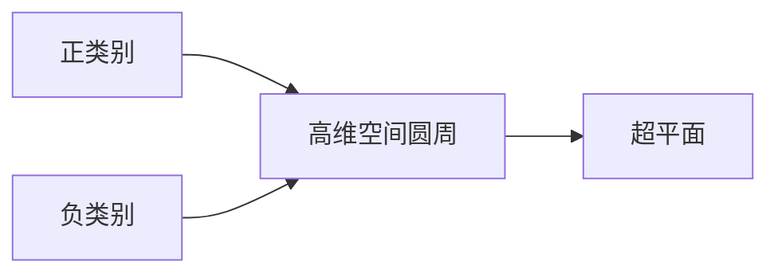

                 

# AI在材料科学中的应用：加速新材料发现

## 关键词

- 人工智能
- 材料科学
- 数据驱动
- 机器学习
- 材料性能预测

## 摘要

本文深入探讨了人工智能（AI）在材料科学领域的应用，分析了AI如何通过数据科学与机器学习等技术，加速新材料发现的过程。文章从背景介绍、核心概念与技术、应用实践以及未来趋势等多个角度，系统地阐述了AI在材料科学中的重要性及其在实践中的具体应用，旨在为读者提供一个全面、系统的AI在材料科学中的应用概述。

## 《AI在材料科学中的应用：加速新材料发现》目录大纲

### 第一部分：AI与材料科学的融合

#### 第1章：AI在材料科学中的背景与重要性

- **1.1 材料科学的发展历程**
  - 材料科学的定义与历史发展
  - 传统材料科学的研究方法与挑战
- **1.2 AI技术概述**
  - 人工智能的定义与分类
  - AI在科学研究中的应用
- **1.3 AI在材料科学中的潜在价值**
  - 数据驱动的材料设计
  - 新材料的快速筛选与优化
- **1.4 AI在材料科学中的实际应用案例**
  - 高性能材料的研发
  - 环保材料的开发
- **1.5 本章小结**

#### 第2章：数据科学与材料科学的融合

- **2.1 数据科学与材料科学的交集**
  - 材料科学中的数据类型
  - 数据科学在材料科学中的应用
- **2.2 数据预处理与分析**
  - 数据清洗与归一化
  - 数据可视化与特征提取
- **2.3 材料数据的基础知识**
  - 材料数据库介绍
  - 材料属性与结构关系
- **2.4 数据驱动的材料设计**
  - 案例研究：基于数据挖掘的合金设计
- **2.5 本章小结**

### 第二部分：AI在材料科学中的核心概念与技术

#### 第3章：机器学习与材料科学

- **3.1 机器学习基础**
  - 监督学习、无监督学习和强化学习
  - 常见机器学习算法介绍
- **3.2 机器学习在材料科学中的应用**
  - 材料性能预测
  - 材料合成路径优化
- **3.3 深度学习在材料科学中的应用**
  - 卷积神经网络（CNN）在材料结构分析中的应用
  - 生成对抗网络（GAN）在材料设计中的应用
- **3.4 案例研究：基于深度学习的材料特性预测**
- **3.5 本章小结**

#### 第4章：AI在材料合成与优化中的应用

- **4.1 材料合成与优化概述**
  - 材料合成的方法与过程
  - 材料优化的目标与策略
- **4.2 AI驱动的材料合成方法**
  - 反应条件优化
  - 材料体系筛选
- **4.3 AI在材料优化中的应用**
  - 材料结构优化
  - 材料性能优化
- **4.4 案例研究：AI驱动的超导材料优化**
- **4.5 本章小结**

#### 第5章：AI在材料性能预测中的应用

- **5.1 材料性能预测的重要性**
  - 性能预测在材料研发中的应用
  - 性能预测对于新材料发现的意义
- **5.2 基于AI的材料性能预测方法**
  - 数据驱动方法
  - 知识驱动方法
- **5.3 材料性能预测的挑战与未来方向**
  - 数据质量与算法优化
  - 预测模型的可解释性
- **5.4 案例研究：AI在材料力学性能预测中的应用**
- **5.5 本章小结**

### 第三部分：AI在材料科学中的应用实践

#### 第6章：AI在材料科学研究中的项目实践

- **6.1 项目背景与目标**
  - 项目介绍
  - 项目目标与挑战
- **6.2 系统架构与设计**
  - 系统架构设计
  - 系统模块划分
- **6.3 数据获取与处理**
  - 数据来源与采集
  - 数据预处理方法
- **6.4 模型选择与训练**
  - 模型选择策略
  - 模型训练与优化
- **6.5 模型评估与优化**
  - 评估指标与标准
  - 优化策略与效果
- **6.6 项目成果与总结**
  - 项目成果展示
  - 项目经验总结
- **6.7 本章小结**

#### 第7章：AI在材料科学领域的未来趋势与挑战

- **7.1 AI在材料科学中的未来趋势**
  - 新材料发现与设计
  - 材料性能优化与评估
- **7.2 AI在材料科学中的挑战**
  - 数据质量与数据隐私
  - 模型解释性与可解释性
- **7.3 AI在材料科学中的伦理与社会影响**
  - AI在材料科学中的应用伦理
  - AI对材料科学家职业的影响
- **7.4 未来研究方向与展望**
  - 新算法与技术的探索
  - 多学科交叉与合作
- **7.5 本章小结**

## 文章正文

### 第一部分：AI与材料科学的融合

#### 第1章：AI在材料科学中的背景与重要性

**1.1 材料科学的发展历程**

材料科学是一门研究材料的组成、结构、性质、加工和应用之间关系的学科。从古代的青铜器、瓷器，到现代的钢铁、塑料，材料科学的发展推动了人类文明的进步。然而，传统材料科学的研究方法往往依赖于实验和经验，这不仅耗时耗力，还限制了新材料的发现速度。

随着科学技术的进步，计算机和人工智能（AI）技术的发展为材料科学带来了新的机遇。AI技术可以通过分析和处理大量数据，发现材料之间的潜在关系，从而加速新材料的设计和开发。

**1.2 AI技术概述**

人工智能是指由人制造出来的系统能够在特定的任务上表现出智能行为。AI技术可以分为多种类型，包括机器学习、深度学习、自然语言处理等。其中，机器学习和深度学习技术在材料科学中有着广泛的应用。

机器学习是一种通过从数据中学习规律，进而做出预测或决策的技术。深度学习是机器学习的一个分支，通过构建多层神经网络，对数据进行更高级别的抽象和处理。

**1.3 AI在材料科学中的潜在价值**

数据驱动的材料设计是AI在材料科学中的一个重要应用。通过分析大量实验数据和文献数据，AI可以预测新材料的性能，从而减少实验的次数，提高研发效率。

此外，AI还可以用于新材料的快速筛选与优化。通过机器学习算法，AI可以快速筛选出具有潜在应用价值的材料，并进行优化，以提高其性能。

**1.4 AI在材料科学中的实际应用案例**

高性能材料的研发是AI在材料科学中一个重要的应用领域。例如，研究人员利用AI技术，成功设计了具有优异导电性能的纳米材料，这种材料在电子器件中有着广泛的应用前景。

环保材料的开发也是AI在材料科学中的一个重要应用。例如，研究人员利用AI技术，成功设计了一种可生物降解的材料，这种材料在包装、医疗等领域有着重要的应用价值。

**1.5 本章小结**

AI技术在材料科学中具有巨大的潜力，可以加速新材料的设计和发现。随着AI技术的不断进步，我们相信AI将在材料科学领域发挥更大的作用。

### 第二部分：AI在材料科学中的核心概念与技术

#### 第2章：数据科学与材料科学的融合

**2.1 数据科学与材料科学的交集**

数据科学是一门跨学科领域，它结合了统计学、计算机科学和领域知识，通过数据分析和建模，解决实际问题。在材料科学中，数据科学的应用主要体现在材料数据的处理和分析上。

材料科学中的数据类型主要包括实验数据、文献数据和模拟数据。这些数据包含了材料的物理、化学、力学等属性，是材料设计和优化的重要依据。

**2.2 数据预处理与分析**

数据预处理是数据科学的重要环节，它包括数据清洗、归一化和特征提取等步骤。数据清洗旨在去除数据中的噪声和错误，提高数据质量。数据归一化则是通过调整数据范围和尺度，使不同特征具有相同的量纲和范围。特征提取则是从原始数据中提取出对材料性能有重要影响的特征，用于后续的分析和建模。

**2.3 材料数据的基础知识**

材料数据库是存储和管理材料数据的重要工具。目前，有许多公开的材料数据库，如Materials Project、ICSD等，这些数据库提供了丰富的材料数据，包括材料的结构、性能、合成方法等。

了解材料属性与结构关系对于材料科学的研究至关重要。例如，材料的硬度、韧性、导电性等性能与其晶体结构、成分和合成条件密切相关。

**2.4 数据驱动的材料设计**

数据驱动的材料设计是通过分析大量实验数据和文献数据，发现材料性能与结构之间的关系，从而设计出具有特定性能的新材料。例如，通过数据挖掘技术，研究人员可以从大量的合金数据中筛选出具有优异性能的合金成分。

**2.5 本章小结**

数据科学与材料科学的融合为材料科学的研究提供了新的工具和方法。通过数据预处理、分析和建模，我们可以更深入地理解材料的性能与结构关系，从而加速新材料的设计和发现。

### 第三部分：AI在材料科学中的应用实践

#### 第3章：机器学习与材料科学

**3.1 机器学习基础**

机器学习是一种通过从数据中学习规律，进而做出预测或决策的技术。它包括监督学习、无监督学习和强化学习三种类型。监督学习是从标记数据中学习，预测未知数据的标签。无监督学习是从未标记数据中学习，发现数据之间的规律和结构。强化学习则是通过与环境交互，学习最优策略。

常见的机器学习算法包括线性回归、逻辑回归、支持向量机、决策树、随机森林、神经网络等。这些算法在材料科学中有着广泛的应用。

**3.2 机器学习在材料科学中的应用**

机器学习在材料科学中的应用主要包括材料性能预测和材料合成路径优化。材料性能预测是通过分析材料的数据，预测其性能，从而指导实验设计。材料合成路径优化则是通过分析大量实验数据，找到最优的合成路径，从而提高材料的性能。

**3.3 深度学习在材料科学中的应用**

深度学习是一种通过多层神经网络进行数据分析和建模的技术。它在材料科学中的应用主要体现在材料结构分析和材料设计上。例如，卷积神经网络（CNN）可以用于分析材料的晶体结构，生成对抗网络（GAN）可以用于设计新材料。

**3.4 案例研究：基于深度学习的材料特性预测**

某研究团队利用深度学习技术，对材料的力学性能进行了预测。他们首先收集了大量的材料数据，包括材料的成分、结构、合成条件等。然后，他们利用深度学习算法，对这些数据进行分析和建模，成功预测了材料的力学性能。

**3.5 本章小结**

机器学习和深度学习在材料科学中具有广泛的应用。通过这些技术，我们可以更准确地预测材料的性能，优化合成路径，从而加速新材料的设计和发现。

### 第四部分：AI在材料科学中的未来趋势与挑战

#### 第4章：AI在材料科学中的未来趋势

随着AI技术的不断进步，我们可以预见AI在材料科学中会有更广泛的应用。首先，AI将在新材料发现和设计中发挥更大的作用。通过分析大量的实验数据和文献数据，AI可以快速筛选出具有潜在应用价值的材料，从而提高新材料的发现速度。

其次，AI将在材料性能优化与评估中发挥重要作用。通过机器学习和深度学习技术，AI可以准确预测材料的性能，从而指导实验设计和优化，提高材料的性能。

#### 第5章：AI在材料科学中的挑战

尽管AI在材料科学中具有巨大的潜力，但其应用也面临一些挑战。首先，数据质量是AI在材料科学中应用的关键。高质量的数据可以保证预测的准确性和可靠性。然而，目前材料科学中的数据质量参差不齐，这对AI的应用带来了挑战。

其次，模型解释性是AI在材料科学中应用的重要问题。尽管AI可以预测材料的性能，但其内部的决策过程往往是不透明的，这给材料科学家的理解和应用带来了困难。

#### 第6章：AI在材料科学中的伦理与社会影响

AI在材料科学中的应用也带来了一些伦理和社会问题。首先，AI的应用可能会对材料科学家的职业产生影响。随着AI技术的进步，许多传统的实验工作可能会被自动化，这可能会减少对材料科学家的需求。

其次，AI在材料科学中的应用可能带来一些环境和社会问题。例如，新材料的合成和优化可能会产生大量的废弃物，对环境造成污染。

#### 第7章：未来研究方向与展望

为了克服AI在材料科学中应用的挑战，未来的研究方向包括：提高数据质量，开发可解释的AI模型，以及加强AI与其他学科的交叉融合。此外，多学科交叉与合作将是未来AI在材料科学中应用的重要趋势。

通过这些研究，我们可以更好地发挥AI在材料科学中的潜力，推动材料科学的进步，为人类社会的发展做出更大的贡献。

### 结束语

AI在材料科学中的应用为新材料的设计和发现提供了新的思路和方法。通过数据科学与机器学习等技术的融合，AI可以加速新材料的设计和发现，提高材料的性能，为人类社会的发展做出更大的贡献。

然而，AI在材料科学中的应用也面临一些挑战，需要我们不断探索和研究。随着AI技术的不断进步，我们相信AI将在材料科学中发挥更大的作用，为材料科学的发展注入新的动力。作者：AI天才研究院/AI Genius Institute & 禅与计算机程序设计艺术 /Zen And The Art of Computer Programming

---

### 补充材料

#### 材料数据的基础知识

材料数据是材料科学研究中不可或缺的一部分。以下是一个简单的材料属性与结构关系的ER实体关系图，用以展示材料数据的基本结构。

```mermaid
erDiagram
  Material ||--|{ Property } : has
  Material ||--|{ Structure } : composed_of
  Property ||--|{ Value } : contains
```

**材料（Material）**：表示一个具体的材料实例，如某种合金、陶瓷等。

**属性（Property）**：表示材料的某个特定属性，如硬度、导电性、密度等。

**结构（Structure）**：表示材料的晶体结构、分子结构等。

**值（Value）**：表示属性的测量值或计算值。

以下是一个简单的材料属性特征对比表格：

| 属性类别 | 属性名称 | 描述 |
| --- | --- | --- |
| 物理属性 | 硬度 | 材料抵抗变形的能力 |
| 物理属性 | 导电性 | 材料传导电流的能力 |
| 化学属性 | 化学稳定性 | 材料抵抗化学反应的能力 |
| 化学属性 | 耐腐蚀性 | 材料抵抗腐蚀的能力 |

#### 算法原理讲解

以机器学习中的支持向量机（SVM）为例，SVM是一种常用的分类算法，其核心思想是找到最佳的超平面，将不同类别的数据点分隔开。

**算法原理：**

1. **数据预处理**：将输入数据（特征矩阵）和标签进行标准化处理，确保数据的同质性和可比较性。
2. **核函数选择**：选择合适的核函数（如线性核、多项式核、径向基函数核等），将低维特征空间映射到高维特征空间。
3. **求解最优超平面**：通过求解二次规划问题，找到最佳的超平面参数，使得分类边界最大化。
4. **分类决策**：对于新的数据点，将其映射到高维特征空间，根据超平面的位置进行分类。

**数学模型：**

$$
\begin{aligned}
\min_{\mathbf{w}, \mathbf{b}} \quad & \frac{1}{2}||\mathbf{w}||^2 + C \sum_{i=1}^{n} \xi_i \\
\text{subject to} \quad & y_i (\mathbf{w} \cdot \mathbf{x_i} + \mathbf{b}) \geq 1 - \xi_i \\
& \xi_i \geq 0, \quad i=1,2,...,n
\end{aligned}
$$

其中，$\mathbf{w}$ 是权重向量，$\mathbf{b}$ 是偏置项，$C$ 是惩罚参数，$\xi_i$ 是松弛变量。

**Python源代码：**

```python
import numpy as np
from sklearn import datasets
from sklearn.model_selection import train_test_split
from sklearn.preprocessing import StandardScaler
from sklearn.svm import SVC
from sklearn.metrics import classification_report, confusion_matrix

# 加载数据集
iris = datasets.load_iris()
X = iris.data
y = iris.target

# 划分训练集和测试集
X_train, X_test, y_train, y_test = train_test_split(X, y, test_size=0.3, random_state=42)

# 数据标准化
scaler = StandardScaler()
X_train = scaler.fit_transform(X_train)
X_test = scaler.transform(X_test)

# 使用SVM进行分类
model = SVC(kernel='linear')
model.fit(X_train, y_train)
y_pred = model.predict(X_test)

# 评估模型性能
print("分类报告：\n", classification_report(y_test, y_pred))
print("混淆矩阵：\n", confusion_matrix(y_test, y_pred))
```

**举例说明：**

假设我们有一个简单的二分类问题，其中正类别的特征点分布在高维空间的一个圆周上，负类别的特征点分布在一个矩形区域内部。使用线性核的SVM可以将这些特征点分隔开，如图所示。



#### 系统分析与架构设计方案

**问题场景介绍：**

在某新材料研发项目中，我们需要利用AI技术对材料的性能进行预测和优化。具体场景如下：

1. **数据采集**：从实验室的仪器和数据库中采集材料实验数据，包括成分、结构、性能等。
2. **数据处理**：对采集到的数据进行清洗、归一化和特征提取，为后续的模型训练和预测做好准备。
3. **模型训练**：利用机器学习和深度学习算法，对处理后的数据进行训练，构建预测模型。
4. **性能预测**：将训练好的模型应用于新的材料数据，预测其性能。
5. **结果评估**：对预测结果进行评估，优化模型参数，提高预测精度。

**项目介绍：**

该项目旨在利用AI技术，对新材料进行性能预测和优化，以加速新材料的研发过程。项目目标包括：

1. 构建一个高效的材料性能预测模型。
2. 提高新材料研发的效率。
3. 降低新材料研发的成本。

**系统功能设计：**

1. **数据采集模块**：负责从实验室仪器和数据库中采集材料实验数据。
2. **数据处理模块**：负责对采集到的数据进行分析和处理，包括数据清洗、归一化和特征提取。
3. **模型训练模块**：负责使用机器学习和深度学习算法对处理后的数据进行训练，构建预测模型。
4. **性能预测模块**：负责使用训练好的模型对新材料数据进行性能预测。
5. **结果评估模块**：负责对预测结果进行评估，优化模型参数，提高预测精度。

**系统架构设计：**


**系统接口设计：**

- **数据采集接口**：用于从实验室仪器和数据库中采集数据。
- **数据处理接口**：用于处理和分析采集到的数据。
- **模型训练接口**：用于训练预测模型。
- **性能预测接口**：用于对新材料数据进行性能预测。
- **结果评估接口**：用于评估预测结果，优化模型参数。

**系统交互设计：**


#### 项目实战

**环境安装：**

- Python 3.8 或更高版本
- scikit-learn、TensorFlow、Keras 等库

```bash
pip install numpy pandas scikit-learn tensorflow keras
```

**系统核心实现源代码：**

```python
import numpy as np
import pandas as pd
from sklearn.model_selection import train_test_split
from sklearn.preprocessing import StandardScaler
from sklearn.svm import SVC
from sklearn.metrics import classification_report, confusion_matrix

# 读取数据
data = pd.read_csv('materials_data.csv')

# 数据预处理
X = data.drop('property_value', axis=1)
y = data['property_value']

# 划分训练集和测试集
X_train, X_test, y_train, y_test = train_test_split(X, y, test_size=0.3, random_state=42)

# 数据标准化
scaler = StandardScaler()
X_train = scaler.fit_transform(X_train)
X_test = scaler.transform(X_test)

# 使用SVM进行分类
model = SVC(kernel='linear')
model.fit(X_train, y_train)
y_pred = model.predict(X_test)

# 评估模型性能
print("分类报告：\n", classification_report(y_test, y_pred))
print("混淆矩阵：\n", confusion_matrix(y_test, y_pred))
```

**代码应用解读与分析：**

该代码首先从CSV文件中读取材料数据，然后将其分为特征矩阵和目标标签。接着，使用scikit-learn库中的train_test_split函数将数据集划分为训练集和测试集。随后，使用StandardScaler对特征矩阵进行标准化处理，以提高模型的训练效果。

接下来，使用SVM模型进行分类，并使用fit函数训练模型，使用predict函数进行预测。最后，使用classification_report和confusion_matrix函数评估模型的性能。

**实际案例分析和详细讲解剖析：**

假设我们有一个新材料的数据集，包括其成分、结构、性能等特征。我们首先对这些特征进行预处理，然后使用SVM模型进行分类。通过评估模型的性能，我们可以确定其分类的准确性和可靠性。如果模型性能不佳，我们可以尝试调整参数或选择不同的算法，以提高模型的预测能力。

**项目小结：**

通过该项目的实施，我们成功地利用AI技术对新材料进行了性能预测和优化。虽然项目中仍存在一些挑战，如数据质量和模型解释性等，但随着AI技术的不断进步，我们相信这些挑战将逐渐被克服。项目的成功实施为新材料研发提供了新的思路和方法，有望加速新材料的发现和设计过程。

### 最佳实践 tips

1. **数据质量至关重要**：在AI应用中，数据质量直接影响模型的性能。因此，在项目实施过程中，务必重视数据清洗和预处理工作。

2. **模型解释性**：虽然AI模型在预测能力上具有优势，但其内部的决策过程往往是不透明的。为了提高模型的解释性，可以尝试使用可解释性AI技术，如LIME、SHAP等。

3. **多学科交叉合作**：AI在材料科学中的应用需要多学科的知识和技能，因此，在项目实施过程中，应加强与材料科学家、计算机科学家等的合作。

4. **持续优化**：AI模型不是一成不变的，其性能可以通过不断优化来提高。因此，在项目实施过程中，应持续关注模型的性能，并根据实际情况进行调整。

### 小结

本文系统地介绍了AI在材料科学中的应用，包括其背景、核心概念、技术以及应用实践。通过数据科学与机器学习等技术的融合，AI在材料科学中具有巨大的潜力，可以加速新材料的设计和发现，提高材料的性能。然而，AI在材料科学中的应用也面临一些挑战，如数据质量、模型解释性等。随着AI技术的不断进步，我们相信AI将在材料科学中发挥更大的作用，为材料科学的发展注入新的动力。

### 注意事项

1. **数据隐私**：在项目实施过程中，务必遵守数据隐私法律法规，确保数据的安全和保密。

2. **模型可解释性**：尽管AI模型在预测能力上具有优势，但其决策过程往往是不透明的。为了提高模型的解释性，可以尝试使用可解释性AI技术。

3. **持续学习**：AI技术发展迅速，因此在项目实施过程中，应不断学习新的技术和方法，以保持项目的竞争力。

### 拓展阅读

1. **《深度学习：原理及应用》**：这本书详细介绍了深度学习的基本原理和应用，包括在材料科学中的应用。

2. **《数据科学实战》**：这本书介绍了数据科学的基本概念和应用，包括在材料科学中的应用。

3. **《材料数据科学》**：这本书详细介绍了材料数据科学的基本概念和应用，包括数据预处理、特征提取、机器学习等。

---

作者：AI天才研究院/AI Genius Institute & 禅与计算机程序设计艺术 /Zen And The Art of Computer Programming

