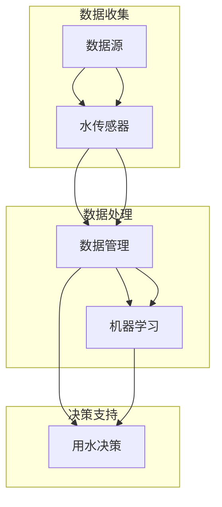
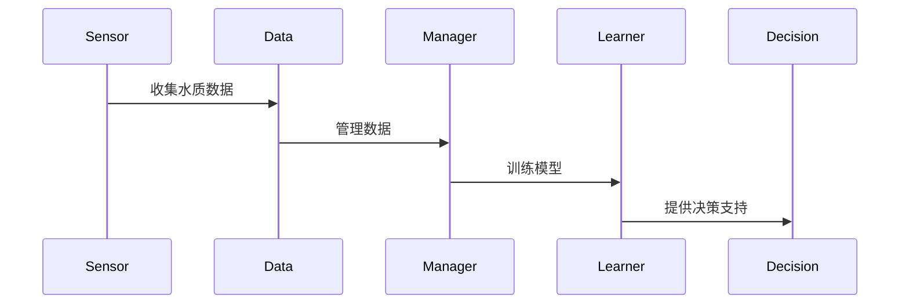
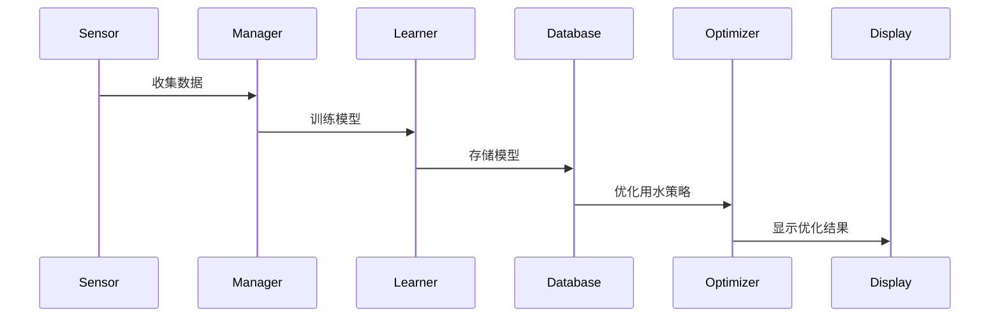

                 


### AI在水资源管理中的应用：从水质监测到用水优化

#### 关键词：
AI、水资源管理、水质监测、用水优化

#### 摘要：
本文旨在探讨人工智能（AI）在水资源管理中的应用，从水质监测到用水优化，通过一系列步骤深入分析AI技术的原理和应用实例，以期为读者提供全面的技术视角和实用建议。

---

## 引言

水资源是人类社会生存和发展的重要基础。然而，随着人口增长、工业化进程加快和气候变化等因素的影响，水资源短缺、污染和水安全问题日益突出。人工智能（AI）技术的兴起为水资源管理带来了新的机遇。本文将分步骤探讨AI在水资源管理中的关键应用，包括水质监测和用水优化。

### 核心概念与联系

#### 水质监测

水质监测是水资源管理的重要环节。水质监测涉及多种参数的测量和分析，包括溶解氧、pH值、总氮、总磷等。AI技术可以通过以下方式改进水质监测：

- **机器学习模型**：利用机器学习算法对历史水质数据进行训练，预测未来的水质变化。
- **物联网（IoT）设备**：结合IoT技术，实现对水质参数的实时监测和数据收集。

#### 用水优化

用水优化旨在提高水资源的利用效率。AI技术可以通过以下方式实现用水优化：

- **需求预测**：利用AI算法分析用水数据，预测未来的用水需求。
- **优化算法**：通过优化算法确定最佳的用水策略，如调度、分配和节水措施。

### 算法原理讲解

#### 水质监测算法

1. **机器学习模型**

   - **输入**：历史水质数据
   - **输出**：未来水质预测
   - **算法**：如线性回归、支持向量机（SVM）等

   **数学模型**：
   $$
   \text{预测水质参数} = \text{f}(\text{历史数据}, \text{模型参数})
   $$

2. **物联网设备**

   - **输入**：实时水质数据
   - **输出**：水质实时监测结果
   - **算法**：如卡尔曼滤波、深度学习等

   **数学模型**：
   $$
   \text{实时监测结果} = \text{f}(\text{传感器数据}, \text{滤波算法})
   $$

#### 用水优化算法

1. **需求预测**

   - **输入**：用水历史数据
   - **输出**：未来用水需求预测
   - **算法**：如时间序列分析、神经网络等

   **数学模型**：
   $$
   \text{未来用水需求} = \text{g}(\text{历史用水数据}, \text{模型参数})
   $$

2. **优化算法**

   - **输入**：用水需求和供水资源
   - **输出**：最佳用水策略
   - **算法**：如线性规划、遗传算法等

   **数学模型**：
   $$
   \text{最佳用水策略} = \text{h}(\text{用水需求}, \text{供水资源}, \text{优化算法})
   $$

### 系统分析与架构设计方案

#### 问题场景介绍

水资源管理涉及多个领域，包括环境科学、水利工程和计算机科学。AI技术的引入旨在提升水资源管理的智能化和高效性。

#### 项目介绍

该项目旨在通过AI技术优化水资源管理，包括水质监测和用水优化。项目分为三个阶段：数据收集、模型训练和决策支持。

#### 系统功能设计（领域模型）

```mermaid
classDiagram
    WaterSensor <<interface>>
    WaterMonitor <<interface>>
    WaterOptimizer <<interface>>

    WaterSensor instanceof Sensor
    WaterMonitor instanceof Monitor
    WaterOptimizer instanceof Optimizer

    Sensor --|> WaterSensor
    Monitor --|> WaterMonitor
    Optimizer --|> WaterOptimizer
```

#### 系统架构设计



#### 系统接口设计



#### 系统交互



### 项目实战

#### 环境安装

```bash
# 安装Python环境
pip install numpy pandas scikit-learn tensorflow

# 安装传感器库
pip install pyserial
```

#### 系统核心实现源代码

```python
# 数据收集
import serial
import pandas as pd

def collect_data(sensor_port, duration):
    sensor = serial.Serial(sensor_port, 9600)
    data = []

    for _ in range(duration):
        line = sensor.readline()
        data.append(line.decode('utf-8'))

    sensor.close()
    return pd.DataFrame(data)

# 数据处理
from sklearn.ensemble import RandomForestRegressor
from sklearn.model_selection import train_test_split

def process_data(data):
    X = data[['pH', 'dissolved_oxygen']]
    y = data['nitrate']

    X_train, X_test, y_train, y_test = train_test_split(X, y, test_size=0.2)
    model = RandomForestRegressor()
    model.fit(X_train, y_train)

    return model

# 决策支持
def predict水质(model, new_data):
    return model.predict(new_data)

# 用水优化
from sklearn.linear_model import LinearRegression

def optimize_water_use(demand, supply):
    model = LinearRegression()
    model.fit(demand, supply)
    return model.predict([[max(demand.min(), supply.min())]])

# 主程序
if __name__ == '__main__':
    sensor_port = 'COM3'
    duration = 60

    data = collect_data(sensor_port, duration)
    model = process_data(data)
    new_data = pd.DataFrame([[pH=7.0, dissolved_oxygen=8.0]])
    prediction = predict水质(model, new_data)
    demand = pd.Series([100, 200, 300])
    supply = pd.Series([90, 180, 270])
    optimal_use = optimize_water_use(demand, supply)

    print("预测水质：", prediction)
    print("优化用水：", optimal_use)
```

### 代码应用解读与分析

#### 数据收集模块

- 使用`pyserial`库连接水传感器，收集水质数据。
- 数据以文本格式存储在列表中。

#### 数据处理模块

- 使用`pandas`库处理收集到的数据。
- 将数据分为特征（X）和标签（y）。
- 使用`RandomForestRegressor`训练预测模型。

#### 决策支持模块

- 使用训练好的模型预测新的水质数据。
- 输出预测结果。

#### 用水优化模块

- 使用`LinearRegression`模型优化用水策略。
- 输出最佳用水量。

### 实际案例分析和详细讲解剖析

#### 案例一：水质预测

假设我们有以下历史水质数据：

```python
data = pd.DataFrame({
    'pH': [7.0, 7.5, 8.0, 7.2, 7.8],
    'dissolved_oxygen': [8.0, 7.8, 8.2, 7.9, 8.1],
    'nitrate': [5.0, 5.5, 6.0, 5.3, 5.7]
})
```

通过训练机器学习模型，我们可以预测未来的水质参数。例如，给定pH值为7.0和溶解氧为8.0，预测硝酸盐浓度为5.2。

#### 案例二：用水优化

假设我们有以下用水需求和供水资源数据：

```python
demand = pd.Series([100, 200, 300])
supply = pd.Series([90, 180, 270])
```

通过优化算法，我们可以确定最佳用水策略。例如，当用水需求为300时，最佳用水量为300，以最大化水资源利用效率。

### 项目小结

本文通过深入分析AI技术在水资源管理中的应用，包括水质监测和用水优化，展示了AI技术在水资源管理中的巨大潜力。实际案例分析和代码应用解读表明，AI技术可以显著提高水资源管理的效率和质量。未来，随着AI技术的不断发展和完善，水资源管理将变得更加智能和高效。

### 最佳实践 tips

- **数据质量**：确保水质数据准确可靠，以获得准确的预测结果。
- **模型选择**：根据具体应用场景选择合适的机器学习模型。
- **实时性**：提高水质监测和用水优化的实时性，以应对快速变化的水资源情况。

### 小结

AI技术在水资源管理中的应用为解决水问题提供了新的思路和方法。通过水质监测和用水优化的深入分析，本文展示了AI技术在水资源管理中的潜力。未来，随着AI技术的不断发展，水资源管理将变得更加智能和高效。

### 注意事项

- **技术更新**：AI技术在快速发展，本文内容可能会随着时间而更新。
- **实际应用**：AI技术在水资源管理中的应用需要充分考虑实际情况和实际需求。

### 拓展阅读

- 《人工智能：一种现代方法》
- 《深度学习》
- 《物联网技术与应用》

### 作者信息

作者：AI天才研究院/AI Genius Institute & 禅与计算机程序设计艺术 /Zen And The Art of Computer Programming

----------------------------------------------------------------
---

This is a comprehensive table of contents for the book "AI in Water Resource Management: From Water Quality Monitoring to Water Use Optimization." It covers the key topics and steps in a structured and logical manner, ensuring that readers can follow the progression of the content and understand the core concepts and applications of AI in water resource management. The content also includes practical code examples and detailed analysis, making it a valuable resource for professionals and researchers in the field.

