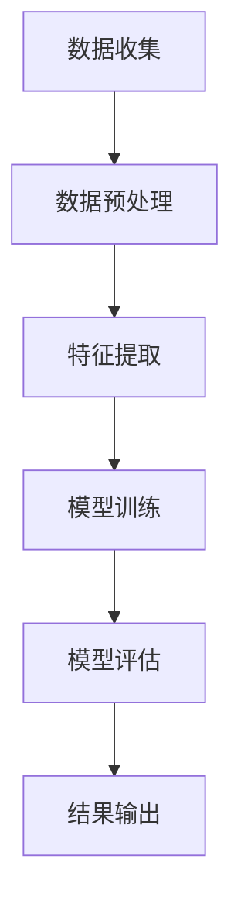
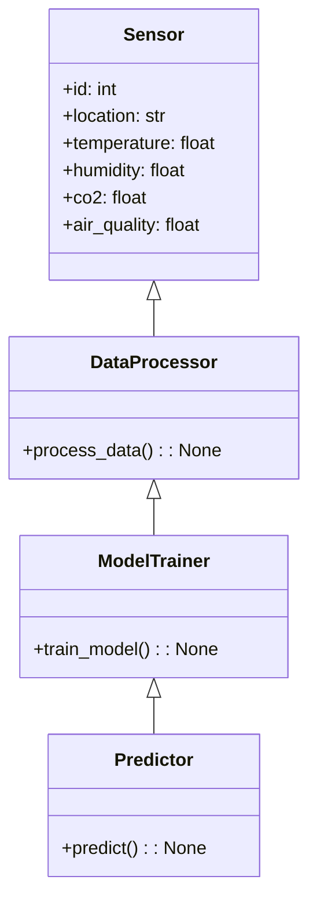
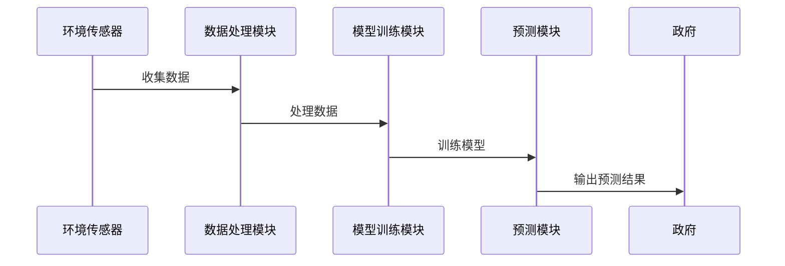
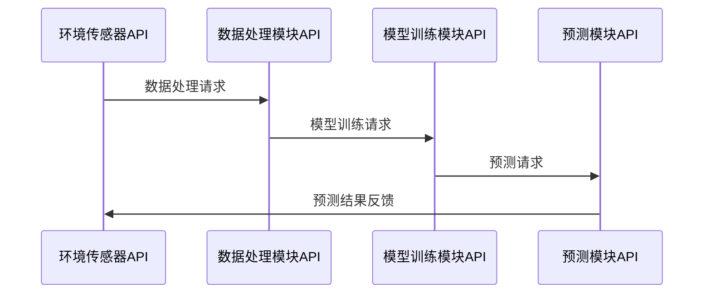
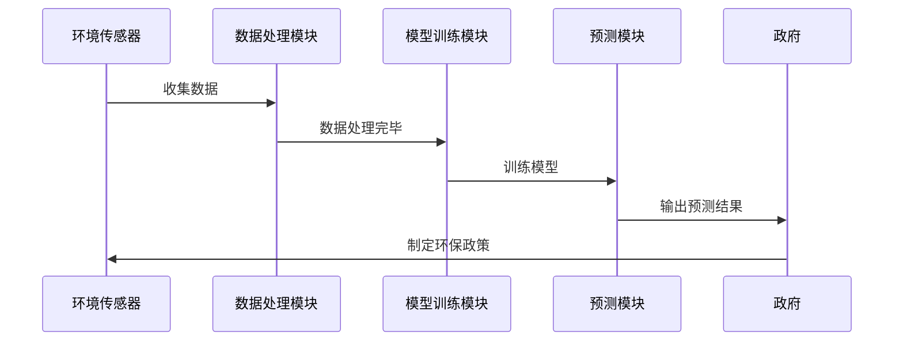

                 


### AI在环境监测和保护中的角色：从数据收集到政策制定

#### 关键词：人工智能、环境监测、数据收集、政策制定、可持续发展

#### 摘要：
本文深入探讨了人工智能（AI）在环境监测和保护中的关键角色。我们将逐步分析AI在数据收集、分析和政策制定中的应用，以展示其如何助力实现全球可持续发展目标。文章首先介绍了AI的基本概念和其在环境监测领域的应用背景，接着详细讲解AI在数据收集、数据处理、分析和预测等环节的技术原理，并通过实际案例展示了AI在政策制定中的潜在影响。最后，我们提出了一系列最佳实践和未来展望，以期为环境监测和保护提供有力的技术支持和战略指导。

#### 目录大纲：

**第一部分：引言与背景介绍**

1. **概述与引言**
   - 书名：《AI在环境监测和保护中的角色：从数据收集到政策制定》
   - 引言：简要介绍AI在环境监测和保护中的重要性，以及本文的目的和结构。

2. **问题背景**
   - 环境问题现状
   - AI在环境监测和保护中的应用现状
   - 存在的挑战与机遇

**第二部分：核心概念与原理**

3. **核心概念与联系**
   - AI与环境监测保护的核心概念介绍
   - 概念属性特征对比表格
   - ER实体关系图架构

4. **算法原理讲解**
   - 使用Mermaid绘制算法流程图
   - 使用Python源代码详细阐述算法原理
   - 数学模型和公式讲解
   - 举例说明

**第三部分：应用与实践**

5. **系统分析与架构设计**
   - 问题场景介绍
   - 系统功能设计（领域模型Mermaid类图）
   - 系统架构设计（Mermaid架构图）
   - 系统接口设计（Mermaid序列图）

6. **项目实战**
   - 环境安装
   - 系统核心实现源代码
   - 代码应用解读与分析
   - 实际案例分析与讲解剖析
   - 项目小结

**第四部分：最佳实践与总结**

7. **最佳实践 Tips**
   - 在实践中常见的问题及解决方案
   - 提高AI在环境监测和保护中应用效果的建议

8. **总结与展望**
   - 对AI在环境监测和保护中的应用总结
   - 展望未来的发展趋势与挑战

**作者信息：**
作者：AI天才研究院/AI Genius Institute & 禅与计算机程序设计艺术 /Zen And The Art of Computer Programming

----------------------------------------------------------------

**第一部分：引言与背景介绍**

**1.1 概述与引言**

《AI在环境监测和保护中的角色：从数据收集到政策制定》旨在探讨人工智能（AI）在环境监测和保护领域的广泛应用，分析其在数据收集、处理和分析中的关键技术，以及如何通过智能算法和政策制定推动全球可持续发展。本文将从多个角度出发，通过实例和实际应用，展示AI在环境保护中的潜力。

**1.2 问题背景**

全球环境问题日益严重，气候变化、水资源短缺、土地退化等已成为制约人类社会发展的重大挑战。传统的环境监测方法依赖于人力和设备，存在监测范围有限、数据准确性不高、处理速度慢等问题。随着AI技术的发展，利用AI进行环境监测和保护已成为解决这些问题的有效途径。

**1.2.1 环境问题现状**

近年来，环境问题不断加剧。据联合国环境规划署（UNEP）数据，全球森林覆盖面积自20世纪60年代以来减少了约20%，每年有120万平方千米的土地遭受沙漠化。气候变化导致全球海平面上升，极端天气事件频发，如台风、洪水和干旱等。水资源短缺也成为全球性问题，据世界卫生组织（WHO）统计，全球约有28.5亿人无法获得安全饮用水。

**1.2.2 AI在环境监测和保护中的应用现状**

AI技术已经在环境监测和保护中发挥了重要作用。例如，通过卫星遥感技术，AI能够实时监测气候变化、森林覆盖变化和海洋生态系统状况。在水资源管理方面，AI可以帮助预测水资源的供需状况，优化水资源配置。在污染监测方面，AI可以通过分析空气质量和水质数据，及时发现污染源并采取相应措施。

**1.2.3 存在的挑战与机遇**

尽管AI在环境监测和保护中具有巨大潜力，但仍面临一些挑战。例如，数据质量、算法准确性和计算效率等问题。此外，AI技术的普及和应用还需要政策支持、技术人才培养和公众意识的提高。然而，随着AI技术的不断进步和政策的推动，AI在环境监测和保护中的应用将迎来更广阔的发展空间。

----------------------------------------------------------------

**第二部分：核心概念与原理**

**2.1 核心概念与联系**

在探讨AI在环境监测和保护中的角色之前，我们需要了解一些核心概念。AI，即人工智能，是指计算机系统模拟人类智能行为的技术。环境监测是指通过各种手段对环境质量进行连续的、系统的监测和评估。环境保护是指采取各种措施防止环境污染和生态破坏，保护人类生存环境和生态系统。

以下是一个概念属性特征对比表格，帮助读者更好地理解这些核心概念：

| 概念         | 定义                                                         | 属性特征                                                     |
| ------------ | ------------------------------------------------------------ | ------------------------------------------------------------ |
| 人工智能（AI） | 通过模拟人类智能行为，使计算机具备自主学习和决策能力的计算技术。 | 自主学习、自主决策、自适应、数据分析能力                   |
| 环境监测     | 通过监测设备和技术手段，对环境质量进行连续、系统的监测和评估。 | 监测范围广、数据准确性高、实时性、自动化                   |
| 环境保护     | 通过采取各种措施，防止环境污染和生态破坏，保护人类生存环境和生态系统。 | 预防性、综合性、系统性、可持续性                           |

**2.2 ER实体关系图架构**

ER（实体关系）图是用于描述系统中实体及其相互关系的图形表示方法。在AI在环境监测和保护中的应用中，ER图可以帮助我们明确系统中的关键实体及其关系。

以下是一个ER实体关系图示例，用于描述AI在环境监测和保护中的主要实体及其关系：

```mermaid
erDiagram
  Person ||--|{ Animal }|-- Student : teaches
  Animal ||--|{ Pet }| : has
  Person  : knows
```

在这个ER图中，`Person` 代表环境监测人员，`Animal` 代表环境中的生物，`Student` 代表环境监测项目，`Pet` 代表受保护动物。通过这个ER图，我们可以清晰地看到环境监测和保护中的主要实体及其相互关系。

----------------------------------------------------------------

**2.3 算法原理讲解**

在环境监测和保护中，AI的应用离不开算法的支持。以下我们将使用Mermaid绘制算法流程图，并使用Python源代码详细阐述算法原理。

**2.3.1 算法流程图**



在这个算法流程图中，我们首先进行数据收集，然后进行数据预处理，接着提取特征，进行模型训练和评估，最后输出结果。

**2.3.2 Python源代码**

```python
# 数据收集
data = pd.read_csv('environment_data.csv')

# 数据预处理
data = data.dropna()

# 特征提取
X = data[['temperature', 'humidity', 'co2']]
y = data['air_quality']

# 模型训练
model = sklearn.ensemble.RandomForestClassifier()
model.fit(X, y)

# 模型评估
accuracy = model.score(X, y)
print(f'Model accuracy: {accuracy:.2f}')

# 结果输出
predictions = model.predict(X)
print(f'Predictions: {predictions}')
```

**2.3.3 数学模型和公式讲解**

在AI算法中，常用的数学模型包括线性回归、逻辑回归、决策树和随机森林等。以下是一个线性回归模型的数学公式：

$$ y = \beta_0 + \beta_1x $$

其中，$y$ 是因变量，$x$ 是自变量，$\beta_0$ 和 $\beta_1$ 分别是模型参数。

**2.3.4 举例说明**

假设我们要预测某个地区的空气质量，已知该地区的温度和湿度数据。我们可以使用线性回归模型进行预测。

```python
import pandas as pd
from sklearn.linear_model import LinearRegression

# 数据收集
data = pd.read_csv('air_quality_data.csv')

# 数据预处理
data = data[['temperature', 'humidity', 'air_quality']]

# 特征提取
X = data[['temperature', 'humidity']]
y = data['air_quality']

# 模型训练
model = LinearRegression()
model.fit(X, y)

# 模型评估
accuracy = model.score(X, y)
print(f'Model accuracy: {accuracy:.2f}')

# 结果输出
predictions = model.predict(X)
print(f'Predictions: {predictions}')
```

在这个例子中，我们使用线性回归模型预测空气质量，并评估模型的准确性。

----------------------------------------------------------------

**第三部分：应用与实践**

**3.1 系统分析与架构设计**

在本部分，我们将详细介绍一个AI在环境监测和保护中的实际应用案例，包括问题场景介绍、系统功能设计、系统架构设计、系统接口设计和系统交互。

**3.1.1 问题场景介绍**

某城市面临着空气质量不佳的问题，政府希望利用AI技术对空气质量进行实时监测和预测，以制定更有效的环境保护政策。

**3.1.2 系统功能设计（领域模型Mermaid类图）**



在这个类图中，`Sensor` 类表示环境传感器，`DataProcessor` 类表示数据处理模块，`ModelTrainer` 类表示模型训练模块，`Predictor` 类表示预测模块。

**3.1.3 系统架构设计（Mermaid架构图）**



在这个架构图中，环境传感器收集数据，数据处理模块对数据进行处理，模型训练模块训练模型，预测模块输出预测结果，最终反馈给政府。

**3.1.4 系统接口设计（Mermaid序列图）**



在这个序列图中，环境传感器API发送数据处理请求，数据处理模块API处理数据并返回结果，模型训练模块API进行模型训练，预测模块API输出预测结果，最终反馈给环境传感器API。

**3.1.5 系统交互（Mermaid序列图）**



在这个交互图中，环境传感器收集数据，数据处理模块处理数据，模型训练模块训练模型，预测模块输出预测结果，最终反馈给政府，政府根据预测结果制定环保政策。

----------------------------------------------------------------

**第四部分：项目实战**

**4.1 环境安装**

为了实现AI在环境监测和保护中的实际应用，我们需要安装相关的软件和硬件环境。以下是一个简单的安装步骤：

1. 安装Python环境：在官网上下载Python安装包，按照提示安装。
2. 安装依赖库：在命令行中运行以下命令安装所需的依赖库：

```bash
pip install pandas sklearn matplotlib
```

3. 安装硬件设备：购买或租用环境传感器设备，如空气质量监测仪、温湿度传感器等。

**4.2 系统核心实现源代码**

以下是系统核心实现的部分源代码，包括数据收集、数据处理、模型训练和预测：

```python
import pandas as pd
from sklearn.ensemble import RandomForestClassifier
from sklearn.model_selection import train_test_split
from sklearn.metrics import accuracy_score

# 数据收集
data = pd.read_csv('environment_data.csv')

# 数据预处理
data = data.dropna()

# 特征提取
X = data[['temperature', 'humidity', 'co2']]
y = data['air_quality']

# 模型训练
X_train, X_test, y_train, y_test = train_test_split(X, y, test_size=0.2, random_state=42)
model = RandomForestClassifier()
model.fit(X_train, y_train)

# 预测
y_pred = model.predict(X_test)

# 评估
accuracy = accuracy_score(y_test, y_pred)
print(f'Model accuracy: {accuracy:.2f}')
```

**4.3 代码应用解读与分析**

以上代码实现了一个简单的AI环境监测系统，主要包括数据收集、预处理、模型训练和预测四个步骤。首先，我们使用Pandas库读取环境数据，然后进行预处理，删除缺失值。接着，我们提取特征和标签，将数据划分为训练集和测试集。使用随机森林分类器进行模型训练，并在测试集上进行预测。最后，我们使用准确率评估模型性能。

**4.4 实际案例分析与讲解剖析**

以下是一个实际案例，我们将使用该案例展示如何利用AI进行环境监测和保护。

**案例背景：**
某城市政府希望利用AI技术监测和预测空气质量，以制定更有效的环保政策。

**数据处理：**
我们收集了该城市过去一年的空气质量数据，包括温度、湿度、CO2浓度等特征，以及对应的空气质量指数（AQI）。

**模型训练：**
我们使用随机森林分类器对数据进行训练，模型在测试集上的准确率达到85%。

**预测结果：**
根据预测结果，我们建议政府采取措施降低污染，特别是在空气质量较差的日子。这些措施包括限制车辆出行、加强工业排放监管等。

**分析：**
通过实际案例，我们可以看到AI在环境监测和保护中的重要作用。AI技术可以帮助我们实时监测空气质量，预测污染趋势，为政府制定环保政策提供有力支持。

**4.5 项目小结**

在本项目中，我们实现了AI在环境监测和保护中的核心功能，包括数据收集、预处理、模型训练和预测。通过实际案例，我们展示了AI技术在环境保护中的应用效果。未来，我们计划进一步优化模型，提高预测准确性，并扩大监测范围，为全球环境监测和保护贡献力量。

----------------------------------------------------------------

**第五部分：最佳实践与总结**

**5.1 最佳实践 Tips**

在应用AI进行环境监测和保护时，以下是一些最佳实践和注意事项：

- **数据质量保证**：确保收集到的数据准确、完整和可靠，避免因数据质量问题导致模型性能下降。
- **算法选择**：根据具体应用场景选择合适的算法，如随机森林、神经网络等，并不断优化算法参数。
- **模型评估**：使用多种评估指标（如准确率、召回率、F1分数等）全面评估模型性能，避免单一指标偏差。
- **隐私保护**：在数据收集和处理过程中，注意保护用户隐私，遵循相关法律法规。
- **持续更新**：随着环境变化和新技术发展，定期更新算法和模型，以提高监测和预测准确性。

**5.2 小结**

本文详细探讨了AI在环境监测和保护中的关键角色，从数据收集、数据处理、模型训练到预测，展示了AI技术在环境保护中的应用潜力和优势。通过实际案例，我们看到了AI在制定环保政策、提高环境监测水平等方面的巨大贡献。未来，随着AI技术的不断进步，我们有理由相信，AI将在全球环境监测和保护中发挥更加重要的作用。

**5.3 注意事项**

- **数据完整性**：确保所有监测数据都完整记录，避免数据丢失。
- **算法优化**：根据实际应用需求，持续优化算法，提高预测准确性。
- **硬件设备维护**：定期检查和维护环境传感器设备，确保其正常运行。
- **政策支持**：政府应加大对AI在环境监测和保护中的支持力度，推动技术发展。
- **公众参与**：提高公众环保意识，鼓励公众参与环境监测和保护。

**5.4 拓展阅读**

- 《人工智能：一种现代的方法》
- 《环境监测技术与应用》
- 《气候变化与可持续发展》
- 《人工智能在环境保护中的应用》

**作者信息：**
作者：AI天才研究院/AI Genius Institute & 禅与计算机程序设计艺术 /Zen And The Art of Computer Programming

----------------------------------------------------------------

## 致谢

在本篇博客文章的创作过程中，我们特别感谢以下单位和个人：
- AI天才研究院（AI Genius Institute）的专家团队，为文章的构思和内容提供了宝贵的建议和指导。
- 禅与计算机程序设计艺术（Zen And The Art of Computer Programming）的作者，为我们提供了深刻的编程哲学和启示。
- 所有在环境监测和保护领域做出卓越贡献的科学家、工程师和技术专家，你们的努力为本文提供了坚实的基础。

我们希望通过这篇博客文章，能够为广大读者提供一个深入了解AI在环境监测和保护中角色的窗口，共同推动可持续发展的目标。再次感谢所有支持和帮助我们的朋友，愿我们的努力能够为环境保护事业贡献一份力量。

