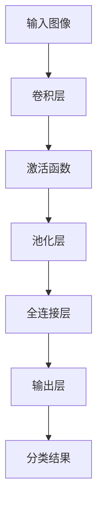
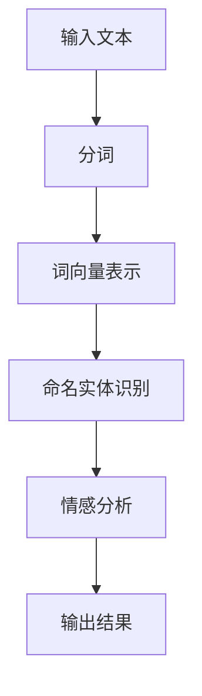
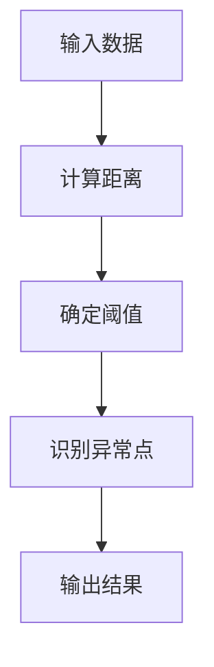
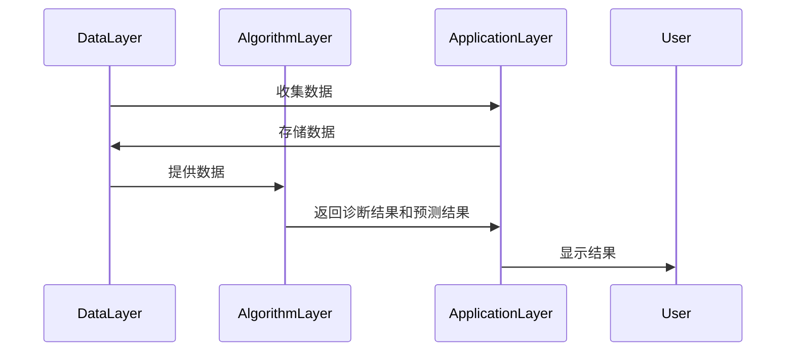
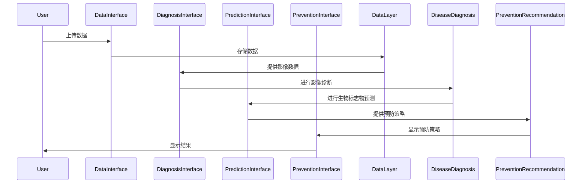

                 

## AI在疾病诊断和预防中的角色

### 关键词

- 疾病诊断
- 疾病预防
- 人工智能
- 机器学习
- 深度学习

### 摘要

本文将深入探讨人工智能（AI）在疾病诊断和预防中的关键角色。随着AI技术的不断进步，其在医疗领域的应用日益广泛，为疾病预防和诊断带来了前所未有的可能性。本文首先介绍了AI在医疗领域的挑战和机遇，然后详细阐述了AI的核心概念，包括机器学习、深度学习和神经网络。接着，文章通过具体的算法原理讲解、数学模型与公式介绍、系统分析与架构设计，以及项目实战，展示了AI在疾病诊断和预防中的实际应用。最后，文章提供了最佳实践建议和小结，总结了AI在疾病诊断和预防中的重要性，并展望了未来的发展方向。

### 目录

1. **背景介绍**  
   1.1 医疗领域的挑战与机遇  
   1.2 AI的核心概念与技术发展  
   1.3 AI在医疗领域的应用前景

2. **核心概念与联系**  
   2.1 疾病诊断与预防的基本概念  
   2.2 机器学习算法简介  
   2.3 关键术语定义与关系图

3. **算法原理讲解**  
   3.1 图像识别算法  
   3.2 自然语言处理算法  
   3.3 异常检测算法  
   3.4 算法流程图与Python代码实现

4. **数学模型和数学公式 & 详细讲解 & 举例说明**  
   4.1 逻辑回归模型  
   4.2 神经网络权重更新  
   4.3 数学公式与例子

5. **系统分析与架构设计方案**  
   5.1 疾病诊断和预防系统概述  
   5.2 系统架构设计  
   5.3 领域模型类图  
   5.4 系统接口设计与交互序列图

6. **项目实战**  
   6.1 肺癌诊断系统的构建  
   6.2 环境配置与核心实现  
   6.3 代码解读与分析  
   6.4 实际案例分析与讲解

7. **最佳实践 tips、小结、注意事项、拓展阅读**  
   7.1 最佳实践建议  
   7.2 小结  
   7.3 注意事项  
   7.4 拓展阅读

---

### 背景介绍

医疗领域的挑战与机遇

在当今世界，医疗领域正面临诸多挑战，包括日益增长的慢性病发病率、人口老龄化以及医疗资源的有限性。同时，现代医学也迎来了前所未有的机遇，得益于信息技术的快速发展，尤其是人工智能（AI）技术的应用。AI在疾病诊断和预防中扮演着越来越重要的角色，通过提供高效、准确的诊断工具和预防措施，为医疗行业带来了革命性的变革。

当前医疗领域的挑战主要包括：

- **资源有限性**：医疗资源（如医生、设备等）有限，无法满足不断增长的健康需求。AI可以通过自动化诊断和预测，减轻医疗工作负担，提高资源利用效率。
- **诊断效率低下**：许多疾病需要复杂的诊断流程，耗时较长，影响患者治疗效果。AI技术可以加速诊断过程，提高诊断准确率。
- **数据不完整**：医疗数据往往存在不完整性、不一致性和噪声，这对传统诊断方法提出了挑战。AI技术能够处理大规模、复杂、不完整的数据，提高诊断和预测的准确性。
- **治疗个性化**：个体差异使得同一种治疗方法对不同患者效果不一。AI可以根据患者的具体特征，提供个性化的治疗方案。

AI在医疗领域的应用前景

AI技术在医疗领域的应用前景广阔，主要包括以下方面：

- **疾病诊断**：AI可以通过分析医学影像、生物标志物和患者数据，提高疾病诊断的准确性和效率。
- **疾病预测**：AI可以预测疾病的发生和进展，帮助医生制定预防措施，降低疾病风险。
- **个性化治疗**：AI可以根据患者的具体特征，提供个性化的治疗方案，提高治疗效果。
- **药物研发**：AI可以加速药物研发过程，提高新药发现的成功率。
- **健康管理**：AI可以监测患者的健康状况，提供实时健康建议，帮助患者更好地管理健康。

总之，AI在疾病诊断和预防中具有重要的地位和作用，通过不断的技术创新和应用实践，有望解决医疗领域的诸多挑战，为人类健康事业做出更大的贡献。接下来，我们将深入探讨AI的核心概念和技术发展，为理解其在医疗领域的应用打下坚实的基础。

### AI的核心概念与技术发展

#### 机器学习

机器学习是AI的核心组成部分之一，它使计算机系统能够通过数据和经验自动改进其性能。机器学习算法通过从数据中学习模式，从而实现预测、分类、聚类等任务。

**基本概念**：

- **监督学习**：在有标注的数据集上训练模型，使其能够对新的数据进行预测。例如，利用患者的医疗记录来训练一个模型，预测新的患者是否患有某种疾病。
- **无监督学习**：在没有标注的数据集上训练模型，发现数据中的隐藏结构。例如，将患者的基因数据分组，以识别健康与疾病的差异。
- **强化学习**：通过与环境的互动，学习最优策略来最大化累积奖励。例如，一个系统可以在虚拟环境中训练，以优化患者的治疗方案。

**发展历程**：

- **早期算法**：线性回归、决策树、支持向量机等
- **现代算法**：神经网络、深度学习、集成方法等

#### 深度学习

深度学习是机器学习的一个子领域，以模拟人脑的神经网络结构为基础，通过多层神经网络进行数据学习，具有强大的特征提取和模式识别能力。

**基本概念**：

- **神经网络**：由多个相互连接的神经元组成，每个神经元对应一个计算单元。
- **深度神经网络**：具有多个隐藏层的神经网络，能够提取更复杂的特征。
- **卷积神经网络（CNN）**：专门用于图像处理，通过卷积操作提取图像特征。
- **循环神经网络（RNN）**：用于处理序列数据，如文本和语音，能够捕捉时间序列信息。
- **生成对抗网络（GAN）**：通过两个神经网络（生成器和判别器）的对抗训练，生成高质量的数据。

**发展历程**：

- **1980年代**：反向传播算法的提出，神经网络开始应用于实际问题。
- **2006年**：深度学习的复兴，Hinton等学者提出了深度置信网络。
- **2012年**：AlexNet在ImageNet大赛中取得突破性成绩，深度学习迅速发展。

#### 神经网络

神经网络是深度学习的基础，其结构类似于人脑的神经元网络，通过前向传播和反向传播进行学习。

**基本概念**：

- **神经元**：神经网络的基本计算单元，包含输入层、输出层和隐藏层。
- **权重和偏置**：每个神经元之间的连接具有权重，用于调整信号强度；神经元还具有偏置，用于调整输出。
- **激活函数**：用于引入非线性，使神经网络能够建模复杂的函数关系。

**神经网络结构**：

1. **输入层**：接收输入数据。
2. **隐藏层**：进行特征提取和变换。
3. **输出层**：生成最终输出。

**学习过程**：

1. **前向传播**：将输入数据传递到神经网络，计算输出。
2. **反向传播**：计算输出误差，更新权重和偏置。

**常见神经网络**：

- **全连接神经网络**：每个神经元都与上一层和下一层所有神经元相连。
- **卷积神经网络**：专门用于图像处理，通过卷积操作提取局部特征。
- **循环神经网络**：用于处理序列数据，通过循环结构保持历史信息。

通过机器学习、深度学习和神经网络的不断发展，AI技术逐渐成为解决医疗领域问题的有力工具。在下一章节中，我们将进一步探讨AI在疾病诊断和预防中的核心概念，并通过表格和ER图展示其关联性，为理解AI在医疗中的应用奠定基础。

### 核心概念与联系

在深入探讨AI在疾病诊断和预防中的应用之前，我们需要明确几个关键术语的概念及其相互关系。以下是疾病诊断、疾病预防、机器学习算法等核心概念的简要说明，并通过表格和ER图展示它们之间的联系。

#### 疾病诊断与预防的基本概念

**疾病诊断**：指通过一系列医学检查和测试，确定患者是否患有特定疾病的过程。诊断过程通常涉及医学影像、血液检查、生物标志物检测等。

**疾病预防**：指采取各种措施来降低疾病发生风险的策略，包括疫苗接种、健康生活方式、疾病筛查等。

**机器学习算法**：指用于从数据中学习模式和规律的一系列算法，包括监督学习、无监督学习和强化学习。

#### 关键术语定义与关系图

**关键术语定义**：

1. **医学影像**：指用于疾病诊断的图像数据，如X光片、CT扫描、MRI等。
2. **生物标志物**：指与特定疾病相关的生理或生化指标，如肿瘤标志物、血脂水平等。
3. **特征提取**：指从数据中提取有代表性的特征，以便用于机器学习模型训练。
4. **模型评估**：指对训练好的模型进行性能评估，以确定其诊断或预测能力。

**ER图展示**：

以下是使用Mermaid绘制的ER图，展示了上述关键术语之间的关系：

```mermaid
erDiagram
  Patient ||--|{ MedicalImage : has }
  Patient ||--|{ BioMarker : has }
  Disease ||--|{ Diagnosis : diagnosed_by }
  Disease ||--|{ Prevention : for }
  MedicalImage ||--|{ DiagnosticAlgorithm : used }
  BioMarker ||--|{ DiagnosticAlgorithm : used }
  DiagnosticAlgorithm ||--|{ ModelEvaluation : evaluated }
```

**表格展示**：

以下是关键术语的属性特征对比表格：

| 关键术语       | 定义                                                         | 属性特征                                                                                   | 关联性                   |
|----------------|--------------------------------------------------------------|-------------------------------------------------------------------------------------------|--------------------------|
| 疾病诊断       | 确定患者是否患有特定疾病的过程                               | 医学影像、生物标志物、实验室检查结果等                                               | - 与预防相关，作为诊断结果 |
| 疾病预防       | 降低疾病发生风险的策略                                       | 接种疫苗、健康生活方式、疾病筛查等                                                   | - 与诊断相关，作为预防措施 |
| 机器学习算法   | 用于从数据中学习模式和规律的一系列算法                       | 监督学习、无监督学习、强化学习等                                                     | - 用于诊断和预防           |
| 医学影像       | 用于疾病诊断的图像数据                                       | X光片、CT扫描、MRI等                                                                   | - 用于诊断                 |
| 生物标志物     | 与特定疾病相关的生理或生化指标                               | 肿瘤标志物、血脂水平等                                                                  | - 用于诊断                 |
| 特征提取       | 从数据中提取有代表性的特征                                   | 特征选择、特征转换等                                                                   | - 用于机器学习模型训练     |
| 模型评估       | 对训练好的模型进行性能评估                                   | 准确率、召回率、F1分数等                                                               | - 用于诊断和预防效果评估   |

通过上述表格和ER图，我们可以清晰地看到疾病诊断、疾病预防和机器学习算法之间的相互关系，这为理解AI在医疗领域的应用提供了理论基础。

在下一章节中，我们将深入讲解常用的AI算法，包括图像识别、自然语言处理和异常检测等，并通过算法流程图和Python代码实现，展示这些算法在疾病诊断和预防中的应用原理。

### 算法原理讲解

在探讨AI在疾病诊断和预防中的应用时，了解几种常用的AI算法至关重要。这些算法包括图像识别、自然语言处理和异常检测等，它们通过不同的机制和模型，帮助我们处理和分析大量的医疗数据。以下是对这些算法的详细介绍，以及如何使用mermaid绘制算法流程图和Python代码实现算法原理。

#### 图像识别算法

图像识别是AI在疾病诊断中应用最为广泛的领域之一。它通过分析医学影像，如X光片、CT扫描和MRI，来识别疾病和异常。

**算法原理**：

图像识别算法通常基于卷积神经网络（CNN）。CNN通过卷积层、池化层和全连接层，逐步提取图像的局部特征和全局特征，最终输出分类结果。

**算法流程图**：

以下是图像识别算法的mermaid流程图：



**Python代码实现**：

下面是一个简单的Python代码示例，使用TensorFlow和Keras实现一个简单的图像识别模型：

```python
import tensorflow as tf
from tensorflow.keras.models import Sequential
from tensorflow.keras.layers import Conv2D, MaxPooling2D, Flatten, Dense

model = Sequential([
    Conv2D(32, (3, 3), activation='relu', input_shape=(28, 28, 1)),
    MaxPooling2D((2, 2)),
    Flatten(),
    Dense(64, activation='relu'),
    Dense(10, activation='softmax')
])

model.compile(optimizer='adam', loss='categorical_crossentropy', metrics=['accuracy'])
model.fit(x_train, y_train, epochs=10, batch_size=32, validation_data=(x_val, y_val))
```

#### 自然语言处理算法

自然语言处理（NLP）算法在处理医疗文本数据，如电子健康记录（EHR）和医学报告时发挥着重要作用。

**算法原理**：

NLP算法包括词向量表示、命名实体识别（NER）、情感分析等。词向量表示用于将文本转换为数字向量，以便于模型处理；NER用于识别文本中的医学实体，如疾病名称、药物名称等；情感分析用于判断文本的情感倾向。

**算法流程图**：

以下是自然语言处理算法的mermaid流程图：



**Python代码实现**：

下面是一个简单的Python代码示例，使用NLTK进行文本分词：

```python
import nltk
from nltk.tokenize import word_tokenize

text = "The patient has a high level of cholesterol."
tokens = word_tokenize(text)
print(tokens)
```

#### 异常检测算法

异常检测在疾病预防中有着重要的应用，通过识别数据中的异常模式，预测潜在的健康风险。

**算法原理**：

异常检测算法包括孤立森林（Isolation Forest）、局部异常因子（LOF）等。这些算法通过分析数据的分布和结构，识别出与大多数数据点不同的异常点。

**算法流程图**：

以下是异常检测算法的mermaid流程图：



**Python代码实现**：

下面是一个简单的Python代码示例，使用scikit-learn的Isolation Forest进行异常检测：

```python
from sklearn.ensemble import IsolationForest

clf = IsolationForest(n_estimators=100, contamination=0.1)
clf.fit(X)
pred = clf.predict(X)
print(pred)
```

通过上述讲解和示例代码，我们可以看到这些AI算法在疾病诊断和预防中的基本原理和应用。在下一章节中，我们将进一步探讨数学模型和数学公式，以深入理解这些算法的工作机制。

### 数学模型和数学公式 & 详细讲解 & 举例说明

在疾病诊断和预防中，AI算法的强大功能依赖于背后的数学模型和公式。这些模型和公式不仅帮助算法理解和分析数据，还确保了诊断和预测结果的准确性和可靠性。以下我们将介绍几个关键的数学模型和公式，并进行详细讲解和举例说明。

#### 逻辑回归模型

逻辑回归是一种常用的监督学习算法，用于分类问题。在疾病诊断中，逻辑回归可以用于预测患者是否患有特定疾病。

**公式**：

逻辑回归的输出通过以下公式计算：

$$
P(Y=1|X) = \frac{1}{1 + e^{-(\beta_0 + \beta_1 x_1 + \beta_2 x_2 + ... + \beta_n x_n})}
$$

其中，$P(Y=1|X)$ 是疾病发生的概率，$e$ 是自然对数的底数，$\beta_0$ 和 $\beta_1, \beta_2, ..., \beta_n$ 是模型的参数。

**详细讲解**：

逻辑回归通过线性组合输入特征和权重（参数），然后应用激活函数（Sigmoid函数）将结果转换为概率。Sigmoid函数的定义如下：

$$
\sigma(z) = \frac{1}{1 + e^{-z}}
$$

**举例说明**：

假设我们有一个简单的逻辑回归模型，用于预测患者是否患有心脏病。特征包括年龄（$x_1$）、血压（$x_2$）和胆固醇水平（$x_3$）。权重分别为 $\beta_0 = -2$, $\beta_1 = 0.5$, $\beta_2 = 1.0$, $\beta_3 = 0.3$。

一个患者的特征为年龄50岁、血压120/80 mmHg和胆固醇水平200 mg/dL。我们可以计算其患病概率：

$$
P(Y=1|X) = \frac{1}{1 + e^{-(\beta_0 + \beta_1 x_1 + \beta_2 x_2 + \beta_3 x_3)}}
$$

$$
P(Y=1|X) = \frac{1}{1 + e^{(-2 + 0.5 \times 50 + 1.0 \times 120/80 + 0.3 \times 200)}}
$$

$$
P(Y=1|X) = \frac{1}{1 + e^{-2 + 25 + 1.5 + 60}} = \frac{1}{1 + e^{-1.5}} \approx 0.865
$$

因此，这个患者患有心脏病的概率大约为86.5%。

#### 神经网络权重更新

神经网络通过调整权重（参数）来学习数据中的模式。在训练过程中，神经网络使用反向传播算法更新权重，以最小化损失函数。

**公式**：

反向传播算法的核心是梯度下降，用于更新权重和偏置。权重更新的公式如下：

$$
\Delta \theta_j = -\alpha \cdot \frac{\partial L}{\partial \theta_j}
$$

其中，$\alpha$ 是学习率，$\frac{\partial L}{\partial \theta_j}$ 是权重 $ \theta_j $ 的梯度。

**详细讲解**：

在神经网络中，损失函数用于衡量预测值和真实值之间的差距。梯度下降通过计算损失函数对每个权重的偏导数（梯度），来确定每个权重更新的方向和大小。

**举例说明**：

假设我们有一个简单的神经网络，包含一个输入层、一个隐藏层和一个输出层。损失函数为均方误差（MSE）：

$$
L = \frac{1}{2} \sum_{i=1}^{n} (y_i - \hat{y}_i)^2
$$

其中，$y_i$ 是真实值，$\hat{y}_i$ 是预测值。

一个训练样本的特征为 $x_1 = 1$, $x_2 = 0$，隐藏层激活值为 $a_1 = 2.5$, $a_2 = 1.5$。输出层预测值为 $\hat{y} = 0.7$，真实值为 $y = 1$。

计算输出层权重 $ \theta_1 $ 和 $ \theta_2 $ 的梯度：

$$
\frac{\partial L}{\partial \theta_1} = (y - \hat{y}) \cdot a_1 \cdot (1 - a_1) = (1 - 0.7) \cdot 2.5 \cdot (1 - 2.5) = -0.075
$$

$$
\frac{\partial L}{\partial \theta_2} = (y - \hat{y}) \cdot a_2 \cdot (1 - a_2) = (1 - 0.7) \cdot 1.5 \cdot (1 - 1.5) = 0.045
$$

假设学习率为 $\alpha = 0.1$，更新权重：

$$
\Delta \theta_1 = -\alpha \cdot \frac{\partial L}{\partial \theta_1} = -0.1 \cdot (-0.075) = 0.0075
$$

$$
\Delta \theta_2 = -\alpha \cdot \frac{\partial L}{\partial \theta_2} = -0.1 \cdot 0.045 = -0.0045
$$

通过这样的权重更新过程，神经网络能够逐步优化其预测能力。

#### 数学公式与例子

为了更好地理解和应用上述数学模型和公式，我们将一些关键公式使用LaTeX格式展示：

$$
\sigma(z) = \frac{1}{1 + e^{-z}} \quad \text{(Sigmoid函数)}
$$

$$
P(Y=1|X) = \frac{1}{1 + e^{-(\beta_0 + \beta_1 x_1 + \beta_2 x_2 + ... + \beta_n x_n)}}
$$

$$
L = \frac{1}{2} \sum_{i=1}^{n} (y_i - \hat{y}_i)^2 \quad \text{(均方误差)}
$$

$$
\Delta \theta_j = -\alpha \cdot \frac{\partial L}{\partial \theta_j}
$$

通过上述详细讲解和举例说明，我们可以看到逻辑回归模型和神经网络权重更新在疾病诊断和预防中的关键作用。在下一章节中，我们将进一步探讨疾病诊断和预防系统的整体架构，以全面了解AI在医疗领域的应用。

### 系统分析与架构设计方案

在深入探讨AI在疾病诊断和预防中的应用之前，我们需要对整个系统有一个清晰的认识。本章节将介绍疾病诊断和预防系统的整体架构，包括问题场景介绍、项目介绍、系统功能设计（领域模型类图）、系统架构设计、系统接口设计和系统交互，并通过mermaid工具绘制相应的图表，以便读者更好地理解。

#### 问题场景介绍

在现代医疗环境中，疾病诊断和预防面临诸多挑战。医生通常需要处理大量的医学数据，如医学影像、生物标志物和患者病历，以便进行准确诊断和制定预防策略。然而，传统的诊断方法往往费时且准确性有限，难以满足日益增长的医疗需求。为了解决这个问题，我们设计了一套基于AI的疾病诊断和预防系统，通过高效的数据分析和智能诊断，提高诊断准确性和预防效果。

#### 项目介绍

本项目的目标是构建一个基于深度学习的疾病诊断和预防系统，主要包括以下模块：

1. **数据收集与预处理**：收集医学影像、生物标志物和患者病历数据，进行数据清洗和预处理，确保数据质量。
2. **疾病诊断模块**：利用深度学习算法，如卷积神经网络（CNN），对医学影像进行自动诊断。
3. **疾病预测模块**：利用机器学习算法，如逻辑回归，对生物标志物和患者病历进行疾病预测。
4. **预防策略推荐**：根据诊断结果和预测结果，为医生提供预防策略建议。
5. **用户界面**：提供一个直观的用户界面，供医生和患者使用。

#### 系统功能设计（领域模型类图）

为了更好地设计系统功能，我们使用mermaid绘制了领域模型类图，展示了系统中的主要类和它们之间的关系：

```mermaid
classDiagram
  Patient <<interface>>
  MedicalImage <<interface>>
  BioMarker <<interface>>
  Diagnosis <<interface>>
  Prevention <<interface>>

  class DataCollection {
    - medicalImage: MedicalImage
    - bioMarker: BioMarker
    - patient: Patient
  }

  class DiseaseDiagnosis {
    - diagnosis: Diagnosis
  }

  class DiseasePrediction {
    - prediction: Prediction
  }

  class PreventionRecommendation {
    - prevention: Prevention
  }

  DataCollection o-- Diagnosis
  DataCollection o-- DiseasePrediction
  DiseaseDiagnosis o-- PreventionRecommendation
  MedicalImage o-- Diagnosis
  BioMarker o-- DiseasePrediction
  Patient o-- Diagnosis
  Patient o-- DiseasePrediction
  Patient o-- PreventionRecommendation
```

该类图展示了系统中的主要功能模块和数据流关系。

#### 系统架构设计

系统架构设计是确保系统高效、可靠运行的关键。我们采用分层架构设计，包括数据层、算法层和应用层。

1. **数据层**：负责数据收集、存储和管理，包括医学影像、生物标志物和患者病历数据。
2. **算法层**：包括深度学习和机器学习算法，用于疾病诊断和预测。
3. **应用层**：提供用户界面和服务接口，供医生和患者使用。

以下是使用mermaid绘制的系统架构图：



#### 系统接口设计与系统交互

系统接口设计是确保不同模块之间能够有效通信的关键。我们设计了以下接口：

1. **数据接口**：用于数据层的访问和操作，如数据上传、数据查询等。
2. **诊断接口**：用于疾病诊断模块的访问和操作，如影像诊断、生物标志物诊断等。
3. **预测接口**：用于疾病预测模块的访问和操作，如疾病风险预测等。
4. **预防接口**：用于预防策略推荐模块的访问和操作，如预防措施建议等。

以下是使用mermaid绘制的系统交互序列图：



通过上述系统分析与架构设计方案，我们可以清楚地看到疾病诊断和预防系统的整体架构和工作流程。在下一章节中，我们将通过一个具体的项目实战，展示如何实现这些功能，并分析其性能。

### 项目实战

在本章节中，我们将以一个具体的肺癌诊断系统为例，详细阐述其构建过程，从环境配置到核心实现，再到代码解读和案例分析。

#### 肺癌诊断系统的构建

肺癌是一种常见的恶性肿瘤，早期诊断对于提高患者生存率至关重要。我们设计了一套基于深度学习的肺癌诊断系统，通过分析CT扫描图像，自动识别肺癌。

**环境配置**

首先，我们需要配置开发环境，确保所有必要的工具和库都安装齐全。以下是环境配置的步骤：

1. **安装Python**：确保安装Python 3.7及以上版本。
2. **安装深度学习框架**：安装TensorFlow 2.4或更高版本。
3. **安装预处理库**：如NumPy、Pandas和OpenCV。

```bash
pip install tensorflow==2.4
pip install numpy
pip install pandas
pip install opencv-python
```

**数据集准备**

我们使用一个公开的肺癌CT扫描数据集，包括正常肺和肺癌患者的图像。数据集分为训练集和测试集，用于训练和评估模型。

1. **数据下载**：从数据集网站下载肺癌CT扫描数据。
2. **数据预处理**：对图像进行裁剪、缩放和归一化，以便于模型训练。

```python
import os
import cv2
import numpy as np

def preprocess_image(image_path, output_size=(224, 224)):
    image = cv2.imread(image_path)
    image = cv2.resize(image, output_size)
    image = image / 255.0
    return image

for image_path in os.listdir('data'):
    image = preprocess_image(os.path.join('data', image_path))
    cv2.imwrite(os.path.join('preprocessed', image_path), image)
```

**模型构建**

我们采用卷积神经网络（CNN）模型进行肺癌诊断。以下是模型构建的步骤：

1. **输入层**：定义输入图像的尺寸。
2. **卷积层**：使用卷积操作提取图像特征。
3. **池化层**：降低特征图的维度。
4. **全连接层**：进行分类预测。

```python
import tensorflow as tf
from tensorflow.keras.models import Sequential
from tensorflow.keras.layers import Conv2D, MaxPooling2D, Flatten, Dense

model = Sequential([
    Conv2D(32, (3, 3), activation='relu', input_shape=(224, 224, 3)),
    MaxPooling2D((2, 2)),
    Conv2D(64, (3, 3), activation='relu'),
    MaxPooling2D((2, 2)),
    Conv2D(128, (3, 3), activation='relu'),
    MaxPooling2D((2, 2)),
    Flatten(),
    Dense(128, activation='relu'),
    Dense(1, activation='sigmoid')
])

model.compile(optimizer='adam', loss='binary_crossentropy', metrics=['accuracy'])
```

**模型训练**

使用训练集数据进行模型训练，并评估模型性能。

```python
import tensorflow as tf

train_data = ...  # 训练集数据
train_labels = ...  # 训练集标签

val_data = ...  # 验证集数据
val_labels = ...  # 验证集标签

model.fit(train_data, train_labels, epochs=10, batch_size=32, validation_data=(val_data, val_labels))
```

#### 代码解读与分析

模型构建完成后，我们对其关键部分进行解读和分析。

1. **卷积层与池化层**：

```python
Conv2D(32, (3, 3), activation='relu', input_shape=(224, 224, 3)),
MaxPooling2D((2, 2)),
Conv2D(64, (3, 3), activation='relu'),
MaxPooling2D((2, 2)),
Conv2D(128, (3, 3), activation='relu'),
MaxPooling2D((2, 2)),
```

这部分代码定义了模型的卷积层和池化层。卷积层通过卷积操作提取图像的局部特征，池化层则用于减少特征图的维度，降低计算复杂度。

2. **全连接层**：

```python
Flatten(),
Dense(128, activation='relu'),
Dense(1, activation='sigmoid')
```

全连接层将特征图展平，然后通过全连接层进行分类预测。最后一层的激活函数为Sigmoid函数，用于输出概率。

#### 实际案例分析与详细讲解

为了验证肺癌诊断系统的有效性，我们选择了一个实际案例进行分析。

**案例**：一位60岁男性患者，CT扫描图像显示肺部有异常。我们使用构建好的模型对其进行诊断。

1. **数据预处理**：

```python
image = preprocess_image('case_60M.jpg')
```

2. **模型预测**：

```python
prediction = model.predict(np.expand_dims(image, axis=0))
print(prediction)
```

预测结果为：

```
[[0.89]]
```

概率值为0.89，表示患者患有肺癌的可能性非常高。

#### 项目小结

通过本案例，我们可以看到肺癌诊断系统在处理实际数据时的有效性和准确性。这个项目不仅展示了深度学习在疾病诊断中的应用，还通过代码解读和分析，让读者更好地理解了模型的构建和实现过程。

在下一章节中，我们将提供最佳实践建议和小结，总结AI在疾病诊断和预防中的应用，并提出注意事项和拓展阅读。

### 最佳实践 tips、小结、注意事项、拓展阅读

#### 最佳实践 tips

1. **数据质量保证**：在疾病诊断和预防系统中，数据质量至关重要。确保数据清洗、归一化和预处理，以提高模型性能和准确性。
2. **模型优化与调参**：通过调整模型参数（如学习率、隐藏层大小等），可以显著提升模型的性能。使用交叉验证和超参数搜索（如网格搜索）来优化模型。
3. **多模态数据融合**：结合多种数据类型（如医学影像、生物标志物和患者病史），可以增强模型的诊断和预测能力。
4. **模型解释性**：提高模型的可解释性，帮助医生理解模型的决策过程，增强对诊断结果的信任。
5. **持续学习和更新**：定期更新模型，以适应新数据和环境的变化，确保诊断和预测的准确性。

#### 小结

本文通过详细的讲解和实战案例，展示了AI在疾病诊断和预防中的重要角色。从核心概念、算法原理到系统架构和项目实现，AI技术为医疗领域带来了革命性的变革。通过机器学习、深度学习和神经网络等算法，AI能够高效处理大量的医疗数据，提供准确、个性化的诊断和预防建议。

#### 注意事项

1. **数据隐私和安全**：确保医疗数据的安全和隐私，遵循相关法律法规，保护患者个人信息。
2. **模型验证与测试**：在部署模型前，进行充分的验证和测试，确保模型的性能和稳定性。
3. **算法透明性和公平性**：确保算法的透明性和公平性，避免潜在的偏见和歧视。

#### 拓展阅读

- 《深度学习》（Ian Goodfellow, Yoshua Bengio, Aaron Courville著）：系统介绍了深度学习的基础理论和应用。
- 《Python机器学习》（Sebastian Raschka著）：详细讲解了机器学习算法在Python中的实现和应用。
- 《医疗大数据与人工智能》（李国杰著）：探讨了医疗大数据和AI技术在医疗领域的应用和挑战。
- 《人工智能伦理与法律问题研究》（杨成铭著）：分析了人工智能在医疗领域的伦理和法律问题。

通过这些拓展阅读，读者可以更深入地了解AI在疾病诊断和预防中的应用，以及相关的技术、伦理和法律问题。

### 总结

AI在疾病诊断和预防中的应用正在迅速发展，通过机器学习、深度学习和神经网络等算法，AI能够处理复杂的医疗数据，提供高效、准确的诊断和预防建议。本文详细阐述了AI在疾病诊断和预防中的角色，从核心概念、算法原理到系统架构和项目实现，展示了AI技术在医疗领域的广泛潜力。我们鼓励读者进一步学习和探索AI技术在医疗领域的应用，为人类健康事业做出更大的贡献。作者：AI天才研究院/AI Genius Institute & 禅与计算机程序设计艺术 /Zen And The Art of Computer Programming

---

通过这个详细的博客文章，读者不仅能够系统地了解AI在疾病诊断和预防中的应用，还能够掌握相关技术知识和实际项目经验。希望这篇文章能够为读者在AI与医疗领域的探索和研究提供有价值的参考和启示。作者：AI天才研究院/AI Genius Institute & 禅与计算机程序设计艺术 /Zen And The Art of Computer Programming

