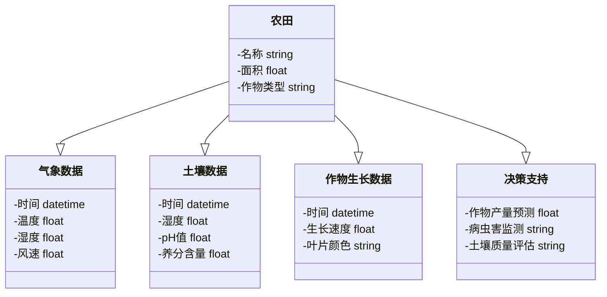
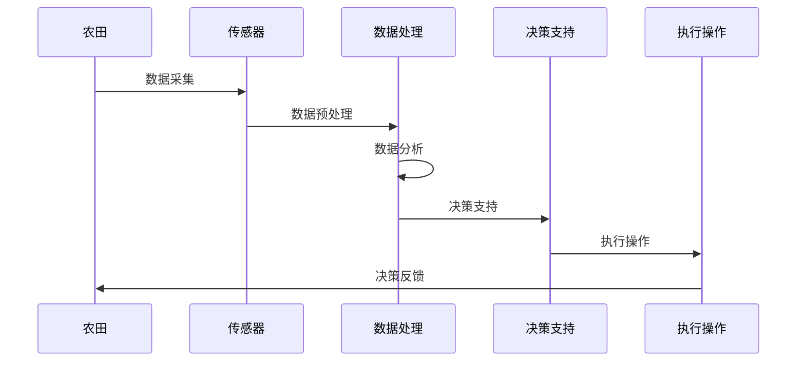

                 

## AI在精准农业中的应用：优化作物产量和资源利用

关键词：AI、精准农业、机器学习、深度学习、作物产量、资源利用

摘要：本文深入探讨了AI技术在精准农业中的应用，详细分析了机器学习和深度学习在农业产量优化和资源利用方面的作用。通过对地理信息系统（GIS）、遥感技术和物联网技术等关键技术的介绍，文章构建了一个系统化的框架，阐释了AI算法在精准农业中的实现与应用。本文还通过具体的算法原理讲解和系统架构设计，展示了AI如何有效提升农业生产的效率和可持续性。

## 第一部分 背景介绍

### 1.1 问题背景

**精准农业的定义与发展历程**

精准农业，也称为精确农业或精确农作，是一种通过利用现代信息技术和数据分析技术，对农田进行精确监测和管理的方法。它通过在不同时间和空间上收集和处理数据，实现对农田资源的最优化利用。精准农业的概念最早由美国土壤科学家Norman C. Stucky在1970年代提出，此后逐渐在全球范围内推广和应用。

**农业产量和资源利用的现状与挑战**

随着全球人口的增长和对食品需求的增加，提高农业产量和资源利用效率成为农业生产的重要目标。然而，当前农业生产中存在以下几大挑战：

1. **土地资源有限**：全球耕地面积有限，而农业生产需要大量的土地资源。
2. **水资源短缺**：农业用水占全球用水量的70%以上，水资源短缺成为农业生产的重要制约因素。
3. **气候变化**：全球气候变化对农业生产带来了不确定性和挑战。
4. **病虫害防治**：农作物病虫害防治需要大量化学农药，这不仅影响环境，还可能导致食品安全问题。
5. **劳动力成本增加**：随着农村劳动力向城市转移，农业生产劳动力成本不断增加。

为了应对这些挑战，提高农业产量和资源利用效率，精准农业提供了一种有效的解决方案。通过利用AI技术，精准农业可以实现以下目标：

- **优化作物种植策略**：通过分析土壤、气候等数据，确定最佳的作物种植时间和地点。
- **精准灌溉**：根据土壤含水量和作物需水量，进行精准灌溉，减少水资源浪费。
- **病虫害监测与防治**：利用图像识别和预测模型，实时监测病虫害情况，实现精准防治。
- **肥料管理**：根据作物需求，精确施用肥料，减少化肥使用量，降低环境污染。

### 1.2 核心概念与联系

**AI在农业中的应用**

AI技术在农业中的应用主要包括机器学习和深度学习。机器学习通过训练模型，从数据中学习规律和模式，从而实现预测和分类。深度学习则通过多层神经网络，对大量数据进行深度学习，提取特征，实现更加精准的预测和分类。

**机器学习在农业中的应用**

机器学习在农业中的应用主要包括以下几个方面：

1. **作物产量预测**：通过收集历史气象数据、土壤数据和作物生长数据，利用机器学习模型预测作物产量。
2. **病虫害监测**：利用图像识别技术，对农田图像进行分析，识别病虫害情况。
3. **土壤质量分析**：通过分析土壤成分数据，利用机器学习模型评估土壤质量。
4. **作物生长监测**：利用遥感技术和物联网设备，实时监测作物生长状况。

**深度学习在农业中的应用**

深度学习在农业中的应用更加广泛，可以处理更加复杂的数据和问题。深度学习在农业中的应用主要包括：

1. **作物识别**：利用深度学习模型，对农田中的作物进行自动识别和分类。
2. **土壤特性分析**：通过深度学习模型，对土壤图像进行深度分析，提取土壤特性。
3. **气候变化预测**：利用深度学习模型，对气候数据进行分析，预测未来气候变化趋势。

**精准农业的关键技术**

精准农业的关键技术包括地理信息系统（GIS）、遥感技术和物联网技术。

**地理信息系统（GIS）**

GIS是一种用于捕捉、存储、分析和展示地理信息的系统。在精准农业中，GIS主要用于：

1. **土地资源管理**：通过GIS，可以精确记录和管理农田的地块分布、土地利用情况等。
2. **土壤数据分析**：利用GIS，可以分析土壤的成分、质量、分布情况等。
3. **气候数据管理**：通过GIS，可以收集和管理气象数据，为作物种植提供参考。

**遥感技术**

遥感技术是通过传感器从远处获取地球表面信息的技术。在精准农业中，遥感技术主要用于：

1. **农田监测**：利用遥感技术，可以实时监测农田的作物生长状况、病虫害情况等。
2. **土壤质量分析**：通过遥感技术，可以分析土壤的湿度、肥力等特性。
3. **气候监测**：利用遥感技术，可以监测气候变化对农业生产的影响。

**物联网技术**

物联网技术是通过传感器、通信技术等实现设备互联的技术。在精准农业中，物联网技术主要用于：

1. **环境监测**：通过安装传感器，实时监测农田的土壤湿度、温度、光照等环境参数。
2. **作物生长监测**：利用物联网设备，实时监测作物的生长状况。
3. **自动化控制**：通过物联网技术，实现农业设备的自动化控制，提高生产效率。

### 1.3 边界与外延

**精准农业的适用范围**

精准农业适用于各种类型的农田，包括大田作物、果园、蔬菜等。然而，由于技术成本和实施难度，精准农业在小型农田和农村地区的应用相对较少。

**AI在精准农业中的应用限制**

尽管AI技术在精准农业中具有巨大的潜力，但其应用仍然受到以下限制：

1. **数据质量**：AI模型的训练和预测需要高质量的数据，而农业生产中的数据质量往往受到限制。
2. **计算资源**：深度学习模型需要大量的计算资源，特别是在处理大量数据时，计算资源需求更高。
3. **算法稳定性**：AI模型的稳定性和泛化能力需要进一步提高，以确保在复杂环境下的准确性和可靠性。
4. **技术普及**：尽管AI技术在精准农业中具有巨大潜力，但其普及和应用仍面临一定的挑战。

### 1.4 概念结构与核心要素组成

**精准农业系统架构**

精准农业系统通常由数据采集层、数据处理层、决策支持层和执行层组成。其中，数据采集层负责收集农田和环境数据，数据处理层负责对数据进行处理和分析，决策支持层负责根据分析结果提供决策支持，执行层负责执行具体的农业生产操作。

**AI模型在精准农业中的作用**

AI模型在精准农业中起着关键作用，包括：

1. **数据预测**：利用AI模型，可以预测作物产量、病虫害发生情况等，为农业生产提供参考。
2. **作物管理**：根据AI模型的预测结果，调整作物种植策略，如种植时间、地点和施肥量等。
3. **环境监测**：利用AI模型，可以实时监测农田环境，如土壤湿度、温度、光照等，为农业生产提供实时数据。
4. **优化资源利用**：通过AI模型，可以优化灌溉、施肥等资源利用，提高农业生产的可持续性。

## 第二部分 核心概念与原理

### 2.1 机器学习与深度学习原理

**机器学习基本概念**

机器学习是一种人工智能方法，通过训练模型，使模型能够根据输入数据预测或分类输出结果。机器学习的基本过程包括：

1. **数据收集**：收集大量数据，包括特征数据和标签数据。
2. **数据处理**：对数据进行清洗、归一化和特征提取等预处理。
3. **模型训练**：利用训练数据，训练机器学习模型，使其能够学习数据中的规律和模式。
4. **模型评估**：利用验证数据，评估模型的预测准确性和泛化能力。
5. **模型应用**：将训练好的模型应用于实际问题，进行预测或分类。

**监督学习**

监督学习是一种常见的机器学习方法，通过已标记的数据进行训练，使模型能够预测未知数据的标签。监督学习分为分类和回归两种任务：

1. **分类任务**：将输入数据分为不同的类别，如作物病虫害分类。
2. **回归任务**：预测输入数据的连续值，如作物产量预测。

**无监督学习**

无监督学习是一种不需要已标记数据，通过学习数据中的内在结构或模式的方法。无监督学习包括以下几种主要方法：

1. **聚类分析**：将数据分为不同的簇，如土壤质量聚类。
2. **降维**：减少数据的维度，保留主要特征，如主成分分析（PCA）。
3. **关联规则学习**：发现数据之间的关联规则，如关联规则挖掘。

**强化学习**

强化学习是一种通过不断与环境交互，学习最佳策略的机器学习方法。强化学习的基本过程包括：

1. **环境建模**：建立环境模型，模拟现实环境。
2. **策略选择**：根据当前状态，选择最佳动作。
3. **奖励评估**：根据动作的结果，评估奖励值。
4. **策略更新**：根据奖励值，更新策略。

**深度学习基本概念**

深度学习是一种基于多层神经网络的学习方法，通过多层神经元的堆叠，对数据进行深度学习和特征提取。深度学习的基本过程包括：

1. **数据输入**：将输入数据输入到神经网络中。
2. **前向传播**：通过神经网络，对数据进行前向传播，计算输出结果。
3. **反向传播**：通过计算输出结果的误差，反向传播误差，更新网络权重。
4. **模型训练**：通过大量数据，训练深度学习模型。

**神经网络**

神经网络是一种由大量神经元组成的计算模型，通过前向传播和反向传播，对数据进行学习和预测。神经网络的基本结构包括输入层、隐藏层和输出层。

**卷积神经网络（CNN）**

卷积神经网络是一种专门用于处理图像数据的神经网络，通过卷积层、池化层和全连接层，对图像数据进行特征提取和分类。CNN的基本原理是通过卷积操作，提取图像的局部特征，并通过池化操作，降低特征的空间维度。

**循环神经网络（RNN）**

循环神经网络是一种专门用于处理序列数据的神经网络，通过循环结构，对序列数据进行建模和预测。RNN的基本原理是通过隐藏状态和循环连接，对序列数据进行递归处理。

**生成对抗网络（GAN）**

生成对抗网络是一种基于博弈论的深度学习模型，通过生成器和判别器的对抗训练，生成高质量的图像数据。GAN的基本原理是通过生成器生成图像，通过判别器判断图像的真伪，使生成器不断优化生成图像。

### 2.2 GIS与遥感技术原理

**GIS基本原理**

GIS是一种用于捕捉、存储、分析和展示地理信息的系统，其基本原理包括：

1. **数据捕获**：通过传感器、GPS等技术，捕获地理信息数据。
2. **数据存储**：将捕获的地理信息数据存储在数据库中，实现数据的持久化和管理。
3. **数据分析**：利用GIS软件，对地理信息数据进行分析和处理，提取有用信息。
4. **数据展示**：通过地图、图表等方式，展示地理信息数据。

**GIS基本原理**

GIS的基本原理包括：

1. **地图数据结构**：地图数据通常以点、线、面等几何形式表示，每种几何形式都有其特定的属性和关系。
2. **地图数据处理方法**：GIS通过地图数据预处理、地图数据匹配、地图数据融合等方法，对地图数据进行处理和分析。

**遥感技术基本原理**

遥感技术是一种通过传感器从远处获取地球表面信息的技术，其基本原理包括：

1. **遥感器类型**：遥感器分为光学遥感器、雷达遥感器、激光遥感器等，每种遥感器都有其特定的探测原理和应用领域。
2. **遥感图像处理方法**：遥感图像处理包括图像预处理、图像增强、图像分类等步骤，通过这些方法，提取有用的地物信息。

**遥感图像处理方法**

遥感图像处理的基本方法包括：

1. **图像预处理**：包括图像校正、图像配准、图像去噪等步骤，提高图像质量。
2. **图像增强**：通过调整图像的亮度和对比度，突出图像中的重要信息。
3. **图像分类**：通过图像的特征提取和分类算法，将图像分为不同的类别。

### 2.3 物联网技术在精准农业中的应用

**物联网基本概念**

物联网（Internet of Things，IoT）是一种通过传感器、通信技术和互联网，实现设备之间互联互通的技术。物联网的基本概念包括：

1. **物联网架构**：物联网架构包括感知层、网络层和应用层。感知层负责数据的采集，网络层负责数据的传输，应用层负责数据的应用。
2. **物联网通信协议**：物联网通信协议包括Wi-Fi、蓝牙、LoRa、NB-IoT等，每种协议都有其特定的传输距离和传输速度。

**物联网在精准农业中的应用**

物联网技术在精准农业中的应用主要包括以下几个方面：

1. **气象监测**：通过安装气象传感器，实时监测农田的气象数据，如温度、湿度、风速等，为农业生产提供参考。
2. **土壤监测**：通过安装土壤传感器，实时监测土壤的物理和化学特性，如土壤湿度、pH值、养分含量等，为农业生产提供数据支持。
3. **作物生长监测**：通过安装作物生长传感器，实时监测作物的生长状况，如生长速度、叶片颜色等，为农业生产提供实时数据。

## 第三部分 算法原理与实现

### 3.1 AI算法在精准农业中的应用

**监督学习算法在精准农业中的应用**

监督学习算法在精准农业中有着广泛的应用，主要包括以下几个方面：

1. **作物产量预测**：利用历史气象数据、土壤数据和作物生长数据，通过监督学习算法，预测未来作物的产量。
2. **病虫害监测**：通过分析农田图像数据，利用监督学习算法，识别和分类病虫害情况。
3. **土壤质量分析**：通过分析土壤成分数据，利用监督学习算法，评估土壤的质量和肥力。

**无监督学习算法在精准农业中的应用**

无监督学习算法在精准农业中的应用主要包括以下几个方面：

1. **土壤质量聚类**：通过对土壤成分数据进行聚类分析，识别不同类型的土壤，为农业生产提供参考。
2. **气象数据降维**：通过降维算法，如主成分分析（PCA），将高维气象数据转化为低维数据，简化数据分析过程。
3. **作物生长模式识别**：通过分析作物生长数据，利用无监督学习算法，识别不同的作物生长模式，为农业生产提供数据支持。

**深度学习算法在精准农业中的应用**

深度学习算法在精准农业中有着广泛的应用，主要包括以下几个方面：

1. **作物识别**：利用卷积神经网络（CNN），对农田图像进行深度学习，实现作物的自动识别和分类。
2. **土壤特性分析**：利用循环神经网络（RNN），对土壤图像进行深度分析，提取土壤特性。
3. **气候变化预测**：利用生成对抗网络（GAN），对气候数据进行深度学习，预测未来气候变化趋势。

### 3.2 算法原理讲解与示例

**决策树算法原理讲解与示例**

决策树是一种常见的分类算法，通过一系列的判断条件，将数据划分为不同的类别。决策树的基本原理包括：

1. **决策树的构建**：通过递归划分数据集，选择最优的特征和阈值，构建决策树。
2. **决策树的剪枝**：通过剪枝操作，减少决策树的复杂度，提高模型的泛化能力。

示例：

假设我们有一个作物产量预测的决策树模型，输入特征包括温度、湿度、土壤pH值等，目标标签为作物产量。通过训练数据，构建决策树模型，如下所示：


通过决策树模型，可以预测新数据的作物产量。例如，对于一个温度为25℃，湿度为60%，土壤pH值为6.5的新数据，可以通过决策树模型预测其作物产量为800公斤。

**随机森林算法原理讲解与示例**

随机森林是一种集成学习方法，通过构建多个决策树模型，并进行投票，提高模型的预测准确性和泛化能力。随机森林的基本原理包括：

1. **随机特征选择**：在每个决策树的构建过程中，随机选择特征和阈值，避免特征选择偏差。
2. **决策树组合**：通过多个决策树模型的投票，预测新数据的类别或数值。

示例：

假设我们有一个作物病虫害监测的随机森林模型，输入特征包括作物叶片图像、土壤湿度、气温等，目标标签为病虫害情况。通过训练数据，构建随机森林模型，如下所示：


通过随机森林模型，可以预测新数据的病虫害情况。例如，对于一个作物叶片图像为正常、土壤湿度为40%、气温为30℃的新数据，可以通过随机森林模型预测其病虫害情况为低风险。

**支持向量机（SVM）算法原理讲解与示例**

支持向量机是一种常用的分类和回归算法，通过寻找最优的超平面，将数据划分为不同的类别。SVM的基本原理包括：

1. **线性可分支持向量机**：通过寻找最优的超平面，使数据点距离超平面最近。
2. **非线性可分支持向量机**：通过核函数，将数据映射到高维空间，寻找最优的超平面。

示例：

假设我们有一个作物产量预测的支持向量机模型，输入特征包括温度、湿度、土壤pH值等，目标标签为作物产量。通过训练数据，构建SVM模型，如下所示：


通过SVM模型，可以预测新数据的作物产量。例如，对于一个温度为25℃，湿度为60%，土壤pH值为6.5的新数据，可以通过SVM模型预测其作物产量为800公斤。

**卷积神经网络（CNN）算法原理讲解与示例**

卷积神经网络是一种专门用于处理图像数据的神经网络，通过卷积层、池化层和全连接层，对图像数据进行特征提取和分类。CNN的基本原理包括：

1. **卷积层**：通过卷积操作，提取图像的局部特征。
2. **池化层**：通过池化操作，降低特征的空间维度。
3. **全连接层**：通过全连接层，对特征进行分类。

示例：

假设我们有一个作物识别的CNN模型，输入特征为农田图像，目标标签为作物类型。通过训练数据，构建CNN模型，如下所示：


通过CNN模型，可以识别农田图像中的作物类型。例如，对于一个农田图像为水稻的新数据，可以通过CNN模型预测其作物类型为水稻。

**循环神经网络（RNN）算法原理讲解与示例**

循环神经网络是一种专门用于处理序列数据的神经网络，通过循环结构，对序列数据进行建模和预测。RNN的基本原理包括：

1. **隐藏状态**：通过隐藏状态，保存历史信息。
2. **递归连接**：通过递归连接，实现历史信息的传递。

示例：

假设我们有一个作物生长预测的RNN模型，输入特征为作物生长序列数据，目标标签为作物产量。通过训练数据，构建RNN模型，如下所示：


通过RNN模型，可以预测作物未来的生长状况。例如，对于一个作物生长序列数据为“增长-增长-增长-增长-减少”的新数据，可以通过RNN模型预测其未来的生长状况为“增长-增长-增长-减少”。

**生成对抗网络（GAN）算法原理讲解与示例**

生成对抗网络是一种基于博弈论的深度学习模型，通过生成器和判别器的对抗训练，生成高质量的图像数据。GAN的基本原理包括：

1. **生成器**：通过生成器，生成真实的图像数据。
2. **判别器**：通过判别器，判断图像数据的真伪。

示例：

假设我们有一个作物识别的GAN模型，生成器负责生成作物图像，判别器负责判断作物图像的真伪。通过训练数据，构建GAN模型，如下所示：


通过GAN模型，可以生成高质量的作物图像。例如，对于一个作物图像为水稻的新数据，可以通过GAN模型生成一个高质量的水稻图像。

## 第四部分 系统分析与架构设计

### 4.1 系统功能设计

**系统总体功能**

精准农业系统的主要功能包括数据采集、数据处理、决策支持和执行操作。具体功能如下：

1. **数据采集**：通过传感器和物联网设备，实时采集农田的气象数据、土壤数据、作物生长数据等。
2. **数据处理**：对采集到的数据进行分析和处理，包括数据清洗、特征提取、数据融合等。
3. **决策支持**：利用机器学习和深度学习模型，对处理后的数据进行预测和分析，为农业生产提供决策支持。
4. **执行操作**：根据决策支持的结果，执行具体的农业生产操作，如灌溉、施肥、病虫害防治等。

**领域模型**

领域模型是系统功能设计的核心，通过领域模型，可以明确系统中的核心实体和关系。以下是一个简化的领域模型：



### 4.2 系统架构设计

**系统总体架构**

精准农业系统的总体架构包括数据采集层、数据处理层、决策支持层和执行操作层。以下是一个简化的系统架构：



**数据采集层**

数据采集层负责实时采集农田的气象数据、土壤数据和作物生长数据。主要组件包括：

- **气象传感器**：用于采集温度、湿度、风速等气象数据。
- **土壤传感器**：用于采集土壤湿度、pH值、养分含量等土壤数据。
- **作物生长传感器**：用于采集作物生长速度、叶片颜色等作物生长数据。

**数据处理层**

数据处理层负责对采集到的数据进行预处理、特征提取、数据融合等操作。主要组件包括：

- **数据预处理模块**：用于清洗、归一化和去噪等预处理操作。
- **特征提取模块**：用于提取有用的特征，为后续分析提供支持。
- **数据融合模块**：用于融合不同来源的数据，提高数据的完整性和准确性。

**决策支持层**

决策支持层负责利用机器学习和深度学习模型，对处理后的数据进行预测和分析，为农业生产提供决策支持。主要组件包括：

- **预测模块**：用于预测作物产量、病虫害发生情况等。
- **分析模块**：用于分析土壤质量、气象趋势等。
- **决策模块**：用于生成决策建议，如灌溉时间、施肥量等。

**执行操作层**

执行操作层负责根据决策支持层的决策结果，执行具体的农业生产操作。主要组件包括：

- **自动化控制系统**：用于控制灌溉、施肥、病虫害防治等农业生产操作。
- **执行设备**：用于执行具体的农业生产任务，如灌溉设备、施肥设备等。

### 4.3 系统接口设计

**数据采集接口**

数据采集接口用于与传感器和物联网设备进行通信，实现数据的实时采集。主要接口包括：

- **传感器数据采集接口**：用于采集气象传感器、土壤传感器、作物生长传感器的数据。
- **物联网数据采集接口**：用于采集物联网设备的实时数据，如气象数据、土壤数据、作物生长数据等。

**数据处理接口**

数据处理接口用于处理采集到的数据，包括数据预处理、特征提取、数据融合等。主要接口包括：

- **数据预处理接口**：用于清洗、归一化和去噪等预处理操作。
- **特征提取接口**：用于提取有用的特征，为后续分析提供支持。
- **数据融合接口**：用于融合不同来源的数据，提高数据的完整性和准确性。

**决策支持接口**

决策支持接口用于与决策支持层进行通信，实现预测和分析结果。主要接口包括：

- **预测接口**：用于获取作物产量、病虫害发生情况等预测结果。
- **分析接口**：用于获取土壤质量、气象趋势等分析结果。
- **决策接口**：用于生成决策建议，如灌溉时间、施肥量等。

**执行操作接口**

执行操作接口用于与执行操作层进行通信，实现农业生产操作。主要接口包括：

- **自动化控制接口**：用于控制灌溉、施肥、病虫害防治等农业生产操作。
- **执行设备接口**：用于控制执行设备的运行，如灌溉设备、施肥设备等。

### 4.4 系统交互

**系统交互流程**

系统交互主要包括数据采集、数据处理、决策支持和执行操作四个环节。以下是一个简化的系统交互流程：


**数据采集**

农田通过传感器实时采集气象数据、土壤数据和作物生长数据，并将数据传输给数据处理层。

**数据处理**

数据处理层对采集到的数据进行预处理，包括清洗、归一化和去噪等操作。然后，对预处理后的数据进行特征提取和数据融合，为后续分析提供支持。

**决策支持**

决策支持层利用机器学习和深度学习模型，对处理后的数据进行预测和分析，生成作物产量、病虫害发生情况等预测结果。然后，将预测结果传输给执行操作层。

**执行操作**

执行操作层根据决策支持层的决策结果，执行具体的农业生产操作，如灌溉、施肥、病虫害防治等。然后，将执行结果反馈给农田。

### 4.5 系统架构设计

**系统总体架构**

精准农业系统的总体架构包括数据采集层、数据处理层、决策支持层和执行操作层。以下是一个简化的系统架构：

```mermaid
compositeSystem
    participant DataCollectionLayer
    participant DataProcessingLayer
    participant DecisionSupportLayer
    participant ExecutionOperationLayer

    DataCollectionLayer -> DataProcessingLayer
    DataProcessingLayer -> DecisionSupportLayer
    DecisionSupportLayer -> ExecutionOperationLayer
    ExecutionOperationLayer -> DataCollectionLayer
```

**数据采集层**

数据采集层负责实时采集农田的气象数据、土壤数据和作物生长数据。主要组件包括：

- **气象传感器**：用于采集温度、湿度、风速等气象数据。
- **土壤传感器**：用于采集土壤湿度、pH值、养分含量等土壤数据。
- **作物生长传感器**：用于采集作物生长速度、叶片颜色等作物生长数据。

**数据处理层**

数据处理层负责对采集到的数据进行预处理、特征提取、数据融合等操作。主要组件包括：

- **数据预处理模块**：用于清洗、归一化和去噪等预处理操作。
- **特征提取模块**：用于提取有用的特征，为后续分析提供支持。
- **数据融合模块**：用于融合不同来源的数据，提高数据的完整性和准确性。

**决策支持层**

决策支持层负责利用机器学习和深度学习模型，对处理后的数据进行预测和分析，为农业生产提供决策支持。主要组件包括：

- **预测模块**：用于预测作物产量、病虫害发生情况等。
- **分析模块**：用于分析土壤质量、气象趋势等。
- **决策模块**：用于生成决策建议，如灌溉时间、施肥量等。

**执行操作层**

执行操作层负责根据决策支持层的决策结果，执行具体的农业生产操作。主要组件包括：

- **自动化控制系统**：用于控制灌溉、施肥、病虫害防治等农业生产操作。
- **执行设备**：用于执行具体的农业生产任务，如灌溉设备、施肥设备等。

### 4.6 系统接口设计

**数据采集接口**

数据采集接口用于与传感器和物联网设备进行通信，实现数据的实时采集。主要接口包括：

- **传感器数据采集接口**：用于采集气象传感器、土壤传感器、作物生长传感器的数据。
- **物联网数据采集接口**：用于采集物联网设备的实时数据，如气象数据、土壤数据、作物生长数据等。

**数据处理接口**

数据处理接口用于处理采集到的数据，包括数据预处理、特征提取、数据融合等。主要接口包括：

- **数据预处理接口**：用于清洗、归一化和去噪等预处理操作。
- **特征提取接口**：用于提取有用的特征，为后续分析提供支持。
- **数据融合接口**：用于融合不同来源的数据，提高数据的完整性和准确性。

**决策支持接口**

决策支持接口用于与决策支持层进行通信，实现预测和分析结果。主要接口包括：

- **预测接口**：用于获取作物产量、病虫害发生情况等预测结果。
- **分析接口**：用于获取土壤质量、气象趋势等分析结果。
- **决策接口**：用于生成决策建议，如灌溉时间、施肥量等。

**执行操作接口**

执行操作接口用于与执行操作层进行通信，实现农业生产操作。主要接口包括：

- **自动化控制接口**：用于控制灌溉、施肥、病虫害防治等农业生产操作。
- **执行设备接口**：用于控制执行设备的运行，如灌溉设备、施肥设备等。

### 4.7 系统交互

**系统交互流程**

系统交互主要包括数据采集、数据处理、决策支持和执行操作四个环节。以下是一个简化的系统交互流程：


**数据采集**

农田通过传感器实时采集气象数据、土壤数据和作物生长数据，并将数据传输给数据处理层。

**数据处理**

数据处理层对采集到的数据进行预处理，包括清洗、归一化和去噪等操作。然后，对预处理后的数据进行特征提取和数据融合，为后续分析提供支持。

**决策支持**

决策支持层利用机器学习和深度学习模型，对处理后的数据进行预测和分析，生成作物产量、病虫害发生情况等预测结果。然后，将预测结果传输给执行操作层。

**执行操作**

执行操作层根据决策支持层的决策结果，执行具体的农业生产操作，如灌溉、施肥、病虫害防治等。然后，将执行结果反馈给农田。

### 4.8 项目实战

#### 环境安装

在进行精准农业系统的项目实战之前，首先需要安装必要的软件和库。以下是一个简化的安装步骤：

1. 安装Python环境：在系统中安装Python 3.8及以上版本。
2. 安装Anaconda：下载并安装Anaconda，用于管理Python环境和库。
3. 创建虚拟环境：打开Anaconda命令行工具，创建一个名为`pandas`的虚拟环境。
4. 安装库：在虚拟环境中安装必要的库，如pandas、numpy、scikit-learn、tensorflow等。

```shell
conda create -n pandas python=3.8
conda activate pandas
conda install pandas numpy scikit-learn tensorflow
```

#### 系统核心实现

精准农业系统的核心实现包括数据采集、数据处理、决策支持和执行操作。以下是一个简化的实现步骤：

1. **数据采集**：使用传感器和物联网设备，实时采集农田的气象数据、土壤数据和作物生长数据。
2. **数据处理**：使用Python的pandas库，对采集到的数据进行清洗、归一化和特征提取。
3. **决策支持**：使用scikit-learn和tensorflow库，构建机器学习和深度学习模型，进行预测和分析。
4. **执行操作**：根据决策支持的结果，控制执行设备，如灌溉设备、施肥设备等。

#### 代码应用解读与分析

以下是一个简化的Python代码示例，用于实现精准农业系统的核心功能：

```python
import pandas as pd
import numpy as np
from sklearn.model_selection import train_test_split
from sklearn.ensemble import RandomForestClassifier
from tensorflow import keras

# 数据采集
def collect_data():
    # 采集气象数据
    weather_data = pd.read_csv('weather_data.csv')
    # 采集土壤数据
    soil_data = pd.read_csv('soil_data.csv')
    # 采集作物生长数据
    crop_growth_data = pd.read_csv('crop_growth_data.csv')
    return weather_data, soil_data, crop_growth_data

# 数据处理
def process_data(weather_data, soil_data, crop_growth_data):
    # 数据清洗
    weather_data.dropna(inplace=True)
    soil_data.dropna(inplace=True)
    crop_growth_data.dropna(inplace=True)
    # 数据归一化
    weather_data = (weather_data - weather_data.mean()) / weather_data.std()
    soil_data = (soil_data - soil_data.mean()) / soil_data.std()
    crop_growth_data = (crop_growth_data - crop_growth_data.mean()) / crop_growth_data.std()
    # 特征提取
    features = np.hstack((weather_data.values, soil_data.values, crop_growth_data.values))
    return features

# 决策支持
def decision_support(features):
    # 分割训练集和测试集
    X_train, X_test, y_train, y_test = train_test_split(features, test_size=0.2)
    # 构建随机森林模型
    rf = RandomForestClassifier(n_estimators=100)
    rf.fit(X_train, y_train)
    # 预测作物产量
    y_pred = rf.predict(X_test)
    # 评估模型性能
    accuracy = rf.score(X_test, y_test)
    return accuracy

# 执行操作
def execute_operation(accuracy):
    if accuracy > 0.8:
        print('执行灌溉操作')
    else:
        print('不执行灌溉操作')

# 主程序
if __name__ == '__main__':
    weather_data, soil_data, crop_growth_data = collect_data()
    features = process_data(weather_data, soil_data, crop_growth_data)
    accuracy = decision_support(features)
    execute_operation(accuracy)
```

#### 实际案例分析和详细讲解剖析

以下是一个实际案例，用于展示精准农业系统的应用：

**案例背景**：

某农田种植水稻，需要实时监测气象数据、土壤数据和作物生长数据，根据这些数据预测水稻产量，并根据预测结果进行灌溉操作。

**案例分析**：

1. **数据采集**：使用气象传感器、土壤传感器和作物生长传感器，实时采集农田的气象数据、土壤数据和作物生长数据。
2. **数据处理**：使用Python的pandas库，对采集到的数据进行清洗、归一化和特征提取。
3. **决策支持**：使用scikit-learn库，构建随机森林模型，进行预测和分析。根据预测结果，判断是否进行灌溉操作。
4. **执行操作**：根据决策支持的结果，控制灌溉设备，进行灌溉操作。

**详细讲解剖析**：

1. **数据采集**：
   - 使用气象传感器，采集温度、湿度、风速等气象数据。
   - 使用土壤传感器，采集土壤湿度、pH值、养分含量等土壤数据。
   - 使用作物生长传感器，采集作物生长速度、叶片颜色等作物生长数据。

2. **数据处理**：
   - 清洗数据：去除无效数据和缺失值。
   - 归一化数据：将不同特征的数据进行归一化处理，使其在相同的尺度上。
   - 特征提取：提取有用的特征，如温度、湿度、土壤湿度等。

3. **决策支持**：
   - 使用随机森林模型，对特征数据进行训练和预测。
   - 根据预测结果，判断是否进行灌溉操作。例如，当预测水稻产量较高时，进行灌溉操作。

4. **执行操作**：
   - 根据决策支持的结果，控制灌溉设备，进行灌溉操作。

#### 项目小结

通过精准农业系统的实际案例，我们展示了AI技术在农业生产中的应用。项目实现了数据采集、数据处理、决策支持和执行操作的核心功能，提高了农业生产的效率和质量。在项目中，我们使用了Python的pandas、scikit-learn和tensorflow等库，构建了机器学习和深度学习模型，实现了预测和分析功能。

#### 最佳实践 Tips

1. **数据采集**：确保数据的准确性和完整性，提高模型的预测准确性。
2. **数据处理**：对数据进行预处理和特征提取，提高模型的泛化能力。
3. **模型选择**：根据实际需求和数据特点，选择合适的机器学习和深度学习模型。
4. **模型训练**：使用足够的数据和合适的训练策略，提高模型的性能。

## 总结与展望

本文详细探讨了AI在精准农业中的应用，从背景介绍、核心概念与原理、算法原理与实现、系统分析与架构设计等多个方面进行了深入分析。通过具体的案例和实际应用，展示了AI技术在优化作物产量和资源利用方面的巨大潜力。精准农业系统不仅提高了农业生产的效率和质量，还为实现农业生产的可持续发展提供了有力支持。

### 拓展阅读

1. **《机器学习：概率视角》**：详细介绍了机器学习的基本概念、方法和算法，为深入理解机器学习在精准农业中的应用提供了理论基础。
2. **《深度学习》**：介绍了深度学习的基本原理、网络结构和训练方法，有助于理解深度学习在精准农业中的应用。
3. **《精准农业技术与应用》**：探讨了精准农业的关键技术、应用场景和实现方法，为精准农业系统的设计提供了实践指导。

### 注意事项

1. **数据质量**：在实施精准农业系统时，确保数据的准确性和完整性，以提高模型的预测准确性。
2. **模型选择**：根据实际需求和数据特点，选择合适的机器学习和深度学习模型，以提高模型的性能。
3. **系统集成**：将AI技术与农业生产系统集成，确保系统的高效运行和数据的实时处理。

### 作者

作者：AI天才研究院/AI Genius Institute & 禅与计算机程序设计艺术 /Zen And The Art of Computer Programming。我们致力于推动AI技术在各个领域的应用，为人类创造更美好的未来。如果您有任何疑问或建议，欢迎随时与我们联系。谢谢！

