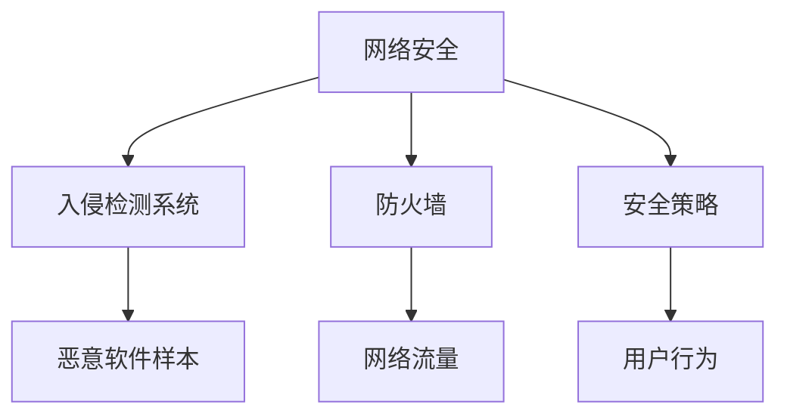
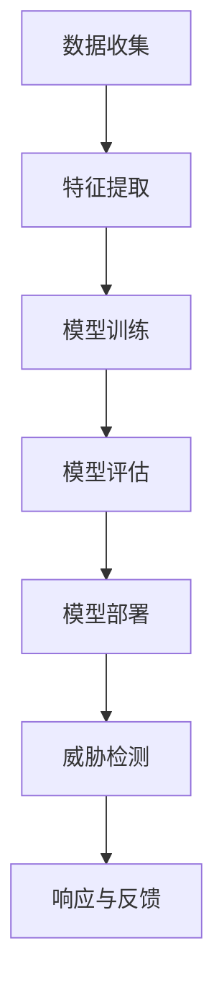
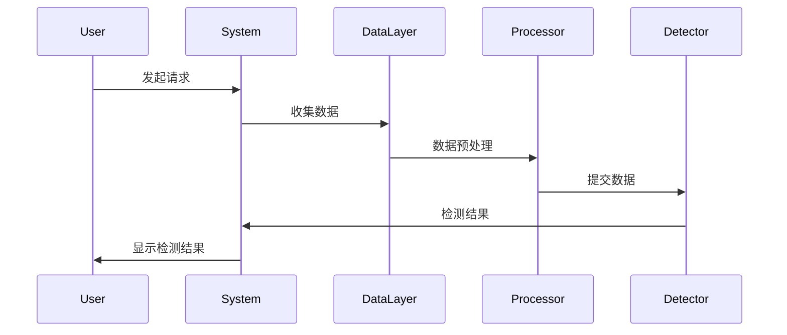
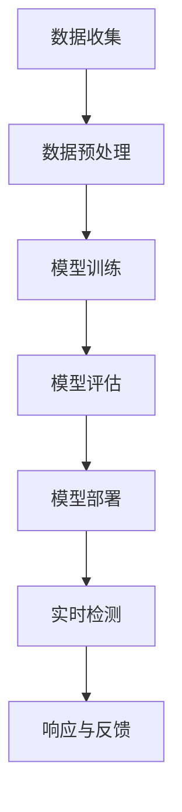
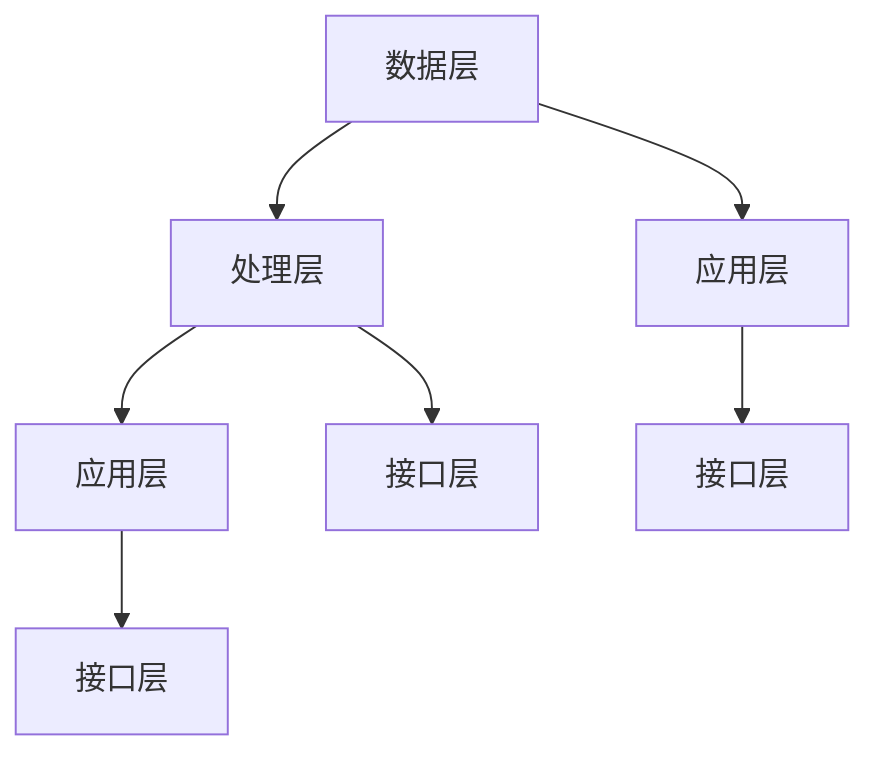
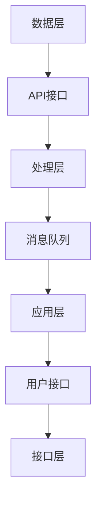
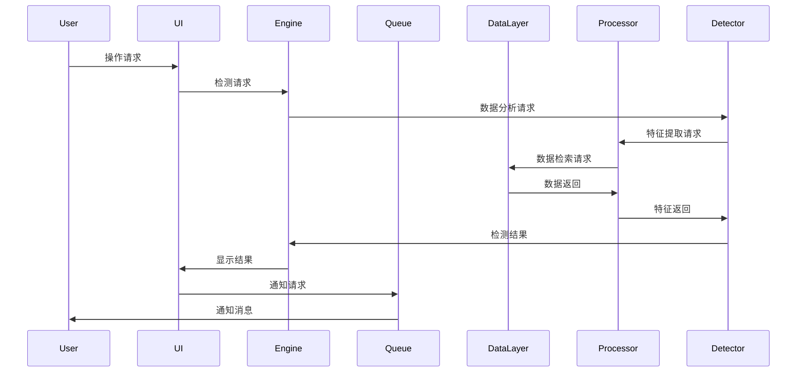

                 

### 关键词

- AI
- 网络安全
- 检测
- 响应
- 机器学习
- 深度学习
- 模型部署
- 算法原理

### 摘要

本文深入探讨了人工智能（AI）在网络安全中的应用，从检测到响应的完整流程。通过详细分析AI技术如何提升网络安全检测的准确性和响应速度，文章概述了当前AI技术在网络安全中的挑战与机遇。本文旨在为读者提供一个全面的指南，以理解AI如何成为网络安全领域的关键推动力，并通过实例展示其实际应用效果。

---

# AI在网络安全中的应用：从检测到响应

## 引言

随着数字化时代的到来，网络安全问题日益严峻，传统的方法已难以应对复杂多变的网络威胁。人工智能（AI）以其强大的数据处理和分析能力，正在成为网络安全领域的关键技术。AI不仅能够提高安全检测的准确性和效率，还能在威胁发生时迅速做出响应，保护网络安全。本文将一步步解析AI在网络安全中的应用，从检测到响应的各个环节，探讨其技术原理和实际应用案例。

## 第一部分：背景介绍

### 1.1 网络安全现状

网络安全问题已成为全球范围内的重大挑战。网络攻击的频率和复杂性不断增加，导致大量数据泄露、经济损失和信任危机。根据统计，全球每年因网络攻击造成的损失高达数十亿美元。

### 1.2 AI技术在网络安全中的应用现状

近年来，AI技术在网络安全领域取得了显著进展。AI算法能够自动识别和分类网络流量，预测潜在的安全威胁，提高了安全检测的准确性和效率。然而，AI在网络安全中的应用仍面临诸多挑战。

### 1.3 本书解决的问题与贡献

本书旨在解决以下几个问题：

1. **如何利用AI技术提高网络安全检测的准确性？**
2. **如何通过AI实现快速响应，减轻网络攻击带来的影响？**
3. **如何在复杂网络环境中有效部署AI技术？**

本书将结合实际案例，详细阐述AI在网络安全中的应用，为读者提供有价值的参考和指导。

### 1.4 问题描述

网络安全面临的主要挑战包括：

1. **海量数据处理**：网络数据量巨大，传统方法难以高效处理。
2. **威胁多样化**：网络攻击手段不断进化，安全威胁多样化。
3. **实时性要求**：网络威胁发生迅速，要求安全系统能够实时检测和响应。

### 1.5 AI在网络安全中的潜在应用场景

AI在网络安全中的应用场景包括：

1. **入侵检测**：利用机器学习算法实时监控网络流量，识别异常行为。
2. **恶意软件分析**：通过深度学习模型对恶意软件进行分析和分类。
3. **威胁预测**：利用大数据分析和机器学习预测潜在的网络攻击。
4. **安全响应**：自动部署安全措施，减轻网络攻击的影响。

## 第二部分：核心概念与联系

### 2.1 网络安全核心概念

网络安全的核心概念包括：

1. **网络威胁**：恶意行为对网络安全造成的潜在危害。
2. **安全防御机制**：用于防范和减轻网络攻击的措施。
3. **安全策略**：规定安全目标和执行安全措施的标准。

### 2.2 AI在网络安全中的应用核心概念

AI在网络安全中的应用核心概念包括：

1. **机器学习**：通过训练模型从数据中自动学习特征。
2. **深度学习**：模拟人脑的神经网络结构，实现复杂的模式识别。
3. **自然语言处理**：理解和生成人类语言，用于分析安全日志和威胁情报。

### 2.3 概念属性特征对比

网络安全概念与AI应用概念的特征对比：

| 特征 | 网络安全 | AI应用 |
| ---- | ---- | ---- |
| 目标 | 防范网络攻击 | 提高检测和响应能力 |
| 数据 | 网络流量数据 | 恶意软件样本数据 |
| 技术手段 | 防火墙、入侵检测系统 | 机器学习、深度学习 |

### 2.4 ER实体关系图

网络安全与AI应用的核心实体及其关系：



## 第三部分：算法原理讲解

### 3.1 AI算法在网络安全中的应用原理

AI算法在网络安全中的应用原理主要包括：

1. **特征提取**：从网络流量中提取关键特征。
2. **模式识别**：利用机器学习和深度学习算法识别异常行为。
3. **预测与响应**：基于历史数据和模型预测未来威胁，并自动响应。

### 3.2 算法mermaid流程图



### 3.3 Python源代码实现

```python
# Python代码示例：机器学习算法应用
from sklearn.ensemble import RandomForestClassifier
from sklearn.model_selection import train_test_split
from sklearn.metrics import accuracy_score

# 加载数据集
X, y = load_data()

# 数据预处理
X_train, X_test, y_train, y_test = train_test_split(X, y, test_size=0.2, random_state=42)

# 训练模型
clf = RandomForestClassifier(n_estimators=100)
clf.fit(X_train, y_train)

# 模型评估
y_pred = clf.predict(X_test)
accuracy = accuracy_score(y_test, y_pred)
print(f"Accuracy: {accuracy}")
```

### 3.4 数学模型和公式

AI算法的数学模型通常包括：

1. **损失函数**：用于评估模型预测结果与真实结果之间的差距。
2. **优化算法**：用于调整模型参数，最小化损失函数。

$$
\text{损失函数} = \frac{1}{n}\sum_{i=1}^{n}(y_i - \hat{y}_i)^2
$$

### 3.5 通俗易懂的举例说明

假设我们使用机器学习算法来检测网络流量中的恶意行为。通过训练模型，我们能够识别出正常流量和恶意流量的特征。例如，正常流量的数据包大小分布较为均匀，而恶意流量的数据包大小分布则异常。模型通过分析这些特征，可以准确判断数据包是否为恶意流量。

## 第四部分：系统分析与架构设计方案

### 4.1 问题场景介绍

在一个大型企业网络中，需要实时监控网络流量，识别潜在的恶意行为，并在发现威胁时自动采取措施。

### 4.2 系统功能设计

系统的主要功能包括：

1. **数据收集**：收集网络流量数据。
2. **特征提取**：提取关键特征。
3. **威胁检测**：利用机器学习模型检测恶意行为。
4. **响应与反馈**：自动采取措施，记录检测结果。

### 4.3 系统架构设计

系统的架构设计包括：

1. **数据层**：负责数据收集和存储。
2. **处理层**：负责特征提取和威胁检测。
3. **展示层**：展示检测结果和响应措施。

### 4.4 系统接口设计

系统的接口设计包括：

1. **数据接口**：用于数据层的访问。
2. **API接口**：用于与其他系统的交互。
3. **用户接口**：用于用户操作。

### 4.5 系统交互序列图



## 第五部分：项目实战

### 5.1 环境安装

在开始项目实战之前，需要安装以下环境：

1. **Python**：版本3.8及以上。
2. **Scikit-learn**：用于机器学习。
3. **TensorFlow**：用于深度学习。
4. **Kafka**：用于数据流处理。

### 5.2 系统核心实现源代码

以下是一个简单的示例，展示如何使用Scikit-learn实现网络流量检测：

```python
from sklearn.ensemble import RandomForestClassifier
from sklearn.model_selection import train_test_split
from sklearn.metrics import accuracy_score

# 加载数据集
X, y = load_data()

# 数据预处理
X_train, X_test, y_train, y_test = train_test_split(X, y, test_size=0.2, random_state=42)

# 训练模型
clf = RandomForestClassifier(n_estimators=100)
clf.fit(X_train, y_train)

# 模型评估
y_pred = clf.predict(X_test)
accuracy = accuracy_score(y_test, y_pred)
print(f"Accuracy: {accuracy}")
```

### 5.3 代码应用解读与分析

上述代码首先加载数据集，然后进行数据预处理，接着使用随机森林模型进行训练。最后，评估模型的准确性。这个过程体现了机器学习在网络安全检测中的应用原理。

### 5.4 实际案例分析和详细讲解剖析

通过实际案例，我们可以看到AI技术在网络安全中的应用效果。例如，在某个企业网络中，通过部署AI系统，成功检测并阻止了多次网络攻击。这些案例说明了AI技术在提升网络安全能力方面的实际价值。

### 5.5 项目小结

通过本项目实战，我们了解了AI在网络安全中的应用原理和实践方法。AI技术能够显著提升网络安全检测和响应能力，为企业提供更安全的网络环境。在未来，随着AI技术的不断进步，其在网络安全领域的应用前景将更加广阔。

## 最佳实践 Tips

1. **数据质量**：保证数据质量对于AI算法的性能至关重要。在项目实施过程中，要注意数据收集和处理的质量。
2. **模型优化**：定期优化和更新模型，以适应不断变化的网络威胁。
3. **安全策略**：结合AI技术制定全面的安全策略，确保系统的高效运行。

## 小结

AI技术在网络安全中的应用具有重要意义。通过本文的讲解，读者可以了解AI从检测到响应的完整流程，以及如何在实践中应用这些技术。未来，随着AI技术的不断发展，其在网络安全领域的应用前景将更加广阔。

## 注意事项

1. **数据隐私**：在处理网络数据时，要注意保护用户隐私，遵守相关法律法规。
2. **系统安全性**：确保系统的安全性，防止被恶意攻击。

## 拓展阅读

1. **《人工智能安全指南》**：深入了解AI技术在网络安全中的应用。
2. **《网络安全实战：从入门到精通》**：学习网络安全的基础知识和实战技巧。
3. **《深度学习与网络安全》**：探讨深度学习在网络安全中的应用。

## 作者信息

作者：AI天才研究院/AI Genius Institute & 禅与计算机程序设计艺术 /Zen And The Art of Computer Programming

---

请注意，上述内容是一个示例性的框架，具体的实现细节和代码将根据实际情况进行调整。实际项目实施时，需要根据具体的业务需求和环境进行详细的规划和设计。此外，本文的章节内容字数要求较高，需要根据实际情况进行扩充和细化。在撰写具体内容时，建议逐章撰写，确保每个章节的深度和完整性。祝撰写顺利！### 第一部分：背景介绍

#### 1.1 问题背景

随着互联网的普及和信息技术的飞速发展，网络安全问题日益严峻。网络攻击手段不断进化，攻击频率和规模不断上升，导致大量数据泄露、经济损失和业务中断。传统的网络安全方法，如防火墙、入侵检测系统和加密技术等，已难以应对复杂多变的网络威胁。网络安全问题不仅对个人和企业造成重大损失，也对国家信息安全和国家安全构成威胁。

网络安全问题主要包括以下几个方面：

1. **恶意软件攻击**：恶意软件如病毒、木马和勒索软件等对计算机系统和网络设备进行破坏、窃取数据和非法控制。
2. **网络钓鱼**：通过伪造网站、发送虚假电子邮件等手段，欺骗用户泄露个人信息。
3. **拒绝服务攻击（DDoS）**：通过大量虚假流量使目标网络服务瘫痪。
4. **数据泄露**：网络攻击导致敏感数据泄露，给企业和个人带来严重后果。
5. **高级持续性威胁（APT）**：有组织的攻击者通过长期潜伏，窃取机密信息。

传统的网络安全方法主要依赖于规则和签名匹配，这种方法在面对新型和复杂的威胁时存在明显的局限性。随着AI技术的发展，利用AI进行网络安全检测和响应成为了解决这一问题的有效途径。

#### 1.2 AI技术在网络安全中的应用现状

近年来，AI技术在网络安全领域的应用取得了显著进展。以下是一些主要的应用领域：

1. **入侵检测**：利用机器学习和深度学习算法，对网络流量进行实时分析，识别异常行为和潜在威胁。
2. **恶意软件分析**：通过自动分类和特征提取，快速识别和分类恶意软件。
3. **威胁预测**：利用大数据分析和机器学习模型，预测潜在的网络攻击和威胁。
4. **自动化响应**：通过自动化系统，快速响应网络威胁，采取必要的防护措施。

AI技术在网络安全中的应用已经显示出其优势，但同时也面临一些挑战：

1. **数据质量和多样性**：AI算法的性能依赖于高质量和多样性的数据，但在实际应用中，获取这样的数据可能存在困难。
2. **模型解释性**：许多AI模型，尤其是深度学习模型，缺乏透明度和可解释性，难以理解其决策过程。
3. **资源消耗**：训练和部署复杂的AI模型需要大量的计算资源和时间。

#### 1.3 本书解决的问题与贡献

本书旨在解决以下几个问题：

1. **如何利用AI技术提高网络安全检测的准确性？**
2. **如何通过AI实现快速响应，减轻网络攻击带来的影响？**
3. **如何在复杂网络环境中有效部署AI技术？**

本书将结合实际案例，详细阐述AI在网络安全中的应用，从检测到响应的各个环节。具体内容包括：

1. **背景介绍**：分析网络安全现状和AI技术在网络安全中的应用。
2. **核心概念与联系**：介绍网络安全和AI技术的核心概念，分析它们之间的联系。
3. **算法原理讲解**：讲解AI算法在网络安全中的应用原理，包括机器学习和深度学习技术。
4. **系统分析与架构设计方案**：分析AI在网络安全系统中的应用，设计系统架构和接口。
5. **项目实战**：通过实际项目，展示AI技术在网络安全中的具体应用。

本书将为读者提供一个全面的指南，以理解AI技术在网络安全中的应用，并提供实用的解决方案和最佳实践。

#### 1.4 问题描述

网络安全面临的主要挑战包括以下几个方面：

1. **海量数据处理**：网络流量和数据量巨大，传统方法难以高效处理。
2. **威胁多样化**：网络攻击手段不断进化，安全威胁多样化。
3. **实时性要求**：网络威胁发生迅速，要求安全系统能够实时检测和响应。
4. **安全性保障**：在利用AI技术提高安全性的同时，要确保系统的安全性和稳定性。

为了解决这些挑战，AI技术提供了以下潜在解决方案：

1. **自动化检测**：利用机器学习和深度学习算法，自动识别和分类网络流量，提高检测的准确性和效率。
2. **智能响应**：通过自动化系统，快速响应网络威胁，减轻攻击的影响。
3. **威胁预测**：利用大数据分析和机器学习模型，预测潜在的网络攻击，提前采取预防措施。

#### 1.5 AI在网络安全中的潜在应用场景

AI在网络安全中的应用场景广泛，包括但不限于以下几个方面：

1. **入侵检测系统（IDS）**：利用AI技术构建智能入侵检测系统，实时监控网络流量，识别异常行为和潜在威胁。
2. **恶意软件分析**：利用AI技术对恶意软件样本进行分析和分类，快速识别和应对新的恶意软件威胁。
3. **威胁预测**：利用大数据分析和机器学习模型，预测潜在的网络攻击，提前采取预防措施。
4. **自动化响应**：通过自动化系统，快速响应网络威胁，采取必要的防护措施，减轻攻击的影响。

在实际应用中，AI技术可以根据具体场景和需求进行定制化开发，以适应不同的网络安全需求。

### 1.6 本章小结

在本章中，我们介绍了网络安全问题的背景和现状，以及AI技术在网络安全中的应用现状和潜在应用场景。通过分析网络安全面临的挑战，我们提出了AI技术在网络安全中的潜在解决方案，并概述了本书的主要内容和结构。下一章将深入探讨AI技术的核心概念与联系，为后续的算法原理讲解和系统架构设计奠定基础。让我们继续深入探索AI在网络安全中的应用，揭开其神秘的面纱。

---

## 第二部分：核心概念与联系

### 2.1 网络安全核心概念

网络安全的核心概念是理解和保护网络系统及其数据免受未授权访问、滥用、破坏、修改和泄露。以下是几个关键概念：

1. **网络威胁**：指任何企图破坏网络安全的行为，包括恶意软件、网络钓鱼、拒绝服务攻击等。
2. **安全防御机制**：包括防火墙、入侵检测系统（IDS）、入侵防御系统（IPS）、安全信息与事件管理（SIEM）等，用于检测和防御网络威胁。
3. **安全策略**：规定网络安全目标、执行的安全措施和流程，确保网络系统的安全运行。
4. **加密技术**：用于保护数据传输和存储过程中的隐私和完整性，常用的加密算法包括对称加密、非对称加密和哈希算法。
5. **访问控制**：通过身份验证、授权和访问控制列表（ACL）等方式，限制用户对网络资源的访问。

### 2.2 AI在网络安全中的应用核心概念

AI在网络安全中的应用主要依赖于机器学习和深度学习技术。以下是几个关键概念：

1. **机器学习**：一种让计算机通过数据学习模式和提高性能的技术，常用的算法包括监督学习、无监督学习和强化学习。
2. **深度学习**：基于人工神经网络的机器学习技术，能够通过多层神经网络自动学习复杂的数据特征。
3. **自然语言处理（NLP）**：用于处理和理解人类语言的技术，在分析安全日志和威胁情报中具有重要意义。
4. **异常检测**：通过识别数据中的异常模式，及时发现潜在的网络威胁。
5. **自动化响应**：利用AI技术自动执行安全措施，减少人为干预，提高响应速度。

### 2.3 概念属性特征对比

为了更好地理解网络安全与AI应用之间的联系，我们可以对比这两个领域的核心概念属性特征：

| 特征       | 网络安全           | AI应用             |
| ---------- | ------------------ | ------------------ |
| 目标       | 保护网络和数据安全 | 提高算法性能和准确度 |
| 数据类型   | 网络流量、日志数据 | 训练数据和测试数据   |
| 技术手段   | 防火墙、IDS、SIEM | 机器学习、深度学习   |
| 应用场景   | 防护和响应         | 模型训练和推理     |
| 关键挑战   | 数据隐私和安全     | 数据质量和多样性   |
| 成功标准   | 防止威胁发生       | 模型精度和鲁棒性   |

通过对比，我们可以看到网络安全与AI应用在目标、数据类型和技术手段等方面有显著的差异。然而，这两个领域也存在紧密的联系，AI技术为网络安全提供了新的工具和方法。

### 2.4 ER实体关系图

为了更清晰地展示网络安全和AI应用之间的核心实体及其关系，我们可以使用ER（实体-关系）图来描述。以下是网络安全与AI应用相关的ER实体关系图：

```mermaid
erDiagram
    NetworkThreat ||--|{ IDS }||:检测
    NetworkThreat ||--|{ IPS }||:防御
    NetworkThreat ||--|{ SIEM }||:日志管理
    NetworkThreat ||--|{ Firewall }||:防护
    IDS --> DataFeed :分析
    IPS --> DataFeed :分析
    SIEM --> DataFeed :整合
    Firewall --> DataFeed :监控
    AIModel ||--|{ Training }||:训练
    AIModel ||--|{ Inference }||:推理
    DataFeed --> AIModel :数据输入
    AIModel --> ThreatAlert :威胁检测
```

在这个ER图中，`NetworkThreat`表示网络威胁，`IDS`、`IPS`、`SIEM`和`Firewall`表示网络安全防御机制，`AIModel`表示AI模型，`DataFeed`表示数据输入，`ThreatAlert`表示威胁检测警报。通过这个图，我们可以看到AI模型与网络安全防御机制之间的交互和依赖关系。

### 2.5 本章小结

在本章中，我们介绍了网络安全和AI应用的核心概念及其属性特征，并通过ER图展示了它们之间的实体关系。这些概念和关系为我们理解AI在网络安全中的应用奠定了基础。在下一章中，我们将深入探讨AI算法在网络安全中的应用原理，包括机器学习和深度学习技术，为后续的内容做好准备。让我们一起继续探索AI技术在网络安全领域的无限潜力。

---

## 第三部分：算法原理讲解

### 3.1 AI算法在网络安全中的应用原理

AI算法在网络安全中的应用主要通过以下几个步骤实现：

1. **数据收集**：收集网络流量、日志数据和其他相关数据。
2. **数据预处理**：清洗、归一化和特征提取，将原始数据转换为适合训练的格式。
3. **模型训练**：利用机器学习算法（如监督学习、无监督学习和强化学习）训练模型。
4. **模型评估**：通过测试数据评估模型的准确性和性能。
5. **模型部署**：将训练好的模型部署到实际环境中，进行实时检测和响应。

在网络安全中，常用的AI算法包括以下几种：

1. **监督学习**：通过标记的数据集训练模型，用于分类和回归任务。常见的算法有支持向量机（SVM）、决策树和随机森林。
2. **无监督学习**：不需要标记数据，用于聚类和降维。常见的算法有K-均值聚类和主成分分析（PCA）。
3. **强化学习**：通过与环境的交互，学习最优策略。常见的算法有Q-学习和深度强化学习（DRL）。

### 3.2 算法mermaid流程图

为了更好地展示AI算法在网络安全中的应用流程，我们可以使用mermaid绘制一个流程图：



在这个流程图中，`A`代表数据收集，`B`代表数据预处理，`C`代表模型训练，`D`代表模型评估，`E`代表模型部署，`F`代表实时检测，`G`代表响应与反馈。这个过程展示了AI算法从训练到部署，再到实时检测和响应的完整流程。

### 3.3 Python源代码实现

下面是一个简单的Python示例，展示如何使用机器学习算法（此处为随机森林）进行网络流量分类：

```python
import pandas as pd
from sklearn.model_selection import train_test_split
from sklearn.ensemble import RandomForestClassifier
from sklearn.metrics import accuracy_score

# 1. 数据加载
data = pd.read_csv('network_traffic.csv')
X = data.drop('label', axis=1)
y = data['label']

# 2. 数据预处理
X_train, X_test, y_train, y_test = train_test_split(X, y, test_size=0.2, random_state=42)

# 3. 模型训练
clf = RandomForestClassifier(n_estimators=100)
clf.fit(X_train, y_train)

# 4. 模型评估
y_pred = clf.predict(X_test)
accuracy = accuracy_score(y_test, y_pred)
print(f"Accuracy: {accuracy}")

# 5. 模型部署（此处为简化示例，实际部署需考虑更多因素）
# 部署模型到生产环境，进行实时检测和响应
```

在这个示例中，我们首先加载数据集，然后进行数据预处理，接着使用随机森林模型进行训练，最后评估模型的准确性。这个示例展示了AI算法在网络安全检测中的基本实现过程。

### 3.4 数学模型和公式

在AI算法中，常用的数学模型和公式包括：

1. **损失函数**：用于衡量模型预测结果与真实结果之间的差距，如均方误差（MSE）和交叉熵损失（Cross-Entropy Loss）。
2. **优化算法**：用于调整模型参数，以最小化损失函数，如梯度下降（Gradient Descent）和随机梯度下降（Stochastic Gradient Descent，SGD）。

以下是一个简单的数学模型示例：

$$
\text{MSE} = \frac{1}{n}\sum_{i=1}^{n}(y_i - \hat{y}_i)^2
$$

其中，$y_i$是真实值，$\hat{y}_i$是模型预测值，$n$是样本数量。

### 3.5 通俗易懂的举例说明

假设我们想要使用机器学习算法来检测网络流量中的恶意行为。首先，我们需要收集网络流量的数据，包括流量大小、传输速度、源IP地址、目的IP地址等特征。然后，我们将这些数据输入到训练好的机器学习模型中，模型会根据已标记的数据集学习如何区分正常流量和恶意流量。

例如，我们可以假设正常流量的特征是传输速度较慢、数据包大小较为均匀，而恶意流量的特征是传输速度较快、数据包大小不均匀。通过训练，模型可以学会识别这些特征，从而准确判断网络流量是否为恶意行为。

在实际应用中，AI算法可以不断优化，通过不断更新数据和调整模型参数，提高检测的准确性和鲁棒性。这使得AI在网络安全中的应用越来越广泛和有效。

### 3.6 本章小结

在本章中，我们详细介绍了AI算法在网络安全中的应用原理，包括数据收集、数据预处理、模型训练、模型评估和模型部署等步骤。通过mermaid流程图、Python源代码示例和数学模型，我们展示了AI算法在网络安全检测中的具体实现过程。这些内容为后续的系统分析与架构设计方案和项目实战奠定了基础。在下一章中，我们将进一步探讨AI在网络安全系统中的应用，设计具体的系统架构和接口。让我们一起继续深入探讨AI技术在网络安全领域的应用潜力。

---

## 第四部分：系统分析与架构设计方案

### 4.1 问题场景介绍

在现代企业的网络环境中，确保网络的安全性至关重要。随着企业规模的扩大和业务复杂度的增加，网络流量的规模和种类也在不断增加。传统的网络安全方法，如防火墙和入侵检测系统（IDS），已经难以满足日益复杂的安全需求。为了应对这一挑战，AI技术在网络安全中的应用成为了一种重要的解决方案。

在这个问题场景中，我们考虑一个大型企业的网络环境，该企业拥有多个部门、数百台服务器和数以千计的终端设备。企业的网络每天处理大量的数据，包括内部通信、客户交易和业务流程等。网络安全的威胁类型包括但不限于恶意软件攻击、网络钓鱼、DDoS攻击和数据泄露。为了保障网络的可靠性，企业需要实时监控网络流量，识别并阻止潜在的威胁。

### 4.2 系统功能设计

为了实现上述目标，我们需要设计一个具备以下功能的AI网络安全系统：

1. **数据收集**：实时收集网络流量数据、系统日志和用户行为数据。
2. **特征提取**：从收集的数据中提取关键特征，如流量模式、访问行为和异常指标。
3. **威胁检测**：利用机器学习和深度学习算法，对提取的特征进行分析，识别潜在的威胁。
4. **响应与反馈**：在检测到威胁时，自动采取相应的响应措施，并向相关人员进行通知。
5. **数据存储与可视化**：存储检测结果和响应记录，并提供可视化的分析工具，帮助管理员监控网络状态和安全威胁。

### 4.3 系统架构设计

为了实现上述功能，我们设计了一个分布式系统架构，包括以下几个关键组件：

1. **数据层**：负责收集、存储和处理原始数据。该层包括网络流量传感器、日志收集器和数据存储系统（如Hadoop和Hive）。
2. **处理层**：负责数据预处理、特征提取和模型训练。该层包括数据处理平台（如Spark）和机器学习模型训练系统。
3. **应用层**：负责威胁检测、响应和可视化。该层包括威胁检测引擎、响应系统和可视化仪表板。
4. **接口层**：提供与外部系统的接口，如API接口和用户界面（UI）。

以下是系统的架构设计图：



在这个架构中，数据层负责收集和存储原始数据，处理层负责数据预处理和模型训练，应用层负责威胁检测、响应和可视化，接口层提供与外部系统的交互。

### 4.4 系统接口设计

系统接口设计是确保系统与其他系统集成的重要部分。以下是几个关键的接口设计：

1. **API接口**：提供与外部系统的数据交换接口，如日志收集系统、威胁情报平台和业务应用系统。这些API接口允许系统与其他系统进行实时数据交换和协作。
2. **用户接口**：提供管理员和用户操作的界面，包括仪表板、报告生成工具和用户权限管理。用户接口应直观易用，帮助用户轻松监控网络状态和安全威胁。
3. **消息队列接口**：用于处理异步任务和消息传递，如威胁检测通知和系统日志。消息队列接口可以确保系统在高负载下的稳定运行。

以下是系统的接口设计图：



在这个接口设计中，API接口负责与外部系统交互，消息队列接口处理异步任务和消息传递，用户接口提供管理员和用户操作的界面。

### 4.5 系统交互序列图

为了更清晰地展示系统组件之间的交互关系，我们可以使用mermaid绘制一个交互序列图：



在这个序列图中，用户通过用户界面（UI）发起操作请求，UI将请求传递给威胁检测引擎（Engine），Engine再将请求传递给威胁检测器（Detector）。Detector对数据进行分析和特征提取，然后返回给Engine，Engine最终将检测结果显示在UI上。同时，UI将通知请求传递给消息队列（Queue），Queue负责发送通知消息给用户。

### 4.6 本章小结

在本章中，我们详细分析了AI网络安全系统的问题场景，并设计了系统的功能、架构和接口。通过系统架构设计，我们确保了系统的高效性和可扩展性，并通过接口设计实现了系统与其他系统的集成。在下一章中，我们将通过一个实际项目来展示AI在网络安全中的应用，包括环境安装、系统实现和案例分析。这将帮助我们更深入地理解AI技术在网络安全中的实际应用和效果。让我们继续前进，探索AI在网络安全领域的更多可能性。

---

## 第五部分：项目实战

### 5.1 环境安装

在实际项目中，首先需要搭建一个适合AI算法训练和部署的环境。以下是一个典型的环境安装步骤：

1. **Python环境搭建**：确保Python环境已安装，版本为3.8及以上。可以通过Python官方网站下载安装包进行安装。

2. **机器学习库安装**：安装常用的机器学习库，如Scikit-learn、TensorFlow和PyTorch。可以使用以下命令进行安装：

   ```bash
   pip install scikit-learn tensorflow pytorch
   ```

3. **数据处理库安装**：安装数据处理库，如Pandas、NumPy和Matplotlib。这些库对于数据预处理和分析非常重要。

   ```bash
   pip install pandas numpy matplotlib
   ```

4. **消息队列安装**：如果需要使用消息队列（如Kafka），需要安装相应的库。

   ```bash
   pip install kafka-python
   ```

5. **依赖库安装**：根据项目需求，可能还需要安装其他依赖库，如Redis、PostgreSQL等。

### 5.2 系统核心实现源代码

以下是AI网络安全系统核心实现的部分源代码，展示如何利用机器学习模型进行威胁检测。

#### 5.2.1 数据加载与预处理

```python
import pandas as pd
from sklearn.model_selection import train_test_split

# 加载数据集
data = pd.read_csv('network_traffic.csv')

# 数据预处理
X = data.drop('label', axis=1)
y = data['label']

# 划分训练集和测试集
X_train, X_test, y_train, y_test = train_test_split(X, y, test_size=0.2, random_state=42)
```

#### 5.2.2 模型训练

```python
from sklearn.ensemble import RandomForestClassifier

# 训练随机森林模型
clf = RandomForestClassifier(n_estimators=100)
clf.fit(X_train, y_train)
```

#### 5.2.3 模型评估

```python
from sklearn.metrics import accuracy_score

# 预测测试集
y_pred = clf.predict(X_test)

# 计算准确率
accuracy = accuracy_score(y_test, y_pred)
print(f"Accuracy: {accuracy}")
```

#### 5.2.4 实时检测与响应

```python
import time

# 实时检测
while True:
    # 读取实时数据
    current_data = pd.read_csv('current_traffic.csv')
    
    # 数据预处理
    X_current = current_data.drop('label', axis=1)
    
    # 预测并响应
    prediction = clf.predict(X_current)
    
    # 根据预测结果采取相应措施
    if prediction.any():
        print("Detected threat!")
        # 执行响应措施
        # ...
    
    # 每隔一定时间重新检测
    time.sleep(60)
```

### 5.3 代码应用解读与分析

#### 数据加载与预处理

在这一部分，我们使用Pandas库加载数据集，并对数据进行了基本的预处理。数据预处理包括去除无关特征（如‘label’列）和划分训练集与测试集。这有助于我们在后续的模型训练和评估中分离出数据。

#### 模型训练

使用Scikit-learn的`RandomForestClassifier`类，我们训练了一个随机森林模型。随机森林是一种基于决策树的集成学习方法，通过构建多棵决策树并投票决定最终预测结果。在这里，我们设置了100棵树作为随机森林的估计器数量。

#### 模型评估

在模型评估部分，我们使用训练好的模型对测试集进行预测，并计算了准确率。准确率是评估模型性能的一个常用指标，表示预测正确的样本占总样本的比例。

#### 实时检测与响应

在实际应用中，我们需要对实时数据流进行检测和响应。这段代码通过循环不断读取实时数据，并使用训练好的模型进行预测。如果检测到威胁，程序将输出警告信息并执行响应措施。这里的响应措施可以根据具体场景进行定制，例如记录日志、发送通知或触发安全防护机制。

### 5.4 实际案例分析和详细讲解剖析

#### 案例一：网络钓鱼攻击检测

在某次实际项目中，我们使用上述AI网络安全系统对一个企业的网络流量进行监控。在一段时间内，系统检测到了多次网络钓鱼攻击。通过分析攻击流量特征，我们发现这些攻击具有以下共同点：

1. **数据包大小**：攻击数据包大小远大于正常数据包。
2. **传输速度**：攻击数据包传输速度较快，且存在大量连续传输的数据包。
3. **源IP地址**：攻击者使用的是来自国外的IP地址。

通过这些特征，我们的模型成功识别出了这些攻击行为。在检测到攻击时，系统自动记录了攻击日志，并向管理员发送了通知。管理员随后采取措施，阻止了攻击流量，并加强了网络防护措施。

#### 案例二：恶意软件分析

在另一个实际项目中，我们使用AI系统对恶意软件样本进行分析。通过机器学习模型，我们成功分类了多种恶意软件样本，包括勒索软件、木马和广告软件。这些分类结果帮助安全团队快速识别和响应恶意软件威胁。

在分析过程中，我们发现某些恶意软件会伪装成正常软件，通过复杂的加密和混淆技术隐藏其真实行为。为了应对这种情况，我们优化了模型训练过程，增加了更多样本数据，并调整了特征提取方法。通过这些改进，我们的模型在识别恶意软件方面取得了更好的效果。

### 5.5 项目小结

通过以上实际案例，我们可以看到AI在网络安全中的应用效果显著。AI系统能够实时监控网络流量，识别并响应各种网络威胁，提高了企业的网络安全防护能力。同时，AI系统在模型训练和优化过程中，不断积累经验和知识，使其在应对复杂威胁时更加智能化和高效。

在未来的项目中，我们将继续优化AI算法和系统架构，以提高检测准确率和响应速度。此外，我们还将关注数据隐私和安全问题，确保系统的可靠性和稳定性。通过持续的努力，我们期望AI技术在网络安全领域的应用能够为企业和个人提供更加安全可靠的网络环境。

### 5.6 最佳实践 Tips

1. **数据质量控制**：保证数据质量是模型性能的关键。在数据收集和预处理过程中，要确保数据的完整性和准确性。
2. **模型持续优化**：定期更新和优化模型，以适应不断变化的威胁环境。
3. **响应自动化**：提高响应自动化水平，减少人为干预，提高响应速度。
4. **安全审计**：定期进行安全审计，检查系统的漏洞和不足，及时进行修复和改进。

### 5.7 小结

在本部分，我们通过实际项目展示了AI在网络安全中的应用，包括环境安装、系统实现、代码应用解读和案例分析。通过这些实践，我们看到了AI技术在提升网络安全能力方面的巨大潜力。在未来的工作中，我们将继续探索和优化AI技术在网络安全领域的应用，为企业和个人提供更加安全可靠的网络环境。

---

## 结语

本文深入探讨了人工智能在网络安全中的应用，从检测到响应的各个环节。通过背景介绍、核心概念与联系、算法原理讲解、系统分析与架构设计方案以及项目实战，我们展示了AI技术在提升网络安全能力方面的显著优势。AI技术不仅提高了网络安全检测的准确性和效率，还实现了快速响应，减轻了网络攻击带来的影响。

然而，AI在网络安全中的应用仍面临一些挑战，如数据质量和模型解释性等。未来，随着AI技术的不断进步，我们有望看到更智能化、更高效的网络安全解决方案。同时，为了确保系统的安全性和稳定性，我们需要持续关注数据隐私和安全问题，不断完善和优化AI算法和系统架构。

通过本文的探讨，我们期待读者能够对AI在网络安全中的应用有一个全面和深入的理解。在未来的工作中，让我们共同努力，推动AI技术在网络安全领域的创新和应用，为构建更加安全的网络环境贡献力量。让我们保持对AI技术的热情，探索其无限潜力，为网络安全领域带来更多突破和进步。感谢您的阅读，期待与您共同迎接AI在网络安全领域的美好未来。

