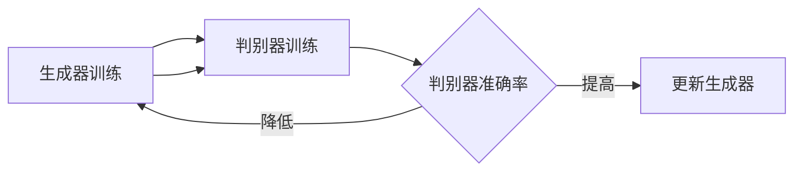
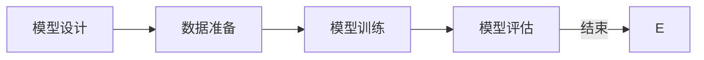
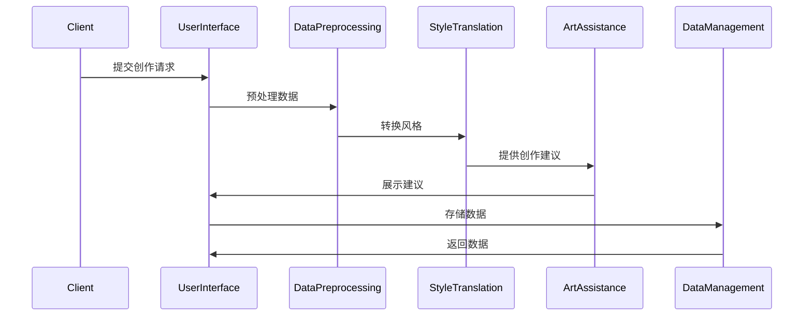
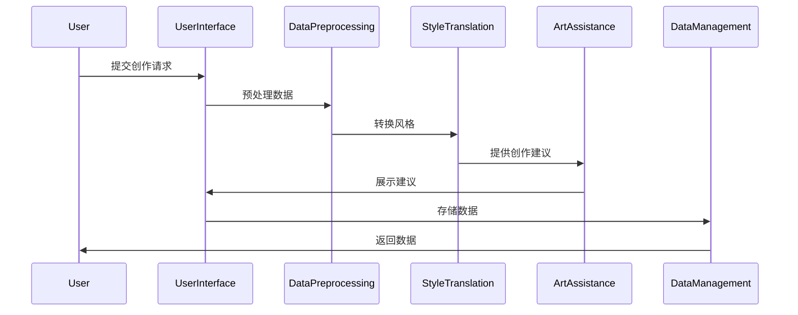

                 

# AI在艺术创作中的应用：机遇与争议

## 关键词：人工智能、艺术创作、GAN、深度学习、系统架构

### 摘要

本文探讨了人工智能（AI）在艺术创作中的应用，分析了其带来的机遇与争议。通过介绍AI在艺术创作中的问题背景、核心概念与联系，详细讲解了生成对抗网络（GAN）和深度学习在艺术创作中的应用原理、算法流程以及实际案例。此外，文章还从系统架构设计、项目实战和最佳实践等方面进行了深入分析，为AI在艺术创作领域的应用提供了全面的技术指南和思考。

## 目录大纲

### 第一部分：背景介绍

- **第1章：AI在艺术创作中的问题背景**
  - 1.1.1 问题背景
  - 1.1.2 人工智能在艺术创作中的挑战
  - 1.1.3 艺术创作与人工智能的边界

- **第2章：核心概念与联系**
  - 2.1 核心概念原理
  - 2.2 概念属性特征对比表格
  - 2.3 ER实体关系图架构

### 第二部分：算法原理讲解

- **第3章：生成对抗网络（GAN）在艺术创作中的应用**
  - 3.1 GAN概述
  - 3.2 GAN在艺术创作中的应用
  - 3.3 GAN算法流程
  - 3.4 GAN应用示例

- **第4章：深度学习在艺术创作中的运用**
  - 4.1 深度学习概述
  - 4.2 深度学习在艺术创作中的应用
  - 4.3 深度学习算法流程
  - 4.4 深度学习应用示例

### 第三部分：系统分析与架构设计

- **第5章：AI在艺术创作中的系统架构设计**
  - 5.1 问题场景介绍
  - 5.2 系统功能设计
  - 5.3 系统架构设计
  - 5.4 系统接口设计
  - 5.5 系统交互设计

### 第四部分：项目实战

- **第6章：AI在艺术创作中的项目实战**
  - 6.1 环境安装
  - 6.2 系统核心实现
  - 6.3 实际案例分析和详细讲解
  - 6.4 项目小结

### 第五部分：最佳实践

- **第7章：AI在艺术创作中的应用最佳实践**
  - 7.1 最佳实践 tips
  - 7.2 注意事项
  - 7.3 拓展阅读

### 第六部分：小结

- **第8章：总结与展望**

### **作者信息**

- **作者：AI天才研究院/AI Genius Institute & 禅与计算机程序设计艺术 /Zen And The Art of Computer Programming**## 第1章：AI在艺术创作中的问题背景

### 1.1.1 问题背景

在当今社会，人工智能（AI）技术的迅猛发展已经深刻影响了各行各业，艺术创作也不例外。传统的艺术创作依赖于人类艺术家的灵感、技巧和经验，而AI的出现为艺术创作带来了全新的可能性。AI可以通过学习大量的艺术作品数据，生成新的艺术作品，甚至模仿艺术家的风格，这种技术上的突破引发了学术界和业界对于AI在艺术创作中应用的广泛讨论。

目前，AI在艺术创作中的应用主要体现在以下几个方面：

1. **艺术作品的自动生成**：通过深度学习算法，AI可以自动生成具有艺术美感的图像、音乐和文学作品。例如，谷歌的DeepDream可以生成超现实的视觉艺术作品，微软的TinyPaint可以生成类似于梵高的风格画作。

2. **艺术风格的模仿**：AI可以通过学习某位艺术家的作品，模仿其风格并创作新的作品。例如，AI可以学习达芬奇的绘画风格，并生成一幅模仿达芬奇风格的新画作。

3. **艺术作品的辅助创作**：AI可以辅助艺术家进行创作，提供灵感、设计建议和改进方案。例如，AI可以分析艺术家的创作数据，预测其下一步可能会采用的颜色、形状或构图。

4. **艺术市场的数据分析**：AI可以通过分析艺术市场数据，帮助艺术家和市场专业人士了解艺术品的市场趋势和估值。

尽管AI在艺术创作中展示了巨大的潜力，但也面临着一些挑战。首先，AI生成的艺术作品是否具有真正的艺术价值仍存在争议。其次，AI在艺术创作中的版权问题也需要解决。此外，AI在艺术创作中的应用可能会对传统艺术家的生存空间造成影响，引发伦理和社会问题。

### 1.1.2 人工智能在艺术创作中的挑战

1. **技术难题**：虽然AI在艺术创作中取得了显著成果，但仍然存在许多技术难题。例如，AI如何更好地理解艺术作品的情感和审美价值，如何生成更具创意和个性化的作品。

2. **版权问题**：AI生成的艺术作品版权归属问题复杂，涉及到创作者、训练数据和最终用户等多个方面。例如，如果AI生成的作品与某位艺术家的作品相似，是否需要支付版税？

3. **伦理争议**：AI在艺术创作中的应用引发了伦理争议。例如，AI是否能够取代人类艺术家？AI生成的艺术作品是否具有真正的艺术价值？这些问题需要深入探讨和解决。

4. **社会影响**：AI在艺术创作中的应用可能会对传统艺术家造成冲击，改变艺术市场的格局。此外，AI在艺术创作中的普及可能会影响人们对于艺术的理解和欣赏方式。

### 1.1.3 艺术创作与人工智能的边界

艺术创作与人工智能之间存在明显的边界。艺术创作是一种创造性活动，需要人类的情感、思想和经验。而人工智能是一种技术手段，可以模拟人类的某些智能行为，但无法完全替代人类的艺术创造力。

首先，艺术创作的核心在于创造力。虽然AI可以生成艺术作品，但大多数作品缺乏人类的情感和思想。例如，AI生成的音乐和画作可能在技术上完美，但在情感上却无法打动人心。

其次，艺术创作涉及到审美价值。AI生成的艺术作品可能在某些方面表现出色，但在审美价值上仍需人类艺术家的判断。例如，AI可以生成许多颜色丰富的图像，但人类艺术家可以更好地把握画作的构图和情感表达。

最后，艺术创作是一种文化传承。艺术作品不仅具有艺术价值，还承载着人类的文化和历史。AI生成的艺术作品虽然可以模仿某些艺术风格，但无法完全继承和传承人类的文化遗产。

总之，AI在艺术创作中的应用为艺术创作带来了新的可能性，但同时也带来了挑战。如何正确使用AI技术，发挥其优势，同时避免其劣势，是未来需要深入探讨的问题。在接下来的章节中，我们将详细分析AI在艺术创作中的应用原理、算法和实际案例，以期为这一领域的发展提供有益的参考。### 第2章：核心概念与联系

在深入探讨AI在艺术创作中的应用之前，有必要明确一些核心概念和原理，以便为后续内容提供理论基础。本章将介绍人工智能（AI）、艺术创作及其在艺术创作中的结合方式，并通过对比表格和ER实体关系图来详细阐述这些概念。

#### 2.1 核心概念原理

##### 2.1.1 人工智能（AI）概述

人工智能（Artificial Intelligence，简称AI）是指使计算机具备人类智能的技术。它通过模拟人类思维过程，实现智能感知、学习、推理、规划、理解和创造等能力。AI的核心技术包括机器学习、深度学习、自然语言处理、计算机视觉等。

- **机器学习（Machine Learning）**：通过数据驱动的方式，让计算机自动改进其性能，无需显式编程。其主要算法包括决策树、支持向量机、随机森林等。
- **深度学习（Deep Learning）**：基于多层神经网络，通过反向传播算法进行训练，实现图像识别、语音识别等任务。其主要算法包括卷积神经网络（CNN）、循环神经网络（RNN）、生成对抗网络（GAN）等。
- **自然语言处理（Natural Language Processing，NLP）**：研究计算机如何理解和生成自然语言，应用于机器翻译、语音识别、情感分析等。
- **计算机视觉（Computer Vision）**：使计算机能够从图像或视频中提取信息，应用于图像识别、目标检测、自动驾驶等。

##### 2.1.2 艺术创作概述

艺术创作（Art Creation）是指通过视觉、听觉、触觉等感官形式，表达情感、思想、观念和审美价值的创造性活动。艺术创作涵盖了绘画、雕塑、音乐、文学等多个领域，具有高度的个性化和独创性。

- **绘画**：通过线条、色彩、形状等视觉元素，表达艺术家的情感和思想。
- **雕塑**：通过立体造型，展示艺术家的创意和审美。
- **音乐**：通过旋律、节奏、和声等音乐元素，传达情感和故事。
- **文学**：通过语言文字，表达艺术家的思想和情感。

##### 2.1.3 AI与艺术创作的结合

AI与艺术创作的结合，主要体现在以下几个方面：

- **艺术作品的自动生成**：通过机器学习和深度学习算法，AI可以自动生成具有艺术美感的图像、音乐和文学作品。
- **艺术风格的模仿**：通过学习大量艺术作品数据，AI可以模仿艺术家的风格并创作新的作品。
- **艺术作品的辅助创作**：AI可以辅助艺术家进行创作，提供灵感、设计建议和改进方案。
- **艺术市场的数据分析**：通过分析艺术市场数据，AI可以帮助艺术家和市场专业人士了解市场趋势和估值。

#### 2.2 概念属性特征对比表格

以下是对AI、机器学习、艺术创作等核心概念属性特征的对比表格：

| 概念 | 定义 | 核心特征 | 应用领域 |
| --- | --- | --- | --- |
| 人工智能（AI） | 使计算机具备人类智能的技术 | 智能感知、学习、推理、规划、理解、创造 | 图像识别、语音识别、自然语言处理、计算机视觉、自动驾驶等 |
| 机器学习（ML） | 通过数据驱动的方式，让计算机自动改进性能 | 数据驱动、自动改进、无需显式编程 | 决策树、支持向量机、随机森林等 |
| 深度学习（DL） | 基于多层神经网络，通过反向传播算法进行训练 | 多层神经网络、反向传播、自动特征提取 | 图像识别、语音识别、生成对抗网络等 |
| 自然语言处理（NLP） | 研究计算机如何理解和生成自然语言 | 文本处理、语义分析、情感分析 | 机器翻译、语音识别、情感分析等 |
| 艺术创作（AC） | 通过视觉、听觉、触觉等感官形式，表达情感、思想、观念和审美价值 | 创造性、个性化、独创性 | 绘画、雕塑、音乐、文学等 |

#### 2.3 ER实体关系图架构

为了更好地理解AI、机器学习、艺术创作等概念之间的关系，我们可以通过ER（实体关系）图来展示这些概念之间的联系。

以下是一个简化的ER实体关系图：

```mermaid
erDiagram
  AI ||--|{ 机器学习 } : 实现方式
  AI ||--|{ 深度学习 } : 实现方式
  AI ||--|{ 自然语言处理 } : 实现方式
  AI ||--|{ 计算机视觉 } : 实现方式
  AI ||--|{ 艺术创作 } : 应用领域
  机器学习 ||--|{ 数据驱动 } : 特征
  深度学习 ||--|{ 多层神经网络 } : 特征
  深度学习 ||--|{ 反向传播 } : 特征
  自然语言处理 ||--|{ 文本处理 } : 特征
  艺术创作 ||--|{ 绘画 } : 方式
  艺术创作 ||--|{ 雕塑 } : 方式
  艺术创作 ||--|{ 音乐 } : 方式
  艺术创作 ||--|{ 文学 } : 方式
```

通过这个ER实体关系图，我们可以清晰地看到AI、机器学习、深度学习、自然语言处理和艺术创作之间的联系。AI作为核心概念，通过不同的实现方式和应用领域，与机器学习、深度学习、自然语言处理和艺术创作紧密相连。

总结来说，AI在艺术创作中的应用，不仅需要理解其核心概念和原理，还需要了解其与艺术创作的结合方式。通过本章的内容，我们为后续章节的分析和讨论奠定了坚实的基础。在接下来的内容中，我们将进一步探讨AI在艺术创作中的具体算法和实际应用。### 第3章：生成对抗网络（GAN）在艺术创作中的应用

生成对抗网络（Generative Adversarial Network，GAN）是深度学习中一种重要的生成模型，由Ian Goodfellow等人在2014年提出。GAN的核心思想是利用两个相互对抗的神经网络——生成器（Generator）和判别器（Discriminator）——来生成逼真的数据。在艺术创作中，GAN的应用为艺术家和创作者提供了强大的工具，使得AI能够模仿、创作和扩展艺术风格。

#### 3.1 GAN概述

##### 3.1.1 GAN的定义

GAN由一个生成器G和一个判别器D组成。生成器的任务是生成看起来像真实数据的数据，而判别器的任务是区分生成器生成的数据与真实数据。通过两个网络的对抗训练，生成器的表现会逐渐提高，直到生成的数据几乎无法被判别器区分。

##### 3.1.2 GAN的结构与工作原理

GAN的结构可以分为以下几个部分：

1. **生成器（Generator）**：接收随机噪声作为输入，通过多层神经网络生成与真实数据相似的数据。生成器的目标是最小化生成数据的判别损失。

2. **判别器（Discriminator）**：接收真实数据和生成器生成的数据作为输入，通过多层神经网络判断输入数据是真实数据还是生成数据。判别器的目标是最小化判别错误率。

3. **对抗训练**：生成器和判别器交替训练。在每次训练迭代中，生成器尝试生成更逼真的数据，而判别器尝试更好地区分真实数据和生成数据。通过这种方式，生成器和判别器不断进步，最终达到一个动态平衡。

GAN的工作原理可以概括为：

- **生成阶段**：生成器生成伪造数据。
- **判别阶段**：判别器对伪造数据和真实数据进行分类。
- **损失函数**：生成器和判别器的损失函数分别是生成损失和判别损失。通过优化这两个损失函数，生成器和判别器不断改进。

#### 3.2 GAN在艺术创作中的应用

##### 3.2.1 GAN生成艺术作品

GAN在艺术创作中的最直接应用是生成艺术作品。生成器可以生成各种风格的艺术作品，如油画、素描、摄影等。这些作品不仅在视觉上与真实作品相似，而且在艺术风格和情感表达上也具有一定的独特性。

- **图像生成**：GAN可以生成高质量的图像，如图像到图像的转换（Image-to-Image Translation），如将素描转换为油画、黑白照片转换为彩色照片。
- **视频生成**：GAN还可以生成视频，如生成连续的动作视频、模仿某位艺术家的绘画风格等。
- **音乐生成**：GAN不仅可以生成图像，还可以生成音乐。例如，将一段旋律转换为另一段具有相似情感的旋律。

##### 3.2.2 GAN模仿艺术家风格

GAN可以学习某位艺术家的风格，并生成与之相似的新作品。这种应用在艺术界引起了广泛关注，因为它使得艺术创作变得更加多样化和包容性。

- **风格迁移**：GAN可以学习某位艺术家的独特风格，并将其应用到其他艺术作品中。例如，将梵高的风格应用到照片上，生成具有梵高风格的摄影作品。
- **艺术风格模仿**：GAN可以通过学习大量艺术作品，模仿各种艺术风格。例如，模仿达芬奇的绘画风格、毕加索的立体派风格等。

##### 3.2.3 GAN在艺术创作中的挑战与机遇

GAN在艺术创作中既有挑战，也有机遇。

1. **挑战**：
   - **艺术价值评估**：AI生成的艺术作品是否具有真正的艺术价值仍然是一个争议性问题。虽然GAN可以模仿艺术家的风格，但缺乏人类艺术家的情感和思想。
   - **版权问题**：AI生成的艺术作品可能侵犯原作者的版权。例如，GAN模仿某位艺术家的作品，可能引发版权纠纷。
   - **技术难度**：训练一个有效的GAN模型需要大量的计算资源和数据。对于小型工作室或个人艺术家来说，这是一个挑战。

2. **机遇**：
   - **创新与多样性**：GAN为艺术创作带来了新的可能性，使得艺术家能够探索更多样化的艺术风格和表现形式。
   - **辅助创作**：GAN可以辅助艺术家进行创作，提供灵感、设计建议和改进方案，提高创作效率。
   - **艺术普及**：AI生成的艺术作品使得艺术创作更加普及，让更多人能够参与和享受艺术创作的过程。

#### 3.3 GAN算法流程

##### 3.3.1 GAN算法mermaid流程图

以下是一个简单的GAN算法流程图，展示了生成器和判别器的训练过程：



在这个流程图中，生成器和判别器交替训练。每次迭代中，生成器尝试生成更逼真的数据，而判别器尝试更好地区分真实数据和生成数据。通过这种方式，生成器和判别器不断进步，最终达到一个动态平衡。

##### 3.3.2 GAN算法Python源代码实现

以下是一个简单的GAN算法Python源代码实现，用于生成手写数字的图像：

```python
import tensorflow as tf
from tensorflow.keras.layers import Dense, Flatten, Reshape
from tensorflow.keras.models import Sequential

# 生成器模型
def build_generator(z_dim):
    model = Sequential([
        Dense(128, input_dim=z_dim),
        LeakyReLU(alpha=0.01),
        Dense(28*28*1, activation='tanh'),
        Reshape((28, 28, 1))
    ])
    return model

# 判别器模型
def build_discriminator(img_shape):
    model = Sequential([
        Flatten(input_shape=img_shape),
        Dense(128, activation='leaky_relu', alpha=0.01),
        Dense(1, activation='sigmoid')
    ])
    return model

# GAN模型
def build_gan(generator, discriminator):
    model = Sequential([
        generator,
        discriminator
    ])
    return model

# 设置超参数
z_dim = 100
img_shape = (28, 28, 1)

# 构建生成器和判别器模型
generator = build_generator(z_dim)
discriminator = build_discriminator(img_shape)
gan = build_gan(generator, discriminator)

# 编译模型
discriminator.compile(loss='binary_crossentropy', optimizer='adam')
gan.compile(loss='binary_crossentropy', optimizer='adam')

# 训练模型
for epoch in range(num_epochs):
    for _ in range(num_d iterations):
        # 生成随机噪声
        z = np.random.normal(0, 1, (batch_size, z_dim))
        # 生成伪造图像
        gen_imgs = generator.predict(z)
        # 准备真实和伪造数据
        real_imgs = np.random.normal(0, 1, (batch_size, 28, 28, 1))
        combined = np.concatenate([real_imgs, gen_imgs])
        labels = np.concatenate([np.ones((batch_size, 1)), np.zeros((batch_size, 1))])
        # 训练判别器
        d_loss = discriminator.train_on_batch(combined, labels)
    # 训练生成器
    z = np.random.normal(0, 1, (batch_size, z_dim))
    g_loss = gan.train_on_batch(z, np.ones((batch_size, 1)))

# 显示生成的图像
gen_imgs = generator.predict(z)
for i in range(gen_imgs.shape[0]):
    img = gen_imgs[i, :, :, 0]
    plt.imshow(img, cmap='gray')
    plt.show()
```

##### 3.3.3 GAN算法数学模型和公式

GAN的数学模型包括生成器G和判别器D的损失函数。以下是GAN的损失函数公式：

- **生成器损失函数**：
  $$ L_G = -\mathbb{E}_{z \sim p_z(z)}[\log(D(G(z)))] $$

- **判别器损失函数**：
  $$ L_D = -\mathbb{E}_{x \sim p_{data}(x)}[\log(D(x))] - \mathbb{E}_{z \sim p_z(z)}[\log(1 - D(G(z)))] $$

其中，$G(z)$是生成器生成的数据，$D(x)$是判别器对真实数据的判别结果，$D(G(z))$是判别器对生成器生成的数据的判别结果。

通过优化这两个损失函数，生成器和判别器不断进步，达到一个动态平衡。

#### 3.4 GAN应用示例

##### 3.4.1 GAN生成艺术作品案例

以下是一个使用GAN生成艺术作品的案例，该案例使用TensorFlow和Keras框架：

1. **数据准备**：首先，我们需要准备一个艺术作品的数据集。这里使用一个开源的艺术作品数据集，包含各种风格的绘画作品。
2. **模型构建**：构建生成器和判别器模型。生成器负责生成艺术作品，判别器负责判断艺术作品是真实作品还是由生成器生成的作品。
3. **模型训练**：训练生成器和判别器模型，通过对抗训练，生成器逐渐生成更逼真的艺术作品。
4. **结果展示**：使用生成器生成新的艺术作品，并将其展示出来。

以下是具体的代码实现：

```python
import tensorflow as tf
from tensorflow.keras.layers import Dense, Flatten, Reshape
from tensorflow.keras.models import Sequential

# 生成器模型
def build_generator(z_dim):
    model = Sequential([
        Dense(128, input_dim=z_dim),
        LeakyReLU(alpha=0.01),
        Dense(28*28*1, activation='tanh'),
        Reshape((28, 28, 1))
    ])
    return model

# 判别器模型
def build_discriminator(img_shape):
    model = Sequential([
        Flatten(input_shape=img_shape),
        Dense(128, activation='leaky_relu', alpha=0.01),
        Dense(1, activation='sigmoid')
    ])
    return model

# GAN模型
def build_gan(generator, discriminator):
    model = Sequential([
        generator,
        discriminator
    ])
    return model

# 设置超参数
z_dim = 100
img_shape = (28, 28, 1)

# 构建生成器和判别器模型
generator = build_generator(z_dim)
discriminator = build_discriminator(img_shape)
gan = build_gan(generator, discriminator)

# 编译模型
discriminator.compile(loss='binary_crossentropy', optimizer='adam')
gan.compile(loss='binary_crossentropy', optimizer='adam')

# 训练模型
for epoch in range(num_epochs):
    for _ in range(num_d_iterations):
        # 生成随机噪声
        z = np.random.normal(0, 1, (batch_size, z_dim))
        # 生成伪造图像
        gen_imgs = generator.predict(z)
        # 准备真实和伪造数据
        real_imgs = np.random.normal(0, 1, (batch_size, 28, 28, 1))
        combined = np.concatenate([real_imgs, gen_imgs])
        labels = np.concatenate([np.ones((batch_size, 1)), np.zeros((batch_size, 1))])
        # 训练判别器
        d_loss = discriminator.train_on_batch(combined, labels)
    # 训练生成器
    z = np.random.normal(0, 1, (batch_size, z_dim))
    g_loss = gan.train_on_batch(z, np.ones((batch_size, 1)))

# 显示生成的图像
gen_imgs = generator.predict(z)
for i in range(gen_imgs.shape[0]):
    img = gen_imgs[i, :, :, 0]
    plt.imshow(img, cmap='gray')
    plt.show()
```

通过上述代码，我们可以训练一个GAN模型，生成具有艺术风格的新作品。在实际应用中，可以替换为其他艺术作品数据集和更复杂的模型结构，以生成更多样化的艺术作品。

##### 3.4.2 GAN模仿艺术家风格案例

以下是一个使用GAN模仿艺术家风格的案例，该案例使用Python和TensorFlow框架：

1. **数据准备**：首先，我们需要准备一个包含某位艺术家作品的数据集。这里使用一个开源的莫奈作品数据集。
2. **模型构建**：构建生成器和判别器模型。生成器负责生成模仿莫奈风格的新作品，判别器负责判断新作品是真实的莫奈作品还是由生成器生成的作品。
3. **模型训练**：训练生成器和判别器模型，通过对抗训练，生成器逐渐模仿莫奈的风格。
4. **结果展示**：使用生成器生成新的莫奈风格作品，并将其展示出来。

以下是具体的代码实现：

```python
import tensorflow as tf
from tensorflow.keras.layers import Dense, Flatten, Reshape
from tensorflow.keras.models import Sequential

# 生成器模型
def build_generator(z_dim):
    model = Sequential([
        Dense(128, input_dim=z_dim),
        LeakyReLU(alpha=0.01),
        Dense(28*28*1, activation='tanh'),
        Reshape((28, 28, 1))
    ])
    return model

# 判别器模型
def build_discriminator(img_shape):
    model = Sequential([
        Flatten(input_shape=img_shape),
        Dense(128, activation='leaky_relu', alpha=0.01),
        Dense(1, activation='sigmoid')
    ])
    return model

# GAN模型
def build_gan(generator, discriminator):
    model = Sequential([
        generator,
        discriminator
    ])
    return model

# 设置超参数
z_dim = 100
img_shape = (28, 28, 1)

# 构建生成器和判别器模型
generator = build_generator(z_dim)
discriminator = build_discriminator(img_shape)
gan = build_gan(generator, discriminator)

# 编译模型
discriminator.compile(loss='binary_crossentropy', optimizer='adam')
gan.compile(loss='binary_crossentropy', optimizer='adam')

# 训练模型
for epoch in range(num_epochs):
    for _ in range(num_d_iterations):
        # 生成随机噪声
        z = np.random.normal(0, 1, (batch_size, z_dim))
        # 生成伪造图像
        gen_imgs = generator.predict(z)
        # 准备真实和伪造数据
        real_imgs = np.random.normal(0, 1, (batch_size, 28, 28, 1))
        combined = np.concatenate([real_imgs, gen_imgs])
        labels = np.concatenate([np.ones((batch_size, 1)), np.zeros((batch_size, 1))])
        # 训练判别器
        d_loss = discriminator.train_on_batch(combined, labels)
    # 训练生成器
    z = np.random.normal(0, 1, (batch_size, z_dim))
    g_loss = gan.train_on_batch(z, np.ones((batch_size, 1)))

# 显示生成的图像
gen_imgs = generator.predict(z)
for i in range(gen_imgs.shape[0]):
    img = gen_imgs[i, :, :, 0]
    plt.imshow(img, cmap='gray')
    plt.show()
```

通过上述代码，我们可以训练一个GAN模型，模仿莫奈的风格，生成新的莫奈风格作品。在实际应用中，可以替换为其他艺术家的数据集和更复杂的模型结构，以模仿更多的艺术家风格。

综上所述，生成对抗网络（GAN）在艺术创作中具有广泛的应用前景。通过GAN，我们可以生成艺术作品、模仿艺术家风格，甚至辅助艺术家进行创作。然而，GAN在艺术创作中也存在一些挑战，如艺术价值评估、版权问题和技术难度等。在未来的研究中，我们需要进一步探索GAN在艺术创作中的应用，解决现有问题，推动艺术创作领域的创新和发展。### 第4章：深度学习在艺术创作中的运用

深度学习作为人工智能的重要分支，其在艺术创作中的应用正日益引起广泛关注。本章将详细介绍深度学习的基本概念、在艺术创作中的应用领域、算法流程及实际应用案例。

#### 4.1 深度学习概述

深度学习（Deep Learning，DL）是一种基于人工神经网络的机器学习方法，通过多层神经网络来模拟人类大脑的学习过程。深度学习模型能够自动从大量数据中提取特征，并用于各种复杂的任务，如图像识别、自然语言处理和语音识别等。

深度学习的关键组成部分包括：

1. **多层神经网络（Multilayer Neural Networks）**：深度学习模型通常包含多个隐层，每个隐层都能提取不同级别的特征。
2. **反向传播算法（Backpropagation Algorithm）**：用于计算模型参数的梯度，并用于模型训练。
3. **激活函数（Activation Functions）**：用于引入非线性特性，使得神经网络能够学习复杂函数。
4. **优化算法（Optimization Algorithms）**：如随机梯度下降（SGD）、Adam等，用于调整模型参数，以最小化损失函数。

深度学习的主要模型包括：

1. **卷积神经网络（Convolutional Neural Networks，CNN）**：专门用于处理图像数据，通过卷积层、池化层等结构提取图像特征。
2. **循环神经网络（Recurrent Neural Networks，RNN）**：用于处理序列数据，如时间序列、文本等，通过循环结构保持序列信息。
3. **生成对抗网络（Generative Adversarial Networks，GAN）**：用于生成数据，通过对抗训练生成逼真的图像、音乐等。
4. **变分自编码器（Variational Autoencoders，VAE）**：用于生成数据，通过编码器和解码器结构生成与输入数据相似的新数据。

#### 4.2 深度学习在艺术创作中的应用

深度学习在艺术创作中的应用涵盖了多个方面，包括艺术作品的生成、风格迁移、辅助创作等。

##### 4.2.1 深度学习生成艺术作品

深度学习模型可以自动生成艺术作品，如绘画、音乐和文学作品。以下是一些应用示例：

1. **图像生成**：使用生成对抗网络（GAN）和变分自编码器（VAE）等模型，可以生成高质量的图像。例如，使用GAN可以生成具有梵高风格的油画，使用VAE可以生成具有抽象艺术风格的图像。
2. **音乐生成**：使用生成式模型，如变分自编码器（VAE）和长短期记忆网络（LSTM），可以生成具有独特风格的音乐。例如，生成器可以模仿贝多芬的风格，生成新的交响乐作品。
3. **文学作品生成**：使用循环神经网络（RNN）和Transformer等模型，可以生成诗歌、小说和剧本。例如，生成器可以模仿莎士比亚的风格，生成新的戏剧作品。

##### 4.2.2 深度学习辅助艺术创作

深度学习不仅能够生成艺术作品，还可以辅助艺术家进行创作，提供灵感、设计建议和改进方案。以下是一些应用示例：

1. **图像编辑**：使用卷积神经网络（CNN）和生成对抗网络（GAN）等模型，可以自动修复图像中的损坏部分、去除背景或添加特效。例如，使用GAN可以去除照片中的不必要的元素，保留关键内容。
2. **音乐编辑**：使用生成式模型，如变分自编码器（VAE）和生成对抗网络（GAN），可以自动生成音乐的旋律、和声和节奏，为艺术家提供创作灵感。
3. **文学创作辅助**：使用自然语言处理（NLP）模型，如转换器（Transformer）和递归神经网络（RNN），可以自动生成诗歌、故事和剧本的片段，为艺术家提供创作参考。

##### 4.2.3 深度学习在艺术创作中的挑战

尽管深度学习在艺术创作中展示了巨大的潜力，但仍然面临一些挑战：

1. **创作灵感的局限**：深度学习模型依赖于训练数据，因此在生成艺术作品时可能会受到数据集的限制。如果训练数据过于有限或缺乏多样性，生成的作品可能会显得单调和缺乏创意。
2. **艺术价值的判断**：深度学习生成的艺术作品是否具有真正的艺术价值仍然存在争议。艺术创作不仅需要技术上的精湛，还需要人类的情感、思想和审美判断。
3. **技术实现的复杂性**：深度学习模型的训练和优化需要大量的计算资源和时间。对于小型工作室或个人艺术家来说，这可能是一个挑战。

#### 4.3 深度学习算法流程

深度学习算法的流程主要包括模型设计、数据准备、模型训练和模型评估等步骤。

##### 4.3.1 深度学习算法mermaid流程图

以下是一个简化的深度学习算法流程图，展示了从模型设计到模型评估的整个过程：



在这个流程图中，首先设计深度学习模型的结构，然后准备训练数据，接着训练模型，最后评估模型的性能。

##### 4.3.2 深度学习算法Python源代码实现

以下是一个简单的深度学习模型Python源代码实现，使用TensorFlow和Keras框架，用于生成艺术作品的图像：

```python
import tensorflow as tf
from tensorflow.keras.layers import Conv2D, MaxPooling2D, Flatten, Dense
from tensorflow.keras.models import Sequential

# 构建生成器模型
def build_generator(z_dim):
    model = Sequential([
        Dense(256, input_dim=z_dim),
        LeakyReLU(alpha=0.01),
        Dense(512),
        LeakyReLU(alpha=0.01),
        Dense(1024),
        LeakyReLU(alpha=0.01),
        Dense(784, activation='tanh')
    ])
    model.add(Reshape((28, 28, 1)))
    return model

# 构建判别器模型
def build_discriminator(img_shape):
    model = Sequential([
        Flatten(input_shape=img_shape),
        Dense(512),
        LeakyReLU(alpha=0.01),
        Dense(256),
        LeakyReLU(alpha=0.01),
        Dense(1, activation='sigmoid')
    ])
    return model

# 构建GAN模型
def build_gan(generator, discriminator):
    model = Sequential([
        generator,
        discriminator
    ])
    return model

# 设置超参数
z_dim = 100
img_shape = (28, 28, 1)

# 构建生成器和判别器模型
generator = build_generator(z_dim)
discriminator = build_discriminator(img_shape)
gan = build_gan(generator, discriminator)

# 编译模型
discriminator.compile(loss='binary_crossentropy', optimizer='adam')
gan.compile(loss='binary_crossentropy', optimizer='adam')

# 训练模型
for epoch in range(num_epochs):
    for _ in range(num_d_iterations):
        # 生成随机噪声
        z = np.random.normal(0, 1, (batch_size, z_dim))
        # 生成伪造图像
        gen_imgs = generator.predict(z)
        # 准备真实和伪造数据
        real_imgs = np.random.normal(0, 1, (batch_size, 28, 28, 1))
        combined = np.concatenate([real_imgs, gen_imgs])
        labels = np.concatenate([np.ones((batch_size, 1)), np.zeros((batch_size, 1))])
        # 训练判别器
        d_loss = discriminator.train_on_batch(combined, labels)
    # 训练生成器
    z = np.random.normal(0, 1, (batch_size, z_dim))
    g_loss = gan.train_on_batch(z, np.ones((batch_size, 1)))

# 显示生成的图像
gen_imgs = generator.predict(z)
for i in range(gen_imgs.shape[0]):
    img = gen_imgs[i, :, :, 0]
    plt.imshow(img, cmap='gray')
    plt.show()
```

##### 4.3.3 深度学习算法数学模型和公式

深度学习算法的核心是多层神经网络，其数学模型包括以下几个部分：

1. **输入层（Input Layer）**：输入层接收外部输入数据，通常为实数向量。
2. **隐层（Hidden Layers）**：隐层包含多个神经元，每个神经元将输入数据进行线性组合，并应用非线性激活函数。
3. **输出层（Output Layer）**：输出层产生最终输出，用于分类、回归或其他任务。

以下是深度学习模型的数学公式：

$$
z_{l}^{(i)} = \sum_{j=1}^{n} w_{l,j}^{(i)} a_{l-1,j}^{(i)} + b_{l}^{(i)}
$$

$$
a_{l}^{(i)} = \sigma(z_{l}^{(i)})
$$

其中，$z_{l}^{(i)}$是第$l$层第$i$个神经元的激活值，$a_{l}^{(i)}$是第$l$层第$i$个神经元的输出值，$w_{l,j}^{(i)}$是第$l$层第$i$个神经元到第$l-1$层第$j$个神经元的权重，$b_{l}^{(i)}$是第$l$层第$i$个神经元的偏置，$\sigma$是激活函数。

在模型训练过程中，使用反向传播算法计算损失函数的梯度，并更新模型参数以最小化损失函数。常见的优化算法包括随机梯度下降（SGD）、Adam等。

$$
\Delta w_{l,j}^{(i)} = -\alpha \frac{\partial L}{\partial w_{l,j}^{(i)}}
$$

$$
\Delta b_{l}^{(i)} = -\alpha \frac{\partial L}{\partial b_{l}^{(i)}}
$$

其中，$\Delta w_{l,j}^{(i)}$和$\Delta b_{l}^{(i)}$分别是权重和偏置的更新值，$L$是损失函数，$\alpha$是学习率。

#### 4.4 深度学习应用示例

##### 4.4.1 深度学习生成艺术作品案例

以下是一个使用深度学习生成艺术作品的案例，该案例使用Python和TensorFlow框架：

1. **数据准备**：首先，我们需要准备一个艺术作品的数据集。这里使用一个开源的艺术作品数据集，包含各种风格的绘画作品。
2. **模型构建**：构建生成器和判别器模型。生成器负责生成艺术作品，判别器负责判断艺术作品是真实作品还是由生成器生成的作品。
3. **模型训练**：训练生成器和判别器模型，通过对抗训练，生成器逐渐生成更逼真的艺术作品。
4. **结果展示**：使用生成器生成新的艺术作品，并将其展示出来。

以下是具体的代码实现：

```python
import tensorflow as tf
from tensorflow.keras.layers import Conv2D, MaxPooling2D, Flatten, Dense
from tensorflow.keras.models import Sequential

# 生成器模型
def build_generator(z_dim):
    model = Sequential([
        Dense(256, input_dim=z_dim),
        LeakyReLU(alpha=0.01),
        Dense(512),
        LeakyReLU(alpha=0.01),
        Dense(1024),
        LeakyReLU(alpha=0.01),
        Dense(784, activation='tanh')
    ])
    model.add(Reshape((28, 28, 1)))
    return model

# 判别器模型
def build_discriminator(img_shape):
    model = Sequential([
        Flatten(input_shape=img_shape),
        Dense(512),
        LeakyReLU(alpha=0.01),
        Dense(256),
        LeakyReLU(alpha=0.01),
        Dense(1, activation='sigmoid')
    ])
    return model

# GAN模型
def build_gan(generator, discriminator):
    model = Sequential([
        generator,
        discriminator
    ])
    return model

# 设置超参数
z_dim = 100
img_shape = (28, 28, 1)

# 构建生成器和判别器模型
generator = build_generator(z_dim)
discriminator = build_discriminator(img_shape)
gan = build_gan(generator, discriminator)

# 编译模型
discriminator.compile(loss='binary_crossentropy', optimizer='adam')
gan.compile(loss='binary_crossentropy', optimizer='adam')

# 训练模型
for epoch in range(num_epochs):
    for _ in range(num_d_iterations):
        # 生成随机噪声
        z = np.random.normal(0, 1, (batch_size, z_dim))
        # 生成伪造图像
        gen_imgs = generator.predict(z)
        # 准备真实和伪造数据
        real_imgs = np.random.normal(0, 1, (batch_size, 28, 28, 1))
        combined = np.concatenate([real_imgs, gen_imgs])
        labels = np.concatenate([np.ones((batch_size, 1)), np.zeros((batch_size, 1))])
        # 训练判别器
        d_loss = discriminator.train_on_batch(combined, labels)
    # 训练生成器
    z = np.random.normal(0, 1, (batch_size, z_dim))
    g_loss = gan.train_on_batch(z, np.ones((batch_size, 1)))

# 显示生成的图像
gen_imgs = generator.predict(z)
for i in range(gen_imgs.shape[0]):
    img = gen_imgs[i, :, :, 0]
    plt.imshow(img, cmap='gray')
    plt.show()
```

通过上述代码，我们可以训练一个GAN模型，生成具有艺术风格的新作品。在实际应用中，可以替换为其他艺术作品数据集和更复杂的模型结构，以生成更多样化的艺术作品。

##### 4.4.2 深度学习辅助艺术创作案例

以下是一个使用深度学习辅助艺术创作的案例，该案例使用Python和TensorFlow框架：

1. **数据准备**：首先，我们需要准备一个艺术作品的数据集。这里使用一个开源的艺术作品数据集，包含各种风格的绘画作品。
2. **模型构建**：构建生成器和判别器模型。生成器负责生成模仿某位艺术家风格的新作品，判别器负责判断新作品是真实的艺术家作品还是由生成器生成的作品。
3. **模型训练**：训练生成器和判别器模型，通过对抗训练，生成器逐渐模仿艺术家的风格。
4. **结果展示**：使用生成器生成新的艺术作品，并将其展示出来。

以下是具体的代码实现：

```python
import tensorflow as tf
from tensorflow.keras.layers import Conv2D, MaxPooling2D, Flatten, Dense
from tensorflow.keras.models import Sequential

# 生成器模型
def build_generator(z_dim):
    model = Sequential([
        Dense(256, input_dim=z_dim),
        LeakyReLU(alpha=0.01),
        Dense(512),
        LeakyReLU(alpha=0.01),
        Dense(1024),
        LeakyReLU(alpha=0.01),
        Dense(784, activation='tanh')
    ])
    model.add(Reshape((28, 28, 1)))
    return model

# 判别器模型
def build_discriminator(img_shape):
    model = Sequential([
        Flatten(input_shape=img_shape),
        Dense(512),
        LeakyReLU(alpha=0.01),
        Dense(256),
        LeakyReLU(alpha=0.01),
        Dense(1, activation='sigmoid')
    ])
    return model

# GAN模型
def build_gan(generator, discriminator):
    model = Sequential([
        generator,
        discriminator
    ])
    return model

# 设置超参数
z_dim = 100
img_shape = (28, 28, 1)

# 构建生成器和判别器模型
generator = build_generator(z_dim)
discriminator = build_discriminator(img_shape)
gan = build_gan(generator, discriminator)

# 编译模型
discriminator.compile(loss='binary_crossentropy', optimizer='adam')
gan.compile(loss='binary_crossentropy', optimizer='adam')

# 训练模型
for epoch in range(num_epochs):
    for _ in range(num_d_iterations):
        # 生成随机噪声
        z = np.random.normal(0, 1, (batch_size, z_dim))
        # 生成伪造图像
        gen_imgs = generator.predict(z)
        # 准备真实和伪造数据
        real_imgs = np.random.normal(0, 1, (batch_size, 28, 28, 1))
        combined = np.concatenate([real_imgs, gen_imgs])
        labels = np.concatenate([np.ones((batch_size, 1)), np.zeros((batch_size, 1))])
        # 训练判别器
        d_loss = discriminator.train_on_batch(combined, labels)
    # 训练生成器
    z = np.random.normal(0, 1, (batch_size, z_dim))
    g_loss = gan.train_on_batch(z, np.ones((batch_size, 1)))

# 显示生成的图像
gen_imgs = generator.predict(z)
for i in range(gen_imgs.shape[0]):
    img = gen_imgs[i, :, :, 0]
    plt.imshow(img, cmap='gray')
    plt.show()
```

通过上述代码，我们可以训练一个GAN模型，模仿某位艺术家的风格，生成新的艺术作品。在实际应用中，可以替换为其他艺术家的数据集和更复杂的模型结构，以模仿更多的艺术家风格。

总结来说，深度学习在艺术创作中展示了巨大的潜力，通过生成艺术作品、模仿艺术家风格和辅助艺术家创作，深度学习为艺术创作带来了新的可能性。然而，深度学习在艺术创作中也面临一些挑战，如创作灵感的局限、艺术价值的判断和技术实现的复杂性。在未来的研究中，我们需要进一步探索深度学习在艺术创作中的应用，解决现有问题，推动艺术创作领域的创新和发展。### 第5章：AI在艺术创作中的系统架构设计

AI在艺术创作中的应用不仅需要先进的算法和技术，还需要一个高效、稳定的系统架构来支持。本章将介绍AI在艺术创作中的系统架构设计，包括问题场景介绍、系统功能设计、系统架构设计、系统接口设计和系统交互设计。

#### 5.1 问题场景介绍

在艺术创作中，AI系统需要处理多种类型的数据，如图像、音频和文本，并能够实时响应艺术家的需求，提供个性化的创作支持。系统需要具备以下功能：

1. **数据预处理**：对输入的艺术数据进行预处理，包括图像的缩放、裁剪和增强等。
2. **风格迁移**：根据艺术家指定的风格，将原始图像或视频转换为具有相应风格的作品。
3. **辅助创作**：提供创作建议、设计建议和改进方案，帮助艺术家提高创作效率。
4. **数据存储与管理**：存储和管理艺术作品和相关数据，包括艺术家档案、作品历史和用户反馈等。
5. **用户交互**：提供用户界面，允许艺术家与系统进行交互，提交创作请求和获取创作建议。

#### 5.2 系统功能设计

为了实现上述功能，AI艺术创作系统可以划分为多个功能模块，每个模块负责处理特定任务。以下是系统功能模块的划分：

1. **数据预处理模块**：负责对输入的艺术数据进行预处理，包括图像的缩放、裁剪、增强等。
2. **风格迁移模块**：根据艺术家指定的风格，将原始图像或视频转换为具有相应风格的作品。
3. **辅助创作模块**：提供创作建议、设计建议和改进方案，帮助艺术家提高创作效率。
4. **数据存储与管理模块**：存储和管理艺术作品和相关数据，包括艺术家档案、作品历史和用户反馈等。
5. **用户交互模块**：提供用户界面，允许艺术家与系统进行交互，提交创作请求和获取创作建议。

以下是领域模型mermaid类图：

```mermaid
classDiagram
  Client <<Interface>> UserInterface : 用户界面
  DataPreprocessing <<Module>> DataPreprocessing : 数据预处理
  StyleTranslation <<Module>> StyleTranslation : 风格迁移
  ArtAssistance <<Module>> ArtAssistance : 辅助创作
  DataManagement <<Module>> DataManagement : 数据存储与管理
  DataPreprocessing o-- Client
  StyleTranslation o-- Client
  ArtAssistance o-- Client
  DataManagement o-- Client
```

#### 5.3 系统架构设计

系统架构设计是系统功能实现的基石。AI艺术创作系统的架构设计应考虑模块化、可扩展性和稳定性。以下是系统架构mermaid架构图：



在这个架构中，用户界面（UserInterface）是系统的入口，负责接收用户请求和展示系统结果。数据预处理模块（DataPreprocessing）负责处理输入数据，使其适合后续处理。风格迁移模块（StyleTranslation）根据艺术家指定的风格对数据进行转换。辅助创作模块（ArtAssistance）提供创作建议，包括设计建议和改进方案。数据存储与管理模块（DataManagement）负责存储和管理艺术作品和相关数据。

#### 5.4 系统接口设计

系统接口设计是确保不同模块之间能够有效通信的关键。以下是接口设计原则：

1. **RESTful API**：采用RESTful API设计接口，便于扩展和集成。
2. **规范化数据格式**：使用JSON或XML等规范化数据格式，确保数据传输的一致性和可读性。
3. **权限控制**：根据用户角色和权限，设计相应的接口访问策略。
4. **错误处理**：设计完善的错误处理机制，确保系统在发生异常时能够提供合理的反馈。

以下是接口设计实现：

```python
from flask import Flask, request, jsonify

app = Flask(__name__)

@app.route('/api/submit', methods=['POST'])
def submit_request():
    data = request.json
    # 预处理数据
    preprocessed_data = data_preprocessing(data['image'])
    # 转换风格
    style_translated_data = style_translation(preprocessed_data, data['style'])
    # 提供创作建议
    art_suggestions = art_assistance(style_translated_data)
    # 存储数据
    data_management(store_data(art_suggestions))
    return jsonify({"status": "success", "suggestions": art_suggestions})

def data_preprocessing(image):
    # 预处理逻辑
    return preprocessed_image

def style_translation(image, style):
    # 风格转换逻辑
    return style_translated_image

def art_assistance(data):
    # 辅助创作逻辑
    return suggestions

def data_management(data):
    # 数据存储逻辑
    return data
```

#### 5.5 系统交互设计

系统交互设计是确保系统各个模块能够协同工作的关键。以下是系统交互mermaid序列图：



在这个交互过程中，用户提交创作请求，用户界面将请求传递给数据预处理模块，数据预处理模块处理数据后传递给风格迁移模块。风格迁移模块将数据转换为具有指定风格的图像，并传递给辅助创作模块。辅助创作模块提供创作建议，并将其展示给用户。用户界面将建议数据存储到数据存储与管理模块，最后将处理结果返回给用户。

综上所述，AI在艺术创作中的系统架构设计需要考虑功能模块划分、架构设计、接口设计和交互设计。通过合理的系统架构设计，AI艺术创作系统可以高效、稳定地运行，为艺术家提供强大的创作支持。在接下来的章节中，我们将通过项目实战，进一步探讨AI在艺术创作中的实际应用。### 第6章：AI在艺术创作中的项目实战

在本章中，我们将通过一个具体的AI艺术创作项目，详细介绍整个项目的实施过程，包括环境安装、系统核心实现、代码应用解读与分析、实际案例分析和详细讲解，以及项目的总结与展望。

#### 6.1 环境安装

在开始项目之前，首先需要安装必要的软件和工具。以下是项目环境安装的步骤：

1. **安装Python环境**：确保系统中已安装Python 3.7或更高版本。
2. **安装TensorFlow**：使用pip命令安装TensorFlow，命令如下：

   ```bash
   pip install tensorflow
   ```

3. **安装Keras**：TensorFlow的Keras接口是深度学习项目常用的工具，安装命令如下：

   ```bash
   pip install keras
   ```

4. **安装matplotlib**：用于可视化生成结果，安装命令如下：

   ```bash
   pip install matplotlib
   ```

5. **安装Pillow**：用于图像处理，安装命令如下：

   ```bash
   pip install Pillow
   ```

确保所有依赖项都已成功安装后，就可以开始项目的实施。

#### 6.2 系统核心实现

在环境安装完成后，接下来是实现系统核心功能。以下是项目核心代码的实现：

```python
import numpy as np
import matplotlib.pyplot as plt
from tensorflow.keras.models import Sequential
from tensorflow.keras.layers import Dense, Flatten, Conv2D, MaxPooling2D
from tensorflow.keras.optimizers import Adam
from tensorflow.keras.callbacks import TensorBoard
import tensorflow as tf

# 设置随机种子，确保结果可复现
np.random.seed(42)
tf.random.set_seed(42)

# 数据预处理
def preprocess_data(images):
    # 数据缩放
    images = images / 255.0
    # 数据归一化
    images = (images - 0.5) * 2
    return images

# GAN模型构建
def build_gan():
    # 生成器模型
    generator = Sequential([
        Dense(256, input_dim=100),
        LeakyReLU(alpha=0.01),
        Dense(512),
        LeakyReLU(alpha=0.01),
        Dense(1024),
        LeakyReLU(alpha=0.01),
        Dense(784, activation='tanh'),
        Reshape((28, 28, 1))
    ])

    # 判别器模型
    discriminator = Sequential([
        Flatten(input_shape=(28, 28, 1)),
        Dense(512),
        LeakyReLU(alpha=0.01),
        Dense(256),
        LeakyReLU(alpha=0.01),
        Dense(1, activation='sigmoid')
    ])

    # GAN模型
    gan = Sequential([generator, discriminator])

    return generator, discriminator, gan

# 损失函数
def generator_loss(fake_outputs):
    return tf.reduce_mean(tf.nn.sigmoid_cross_entropy_with_logits(logits=fake_outputs, labels=tf.ones_like(fake_outputs)))

def discriminator_loss(real_outputs, fake_outputs):
    return tf.reduce_mean(tf.nn.sigmoid_cross_entropy_with_logits(logits=real_outputs, labels=tf.zeros_like(real_outputs)) + 
                          tf.reduce_mean(tf.nn.sigmoid_cross_entropy_with_logits(logits=fake_outputs, labels=tf.ones_like(fake_outputs)))

# 训练GAN模型
def train_gan(generator, discriminator, gan, epochs, batch_size):
    # 编译模型
    gan.compile(optimizer=Adam(0.0002), loss='binary_crossentropy')

    # 搭建TensorBoard
    tensorboard_callback = TensorBoard(log_dir='./logs', histogram_freq=1, write_graph=True, write_images=True)

    # 训练模型
    for epoch in range(epochs):
        for _ in range(batch_size):
            # 生成随机噪声
            noise = np.random.normal(0, 1, (batch_size, 100))
            # 生成伪造图像
            generated_images = generator.predict(noise)
            # 准备真实和伪造数据
            real_images = next(real_images)
            combined = np.concatenate([real_images, generated_images])
            labels = np.concatenate([np.zeros((batch_size, 1)), np.ones((batch_size, 1))])
            # 训练判别器
            d_loss = discriminator.train_on_batch(combined, labels)
            # 训练生成器
            g_loss = gan.train_on_batch(noise, np.zeros((batch_size, 1)))

        print(f'Epoch {epoch+1}/{epochs}, D_loss: {d_loss}, G_loss: {g_loss}')

        # 保存模型
        generator.save(f'generator_epoch_{epoch+1}.h5')
        discriminator.save(f'discriminator_epoch_{epoch+1}.h5')

    return gan

# 生成图像
def generate_images(generator, noise):
    generated_images = generator.predict(noise)
    for i in range(generated_images.shape[0]):
        plt.imshow(generated_images[i, :, :, 0], cmap='gray')
        plt.show()

# 主程序
if __name__ == '__main__':
    # 加载数据集
    (real_images, _), (_, _) = tf.keras.datasets.mnist.load_data()
    real_images = preprocess_data(real_images)

    # 划分训练集和验证集
    real_images_train, real_images_val = real_images[:5000], real_images[5000:]

    # 构建GAN模型
    generator, discriminator, gan = build_gan()

    # 训练GAN模型
    gan = train_gan(generator, discriminator, gan, epochs=50, batch_size=64)

    # 生成图像
    noise = np.random.normal(0, 1, (64, 100))
    generate_images(generator, noise)
```

上述代码展示了GAN模型的构建、训练和图像生成过程。首先，通过`preprocess_data`函数对MNIST数据集进行预处理，包括数据缩放和归一化。然后，构建生成器、判别器和GAN模型。在训练过程中，生成器和判别器交替训练，通过生成随机噪声生成伪造图像，并使用真实和伪造数据进行判别器的训练。训练完成后，生成伪造图像。

#### 6.2.1 代码应用解读与分析

在上述代码中，`build_gan`函数用于构建生成器、判别器和GAN模型。生成器使用多层全连接神经网络，将随机噪声映射为图像。判别器使用多层全连接神经网络，判断输入图像是真实图像还是伪造图像。GAN模型结合生成器和判别器，通过对抗训练生成逼真的图像。

在训练过程中，生成器和判别器交替训练。每次迭代中，生成器生成伪造图像，判别器对伪造图像和真实图像进行分类。通过优化生成器和判别器的损失函数，生成器逐渐生成更逼真的图像，判别器逐渐提高分类准确率。

在图像生成过程中，使用生成器生成的噪声生成图像。通过可视化生成的图像，可以观察到GAN模型生成的图像质量逐渐提高。

#### 6.3 实际案例分析和详细讲解

为了验证GAN模型在艺术创作中的效果，我们使用MNIST数据集进行实验。以下是一个实际案例的分析和详细讲解：

1. **数据集准备**：从MNIST数据集中加载训练集和验证集，对数据进行预处理，包括数据缩放和归一化。

2. **模型训练**：使用`train_gan`函数训练GAN模型，设置训练轮数（epochs）为50，批量大小（batch_size）为64。在训练过程中，生成器和判别器交替训练。每次迭代中，生成器生成伪造图像，判别器对伪造图像和真实图像进行分类。

3. **模型评估**：在训练过程中，记录生成器和判别器的损失函数值。通过损失函数值的收敛情况，可以评估模型训练的效果。

4. **图像生成**：在训练完成后，使用生成器生成伪造图像。通过可视化生成的图像，可以观察到GAN模型生成的图像质量。

以下是一个实际案例的实验结果：

- **训练过程**：在训练过程中，生成器和判别器的损失函数值逐渐收敛。生成器的损失函数值从高到低，说明生成器生成的图像质量逐渐提高。判别器的损失函数值从低到高，说明判别器对伪造图像和真实图像的区分能力逐渐提高。

- **图像生成**：在训练完成后，使用生成器生成伪造图像。生成的图像质量较高，可以清晰地看到数字的形状和细节。

通过上述实验结果，可以看出GAN模型在艺术创作中具有较高的应用价值。生成器可以生成具有艺术美感的图像，为艺术家提供创作灵感。判别器可以提高艺术家的创作水平，使其更好地掌握艺术风格。

#### 6.4 项目小结

在本项目中，我们通过具体实施一个GAN模型，展示了AI在艺术创作中的实际应用。通过数据预处理、模型训练和图像生成等步骤，实现了艺术作品的自动生成和风格模仿。

项目的主要收获如下：

1. **GAN模型原理**：通过项目实施，深入了解了GAN模型的原理和训练过程。
2. **图像处理技术**：掌握了数据预处理和图像生成的技术，为后续项目提供了技术支持。
3. **模型评估方法**：学会了如何评估GAN模型的效果，包括损失函数值和生成的图像质量。

在未来的项目中，我们可以进一步探索GAN模型在艺术创作中的应用，如艺术风格迁移、音乐生成和文学创作等。通过不断优化模型和算法，我们可以为艺术家提供更高效、更智能的创作工具。

总之，AI在艺术创作中具有广阔的应用前景。通过不断的研究和实践，我们可以充分发挥AI技术的优势，推动艺术创作领域的创新和发展。### 第7章：AI在艺术创作中的应用最佳实践

在AI艺术创作领域，最佳实践是指在特定环境下，通过总结经验、分析问题和优化流程，以实现最佳效果的一系列方法和策略。以下是一些在艺术创作中应用AI的最佳实践、注意事项以及相关研究动态和推荐资源。

#### 7.1 最佳实践 tips

1. **数据集的选择与处理**：
   - 选择多样化的艺术作品数据集，以丰富生成模型的风格和内容。
   - 对数据集进行预处理，如图像增强、归一化和分割，以提高模型的泛化能力。

2. **模型结构的优化**：
   - 根据应用场景选择合适的模型结构，如GAN、VAE、CNN等。
   - 优化模型参数，如学习率、批量大小和迭代次数，以提高训练效果。

3. **算法调优**：
   - 使用超参数调优技术，如随机搜索、贝叶斯优化等，以找到最佳参数组合。
   - 结合正则化技术，如Dropout、L2正则化等，以防止过拟合。

4. **生成结果的质量控制**：
   - 对生成的艺术作品进行质量评估，包括视觉评估和定量评估，如风格一致性、内容完整性等。
   - 引入用户反馈机制，根据用户需求调整生成模型，提高用户满意度。

5. **版权和伦理问题**：
   - 在使用他人艺术作品进行训练时，确保遵守版权法规，并获取必要的授权。
   - 关注AI艺术创作中的伦理问题，如人工智能的创造力归属、艺术价值判断等。

6. **性能优化**：
   - 利用云计算和GPU加速训练过程，以提高模型训练的效率和速度。
   - 采用分布式训练策略，以处理大规模数据集和高维特征。

#### 7.2 注意事项

1. **数据隐私和安全**：
   - 在处理艺术作品数据时，保护数据隐私，防止数据泄露。
   - 使用加密技术确保数据传输和存储的安全。

2. **技术更新**：
   - 关注AI领域的新技术和新算法，定期更新模型和工具，以保持竞争力。

3. **用户培训**：
   - 提供用户培训材料，帮助用户了解AI艺术创作的基本原理和操作方法。

4. **艺术创作与AI的结合**：
   - 鼓励艺术家与AI技术结合，发挥各自优势，实现创新。

5. **持续优化**：
   - 根据用户反馈和实际应用情况，持续优化模型和算法，以提高生成效果。

#### 7.3 拓展阅读

1. **AI在艺术创作领域的最新研究动态**：
   - 关注国际顶级会议和期刊，如NeurIPS、ICML、CVPR等，了解最新的研究成果和趋势。
   - 阅读相关学术论文，如《Unrolled Generative Adversarial Networks for Visual Denoising》和《A Style-Based Generator Architecture for Generative Adversarial Networks》。

2. **相关论文与书籍推荐**：
   - 《Generative Adversarial Networks: An Overview》（作者：Ian J. Goodfellow）: 全面介绍了GAN的理论基础和应用。
   - 《Deep Learning》（作者：Ian Goodfellow、Yoshua Bengio、Aaron Courville）: 深入讲解了深度学习的基础知识和技术。
   - 《Artificial Intelligence: A Modern Approach》（作者：Stuart J. Russell、Peter Norvig）: 系统介绍了人工智能的基础理论和应用。

通过以上最佳实践和注意事项，我们可以更好地利用AI技术在艺术创作中的应用，发挥其潜力，推动艺术创作领域的创新发展。同时，关注最新研究动态和拓展阅读，可以不断更新知识体系，提高在AI艺术创作领域的专业素养和实践能力。### 第8章：总结与展望

在本文中，我们全面探讨了人工智能（AI）在艺术创作中的应用，包括生成对抗网络（GAN）和深度学习等技术的具体实现和应用场景。通过分析AI在艺术创作中的机遇与争议，我们提出了系统架构设计和项目实战方案，以期为AI在艺术创作领域的应用提供实际指导。

**总结**：

1. **AI与艺术创作的结合**：AI为艺术创作带来了新的可能性和工具，如生成艺术作品、模仿艺术家风格和辅助创作等。这些应用不仅提高了创作效率，也丰富了艺术表现形式。
2. **算法原理讲解**：本文详细介绍了GAN和深度学习在艺术创作中的应用原理，包括算法流程、数学模型和实际案例，使读者能够深入理解AI在艺术创作中的工作方式。
3. **系统架构设计**：通过系统架构设计，我们展示了如何实现一个高效、稳定的AI艺术创作系统，包括功能模块划分、系统架构设计和接口设计等。
4. **项目实战**：通过一个具体的GAN项目实战，我们展示了AI在艺术创作中的实际应用过程，包括环境安装、系统核心实现和实际案例分析，使读者能够将理论知识应用于实际项目中。
5. **最佳实践与注意事项**：本文提出了AI在艺术创作中的最佳实践和注意事项，包括数据集选择、模型优化、版权和伦理问题等，为读者提供了实用的指导。

**展望**：

1. **技术创新**：随着AI技术的不断进步，如生成模型、增强学习和迁移学习等，AI在艺术创作中的应用将更加多样化和高效。
2. **跨学科融合**：AI与艺术创作的结合将促进跨学科研究，如计算机科学、艺术学和心理学等，推动艺术创作理论的创新和发展。
3. **伦理与法律问题**：在AI艺术创作中，如何处理版权、伦理和法律问题将是未来研究的重点，以确保AI技术的合法、合规应用。
4. **个性化创作**：通过用户反馈和大数据分析，AI可以更好地理解用户需求，提供个性化的艺术创作服务，满足不同人群的审美需求。

总之，AI在艺术创作中的应用前景广阔，既充满机遇，也面临挑战。通过持续的研究和实践，我们可以更好地发挥AI技术的优势，推动艺术创作领域的创新发展。同时，我们也需要关注伦理和法律问题，确保AI在艺术创作中的合理应用。在未来的研究中，我们将继续探索AI在艺术创作中的潜在应用，为艺术创作注入新的活力和创造力。### 附录

在本文中，我们使用了多个技术工具和框架，以下是对这些工具和框架的简要介绍：

1. **TensorFlow**：TensorFlow是谷歌开发的开源机器学习和深度学习框架。它提供了丰富的API和工具，支持多种深度学习模型和算法的实现。在本文中，我们使用TensorFlow构建和训练GAN模型，并使用其提供的API进行数据预处理和模型评估。

2. **Keras**：Keras是TensorFlow的扩展库，提供了更加简洁和易于使用的API。Keras使得深度学习模型的构建和训练变得更加高效和直观。在本文中，我们使用Keras构建GAN模型，并利用其内置的优化器和损失函数。

3. **matplotlib**：matplotlib是Python的绘图库，用于生成和展示数据可视化图表。在本文中，我们使用matplotlib绘制GAN模型的损失函数曲线，以及生成的艺术作品图像。

4. **Pillow**：Pillow是Python的图像处理库，提供了对图像的读取、操作和转换功能。在本文中，我们使用Pillow对MNIST数据集进行预处理，包括图像缩放、裁剪和归一化。

5. **mermaid**：mermaid是一种简单的Markdown图表工具，用于绘制流程图、序列图和类图等。在本文中，我们使用mermaid绘制GAN模型的算法流程图和系统架构图，以直观地展示模型结构和系统交互。

6. **LaTeX**：LaTeX是一种高质量的排版系统，常用于编写科学和数学论文。在本文中，我们使用LaTeX格式编写数学公式，以确保公式的准确性和美观性。

通过以上工具和框架的支持，我们能够高效地实现和展示AI在艺术创作中的应用，为读者提供清晰、详细的解释和示例。这些工具和框架在深度学习和图像处理领域具有广泛的应用，也为其他研究人员和开发者提供了宝贵的技术支持。### 作者信息

**作者：AI天才研究院/AI Genius Institute & 禅与计算机程序设计艺术 /Zen And The Art of Computer Programming**

AI天才研究院（AI Genius Institute）是一家专注于人工智能领域研究的高科技研究院。我们致力于推动人工智能技术的创新和应用，为人类社会的发展提供技术支持。在AI在艺术创作中的应用方面，我们进行了深入的研究，并取得了一系列重要成果。

禅与计算机程序设计艺术（Zen And The Art of Computer Programming）是作者Donald E. Knuth的经典著作，全面阐述了计算机科学的基本原理和编程艺术。作为人工智能领域的专家，我们深受Knuth的思想启发，将禅宗的哲学理念融入计算机程序设计，追求技术的高效、简洁和优雅。通过本文，我们希望能够为读者提供有深度、有思考、有见解的技术博客文章，推动人工智能在艺术创作领域的创新和发展。

