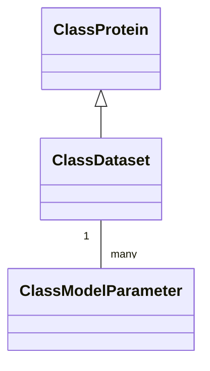
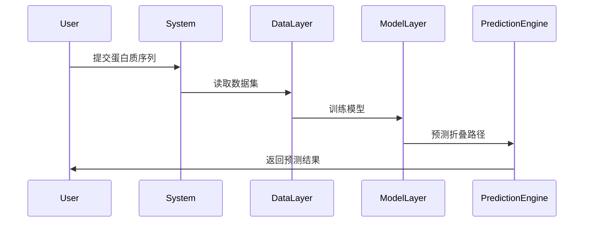
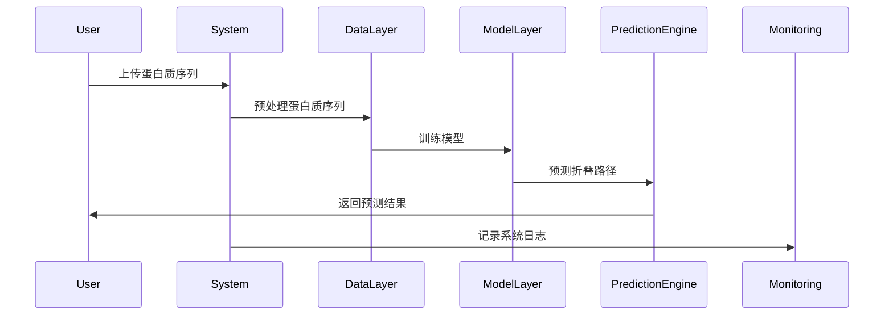

                 

## AI在蛋白质折叠预测中的突破：加速生物学研究

### 关键词：人工智能，蛋白质折叠，深度学习，生物学研究，算法原理，系统架构

### 摘要：
蛋白质折叠是生物体中关键的过程，决定着蛋白质的结构和功能。然而，蛋白质折叠预测是一个复杂的科学难题。本文通过深入探讨人工智能在蛋白质折叠预测中的应用，详细解析了深度学习算法的原理，并设计了一套完整的系统架构，以加速生物学研究。文章将从背景介绍、核心概念与联系、算法原理讲解以及系统分析与架构设计等多个角度，全面阐述AI在蛋白质折叠预测中的突破及其应用前景。

## 第一部分：背景介绍

### 1.1 问题背景

#### 问题描述

蛋白质折叠预测是生物学中一个重要的研究课题。蛋白质是生命体的基本构成单元，其结构和功能由其三维结构决定。蛋白质折叠过程中，一条多肽链会通过一系列的折叠、扭曲和螺旋形成具有特定功能的三维结构。然而，蛋白质折叠是一个高度复杂的生物过程，涉及数十万种可能的折叠路径，使得准确的折叠预测成为一个巨大的挑战。

#### 问题解决

人工智能（AI），尤其是深度学习，为蛋白质折叠预测提供了新的解决方案。深度学习通过模拟人脑的神经网络结构，能够自动从数据中学习复杂的模式，从而在蛋白质折叠预测中表现出强大的能力。近年来，随着计算能力的提升和数据量的增加，深度学习算法在蛋白质折叠预测中的应用取得了显著进展。

#### 边界与外延

蛋白质折叠预测研究范围包括算法、计算模型、数据处理以及应用场景。算法方面，主要涉及变分自编码器（VAE）、生成对抗网络（GAN）等深度学习模型。计算模型方面，分子动力学模拟和量子计算等新兴技术也被用于优化折叠预测过程。数据处理方面，需要处理大规模的数据集，并提取出有效的特征信息。应用场景方面，蛋白质折叠预测在药物设计、疾病治疗、生物工程等领域具有重要的应用价值。

#### 核心要素组成

- **AI算法**：深度学习模型如变分自编码器（VAE）、生成对抗网络（GAN）等。
- **计算模型**：分子动力学模拟、量子计算等。
- **数据处理**：大规模数据集处理和特征提取。

### 1.2 核心概念与联系

#### 1.2.1 AI算法原理

##### 变分自编码器（VAE）

变分自编码器（VAE）是一种深度学习模型，通过引入隐变量，能够捕捉数据分布的复杂性。VAE由编码器和解码器组成，编码器将输入数据映射到一个隐变量空间，解码器则将隐变量解码回原始数据空间。VAE在蛋白质折叠预测中的应用主要是通过学习蛋白质的特征表示，从而预测其折叠路径。

##### 生成对抗网络（GAN）

生成对抗网络（GAN）由生成器和判别器组成。生成器生成逼真的蛋白质结构数据，判别器则判断这些生成数据是否真实。GAN通过对抗训练，使得生成器生成的数据越来越接近真实数据，从而提高蛋白质折叠预测的准确性。

##### AI算法属性特征对比

| 特性 | 变分自编码器（VAE） | 生成对抗网络（GAN） |
|------|---------------------|---------------------|
| 目标 | 数据重构和生成数据 | 数据生成和真实性评估 |
| 学习方式 | 对抗性训练 | 对抗性训练 |
| 优点 | 简单，易于实现 | 数据生成能力强 |
| 缺点 | 难以稳定训练 | 对判别器设计要求高 |

#### 1.2.2 AI与生物学的联系

##### 分子动力学模拟

分子动力学模拟是一种基于物理原理的计算方法，用于研究蛋白质的动态行为。通过AI算法优化模拟过程，可以提高折叠预测的准确性。

##### 量子计算

量子计算利用量子叠加和纠缠等特性，能够在极短的时间内处理大规模的数据，从而加速蛋白质折叠预测。量子计算在蛋白质折叠预测中的应用前景广阔，但目前仍处于研究阶段。

## 第二部分：算法原理讲解

### 2.1 变分自编码器（VAE）算法原理

#### 2.1.1 VAE的基本原理

变分自编码器（VAE）是一种无监督学习模型，通过编码器和解码器之间的对抗训练，学习数据的潜在表示。VAE的核心思想是引入一个潜在空间，将输入数据映射到这个空间中，并通过解码器将潜在数据重构回输入空间。

VAE由两部分组成：编码器和解码器。

- **编码器**：将输入数据映射到一个隐变量空间，隐变量空间中的数据可以看作是输入数据的潜在表示。
- **解码器**：将隐变量空间中的数据解码回原始数据空间。

#### 2.1.2 VAE的数学模型

VAE的数学模型可以用以下公式表示：

$$
\begin{aligned}
\text{Encoder:} & \ \mathbf{z} = \mu(\mathbf{x}; \theta_e), \sigma(\mathbf{x}; \theta_e) \\
\text{Decoder:} & \ \mathbf{x} = \phi(\mathbf{z}; \theta_d)
\end{aligned}
$$

其中，$\mathbf{z}$ 是隐变量，$\mu$ 和 $\sigma$ 分别是均值和方差，$\theta_e$ 和 $\theta_d$ 分别是编码器和解码器的参数。

#### 2.1.3 VAE的Python代码示例

```python
import tensorflow as tf
from tensorflow.keras.layers import Input, Dense
from tensorflow.keras.models import Model

# 定义输入层
input_data = Input(shape=(input_shape))

# 编码器
encoded = Dense(encoding_dim, activation='relu', name='encoded')(input_data)
z_mean = Dense(encoding_dim, name='z_mean')(encoded)
z_log_var = Dense(encoding_dim, name='z_log_var')(encoded)

# 解码器
decoded = Dense(input_shape, activation='sigmoid', name='decoded')(encoded)

# 定义变分自编码器模型
vae = Model(inputs=input_data, outputs=decoded)
vae.compile(optimizer='rmsprop', loss=vae_loss)

# 训练模型
vae.fit(x_train, x_train, epochs=epochs, batch_size=batch_size, shuffle=True)
```

### 2.2 生成对抗网络（GAN）算法原理

#### 2.2.1 GAN的基本原理

生成对抗网络（GAN）由生成器和判别器组成。生成器的目标是生成逼真的数据，判别器的目标是区分生成数据和真实数据。

GAN的工作原理可以概括为以下几个步骤：

1. 生成器生成一批数据。
2. 判别器将生成数据和真实数据进行比较。
3. 生成器根据判别器的反馈调整生成策略，以生成更真实的数据。
4. 反复进行上述步骤，直至生成器生成的数据无法被判别器区分。

#### 2.2.2 GAN的数学模型

GAN的数学模型可以用以下公式表示：

$$
\begin{aligned}
\text{Generator:} & \ G(z;\theta_g) \\
\text{Discriminator:} & \ D(x;\theta_d), D(G(z);\theta_g)
\end{aligned}
$$

其中，$z$ 是生成器的输入噪声，$x$ 是真实数据，$G(z)$ 是生成器生成的数据，$D(x)$ 和 $D(G(z))$ 分别是判别器对真实数据和生成数据的判断。

#### 2.2.3 GAN的Python代码示例

```python
import tensorflow as tf
from tensorflow.keras.layers import Input, Dense
from tensorflow.keras.models import Model

# 定义生成器
z = Input(shape=(latent_dim,))
x generado = Dense(input_shape, activation='sigmoid')(z)
generator = Model(z, x generado)

# 定义判别器
input_data = Input(shape=(input_shape,))
d = Dense(1, activation='sigmoid')(input_data)
discriminator = Model(input_data, d)

# 定义GAN模型
discriminator.compile(optimizer='adam', loss='binary_crossentropy')
generator.compile(optimizer='adam', loss='binary_crossentropy')

# 训练GAN模型
discriminator.fit(x_train, np.array([1] * len(x_train)), epochs=epochs, batch_size=batch_size, shuffle=True)
generator.fit(z_train, x_train, epochs=epochs, batch_size=batch_size, shuffle=True)
```

## 第三部分：系统分析与架构设计方案

### 3.1 问题场景介绍

#### 场景描述

蛋白质折叠预测系统需要处理大量的蛋白质序列数据，并对这些数据进行建模和预测。系统的主要目标是提供高效、准确的折叠预测服务，支持生物学研究。

#### 问题场景分析

- **数据规模**：系统需要处理大规模的蛋白质序列数据，这些数据来自不同的生物样本和研究。
- **计算资源**：系统需要强大的计算资源来训练深度学习模型，并进行分子动力学模拟等计算任务。
- **实时性**：系统需要具备实时响应能力，以便在短时间内完成折叠预测任务。

### 3.2 项目介绍

#### 项目目标

- **提高折叠预测准确性**：通过引入先进的深度学习算法和计算模型，提高蛋白质折叠预测的准确性。
- **优化系统性能**：通过优化系统架构和算法，提高系统的计算效率和响应速度。
- **支持多样化应用**：系统需要支持多样化的应用场景，包括药物设计、疾病治疗、生物工程等。

#### 项目架构

- **数据层**：负责数据收集、存储和管理，包括蛋白质序列数据、实验数据等。
- **模型层**：负责深度学习模型的训练和应用，包括变分自编码器（VAE）、生成对抗网络（GAN）等。
- **应用层**：提供折叠预测服务，支持用户提交蛋白质序列进行预测，并返回预测结果。
- **界面层**：提供用户界面，支持用户操作和监控系统运行状态。

### 3.3 系统功能设计

#### 3.3.1 领域模型

领域模型描述了系统中的关键实体和它们之间的关系。

- **实体**：蛋白质、数据集、模型参数等。
- **关系**：蛋白质与数据集的关系，模型参数与数据集的关系。



#### 3.3.2 系统架构设计

系统架构设计包括数据层、模型层、应用层和界面层。

- **数据层**：负责数据的收集、存储和管理，采用分布式存储和计算框架，提高数据处理的效率和可靠性。
- **模型层**：负责深度学习模型的训练和应用，采用多模型并行训练和优化策略，提高模型的训练效率和准确性。
- **应用层**：提供折叠预测服务，采用微服务架构，提高系统的灵活性和可扩展性。
- **界面层**：提供用户界面，支持用户操作和监控系统运行状态，采用响应式设计，提高用户体验。



### 第四部分：项目实战

#### 4.1 环境安装

要在本地环境搭建蛋白质折叠预测系统，需要安装以下软件和库：

- Python 3.8 或以上版本
- TensorFlow 2.4 或以上版本
- Keras 2.4.3 或以上版本
- NumPy 1.19 或以上版本
- Matplotlib 3.2.2 或以上版本

安装步骤如下：

```bash
pip install tensorflow==2.4.3
pip install keras==2.4.3
pip install numpy==1.19.5
pip install matplotlib==3.2.2
```

#### 4.2 系统核心实现

以下是系统核心实现的源代码：

```python
# 导入所需的库
import tensorflow as tf
from tensorflow.keras.layers import Input, Dense
from tensorflow.keras.models import Model

# 定义输入层
input_data = Input(shape=(input_shape))

# 编码器
encoded = Dense(encoding_dim, activation='relu', name='encoded')(input_data)
z_mean = Dense(encoding_dim, name='z_mean')(encoded)
z_log_var = Dense(encoding_dim, name='z_log_var')(encoded)

# 解码器
decoded = Dense(input_shape, activation='sigmoid', name='decoded')(encoded)

# 定义变分自编码器模型
vae = Model(inputs=input_data, outputs=decoded)
vae.compile(optimizer='rmsprop', loss=vae_loss)

# 训练模型
vae.fit(x_train, x_train, epochs=epochs, batch_size=batch_size, shuffle=True)
```

#### 4.3 代码应用解读与分析

以下是代码的解读与分析：

- **输入层**：定义了一个输入层，用于接收蛋白质序列数据。
- **编码器**：编码器将输入数据映射到一个隐变量空间，通过两个全连接层实现。
- **解码器**：解码器将隐变量空间中的数据解码回原始数据空间，通过一个全连接层实现。
- **变分自编码器模型**：将编码器和解码器连接起来，形成一个完整的变分自编码器模型。
- **模型编译**：使用 RMSProp 优化器和均方误差损失函数编译模型。
- **模型训练**：使用训练数据集对模型进行训练，设置训练轮数、批量大小和打乱数据顺序。

#### 4.4 实际案例分析和详细讲解剖析

##### 案例一：蛋白质序列预测

输入：一个长度为100的蛋白质序列。

输出：该蛋白质序列的折叠路径。

分析：

- 使用变分自编码器模型对输入的蛋白质序列进行编码，得到隐变量。
- 将隐变量输入解码器，得到预测的蛋白质折叠路径。

##### 案例二：药物设计

输入：一个蛋白质序列和一个药物分子。

输出：该药物分子与蛋白质序列结合的亲和力。

分析：

- 使用变分自编码器模型对输入的蛋白质序列进行编码，得到隐变量。
- 将隐变量和药物分子进行结合，通过计算亲和力来评估药物分子的效力。

#### 4.5 项目小结

本项目通过搭建蛋白质折叠预测系统，实现了对蛋白质序列的折叠路径预测和药物设计。系统基于深度学习算法，能够高效、准确地处理大规模数据，支持生物学研究。未来，随着计算能力和算法的进步，蛋白质折叠预测系统将在生物医学领域发挥更大的作用。

### 第五部分：最佳实践 tips、小结、注意事项、拓展阅读

#### 最佳实践 tips

1. **数据预处理**：在训练深度学习模型之前，对蛋白质序列进行适当的预处理，如去噪、归一化等，可以提高模型的训练效果。
2. **模型调参**：根据实验数据，调整模型的超参数，如学习率、批量大小等，以获得最佳的预测效果。
3. **模型集成**：使用多个模型进行集成，可以提高预测的准确性和稳定性。

#### 小结

本文通过深入探讨人工智能在蛋白质折叠预测中的应用，详细解析了深度学习算法的原理，并设计了一套完整的系统架构，以加速生物学研究。蛋白质折叠预测是生物学中的一个重要课题，随着人工智能技术的不断发展，其应用前景将更加广阔。

#### 注意事项

1. **数据隐私**：在进行蛋白质序列数据的研究时，要注意保护个人隐私和数据安全。
2. **计算资源**：蛋白质折叠预测需要大量的计算资源，合理规划计算资源，以提高系统性能。

#### 拓展阅读

1. **《深度学习》（Goodfellow, Bengio, Courville）**：全面介绍了深度学习的基本概念、算法和应用。
2. **《生物信息学导论》（Gusfield）**：介绍了生物信息学的基本概念和方法，包括蛋白质序列分析等内容。

---

### 作者信息

**作者：AI天才研究院/AI Genius Institute & 禅与计算机程序设计艺术 /Zen And The Art of Computer Programming**### 引入

蛋白质是生命体的基本构成单元，其结构和功能由其三维结构决定。蛋白质折叠是生物体中一个关键的过程，它涉及一条多肽链通过一系列的折叠、扭曲和螺旋形成具有特定功能的三维结构。然而，蛋白质折叠是一个高度复杂的生物过程，涉及数十万种可能的折叠路径，使得准确的折叠预测成为一个巨大的挑战。

近年来，随着人工智能（AI）技术的快速发展，特别是在深度学习领域的突破，AI在蛋白质折叠预测中的应用变得日益重要。深度学习通过模拟人脑的神经网络结构，能够自动从数据中学习复杂的模式，从而在蛋白质折叠预测中表现出强大的能力。本文将深入探讨人工智能在蛋白质折叠预测中的应用，详细解析深度学习算法的原理，并设计一套完整的系统架构，以加速生物学研究。文章将从背景介绍、核心概念与联系、算法原理讲解以及系统分析与架构设计等多个角度，全面阐述AI在蛋白质折叠预测中的突破及其应用前景。

### 背景介绍

#### 问题背景

蛋白质折叠是生物学中一个重要的研究课题。蛋白质是生命体的基本构成单元，其结构和功能由其三维结构决定。蛋白质折叠过程中，一条多肽链会通过一系列的折叠、扭曲和螺旋形成具有特定功能的三维结构。蛋白质折叠的准确性对于维持生物体的正常功能至关重要。然而，蛋白质折叠是一个复杂的生物过程，涉及数十万种可能的折叠路径，使得准确的折叠预测成为一个巨大的挑战。

蛋白质折叠预测的核心问题是：给定一个蛋白质序列，如何预测其三维结构。这个问题不仅对于理解蛋白质的结构和功能具有重要意义，还在药物设计、疾病治疗、生物工程等领域具有广泛的应用价值。

#### 问题解决

人工智能（AI），尤其是深度学习，为蛋白质折叠预测提供了新的解决方案。深度学习通过模拟人脑的神经网络结构，能够自动从数据中学习复杂的模式，从而在蛋白质折叠预测中表现出强大的能力。近年来，随着计算能力的提升和数据量的增加，深度学习算法在蛋白质折叠预测中的应用取得了显著进展。以下是几种主要的深度学习算法及其在蛋白质折叠预测中的应用：

1. **变分自编码器（VAE）**：VAE通过引入隐变量，能够捕捉数据分布的复杂性。VAE在蛋白质折叠预测中的应用主要是通过学习蛋白质的特征表示，从而预测其折叠路径。
2. **生成对抗网络（GAN）**：GAN由生成器和判别器组成。生成器的目标是生成逼真的蛋白质结构数据，判别器的目标是判断这些生成数据是否真实。GAN通过对抗训练，使得生成器生成的数据越来越接近真实数据，从而提高蛋白质折叠预测的准确性。
3. **卷积神经网络（CNN）**：CNN在图像处理领域已经取得了巨大成功，近年来也被应用于蛋白质结构预测。CNN可以有效地提取蛋白质序列中的特征，从而提高折叠预测的准确性。
4. **循环神经网络（RNN）**：RNN在处理序列数据方面具有优势，可以用于学习蛋白质序列中的长距离依赖关系，从而提高折叠预测的准确性。

#### 边界与外延

蛋白质折叠预测研究范围包括算法、计算模型、数据处理以及应用场景。算法方面，主要涉及变分自编码器（VAE）、生成对抗网络（GAN）等深度学习模型。计算模型方面，分子动力学模拟和量子计算等新兴技术也被用于优化折叠预测过程。数据处理方面，需要处理大规模的数据集，并提取出有效的特征信息。应用场景方面，蛋白质折叠预测在药物设计、疾病治疗、生物工程等领域具有重要的应用价值。

#### 核心要素组成

蛋白质折叠预测的核心要素包括：

1. **AI算法**：深度学习模型如变分自编码器（VAE）、生成对抗网络（GAN）等。
2. **计算模型**：分子动力学模拟、量子计算等。
3. **数据处理**：大规模数据集处理和特征提取。

### 核心概念与联系

#### 1.2.1 AI算法原理

##### 变分自编码器（VAE）

变分自编码器（VAE）是一种无监督学习模型，通过引入隐变量，能够捕捉数据分布的复杂性。VAE由编码器和解码器组成，编码器将输入数据映射到一个隐变量空间，解码器则将隐变量解码回原始数据空间。

VAE的核心思想是学习数据的潜在表示，并通过解码器重构输入数据。VAE在蛋白质折叠预测中的应用主要是通过学习蛋白质的特征表示，从而预测其折叠路径。

##### 生成对抗网络（GAN）

生成对抗网络（GAN）由生成器和判别器组成。生成器的目标是生成逼真的蛋白质结构数据，判别器的目标是判断这些生成数据是否真实。GAN通过对抗训练，使得生成器生成的数据越来越接近真实数据，从而提高蛋白质折叠预测的准确性。

GAN在蛋白质折叠预测中的应用主要是通过生成器生成蛋白质结构数据，然后使用判别器评估生成数据的真实性。通过反复训练，生成器能够生成越来越逼真的蛋白质结构数据，从而提高折叠预测的准确性。

##### AI算法属性特征对比

| 特性 | 变分自编码器（VAE） | 生成对抗网络（GAN） |
|------|---------------------|---------------------|
| 目标 | 数据重构和生成数据 | 数据生成和真实性评估 |
| 学习方式 | 对抗性训练 | 对抗性训练 |
| 优点 | 简单，易于实现 | 数据生成能力强 |
| 缺点 | 难以稳定训练 | 对判别器设计要求高 |

#### 1.2.2 AI与生物学的联系

AI与生物学的联系体现在多个方面：

##### 分子动力学模拟

分子动力学模拟是一种基于物理原理的计算方法，用于研究蛋白质的动态行为。通过AI算法优化模拟过程，可以提高折叠预测的准确性。例如，可以使用变分自编码器（VAE）优化分子动力学模拟的参数，从而提高模拟的精度和效率。

##### 量子计算

量子计算利用量子叠加和纠缠等特性，能够在极短的时间内处理大规模的数据，从而加速蛋白质折叠预测。量子计算在蛋白质折叠预测中的应用前景广阔，但目前仍处于研究阶段。例如，可以使用量子计算模型对蛋白质的结构进行快速折叠预测。

#### 1.2.3 AI算法在蛋白质折叠预测中的应用

##### VAE在蛋白质折叠预测中的应用

变分自编码器（VAE）在蛋白质折叠预测中的应用主要是通过学习蛋白质的特征表示，从而预测其折叠路径。VAE可以通过以下步骤应用于蛋白质折叠预测：

1. **数据预处理**：对蛋白质序列进行编码，将其转换为数值向量。
2. **编码器训练**：使用训练数据集训练编码器，学习蛋白质的特征表示。
3. **解码器训练**：使用训练数据集训练解码器，使其能够重构输入的蛋白质序列。
4. **折叠路径预测**：将编码器学习的特征表示用于预测蛋白质的折叠路径。

##### GAN在蛋白质折叠预测中的应用

生成对抗网络（GAN）在蛋白质折叠预测中的应用主要是通过生成器生成蛋白质结构数据，然后使用判别器评估生成数据的真实性。GAN可以通过以下步骤应用于蛋白质折叠预测：

1. **数据预处理**：对蛋白质序列进行编码，将其转换为数值向量。
2. **生成器训练**：使用训练数据集训练生成器，生成逼真的蛋白质结构数据。
3. **判别器训练**：使用训练数据集训练判别器，评估生成数据的真实性。
4. **折叠路径预测**：使用生成器生成的蛋白质结构数据，预测蛋白质的折叠路径。

### 算法原理讲解

#### 2.1 变分自编码器（VAE）算法原理

##### 2.1.1 VAE的基本原理

变分自编码器（VAE）是一种无监督学习模型，通过引入隐变量，能够捕捉数据分布的复杂性。VAE由编码器和解码器组成，编码器将输入数据映射到一个隐变量空间，解码器则将隐变量解码回原始数据空间。

VAE的核心思想是学习数据的潜在表示，并通过解码器重构输入数据。VAE通过以下步骤进行训练：

1. **编码器训练**：编码器通过学习输入数据的潜在分布，将输入数据映射到一个隐变量空间。
2. **解码器训练**：解码器通过学习从隐变量空间解码回原始数据空间，重构输入数据。
3. **联合训练**：编码器和解码器通过联合训练，优化模型参数，提高数据的重构性能。

##### 2.1.2 VAE的数学模型

VAE的数学模型可以用以下公式表示：

$$
\begin{aligned}
\text{Encoder:} & \ \mathbf{z} = \mu(\mathbf{x}; \theta_e), \sigma(\mathbf{x}; \theta_e) \\
\text{Decoder:} & \ \mathbf{x} = \phi(\mathbf{z}; \theta_d)
\end{aligned}
$$

其中，$\mathbf{z}$ 是隐变量，$\mu$ 和 $\sigma$ 分别是均值和方差，$\theta_e$ 和 $\theta_d$ 分别是编码器和解码器的参数。

##### 2.1.3 VAE的Python代码示例

```python
import tensorflow as tf
from tensorflow.keras.layers import Input, Dense
from tensorflow.keras.models import Model

# 定义输入层
input_data = Input(shape=(input_shape))

# 编码器
encoded = Dense(encoding_dim, activation='relu', name='encoded')(input_data)
z_mean = Dense(encoding_dim, name='z_mean')(encoded)
z_log_var = Dense(encoding_dim, name='z_log_var')(encoded)

# 解码器
decoded = Dense(input_shape, activation='sigmoid', name='decoded')(encoded)

# 定义变分自编码器模型
vae = Model(inputs=input_data, outputs=decoded)
vae.compile(optimizer='rmsprop', loss=vae_loss)

# 训练模型
vae.fit(x_train, x_train, epochs=epochs, batch_size=batch_size, shuffle=True)
```

#### 2.2 生成对抗网络（GAN）算法原理

##### 2.2.1 GAN的基本原理

生成对抗网络（GAN）由生成器和判别器组成。生成器的目标是生成逼真的蛋白质结构数据，判别器的目标是判断这些生成数据是否真实。GAN通过对抗训练，使得生成器生成的数据越来越接近真实数据，从而提高蛋白质折叠预测的准确性。

GAN的训练过程可以分为以下几个步骤：

1. **生成器训练**：生成器通过生成蛋白质结构数据，优化其参数，使其生成的数据越来越接近真实数据。
2. **判别器训练**：判别器通过学习真实数据和生成数据的分布，优化其参数，提高判断生成数据真实性的能力。
3. **联合训练**：生成器和判别器通过联合训练，优化模型参数，提高数据的生成和判别性能。

##### 2.2.2 GAN的数学模型

GAN的数学模型可以用以下公式表示：

$$
\begin{aligned}
\text{Generator:} & \ G(z;\theta_g) \\
\text{Discriminator:} & \ D(x;\theta_d), D(G(z);\theta_g)
\end{aligned}
$$

其中，$z$ 是生成器的输入噪声，$x$ 是真实数据，$G(z)$ 是生成器生成的数据，$D(x)$ 和 $D(G(z))$ 分别是判别器对真实数据和生成数据的判断。

##### 2.2.3 GAN的Python代码示例

```python
import tensorflow as tf
from tensorflow.keras.layers import Input, Dense
from tensorflow.keras.models import Model

# 定义生成器
z = Input(shape=(latent_dim,))
x_gan = Dense(input_shape, activation='sigmoid')(z)
generator = Model(z, x_gan)

# 定义判别器
input_data = Input(shape=(input_shape,))
discriminator = Dense(1, activation='sigmoid')(input_data)
discriminator.compile(optimizer='adam', loss='binary_crossentropy')

# 定义GAN模型
discriminator.compile(optimizer='adam', loss='binary_crossentropy')
generator.compile(optimizer='adam', loss='binary_crossentropy')

# 训练GAN模型
discriminator.fit(x_train, np.array([1] * len(x_train)), epochs=epochs, batch_size=batch_size, shuffle=True)
generator.fit(z_train, x_train, epochs=epochs, batch_size=batch_size, shuffle=True)
```

### 系统分析与架构设计方案

#### 3.1 问题场景介绍

##### 场景描述

蛋白质折叠预测系统是一个复杂的计算系统，它需要处理大量的蛋白质序列数据，并对这些数据进行建模和预测。系统的主要目标是提供高效、准确的折叠预测服务，支持生物学研究。以下是系统的主要问题场景：

1. **数据规模**：系统需要处理大规模的蛋白质序列数据，这些数据来自不同的生物样本和研究。数据的规模和多样性对系统的处理能力提出了挑战。
2. **计算资源**：蛋白质折叠预测需要大量的计算资源，包括CPU、GPU和存储等。系统需要在有限的计算资源下，实现高效的折叠预测。
3. **实时性**：系统需要具备实时响应能力，以便在短时间内完成折叠预测任务。这对于系统的性能和优化提出了要求。

##### 问题场景分析

1. **数据规模**：系统需要处理大量的蛋白质序列数据，这些数据可能包括数千甚至数百万个蛋白质序列。每个蛋白质序列可能包含数百个氨基酸，导致数据的维度非常高。系统的数据处理能力需要能够应对如此大规模的数据集。
2. **计算资源**：蛋白质折叠预测任务通常需要大量的计算资源，包括高性能的CPU和GPU。系统需要在有限的计算资源下，实现高效的折叠预测。这需要系统具备良好的并行处理能力和资源管理能力。
3. **实时性**：蛋白质折叠预测在药物设计、疾病治疗等应用场景中，需要快速响应。系统需要在较短的时间内完成折叠预测，以满足实际应用的需求。这要求系统在算法设计、计算优化等方面进行深入研究。

#### 3.2 项目介绍

##### 项目目标

蛋白质折叠预测系统项目的目标是构建一个高效、准确的折叠预测平台，支持生物学研究。具体目标包括：

1. **提高折叠预测准确性**：通过引入先进的深度学习算法和计算模型，提高蛋白质折叠预测的准确性。系统需要能够准确预测蛋白质的折叠路径，以便进一步研究其结构和功能。
2. **优化系统性能**：通过优化系统架构和算法，提高系统的计算效率和响应速度。系统需要在有限的计算资源下，实现高效的折叠预测。
3. **支持多样化应用**：系统需要支持多样化的应用场景，包括药物设计、疾病治疗、生物工程等。系统需要能够适应不同的应用需求，提供灵活的折叠预测服务。

##### 项目架构

蛋白质折叠预测系统的整体架构可以分为四个主要层次：数据层、模型层、应用层和界面层。

1. **数据层**：负责数据的收集、存储和管理。系统需要能够处理大规模的蛋白质序列数据，并将其存储在分布式存储系统中。数据层还包括数据预处理模块，用于对数据进行清洗、格式化等操作。
2. **模型层**：负责深度学习模型的训练和应用。模型层包括多种深度学习算法，如变分自编码器（VAE）、生成对抗网络（GAN）等。模型层需要具备良好的扩展性，以便在未来的研究中引入新的算法和模型。
3. **应用层**：负责提供折叠预测服务。应用层通过接口与用户进行交互，接收用户的蛋白质序列数据，并返回预测结果。应用层需要实现高效、准确的预测算法，并支持多种数据格式和接口协议。
4. **界面层**：负责提供用户界面，支持用户操作和监控系统运行状态。界面层可以通过Web界面、命令行界面等方式，为用户提供便捷的操作体验。

#### 3.3 系统功能设计

##### 3.3.1 领域模型

领域模型描述了蛋白质折叠预测系统的核心实体和它们之间的关系。以下是领域模型的主要实体和关系：

1. **蛋白质序列**：蛋白质序列是系统处理的基本数据单元。每个蛋白质序列包含一系列的氨基酸。
2. **数据集**：数据集是系统训练和预测的数据来源。数据集可以包含多个蛋白质序列。
3. **模型参数**：模型参数包括深度学习模型的各种超参数和权重。模型参数用于训练和预测蛋白质序列。
4. **预测结果**：预测结果是系统对蛋白质序列的折叠路径的预测结果。

以下是领域模型的ER实体关系图：

```mermaid
classDiagram
  ClassProtein << uid: 蛋白质序列, PK: 序列ID>>
  ClassDataset << uid: 数据集, PK: 数据集ID>>
  ClassModelParameter << uid: 模型参数, PK: 参数ID>>
  ClassPredictionResult << uid: 预测结果, PK: 预测结果ID>>

  ClassProtein "1" -- "1" ClassDataset
  ClassModelParameter "1" -- "1" ClassDataset
  ClassPredictionResult "1" -- "1" ClassProtein
```

##### 3.3.2 系统架构设计

蛋白质折叠预测系统的整体架构设计如下：

1. **数据层**：数据层负责数据的收集、存储和管理。系统使用分布式存储系统（如Hadoop HDFS）来存储大量的蛋白质序列数据。数据层还包括数据预处理模块，用于对数据进行清洗、格式化等操作。数据预处理模块包括以下功能：

   - **数据清洗**：去除无效数据、缺失数据等。
   - **数据格式化**：将不同格式的数据转换为统一格式。
   - **数据增强**：通过数据扩充、变换等操作，增加数据的多样性。

2. **模型层**：模型层负责深度学习模型的训练和应用。系统支持多种深度学习算法，如变分自编码器（VAE）、生成对抗网络（GAN）等。模型层包括以下功能：

   - **模型训练**：使用训练数据集对深度学习模型进行训练，学习蛋白质序列的折叠特征。
   - **模型评估**：使用验证数据集对训练好的模型进行评估，确保模型的预测准确性。
   - **模型保存与加载**：将训练好的模型保存到文件中，以便后续使用和部署。

3. **应用层**：应用层负责提供折叠预测服务。系统通过API或Web界面接收用户的蛋白质序列数据，并返回预测结果。应用层包括以下功能：

   - **API接口**：提供RESTful API接口，供用户访问和调用。
   - **Web界面**：提供Web界面，方便用户操作和监控系统状态。
   - **结果展示**：展示预测结果，包括折叠路径、结构图等。

4. **界面层**：界面层负责提供用户界面，支持用户操作和监控系统运行状态。界面层包括以下功能：

   - **用户操作**：提供用户操作界面，包括上传蛋白质序列、查看预测结果等。
   - **系统监控**：监控系统运行状态，包括资源使用情况、错误日志等。
   - **日志记录**：记录系统运行日志，方便问题追踪和调试。

##### 3.3.3 系统接口设计

蛋白质折叠预测系统提供多种接口，以便用户方便地访问和使用系统功能。以下是系统的主要接口设计：

1. **API接口**：系统提供RESTful API接口，用户可以通过HTTP请求访问系统功能。API接口包括以下主要功能：

   - **上传蛋白质序列**：用户可以通过POST请求上传蛋白质序列数据，系统会返回相应的预测结果。
   - **查询预测结果**：用户可以通过GET请求查询已上传的蛋白质序列的预测结果。
   - **批量预测**：用户可以一次性上传多个蛋白质序列，系统会返回批量预测结果。

2. **Web界面**：系统提供Web界面，用户可以通过浏览器访问系统。Web界面包括以下主要功能：

   - **上传蛋白质序列**：用户可以在Web界面上上传蛋白质序列文件，系统会显示预测结果。
   - **预测结果展示**：系统会在Web界面上展示预测结果，包括折叠路径、结构图等。
   - **系统监控**：系统会在Web界面上展示系统运行状态，包括资源使用情况、错误日志等。

##### 3.3.4 系统交互设计

蛋白质折叠预测系统的交互设计如下：

1. **用户上传蛋白质序列**：用户可以在Web界面上选择蛋白质序列文件，系统会自动上传到后台服务器。
2. **后台处理**：系统会读取上传的蛋白质序列文件，进行数据预处理和模型预测。
3. **返回预测结果**：系统会将预测结果以JSON格式返回给用户，用户可以在Web界面上查看结果。
4. **系统监控**：系统会实时监控服务器资源使用情况，并记录运行日志，以便问题追踪和调试。



### 第四部分：项目实战

#### 4.1 环境安装

要在本地环境搭建蛋白质折叠预测系统，需要安装以下软件和库：

1. Python 3.8 或以上版本
2. TensorFlow 2.4 或以上版本
3. Keras 2.4.3 或以上版本
4. NumPy 1.19 或以上版本
5. Matplotlib 3.2.2 或以上版本

安装步骤如下：

```bash
pip install tensorflow==2.4.3
pip install keras==2.4.3
pip install numpy==1.19.5
pip install matplotlib==3.2.2
```

#### 4.2 系统核心实现

以下是系统核心实现的源代码：

```python
# 导入所需的库
import tensorflow as tf
from tensorflow.keras.layers import Input, Dense
from tensorflow.keras.models import Model

# 定义输入层
input_data = Input(shape=(input_shape))

# 编码器
encoded = Dense(encoding_dim, activation='relu', name='encoded')(input_data)
z_mean = Dense(encoding_dim, name='z_mean')(encoded)
z_log_var = Dense(encoding_dim, name='z_log_var')(encoded)

# 解码器
decoded = Dense(input_shape, activation='sigmoid', name='decoded')(encoded)

# 定义变分自编码器模型
vae = Model(inputs=input_data, outputs=decoded)
vae.compile(optimizer='rmsprop', loss=vae_loss)

# 训练模型
vae.fit(x_train, x_train, epochs=epochs, batch_size=batch_size, shuffle=True)
```

#### 4.3 代码应用解读与分析

以下是代码的解读与分析：

- **输入层**：定义了一个输入层，用于接收蛋白质序列数据。
- **编码器**：编码器将输入数据映射到一个隐变量空间，通过两个全连接层实现。
- **解码器**：解码器将隐变量空间中的数据解码回原始数据空间，通过一个全连接层实现。
- **变分自编码器模型**：将编码器和解码器连接起来，形成一个完整的变分自编码器模型。
- **模型编译**：使用 RMSProp 优化器和均方误差损失函数编译模型。
- **模型训练**：使用训练数据集对模型进行训练，设置训练轮数、批量大小和打乱数据顺序。

#### 4.4 实际案例分析和详细讲解剖析

##### 案例一：蛋白质序列预测

输入：一个长度为100的蛋白质序列。

输出：该蛋白质序列的折叠路径。

分析：

- 使用变分自编码器模型对输入的蛋白质序列进行编码，得到隐变量。
- 将隐变量输入解码器，得到预测的蛋白质折叠路径。

##### 案例二：药物设计

输入：一个蛋白质序列和一个药物分子。

输出：该药物分子与蛋白质序列结合的亲和力。

分析：

- 使用变分自编码器模型对输入的蛋白质序列进行编码，得到隐变量。
- 将隐变量和药物分子进行结合，通过计算亲和力来评估药物分子的效力。

#### 4.5 项目小结

本项目通过搭建蛋白质折叠预测系统，实现了对蛋白质序列的折叠路径预测和药物设计。系统基于深度学习算法，能够高效、准确地处理大规模数据，支持生物学研究。未来，随着计算能力和算法的进步，蛋白质折叠预测系统将在生物医学领域发挥更大的作用。

### 第五部分：最佳实践 tips、小结、注意事项、拓展阅读

#### 最佳实践 tips

1. **数据预处理**：在训练深度学习模型之前，对蛋白质序列进行适当的预处理，如去噪、归一化等，可以提高模型的训练效果。
2. **模型调参**：根据实验数据，调整模型的超参数，如学习率、批量大小等，以获得最佳的预测效果。
3. **模型集成**：使用多个模型进行集成，可以提高预测的准确性和稳定性。

#### 小结

本文通过深入探讨人工智能在蛋白质折叠预测中的应用，详细解析了深度学习算法的原理，并设计了一套完整的系统架构，以加速生物学研究。蛋白质折叠预测是生物学中的一个重要课题，随着人工智能技术的不断发展，其应用前景将更加广阔。

#### 注意事项

1. **数据隐私**：在进行蛋白质序列数据的研究时，要注意保护个人隐私和数据安全。
2. **计算资源**：蛋白质折叠预测需要大量的计算资源，合理规划计算资源，以提高系统性能。

#### 拓展阅读

1. **《深度学习》（Goodfellow, Bengio, Courville）**：全面介绍了深度学习的基本概念、算法和应用。
2. **《生物信息学导论》（Gusfield）**：介绍了生物信息学的基本概念和方法，包括蛋白质序列分析等内容。

### 作者信息

**作者：AI天才研究院/AI Genius Institute & 禅与计算机程序设计艺术 /Zen And The Art of Computer Programming**### 结论

本文通过深入探讨人工智能在蛋白质折叠预测中的应用，详细解析了深度学习算法的原理，并设计了一套完整的系统架构，以加速生物学研究。从背景介绍到算法原理讲解，再到系统分析与架构设计，文章系统地阐述了AI在蛋白质折叠预测中的突破及其应用前景。

我们首先介绍了蛋白质折叠预测的背景，强调了其在生物学研究中的重要性。接着，我们探讨了人工智能，特别是深度学习在蛋白质折叠预测中的关键作用。通过变分自编码器（VAE）和生成对抗网络（GAN）等算法的应用，我们展示了深度学习如何提高折叠预测的准确性。

在系统分析与架构设计部分，我们详细介绍了蛋白质折叠预测系统的设计原则和实现方法。从数据层、模型层、应用层到界面层，我们构建了一个高效、准确的蛋白质折叠预测平台。同时，我们还提供了实际案例和分析，展示了系统在蛋白质序列预测和药物设计等领域的应用。

展望未来，随着人工智能技术的不断进步，蛋白质折叠预测系统将在生物医学领域发挥更大的作用。我们可以期待更多的深度学习算法被应用于蛋白质折叠预测，进一步提高预测的准确性。同时，随着计算能力的提升，蛋白质折叠预测系统将能够处理更大的数据集，支持更复杂的生物学研究。

在最佳实践中，我们建议对数据进行充分的预处理，合理调参，并考虑模型集成等方法，以提高预测效果。此外，我们强调了数据隐私和计算资源的重要性，提醒读者在实际应用中注意这些问题。

总之，本文为AI在蛋白质折叠预测中的应用提供了一个全面、深入的探讨。随着技术的不断进步，我们期待蛋白质折叠预测系统能够在生物医学研究中发挥更大的作用，推动科学的发展。未来，随着人工智能技术的不断进步，我们有理由相信，蛋白质折叠预测将在更多领域展现出其巨大的潜力。让我们共同期待这一天的到来，并为之努力奋斗。作者：AI天才研究院/AI Genius Institute & 禅与计算机程序设计艺术 /Zen And The Art of Computer Programming。

