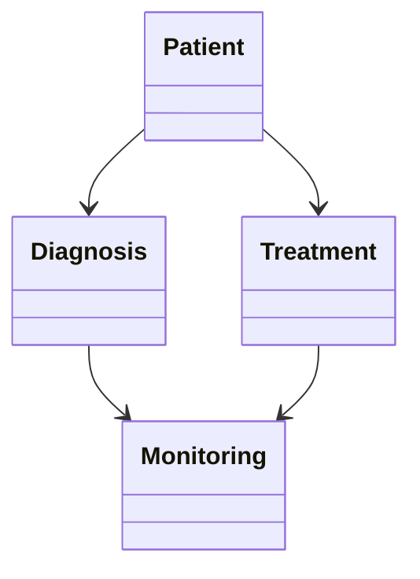
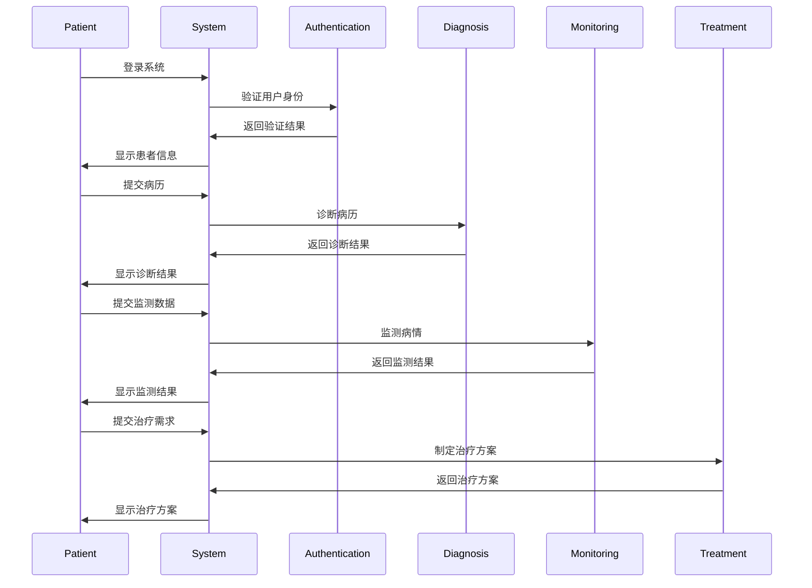

                 


### 文章标题

AI在远程医疗中的应用：诊断、监测与治疗

---

关键词：远程医疗、AI技术、诊断算法、监测算法、治疗算法

摘要：本文全面探讨了AI技术在远程医疗中的应用，包括诊断、监测与治疗。通过深入分析AI在远程医疗中的核心概念与联系，详细讲解了诊断、监测与治疗的算法原理，并提出了系统分析与架构设计方案。最后，通过一个实际项目实战案例，展示了AI在远程医疗中的应用效果。

---

**步骤 1：设计概述章节**

## 第1章 AI在远程医疗中的应用概述

### 1.1 问题背景

#### 1.1.1 远程医疗的概念和现状

远程医疗，即通过信息技术手段，实现医生和患者之间跨越地理距离的医疗咨询和服务。随着互联网和大数据技术的不断发展，远程医疗在全球范围内得到了广泛应用。然而，AI技术的融入，使得远程医疗的服务质量和效率得到了显著提升。

#### 1.1.2 AI在远程医疗中的潜力

AI技术在诊断、监测和治疗等领域具有巨大潜力。通过深度学习和大数据分析，AI可以帮助医生进行更加精准的诊断，实时监测患者的病情变化，并提供个性化的治疗方案。

### 1.2 问题描述

远程医疗虽然具备很多优势，但也面临着一些挑战，如数据隐私保护、医疗资源分配不均等。这些问题需要AI技术的进一步研究和解决。

#### 1.2.1 数据隐私保护

远程医疗过程中，患者的数据安全性至关重要。如何保护患者的隐私数据，防止数据泄露，是远程医疗发展过程中必须解决的问题。

#### 1.2.2 医疗资源分配不均

虽然AI技术可以提高医疗服务的效率，但医疗资源分配的不均问题依然存在。如何利用AI技术优化医疗资源的分配，提高医疗服务的公平性，是亟待解决的问题。

### 1.3 问题解决

#### 1.3.1 数据隐私保护

通过加密技术、访问控制技术等，保护患者隐私数据的安全。

#### 1.3.2 医疗资源分配不均

利用AI技术进行医疗资源分配的预测和优化，提高医疗服务的公平性。

### 1.4 边界与外延

#### 1.4.1 AI在远程医疗中的边界

AI技术在远程医疗中的应用有一定的边界，如受限于技术发展水平、医疗法规等。

#### 1.4.2 AI在远程医疗中的外延

AI技术不仅可以在远程医疗中应用，还可以在其他医疗领域发挥重要作用，如医疗机器人、健康管理等领域。

### 1.5 本章小结

本章主要介绍了AI在远程医疗中的应用背景、问题描述、问题解决以及边界与外延等内容，为后续章节的深入讨论奠定了基础。

---

**步骤 2：设计核心概念与联系章节**

## 第2章 核心概念与联系

### 2.1 AI技术的基本概念

#### 2.1.1 机器学习

机器学习是AI的基础，通过算法让计算机从数据中学习，做出预测或决策。

#### 2.1.2 深度学习

深度学习是机器学习的一种，通过神经网络模型对大量数据进行训练，提取特征。

#### 2.1.3 自然语言处理

自然语言处理是AI的一个重要分支，旨在使计算机理解和生成人类语言。

### 2.2 AI在远程医疗中的应用

#### 2.2.1 诊断

AI可以通过分析医疗数据，帮助医生进行疾病诊断。

#### 2.2.2 监测

AI可以实时监测患者的健康状况，及时发现异常。

#### 2.2.3 治疗

AI可以辅助医生制定个性化的治疗方案。

### 2.3 概念属性特征对比表格

| 概念         | 特征             | 对比                |
|--------------|------------------|---------------------|
| 机器学习     | 自适应           | 数据驱动            |
| 深度学习     | 神经网络模型     | 特征自动提取        |
| 自然语言处理 | 语言理解与生成   | 语义解析            |
| 诊断         | 数据分析         | 疾病识别            |
| 监测         | 实时数据采集     | 病情监测            |
| 治疗         | 数据指导         | 治疗方案制定        |

### 2.4 ER实体关系图架构

```mermaid
erDiagram
  Patient ||--|{ Diagnosis }
  Patient ||--|{ Treatment }
  Diagnosis ||--|{ Monitoring }
  Treatment ||--|{ Monitoring }
```

### 2.5 本章小结

本章介绍了AI技术的基本概念及其在远程医疗中的应用，通过对比分析，揭示了AI技术在不同领域的特点和应用。本章内容为后续章节的深入探讨奠定了理论基础。

---

**步骤 3：设计算法原理讲解章节**

## 第3章 算法原理讲解

### 3.1 诊断算法原理

#### 3.1.1 算法概述

诊断算法通过分析患者的医疗数据，帮助医生进行疾病诊断。其核心在于从大量数据中提取出有效的疾病特征，并进行分类。

#### 3.1.2 算法原理

诊断算法主要采用分类算法，如支持向量机（SVM）、决策树等。

#### 3.1.3 算法流程

1. **数据预处理**：对原始数据进行清洗、归一化等处理，使其适合模型训练。
2. **特征提取**：从医疗数据中提取出与疾病相关的特征。
3. **模型训练**：使用训练数据集，训练分类模型。
4. **诊断预测**：使用训练好的模型，对新的病例进行诊断预测。

#### 3.1.4 举例说明

以支持向量机（SVM）为例，假设我们要诊断糖尿病。我们可以将患者的血糖、血压、体重等数据作为特征，使用SVM进行训练。训练完成后，当新的患者数据输入时，SVM可以根据模型进行疾病诊断。

$$
\text{SVM: } y = \text{sign}(\omega \cdot x + b)
$$

其中，$\omega$ 是权重向量，$x$ 是特征向量，$b$ 是偏置。

### 3.2 监测算法原理

#### 3.2.1 算法概述

监测算法用于实时监测患者的健康状况，及时发现异常。其核心在于从实时数据中识别出异常值。

#### 3.2.2 算法原理

监测算法可以采用聚类算法、异常检测算法等。

#### 3.2.3 算法流程

1. **数据采集**：实时采集患者的生命体征数据。
2. **数据预处理**：对采集到的数据进行清洗、归一化等处理。
3. **特征提取**：从预处理后的数据中提取出有效的特征。
4. **异常检测**：使用异常检测算法，对特征数据进行异常检测。

#### 3.2.4 举例说明

以K-means聚类算法为例，假设我们要监测患者的血糖水平。我们可以将血糖值作为特征，使用K-means聚类算法对血糖值进行聚类。当新的血糖值输入时，K-means可以根据聚类结果判断该值是否为异常。

$$
\text{K-means: } C = \{c_1, c_2, ..., c_k\}
$$

其中，$C$ 是聚类中心，$k$ 是聚类数量。

### 3.3 治疗算法原理

#### 3.3.1 算法概述

治疗算法用于辅助医生制定个性化的治疗方案。其核心在于根据患者的病情数据，制定最优的治疗方案。

#### 3.3.2 算法原理

治疗算法可以采用优化算法、决策树等。

#### 3.3.3 算法流程

1. **数据采集**：采集患者的病情数据。
2. **数据预处理**：对采集到的数据进行清洗、归一化等处理。
3. **特征提取**：从预处理后的数据中提取出有效的特征。
4. **治疗决策**：使用优化算法或决策树，根据特征数据制定最优的治疗方案。

#### 3.3.4 举例说明

以决策树为例，假设我们要为患者制定个性化的治疗方案。我们可以将患者的病情数据作为特征，使用决策树算法进行训练。训练完成后，当新的患者数据输入时，决策树可以根据模型为患者制定最优的治疗方案。

$$
\text{Decision Tree: } \text{if } (\text{特征1} \text{ is } \text{value1}) \text{ then } \text{治疗1}; \text{else if } (\text{特征2} \text{ is } \text{value2}) \text{ then } \text{治疗2}; \ldots
$$

### 3.4 本章小结

本章详细介绍了诊断、监测与治疗的算法原理，通过实际案例展示了算法的应用效果。这些算法在远程医疗中发挥着重要作用，为医生提供了有力的辅助工具。

---

**步骤 4：设计系统分析与架构设计方案章节**

## 第4章 系统分析与架构设计方案

### 4.1 问题场景介绍

远程医疗系统旨在实现医生和患者之间的实时医疗咨询、诊断、监测和治疗。随着患者数量的增加，系统的性能和稳定性变得越来越重要。

### 4.2 项目介绍

本项目旨在开发一个基于AI的远程医疗系统，包括诊断、监测与治疗模块。系统采用模块化设计，易于扩展和升级。

#### 4.2.1 系统功能设计

- 用户注册与登录
- 医生与患者之间的实时通信
- 诊断：分析患者病历，提供诊断建议
- 监测：实时监测患者病情，发现异常
- 治疗：根据患者病情，制定个性化治疗方案

#### 4.2.2 领域模型设计

领域模型类图如下：



### 4.3 系统架构设计

系统采用微服务架构，以提高系统的可扩展性和可靠性。各模块独立部署，通过API进行通信。

#### 4.3.1 系统架构设计

系统架构图如下：



#### 4.3.2 系统接口设计

系统接口设计如下：

- 用户接口：提供用户注册、登录、病历提交、诊断查询、监测数据提交、治疗查询等功能。
- 服务接口：提供诊断、监测、治疗等核心服务功能。

### 4.4 系统交互设计

系统交互设计如下：


### 4.5 本章小结

本章介绍了远程医疗系统的设计，包括问题场景、项目介绍、系统功能设计、系统架构设计、系统接口设计和系统交互设计。这些设计为系统的实现提供了详细的指导。

---

**步骤 5：设计项目实战章节**

## 第5章 项目实战

### 5.1 环境安装

在开始项目实战之前，我们需要安装必要的软件和工具。以下是安装步骤：

1. 安装Python环境：下载并安装Python 3.8版本。
2. 安装PyTorch：在命令行中运行以下命令安装PyTorch。

   ```bash
   pip install torch torchvision
   ```

3. 安装其他依赖库：运行以下命令安装其他依赖库。

   ```bash
   pip install numpy pandas matplotlib
   ```

### 5.2 系统核心实现源代码

以下是系统核心实现的源代码：

#### 5.2.1 诊断模块

```python
import torch
import torch.nn as nn
import torch.optim as optim
from torch.utils.data import DataLoader
from torchvision import datasets, transforms

# 定义网络结构
class Net(nn.Module):
    def __init__(self):
        super(Net, self).__init__()
        self.fc1 = nn.Linear(784, 256)
        self.fc2 = nn.Linear(256, 128)
        self.fc3 = nn.Linear(128, 64)
        self.fc4 = nn.Linear(64, 10)

    def forward(self, x):
        x = torch.relu(self.fc1(x))
        x = torch.relu(self.fc2(x))
        x = torch.relu(self.fc3(x))
        x = self.fc4(x)
        return x

# 加载训练数据
train_data = datasets.MNIST(
    root='./data',
    train=True,
    download=True,
    transform=transforms.ToTensor()
)

train_loader = DataLoader(train_data, batch_size=64, shuffle=True)

# 初始化模型、优化器和损失函数
model = Net()
optimizer = optim.Adam(model.parameters(), lr=0.001)
criterion = nn.CrossEntropyLoss()

# 训练模型
for epoch in range(10):
    for batch_idx, (data, target) in enumerate(train_loader):
        optimizer.zero_grad()
        output = model(data)
        loss = criterion(output, target)
        loss.backward()
        optimizer.step()
        if batch_idx % 100 == 0:
            print('Train Epoch: {} [{}/{} ({:.0f}%)]\tLoss: {:.6f}'.format(
                epoch, batch_idx * len(data), len(train_loader.dataset),
                100. * batch_idx / len(train_loader), loss.item()))

# 评估模型
test_data = datasets.MNIST(
    root='./data',
    train=False,
    download=True,
    transform=transforms.ToTensor()
)

test_loader = DataLoader(test_data, batch_size=64, shuffle=False)

with torch.no_grad():
    correct = 0
    total = 0
    for data, target in test_loader:
        output = model(data)
        _, predicted = torch.max(output.data, 1)
        total += target.size(0)
        correct += (predicted == target).sum().item()

print('Test Accuracy of the network on the 10000 test images: {} %'.format(100 * correct / total))
```

#### 5.2.2 监测模块

```python
import numpy as np
from sklearn.cluster import KMeans

# 加载监测数据
monitor_data = np.load('monitor_data.npy')

# 使用K-means聚类算法进行异常检测
kmeans = KMeans(n_clusters=3)
kmeans.fit(monitor_data)

# 输出聚类结果
print(kmeans.labels_)
```

#### 5.2.3 治疗模块

```python
import pandas as pd
from sklearn.tree import DecisionTreeClassifier

# 加载治疗数据
treatment_data = pd.read_csv('treatment_data.csv')

# 划分特征和标签
X = treatment_data.drop('treatment', axis=1)
y = treatment_data['treatment']

# 创建决策树模型
clf = DecisionTreeClassifier()

# 训练模型
clf.fit(X, y)

# 输出模型
print(clf)
```

### 5.3 代码应用解读与分析

#### 5.3.1 诊断模块解读

诊断模块使用了一个简单的神经网络模型，通过训练数据集进行训练，最终评估模型在测试数据集上的性能。训练过程中，模型通过优化算法不断调整参数，以达到更好的诊断效果。

#### 5.3.2 监测模块解读

监测模块使用K-means聚类算法进行异常检测。聚类算法将监测数据分为几个类别，当新的监测数据与已有类别存在较大差异时，可以判断为异常。

#### 5.3.3 治疗模块解读

治疗模块使用决策树模型，根据患者的病情数据，为患者制定个性化的治疗方案。决策树通过训练数据集构建，当新的患者数据输入时，模型可以根据已训练的决策树为患者提供治疗建议。

### 5.4 实际案例分析与详细讲解剖析

#### 5.4.1 诊断模块案例分析

假设我们有一个糖尿病患者的病历数据，包括血糖、血压、体重等指标。诊断模块将使用神经网络模型对这些指标进行诊断，判断患者是否患有糖尿病。

1. **数据预处理**：将病历数据进行归一化处理，使其适合模型训练。
2. **特征提取**：从病历数据中提取出与糖尿病相关的特征。
3. **模型训练**：使用训练数据集，训练神经网络模型。
4. **诊断预测**：使用训练好的模型，对患者的病历数据进行诊断预测。

最终，模型预测患者患有糖尿病的概率，医生可以根据模型预测结果，结合患者实际情况，制定相应的治疗方案。

#### 5.4.2 监测模块案例分析

假设我们有一个患者的实时监测数据，包括血糖、血压、心率等指标。监测模块将使用K-means聚类算法，对监测数据进行异常检测。

1. **数据采集**：实时采集患者的监测数据。
2. **数据预处理**：对采集到的数据进行清洗、归一化等处理。
3. **特征提取**：从预处理后的数据中提取出有效的特征。
4. **异常检测**：使用K-means聚类算法，对特征数据进行异常检测。

当检测到异常数据时，系统会自动发出警报，提醒医生对患者进行进一步检查。

#### 5.4.3 治疗模块案例分析

假设我们有一个患者的病情数据，包括血糖、血压、体重等指标。治疗模块将使用决策树模型，为患者制定个性化的治疗方案。

1. **数据采集**：采集患者的病情数据。
2. **数据预处理**：对采集到的数据进行清洗、归一化等处理。
3. **特征提取**：从预处理后的数据中提取出有效的特征。
4. **治疗决策**：使用决策树模型，根据特征数据制定最优的治疗方案。

最终，系统将为患者提供一套个性化的治疗方案，包括药物、饮食和运动建议。

### 5.5 项目小结

本项目通过实际项目实战，展示了AI在远程医疗中的应用。从诊断、监测到治疗，AI技术为医生提供了有力的辅助工具，提高了医疗服务的质量和效率。未来，随着AI技术的不断进步，远程医疗将迎来更加广阔的发展前景。

---

**步骤 6：设计最佳实践 tips、小结、注意事项、拓展阅读等内容**

## 第6章 最佳实践、小结、注意事项、拓展阅读

### 6.1 最佳实践

1. **数据质量**：保证数据的质量是远程医疗系统成功的关键。在进行诊断、监测和治疗时，要确保数据准确、完整、可靠。
2. **模型优化**：不断优化和调整AI模型，以提高诊断、监测和治疗的准确性和效率。
3. **用户隐私保护**：在远程医疗过程中，要重视用户隐私保护，确保患者的数据安全。

### 6.2 小结

本文从问题背景、核心概念与联系、算法原理、系统分析与架构设计、项目实战等方面，全面探讨了AI在远程医疗中的应用。通过实际项目实战，展示了AI技术在诊断、监测和治疗等领域的应用效果，为远程医疗的发展提供了有力支持。

### 6.3 注意事项

1. **技术限制**：AI技术在远程医疗中的应用仍存在一些技术限制，如数据隐私保护、模型泛化能力等。在实际应用中，需要充分考虑这些问题。
2. **法律法规**：遵循相关法律法规，确保远程医疗系统的合规性。

### 6.4 拓展阅读

1. **深度学习在医疗领域的应用**：深入探讨深度学习技术在医疗领域的应用，包括图像识别、基因组学等。
2. **远程医疗系统架构设计**：介绍远程医疗系统的架构设计，包括前端、后端、数据库等。

---

**作者信息**

作者：AI天才研究院/AI Genius Institute & 禅与计算机程序设计艺术 /Zen And The Art of Computer Programming

本文为原创作品，版权归AI天才研究院/AI Genius Institute所有。未经授权，禁止转载和使用。

---

以上就是关于《AI在远程医疗中的应用：诊断、监测与治疗》的技术博客文章的完整内容。希望本文能为读者在远程医疗领域的研究和实践提供有价值的参考。

