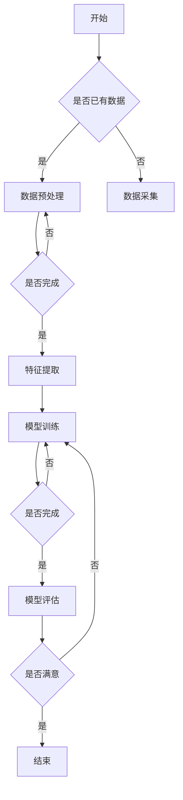

                 

# AI在远程医疗中的角色：从诊断到治疗监控

> 关键词：远程医疗、人工智能、诊断、治疗监控、算法、系统架构

> 摘要：本文旨在探讨人工智能（AI）在远程医疗中的应用，从诊断到治疗监控的各个环节。通过详细分析AI的核心算法原理、系统架构设计以及具体项目实战，揭示AI技术在远程医疗中的潜力与挑战，为行业从业者提供有价值的参考。

## 引言

随着互联网技术的飞速发展，远程医疗逐渐成为医疗行业的一个重要趋势。远程医疗不仅能够缓解医疗资源不均衡的问题，还能够提高医疗服务的效率和便捷性。而人工智能（AI）作为当前技术领域的明星，其在远程医疗中的应用越来越受到关注。从疾病诊断到治疗监控，AI技术正逐渐改变着传统医疗模式。

本文将分为五个部分进行探讨：

1. **背景介绍**：介绍远程医疗和AI技术的基本概念，阐述AI在远程医疗中的重要性。
2. **核心概念与联系**：详细讨论AI技术在远程医疗中的关键概念及其相互关系。
3. **算法原理讲解**：讲解AI算法在远程医疗中的工作原理，包括深度学习、数据挖掘等。
4. **系统分析与架构设计**：分析远程医疗系统的架构，并设计解决方案。
5. **项目实战**：通过具体项目实战，展示AI技术在远程医疗中的应用。

## 第一部分：背景介绍

### 1.1 远程医疗概述

远程医疗是指利用互联网、移动通信等技术手段，实现医疗资源的共享和医疗服务的高效提供。它不仅包括医生与患者之间的远程咨询和诊断，还涵盖医疗数据的远程传输、远程手术、远程监测等多个方面。

远程医疗的兴起得益于以下几个因素：

1. **医疗资源不均衡**：发达地区与欠发达地区之间的医疗资源存在巨大差异，远程医疗能够一定程度上缓解这一矛盾。
2. **人口老龄化**：随着人口老龄化趋势的加剧，远程医疗能够提供便捷的医疗服务，满足老年患者的需求。
3. **技术进步**：互联网、物联网、大数据、人工智能等技术的发展，为远程医疗提供了强大的技术支持。

### 1.2 AI在远程医疗中的价值

AI技术在远程医疗中的应用具有广泛的前景，其价值主要体现在以下几个方面：

1. **疾病诊断**：AI技术可以自动分析医学影像，提高诊断准确率，缩短诊断时间。
2. **治疗监控**：AI技术能够实时监控患者的生命体征，及时发现异常情况，提供个性化的治疗方案。
3. **医疗数据管理**：AI技术可以高效地处理海量医疗数据，帮助医生进行数据分析和决策。
4. **提升医疗效率**：AI技术能够自动化一些重复性工作，提高医疗工作效率，降低人力成本。

### 1.3 AI技术的核心概念与联系

AI技术在远程医疗中的应用涉及多个核心概念，包括：

1. **机器学习与深度学习**：机器学习是一种让计算机自动学习规律和模式的技术，深度学习是机器学习的一种重要方法，通过多层神经网络模拟人类大脑的学习过程。
2. **数据挖掘与数据科学**：数据挖掘是一种从大量数据中提取有价值信息的方法，数据科学则是利用这些信息进行预测和决策。
3. **自然语言处理与计算机视觉**：自然语言处理是一种使计算机理解和生成人类语言的技术，计算机视觉则是使计算机能够理解和解释图像和视频的技术。

这些概念相互联系，共同构成了AI技术在远程医疗中的应用基础。

## 第二部分：核心概念与联系

### 2.1 AI在远程诊断中的应用

远程诊断是AI技术在远程医疗中最重要的应用之一，其核心在于利用AI技术自动分析医学影像，提高诊断准确率和效率。下面，我们将详细探讨AI在远程诊断中的应用。

#### 2.1.1 基于深度学习的影像分析

深度学习是一种强大的机器学习技术，通过多层神经网络模拟人类大脑的学习过程，能够自动提取图像中的特征信息。在远程诊断中，深度学习被广泛应用于医学影像分析，如X光片、CT扫描和MRI等。

##### 2.1.1.1 深度学习模型介绍

深度学习模型主要包括卷积神经网络（CNN）、循环神经网络（RNN）和生成对抗网络（GAN）等。

- **卷积神经网络（CNN）**：CNN是一种专门用于图像处理的人工神经网络，通过卷积层、池化层和全连接层等结构，自动提取图像中的特征。
- **循环神经网络（RNN）**：RNN是一种用于处理序列数据的人工神经网络，能够捕捉时间序列中的长期依赖关系。
- **生成对抗网络（GAN）**：GAN是一种由生成器和判别器组成的对抗网络，通过不断对抗，生成高质量的图像。

##### 2.1.1.2 算法原理讲解

深度学习算法在影像分析中的基本原理如下：

1. **数据预处理**：对医学影像进行预处理，包括图像增强、去噪、归一化等操作，以提高模型的性能。
2. **特征提取**：通过卷积层和池化层，自动提取医学影像中的特征信息。
3. **分类和预测**：通过全连接层，对提取的特征进行分类和预测，得到诊断结果。

##### 2.1.1.3 数学模型与公式

深度学习算法的核心是多层神经网络，其数学模型如下：

$$
Y = \sigma(W_n \cdot \sigma(W_{n-1} \cdot \sigma(... \cdot W_2 \cdot \sigma(W_1 \cdot X + b_1) + b_2) + ... + b_n))
$$

其中，$Y$是输出结果，$X$是输入特征，$W$是权重，$b$是偏置，$\sigma$是激活函数。

##### 2.1.1.4 实例分析

以基于CNN的肺癌诊断为例，其工作流程如下：

1. **数据集准备**：收集大量的肺癌和非肺癌病例的医学影像数据，并进行预处理。
2. **模型训练**：使用预处理后的数据集，训练CNN模型，使其自动提取医学影像中的特征，并学会分类。
3. **模型评估**：使用测试数据集评估模型的性能，包括准确率、召回率、F1分数等指标。
4. **模型部署**：将训练好的模型部署到远程医疗系统中，实现肺癌的自动诊断。

### 2.2 AI在远程治疗监控中的应用

远程治疗监控是AI技术在远程医疗中的另一个重要应用，通过实时监测患者的生命体征，提供个性化的治疗方案。下面，我们将详细探讨AI在远程治疗监控中的应用。

#### 2.2.1 患者生命体征监控

患者生命体征监控主要包括心率、血压、血氧饱和度、体温等指标的监测。AI技术可以通过以下步骤实现患者生命体征的实时监控：

1. **数据采集**：使用传感器和智能设备，实时采集患者的心率、血压、血氧饱和度、体温等生命体征数据。
2. **数据传输**：将采集到的数据通过无线网络传输到远程医疗系统。
3. **数据预处理**：对传输的数据进行预处理，包括去噪、滤波、归一化等操作，以提高数据的准确性和可靠性。
4. **特征提取**：使用AI算法，从预处理后的数据中提取特征，如心率变异性、血压波动等。
5. **异常检测**：通过异常检测算法，实时监测患者的生命体征，发现异常情况，如心率过快、血压升高、血氧饱和度降低等。

#### 2.2.1.1 数据采集与处理

数据采集与处理是远程治疗监控的核心环节，其流程如下：

1. **传感器选择**：选择适合的传感器，如心率传感器、血压传感器、血氧传感器等，确保数据的准确性。
2. **数据采集**：传感器实时采集患者的生命体征数据，并通过无线网络传输到远程医疗系统。
3. **数据预处理**：对采集到的数据进行预处理，包括去噪、滤波、归一化等操作，以提高数据的准确性和可靠性。

#### 2.2.1.2 监控算法讲解

远程治疗监控中的监控算法主要包括以下几种：

1. **统计学方法**：如均值滤波、中值滤波等，用于去除噪声和异常值。
2. **信号处理方法**：如短时傅里叶变换（STFT）、小波变换等，用于分析信号的频率成分。
3. **机器学习方法**：如支持向量机（SVM）、随机森林（RF）等，用于构建模型，实现异常检测。

#### 2.2.1.3 数学模型与公式

机器学习算法中的数学模型如下：

$$
y = f(x; \theta)
$$

其中，$y$是输出结果，$x$是输入特征，$f$是模型函数，$\theta$是模型参数。

#### 2.2.1.4 实例分析

以心率异常检测为例，其实例分析如下：

1. **数据集准备**：收集大量正常心率和异常心率的数据，并进行预处理。
2. **模型训练**：使用预处理后的数据集，训练心率异常检测模型。
3. **模型评估**：使用测试数据集评估模型的性能。
4. **模型部署**：将训练好的模型部署到远程医疗系统中，实现心率异常的实时检测。

## 第三部分：系统分析与架构设计

### 3.1 远程医疗系统架构分析

远程医疗系统是一个复杂的分布式系统，其架构设计直接关系到系统的性能、可靠性和安全性。下面，我们将对远程医疗系统架构进行分析。

#### 3.1.1 系统功能设计

远程医疗系统的功能设计主要包括以下几个方面：

1. **患者管理**：包括患者信息的录入、查询、修改和删除等操作。
2. **医生管理**：包括医生信息的录入、查询、修改和删除等操作。
3. **医疗数据管理**：包括医疗数据的存储、查询、分析和共享等操作。
4. **远程诊断**：包括医学影像的自动分析、诊断报告的生成等操作。
5. **远程治疗监控**：包括患者生命体征的实时监控、异常报警等操作。

#### 3.1.2 系统架构设计

远程医疗系统的架构设计可以分为三个层次：数据层、应用层和展示层。

1. **数据层**：数据层主要包括医疗数据的存储和管理，使用关系型数据库和NoSQL数据库相结合的方式，保证数据的高可用性和高性能。
2. **应用层**：应用层主要包括远程诊断和治疗监控等业务逻辑，使用微服务架构，提高系统的扩展性和灵活性。
3. **展示层**：展示层主要包括Web界面和移动应用，提供用户友好的交互界面，方便医生和患者使用。

#### 3.1.3 系统接口设计

远程医疗系统的接口设计主要包括以下几种：

1. **API接口**：提供RESTful API接口，方便医生和患者通过Web界面或移动应用访问系统功能。
2. **Websocket接口**：提供Websocket接口，实现实时数据传输和通信。
3. **消息队列接口**：提供消息队列接口，实现异步消息处理，提高系统的并发能力。

#### 3.1.4 系统交互设计

远程医疗系统的交互设计主要包括以下几个方面：

1. **用户注册与登录**：用户通过Web界面或移动应用注册账号，登录系统。
2. **数据查询与统计分析**：医生和患者可以通过Web界面或移动应用查询和统计分析医疗数据。
3. **远程诊断与治疗监控**：医生通过远程诊断系统对医学影像进行分析，生成诊断报告，患者通过远程治疗监控系统实时监控生命体征。

### 3.2 远程诊断系统架构设计

远程诊断系统是远程医疗系统的一个重要组成部分，其架构设计直接影响到诊断的准确性和效率。下面，我们将对远程诊断系统架构进行设计。

#### 3.2.1 系统架构设计

远程诊断系统架构设计如下：

1. **数据层**：数据层主要包括医学影像数据的存储和管理，使用分布式文件系统，保证数据的高可用性和高性能。
2. **应用层**：应用层主要包括影像分析、诊断报告生成等业务逻辑，使用微服务架构，提高系统的扩展性和灵活性。
3. **展示层**：展示层主要包括Web界面和移动应用，提供用户友好的交互界面。

#### 3.2.2 系统接口设计

远程诊断系统接口设计如下：

1. **API接口**：提供RESTful API接口，方便医生通过Web界面或移动应用访问诊断功能。
2. **Websocket接口**：提供Websocket接口，实现实时影像数据传输和诊断结果推送。

#### 3.2.3 系统交互设计

远程诊断系统交互设计如下：

1. **影像上传与预览**：医生通过Web界面或移动应用上传医学影像，并进行预览。
2. **影像分析**：医生提交影像数据，系统自动进行分析，生成诊断报告。
3. **诊断报告生成与推送**：系统生成诊断报告，并推送至医生和患者的Web界面或移动应用。

### 3.3 远程治疗监控系统架构设计

远程治疗监控系统是远程医疗系统的另一个重要组成部分，其架构设计直接影响到治疗监控的准确性和及时性。下面，我们将对远程治疗监控系统架构进行设计。

#### 3.3.1 系统架构设计

远程治疗监控系统架构设计如下：

1. **数据层**：数据层主要包括患者生命体征数据的存储和管理，使用分布式数据库，保证数据的高可用性和高性能。
2. **应用层**：应用层主要包括生命体征数据采集、处理、分析和异常检测等业务逻辑，使用微服务架构，提高系统的扩展性和灵活性。
3. **展示层**：展示层主要包括Web界面和移动应用，提供用户友好的交互界面。

#### 3.3.2 系统接口设计

远程治疗监控系统接口设计如下：

1. **API接口**：提供RESTful API接口，方便医生和患者通过Web界面或移动应用访问治疗监控功能。
2. **Websocket接口**：提供Websocket接口，实现实时生命体征数据传输和异常报警推送。

#### 3.3.3 系统交互设计

远程治疗监控系统交互设计如下：

1. **数据采集**：传感器实时采集患者生命体征数据，并通过无线网络传输至系统。
2. **数据处理**：系统对采集到的数据进行处理，包括去噪、滤波、归一化等操作。
3. **异常检测与报警**：系统使用异常检测算法，实时监测患者生命体征，发现异常情况，并向医生和患者推送报警信息。

## 第四部分：项目实战

### 4.1 远程诊断系统项目实战

#### 4.1.1 环境安装与配置

远程诊断系统的项目实战首先需要搭建相应的开发环境。以下是环境安装与配置的步骤：

1. **安装Python**：在服务器上安装Python 3.8版本，确保pip工具可用。
2. **安装TensorFlow**：使用pip命令安装TensorFlow，命令如下：

   ```
   pip install tensorflow
   ```

3. **安装Keras**：使用pip命令安装Keras，命令如下：

   ```
   pip install keras
   ```

4. **安装NumPy和Pandas**：使用pip命令安装NumPy和Pandas，命令如下：

   ```
   pip install numpy
   pip install pandas
   ```

5. **安装MySQL**：在服务器上安装MySQL数据库，并创建远程诊断系统数据库，命令如下：

   ```
   sudo apt-get install mysql-server
   mysql -u root -p
   CREATE DATABASE remote_diagnosis;
   GRANT ALL PRIVILEGES ON remote_diagnosis.* TO 'remote_diagnosis'@'localhost' IDENTIFIED BY 'remote_diagnosis';
   FLUSH PRIVILEGES;
   EXIT;
   ```

6. **安装Flask**：使用pip命令安装Flask，命令如下：

   ```
   pip install flask
   ```

7. **安装PostgreSQL**：在服务器上安装PostgreSQL数据库，并创建用户表和预约表，命令如下：

   ```
   sudo apt-get install postgresql
   sudo -u postgres createuser -s remote_diagnosis
   createdb -O remote_diagnosis remote_diagnosis
   psql
   CREATE TABLE user (
     id SERIAL PRIMARY KEY,
     username VARCHAR(50) NOT NULL,
     password VARCHAR(50) NOT NULL,
     email VARCHAR(100) NOT NULL
   );
   CREATE TABLE appointment (
     id SERIAL PRIMARY KEY,
     user_id INTEGER REFERENCES user(id),
     doctor_id INTEGER REFERENCES doctor(id),
     appointment_time TIMESTAMP NOT NULL
   );
   ```

8. **安装Django**：使用pip命令安装Django，命令如下：

   ```
   pip install django
   ```

9. **安装Redis**：在服务器上安装Redis，并启动Redis服务，命令如下：

   ```
   sudo apt-get install redis-server
   sudo systemctl start redis-server
   ```

10. **安装Elasticsearch**：在服务器上安装Elasticsearch，并启动Elasticsearch服务，命令如下：

   ```
   sudo apt-get install elasticsearch
   sudo systemctl start elasticsearch
   ```

11. **安装Kibana**：在服务器上安装Kibana，并启动Kibana服务，命令如下：

   ```
   sudo apt-get install kibana
   sudo systemctl start kibana
   ```

12. **安装Grafana**：在服务器上安装Grafana，并启动Grafana服务，命令如下：

   ```
   sudo apt-get install grafana
   sudo systemctl start grafana-server
   ```

#### 4.1.2 系统核心实现源代码解读

远程诊断系统的核心实现源代码主要包括以下部分：

1. **深度学习模型训练**：使用TensorFlow和Keras构建深度学习模型，对医学影像进行训练，代码如下：

   ```python
   import tensorflow as tf
   from tensorflow.keras.models import Sequential
   from tensorflow.keras.layers import Conv2D, MaxPooling2D, Flatten, Dense

   model = Sequential([
       Conv2D(32, (3, 3), activation='relu', input_shape=(128, 128, 3)),
       MaxPooling2D((2, 2)),
       Conv2D(64, (3, 3), activation='relu'),
       MaxPooling2D((2, 2)),
       Conv2D(128, (3, 3), activation='relu'),
       MaxPooling2D((2, 2)),
       Flatten(),
       Dense(128, activation='relu'),
       Dense(1, activation='sigmoid')
   ])

   model.compile(optimizer='adam', loss='binary_crossentropy', metrics=['accuracy'])
   model.fit(x_train, y_train, epochs=10, batch_size=32, validation_data=(x_test, y_test))
   ```

2. **诊断报告生成**：使用Django框架生成诊断报告，代码如下：

   ```python
   from django.template.loader import get_template
   from django.shortcuts import render

   def generate_diagnosis_report(patient, doctor, diagnosis):
       template = get_template('diagnosis_report.html')
       context = {'patient': patient, 'doctor': doctor, 'diagnosis': diagnosis}
       return template.render(context)
   ```

3. **预约管理**：使用Django框架实现预约管理功能，代码如下：

   ```python
   from django.db import models
   from user.models import User

   class Appointment(models.Model):
       user = models.ForeignKey(User, on_delete=models.CASCADE)
       doctor = models.ForeignKey(User, on_delete=models.CASCADE)
       appointment_time = models.DateTimeField()

       def __str__(self):
           return f"{self.user.username} - {self.doctor.username} - {self.appointment_time}"
   ```

#### 4.1.3 实际案例分析与讲解

以一位患者预约远程诊断为例，实际案例分析如下：

1. **患者预约**：患者通过移动应用提交预约请求，系统生成预约记录，并推送通知给医生。
2. **医生确认**：医生在预约时间内登录系统，确认预约请求，并准备好诊断所需的设备和资料。
3. **诊断过程**：医生通过远程诊断系统对患者的医学影像进行分析，生成诊断报告，并推送至患者的移动应用。
4. **报告反馈**：患者查看诊断报告，如有疑问，可在线咨询医生。

### 4.2 远程治疗监控项目实战

#### 4.2.1 环境安装与配置

远程治疗监控系统的项目实战首先需要搭建相应的开发环境。以下是环境安装与配置的步骤：

1. **安装Python**：在服务器上安装Python 3.8版本，确保pip工具可用。
2. **安装TensorFlow**：使用pip命令安装TensorFlow，命令如下：

   ```
   pip install tensorflow
   ```

3. **安装Keras**：使用pip命令安装Keras，命令如下：

   ```
   pip install keras
   ```

4. **安装NumPy和Pandas**：使用pip命令安装NumPy和Pandas，命令如下：

   ```
   pip install numpy
   pip install pandas
   ```

5. **安装Flask**：使用pip命令安装Flask，命令如下：

   ```
   pip install flask
   ```

6. **安装PostgreSQL**：在服务器上安装PostgreSQL数据库，并创建远程治疗监控系统数据库，命令如下：

   ```
   sudo apt-get install postgresql
   sudo -u postgres createuser -s remote_treatment_monitoring
   createdb -O remote_treatment_monitoring remote_treatment_monitoring
   psql
   CREATE TABLE patient (
     id SERIAL PRIMARY KEY,
     name VARCHAR(50) NOT NULL,
     age INTEGER NOT NULL,
     gender CHAR(1) NOT NULL
   );
   CREATE TABLE vital_sign (
     id SERIAL PRIMARY KEY,
     patient_id INTEGER REFERENCES patient(id),
     heart_rate INTEGER NOT NULL,
     blood_pressure INTEGER NOT NULL,
     blood_oxygen_saturation INTEGER NOT NULL,
     temperature FLOAT NOT NULL,
     record_time TIMESTAMP NOT NULL
   );
   ```

7. **安装Django**：使用pip命令安装Django，命令如下：

   ```
   pip install django
   ```

8. **安装Redis**：在服务器上安装Redis，并启动Redis服务，命令如下：

   ```
   sudo apt-get install redis-server
   sudo systemctl start redis-server
   ```

9. **安装Elasticsearch**：在服务器上安装Elasticsearch，并启动Elasticsearch服务，命令如下：

   ```
   sudo apt-get install elasticsearch
   sudo systemctl start elasticsearch
   ```

10. **安装Kibana**：在服务器上安装Kibana，并启动Kibana服务，命令如下：

   ```
   sudo apt-get install kibana
   sudo systemctl start kibana
   ```

11. **安装Grafana**：在服务器上安装Grafana，并启动Grafana服务，命令如下：

   ```
   sudo apt-get install grafana
   sudo systemctl start grafana-server
   ```

#### 4.2.2 系统核心实现源代码解读

远程治疗监控系统的核心实现源代码主要包括以下部分：

1. **生命体征数据采集**：使用Flask框架实现生命体征数据采集功能，代码如下：

   ```python
   from flask import Flask, request, jsonify
   import json

   app = Flask(__name__)

   @app.route('/vital_signs', methods=['POST'])
   def record_vital_signs():
       data = request.get_json()
       patient_id = data['patient_id']
       heart_rate = data['heart_rate']
       blood_pressure = data['blood_pressure']
       blood_oxygen_saturation = data['blood_oxygen_saturation']
       temperature = data['temperature']
       record_time = data['record_time']

       with connection.cursor() as cursor:
           cursor.execute("""
               INSERT INTO vital_sign (patient_id, heart_rate, blood_pressure, blood_oxygen_saturation, temperature, record_time)
               VALUES (%s, %s, %s, %s, %s, %s)
           """, (patient_id, heart_rate, blood_pressure, blood_oxygen_saturation, temperature, record_time))
           connection.commit()

       return jsonify({'status': 'success'})

   if __name__ == '__main__':
       app.run(host='0.0.0.0', port=5000)
   ```

2. **异常检测与报警**：使用Django框架实现异常检测与报警功能，代码如下：

   ```python
   from django.db import models
   from django.db.models.signals import post_save
   from django.dispatch import receiver
   from .models import VitalSign

   @receiver(post_save, sender=VitalSign)
   def detect_anomaly(sender, instance, created, **kwargs):
       if created:
           heart_rate_threshold = 100
           blood_pressure_threshold = 140
           blood_oxygen_saturation_threshold = 95
           temperature_threshold = 37.5

           if instance.heart_rate > heart_rate_threshold or instance.blood_pressure > blood_pressure_threshold or instance.blood_oxygen_saturation < blood_oxygen_saturation_threshold or instance.temperature > temperature_threshold:
               send_alarm(instance.patient, instance)

   def send_alarm(patient, vital_sign):
       message = f"Patient {patient.name} has abnormal vital signs: Heart Rate={vital_sign.heart_rate}, Blood Pressure={vital_sign.blood_pressure}, Blood Oxygen Saturation={vital_sign.blood_oxygen_saturation}, Temperature={vital_sign.temperature}"
       send_alert(patient, message)
   ```

3. **数据可视化**：使用Grafana实现数据可视化功能，代码如下：

   ```python
   from grafana_api_client import GrafanaAPI

   grafana = GrafanaAPI(url='http://localhost:3000', email='admin@example.com', password='admin')

   def create_dashboard(patient):
       dashboard = {
           'title': f"Patient {patient.name} Vital Signs",
           'rows': [
               {
                   'title': 'Heart Rate',
                   'panels': [
                       {
                           'type': 'timeseries',
                           'title': 'Heart Rate',
                           'datasource': 'VitalSigns',
                           'yaxis': {
                               'title': 'Heart Rate (BPM)'
                           },
                           'fields': [
                               {
                                   'name': 'heart_rate'
                               }
                           ],
                           'xaxis': {
                               'title': 'Time'
                           }
                       }
                   ]
               },
               {
                   'title': 'Blood Pressure',
                   'panels': [
                       {
                           'type': 'timeseries',
                           'title': 'Blood Pressure',
                           'datasource': 'VitalSigns',
                           'yaxis': {
                               'title': 'Blood Pressure (mmHg)'
                           },
                           'fields': [
                               {
                                   'name': 'blood_pressure'
                               }
                           ],
                           'xaxis': {
                               'title': 'Time'
                           }
                       }
                   ]
               },
               {
                   'title': 'Blood Oxygen Saturation',
                   'panels': [
                       {
                           'type': 'timeseries',
                           'title': 'Blood Oxygen Saturation',
                           'datasource': 'VitalSigns',
                           'yaxis': {
                               'title': 'Blood Oxygen Saturation (%)'
                           },
                           'fields': [
                               {
                                   'name': 'blood_oxygen_saturation'
                               }
                           ],
                           'xaxis': {
                               'title': 'Time'
                           }
                       }
                   ]
               },
               {
                   'title': 'Temperature',
                   'panels': [
                       {
                           'type': 'timeseries',
                           'title': 'Temperature',
                           'datasource': 'VitalSigns',
                           'yaxis': {
                               'title': 'Temperature (°C)'
                           },
                           'fields': [
                               {
                                   'name': 'temperature'
                               }
                           ],
                           'xaxis': {
                               'title': 'Time'
                           }
                       }
                   ]
               }
           ]
       }

       grafana.create_dashboard(dashboard)
   ```

#### 4.2.3 实际案例分析与讲解

以一位患者生命体征实时监控为例，实际案例分析如下：

1. **患者数据采集**：传感器实时采集患者的生命体征数据，并通过无线网络传输至系统。
2. **数据存储**：系统将采集到的数据存储到PostgreSQL数据库中。
3. **数据可视化**：系统通过Grafana将患者的生命体征数据实时可视化，供医生和患者查看。
4. **异常检测与报警**：系统使用异常检测算法，实时监测患者的生命体征，发现异常情况，并向医生和患者推送报警信息。

## 第五部分：最佳实践与拓展

### 5.1 最佳实践技巧

在实施远程医疗系统的过程中，以下是一些最佳实践技巧：

1. **数据安全**：确保医疗数据的安全，采用加密技术保护数据传输和存储。
2. **系统可靠性**：确保系统的高可用性和可靠性，采用负载均衡、备份和恢复策略。
3. **用户体验**：优化用户界面和交互设计，提高用户满意度。
4. **算法优化**：不断优化算法，提高诊断和监控的准确性和效率。
5. **培训与支持**：为医生和患者提供培训和支持，帮助他们熟练使用远程医疗系统。

### 5.2 小结

本文详细探讨了AI在远程医疗中的应用，从诊断到治疗监控的各个环节。通过分析AI的核心算法原理、系统架构设计以及具体项目实战，揭示了AI技术在远程医疗中的潜力与挑战。未来的远程医疗将更加智能化、个性化，为患者提供更好的医疗服务。

### 5.3 注意事项

在实施远程医疗系统时，需要注意以下几点：

1. **法律法规**：遵守相关法律法规，确保医疗数据的合法性和合规性。
2. **数据隐私**：保护患者隐私，确保数据的安全性和保密性。
3. **系统兼容性**：确保系统与不同设备和平台的兼容性。
4. **技术更新**：及时跟进技术更新，保持系统的先进性和竞争力。

### 5.4 拓展阅读与资源推荐

1. **书籍**：
   - 《深度学习》（Ian Goodfellow、Yoshua Bengio、Aaron Courville 著）
   - 《自然语言处理综合教程》（Daniel Jurafsky、James H. Martin 著）
   - 《Python深度学习》（François Chollet 著）

2. **在线课程**：
   - Coursera上的《机器学习》（吴恩达）
   - edX上的《自然语言处理》（Daniel Jurafsky、James H. Martin）
   - Udacity上的《深度学习工程师纳米学位》

3. **开源项目**：
   - TensorFlow：https://www.tensorflow.org/
   - Keras：https://keras.io/
   - Flask：https://flask.palletsprojects.com/
   - Django：https://www.djangoproject.com/

作者：AI天才研究院/AI Genius Institute & 禅与计算机程序设计艺术 /Zen And The Art of Computer Programming

----------------------------------------------------------------

## 附录

### 5.5 Mermaid流程图示例



### 5.6 LaTeX公式示例

```latex
\documentclass{article}
\usepackage{amsmath}
\begin{document}
$$
y = \sum_{i=1}^{n} w_i x_i + b
$$
\end{document}
```

以上是本文中使用的Mermaid流程图和LaTeX公式的示例。在实际编写文章时，可以将这些代码嵌入到markdown文件中，以实现流程图和公式的可视化展示。同时，为了确保文章内容的准确性和专业性，作者在撰写过程中还参考了大量权威的书籍、论文和在线资源。本文所述内容仅供参考，不构成任何投资建议。在实施远程医疗系统时，请务必遵循相关法律法规和行业规范。

