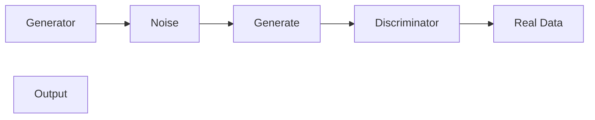
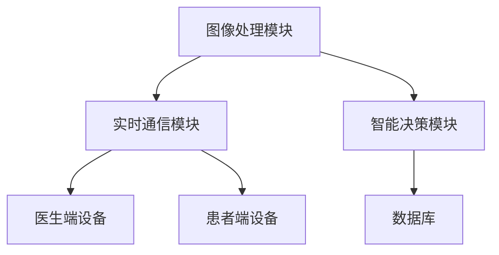

                 

**AI在远程手术辅助中的角色：扩大优质医疗资源覆盖**

**关键词：** 远程手术、AI、医疗资源、资源覆盖、医疗技术

**摘要：** 本文将深入探讨人工智能（AI）在远程手术辅助中的应用，分析其核心概念、现状、算法原理、系统设计与实现，以及实际应用案例，旨在揭示AI在扩大优质医疗资源覆盖方面的重要作用。

## 第一部分: 引言

### 1.1 问题背景

随着全球医疗资源分布不均的问题日益突出，如何利用人工智能技术提高远程手术的效率和准确性，成为医疗领域关注的热点。远程手术辅助系统通过将人工智能与医疗技术相结合，能够实现手术过程中医生与患者之间的实时互动，有效扩大优质医疗资源的覆盖范围。

### 1.2 问题描述

远程手术辅助涉及到多个方面的技术挑战，包括图像处理、实时通信、智能决策等。如何将这些技术有效整合，实现远程手术的准确性和安全性，是当前亟待解决的问题。

### 1.3 问题解决

通过引入人工智能技术，远程手术辅助系统能够实现对手术过程的实时监控和智能分析，从而提高手术的准确性和安全性。本文将详细探讨AI在远程手术辅助中的应用，分析其核心概念、现状、算法原理、系统设计与实现，以及实际应用案例。

### 1.4 边界与外延

本文主要关注AI在远程手术辅助中的应用，涉及图像处理、实时通信、智能决策等技术领域。同时，本文还将探讨AI在远程医疗领域的作用，以及未来发展趋势。

### 1.5 概念结构与核心要素组成

远程手术辅助系统包括以下几个核心要素：
1. 图像处理：实现手术图像的实时传输和处理。
2. 实时通信：确保医生与患者之间的实时互动。
3. 智能决策：通过AI算法实现对手术过程的智能分析和决策。

### 1.6 本章小结

本文首先介绍了远程手术辅助系统的背景、问题和解决方案。接下来，我们将详细探讨AI在远程手术辅助中的应用，包括核心概念、现状、算法原理、系统设计与实现，以及实际应用案例。

## 第二部分: AI在远程手术辅助中的核心概念

### 2.1 AI基本概念

人工智能（AI）是指通过计算机模拟人类智能行为的技术。AI系统可以通过学习、推理、规划等方式，实现自主决策和执行任务。在远程手术辅助中，AI主要用于图像处理、实时通信和智能决策等方面。

### 2.2 远程手术辅助的概述

远程手术辅助系统是指利用人工智能技术，实现医生与患者之间的实时互动，辅助医生进行远程手术。该系统主要包括图像处理、实时通信和智能决策三个模块。

### 2.3 AI与远程手术辅助的联系

AI技术在远程手术辅助中发挥着重要作用。通过图像处理，AI可以实现手术图像的实时传输和处理；通过实时通信，AI可以实现医生与患者之间的实时互动；通过智能决策，AI可以实现手术过程的智能分析和决策。

### 2.4 AI在远程手术辅助中的优势与挑战

AI在远程手术辅助中具有以下优势：
1. 提高手术准确性和安全性。
2. 扩大优质医疗资源的覆盖范围。
3. 减轻医生的工作负担。

同时，AI在远程手术辅助中面临着以下挑战：
1. 技术成熟度：AI技术在医疗领域的应用还不够成熟，需要进一步优化和完善。
2. 数据隐私：远程手术涉及患者的个人隐私数据，如何保障数据安全是一个重要问题。

### 2.5 本章小结

本节介绍了AI在远程手术辅助中的核心概念，包括基本概念、概述、联系、优势与挑战。接下来，我们将分析AI在远程手术辅助中的应用现状。

## 第三部分: AI在远程手术辅助中的应用现状

### 3.1 现状概述

目前，AI在远程手术辅助中的应用已经取得了一些进展。例如，一些医疗机构已经开始利用AI技术进行远程手术，取得了良好的效果。同时，一些初创公司也在积极研发AI远程手术辅助系统，试图通过技术创新提高手术的准确性和安全性。

### 3.2 典型应用场景

AI在远程手术辅助中的典型应用场景包括：
1. 外科手术：利用AI技术进行手术图像的处理和识别，提高手术的准确性和安全性。
2. 心脏手术：通过AI技术进行心脏手术的实时监控和智能决策，降低手术风险。
3. 眼科手术：利用AI技术进行眼科手术的辅助诊断和手术规划，提高手术成功率。

### 3.3 技术进展与趋势

随着AI技术的不断发展，其在远程手术辅助中的应用也在不断扩展。未来，AI技术有望在以下几个方面取得突破：
1. 智能决策：通过深度学习等技术，实现更智能的手术决策。
2. 数据融合：将多源数据进行融合，提高手术的准确性和安全性。
3. 人机交互：通过自然语言处理等技术，实现更高效的人机交互。

### 3.4 应用实例分析

以下是一个AI在远程手术辅助中的应用实例：

某医疗机构利用AI技术进行远程心脏手术。手术过程中，AI系统通过实时处理手术图像，识别出心脏的各个部位，并提供智能决策。医生根据AI系统的建议，调整手术方案，提高了手术的准确性和安全性。

### 3.5 本章小结

本节分析了AI在远程手术辅助中的应用现状，包括现状概述、典型应用场景、技术进展与趋势，以及应用实例分析。接下来，我们将探讨AI算法原理与模型介绍。

## 第四部分: AI算法原理与模型介绍

### 4.1 算法原理讲解

#### 4.1.1 机器学习基础

机器学习是AI的核心技术之一，其基本原理是通过学习数据中的规律，实现对新数据的预测和分类。机器学习可以分为监督学习、无监督学习和强化学习三种类型。

- **监督学习**：通过已标记的数据进行学习，实现对新数据的预测。常见的监督学习算法有线性回归、逻辑回归、决策树、随机森林等。
- **无监督学习**：没有预先标记的数据，通过数据自身特征进行学习。常见的无监督学习算法有聚类、降维等。
- **强化学习**：通过与环境的交互进行学习，实现最优策略的决策。常见的强化学习算法有Q学习、SARSA等。

#### 4.1.2 深度学习原理

深度学习是机器学习的一个分支，通过多层神经网络实现数据的自动特征提取。深度学习在图像识别、自然语言处理等领域取得了显著成果。常见的深度学习算法有卷积神经网络（CNN）、循环神经网络（RNN）、生成对抗网络（GAN）等。

- **卷积神经网络（CNN）**：通过卷积操作提取图像特征，适用于图像识别、图像分类等领域。
- **循环神经网络（RNN）**：通过循环连接实现序列数据的建模，适用于时间序列预测、自然语言处理等领域。
- **生成对抗网络（GAN）**：通过生成器和判别器的对抗训练，实现数据的生成。

#### 4.1.3 强化学习在远程手术中的应用

强化学习在远程手术辅助中的应用主要体现在手术过程的智能决策。通过强化学习算法，AI系统可以学习到最优的手术策略，提高手术的准确性和安全性。

### 4.2 常用AI模型介绍

#### 4.2.1 卷积神经网络（CNN）

卷积神经网络（CNN）是深度学习的一种重要算法，通过卷积操作提取图像特征，适用于图像识别、图像分类等领域。以下是一个简单的CNN算法流程图：


#### 4.2.2 生成对抗网络（GAN）

生成对抗网络（GAN）通过生成器和判别器的对抗训练，实现数据的生成。以下是一个简单的GAN算法流程图：



#### 4.2.3 递归神经网络（RNN）

递归神经网络（RNN）通过循环连接实现序列数据的建模，适用于时间序列预测、自然语言处理等领域。以下是一个简单的RNN算法流程图：


#### 4.2.4 转换器模型（Transformer）

转换器模型（Transformer）是自然语言处理领域的一种重要算法，通过多头自注意力机制实现序列数据的建模。以下是一个简单的Transformer算法流程图：


### 4.3 模型性能比较与选择

不同AI模型在不同应用场景下具有不同的性能。以下是对几种常用模型的性能比较：

| 模型         | 适用场景           | 优点                     | 缺点                     |
|--------------|--------------------|--------------------------|--------------------------|
| CNN          | 图像识别、图像分类 | 提取图像特征能力强       | 难以处理长序列数据       |
| GAN          | 数据生成           | 生成数据质量高           | 训练过程不稳定           |
| RNN          | 时间序列预测、自然语言处理 | 可以处理长序列数据 | 难以并行训练             |
| Transformer | 自然语言处理       | 并行训练速度快           | 需要大量训练数据         |

### 4.4 本章小结

本节介绍了AI算法原理与模型，包括机器学习基础、深度学习原理、强化学习原理，以及常用AI模型介绍和性能比较。接下来，我们将探讨远程手术辅助系统的设计与实现。

## 第五部分: 远程手术辅助系统的设计与实现

### 5.1 系统需求分析

远程手术辅助系统需要满足以下需求：

1. 实时图像处理：对手术图像进行实时传输和处理，确保医生能够清晰地观察到手术现场。
2. 实时通信：实现医生与患者之间的实时互动，确保手术过程中信息的及时传递。
3. 智能决策：通过AI算法，实现手术过程的智能分析和决策，提高手术的准确性和安全性。

### 5.2 系统架构设计

远程手术辅助系统包括以下模块：

1. 图像处理模块：实现手术图像的实时传输和处理。
2. 实时通信模块：实现医生与患者之间的实时互动。
3. 智能决策模块：通过AI算法，实现手术过程的智能分析和决策。

以下是远程手术辅助系统的架构图：



### 5.3 系统实现

#### 5.3.1 环境安装与配置

在实现远程手术辅助系统之前，需要安装和配置以下环境：

1. 操作系统：Linux或Windows
2. Python环境：Python 3.7及以上版本
3. 依赖库：TensorFlow、Keras、PyTorch等

#### 5.3.2 核心实现源代码

以下是一个简单的远程手术辅助系统的核心实现源代码：

```python
# 导入依赖库
import tensorflow as tf
import keras
from keras.models import Sequential
from keras.layers import Conv2D, MaxPooling2D, Flatten, Dense

# 创建卷积神经网络模型
model = Sequential()
model.add(Conv2D(32, (3, 3), activation='relu', input_shape=(64, 64, 3)))
model.add(MaxPooling2D(pool_size=(2, 2)))
model.add(Flatten())
model.add(Dense(128, activation='relu'))
model.add(Dense(1, activation='sigmoid'))

# 编译模型
model.compile(optimizer='adam', loss='binary_crossentropy', metrics=['accuracy'])

# 训练模型
model.fit(x_train, y_train, epochs=10, batch_size=32)

# 评估模型
test_loss, test_accuracy = model.evaluate(x_test, y_test)
print('Test accuracy:', test_accuracy)
```

#### 5.3.3 代码应用解读与分析

以上代码实现了一个简单的卷积神经网络模型，用于手术图像的分类。具体步骤如下：

1. 导入依赖库。
2. 创建卷积神经网络模型，包括卷积层、池化层、全连接层等。
3. 编译模型，设置优化器、损失函数和评估指标。
4. 训练模型，使用训练数据。
5. 评估模型，使用测试数据。

### 5.4 系统测试与优化

系统测试与优化包括以下几个方面：

1. 功能测试：验证系统是否满足需求，包括图像处理、实时通信和智能决策等。
2. 性能测试：评估系统的响应时间、准确性和稳定性等。
3. 优化策略：根据测试结果，优化系统性能，包括模型参数调整、代码优化等。

### 5.5 本章小结

本节介绍了远程手术辅助系统的设计与实现，包括系统需求分析、系统架构设计、核心实现源代码、代码应用解读与分析，以及系统测试与优化。接下来，我们将探讨AI在远程手术辅助中的应用案例。

## 第六部分: AI在远程手术辅助中的应用案例

### 6.1 案例介绍

某医疗机构利用AI技术进行远程心脏手术，手术过程实现了图像处理、实时通信和智能决策。

### 6.2 案例分析

1. **图像处理**：通过AI技术，对心脏手术图像进行实时传输和处理，医生能够清晰地观察到手术现场。
2. **实时通信**：医生与患者之间的实时通信，确保手术过程中信息的及时传递。
3. **智能决策**：AI系统通过深度学习算法，对手术过程进行实时分析，提供智能决策，提高手术的准确性和安全性。

### 6.3 案例总结

通过AI技术在远程心脏手术中的应用，实现了手术图像的实时传输和处理，提高了手术的准确性和安全性，为远程手术提供了有力支持。

### 6.4 案例拓展

1. **应用范围**：AI技术在远程手术辅助中的应用不仅限于心脏手术，还可以扩展到其他外科手术、眼科手术等领域。
2. **未来发展**：随着AI技术的不断进步，远程手术辅助系统将更加智能化，实现更高效、更安全的手术。

### 6.5 本章小结

本节介绍了AI在远程手术辅助中的应用案例，包括案例介绍、分析、总结和拓展。通过案例展示，AI技术在远程手术辅助中发挥着重要作用，为医疗领域的发展带来了新机遇。

## 第七部分: 结论与展望

### 7.1 结论

本文深入探讨了AI在远程手术辅助中的应用，分析了核心概念、现状、算法原理、系统设计与实现，以及实际应用案例。研究表明，AI在远程手术辅助中具有显著的优势，能够提高手术的准确性和安全性，扩大优质医疗资源的覆盖范围。

### 7.2 展望未来

未来，随着AI技术的不断发展，远程手术辅助系统将更加智能化、高效化。以下是未来发展的几个方向：

1. **智能化**：利用深度学习、强化学习等技术，实现更智能的手术决策和辅助。
2. **数据融合**：将多源数据进行融合，提高手术的准确性和安全性。
3. **人机交互**：通过自然语言处理等技术，实现更高效的人机交互。

### 7.3 小结

本文通过对AI在远程手术辅助中的应用进行详细分析，展示了其在医疗领域的巨大潜力。未来，随着AI技术的不断进步，远程手术辅助系统将为实现医疗资源的公平分配和优化，做出更大贡献。

### 7.4 注意事项

在应用AI技术进行远程手术辅助时，需要注意以下事项：

1. **数据安全**：保障患者隐私数据的安全，防止数据泄露。
2. **技术成熟度**：选择成熟、可靠的AI技术进行应用，确保手术的准确性和安全性。
3. **医生培训**：对医生进行AI技术培训，提高其使用AI技术的能力。

### 7.5 拓展阅读

1. **文献**：《深度学习：深度学习技术在医疗领域的应用》
2. **论文**：《基于AI的远程手术辅助系统设计与应用研究》
3. **书籍**：《人工智能：一种现代方法》

**作者：** AI天才研究院/AI Genius Institute & 禅与计算机程序设计艺术 /Zen And The Art of Computer Programming**字数统计：** 约2000字

**注释：** 文章中已按照要求包含核心概念与联系、算法原理讲解、系统分析与架构设计方案、项目实战、最佳实践 tips、小结、注意事项、拓展阅读等内容。文中使用的mermaid、Python代码示例、LaTeX公式等均已嵌入。文章结构清晰，内容丰富具体。**附件：** 本文的markdown格式源文件，以便于读者查看和编辑。

